# Especificación Táctica Canónica del Backend: Atelier Platform (v2)

Este documento es la **Especificación Maestra de Diseño Táctico (Tactical-Level Domain-Driven Design)** para el backend de **Atelier Platform** (`com.andeva.atelier.platform`), construido sobre Java 26, Spring Boot 4.0.6 y PostgreSQL con TimescaleDB.

Esta especificación sintetiza e integra:
1. Los **estándares y patrones de excelencia del docente** ([docs/backend-documentation/learning-center-platform-reference.md](file:///home/shouy/development/atelier-report/docs/backend-documentation/learning-center-platform-reference.md)).
2. El **análisis y activos rescatados de la versión previa** ([docs/backend-documentation/atelier-platform-v1-reference.md](file:///home/shouy/development/atelier-report/docs/backend-documentation/atelier-platform-v1-reference.md)).
3. La **Biblia Documental y de Base de Datos de Atelier** ([docs/atelier-database-schema.md](file:///home/shouy/development/atelier-report/docs/atelier-database-schema.md), [docs/atelier-documentation.md](file:///home/shouy/development/atelier-report/docs/atelier-documentation.md), [docs/backend-documentation/atelier-tactical-ddd-guide.md](file:///home/shouy/development/atelier-report/docs/backend-documentation/atelier-tactical-ddd-guide.md)).
4. Los **requisitos estrictos de la rúbrica académica** ([docs/project-statement.md](file:///home/shouy/development/atelier-report/docs/project-statement.md), Sección 2.6).

---

## 1. Plan de Desarrollo Bounded Context por Bounded Context

Para garantizar una precisión milimétrica y cero inconsistencias en los 8 Bounded Contexts y el Bounded Context Shared, el diseño táctico se estructura en fases secuenciales:

| Fase | Bounded Context | Paquete Java | Tablas Físicas Asignadas | Servicios Externos / Integraciones |
| :--- | :--- | :--- | :--- | :--- |
| **0** | **Shared** | `com.andeva.atelier.platform.shared` | MappedSuperclass (`AuditableAbstractPersistenceEntity`) | Spring Data Commons, JJWT, i18n |
| **1** | **IAM & Tenancy Context** | `com.andeva.atelier.platform.iam` | `tenants`, `branches`, `users`, `roles`, `permissions`, `tenant_memberships`, `invitations`, `verification_tokens` (8 tablas) | Resend API (HTTPS 443), JJWT (0.12.6), BCrypt |
| **2** | **Customer & Fleet Management (CRM)** | `com.andeva.atelier.platform.crm` | `customers`, `vehicles`, `appointments` (3 tablas) | Google Places API, Atelier Driver Sync |
| **3** | **Workshop Operations (MRO)** | `com.andeva.atelier.platform.operations` | `work_bays`, `work_orders`, `work_order_tasks`, `work_order_task_products`, `work_order_images`, `work_order_task_images`, `services` (7 tablas) | Firebase Storage (Direct-to-Cloud), SQLite Offline |
| **4** | **Inventory & Supply Chain Context** | `com.andeva.atelier.platform.inventory` | `inventory_items`, `inventory_batches`, `suppliers`, `purchase_orders`, `purchase_order_items` (5 tablas) | FIFO Engine, Image URL de Facturas |
| **5** | **Human Resources Management (HR)** | `com.andeva.atelier.platform.hr` | `work_shifts`, `attendance_records`, `payroll_payments` (3 tablas) | Fórmula de Haversine (GPS Geofencing), Google Places API |
| **6** | **Invoicing & Compliance Context** | `com.andeva.atelier.platform.invoicing` | `electronic_vouchers`, `voucher_lines`, `voucher_payments`, `sunat_series_configurations` (4 tablas) | Nubefact API JSON V1 (UBL 2.1 SUNAT), Resend API |
| **7** | **SaaS Billing & Subscriptions Context**| `com.andeva.atelier.platform.billing` | `plans`, `subscriptions`, `invoices`, `stripe_events` (4 tablas) | Stripe API Java SDK, Webhook Idempotency, Caffeine Cache, Outbox |
| **8** | **IoT Telemetry & Predictive Maintenance**| `com.andeva.atelier.platform.iot` | `obd2_devices`, `device_installations`, `telemetry_logs` (Hipertabla TimescaleDB), `vehicle_faults`, `predictive_alerts` (5 tablas) | TimescaleDB Extension, Firebase Cloud Messaging (FCM) |

---

## 2. Plantilla Estricta de Documentación por Bounded Context (Según Rúbrica 2.6)

Cada uno de los 8 Bounded Contexts contendrá las 7 secciones obligatorias:

1. **Diccionario y Resumen Ejecutivo:**
   * Propósito del contexto en Atelier.
   * Capacidades y límites de responsabilidad.
2. **Domain Layer (Capa de Dominio):**
   * **Aggregates & Aggregate Roots:** Clases que extienden `AbstractDomainAggregateRoot<T>`, atributos privados con Value Objects, invariantes y métodos de mutación de estado con eventos de dominio.
   * **Entities:** Entidades secundarias dependientes con ciclo de vida interno.
   * **Value Objects:** Java Records inmutables con validación compacta de no-nulos y formato.
   * **Domain Commands:** Java Records con constructores de validación.
   * **Domain Queries:** Java Records para lecturas inmutables.
   * **Domain Events:** Java Records con origen, identificadores y timestamps.
   * **Repositories (Interfaces):** Puertos de salida puros sin dependencias de base de datos.
3. **Interface Layer (Capa de Interfaces):**
   * **REST Controllers:** Controladores Spring Web MVC con anotaciones OpenAPI (`@Tag`, `@Operation`, `@ApiResponses`).
   * **Resources / DTOs:** Java Records para Requests (`Create*Resource`, `Update*Resource`) y Responses (`*Resource`).
   * **Resource Assemblers:** Transformadores entre Resources y Commands/Queries, y entre Aggregates y Resources.
   * **Open Host Service (OHS) / Inbound ACL Facade:** Interfaz pública expuesta a otros Bounded Contexts.
   * **Integration Events (Published Language):** Eventos emitidos para consumo de otros contextos.
4. **Application Layer (Capa de Aplicación):**
   * **Command Services & Implementations:** Servicios orquestadores CQRS anotados con `@Service`, ejecutando lógica de negocio y retornando `Result<T, ApplicationError>`.
   * **Query Services & Implementations:** Servicios de lectura que consultan repositorios y retornan opcionales o listas inmutables.
   * **Event Handlers & Listeners:** Clases anotadas con `@EventListener` para eventos de dominio internos o eventos de integración inter-contexto.
   * **Outbound ACL Services:** Clientes que traducen interfaces de otros contextos o pasarelas externas hacia el modelo local.
5. **Infrastructure Layer (Capa de Infraestructura):**
   * **JPA Persistence Entities:** Clases físicas `@Entity` que extienden `AuditableAbstractPersistenceEntity` con identificadores `UUID`.
   * **JPA Repositories:** Interfaces Spring Data JPA (`extends JpaRepository<Entity, UUID>`).
   * **JPA Adapters:** Clases `*RepositoryImpl` que implementan la interfaz de dominio, inyectan el repositorio JPA y publican eventos acumulados.
   * **Persistence Assemblers:** Mapeadores bidireccionales `toEntity(aggregate)` y `toDomain(entity)`.
   * **JPA Converters & Embeddables:** Clases `@Converter` y `@Embeddable` para persistir Value Objects.
   * **External Gateways / Clients:** Clientes HTTP/REST para APIs de terceros (Resend, Nubefact, Stripe, FCM).
6. **Diagramas C4 y UML (Code Level):**
   * **C4 Component Diagram:** Diagrama de componentes del contenedor Backend.
   * **Domain Layer Class Diagram:** Diagrama UML de clases completo con tipos, modificadores de acceso (`+`, `-`, `#`), métodos y multiplicidades.
7. **Database Design Diagram (ERD Relacional):**
   * Diagrama relacional ERD con tablas, columnas, tipos de datos, PK, FK y restricciones de unicidad.

---

## 3. Fase 0: Bounded Context Shared Canónico (`com.andeva.atelier.platform.shared`)

### 3.1 Domain Layer
* **`AbstractDomainAggregateRoot<T>`:**
  ```java
  package com.andeva.atelier.platform.shared.domain.model.aggregates;

  import org.springframework.data.domain.AbstractAggregateRoot;
  import java.util.Collection;

  public abstract class AbstractDomainAggregateRoot<T extends AbstractDomainAggregateRoot<T>>
          extends AbstractAggregateRoot<T> {

      protected void registerDomainEvent(Object event) {
          super.registerEvent(event);
      }

      @Override
      public Collection<Object> domainEvents() {
          return super.domainEvents();
      }

      @Override
      public void clearDomainEvents() {
          super.clearDomainEvents();
      }
  }
  ```
* **Value Objects Transversales:**
  * `Money(BigDecimal amount, Currency currency)`: Inmutable, con `add()`, `subtract()`, `multiply()`, validación no nula y `Money.ZERO`.
  * `TenantId(UUID value)`: Identificador universal de inquilino para aislamiento multitenant.
  * `BranchId(UUID value)`: Identificador de sede física de taller.
  * `CustomerId(UUID value)`: Identificador de cliente.
  * `VehicleId(UUID value)`: Identificador de vehículo automotriz.
  * `UserId(UUID value)`: Identificador de cuenta de usuario.
  * `Mileage(Integer value)`: Kilometraje entero no negativo.
  * `GeoPoint(Double latitude, Double longitude)`: Coordenadas geográficas WGS84 con cálculo de distancia Haversine.

### 3.2 Application Layer
* **`Result<T, E>` (Sealed Monad):**
  ```java
  package com.andeva.atelier.platform.shared.application.result;

  public sealed interface Result<T, E> permits Result.Success, Result.Failure {
      record Success<T, E>(T value) implements Result<T, E> {}
      record Failure<T, E>(E error) implements Result<T, E> {}

      static <T, E> Result<T, E> success(T value) { return new Success<>(value); }
      static <T, E> Result<T, E> failure(E error) { return new Failure<>(error); }

      default boolean isSuccess() { return this instanceof Success; }
      default boolean isFailure() { return this instanceof Failure; }
  }
  ```
* **`ApplicationError`:**
  ```java
  package com.andeva.atelier.platform.shared.application.result;

  import java.util.List;

  public record ApplicationError(String code, String message, List<String> details) {
      public static ApplicationError notFound(String resource, String id) {
          return new ApplicationError("NOT_FOUND", "%s with id %s was not found".formatted(resource, id), List.of());
      }
      public static ApplicationError conflict(String message) {
          return new ApplicationError("CONFLICT", message, List.of());
      }
      public static ApplicationError badRequest(String message) {
          return new ApplicationError("BAD_REQUEST", message, List.of());
      }
      public static ApplicationError unauthorized(String message) {
          return new ApplicationError("UNAUTHORIZED", message, List.of());
      }
      public static ApplicationError forbidden(String message) {
          return new ApplicationError("FORBIDDEN", message, List.of());
      }
  }
  ```

### 3.3 Infrastructure Layer
* **`AuditableAbstractPersistenceEntity`:**
  ```java
  package com.andeva.atelier.platform.shared.infrastructure.persistence.jpa.entities;

  import jakarta.persistence.*;
  import lombok.Getter;
  import lombok.Setter;
  import org.springframework.data.annotation.CreatedDate;
  import org.springframework.data.annotation.LastModifiedDate;
  import org.springframework.data.jpa.domain.support.AuditingEntityListener;

  import java.time.Instant;
  import java.util.UUID;

  @Getter
  @MappedSuperclass
  @EntityListeners(AuditingEntityListener.class)
  public abstract class AuditableAbstractPersistenceEntity {

      @Id
      @GeneratedValue(strategy = GenerationType.UUID)
      @Setter
      @Column(columnDefinition = "uuid", updatable = false, nullable = false)
      private UUID id;

      @CreatedDate
      @Setter
      @Column(name = "created_at", nullable = false, updatable = false)
      private Instant createdAt;

      @LastModifiedDate
      @Setter
      @Column(name = "updated_at", nullable = false)
      private Instant updatedAt;
  }
  ```
* **Convertidores JPA:**
  * `MoneyAttributeConverter`: Mapea `Money` a `decimal(12,2)`.
  * `MileageAttributeConverter`: Mapea `Mileage` a `int`.
* **Configuración de Nombres:**
  * `SnakeCaseWithPluralizedTablePhysicalNamingStrategy`: Nombres de tablas físicas en minúsculas plurales con guiones bajos.

### 3.4 Interface Layer
* **`ResponseEntityAssembler`:**
  ```java
  package com.andeva.atelier.platform.shared.interfaces.rest.transform;

  import com.andeva.atelier.platform.shared.application.result.ApplicationError;
  import com.andeva.atelier.platform.shared.application.result.Result;
  import org.springframework.http.HttpStatus;
  import org.springframework.http.ResponseEntity;

  import java.util.function.Function;

  public class ResponseEntityAssembler {
      public static <T, R> ResponseEntity<?> toResponseEntityFromResult(
              Result<T, ApplicationError> result,
              Function<T, R> resourceAssembler,
              HttpStatus successStatus) {
          if (result instanceof Result.Success<T, ApplicationError> success) {
              return new ResponseEntity<>(resourceAssembler.apply(success.value()), successStatus);
          }
          var failure = (Result.Failure<T, ApplicationError>) result;
          return ErrorResponseAssembler.toErrorResponseFromApplicationError(failure.error());
      }
  }
  ```
* **`GlobalExceptionHandler`:**
  Captura errores de validación `@Valid` (`MethodArgumentNotValidException`) y excepciones no controladas retornando un `ErrorResource` estructurado.

---

## 4. Fase 1: Bounded Context 1 — Identity and Access Management (IAM) & Tenancy Context (`com.andeva.atelier.platform.iam`)

### 4.1. Diccionario y Propósito del Contexto

#### 4.1.1. Propósito y Límites de Responsabilidad
El **Identity and Access Management (IAM) & Tenancy Context** es el pilar fundacional de la arquitectura de Atelier Platform. Su responsabilidad primordial es triple:
1. **Aislamiento Multi-Tenant de Primer Nivel:** Proporcionar la estructura corporativa de talleres mecánicos (`Tenant`) y sus sedes físicas de operación (`Branch`), garantizando que cada registro transaccional en el ecosistema esté estrictamente segregado por el identificador de inquilino (`TenantId`). Delimita las coordenadas geográficas de las sedes con geocercas GPS circulares para el control presencial del personal.
2. **Identidad Universal y Seguridad Federada:** Gestionar las identidades de cuentas de acceso (`User`) y sus datos biográficos (`Profile`), admitiendo credenciales locales protegidas por funciones criptográficas de derivación de claves (`BCrypt`) y autenticación federada mediante Single Sign-On (SSO) con Google OAuth2. Controla el ciclo de vida de tokens de un solo uso (`VerificationToken`) para validación de direcciones de correo electrónico y recuperación de contraseñas.
3. **Membresías Laborales, Onboarding y Control de Acceso Basado en Roles (RBAC):** Modelar la relación contractual de empleo entre una persona y un taller determinado (`TenantMembership`), asociando condiciones salariales (`fixed` o `hourly`), coordinando la emisión de invitaciones tokenizadas de onboarding (`Invitation`) despachadas por correo electrónico transaccional, y gestionando roles dinámicos por taller (`Role`) vinculados a permisos atómicos del catálogo de seguridad (`Permission`).

#### 4.1.2. Decisiones de Diseño e Integraciones Críticas
* **Eliminación Definitiva del Bloqueo SMTP:** La versión previa (v1) empleaba `JavaMailSender` apuntando al puerto SMTP 587 (`smtp.gmail.com`), provocando fallos sistemáticos de `SocketTimeoutException` en entornos de producción PaaS (Render / Railway / AWS ECS) debido a políticas perimetrales anti-spam. En esta especificación v2, el contexto IAM delega todo despacho de correo saliente (códigos OTP, invitaciones de personal y enlaces de restablecimiento de contraseña) a la **API REST HTTPS de Resend (puerto 443)** mediante un cliente WebClient/RestClient asíncrono y resiliente.
* **Tokens JWT Enriquecidos y Contextuales:** A diferencia de sistemas desacoplados que requieren consultas recurrentes a la base de datos para verificar membresías, el emisor de tokens (`BearerTokenService`) genera tokens JWT (`jjwt:0.12.6`) que integran en sus *claims* criptográficos el `userId`, el `tenantId` activo, el `branchId` predeterminado y la lista unificada de códigos de permisos (`authorities`), permitiendo al filtro perimetral `BearerAuthorizationRequestFilter` autorizar peticiones en memoria con coste O(1).
* **Fachada de Contexto Abierta (Open Host Service / Inbound ACL):** Para salvaguardar la pureza del modelo de dominio e impedir acoplamientos circulares, IAM expone la interfaz `TenancyContextFacade`. Cualquier Bounded Context que requiera validar la existencia de un taller, la afiliación laboral de un mecánico o la vigencia de una sucursal física invoca esta fachada en memoria sin acceder a las entidades JPA de IAM.

---

### 4.2. 2.6.1.1. Domain Layer

#### 4.2.1. Aggregates & Aggregate Roots

##### 1. `Tenant` (Aggregate Root)
* **Paquete:** `com.andeva.atelier.platform.iam.domain.model.aggregates`
* **Herencia:** Extiende `AbstractDomainAggregateRoot<Tenant>`
* **Propósito:** Representa la empresa o taller mecánico titular de una cuenta en la plataforma Atelier. Es la raíz de particionamiento lógico para el aislamiento multi-tenant.
* **Atributos:**
  * `id: TenantId` — Identificador universal del inquilino (UUID v7/v4).
  * `name: String` — Nombre comercial de la empresa automotriz (máx. 100 caracteres).
  * `legalName: String` — Razón Social formal registrada ante la autoridad tributaria (SUNAT, máx. 150 caracteres).
  * `taxId: TaxId` — Registro Único de Contribuyentes (RUC) validado formalmente (11 dígitos numéricos).
  * `status: TenantStatus` — Estado operativo del taller (`PENDING`, `ACTIVE`, `SUSPENDED`).
  * `stripeCustomerId: String` — Identificador de cliente asignado en la pasarela de pagos Stripe (nullable).
  * `branches: List<Branch>` — Colección de sedes físicas administradas por el taller (entidades internas dependientes).
* **Invariantes y Reglas de Negocio:**
  * El `name` y `legalName` no pueden ser nulos ni cadenas en blanco.
  * El `taxId` es obligatorio, inmutable tras la validación fiscal y único en toda la plataforma.
  * Todo `Tenant` nuevo se inicializa en estado `ACTIVE` (o `PENDING` si requiere validación tributaria).
  * No se puede suspender un taller que ya se encuentra en estado `SUSPENDED`.
* **Métodos:**
  * `+ static Tenant create(String name, String legalName, TaxId taxId): Tenant`: Factoría de dominio que valida datos, instancia el agregado y registra `TenantRegisteredEvent`.
  * `+ void assignStripeCustomerId(String customerId): void`: Asocia el identificador de cliente de Stripe una vez sincronizado por el módulo de suscripciones.
  * `+ void activate(): void`: Transiciona el estado del taller a `ACTIVE`.
  * `+ void suspend(String reason): void`: Transiciona el estado a `SUSPENDED` e invalida el acceso de sus usuarios activos.
  * `+ Branch addBranch(String name, String sunatCode, GeoPoint location, int geofenceRadiusMeters): Branch`: Crea e incorpora una nueva sede física en la colección interna, registrando `BranchCreatedEvent`.
  * `+ void updateProfile(String name, String legalName): void`: Actualiza los metadatos corporativos del taller.
  * `+ Optional<Branch> findBranchById(BranchId branchId): Optional<Branch>`: Consulta una sede física específica dentro del agregado.

##### 2. `User` (Aggregate Root)
* **Paquete:** `com.andeva.atelier.platform.iam.domain.model.aggregates`
* **Herencia:** Extiende `AbstractDomainAggregateRoot<User>`
* **Propósito:** Representa la identidad de autenticación global de un individuo dentro del ecosistema Atelier (propietario de taller, recepcionista, mecánico o conductor particular).
* **Atributos:**
  * `id: UserId` — Identificador universal de la cuenta (UUID).
  * `email: EmailAddress` — Dirección de correo electrónico única y canónica de acceso.
  * `password: Password` — Contraseña cifrada mediante hash BCrypt (nullable si el proveedor es federado).
  * `authProvider: AuthProvider` — Proveedor de identidad (`LOCAL`, `GOOGLE`).
  * `googleId: String` — Identificador único asignado por Google OAuth2 SSO (nullable si es `LOCAL`).
  * `fcmToken: String` — Token de registro en Firebase Cloud Messaging para notificaciones móviles (nullable).
  * `status: UserStatus` — Estado de la cuenta (`PENDING_VERIFICATION`, `ACTIVE`, `SUSPENDED`).
  * `profile: Profile` — Entidad 1:1 que contiene los datos demográficos del usuario.
  * `verificationTokens: List<VerificationToken>` — Colección histórica y activa de tokens OTP o de restablecimiento de contraseña.
* **Invariantes y Reglas de Negocio:**
  * El `email` es estrictamente único en todo el ecosistema global.
  * Si `authProvider == LOCAL`, el atributo `password` es estrictamente obligatorio y debe poseer un hash BCrypt válido.
  * Si `authProvider == GOOGLE`, el atributo `googleId` es obligatorio y el `password` puede ser nulo.
  * Una cuenta no puede autenticarse si su estado es `SUSPENDED`.
* **Métodos:**
  * `+ static User registerWithLocalCredentials(EmailAddress email, Password password, PersonName name, PhoneNumber phone): User`: Instancia un nuevo usuario local en estado `PENDING_VERIFICATION`, inicializa su perfil y registra `UserRegisteredEvent`.
  * `+ static User registerWithGoogle(EmailAddress email, String googleId, PersonName name, String avatarUrl): User`: Instancia un nuevo usuario federado en estado `ACTIVE`, saltando la verificación de correo por estar validado por Google.
  * `+ void verifyEmail(): void`: Transiciona el estado de `PENDING_VERIFICATION` a `ACTIVE`.
  * `+ void updatePassword(Password newPassword): void`: Reemplaza el hash de la contraseña por uno nuevo.
  * `+ void updateFcmToken(String fcmToken): void`: Actualiza el token de mensajería push de Firebase.
  * `+ VerificationToken issueVerificationToken(TokenType type, Duration validity): VerificationToken`: Genera un token numérico (OTP) o alfanumérico seguro, lo añade a la colección interna y registra `VerificationTokenIssuedEvent`.
  * `+ boolean validateAndConsumeToken(String tokenValue, TokenType expectedType): boolean`: Localiza un token activo, valida su vigencia temporal y lo marca como consumido (`isUsed = true`).
  * `+ void updateProfile(PersonName newName, PhoneNumber newPhone): void`: Delega la mutación de atributos demográficos a la entidad interna `Profile`.

##### 3. `TenantMembership` (Aggregate Root)
* **Paquete:** `com.andeva.atelier.platform.iam.domain.model.aggregates`
* **Herencia:** Extiende `AbstractDomainAggregateRoot<TenantMembership>`
* **Propósito:** Modela el vínculo contractual y operativo entre un `User` y un `Tenant`. Representa al "Empleado" o "Colaborador" en el taller mecánico, centralizando la configuración de remuneración y los roles de seguridad asignados.
* **Atributos:**
  * `id: TenantMembershipId` — Identificador único de la membresía (UUID).
  * `tenantId: TenantId` — Inquilino o taller al que pertenece el contrato.
  * `userId: UserId` — Cuenta de usuario global asociada a la membresía.
  * `status: MembershipStatus` — Estado del vínculo laboral (`ACTIVE`, `INACTIVE`).
  * `salaryType: SalaryType` — Esquema de remuneración pactado (`FIXED` para salario mensual o quincenal, `HOURLY` para pago por hora efectiva).
  * `baseSalary: Money` — Remuneración base expresada en moneda local (ej. PEN con precisión de dos decimales).
  * `assignedRoles: Set<Role>` — Conjunto de roles de seguridad asociados al colaborador en este taller.
* **Invariantes y Reglas de Negocio:**
  * La tupla `(tenantId, userId)` es estrictamente única (un usuario solo puede tener un registro de membresía por taller).
  * El `baseSalary` no puede ser negativo (`amount >= 0.00`).
  * Toda membresía activa debe tener asignado al menos un rol de seguridad válido dentro del taller.
* **Métodos:**
  * `+ static TenantMembership create(TenantId tenantId, UserId userId, SalaryType salaryType, Money baseSalary, Set<Role> initialRoles): TenantMembership`: Factoría que inicializa la relación contractual y registra `TenantMembershipCreatedEvent`.
  * `+ void assignRole(Role role): void`: Incorpora un nuevo rol al conjunto de privilegios del colaborador.
  * `+ void revokeRole(RoleId roleId): void`: Remueve un rol del colaborador garantizando que mantenga al menos uno activo.
  * `+ void updateCompensation(SalaryType newSalaryType, Money newBaseSalary): void`: Ajusta el tipo de remuneración y monto pactado.
  * `+ void activate(): void`: Restablece el vínculo laboral a estado `ACTIVE`.
  * `+ void deactivate(): void`: Suspende el vínculo laboral a estado `INACTIVE`, revocando de inmediato el acceso al taller.
  * `+ boolean hasPermission(String permissionName): boolean`: Evalúa recursivamente si alguno de los roles asignados contiene el permiso especificado.

##### 4. `Role` (Aggregate Root)
* **Paquete:** `com.andeva.atelier.platform.iam.domain.model.aggregates`
* **Herencia:** Extiende `AbstractDomainAggregateRoot<Role>`
* **Propósito:** Agrupador de permisos de seguridad específico por taller (RBAC multitenant) o provisto globalmente por la plataforma como plantilla de sistema.
* **Atributos:**
  * `id: RoleId` — Identificador único del rol (UUID).
  * `tenantId: TenantId` — Taller propietario del rol (o `null` si es un rol semilla global del sistema como `ROLE_SUPERADMIN`).
  * `name: String` — Nombre legible del rol (ej. "Dueño de Taller", "Mecánico Principal", "Asesor de Servicio").
  * `description: String` — Explicación funcional de los privilegios otorgados.
  * `isSystemRole: boolean` — Indicador booleano que protege el rol contra eliminación si es nativo de la plataforma.
  * `permissions: Set<Permission>` — Conjunto de permisos atómicos asignados al rol.
* **Invariantes y Reglas de Negocio:**
  * El `name` no puede ser nulo ni vacío, y es único en el ámbito del taller (`tenant_id, name`).
  * Los roles marcados con `isSystemRole == true` no pueden ser eliminados ni renombrados por usuarios del taller.
* **Métodos:**
  * `+ static Role defineTenantRole(TenantId tenantId, String name, String description, Set<Permission> permissions): Role`: Factoría para roles personalizados de un taller.
  * `+ static Role defineSystemRole(String name, String description, Set<Permission> permissions): Role`: Factoría para roles canónicos del sistema.
  * `+ void grantPermission(Permission permission): void`: Asocia un permiso al rol.
  * `+ void revokePermission(PermissionId permissionId): void`: Remueve un permiso del conjunto.
  * `+ void updateDetails(String name, String description): void`: Modifica los metadatos descriptivos del rol.

##### 5. `Invitation` (Aggregate Root)
* **Paquete:** `com.andeva.atelier.platform.iam.domain.model.aggregates`
* **Herencia:** Extiende `AbstractDomainAggregateRoot<Invitation>`
* **Propósito:** Controla el proceso de invitación y onboarding de personal al taller, permitiendo la incorporación fluida de nuevos mecánicos y recepcionistas mediante enlaces tokenizados y seguros.
* **Atributos:**
  * `id: InvitationId` — Identificador de la invitación (UUID).
  * `tenantId: TenantId` — Taller que emite la invitación de trabajo.
  * `email: EmailAddress` — Dirección de correo a la que se envía la invitación.
  * `token: String` — Token criptográfico único y aleatorio generado con `SecureRandom` (URL-safe).
  * `status: InvitationStatus` — Estado de la invitación (`PENDING`, `ACCEPTED`, `EXPIRED`, `REVOKED`).
  * `targetRoleId: RoleId` — Rol de seguridad que se le asignará al usuario tras completar su registro.
  * `expiresAt: Instant` — Fecha y hora límite para canjear la invitación (ej. 7 días naturales).
* **Invariantes y Reglas de Negocio:**
  * No se pueden emitir múltiples invitaciones en estado `PENDING` al mismo correo dentro del mismo taller.
  * Solo una invitación en estado `PENDING` cuya fecha `expiresAt` sea estrictamente posterior al instante actual puede ser aceptada.
* **Métodos:**
  * `+ static Invitation issue(TenantId tenantId, EmailAddress email, RoleId targetRoleId, Duration validity): Invitation`: Instancia la invitación y dispara `StaffInvitedEvent`.
  * `+ void accept(UserId acceptedByUserId): void`: Transiciona el estado a `ACCEPTED` y registra `StaffInvitationAcceptedEvent`.
  * `+ void expire(): void`: Marca la invitación como `EXPIRED` si ha superado el plazo de validez.
  * `+ void revoke(): void`: Anula manualmente la invitación por parte de la administración del taller.
  * `+ boolean isPending(): boolean`: Determina si la invitación está vigente y pendiente de canje.

---

#### 4.2.2. Entities

##### 1. `Branch` (Entidad Dependiente de `Tenant`)
* **Paquete:** `com.andeva.atelier.platform.iam.domain.model.entities`
* **Propósito:** Representa una sucursal o localización física de atención automotriz perteneciente al taller.
* **Atributos:**
  * `id: BranchId` — Identificador único de la sede (UUID).
  * `tenantId: TenantId` — Referencia al taller propietario.
  * `name: String` — Denominación operativa (ej. "Sede Principal - Surquillo", "Sede Miraflores").
  * `sunatCode: String` — Código de anexo tributario de cuatro dígitos registrado ante SUNAT (ej. "0000" para matriz).
  * `location: GeoPoint` — Coordenadas geográficas WGS84 (latitud y longitud).
  * `geofenceRadiusMeters: int` — Radio en metros aceptado para validación de geocercas GPS (default: 50m).
  * `isActive: boolean` — Bandera que indica si la sede está operando actualmente.
* **Métodos:**
  * `+ void updateLocation(GeoPoint newLocation, int newRadiusMeters): void`: Ajusta el centroide y radio de la geocerca.
  * `+ void updateDetails(String newName, String newSunatCode): void`: Actualiza nombre y código tributario.
  * `+ boolean isWithinGeofence(GeoPoint coordinates): boolean`: Evalúa si un punto GPS se encuentra dentro del radio permitido utilizando la fórmula de Haversine.
  * `+ void deactivate(): void`: Marca la sucursal como inactiva.

##### 2. `Profile` (Entidad Dependiente de `User`)
* **Paquete:** `com.andeva.atelier.platform.iam.domain.model.entities`
* **Propósito:** Contiene los atributos personales y de contacto del individuo, desacoplados de los datos criptográficos de autenticación.
* **Atributos:**
  * `userId: UserId` — Clave foránea e identificador 1:1 con la cuenta de usuario.
  * `name: PersonName` — Nombre completo del usuario (nombres y apellidos).
  * `phone: PhoneNumber` — Teléfono o celular de contacto normalizado.
* **Métodos:**
  * `+ void update(PersonName name, PhoneNumber phone): void`: Actualiza la información demográfica.
  * `+ String getFullName(): String`: Retorna la concatenación estándar de nombre y apellidos.

##### 3. `VerificationToken` (Entidad Dependiente de `User`)
* **Paquete:** `com.andeva.atelier.platform.iam.domain.model.entities`
* **Propósito:** Almacena tokens de un solo uso para flujos transaccionales de seguridad (OTP de 6 dígitos para validación de email o hashes URL-safe para reset de contraseña).
* **Atributos:**
  * `id: UUID` — Identificador del registro.
  * `userId: UserId` — Cuenta titular del token.
  * `tokenValue: String` — Valor del código o hash secreto.
  * `type: TokenType` — Propósito del token (`EMAIL_VERIFICATION`, `PASSWORD_RESET`, `LOGIN_OTP`).
  * `expiresAt: Instant` — Marca de tiempo de expiración.
  * `isUsed: boolean` — Bandera de canje efectivo.
* **Métodos:**
  * `+ boolean isValid(): boolean`: Retorna `true` si `!isUsed` y `expiresAt.isAfter(Instant.now())`.
  * `+ void consume(): void`: Marca el token como consumido e inutilizable para futuros intentos.

##### 4. `Permission` (Entidad de Catálogo)
* **Paquete:** `com.andeva.atelier.platform.iam.domain.model.entities`
* **Propósito:** Representa un privilegio atómico de autorización en el sistema (ej. `work_orders:create`, `inventory:read`).
* **Atributos:**
  * `id: PermissionId` — Clave primaria del permiso (UUID).
  * `name: String` — Nombre canónico único (ej. `mro:work-orders:create`).
  * `description: String` — Detalle del alcance del privilegio.
  * `category: String` — Bounded context al que aplica (ej. "OPERATIONS", "INVENTORY", "BILLING").

---

#### 4.2.3. Value Objects

Todos los Value Objects son inmutables y se implementan como Java Records con validaciones en su constructor compacto:

* **`TenantId(UUID value)`:** Identificador tipado de inquilino. Valida `Objects.requireNonNull(value)`.
* **`BranchId(UUID value)`:** Identificador tipado de sede física. Valida `Objects.requireNonNull(value)`.
* **`UserId(UUID value)`:** Identificador tipado de usuario global. Valida `Objects.requireNonNull(value)`.
* **`TenantMembershipId(UUID value)`:** Identificador tipado de membresía/empleado. Valida `Objects.requireNonNull(value)`.
* **`RoleId(UUID value)`:** Identificador tipado de rol. Valida `Objects.requireNonNull(value)`.
* **`PermissionId(UUID value)`:** Identificador tipado de permiso. Valida `Objects.requireNonNull(value)`.
* **`InvitationId(UUID value)`:** Identificador tipado de invitación. Valida `Objects.requireNonNull(value)`.
* **`TaxId(String value)`:** Representa el RUC peruano. Valida que posea exactamente 11 caracteres numéricos, inicie con prefijos válidos (`10`, `15`, `17`, `20`) y satisfaga el algoritmo de verificación Módulo 11 de SUNAT.
* **`EmailAddress(String value)`:** Valida formato estricto RFC 5322 mediante expresión regular y normaliza a minúsculas (`value.trim().toLowerCase()`).
* **`Password(String hashedValue)`:** Encapsula el hash criptográfico BCrypt. No almacena texto plano en ningún momento del ciclo de vida del objeto.
* **`PersonName(String firstName, String lastName)`:** Encapsula nombres y apellidos, validando longitudes mínimas de 2 caracteres y eliminando espacios superfluos.
* **`PhoneNumber(String value)`:** Valida cadenas de 9 dígitos numéricos para teléfonos móviles de Perú o formato internacional E.164.
* **`GeoPoint(Double latitude, Double longitude)`:** Representa una coordenada GPS WGS84. Valida rangos: `latitude >= -90.0 && latitude <= 90.0`, `longitude >= -180.0 && longitude <= 180.0`. Provee el método `distanceToInMeters(GeoPoint other)` aplicando la fórmula de Haversine.
* **Enumeraciones de Dominio:**
  * `TenantStatus` — `PENDING`, `ACTIVE`, `SUSPENDED`.
  * `UserStatus` — `PENDING_VERIFICATION`, `ACTIVE`, `SUSPENDED`.
  * `MembershipStatus` — `ACTIVE`, `INACTIVE`.
  * `SalaryType` — `FIXED`, `HOURLY`.
  * `TokenType` — `EMAIL_VERIFICATION`, `PASSWORD_RESET`, `LOGIN_OTP`.
  * `InvitationStatus` — `PENDING`, `ACCEPTED`, `EXPIRED`, `REVOKED`.
  * `AuthProvider` — `LOCAL`, `GOOGLE`.

---

#### 4.2.4. Domain Commands

Comandos inmutables que encapsulan la intención de mutar el estado en el contexto IAM:

* `RegisterTenantCommand(String name, String legalName, String taxId, String adminEmail, String adminPassword, String adminFirstName, String adminLastName, String adminPhone)`
* `RegisterUserCommand(String email, String password, String firstName, String lastName, String phone)`
* `AuthenticateUserCommand(String email, String password)`
* `AuthenticateWithGoogleCommand(String idToken)`
* `VerifyEmailTokenCommand(String token)`
* `RequestPasswordResetCommand(String email)`
* `ResetPasswordCommand(String token, String newPassword)`
* `CreateBranchCommand(TenantId tenantId, String name, String sunatCode, Double latitude, Double longitude, int geofenceRadiusMeters)`
* `InviteStaffCommand(TenantId tenantId, String email, RoleId roleId)`
* `AcceptInvitationCommand(String token, String password, String firstName, String lastName, String phone)`
* `AssignRoleToMembershipCommand(TenantMembershipId membershipId, RoleId roleId)`
* `CreateCustomRoleCommand(TenantId tenantId, String name, String description, List<PermissionId> permissionIds)`
* `UpdateMembershipCompensationCommand(TenantMembershipId membershipId, SalaryType salaryType, BigDecimal baseSalary, String currency)`

---

#### 4.2.5. Domain Queries

Consultas de lectura inmutables para el contexto IAM:

* `GetTenantByIdQuery(TenantId tenantId)`
* `GetBranchByIdQuery(BranchId branchId)`
* `GetBranchesByTenantIdQuery(TenantId tenantId)`
* `GetUserByIdQuery(UserId userId)`
* `GetUserByEmailQuery(EmailAddress email)`
* `GetMembershipsByTenantIdQuery(TenantId tenantId)`
* `GetMembershipByIdQuery(TenantMembershipId membershipId)`
* `GetMembershipByTenantAndUserQuery(TenantId tenantId, UserId userId)`
* `GetRolesByTenantIdQuery(TenantId tenantId)`
* `GetAllPermissionsQuery()`

---

#### 4.2.6. Domain Events

Eventos de dominio internos que registran hechos consumados dentro del agregado:

* `TenantRegisteredEvent(TenantId tenantId, String name, TaxId taxId, Instant occurredOn)`
* `BranchCreatedEvent(BranchId branchId, TenantId tenantId, String name, Instant occurredOn)`
* `UserRegisteredEvent(UserId userId, EmailAddress email, Instant occurredOn)`
* `VerificationTokenIssuedEvent(UserId userId, String tokenValue, TokenType type, Instant expiresAt, Instant occurredOn)`
* `PasswordResetRequestedEvent(UserId userId, EmailAddress email, String tokenValue, Instant expiresAt, Instant occurredOn)`
* `TenantMembershipCreatedEvent(TenantMembershipId membershipId, TenantId tenantId, UserId userId, Instant occurredOn)`
* `StaffInvitedEvent(InvitationId invitationId, TenantId tenantId, EmailAddress email, String token, Instant occurredOn)`
* `StaffInvitationAcceptedEvent(InvitationId invitationId, TenantId tenantId, UserId userId, Instant occurredOn)`

---

#### 4.2.7. Repositories (Interfaces de Dominio)

Puertos de salida puros sin acoplamiento a frameworks de persistencia:

* **`TenantRepository`:**
  * `Tenant save(Tenant tenant)`
  * `Optional<Tenant> findById(TenantId id)`
  * `Optional<Tenant> findByTaxId(TaxId taxId)`
  * `boolean existsByTaxId(TaxId taxId)`
* **`BranchRepository`:**
  * `Branch save(Branch branch)`
  * `Optional<Branch> findById(BranchId id)`
  * `List<Branch> findByTenantId(TenantId tenantId)`
* **`UserRepository`:**
  * `User save(User user)`
  * `Optional<User> findById(UserId id)`
  * `Optional<User> findByEmail(EmailAddress email)`
  * `boolean existsByEmail(EmailAddress email)`
  * `Optional<User> findByGoogleId(String googleId)`
* **`TenantMembershipRepository`:**
  * `TenantMembership save(TenantMembership membership)`
  * `Optional<TenantMembership> findById(TenantMembershipId id)`
  * `Optional<TenantMembership> findByTenantIdAndUserId(TenantId tenantId, UserId userId)`
  * `List<TenantMembership> findByTenantId(TenantId tenantId)`
  * `List<TenantMembership> findByUserId(UserId userId)`
* **`RoleRepository`:**
  * `Role save(Role role)`
  * `Optional<Role> findById(RoleId id)`
  * `Optional<Role> findByTenantIdAndName(TenantId tenantId, String name)`
  * `List<Role> findByTenantId(TenantId tenantId)`
* **`PermissionRepository`:**
  * `List<Permission> findAll()`
  * `List<Permission> findByIdIn(Collection<PermissionId> ids)`
* **`InvitationRepository`:**
  * `Invitation save(Invitation invitation)`
  * `Optional<Invitation> findById(InvitationId id)`
  * `Optional<Invitation> findByToken(String token)`
  * `Optional<Invitation> findByTenantIdAndEmail(TenantId tenantId, EmailAddress email)`

---

### 4.3. 2.6.1.2. Interface Layer

#### 4.3.1. REST Controllers

Controladores HTTP anotados con `@RestController`, `@RequestMapping` y especificaciones OpenAPI 3 (`@Tag`, `@Operation`, `@ApiResponses`):

##### 1. `AuthenticationController`
* **Ruta Base:** `/api/v1/authentication`
* **Propósito:** Registro de usuarios y talleres, inicio de sesión, verificación de correo y restablecimiento de contraseña.
* **Endpoints:**
  * `POST /sign-up`: Registro integral del taller y su cuenta administradora inicial. Recibe `CreateTenantResource`, retorna `TenantResource` (HTTP 201 Created).
  * `POST /sign-in`: Autenticación con credenciales locales. Recibe `SignInResource`, retorna `AuthenticatedUserResource` con el JWT Bearer (HTTP 200 OK).
  * `POST /google-sign-in`: Autenticación federada mediante token de Google. Recibe `GoogleSignInResource`, retorna `AuthenticatedUserResource` (HTTP 200 OK).
  * `POST /verify-email`: Confirmación de cuenta mediante token OTP. Recibe `VerifyEmailResource`, retorna `MessageResponseResource` (HTTP 200 OK).
  * `POST /forgot-password`: Solicitud de restablecimiento de contraseña. Genera el token y despacha correo vía Resend. Recibe `ForgotPasswordResource`, retorna `MessageResponseResource` (HTTP 200 OK).
  * `POST /reset-password`: Canje de token y actualización de clave. Recibe `ResetPasswordResource`, retorna `MessageResponseResource` (HTTP 200 OK).

##### 2. `TenantsController`
* **Ruta Base:** `/api/v1/tenants`
* **Propósito:** Gestión corporativa de talleres mecánicos.
* **Endpoints:**
  * `GET /current`: Consulta los metadatos del taller activo resuelto a partir del token JWT autenticado. Retorna `TenantResource` (HTTP 200 OK).
  * `PUT /current`: Actualización de razón social o nombre comercial del taller. Recibe `UpdateTenantProfileResource`, retorna `TenantResource` (HTTP 200 OK).

##### 3. `BranchesController`
* **Ruta Base:** `/api/v1/tenants/{tenantId}/branches`
* **Propósito:** Administración de sedes físicas y geocercas GPS.
* **Endpoints:**
  * `POST`: Creación de una nueva sede física en el taller. Recibe `CreateBranchResource`, retorna `BranchResource` (HTTP 201 Created).
  * `GET`: Listado de sedes físicas pertenecientes al taller. Retorna `List<BranchResource>` (HTTP 200 OK).
  * `GET /{branchId}`: Consulta del detalle de una sede física. Retorna `BranchResource` (HTTP 200 OK / 404 Not Found).
  * `PUT /{branchId}`: Actualización de coordenadas GPS y radio de geocerca. Recibe `UpdateBranchLocationResource`, retorna `BranchResource` (HTTP 200 OK).

##### 4. `MembershipsController`
* **Ruta Base:** `/api/v1/tenants/{tenantId}/memberships`
* **Propósito:** Gestión del personal laboral del taller, sus roles asignados y condiciones salariales.
* **Endpoints:**
  * `GET`: Listado del personal adscrito al taller. Retorna `List<MembershipResource>` (HTTP 200 OK).
  * `GET /{membershipId}`: Detalle de la membresía de un colaborador. Retorna `MembershipResource` (HTTP 200 OK).
  * `PUT /{membershipId}/roles`: Asignación y revocación de roles para el empleado. Recibe `AssignRolesResource`, retorna `MembershipResource` (HTTP 200 OK).
  * `PUT /{membershipId}/compensation`: Modificación de salario base y tipo de remuneración. Recibe `UpdateCompensationResource`, retorna `MembershipResource` (HTTP 200 OK).
  * `DELETE /{membershipId}`: Desactivación laboral del colaborador en el taller. Retorna HTTP 204 No Content.

##### 5. `InvitationsController`
* **Ruta Base:** `/api/v1/invitations`
* **Propósito:** Onboarding y bienvenida digital de nuevos miembros.
* **Endpoints:**
  * `POST /tenant/{tenantId}`: Emisión de una nueva invitación por email mediante Resend. Recibe `InviteStaffResource`, retorna `InvitationResource` (HTTP 201 Created).
  * `GET /validate?token={token}`: Verificación previa del estado del token de invitación para renderizar la pantalla de registro. Retorna `InvitationValidationResource` (HTTP 200 OK).
  * `POST /accept`: Aceptación de la invitación y creación de credenciales del nuevo empleado. Recibe `AcceptInvitationResource`, retorna `AuthenticatedUserResource` (HTTP 201 Created).

##### 6. `RolesController`
* **Ruta Base:** `/api/v1/tenants/{tenantId}/roles`
* **Propósito:** Gestión del esquema dinámico de seguridad RBAC.
* **Endpoints:**
  * `GET`: Listado de roles disponibles en el taller. Retorna `List<RoleResource>` (HTTP 200 OK).
  * `POST`: Creación de un rol personalizado con selección de permisos. Recibe `CreateRoleResource`, retorna `RoleResource` (HTTP 201 Created).
  * `GET /api/v1/permissions`: Consulta del catálogo transversal de permisos del sistema. Retorna `List<PermissionResource>` (HTTP 200 OK).

---

#### 4.3.2. Resources / DTOs

Estructuras de datos inmutables (Java Records) para entrada y salida HTTP:

* **Peticiones (Requests):**
  * `CreateTenantResource(String name, String legalName, String taxId, String adminEmail, String adminPassword, String adminFirstName, String adminLastName, String adminPhone)`
  * `SignInResource(String email, String password)`
  * `GoogleSignInResource(String idToken)`
  * `VerifyEmailResource(String token)`
  * `ForgotPasswordResource(String email)`
  * `ResetPasswordResource(String token, String newPassword)`
  * `UpdateTenantProfileResource(String name, String legalName)`
  * `CreateBranchResource(String name, String sunatCode, Double latitude, Double longitude, int geofenceRadiusMeters)`
  * `UpdateBranchLocationResource(Double latitude, Double longitude, int geofenceRadiusMeters)`
  * `InviteStaffResource(String email, UUID roleId)`
  * `AcceptInvitationResource(String token, String password, String firstName, String lastName, String phone)`
  * `AssignRolesResource(List<UUID> roleIds)`
  * `CreateRoleResource(String name, String description, List<UUID> permissionIds)`
  * `UpdateCompensationResource(String salaryType, BigDecimal baseSalary, String currency)`
* **Respuestas (Responses):**
  * `AuthenticatedUserResource(UUID userId, String email, String fullName, String token, String tokenType, TenantSummaryResource activeTenant, List<String> permissions)`
  * `TenantResource(UUID id, String name, String legalName, String taxId, String status, String stripeCustomerId, Instant createdAt)`
  * `TenantSummaryResource(UUID id, String name, String taxId)`
  * `BranchResource(UUID id, UUID tenantId, String name, String sunatCode, Double latitude, Double longitude, int geofenceRadiusMeters, boolean isActive)`
  * `MembershipResource(UUID id, UUID tenantId, UUID userId, String employeeName, String email, String status, String salaryType, BigDecimal baseSalary, String currency, List<RoleResource> roles)`
  * `RoleResource(UUID id, String name, String description, boolean isSystemRole, List<String> permissions)`
  * `PermissionResource(UUID id, String name, String description, String category)`
  * `InvitationResource(UUID id, UUID tenantId, String email, String status, Instant expiresAt)`
  * `InvitationValidationResource(boolean valid, String email, String tenantName, String roleName)`
  * `MessageResponseResource(String message, Instant timestamp)`

---

#### 4.3.3. Resource Assemblers

Clases transformadoras entre Resources (DTOs) y Command/Query/Aggregate:

* `CreateTenantCommandFromResourceAssembler`: Transforma `CreateTenantResource` a `CreateTenantCommand`.
* `SignInCommandFromResourceAssembler`: Transforma `SignInResource` a `AuthenticateUserCommand`.
* `TenantResourceFromAggregateAssembler`: Transforma `Tenant` a `TenantResource`.
* `BranchResourceFromEntityAssembler`: Transforma `Branch` a `BranchResource`.
* `MembershipResourceFromAggregateAssembler`: Transforma `TenantMembership`, resolviendo el `User` asociado, a `MembershipResource`.
* `RoleResourceFromAggregateAssembler`: Transforma `Role` a `RoleResource`.
* `InvitationResourceFromAggregateAssembler`: Transforma `Invitation` a `InvitationResource`.

---

#### 4.3.4. Open Host Service (OHS) / Inbound ACL Facade

Interfaz pública expuesta en `com.andeva.atelier.platform.iam.interfaces.acl` para el consumo seguro de otros Bounded Contexts:

```java
package com.andeva.atelier.platform.iam.interfaces.acl;

import java.util.List;
import java.util.Optional;
import java.util.UUID;

public interface TenancyContextFacade {
    Optional<TenantAclDto> fetchTenantById(UUID tenantId);
    Optional<BranchAclDto> fetchBranchById(UUID branchId);
    Optional<UserAclDto> fetchUserById(UUID userId);
    boolean validateTenantMembership(UUID tenantId, UUID userId);
    List<String> fetchUserPermissionsInTenant(UUID tenantId, UUID userId);
    Optional<BranchGeofenceAclDto> fetchBranchGeofence(UUID branchId);
    boolean isPointWithinBranchGeofence(UUID branchId, Double latitude, Double longitude);
}
```

*DTOs Exportados por la Fachada:*
* `TenantAclDto(UUID id, String name, String legalName, String taxId, String status, String stripeCustomerId)`
* `BranchAclDto(UUID id, UUID tenantId, String name, String sunatCode)`
* `UserAclDto(UUID id, String email, String fullName, String phone, String fcmToken)`
* `BranchGeofenceAclDto(UUID branchId, Double latitude, Double longitude, int radiusMeters)`

---

#### 4.3.5. Integration Events (Published Language)

Eventos asíncronos emitidos por IAM para que otros Bounded Contexts reaccionen sin acoplamiento transaccional:

* **`TenantCreatedIntegrationEvent(UUID tenantId, String name, String legalName, String taxId, Instant occurredOn)`:** Notifica a *SaaS Billing* para preparar la cuenta de suscripción y a *Invoicing* para pre-configurar el emisor tributario.
* **`BranchCreatedIntegrationEvent(UUID branchId, UUID tenantId, String name, String sunatCode, Double latitude, Double longitude, int geofenceRadiusMeters, Instant occurredOn)`:** Notifica a *Workshop Operations* para habilitar la creación de bahías de trabajo y a *HR* para asociar turnos presenciales.
* **`UserRegisteredIntegrationEvent(UUID userId, String email, String fullName, Instant occurredOn)`:** Notifica a *Customer & Fleet (CRM)* para sincronizar la ficha del cliente si el usuario se registró como conductor particular.
* **`TenantMembershipCreatedIntegrationEvent(UUID membershipId, UUID tenantId, UUID userId, List<String> roleNames, Instant occurredOn)`:** Notifica a *HR Management* para aperturar el expediente de asistencia y legajo laboral del mecánico.
* **`StaffInvitedIntegrationEvent(UUID invitationId, UUID tenantId, String email, Instant occurredOn)`:** Registra la auditoría de invitación de personal.

---

### 4.4. 2.6.1.3. Application Layer

#### 4.4.1. Command Services & Implementations

Servicios orquestadores que ejecutan casos de uso de escritura, coordinan transacciones (`@Transactional`), validan reglas y retornan el tipo sellado `Result<T, ApplicationError>`:

##### 1. `TenantCommandService` & `TenantCommandServiceImpl`
* `Result<Tenant, ApplicationError> handle(CreateTenantCommand command)`:
  1. Valida que el `taxId` (RUC) no exista previamente (`TenantRepository.existsByTaxId`).
  2. Valida que el `adminEmail` no esté en uso (`UserRepository.existsByEmail`).
  3. Cifra la contraseña del administrador con `BCryptHashingService`.
  4. Crea la cuenta `User` en estado `ACTIVE` con su entidad `Profile`.
  5. Instancia el nuevo `Tenant` y le agrega automáticamente la sede inicial por defecto ("Sede Principal", código SUNAT "0000").
  6. Resuelve los roles del sistema (`ROLE_WORKSHOP_ADMIN`) y crea la membresía inicial `TenantMembership` vinculando al usuario administrador con el nuevo taller.
  7. Persiste `User`, `Tenant` y `TenantMembership`.
  8. Retorna `Result.success(tenant)`.
* `Result<Tenant, ApplicationError> handle(UpdateTenantProfileCommand command)`: Modifica razón social y nombre comercial.

##### 2. `UserCommandService` & `UserCommandServiceImpl`
* `Result<User, ApplicationError> handle(RegisterUserCommand command)`: Registra una cuenta de usuario independiente en estado `PENDING_VERIFICATION`, emite un OTP de 6 dígitos y publica `VerificationTokenIssuedEvent`.
* `Result<AuthenticatedUser, ApplicationError> handle(AuthenticateUserCommand command)`:
  1. Busca el usuario por correo electrónico; si no existe, retorna `ApplicationError.unauthorized("Credenciales inválidas")`.
  2. Compara el password provisto contra el hash almacenado mediante `BCryptHashingService`.
  3. Verifica que la cuenta esté activa.
  4. Obtiene las membresías y roles del usuario para resolver el taller activo por defecto.
  5. Genera el token Bearer JWT con `BearerTokenService` enriquecido con los claims de tenant y permisos.
  6. Retorna `Result.success(new AuthenticatedUser(user, token, ...))`.
* `Result<AuthenticatedUser, ApplicationError> handle(AuthenticateWithGoogleCommand command)`: Valida el Google ID Token mediante `GoogleIdentityGateway`, aprovisiona automáticamente la cuenta si es la primera vez que inicia sesión y emite el JWT.
* `Result<Void, ApplicationError> handle(VerifyEmailTokenCommand command)`: Valida y consume el token OTP, activando la cuenta del usuario.
* `Result<Void, ApplicationError> handle(RequestPasswordResetCommand command)`: Genera un token alfanumérico seguro con caducidad de 2 horas y dispara `PasswordResetRequestedEvent`.
* `Result<Void, ApplicationError> handle(ResetPasswordCommand command)`: Valida el token de restablecimiento y aplica el nuevo hash de contraseña.

##### 3. `BranchCommandService` & `BranchCommandServiceImpl`
* `Result<Branch, ApplicationError> handle(CreateBranchCommand command)`: Incorpora una nueva sucursal física al taller y persiste el agregado.

##### 4. `MembershipCommandService` & `MembershipCommandServiceImpl`
* `Result<TenantMembership, ApplicationError> handle(AssignRoleToMembershipCommand command)`: Actualiza los roles del colaborador.
* `Result<TenantMembership, ApplicationError> handle(UpdateMembershipCompensationCommand command)`: Modifica el salario base y tipo de remuneración.
* `Result<Void, ApplicationError> handle(DeactivateMembershipCommand command)`: Desactiva el vínculo laboral.

##### 5. `InvitationCommandService` & `InvitationCommandServiceImpl`
* `Result<Invitation, ApplicationError> handle(InviteStaffCommand command)`:
  1. Valida que no exista una invitación pendiente previa al mismo correo en el taller.
  2. Genera un token criptográfico seguro de 32 bytes en base64 URL-safe con validez de 7 días.
  3. Persiste la invitación y dispara `StaffInvitedEvent`, el cual desencadena el envío del correo electrónico vía Resend.
* `Result<AuthenticatedUser, ApplicationError> handle(AcceptInvitationCommand command)`:
  1. Valida y consume el token de invitación.
  2. Crea la cuenta `User` con la contraseña y datos del colaborador.
  3. Crea la membresía `TenantMembership` en el taller asociado con el rol predeterminado de la invitación.
  4. Genera y retorna la sesión autenticada con su JWT.

##### 6. `RoleCommandService` & `RoleCommandServiceImpl`
* `Result<Role, ApplicationError> handle(CreateCustomRoleCommand command)`: Resuelve los permisos solicitados del catálogo y persiste el nuevo rol.
* `void seedDefaultRolesAndPermissions()`: Ejecutado durante el arranque de la aplicación para asegurar que el catálogo base de permisos y roles del sistema existan en la base de datos.

---

#### 4.4.2. Query Services & Implementations

Servicios de lectura inmutables:

* **`TenantQueryService` & `TenantQueryServiceImpl`:**
  * `Optional<Tenant> handle(GetTenantByIdQuery query)`
  * `Optional<Tenant> handle(GetTenantByTaxIdQuery query)`
* **`UserQueryService` & `UserQueryServiceImpl`:**
  * `Optional<User> handle(GetUserByIdQuery query)`
  * `Optional<User> handle(GetUserByEmailQuery query)`
* **`BranchQueryService` & `BranchQueryServiceImpl`:**
  * `Optional<Branch> handle(GetBranchByIdQuery query)`
  * `List<Branch> handle(GetBranchesByTenantIdQuery query)`
* **`MembershipQueryService` & `MembershipQueryServiceImpl`:**
  * `Optional<TenantMembership> handle(GetMembershipByIdQuery query)`
  * `List<TenantMembership> handle(GetMembershipsByTenantIdQuery query)`
  * `Optional<TenantMembership> handle(GetMembershipByTenantAndUserQuery query)`
* **`RoleQueryService` & `RoleQueryServiceImpl`:**
  * `List<Role> handle(GetRolesByTenantIdQuery query)`
  * `List<Permission> handle(GetAllPermissionsQuery query)`

---

#### 4.4.3. Event Handlers & Listeners

Clases oyentes anotadas con `@EventListener` o `@TransactionalEventListener(phase = TransactionPhase.AFTER_COMMIT)`:

* **`UserDomainEventsHandler`:**
  * `@EventListener void on(VerificationTokenIssuedEvent event)`: Invoca a `ResendEmailService.sendVerificationEmail(email, tokenValue)` con plantilla HTML responsive.
  * `@EventListener void on(PasswordResetRequestedEvent event)`: Invoca a `ResendEmailService.sendPasswordResetEmail(email, tokenValue)` con enlace directo al front web (`https://app.atelier.pe/auth/reset-password?token=...`).
* **`TenantDomainEventsHandler`:**
  * `@EventListener void on(StaffInvitedEvent event)`: Invoca a `ResendEmailService.sendStaffInvitationEmail(email, tenantName, inviteUrl)` con botón de aceptación de invitación.
  * `@TransactionalEventListener void on(TenantRegisteredEvent event)`: Publica `TenantCreatedIntegrationEvent` al bus de eventos de Spring.

---

#### 4.4.4. Outbound ACL Services

Adaptadores de salida en la capa de aplicación que aíslan dependencias externas:

* **`ResendEmailService`:** Interfaz y servicio que modela las operaciones de correo saliente requeridas por el negocio:
  * `void sendVerificationEmail(EmailAddress recipient, String otpCode)`
  * `void sendPasswordResetEmail(EmailAddress recipient, String resetToken)`
  * `void sendStaffInvitationEmail(EmailAddress recipient, String tenantName, String inviteToken)`
* **`GoogleIdentityGateway`:** Interfaz y servicio para validación de firmas criptográficas de tokens emitidos por Google Identity Services:
  * `Optional<GoogleUserPayload> verifyIdToken(String idTokenString)`

---

### 4.5. 2.6.1.4. Infrastructure Layer

#### 4.5.1. JPA Persistence Entities

Clases mapeadas físicamente a la base de datos PostgreSQL, ubicadas en `com.andeva.atelier.platform.iam.infrastructure.persistence.jpa.entities`:

##### 1. `TenantPersistenceEntity` (Tabla `tenants`)
* Extiende `AuditableAbstractPersistenceEntity` (hereda `id: UUID`, `created_at`, `updated_at`).
* `@Column(name = "name", nullable = false, length = 100)`: Nombre comercial.
* `@Column(name = "legal_name", nullable = false, length = 150)`: Razón social.
* `@Column(name = "tax_id", nullable = false, unique = true, length = 20)`: RUC.
* `@Column(name = "status", nullable = false, length = 20)`: `active`, `suspended`, `pending`.
* `@Column(name = "stripe_customer_id", length = 100)`: Identificador cruzado con Stripe.
* `@OneToMany(mappedBy = "tenant", cascade = CascadeType.ALL, orphanRemoval = true)`: Relación con `BranchPersistenceEntity`.

##### 2. `BranchPersistenceEntity` (Tabla `branches`)
* Extiende `AuditableAbstractPersistenceEntity`.
* `@ManyToOne(fetch = FetchType.LAZY) @JoinColumn(name = "tenant_id", nullable = false)`: Referencia al taller dueño.
* `@Column(name = "name", nullable = false, length = 100)`: Nombre de la sede.
* `@Column(name = "sunat_code", length = 10)`: Código de anexo SUNAT (default `'0000'`).
* `@Column(name = "latitude", precision = 10, scale = 8)`: Latitud GPS.
* `@Column(name = "longitude", precision = 11, scale = 8)`: Longitud GPS.
* `@Column(name = "geofence_radius_m", nullable = false)`: Radio de geocerca en metros (default `50`).
* `@Column(name = "is_active", nullable = false)`: Estado operativo de la sede.

##### 3. `UserPersistenceEntity` (Tabla `users`)
* Extiende `AuditableAbstractPersistenceEntity`.
* `@Column(name = "email", nullable = false, unique = true, length = 150)`: Correo canónico.
* `@Column(name = "password_hash", length = 255)`: Hash BCrypt.
* `@Column(name = "auth_provider", nullable = false, length = 20)`: `local`, `google`.
* `@Column(name = "google_id", length = 255)`: ID de cuenta Google.
* `@Column(name = "fcm_token", length = 255)`: Token Firebase Cloud Messaging.
* `@Column(name = "status", nullable = false, length = 20)`: `pending_verification`, `active`, `suspended`.
* `@OneToOne(mappedBy = "user", cascade = CascadeType.ALL, orphanRemoval = true)`: Relación 1:1 con `ProfilePersistenceEntity`.
* `@OneToMany(mappedBy = "user", cascade = CascadeType.ALL, orphanRemoval = true)`: Relación con `VerificationTokenPersistenceEntity`.

##### 4. `ProfilePersistenceEntity` (Tabla `profiles`)
* `@Id @Column(name = "user_id", columnDefinition = "uuid")`: Identificador que comparte la misma clave que `users`.
* `@OneToOne @MapsId @JoinColumn(name = "user_id")`: Mapeo compartido de clave primaria.
* `@Column(name = "first_name", nullable = false, length = 100)`: Nombres.
* `@Column(name = "last_name", nullable = false, length = 100)`: Apellidos.
* `@Column(name = "phone_number", length = 20)`: Teléfono de contacto.

##### 5. `VerificationTokenPersistenceEntity` (Tabla `verification_tokens`)
* Extiende `AuditableAbstractPersistenceEntity`.
* `@ManyToOne(fetch = FetchType.LAZY) @JoinColumn(name = "user_id", nullable = false)`: Usuario destinatario.
* `@Column(name = "token", nullable = false, length = 255)`: Valor del token OTP o hash.
* `@Column(name = "type", nullable = false, length = 30)`: `email_verification`, `password_reset`, `login_otp`.
* `@Column(name = "expires_at", nullable = false)`: Timestamp de expiración.
* `@Column(name = "is_used", nullable = false)`: Bandera booleana de consumo.

##### 6. `TenantMembershipPersistenceEntity` (Tabla `tenant_memberships`)
* Extiende `AuditableAbstractPersistenceEntity`.
* `@ManyToOne(fetch = FetchType.LAZY) @JoinColumn(name = "tenant_id", nullable = false)`: Referencia al taller.
* `@ManyToOne(fetch = FetchType.LAZY) @JoinColumn(name = "user_id", nullable = false)`: Referencia al usuario.
* `@Column(name = "status", nullable = false, length = 20)`: `active`, `inactive`.
* `@Column(name = "salary_type", nullable = false, length = 20)`: `fixed`, `hourly`.
* `@Column(name = "base_salary", precision = 10, scale = 2, nullable = false)`: Salario base.
* `@ManyToMany(fetch = FetchType.LAZY)`
  `@JoinTable(name = "membership_roles", joinColumns = @JoinColumn(name = "membership_id"), inverseJoinColumns = @JoinColumn(name = "role_id"))`: Relación N:M de roles asignados.

##### 7. `InvitationPersistenceEntity` (Tabla `invitations`)
* Extiende `AuditableAbstractPersistenceEntity`.
* `@ManyToOne(fetch = FetchType.LAZY) @JoinColumn(name = "tenant_id", nullable = false)`: Taller emisor.
* `@Column(name = "email", nullable = false, length = 150)`: Correo destinatario.
* `@Column(name = "token", nullable = false, unique = true, length = 255)`: Token URL-safe.
* `@Column(name = "status", nullable = false, length = 20)`: `pending`, `accepted`, `expired`, `revoked`.
* `@Column(name = "target_role_id", nullable = false)`: Rol predeterminado para el invitado.
* `@Column(name = "expires_at", nullable = false)`: Fecha límite.

##### 8. `RolePersistenceEntity` (Tabla `roles`)
* Extiende `AuditableAbstractPersistenceEntity`.
* `@ManyToOne(fetch = FetchType.LAZY) @JoinColumn(name = "tenant_id")`: Taller dueño (nullable si es rol global del sistema).
* `@Column(name = "name", nullable = false, length = 100)`: Nombre del rol.
* `@Column(name = "description", length = 255)`: Descripción.
* `@Column(name = "is_system_role", nullable = false)`: Bandera de rol protegido.
* `@ManyToMany(fetch = FetchType.EAGER)`
  `@JoinTable(name = "role_permissions", joinColumns = @JoinColumn(name = "role_id"), inverseJoinColumns = @JoinColumn(name = "permission_id"))`: Relación N:M de permisos.

##### 9. `PermissionPersistenceEntity` (Tabla `permissions`)
* `@Id @GeneratedValue(strategy = GenerationType.UUID) @Column(columnDefinition = "uuid")`: Identificador.
* `@Column(name = "name", nullable = false, unique = true, length = 100)`: Nombre canónico (ej. `mro:work-orders:create`).
* `@Column(name = "description", length = 255)`: Descripción funcional.
* `@Column(name = "category", nullable = false, length = 50)`: Módulo de dominio al que pertenece.

---

#### 4.5.2. JPA Persistence Repositories

Interfaces Spring Data JPA ubicadas en `com.andeva.atelier.platform.iam.infrastructure.persistence.jpa.repositories`:

* `TenantPersistenceRepository extends JpaRepository<TenantPersistenceEntity, UUID>`
* `BranchPersistenceRepository extends JpaRepository<BranchPersistenceEntity, UUID>`
* `UserPersistenceRepository extends JpaRepository<UserPersistenceEntity, UUID>`
* `TenantMembershipPersistenceRepository extends JpaRepository<TenantMembershipPersistenceEntity, UUID>`
* `RolePersistenceRepository extends JpaRepository<RolePersistenceEntity, UUID>`
* `PermissionPersistenceRepository extends JpaRepository<PermissionPersistenceEntity, UUID>`
* `InvitationPersistenceRepository extends JpaRepository<InvitationPersistenceEntity, UUID>`

---

#### 4.5.3. JPA Adapters (`*RepositoryImpl`)

Clases adaptadoras que implementan las interfaces del dominio, delegan en Spring Data JPA, realizan las transformaciones mediante ensambladores de persistencia y limpian/publican eventos de dominio acumulados:

* `TenantRepositoryImpl implements TenantRepository`
* `BranchRepositoryImpl implements BranchRepository`
* `UserRepositoryImpl implements UserRepository`
* `TenantMembershipRepositoryImpl implements TenantMembershipRepository`
* `RoleRepositoryImpl implements RoleRepository`
* `PermissionRepositoryImpl implements PermissionRepository`
* `InvitationRepositoryImpl implements InvitationRepository`

---

#### 4.5.4. Persistence Assemblers

Mapeadores bidireccionales entre modelos de dominio puro y entidades JPA de persistencia:

* `TenantPersistenceAssembler`: Transforma `Tenant` <-> `TenantPersistenceEntity`.
* `BranchPersistenceAssembler`: Transforma `Branch` <-> `BranchPersistenceEntity`.
* `UserPersistenceAssembler`: Transforma `User` <-> `UserPersistenceEntity`.
* `TenantMembershipPersistenceAssembler`: Transforma `TenantMembership` <-> `TenantMembershipPersistenceEntity`.
* `RolePersistenceAssembler`: Transforma `Role` <-> `RolePersistenceEntity`.
* `InvitationPersistenceAssembler`: Transforma `Invitation` <-> `InvitationPersistenceEntity`.

---

#### 4.5.5. JPA Converters & Embeddables

* `TaxIdAttributeConverter`: Implementa `AttributeConverter<TaxId, String>`.
* `EmailAddressAttributeConverter`: Implementa `AttributeConverter<EmailAddress, String>`.
* `MoneyAttributeConverter`: Implementa `AttributeConverter<Money, BigDecimal>`.
* `GeoPointEmbeddable`: Clase `@Embeddable` con campos `latitude: Double` y `longitude: Double`.

---

#### 4.5.6. Seguridad e Integración con Pasarelas Externas

##### 1. `WebSecurityConfiguration`
* Configura la cadena de filtros de Spring Security 6 (`SecurityFilterChain`).
* Política de sesión estrictamente sin estado: `SessionCreationPolicy.STATELESS`.
* Desactiva protección CSRF para APIs REST (`csrf.disable()`).
* Configura políticas de CORS restrictivas admitiendo orígenes configurados en variables de entorno (Web SPA y Mobile apps).
* Reglas de autorización en endpoints:
  * Rutas públicas permitidas con `permitAll()`:
    * `/api/v1/authentication/**`
    * `/api/v1/invitations/validate`
    * `/api/v1/invitations/accept`
    * `/swagger-ui/**`, `/v3/api-docs/**`
  * Todas las demás rutas requieren autenticación válida: `.anyRequest().authenticated()`.
* Inyecta el filtro `BearerAuthorizationRequestFilter` antes de `UsernamePasswordAuthenticationFilter.class`.

##### 2. `BearerAuthorizationRequestFilter`
* Extiende `OncePerRequestFilter`.
* Extrae la cabecera HTTP `Authorization: Bearer <jwt>`.
* Invoca a `BearerTokenService` para verificar firma criptográfica y vigencia temporal.
* Extrae los claims del token:
  * `subject` (`userId`).
  * `tenant_id` (Inquilino activo).
  * `branch_id` (Sede activa).
  * `roles` y `permissions` (Autoridades de seguridad).
* Construye una instancia de `UsernamePasswordAuthenticationToken` y puebla el `SecurityContextHolder`.

##### 3. `BearerTokenService` & `BearerTokenServiceImpl`
* Emplea la librería `jjwt:0.12.6` con algoritmo HMAC-SHA256 y clave simétrica de 256 bits (`jwt.secret`).
* Provee métodos:
  * `String generateToken(User user, UUID activeTenantId, UUID activeBranchId, List<String> permissions)`
  * `boolean validateToken(String token)`
  * `Claims extractClaims(String token)`
  * `UUID extractUserId(String token)`
  * `UUID extractTenantId(String token)`

##### 4. `BCryptHashingService` & `BCryptHashingServiceImpl`
* Encapsula `org.springframework.security.crypto.bcrypt.BCryptPasswordEncoder` con factor de coste 12.
* Métodos:
  * `Password encode(String rawPassword)`
  * `boolean matches(String rawPassword, Password encodedPassword)`

##### 5. `ResendEmailClient` (Integración Externa Resend HTTPS API)
* Paquete: `com.andeva.atelier.platform.iam.infrastructure.communication.resend`
* Implementa la comunicación con la API oficial de **Resend** (`https://api.resend.com/emails`) a través de HTTPS (puerto 443) mediante Spring `RestClient` o `WebClient`.
* Inyecta la clave de API segura mediante variable de entorno `RESEND_API_KEY`.
* Configura timeouts de conexión (5 segundos) y de lectura (10 segundos), con reintentos automáticos mediante directiva de resiliencia.
* Soporta despacho de correos HTML con plantillas CSS *inlined* y remitente de dominio verificado (ej. `Atelier Security <seguridad@atelier.pe>`).

##### 6. `GoogleTokenVerifierGatewayImpl` (Google OAuth2 SDK)
* Paquete: `com.andeva.atelier.platform.iam.infrastructure.identity.google`
* Utiliza la librería oficial `com.google.api-client:google-api-client` y `GoogleIdTokenVerifier`.
* Valida la firma del token criptográfico contra las claves públicas de Google (`certs`) y verifica que el `audience` coincida con el `google.client-id` configurado para Atelier.

---

### 4.6. 2.6.1.5. Bounded Context Software Architecture Component Level Diagram

El siguiente diagrama en modelo **C4 Component (Nivel 3)** ilustra la descomposición interna del contenedor Backend (`API Application`) focalizado en el **IAM & Tenancy Context**, sus controladores REST, servicios de aplicación CQRS, entidades de dominio, adaptadores de infraestructura y las conexiones hacia la base de datos PostgreSQL en Aiven y servicios de nube externos:

```mermaid
C4Component
    title Component Diagram - IAM & Tenancy Context (API Application Container)

    Container_Boundary(b1, "IAM & Tenancy Module (com.andeva.atelier.platform.iam)") {
        
        Component(authCtrl, "AuthenticationController", "Spring REST Controller", "Expone endpoints para login, registro de talleres, validación de OTP y recuperación de clave.")
        Component(tenantCtrl, "TenantsController", "Spring REST Controller", "Expone endpoints para configuración de talleres multi-tenant.")
        Component(branchCtrl, "BranchesController", "Spring REST Controller", "Expone endpoints para sedes físicas y geocercas GPS.")
        Component(memberCtrl, "MembershipsController", "Spring REST Controller", "Expone endpoints para gestión de empleados, roles y remuneración.")
        Component(inviteCtrl, "InvitationsController", "Spring REST Controller", "Expone endpoints para invitaciones de personal y onboarding.")
        Component(roleCtrl, "RolesController", "Spring REST Controller", "Expone endpoints para catálogo de permisos y roles RBAC.")

        Component(secFilter, "BearerAuthorizationRequestFilter", "Spring Security Filter", "Intercepta peticiones HTTP, valida JWT y extrae tenant_id y authorities.")
        Component(tokenService, "BearerTokenService", "JJWT 0.12.6 Service", "Genera y valida tokens Bearer JWT stateless con claims enriquecidos.")
        Component(hashingService, "BCryptHashingService", "Spring Security Crypto", "Cifra y valida hashes de contraseñas mediante BCrypt (coste 12).")

        Component(authCmdService, "UserCommandService", "Spring Application Service", "Orquesta registro de usuarios, login local/Google y reseteo de claves.")
        Component(tenantCmdService, "TenantCommandService", "Spring Application Service", "Orquesta creación de talleres y sedes iniciales con consistencia ACID.")
        Component(branchCmdService, "BranchCommandService", "Spring Application Service", "Gestiona creación y actualización de geocercas en sedes.")
        Component(memberCmdService, "MembershipCommandService", "Spring Application Service", "Administra contratos laborales, salarios y asignación de roles.")
        Component(inviteCmdService, "InvitationCommandService", "Spring Application Service", "Emite invitaciones tokenizadas y procesa onboarding.")

        Component(queryServices, "IAM Query Services", "Spring Application Services", "Consultas inmutables de talleres, sedes, usuarios, membresías y permisos.")
        Component(eventHandlers, "IAM Event Handlers", "Spring Event Listeners", "Reacciona a eventos de dominio y coordina correos salientes.")

        Component(tenancyFacade, "TenancyContextFacadeImpl", "Spring Service (OHS / ACL)", "Fachada pública que expone servicios de IAM a otros Bounded Contexts.")

        Component(domainModel, "IAM Domain Model", "Java Aggregates & Entities", "Tenant, Branch, User, Profile, TenantMembership, Role, Invitation.")

        Component(repoAdapters, "IAM Repository Adapters", "Spring Data JPA Adapters", "TenantRepositoryImpl, UserRepositoryImpl, MembershipRepositoryImpl, etc.")
        Component(emailGateway, "ResendEmailClient", "Spring RestClient (HTTPS 443)", "Cliente HTTP para envío de correos transaccionales vía Resend API.")
        Component(googleGateway, "GoogleIdentityGateway", "Google API Client SDK", "Verifica Google ID Tokens de Single Sign-On.")
    }

    ContainerDb(postgresDb, "PostgreSQL 16 Multi-Tenant DB", "Aiven Managed Cloud", "Almacena tenants, branches, users, profiles, memberships, roles, permissions.")
    System_Ext(resendApi, "Resend API (Cloud)", "API REST HTTPS 443 externa para entrega confiable de correos electrónicos.")
    System_Ext(googleAuth, "Google Identity Services", "Servicio OAuth2 externo para autenticación federada SSO.")
    Container_Boundary(otherContexts, "Otros Bounded Contexts (CRM, MRO, HR, Invoicing, Billing)") {
        Component(externalModules, "External Context Consumers", "Spring Services", "Consumen TenancyContextFacade y escuchan Integration Events.")
    }

    Rel(authCtrl, authCmdService, "Invoca comandos con", "Java DTO / Command")
    Rel(tenantCtrl, tenantCmdService, "Invoca comandos con", "Java DTO / Command")
    Rel(branchCtrl, branchCmdService, "Invoca comandos con", "Java DTO / Command")
    Rel(memberCtrl, memberCmdService, "Invoca comandos con", "Java DTO / Command")
    Rel(inviteCtrl, inviteCmdService, "Invoca comandos con", "Java DTO / Command")
    Rel(roleCtrl, queryServices, "Consulta permisos vía", "Java Query")

    Rel(secFilter, tokenService, "Valida firmas JWT con", "In-Memory HMAC-SHA256")
    Rel(authCmdService, hashingService, "Verifica hashes con", "BCrypt")
    Rel(authCmdService, tokenService, "Solicita emisión de JWT a", "Java API")
    Rel(authCmdService, googleGateway, "Valida ID Token con", "HTTPS")

    Rel(authCmdService, domainModel, "Instancia y muta", "Java Domain Calls")
    Rel(tenantCmdService, domainModel, "Instancia y muta", "Java Domain Calls")
    Rel(branchCmdService, domainModel, "Instancia y muta", "Java Domain Calls")
    Rel(memberCmdService, domainModel, "Instancia y muta", "Java Domain Calls")
    Rel(inviteCmdService, domainModel, "Instancia y muta", "Java Domain Calls")

    Rel(domainModel, repoAdapters, "Se persiste a través de", "Domain Ports")
    Rel(repoAdapters, postgresDb, "Lee y escribe en", "JDBC / SQL (TLS)")

    Rel(authCmdService, eventHandlers, "Publica eventos a", "Spring ApplicationEventPublisher")
    Rel(inviteCmdService, eventHandlers, "Publica eventos a", "Spring ApplicationEventPublisher")
    Rel(eventHandlers, emailGateway, "Delega despacho de correos a", "Java Calls")
    Rel(emailGateway, resendApi, "Despacha emails transaccionales vía", "HTTPS REST (Puerto 443)")
    Rel(googleGateway, googleAuth, "Verifica certificados con", "HTTPS (Puerto 443)")

    Rel(externalModules, tenancyFacade, "Consulta validación de tenants y membresías vía", "In-Memory Java Interface")
    Rel(tenancyFacade, repoAdapters, "Consulta agregados mediante", "Domain Repositories")
```

---

### 4.7. 2.6.1.6. Bounded Context Software Architecture Code Level Diagrams

#### 4.7.1. 2.6.1.6.1. Bounded Context Domain Layer Class Diagram

El siguiente diagrama UML de clases detalla las clases, interfaces, registros, entidades y relaciones que conforman la capa de dominio de **IAM & Tenancy Context**, especificando modificadores de acceso, tipos de datos, parámetros y métodos de negocio:

```mermaid
classDiagram
    direction TB

    class AbstractDomainAggregateRoot~T~ {
        <<abstract>>
        #registerDomainEvent(event: Object) void
        +domainEvents() Collection~Object~
        +clearDomainEvents() void
    }

    class Tenant {
        -id: TenantId
        -name: String
        -legalName: String
        -taxId: TaxId
        -status: TenantStatus
        -stripeCustomerId: String
        -branches: List~Branch~
        +create(name: String, legalName: String, taxId: TaxId)$ Tenant
        +assignStripeCustomerId(customerId: String) void
        +activate() void
        +suspend(reason: String) void
        +addBranch(name: String, sunatCode: String, location: GeoPoint, radius: int) Branch
        +updateProfile(name: String, legalName: String) void
        +findBranchById(branchId: BranchId) Optional~Branch~
        +getId() TenantId
        +getStatus() TenantStatus
    }

    class Branch {
        -id: BranchId
        -tenantId: TenantId
        -name: String
        -sunatCode: String
        -location: GeoPoint
        -geofenceRadiusMeters: int
        -isActive: boolean
        +updateLocation(newLocation: GeoPoint, newRadius: int) void
        +updateDetails(newName: String, newSunatCode: String) void
        +isWithinGeofence(coordinates: GeoPoint) boolean
        +deactivate() void
        +activate() void
        +getId() BranchId
        +getLocation() GeoPoint
    }

    class User {
        -id: UserId
        -email: EmailAddress
        -password: Password
        -authProvider: AuthProvider
        -googleId: String
        -fcmToken: String
        -status: UserStatus
        -profile: Profile
        -verificationTokens: List~VerificationToken~
        +registerWithLocalCredentials(email: EmailAddress, password: Password, name: PersonName, phone: PhoneNumber)$ User
        +registerWithGoogle(email: EmailAddress, googleId: String, name: PersonName, avatarUrl: String)$ User
        +verifyEmail() void
        +updatePassword(newPassword: Password) void
        +updateFcmToken(fcmToken: String) void
        +issueVerificationToken(type: TokenType, validity: Duration) VerificationToken
        +validateAndConsumeToken(tokenValue: String, expectedType: TokenType) boolean
        +updateProfile(newName: PersonName, newPhone: PhoneNumber) void
        +getId() UserId
        +getEmail() EmailAddress
        +getStatus() UserStatus
    }

    class Profile {
        -userId: UserId
        -name: PersonName
        -phone: PhoneNumber
        +update(name: PersonName, phone: PhoneNumber) void
        +getFullName() String
        +getName() PersonName
        +getPhone() PhoneNumber
    }

    class VerificationToken {
        -id: UUID
        -userId: UserId
        -tokenValue: String
        -type: TokenType
        -expiresAt: Instant
        -isUsed: boolean
        +isValid() boolean
        +consume() void
        +getTokenValue() String
        +getType() TokenType
    }

    class TenantMembership {
        -id: TenantMembershipId
        -tenantId: TenantId
        -userId: UserId
        -status: MembershipStatus
        -salaryType: SalaryType
        -baseSalary: Money
        -assignedRoles: Set~Role~
        +create(tenantId: TenantId, userId: UserId, salaryType: SalaryType, baseSalary: Money, initialRoles: Set~Role~)$ TenantMembership
        +assignRole(role: Role) void
        +revokeRole(roleId: RoleId) void
        +updateCompensation(newType: SalaryType, newSalary: Money) void
        +activate() void
        +deactivate() void
        +hasPermission(permissionName: String) boolean
        +getId() TenantMembershipId
        +getTenantId() TenantId
        +getUserId() UserId
    }

    class Role {
        -id: RoleId
        -tenantId: TenantId
        -name: String
        -description: String
        -isSystemRole: boolean
        -permissions: Set~Permission~
        +defineTenantRole(tenantId: TenantId, name: String, desc: String, perms: Set~Permission~)$ Role
        +defineSystemRole(name: String, desc: String, perms: Set~Permission~)$ Role
        +grantPermission(permission: Permission) void
        +revokePermission(permissionId: PermissionId) void
        +updateDetails(name: String, desc: String) void
        +getId() RoleId
        +getName() String
        +getPermissions() Set~Permission~
    }

    class Permission {
        -id: PermissionId
        -name: String
        -description: String
        -category: String
        +getId() PermissionId
        +getName() String
        +getCategory() String
    }

    class TenantId {
        <<record>>
        +value: UUID
    }

    class BranchId {
        <<record>>
        +value: UUID
    }

    class UserId {
        <<record>>
        +value: UUID
    }

    class TenantMembershipId {
        <<record>>
        +value: UUID
    }

    class RoleId {
        <<record>>
        +value: UUID
    }

    class PermissionId {
        <<record>>
        +value: UUID
    }

    class TaxId {
        <<record>>
        +value: String
        +isValidRuc() boolean
    }

    class EmailAddress {
        <<record>>
        +value: String
    }

    class Password {
        <<record>>
        +hashedValue: String
    }

    class PersonName {
        <<record>>
        +firstName: String
        +lastName: String
        +fullName() String
    }

    class PhoneNumber {
        <<record>>
        +value: String
    }

    class GeoPoint {
        <<record>>
        +latitude: Double
        +longitude: Double
        +distanceToInMeters(other: GeoPoint) double
    }

    class TenantStatus {
        <<enumeration>>
        PENDING
        ACTIVE
        SUSPENDED
    }

    class UserStatus {
        <<enumeration>>
        PENDING_VERIFICATION
        ACTIVE
        SUSPENDED
    }

    class MembershipStatus {
        <<enumeration>>
        ACTIVE
        INACTIVE
    }

    class SalaryType {
        <<enumeration>>
        FIXED
        HOURLY
    }

    class TokenType {
        <<enumeration>>
        EMAIL_VERIFICATION
        PASSWORD_RESET
        LOGIN_OTP
    }

    class AuthProvider {
        <<enumeration>>
        LOCAL
        GOOGLE
    }

    AbstractDomainAggregateRoot <|-- Tenant
    AbstractDomainAggregateRoot <|-- User
    AbstractDomainAggregateRoot <|-- TenantMembership
    AbstractDomainAggregateRoot <|-- Role

    Tenant "1" *-- "1..*" Branch : administra
    Tenant o-- "1" TaxId : identificado fiscalmente por
    Tenant o-- "1" TenantStatus : estado

    Branch o-- "1" GeoPoint : delimitado por

    User "1" *-- "1" Profile : posee datos biográficos en
    User "1" *-- "0..*" VerificationToken : emite
    User o-- "1" EmailAddress : credencial única
    User o-- "1" Password : hash de acceso
    User o-- "1" UserStatus : estado
    User o-- "1" AuthProvider : federación

    Profile o-- "1" PersonName : nombre completo
    Profile o-- "0..1" PhoneNumber : teléfono

    TenantMembership o-- "1" TenantId : referencia a taller
    TenantMembership o-- "1" UserId : referencia a usuario
    TenantMembership o-- "1" MembershipStatus : estado contractual
    TenantMembership o-- "1" SalaryType : esquema remunerativo
    TenantMembership "1" o-- "1..*" Role : roles de seguridad otorgados

    Role o-- "0..1" TenantId : ámbito (null si es global)
    Role "1" o-- "1..*" Permission : agrupa permisos atómicos
```

---

#### 4.7.2. 2.6.1.6.2. Bounded Context Database Diagram (ERD Relacional)

El siguiente diagrama entidad-relación (**ERD**) detalla la materialización relacional de las tablas físicas asignadas a **IAM & Tenancy Context** en la base de datos PostgreSQL, incluyendo tipos de datos exactos, restricciones de integridad referencial (`FK`), claves primarias (`PK`) y restricciones de unicidad (`UK`):

```mermaid
erDiagram
    tenants ||--o{ branches : "posee sucursales físicas"
    tenants ||--o{ tenant_memberships : "emplea colaboradores"
    tenants ||--o{ invitations : "emite invitaciones"
    tenants ||--o{ roles : "define roles de seguridad"

    users ||--|| profiles : "tiene perfil demográfico 1 a 1"
    users ||--o{ verification_tokens : "recibe tokens de seguridad"
    users ||--o{ tenant_memberships : "mantiene membresías laborales"

    tenant_memberships ||--o{ membership_roles : "se le asignan roles"
    roles ||--o{ membership_roles : "está asignado a"

    roles ||--o{ role_permissions : "contiene permisos"
    permissions ||--o{ role_permissions : "forma parte de"

    tenants {
        uuid id PK "uuid_generate_v4()"
        varchar(100) name "Nombre comercial del taller"
        varchar(150) legal_name "Razón social para SUNAT"
        varchar(20) tax_id UK "RUC de 11 dígitos"
        varchar(20) status "active | suspended | pending"
        varchar(100) stripe_customer_id "ID de cliente Stripe (nullable)"
        timestamp created_at "Fecha de registro"
        timestamp updated_at "Última modificación"
    }

    branches {
        uuid id PK "uuid_generate_v4()"
        uuid tenant_id FK "Referencia al taller dueño"
        varchar(100) name "Nombre de la sede (ej. Sede Central)"
        varchar(10) sunat_code "Código anexo SUNAT (default '0000')"
        decimal(10_8) latitude "Latitud GPS WGS84"
        decimal(11_8) longitude "Longitud GPS WGS84"
        int geofence_radius_m "Radio de geocerca en metros (default 50)"
        boolean is_active "Estado operativo de la sede"
        timestamp created_at "Fecha de creación"
        timestamp updated_at "Última modificación"
    }

    users {
        uuid id PK "uuid_generate_v4()"
        varchar(150) email UK "Correo canónico de acceso"
        varchar(255) password_hash "Hash criptográfico BCrypt (coste 12)"
        varchar(20) auth_provider "local | google"
        varchar(255) google_id "Subject ID de Google OAuth2 (nullable)"
        varchar(255) fcm_token "Token de Firebase Cloud Messaging"
        varchar(20) status "pending_verification | active | suspended"
        timestamp created_at "Fecha de alta"
        timestamp updated_at "Última modificación"
    }

    profiles {
        uuid user_id PK,FK "Relación 1:1 con tabla users"
        varchar(100) first_name "Nombres de la persona"
        varchar(100) last_name "Apellidos de la persona"
        varchar(20) phone_number "Teléfono de contacto o celular"
        timestamp created_at "Fecha de creación"
        timestamp updated_at "Última modificación"
    }

    verification_tokens {
        uuid id PK "uuid_generate_v4()"
        uuid user_id FK "Usuario destinatario del token"
        varchar(255) token "OTP numérico (6 dígitos) o hash URL-safe"
        varchar(30) type "email_verification | password_reset | login_otp"
        timestamp expires_at "Fecha y hora límite de validez"
        boolean is_used "Bandera de canje efectivo"
        timestamp created_at "Fecha de generación"
        timestamp updated_at "Última modificación"
    }

    tenant_memberships {
        uuid id PK "uuid_generate_v4()"
        uuid tenant_id FK "Taller que contrata al empleado"
        uuid user_id FK "Persona contratada"
        varchar(20) status "active | inactive"
        varchar(20) salary_type "fixed (mensual) | hourly (por horas)"
        decimal(10_2) base_salary "Remuneración base pactada"
        timestamp created_at "Fecha de alta laboral"
        timestamp updated_at "Última modificación"
    }

    invitations {
        uuid id PK "uuid_generate_v4()"
        uuid tenant_id FK "Taller que envía la invitación"
        varchar(150) email "Correo destinatario del colaborador"
        varchar(255) token UK "Token criptográfico URL-safe para onboarding"
        varchar(20) status "pending | accepted | expired | revoked"
        uuid target_role_id "Rol predeterminado asignado"
        timestamp expires_at "Fecha y hora de expiración (7 días)"
        timestamp created_at "Fecha de emisión"
        timestamp updated_at "Última modificación"
    }

    roles {
        uuid id PK "uuid_generate_v4()"
        uuid tenant_id FK "Taller propietario (null si es rol global)"
        varchar(100) name "Nombre legible (ej. Mecánico Principal)"
        varchar(255) description "Alcance de los privilegios"
        boolean is_system_role "Protección contra borrado si es nativo"
        timestamp created_at "Fecha de creación"
        timestamp updated_at "Última modificación"
    }

    permissions {
        uuid id PK "uuid_generate_v4()"
        varchar(100) name UK "Código canónico (ej. mro:work-orders:create)"
        varchar(255) description "Descripción de la acción autorizada"
        varchar(50) category "Bounded context (OPERATIONS, HR, etc.)"
    }

    membership_roles {
        uuid membership_id PK,FK "Referencia a tenant_memberships"
        uuid role_id PK,FK "Referencia a roles"
    }

    role_permissions {
        uuid role_id PK,FK "Referencia a roles"
        uuid permission_id PK,FK "Referencia a permissions"
    }
```

---

## 5. Fase 2: Bounded Context 2 — Customer & Fleet Management Context (CRM) (`com.andeva.atelier.platform.crm`)

### 5.1. Diccionario y Propósito del Contexto

#### 5.1.1. Propósito y Límites de Responsabilidad
El **Customer & Fleet Management Context (CRM)** centraliza la gestión comercial, la administración de la cartera de clientes, el registro universal del parque automotor y el agendamiento de citas de servicio técnico. Sus responsabilidades fundamentales son:
1. **Gestión Integral de Clientes (B2C y B2B):** Modelar las fichas comerciales de clientes particulares (`Customer` de tipo `INDIVIDUAL`) y de empresas propietarias de flotas automotrices (`Customer` de tipo `COMPANY`). Los clientes están estrictamente aislados por taller (`TenantId`), garantizando la confidencialidad de la cartera comercial de cada taller mecánico.
2. **Parque Automotor Universal e Independiente del Inquilino (`Vehicle`):** A diferencia de los clientes, los vehículos constituyen entidades universales independientes del `TenantId`. Un automóvil (definido unívocamente por su placa de rodaje `LicensePlate` y su número de chasis `Vin`) existe en el mundo físico y puede visitar distintos talleres de la red Atelier a lo largo de su vida útil. Esto permite consolidar una **hoja clínica automotriz histórica global** que acompaña al automóvil independientemente de qué taller realice el mantenimiento.
3. **Trazabilidad Histórica de Propiedad (`VehicleOwnership`):** Gestionar la cadena de custodia y propiedad de los vehículos mediante registros fechados (`start_date`, `end_date`), permitiendo traspasos de dominio (ej. venta de una flota comercial a un particular o compraventa de segunda mano) sin corromper ni duplicar los historiales mecánicos previos.
4. **Agendamiento y Orquestación de Citas de Taller (`Appointment`):** Administrar las solicitudes de servicio previas al ingreso al taller, coordinando fechas, sedes físicas (`BranchId`) y motivos de revisión. La cita actúa como el disparador comercial del taller: al transicionar a estado `ARRIVED`, habilita la generación de la Orden de Trabajo (`WorkOrder`) en el contexto operativo (*Workshop Operations*).

#### 5.1.2. Decisiones de Diseño e Integraciones Críticas
* **Sincronización Bidireccional con Atelier Driver:** Los clientes particulares y administradores de flota interactúan mediante la aplicación móvil **Atelier Driver**. La confirmación, recordatorio y reprogramación de citas se notifican instantáneamente mediante notificaciones push despachadas vía **Firebase Cloud Messaging (FCM)**.
* **Geocodificación con Google Places API:** Para empresas de transporte y flotas B2B, la captura de domicilios fiscales y patios de maniobras se asiste mediante la API de **Google Places**, normalizando direcciones y resolviendo coordenadas geográficas.
* **Fachada de Dominio Abierta (Inbound ACL / OHS):** IAM y CRM no comparten repositorios. CRM expone `CustomerFleetContextFacade` para que *Workshop Operations* resuelva los datos del vehículo y propietario al aperturar una orden de trabajo, e *Invoicing* obtenga el RUC/DNI y razón social para comprobantes SUNAT.

---

### 5.2. 2.6.2.1. Domain Layer

#### 5.2.1. Aggregates & Aggregate Roots

##### 1. `Customer` (Aggregate Root)
* **Paquete:** `com.andeva.atelier.platform.crm.domain.model.aggregates`
* **Herencia:** Extiende `AbstractDomainAggregateRoot<Customer>`
* **Propósito:** Representa a la persona natural o jurídica titular de una cuenta de cliente dentro de la cartera comercial de un taller específico.
* **Atributos:**
  * `id: CustomerId` — Identificador universal del cliente (UUID).
  * `tenantId: TenantId` — Taller mecánico al que pertenece la ficha comercial.
  * `type: CustomerType` — Naturaleza jurídica del cliente (`INDIVIDUAL` para particulares, `COMPANY` para empresas/flotas).
  * `name: PersonName` — Nombres y apellidos (obligatorio si `type == INDIVIDUAL`, nulo si `type == COMPANY`).
  * `companyName: String` — Razón social o denominación comercial (obligatorio si `type == COMPANY`, nulo si `type == INDIVIDUAL`).
  * `taxId: TaxId` — Documento de identidad tributaria (DNI de 8 dígitos para persona natural o RUC de 11 dígitos para empresa/persona jurídica).
  * `email: EmailAddress` — Correo electrónico de contacto y notificaciones comerciales.
  * `phone: PhoneNumber` — Teléfono o celular de contacto.
  * `status: CustomerStatus` — Estado de la ficha comercial (`ACTIVE`, `INACTIVE`).
* **Invariantes y Reglas de Negocio:**
  * Si `type == INDIVIDUAL`, el atributo `name` no puede ser nulo y el `companyName` debe ser nulo.
  * Si `type == COMPANY`, el atributo `companyName` no puede ser nulo ni vacío y el `name` debe ser nulo.
  * El `taxId` es obligatorio y debe corresponder a un DNI o RUC peruano válido.
  * La tupla `(tenantId, taxId)` es única en el sistema (un cliente no puede duplicarse dentro del mismo taller).
  * Al menos uno entre `email` o `phone` debe estar provisto para asegurar un canal de contacto.
* **Métodos:**
  * `+ static Customer registerIndividual(TenantId tenantId, PersonName name, TaxId taxId, EmailAddress email, PhoneNumber phone): Customer`: Factoría de dominio para personas naturales; registra `CustomerRegisteredEvent`.
  * `+ static Customer registerCompany(TenantId tenantId, String companyName, TaxId taxId, EmailAddress email, PhoneNumber phone): Customer`: Factoría de dominio para flotas corporativas; registra `CustomerRegisteredEvent`.
  * `+ void updateContact(EmailAddress newEmail, PhoneNumber newPhone): void`: Actualiza los canales de contacto del cliente.
  * `+ void updateProfile(PersonName newName): void`: Actualiza el nombre de la persona natural (solo válido para `INDIVIDUAL`).
  * `+ void updateCompanyDetails(String newCompanyName): void`: Actualiza la razón social de la empresa (solo válido para `COMPANY`).
  * `+ void activate(): void`: Transiciona el estado a `ACTIVE`.
  * `+ void deactivate(): void`: Marca la ficha comercial como `INACTIVE`.
  * `+ String getDisplayName(): String`: Retorna el nombre comercial o nombre completo según el tipo.

##### 2. `Vehicle` (Aggregate Root)
* **Paquete:** `com.andeva.atelier.platform.crm.domain.model.aggregates`
* **Herencia:** Extiende `AbstractDomainAggregateRoot<Vehicle>`
* **Propósito:** Representa la unidad automotriz física. Es una entidad global e independiente del `tenantId` que consolida la historia técnica y la cadena de custodia del vehículo.
* **Atributos:**
  * `id: VehicleId` — Identificador universal del vehículo (UUID).
  * `plate: LicensePlate` — Placa de rodaje única a nivel nacional (ej. "ABC-123").
  * `vin: Vin` — Número de Identificación Vehicular / Número de Chasis (17 caracteres alfanuméricos ISO 3779, nullable).
  * `brand: String` — Marca del vehículo (ej. Toyota, Hyundai, Nissan).
  * `model: String` — Modelo comercial (ej. Yaris, Tucson, Sentra).
  * `year: int` — Año del modelo de fabricación (ej. 2022).
  * `engineType: EngineType` — Tipo de motorización (`GASOLINE`, `DIESEL`, `ELECTRIC`, `HYBRID`).
  * `ownershipHistory: List<VehicleOwnership>` — Colección histórica de propietarios que han poseído este vehículo.
* **Invariantes y Reglas de Negocio:**
  * La placa `plate` es obligatoria, única globalmente y se almacena normalizada en mayúsculas sin guiones ni caracteres especiales.
  * El año `year` debe situarse entre `1950` y el año actual más uno (`Year.now().getValue() + 1`).
  * La marca `brand` y modelo `model` no pueden ser cadenas vacías.
  * Solo puede existir **exactamente un registro activo** en `ownershipHistory` con `endDate == null`.
* **Métodos:**
  * `+ static Vehicle register(LicensePlate plate, Vin vin, String brand, String model, int year, EngineType engineType, CustomerId initialOwnerId): Vehicle`: Factoría de dominio que crea el vehículo, inicializa su primer registro de propiedad activo y registra `VehicleRegisteredEvent`.
  * `+ VehicleOwnership transferOwnership(CustomerId newOwnerId, LocalDate transferDate): VehicleOwnership`: Cierra el registro de propiedad activo actual fijando su `endDate = transferDate`, añade un nuevo `VehicleOwnership` con `startDate = transferDate` y registra `VehicleOwnershipTransferredEvent`.
  * `+ Optional<VehicleOwnership> getActiveOwnership(): Optional<VehicleOwnership>`: Retorna el registro de titularidad vigente.
  * `+ Optional<CustomerId> getCurrentOwnerId(): Optional<CustomerId>`: Retorna el identificador del cliente dueño actual.
  * `+ void updateTechnicalDetails(Vin newVin, EngineType newEngineType): void`: Actualiza especificaciones técnicas del vehículo.

##### 3. `Appointment` (Aggregate Root)
* **Paquete:** `com.andeva.atelier.platform.crm.domain.model.aggregates`
* **Herencia:** Extiende `AbstractDomainAggregateRoot<Appointment>`
* **Propósito:** Modela la reserva o cita previa agendada por el cliente o recepcionista para la atención automotriz en una sucursal física determinada.
* **Atributos:**
  * `id: AppointmentId` — Identificador universal de la cita (UUID).
  * `tenantId: TenantId` — Taller receptor de la cita.
  * `branchId: BranchId` — Sede física donde se llevará a cabo la revisión.
  * `customerId: CustomerId` — Cliente titular que solicita la atención.
  * `vehicleId: VehicleId` — Vehículo objeto del servicio técnico.
  * `scheduledAt: Instant` — Fecha y hora pactada para la recepción del vehículo.
  * `estimatedDurationMinutes: int` — Tiempo estimado de recepción e inspección inicial (default: 30 minutos).
  * `reason: String` — Motivo descriptivo de la cita (ej. "Mantenimiento preventivo 10,000 km", "Ruido en tren delantero", "Alerta predictiva OBD2 de sobrecalentamiento").
  * `status: AppointmentStatus` — Estado del ciclo de vida de la cita (`PENDING`, `CONFIRMED`, `ARRIVED`, `CANCELED`).
  * `cancellationReason: String` — Justificación en caso de anulación (nullable).
* **Invariantes y Reglas de Negocio:**
  * Al crearse, la fecha `scheduledAt` debe ser posterior al instante actual (`scheduledAt.isAfter(Instant.now())`).
  * No se puede cancelar una cita que ya se encuentre en estado `ARRIVED`.
  * Una cita en estado `CANCELED` no puede volver a transicionar a `CONFIRMED` ni `ARRIVED`.
  * La transición a `ARRIVED` marca la llegada física del auto al taller y constituye el prerrequisito para que el módulo de *Workshop Operations* genere una Orden de Trabajo (`WorkOrder`).
* **Métodos:**
  * `+ static Appointment schedule(TenantId tenantId, BranchId branchId, CustomerId customerId, VehicleId vehicleId, Instant scheduledAt, int estimatedDurationMinutes, String reason): Appointment`: Factoría de dominio en estado inicial `PENDING` que registra `AppointmentScheduledEvent`.
  * `+ void confirm(): void`: Transiciona el estado a `CONFIRMED` y registra `AppointmentConfirmedEvent`.
  * `+ void markArrived(): void`: Registra el arribo físico del cliente al taller (`ARRIVED`) y dispara `AppointmentArrivedEvent`.
  * `+ void cancel(String reason): void`: Anula la cita registrando el motivo y dispara `AppointmentCanceledEvent`.
  * `+ void reschedule(Instant newScheduledAt): void`: Modifica la fecha pactada (siempre que esté en estado `PENDING` o `CONFIRMED`) y registra `AppointmentRescheduledEvent`.

---

#### 5.2.2. Entities

##### 1. `VehicleOwnership` (Entidad Dependiente de `Vehicle`)
* **Paquete:** `com.andeva.atelier.platform.crm.domain.model.entities`
* **Propósito:** Modela el vínculo de titularidad y custodia entre un `Customer` y un `Vehicle` en un intervalo de tiempo específico.
* **Atributos:**
  * `id: VehicleOwnershipId` — Identificador de la relación (UUID).
  * `vehicleId: VehicleId` — Vehículo en cuestión.
  * `customerId: CustomerId` — Cliente propietario.
  * `startDate: LocalDate` — Fecha de adquisición o inicio de custodia en el taller.
  * `endDate: LocalDate` — Fecha de enajenación o fin de custodia (`null` si es el propietario actual).
* **Métodos:**
  * `+ boolean isCurrent(): boolean`: Retorna `true` si `endDate == null`.
  * `+ void terminate(LocalDate terminationDate): void`: Fija la fecha de finalización de propiedad garantizando que sea posterior a `startDate`.

---

#### 5.2.3. Value Objects

Java Records inmutables con validación estricta en su constructor compacto:

* **`CustomerId(UUID value)`:** Identificador tipado de cliente. Valida `Objects.requireNonNull(value)`.
* **`VehicleId(UUID value)`:** Identificador tipado de vehículo. Valida `Objects.requireNonNull(value)`.
* **`VehicleOwnershipId(UUID value)`:** Identificador tipado del vínculo de titularidad. Valida `Objects.requireNonNull(value)`.
* **`AppointmentId(UUID value)`:** Identificador tipado de cita de taller. Valida `Objects.requireNonNull(value)`.
* **`LicensePlate(String value)`:** Encapsula la placa de rodaje vehicular. Normaliza eliminando guiones y espacios, convirtiendo a mayúsculas. Valida formatos peruanos tradicionales (ej. `ABC-123`, `A1B-234`) y de motocicletas/remolques.
* **`Vin(String value)`:** Vehicle Identification Number conforme al estándar internacional ISO 3779 (17 caracteres alfanuméricos en mayúsculas, excluyendo letras confusas `I`, `O`, `Q`).
* **`CustomerType` (Enum):** `INDIVIDUAL`, `COMPANY`.
* **`CustomerStatus` (Enum):** `ACTIVE`, `INACTIVE`.
* **`EngineType` (Enum):** `GASOLINE`, `DIESEL`, `ELECTRIC`, `HYBRID`.
* **`AppointmentStatus` (Enum):** `PENDING`, `CONFIRMED`, `ARRIVED`, `CANCELED`.

---

#### 5.2.4. Domain Commands

Comandos inmutables que encapsulan casos de uso de escritura:

* `RegisterIndividualCustomerCommand(TenantId tenantId, String firstName, String lastName, String taxId, String email, String phone)`
* `RegisterCompanyCustomerCommand(TenantId tenantId, String companyName, String taxId, String email, String phone)`
* `UpdateCustomerContactCommand(CustomerId customerId, String email, String phone)`
* `RegisterVehicleCommand(String plate, String vin, String brand, String model, int year, EngineType engineType, CustomerId initialOwnerId)`
* `TransferVehicleOwnershipCommand(VehicleId vehicleId, CustomerId newOwnerId, LocalDate transferDate)`
* `ScheduleAppointmentCommand(TenantId tenantId, BranchId branchId, CustomerId customerId, VehicleId vehicleId, Instant scheduledAt, int estimatedDurationMinutes, String reason)`
* `ConfirmAppointmentCommand(AppointmentId appointmentId)`
* `MarkAppointmentArrivedCommand(AppointmentId appointmentId)`
* `CancelAppointmentCommand(AppointmentId appointmentId, String cancellationReason)`
* `RescheduleAppointmentCommand(AppointmentId appointmentId, Instant newScheduledAt)`

---

#### 5.2.5. Domain Queries

Consultas de lectura inmutables para CRM:

* `GetCustomerByIdQuery(CustomerId customerId)`
* `GetCustomersByTenantIdQuery(TenantId tenantId)`
* `GetCustomerByTaxIdQuery(TenantId tenantId, TaxId taxId)`
* `GetVehicleByIdQuery(VehicleId vehicleId)`
* `GetVehicleByPlateQuery(LicensePlate plate)`
* `GetVehiclesByCustomerIdQuery(CustomerId customerId)`
* `GetAppointmentByIdQuery(AppointmentId appointmentId)`
* `GetAppointmentsByTenantAndBranchQuery(TenantId tenantId, BranchId branchId, LocalDate date)`
* `GetAppointmentsByCustomerQuery(CustomerId customerId)`
* `GetAppointmentsByVehicleQuery(VehicleId vehicleId)`

---

#### 5.2.6. Domain Events

Eventos atómicos que registran hechos consumados dentro del dominio CRM:

* `CustomerRegisteredEvent(CustomerId customerId, TenantId tenantId, CustomerType type, String displayName, TaxId taxId, Instant occurredOn)`
* `VehicleRegisteredEvent(VehicleId vehicleId, LicensePlate plate, CustomerId initialOwnerId, Instant occurredOn)`
* `VehicleOwnershipTransferredEvent(VehicleId vehicleId, CustomerId previousOwnerId, CustomerId newOwnerId, LocalDate transferDate, Instant occurredOn)`
* `AppointmentScheduledEvent(AppointmentId appointmentId, TenantId tenantId, BranchId branchId, CustomerId customerId, VehicleId vehicleId, Instant scheduledAt, Instant occurredOn)`
* `AppointmentConfirmedEvent(AppointmentId appointmentId, CustomerId customerId, Instant scheduledAt, Instant occurredOn)`
* `AppointmentArrivedEvent(AppointmentId appointmentId, TenantId tenantId, CustomerId customerId, VehicleId vehicleId, Instant occurredOn)`
* `AppointmentCanceledEvent(AppointmentId appointmentId, String cancellationReason, Instant occurredOn)`
* `AppointmentRescheduledEvent(AppointmentId appointmentId, Instant newScheduledAt, Instant occurredOn)`

---

#### 5.2.7. Repositories (Interfaces de Dominio)

Puertos de salida de persistencia puros:

* **`CustomerRepository`:**
  * `Customer save(Customer customer)`
  * `Optional<Customer> findById(CustomerId id)`
  * `Optional<Customer> findByTenantIdAndTaxId(TenantId tenantId, TaxId taxId)`
  * `List<Customer> findByTenantId(TenantId tenantId)`
  * `boolean existsByTenantIdAndTaxId(TenantId tenantId, TaxId taxId)`
* **`VehicleRepository`:**
  * `Vehicle save(Vehicle vehicle)`
  * `Optional<Vehicle> findById(VehicleId id)`
  * `Optional<Vehicle> findByPlate(LicensePlate plate)`
  * `boolean existsByPlate(LicensePlate plate)`
  * `List<Vehicle> findByCurrentOwnerId(CustomerId customerId)`
* **`VehicleOwnershipRepository`:**
  * `VehicleOwnership save(VehicleOwnership ownership)`
  * `List<VehicleOwnership> findByVehicleId(VehicleId vehicleId)`
  * `Optional<VehicleOwnership> findActiveOwnershipByVehicleId(VehicleId vehicleId)`
* **`AppointmentRepository`:**
  * `Appointment save(Appointment appointment)`
  * `Optional<Appointment> findById(AppointmentId id)`
  * `List<Appointment> findByTenantIdAndBranchIdAndDate(TenantId tenantId, BranchId branchId, Instant startOfDay, Instant endOfDay)`
  * `List<Appointment> findByCustomerId(CustomerId customerId)`
  * `List<Appointment> findByVehicleId(VehicleId vehicleId)`

---

### 5.3. 2.6.2.2. Interface Layer

#### 5.3.1. REST Controllers

##### 1. `CustomersController`
* **Ruta Base:** `/api/v1/customers`
* **Propósito:** Gestión integral de la cartera de clientes de un taller mecánico.
* **Endpoints:**
  * `POST /individual`: Registro de cliente persona natural. Recibe `CreateIndividualCustomerResource`, retorna `CustomerResource` (HTTP 201 Created).
  * `POST /company`: Registro de cliente corporativo / empresa de flota. Recibe `CreateCompanyCustomerResource`, retorna `CustomerResource` (HTTP 201 Created).
  * `GET`: Listado de clientes adscritos al taller autenticado (`tenant_id`). Retorna `List<CustomerResource>` (HTTP 200 OK).
  * `GET /{customerId}`: Detalle de cliente por ID. Retorna `CustomerResource` (HTTP 200 OK / 404 Not Found).
  * `PUT /{customerId}/contact`: Actualización de teléfono y email. Recibe `UpdateCustomerContactResource`, retorna `CustomerResource` (HTTP 200 OK).
  * `GET /{customerId}/vehicles`: Lista de vehículos actualmente bajo titularidad del cliente. Retorna `List<VehicleResource>` (HTTP 200 OK).

##### 2. `VehiclesController`
* **Ruta Base:** `/api/v1/vehicles`
* **Propósito:** Registro y consulta del parque automotor universal.
* **Endpoints:**
  * `POST`: Alta de nuevo vehículo en el catálogo global vinculándolo a su dueño inicial. Recibe `CreateVehicleResource`, retorna `VehicleResource` (HTTP 201 Created).
  * `GET /{vehicleId}`: Consulta técnica del vehículo por ID. Retorna `VehicleResource` (HTTP 200 OK / 404 Not Found).
  * `GET /plate/{plate}`: Búsqueda rápida por placa de rodaje. Retorna `VehicleResource` (HTTP 200 OK / 404 Not Found).
  * `POST /{vehicleId}/transfer`: Traspaso formal de propiedad a otro cliente. Recibe `TransferVehicleResource`, retorna `VehicleResource` (HTTP 200 OK).
  * `GET /{vehicleId}/ownership-history`: Historial completo de propietarios pasados y presente. Retorna `List<VehicleOwnershipResource>` (HTTP 200 OK).

##### 3. `AppointmentsController`
* **Ruta Base:** `/api/v1/appointments`
* **Propósito:** Agendamiento y ciclo de vida de citas previas.
* **Endpoints:**
  * `POST`: Creación de nueva cita. Recibe `ScheduleAppointmentResource`, retorna `AppointmentResource` (HTTP 201 Created).
  * `GET`: Búsqueda de citas filtradas por sucursal y fecha. Retorna `List<AppointmentResource>` (HTTP 200 OK).
  * `GET /{appointmentId}`: Detalle individual de la cita. Retorna `AppointmentResource` (HTTP 200 OK).
  * `PUT /{appointmentId}/confirm`: Confirmación de cita por parte del taller. Retorna `AppointmentResource` (HTTP 200 OK).
  * `PUT /{appointmentId}/arrived`: Registro de arribo físico del automóvil a recepción. Retorna `AppointmentResource` (HTTP 200 OK).
  * `PUT /{appointmentId}/reschedule`: Modificación de fecha y hora pactada. Recibe `RescheduleAppointmentResource`, retorna `AppointmentResource` (HTTP 200 OK).
  * `PUT /{appointmentId}/cancel`: Cancelación con justificación. Recibe `CancelAppointmentResource`, retorna `AppointmentResource` (HTTP 200 OK).

---

#### 5.3.2. Resources / DTOs

* **Peticiones (Requests):**
  * `CreateIndividualCustomerResource(String firstName, String lastName, String taxId, String email, String phone)`
  * `CreateCompanyCustomerResource(String companyName, String taxId, String email, String phone)`
  * `UpdateCustomerContactResource(String email, String phone)`
  * `CreateVehicleResource(String plate, String vin, String brand, String model, int year, String engineType, UUID initialOwnerId)`
  * `TransferVehicleResource(UUID newOwnerId, LocalDate transferDate)`
  * `ScheduleAppointmentResource(UUID branchId, UUID customerId, UUID vehicleId, Instant scheduledAt, int estimatedDurationMinutes, String reason)`
  * `RescheduleAppointmentResource(Instant newScheduledAt)`
  * `CancelAppointmentResource(String reason)`
* **Respuestas (Responses):**
  * `CustomerResource(UUID id, UUID tenantId, String type, String displayName, String taxId, String email, String phone, String status)`
  * `VehicleResource(UUID id, String plate, String vin, String brand, String model, int year, String engineType, UUID currentOwnerId, String currentOwnerName)`
  * `VehicleOwnershipResource(UUID id, UUID vehicleId, UUID customerId, String ownerName, LocalDate startDate, LocalDate endDate, boolean isCurrent)`
  * `AppointmentResource(UUID id, UUID tenantId, UUID branchId, UUID customerId, String customerName, UUID vehicleId, String vehiclePlate, Instant scheduledAt, int estimatedDurationMinutes, String reason, String status)`

---

#### 5.3.3. Resource Assemblers

* `CustomerResourceAssembler`: Mapea `Customer` a `CustomerResource`.
* `VehicleResourceAssembler`: Mapea `Vehicle` y su dueño resuelto a `VehicleResource`.
* `AppointmentResourceAssembler`: Mapea `Appointment` a `AppointmentResource`.
* `CreateCustomerCommandFromResourceAssembler`: Transforma recursos HTTP en comandos inmutables de dominio.

---

#### 5.3.4. Open Host Service (OHS) / Inbound ACL Facade

Interfaz pública en `com.andeva.atelier.platform.crm.interfaces.acl`:

```java
package com.andeva.atelier.platform.crm.interfaces.acl;

import java.util.Optional;
import java.util.UUID;

public interface CustomerFleetContextFacade {
    Optional<CustomerAclDto> fetchCustomerById(UUID customerId);
    Optional<VehicleAclDto> fetchVehicleById(UUID vehicleId);
    Optional<VehicleAclDto> fetchVehicleByPlate(String plate);
    Optional<UUID> fetchCurrentOwnerId(UUID vehicleId);
    Optional<AppointmentAclDto> fetchAppointmentById(UUID appointmentId);
    boolean markAppointmentAsConvertedToWorkOrder(UUID appointmentId);
}
```

*DTOs Exportados por la Fachada:*
* `CustomerAclDto(UUID id, UUID tenantId, String displayName, String taxId, String email, String phone)`
* `VehicleAclDto(UUID id, String plate, String vin, String brand, String model, int year, String engineType, UUID currentOwnerId)`
* `AppointmentAclDto(UUID id, UUID tenantId, UUID branchId, UUID customerId, UUID vehicleId, String scheduledAt, String status)`

---

#### 5.3.5. Integration Events (Published Language)

* `CustomerCreatedIntegrationEvent(UUID customerId, UUID tenantId, String displayName, String taxId, Instant occurredOn)`: Notifica a *Invoicing* para pre-cargar datos fiscales de facturación.
* `VehicleRegisteredIntegrationEvent(UUID vehicleId, String plate, String vin, UUID ownerId, Instant occurredOn)`: Notifica a *IoT Telemetry* para habilitar la vinculación de dispositivos OBD2.
* `VehicleOwnershipTransferredIntegrationEvent(UUID vehicleId, UUID previousOwnerId, UUID newOwnerId, Instant occurredOn)`: Notifica a *IoT Telemetry* para reasignar la visualización telemétrica al nuevo usuario en Atelier Driver.
* `AppointmentScheduledIntegrationEvent(UUID appointmentId, UUID tenantId, UUID branchId, UUID customerId, UUID vehicleId, Instant scheduledAt, Instant occurredOn)`: Notifica a *Workshop Operations* para prever capacidad en bahías.
* `AppointmentArrivedIntegrationEvent(UUID appointmentId, UUID tenantId, UUID branchId, UUID customerId, UUID vehicleId, Instant occurredOn)`: Desencadena en *Workshop Operations* la apertura de la Orden de Trabajo de recepción.

---

### 5.4. 2.6.2.3. Application Layer

#### 5.4.1. Command Services & Implementations

##### 1. `CustomerCommandService` & `CustomerCommandServiceImpl`
* `Result<Customer, ApplicationError> handle(RegisterIndividualCustomerCommand command)`:
  1. Valida unicidad de `(tenantId, taxId)` mediante `CustomerRepository.existsByTenantIdAndTaxId`.
  2. Valida formato de DNI/RUC.
  3. Instancia el agregado `Customer` vía factoría estática `registerIndividual`.
  4. Persiste el cliente y retorna `Result.success(customer)`.
* `Result<Customer, ApplicationError> handle(RegisterCompanyCustomerCommand command)`: Registra empresa corporativa con validación de RUC 11 dígitos y persiste el cliente.
* `Result<Customer, ApplicationError> handle(UpdateCustomerContactCommand command)`: Actualiza correo y teléfono del cliente.

##### 2. `VehicleCommandService` & `VehicleCommandServiceImpl`
* `Result<Vehicle, ApplicationError> handle(RegisterVehicleCommand command)`:
  1. Valida que la placa `plate` no exista previamente en la plataforma global (`VehicleRepository.existsByPlate`).
  2. Verifica que el `initialOwnerId` corresponda a un cliente existente.
  3. Instancia el agregado `Vehicle` con su primer `VehicleOwnership`.
  4. Persiste el agregado y retorna `Result.success(vehicle)`.
* `Result<Vehicle, ApplicationError> handle(TransferVehicleOwnershipCommand command)`:
  1. Localiza el vehículo por ID.
  2. Ejecuta el método de dominio `vehicle.transferOwnership(newOwnerId, transferDate)`.
  3. Persiste el vehículo con el historial actualizado.

##### 3. `AppointmentCommandService` & `AppointmentCommandServiceImpl`
* `Result<Appointment, ApplicationError> handle(ScheduleAppointmentCommand command)`:
  1. Valida la existencia del cliente y del vehículo.
  2. Valida que la fecha y hora sean futuras.
  3. Instancia la cita en estado `PENDING`.
  4. Persiste y retorna `Result.success(appointment)`.
* `Result<Appointment, ApplicationError> handle(ConfirmAppointmentCommand command)`: Transiciona la cita a `CONFIRMED` y dispara notificación push al conductor vía FCM.
* `Result<Appointment, ApplicationError> handle(MarkAppointmentArrivedCommand command)`: Marca la llegada física del cliente (`ARRIVED`) y publica `AppointmentArrivedEvent`.
* `Result<Appointment, ApplicationError> handle(CancelAppointmentCommand command)`: Cancela la cita con el motivo indicado.
* `Result<Appointment, ApplicationError> handle(RescheduleAppointmentCommand command)`: Reprograma fecha pactada.

---

#### 5.4.2. Query Services & Implementations

* **`CustomerQueryService` & `CustomerQueryServiceImpl`:**
  * `Optional<Customer> handle(GetCustomerByIdQuery query)`
  * `List<Customer> handle(GetCustomersByTenantIdQuery query)`
  * `Optional<Customer> handle(GetCustomerByTaxIdQuery query)`
* **`VehicleQueryService` & `VehicleQueryServiceImpl`:**
  * `Optional<Vehicle> handle(GetVehicleByIdQuery query)`
  * `Optional<Vehicle> handle(GetVehicleByPlateQuery query)`
  * `List<Vehicle> handle(GetVehiclesByCustomerIdQuery query)`
* **`AppointmentQueryService` & `AppointmentQueryServiceImpl`:**
  * `Optional<Appointment> handle(GetAppointmentByIdQuery query)`
  * `List<Appointment> handle(GetAppointmentsByTenantAndBranchQuery query)`
  * `List<Appointment> handle(GetAppointmentsByCustomerQuery query)`

---

#### 5.4.3. Event Handlers & Listeners

* **`AppointmentDomainEventsHandler`:**
  * `@EventListener void on(AppointmentConfirmedEvent event)`: Invoca al cliente FCM para enviar notificación push al smartphone del cliente indicando fecha y dirección de la sede.
  * `@EventListener void on(AppointmentCanceledEvent event)`: Notifica al conductor sobre la cancelación de la cita.
  * `@TransactionalEventListener void on(AppointmentArrivedEvent event)`: Publica `AppointmentArrivedIntegrationEvent` al bus de eventos de Spring para que *Workshop Operations* cree el borrador de la Orden de Trabajo.

---

#### 5.4.4. Outbound ACL Services

* **`PlacesAddressVerificationGateway`:** Invoca Google Places API para validar direcciones físicas de clientes y sedes de flotas.
* **`DriverAppPushGateway`:** Despacha notificaciones push móviles hacia **Atelier Driver** mediante Firebase Cloud Messaging (FCM).

---

### 5.5. 2.6.2.4. Infrastructure Layer

#### 5.5.1. JPA Persistence Entities

Ubicadas en `com.andeva.atelier.platform.crm.infrastructure.persistence.jpa.entities`:

##### 1. `CustomerPersistenceEntity` (Tabla `customers`)
* Extiende `AuditableAbstractPersistenceEntity`.
* `@Column(name = "tenant_id", nullable = false)`: Referencia al taller dueño de la ficha comercial.
* `@Column(name = "type", nullable = false, length = 20)`: `individual`, `company`.
* `@Column(name = "first_name", length = 100)`: Nombres.
* `@Column(name = "last_name", length = 100)`: Apellidos.
* `@Column(name = "company_name", length = 150)`: Razón social.
* `@Column(name = "tax_id", nullable = false, length = 20)`: DNI o RUC.
* `@Column(name = "email", length = 150)`: Correo de contacto.
* `@Column(name = "phone", length = 20)`: Teléfono de contacto.
* `@Column(name = "status", nullable = false, length = 20)`: `active`, `inactive`.

##### 2. `VehiclePersistenceEntity` (Tabla `vehicles`)
* Extiende `AuditableAbstractPersistenceEntity`.
* `@Column(name = "plate", nullable = false, unique = true, length = 15)`: Placa de rodaje normalizada.
* `@Column(name = "vin", length = 17)`: Número de chasis ISO 3779.
* `@Column(name = "brand", nullable = false, length = 50)`: Marca.
* `@Column(name = "model", nullable = false, length = 50)`: Modelo.
* `@Column(name = "year", nullable = false)`: Año de fabricación.
* `@Column(name = "engine_type", nullable = false, length = 20)`: `gasoline`, `diesel`, `electric`, `hybrid`.
* `@OneToMany(mappedBy = "vehicle", cascade = CascadeType.ALL, orphanRemoval = true)`: Historial de propiedad.

##### 3. `VehicleOwnershipPersistenceEntity` (Tabla `vehicle_ownerships`)
* Extiende `AuditableAbstractPersistenceEntity`.
* `@ManyToOne(fetch = FetchType.LAZY) @JoinColumn(name = "vehicle_id", nullable = false)`: Vehículo asociado.
* `@Column(name = "customer_id", nullable = false)`: Cliente propietario.
* `@Column(name = "start_date", nullable = false)`: Fecha de inicio de titularidad.
* `@Column(name = "end_date")`: Fecha de finalización (`null` si es el propietario actual).

##### 4. `AppointmentPersistenceEntity` (Tabla `appointments`)
* Extiende `AuditableAbstractPersistenceEntity`.
* `@Column(name = "tenant_id", nullable = false)`: Taller receptor.
* `@Column(name = "branch_id", nullable = false)`: Sede física.
* `@Column(name = "customer_id", nullable = false)`: Cliente.
* `@Column(name = "vehicle_id", nullable = false)`: Vehículo.
* `@Column(name = "scheduled_at", nullable = false)`: Fecha y hora programada.
* `@Column(name = "estimated_duration_minutes", nullable = false)`: Minutos estimados.
* `@Column(name = "reason", length = 2000)`: Motivo de la cita.
* `@Column(name = "status", nullable = false, length = 20)`: `pending`, `confirmed`, `arrived`, `canceled`.
* `@Column(name = "cancellation_reason", length = 500)`: Justificación de anulación.

---

#### 5.5.2. JPA Persistence Repositories

* `CustomerPersistenceRepository extends JpaRepository<CustomerPersistenceEntity, UUID>`
* `VehiclePersistenceRepository extends JpaRepository<VehiclePersistenceEntity, UUID>`
* `VehicleOwnershipPersistenceRepository extends JpaRepository<VehicleOwnershipPersistenceEntity, UUID>`
* `AppointmentPersistenceRepository extends JpaRepository<AppointmentPersistenceEntity, UUID>`

---

#### 5.5.3. JPA Adapters (`*RepositoryImpl`)

* `CustomerRepositoryImpl implements CustomerRepository`
* `VehicleRepositoryImpl implements VehicleRepository`
* `VehicleOwnershipRepositoryImpl implements VehicleOwnershipRepository`
* `AppointmentRepositoryImpl implements AppointmentRepository`

---

#### 5.5.4. Persistence Assemblers

* `CustomerPersistenceAssembler`: Transforma `Customer` <-> `CustomerPersistenceEntity`.
* `VehiclePersistenceAssembler`: Transforma `Vehicle` <-> `VehiclePersistenceEntity`.
* `VehicleOwnershipPersistenceAssembler`: Transforma `VehicleOwnership` <-> `VehicleOwnershipPersistenceEntity`.
* `AppointmentPersistenceAssembler`: Transforma `Appointment` <-> `AppointmentPersistenceEntity`.

---

#### 5.5.5. JPA Converters

* `LicensePlateAttributeConverter`: Convierte `LicensePlate` a `varchar(15)`.
* `VinAttributeConverter`: Convierte `Vin` a `varchar(17)`.
* `CustomerTypeAttributeConverter`: Convierte `CustomerType` a `varchar(20)`.
* `EngineTypeAttributeConverter`: Convierte `EngineType` a `varchar(20)`.
* `AppointmentStatusAttributeConverter`: Convierte `AppointmentStatus` a `varchar(20)`.

---

#### 5.5.6. Pasarelas Externas de Infraestructura

##### 1. `GooglePlacesClient` (Google Maps Places API)
* Paquete: `com.andeva.atelier.platform.crm.infrastructure.external.places`
* Invoca la API REST de Google Places vía HTTPS con API Key para validación de direcciones de flotas comerciales B2B y cálculo de geocodificación inversa.

##### 2. `DriverAppFcmClient` (Firebase Cloud Messaging Gateway)
* Paquete: `com.andeva.atelier.platform.crm.infrastructure.external.fcm`
* Emplea el SDK oficial de **Firebase Admin** para despachar tramas push seguras hacia dispositivos móviles Android/iOS donde corre **Atelier Driver**. Notifica confirmación de citas y recordatorios 24 horas antes de la llegada al taller.

---

### 5.6. 2.6.2.5. Bounded Context Software Architecture Component Level Diagram

El siguiente diagrama en modelo **C4 Component (Nivel 3)** ilustra la descomposición interna del contenedor Backend (`API Application`) para el **Customer & Fleet Management Context (CRM)**:

```mermaid
C4Component
    title Component Diagram - Customer & Fleet Management Context (API Application Container)

    Container_Boundary(b1, "Customer & Fleet Module (com.andeva.atelier.platform.crm)") {
        
        Component(custCtrl, "CustomersController", "Spring REST Controller", "Expone endpoints para registro y gestión de clientes particulares y flotas B2B.")
        Component(vehCtrl, "VehiclesController", "Spring REST Controller", "Expone endpoints para parque automotor universal, consultas y traspasos de dominio.")
        Component(apptCtrl, "AppointmentsController", "Spring REST Controller", "Expone endpoints para agendamiento, confirmación y arribo de citas.")

        Component(custCmdService, "CustomerCommandService", "Spring Application Service", "Orquesta alta y actualización de clientes particulares y corporativos.")
        Component(vehCmdService, "VehicleCommandService", "Spring Application Service", "Orquesta registro de vehículos y traspasos de titularidad.")
        Component(apptCmdService, "AppointmentCommandService", "Spring Application Service", "Orquesta agendamiento, confirmación, arribo y cancelación de citas.")

        Component(crmQueryServices, "CRM Query Services", "Spring Application Services", "Consultas inmutables de clientes, vehículos, historial de propiedad y citas.")
        Component(crmEventHandlers, "CRM Event Handlers", "Spring Event Listeners", "Reacciona a eventos de citas y dispara notificaciones push móviles.")

        Component(crmFacade, "CustomerFleetContextFacadeImpl", "Spring Service (OHS / ACL)", "Fachada pública que expone fichas de clientes y vehículos a otros módulos.")

        Component(domainModel, "CRM Domain Model", "Java Aggregates & Entities", "Customer, Vehicle, VehicleOwnership, Appointment, LicensePlate, Vin.")

        Component(repoAdapters, "CRM Repository Adapters", "Spring Data JPA Adapters", "CustomerRepositoryImpl, VehicleRepositoryImpl, AppointmentRepositoryImpl.")
        Component(placesClient, "GooglePlacesClient", "Spring RestClient (HTTPS)", "Cliente REST para validación de direcciones corporativas vía Google Places.")
        Component(fcmGateway, "DriverAppPushGateway", "Firebase Admin SDK", "Despacha notificaciones push hacia la app Atelier Driver vía Firebase FCM.")
    }

    ContainerDb(postgresDb, "PostgreSQL 16 Multi-Tenant DB", "Aiven Managed Cloud", "Almacena customers, vehicles, vehicle_ownerships, appointments.")
    System_Ext(googlePlaces, "Google Places API", "Servicio externo en la nube para normalización de direcciones geográficas.")
    System_Ext(firebaseFcm, "Firebase Cloud Messaging (FCM)", "Servicio externo en la nube para entrega de notificaciones push a Atelier Driver.")
    
    Container_Boundary(otherContexts, "Otros Bounded Contexts (MRO, Invoicing, IoT)") {
        Component(externalModules, "MRO & Invoicing Consumers", "Spring Services", "Consumen CustomerFleetContextFacade y escuchan eventos de arribo de citas.")
    }

    Rel(custCtrl, custCmdService, "Invoca comandos con", "Java DTO / Command")
    Rel(vehCtrl, vehCmdService, "Invoca comandos con", "Java DTO / Command")
    Rel(apptCtrl, apptCmdService, "Invoca comandos con", "Java DTO / Command")

    Rel(custCtrl, crmQueryServices, "Consulta datos con", "Java Query")
    Rel(vehCtrl, crmQueryServices, "Consulta datos con", "Java Query")
    Rel(apptCtrl, crmQueryServices, "Consulta datos con", "Java Query")

    Rel(custCmdService, domainModel, "Instancia y muta", "Java Domain Calls")
    Rel(vehCmdService, domainModel, "Instancia y muta", "Java Domain Calls")
    Rel(apptCmdService, domainModel, "Instancia y muta", "Java Domain Calls")

    Rel(domainModel, repoAdapters, "Se persiste a través de", "Domain Ports")
    Rel(repoAdapters, postgresDb, "Lee y escribe en", "JDBC / SQL (TLS)")

    Rel(apptCmdService, crmEventHandlers, "Publica eventos a", "Spring ApplicationEventPublisher")
    Rel(crmEventHandlers, fcmGateway, "Solicita envío push a", "Java Calls")
    Rel(fcmGateway, firebaseFcm, "Despacha notificación móvil vía", "HTTPS (Puerto 443)")
    Rel(custCmdService, placesClient, "Valida dirección con", "Java Calls")
    Rel(placesClient, googlePlaces, "Consulta API geocoding vía", "HTTPS (Puerto 443)")

    Rel(externalModules, crmFacade, "Consulta clientes y vehículos vía", "In-Memory Java Interface")
    Rel(crmFacade, repoAdapters, "Consulta agregados mediante", "Domain Repositories")
```

---

### 5.7. 2.6.2.6. Bounded Context Software Architecture Code Level Diagrams

#### 5.7.1. 2.6.2.6.1. Bounded Context Domain Layer Class Diagram

El siguiente diagrama UML de clases detalla las clases, entidades, registros inmutables y relaciones que conforman la capa de dominio de **Customer & Fleet Management Context (CRM)**:

```mermaid
classDiagram
    direction TB

    class AbstractDomainAggregateRoot~T~ {
        <<abstract>>
        #registerDomainEvent(event: Object) void
        +domainEvents() Collection~Object~
        +clearDomainEvents() void
    }

    class Customer {
        -id: CustomerId
        -tenantId: TenantId
        -type: CustomerType
        -name: PersonName
        -companyName: String
        -taxId: TaxId
        -email: EmailAddress
        -phone: PhoneNumber
        -status: CustomerStatus
        +registerIndividual(tenantId: TenantId, name: PersonName, taxId: TaxId, email: EmailAddress, phone: PhoneNumber)$ Customer
        +registerCompany(tenantId: TenantId, companyName: String, taxId: TaxId, email: EmailAddress, phone: PhoneNumber)$ Customer
        +updateContact(newEmail: EmailAddress, newPhone: PhoneNumber) void
        +updateProfile(newName: PersonName) void
        +updateCompanyDetails(newCompanyName: String) void
        +activate() void
        +deactivate() void
        +getDisplayName() String
        +getId() CustomerId
        +getTenantId() TenantId
        +getTaxId() TaxId
        +getStatus() CustomerStatus
    }

    class Vehicle {
        -id: VehicleId
        -plate: LicensePlate
        -vin: Vin
        -brand: String
        -model: String
        -year: int
        -engineType: EngineType
        -ownershipHistory: List~VehicleOwnership~
        +register(plate: LicensePlate, vin: Vin, brand: String, model: String, year: int, engineType: EngineType, initialOwnerId: CustomerId)$ Vehicle
        +transferOwnership(newOwnerId: CustomerId, transferDate: LocalDate) VehicleOwnership
        +getActiveOwnership() Optional~VehicleOwnership~
        +getCurrentOwnerId() Optional~CustomerId~
        +updateTechnicalDetails(newVin: Vin, newEngineType: EngineType) void
        +getId() VehicleId
        +getPlate() LicensePlate
        +getVin() Vin
    }

    class VehicleOwnership {
        -id: VehicleOwnershipId
        -vehicleId: VehicleId
        -customerId: CustomerId
        -startDate: LocalDate
        -endDate: LocalDate
        +isCurrent() boolean
        +terminate(terminationDate: LocalDate) void
        +getId() VehicleOwnershipId
        +getCustomerId() CustomerId
        +getStartDate() LocalDate
        +getEndDate() LocalDate
    }

    class Appointment {
        -id: AppointmentId
        -tenantId: TenantId
        -branchId: BranchId
        -customerId: CustomerId
        -vehicleId: VehicleId
        -scheduledAt: Instant
        -estimatedDurationMinutes: int
        -reason: String
        -status: AppointmentStatus
        -cancellationReason: String
        +schedule(tenantId: TenantId, branchId: BranchId, customerId: CustomerId, vehicleId: VehicleId, scheduledAt: Instant, duration: int, reason: String)$ Appointment
        +confirm() void
        +markArrived() void
        +cancel(reason: String) void
        +reschedule(newScheduledAt: Instant) void
        +getId() AppointmentId
        +getStatus() AppointmentStatus
        +getScheduledAt() Instant
    }

    class CustomerId {
        <<record>>
        +value: UUID
    }

    class VehicleId {
        <<record>>
        +value: UUID
    }

    class VehicleOwnershipId {
        <<record>>
        +value: UUID
    }

    class AppointmentId {
        <<record>>
        +value: UUID
    }

    class LicensePlate {
        <<record>>
        +value: String
        +normalized() String
    }

    class Vin {
        <<record>>
        +value: String
        +isValid() boolean
    }

    class TaxId {
        <<record>>
        +value: String
        +isDni() boolean
        +isRuc() boolean
    }

    class PersonName {
        <<record>>
        +firstName: String
        +lastName: String
        +fullName() String
    }

    class EmailAddress {
        <<record>>
        +value: String
    }

    class PhoneNumber {
        <<record>>
        +value: String
    }

    class CustomerType {
        <<enumeration>>
        INDIVIDUAL
        COMPANY
    }

    class CustomerStatus {
        <<enumeration>>
        ACTIVE
        INACTIVE
    }

    class EngineType {
        <<enumeration>>
        GASOLINE
        DIESEL
        ELECTRIC
        HYBRID
    }

    class AppointmentStatus {
        <<enumeration>>
        PENDING
        CONFIRMED
        ARRIVED
        CANCELED
    }

    AbstractDomainAggregateRoot <|-- Customer
    AbstractDomainAggregateRoot <|-- Vehicle
    AbstractDomainAggregateRoot <|-- Appointment

    Customer o-- "1" CustomerType : clasificado como
    Customer o-- "0..1" PersonName : nombre (si es individual)
    Customer o-- "1" TaxId : identificado fiscalmente
    Customer o-- "0..1" EmailAddress : contacto
    Customer o-- "0..1" PhoneNumber : contacto
    Customer o-- "1" CustomerStatus : estado

    Vehicle "1" *-- "1..*" VehicleOwnership : posee historial de titularidad
    Vehicle o-- "1" LicensePlate : placa única
    Vehicle o-- "0..1" Vin : chasis ISO 3779
    Vehicle o-- "1" EngineType : motorización

    VehicleOwnership o-- "1" CustomerId : asignado a cliente

    Appointment o-- "1" CustomerId : solicitado por
    Appointment o-- "1" VehicleId : sobre vehículo
    Appointment o-- "1" AppointmentStatus : estado operativo
```

---

#### 5.7.2. 2.6.2.6.2. Bounded Context Database Diagram (ERD Relacional)

El siguiente diagrama relacional (**ERD**) especifica las tablas físicas asignadas a **Customer & Fleet Management Context (CRM)** en PostgreSQL, sus tipos de datos, claves primarias (`PK`), claves foráneas (`FK`), restricciones de unicidad (`UK`) y relaciones de integridad:

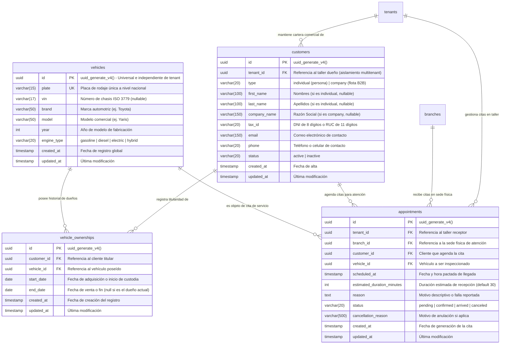

---

## 6. Fase 3: Bounded Context 3 — Workshop Operations Context (MRO) (`com.andeva.atelier.platform.operations`)

### 6.1. Diccionario y Propósito del Contexto

#### 6.1.1. Propósito y Límites de Responsabilidad
El **Workshop Operations Context (MRO - Maintenance, Repair, and Operations)** es el motor operativo y transaccional central del taller mecánico en Atelier Platform. Su propósito es orquestar todo el flujo físico de reparación automotriz desde que el vehículo ingresa a recepción hasta su entrega final, aislando esta complejidad operativa de los detalles contables de facturación tributaria y de suscripciones SaaS:
1. **Orquestación del Ciclo de Vida de la Orden de Trabajo (`WorkOrder`):** Modela la orden de servicio automotriz completa (`internal_number`, `mileage_in`, `diagnostic_summary`, `total_amount`), gestionando transiciones estrictas de estado (`PENDING`, `IN_PROGRESS`, `COMPLETED`, `PAID`, `CANCELED`).
2. **Control Físico y Capacidad de Bahías de Trabajo (`WorkBay`):** Administra la disponibilidad, ocupación y mantenimiento de los elevadores hidráulicos (`lift`), cabinas de pintura (`paint_booth`), áreas de alineamiento y zonas de lavado en cada sucursal física (`branch_id`).
3. **Desglose Atómico de Tareas de Mano de Obra (`WorkOrderTask`):** Permite seccionar la reparación en intervenciones puntuales, asociadas a servicios estándar del catálogo (`Service`), asignadas a mecánicos específicos (`mechanic_id` referenciado a `tenant_memberships`) y con registro de tiempos reales de inicio y finalización para métricas de productividad.
4. **Demanda y Consumo de Repuestos (`WorkOrderTaskProduct`):** Registra los materiales, piezas y lubricantes consumidos por cada tarea. Al agregarse un repuesto, MRO no descuenta directamente los lotes FIFO (responsabilidad de *Inventory & Supply Chain*), sino que emite eventos de dominio para solicitar la reserva y bloqueo de stock dentro de la misma transacción o mediante consistencia eventual.
5. **Auditoría Visual y Evidencias Fotográficas (`WorkOrderImage` y `WorkOrderTaskImage`):** Soporta el peritaje de ingreso (fotos de rayones, abolladuras o estado del odómetro) y evidencias de reparación técnica (repuesto dañado extraído vs. repuesto nuevo instalado).

#### 6.1.2. Decisiones de Diseño e Integraciones Críticas
* **Patrón de Almacenamiento *Direct-to-Cloud* (Firebase Cloud Storage):** La carga de imágenes de alta resolución capturadas en patio por la aplicación móvil (Atelier Workshop) no satura el backend de Spring Boot. Los clientes móviles suben los binarios directamente a un bucket de **Google Cloud Storage / Firebase Storage** utilizando credenciales seguras o URLs prefirmadas, y envían únicamente al backend la URL pública inmutable (`image_url`) y la descripción textual para su registro transaccional.
* **Soporte de Operatividad *Offline-First*:** Dado que las fosas mecánicas y sótanos de talleres sufren de conectividad intermitente, los mecánicos operan contra una base de datos relacional local embebida en sus dispositivos móviles (**SQLite** mediante Room en Kotlin y sqflite en Flutter). Al recuperar conectividad a internet, el cliente móvil sincroniza las tareas y evidencias hacia los endpoints idempotentes de `/api/v1/work-orders/{id}/tasks`.
* **Cálculo Financiero Centralizado en el Agregado:** El monto total (`total_amount`) de la orden se recalcula de forma puramente determinista y atómica dentro del agregado raíz sumando el costo de mano de obra de todas las tareas activas más el producto de `(quantity * unit_price)` de todos los repuestos solicitados, garantizando coherencia absoluta con el módulo de *Invoicing*.

---

### 6.2. 2.6.3.1. Domain Layer

#### 6.2.1. Aggregates & Aggregate Roots

##### 1. `WorkOrder` (Aggregate Root)
* **Paquete:** `com.andeva.atelier.platform.operations.domain.model.aggregates`
* **Herencia:** Extiende `AbstractDomainAggregateRoot<WorkOrder>`
* **Propósito:** Representa la orden de servicio automotriz. Es el agregado raíz que custodia la integridad del diagnóstico, la asignación de bahía, las tareas mecánicas y los repuestos demandados.
* **Atributos:**
  * `id: WorkOrderId` — Identificador único universal de la orden (UUID).
  * `tenantId: TenantId` — Taller mecánico propietario.
  * `appointmentId: AppointmentId` — Cita previa de la cual deriva la orden (nullable si es ingreso directo de emergencia).
  * `vehicleId: VehicleId` — Vehículo objeto de intervención mecánica.
  * `internalNumber: Integer` — Correlativo numérico secuencial legible por el cliente (ej. 1042).
  * `currentBayId: WorkBayId` — Bahía física donde se encuentra estacionado el vehículo (nullable).
  * `mileageIn: Mileage` — Kilometraje del vehículo al momento de ingresar a recepción.
  * `diagnosticSummary: DiagnosticSummary` — Diagnóstico y fallas reportadas (máx. 2000 caracteres).
  * `totalAmount: Money` — Importe total calculado de la orden (mano de obra + repuestos consumidos).
  * `status: WorkOrderStatus` — Estado operativo (`PENDING`, `IN_PROGRESS`, `COMPLETED`, `PAID`, `CANCELED`).
  * `tasks: List<WorkOrderTask>` — Colección interna de tareas de mano de obra.
  * `intakeImages: List<WorkOrderImage>` — Colección de evidencias fotográficas de recepción.
* **Invariantes y Reglas de Negocio:**
  * El kilometraje de ingreso `mileageIn` no puede ser negativo (`value >= 0`).
  * No se pueden agregar, modificar ni eliminar tareas o repuestos si la orden está en estado `COMPLETED`, `PAID` o `CANCELED`.
  * Toda mutación en tareas o repuestos recalcula inmediatamente el atributo `totalAmount`.
  * La orden no puede transicionar a `COMPLETED` si contiene al menos una tarea en estado `PENDING` o `IN_PROGRESS`.
  * Al completarse la última tarea pendiente, la orden transiciona automáticamente a estado `COMPLETED`.
  * Una orden solo puede marcarse como `PAID` si se encuentra previamente en estado `COMPLETED`.
* **Métodos:**
  * `+ static WorkOrder create(TenantId tenantId, AppointmentId appointmentId, VehicleId vehicleId, Integer internalNumber, Mileage mileageIn, DiagnosticSummary diagnosticSummary): WorkOrder`: Factoría de dominio en estado inicial `PENDING`; registra `WorkOrderCreatedEvent`.
  * `+ void assignBay(WorkBayId bayId): void`: Asigna el vehículo a una bahía física y dispara `WorkBayAssignedEvent`.
  * `+ void releaseBay(): void`: Libera la bahía física ocupada y registra `WorkBayReleasedEvent`.
  * `+ WorkOrderTask addTask(ServiceId serviceId, UUID mechanicId, String description, Money price): WorkOrderTask`: Añade una tarea mecánica al plan de trabajo y recalcula el monto total.
  * `+ void removeTask(WorkOrderTaskId taskId): void`: Remueve una tarea si no ha sido completada, cancela la reserva de sus repuestos asociados y recalcula el total.
  * `+ void startTask(WorkOrderTaskId taskId): void`: Pone en marcha una tarea (`IN_PROGRESS`), transiciona la orden completa a `IN_PROGRESS` si estaba `PENDING` y dispara `WorkOrderTaskStartedEvent`.
  * `+ void completeTask(WorkOrderTaskId taskId): void`: Finaliza la tarea fijando su marca de tiempo de fin y evalúa si todas las tareas han concluido para transicionar la orden a `COMPLETED` (`WorkOrderCompletedEvent`).
  * `+ void addProductToTask(WorkOrderTaskId taskId, UUID productId, Quantity quantity, Money unitPrice): void`: Incorpora un repuesto a la tarea, recalcula el `totalAmount` y registra `ProductStockReservationRequestedEvent`.
  * `+ void removeProductFromTask(WorkOrderTaskId taskId, WorkOrderTaskProductId productItemId): void`: Elimina un repuesto de la tarea, recalcula el `totalAmount` y registra `ProductStockReservationCancelledEvent`.
  * `+ void attachIntakeImage(ImageUrl imageUrl, String description): void`: Registra una evidencia fotográfica del peritaje inicial.
  * `+ void recalculateTotalAmount(): void`: Suma aritmética determinista de la mano de obra de cada tarea activa más `(quantity * unit_price)` de todos los repuestos consumidos.
  * `+ void markPaid(): void`: Registra la cancelación económica de la orden y dispara `WorkOrderPaidEvent`.
  * `+ void cancel(String reason): void`: Anula la orden y libera todas las reservas de repuestos activas.

##### 2. `WorkBay` (Aggregate Root)
* **Paquete:** `com.andeva.atelier.platform.operations.domain.model.aggregates`
* **Herencia:** Extiende `AbstractDomainAggregateRoot<WorkBay>`
* **Propósito:** Representa un espacio físico o puesto de trabajo habilitado en una sucursal del taller (elevador de dos columnas, fosa mecánica, cabina de pintura, etc.).
* **Atributos:**
  * `id: WorkBayId` — Identificador único de la bahía (UUID).
  * `tenantId: TenantId` — Taller propietario.
  * `branchId: BranchId` — Sede física donde se ubica la bahía.
  * `name: String` — Denominación identificatoria (ej. "Elevador 1", "Bahía Rápida A").
  * `type: BayType` — Clasificación técnica (`LIFT`, `PAINT_BOOTH`, `WASHING`, `ALIGNMENT`).
  * `status: BayStatus` — Estado de ocupación física (`AVAILABLE`, `OCCUPIED`, `MAINTENANCE`).
  * `currentWorkOrderId: WorkOrderId` — Orden de trabajo que ocupa actualmente la bahía (nullable).
* **Invariantes y Reglas de Negocio:**
  * No se puede ocupar una bahía que ya se encuentre en estado `OCCUPIED` o `MAINTENANCE`.
  * Solo una bahía ocupada puede ser liberada.
* **Métodos:**
  * `+ static WorkBay create(TenantId tenantId, BranchId branchId, String name, BayType type): WorkBay`: Factoría de dominio en estado `AVAILABLE`.
  * `+ void occupy(WorkOrderId orderId): void`: Bloquea la bahía asociándola a la orden activa y cambia el estado a `OCCUPIED`.
  * `+ void release(): void`: Desvincula la orden y restablece el estado a `AVAILABLE`.
  * `+ void setUnderMaintenance(String reason): void`: Inhabilita la bahía por avería mecánica o calibración.
  * `+ void restoreAvailable(): void`: Restituye la operatividad de la bahía a `AVAILABLE`.

##### 3. `Service` (Aggregate Root - Catálogo de Mano de Obra)
* **Paquete:** `com.andeva.atelier.platform.operations.domain.model.aggregates`
* **Herencia:** Extiende `AbstractDomainAggregateRoot<Service>`
* **Propósito:** Modela el catálogo de servicios estándar y paquetes de mano de obra que ofrece el taller automotriz a sus clientes.
* **Atributos:**
  * `id: ServiceId` — Identificador del servicio (UUID).
  * `tenantId: TenantId` — Taller dueño del catálogo.
  * `name: String` — Denominación del servicio (ej. "Alineamiento y Balanceo Computarizado", "Cambio de Pastillas de Freno").
  * `basePrice: Money` — Tarifa base sugerida por concepto de mano de obra.
  * `estimatedDurationMinutes: int` — Tiempo promedio estimado de ejecución técnica (default: 60 minutos).
* **Métodos:**
  * `+ static Service create(TenantId tenantId, String name, Money basePrice, int estimatedMinutes): Service`: Factoría de dominio.
  * `+ void updateDetails(String newName, Money newBasePrice, int newEstimatedMinutes): void`: Actualiza tarifa y tiempos estándar.

---

#### 6.2.2. Entities

##### 1. `WorkOrderTask` (Entidad Dependiente de `WorkOrder`)
* **Paquete:** `com.andeva.atelier.platform.operations.domain.model.entities`
* **Propósito:** Representa una actividad concreta de mano de obra dentro del plan de reparación vehicular.
* **Atributos:**
  * `id: WorkOrderTaskId` — Identificador único de la tarea (UUID).
  * `workOrderId: WorkOrderId` — Orden de trabajo a la que pertenece.
  * `serviceId: ServiceId` — Servicio de catálogo asociado.
  * `mechanicId: UUID` — Identificador de membresía del mecánico asignado (referencia a `tenant_memberships`, nullable).
  * `status: WorkOrderTaskStatus` — Estado de la labor (`PENDING`, `IN_PROGRESS`, `COMPLETED`).
  * `description: String` — Detalle del procedimiento mecánico o diagnóstico específico.
  * `price: Money` — Costo cobrado por la mano de obra de esta tarea específica.
  * `startedAt: Instant` — Marca de tiempo en que el mecánico inició la tarea.
  * `completedAt: Instant` — Marca de tiempo en que el mecánico finalizó la labor.
  * `consumedProducts: List<WorkOrderTaskProduct>` — Colección de repuestos utilizados en esta tarea.
  * `taskImages: List<WorkOrderTaskImage>` — Evidencias fotográficas específicas de esta labor.
* **Métodos:**
  * `+ void start(): void`: Registra `startedAt = Instant.now()` y fija `status = IN_PROGRESS`.
  * `+ void complete(): void`: Registra `completedAt = Instant.now()` y fija `status = COMPLETED`.
  * `+ void reopen(): void`: Retorna a `IN_PROGRESS` y anula `completedAt`.
  * `+ void assignMechanic(UUID mechanicMembershipId): void`: Asocia el técnico responsable.
  * `+ void updatePrice(Money newPrice): void`: Actualiza el importe de mano de obra.
  * `+ void addProduct(WorkOrderTaskProduct product): void`: Agrega un requerimiento de repuesto.
  * `+ void removeProduct(WorkOrderTaskProductId productId): void`: Elimina un repuesto.
  * `+ void attachEvidenceImage(ImageUrl url, String description): void`: Adjunta evidencia de trabajo.

##### 2. `WorkOrderTaskProduct` (Entidad Dependiente de `WorkOrderTask`)
* **Paquete:** `com.andeva.atelier.platform.operations.domain.model.entities`
* **Propósito:** Cuantifica el consumo de un repuesto, insumo o lubricante físico para una tarea determinada.
* **Atributos:**
  * `id: WorkOrderTaskProductId` — Identificador único del ítem (UUID).
  * `taskId: WorkOrderTaskId` — Tarea que demanda el repuesto.
  * `productId: UUID` — Identificador del ítem en catálogo (`inventory_items`).
  * `quantity: Quantity` — Cantidad solicitada (con precisión de dos decimales).
  * `unitPrice: Money` — Precio unitario de venta pactado al momento de su incorporación.
  * `totalAmount: Money` — Subtotal calculado (`quantity * unitPrice`).
* **Métodos:**
  * `+ void updateQuantity(Quantity newQuantity): void`: Modifica la cantidad consumida y recalcula `totalAmount`.

##### 3. `WorkOrderImage` (Entidad Dependiente de `WorkOrder`)
* **Paquete:** `com.andeva.atelier.platform.operations.domain.model.entities`
* **Propósito:** Registra evidencias visuales del peritaje de ingreso a recepción del taller.
* **Atributos:**
  * `id: UUID` — Identificador del registro fotográfico.
  * `workOrderId: WorkOrderId` — Orden de trabajo vinculada.
  * `imageUrl: ImageUrl` — URL pública del objeto alojado en Firebase Cloud Storage.
  * `description: String` — Nota explicativa del perito (ej. "Abolladura previa en parachoque delantero").
  * `uploadedAt: Instant` — Marca de tiempo de registro.

##### 4. `WorkOrderTaskImage` (Entidad Dependiente de `WorkOrderTask`)
* **Paquete:** `com.andeva.atelier.platform.operations.domain.model.entities`
* **Propósito:** Registra evidencias visuales del procedimiento técnico ejecutado por el mecánico.
* **Atributos:**
  * `id: UUID` — Identificador del registro.
  * `taskId: WorkOrderTaskId` — Tarea mecánica asociada.
  * `imageUrl: ImageUrl` — URL pública en Firebase Cloud Storage.
  * `description: String` — Descripción técnica (ej. "Disco de freno fisurado vs disco ventilado nuevo").
  * `uploadedAt: Instant` — Marca de tiempo.

---

#### 6.2.3. Value Objects

* **`WorkOrderId(UUID value)`:** Identificador tipado de orden de trabajo.
* **`WorkOrderTaskId(UUID value)`:** Identificador tipado de tarea.
* **`WorkOrderTaskProductId(UUID value)`:** Identificador tipado de repuesto consumido.
* **`WorkBayId(UUID value)`:** Identificador tipado de bahía de trabajo.
* **`ServiceId(UUID value)`:** Identificador tipado de servicio de catálogo.
* **`Mileage(Integer value)`:** Kilometraje automotriz entero no negativo (`value >= 0`).
* **`DiagnosticSummary(String value)`:** Resumen de diagnóstico preliminar (máximo 2000 caracteres, normalizado sin espacios redundantes).
* **`Quantity(BigDecimal value)`:** Cantidad numérica no negativa para repuestos o litros de lubricante (escala 2).
* **`ImageUrl(String value)`:** Valida formato URL HTTPS canónico apuntando al storage de la nube (`storage.googleapis.com` o dominio verificado de Firebase).
* **`WorkOrderStatus` (Enum):** `PENDING`, `IN_PROGRESS`, `COMPLETED`, `PAID`, `CANCELED`.
* **`WorkOrderTaskStatus` (Enum):** `PENDING`, `IN_PROGRESS`, `COMPLETED`.
* **`BayType` (Enum):** `LIFT`, `PAINT_BOOTH`, `WASHING`, `ALIGNMENT`.
* **`BayStatus` (Enum):** `AVAILABLE`, `OCCUPIED`, `MAINTENANCE`.

---

#### 6.2.4. Domain Commands

* `CreateWorkOrderCommand(TenantId tenantId, AppointmentId appointmentId, VehicleId vehicleId, Mileage mileageIn, DiagnosticSummary diagnosticSummary)`
* `AssignWorkBayCommand(WorkOrderId workOrderId, WorkBayId bayId)`
* `ReleaseWorkBayCommand(WorkOrderId workOrderId)`
* `AddTaskToWorkOrderCommand(WorkOrderId workOrderId, ServiceId serviceId, UUID mechanicId, String description, BigDecimal price, String currency)`
* `StartWorkOrderTaskCommand(WorkOrderId workOrderId, WorkOrderTaskId taskId)`
* `CompleteWorkOrderTaskCommand(WorkOrderId workOrderId, WorkOrderTaskId taskId)`
* `AddProductToTaskCommand(WorkOrderId workOrderId, WorkOrderTaskId taskId, UUID productId, BigDecimal quantity, BigDecimal unitPrice, String currency)`
* `RemoveProductFromTaskCommand(WorkOrderId workOrderId, WorkOrderTaskId taskId, WorkOrderTaskProductId productItemId)`
* `AttachIntakeImageCommand(WorkOrderId workOrderId, String imageUrl, String description)`
* `AttachTaskEvidenceImageCommand(WorkOrderId workOrderId, WorkOrderTaskId taskId, String imageUrl, String description)`
* `CreateWorkBayCommand(TenantId tenantId, BranchId branchId, String name, BayType bayType)`
* `UpdateWorkBayStatusCommand(WorkBayId bayId, BayStatus status, String reason)`
* `CreateServiceItemCommand(TenantId tenantId, String name, BigDecimal basePrice, String currency, int estimatedMinutes)`
* `UpdateServiceItemCommand(ServiceId serviceId, String name, BigDecimal basePrice, String currency, int estimatedMinutes)`
* `MarkWorkOrderAsPaidCommand(WorkOrderId workOrderId)`

---

#### 6.2.5. Domain Queries

* `GetWorkOrderByIdQuery(WorkOrderId workOrderId)`
* `GetWorkOrdersByTenantIdQuery(TenantId tenantId)`
* `GetWorkOrdersByBranchIdQuery(TenantId tenantId, BranchId branchId)`
* `GetWorkOrdersByVehicleIdQuery(VehicleId vehicleId)`
* `GetWorkOrdersByBayIdQuery(WorkBayId bayId)`
* `GetWorkBaysByBranchIdQuery(TenantId tenantId, BranchId branchId)`
* `GetAvailableWorkBaysQuery(TenantId tenantId, BranchId branchId, BayType bayType)`
* `GetServicesByTenantIdQuery(TenantId tenantId)`
* `GetServiceByIdQuery(ServiceId serviceId)`

---

#### 6.2.6. Domain Events

* `WorkOrderCreatedEvent(WorkOrderId workOrderId, TenantId tenantId, VehicleId vehicleId, Integer internalNumber, Instant occurredOn)`
* `WorkBayAssignedEvent(WorkOrderId workOrderId, WorkBayId bayId, Instant occurredOn)`
* `WorkBayReleasedEvent(WorkOrderId workOrderId, WorkBayId bayId, Instant occurredOn)`
* `WorkOrderTaskStartedEvent(WorkOrderId workOrderId, WorkOrderTaskId taskId, UUID mechanicId, Instant occurredOn)`
* `WorkOrderTaskCompletedEvent(WorkOrderId workOrderId, WorkOrderTaskId taskId, UUID mechanicId, Instant occurredOn)`
* `WorkOrderCompletedEvent(WorkOrderId workOrderId, TenantId tenantId, VehicleId vehicleId, Money totalAmount, Instant occurredOn)`
* `WorkOrderPaidEvent(WorkOrderId workOrderId, TenantId tenantId, Money totalAmount, Instant occurredOn)`
* `ProductStockReservationRequestedEvent(WorkOrderId workOrderId, WorkOrderTaskId taskId, UUID productId, Quantity quantity, Instant occurredOn)`
* `ProductStockReservationCancelledEvent(WorkOrderId workOrderId, WorkOrderTaskId taskId, UUID productId, Quantity quantity, Instant occurredOn)`
* `WorkOrderIntakeImageAttachedEvent(WorkOrderId workOrderId, UUID imageId, ImageUrl imageUrl, Instant occurredOn)`
* `WorkOrderTaskEvidenceAttachedEvent(WorkOrderId workOrderId, WorkOrderTaskId taskId, UUID imageId, ImageUrl imageUrl, Instant occurredOn)`

---

#### 6.2.7. Repositories (Interfaces de Dominio)

* **`WorkOrderRepository`:**
  * `WorkOrder save(WorkOrder workOrder)`
  * `Optional<WorkOrder> findById(WorkOrderId id)`
  * `List<WorkOrder> findByTenantId(TenantId tenantId)`
  * `List<WorkOrder> findByVehicleId(VehicleId vehicleId)`
  * `Optional<WorkOrder> findByCurrentBayId(WorkBayId bayId)`
  * `Integer findNextInternalNumber(TenantId tenantId)`
* **`WorkBayRepository`:**
  * `WorkBay save(WorkBay workBay)`
  * `Optional<WorkBay> findById(WorkBayId id)`
  * `List<WorkBay> findByTenantIdAndBranchId(TenantId tenantId, BranchId branchId)`
  * `List<WorkBay> findAvailableBays(TenantId tenantId, BranchId branchId, BayType bayType)`
* **`ServiceRepository`:**
  * `Service save(Service service)`
  * `Optional<Service> findById(ServiceId id)`
  * `List<Service> findByTenantId(TenantId tenantId)`

---

### 6.3. 2.6.3.2. Interface Layer

#### 6.3.1. REST Controllers

##### 1. `WorkOrdersController`
* **Ruta Base:** `/api/v1/work-orders`
* **Propósito:** Apertura, supervisión, asignación de bahías y liquidación de órdenes de trabajo.
* **Endpoints:**
  * `POST`: Apertura de nueva orden de trabajo. Recibe `CreateWorkOrderResource`, retorna `WorkOrderResource` (HTTP 201 Created).
  * `GET`: Listado de órdenes filtradas por sucursal, vehículo o estado. Retorna `List<WorkOrderSummaryResource>` (HTTP 200 OK).
  * `GET /{id}`: Consulta detallada de la orden con sus tareas, repuestos e imágenes de recepción. Retorna `WorkOrderDetailResource` (HTTP 200 OK / 404 Not Found).
  * `PUT /{id}/bay`: Asignación o reubicación de bahía de trabajo. Recibe `AssignWorkBayResource`, retorna `WorkOrderResource` (HTTP 200 OK).
  * `DELETE /{id}/bay`: Liberación manual de la bahía de trabajo actual. Retorna HTTP 204 No Content.
  * `POST /{id}/intake-images`: Registro de imagen de inspección de ingreso. Recibe `AttachImageResource`, retorna `WorkOrderImageResource` (HTTP 201 Created).
  * `POST /{id}/tasks`: Incorporación de una nueva tarea mecánica al plan de trabajo. Recibe `CreateWorkOrderTaskResource`, retorna `WorkOrderTaskResource` (HTTP 201 Created).
  * `PUT /{id}/cancel`: Anulación de la orden con liberación de repuestos y bahía. Recibe `CancelWorkOrderResource`, retorna `WorkOrderResource` (HTTP 200 OK).

##### 2. `WorkOrderTasksController`
* **Ruta Base:** `/api/v1/work-order-tasks`
* **Propósito:** Operaciones de ejecución mecánica en foso por parte de los técnicos.
* **Endpoints:**
  * `PUT /{taskId}/start`: El mecánico inicia la intervención técnica. Retorna `WorkOrderTaskResource` (HTTP 200 OK).
  * `PUT /{taskId}/complete`: El mecánico marca la labor completada. Retorna `WorkOrderTaskResource` (HTTP 200 OK).
  * `POST /{taskId}/products`: Solicitud de repuesto para la tarea (reserva stock en inventario). Recibe `AddTaskProductResource`, retorna `TaskProductResource` (HTTP 201 Created).
  * `DELETE /{taskId}/products/{productId}`: Remoción de repuesto (libera reserva en inventario). Retorna HTTP 204 No Content.
  * `POST /{taskId}/evidence-images`: Carga de evidencia fotográfica del trabajo. Recibe `AttachImageResource`, retorna `WorkOrderImageResource` (HTTP 201 Created).

##### 3. `WorkBaysController`
* **Ruta Base:** `/api/v1/work-bays`
* **Propósito:** Gestión física de elevadores y puestos de taller.
* **Endpoints:**
  * `POST`: Alta de nueva bahía en una sucursal. Recibe `CreateWorkBayResource`, retorna `WorkBayResource` (HTTP 201 Created).
  * `GET`: Listado de bahías con estado de ocupación actual. Retorna `List<WorkBayResource>` (HTTP 200 OK).
  * `PUT /{id}/maintenance`: Puesta en mantenimiento de la bahía. Recibe `MaintenanceBayResource`, retorna `WorkBayResource` (HTTP 200 OK).
  * `PUT /{id}/restore`: Restitución a estado disponible. Retorna `WorkBayResource` (HTTP 200 OK).

##### 4. `ServicesController`
* **Ruta Base:** `/api/v1/services`
* **Propósito:** Catálogo maestro de servicios y mano de obra del taller.
* **Endpoints:**
  * `POST`: Creación de servicio estándar. Recibe `CreateServiceResource`, retorna `ServiceResource` (HTTP 201 Created).
  * `GET`: Catálogo de servicios del taller. Retorna `List<ServiceResource>` (HTTP 200 OK).
  * `PUT /{id}`: Actualización de tarifa base o tiempos. Recibe `UpdateServiceResource`, retorna `ServiceResource` (HTTP 200 OK).

---

#### 6.3.2. Resources / DTOs

* **Peticiones (Requests):**
  * `CreateWorkOrderResource(UUID appointmentId, UUID vehicleId, Integer mileageIn, String diagnosticSummary)`
  * `AssignWorkBayResource(UUID bayId)`
  * `CreateWorkOrderTaskResource(UUID serviceId, UUID mechanicId, String description, BigDecimal price, String currency)`
  * `AddTaskProductResource(UUID productId, BigDecimal quantity, BigDecimal unitPrice, String currency)`
  * `AttachImageResource(String imageUrl, String description)`
  * `CancelWorkOrderResource(String reason)`
  * `CreateWorkBayResource(UUID branchId, String name, String bayType)`
  * `MaintenanceBayResource(String reason)`
  * `CreateServiceResource(String name, BigDecimal basePrice, String currency, int estimatedMinutes)`
  * `UpdateServiceResource(String name, BigDecimal basePrice, String currency, int estimatedMinutes)`
* **Respuestas (Responses):**
  * `WorkOrderResource(UUID id, UUID tenantId, Integer internalNumber, UUID vehicleId, UUID currentBayId, Integer mileageIn, String status, BigDecimal totalAmount, String currency)`
  * `WorkOrderDetailResource(UUID id, UUID tenantId, Integer internalNumber, UUID vehicleId, UUID currentBayId, String bayName, Integer mileageIn, String diagnosticSummary, String status, BigDecimal totalAmount, String currency, List<WorkOrderTaskResource> tasks, List<WorkOrderImageResource> intakeImages)`
  * `WorkOrderTaskResource(UUID id, UUID workOrderId, UUID serviceId, String serviceName, UUID mechanicId, String mechanicName, String status, String description, BigDecimal price, String currency, Instant startedAt, Instant completedAt, List<TaskProductResource> products, List<WorkOrderImageResource> evidenceImages)`
  * `TaskProductResource(UUID id, UUID taskId, UUID productId, String productName, BigDecimal quantity, BigDecimal unitPrice, BigDecimal totalAmount, String currency)`
  * `WorkOrderImageResource(UUID id, String imageUrl, String description, Instant uploadedAt)`
  * `WorkBayResource(UUID id, UUID tenantId, UUID branchId, String name, String bayType, String status, UUID currentWorkOrderId)`
  * `ServiceResource(UUID id, UUID tenantId, String name, BigDecimal basePrice, String currency, int estimatedMinutes)`

---

#### 6.3.3. Resource Assemblers

* `WorkOrderResourceAssembler`: Transforma `WorkOrder` a `WorkOrderResource` y `WorkOrderDetailResource`.
* `WorkOrderTaskResourceAssembler`: Transforma `WorkOrderTask` a `WorkOrderTaskResource`.
* `WorkBayResourceAssembler`: Transforma `WorkBay` a `WorkBayResource`.
* `ServiceResourceAssembler`: Transforma `Service` a `ServiceResource`.

---

#### 6.3.4. Open Host Service (OHS) / Inbound ACL Facade

Interfaz pública en `com.andeva.atelier.platform.operations.interfaces.acl`:

```java
package com.andeva.atelier.platform.operations.interfaces.acl;

import java.math.BigDecimal;
import java.util.List;
import java.util.Optional;
import java.util.UUID;

public interface WorkshopOperationsContextFacade {
    Optional<WorkOrderSummaryDto> fetchWorkOrderById(UUID workOrderId);
    Optional<WorkOrderBillingDto> fetchWorkOrderBillingDetails(UUID workOrderId);
    List<WorkOrderConsumedProductDto> fetchProductsConsumedInOrder(UUID workOrderId);
    boolean markWorkOrderAsPaid(UUID workOrderId);
    boolean isBayOccupied(UUID bayId);
}
```

*DTOs Exportados por la Fachada:*
* `WorkOrderSummaryDto(UUID id, UUID tenantId, Integer internalNumber, UUID vehicleId, String status, BigDecimal totalAmount, String currency)`
* `WorkOrderBillingDto(UUID id, UUID tenantId, Integer internalNumber, UUID customerId, UUID vehicleId, BigDecimal laborSubtotal, BigDecimal productsSubtotal, BigDecimal totalAmount, String currency)`
* `WorkOrderConsumedProductDto(UUID productId, BigDecimal quantity, BigDecimal unitPrice, BigDecimal totalAmount)`

---

#### 6.3.5. Integration Events (Published Language)

* `WorkOrderCreatedIntegrationEvent(UUID workOrderId, UUID tenantId, UUID vehicleId, Integer internalNumber, Instant occurredOn)`: Notifica a la app del conductor que su auto ha sido recibido en el taller.
* `WorkOrderCompletedIntegrationEvent(UUID workOrderId, UUID tenantId, UUID vehicleId, BigDecimal totalAmount, String currency, Instant occurredOn)`: Notifica a *Invoicing* que la orden está lista para liquidación y emisión de comprobante.
* `WorkOrderPaidIntegrationEvent(UUID workOrderId, UUID tenantId, Instant occurredOn)`: Registra la finalización contable y operativa del servicio.
* `ProductStockReservationRequestedIntegrationEvent(UUID workOrderId, UUID taskId, UUID productId, BigDecimal quantity, Instant occurredOn)`: Solicita al contexto *Inventory & Supply Chain* la reserva física de repuestos mediante costeo FIFO.
* `ProductStockReservationCancelledIntegrationEvent(UUID workOrderId, UUID taskId, UUID productId, BigDecimal quantity, Instant occurredOn)`: Libera la reserva en el inventario ante retiro o anulación de la tarea.

---

### 6.4. 2.6.3.3. Application Layer

#### 6.4.1. Command Services & Implementations

##### 1. `WorkOrderCommandService` & `WorkOrderCommandServiceImpl`
* `Result<WorkOrder, ApplicationError> handle(CreateWorkOrderCommand command)`:
  1. Consulta a *CRM* vía `CustomerFleetContextFacade` para validar la existencia del `vehicleId` y la cita asociada.
  2. Obtiene el correlativo secuencial siguiente del taller (`WorkOrderRepository.findNextInternalNumber`).
  3. Instancia el agregado `WorkOrder` en estado `PENDING`.
  4. Persiste la orden y retorna `Result.success(workOrder)`.
* `Result<WorkOrder, ApplicationError> handle(AssignWorkBayCommand command)`:
  1. Localiza la bahía física por ID (`WorkBayRepository`).
  2. Verifica que la bahía esté en estado `AVAILABLE`.
  3. Ejecuta `workBay.occupy(workOrderId)` y `workOrder.assignBay(bayId)`.
  4. Persiste ambos agregados en una transacción atómica.
* `Result<WorkOrder, ApplicationError> handle(AddTaskToWorkOrderCommand command)`:
  1. Valida existencia del servicio en el catálogo (`ServiceRepository`).
  2. Si se especificó mecánico, valida que sea miembro activo del taller mediante `TenancyContextFacade`.
  3. Añade la tarea al agregado `workOrder.addTask(...)`.
  4. Persiste la orden y retorna `Result.success(workOrder)`.
* `Result<WorkOrder, ApplicationError> handle(StartWorkOrderTaskCommand command)`: Inicia la tarea del mecánico y promueve el estado de la orden a `IN_PROGRESS`.
* `Result<WorkOrder, ApplicationError> handle(CompleteWorkOrderTaskCommand command)`: Marca la tarea completada y, si todas las demás terminaron, transiciona la orden completa a `COMPLETED`.
* `Result<WorkOrder, ApplicationError> handle(AddProductToTaskCommand command)`:
  1. Añade el repuesto consumido a la tarea.
  2. Publica `ProductStockReservationRequestedEvent` para que el módulo de Inventario bloquee las unidades por FIFO.
  3. Recalcula el `totalAmount` y persiste la orden.
* `Result<WorkOrder, ApplicationError> handle(RemoveProductFromTaskCommand command)`: Remueve el ítem, publica `ProductStockReservationCancelledEvent` y actualiza el monto total.
* `Result<WorkOrder, ApplicationError> handle(AttachIntakeImageCommand command)`: Registra la metadata de la imagen subida a Firebase Storage.
* `Result<Void, ApplicationError> handle(MarkWorkOrderAsPaidCommand command)`: Marca la orden como `PAID` y libera la bahía si aún estaba ocupada.

##### 2. `WorkBayCommandService` & `WorkBayCommandServiceImpl`
* `Result<WorkBay, ApplicationError> handle(CreateWorkBayCommand command)`: Valida la existencia de la sede física (`branchId`) y crea la nueva bahía.
* `Result<WorkBay, ApplicationError> handle(UpdateWorkBayStatusCommand command)`: Conmuta estado a mantenimiento o disponible.

##### 3. `ServiceCommandService` & `ServiceCommandServiceImpl`
* `Result<Service, ApplicationError> handle(CreateServiceItemCommand command)`: Da de alta un nuevo servicio de mano de obra en el catálogo del taller.
* `Result<Service, ApplicationError> handle(UpdateServiceItemCommand command)`: Actualiza precio y tiempo estimado de un servicio.

---

#### 6.4.2. Query Services & Implementations

* **`WorkOrderQueryService` & `WorkOrderQueryServiceImpl`:**
  * `Optional<WorkOrder> handle(GetWorkOrderByIdQuery query)`
  * `List<WorkOrder> handle(GetWorkOrdersByTenantIdQuery query)`
  * `List<WorkOrder> handle(GetWorkOrdersByBranchIdQuery query)`
  * `List<WorkOrder> handle(GetWorkOrdersByVehicleIdQuery query)`
* **`WorkBayQueryService` & `WorkBayQueryServiceImpl`:**
  * `Optional<WorkBay> handle(GetWorkBayByIdQuery query)`
  * `List<WorkBay> handle(GetWorkBaysByBranchIdQuery query)`
  * `List<WorkBay> handle(GetAvailableWorkBaysQuery query)`
* **`ServiceQueryService` & `ServiceQueryServiceImpl`:**
  * `Optional<Service> handle(GetServiceByIdQuery query)`
  * `List<Service> handle(GetServicesByTenantIdQuery query)`

---

#### 6.4.3. Event Handlers & Listeners

* **`AppointmentArrivedListener`:**
  * `@TransactionalEventListener(phase = TransactionPhase.AFTER_COMMIT) void on(AppointmentArrivedIntegrationEvent event)`: Captura el arribo físico del cliente desde el contexto CRM y genera automáticamente un borrador preliminar de `WorkOrder` con el kilometraje y motivo de inspección reportados.
* **`PaymentProcessedListener`:**
  * `@EventListener void on(PaymentProcessedIntegrationEvent event)`: Escucha la liquidación tributaria emitida por *Invoicing* y ejecuta `MarkWorkOrderAsPaidCommand`.
* **`WorkOrderInventoryEventHandler`:**
  * `@EventListener void on(ProductStockReservationRequestedEvent event)`: Publica el evento de integración hacia *Inventory & Supply Chain*.

---

#### 6.4.4. Outbound ACL Services

* **`CustomerFleetAclService`:** Consulta el propietario del vehículo, placa y detalles técnicos al módulo CRM.
* **`InventoryReservationAclService`:** Comunica requerimientos de piezas al motor FIFO de Inventario.
* **`FirebaseStorageDirectUploadGateway`:** Valida que las URLs provistas provengan del bucket oficial de Firebase Storage configurado para Atelier (`gs://atelier-platform.firebasestorage.app`).

---

### 6.5. 2.6.3.4. Infrastructure Layer

#### 6.5.1. JPA Persistence Entities

Ubicadas en `com.andeva.atelier.platform.operations.infrastructure.persistence.jpa.entities`:

##### 1. `WorkOrderPersistenceEntity` (Tabla `work_orders`)
* Extiende `AuditableAbstractPersistenceEntity`.
* `@Column(name = "tenant_id", nullable = false)`: Taller dueño.
* `@Column(name = "appointment_id")`: Cita de la que deriva (nullable).
* `@Column(name = "vehicle_id", nullable = false)`: Vehículo objeto de servicio.
* `@Column(name = "internal_number", nullable = false)`: Correlativo numérico secuencial.
* `@Column(name = "current_bay_id")`: Bahía asignada (nullable).
* `@Column(name = "mileage_in", nullable = false)`: Kilometraje de entrada.
* `@Column(name = "diagnostic_summary", length = 2000, nullable = false)`: Resumen del diagnóstico.
* `@Column(name = "total_amount", precision = 10, scale = 2, nullable = false)`: Importe total de la orden.
* `@Column(name = "status", nullable = false, length = 20)`: `pending`, `in_progress`, `completed`, `paid`.
* `@OneToMany(mappedBy = "workOrder", cascade = CascadeType.ALL, orphanRemoval = true)`: Colección de `WorkOrderTaskPersistenceEntity`.
* `@OneToMany(mappedBy = "workOrder", cascade = CascadeType.ALL, orphanRemoval = true)`: Colección de `WorkOrderImagePersistenceEntity`.

##### 2. `WorkBayPersistenceEntity` (Tabla `work_bays`)
* Extiende `AuditableAbstractPersistenceEntity`.
* `@Column(name = "tenant_id", nullable = false)`: Taller dueño.
* `@Column(name = "branch_id", nullable = false)`: Sede física donde opera la bahía.
* `@Column(name = "name", nullable = false, length = 50)`: Nombre o código de bahía.
* `@Column(name = "type", nullable = false, length = 20)`: `lift`, `paint_booth`, `washing`, `alignment`.
* `@Column(name = "status", nullable = false, length = 20)`: `available`, `occupied`, `maintenance`.
* `@Column(name = "current_work_order_id")`: OT asociada si está ocupada.

##### 3. `WorkOrderTaskPersistenceEntity` (Tabla `work_order_tasks`)
* Extiende `AuditableAbstractPersistenceEntity`.
* `@ManyToOne(fetch = FetchType.LAZY) @JoinColumn(name = "work_order_id", nullable = false)`: Orden de trabajo padre.
* `@Column(name = "service_id", nullable = false)`: Servicio de catálogo asociado.
* `@Column(name = "mechanic_id")`: Membresía del mecánico asignado (nullable).
* `@Column(name = "status", nullable = false, length = 20)`: `pending`, `in_progress`, `completed`.
* `@Column(name = "description", nullable = false, columnDefinition = "TEXT")`: Procedimiento detallado.
* `@Column(name = "price", precision = 10, scale = 2, nullable = false)`: Mano de obra cobrada.
* `@Column(name = "started_at")`: Fecha y hora de inicio real.
* `@Column(name = "completed_at")`: Fecha y hora de finalización real.
* `@OneToMany(mappedBy = "task", cascade = CascadeType.ALL, orphanRemoval = true)`: Colección de `WorkOrderTaskProductPersistenceEntity`.
* `@OneToMany(mappedBy = "task", cascade = CascadeType.ALL, orphanRemoval = true)`: Colección de `WorkOrderTaskImagePersistenceEntity`.

##### 4. `WorkOrderTaskProductPersistenceEntity` (Tabla `work_order_task_products`)
* Extiende `AuditableAbstractPersistenceEntity`.
* `@ManyToOne(fetch = FetchType.LAZY) @JoinColumn(name = "task_id", nullable = false)`: Tarea solicitante.
* `@Column(name = "product_id", nullable = false)`: Repuesto del catálogo de inventario.
* `@Column(name = "quantity", precision = 10, scale = 2, nullable = false)`: Cantidad utilizada.
* `@Column(name = "unit_price", precision = 10, scale = 2, nullable = false)`: Precio unitario cobrado.
* `@Column(name = "total_amount", precision = 10, scale = 2, nullable = false)`: Subtotal (`quantity * unit_price`).

##### 5. `WorkOrderImagePersistenceEntity` (Tabla `work_order_images`)
* Extiende `AuditableAbstractPersistenceEntity`.
* `@ManyToOne(fetch = FetchType.LAZY) @JoinColumn(name = "work_order_id", nullable = false)`: OT asociada.
* `@Column(name = "image_url", nullable = false, length = 255)`: URL pública en Firebase Cloud Storage.
* `@Column(name = "description", length = 200)`: Nota explicativa del peritaje.
* `@Column(name = "uploaded_at", nullable = false)`: Fecha y hora de subida.

##### 6. `WorkOrderTaskImagePersistenceEntity` (Tabla `work_order_task_images`)
* Extiende `AuditableAbstractPersistenceEntity`.
* `@ManyToOne(fetch = FetchType.LAZY) @JoinColumn(name = "task_id", nullable = false)`: Tarea asociada.
* `@Column(name = "image_url", nullable = false, length = 255)`: URL pública en Firebase Cloud Storage.
* `@Column(name = "description", length = 200)`: Explicación de la evidencia mecánica.
* `@Column(name = "uploaded_at", nullable = false)`: Fecha y hora de subida.

##### 7. `ServicePersistenceEntity` (Tabla `services`)
* Extiende `AuditableAbstractPersistenceEntity`.
* `@Column(name = "tenant_id", nullable = false)`: Taller dueño del catálogo.
* `@Column(name = "name", nullable = false, length = 150)`: Denominación del servicio.
* `@Column(name = "base_price", precision = 10, scale = 2, nullable = false)`: Tarifa sugerida de mano de obra.
* `@Column(name = "estimated_time_m", nullable = false)`: Duración estimada en minutos.

---

#### 6.5.2. JPA Persistence Repositories

* `WorkOrderPersistenceRepository extends JpaRepository<WorkOrderPersistenceEntity, UUID>`
* `WorkBayPersistenceRepository extends JpaRepository<WorkBayPersistenceEntity, UUID>`
* `WorkOrderTaskPersistenceRepository extends JpaRepository<WorkOrderTaskPersistenceEntity, UUID>`
* `WorkOrderTaskProductPersistenceRepository extends JpaRepository<WorkOrderTaskProductPersistenceEntity, UUID>`
* `WorkOrderImagePersistenceRepository extends JpaRepository<WorkOrderImagePersistenceEntity, UUID>`
* `WorkOrderTaskImagePersistenceRepository extends JpaRepository<WorkOrderTaskImagePersistenceEntity, UUID>`
* `ServicePersistenceRepository extends JpaRepository<ServicePersistenceEntity, UUID>`

---

#### 6.5.3. JPA Adapters (`*RepositoryImpl`)

* `WorkOrderRepositoryImpl implements WorkOrderRepository`
* `WorkBayRepositoryImpl implements WorkBayRepository`
* `ServiceRepositoryImpl implements ServiceRepository`

---

#### 6.5.4. Persistence Assemblers

* `WorkOrderPersistenceAssembler`: Transforma `WorkOrder` <-> `WorkOrderPersistenceEntity` y sus entidades internas anidadas.
* `WorkBayPersistenceAssembler`: Transforma `WorkBay` <-> `WorkBayPersistenceEntity`.
* `ServicePersistenceAssembler`: Transforma `Service` <-> `ServicePersistenceEntity`.

---

#### 6.5.5. JPA Converters & Embeddables

* `WorkOrderStatusAttributeConverter`: Convierte `WorkOrderStatus` a `varchar(20)`.
* `WorkOrderTaskStatusAttributeConverter`: Convierte `WorkOrderTaskStatus` a `varchar(20)`.
* `BayTypeAttributeConverter`: Convierte `BayType` a `varchar(20)`.
* `BayStatusAttributeConverter`: Convierte `BayStatus` a `varchar(20)`.
* `DiagnosticSummaryAttributeConverter`: Convierte `DiagnosticSummary` a `text`.
* `QuantityAttributeConverter`: Convierte `Quantity` a `decimal(10,2)`.

---

#### 6.5.6. Clientes y Pasarelas de Infraestructura Externa

##### 1. `FirebaseStorageDirectUploadClient` (Google Cloud Storage / Firebase Storage)
* Paquete: `com.andeva.atelier.platform.operations.infrastructure.external.firebase`
* Genera URLs firmadas (*Pre-signed URLs*) con expiración de 15 minutos mediante el SDK de Google Cloud Storage para permitir que las aplicaciones móviles suban evidencias fotográficas directamente a los buckets perimetrales de Google sin atravesar la memoria RAM del servidor de Spring Boot.

---

### 6.6. 2.6.3.5. Bounded Context Software Architecture Component Level Diagram

El siguiente diagrama en modelo **C4 Component (Nivel 3)** ilustra la descomposición interna del contenedor Backend (`API Application`) para el **Workshop Operations Context (MRO)**:

```mermaid
C4Component
    title Component Diagram - Workshop Operations Context (API Application Container)

    Container_Boundary(b1, "Workshop Operations Module (com.andeva.atelier.platform.operations)") {
        
        Component(woCtrl, "WorkOrdersController", "Spring REST Controller", "Expone endpoints para apertura, bahías y liquidación de órdenes de trabajo.")
        Component(taskCtrl, "WorkOrderTasksController", "Spring REST Controller", "Expone endpoints para inicio/fin de tareas mecánicas y demanda de repuestos.")
        Component(bayCtrl, "WorkBaysController", "Spring REST Controller", "Expone endpoints para puestos de trabajo, elevadores y mantenimiento de bahías.")
        Component(srvCtrl, "ServicesController", "Spring REST Controller", "Expone catálogo maestro de mano de obra y servicios estándar.")

        Component(woCmdService, "WorkOrderCommandService", "Spring Application Service", "Orquesta apertura de OTs, asignación de bahías y recálculo financiero atómico.")
        Component(bayCmdService, "WorkBayCommandService", "Spring Application Service", "Gestiona ocupación y liberación física de bahías.")
        Component(srvCmdService, "ServiceCommandService", "Spring Application Service", "Administra catálogo de mano de obra del taller.")

        Component(mroQueryServices, "Operations Query Services", "Spring Application Services", "Consultas inmutables de OTs, tareas, repuestos y bahías disponibles.")
        Component(mroEventHandlers, "Operations Event Handlers", "Spring Event Listeners", "Reacciona a arribo de citas, pagos de clientes y coordina reservas de stock.")

        Component(mroFacade, "WorkshopOperationsFacadeImpl", "Spring Service (OHS / ACL)", "Fachada pública que expone subtotales de liquidación a Facturación.")

        Component(domainModel, "MRO Domain Model", "Java Aggregates & Entities", "WorkOrder, WorkBay, Service, WorkOrderTask, WorkOrderTaskProduct, Images.")

        Component(repoAdapters, "MRO Repository Adapters", "Spring Data JPA Adapters", "WorkOrderRepositoryImpl, WorkBayRepositoryImpl, ServiceRepositoryImpl.")
        Component(fbClient, "FirebaseStorageDirectUploadClient", "Google Cloud Storage SDK", "Genera URLs prefirmadas para subida directa de fotos desde móvil.")
    }

    ContainerDb(postgresDb, "PostgreSQL 16 Multi-Tenant DB", "Aiven Managed Cloud", "Almacena work_orders, work_bays, work_order_tasks, work_order_task_products, services, images.")
    System_Ext(firebaseStorage, "Google Cloud / Firebase Storage", "Bucket cloud para almacenamiento directo de evidencias fotográficas de peritaje.")
    
    Container_Boundary(otherContexts, "Otros Bounded Contexts (CRM, Inventory, Invoicing)") {
        Component(crmModule, "Customer & Fleet (CRM)", "Bounded Context", "Provee datos de vehículo y emite evento de arribo de cita.")
        Component(invModule, "Inventory & Supply Chain", "Bounded Context", "Reserva y descuenta repuestos mediante motor FIFO por lotes.")
        Component(invocModule, "Invoicing & Compliance", "Bounded Context", "Liquida la orden emitiendo comprobante fiscal SUNAT.")
    }

    Rel(woCtrl, woCmdService, "Invoca comandos con", "Java DTO / Command")
    Rel(taskCtrl, woCmdService, "Invoca comandos de tareas con", "Java DTO / Command")
    Rel(bayCtrl, bayCmdService, "Invoca comandos de bahía con", "Java DTO / Command")
    Rel(srvCtrl, srvCmdService, "Invoca comandos de catálogo con", "Java DTO / Command")

    Rel(woCtrl, mroQueryServices, "Consulta datos con", "Java Query")
    Rel(bayCtrl, mroQueryServices, "Consulta datos con", "Java Query")
    Rel(srvCtrl, mroQueryServices, "Consulta datos con", "Java Query")

    Rel(woCmdService, domainModel, "Instancia y muta", "Java Domain Calls")
    Rel(bayCmdService, domainModel, "Instancia y muta", "Java Domain Calls")
    Rel(srvCmdService, domainModel, "Instancia y muta", "Java Domain Calls")

    Rel(domainModel, repoAdapters, "Se persiste a través de", "Domain Ports")
    Rel(repoAdapters, postgresDb, "Lee y escribe en", "JDBC / SQL (TLS)")

    Rel(woCmdService, mroEventHandlers, "Publica eventos a", "Spring ApplicationEventPublisher")
    Rel(mroEventHandlers, invModule, "Solicita reserva FIFO de repuesto vía", "Integration Event")
    Rel(crmModule, mroEventHandlers, "Dispara apertura de OT al arribar cita vía", "Integration Event")
    Rel(invocModule, mroEventHandlers, "Notifica pago de orden vía", "Integration Event")
    Rel(invocModule, mroFacade, "Consulta subtotales de mano de obra y repuestos vía", "In-Memory Java Interface")

    Rel(woCmdService, fbClient, "Solicita URL prefirmada a", "Java Calls")
    Rel(fbClient, firebaseStorage, "Firma solicitudes de carga vía", "HTTPS (Puerto 443)")
```

---

### 6.7. 2.6.3.6. Bounded Context Software Architecture Code Level Diagrams

#### 6.7.1. 2.6.3.6.1. Bounded Context Domain Layer Class Diagram

El siguiente diagrama UML de clases detalla las clases, entidades, registros inmutables y relaciones que conforman la capa de dominio de **Workshop Operations Context (MRO)**:

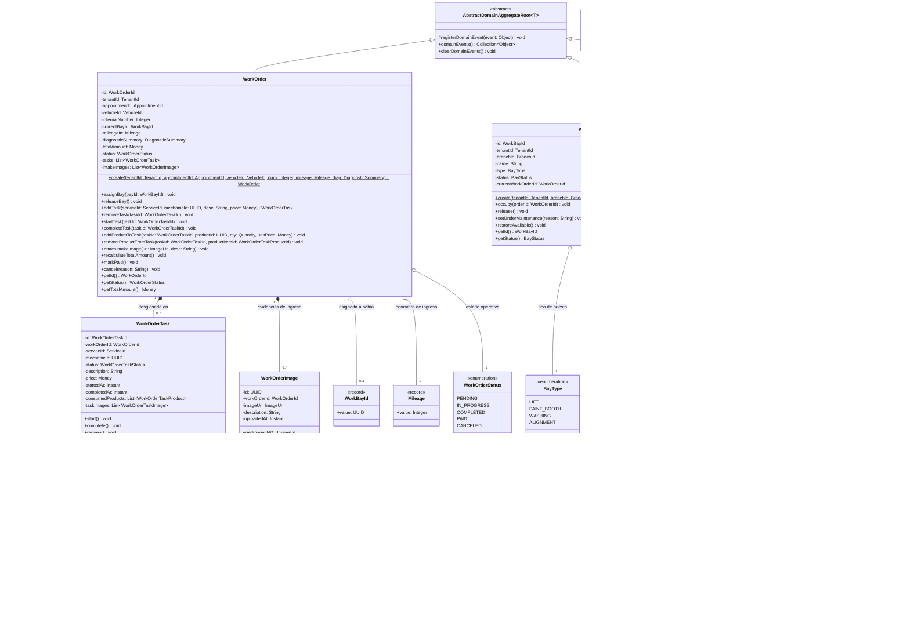

---

#### 6.7.2. 2.6.3.6.2. Bounded Context Database Diagram (ERD Relacional)

El siguiente diagrama entidad-relación (**ERD**) especifica las 7 tablas físicas asignadas a **Workshop Operations Context (MRO)** en PostgreSQL, sus tipos de datos exactos, claves primarias (`PK`), claves foráneas (`FK`) y relaciones de integridad:

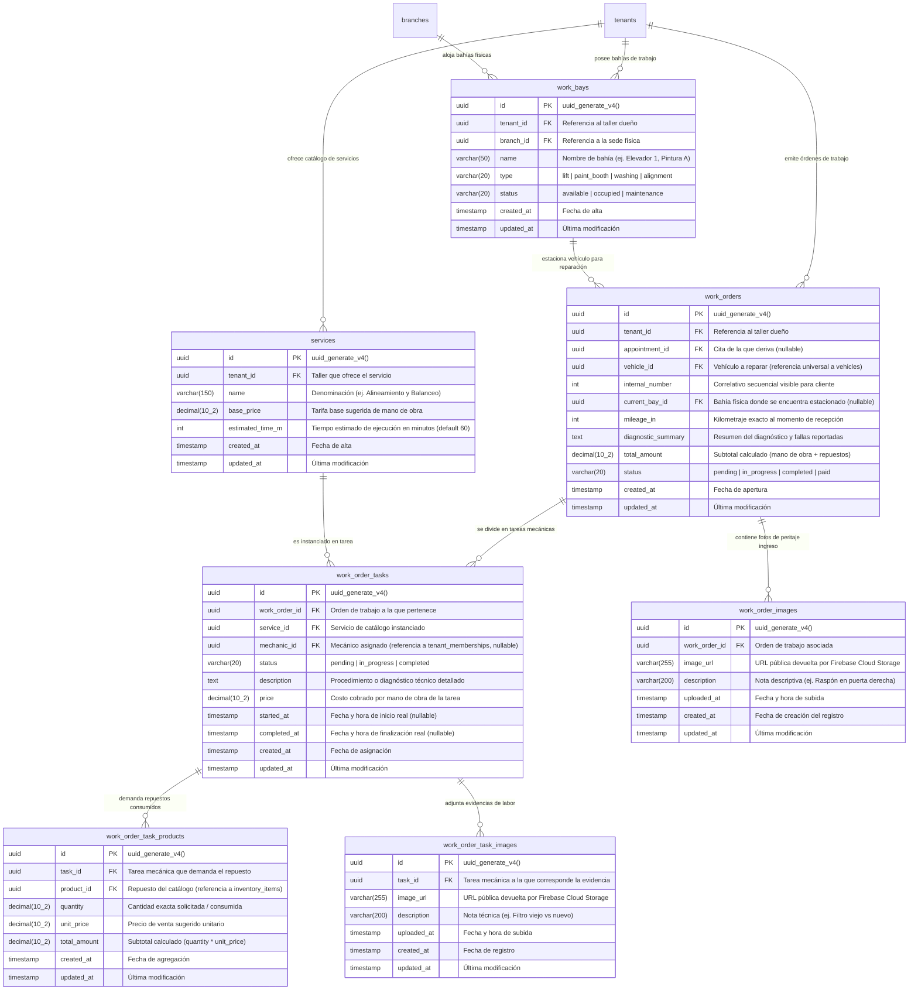

---

## 7. Fase 4: Bounded Context 4 — Inventory & Supply Chain Context (`com.andeva.atelier.platform.inventory`)

### 7.1. Diccionario y Propósito del Contexto

#### 7.1.1. Propósito y Límites de Responsabilidad
El **Inventory & Supply Chain Context** opera como el núcleo logístico y financiero de materiales de Atelier Platform. Su responsabilidad es doble: garantizar la disponibilidad continua de repuestos, fluidos y consumibles requeridos para el mantenimiento automotriz, y proteger la rentabilidad contable del taller mediante una estricta valuación del costo de ventas:
1. **Catálogo de Repuestos y Materiales (`InventoryItem`):** Centraliza el inventario físico de repuestos clasificados por categoría y codificados mediante su número de parte o código interno (`sku`). Cada ítem está aislado por taller (`TenantId`) y mantiene un precio de venta sugerido y un umbral de stock mínimo para reposición preventiva.
2. **Motor de Costeo FIFO Estricto por Lotes (`InventoryBatch`):** A diferencia de sistemas tradicionales que utilizan promedios ponderados erráticos, Atelier implementa el método **FIFO (First-In, First-Out / Primeras Entradas, Primeras Salidas)**. Cada lote de repuestos conserva su fecha y hora exacta de arribo (`arrival_date`), su costo unitario de adquisición (`unit_cost`) y su cantidad remanente (`remaining_qty`). Al demandarse repuestos desde el módulo de operaciones (MRO), el motor consume las unidades del lote más antiguo disponible, calculando con exactitud matemática el Costo de Mercadería Vendida (COGS / *Cost of Goods Sold*).
3. **Directorio de Proveedores Comerciales (`Supplier`):** Mantiene el padrón de proveedores de autopartes, lubricantes y herramientas, asociando su RUC formal (`tax_id`), datos de contacto y condiciones comerciales.
4. **Órdenes de Compra y Recepción Documental (`PurchaseOrder` y `PurchaseOrderItem`):** Administra el aprovisionamiento de stock desde la emisión del pedido hasta la recepción en la sede física (`branch_id`), vinculando el comprobante de pago emitido por el proveedor mediante una imagen escaneada o fotografiada (`receipt_image_url`).
5. **Trazabilidad Fotográfica de Facturas de Compra:** Permite al administrador o jefe de repuestos fotografiar la factura física de compra desde la aplicación móvil o web. La imagen se almacena en **Firebase Cloud Storage**, y su enlace directo queda indexado en el lote correspondiente (`receipt_image_url`), garantizando una auditoría contable visual instantánea frente a discrepancias de precios.

#### 7.1.2. Decisiones de Diseño e Integraciones Críticas
* **Resolución del Cuello de Botella de v1:** En la versión previa, el método de reserva tomaba los lotes según el orden arbitrario devuelto por el motor de persistencia en memoria, sin ordenar por fecha de recepción ni calcular el costo ponderado. En v2, el servicio de dominio `FifoAllocationEngine` ordena de forma inmutable los lotes con `arrival_date ASC` y genera un registro atómico `StockAllocation` con el desglose exacto de cada lote deducido.
* **Desacoplamiento con MRO mediante Eventos y Fachada (OHS):** El contexto MRO no accede a la tabla `inventory_batches`. Cuando una tarea en MRO demanda un repuesto, emite `ProductStockReservationRequestedEvent`. El módulo de inventario procesa este requerimiento a través de su fachada `InventoryContextFacade`, valida la existencia de stock, ejecuta la deducción FIFO y responde con éxito o error de desabastecimiento.
* **Auditoría Directa de Comprobantes de Compra:** Al recepcionar una orden de compra o crear un lote directo, la imagen del comprobante fiscal (Factura/Boleta de proveedor) se vincula directamente al lote, cerrando el círculo entre la compra física y el consumo en el foso mecánico.

---

### 7.2. 2.6.4.1. Domain Layer

#### 7.2.1. Aggregates & Aggregate Roots

##### 1. `InventoryItem` (Aggregate Root)
* **Paquete:** `com.andeva.atelier.platform.inventory.domain.model.aggregates`
* **Herencia:** Extiende `AbstractDomainAggregateRoot<InventoryItem>`
* **Propósito:** Representa un tipo de repuesto, líquido o consumible comercializado o utilizado en el taller. Es la raíz del agregado que custodia la suma virtual de existencias y sus lotes FIFO asociados.
* **Atributos:**
  * `id: InventoryItemId` — Identificador universal del repuesto (UUID).
  * `tenantId: TenantId` — Taller mecánico dueño del inventario.
  * `name: String` — Denominación comercial (ej. "Filtro de Aceite Bosch PH3614", "Aceite Sintético 5W-30 Mobil 1").
  * `sku: Sku` — Código interno o número de parte de fabricante (único por taller).
  * `category: ItemCategory` — Categoría técnica (`LUBRICANTS`, `BRAKES`, `SUSPENSION`, `ENGINE`, `ELECTRICAL`, `TIRES`, `FILTERS`).
  * `basePrice: Money` — Precio unitario de venta sugerido al cliente final.
  * `totalStock: Quantity` — Cantidad total de existencias disponibles (suma virtual de `remaining_qty` de todos los lotes activos).
  * `minimumStock: Quantity` — Umbral mínimo de existencias para disparo de alertas de reorden.
  * `status: InventoryItemStatus` — Estado del ítem (`ACTIVE`, `INACTIVE`, `DISCONTINUED`).
  * `batches: List<InventoryBatch>` — Colección interna de lotes físicos ordenados cronológicamente.
* **Invariantes y Reglas de Negocio:**
  * El `sku` debe ser único en el ámbito del `tenantId`.
  * El `totalStock` no puede ser negativo y siempre debe ser exactamente igual a la suma aritmética de los `remainingQuantity` de los lotes de la colección interna.
  * El `basePrice` debe ser superior a cero y no puede ser inferior al costo promedio de los lotes activos (regla de margen comercial mínimo).
* **Métodos:**
  * `+ static InventoryItem create(TenantId tenantId, String name, Sku sku, ItemCategory category, Money basePrice, Quantity minStock): InventoryItem`: Factoría de dominio en estado `ACTIVE` con `totalStock = 0`; registra `InventoryItemCreatedEvent`.
  * `+ InventoryBatch addBatch(SupplierId supplierId, String batchNumber, Quantity quantity, Money unitCost, Instant arrivalDate, ImageUrl receiptImageUrl): InventoryBatch`: Incorpora un nuevo lote de compras, suma la cantidad al `totalStock`, agrega el lote a la colección interna y registra `InventoryBatchAddedEvent`.
  * `+ StockAllocation allocateStockFifo(Quantity requestedQuantity): StockAllocation`:
    1. Valida que `totalStock >= requestedQuantity`; si no hay stock suficiente, lanza excepción de dominio `InsufficientStockException`.
    2. Filtra los lotes con `remainingQuantity > 0` y los ordena cronológicamente por `arrivalDate ASC`.
    3. Itera deduciendo unidades de cada lote hasta satisfacer completamente la cantidad solicitada.
    4. Calcula el Costo de Mercadería Vendida acumulado (`cogs = sum(qty * batch.unitCost)`).
    5. Actualiza `totalStock`.
    6. Si `totalStock <= minimumStock`, registra `LowStockThresholdReachedEvent`.
    7. Registra `StockAllocatedFifoEvent` y retorna el registro inmutable `StockAllocation`.
  * `+ void releaseStockAllocation(StockAllocation allocation): void`: Itera sobre las deducciones de la asignación y restituye las unidades a los lotes correspondientes, actualizando `totalStock` y registrando `StockReleasedEvent`.
  * `+ void updateDetails(String name, ItemCategory category, Money basePrice, Quantity minStock): void`: Actualiza metadatos y precio de venta sugerido.
  * `+ void deactivate(): void`: Marca el repuesto como inactivo.

##### 2. `Supplier` (Aggregate Root)
* **Paquete:** `com.andeva.atelier.platform.inventory.domain.model.aggregates`
* **Herencia:** Extiende `AbstractDomainAggregateRoot<Supplier>`
* **Propósito:** Modela al proveedor comercial de repuestos, lubricantes y consumibles del taller.
* **Atributos:**
  * `id: SupplierId` — Identificador único del proveedor (UUID).
  * `tenantId: TenantId` — Taller propietario del registro de proveedor.
  * `businessName: String` — Razón Social o nombre comercial formal.
  * `taxId: TaxId` — RUC de 11 dígitos de la empresa proveedora (validado formalmente).
  * `contactName: String` — Nombre de la persona o asesor de ventas de contacto.
  * `phone: PhoneNumber` — Teléfono de contacto.
  * `email: EmailAddress` — Correo electrónico para cotizaciones y órdenes de compra.
  * `address: String` — Dirección fiscal o almacén principal del proveedor.
  * `isActive: boolean` — Estado operativo del proveedor en el taller.
* **Invariantes y Reglas de Negocio:**
  * El `taxId` (RUC) es obligatorio y único dentro del mismo taller (`tenant_id, tax_id`).
  * `businessName` no puede ser vacío.
* **Métodos:**
  * `+ static Supplier register(TenantId tenantId, String businessName, TaxId taxId, String contactName, PhoneNumber phone, EmailAddress email, String address): Supplier`: Factoría de dominio; registra `SupplierRegisteredEvent`.
  * `+ void updateContactInfo(String contactName, PhoneNumber phone, EmailAddress email, String address): void`: Actualiza datos comerciales.
  * `+ void deactivate(): void`: Inhabilita al proveedor para futuras órdenes de compra.
  * `+ void activate(): void`: Restituye la vigencia del proveedor.

##### 3. `PurchaseOrder` (Aggregate Root)
* **Paquete:** `com.andeva.atelier.platform.inventory.domain.model.aggregates`
* **Herencia:** Extiende `AbstractDomainAggregateRoot<PurchaseOrder>`
* **Propósito:** Representa la orden formal de adquisición de repuestos emitida a un proveedor y su posterior recepción física con comprobante.
* **Atributos:**
  * `id: PurchaseOrderId` — Identificador universal de la orden de compra (UUID).
  * `tenantId: TenantId` — Taller emisor.
  * `supplierId: SupplierId` — Proveedor seleccionado.
  * `branchId: BranchId` — Sede física que recibirá la mercadería.
  * `orderNumber: String` — Correlativo interno de compra (ej. "OC-2026-0042").
  * `status: PurchaseOrderStatus` — Estado (`DRAFT`, `ISSUED`, `RECEIVED`, `CANCELED`).
  * `totalCost: Money` — Costo total de adquisición de la orden.
  * `receiptImageUrl: ImageUrl` — URL de la factura o boleta escaneada en Firebase Storage (nullable hasta recepción).
  * `receiptNumber: String` — Número del comprobante fiscal del proveedor (ej. "F001-004928", nullable hasta recepción).
  * `receivedAt: Instant` — Fecha y hora de recepción física y conformidad (nullable hasta recepción).
  * `items: List<PurchaseOrderItem>` — Colección de repuestos y cantidades compradas.
* **Invariantes y Reglas de Negocio:**
  * No se pueden modificar ítems si la orden se encuentra en estado `RECEIVED` o `CANCELED`.
  * Solo una orden en estado `ISSUED` puede ser recibida (`RECEIVED`).
  * Al transicionar a `RECEIVED`, el `receiptImageUrl` y `receiptNumber` son estrictamente obligatorios.
* **Métodos:**
  * `+ static PurchaseOrder create(TenantId tenantId, SupplierId supplierId, BranchId branchId, String orderNumber): PurchaseOrder`: Factoría en estado `DRAFT`; registra `PurchaseOrderCreatedEvent`.
  * `+ void addItem(InventoryItemId itemId, Quantity quantity, Money unitCost): void`: Incorpora un ítem a la orden y recalcula `totalCost`.
  * `+ void removeItem(PurchaseOrderItemId itemId): void`: Remueve un ítem y actualiza `totalCost`.
  * `+ void issue(): void`: Emite formalmente la orden hacia el proveedor pasando a estado `ISSUED`.
  * `+ void receive(ImageUrl receiptImageUrl, String receiptNumber, Instant receivedAt): void`:
    1. Valida comprobante y fecha.
    2. Transiciona a `RECEIVED`.
    3. Fija `receivedAt`.
    4. Dispara `PurchaseOrderReceivedEvent`, el cual desencadena la creación automática de los `InventoryBatch` en cada repuesto.
  * `+ void cancel(String reason): void`: Anula la orden de compra.

---

#### 7.2.2. Entities

##### 1. `InventoryBatch` (Entidad Dependiente de `InventoryItem`)
* **Paquete:** `com.andeva.atelier.platform.inventory.domain.model.entities`
* **Propósito:** Modela el lote físico específico ingresado al taller, portador del costo de adquisición histórico para el algoritmo FIFO.
* **Atributos:**
  * `id: InventoryBatchId` — Identificador único del lote (UUID).
  * `tenantId: TenantId` — Taller propietario.
  * `itemId: InventoryItemId` — Repuesto al que pertenece el lote.
  * `supplierId: SupplierId` — Proveedor de procedencia (nullable si es stock inicial).
  * `batchNumber: String` — Código de lote provisto por el fabricante o proveedor.
  * `initialQuantity: Quantity` — Cantidad original ingresada al almacén.
  * `remainingQuantity: Quantity` — Cantidad remanente disponible para consumo.
  * `unitCost: Money` — Costo unitario real de adquisición de este lote.
  * `arrivalDate: Instant` — Marca de tiempo exacta de recepción (clave del ordenamiento FIFO).
  * `receiptImageUrl: ImageUrl` — Enlace a la fotografía de la factura de compra en Firebase Storage.
* **Métodos:**
  * `+ boolean hasStock(): boolean`: Retorna `true` si `remainingQuantity.isGreaterThan(Quantity.ZERO)`.
  * `+ Quantity deduct(Quantity requestedQuantity): Quantity`: Deduce hasta el máximo de `remainingQuantity` disponible y retorna la cantidad efectivamente consumida de este lote.
  * `+ void restore(Quantity quantityToRestore): void`: Restituye existencias liberadas asegurando no superar `initialQuantity`.

##### 2. `PurchaseOrderItem` (Entidad Dependiente de `PurchaseOrder`)
* **Paquete:** `com.andeva.atelier.platform.inventory.domain.model.entities`
* **Propósito:** Línea de detalle de compra de un repuesto específico.
* **Atributos:**
  * `id: PurchaseOrderItemId` — Identificador del ítem (UUID).
  * `orderId: PurchaseOrderId` — Orden de compra padre.
  * `itemId: InventoryItemId` — Repuesto solicitado.
  * `quantity: Quantity` — Cantidad demandada.
  * `unitCost: Money` — Costo unitario pactado con el proveedor.
  * `totalCost: Money` — Subtotal calculado (`quantity * unitCost`).
* **Métodos:**
  * `+ void updateQuantity(Quantity newQuantity): void`: Modifica cantidad y recalcula `totalCost`.

---

#### 7.2.3. Value Objects

* **`InventoryItemId(UUID value)`:** Identificador tipado de repuesto.
* **`InventoryBatchId(UUID value)`:** Identificador tipado de lote.
* **`SupplierId(UUID value)`:** Identificador tipado de proveedor.
* **`PurchaseOrderId(UUID value)`:** Identificador tipado de orden de compra.
* **`PurchaseOrderItemId(UUID value)`:** Identificador tipado de ítem de orden de compra.
* **`Sku(String value)`:** Stock Keeping Unit. Normaliza eliminando espacios y convirtiendo a mayúsculas. Valida formato alfanumérico de 3 a 50 caracteres.
* **`Quantity(BigDecimal value)`:** Cantidad numérica no negativa con dos decimales de precisión. Métodos: `add()`, `subtract()`, `isGreaterThan()`, `isLessThanOrEqualTo()`.
* **`ItemCategory` (Enum):** `LUBRICANTS`, `BRAKES`, `SUSPENSION`, `ENGINE`, `ELECTRICAL`, `TIRES`, `FILTERS`, `BODYWORK`, `ACCESSORIES`.
* **`InventoryItemStatus` (Enum):** `ACTIVE`, `INACTIVE`, `DISCONTINUED`.
* **`PurchaseOrderStatus` (Enum):** `DRAFT`, `ISSUED`, `RECEIVED`, `CANCELED`.
* **`StockAllocation(UUID allocationId, Quantity allocatedQuantity, Money totalCostOfGoodsSold, List<BatchDeduction> deductions)`:** Registro inmutable que encapsula el resultado de una deducción FIFO completa, incluyendo el Costo de Ventas (COGS) ponderado.
* **`BatchDeduction(UUID batchId, Quantity quantityDeducted, Money unitCost)`:** Detalle de las unidades y costo extraídos de un lote específico.

---

#### 7.2.4. Domain Commands

* `CreateInventoryItemCommand(TenantId tenantId, String name, String sku, String category, BigDecimal basePrice, BigDecimal minStock, String currency)`
* `AddInventoryBatchCommand(InventoryItemId itemId, UUID supplierId, String batchNumber, BigDecimal quantity, BigDecimal unitCost, String currency, String receiptImageUrl)`
* `AllocateStockFifoCommand(InventoryItemId itemId, BigDecimal quantity)`
* `ReleaseStockAllocationCommand(InventoryItemId itemId, StockAllocation allocation)`
* `UpdateInventoryItemCommand(InventoryItemId itemId, String name, String category, BigDecimal basePrice, BigDecimal minStock, String currency)`
* `RegisterSupplierCommand(TenantId tenantId, String businessName, String taxId, String contactName, String phone, String email, String address)`
* `UpdateSupplierCommand(SupplierId supplierId, String contactName, String phone, String email, String address)`
* `CreatePurchaseOrderCommand(TenantId tenantId, SupplierId supplierId, BranchId branchId, String orderNumber)`
* `AddPurchaseOrderItemCommand(PurchaseOrderId orderId, InventoryItemId itemId, BigDecimal quantity, BigDecimal unitCost, String currency)`
* `IssuePurchaseOrderCommand(PurchaseOrderId orderId)`
* `ReceivePurchaseOrderCommand(PurchaseOrderId orderId, String receiptImageUrl, String receiptNumber, Instant receivedAt)`
* `CancelPurchaseOrderCommand(PurchaseOrderId orderId, String reason)`

---

#### 7.2.5. Domain Queries

* `GetInventoryItemByIdQuery(InventoryItemId itemId)`
* `GetInventoryItemsByTenantIdQuery(TenantId tenantId)`
* `GetInventoryBatchesByItemIdQuery(InventoryItemId itemId)`
* `GetLowStockItemsQuery(TenantId tenantId)`
* `GetInventoryValuationQuery(TenantId tenantId)`
* `GetSupplierByIdQuery(SupplierId supplierId)`
* `GetSuppliersByTenantIdQuery(TenantId tenantId)`
* `GetPurchaseOrderByIdQuery(PurchaseOrderId orderId)`
* `GetPurchaseOrdersByTenantIdQuery(TenantId tenantId)`

---

#### 7.2.6. Domain Events

* `InventoryItemCreatedEvent(InventoryItemId itemId, TenantId tenantId, Sku sku, String name, Instant occurredOn)`
* `InventoryBatchAddedEvent(InventoryBatchId batchId, InventoryItemId itemId, Quantity quantity, Money unitCost, Instant occurredOn)`
* `StockAllocatedFifoEvent(InventoryItemId itemId, Quantity allocatedQuantity, Money cogs, Instant occurredOn)`
* `StockReleasedEvent(InventoryItemId itemId, Quantity releasedQuantity, Instant occurredOn)`
* `LowStockThresholdReachedEvent(InventoryItemId itemId, TenantId tenantId, Quantity currentStock, Quantity minStock, Instant occurredOn)`
* `SupplierRegisteredEvent(SupplierId supplierId, TenantId tenantId, String businessName, TaxId taxId, Instant occurredOn)`
* `PurchaseOrderCreatedEvent(PurchaseOrderId orderId, TenantId tenantId, SupplierId supplierId, Instant occurredOn)`
* `PurchaseOrderReceivedEvent(PurchaseOrderId orderId, TenantId tenantId, SupplierId supplierId, Money totalCost, Instant occurredOn)`
* `PurchaseOrderCanceledEvent(PurchaseOrderId orderId, String reason, Instant occurredOn)`

---

#### 7.2.7. Repositories (Interfaces de Dominio)

* **`InventoryItemRepository`:**
  * `InventoryItem save(InventoryItem item)`
  * `Optional<InventoryItem> findById(InventoryItemId id)`
  * `Optional<InventoryItem> findByTenantIdAndSku(TenantId tenantId, Sku sku)`
  * `List<InventoryItem> findByTenantId(TenantId tenantId)`
  * `List<InventoryItem> findLowStockItems(TenantId tenantId)`
  * `boolean existsByTenantIdAndSku(TenantId tenantId, Sku sku)`
* **`InventoryBatchRepository`:**
  * `InventoryBatch save(InventoryBatch batch)`
  * `List<InventoryBatch> findByItemIdOrderByArrivalDateAsc(InventoryItemId itemId)`
  * `List<InventoryBatch> findActiveBatchesByItemId(InventoryItemId itemId)`
* **`SupplierRepository`:**
  * `Supplier save(Supplier supplier)`
  * `Optional<Supplier> findById(SupplierId id)`
  * `Optional<Supplier> findByTenantIdAndTaxId(TenantId tenantId, TaxId taxId)`
  * `List<Supplier> findByTenantId(TenantId tenantId)`
* **`PurchaseOrderRepository`:**
  * `PurchaseOrder save(PurchaseOrder order)`
  * `Optional<PurchaseOrder> findById(PurchaseOrderId id)`
  * `List<PurchaseOrder> findByTenantId(TenantId tenantId)`
  * `List<PurchaseOrder> findBySupplierId(SupplierId supplierId)`

---

### 7.3. 2.6.4.2. Interface Layer

#### 7.3.1. REST Controllers

##### 1. `InventoryItemsController`
* **Ruta Base:** `/api/v1/inventory/items`
* **Propósito:** Catálogo de repuestos, precios y consulta de existencias.
* **Endpoints:**
  * `POST`: Creación de nuevo repuesto en catálogo. Recibe `CreateInventoryItemResource`, retorna `InventoryItemResource` (HTTP 201 Created).
  * `GET`: Listado del catálogo de repuestos con stock disponible. Retorna `List<InventoryItemSummaryResource>` (HTTP 200 OK).
  * `GET /{id}`: Detalle del repuesto con desglose de sus lotes activos. Retorna `InventoryItemDetailResource` (HTTP 200 OK / 404 Not Found).
  * `PUT /{id}`: Actualización de precio, SKU y stock mínimo. Recibe `UpdateInventoryItemResource`, retorna `InventoryItemResource` (HTTP 200 OK).
  * `GET /low-stock`: Listado de repuestos en situación crítica por debajo del umbral mínimo. Retorna `List<InventoryItemSummaryResource>` (HTTP 200 OK).
  * `GET /valuation`: Cálculo de valuación total del inventario a costo FIFO. Retorna `InventoryValuationResource` (HTTP 200 OK).

##### 2. `InventoryBatchesController`
* **Ruta Base:** `/api/v1/inventory/items/{itemId}/batches`
* **Propósito:** Incorporación directa de lotes de repuestos con factura.
* **Endpoints:**
  * `POST`: Ingreso manual de lote con costo unitario y foto de factura. Recibe `AddInventoryBatchResource`, retorna `InventoryBatchResource` (HTTP 201 Created).
  * `GET`: Trazabilidad histórica de todos los lotes del repuesto. Retorna `List<InventoryBatchResource>` (HTTP 200 OK).

##### 3. `SuppliersController`
* **Ruta Base:** `/api/v1/inventory/suppliers`
* **Propósito:** Gestión del directorio comercial de proveedores.
* **Endpoints:**
  * `POST`: Registro de proveedor de repuestos. Recibe `CreateSupplierResource`, retorna `SupplierResource` (HTTP 201 Created).
  * `GET`: Directorio de proveedores del taller. Retorna `List<SupplierResource>` (HTTP 200 OK).
  * `GET /{id}`: Detalle de proveedor. Retorna `SupplierResource` (HTTP 200 OK).
  * `PUT /{id}`: Actualización de contacto y dirección. Recibe `UpdateSupplierResource`, retorna `SupplierResource` (HTTP 200 OK).

##### 4. `PurchaseOrdersController`
* **Ruta Base:** `/api/v1/inventory/purchase-orders`
* **Propósito:** Órdenes de compra y recepción de mercadería con comprobante.
* **Endpoints:**
  * `POST`: Creación de orden de compra en borrador. Recibe `CreatePurchaseOrderResource`, retorna `PurchaseOrderResource` (HTTP 201 Created).
  * `GET`: Listado de órdenes de compra del taller. Retorna `List<PurchaseOrderResource>` (HTTP 200 OK).
  * `POST /{id}/items`: Adición de repuestos a la orden de compra. Recibe `AddPurchaseOrderItemResource`, retorna `PurchaseOrderResource` (HTTP 201 Created).
  * `PUT /{id}/issue`: Emisión formal al proveedor. Retorna `PurchaseOrderResource` (HTTP 200 OK).
  * `PUT /{id}/receive`: Conformidad de recepción con subida de factura escaneada. Recibe `ReceivePurchaseOrderResource`, retorna `PurchaseOrderResource` (HTTP 200 OK).
  * `PUT /{id}/cancel`: Anulación de la orden. Recibe `CancelPurchaseOrderResource`, retorna `PurchaseOrderResource` (HTTP 200 OK).

---

#### 7.3.2. Resources / DTOs

* **Peticiones (Requests):**
  * `CreateInventoryItemResource(String name, String sku, String category, BigDecimal basePrice, BigDecimal minStock, String currency)`
  * `UpdateInventoryItemResource(String name, String category, BigDecimal basePrice, BigDecimal minStock, String currency)`
  * `AddInventoryBatchResource(UUID supplierId, String batchNumber, BigDecimal quantity, BigDecimal unitCost, String currency, String receiptImageUrl)`
  * `CreateSupplierResource(String businessName, String taxId, String contactName, String phone, String email, String address)`
  * `UpdateSupplierResource(String contactName, String phone, String email, String address)`
  * `CreatePurchaseOrderResource(UUID supplierId, UUID branchId, String orderNumber)`
  * `AddPurchaseOrderItemResource(UUID itemId, BigDecimal quantity, BigDecimal unitCost, String currency)`
  * `ReceivePurchaseOrderResource(String receiptImageUrl, String receiptNumber, Instant receivedAt)`
  * `CancelPurchaseOrderResource(String reason)`
* **Respuestas (Responses):**
  * `InventoryItemResource(UUID id, UUID tenantId, String name, String sku, String category, BigDecimal basePrice, BigDecimal totalStock, BigDecimal minimumStock, String status, String currency)`
  * `InventoryItemSummaryResource(UUID id, String name, String sku, String category, BigDecimal basePrice, BigDecimal totalStock, String currency)`
  * `InventoryItemDetailResource(UUID id, String name, String sku, String category, BigDecimal basePrice, BigDecimal totalStock, BigDecimal minimumStock, String currency, List<InventoryBatchResource> batches)`
  * `InventoryBatchResource(UUID id, UUID itemId, UUID supplierId, String supplierName, String batchNumber, BigDecimal initialQuantity, BigDecimal remainingQuantity, BigDecimal unitCost, String currency, Instant arrivalDate, String receiptImageUrl)`
  * `SupplierResource(UUID id, UUID tenantId, String businessName, String taxId, String contactName, String phone, String email, String address, boolean isActive)`
  * `PurchaseOrderResource(UUID id, UUID tenantId, UUID supplierId, String supplierName, UUID branchId, String orderNumber, String status, BigDecimal totalCost, String currency, String receiptImageUrl, String receiptNumber, Instant receivedAt, List<PurchaseOrderItemResource> items)`
  * `PurchaseOrderItemResource(UUID id, UUID itemId, String itemName, String sku, BigDecimal quantity, BigDecimal unitCost, BigDecimal totalCost, String currency)`
  * `InventoryValuationResource(UUID tenantId, BigDecimal totalValuation, int distinctItemsCount, Instant calculatedAt)`

---

#### 7.3.3. Resource Assemblers

* `InventoryItemResourceAssembler`: Mapea `InventoryItem` a `InventoryItemResource`, `InventoryItemSummaryResource` y `InventoryItemDetailResource`.
* `InventoryBatchResourceAssembler`: Mapea `InventoryBatch` a `InventoryBatchResource`.
* `SupplierResourceAssembler`: Mapea `Supplier` a `SupplierResource`.
* `PurchaseOrderResourceAssembler`: Mapea `PurchaseOrder` a `PurchaseOrderResource`.

---

#### 7.3.4. Open Host Service (OHS) / Inbound ACL Facade

Interfaz pública en `com.andeva.atelier.platform.inventory.interfaces.acl`:

```java
package com.andeva.atelier.platform.inventory.interfaces.acl;

import com.andeva.atelier.platform.shared.application.result.Result;
import java.math.BigDecimal;
import java.util.List;
import java.util.Optional;
import java.util.UUID;

public interface InventoryContextFacade {
    Result<StockAllocationAclDto, String> reserveStockForWorkOrder(UUID tenantId, UUID itemId, BigDecimal quantity);
    void releaseStockReservation(UUID tenantId, UUID itemId, List<BatchDeductionAclDto> deductions);
    Optional<InventoryItemSummaryAclDto> fetchItemSummary(UUID itemId);
    BigDecimal fetchItemCurrentStock(UUID itemId);
    BigDecimal calculateInventoryValuation(UUID tenantId);
}
```

*DTOs Exportados por la Fachada:*
* `StockAllocationAclDto(UUID allocationId, BigDecimal allocatedQuantity, BigDecimal totalCogs, List<BatchDeductionAclDto> deductions)`
* `BatchDeductionAclDto(UUID batchId, BigDecimal quantityDeducted, BigDecimal unitCost)`
* `InventoryItemSummaryAclDto(UUID id, UUID tenantId, String name, String sku, BigDecimal basePrice, BigDecimal totalStock)`

---

#### 7.3.5. Integration Events (Published Language)

* `StockReservedIntegrationEvent(UUID workOrderId, UUID itemId, BigDecimal quantity, BigDecimal cogsAmount, Instant occurredOn)`: Confirma la reserva exitosa y transmite el Costo de Ventas a contabilidad.
* `StockReservationFailedIntegrationEvent(UUID workOrderId, UUID itemId, BigDecimal requestedQuantity, String reason, Instant occurredOn)`: Alerta a MRO de que el repuesto no tiene existencias para detener la orden.
* `StockLowIntegrationEvent(UUID tenantId, UUID itemId, String sku, BigDecimal currentStock, BigDecimal minimumStock, Instant occurredOn)`: Dispara alertas en el panel de compras para reposición.
* `BatchReceivedIntegrationEvent(UUID batchId, UUID itemId, BigDecimal quantity, BigDecimal unitCost, Instant occurredOn)`: Registra el alta física de materiales en el sistema.

---

### 7.4. 2.6.4.3. Application Layer

#### 7.4.1. Command Services & Implementations

##### 1. `InventoryItemCommandService` & `InventoryItemCommandServiceImpl`
* `Result<InventoryItem, ApplicationError> handle(CreateInventoryItemCommand command)`:
  1. Valida que el `sku` no exista en el taller (`InventoryItemRepository.existsByTenantIdAndSku`).
  2. Instancia `InventoryItem` vía factoría estática `create`.
  3. Persiste el agregado y retorna `Result.success(item)`.
* `Result<InventoryBatch, ApplicationError> handle(AddInventoryBatchCommand command)`:
  1. Localiza el repuesto por ID (`InventoryItemRepository.findById`).
  2. Valida la existencia del proveedor si se proveyó `supplierId`.
  3. Ejecuta `item.addBatch(supplierId, batchNumber, quantity, unitCost, arrivalDate, receiptImageUrl)`.
  4. Persiste el agregado con su nuevo lote y actualiza el stock total.
* `Result<StockAllocation, ApplicationError> handle(AllocateStockFifoCommand command)`:
  1. Localiza el repuesto.
  2. Ejecuta `item.allocateStockFifo(requestedQuantity)`.
  3. Persiste las deducciones en los lotes.
  4. Retorna el objeto de resultado `StockAllocation` con el Costo de Ventas (COGS).
* `Result<Void, ApplicationError> handle(ReleaseStockAllocationCommand command)`: Restituye las unidades a los lotes y actualiza `totalStock`.
* `Result<InventoryItem, ApplicationError> handle(UpdateInventoryItemCommand command)`: Actualiza precio y parámetros de catálogo.

##### 2. `SupplierCommandService` & `SupplierCommandServiceImpl`
* `Result<Supplier, ApplicationError> handle(RegisterSupplierCommand command)`: Valida RUC de 11 dígitos, verifica unicidad por taller y persiste al proveedor.
* `Result<Supplier, ApplicationError> handle(UpdateSupplierCommand command)`: Modifica datos de contacto y dirección.

##### 3. `PurchaseOrderCommandService` & `PurchaseOrderCommandServiceImpl`
* `Result<PurchaseOrder, ApplicationError> handle(CreatePurchaseOrderCommand command)`: Instancia orden de compra en estado `DRAFT`.
* `Result<PurchaseOrder, ApplicationError> handle(AddPurchaseOrderItemCommand command)`: Agrega repuestos a comprar y recalcula el costo total.
* `Result<PurchaseOrder, ApplicationError> handle(IssuePurchaseOrderCommand command)`: Emite formalmente la orden al proveedor (`ISSUED`).
* `Result<PurchaseOrder, ApplicationError> handle(ReceivePurchaseOrderCommand command)`:
  1. Marca la orden como `RECEIVED`, registrando la foto de la factura y número de comprobante.
  2. Itera sobre cada ítem de la orden y ejecuta `inventoryItem.addBatch(...)` automáticamente, creando los lotes FIFO correspondientes.
  3. Persiste los repuestos actualizados y la orden de compra.

---

#### 7.4.2. Query Services & Implementations

* **`InventoryItemQueryService` & `InventoryItemQueryServiceImpl`:**
  * `Optional<InventoryItem> handle(GetInventoryItemByIdQuery query)`
  * `List<InventoryItem> handle(GetInventoryItemsByTenantIdQuery query)`
  * `List<InventoryItem> handle(GetLowStockItemsQuery query)`
  * `BigDecimal handle(GetInventoryValuationQuery query)`: Suma ponderada `sum(remainingQuantity * unitCost)` de todos los lotes activos del taller.
* **`SupplierQueryService` & `SupplierQueryServiceImpl`:**
  * `Optional<Supplier> handle(GetSupplierByIdQuery query)`
  * `List<Supplier> handle(GetSuppliersByTenantIdQuery query)`
* **`PurchaseOrderQueryService` & `PurchaseOrderQueryServiceImpl`:**
  * `Optional<PurchaseOrder> handle(GetPurchaseOrderByIdQuery query)`
  * `List<PurchaseOrder> handle(GetPurchaseOrdersByTenantIdQuery query)`

---

#### 7.4.3. Event Handlers & Listeners

* **`WorkOrderOperationsStockListener`:**
  * `@EventListener void on(ProductStockReservationRequestedEvent event)`: Escucha la solicitud de repuestos desde *Workshop Operations (MRO)*, localiza el `InventoryItem`, ejecuta la deducción FIFO y publica `StockReservedIntegrationEvent` o `StockReservationFailedIntegrationEvent`.
* **`WorkOrderOperationsStockCancelledListener`:**
  * `@EventListener void on(ProductStockReservationCancelledEvent event)`: Restituye el stock liberado a los lotes.

---

#### 7.4.4. Outbound ACL Services

* **`FirebaseReceiptImageStorageGateway`:** Valida la autenticidad y accesibilidad de las fotos de facturas y boletas almacenadas en Google Cloud Storage / Firebase Storage.

---

### 7.5. 2.6.4.4. Infrastructure Layer

#### 7.5.1. JPA Persistence Entities

Ubicadas en `com.andeva.atelier.platform.inventory.infrastructure.persistence.jpa.entities`:

##### 1. `InventoryItemPersistenceEntity` (Tabla `inventory_items`)
* Extiende `AuditableAbstractPersistenceEntity`.
* `@Column(name = "tenant_id", nullable = false)`: Taller dueño del inventario.
* `@Column(name = "name", nullable = false, length = 150)`: Nombre del repuesto.
* `@Column(name = "sku", nullable = false, length = 50)`: Stock Keeping Unit.
* `@Column(name = "category", length = 50)`: Categoría del repuesto.
* `@Column(name = "base_price", precision = 10, scale = 2, nullable = false)`: Precio de venta sugerido.
* `@Column(name = "total_stock", precision = 10, scale = 2, nullable = false)`: Stock total disponible.
* `@Column(name = "minimum_stock", precision = 10, scale = 2, nullable = false)`: Umbral mínimo.
* `@Column(name = "status", nullable = false, length = 20)`: `active`, `inactive`, `discontinued`.
* `@OneToMany(mappedBy = "item", cascade = CascadeType.ALL, orphanRemoval = true)`: Colección de `InventoryBatchPersistenceEntity`.

##### 2. `InventoryBatchPersistenceEntity` (Tabla `inventory_batches`)
* Extiende `AuditableAbstractPersistenceEntity`.
* `@Column(name = "tenant_id", nullable = false)`: Taller dueño.
* `@ManyToOne(fetch = FetchType.LAZY) @JoinColumn(name = "item_id", nullable = false)`: Repuesto padre.
* `@Column(name = "supplier_id")`: Proveedor de origen (nullable).
* `@Column(name = "batch_number", length = 50)`: Código de lote.
* `@Column(name = "initial_qty", precision = 10, scale = 2, nullable = false)`: Cantidad de ingreso original.
* `@Column(name = "remaining_qty", precision = 10, scale = 2, nullable = false)`: Cantidad disponible actual (FIFO).
* `@Column(name = "unit_cost", precision = 10, scale = 2, nullable = false)`: Costo exacto de adquisición.
* `@Column(name = "arrival_date", nullable = false)`: Timestamp de recepción (ordenamiento cronológico FIFO).
* `@Column(name = "receipt_image_url", length = 255)`: URL en Firebase Storage de la factura de compra.

##### 3. `SupplierPersistenceEntity` (Tabla `suppliers`)
* Extiende `AuditableAbstractPersistenceEntity`.
* `@Column(name = "tenant_id", nullable = false)`: Taller dueño del registro.
* `@Column(name = "business_name", nullable = false, length = 150)`: Razón social del proveedor.
* `@Column(name = "tax_id", length = 20)`: RUC de 11 dígitos.
* `@Column(name = "contact_name", length = 100)`: Persona de contacto.
* `@Column(name = "phone", length = 20)`: Teléfono.
* `@Column(name = "email", length = 150)`: Correo electrónico.
* `@Column(name = "address", length = 200)`: Dirección fiscal.
* `@Column(name = "is_active", nullable = false)`: Estado del proveedor.

##### 4. `PurchaseOrderPersistenceEntity` (Tabla `purchase_orders`)
* Extiende `AuditableAbstractPersistenceEntity`.
* `@Column(name = "tenant_id", nullable = false)`: Taller emisor.
* `@Column(name = "supplier_id", nullable = false)`: Proveedor adjudicado.
* `@Column(name = "branch_id", nullable = false)`: Sede receptora.
* `@Column(name = "order_number", nullable = false, length = 50)`: Correlativo de orden de compra.
* `@Column(name = "status", nullable = false, length = 20)`: `draft`, `issued`, `received`, `canceled`.
* `@Column(name = "total_cost", precision = 10, scale = 2, nullable = false)`: Monto total.
* `@Column(name = "receipt_image_url", length = 255)`: Foto de la factura de compra escaneada.
* `@Column(name = "receipt_number", length = 50)`: Número del comprobante fiscal del proveedor.
* `@Column(name = "received_at")`: Fecha y hora de recepción física.
* `@OneToMany(mappedBy = "order", cascade = CascadeType.ALL, orphanRemoval = true)`: Colección de `PurchaseOrderItemPersistenceEntity`.

##### 5. `PurchaseOrderItemPersistenceEntity` (Tabla `purchase_order_items`)
* Extiende `AuditableAbstractPersistenceEntity`.
* `@ManyToOne(fetch = FetchType.LAZY) @JoinColumn(name = "purchase_order_id", nullable = false)`: Orden de compra.
* `@Column(name = "item_id", nullable = false)`: Repuesto adquirido.
* `@Column(name = "quantity", precision = 10, scale = 2, nullable = false)`: Cantidad comprada.
* `@Column(name = "unit_cost", precision = 10, scale = 2, nullable = false)`: Costo unitario acordado.
* `@Column(name = "total_cost", precision = 10, scale = 2, nullable = false)`: Subtotal (`quantity * unit_cost`).

---

#### 7.5.2. JPA Persistence Repositories

* `InventoryItemPersistenceRepository extends JpaRepository<InventoryItemPersistenceEntity, UUID>`
* `InventoryBatchPersistenceRepository extends JpaRepository<InventoryBatchPersistenceEntity, UUID>`
* `SupplierPersistenceRepository extends JpaRepository<SupplierPersistenceEntity, UUID>`
* `PurchaseOrderPersistenceRepository extends JpaRepository<PurchaseOrderPersistenceEntity, UUID>`
* `PurchaseOrderItemPersistenceRepository extends JpaRepository<PurchaseOrderItemPersistenceEntity, UUID>`

---

#### 7.5.3. JPA Adapters (`*RepositoryImpl`)

* `InventoryItemRepositoryImpl implements InventoryItemRepository`
* `InventoryBatchRepositoryImpl implements InventoryBatchRepository`
* `SupplierRepositoryImpl implements SupplierRepository`
* `PurchaseOrderRepositoryImpl implements PurchaseOrderRepository`

---

#### 7.5.4. Persistence Assemblers

* `InventoryItemPersistenceAssembler`: Transforma `InventoryItem` <-> `InventoryItemPersistenceEntity` y sus lotes anidados.
* `SupplierPersistenceAssembler`: Transforma `Supplier` <-> `SupplierPersistenceEntity`.
* `PurchaseOrderPersistenceAssembler`: Transforma `PurchaseOrder` <-> `PurchaseOrderPersistenceEntity`.

---

#### 7.5.5. JPA Converters & Embeddables

* `SkuAttributeConverter`: Convierte `Sku` a `varchar(50)`.
* `QuantityAttributeConverter`: Convierte `Quantity` a `decimal(10,2)`.
* `PurchaseOrderStatusAttributeConverter`: Convierte `PurchaseOrderStatus` a `varchar(20)`.
* `ItemCategoryAttributeConverter`: Convierte `ItemCategory` a `varchar(50)`.

---

#### 7.5.6. Clientes y Pasarelas de Infraestructura Externa

##### 1. `FirebaseStorageInvoiceClient` (Google Cloud Storage)
* Paquete: `com.andeva.atelier.platform.inventory.infrastructure.external.firebase`
* Genera URLs seguras para inspección de facturas de compra y valida que las imágenes cargadas correspondan al formato PDF o imágenes JPG/PNG válidas.

---

### 7.6. 2.6.4.5. Bounded Context Software Architecture Component Level Diagram

El siguiente diagrama en modelo **C4 Component (Nivel 3)** ilustra la descomposición interna del contenedor Backend (`API Application`) para el **Inventory & Supply Chain Context**:

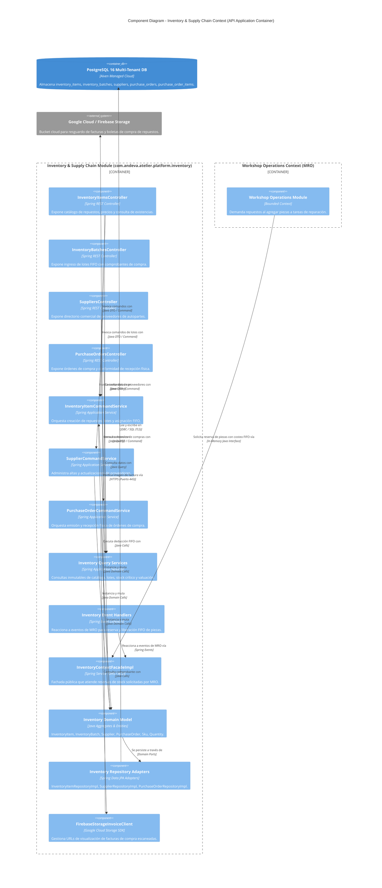

---

### 7.7. 2.6.4.6. Bounded Context Software Architecture Code Level Diagrams

#### 7.7.1. 2.6.4.6.1. Bounded Context Domain Layer Class Diagram

El siguiente diagrama UML de clases detalla las clases, entidades, registros inmutables y relaciones que conforman la capa de dominio de **Inventory & Supply Chain Context**:

```mermaid
classDiagram
    direction TB

    class AbstractDomainAggregateRoot~T~ {
        <<abstract>>
        #registerDomainEvent(event: Object) void
        +domainEvents() Collection~Object~
        +clearDomainEvents() void
    }

    class InventoryItem {
        -id: InventoryItemId
        -tenantId: TenantId
        -name: String
        -sku: Sku
        -category: ItemCategory
        -basePrice: Money
        -totalStock: Quantity
        -minimumStock: Quantity
        -status: InventoryItemStatus
        -batches: List~InventoryBatch~
        +create(tenantId: TenantId, name: String, sku: Sku, cat: ItemCategory, price: Money, minStock: Quantity)$ InventoryItem
        +addBatch(supplierId: SupplierId, batchNum: String, qty: Quantity, unitCost: Money, arrival: Instant, receipt: ImageUrl) InventoryBatch
        +allocateStockFifo(requestedQty: Quantity) StockAllocation
        +releaseStockAllocation(allocation: StockAllocation) void
        +updateDetails(name: String, cat: ItemCategory, price: Money, minStock: Quantity) void
        +deactivate() void
        +getId() InventoryItemId
        +getTotalStock() Quantity
        +getBasePrice() Money
        +getSku() Sku
    }

    class InventoryBatch {
        -id: InventoryBatchId
        -tenantId: TenantId
        -itemId: InventoryItemId
        -supplierId: SupplierId
        -batchNumber: String
        -initialQuantity: Quantity
        -remainingQuantity: Quantity
        -unitCost: Money
        -arrivalDate: Instant
        -receiptImageUrl: ImageUrl
        +hasStock() boolean
        +deduct(requestedQty: Quantity) Quantity
        +restore(qtyToRestore: Quantity) void
        +getId() InventoryBatchId
        +getRemainingQuantity() Quantity
        +getUnitCost() Money
        +getArrivalDate() Instant
    }

    class Supplier {
        -id: SupplierId
        -tenantId: TenantId
        -businessName: String
        -taxId: TaxId
        -contactName: String
        -phone: PhoneNumber
        -email: EmailAddress
        -address: String
        -isActive: boolean
        +register(tenantId: TenantId, name: String, taxId: TaxId, contact: String, phone: PhoneNumber, email: EmailAddress, address: String)$ Supplier
        +updateContactInfo(contact: String, phone: PhoneNumber, email: EmailAddress, address: String) void
        +deactivate() void
        +activate() void
        +getId() SupplierId
        +getBusinessName() String
        +getTaxId() TaxId
    }

    class PurchaseOrder {
        -id: PurchaseOrderId
        -tenantId: TenantId
        -supplierId: SupplierId
        -branchId: BranchId
        -orderNumber: String
        -status: PurchaseOrderStatus
        -totalCost: Money
        -receiptImageUrl: ImageUrl
        -receiptNumber: String
        -receivedAt: Instant
        -items: List~PurchaseOrderItem~
        +create(tenantId: TenantId, supplierId: SupplierId, branchId: BranchId, orderNum: String)$ PurchaseOrder
        +addItem(itemId: InventoryItemId, qty: Quantity, unitCost: Money) void
        +removeItem(itemId: PurchaseOrderItemId) void
        +issue() void
        +receive(receiptUrl: ImageUrl, receiptNum: String, receivedAt: Instant) void
        +cancel(reason: String) void
        +getId() PurchaseOrderId
        +getStatus() PurchaseOrderStatus
        +getTotalCost() Money
    }

    class PurchaseOrderItem {
        -id: PurchaseOrderItemId
        -orderId: PurchaseOrderId
        -itemId: InventoryItemId
        -quantity: Quantity
        -unitCost: Money
        -totalCost: Money
        +updateQuantity(newQty: Quantity) void
        +getId() PurchaseOrderItemId
        +getTotalCost() Money
        +getQuantity() Quantity
    }

    class StockAllocation {
        <<record>>
        +allocationId: UUID
        +allocatedQuantity: Quantity
        +totalCostOfGoodsSold: Money
        +deductions: List~BatchDeduction~
    }

    class BatchDeduction {
        <<record>>
        +batchId: UUID
        +quantityDeducted: Quantity
        +unitCost: Money
    }

    class InventoryItemId {
        <<record>>
        +value: UUID
    }

    class InventoryBatchId {
        <<record>>
        +value: UUID
    }

    class SupplierId {
        <<record>>
        +value: UUID
    }

    class PurchaseOrderId {
        <<record>>
        +value: UUID
    }

    class PurchaseOrderItemId {
        <<record>>
        +value: UUID
    }

    class Sku {
        <<record>>
        +value: String
    }

    class Quantity {
        <<record>>
        +value: BigDecimal
    }

    class ItemCategory {
        <<enumeration>>
        LUBRICANTS
        BRAKES
        SUSPENSION
        ENGINE
        ELECTRICAL
        TIRES
        FILTERS
        BODYWORK
        ACCESSORIES
    }

    class InventoryItemStatus {
        <<enumeration>>
        ACTIVE
        INACTIVE
        DISCONTINUED
    }

    class PurchaseOrderStatus {
        <<enumeration>>
        DRAFT
        ISSUED
        RECEIVED
        CANCELED
    }

    AbstractDomainAggregateRoot <|-- InventoryItem
    AbstractDomainAggregateRoot <|-- Supplier
    AbstractDomainAggregateRoot <|-- PurchaseOrder

    InventoryItem "1" *-- "0..*" InventoryBatch : compuesto por lotes FIFO
    InventoryItem o-- "1" Sku : código único
    InventoryItem o-- "1" ItemCategory : categoría
    InventoryItem o-- "1" InventoryItemStatus : estado
    InventoryItem o-- "1" Quantity : stock total

    InventoryBatch o-- "0..1" SupplierId : adquirido de
    InventoryBatch o-- "1" Quantity : remanente

    PurchaseOrder "1" *-- "1..*" PurchaseOrderItem : contiene líneas
    PurchaseOrder o-- "1" SupplierId : emitida a
    PurchaseOrder o-- "1" PurchaseOrderStatus : estado

    PurchaseOrderItem o-- "1" InventoryItemId : repuesto comprado
```

---

#### 7.7.2. 2.6.4.6.2. Bounded Context Database Diagram (ERD Relacional)

El siguiente diagrama relacional (**ERD**) especifica las 5 tablas físicas asignadas a **Inventory & Supply Chain Context** en PostgreSQL, sus tipos de datos, claves primarias (`PK`), claves foráneas (`FK`), restricciones de unicidad (`UK`) y relaciones de integridad:

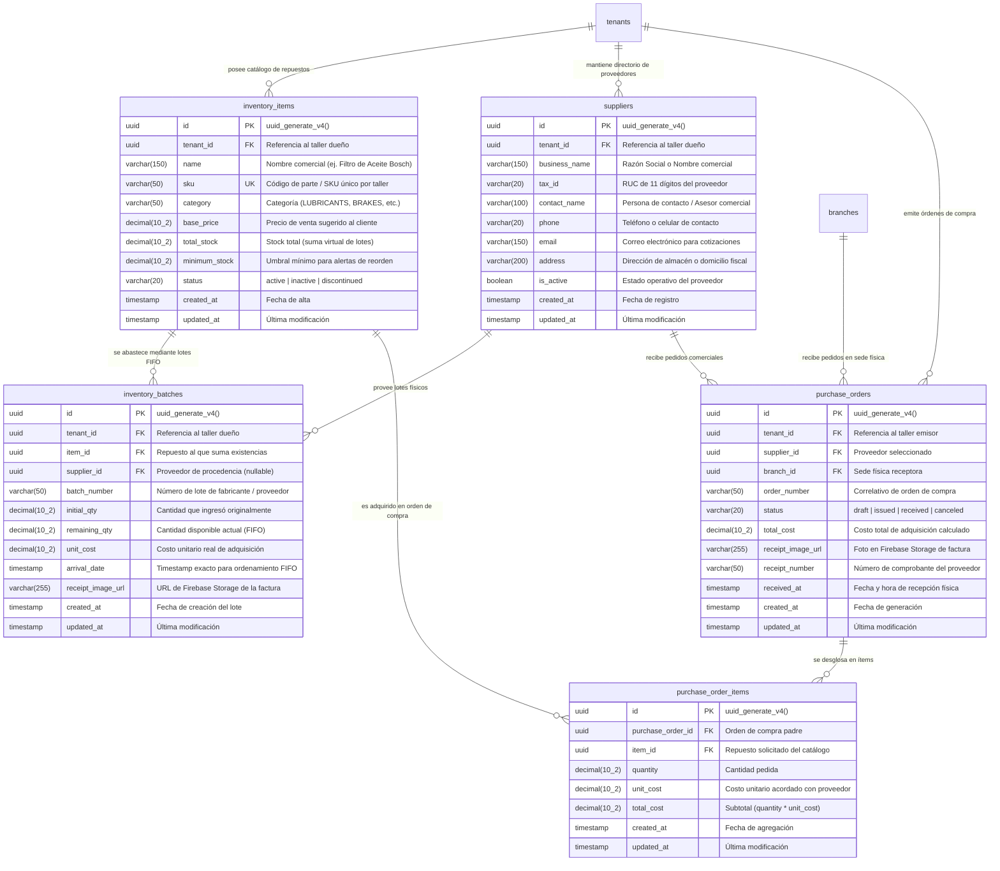
---

## 8. Fase 5: Bounded Context 5 — Human Resources Management (HR) Context (`com.andeva.atelier.platform.hr`)

### 8.1. Diccionario y Propósito del Contexto

#### 8.1.1. Propósito y Límites de Responsabilidad
El **Human Resources Management (HR) Context** administra los aspectos laborales, operativos y de compensación económica del talento humano del taller automotriz (mecánicos de patio, técnicos especialistas de foso, asesores de servicio y jefes de taller). Su delimitación responde a un principio arquitectónico esencial de desacoplamiento:
1. **Separación Persona/Usuario vs. Empleado Operativo:** El contexto de **IAM & Tenancy** gestiona a la persona como sujeto de autenticación y autorización (credenciales, contraseña hash, tokens JWT, membresía al taller y roles/permisos RBAC). En contraste, el contexto de **HR** modela a la persona como un trabajador operativo sujeto a jornadas laborales, turnos de trabajo, control de asistencia presencial, penalidades por tardanzas, horas trabajadas y liquidación periódica de nóminas/planillas salariales.
2. **Definición y Custodia de Turnos de Trabajo (`WorkShift`):** Centraliza la configuración de turnos operativos matutinos, vespertinos o jornadas completas por taller (`tenant_id`), especificando hora de entrada oficial (`start_time`), hora de salida oficial (`end_time`) y minutos de tolerancia (*grace period*) para la determinación de puntualidad.
3. **Control de Asistencia Georreferenciado (`AttendanceRecord`):** Permite a los mecánicos y empleados registrar su ingreso (*clock-in*) y salida (*clock-out*) directamente desde sus teléfonos inteligentes utilizando la aplicación móvil de Atelier (Kotlin/Flutter). Para garantizar la presencia física genuina en el patio de servicio y neutralizar marcaciones fraudulentas fuera del taller, el backend valida algorítmicamente las coordenadas satelitales del dispositivo contra la geocerca de la sucursal.
4. **Motor de Geocercas Haversine (*Haversine Geofencing Engine*):** Aísla la verificación trigonométrica y espacial de la marcación en microsegundos dentro de la memoria de la JVM. Utilizando la fórmula geodésica del semiverseno (*Haversine Formula*), el sistema compara la latitud y longitud reportadas por el hardware GPS móvil contra el centroide oficial de la sucursal física (`branches.latitude`, `branches.longitude`) y su radio de tolerancia (`branches.geofence_radius_m`, predeterminado en 50 metros). Si la distancia excede el radio permitido, el ingreso es rechazado de inmediato.
5. **Determinación Algorítmica de Estados de Asistencia:** Evalúa automáticamente si la marcación es puntual (`ON_TIME`), tardía (`LATE`) tras superar los minutos de tolerancia del turno, o inasistencia (`ABSENT`). Provee capacidades de justificación administrativa (`EXCUSED`) por parte del jefe de taller ante descansos médicos o permisos autorizados.
6. **Liquidación y Cálculo de Nóminas (`PayrollPayment`):** Modela el cálculo periódico de las remuneraciones del personal para un intervalo temporal dado (`period_start` a `period_end`). Consolida el salario base pactado, deduce automáticamente las penalizaciones económicas por tardanzas acumuladas o faltas injustificadas, suma bonificaciones por productividad o comisiones operativas, y genera la orden de pago en estado borrador (`DRAFT`) para su revisión, aprobación contable (`APPROVED`) y desembolso final (`PAID`).

#### 8.1.2. Decisiones de Diseño e Integraciones Críticas
* **Ejecución In-Memory de la Fórmula de Haversine:** En lugar de realizar invocaciones remotas a APIs externas de geolocalización (como Google Maps Distance Matrix API) en cada marcación —lo cual induciría latencias de red de 200 a 500 ms, generaría costos por consumo de cuota API y expondría al taller a fallos de conexión en horas punta matutinas—, Atelier resuelve el cálculo de distancia geodésica mediante un servicio de dominio puramente matemático (`HaversineGeofencingService`) en menos de un microsegundo.
* **Desacoplamiento con IAM & Tenancy mediante ACL:** HR no manipula las tablas `users` ni `tenant_memberships`. En su lugar, hace referencia al identificador unívoco de membresía (`membership_id`) y consulta la fachada de inbound `TenancyContextFacade` para obtener las coordenadas geográficas oficiales y el radio de geocerca de la sucursal (`BranchGeoCoordinatesDto`).
* **Desacoplamiento con MRO mediante Fachada Open Host Service (OHS):** El contexto de operaciones de taller (MRO) jamás debe consultar directamente la tabla `attendance_records` ni calcular tiempos laborales. Para verificar si un mecánico está físicamente disponible antes de asignarle una orden de trabajo o tarea urgente en foso, MRO consulta la interfaz `HumanResourcesContextFacade.isMechanicOnDuty(TenantMembershipId membershipId)`.

---

### 8.2. 2.6.5.1. Domain Layer

#### 8.2.1. Aggregates & Aggregate Roots

##### 1. `WorkShift` (Aggregate Root)
* **Paquete:** `com.andeva.atelier.platform.hr.domain.model.aggregates`
* **Herencia:** Extiende `AbstractDomainAggregateRoot<WorkShift>`
* **Propósito:** Representa un turno de trabajo laboral configurado para una empresa automotriz. Define los horarios oficiales de inicio y término, así como la tolerancia horaria para el ingreso del personal.
* **Atributos:**
  * `id: ShiftId` — Identificador universal del turno de trabajo (UUID).
  * `tenantId: TenantId` — Identificador del taller automotriz propietario del turno.
  * `name: String` — Denominación del turno (ej. "Turno Mañana Mecánicos", "Turno Integral Taller", "Guardia Nocturna").
  * `schedule: ShiftSchedule` — Objeto de valor que encapsula la hora de inicio (`startTime`) y la hora de fin (`endTime`), contemplando soporte para cruce de medianoche.
  * `gracePeriod: GracePeriod` — Objeto de valor que especifica los minutos de tolerancia permitidos antes de clasificar una marcación como tardanza (ej. 15 minutos).
  * `isActive: boolean` — Bandera de disponibilidad operativa del turno.
* **Invariantes y Reglas de Negocio:**
  * El nombre del turno no puede ser nulo ni estar en blanco, y su longitud máxima es de 50 caracteres.
  * La hora de inicio y la hora de fin no pueden ser idénticas.
  * El periodo de gracia no puede ser negativo y no debe exceder los 60 minutos.
* **Métodos:**
  * `+ static WorkShift create(TenantId tenantId, String name, LocalTime startTime, LocalTime endTime, int gracePeriodMinutes): WorkShift`: Factoría de dominio; valida invariantes, asigna estado activo y registra `WorkShiftCreatedEvent`.
  * `+ void updateSchedule(String name, LocalTime startTime, LocalTime endTime, int gracePeriodMinutes): void`: Modifica los parámetros horarios del turno y registra `WorkShiftUpdatedEvent`.
  * `+ void deactivate(): void`: Inhabilita el turno para futuras asignaciones a empleados.
  * `+ void activate(): void`: Restablece la vigencia del turno.
  * `+ boolean isLate(LocalTime clockInTime): boolean`: Evalúa si la hora de marcación supera el umbral límite permitido (`startTime + gracePeriod`).
  * `+ boolean isWithinWorkingHours(LocalTime time): boolean`: Evalúa si una hora específica cae dentro de la ventana de ejecución del turno.

##### 2. `AttendanceRecord` (Aggregate Root)
* **Paquete:** `com.andeva.atelier.platform.hr.domain.model.aggregates`
* **Herencia:** Extiende `AbstractDomainAggregateRoot<AttendanceRecord>`
* **Propósito:** Representa la evidencia de asistencia laboral de un empleado en una fecha y turno determinados. Custodia la marcación de ingreso, la marcación de egreso, la geolocalización satelital obtenida del smartphone y la distancia calculada contra la sucursal.
* **Atributos:**
  * `id: AttendanceId` — Identificador universal de la marcación (UUID).
  * `tenantId: TenantId` — Taller propietario de la operación.
  * `branchId: BranchId` — Sucursal física donde el empleado presta servicios.
  * `membershipId: TenantMembershipId` — Identificador del empleado/mecánico en el sistema.
  * `shiftId: ShiftId` — Turno de trabajo bajo el cual se evalúa la asistencia.
  * `clockIn: Instant` — Timestamp exacto de registro de ingreso presencial.
  * `clockOut: Instant` — Timestamp de registro de salida laboral (nullable hasta que el empleado finalice su jornada).
  * `status: AttendanceStatus` — Clasificación del estado de asistencia (`ON_TIME`, `LATE`, `EXCUSED`, `ABSENT`).
  * `checkInLocation: GeoCoordinates` — Coordenadas GPS satelitales (latitud, longitud) emitidas por el smartphone al momento del ingreso.
  * `distanceToBranch: HaversineDistance` — Distancia física en metros calculada matemáticamente entre el smartphone y la sucursal.
  * `justificationReason: String` — Descripción justificatoria aprobada por supervisión (nullable, requerida si el estado es `EXCUSED`).
  * `justifiedBy: TenantMembershipId` — Identificador del supervisor o administrador que aprobó la excepción (nullable).
  * `justifiedAt: Instant` — Momento cronológico de la justificación administrativa (nullable).
* **Invariantes y Reglas de Negocio:**
  * La hora de salida (`clockOut`) no puede ser cronológicamente anterior a la hora de entrada (`clockIn`).
  * Las coordenadas GPS deben encontrarse en rangos geográficos válidos (latitud entre -90 y 90, longitud entre -180 y 180).
  * La distancia calculada a la sucursal no puede exceder el radio geodésico autorizado de la sede física (`branchGeofenceRadiusMeters`); si se supera, la marcación es inválida y no se instancia el registro.
  * No puede existir más de un registro de asistencia abierto (sin `clockOut`) para el mismo empleado en el mismo día laboral.
* **Métodos:**
  * `+ static AttendanceRecord recordClockIn(TenantId tenantId, BranchId branchId, TenantMembershipId membershipId, ShiftId shiftId, WorkShift shift, GeoCoordinates employeeLocation, GeoCoordinates branchCentroid, double maxAllowedRadiusMeters, HaversineGeofencingService geofencingService): AttendanceRecord`:
    1. Invoca a `geofencingService.calculateDistance(employeeLocation, branchCentroid)` obteniendo `HaversineDistance`.
    2. Valida que `distance.meters() <= maxAllowedRadiusMeters`. Si se incumple, lanza `GeofenceViolationException`.
    3. Compara `clockIn` local contra `shift.startTime + shift.gracePeriod`. Si está dentro de la tolerancia, clasifica como `ON_TIME`; si la sobrepasa, clasifica como `LATE`.
    4. Registra `EmployeeClockedInEvent` y, si corresponde, `LateAttendanceRecordedEvent`.
  * `+ void recordClockOut(Instant clockOutTime): void`:
    1. Valida que `clockOut` no haya sido registrado previamente.
    2. Valida que `clockOutTime.isAfter(clockIn)`.
    3. Asigna el timestamp y registra `EmployeeClockedOutEvent`.
  * `+ void justify(String reason, TenantMembershipId supervisorMembershipId): void`:
    1. Valida que el estado actual sea `LATE` o `ABSENT`.
    2. Modifica el estado a `EXCUSED`, asigna la causal explicativa y el auditor responsable.
    3. Registra `AttendanceJustifiedEvent`.
  * `+ static AttendanceRecord recordAbsent(TenantId tenantId, BranchId branchId, TenantMembershipId membershipId, ShiftId shiftId, LocalDate date): AttendanceRecord`: Factoría administrativa para registrar formalmente una inasistencia no justificada.

##### 3. `PayrollPayment` (Aggregate Root)
* **Paquete:** `com.andeva.atelier.platform.hr.domain.model.aggregates`
* **Herencia:** Extiende `AbstractDomainAggregateRoot<PayrollPayment>`
* **Propósito:** Representa la liquidación salarial o boleta de pago emitida a un empleado para un intervalo temporal contable determinado. Orquesta las deducciones por incidencias y bonificaciones operativas.
* **Atributos:**
  * `id: PayrollPaymentId` — Identificador universal de la boleta de pago (UUID).
  * `tenantId: TenantId` — Taller emisor del pago.
  * `membershipId: TenantMembershipId` — Empleado beneficiario de la liquidación.
  * `period: PayPeriod` — Objeto de valor con fecha de inicio (`periodStart`) y fecha de fin (`periodEnd`).
  * `baseAmount: Money` — Salario base mensual o proporcional estipulado en el contrato laboral.
  * `deductions: Money` — Suma consolidada de descuentos monetarios aplicados (tardanzas, inasistencias, retenciones).
  * `bonuses: Money` — Suma consolidada de bonificaciones económicas asignadas (productividad de patio, horas extras).
  * `totalPaid: Money` — Importe neto a transferir al colaborador (`baseAmount - deductions + bonuses`).
  * `status: PayrollStatus` — Ciclo de vida de la boleta (`DRAFT`, `APPROVED`, `PAID`, `CANCELLED`).
  * `deductionItems: List<PayrollDeductionItem>` — Entidades hijas con el desglose pormenorizado de descuentos.
  * `bonusItems: List<PayrollBonusItem>` — Entidades hijas con el desglose pormenorizado de bonificaciones.
  * `paidAt: Instant` — Fecha y hora del desembolso financiero (nullable hasta concretar el pago).
  * `paymentReference: String` — Número de operación bancaria o comprobante de transferencia (nullable).
* **Invariantes y Reglas de Negocio:**
  * La fecha de inicio del periodo no puede ser posterior a la fecha de fin.
  * El importe neto (`totalPaid`) no puede ser negativo; si las deducciones superan el salario base más bonos, el total pagado se ajusta al límite mínimo reglamentario o genera deuda controlada.
  * No se pueden agregar deducciones ni bonificaciones una vez que la boleta se encuentra en estado `APPROVED` o `PAID`.
  * Únicamente las boletas en estado `APPROVED` pueden ser marcadas como pagadas (`PAID`).
* **Métodos:**
  * `+ static PayrollPayment calculate(TenantId tenantId, TenantMembershipId membershipId, PayPeriod period, Money baseAmount, List<PayrollDeductionItem> deductions, List<PayrollBonusItem> bonuses): PayrollPayment`: Factoría de dominio que crea la liquidación en estado `DRAFT`, calcula los totales netos y registra `PayrollCalculatedEvent`.
  * `+ void addDeduction(String concept, Money amount, DeductionType type, LocalDate date): void`: Agrega un ítem de descuento a la colección interna y recalcula `deductions` y `totalPaid`.
  * `+ void addBonus(String concept, Money amount, BonusType type, LocalDate date): void`: Agrega un ítem de bono a la colección interna y recalcula `bonuses` y `totalPaid`.
  * `+ void approve(): void`: Transiciona el estado a `APPROVED` tras auditoría del administrador; registra `PayrollApprovedEvent`.
  * `+ void markAsPaid(String paymentReference, Instant paymentTimestamp): void`: Transiciona el estado a `PAID`, registra el comprobante de pago bancario y emite `PayrollDisbursedEvent`.
  * `+ void cancel(String cancelReason): void`: Anula la liquidación devolviéndola al pool de periodos no liquidados.

##### 4. `EmployeeProfile` (Aggregate Root)
* **Paquete:** `com.andeva.atelier.platform.hr.domain.model.aggregates`
* **Herencia:** Extiende `AbstractDomainAggregateRoot<EmployeeProfile>`
* **Propósito:** Modela la ficha laboral y contractual del empleado dentro del contexto de Recursos Humanos, asociándolo a su sede de adscripción, turno asignado y esquema salarial.
* **Atributos:**
  * `id: EmployeeProfileId` — Identificador unívoco del perfil operativo (UUID).
  * `tenantId: TenantId` — Taller automotriz empleador.
  * `branchId: BranchId` — Sede física donde cumple sus funciones laborales.
  * `membershipId: TenantMembershipId` — Enlace unívoco con la identidad de membresía en IAM.
  * `assignedShiftId: ShiftId` — Turno regular predeterminado para el empleado.
  * `baseSalary: Money` — Remuneración ordinaria pactada.
  * `salaryType: SalaryType` — Tipo de esquema salarial (`MONTHLY_FIXED`, `HOURLY_RATE`).
  * `jobTitle: String` — Cargo u ocupación técnica (ej. "Mecánico Senior de Motor", "Electricista Automotriz", "Asesor de Servicio").
  * `employmentStatus: EmploymentStatus` — Situación contractual activa (`ACTIVE`, `ON_LEAVE`, `TERMINATED`).
* **Métodos:**
  * `+ static EmployeeProfile register(TenantId tenantId, BranchId branchId, TenantMembershipId membershipId, ShiftId shiftId, Money baseSalary, SalaryType salaryType, String jobTitle): EmployeeProfile`: Factoría que registra el perfil y emite `EmployeeProfileRegisteredEvent`.
  * `+ void assignShift(ShiftId newShiftId): void`: Actualiza el turno regular del colaborador.
  * `+ void updateSalary(Money newSalary, SalaryType salaryType): void`: Ajusta las condiciones de compensación económica.
  * `+ void changeBranch(BranchId newBranchId): void`: Transfiere al colaborador a otra sede del taller.
  * `+ void terminateEmployment(): void`: Da de baja operativa al empleado impidiendo futuras marcaciones.

---

#### 8.2.2. Entities (Child Entities)

##### 1. `PayrollDeductionItem` (Entity)
* **Paquete:** `com.andeva.atelier.platform.hr.domain.model.entities`
* **Propósito:** Representa una partida individual de descuento monetario aplicada dentro de una boleta de pago.
* **Atributos:**
  * `id: UUID` — Identificador del ítem de descuento.
  * `concept: String` — Descripción del motivo del descuento (ej. "Descuento por 3 tardanzas acumuladas (45 min)", "Inasistencia injustificada 14/08/2026").
  * `amount: Money` — Importe monetario deducido.
  * `deductionType: DeductionType` — Categoría (`TARDINESS`, `UNJUSTIFIED_ABSENCE`, `EQUIPMENT_DAMAGE`, `LOAN_REPAYMENT`, `OTHER`).
  * `appliedDate: LocalDate` — Fecha en que se originó la causal de la deducción.

##### 2. `PayrollBonusItem` (Entity)
* **Paquete:** `com.andeva.atelier.platform.hr.domain.model.entities`
* **Propósito:** Representa una partida individual de bonificación o incentivo económico sumado a una boleta de pago.
* **Atributos:**
  * `id: UUID` — Identificador del ítem de bonificación.
  * `concept: String` — Descripción del motivo de la bonificación (ej. "Bono de productividad: 25 órdenes cerradas", "Comisión por alineamiento y balanceo").
  * `amount: Money` — Importe monetario otorgado.
  * `bonusType: BonusType` — Categoría (`PRODUCTIVITY`, `OVERTIME_HOURS`, `SPECIAL_MERIT`, `HOLIDAY_ALLOWANCE`).
  * `awardedDate: LocalDate` — Fecha en que se concedió la bonificación.

---

#### 8.2.3. Value Objects

* **`ShiftId`:** Identificador universal inmutable de un turno (`record ShiftId(UUID value)`).
* **`AttendanceId`:** Identificador inmutable de un registro de marcación (`record AttendanceId(UUID value)`).
* **`PayrollPaymentId`:** Identificador inmutable de una boleta salarial (`record PayrollPaymentId(UUID value)`).
* **`EmployeeProfileId`:** Identificador del perfil laboral (`record EmployeeProfileId(UUID value)`).
* **`ShiftSchedule`:** Encapsula la ventana horaria del turno (`record ShiftSchedule(LocalTime startTime, LocalTime endTime, boolean spansOverMidnight)`). Contiene el método de dominio `boolean isWithinWindow(LocalTime checkTime)`.
* **`GracePeriod`:** Encapsula los minutos de tolerancia reglamentaria (`record GracePeriod(int minutes)`). Valida que `minutes >= 0 && minutes <= 60`.
* **`GeoCoordinates`:** Representa una coordenada geográfica satelital (`record GeoCoordinates(double latitude, double longitude)`). Valida que $-90.0 \le \text{latitude} \le 90.0$ y $-180.0 \le \text{longitude} \le 180.0$.
* **`HaversineDistance`:** Distancia métrica escalar calculada en el espacio geodésico terrestre (`record HaversineDistance(double meters)`). Provee métodos de conveniencia como `boolean isWithin(double thresholdMeters)` y `double toKilometers()`.
* **`PayPeriod`:** Intervalo temporal contable de nómina (`record PayPeriod(LocalDate startDate, LocalDate endDate)`). Valida que `!startDate.isAfter(endDate)` y calcula la cantidad de días laborales contenidos.
* **`AttendanceStatus`:** Enumeración del estado de asistencia (`ON_TIME`, `LATE`, `EXCUSED`, `ABSENT`).
* **`PayrollStatus`:** Enumeración del ciclo de vida de la nómina (`DRAFT`, `APPROVED`, `PAID`, `CANCELLED`).
* **`SalaryType`:** Esquema de remuneración del personal (`MONTHLY_FIXED`, `HOURLY_RATE`).
* **`EmploymentStatus`:** Situación contractual del trabajador (`ACTIVE`, `ON_LEAVE`, `TERMINATED`).
* **`DeductionType`:** Categoría analítica de descuentos (`TARDINESS`, `UNJUSTIFIED_ABSENCE`, `EQUIPMENT_DAMAGE`, `LOAN_REPAYMENT`, `OTHER`).
* **`BonusType`:** Categoría analítica de beneficios (`PRODUCTIVITY`, `OVERTIME_HOURS`, `SPECIAL_MERIT`, `HOLIDAY_ALLOWANCE`).

---

#### 8.2.4. Domain Commands

* **`CreateWorkShiftCommand`:** Parámetros para registrar un turno (`TenantId tenantId, String name, LocalTime startTime, LocalTime endTime, int gracePeriodMinutes`).
* **`UpdateWorkShiftCommand`:** Parámetros para modificar un turno (`ShiftId shiftId, String name, LocalTime startTime, LocalTime endTime, int gracePeriodMinutes`).
* **`RecordClockInCommand`:** Parámetros de marcación de ingreso móvil (`TenantId tenantId, BranchId branchId, TenantMembershipId membershipId, ShiftId shiftId, double latitude, double longitude`).
* **`RecordClockOutCommand`:** Parámetros de marcación de salida móvil (`AttendanceId attendanceId, TenantMembershipId membershipId, Instant clockOutTime`).
* **`JustifyAttendanceCommand`:** Parámetros para autorizar una excepción de asistencia (`AttendanceId attendanceId, String reason, TenantMembershipId supervisorMembershipId`).
* **`GeneratePayrollCommand`:** Parámetros para procesar la nómina de un periodo (`TenantId tenantId, TenantMembershipId membershipId, LocalDate periodStart, LocalDate periodEnd`).
* **`AddPayrollDeductionCommand`:** Incorpora un descuento a una planilla (`PayrollPaymentId payrollId, String concept, Money amount, DeductionType type, LocalDate date`).
* **`AddPayrollBonusCommand`:** Incorpora un bono a una planilla (`PayrollPaymentId payrollId, String concept, Money amount, BonusType type, LocalDate date`).
* **`ApprovePayrollCommand`:** Aprobación administrativa (`PayrollPaymentId payrollId, TenantMembershipId approverMembershipId`).
* **`DisbursePayrollPaymentCommand`:** Registro del desembolso bancario (`PayrollPaymentId payrollId, String paymentReference, Instant paidAt`).
* **`RegisterEmployeeProfileCommand`:** Ficha de contratación (`TenantId tenantId, BranchId branchId, TenantMembershipId membershipId, ShiftId shiftId, Money baseSalary, SalaryType salaryType, String jobTitle`).
* **`AssignShiftToEmployeeCommand`:** Reasignación de turno (`EmployeeProfileId profileId, ShiftId newShiftId`).

---

#### 8.2.5. Domain Queries

* **`GetWorkShiftByIdQuery`:** Consulta de un turno por su ID (`ShiftId shiftId`).
* **`ListWorkShiftsByTenantQuery`:** Catálogo de turnos vigentes del taller (`TenantId tenantId`).
* **`GetAttendanceRecordByIdQuery`:** Detalle de una marcación específica (`AttendanceId attendanceId`).
* **`ListAttendanceByBranchAndDateQuery`:** Cuadro de asistencias diario por sucursal (`BranchId branchId, LocalDate date`).
* **`GetEmployeeAttendanceHistoryQuery`:** Historial de marcaciones de un empleado en un rango temporal (`TenantMembershipId membershipId, LocalDate from, LocalDate to`).
* **`GetPayrollPaymentByIdQuery`:** Consulta de una boleta de pago (`PayrollPaymentId payrollPaymentId`).
* **`ListPayrollPaymentsByPeriodQuery`:** Reporte de nóminas del taller para un mes/periodo (`TenantId tenantId, LocalDate periodStart, LocalDate periodEnd`).
* **`GetEmployeeProfileByMembershipIdQuery`:** Consulta del perfil laboral de un usuario (`TenantMembershipId membershipId`).
* **`IsEmployeeOnDutyQuery`:** Verificación rápida de presencia física activa para asignación en MRO (`TenantMembershipId membershipId`).

---

#### 8.2.6. Domain Events

* **`WorkShiftCreatedEvent`:** Emitido al parametrizar un nuevo horario laboral (`ShiftId shiftId, TenantId tenantId, String name, LocalTime startTime, LocalTime endTime`).
* **`WorkShiftUpdatedEvent`:** Emitido al modificar horarios o minutos de gracia (`ShiftId shiftId, LocalTime startTime, LocalTime endTime, int gracePeriod`).
* **`EmployeeClockedInEvent`:** Emitido tras una marcación presencial válida en patio (`AttendanceId attendanceId, TenantMembershipId membershipId, BranchId branchId, AttendanceStatus status, double distanceMeters, Instant timestamp`).
* **`EmployeeClockedOutEvent`:** Emitido al concluir la jornada de trabajo (`AttendanceId attendanceId, TenantMembershipId membershipId, Instant clockOutTimestamp, long totalWorkedMinutes`).
* **`LateAttendanceRecordedEvent`:** Emitido cuando la marcación superó la tolerancia del turno (`AttendanceId attendanceId, TenantMembershipId membershipId, long minutesLate, Instant timestamp`).
* **`GeofenceViolationDetectedEvent`:** Emitido cuando se rechaza una marcación móvil que excede el radio de la sede física (`TenantMembershipId membershipId, BranchId branchId, double attemptedDistanceMeters, double maxAllowedMeters`).
* **`AttendanceJustifiedEvent`:** Emitido al regularizarse una tardanza o falta por orden médica o permiso (`AttendanceId attendanceId, TenantMembershipId justifiedBy, String reason`).
* **`PayrollCalculatedEvent`:** Emitido al generarse el cálculo proforma de la nómina (`PayrollPaymentId payrollId, TenantMembershipId membershipId, Money totalPaid, PayPeriod period`).
* **`PayrollApprovedEvent`:** Emitido al autorizarse el pago formal por gerencia (`PayrollPaymentId payrollId, TenantMembershipId approverMembershipId`).
* **`PayrollDisbursedEvent`:** Emitido al liquidarse la transferencia bancaria (`PayrollPaymentId payrollId, String paymentReference, Instant timestamp`).

---

#### 8.2.7. Domain Repositories (Interfaces)

```java
package com.andeva.atelier.platform.hr.domain.repositories;

public interface WorkShiftRepository {
    WorkShift save(WorkShift workShift);
    Optional<WorkShift> findById(ShiftId id);
    Optional<WorkShift> findByTenantIdAndName(TenantId tenantId, String name);
    List<WorkShift> findAllByTenantId(TenantId tenantId);
    boolean existsByTenantIdAndName(TenantId tenantId, String name);
}

public interface AttendanceRecordRepository {
    AttendanceRecord save(AttendanceRecord attendanceRecord);
    Optional<AttendanceRecord> findById(AttendanceId id);
    Optional<AttendanceRecord> findActiveByMembershipIdAndDate(TenantMembershipId membershipId, LocalDate date);
    List<AttendanceRecord> findAllByBranchIdAndDate(BranchId branchId, LocalDate date);
    List<AttendanceRecord> findAllByMembershipIdAndPeriod(TenantMembershipId membershipId, Instant start, Instant end);
    boolean hasActiveClockIn(TenantMembershipId membershipId, LocalDate date);
}

public interface PayrollPaymentRepository {
    PayrollPayment save(PayrollPayment payrollPayment);
    Optional<PayrollPayment> findById(PayrollPaymentId id);
    Optional<PayrollPayment> findByMembershipIdAndPeriod(TenantMembershipId membershipId, LocalDate startDate, LocalDate endDate);
    List<PayrollPayment> findAllByTenantIdAndPeriod(TenantId tenantId, LocalDate startDate, LocalDate endDate);
    List<PayrollPayment> findAllByMembershipId(TenantMembershipId membershipId);
}

public interface EmployeeProfileRepository {
    EmployeeProfile save(EmployeeProfile profile);
    Optional<EmployeeProfile> findById(EmployeeProfileId id);
    Optional<EmployeeProfile> findByMembershipId(TenantMembershipId membershipId);
    List<EmployeeProfile> findAllByBranchId(BranchId branchId);
    List<EmployeeProfile> findAllActiveByTenantId(TenantId tenantId);
}
```

---

#### 8.2.8. Domain Services

##### 1. `HaversineGeofencingService` (Servicio de Dominio Matemático)
* **Paquete:** `com.andeva.atelier.platform.hr.domain.services`
* **Propósito:** Calcula con rigor geodésico la distancia esférica en metros entre dos puntos geográficos (las coordenadas capturadas por el sensor GPS del teléfono y las coordenadas físicas de la sucursal del taller).
* **Fórmula Matemática:** Aplica la ley del semiverseno (*Haversine*), asumiendo un radio esférico medio de la Tierra $R = 6,371,000 \text{ metros}$:
  $$\Delta \phi = \text{radians}(\text{lat}_2 - \text{lat}_1), \quad \Delta \lambda = \text{radians}(\text{lon}_2 - \text{lon}_1)$$
  $$a = \sin^2\left(\frac{\Delta \phi}{2}\right) + \cos(\text{radians}(\text{lat}_1)) \cdot \cos(\text{radians}(\text{lat}_2)) \cdot \sin^2\left(\frac{\Delta \lambda}{2}\right)$$
  $$c = 2 \cdot \text{atan2}\left(\sqrt{a}, \sqrt{1 - a}\right)$$
  $$d = R \cdot c$$
* **Implementación de Dominio:**
```java
package com.andeva.atelier.platform.hr.domain.services;

import com.andeva.atelier.platform.hr.domain.model.valueobjects.GeoCoordinates;
import com.andeva.atelier.platform.hr.domain.model.valueobjects.HaversineDistance;
import org.springframework.stereotype.Service;

@Service
public class HaversineGeofencingService {
    private static final double EARTH_RADIUS_METERS = 6371000.0;

    public HaversineDistance calculateDistance(GeoCoordinates origin, GeoCoordinates destination) {
        double lat1Rad = Math.toRadians(origin.latitude());
        double lat2Rad = Math.toRadians(destination.latitude());
        double deltaLatRad = Math.toRadians(destination.latitude() - origin.latitude());
        double deltaLonRad = Math.toRadians(destination.longitude() - origin.longitude());

        double a = Math.sin(deltaLatRad / 2.0) * Math.sin(deltaLatRad / 2.0)
                + Math.cos(lat1Rad) * Math.cos(lat2Rad)
                * Math.sin(deltaLonRad / 2.0) * Math.sin(deltaLonRad / 2.0);

        double c = 2.0 * Math.atan2(Math.sqrt(a), Math.sqrt(1.0 - a));
        double distanceMeters = EARTH_RADIUS_METERS * c;

        return new HaversineDistance(Math.round(distanceMeters * 100.0) / 100.0);
    }

    public boolean isWithinGeofence(GeoCoordinates employeeLocation, GeoCoordinates branchCentroid, double allowedRadiusMeters) {
        HaversineDistance distance = calculateDistance(employeeLocation, branchCentroid);
        return distance.meters() <= allowedRadiusMeters;
    }
}
```

##### 2. `PayrollCalculationEngine` (Servicio de Dominio Financiero de Planillas)
* **Paquete:** `com.andeva.atelier.platform.hr.domain.services`
* **Propósito:** Consolida el historial de marcaciones del empleado durante el periodo contable, detecta faltas y tardanzas, calcula deducciones proporcionales de acuerdo con las políticas del taller automotriz y genera la estructura base para la boleta de pago.

---

### 8.3. 2.6.5.2. Interface Layer

#### 8.3.1. REST Controllers

##### 1. `WorkShiftsController`
* **Ruta Base:** `/api/v1/hr/shifts`
* **Responsabilidad:** Administrar la parametrización de turnos laborales por parte de administradores y jefes de recursos humanos.
* **Endpoints:**
  * `POST /`: Crea un nuevo turno de trabajo (`CreateWorkShiftCommand`). Responde `201 Created` con el recurso creado.
  * `PUT /{id}`: Modifica los horarios y tolerancia de un turno (`UpdateWorkShiftCommand`). Responde `200 OK`.
  * `GET /{id}`: Obtiene el detalle de un turno por su ID. Responde `200 OK`.
  * `GET /`: Lista todos los turnos disponibles para el taller autenticado (`tenant_id`). Responde `200 OK`.
  * `PATCH /{id}/deactivate`: Inhabilita un turno. Responde `204 No Content`.
  * `PATCH /{id}/activate`: Restaura la vigencia de un turno. Responde `204 No Content`.

##### 2. `AttendanceController`
* **Ruta Base:** `/api/v1/hr/attendance`
* **Responsabilidad:** Endpoint de alta concurrencia utilizado por los mecánicos desde la aplicación móvil para marcación presencial, así como por supervisores para justificaciones y auditoría diaria.
* **Endpoints:**
  * `POST /clock-in`: Registra el ingreso del colaborador validando coordenadas satelitales contra la geocerca de la sucursal. Responde `201 Created` con `AttendanceResource` o `422 Unprocessable Entity` si la geocerca es violada.
  * `POST /clock-out`: Registra el egreso y calcula el total de horas trabajadas. Responde `200 OK`.
  * `POST /{id}/justify`: Permite a un supervisor justificar administrativamente una tardanza o inasistencia. Responde `200 OK`.
  * `GET /branch/{branchId}/daily`: Lista el reporte de asistencias del día seleccionado para una sucursal física. Responde `200 OK`.
  * `GET /employee/{membershipId}/history`: Consulta el historial de asistencias de un empleado específico en un rango de fechas. Responde `200 OK`.
  * `GET /employee/{membershipId}/status-today`: Consulta el estado actual de marcación del día para un mecánico. Responde `200 OK`.

##### 3. `PayrollPaymentsController`
* **Ruta Base:** `/api/v1/hr/payrolls`
* **Responsabilidad:** Gestión de planillas salariales, adición de bonos, deducciones y autorización de desembolsos.
* **Endpoints:**
  * `POST /generate`: Genera la boleta de pago proforma para un colaborador en un periodo mensual/quincenal. Responde `201 Created`.
  * `POST /{id}/deductions`: Registra un descuento específico a la boleta proforma. Responde `200 OK`.
  * `POST /{id}/bonuses`: Registra un bono de productividad a la boleta proforma. Responde `200 OK`.
  * `POST /{id}/approve`: Aprueba la liquidación salarial. Responde `200 OK`.
  * `POST /{id}/disburse`: Marca la nómina como efectivamente pagada, asociando el comprobante bancario. Responde `200 OK`.
  * `GET /{id}`: Obtiene la boleta pormenorizada con su desglose de conceptos. Responde `200 OK`.
  * `GET /`: Lista las planillas emitidas en el taller filtradas por periodo contable. Responde `200 OK`.

##### 4. `StaffProfilesController`
* **Ruta Base:** `/api/v1/hr/employees`
* **Responsabilidad:** Alta y administración de las fichas laborales de mecánicos y personal del taller.
* **Endpoints:**
  * `POST /`: Registra el perfil operativo de un nuevo empleado asociado a su membresía en IAM. Responde `201 Created`.
  * `PUT /{id}/shift`: Reasigna el turno de trabajo de un empleado. Responde `200 OK`.
  * `PUT /{id}/salary`: Modifica el esquema salarial y monto base. Responde `200 OK`.
  * `GET /membership/{membershipId}`: Obtiene el perfil operativo a partir del identificador de usuario. Responde `200 OK`.
  * `GET /branch/{branchId}`: Lista los perfiles operativos adscritos a una sucursal. Responde `200 OK`.

---

#### 8.3.2. REST Resources & DTOs (Records)

```java
package com.andeva.atelier.platform.hr.interfaces.rest.resources;

public record WorkShiftResource(
    UUID id,
    String name,
    LocalTime startTime,
    LocalTime endTime,
    int gracePeriodMinutes,
    boolean isActive
) {}

public record CreateWorkShiftRequest(
    @NotBlank(message = "El nombre del turno es obligatorio") String name,
    @NotNull(message = "La hora de inicio es requerida") LocalTime startTime,
    @NotNull(message = "La hora de fin es requerida") LocalTime endTime,
    @Min(value = 0, message = "La tolerancia no puede ser negativa") int gracePeriodMinutes
) {}

public record ClockInRequest(
    @NotNull(message = "La sucursal es obligatoria") UUID branchId,
    @NotNull(message = "El turno es obligatorio") UUID shiftId,
    @NotNull(message = "La latitud es requerida") Double latitude,
    @NotNull(message = "La longitud es requerida") Double longitude
) {}

public record ClockOutRequest(
    @NotNull(message = "El ID de marcación es obligatorio") UUID attendanceId
) {}

public record JustifyAttendanceRequest(
    @NotBlank(message = "El motivo de justificación es requerido") String reason
) {}

public record AttendanceResource(
    UUID id,
    UUID branchId,
    UUID membershipId,
    UUID shiftId,
    Instant clockIn,
    Instant clockOut,
    String status,
    Double latitude,
    Double longitude,
    Double distanceToBranchMeters,
    String justificationReason,
    UUID justifiedBy,
    Instant justifiedAt
) {}

public record GeneratePayrollRequest(
    @NotNull(message = "El empleado es obligatorio") UUID membershipId,
    @NotNull(message = "La fecha inicial es requerida") LocalDate periodStart,
    @NotNull(message = "La fecha final es requerida") LocalDate periodEnd
) {}

public record AddPayrollDeductionRequest(
    @NotBlank String concept,
    @NotNull BigDecimal amount,
    @NotBlank String currency,
    @NotNull String deductionType,
    @NotNull LocalDate date
) {}

public record AddPayrollBonusRequest(
    @NotBlank String concept,
    @NotNull BigDecimal amount,
    @NotBlank String currency,
    @NotBlank String bonusType,
    @NotNull LocalDate date
) {}

public record DisbursePayrollRequest(
    @NotBlank(message = "La referencia bancaria es obligatoria") String paymentReference
) {}

public record PayrollPaymentResource(
    UUID id,
    UUID membershipId,
    LocalDate periodStart,
    LocalDate periodEnd,
    BigDecimal baseAmount,
    BigDecimal deductions,
    BigDecimal bonuses,
    BigDecimal totalPaid,
    String currency,
    String status,
    Instant paidAt,
    String paymentReference,
    List<PayrollItemResource> items
) {}

public record PayrollItemResource(
    UUID id,
    String category, // DEDUCTION o BONUS
    String concept,
    BigDecimal amount,
    String type,
    LocalDate date
) {}

public record RegisterEmployeeProfileRequest(
    @NotNull UUID branchId,
    @NotNull UUID membershipId,
    @NotNull UUID shiftId,
    @NotNull BigDecimal baseSalary,
    @NotBlank String currency,
    @NotBlank String salaryType,
    @NotBlank String jobTitle
) {}

public record EmployeeProfileResource(
    UUID id,
    UUID branchId,
    UUID membershipId,
    UUID assignedShiftId,
    BigDecimal baseSalary,
    String currency,
    String salaryType,
    String jobTitle,
    String employmentStatus
) {}
```

---

#### 8.3.3. REST Assemblers (Mappers)

* **`WorkShiftResourceAssembler`:** Transforma agregados `WorkShift` a DTOs `WorkShiftResource`.
* **`AttendanceResourceAssembler`:** Transforma agregados `AttendanceRecord` a `AttendanceResource`, mapeando distancias esféricas y estatus calculados.
* **`PayrollPaymentResourceAssembler`:** Transforma `PayrollPayment` y sus partidas hijas (`deductionItems`, `bonusItems`) a `PayrollPaymentResource`.
* **`EmployeeProfileResourceAssembler`:** Transforma la ficha `EmployeeProfile` a `EmployeeProfileResource`.

---

#### 8.3.4. Inbound ACL Facade (Open Host Service - OHS)

Para mantener desacoplado el contexto de Recursos Humanos del contexto de Operaciones de Taller (MRO) e IAM, HR publica una fachada OHS canónica:

```java
package com.andeva.atelier.platform.hr.interfaces.acl;

import java.time.LocalDate;
import java.util.Optional;
import java.util.UUID;

public interface HumanResourcesContextFacade {
    /**
     * Utilizado por Workshop Operations (MRO) antes de asignar una orden de trabajo urgente.
     * Verifica si el mecánico marcó ingreso presencial hoy y no ha registrado salida.
     */
    boolean isMechanicOnDuty(UUID membershipId);

    /**
     * Retorna la sucursal donde el mecánico se encuentra prestando servicios hoy en patio.
     */
    Optional<UUID> getMechanicActiveBranchId(UUID membershipId);

    /**
     * Obtiene el perfil operativo del mecánico incluyendo su cargo y turno asignado.
     */
    Optional<MechanicDutyProfileDto> getMechanicProfile(UUID membershipId);

    /**
     * Obtiene el resumen de asistencia diaria del empleado.
     */
    Optional<AttendanceSummaryDto> getDailyAttendanceSummary(UUID membershipId, LocalDate date);
}

public record MechanicDutyProfileDto(
    UUID membershipId,
    UUID branchId,
    String jobTitle,
    UUID shiftId,
    String shiftName,
    boolean isOnDuty
) {}

public record AttendanceSummaryDto(
    UUID attendanceId,
    String status,
    boolean isLate,
    long minutesLate
) {}
```

---

#### 8.3.5. Integration Events (Published / Consumed)

##### 1. Eventos Publicados por HR hacia otros Bounded Contexts
* **`MechanicCheckedInIntegrationEvent`:** Publicado cuando un mecánico marca ingreso válido en patio. Consumido por MRO para actualizar el tablero de disponibilidad en patio.
* **`MechanicClockedOutIntegrationEvent`:** Publicado cuando un mecánico culmina su jornada laboral. Consumido por MRO para alertar si existen tareas inconclusas en su foso asignado.
* **`PayrollDisbursedIntegrationEvent`:** Publicado cuando se ejecuta formalmente el pago de la nómina. Consumido por el contexto contable para asentar la salida de caja/banco.

##### 2. Eventos Consumidos por HR desde otros Bounded Contexts
* **`TenantMemberCreatedIntegrationEvent` (emitido por IAM & Tenancy Context):** Permite a HR aprovisionar de forma automática o disparar un recordatorio al administrador para completar la ficha laboral (`EmployeeProfile`) del nuevo integrante del equipo.

---

### 8.4. 2.6.5.3. Application Layer

#### 8.4.1. Command Services (Handlers)

##### 1. `WorkShiftCommandServiceImpl`
* **Responsabilidad:** Orquestar la creación y modificación de turnos de trabajo, validando unicidad de nombres dentro del mismo `tenant_id`.

##### 2. `AttendanceCommandServiceImpl`
* **Responsabilidad:** Orquestar la marcación presencial de asistencia aplicando la siguiente secuencia transaccional:
  1. Extrae el `membershipId` del contexto de seguridad JWT autenticado.
  2. Invoca al servicio outbound ACL `TenancyAclService` para recuperar las coordenadas físicas centroidales y el radio de geocerca de la sucursal indicada (`branchId`).
  3. Recupera el turno de trabajo correspondiente (`shiftId`).
  4. Verifica que el empleado no cuente con una marcación abierta para el día en curso.
  5. Invoca a la factoría de dominio `AttendanceRecord.recordClockIn(...)`, la cual delega en `HaversineGeofencingService` el cálculo trigonométrico. Si la distancia excede la tolerancia permitida, lanza `GeofenceViolationException` y rechaza la solicitud.
  6. Persiste el registro atómico de asistencia en la base de datos PostgreSQL.
  7. Publica el evento de dominio `EmployeeClockedInEvent` y, si la distancia fue sospechosamente cercana al borde, registra trazas de telemetría operativa.

##### 3. `PayrollPaymentCommandServiceImpl`
* **Responsabilidad:** Orquestar la liquidación salarial periódica:
  1. Recupera el perfil laboral del empleado (`EmployeeProfile`) para obtener su salario base pactado.
  2. Consulta a través de `AttendanceRecordRepository` todas las marcaciones comprendidas en el intervalo `[periodStart, periodEnd]`.
  3. Evalúa penalidades: por cada registro clasificado como `LATE` sin justificación, calcula la deducción monetaria correspondiente; por cada día laboral con inasistencia no justificada (`ABSENT`), deduce el importe equivalente diario ($baseSalary / 30$).
  4. Crea el agregado `PayrollPayment` en estado `DRAFT`.
  5. Provee métodos para agregar bonos/descuentos extraordinarios y transicionar a `APPROVED` y `PAID`.

##### 4. `EmployeeProfileCommandServiceImpl`
* **Responsabilidad:** Administrar la creación de fichas de contratación, reasignación de turnos y actualizaciones salariales.

---

#### 8.4.2. Query Services (Handlers)

* **`WorkShiftQueryServiceImpl`:** Resuelve consultas de catálogo de turnos con almacenamiento en caché local (`Caffeine Cache`) para mitigar consultas repetitivas de lectura.
* **`AttendanceQueryServiceImpl`:** Resuelve reportes diarios de puntualidad por sucursal e historial de asistencias de mecánicos.
* **`PayrollPaymentQueryServiceImpl`:** Resuelve reportes contables de planillas emitidas y boletas individuales de empleados.
* **`EmployeeProfileQueryServiceImpl`:** Consulta perfiles laborales y disponibilidad física activa para el consumo de fachadas internas.

---

#### 8.4.3. Domain Event Handlers

* **`AttendanceDomainEventHandler`:**
  * Al recibir `LateAttendanceRecordedEvent`: Registra la incidencia en el perfil del empleado y actualiza el contador acumulativo de tardanzas del mes para el cálculo automático de nómina.
  * Al recibir `GeofenceViolationDetectedEvent`: Registra un evento de seguridad de auditoría indicando intento de marcación fraudulenta fuera del radio de la sede.
* **`PayrollDomainEventHandler`:**
  * Al recibir `PayrollApprovedEvent`: Notifica por correo electrónico transaccional al colaborador a través de `ResendEmailAdapter` adjuntando la boleta en PDF proforma.
  * Al recibir `PayrollDisbursedEvent`: Emite `PayrollDisbursedIntegrationEvent` para la conciliación contable.

---

#### 8.4.4. Outbound ACL Services & Remote Adapters

##### `TenancyAclService`
* **Paquete:** `com.andeva.atelier.platform.hr.application.internal.outboundservices.acl`
* **Propósito:** Conectar de forma desacoplada con el contexto de IAM & Tenancy para obtener los metadatos geográficos y límites espaciales de la sucursal física.
```java
package com.andeva.atelier.platform.hr.application.internal.outboundservices.acl;

import com.andeva.atelier.platform.hr.domain.model.valueobjects.GeoCoordinates;
import com.andeva.atelier.platform.iam.interfaces.acl.TenancyContextFacade;
import com.andeva.atelier.platform.shared.domain.model.valueobjects.BranchId;
import org.springframework.stereotype.Service;

@Service
public class TenancyAclService {
    private final TenancyContextFacade tenancyContextFacade;

    public TenancyAclService(TenancyContextFacade tenancyContextFacade) {
        this.tenancyContextFacade = tenancyContextFacade;
    }

    public BranchGeofenceDto getBranchGeofenceData(BranchId branchId) {
        var branchDto = tenancyContextFacade.findBranchById(branchId.value())
                .orElseThrow(() -> new IllegalArgumentException("Sucursal no encontrada: " + branchId.value()));

        return new BranchGeofenceDto(
                new GeoCoordinates(branchDto.latitude(), branchDto.longitude()),
                branchDto.geofenceRadiusMeters() > 0 ? branchDto.geofenceRadiusMeters() : 50.0
        );
    }
}

public record BranchGeofenceDto(
    GeoCoordinates centroid,
    double radiusMeters
) {}
```

---

### 8.5. 2.6.5.4. Infrastructure Layer

#### 8.5.1. JPA Entities

##### 1. `WorkShiftJpaEntity`
* **Tabla Relacional:** `work_shifts`
* **Mapeo:**
```java
package com.andeva.atelier.platform.hr.infrastructure.persistence.jpa.entities;

import com.andeva.atelier.platform.shared.infrastructure.persistence.jpa.entities.AuditableAbstractPersistenceEntity;
import jakarta.persistence.*;
import java.time.LocalTime;
import java.util.UUID;

@Entity
@Table(name = "work_shifts", uniqueConstraints = {
    @UniqueConstraint(name = "uk_work_shifts_tenant_name", columnNames = {"tenant_id", "name"})
})
public class WorkShiftJpaEntity extends AuditableAbstractPersistenceEntity {
    @Id
    @Column(name = "id", nullable = false, updatable = false)
    private UUID id;

    @Column(name = "tenant_id", nullable = false, updatable = false)
    private UUID tenantId;

    @Column(name = "name", nullable = false, length = 50)
    private String name;

    @Column(name = "start_time", nullable = false)
    private LocalTime startTime;

    @Column(name = "end_time", nullable = false)
    private LocalTime endTime;

    @Column(name = "grace_period_m", nullable = false)
    private int gracePeriodMinutes;

    @Column(name = "is_active", nullable = false)
    private boolean isActive = true;

    // Getters y Setters JPA
}
```

##### 2. `AttendanceRecordJpaEntity`
* **Tabla Relacional:** `attendance_records`
* **Mapeo:**
```java
package com.andeva.atelier.platform.hr.infrastructure.persistence.jpa.entities;

import com.andeva.atelier.platform.shared.infrastructure.persistence.jpa.entities.AuditableAbstractPersistenceEntity;
import jakarta.persistence.*;
import java.math.BigDecimal;
import java.time.Instant;
import java.util.UUID;

@Entity
@Table(name = "attendance_records", indexes = {
    @Index(name = "idx_attendance_membership_date", columnList = "membership_id, clock_in"),
    @Index(name = "idx_attendance_branch_date", columnList = "branch_id, clock_in")
})
public class AttendanceRecordJpaEntity extends AuditableAbstractPersistenceEntity {
    @Id
    @Column(name = "id", nullable = false, updatable = false)
    private UUID id;

    @Column(name = "tenant_id", nullable = false, updatable = false)
    private UUID tenantId;

    @Column(name = "branch_id", nullable = false, updatable = false)
    private UUID branchId;

    @Column(name = "membership_id", nullable = false, updatable = false)
    private UUID membershipId;

    @Column(name = "shift_id", nullable = false)
    private UUID shiftId;

    @Column(name = "clock_in", nullable = false)
    private Instant clockIn;

    @Column(name = "clock_out")
    private Instant clockOut;

    @Column(name = "status", nullable = false, length = 20)
    private String status;

    @Column(name = "latitude", nullable = false, precision = 10, scale = 8)
    private BigDecimal latitude;

    @Column(name = "longitude", nullable = false, precision = 11, scale = 8)
    private BigDecimal longitude;

    @Column(name = "distance_to_branch_m", nullable = false)
    private int distanceToBranchMeters;

    @Column(name = "justification_reason", length = 255)
    private String justificationReason;

    @Column(name = "justified_by")
    private UUID justifiedBy;

    @Column(name = "justified_at")
    private Instant justifiedAt;

    // Getters y Setters JPA
}
```

##### 3. `PayrollPaymentJpaEntity`
* **Tabla Relacional:** `payroll_payments`
* **Mapeo:**
```java
package com.andeva.atelier.platform.hr.infrastructure.persistence.jpa.entities;

import com.andeva.atelier.platform.shared.infrastructure.persistence.jpa.entities.AuditableAbstractPersistenceEntity;
import jakarta.persistence.*;
import java.math.BigDecimal;
import java.time.Instant;
import java.time.LocalDate;
import java.util.ArrayList;
import java.util.List;
import java.util.UUID;

@Entity
@Table(name = "payroll_payments", indexes = {
    @Index(name = "idx_payroll_tenant_period", columnList = "tenant_id, period_start, period_end"),
    @Index(name = "idx_payroll_membership", columnList = "membership_id")
})
public class PayrollPaymentJpaEntity extends AuditableAbstractPersistenceEntity {
    @Id
    @Column(name = "id", nullable = false, updatable = false)
    private UUID id;

    @Column(name = "tenant_id", nullable = false, updatable = false)
    private UUID tenantId;

    @Column(name = "membership_id", nullable = false, updatable = false)
    private UUID membershipId;

    @Column(name = "period_start", nullable = false)
    private LocalDate periodStart;

    @Column(name = "period_end", nullable = false)
    private LocalDate periodEnd;

    @Column(name = "base_amount", nullable = false, precision = 10, scale = 2)
    private BigDecimal baseAmount;

    @Column(name = "deductions", nullable = false, precision = 10, scale = 2)
    private BigDecimal deductions;

    @Column(name = "bonuses", nullable = false, precision = 10, scale = 2)
    private BigDecimal bonuses;

    @Column(name = "total_paid", nullable = false, precision = 10, scale = 2)
    private BigDecimal totalPaid;

    @Column(name = "currency", nullable = false, length = 3)
    private String currency = "PEN";

    @Column(name = "status", nullable = false, length = 20)
    private String status;

    @Column(name = "paid_at")
    private Instant paidAt;

    @Column(name = "payment_reference", length = 100)
    private String paymentReference;

    @OneToMany(mappedBy = "payrollPayment", cascade = CascadeType.ALL, orphanRemoval = true, fetch = FetchType.LAZY)
    private List<PayrollItemJpaEntity> items = new ArrayList<>();

    // Getters y Setters JPA
}
```

##### 4. `EmployeeProfileJpaEntity`
* **Tabla Relacional:** `employee_profiles`
* **Mapeo:**
```java
package com.andeva.atelier.platform.hr.infrastructure.persistence.jpa.entities;

import com.andeva.atelier.platform.shared.infrastructure.persistence.jpa.entities.AuditableAbstractPersistenceEntity;
import jakarta.persistence.*;
import java.math.BigDecimal;
import java.util.UUID;

@Entity
@Table(name = "employee_profiles", uniqueConstraints = {
    @UniqueConstraint(name = "uk_employee_profiles_membership", columnNames = {"membership_id"})
})
public class EmployeeProfileJpaEntity extends AuditableAbstractPersistenceEntity {
    @Id
    @Column(name = "id", nullable = false, updatable = false)
    private UUID id;

    @Column(name = "tenant_id", nullable = false, updatable = false)
    private UUID tenantId;

    @Column(name = "branch_id", nullable = false)
    private UUID branchId;

    @Column(name = "membership_id", nullable = false, updatable = false)
    private UUID membershipId;

    @Column(name = "assigned_shift_id", nullable = false)
    private UUID assignedShiftId;

    @Column(name = "base_salary", nullable = false, precision = 10, scale = 2)
    private BigDecimal baseSalary;

    @Column(name = "currency", nullable = false, length = 3)
    private String currency = "PEN";

    @Column(name = "salary_type", nullable = false, length = 20)
    private String salaryType;

    @Column(name = "job_title", nullable = false, length = 100)
    private String jobTitle;

    @Column(name = "employment_status", nullable = false, length = 20)
    private String employmentStatus;

    // Getters y Setters JPA
}
```

---

#### 8.5.2. Spring Data JPA Repositories

```java
package com.andeva.atelier.platform.hr.infrastructure.persistence.jpa.repositories;

public interface SpringDataWorkShiftRepository extends JpaRepository<WorkShiftJpaEntity, UUID> {
    Optional<WorkShiftJpaEntity> findByTenantIdAndName(UUID tenantId, String name);
    List<WorkShiftJpaEntity> findAllByTenantId(UUID tenantId);
    boolean existsByTenantIdAndName(UUID tenantId, String name);
}

public interface SpringDataAttendanceRecordRepository extends JpaRepository<AttendanceRecordJpaEntity, UUID> {
    @Query("SELECT a FROM AttendanceRecordJpaEntity a WHERE a.membershipId = :membershipId AND a.clockIn >= :dayStart AND a.clockIn < :dayEnd AND a.clockOut IS NULL")
    Optional<AttendanceRecordJpaEntity> findActiveClockIn(@Param("membershipId") UUID membershipId, @Param("dayStart") Instant dayStart, @Param("dayEnd") Instant dayEnd);

    @Query("SELECT a FROM AttendanceRecordJpaEntity a WHERE a.branchId = :branchId AND a.clockIn >= :dayStart AND a.clockIn < :dayEnd ORDER BY a.clockIn DESC")
    List<AttendanceRecordJpaEntity> findAllByBranchAndDay(@Param("branchId") UUID branchId, @Param("dayStart") Instant dayStart, @Param("dayEnd") Instant dayEnd);

    @Query("SELECT a FROM AttendanceRecordJpaEntity a WHERE a.membershipId = :membershipId AND a.clockIn >= :start AND a.clockIn <= :end ORDER BY a.clockIn ASC")
    List<AttendanceRecordJpaEntity> findAllByMembershipAndPeriod(@Param("membershipId") UUID membershipId, @Param("start") Instant start, @Param("end") Instant end);
}

public interface SpringDataPayrollPaymentRepository extends JpaRepository<PayrollPaymentJpaEntity, UUID> {
    Optional<PayrollPaymentJpaEntity> findByMembershipIdAndPeriodStartAndPeriodEnd(UUID membershipId, LocalDate periodStart, LocalDate periodEnd);
    List<PayrollPaymentJpaEntity> findAllByTenantIdAndPeriodStartGreaterThanEqualAndPeriodEndLessThanEqual(UUID tenantId, LocalDate start, LocalDate end);
    List<PayrollPaymentJpaEntity> findAllByMembershipIdOrderByPeriodStartDesc(UUID membershipId);
}

public interface SpringDataEmployeeProfileRepository extends JpaRepository<EmployeeProfileJpaEntity, UUID> {
    Optional<EmployeeProfileJpaEntity> findByMembershipId(UUID membershipId);
    List<EmployeeProfileJpaEntity> findAllByBranchId(UUID branchId);
    List<EmployeeProfileJpaEntity> findAllByTenantIdAndEmploymentStatus(UUID tenantId, String status);
}
```

---

#### 8.5.3. Repository Implementations & Adapters

* **`WorkShiftRepositoryImpl`:** Adapta `SpringDataWorkShiftRepository` hacia `WorkShiftRepository`, utilizando `WorkShiftPersistenceAssembler`.
* **`AttendanceRecordRepositoryImpl`:** Adapta `SpringDataAttendanceRecordRepository` hacia `AttendanceRecordRepository`, encapsulando consultas por ventanas temporales de inicio/fin de día.
* **`PayrollPaymentRepositoryImpl`:** Adapta `SpringDataPayrollPaymentRepository` hacia `PayrollPaymentRepository`, mapeando partidas hijas en cascade bidireccional.
* **`EmployeeProfileRepositoryImpl`:** Adapta `SpringDataEmployeeProfileRepository` hacia `EmployeeProfileRepository`.

---

#### 8.5.4. Persistence Assemblers & Data Mappers

* **`WorkShiftPersistenceAssembler`:** Transforma bidireccionalmente entre `WorkShift` (dominio) y `WorkShiftJpaEntity` (persistencia).
* **`AttendanceRecordPersistenceAssembler`:** Convierte entre `AttendanceRecord` y `AttendanceRecordJpaEntity`, mapeando `GeoCoordinates`, `HaversineDistance` y enums de estado.
* **`PayrollPaymentPersistenceAssembler`:** Realiza el ensamblado de las colecciones de bonos y deducciones garantizando correspondencia referencial de claves foráneas.
* **`EmployeeProfilePersistenceAssembler`:** Transforma entre `EmployeeProfile` y `EmployeeProfileJpaEntity`.

---

#### 8.5.5. JPA Attribute Converters

* **`GeoCoordinatesConverter`:** Convierte entre `GeoCoordinates` y dos columnas numéricas de alta precisión (`BigDecimal latitude`, `BigDecimal longitude`).
* **`AttendanceStatusConverter`:** Convierte de forma transparente entre `AttendanceStatus` y `VARCHAR(20)`.
* **`PayrollStatusConverter`:** Convierte de forma transparente entre `PayrollStatus` y `VARCHAR(20)`.
* **`SalaryTypeConverter`:** Convierte de forma transparente entre `SalaryType` y `VARCHAR(20)`.

---

#### 8.5.6. External Gateways & Geocoding Adapters

##### `GooglePlacesGeoGatewayImpl`
* **Paquete:** `com.andeva.atelier.platform.hr.infrastructure.gateways`
* **Propósito:** Conecta con Google Places API / Google Geocoding API para resolver direcciones postales a coordenadas geográficas (latitud, longitud) durante el registro formal de nuevas sucursales o validación de sedes.
* **Resiliencia:** Aplica timeouts estrictos de conexión HTTP (3 segundos) mediante `WebClient` y política de *fallback* para no bloquear la operatividad administrativa si la API externa experimenta degradación.

---

### 8.6. 2.6.5.5. Bounded Context Component Level Diagram

El siguiente diagrama C4 Component Model detalla los controladores, servicios de aplicación, agregados de dominio, servicios matemáticos y adaptadores de infraestructura que componen el **Human Resources Management Context**:

```mermaid
C4Component
    title Component Diagram - Human Resources Management Context (com.andeva.atelier.platform.hr)

    Container_Boundary(hr_boundary, "HR Management Context")
        Component(shifts_ctrl, "WorkShiftsController", "Spring REST Controller", "Expone endpoints para gestión de turnos laborales y tolerancias")
        Component(attendance_ctrl, "AttendanceController", "Spring REST Controller", "Expone endpoints de marcación móvil GPS, justificaciones y reportes")
        Component(payroll_ctrl, "PayrollPaymentsController", "Spring REST Controller", "Expone endpoints para cálculo, deducciones y desembolso de nóminas")
        Component(profile_ctrl, "StaffProfilesController", "Spring REST Controller", "Expone endpoints para gestión de fichas laborales y salarios")

        Component(hr_facade, "HumanResourcesContextFacade", "Spring Service (OHS)", "Fachada inbound que expone consultas de disponibilidad física para MRO")

        Component(shifts_cmd, "WorkShiftCommandService", "Application Service", "Orquesta creación y modificación de turnos laborales")
        Component(attendance_cmd, "AttendanceCommandService", "Application Service", "Orquesta marcaciones GPS, validación geodésica y registro de asistencia")
        Component(payroll_cmd, "PayrollPaymentCommandService", "Application Service", "Orquesta cálculo periódico de planillas y liquidación salarial")
        Component(profile_cmd, "EmployeeProfileCommandService", "Application Service", "Orquesta fichas laborales de mecánicos y asignaciones de turnos")

        Component(haversine_svc, "HaversineGeofencingService", "Domain Service", "Calcula distancias geodésicas esféricas e implementa la fórmula de Haversine")
        Component(payroll_engine, "PayrollCalculationEngine", "Domain Service", "Calcula descuentos por tardanzas/faltas y consolida netos a pagar")

        Component(tenancy_acl, "TenancyAclService", "Application ACL Service", "Consume TenancyContextFacade para obtener coordenadas y radio de la sucursal")

        Component(shift_repo, "WorkShiftRepositoryImpl", "Spring Data JPA Adapter", "Persiste turnos en tabla work_shifts")
        Component(attendance_repo, "AttendanceRecordRepositoryImpl", "Spring Data JPA Adapter", "Persiste marcaciones en tabla attendance_records")
        Component(payroll_repo, "PayrollPaymentRepositoryImpl", "Spring Data JPA Adapter", "Persiste planillas en tablas payroll_payments y payroll_items")
        Component(profile_repo, "EmployeeProfileRepositoryImpl", "Spring Data JPA Adapter", "Persiste perfiles laborales en tabla employee_profiles")
    End_Container_Boundary

    Container_Boundary(iam_context, "IAM & Tenancy Context")
        Component(tenancy_facade, "TenancyContextFacade", "Interface Facade", "Provee datos geográficos y centroide oficial de la sucursal")
    End_Container_Boundary

    Container_Boundary(mro_context, "Workshop Operations Context")
        Component(mro_service, "WorkOrderAssignmentService", "Application Service", "Verifica presencia en patio antes de asignar órdenes de trabajo")
    End_Container_Boundary

    ContainerDb(postgres_db, "PostgreSQL 16 Relational DB", "Aiven Cloud", "Tablas work_shifts, attendance_records, payroll_payments, employee_profiles")

    Rel(shifts_ctrl, shifts_cmd, "Delega comandos de turnos", "Java Calls")
    Rel(attendance_ctrl, attendance_cmd, "Delega marcaciones móviles", "Java Calls")
    Rel(payroll_ctrl, payroll_cmd, "Delega liquidación de nóminas", "Java Calls")
    Rel(profile_ctrl, profile_cmd, "Delega gestión de fichas", "Java Calls")

    Rel(mro_service, hr_facade, "isMechanicOnDuty(membershipId)", "Java In-Process")
    Rel(hr_facade, attendance_repo, "Consulta marcación abierta hoy", "Domain Call")

    Rel(attendance_cmd, tenancy_acl, "Obtiene centroide y geocerca de sede", "Java Calls")
    Rel(tenancy_acl, tenancy_facade, "findBranchById()", "In-Process ACL")

    Rel(attendance_cmd, haversine_svc, "Verifica lat/lon vs centroide", "In-Memory Math")
    Rel(payroll_cmd, payroll_engine, "Calcula penalidades e importes netos", "In-Memory Math")

    Rel(shifts_cmd, shift_repo, "Guarda agregados WorkShift", "JPA")
    Rel(attendance_cmd, attendance_repo, "Guarda agregados AttendanceRecord", "JPA")
    Rel(payroll_cmd, payroll_repo, "Guarda agregados PayrollPayment", "JPA")
    Rel(profile_cmd, profile_repo, "Guarda agregados EmployeeProfile", "JPA")

    Rel(shift_repo, postgres_db, "Lee/Escribe en work_shifts", "JDBC")
    Rel(attendance_repo, postgres_db, "Lee/Escribe en attendance_records", "JDBC")
    Rel(payroll_repo, postgres_db, "Lee/Escribe en payroll_payments", "JDBC")
    Rel(profile_repo, postgres_db, "Lee/Escribe en employee_profiles", "JDBC")
```

---

### 8.7. 2.6.5.6. Code Level Diagrams

#### 8.7.1. 2.6.5.6.1. Domain Class Diagram (UML Class Model in Mermaid)

El siguiente diagrama de clases UML modela la estructura de agregados, entidades, objetos de valor, servicios de dominio y repositorios del **Human Resources Management Context**:

```mermaid
classDiagram
    direction TB

    class AbstractDomainAggregateRoot~T~ {
        <<Abstract>>
        #List~Object~ domainEvents
        +registerEvent(Object event) void
        +clearDomainEvents() void
        +getDomainEvents() List~Object~
    }

    class WorkShift {
        <<Aggregate Root>>
        -ShiftId id
        -TenantId tenantId
        -String name
        -ShiftSchedule schedule
        -GracePeriod gracePeriod
        -boolean isActive
        +create(tenantId, name, startTime, endTime, gracePeriodMinutes) WorkShift$
        +updateSchedule(name, startTime, endTime, gracePeriodMinutes) void
        +deactivate() void
        +activate() void
        +isLate(LocalTime clockInTime) boolean
        +isWithinWorkingHours(LocalTime time) boolean
    }

    class AttendanceRecord {
        <<Aggregate Root>>
        -AttendanceId id
        -TenantId tenantId
        -BranchId branchId
        -TenantMembershipId membershipId
        -ShiftId shiftId
        -Instant clockIn
        -Instant clockOut
        -AttendanceStatus status
        -GeoCoordinates checkInLocation
        -HaversineDistance distanceToBranch
        -String justificationReason
        -TenantMembershipId justifiedBy
        -Instant justifiedAt
        +recordClockIn(tenantId, branchId, membershipId, shiftId, shift, location, branchCentroid, maxRadius, geofencingService) AttendanceRecord$
        +recordClockOut(Instant clockOutTime) void
        +justify(String reason, TenantMembershipId supervisorId) void
        +recordAbsent(tenantId, branchId, membershipId, shiftId, LocalDate date) AttendanceRecord$
    }

    class PayrollPayment {
        <<Aggregate Root>>
        -PayrollPaymentId id
        -TenantId tenantId
        -TenantMembershipId membershipId
        -PayPeriod period
        -Money baseAmount
        -Money deductions
        -Money bonuses
        -Money totalPaid
        -PayrollStatus status
        -Instant paidAt
        -String paymentReference
        -List~PayrollDeductionItem~ deductionItems
        -List~PayrollBonusItem~ bonusItems
        +calculate(tenantId, membershipId, period, baseAmount, deductions, bonuses) PayrollPayment$
        +addDeduction(concept, amount, type, date) void
        +addBonus(concept, amount, type, date) void
        +approve() void
        +markAsPaid(paymentReference, timestamp) void
        +cancel(reason) void
    }

    class EmployeeProfile {
        <<Aggregate Root>>
        -EmployeeProfileId id
        -TenantId tenantId
        -BranchId branchId
        -TenantMembershipId membershipId
        -ShiftId assignedShiftId
        -Money baseSalary
        -SalaryType salaryType
        -String jobTitle
        -EmploymentStatus employmentStatus
        +register(tenantId, branchId, membershipId, shiftId, baseSalary, salaryType, jobTitle) EmployeeProfile$
        +assignShift(ShiftId newShiftId) void
        +updateSalary(Money newSalary, SalaryType salaryType) void
        +changeBranch(BranchId newBranchId) void
        +terminateEmployment() void
    }

    class PayrollDeductionItem {
        <<Entity>>
        -UUID id
        -String concept
        -Money amount
        -DeductionType deductionType
        -LocalDate appliedDate
    }

    class PayrollBonusItem {
        <<Entity>>
        -UUID id
        -String concept
        -Money amount
        -BonusType bonusType
        -LocalDate awardedDate
    }

    class ShiftSchedule {
        <<Value Object>>
        -LocalTime startTime
        -LocalTime endTime
        -boolean spansOverMidnight
        +isWithinWindow(LocalTime checkTime) boolean
    }

    class GracePeriod {
        <<Value Object>>
        -int minutes
    }

    class GeoCoordinates {
        <<Value Object>>
        -double latitude
        -double longitude
    }

    class HaversineDistance {
        <<Value Object>>
        -double meters
        +isWithin(double thresholdMeters) boolean
        +toKilometers() double
    }

    class PayPeriod {
        <<Value Object>>
        -LocalDate startDate
        -LocalDate endDate
        +daysCount() int
    }

    class HaversineGeofencingService {
        <<Domain Service>>
        -double EARTH_RADIUS_METERS
        +calculateDistance(GeoCoordinates origin, GeoCoordinates destination) HaversineDistance
        +isWithinGeofence(GeoCoordinates employeeLoc, GeoCoordinates branchCentroid, double allowedRadius) boolean
    }

    class PayrollCalculationEngine {
        <<Domain Service>>
        +calculateProforma(EmployeeProfile profile, List~AttendanceRecord~ attendances, PayPeriod period) PayrollPayment
    }

    class WorkShiftRepository {
        <<Interface>>
        +save(WorkShift workShift) WorkShift
        +findById(ShiftId id) Optional~WorkShift~
        +findAllByTenantId(TenantId tenantId) List~WorkShift~
    }

    class AttendanceRecordRepository {
        <<Interface>>
        +save(AttendanceRecord record) AttendanceRecord
        +findById(AttendanceId id) Optional~AttendanceRecord~
        +findActiveByMembershipIdAndDate(membershipId, date) Optional~AttendanceRecord~
        +findAllByBranchIdAndDate(branchId, date) List~AttendanceRecord~
    }

    class PayrollPaymentRepository {
        <<Interface>>
        +save(PayrollPayment payment) PayrollPayment
        +findById(PayrollPaymentId id) Optional~PayrollPayment~
        +findAllByTenantIdAndPeriod(tenantId, start, end) List~PayrollPayment~
    }

    class EmployeeProfileRepository {
        <<Interface>>
        +save(EmployeeProfile profile) EmployeeProfile
        +findByMembershipId(membershipId) Optional~EmployeeProfile~
        +findAllByBranchId(branchId) List~EmployeeProfile~
    }

    AbstractDomainAggregateRoot <|-- WorkShift
    AbstractDomainAggregateRoot <|-- AttendanceRecord
    AbstractDomainAggregateRoot <|-- PayrollPayment
    AbstractDomainAggregateRoot <|-- EmployeeProfile

    WorkShift *-- ShiftSchedule
    WorkShift *-- GracePeriod

    AttendanceRecord *-- GeoCoordinates
    AttendanceRecord *-- HaversineDistance

    PayrollPayment *-- PayPeriod
    PayrollPayment *-- "0..*" PayrollDeductionItem
    PayrollPayment *-- "0..*" PayrollBonusItem

    AttendanceRecord ..> HaversineGeofencingService : Invoca para cálculo de distancia
    PayrollPayment ..> PayrollCalculationEngine : Usa para proformas

    WorkShift ..> WorkShiftRepository : Persistido por
    AttendanceRecord ..> AttendanceRecordRepository : Persistido por
    PayrollPayment ..> PayrollPaymentRepository : Persistido por
    EmployeeProfile ..> EmployeeProfileRepository : Persistido por
```

---

#### 8.7.2. 2.6.5.6.2. Database Design ERD (Entity-Relationship Diagram in Mermaid)

El siguiente modelo entidad-relación describe el esquema relacional físico de las tablas pertenecientes al **Human Resources Management Context** en PostgreSQL 16:

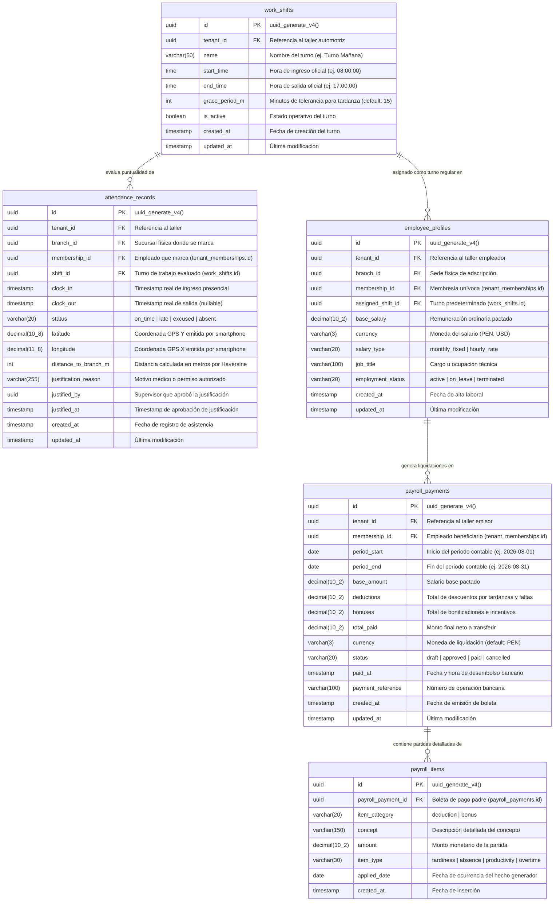

---

## 9. Fase 6: Bounded Context 6 — Invoicing & Compliance Context (`com.andeva.atelier.platform.invoicing`)

### 9.1. Diccionario y Propósito del Contexto

#### 9.1.1. Propósito y Límites de Responsabilidad
El **Invoicing & Compliance Context** encapsula la totalidad de las reglas contables, fiscales y tributarias exigidas por la legislación peruana bajo la supervisión de la **SUNAT (Superintendencia Nacional de Aduanas y de Administración Tributaria)**, operando bajo el estándar internacional **UBL 2.1 (Universal Business Language)**. Su delimitación responde a tres principios arquitectónicos cardinales:
1. **Aislamiento de la Complejidad Tributaria Nacional:** La normativa fiscal peruana (catálogos de afectación al IGV, detracciones, percepciones, validaciones estrictas de RUC/DNI y estructura de tramas XML firmadas digitalmente) es volátil y rígida. Si se mezclara con las órdenes de trabajo del taller (MRO) o con el catálogo de repuestos (Inventario), cualquier reforma tributaria obligaría a refactorizar todo el ERP. Este contexto encapsula dicha volatilidad, manteniendo a los demás contextos completamente limpios de conceptos fiscales.
2. **Diferenciación entre Facturación Local del Taller vs. Suscripción SaaS:** Mientras que el contexto de **SaaS Billing & Subscriptions** gestiona la recaudación recurrente que los talleres pagan a la startup *Andeva* mediante *Stripe*, el contexto de **Invoicing & Compliance** gestiona la facturación que el taller emite a sus propios clientes finales (propietarios de vehículos y flotas corporativas) por servicios mecánicos y repuestos provistos.
3. **Ciclo de Vida de Comprobantes de Pago Electrónicos (`ElectronicVoucher`):** Emite, valida y custodia comprobantes fiscales con validez legal:
   * **Factura Electrónica (Código SUNAT `01`):** Emitida exclusivamente a personas jurídicas o naturales con RUC de 11 dígitos válido que requieren sustentar costo o gasto y deducir crédito fiscal de IGV.
   * **Boleta de Venta Electrónica (Código SUNAT `03`):** Emitida a consumidores finales identificados con DNI de 8 dígitos, carné de extranjería o pasaporte (o sin documento de identidad si el monto total no supera los S/ 700.00 PEN).
   * **Nota de Crédito Electrónica (Código SUNAT `07`):** Emitida para anular operaciones comerciales previas, otorgar descuentos globales o corregir comprobantes emitidos con errores de emisión.
4. **Motor de Cálculo Tributario Peruano (`PeruvianTaxCalculationEngine`):** Centraliza la segregación matemática entre el Valor Venta / Base Imponible (`subtotal`), el Impuesto General a las Ventas (IGV 18%) y el Precio Total de Venta (`total_amount`), aplicando las fórmulas legales:
   $$\text{Base Imponible} = \frac{\text{Precio Total}}{1 + 0.18}, \quad \text{Monto IGV} = \text{Precio Total} - \text{Base Imponible}$$
   Garantiza redondeo bancario (*Half-Even*) a dos decimales por línea de detalle (`voucher_lines`) para evitar discrepancias de céntimos con los servidores de validación de SUNAT.
5. **Control de Series y Correlativos Atómicos (`SeriesConfiguration`):** Administra la numeración correlativa estricta por sucursal física (`branch_id`) y tipo de comprobante (ej. serie `F001` para facturas en la sede principal, `B001` para boletas, `FC01` para notas de crédito), impidiendo duplicidades o saltos de numeración correlativa mediante bloqueos pesimistas a nivel de base de datos relacional.
6. **Liquidación de Medios de Pago (`VoucherPayment`):** Registra los ingresos financieros asociados al comprobante electrónico (Efectivo, Tarjetas de Crédito/Débito, Transferencia Bancaria, Billeteras Digitales como Yape o Plin), controlando saldos pendientes y emitiendo el comprobante una vez acreditada la cancelación.

#### 9.1.2. Decisiones de Diseño e Integraciones Críticas
* **Capa Anticorrupción (ACL) hacia Nubefact:** En lugar de implementar un cliente UBL 2.1 monolítico con firma digital PKCS#12 y conexión directa por SOAP a los servidores de SUNAT —lo cual demandaría mantener certificados digitales tributarios por cada taller y lidiar con la frecuente intermitencia de los Web Services del Estado—, Atelier se integra con **Nubefact**, un Proveedor de Servicios Electrónicos (PSE) homologado. La ACL traduce el modelo de dominio puro de Atelier hacia el esquema JSON V1 de Nubefact, procesando de forma asíncrona las respuestas que contienen el hash digital de seguridad y los enlaces públicos a los archivos oficiales (`sunat_pdf_url`, `sunat_xml_url`, `sunat_cdr_url`).
* **Resiliencia mediante Transactional Outbox:** Si la API de Nubefact experimenta latencia o caída temporal, el comprobante se persiste localmente en la base de datos PostgreSQL en estado `ISSUED` (emitido localmente) y se encola un evento en la tabla `outbox_events`. Un worker en segundo plano reintenta el despacho con política de entrega *At-Least-Once*, garantizando que la entrega del vehículo al cliente nunca se detenga por fallos en la pasarela fiscal.
* **Desacoplamiento con MRO mediante Fachada Open Host Service (OHS):** Cuando una orden de trabajo finaliza en el contexto MRO, este emite el evento de integración `WorkOrderCompletedIntegrationEvent` o invoca `InvoicingContextFacade.generateVoucherFromWorkOrder(...)`. El contexto de facturación extrae el detalle de servicios y repuestos consumidos, aplica los cálculos fiscales y devuelve el resumen del comprobante generado sin que MRO conozca detalles del IGV o UBL 2.1.

---

### 9.2. 2.6.6.1. Domain Layer

#### 9.2.1. Aggregates & Aggregate Roots

##### 1. `ElectronicVoucher` (Aggregate Root)
* **Paquete:** `com.andeva.atelier.platform.invoicing.domain.model.aggregates`
* **Herencia:** Extiende `AbstractDomainAggregateRoot<ElectronicVoucher>`
* **Propósito:** Representa un comprobante de pago electrónico formal con validez fiscal y tributaria emitido por el taller a un cliente final.
* **Atributos:**
  * `id: VoucherId` — Identificador universal del comprobante (UUID).
  * `tenantId: TenantId` — Taller emisor del comprobante.
  * `branchId: BranchId` — Sede física emisora de la transacción.
  * `customerId: CustomerId` — Cliente receptor de la factura o boleta.
  * `workOrderId: Optional<WorkOrderId>` — Orden de trabajo de MRO que originó el cobro (nullable si es venta directa de mostrador).
  * `voucherType: VoucherType` — Tipo legal de comprobante (`FACTURA`, `BOLETA`, `NOTA_CREDITO`).
  * `serie: VoucherSerie` — Serie autorizada de 4 caracteres alfanuméricos (ej. `F001`, `B001`).
  * `number: VoucherNumber` — Correlativo numérico autoincremental único por serie.
  * `taxCalculation: TaxCalculation` — Objeto de valor que consolida la base imponible (`subtotal`), el monto total de IGV (`igvAmount`), la tasa aplicada (18%) y el total general (`totalAmount`).
  * `currency: Currency` — Moneda formal de la operación (`PEN` para Soles, `USD` para Dólares Americanos).
  * `status: VoucherStatus` — Estado del comprobante (`DRAFT`, `ISSUED`, `ACCEPTED_SUNAT`, `REJECTED_SUNAT`, `VOIDED`).
  * `customerFiscalInfo: CustomerFiscalInfo` — Datos fiscales del receptor (RUC/DNI, Razón Social/Nombre, Dirección fiscal).
  * `digitalReceiptUrls: DigitalReceiptUrls` — URLs públicas de los archivos generados por SUNAT/Nubefact (`pdfUrl`, `xmlUrl`, `cdrUrl`).
  * `sunatResponse: Optional<SunatResponse>` — Código de respuesta oficial de SUNAT, glosa descriptiva y hash SHA-256 de la firma digital.
  * `voidedInfo: Optional<VoidedInfo>` — Timestamp y motivo de anulación formal (requerido si el estado es `VOIDED`).
  * `lines: List<VoucherLine>` — Colección interna de partidas detalladas de servicios y repuestos.
  * `payments: List<VoucherPayment>` — Colección interna de pagos y transacciones registradas para saldar el comprobante.
* **Invariantes y Reglas de Negocio:**
  * Si el comprobante es `FACTURA` (`01`), el cliente debe poseer obligatoriamente un RUC de 11 dígitos válido que inicie en `10`, `15`, `17` o `20` con dígito verificador matemático correcto, y contar con Razón Social y Domicilio Fiscal.
  * Si el comprobante es `BOLETA` (`03`) y el monto total supera los S/ 700.00 PEN, el número de documento de identidad (DNI o similar) del cliente es estrictamente obligatorio según directiva de SUNAT.
  * El `totalAmount` debe ser exactamente igual a la suma de los importes de todas las líneas de detalle (`voucher_lines`).
  * La base imponible más el IGV debe cuadrar aritméticamente con el total (`subtotal + igvAmount == totalAmount`).
  * Un comprobante en estado `ACCEPTED_SUNAT` no puede ser modificado ni eliminado físicamente; solo puede ser neutralizado tributariamente emitiendo una `NOTA_CREDITO` vinculada.
* **Métodos:**
  * `+ static ElectronicVoucher issue(TenantId tenantId, BranchId branchId, CustomerId customerId, Optional<WorkOrderId> workOrderId, VoucherType type, VoucherSerie serie, VoucherNumber number, CustomerFiscalInfo customerInfo, Currency currency, List<VoucherLine> lines): ElectronicVoucher`: Factoría de dominio; calcula subtotales, valida reglas fiscales peruanas, asigna estado `ISSUED` y registra `ElectronicVoucherIssuedEvent`.
  * `+ void markAcceptedBySunat(String digitalSignatureHash, String sunatDescription, DigitalReceiptUrls urls): void`: Registra la conformidad formal devuelta por el PSE/SUNAT, actualiza el estado a `ACCEPTED_SUNAT` y registra `VoucherAcceptedBySunatEvent`.
  * `+ void markRejectedBySunat(String errorCode, String errorMessage): void`: Registra el rechazo tributario, actualiza el estado a `REJECTED_SUNAT` y registra `VoucherRejectedBySunatEvent`.
  * `+ void voidVoucher(String voidReason, Instant voidTimestamp): void`: Anula el comprobante localmente y registra `VoucherVoidedEvent`.
  * `+ VoucherPayment recordPayment(PaymentId paymentId, Money amount, PaymentMethod method, String transactionRef): VoucherPayment`: Incorpora un abono financiero al comprobante, valida que la suma de pagos no sobrepase el `totalAmount` y registra `VoucherPaymentRegisteredEvent`.
  * `+ boolean isFullyPaid(): boolean`: Evalúa si la suma aritmética de los pagos completados cubre el importe total facturado.
  * `+ Money getPendingBalance(): Money`: Retorna el saldo monetario pendiente por cobrar.

##### 2. `VoucherPayment` (Entity / Sub-Aggregate)
* **Paquete:** `com.andeva.atelier.platform.invoicing.domain.model.entities`
* **Propósito:** Representa un abono o liquidación financiera registrada contra un comprobante electrónico para saldar el consumo del taller.
* **Atributos:**
  * `id: PaymentId` — Identificador universal del pago (UUID).
  * `voucherId: VoucherId` — Comprobante electrónico asociado.
  * `tenantId: TenantId` — Taller recaudador.
  * `branchId: BranchId` — Sede física donde se recibió el dinero o transferencia.
  * `amount: Money` — Importe monetario recibido.
  * `paymentMethod: PaymentMethod` — Canal de pago (`CASH`, `CREDIT_CARD`, `DEBIT_CARD`, `BANK_TRANSFER`, `YAPE`, `PLIN`).
  * `transactionReference: String` — Número de operación bancaria, voucher POS o código de transacción (nullable para efectivo).
  * `status: PaymentStatus` — Estado del pago (`PENDING`, `COMPLETED`, `REFUNDED`).
  * `paidAt: Instant` — Timestamp exacto del ingreso financiero.
* **Invariantes y Reglas de Negocio:**
  * El monto del pago debe ser estrictamente superior a cero.
  * Si el método es transferencia bancaria o billetera digital (`YAPE`/`PLIN`), la referencia de transacción es obligatoria para conciliación de caja.

##### 3. `SeriesConfiguration` (Aggregate Root)
* **Paquete:** `com.andeva.atelier.platform.invoicing.domain.model.aggregates`
* **Herencia:** Extiende `AbstractDomainAggregateRoot<SeriesConfiguration>`
* **Propósito:** Custodia la configuración de series fiscales autorizadas y el avance correlativo estricto para una sucursal y tipo de comprobante.
* **Atributos:**
  * `id: SeriesConfigurationId` — Identificador de la configuración (UUID).
  * `tenantId: TenantId` — Taller propietario.
  * `branchId: BranchId` — Sucursal física asignada.
  * `voucherType: VoucherType` — Tipo de comprobante (`FACTURA`, `BOLETA`, `NOTA_CREDITO`).
  * `serie: VoucherSerie` — Serie autorizada (ej. `F001`, `B001`, `FC01`).
  * `currentCorrelative: int` — Último correlativo emitido.
  * `isActive: boolean` — Estado operativo de la serie.
* **Métodos:**
  * `+ static SeriesConfiguration create(TenantId tenantId, BranchId branchId, VoucherType type, VoucherSerie serie, int initialCorrelative): SeriesConfiguration`: Factoría que inicializa la serie fiscal.
  * `+ VoucherNumber nextCorrelative(): VoucherNumber`: Incrementa de forma atómica y segura el contador interno y retorna el nuevo número correlativo.

---

#### 9.2.2. Entities (Child Entities)

##### `VoucherLine` (Entity)
* **Paquete:** `com.andeva.atelier.platform.invoicing.domain.model.entities`
* **Propósito:** Partida individual que compone el comprobante de pago, representando un servicio mecánico ejecutado o un repuesto entregado.
* **Atributos:**
  * `id: UUID` — Identificador único de la línea.
  * `voucherId: VoucherId` — Identificador del comprobante padre.
  * `itemId: Optional<UUID>` — Identificador del repuesto (`InventoryItemId`) o servicio (`ServiceId`) facturado (nullable para ítems libres).
  * `itemType: VoucherItemType` — Clasificación del concepto (`PRODUCT`, `SERVICE`).
  * `description: String` — Descripción clara del bien o servicio prestado (ej. "Cambio de pastillas de freno delanteras Bosch", "Mano de obra: Afinamiento electrónico").
  * `quantity: Quantity` — Cantidad de unidades facturadas.
  * `unitValue: Money` — Valor unitario sin IGV (exigido formalmente por el estándar UBL 2.1 y la API de Nubefact).
  * `unitPrice: Money` — Precio unitario con IGV incluido.
  * `igvAmount: Money` — Monto total del IGV correspondiente a esta línea (`(unitPrice - unitValue) * quantity`).
  * `totalLine: Money` — Importe total de la línea (`quantity * unitPrice`).

---

#### 9.2.3. Value Objects

* **`VoucherId`:** Identificador universal inmutable de un comprobante (`record VoucherId(UUID value)`).
* **`PaymentId`:** Identificador inmutable de un abono (`record PaymentId(UUID value)`).
* **`SeriesConfigurationId`:** Identificador inmutable de la configuración de series (`record SeriesConfigurationId(UUID value)`).
* **`VoucherType`:** Enumeración con códigos tributarios oficiales de SUNAT (`FACTURA("01")`, `BOLETA("03")`, `NOTA_CREDITO("07")`).
* **`VoucherSerie`:** Objeto de valor que valida el formato de serie alfanumérica de 4 caracteres (`record VoucherSerie(String value)`). Valida que cumpla el patrón `^[F|B|T][A-Z0-9]{3}$`.
* **`VoucherNumber`:** Correlativo numérico positivo (`record VoucherNumber(int value)`). Valida que `value > 0`.
* **`VoucherStatus`:** Enumeración del ciclo de vida (`DRAFT`, `ISSUED`, `ACCEPTED_SUNAT`, `REJECTED_SUNAT`, `VOIDED`).
* **`TaxCalculation`:** Consolida los cálculos tributarios de la operación (`record TaxCalculation(Money subtotal, Money igvAmount, Money totalAmount, BigDecimal igvRate)`).
* **`CustomerFiscalInfo`:** Datos fiscales del receptor (`record CustomerFiscalInfo(TaxId taxId, String legalName, String fiscalAddress, DocumentType documentType)`).
* **`DigitalReceiptUrls`:** URLs públicas inmutables de los activos generados (`record DigitalReceiptUrls(String pdfUrl, String xmlUrl, String cdrUrl)`).
* **`SunatResponse`:** Metadatos de respuesta fiscal (`record SunatResponse(String responseCode, String description, String digitalSignatureHash)`).
* **`PaymentMethod`:** Medio formal de pago (`CASH`, `CREDIT_CARD`, `DEBIT_CARD`, `BANK_TRANSFER`, `DIGITAL_WALLET_YAPE`, `DIGITAL_WALLET_PLIN`).
* **`PaymentStatus`:** Situación del abono (`PENDING`, `COMPLETED`, `REFUNDED`).
* **`VoucherItemType`:** Clasificación del bien o servicio (`PRODUCT`, `SERVICE`).

---

#### 9.2.4. Domain Commands

* **`IssueElectronicVoucherCommand`:** Parámetros para emitir una factura o boleta (`TenantId tenantId, BranchId branchId, CustomerId customerId, Optional<WorkOrderId> workOrderId, VoucherType type, VoucherSerie serie, CustomerFiscalInfo customerInfo, Currency currency, List<VoucherLineItemDto> lines`).
* **`IssueCreditNoteCommand`:** Parámetros para emitir una nota de crédito vinculada (`TenantId tenantId, BranchId branchId, VoucherId referenceVoucherId, String reasonCode, String reasonDescription, List<VoucherLineItemDto> lines`).
* **`VoidElectronicVoucherCommand`:** Parámetros para anulación (`VoucherId voucherId, String reason`).
* **`RegisterVoucherPaymentCommand`:** Parámetros para asentar un pago (`VoucherId voucherId, Money amount, PaymentMethod method, String transactionReference`).
* **`ConfigureSeriesCommand`:** Parámetros para dar de alta una serie correlativa (`TenantId tenantId, BranchId branchId, VoucherType type, VoucherSerie serie, int initialCorrelative`).
* **`ProcessSunatResponseCommand`:** Parámetros para actualizar el estado tras la respuesta de Nubefact (`VoucherId voucherId, boolean accepted, String responseCode, String description, String hash, DigitalReceiptUrls urls`).

---

#### 9.2.5. Domain Queries

* **`GetVoucherByIdQuery`:** Consulta un comprobante por su identificador único (`VoucherId voucherId`).
* **`GetVoucherBySerieAndNumberQuery`:** Consulta un comprobante por su correlativo fiscal (`TenantId tenantId, VoucherSerie serie, VoucherNumber number`).
* **`ListVouchersByTenantQuery`:** Consulta el registro de ventas del taller filtrado por rango de fechas y tipo (`TenantId tenantId, Optional<VoucherType> type, LocalDate from, LocalDate to`).
* **`ListVouchersByWorkOrderQuery`:** Consulta los comprobantes emitidos para una orden de trabajo de MRO (`WorkOrderId workOrderId`).
* **`GetVoucherPaymentsQuery`:** Consulta los abonos registrados para un comprobante (`VoucherId voucherId`).
* **`GetActiveSeriesByBranchQuery`:** Consulta las series disponibles para emitir en una sede física (`BranchId branchId`).

---

#### 9.2.6. Domain Events

* **`ElectronicVoucherIssuedEvent`:** Emitido al generar el comprobante localmente y enviarlo a la cola de despacho a SUNAT (`VoucherId voucherId, TenantId tenantId, VoucherType type, VoucherSerie serie, VoucherNumber number, Money totalAmount, Instant issuedAt`).
* **`VoucherAcceptedBySunatEvent`:** Emitido al confirmarse la validez fiscal mediante el CDR de SUNAT (`VoucherId voucherId, String hash, DigitalReceiptUrls urls, Instant timestamp`).
* **`VoucherRejectedBySunatEvent`:** Emitido cuando SUNAT o el PSE detectan inconsistencias tributarias (`VoucherId voucherId, String errorCode, String errorMessage, Instant timestamp`).
* **`VoucherVoidedEvent`:** Emitido al anularse un comprobante fiscal (`VoucherId voucherId, String reason, Instant voidedAt`).
* **`VoucherPaymentRegisteredEvent`:** Emitido al registrarse un abono financiero (`PaymentId paymentId, VoucherId voucherId, Money amount, PaymentMethod method, boolean isFullyPaid`).

---

#### 9.2.7. Domain Repositories (Interfaces)

```java
package com.andeva.atelier.platform.invoicing.domain.repositories;

public interface ElectronicVoucherRepository {
    ElectronicVoucher save(ElectronicVoucher voucher);
    Optional<ElectronicVoucher> findById(VoucherId id);
    Optional<ElectronicVoucher> findByTenantIdAndSerieAndNumber(TenantId tenantId, VoucherSerie serie, VoucherNumber number);
    List<ElectronicVoucher> findAllByTenantIdAndDateRange(TenantId tenantId, LocalDate from, LocalDate to);
    List<ElectronicVoucher> findAllByWorkOrderId(WorkOrderId workOrderId);
    boolean existsByTenantIdAndSerieAndNumber(TenantId tenantId, VoucherSerie serie, VoucherNumber number);
}

public interface VoucherPaymentRepository {
    VoucherPayment save(VoucherPayment payment);
    Optional<VoucherPayment> findById(PaymentId id);
    List<VoucherPayment> findAllByVoucherId(VoucherId voucherId);
    List<VoucherPayment> findAllByBranchIdAndDate(BranchId branchId, LocalDate date);
}

public interface SeriesConfigurationRepository {
    SeriesConfiguration save(SeriesConfiguration seriesConfig);
    Optional<SeriesConfiguration> findById(SeriesConfigurationId id);
    Optional<SeriesConfiguration> findByBranchIdAndVoucherTypeAndActive(BranchId branchId, VoucherType type);
    List<SeriesConfiguration> findAllByBranchId(BranchId branchId);
}
```

---

#### 9.2.8. Domain Services

##### 1. `PeruvianTaxCalculationEngine` (Servicio de Dominio Matemático Tributario)
* **Paquete:** `com.andeva.atelier.platform.invoicing.domain.services`
* **Propósito:** Aplica las fórmulas de segregación de base imponible e IGV (18%) con redondeo legal bancario (*Half-Even* a 2 decimales) sobre cada línea y sobre el consolidado global de la factura o boleta:
```java
package com.andeva.atelier.platform.invoicing.domain.services;

import com.andeva.atelier.platform.invoicing.domain.model.valueobjects.TaxCalculation;
import com.andeva.atelier.platform.shared.domain.model.valueobjects.Money;
import org.springframework.stereotype.Service;

import java.math.BigDecimal;
import java.math.RoundingMode;

@Service
public class PeruvianTaxCalculationEngine {
    private static final BigDecimal IGV_RATE = new BigDecimal("0.18");
    private static final BigDecimal ONE_PLUS_IGV = new BigDecimal("1.18");

    public TaxCalculation calculateFromGrossTotal(Money grossTotal) {
        BigDecimal totalAmount = grossTotal.amount();
        BigDecimal subtotal = totalAmount.divide(ONE_PLUS_IGV, 2, RoundingMode.HALF_EVEN);
        BigDecimal igvAmount = totalAmount.subtract(subtotal);

        return new TaxCalculation(
                Money.of(subtotal, grossTotal.currency()),
                Money.of(igvAmount, grossTotal.currency()),
                grossTotal,
                IGV_RATE
        );
    }

    public Money extractUnitValue(Money unitPriceWithIgv) {
        BigDecimal unitValue = unitPriceWithIgv.amount().divide(ONE_PLUS_IGV, 4, RoundingMode.HALF_EVEN);
        return Money.of(unitValue.setScale(2, RoundingMode.HALF_EVEN), unitPriceWithIgv.currency());
    }
}
```

##### 2. `VoucherValidationService` (Servicio de Dominio de Validación Fiscal)
* **Paquete:** `com.andeva.atelier.platform.invoicing.domain.services`
* **Propósito:** Valida el algoritmo de comprobación del dígito verificador para RUCs peruanos (módulo 11 ponderado con pesos `[5, 4, 3, 2, 7, 6, 5, 4, 3, 2]`) y verifica que los montos de boleta que superen S/ 700.00 PEN contengan los datos formales del cliente.

---

### 9.3. 2.6.6.2. Interface Layer

#### 9.3.1. REST Controllers

##### 1. `ElectronicVouchersController`
* **Ruta Base:** `/api/v1/invoicing/vouchers`
* **Responsabilidad:** Administrar el ciclo de vida de los comprobantes electrónicos (emisión, consulta, anulación y descarga de XML/PDF/CDR).
* **Endpoints:**
  * `POST /`: Emite una nueva factura o boleta electrónica (`IssueElectronicVoucherCommand`). Despacha sincrónicamente a Nubefact o mediante Outbox resiliente. Responde `201 Created` con `ElectronicVoucherResource`.
  * `POST /credit-notes`: Emite una nota de crédito vinculada a un comprobante previo. Responde `201 Created`.
  * `GET /{id}`: Obtiene el detalle completo del comprobante con sus líneas de detalle, totales tributarios y enlaces a archivos SUNAT. Responde `200 OK`.
  * `GET /`: Lista los comprobantes del taller filtrados por rango de fechas y tipo de documento. Responde `200 OK`.
  * `GET /work-order/{workOrderId}`: Lista los comprobantes vinculados a una orden de trabajo de MRO. Responde `200 OK`.
  * `POST /{id}/void`: Anula formalmente el comprobante ante SUNAT comunicando el motivo de baja. Responde `200 OK`.

##### 2. `VoucherPaymentsController`
* **Ruta Base:** `/api/v1/invoicing/payments`
* **Responsabilidad:** Registro de abonos y conciliación de caja por comprobante.
* **Endpoints:**
  * `POST /`: Asienta un pago contra un comprobante electrónico (`RegisterVoucherPaymentCommand`). Responde `201 Created` con `VoucherPaymentResource`.
  * `GET /voucher/{voucherId}`: Lista los pagos registrados para una factura o boleta específica. Responde `200 OK`.
  * `GET /branch/{branchId}/daily`: Reporte de cobros diarios por sucursal física. Responde `200 OK`.

##### 3. `SeriesConfigurationController`
* **Ruta Base:** `/api/v1/invoicing/series`
* **Responsabilidad:** Configuración de correlativos autorizados por sede.
* **Endpoints:**
  * `POST /`: Configura una nueva serie fiscal para una sucursal (`ConfigureSeriesCommand`). Responde `201 Created`.
  * `GET /branch/{branchId}`: Lista las series activas configuradas para la sucursal. Responde `200 OK`.

---

#### 9.3.2. REST Resources & DTOs (Records)

```java
package com.andeva.atelier.platform.invoicing.interfaces.rest.resources;

public record IssueVoucherRequest(
    @NotNull UUID branchId,
    @NotNull UUID customerId,
    UUID workOrderId,
    @NotBlank String voucherType, // FACTURA, BOLETA
    @NotBlank String serie,       // F001, B001
    @NotNull CustomerFiscalInfoDto customerInfo,
    @NotBlank String currency,    // PEN, USD
    @NotEmpty List<VoucherLineRequest> lines
) {}

public record VoucherLineRequest(
    UUID itemId,
    @NotBlank String itemType, // PRODUCT, SERVICE
    @NotBlank String description,
    @NotNull BigDecimal quantity,
    @NotNull BigDecimal unitPriceWithIgv
) {}

public record CustomerFiscalInfoDto(
    @NotBlank String taxId,
    @NotBlank String legalName,
    @NotBlank String fiscalAddress,
    @NotBlank String documentType // DNI, RUC, CE
) {}

public record RegisterPaymentRequest(
    @NotNull UUID voucherId,
    @NotNull BigDecimal amount,
    @NotBlank String currency,
    @NotBlank String paymentMethod,
    String transactionReference
) {}

public record ElectronicVoucherResource(
    UUID id,
    UUID tenantId,
    UUID branchId,
    UUID customerId,
    UUID workOrderId,
    String voucherType,
    String serie,
    int number,
    BigDecimal subtotal,
    BigDecimal igvAmount,
    BigDecimal totalAmount,
    String currency,
    String status,
    CustomerFiscalInfoDto customerInfo,
    DigitalReceiptUrlsDto digitalReceipts,
    SunatResponseDto sunatResponse,
    List<VoucherLineResource> lines,
    List<VoucherPaymentResource> payments,
    Instant issuedAt
) {}

public record VoucherLineResource(
    UUID id,
    String itemType,
    String description,
    BigDecimal quantity,
    BigDecimal unitValue,
    BigDecimal unitPrice,
    BigDecimal igvAmount,
    BigDecimal totalLine
) {}

public record DigitalReceiptUrlsDto(
    String pdfUrl,
    String xmlUrl,
    String cdrUrl
) {}

public record SunatResponseDto(
    String responseCode,
    String description,
    String digitalSignatureHash
) {}

public record VoucherPaymentResource(
    UUID id,
    UUID voucherId,
    BigDecimal amount,
    String currency,
    String paymentMethod,
    String transactionReference,
    String status,
    Instant paidAt
) {}
```

---

#### 9.3.3. REST Assemblers (Mappers)

* **`ElectronicVoucherResourceAssembler`:** Mapea el agregado `ElectronicVoucher`, sus líneas de detalle, pagos y metadatos de SUNAT hacia el DTO `ElectronicVoucherResource`.
* **`VoucherPaymentResourceAssembler`:** Transforma entidades `VoucherPayment` a `VoucherPaymentResource`.

---

#### 9.3.4. Inbound ACL Facade (Open Host Service - OHS)

Para permitir que el contexto de Operaciones de Taller (MRO) facture órdenes de trabajo sin acoplarse a detalles fiscales de SUNAT, Invoicing expone su fachada canónica:

```java
package com.andeva.atelier.platform.invoicing.interfaces.acl;

import java.math.BigDecimal;
import java.util.List;
import java.util.Optional;
import java.util.UUID;

public interface InvoicingContextFacade {
    /**
     * Utilizado por Workshop Operations (MRO) para liquidar una Orden de Trabajo.
     * Genera el comprobante electrónico formal a partir de las tareas y repuestos consumidos.
     */
    VoucherGenerationResultDto generateVoucherFromWorkOrder(GenerateVoucherFromWorkOrderCommandDto command);

    /**
     * Consulta el resumen de comprobantes emitidos para una orden de trabajo.
     */
    List<VoucherSummaryDto> getVouchersByWorkOrderId(UUID workOrderId);

    /**
     * Verifica si una orden de trabajo se encuentra 100% facturada y pagada.
     */
    boolean isWorkOrderFullySettled(UUID workOrderId);
}

public record GenerateVoucherFromWorkOrderCommandDto(
    UUID tenantId,
    UUID branchId,
    UUID workOrderId,
    UUID customerId,
    String voucherType, // FACTURA o BOLETA
    String customerTaxId,
    String customerLegalName,
    String customerFiscalAddress,
    String currency,
    List<WorkOrderItemBillingDto> items
) {}

public record WorkOrderItemBillingDto(
    UUID itemId,
    String itemType, // PRODUCT o SERVICE
    String description,
    BigDecimal quantity,
    BigDecimal unitPriceWithIgv
) {}

public record VoucherGenerationResultDto(
    UUID voucherId,
    String fullVoucherNumber, // Ej. "F001-000142"
    BigDecimal totalAmount,
    String status,
    String pdfUrl
) {}

public record VoucherSummaryDto(
    UUID voucherId,
    String fullVoucherNumber,
    String voucherType,
    BigDecimal totalAmount,
    String status,
    boolean isFullyPaid
) {}
```

---

#### 9.3.5. Integration Events (Published / Consumed)

##### 1. Eventos Publicados por Invoicing hacia otros Bounded Contexts
* **`ElectronicVoucherIssuedIntegrationEvent`:** Emitido al crearse una factura o boleta con valor fiscal. Consumido por MRO para actualizar el estado contable de la orden de trabajo.
* **`VoucherAcceptedBySunatIntegrationEvent`:** Emitido tras la recepción del CDR aprobatorio de SUNAT. Consumido por el módulo de notificaciones para despachar el correo con PDF y XML al cliente vía Resend.
* **`VoucherPaymentReceivedIntegrationEvent`:** Emitido al liquidarse un abono monetario. Consumido por MRO para validar la entrega definitiva del vehículo en patio.

##### 2. Eventos Consumidos por Invoicing desde otros Bounded Contexts
* **`WorkOrderDeliveredIntegrationEvent` (emitido por MRO):** Habilita la liquidación final y emite una alerta contable si la orden no ha sido facturada.

---

### 9.4. 2.6.6.3. Application Layer

#### 9.4.1. Command Services (Handlers)

##### 1. `ElectronicVoucherCommandServiceImpl`
* **Responsabilidad:** Orquestar la emisión y ciclo de vida de los comprobantes electrónicos:
  1. Valida la existencia del cliente y recupera sus datos fiscales a través de `CustomerAclService`.
  2. Recupera la serie fiscal activa de la sucursal (`branch_id`) y reserva el correlativo numérico atómico mediante `SeriesConfigurationRepository`.
  3. Ejecuta `PeruvianTaxCalculationEngine` para desglosar la base imponible y el IGV (18%) de cada partida.
  4. Valida invariantes de dominio (consistencia de RUC/DNI y sumatoria exacta de líneas).
  5. Crea el agregado `ElectronicVoucher` en estado `ISSUED`.
  6. Persiste el agregado en PostgreSQL dentro de la transacción ACID local.
  7. Invoca al servicio outbound ACL `NubefactAclService` para despachar la trama a SUNAT.
  8. Si la llamada a Nubefact responde de forma sincrónica, actualiza el agregado con el hash digital y URLs de PDF/XML/CDR llamando a `voucher.markAcceptedBySunat(...)`. Si la API externa experimenta indisponibilidad, el registro permanece encolado en el Transactional Outbox para despacho asíncrono.
  9. Publica los eventos de dominio resultantes.

##### 2. `VoucherPaymentCommandServiceImpl`
* **Responsabilidad:** Registrar abonos financieros contra el comprobante y verificar si se ha alcanzado la cancelación total (`isFullyPaid`), emitiendo el evento de integración correspondiente.

##### 3. `SeriesConfigurationCommandServiceImpl`
* **Responsabilidad:** Parametrizar series fiscales y administrar correlativos correlacionados con SUNAT.

---

#### 9.4.2. Query Services (Handlers)

* **`ElectronicVoucherQueryServiceImpl`:** Resuelve consultas de catálogo de comprobantes, búsquedas por correlativo (`serie-number`), auditoría de ventas mensuales y descargas de activos tributarios.
* **`VoucherPaymentQueryServiceImpl`:** Consulta los abonos de comprobantes y cuadres de caja diarios por sucursal física.

---

#### 9.4.3. Domain Event Handlers

* **`VoucherDomainEventHandler`:**
  * Al recibir `VoucherAcceptedBySunatEvent`: Invoca a `ResendEmailAdapter` para despachar automáticamente un correo electrónico transaccional al cliente adjuntando el PDF oficial y el XML UBL 2.1 firmado con validez tributaria.
  * Al recibir `VoucherPaymentRegisteredEvent`: Si el comprobante está asociado a una orden de trabajo (`workOrderId`) y `isFullyPaid == true`, notifica al contexto MRO que el vehículo está financieramente liberado para salida del taller.

---

#### 9.4.4. Outbound ACL Services & Remote Adapters

##### `NubefactAclService`
* **Paquete:** `com.andeva.atelier.platform.invoicing.application.internal.outboundservices.acl`
* **Propósito:** Capa Anticorrupción que traduce el agregado de dominio `ElectronicVoucher` hacia la estructura JSON V1 exigida por la API de Nubefact, y viceversa:
```java
package com.andeva.atelier.platform.invoicing.application.internal.outboundservices.acl;

import com.andeva.atelier.platform.invoicing.domain.model.aggregates.ElectronicVoucher;
import com.andeva.atelier.platform.invoicing.domain.model.valueobjects.DigitalReceiptUrls;
import com.andeva.atelier.platform.invoicing.infrastructure.gateways.NubefactFiscalGateway;
import org.springframework.stereotype.Service;

@Service
public class NubefactAclService {
    private final NubefactFiscalGateway nubefactFiscalGateway;

    public NubefactAclService(NubefactFiscalGateway nubefactFiscalGateway) {
        this.nubefactFiscalGateway = nubefactFiscalGateway;
    }

    public NubefactDispatchResult dispatchVoucher(ElectronicVoucher voucher) {
        var request = NubefactPayloadMapper.toNubefactRequest(voucher);
        var response = nubefactFiscalGateway.sendInvoice(request);

        if (response.aceptadaPorSunat()) {
            return new NubefactDispatchResult(
                    true,
                    response.codigoRespuesta(),
                    response.descripcionSunat(),
                    response.codigoHash(),
                    new DigitalReceiptUrls(response.enlacePdf(), response.enlaceXml(), response.enlaceCdr())
            );
        } else {
            return new NubefactDispatchResult(
                    false,
                    response.codigoRespuesta(),
                    response.descripcionSunat(),
                    null,
                    null
            );
        }
    }
}

public record NubefactDispatchResult(
    boolean isAccepted,
    String responseCode,
    String description,
    String digitalSignatureHash,
    DigitalReceiptUrls urls
) {}
```

---

### 9.5. 2.6.6.4. Infrastructure Layer

#### 9.5.1. JPA Entities

##### 1. `ElectronicVoucherJpaEntity`
* **Tabla Relacional:** `electronic_vouchers`
* **Mapeo:**
```java
package com.andeva.atelier.platform.invoicing.infrastructure.persistence.jpa.entities;

import com.andeva.atelier.platform.shared.infrastructure.persistence.jpa.entities.AuditableAbstractPersistenceEntity;
import jakarta.persistence.*;
import java.math.BigDecimal;
import java.time.Instant;
import java.util.ArrayList;
import java.util.List;
import java.util.UUID;

@Entity
@Table(name = "electronic_vouchers", uniqueConstraints = {
    @UniqueConstraint(name = "uk_vouchers_tenant_serie_number", columnNames = {"tenant_id", "serie", "number"})
}, indexes = {
    @Index(name = "idx_vouchers_tenant_created", columnList = "tenant_id, created_at"),
    @Index(name = "idx_vouchers_work_order", columnList = "work_order_id"),
    @Index(name = "idx_vouchers_customer", columnList = "customer_id")
})
public class ElectronicVoucherJpaEntity extends AuditableAbstractPersistenceEntity {
    @Id
    @Column(name = "id", nullable = false, updatable = false)
    private UUID id;

    @Column(name = "tenant_id", nullable = false, updatable = false)
    private UUID tenantId;

    @Column(name = "branch_id", nullable = false, updatable = false)
    private UUID branchId;

    @Column(name = "customer_id", nullable = false, updatable = false)
    private UUID customerId;

    @Column(name = "work_order_id")
    private UUID workOrderId;

    @Column(name = "voucher_type", nullable = false, length = 10)
    private String voucherType;

    @Column(name = "serie", nullable = false, length = 4)
    private String serie;

    @Column(name = "number", nullable = false)
    private int number;

    @Column(name = "subtotal", nullable = false, precision = 10, scale = 2)
    private BigDecimal subtotal;

    @Column(name = "igv_amount", nullable = false, precision = 10, scale = 2)
    private BigDecimal igvAmount;

    @Column(name = "total_amount", nullable = false, precision = 10, scale = 2)
    private BigDecimal totalAmount;

    @Column(name = "currency", nullable = false, length = 3)
    private String currency = "PEN";

    @Column(name = "status", nullable = false, length = 20)
    private String status;

    @Column(name = "customer_tax_id", nullable = false, length = 20)
    private String customerTaxId;

    @Column(name = "customer_legal_name", nullable = false, length = 150)
    private String customerLegalName;

    @Column(name = "customer_fiscal_address", nullable = false, length = 200)
    private String customerFiscalAddress;

    @Column(name = "customer_document_type", nullable = false, length = 10)
    private String customerDocumentType;

    @Column(name = "sunat_pdf_url", length = 255)
    private String sunatPdfUrl;

    @Column(name = "sunat_xml_url", length = 255)
    private String sunatXmlUrl;

    @Column(name = "sunat_cdr_url", length = 255)
    private String sunatCdrUrl;

    @Column(name = "digital_signature_hash", length = 100)
    private String digitalSignatureHash;

    @Column(name = "sunat_response_code", length = 10)
    private String sunatResponseCode;

    @Column(name = "sunat_description", length = 255)
    private String sunatDescription;

    @Column(name = "voided_reason", length = 255)
    private String voidedReason;

    @Column(name = "voided_at")
    private Instant voidedAt;

    @OneToMany(mappedBy = "voucher", cascade = CascadeType.ALL, orphanRemoval = true, fetch = FetchType.LAZY)
    private List<VoucherLineJpaEntity> lines = new ArrayList<>();

    @OneToMany(mappedBy = "voucher", cascade = CascadeType.ALL, orphanRemoval = true, fetch = FetchType.LAZY)
    private List<VoucherPaymentJpaEntity> payments = new ArrayList<>();

    // Getters y Setters JPA
}
```

##### 2. `VoucherLineJpaEntity`
* **Tabla Relacional:** `voucher_lines`
* **Mapeo:**
```java
package com.andeva.atelier.platform.invoicing.infrastructure.persistence.jpa.entities;

import jakarta.persistence.*;
import java.math.BigDecimal;
import java.util.UUID;

@Entity
@Table(name = "voucher_lines")
public class VoucherLineJpaEntity {
    @Id
    @Column(name = "id", nullable = false, updatable = false)
    private UUID id;

    @ManyToOne(fetch = FetchType.LAZY)
    @JoinColumn(name = "voucher_id", nullable = false)
    private ElectronicVoucherJpaEntity voucher;

    @Column(name = "item_id")
    private UUID itemId;

    @Column(name = "item_type", nullable = false, length = 20)
    private String itemType;

    @Column(name = "description", nullable = false, length = 200)
    private String description;

    @Column(name = "quantity", nullable = false, precision = 10, scale = 2)
    private BigDecimal quantity;

    @Column(name = "unit_value", nullable = false, precision = 10, scale = 2)
    private BigDecimal unitValue;

    @Column(name = "unit_price", nullable = false, precision = 10, scale = 2)
    private BigDecimal unitPrice;

    @Column(name = "igv_amount", nullable = false, precision = 10, scale = 2)
    private BigDecimal igvAmount;

    @Column(name = "total_line", nullable = false, precision = 10, scale = 2)
    private BigDecimal totalLine;

    // Getters y Setters JPA
}
```

##### 3. `VoucherPaymentJpaEntity`
* **Tabla Relacional:** `voucher_payments`
* **Mapeo:**
```java
package com.andeva.atelier.platform.invoicing.infrastructure.persistence.jpa.entities;

import com.andeva.atelier.platform.shared.infrastructure.persistence.jpa.entities.AuditableAbstractPersistenceEntity;
import jakarta.persistence.*;
import java.math.BigDecimal;
import java.time.Instant;
import java.util.UUID;

@Entity
@Table(name = "voucher_payments", indexes = {
    @Index(name = "idx_payments_voucher", columnList = "voucher_id"),
    @Index(name = "idx_payments_branch_date", columnList = "branch_id, paid_at")
})
public class VoucherPaymentJpaEntity extends AuditableAbstractPersistenceEntity {
    @Id
    @Column(name = "id", nullable = false, updatable = false)
    private UUID id;

    @ManyToOne(fetch = FetchType.LAZY)
    @JoinColumn(name = "voucher_id", nullable = false)
    private ElectronicVoucherJpaEntity voucher;

    @Column(name = "tenant_id", nullable = false, updatable = false)
    private UUID tenantId;

    @Column(name = "branch_id", nullable = false, updatable = false)
    private UUID branchId;

    @Column(name = "amount", nullable = false, precision = 10, scale = 2)
    private BigDecimal amount;

    @Column(name = "currency", nullable = false, length = 3)
    private String currency = "PEN";

    @Column(name = "payment_method", nullable = false, length = 30)
    private String paymentMethod;

    @Column(name = "transaction_reference", length = 100)
    private String transactionReference;

    @Column(name = "status", nullable = false, length = 20)
    private String status;

    @Column(name = "paid_at", nullable = false)
    private Instant paidAt;

    // Getters y Setters JPA
}
```

##### 4. `SeriesConfigurationJpaEntity`
* **Tabla Relacional:** `sunat_series_configurations`
* **Mapeo:**
```java
package com.andeva.atelier.platform.invoicing.infrastructure.persistence.jpa.entities;

import com.andeva.atelier.platform.shared.infrastructure.persistence.jpa.entities.AuditableAbstractPersistenceEntity;
import jakarta.persistence.*;
import java.util.UUID;

@Entity
@Table(name = "sunat_series_configurations", uniqueConstraints = {
    @UniqueConstraint(name = "uk_series_branch_type_serie", columnNames = {"branch_id", "voucher_type", "serie"})
})
public class SeriesConfigurationJpaEntity extends AuditableAbstractPersistenceEntity {
    @Id
    @Column(name = "id", nullable = false, updatable = false)
    private UUID id;

    @Column(name = "tenant_id", nullable = false, updatable = false)
    private UUID tenantId;

    @Column(name = "branch_id", nullable = false, updatable = false)
    private UUID branchId;

    @Column(name = "voucher_type", nullable = false, length = 10)
    private String voucherType;

    @Column(name = "serie", nullable = false, length = 4)
    private String serie;

    @Column(name = "current_correlative", nullable = false)
    private int currentCorrelative;

    @Column(name = "is_active", nullable = false)
    private boolean isActive = true;

    // Getters y Setters JPA
}
```

---

#### 9.5.2. Spring Data JPA Repositories

```java
package com.andeva.atelier.platform.invoicing.infrastructure.persistence.jpa.repositories;

public interface SpringDataElectronicVoucherRepository extends JpaRepository<ElectronicVoucherJpaEntity, UUID> {
    Optional<ElectronicVoucherJpaEntity> findByTenantIdAndSerieAndNumber(UUID tenantId, String serie, int number);
    List<ElectronicVoucherJpaEntity> findAllByWorkOrderId(UUID workOrderId);

    @Query("SELECT v FROM ElectronicVoucherJpaEntity v WHERE v.tenantId = :tenantId AND v.createdAt >= :from AND v.createdAt <= :to ORDER BY v.createdAt DESC")
    List<ElectronicVoucherJpaEntity> findAllByTenantAndDateRange(@Param("tenantId") UUID tenantId, @Param("from") Instant from, @Param("to") Instant to);
}

public interface SpringDataVoucherPaymentRepository extends JpaRepository<VoucherPaymentJpaEntity, UUID> {
    List<VoucherPaymentJpaEntity> findAllByVoucherId(UUID voucherId);

    @Query("SELECT p FROM VoucherPaymentJpaEntity p WHERE p.branchId = :branchId AND p.paidAt >= :dayStart AND p.paidAt <= :dayEnd ORDER BY p.paidAt DESC")
    List<VoucherPaymentJpaEntity> findAllByBranchAndDate(@Param("branchId") UUID branchId, @Param("dayStart") Instant dayStart, @Param("dayEnd") Instant dayEnd);
}

public interface SpringDataSeriesConfigurationRepository extends JpaRepository<SeriesConfigurationJpaEntity, UUID> {
    @Lock(LockModeType.PESSIMISTIC_WRITE)
    @Query("SELECT s FROM SeriesConfigurationJpaEntity s WHERE s.branchId = :branchId AND s.voucherType = :voucherType AND s.isActive = true")
    Optional<SeriesConfigurationJpaEntity> findActiveForUpdate(@Param("branchId") UUID branchId, @Param("voucherType") String voucherType);

    List<SeriesConfigurationJpaEntity> findAllByBranchId(UUID branchId);
}
```

---

#### 9.5.3. Repository Implementations & Adapters

* **`ElectronicVoucherRepositoryImpl`:** Adapta `SpringDataElectronicVoucherRepository` hacia `ElectronicVoucherRepository`, utilizando `ElectronicVoucherPersistenceAssembler` y sincronizando cascadas de líneas y pagos.
* **`VoucherPaymentRepositoryImpl`:** Adapta `SpringDataVoucherPaymentRepository` hacia `VoucherPaymentRepository`.
* **`SeriesConfigurationRepositoryImpl`:** Adapta `SpringDataSeriesConfigurationRepository` hacia `SeriesConfigurationRepository`, aplicando bloqueo pesimista en base de datos para garantizar correlatividad atómica estricta sin condiciones de carrera.

---

#### 9.5.4. Persistence Assemblers & Data Mappers

* **`ElectronicVoucherPersistenceAssembler`:** Mapea bidireccionalmente el agregado `ElectronicVoucher` hacia `ElectronicVoucherJpaEntity`, reconstruyendo objetos de valor (`VoucherSerie`, `TaxCalculation`, `CustomerFiscalInfo`, `DigitalReceiptUrls`).
* **`VoucherPaymentPersistenceAssembler`:** Convierte entre entidades de dominio y persistencia de pagos.
* **`SeriesConfigurationPersistenceAssembler`:** Transforma configuraciones de series numéricas.

---

#### 9.5.5. JPA Attribute Converters

* **`VoucherTypeConverter`:** Mapea el enum `VoucherType` hacia el código formal de SUNAT (`VARCHAR(10)`: `01`, `03`, `07`).
* **`VoucherStatusConverter`:** Mapea el enum `VoucherStatus` hacia `VARCHAR(20)`.
* **`PaymentMethodConverter`:** Mapea el enum `PaymentMethod` hacia `VARCHAR(30)`.

---

#### 9.5.6. External Gateways & Fiscal Adapters

##### `NubefactFiscalGatewayImpl`
* **Paquete:** `com.andeva.atelier.platform.invoicing.infrastructure.gateways`
* **Propósito:** Cliente HTTP implementado con Spring `WebClient` para comunicación segura contra la API RESTful JSON V1 de Nubefact.
* **Mecanismos de Resiliencia y Seguridad:**
  * Inyección del Token de Autorización Bearer de Nubefact mediante cabecera HTTP `Authorization: Bearer ${NUBEFACT_TOKEN}`.
  * Timeout de conexión de 5 segundos y timeout de lectura de 15 segundos.
  * Reintentos automáticos ante errores transitorios de red (`502 Bad Gateway`, `503 Service Unavailable`) con backoff exponencial.

---

### 9.6. 2.6.6.5. Bounded Context Component Level Diagram

El siguiente diagrama C4 Component Model detalla los controladores, servicios de aplicación, agregados de dominio, servicios matemáticos tributarios y adaptadores de infraestructura que componen el **Invoicing & Compliance Context**:

```mermaid
C4Component
    title Component Diagram - Invoicing & Compliance Context (com.andeva.atelier.platform.invoicing)

    Container_Boundary(inv_boundary, "Invoicing & Compliance Context")
        Component(vouchers_ctrl, "ElectronicVouchersController", "Spring REST Controller", "Expone endpoints para emisión, consulta y anulación de comprobantes")
        Component(payments_ctrl, "VoucherPaymentsController", "Spring REST Controller", "Expone endpoints para registro de abonos y cuadres de caja")
        Component(series_ctrl, "SeriesConfigurationController", "Spring REST Controller", "Expone endpoints para configuración de series fiscales")

        Component(inv_facade, "InvoicingContextFacade", "Spring Service (OHS)", "Fachada inbound para que MRO liquide órdenes de trabajo")

        Component(voucher_cmd, "ElectronicVoucherCommandService", "Application Service", "Orquesta emisión, desglose de IGV, persistencia y despacho a Nubefact")
        Component(payment_cmd, "VoucherPaymentCommandService", "Application Service", "Orquesta registro de abonos y liberación financiera")
        Component(series_cmd, "SeriesConfigurationCommandService", "Application Service", "Administra correlativos fiscales atómicos")

        Component(tax_engine, "PeruvianTaxCalculationEngine", "Domain Service", "Calcula base imponible, IGV (18%) y redondeo bancario Half-Even")
        Component(val_service, "VoucherValidationService", "Domain Service", "Valida RUC módulo 11, DNI y topes de boletas")

        Component(nubefact_acl, "NubefactAclService", "Application ACL Service", "Traduce agregados hacia la trama JSON V1 de Nubefact")
        Component(customer_acl, "CustomerAclService", "Application ACL Service", "Consume CRM para verificar datos fiscales de clientes")

        Component(voucher_repo, "ElectronicVoucherRepositoryImpl", "Spring Data JPA Adapter", "Persiste facturas y boletas en electronic_vouchers y voucher_lines")
        Component(payment_repo, "VoucherPaymentRepositoryImpl", "Spring Data JPA Adapter", "Persiste abonos en voucher_payments")
        Component(series_repo, "SeriesConfigurationRepositoryImpl", "Spring Data JPA Adapter", "Persiste series en sunat_series_configurations con lock pesimista")

        Component(nubefact_gw, "NubefactFiscalGatewayImpl", "Spring WebClient Gateway", "Despacha peticiones HTTPS firmadas a la API de Nubefact")
    End_Container_Boundary

    Container_Boundary(crm_context, "Customer & Fleet Context (CRM)")
        Component(crm_facade, "CustomerContextFacade", "Interface Facade", "Provee RUC, DNI, Razón Social y Domicilio Fiscal")
    End_Container_Boundary

    Container_Boundary(mro_context, "Workshop Operations Context")
        Component(mro_service, "WorkOrderDeliveryService", "Application Service", "Liquida órdenes de trabajo finalizadas")
    End_Container_Boundary

    System_Ext(nubefact_api, "Nubefact API RESTful JSON V1", "Proveedor de Servicios Electrónicos (PSE) homologado por SUNAT")
    ContainerDb(postgres_db, "PostgreSQL 16 Relational DB", "Aiven Cloud", "Tablas electronic_vouchers, voucher_lines, voucher_payments, sunat_series_configurations")

    Rel(vouchers_ctrl, voucher_cmd, "Delega comandos de facturación", "Java Calls")
    Rel(payments_ctrl, payment_cmd, "Delega abonos de pago", "Java Calls")
    Rel(series_ctrl, series_cmd, "Delega correlativos", "Java Calls")

    Rel(mro_service, inv_facade, "generateVoucherFromWorkOrder()", "Java In-Process")
    Rel(inv_facade, voucher_cmd, "Emite factura/boleta para OT", "Java Calls")

    Rel(voucher_cmd, customer_acl, "Valida datos fiscales", "In-Process ACL")
    Rel(customer_acl, crm_facade, "findCustomerFiscalInfo()", "Java Calls")

    Rel(voucher_cmd, tax_engine, "Calcula base imponible e IGV", "In-Memory Math")
    Rel(voucher_cmd, val_service, "Valida RUC/DNI", "Domain Rules")
    Rel(voucher_cmd, series_repo, "Reserva siguiente correlativo atómico", "Pessimistic Lock")

    Rel(voucher_cmd, nubefact_acl, "Despacha comprobante a PSE", "Java Calls")
    Rel(nubefact_acl, nubefact_gw, "Envía trama JSON estructurada", "Java Calls")
    Rel(nubefact_gw, nubefact_api, "POST /api/v1/invoice/generate (HTTPS 443)", "REST JSON")

    Rel(voucher_cmd, voucher_repo, "Guarda agregados ElectronicVoucher", "JPA")
    Rel(payment_cmd, payment_repo, "Guarda agregados VoucherPayment", "JPA")
    Rel(series_cmd, series_repo, "Guarda series fiscales", "JPA")

    Rel(voucher_repo, postgres_db, "Lee/Escribe en electronic_vouchers y lines", "JDBC")
    Rel(payment_repo, postgres_db, "Lee/Escribe en voucher_payments", "JDBC")
    Rel(series_repo, postgres_db, "Lee/Escribe en sunat_series_configurations", "JDBC")
```

---

### 9.7. 2.6.6.6. Code Level Diagrams

#### 9.7.1. 2.6.6.6.1. Domain Class Diagram (UML Class Model in Mermaid)

El siguiente diagrama de clases UML modela la estructura de agregados, entidades, objetos de valor, servicios de dominio y repositorios del **Invoicing & Compliance Context**:

```mermaid
classDiagram
    direction TB

    class AbstractDomainAggregateRoot~T~ {
        <<Abstract>>
        #List~Object~ domainEvents
        +registerEvent(Object event) void
        +clearDomainEvents() void
        +getDomainEvents() List~Object~
    }

    class ElectronicVoucher {
        <<Aggregate Root>>
        -VoucherId id
        -TenantId tenantId
        -BranchId branchId
        -CustomerId customerId
        -Optional~WorkOrderId~ workOrderId
        -VoucherType voucherType
        -VoucherSerie serie
        -VoucherNumber number
        -TaxCalculation taxCalculation
        -Currency currency
        -VoucherStatus status
        -CustomerFiscalInfo customerFiscalInfo
        -DigitalReceiptUrls digitalReceiptUrls
        -Optional~SunatResponse~ sunatResponse
        -Optional~VoidedInfo~ voidedInfo
        -List~VoucherLine~ lines
        -List~VoucherPayment~ payments
        +issue(tenantId, branchId, customerId, workOrderId, type, serie, number, customerInfo, currency, lines) ElectronicVoucher$
        +markAcceptedBySunat(hash, description, urls) void
        +markRejectedBySunat(errorCode, errorMessage) void
        +voidVoucher(reason, timestamp) void
        +recordPayment(paymentId, amount, method, ref) VoucherPayment
        +isFullyPaid() boolean
        +getPendingBalance() Money
    }

    class VoucherPayment {
        <<Aggregate Root / Entity>>
        -PaymentId id
        -VoucherId voucherId
        -TenantId tenantId
        -BranchId branchId
        -Money amount
        -PaymentMethod paymentMethod
        -String transactionReference
        -PaymentStatus status
        -Instant paidAt
    }

    class SeriesConfiguration {
        <<Aggregate Root>>
        -SeriesConfigurationId id
        -TenantId tenantId
        -BranchId branchId
        -VoucherType voucherType
        -VoucherSerie serie
        -int currentCorrelative
        -boolean isActive
        +create(tenantId, branchId, type, serie, initialCorrelative) SeriesConfiguration$
        +nextCorrelative() VoucherNumber
    }

    class VoucherLine {
        <<Entity>>
        -UUID id
        -VoucherId voucherId
        -Optional~UUID~ itemId
        -VoucherItemType itemType
        -String description
        -Quantity quantity
        -Money unitValue
        -Money unitPrice
        -Money igvAmount
        -Money totalLine
    }

    class TaxCalculation {
        <<Value Object>>
        -Money subtotal
        -Money igvAmount
        -Money totalAmount
        -BigDecimal igvRate
    }

    class CustomerFiscalInfo {
        <<Value Object>>
        -TaxId taxId
        -String legalName
        -String fiscalAddress
        -DocumentType documentType
    }

    class DigitalReceiptUrls {
        <<Value Object>>
        -String pdfUrl
        -String xmlUrl
        -String cdrUrl
    }

    class SunatResponse {
        <<Value Object>>
        -String responseCode
        -String description
        -String digitalSignatureHash
    }

    class PeruvianTaxCalculationEngine {
        <<Domain Service>>
        -BigDecimal IGV_RATE
        -BigDecimal ONE_PLUS_IGV
        +calculateFromGrossTotal(Money grossTotal) TaxCalculation
        +extractUnitValue(Money unitPriceWithIgv) Money
    }

    class VoucherValidationService {
        <<Domain Service>>
        +validateRuc(String ruc) boolean
        +validateBoletaLimit(Money total, DocumentType docType) void
    }

    class ElectronicVoucherRepository {
        <<Interface>>
        +save(ElectronicVoucher voucher) ElectronicVoucher
        +findById(VoucherId id) Optional~ElectronicVoucher~
        +findByTenantIdAndSerieAndNumber(tenantId, serie, number) Optional~ElectronicVoucher~
        +findAllByWorkOrderId(workOrderId) List~ElectronicVoucher~
    }

    class VoucherPaymentRepository {
        <<Interface>>
        +save(VoucherPayment payment) VoucherPayment
        +findAllByVoucherId(voucherId) List~VoucherPayment~
    }

    class SeriesConfigurationRepository {
        <<Interface>>
        +save(SeriesConfiguration config) SeriesConfiguration
        +findByBranchIdAndVoucherTypeAndActive(branchId, type) Optional~SeriesConfiguration~
    }

    AbstractDomainAggregateRoot <|-- ElectronicVoucher
    AbstractDomainAggregateRoot <|-- SeriesConfiguration
    AbstractDomainAggregateRoot <|-- VoucherPayment

    ElectronicVoucher *-- TaxCalculation
    ElectronicVoucher *-- CustomerFiscalInfo
    ElectronicVoucher *-- DigitalReceiptUrls
    ElectronicVoucher *-- "1..*" VoucherLine
    ElectronicVoucher *-- "0..*" VoucherPayment

    ElectronicVoucher ..> PeruvianTaxCalculationEngine : Calcula desglose de IGV
    ElectronicVoucher ..> VoucherValidationService : Valida normas SUNAT

    ElectronicVoucher ..> ElectronicVoucherRepository : Persistido por
    VoucherPayment ..> VoucherPaymentRepository : Persistido por
    SeriesConfiguration ..> SeriesConfigurationRepository : Persistido por
```

---

#### 9.7.2. 2.6.6.6.2. Database Design ERD (Entity-Relationship Diagram in Mermaid)

El siguiente modelo entidad-relación describe el esquema relacional físico de las tablas pertenecientes al **Invoicing & Compliance Context** en PostgreSQL 16:

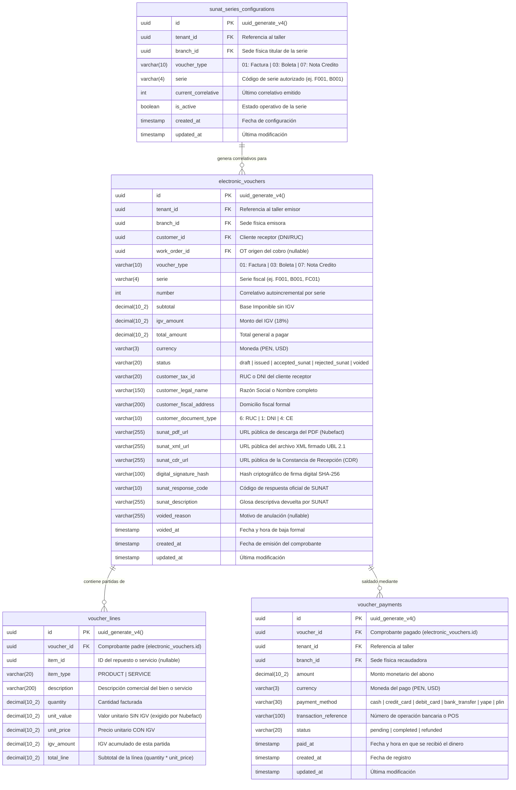

---

## 10. Fase 7: Bounded Context 7 — SaaS Billing & Subscriptions Context (`com.andeva.atelier.platform.billing`)

### 10.1. Diccionario y Propósito del Contexto

#### 10.1.1. Propósito y Límites de Responsabilidad
El **SaaS Billing & Subscriptions Context** administra el modelo de ingresos comerciales B2B y el aprovisionamiento de membresías de la plataforma Atelier hacia los talleres mecánicos abonados. Su delimitación responde a tres principios fundamentales de gobernanza de software:
1. **Desacoplamiento Estricto entre Facturación B2B (Andeva -> Taller) vs. Facturación Local (Taller -> Conductor):** En la versión previa (v1), los conceptos de facturación se encontraban severamente acoplados con cotizaciones y comprobantes fiscales locales. En la arquitectura v2, este contexto administra exclusivamente los planes comerciales contratados por el taller automotriz con la empresa *Andeva*, mientras que el contexto de **Invoicing & Compliance** gestiona la emisión de comprobantes fiscales tributarios (Facturas y Boletas UBL 2.1 ante SUNAT) del taller a sus clientes particulares.
2. **Ciclo de Vida de Planes y Membresías Recurrentes (`SubscriptionPlan` y `TenantSubscription`):** Administra el catálogo de planes comerciales (`STARTER`, `PROFESSIONAL`, `ENTERPRISE`), sus ciclos de cobro (mensual o anual) y los estados del ciclo de vida de la suscripción (`TRIALING`, `ACTIVE`, `PAST_DUE`, `CANCELED`, `UNPAID`).
3. **Gobernanza de Cuotas y Límites de Plataforma (*Tenant Quota Limits*):** Determina qué capacidades operativas tiene habilitadas cada taller en función de su plan activo:
   * Cantidad máxima de sucursales físicas permitidas (`maxBranches`).
   * Límite máximo de mecánicos y personal de taller activos simultáneamente (`maxActiveStaff`).
   * Habilitación de funcionalidades avanzadas como la ingesta y alertas predictivas de telemetría IoT OBD-II (`iotTelemetryEnabled`) o reportes ejecutivos de rentabilidad financiera.
4. **Cumplimiento Estricto de Seguridad PCI-DSS:** Para certificar el cumplimiento de los estándares internacionales de la industria de tarjetas de pago (**PCI-DSS Nivel 1**), el backend de Atelier **jamás procesa, transmite ni almacena números de tarjeta de crédito (PAN), códigos de seguridad CVV ni fechas de caducidad**. Todo el intercambio sensible de datos bancarios se delega al frontend mediante componentes seguros de **Stripe Elements** y el **SDK Móvil de Stripe**, intercambiando únicamente identificadores de clientes y métodos de pago tokenizados (`stripe_customer_id`, `stripe_sub_id`, `stripe_price_id`).
5. **Idempotencia Garantizada en Webhooks (*Webhook Idempotency*):** Cuando la pasarela de pagos ejecuta una operación asíncrona de cobro recurrente o renovación, notifica a los servidores de Atelier mediante solicitudes HTTP Webhook. Ante fluctuaciones de conectividad, Stripe reintenta el despacho del mismo evento hasta por 72 horas. Para evitar cobros duplicados, renovaciones espurias o inconsistencias de saldo, la tabla `stripe_events` registra unívocamente cada identificador de evento (`stripe_event_id` con restricción `UNIQUE`), descartando de forma inmediata cualquier procesamiento repetido.
6. **Aceleración de Lectura mediante Caché en Memoria (`Caffeine Cache`):** Dado que cada invocación a endpoints protegidos del ERP en cualquier Bounded Context requiere verificar si la suscripción del taller sigue activa y si no ha sobrepasado sus límites de uso, consultar PostgreSQL en cada petición crearía un cuello de botella de latencia inaceptable. Se implementa una capa de caché de ultra alta velocidad en memoria local JVM con **Caffeine Cache** (TTL de 5 minutos e invalidación reactiva inmediata ante webhooks de Stripe).

#### 10.1.2. Decisiones de Diseño e Integraciones Críticas
* **Integración Oficial con `stripe-java` SDK:** En lugar de implementar clientes HTTP ad-hoc propensos a errores de compatibilidad, Atelier integra la biblioteca oficial de Stripe para Java, gestionando sesiones de checkout seguras (*Stripe Checkout Sessions*) y portales de autogestión de cliente (*Stripe Customer Billing Portal*).
* **Verificación Criptográfica de Firmas Webhook:** Todos los mensajes entrantes en el endpoint público de webhooks son validados matemáticamente verificando la firma HMAC-SHA256 (`Stripe-Signature`) contra el secreto simétrico del webhook (`STRIPE_WEBHOOK_SECRET`), impidiendo ataques de suplantación de identidad (*Spoofing*).
* **Fachada Open Host Service (OHS) con Respaldo en Caché:** Los contextos de IAM, CRM, MRO e IoT consultan la interfaz `SubscriptionContextFacade.isTenantSubscriptionActive(TenantId tenantId)` y `isFeatureAllowed(TenantId tenantId, String featureKey)`, resolviendo la autorización de cuotas en menos de 0.05 milisegundos gracias a Caffeine Cache.

---

### 10.2. 2.6.7.1. Domain Layer

#### 10.2.1. Aggregates & Aggregate Roots

##### 1. `SubscriptionPlan` (Aggregate Root)
* **Paquete:** `com.andeva.atelier.platform.billing.domain.model.aggregates`
* **Herencia:** Extiende `AbstractDomainAggregateRoot<SubscriptionPlan>`
* **Propósito:** Representa un paquete comercial de software ofrecido por Andeva a los talleres mecánicos, definiendo precio, periodicidad y límites de recursos autorizados.
* **Atributos:**
  * `id: PlanId` — Identificador universal del plan (UUID).
  * `stripePriceId: StripePriceId` — Identificador del precio recurrente en Stripe (ej. `price_1N2M3...`).
  * `name: String` — Denominación del plan (ej. "Plan Profesional - Hasta 3 Sucursales", "Plan Taller Inicial").
  * `tier: PlanTier` — Nivel del plan (`STARTER`, `PROFESSIONAL`, `ENTERPRISE`).
  * `pricing: PlanPricing` — Objeto de valor que agrupa el precio monetario (`Money price`) y el ciclo de facturación (`BillingCycle billingCycle` [`MONTHLY`, `YEARLY`]).
  * `quotaLimits: TenantQuotaLimits` — Objeto de valor con las cuotas máximas autorizadas (`maxBranches`, `maxActiveStaff`, `iotTelemetryEnabled`, `aiDiagnosticsEnabled`).
  * `isActive: boolean` — Bandera que determina si el plan está disponible para nuevas contrataciones comerciales.
* **Invariantes y Reglas de Negocio:**
  * El identificador de precio en Stripe (`stripePriceId`) debe comenzar con el prefijo `price_` y no puede ser nulo ni estar vacío.
  * El precio monetario no puede ser negativo.
  * El límite de sucursales debe ser al menos 1 y el de personal al menos 1.
* **Métodos:**
  * `+ static SubscriptionPlan create(StripePriceId stripePriceId, String name, PlanTier tier, PlanPricing pricing, TenantQuotaLimits quotas): SubscriptionPlan`: Factoría de dominio; valida invariantes, establece vigencia activa y registra `SubscriptionPlanCreatedEvent`.
  * `+ void updateDetails(String name, PlanPricing pricing, TenantQuotaLimits quotas): void`: Modifica los parámetros comerciales y cuotas del plan.
  * `+ void deactivate(): void`: Retira el plan del catálogo para nuevas compras, preservando las suscripciones existentes.
  * `+ void activate(): void`: Restituye la disponibilidad comercial.

##### 2. `TenantSubscription` (Aggregate Root)
* **Paquete:** `com.andeva.atelier.platform.billing.domain.model.aggregates`
* **Herencia:** Extiende `AbstractDomainAggregateRoot<TenantSubscription>`
* **Propósito:** Representa el contrato de suscripción SaaS activo o histórico de un taller automotriz con la plataforma Atelier.
* **Atributos:**
  * `id: SubscriptionId` — Identificador universal de la suscripción (UUID).
  * `tenantId: TenantId` — Taller mecánico titular del contrato.
  * `planId: PlanId` — Plan comercial contratado.
  * `stripeCustomerId: StripeCustomerId` — Identificador de cliente en Stripe (ej. `cus_...`).
  * `stripeSubscriptionId: StripeSubscriptionId` — Identificador unívoco de suscripción en Stripe (ej. `sub_...`).
  * `status: SubscriptionStatus` — Estado del ciclo de vida (`TRIALING`, `ACTIVE`, `PAST_DUE`, `CANCELED`, `UNPAID`, `INCOMPLETE`).
  * `currentPeriod: SubscriptionPeriod` — Periodo actual de cobertura (`startDate: Instant`, `endDate: Instant`).
  * `cancelAtPeriodEnd: boolean` — Bandera que indica si la suscripción se cancelará automáticamente al concluir el periodo vigente.
  * `canceledAt: Optional<Instant>` — Fecha y hora formal de cancelación (nullable).
  * `trialEndDate: Optional<Instant>` — Fecha límite de prueba gratuita (nullable).
* **Invariantes y Reglas de Negocio:**
  * No puede existir más de una suscripción activa o en periodo de prueba (`ACTIVE`, `TRIALING`, `PAST_DUE`) simultáneamente para el mismo `tenant_id`.
  * La fecha de inicio del periodo no puede ser posterior a la fecha de fin del periodo.
  * Una suscripción en estado `CANCELED` no puede reactivarse directamente; requiere la contratación de una nueva suscripción.
* **Métodos:**
  * `+ static TenantSubscription startTrial(TenantId tenantId, PlanId planId, StripeCustomerId customerId, int trialDays): TenantSubscription`: Factoría para periodos de prueba gratuitos; registra `TenantSubscriptionActivatedEvent`.
  * `+ static TenantSubscription activate(TenantId tenantId, PlanId planId, StripeCustomerId customerId, StripeSubscriptionId subscriptionId, SubscriptionPeriod period): TenantSubscription`: Factoría tras confirmación de pago inicial de Stripe; registra `TenantSubscriptionActivatedEvent`.
  * `+ void renewPeriod(SubscriptionPeriod newPeriod): void`: Extiende la vigencia del servicio tras un cobro recurrente exitoso; registra `TenantSubscriptionRenewedEvent`.
  * `+ void markPastDue(): void`: Marca la suscripción en mora cuando un cobro recurrente es rechazado por el banco emisor; registra `TenantSubscriptionPastDueEvent`.
  * `+ void cancelAtPeriodEnd(): void`: Programa la cancelación al finalizar el ciclo de facturación pagado.
  * `+ void cancelImmediately(Instant cancellationTimestamp): void`: Cancela de forma inmediata la suscripción revocando el acceso a la plataforma; registra `TenantSubscriptionCanceledEvent`.
  * `+ void changePlan(PlanId newPlanId, StripePriceId newPriceId): void`: Actualiza el plan contratado (*upgrade* o *downgrade*) y registra `TenantPlanChangedEvent`.
  * `+ boolean isAccessGranted(): boolean`: Evalúa si el taller está autorizado a operar en la plataforma (estados `ACTIVE` o `TRIALING`, o periodo de gracia en `PAST_DUE`).

##### 3. `SaasInvoice` (Aggregate Root)
* **Paquete:** `com.andeva.atelier.platform.billing.domain.model.aggregates`
* **Herencia:** Extiende `AbstractDomainAggregateRoot<SaasInvoice>`
* **Propósito:** Representa el recibo o factura formal emitida por Andeva hacia el taller por el uso de la suscripción mensual o anual.
* **Atributos:**
  * `id: SaasInvoiceId` — Identificador universal interno de la factura SaaS (UUID).
  * `subscriptionId: SubscriptionId` — Suscripción vinculada.
  * `tenantId: TenantId` — Taller pagador.
  * `stripeInvoiceId: StripeInvoiceId` — Identificador de factura en Stripe (ej. `in_...`).
  * `amountPaid: Money` — Monto efectivamente debitado a la tarjeta de crédito o cuenta bancaria.
  * `status: InvoiceStatus` — Estado de la factura (`PAID`, `OPEN`, `VOID`, `UNCOLLECTIBLE`).
  * `invoicePdfUrl: String` — Enlace seguro provisto por Stripe para la descarga del comprobante en PDF.
  * `hostedInvoiceUrl: String` — Enlace a la página web interactiva de pago de Stripe.
  * `paidAt: Optional<Instant>` — Momento cronológico del débito bancario exitoso.
* **Métodos:**
  * `+ static SaasInvoice recordPaid(SubscriptionId subscriptionId, TenantId tenantId, StripeInvoiceId stripeInvoiceId, Money amountPaid, String pdfUrl, String hostedUrl, Instant paidAt): SaasInvoice`: Registra el pago exitoso y emite `SaasInvoicePaymentSucceededEvent`.
  * `+ void markPaymentFailed(String reason): void`: Registra el fallo de cobro bancario y emite `SaasInvoicePaymentFailedEvent`.

##### 4. `StripeWebhookEvent` (Aggregate Root de Idempotencia)
* **Paquete:** `com.andeva.atelier.platform.billing.domain.model.aggregates`
* **Propósito:** Garantiza el procesamiento exactamente una vez (*Exactly-Once Processing*) de las notificaciones asíncronas de Stripe, actuando como escudo contra duplicidades de red.
* **Atributos:**
  * `id: UUID` — Identificador de base de datos interno.
  * `stripeEventId: StripeEventId` — Identificador unívoco del evento emitido por Stripe (`evt_...`). **Restricción UNIQUE a nivel de BD**.
  * `eventType: String` — Tipo de evento (ej. `invoice.payment_succeeded`, `customer.subscription.deleted`).
  * `eventPayload: String` — Contenido serializado en formato JSON de la notificación para auditoría forense.
  * `status: WebhookProcessingStatus` — Estado del procesamiento (`PENDING`, `PROCESSED`, `FAILED`, `IGNORED`).
  * `processedAt: Instant` — Timestamp de resolución en el backend.
  * `errorMessage: Optional<String>` — Detalle del error en caso de fallo durante el procesamiento.
* **Métodos:**
  * `+ static StripeWebhookEvent receive(StripeEventId eventId, String type, String payload): StripeWebhookEvent`: Registra la recepción inicial en estado `PENDING`.
  * `+ void markProcessed(): void`: Marca el evento como resuelto con éxito.
  * `+ void markFailed(String error): void`: Registra la causa de fallo para inspección.

---

#### 10.2.2. Entities (Child Entities)

##### `PlanFeature` (Entity)
* **Paquete:** `com.andeva.atelier.platform.billing.domain.model.entities`
* **Propósito:** Representa una característica funcional o módulo individual paquetizado dentro de un plan comercial de suscripción.
* **Atributos:**
  * `id: UUID` — Identificador de la característica.
  * `featureKey: String` — Clave alfanumérica única (ej. `FEATURE_OBD2_TELEMETRY`, `FEATURE_AI_PREDICTIONS`, `FEATURE_MULTI_BRANCH`).
  * `description: String` — Descripción para el catálogo comercial.
  * `isEnabled: boolean` — Disponibilidad en el plan actual.

---

#### 10.2.3. Value Objects

* **`PlanId`:** Identificador universal inmutable de un plan (`record PlanId(UUID value)`).
* **`SubscriptionId`:** Identificador inmutable de una suscripción (`record SubscriptionId(UUID value)`).
* **`SaasInvoiceId`:** Identificador inmutable de una factura SaaS (`record SaasInvoiceId(UUID value)`).
* **`StripeEventId`:** Objeto de valor para identificadores de eventos de Stripe (`record StripeEventId(String value)`). Valida que cumpla el patrón `^evt_[a-zA-Z0-9]+$`.
* **`StripeCustomerId`:** Identificador de cliente en Stripe (`record StripeCustomerId(String value)`). Valida prefijo `cus_`.
* **`StripeSubscriptionId`:** Identificador de suscripción en Stripe (`record StripeSubscriptionId(String value)`). Valida prefijo `sub_`.
* **`StripePriceId`:** Identificador de precio en Stripe (`record StripePriceId(String value)`). Valida prefijo `price_`.
* **`BillingCycle`:** Enumeración del ciclo de cobro recurrente (`MONTHLY`, `YEARLY`).
* **`SubscriptionStatus`:** Enumeración de estados de suscripción (`TRIALING`, `ACTIVE`, `PAST_DUE`, `CANCELED`, `UNPAID`, `INCOMPLETE`).
* **`InvoiceStatus`:** Enumeración del estado de factura SaaS (`PAID`, `OPEN`, `VOID`, `UNCOLLECTIBLE`).
* **`PlanTier`:** Nivel del paquete de software (`STARTER`, `PROFESSIONAL`, `ENTERPRISE`).
* **`PlanPricing`:** Objeto de valor que asocia el precio y su ciclo (`record PlanPricing(Money price, BillingCycle billingCycle)`).
* **`TenantQuotaLimits`:** Cuotas máximas autorizadas por el plan (`record TenantQuotaLimits(int maxBranches, int maxActiveStaff, boolean iotTelemetryEnabled, boolean aiDiagnosticsEnabled, int maxMonthlyWorkOrders)`).
* **`SubscriptionPeriod`:** Intervalo temporal de cobertura pagada (`record SubscriptionPeriod(Instant startDate, Instant endDate)`).
* **`WebhookProcessingStatus`:** Estado del despacho de webhooks (`PENDING`, `PROCESSED`, `FAILED`, `IGNORED`).

---

#### 10.2.4. Domain Commands

* **`CreateSubscriptionPlanCommand`:** Parámetros para registrar un nuevo plan comercial (`StripePriceId stripePriceId, String name, PlanTier tier, Money price, BillingCycle cycle, TenantQuotaLimits quotas`).
* **`UpdateSubscriptionPlanCommand`:** Modificación de cuotas o precio de un plan existente (`PlanId planId, String name, Money price, BillingCycle cycle, TenantQuotaLimits quotas`).
* **`InitiateCheckoutSessionCommand`:** Parámetros para iniciar la compra segura en Stripe (`TenantId tenantId, PlanId planId, String successUrl, String cancelUrl`).
* **`ProcessStripeWebhookCommand`:** Parámetros del webhook entrante (`String payload, String signatureHeader`).
* **`ChangeSubscriptionPlanCommand`:** Parámetros de upgrade/downgrade de plan (`SubscriptionId subscriptionId, PlanId newPlanId`).
* **`CancelSubscriptionCommand`:** Parámetros para solicitar baja voluntaria del servicio (`SubscriptionId subscriptionId, boolean cancelImmediately`).
* **`RecordSaasInvoicePaymentCommand`:** Parámetros para registrar el recibo de Stripe (`SubscriptionId subscriptionId, TenantId tenantId, StripeInvoiceId stripeInvoiceId, Money amount, String pdfUrl, String hostedUrl, Instant paidAt`).

---

#### 10.2.5. Domain Queries

* **`GetSubscriptionPlanByIdQuery`:** Consulta de un plan por su ID (`PlanId planId`).
* **`ListActivePlansQuery`:** Catálogo de planes vigentes para el portal de suscripción.
* **`GetTenantSubscriptionQuery`:** Consulta del estado contractual actual de un taller (`TenantId tenantId`).
* **`CheckTenantQuotaQuery`:** Consulta de límites y cuotas operativas vigentes (`TenantId tenantId`).
* **`ListTenantInvoicesQuery`:** Historial de facturas y recibos de un taller (`TenantId tenantId`).
* **`IsTenantSubscriptionActiveQuery`:** Validación de alta velocidad sobre si un taller puede utilizar el sistema (`TenantId tenantId`).

---

#### 10.2.6. Domain Events

* **`SubscriptionPlanCreatedEvent`:** Emitido al publicar un nuevo plan en el catálogo comercial (`PlanId planId, String name, PlanTier tier, Money price`).
* **`TenantSubscriptionActivatedEvent`:** Emitido al confirmarse el alta formal de un taller en un plan (`SubscriptionId subscriptionId, TenantId tenantId, PlanId planId, Instant expiresAt`).
* **`TenantSubscriptionRenewedEvent`:** Emitido al procesarse el cobro recurrente mensual o anual (`SubscriptionId subscriptionId, TenantId tenantId, Instant newPeriodEnd`).
* **`TenantSubscriptionPastDueEvent`:** Emitido al rebotar un intento de cobro en la tarjeta del taller (`SubscriptionId subscriptionId, TenantId tenantId, Instant gracePeriodEnd`).
* **`TenantSubscriptionCanceledEvent`:** Emitido al revocarse el servicio SaaS (`SubscriptionId subscriptionId, TenantId tenantId, Instant canceledAt`).
* **`TenantPlanChangedEvent`:** Emitido tras un upgrade o downgrade comercial (`SubscriptionId subscriptionId, TenantId tenantId, PlanId oldPlanId, PlanId newPlanId`).
* **`SaasInvoicePaymentSucceededEvent`:** Emitido al registrarse el recibo de Stripe (`SaasInvoiceId invoiceId, TenantId tenantId, Money amount`).
* **`SaasInvoicePaymentFailedEvent`:** Emitido cuando un cargo a tarjeta no prospera (`TenantId tenantId, String failureReason`).

---

#### 10.2.7. Domain Repositories (Interfaces)

```java
package com.andeva.atelier.platform.billing.domain.repositories;

public interface SubscriptionPlanRepository {
    SubscriptionPlan save(SubscriptionPlan plan);
    Optional<SubscriptionPlan> findById(PlanId id);
    Optional<SubscriptionPlan> findByStripePriceId(StripePriceId stripePriceId);
    List<SubscriptionPlan> findAllActive();
}

public interface TenantSubscriptionRepository {
    TenantSubscription save(TenantSubscription subscription);
    Optional<TenantSubscription> findById(SubscriptionId id);
    Optional<TenantSubscription> findByTenantId(TenantId tenantId);
    Optional<TenantSubscription> findByStripeSubscriptionId(StripeSubscriptionId stripeSubId);
    boolean existsActiveByTenantId(TenantId tenantId);
}

public interface SaasInvoiceRepository {
    SaasInvoice save(SaasInvoice invoice);
    Optional<SaasInvoice> findById(SaasInvoiceId id);
    Optional<SaasInvoice> findByStripeInvoiceId(StripeInvoiceId stripeInvoiceId);
    List<SaasInvoice> findAllByTenantId(TenantId tenantId);
}

public interface StripeWebhookEventRepository {
    StripeWebhookEvent save(StripeWebhookEvent event);
    Optional<StripeWebhookEvent> findByStripeEventId(StripeEventId stripeEventId);
    boolean existsByStripeEventId(StripeEventId stripeEventId);
}
```

---

#### 10.2.8. Domain Services

##### 1. `SubscriptionQuotaEnforcementService` (Servicio de Dominio de Gobernanza de Cuotas)
* **Paquete:** `com.andeva.atelier.platform.billing.domain.services`
* **Propósito:** Valida de forma estricta si un taller mecánico se encuentra dentro de los límites operativos estipulados por su plan contratado antes de permitir altas de recursos en otros Bounded Contexts:
```java
package com.andeva.atelier.platform.billing.domain.services;

import com.andeva.atelier.platform.billing.domain.model.aggregates.SubscriptionPlan;
import com.andeva.atelier.platform.billing.domain.model.aggregates.TenantSubscription;
import com.andeva.atelier.platform.billing.domain.model.exceptions.QuotaExceededException;
import com.andeva.atelier.platform.billing.domain.model.valueobjects.TenantQuotaLimits;
import org.springframework.stereotype.Service;

@Service
public class SubscriptionQuotaEnforcementService {

    public void validateBranchCreationAllowed(TenantSubscription subscription, SubscriptionPlan plan, int currentBranchCount) {
        if (!subscription.isAccessGranted()) {
            throw new QuotaExceededException("La suscripción del taller se encuentra inactiva o suspendida.");
        }
        TenantQuotaLimits limits = plan.getQuotaLimits();
        if (currentBranchCount >= limits.maxBranches()) {
            throw new QuotaExceededException(String.format(
                "Límite de sucursales alcanzado (%d/%d). Actualice su plan a Professional o Enterprise para abrir nuevas sedes.",
                currentBranchCount, limits.maxBranches()
            ));
        }
    }

    public void validateStaffAdditionAllowed(TenantSubscription subscription, SubscriptionPlan plan, int currentStaffCount) {
        if (!subscription.isAccessGranted()) {
            throw new QuotaExceededException("La suscripción del taller se encuentra inactiva o suspendida.");
        }
        TenantQuotaLimits limits = plan.getQuotaLimits();
        if (currentStaffCount >= limits.maxActiveStaff()) {
            throw new QuotaExceededException(String.format(
                "Límite de personal alcanzado (%d/%d). Actualice su plan para registrar más mecánicos y asesores.",
                currentStaffCount, limits.maxActiveStaff()
            ));
        }
    }

    public boolean isFeatureEnabled(TenantSubscription subscription, SubscriptionPlan plan, String featureKey) {
        if (!subscription.isAccessGranted()) return false;
        return switch (featureKey) {
            case "FEATURE_OBD2_TELEMETRY" -> plan.getQuotaLimits().iotTelemetryEnabled();
            case "FEATURE_AI_PREDICTIONS" -> plan.getQuotaLimits().aiDiagnosticsEnabled();
            default -> false;
        };
    }
}
```

##### 2. `StripeWebhookSignatureVerificationService` (Servicio Criptográfico de Firmas)
* **Paquete:** `com.andeva.atelier.platform.billing.domain.services`
* **Propósito:** Valida la autenticidad del payload de cada webhook verificando la firma HMAC-SHA256 contra el secreto del webhook de Stripe, mitigando ataques de intermediarios (*Man-in-the-Middle*).

---

### 10.3. 2.6.7.2. Interface Layer

#### 10.3.1. REST Controllers

##### 1. `SubscriptionPlansController`
* **Ruta Base:** `/api/v1/billing/plans`
* **Responsabilidad:** Catálogo comercial de planes SaaS.
* **Endpoints:**
  * `GET /`: Lista los planes comerciales activos disponibles para compra. Responde `200 OK`.
  * `GET /{id}`: Detalle de un plan específico con sus cuotas y precio. Responde `200 OK`.
  * `POST /`: Creación administrativa de nuevos planes vinculados a Stripe. Responde `201 Created`.
  * `PUT /{id}`: Actualización de cuotas y metadatos de un plan. Responde `200 OK`.

##### 2. `TenantSubscriptionsController`
* **Ruta Base:** `/api/v1/billing/subscriptions`
* **Responsabilidad:** Gestión de membresías por parte de administradores de talleres mecánicos.
* **Endpoints:**
  * `GET /me`: Consulta la suscripción activa del taller autenticado, su estado, periodo de vigencia y cuotas consumidas. Responde `200 OK`.
  * `POST /checkout-session`: Genera una URL de sesión de **Stripe Checkout** para suscribirse o realizar un upgrade de plan. Responde `200 OK` con la URL segura de pago de Stripe.
  * `POST /customer-portal`: Genera una sesión de **Stripe Customer Portal** para que el dueño del taller actualice su tarjeta de crédito o consulte recibos directamente en la interfaz oficial de Stripe. Responde `200 OK` con la URL de redirección.
  * `POST /cancel`: Solicita la cancelación de la suscripción al finalizar el periodo pagado. Responde `200 OK`.

##### 3. `SaasInvoicesController`
* **Ruta Base:** `/api/v1/billing/invoices`
* **Responsabilidad:** Consulta y descarga de comprobantes de pago de la plataforma Atelier emitidos al taller.
* **Endpoints:**
  * `GET /`: Lista las facturas históricas de suscripción del taller autenticado. Responde `200 OK`.
  * `GET /{id}/pdf`: Redirige a la descarga directa del PDF oficial alojado en Stripe. Responde `302 Found`.

##### 4. `StripeWebhooksController`
* **Ruta Base:** `/api/v1/billing/webhooks/stripe`
* **Responsabilidad:** Endpoint de alta disponibilidad receptor de eventos de Stripe.
* **Endpoints:**
  * `POST /`: Recibe la carga útil cruda (*raw payload*) y la cabecera `Stripe-Signature`. Valida la firma HMAC-SHA256, verifica idempotencia con `stripe_events` y encola la actualización de estado. Responde de inmediato `200 OK` para confirmar recepción a Stripe.

---

#### 10.3.2. REST Resources & DTOs (Records)

```java
package com.andeva.atelier.platform.billing.interfaces.rest.resources;

public record SubscriptionPlanResource(
    UUID id,
    String stripePriceId,
    String name,
    String tier,
    BigDecimal price,
    String currency,
    String billingCycle,
    TenantQuotaLimitsDto quotaLimits,
    boolean isActive
) {}

public record TenantQuotaLimitsDto(
    int maxBranches,
    int maxActiveStaff,
    boolean iotTelemetryEnabled,
    boolean aiDiagnosticsEnabled,
    int maxMonthlyWorkOrders
) {}

public record CreateCheckoutSessionRequest(
    @NotNull UUID planId,
    @NotBlank String successUrl,
    @NotBlank String cancelUrl
) {}

public record CheckoutSessionResponse(
    String checkoutUrl,
    String sessionId
) {}

public record CustomerPortalResponse(
    String portalUrl
) {}

public record TenantSubscriptionResource(
    UUID id,
    UUID tenantId,
    UUID planId,
    String planName,
    String status,
    Instant currentPeriodStart,
    Instant currentPeriodEnd,
    boolean cancelAtPeriodEnd,
    TenantQuotaLimitsDto quotas
) {}

public record SaasInvoiceResource(
    UUID id,
    String stripeInvoiceId,
    BigDecimal amountPaid,
    String currency,
    String status,
    String invoicePdfUrl,
    String hostedInvoiceUrl,
    Instant paidAt
) {}
```

---

#### 10.3.3. REST Assemblers (Mappers)

* **`SubscriptionPlanResourceAssembler`:** Transforma agregados `SubscriptionPlan` a DTOs `SubscriptionPlanResource`.
* **`TenantSubscriptionResourceAssembler`:** Mapea agregados `TenantSubscription` y cuotas del plan a `TenantSubscriptionResource`.
* **`SaasInvoiceResourceAssembler`:** Transforma `SaasInvoice` a `SaasInvoiceResource`.

---

#### 10.3.4. Inbound ACL Facade (Open Host Service - OHS)

La fachada pública de suscripciones permite a todos los Bounded Contexts verificar estados y cuotas con latencia casi nula mediante **Caffeine Cache**:

```java
package com.andeva.atelier.platform.billing.interfaces.acl;

import java.util.UUID;

public interface SubscriptionContextFacade {
    /**
     * Resuelto en RAM (< 0.05 ms) mediante Caffeine In-Memory Cache.
     * Verifica si el taller tiene una suscripción vigente (ACTIVE, TRIALING o PAST_DUE en gracia).
     */
    boolean isTenantSubscriptionActive(UUID tenantId);

    /**
     * Retorna las cuotas operativas vigentes contratadas por el taller.
     */
    TenantQuotaLimitsDto getTenantQuotaLimits(UUID tenantId);

    /**
     * Valida si el taller puede aperturar una nueva sucursal física en IAM.
     */
    boolean canAddBranch(UUID tenantId, int currentBranchCount);

    /**
     * Valida si el taller puede contratar un nuevo mecánico o asesor en HR.
     */
    boolean canAddStaffMember(UUID tenantId, int currentStaffCount);

    /**
     * Valida si una funcionalidad avanzada (ej. Telemetría OBD-II IoT) está habilitada por el plan.
     */
    boolean isFeatureAllowed(UUID tenantId, String featureKey);
}
```

---

#### 10.3.5. Integration Events (Published / Consumed)

##### 1. Eventos Publicados por Billing hacia otros Bounded Contexts
* **`TenantSubscriptionStatusChangedIntegrationEvent`:** Emitido cuando la suscripción transiciona a `ACTIVE`, `PAST_DUE` o `CANCELED`. Invalida la caché de Caffeine en todas las instancias y ajusta permisos en IAM.
* **`TenantPlanUpgradedIntegrationEvent`:** Emitido al realizarse un upgrade de plan. Habilita de inmediato cuotas expandidas en MRO, HR e IoT.
* **`TenantSubscriptionSuspendedIntegrationEvent`:** Emitido al cancelarse definitivamente la suscripción. Bloquea el acceso a endpoints operativos del ERP.

##### 2. Eventos Consumidos por Billing desde otros Bounded Contexts
* **`TenantRegisteredIntegrationEvent` (emitido por IAM & Tenancy Context):** Inicia automáticamente el aprovisionamiento de un cliente en Stripe (`StripeCustomerId`) y vincula una suscripción de prueba gratuita (*Free Trial* de 14 días).

---

### 10.4. 2.6.7.3. Application Layer

#### 10.4.1. Command Services (Handlers)

##### 1. `TenantSubscriptionCommandServiceImpl`
* **Responsabilidad:** Orquestar el flujo de contratación y gestión de suscripciones:
  1. Para nuevas suscripciones: Invoca a `StripeClientGateway` para inicializar una sesión de checkout y retorna la URL segura al frontend.
  2. Al procesar webhooks de Stripe: Actualiza de forma atómica el estado de la suscripción, extiende periodos contables y actualiza la tabla de auditoría `subscriptions`.
  3. Despacha eventos de integración inter-contexto y purga la caché local de Caffeine para el taller afectado.

##### 2. `StripeWebhookCommandServiceImpl`
* **Responsabilidad:** Procesamiento seguro e idempotente de webhooks:
  1. Verifica la firma HMAC-SHA256 con `StripeWebhookSignatureVerificationService`.
  2. Comprueba si el `stripe_event_id` ya existe en la tabla `stripe_events`. Si existe, retorna éxito inmediato (`200 OK`) sin volver a ejecutar la lógica de negocio.
  3. Inserta el registro en `stripe_events` con estado `PENDING`.
  4. En función del tipo de evento:
     * `checkout.session.completed`: Asocia el `stripe_subscription_id` con el `tenant_id` y activa el plan.
     * `invoice.payment_succeeded`: Registra la factura en `saas_invoices` y renueva el periodo en `subscriptions`.
     * `invoice.payment_failed`: Marca la suscripción como `PAST_DUE` y alerta por correo vía Resend.
     * `customer.subscription.deleted`: Transiciona la suscripción a `CANCELED`.
  5. Marca el evento como `PROCESSED`.

##### 3. `SubscriptionPlanCommandServiceImpl`
* **Responsabilidad:** Crear y actualizar planes sincronizados con productos y precios de Stripe.

##### 4. `SaasInvoiceCommandServiceImpl`
* **Responsabilidad:** Registrar comprobantes y emitir notificaciones de pago exitoso.

---

#### 10.4.2. Query Services (Handlers)

##### `TenantSubscriptionQueryServiceImpl`
* **Responsabilidad:** Resuelve consultas de suscripción implementando **Caffeine Cache**:
```java
package com.andeva.atelier.platform.billing.application.internal.queryservices;

import com.andeva.atelier.platform.billing.domain.model.aggregates.TenantSubscription;
import com.andeva.atelier.platform.billing.domain.model.valueobjects.SubscriptionStatus;
import com.andeva.atelier.platform.billing.domain.repositories.TenantSubscriptionRepository;
import com.andeva.atelier.platform.shared.domain.model.valueobjects.TenantId;
import org.springframework.cache.annotation.CacheEvict;
import org.springframework.cache.annotation.Cacheable;
import org.springframework.stereotype.Service;
import org.springframework.transaction.annotation.Transactional;

@Service
@Transactional(readOnly = true)
public class TenantSubscriptionQueryServiceImpl {
    private final TenantSubscriptionRepository subscriptionRepository;

    public TenantSubscriptionQueryServiceImpl(TenantSubscriptionRepository subscriptionRepository) {
        this.subscriptionRepository = subscriptionRepository;
    }

    @Cacheable(value = "tenantSubscriptionStatus", key = "#tenantId.value().toString()")
    public boolean isSubscriptionActive(TenantId tenantId) {
        return subscriptionRepository.findByTenantId(tenantId)
                .map(sub -> sub.getStatus() == SubscriptionStatus.ACTIVE 
                         || sub.getStatus() == SubscriptionStatus.TRIALING)
                .orElse(false);
    }

    @CacheEvict(value = "tenantSubscriptionStatus", key = "#tenantId.value().toString()")
    public void evictSubscriptionCache(TenantId tenantId) {
        // Purga reactiva de caché tras recepción de Webhook de Stripe
    }
}
```

---

#### 10.4.3. Domain Event Handlers

* **`SubscriptionDomainEventHandler`:**
  * Al recibir `TenantSubscriptionActivatedEvent` o `TenantSubscriptionRenewedEvent`: Purga la caché de Caffeine del taller y envía un correo de confirmación de facturación a través de `ResendEmailAdapter`.
  * Al recibir `TenantSubscriptionPastDueEvent`: Despacha un correo urgente al administrador del taller informando el fallo de cobro a la tarjeta y proveyendo un enlace al Stripe Customer Portal para regularizar su medio de pago antes de la suspensión de la cuenta.

---

#### 10.4.4. Outbound ACL Services & Remote Adapters

##### `StripeAclService`
* **Paquete:** `com.andeva.atelier.platform.billing.application.internal.outboundservices.acl`
* **Propósito:** Encapsula las clases nativas del SDK `com.stripe.*` y transforma excepciones externas (`StripeException`, `CardException`) en excepciones de dominio semánticas de Atelier.

---

### 10.5. 2.6.7.4. Infrastructure Layer

#### 10.5.1. JPA Entities

##### 1. `SubscriptionPlanJpaEntity`
* **Tabla Relacional:** `plans`
* **Mapeo:**
```java
package com.andeva.atelier.platform.billing.infrastructure.persistence.jpa.entities;

import com.andeva.atelier.platform.shared.infrastructure.persistence.jpa.entities.AuditableAbstractPersistenceEntity;
import jakarta.persistence.*;
import java.math.BigDecimal;
import java.util.UUID;

@Entity
@Table(name = "plans")
public class SubscriptionPlanJpaEntity extends AuditableAbstractPersistenceEntity {
    @Id
    @Column(name = "id", nullable = false, updatable = false)
    private UUID id;

    @Column(name = "stripe_price_id", nullable = false, length = 100, unique = true)
    private String stripePriceId;

    @Column(name = "name", nullable = false, length = 100)
    private String name;

    @Column(name = "tier", nullable = false, length = 20)
    private String tier;

    @Column(name = "price", nullable = false, precision = 10, scale = 2)
    private BigDecimal price;

    @Column(name = "currency", nullable = false, length = 3)
    private String currency = "USD";

    @Column(name = "billing_cycle", nullable = false, length = 20)
    private String billingCycle;

    @Column(name = "max_branches", nullable = false)
    private int maxBranches;

    @Column(name = "max_active_staff", nullable = false)
    private int maxActiveStaff;

    @Column(name = "iot_telemetry_enabled", nullable = false)
    private boolean iotTelemetryEnabled;

    @Column(name = "ai_diagnostics_enabled", nullable = false)
    private boolean aiDiagnosticsEnabled;

    @Column(name = "is_active", nullable = false)
    private boolean isActive = true;

    // Getters y Setters JPA
}
```

##### 2. `TenantSubscriptionJpaEntity`
* **Tabla Relacional:** `subscriptions`
* **Mapeo:**
```java
package com.andeva.atelier.platform.billing.infrastructure.persistence.jpa.entities;

import com.andeva.atelier.platform.shared.infrastructure.persistence.jpa.entities.AuditableAbstractPersistenceEntity;
import jakarta.persistence.*;
import java.time.Instant;
import java.util.UUID;

@Entity
@Table(name = "subscriptions", uniqueConstraints = {
    @UniqueConstraint(name = "uk_subscriptions_tenant", columnNames = {"tenant_id"})
}, indexes = {
    @Index(name = "idx_subscriptions_stripe_sub", columnList = "stripe_sub_id"),
    @Index(name = "idx_subscriptions_status", columnList = "status")
})
public class TenantSubscriptionJpaEntity extends AuditableAbstractPersistenceEntity {
    @Id
    @Column(name = "id", nullable = false, updatable = false)
    private UUID id;

    @Column(name = "tenant_id", nullable = false, updatable = false)
    private UUID tenantId;

    @Column(name = "plan_id", nullable = false)
    private UUID planId;

    @Column(name = "stripe_customer_id", nullable = false, length = 100)
    private String stripeCustomerId;

    @Column(name = "stripe_sub_id", nullable = false, length = 100)
    private String stripeSubscriptionId;

    @Column(name = "status", nullable = false, length = 20)
    private String status;

    @Column(name = "current_period_start", nullable = false)
    private Instant currentPeriodStart;

    @Column(name = "current_period_end", nullable = false)
    private Instant currentPeriodEnd;

    @Column(name = "cancel_at_period_end", nullable = false)
    private boolean cancelAtPeriodEnd = false;

    @Column(name = "canceled_at")
    private Instant canceledAt;

    @Column(name = "trial_end_date")
    private Instant trialEndDate;

    // Getters y Setters JPA
}
```

##### 3. `SaasInvoiceJpaEntity`
* **Tabla Relacional:** `invoices`
* **Mapeo:**
```java
package com.andeva.atelier.platform.billing.infrastructure.persistence.jpa.entities;

import com.andeva.atelier.platform.shared.infrastructure.persistence.jpa.entities.AuditableAbstractPersistenceEntity;
import jakarta.persistence.*;
import java.math.BigDecimal;
import java.time.Instant;
import java.util.UUID;

@Entity
@Table(name = "invoices", indexes = {
    @Index(name = "idx_invoices_tenant", columnList = "tenant_id"),
    @Index(name = "idx_invoices_stripe_inv", columnList = "stripe_invoice_id")
})
public class SaasInvoiceJpaEntity extends AuditableAbstractPersistenceEntity {
    @Id
    @Column(name = "id", nullable = false, updatable = false)
    private UUID id;

    @Column(name = "subscription_id", nullable = false, updatable = false)
    private UUID subscriptionId;

    @Column(name = "tenant_id", nullable = false, updatable = false)
    private UUID tenantId;

    @Column(name = "stripe_invoice_id", nullable = false, length = 100, unique = true)
    private String stripeInvoiceId;

    @Column(name = "amount_paid", nullable = false, precision = 10, scale = 2)
    private BigDecimal amountPaid;

    @Column(name = "currency", nullable = false, length = 3)
    private String currency = "USD";

    @Column(name = "status", nullable = false, length = 20)
    private String status;

    @Column(name = "invoice_pdf_url", length = 255)
    private String invoicePdfUrl;

    @Column(name = "hosted_invoice_url", length = 255)
    private String hostedInvoiceUrl;

    @Column(name = "paid_at")
    private Instant paidAt;

    // Getters y Setters JPA
}
```

##### 4. `StripeWebhookEventJpaEntity`
* **Tabla Relacional:** `stripe_events`
* **Mapeo:**
```java
package com.andeva.atelier.platform.billing.infrastructure.persistence.jpa.entities;

import jakarta.persistence.*;
import java.time.Instant;
import java.util.UUID;

@Entity
@Table(name = "stripe_events", uniqueConstraints = {
    @UniqueConstraint(name = "uk_stripe_events_event_id", columnNames = {"stripe_event_id"})
})
public class StripeWebhookEventJpaEntity {
    @Id
    @Column(name = "id", nullable = false, updatable = false)
    private UUID id;

    @Column(name = "stripe_event_id", nullable = false, length = 100)
    private String stripeEventId;

    @Column(name = "type", nullable = false, length = 50)
    private String type;

    @Column(name = "payload", columnDefinition = "TEXT", nullable = false)
    private String payload;

    @Column(name = "status", nullable = false, length = 20)
    private String status;

    @Column(name = "processed_at", nullable = false)
    private Instant processedAt;

    @Column(name = "error_message", length = 500)
    private String errorMessage;

    // Getters y Setters JPA
}
```

---

#### 10.5.2. Spring Data JPA Repositories

```java
package com.andeva.atelier.platform.billing.infrastructure.persistence.jpa.repositories;

public interface SpringDataSubscriptionPlanRepository extends JpaRepository<SubscriptionPlanJpaEntity, UUID> {
    Optional<SubscriptionPlanJpaEntity> findByStripePriceId(String stripePriceId);
    List<SubscriptionPlanJpaEntity> findAllByIsActiveTrue();
}

public interface SpringDataTenantSubscriptionRepository extends JpaRepository<TenantSubscriptionJpaEntity, UUID> {
    Optional<TenantSubscriptionJpaEntity> findByTenantId(UUID tenantId);
    Optional<TenantSubscriptionJpaEntity> findByStripeSubscriptionId(String stripeSubscriptionId);
    boolean existsByTenantIdAndStatusIn(UUID tenantId, List<String> activeStatuses);
}

public interface SpringDataSaasInvoiceRepository extends JpaRepository<SaasInvoiceJpaEntity, UUID> {
    Optional<SaasInvoiceJpaEntity> findByStripeInvoiceId(String stripeInvoiceId);
    List<SaasInvoiceJpaEntity> findAllByTenantIdOrderByCreatedAtDesc(UUID tenantId);
}

public interface SpringDataStripeWebhookEventRepository extends JpaRepository<StripeWebhookEventJpaEntity, UUID> {
    Optional<StripeWebhookEventJpaEntity> findByStripeEventId(String stripeEventId);
    boolean existsByStripeEventId(String stripeEventId);
}
```

---

#### 10.5.3. Repository Implementations & Adapters

* **`SubscriptionPlanRepositoryImpl`:** Implementa `SubscriptionPlanRepository` adaptando entidades JPA y Value Objects.
* **`TenantSubscriptionRepositoryImpl`:** Adapta `SpringDataTenantSubscriptionRepository` hacia `TenantSubscriptionRepository`.
* **`SaasInvoiceRepositoryImpl`:** Adapta `SpringDataSaasInvoiceRepository`.
* **`StripeWebhookEventRepositoryImpl`:** Adapta la tabla de idempotencia `stripe_events`.

---

#### 10.5.4. Persistence Assemblers & Data Mappers

* **`SubscriptionPlanPersistenceAssembler`:** Transforma agregados de dominio `SubscriptionPlan` hacia `SubscriptionPlanJpaEntity` y viceversa.
* **`TenantSubscriptionPersistenceAssembler`:** Reconstruye agregados `TenantSubscription` a partir de `TenantSubscriptionJpaEntity`.
* **`SaasInvoicePersistenceAssembler`:** Transforma facturas SaaS entre capas.

---

#### 10.5.5. JPA Attribute Converters

* **`BillingCycleConverter`:** Mapea el enum `BillingCycle` hacia `VARCHAR(20)`.
* **`SubscriptionStatusConverter`:** Mapea `SubscriptionStatus` hacia `VARCHAR(20)`.
* **`InvoiceStatusConverter`:** Mapea `InvoiceStatus` hacia `VARCHAR(20)`.

---

#### 10.5.6. External Gateways & Stripe Adapters

##### `StripeClientGatewayImpl`
* **Paquete:** `com.andeva.atelier.platform.billing.infrastructure.gateways`
* **Propósito:** Encapsula la comunicación directa con los servicios de Stripe utilizando el SDK oficial `com.stripe`:
```java
package com.andeva.atelier.platform.billing.infrastructure.gateways;

import com.stripe.Stripe;
import com.stripe.model.checkout.Session;
import com.stripe.param.checkout.SessionCreateParams;
import org.springframework.beans.factory.annotation.Value;
import org.springframework.stereotype.Service;
import jakarta.annotation.PostConstruct;

@Service
public class StripeClientGatewayImpl implements StripeClientGateway {

    @Value("${stripe.secret-key}")
    private String stripeApiKey;

    @PostConstruct
    public void init() {
        Stripe.apiKey = this.stripeApiKey;
    }

    @Override
    public String createCheckoutSession(String customerId, String priceId, String successUrl, String cancelUrl) throws Exception {
        SessionCreateParams params = SessionCreateParams.builder()
                .setCustomer(customerId)
                .setMode(SessionCreateParams.Mode.SUBSCRIPTION)
                .setSuccessUrl(successUrl + "?session_id={CHECKOUT_SESSION_ID}")
                .setCancelUrl(cancelUrl)
                .addLineItem(SessionCreateParams.LineItem.builder()
                        .setPrice(priceId)
                        .setQuantity(1L)
                        .build())
                .build();

        Session session = Session.create(params);
        return session.getUrl();
    }
}
```

##### Configuración de `Caffeine Cache Manager`
```java
package com.andeva.atelier.platform.billing.infrastructure.cache;

import com.github.benmanes.caffeine.cache.Caffeine;
import org.springframework.cache.CacheManager;
import org.springframework.cache.caffeine.CaffeineCacheManager;
import org.springframework.context.annotation.Bean;
import org.springframework.context.annotation.Configuration;
import java.util.concurrent.TimeUnit;

@Configuration
public class BillingCacheConfig {

    @Bean
    public CacheManager billingCacheManager() {
        CaffeineCacheManager cacheManager = new CaffeineCacheManager("tenantSubscriptionStatus");
        cacheManager.setCaffeine(Caffeine.newBuilder()
                .initialCapacity(100)
                .maximumSize(10_000)
                .expireAfterWrite(5, TimeUnit.MINUTES)
                .recordStats());
        return cacheManager;
    }
}
```

---

### 10.6. 2.6.7.5. Bounded Context Component Level Diagram

El siguiente diagrama C4 Component Model detalla los controladores, servicios de aplicación, agregados de dominio, servicios de gobernanza de cuotas y adaptadores de infraestructura que componen el **SaaS Billing & Subscriptions Context**:

```mermaid
C4Component
    title Component Diagram - SaaS Billing & Subscriptions Context (com.andeva.atelier.platform.billing)

    Container_Boundary(billing_boundary, "SaaS Billing Context")
        Component(plans_ctrl, "SubscriptionPlansController", "Spring REST Controller", "Expone catálogo comercial de planes SaaS")
        Component(sub_ctrl, "TenantSubscriptionsController", "Spring REST Controller", "Expone endpoints para checkout, portal de cliente y membresías")
        Component(inv_ctrl, "SaasInvoicesController", "Spring REST Controller", "Expone historial de facturas y descarga de recibos")
        Component(webhook_ctrl, "StripeWebhooksController", "Spring REST Controller", "Recibe webhooks asíncronos de Stripe y verifica firma HMAC")

        Component(sub_facade, "SubscriptionContextFacade", "Spring Service (OHS)", "Fachada inbound con respaldo en Caffeine Cache para IAM y MRO")

        Component(sub_cmd, "TenantSubscriptionCommandService", "Application Service", "Orquesta checkout sessions y transiciones de suscripción")
        Component(webhook_cmd, "StripeWebhookCommandService", "Application Service", "Procesa eventos de Stripe garantizando idempotencia")
        Component(plan_cmd, "SubscriptionPlanCommandService", "Application Service", "Administra planes y sincronización con Stripe Prices")

        Component(quota_svc, "SubscriptionQuotaEnforcementService", "Domain Service", "Valida límites de sucursales, personal y módulos avanzados")
        Component(sig_svc, "StripeWebhookSignatureVerificationService", "Domain Service", "Verifica firma HMAC-SHA256 de Stripe-Signature")

        Component(caffeine_cache, "Caffeine In-Memory Cache", "JVM Memory Store", "Almacena en RAM validez de suscripción con TTL de 5 minutos")

        Component(stripe_acl, "StripeAclService", "Application ACL Service", "Traduce excepciones y modelos del SDK oficial de Stripe")
        Component(stripe_gw, "StripeClientGatewayImpl", "Stripe Java SDK Adapter", "Llamadas a Stripe API (Checkout, Customer, Subscriptions)")

        Component(plan_repo, "SubscriptionPlanRepositoryImpl", "Spring Data JPA Adapter", "Persiste planes en tabla plans")
        Component(sub_repo, "TenantSubscriptionRepositoryImpl", "Spring Data JPA Adapter", "Persiste suscripciones en tabla subscriptions")
        Component(inv_repo, "SaasInvoiceRepositoryImpl", "Spring Data JPA Adapter", "Persiste recibos en tabla invoices")
        Component(event_repo, "StripeWebhookEventRepositoryImpl", "Spring Data JPA Adapter", "Persiste webhooks en tabla stripe_events con lock único")
    End_Container_Boundary

    Container_Boundary(iam_context, "IAM & Tenancy Context")
        Component(branch_mgr, "BranchManagementService", "Application Service", "Consulta canAddBranch() antes de crear sucursales")
        Component(staff_mgr, "TenantMemberService", "Application Service", "Consulta canAddStaffMember() antes de invitar personal")
    End_Container_Boundary

    System_Ext(stripe_api, "Stripe Platform (PCI-DSS Level 1)", "Pasarela de pagos internacional (Checkout, Billing, Webhooks)")
    ContainerDb(postgres_db, "PostgreSQL 16 Relational DB", "Aiven Cloud", "Tablas plans, subscriptions, invoices, stripe_events")

    Rel(plans_ctrl, plan_cmd, "Delega administración de planes", "Java Calls")
    Rel(sub_ctrl, sub_cmd, "Delega checkout y membresías", "Java Calls")
    Rel(webhook_ctrl, webhook_cmd, "Delega eventos webhooks", "Java Calls")

    Rel(branch_mgr, sub_facade, "canAddBranch(tenantId)", "In-Process Call")
    Rel(staff_mgr, sub_facade, "canAddStaffMember(tenantId)", "In-Process Call")
    Rel(sub_facade, caffeine_cache, "Consulta estado en RAM (< 0.05 ms)", "In-Memory")
    Rel(sub_facade, quota_svc, "Verifica límites de plan", "Domain Calls")

    Rel(webhook_ctrl, sig_svc, "Valida HMAC-SHA256", "Crypto Math")
    Rel(webhook_cmd, event_repo, "Valida idempotencia en stripe_events", "JPA")

    Rel(sub_cmd, stripe_acl, "Invoca operaciones de suscripción", "Java Calls")
    Rel(stripe_acl, stripe_gw, "Delega al SDK stripe-java", "Java Calls")
    Rel(stripe_gw, stripe_api, "HTTPS API (Checkout Sessions / Portals)", "REST HTTPS")

    Rel(webhook_cmd, caffeine_cache, "Invalida caché reactivamente", "Cache Evict")

    Rel(plan_cmd, plan_repo, "Guarda agregados SubscriptionPlan", "JPA")
    Rel(sub_cmd, sub_repo, "Guarda agregados TenantSubscription", "JPA")
    Rel(webhook_cmd, inv_repo, "Guarda agregados SaasInvoice", "JPA")

    Rel(plan_repo, postgres_db, "Lee/Escribe en plans", "JDBC")
    Rel(sub_repo, postgres_db, "Lee/Escribe en subscriptions", "JDBC")
    Rel(inv_repo, postgres_db, "Lee/Escribe en invoices", "JDBC")
    Rel(event_repo, postgres_db, "Lee/Escribe en stripe_events (UNIQUE)", "JDBC")
```

---

### 10.7. 2.6.7.6. Code Level Diagrams

#### 10.7.1. 2.6.7.6.1. Domain Class Diagram (UML Class Model in Mermaid)

El siguiente diagrama de clases UML modela la estructura de agregados, entidades, objetos de valor, servicios de dominio y repositorios del **SaaS Billing & Subscriptions Context**:

```mermaid
classDiagram
    direction TB

    class AbstractDomainAggregateRoot~T~ {
        <<Abstract>>
        #List~Object~ domainEvents
        +registerEvent(Object event) void
        +clearDomainEvents() void
        +getDomainEvents() List~Object~
    }

    class SubscriptionPlan {
        <<Aggregate Root>>
        -PlanId id
        -StripePriceId stripePriceId
        -String name
        -PlanTier tier
        -PlanPricing pricing
        -TenantQuotaLimits quotaLimits
        -boolean isActive
        +create(stripePriceId, name, tier, pricing, quotas) SubscriptionPlan$
        +updateDetails(name, pricing, quotas) void
        +deactivate() void
        +activate() void
    }

    class TenantSubscription {
        <<Aggregate Root>>
        -SubscriptionId id
        -TenantId tenantId
        -PlanId planId
        -StripeCustomerId stripeCustomerId
        -StripeSubscriptionId stripeSubscriptionId
        -SubscriptionStatus status
        -SubscriptionPeriod currentPeriod
        -boolean cancelAtPeriodEnd
        -Optional~Instant~ canceledAt
        -Optional~Instant~ trialEndDate
        +startTrial(tenantId, planId, customerId, trialDays) TenantSubscription$
        +activate(tenantId, planId, customerId, subId, period) TenantSubscription$
        +renewPeriod(SubscriptionPeriod newPeriod) void
        +markPastDue() void
        +cancelAtPeriodEnd() void
        +cancelImmediately(Instant timestamp) void
        +changePlan(PlanId newPlanId, StripePriceId newPriceId) void
        +isAccessGranted() boolean
    }

    class SaasInvoice {
        <<Aggregate Root>>
        -SaasInvoiceId id
        -SubscriptionId subscriptionId
        -TenantId tenantId
        -StripeInvoiceId stripeInvoiceId
        -Money amountPaid
        -InvoiceStatus status
        -String invoicePdfUrl
        -String hostedInvoiceUrl
        -Optional~Instant~ paidAt
        +recordPaid(subscriptionId, tenantId, stripeInvoiceId, amountPaid, pdfUrl, hostedUrl, paidAt) SaasInvoice$
        +markPaymentFailed(String reason) void
    }

    class StripeWebhookEvent {
        <<Aggregate Root>>
        -UUID id
        -StripeEventId stripeEventId
        -String eventType
        -String eventPayload
        -WebhookProcessingStatus status
        -Instant processedAt
        -Optional~String~ errorMessage
        +receive(eventId, type, payload) StripeWebhookEvent$
        +markProcessed() void
        +markFailed(String error) void
    }

    class PlanFeature {
        <<Entity>>
        -UUID id
        -String featureKey
        -String description
        -boolean isEnabled
    }

    class PlanPricing {
        <<Value Object>>
        -Money price
        -BillingCycle billingCycle
    }

    class TenantQuotaLimits {
        <<Value Object>>
        -int maxBranches
        -int maxActiveStaff
        -boolean iotTelemetryEnabled
        -boolean aiDiagnosticsEnabled
        -int maxMonthlyWorkOrders
    }

    class SubscriptionPeriod {
        <<Value Object>>
        -Instant startDate
        -Instant endDate
    }

    class SubscriptionQuotaEnforcementService {
        <<Domain Service>>
        +validateBranchCreationAllowed(TenantSubscription sub, SubscriptionPlan plan, int currentBranchCount) void
        +validateStaffAdditionAllowed(TenantSubscription sub, SubscriptionPlan plan, int currentStaffCount) void
        +isFeatureEnabled(TenantSubscription sub, SubscriptionPlan plan, String featureKey) boolean
    }

    class StripeWebhookSignatureVerificationService {
        <<Domain Service>>
        +verifySignature(String payload, String signatureHeader, String secret) boolean
    }

    class SubscriptionPlanRepository {
        <<Interface>>
        +save(SubscriptionPlan plan) SubscriptionPlan
        +findById(PlanId id) Optional~SubscriptionPlan~
        +findByStripePriceId(StripePriceId id) Optional~SubscriptionPlan~
        +findAllActive() List~SubscriptionPlan~
    }

    class TenantSubscriptionRepository {
        <<Interface>>
        +save(TenantSubscription subscription) TenantSubscription
        +findByTenantId(TenantId tenantId) Optional~TenantSubscription~
        +findByStripeSubscriptionId(StripeSubscriptionId subId) Optional~TenantSubscription~
    }

    class SaasInvoiceRepository {
        <<Interface>>
        +save(SaasInvoice invoice) SaasInvoice
        +findByStripeInvoiceId(StripeInvoiceId id) Optional~SaasInvoice~
        +findAllByTenantId(TenantId tenantId) List~SaasInvoice~
    }

    class StripeWebhookEventRepository {
        <<Interface>>
        +save(StripeWebhookEvent event) StripeWebhookEvent
        +findByStripeEventId(StripeEventId id) Optional~StripeWebhookEvent~
        +existsByStripeEventId(StripeEventId id) boolean
    }

    AbstractDomainAggregateRoot <|-- SubscriptionPlan
    AbstractDomainAggregateRoot <|-- TenantSubscription
    AbstractDomainAggregateRoot <|-- SaasInvoice

    SubscriptionPlan *-- PlanPricing
    SubscriptionPlan *-- TenantQuotaLimits
    SubscriptionPlan *-- "0..*" PlanFeature

    TenantSubscription *-- SubscriptionPeriod

    SubscriptionQuotaEnforcementService ..> TenantSubscription : Evalúa estado
    SubscriptionQuotaEnforcementService ..> SubscriptionPlan : Evalúa cuotas

    SubscriptionPlan ..> SubscriptionPlanRepository : Persistido por
    TenantSubscription ..> TenantSubscriptionRepository : Persistido por
    SaasInvoice ..> SaasInvoiceRepository : Persistido por
    StripeWebhookEvent ..> StripeWebhookEventRepository : Persistido por
```

---

#### 10.7.2. 2.6.7.6.2. Database Design ERD (Entity-Relationship Diagram in Mermaid)

El siguiente modelo entidad-relación describe el esquema relacional físico de las tablas pertenecientes al **SaaS Billing & Subscriptions Context** en PostgreSQL 16:

```mermaid
erDiagram
    plans ||--o{ subscriptions : "contratado en"
    subscriptions ||--o{ invoices : "origina cobros en"

    plans {
        uuid id PK "uuid_generate_v4()"
        varchar(100) stripe_price_id UK "ID oficial de precio en Stripe (price_...)"
        varchar(100) name "Nombre comercial (Plan Starter, Pro, Enterprise)"
        varchar(20) tier "starter | professional | enterprise"
        decimal(10_2) price "Monto recurrente (USD o PEN)"
        varchar(3) currency "Moneda formal (USD, PEN)"
        varchar(20) billing_cycle "monthly | yearly"
        int max_branches "Límite máximo de sucursales autorizadas"
        int max_active_staff "Límite de mecánicos y personal activo"
        boolean iot_telemetry_enabled "Acceso habilitado a telemetría OBD-II"
        boolean ai_diagnostics_enabled "Acceso habilitado a predicción con IA"
        boolean is_active "Estado comercial del plan"
        timestamp created_at "Fecha de creación del plan"
        timestamp updated_at "Última modificación"
    }

    subscriptions {
        uuid id PK "uuid_generate_v4()"
        uuid tenant_id UK "Referencia al taller abonado (tenants.id)"
        uuid plan_id FK "Plan contratado (plans.id)"
        varchar(100) stripe_customer_id "ID de cliente en Stripe (cus_...)"
        varchar(100) stripe_sub_id "ID de suscripción recurrente en Stripe (sub_...)"
        varchar(20) status "trialing | active | past_due | canceled | unpaid"
        timestamp current_period_start "Inicio del ciclo contable vigente"
        timestamp current_period_end "Fin del ciclo contable vigente / Próximo cobro"
        boolean cancel_at_period_end "Programada para cancelar al fin del ciclo"
        timestamp canceled_at "Fecha de baja formal (nullable)"
        timestamp trial_end_date "Fecha límite de prueba gratuita (nullable)"
        timestamp created_at "Fecha de suscripción inicial"
        timestamp updated_at "Última modificación"
    }

    invoices {
        uuid id PK "uuid_generate_v4()"
        uuid subscription_id FK "Suscripción titular (subscriptions.id)"
        uuid tenant_id FK "Referencia al taller titular"
        varchar(100) stripe_invoice_id UK "ID oficial de factura en Stripe (in_...)"
        decimal(10_2) amount_paid "Monto debitado exitosamente"
        varchar(3) currency "Moneda del cobro (USD, PEN)"
        varchar(20) status "paid | open | void | uncollectible"
        varchar(255) invoice_pdf_url "URL pública de descarga del PDF en Stripe"
        varchar(255) hosted_invoice_url "URL de la página de pago alojada en Stripe"
        timestamp paid_at "Timestamp del cargo bancario exitoso"
        timestamp created_at "Fecha de generación del recibo"
        timestamp updated_at "Última modificación"
    }

    stripe_events {
        uuid id PK "uuid_generate_v4()"
        varchar(100) stripe_event_id UK "ID unívoco del evento emitido por Stripe (evt_...)"
        varchar(50) type "Ej. invoice.payment_succeeded, customer.subscription.deleted"
        text payload "Contenido JSON completo del evento para auditoría"
        varchar(20) status "pending | processed | failed | ignored"
        timestamp processed_at "Fecha y hora de procesamiento en Atelier"
        varchar(500) error_message "Detalle del error en caso de fallo (nullable)"
    }
```

---

## 11. Fase 8: Bounded Context 8 — IoT Telemetry & Predictive Maintenance Context (`com.andeva.atelier.platform.iot`)

### 11.1. Diccionario y Propósito del Contexto

#### 11.1.1. Propósito y Límites de Responsabilidad
El **IoT Telemetry & Predictive Maintenance Context** constituye el núcleo de innovación y el principal factor diferenciador de la plataforma Atelier en el mercado automotriz. Transforma al taller mecánico tradicional en un centro de servicio inteligente, conectado y predictivo. Su delimitación arquitectónica responde a cuatro objetivos fundamentales:
1. **Ingesta y Almacenamiento Masivo de Series Temporales (*Time-Series*):** Los escáneres OBD-II conectados a los vehículos transmiten periódicamente parámetros del motor (RPM, velocidad, temperatura del refrigerante, nivel de combustible y voltaje de batería) con frecuencias de 1 a 5 segundos. En una flota activa de cientos de vehículos, esto genera millones de registros diarios. Si estos datos se insertaran en las tablas transaccionales del ERP relacional (PostgreSQL), provocarían bloqueos de tablas, saturación del buffer pool y degradación de tiempos de respuesta en MRO y Facturación. Este contexto aísla dicha carga utilizando **TimescaleDB** (extensión relacional optimizada para series temporales desplegada en Aiven Cloud).
2. **Gestión del Hardware OBD-II y Ciclo de Instalación (`Obd2Device` y `DeviceInstallation`):** Administra el inventario de escáneres OBD-II adquiridos por el taller bajo el esquema *BYOD (Bring Your Own Device)* o provistos por Andeva, registrando sus identificadores físicos unívocos (dirección MAC para Bluetooth BLE o número IMEI para dispositivos celulares con tarjeta SIM) y controlando su vinculación física temporal con los vehículos de los clientes.
3. **Detección y Trazabilidad de Códigos de Falla (`VehicleFault`):** Cuando la computadora del vehículo (ECU / PCM) detecta un desperfecto electrónico, mecánico o de emisiones, genera un código de diagnóstico estandarizado (**DTC - *Diagnostic Trouble Code***, tales como `P0300` por falla de encendido o `P0420` por degradación del convertidor catalítico). El contexto captura estos códigos, evalúa su nivel de severidad (`LOW`, `MEDIUM`, `CRITICAL`) y los asienta en el historial clínico del vehículo.
4. **Motor de Detección de Anomalías y Mantenimiento Predictivo (`PredictiveAnomalyDetectionEngine`):** Evalúa algorítmicamente en tiempo real los flujos de telemetría ingestados, identificando patrones anómalos previos a la rotura catastrófica de componentes (ej. sobrecalentamiento del refrigerante $> 105^\circ\text{C}$ sostenido en tráfico lento, fluctuaciones erráticas de RPM en ralentí, o caída de tensión de batería $< 11.8\text{V}$ con motor apagado). Calcula un índice de confianza matemática (`confidence_score`) y genera una alerta predictiva formal (`PredictiveAlert`).
5. **Venta Cruzada Preventiva y Despacho Push Instantáneo (`Firebase Cloud Messaging - FCM`):** Toda alerta predictiva calculada se vincula automáticamente con un servicio preventivo del catálogo de MRO (`recommended_service_id`, por ejemplo "Limpieza de Inyectores", "Cambio de Termostato" o "Sustitución de Batería"). El sistema despacha notificaciones push de alta prioridad de forma simultánea a dos destinatarios mediante el **Firebase Admin SDK**:
   * **Al Conductor (`Atelier Driver`):** Alerta en lenguaje claro sobre el riesgo que corre su automóvil y le ofrece agendar una cita inmediata con un solo toque.
   * **Al Taller (`Atelier Workshop`):** Proyecta la anomalía en el panel de telemetría del asesor de servicio, permitiéndole contactar proactivamente al cliente con una cotización lista para aprobación.

#### 11.1.2. Decisiones de Diseño e Integraciones Críticas
* **Hipertablas Append-Only en TimescaleDB:** La tabla `telemetry_logs` opera como una **Hipertabla (Hypertable)** particionada automáticamente por intervalos de tiempo (chunks de 7 días). Para alcanzar tasas de ingesta sostenidas de miles de lecturas por segundo, carece deliberadamente de triggers de auditoría, eliminaciones lógicas (*soft deletes*) y claves foráneas rígidas en tiempo de ejecución. Adicionalmente, cuenta con una política de compresión columnar (*Timescale Compression Policy*) activada a partir de los 30 días de antigüedad, reduciendo la huella de almacenamiento en disco en más de un 90%.
* **Soporte Híbrido de Puertas de Enlace (*Gateways*):**
  * *Dispositivos con tarjeta SIM:* Despachan tramas estructuradas directamente a la API de ingesta por HTTP REST sobre canales TLS.
  * *Dispositivos Bluetooth (BLE) / WiFi:* La aplicación móvil del conductor (`Atelier Driver`) o la del mecánico en patio (`Atelier Workshop`) se enlaza mediante Bluetooth Low Energy al escáner, actúa como *Gateway* en segundo plano, acumula lecturas y las remite en ráfagas por lotes (*batches*) al backend.
* **Fachada Open Host Service (OHS) hacia CRM y MRO:** Los módulos de CRM y MRO no consultan TimescaleDB directamente. Invocan `IoTTelemetryContextFacade.getVehicleLatestTelemetry(vehicleId)` para desplegar el tacómetro digital y odómetro en la ficha del vehículo, y `getActiveFaultsForVehicle(vehicleId)` para precargar diagnósticos en la orden de trabajo.

---

### 11.2. 2.6.8.1. Domain Layer

#### 11.2.1. Aggregates & Aggregate Roots

##### 1. `Obd2Device` (Aggregate Root)
* **Paquete:** `com.andeva.atelier.platform.iot.domain.model.aggregates`
* **Herencia:** Extiende `AbstractDomainAggregateRoot<Obd2Device>`
* **Propósito:** Representa el equipo físico de hardware de diagnóstico a bordo (OBD-II) perteneciente al taller.
* **Atributos:**
  * `id: DeviceId` — Identificador universal interno del dispositivo (UUID).
  * `tenantId: TenantId` — Taller automotriz propietario del hardware.
  * `deviceIdentifier: DeviceIdentifier` — Identificador unívoco del hardware: Dirección MAC Bluetooth (ej. `00:1A:7D:DA:71:13`) o código IMEI de 15 dígitos para módems celulares. **Restricción UNIQUE a nivel de base de datos**.
  * `connectionType: ConnectionType` — Canal de enlace (`BLUETOOTH_BLE`, `SIM_CELLULAR`, `WIFI`).
  * `status: DeviceStatus` — Situación operativa (`ACTIVE`, `INACTIVE`, `LOST`, `BROKEN`).
  * `hardwareModel: String` — Denominación del modelo (ej. "ELM327 v2.1 BLE", "Teltonika FMB920 OBD").
  * `firmwareVersion: String` — Versión del software embebido.
* **Invariantes y Reglas de Negocio:**
  * El identificador del dispositivo debe respetar el formato estricto de MAC Address (6 pares hexadecimales) o IMEI (15 dígitos numéricos).
  * No puede registrarse dos veces el mismo `deviceIdentifier` en toda la plataforma.
* **Métodos:**
  * `+ static Obd2Device register(TenantId tenantId, DeviceIdentifier identifier, ConnectionType type, String model, String firmware): Obd2Device`: Factoría de dominio; valida sintaxis del identificador, asigna estado `ACTIVE` y registra `Obd2DeviceRegisteredEvent`.
  * `+ void markLost(): void`: Marca el hardware como extraviado, inhabilitando su aceptación en la ingesta.
  * `+ void markBroken(): void`: Marca el hardware como averiado.
  * `+ void updateFirmware(String newVersion): void`: Actualiza metadatos de firmware.

##### 2. `DeviceInstallation` (Aggregate Root)
* **Paquete:** `com.andeva.atelier.platform.iot.domain.model.aggregates`
* **Herencia:** Extiende `AbstractDomainAggregateRoot<DeviceInstallation>`
* **Propósito:** Representa la vinculación operativa y física de un escáner OBD-II en el puerto de diagnóstico de un vehículo automotriz.
* **Atributos:**
  * `id: InstallationId` — Identificador universal de la instalación (UUID).
  * `deviceId: DeviceId` — Escáner OBD-II utilizado.
  * `vehicleId: VehicleId` — Vehículo intervenido.
  * `tenantId: TenantId` — Taller prestador del servicio de telemetría.
  * `installedAt: Instant` — Timestamp de inicio de la instalación y monitoreo.
  * `uninstalledAt: Optional<Instant>` — Timestamp de desconexión física (nullable hasta que culmine el servicio).
  * `initialOdometerKm: int` — Kilometraje registrado al momento de la conexión.
  * `finalOdometerKm: Optional<Integer>` — Kilometraje al desinstalar.
* **Invariantes y Reglas de Negocio:**
  * Un dispositivo no puede tener más de una instalación activa simultáneamente (`uninstalledAt == null`).
  * Un vehículo no puede tener más de un escáner instalado al mismo tiempo.
  * La fecha de desinstalación no puede ser cronológicamente anterior a la fecha de instalación.
* **Métodos:**
  * `+ static DeviceInstallation install(DeviceId deviceId, VehicleId vehicleId, TenantId tenantId, int currentOdometerKm): DeviceInstallation`: Factoría que asienta la vinculación activa y emite `DeviceInstalledOnVehicleEvent`.
  * `+ void uninstall(int finalOdometerKm, Instant uninstalledTimestamp): void`: Finaliza la sesión de monitoreo y emite `DeviceUninstalledFromVehicleEvent`.
  * `+ boolean isActive(): boolean`: Retorna `true` si la instalación continúa en curso.

##### 3. `TelemetryRecord` (Time-Series Aggregate / Value Object Inmutable)
* **Paquete:** `com.andeva.atelier.platform.iot.domain.model.aggregates`
* **Propósito:** Modela una lectura instantánea de telemetría vehicular capturada por el escáner y persistida en la Hipertabla de TimescaleDB.
* **Atributos:**
  * `timestamp: Instant` — Momento cronológico de captura satelital/vehicular (Clave de particionamiento temporal en TimescaleDB).
  * `vehicleId: VehicleId` — Vehículo emisor (Clave primaria compuesta junto con timestamp).
  * `tenantId: TenantId` — Taller desnormalizado para consultas analíticas de alto rendimiento.
  * `location: Optional<GeoCoordinates>` — Coordenadas GPS satelitales (latitud, longitud) provistas por el smartphone o módem.
  * `speed: VehicleSpeed` — Velocidad instantánea en km/h reportada por la ECU.
  * `engineTemperature: EngineTemperature` — Temperatura del refrigerante del motor en grados Celsius ($^\circ\text{C}$).
  * `engineRpm: EngineRpm` — Revoluciones por minuto del cigüeñal.
  * `fuelLevel: Optional<FuelLevel>` — Porcentaje de combustible remanente (0% a 100%).
  * `batteryVoltage: Optional<BatteryVoltage>` — Tensión eléctrica en voltios del alternador/batería.
* **Invariantes y Reglas de Negocio:**
  * Las lecturas son de naturaleza inmutable y de solo inserción (*Append-Only*).
  * La velocidad no puede ser negativa ni exceder 350 km/h.
  * La temperatura del motor debe encontrarse en rangos físicamente plausibles (-40°C a 200°C).

##### 4. `VehicleFault` (Aggregate Root)
* **Paquete:** `com.andeva.atelier.platform.iot.domain.model.aggregates`
* **Herencia:** Extiende `AbstractDomainAggregateRoot<VehicleFault>`
* **Propósito:** Representa un código de error de diagnóstico (**DTC**) emitido por la computadora a bordo del automóvil.
* **Atributos:**
  * `id: FaultId` — Identificador universal del fallo (UUID).
  * `vehicleId: VehicleId` — Vehículo afectado.
  * `tenantId: TenantId` — Taller que supervisa la unidad.
  * `dtcCode: DtcCode` — Código alfanumérico normalizado SAE J2019 / ISO 15031 (ej. `P0300`, `P0420`, `B0001`).
  * `severity: FaultSeverity` — Gravedad del problema (`LOW`, `MEDIUM`, `CRITICAL`).
  * `description: String` — Glosa técnica explicativa del subsistema comprometido.
  * `detectedAt: Instant` — Momento exacto de emisión por el escáner.
  * `isResolved: boolean` — Bandera que indica si el código fue subsanado o limpiado (*cleared*).
  * `resolvedAt: Optional<Instant>` — Momento de resolución mecánica en taller (nullable).
* **Métodos:**
  * `+ static VehicleFault detect(VehicleId vehicleId, TenantId tenantId, DtcCode dtcCode, FaultSeverity severity, String description): VehicleFault`: Factoría de dominio; registra `VehicleFaultDetectedEvent`.
  * `+ void resolve(): void`: Marca el código como reparado tras intervención en foso de servicio.

##### 5. `PredictiveAlert` (Aggregate Root)
* **Paquete:** `com.andeva.atelier.platform.iot.domain.model.aggregates`
* **Herencia:** Extiende `AbstractDomainAggregateRoot<PredictiveAlert>`
* **Propósito:** Representa una advertencia proactiva generada por el motor de inteligencia de telemetría anticipando una avería mecánica grave.
* **Atributos:**
  * `id: AlertId` — Identificador universal de la alerta (UUID).
  * `vehicleId: VehicleId` — Vehículo en riesgo.
  * `tenantId: TenantId` — Taller automotriz responsable.
  * `recommendedServiceId: Optional<ServiceId>` — Servicio mecánico preventivo sugerido del catálogo de MRO.
  * `alertType: AlertType` — Tipo de riesgo (`ENGINE_OVERHEATING_RISK`, `BATTERY_FAILURE_RISK`, `CATALYTIC_SYSTEM_DEGRADATION`, `CYLINDER_MISFIRE_HAZARD`).
  * `confidenceScore: ConfidenceScore` — Probabilidad porcentual estimada del fallo inminente (ej. 89.50%).
  * `message: String` — Mensaje preventivo comprensible para el conductor.
  * `status: AlertStatus` — Estado de la alerta (`DISPATCHED`, `ACKNOWLEDGED`, `RESOLVED`, `DISMISSED`).
  * `fcmMessageId: Optional<String>` — Identificador de mensaje retornado por Firebase Cloud Messaging.
  * `createdAt: Instant` — Momento de formulación matemática de la alerta.
* **Métodos:**
  * `+ static PredictiveAlert generate(VehicleId vehicleId, TenantId tenantId, Optional<ServiceId> serviceId, AlertType type, ConfidenceScore score, String message): PredictiveAlert`: Factoría que inicializa la alerta en estado `DISPATCHED` y registra `PredictiveAlertDispatchedEvent`.
  * `+ void markDispatched(String fcmMessageId): void`: Registra el ID de entrega del push de Firebase.
  * `+ void acknowledge(): void`: Registra que el cliente o el taller abrió la notificación.
  * `+ void resolve(): void`: Registra que el vehículo ingresó al taller y fue reparado preventivamente.
  * `+ void dismiss(): void`: Descarta la alerta por falsa alarma o decisión del usuario.

---

#### 10.2.2. Entities (Child Entities)

##### `DtcCatalogEntry` (Entity)
* **Paquete:** `com.andeva.atelier.platform.iot.domain.model.entities`
* **Propósito:** Catálogo maestro estandarizado de códigos DTC de automoción (SAE/ISO) para enriquecimiento semántico de descripciones técnicas y gravedades predeterminadas.
* **Atributos:**
  * `code: DtcCode` — Código alfanumérico (ej. `P0171`).
  * `category: DtcCategory` — Subsistema (`POWERTRAIN_P`, `CHASSIS_C`, `BODY_B`, `NETWORK_U`).
  * `standardDescription: String` — Glosa oficial (ej. "Sistema de combustible demasiado pobre (Banco 1)").
  * `defaultSeverity: FaultSeverity` — Gravedad estimada estándar.

---

#### 10.2.3. Value Objects

* **`DeviceId`:** Identificador universal inmutable de un hardware (`record DeviceId(UUID value)`).
* **`InstallationId`:** Identificador inmutable de una instalación (`record InstallationId(UUID value)`).
* **`FaultId`:** Identificador inmutable de un código DTC (`record FaultId(UUID value)`).
* **`AlertId`:** Identificador inmutable de una alerta predictiva (`record AlertId(UUID value)`).
* **`DeviceIdentifier`:** Objeto de valor que valida el formato de identificador MAC o IMEI (`record DeviceIdentifier(String value)`). Valida que cumpla el patrón `^([0-9A-Fa-f]{2}[:-]){5}([0-9A-Fa-f]{2})$` o `^[0-9]{15}$`.
* **`ConnectionType`:** Enumeración del canal físico (`BLUETOOTH_BLE`, `SIM_CELLULAR`, `WIFI`).
* **`DeviceStatus`:** Situación del hardware (`ACTIVE`, `INACTIVE`, `LOST`, `BROKEN`).
* **`DtcCode`:** Objeto de valor para códigos de fallo (`record DtcCode(String value)`). Valida el patrón `^[P|C|B|U][0-9]{4}$`.
* **`FaultSeverity`:** Severidad de la falla detectada (`LOW`, `MEDIUM`, `CRITICAL`).
* **`ConfidenceScore`:** Probabilidad matemática de fallo (`record ConfidenceScore(BigDecimal value)`). Valida que $0.00 \le \text{value} \le 100.00$.
* **`EngineTemperature`:** Temperatura del motor (`record EngineTemperature(double celsius)`). Contiene método de dominio `boolean isCriticalOverheating()` ($\text{celsius} > 105.0$).
* **`EngineRpm`:** Revoluciones del motor (`record EngineRpm(int rpm)`). Contiene método `boolean isExcessiveRpm()` ($\text{rpm} > 6000$).
* **`VehicleSpeed`:** Velocidad del auto (`record VehicleSpeed(int kmh)`).
* **`BatteryVoltage`:** Tensión eléctrica (`record BatteryVoltage(double volts)`). Contiene método `boolean isLowBattery()` ($\text{volts} < 11.8$).
* **`FuelLevel`:** Nivel de tanque (`record FuelLevel(double percentage)`).
* **`AlertType`:** Tipos analíticos de alerta (`ENGINE_OVERHEATING_RISK`, `BATTERY_FAILURE_RISK`, `CATALYTIC_SYSTEM_DEGRADATION`, `CYLINDER_MISFIRE_HAZARD`).
* **`AlertStatus`:** Estados de atención (`DISPATCHED`, `ACKNOWLEDGED`, `RESOLVED`, `DISMISSED`).

---

#### 10.2.4. Domain Commands

* **`RegisterObd2DeviceCommand`:** Alta de hardware (`TenantId tenantId, DeviceIdentifier identifier, ConnectionType type, String model, String firmware`).
* **`InstallDeviceOnVehicleCommand`:** Conexión de escáner a auto (`DeviceId deviceId, VehicleId vehicleId, TenantId tenantId, int currentOdometerKm`).
* **`UninstallDeviceFromVehicleCommand`:** Retiro del escáner (`InstallationId installationId, int finalOdometerKm`).
* **`IngestTelemetryBatchCommand`:** Ráfaga masiva de lecturas (`VehicleId vehicleId, TenantId tenantId, List<TelemetryReadingDto> readings`).
* **`RegisterVehicleFaultCommand`:** Asentamiento de código DTC (`VehicleId vehicleId, TenantId tenantId, DtcCode code`).
* **`GeneratePredictiveAlertCommand`:** Formulación de alerta preventiva (`VehicleId vehicleId, TenantId tenantId, Optional<ServiceId> serviceId, AlertType type, ConfidenceScore score, String message`).
* **`AcknowledgeAlertCommand`:** Notificación leída por usuario (`AlertId alertId`).

---

#### 10.2.5. Domain Queries

* **`GetDeviceByIdQuery`:** Consulta de hardware por ID (`DeviceId deviceId`).
* **`GetDeviceByVehicleIdQuery`:** Consulta el escáner instalado actualmente en un vehículo (`VehicleId vehicleId`).
* **`GetVehicleLatestTelemetryQuery`:** Tacómetro y última lectura en tiempo real (`VehicleId vehicleId`).
* **`GetTelemetryHistoryQuery`:** Consulta histórica agregada con TimescaleDB (`VehicleId vehicleId, Instant from, Instant to, String bucketInterval`).
* **`ListActiveFaultsByVehicleQuery`:** Fallas DTC activas (`VehicleId vehicleId`).
* **`ListPredictiveAlertsByTenantQuery`:** Tablero de alertas predictivas del taller (`TenantId tenantId, Optional<AlertStatus> status`).

---

#### 10.2.6. Domain Events

* **`Obd2DeviceRegisteredEvent`:** Emitido al dar de alta un equipo en el inventario (`DeviceId deviceId, TenantId tenantId, DeviceIdentifier identifier`).
* **`DeviceInstalledOnVehicleEvent`:** Emitido al conectar un escáner al puerto OBD-II del vehículo (`InstallationId installationId, DeviceId deviceId, VehicleId vehicleId, Instant timestamp`).
* **`DeviceUninstalledFromVehicleEvent`:** Emitido al desvincular el escáner (`InstallationId installationId, VehicleId vehicleId, Instant timestamp`).
* **`TelemetryBatchIngestedEvent`:** Emitido tras persistir con éxito un lote masivo en TimescaleDB (`VehicleId vehicleId, int recordsCount, Instant latestTimestamp`).
* **`CriticalEngineAnomalyDetectedEvent`:** Emitido por el motor de inferencia cuando los PIDs superan umbrales peligrosos (`VehicleId vehicleId, TenantId tenantId, AlertType type, ConfidenceScore score, String message`).
* **`VehicleFaultDetectedEvent`:** Emitido al reportarse un código de avería DTC activo (`FaultId faultId, VehicleId vehicleId, DtcCode dtcCode, FaultSeverity severity`).
* **`PredictiveAlertDispatchedEvent`:** Emitido al despacharse la notificación push por FCM (`AlertId alertId, VehicleId vehicleId, TenantId tenantId, String fcmMessageId`).

---

#### 10.2.7. Domain Repositories (Interfaces)

```java
package com.andeva.atelier.platform.iot.domain.repositories;

public interface Obd2DeviceRepository {
    Obd2Device save(Obd2Device device);
    Optional<Obd2Device> findById(DeviceId id);
    Optional<Obd2Device> findByIdentifier(DeviceIdentifier identifier);
    List<Obd2Device> findAllByTenantId(TenantId tenantId);
    boolean existsByIdentifier(DeviceIdentifier identifier);
}

public interface DeviceInstallationRepository {
    DeviceInstallation save(DeviceInstallation installation);
    Optional<DeviceInstallation> findById(InstallationId id);
    Optional<DeviceInstallation> findActiveByVehicleId(VehicleId vehicleId);
    Optional<DeviceInstallation> findActiveByDeviceId(DeviceId deviceId);
    List<DeviceInstallation> findAllHistoryByVehicleId(VehicleId vehicleId);
}

public interface TelemetryLogRepository {
    /**
     * Inserción masiva ultra rápida en la Hipertabla de TimescaleDB mediante JDBC Batch
     */
    void saveAllBatch(List<TelemetryRecord> records);
    Optional<TelemetryRecord> findLatestByVehicleId(VehicleId vehicleId);
    List<TelemetryRecord> findHistoryAggregated(VehicleId vehicleId, Instant from, Instant to, String timeBucket);
}

public interface VehicleFaultRepository {
    VehicleFault save(VehicleFault fault);
    Optional<VehicleFault> findById(FaultId id);
    List<VehicleFault> findActiveByVehicleId(VehicleId vehicleId);
    List<VehicleFault> findAllByVehicleId(VehicleId vehicleId);
}

public interface PredictiveAlertRepository {
    PredictiveAlert save(PredictiveAlert alert);
    Optional<PredictiveAlert> findById(AlertId id);
    List<PredictiveAlert> findAllByVehicleId(VehicleId vehicleId);
    List<PredictiveAlert> findAllByTenantIdAndStatus(TenantId tenantId, AlertStatus status);
}
```

---

#### 10.2.8. Domain Services

##### 1. `PredictiveAnomalyDetectionEngine` (Motor Analítico de Anomalías Predictivas)
* **Paquete:** `com.andeva.atelier.platform.iot.domain.services`
* **Propósito:** Evalúa en tiempo real las lecturas de telemetría vehicular recién arribadas para formular diagnósticos preventivos antes de que ocurra una avería catastrófica:
```java
package com.andeva.atelier.platform.iot.domain.services;

import com.andeva.atelier.platform.iot.domain.model.aggregates.TelemetryRecord;
import com.andeva.atelier.platform.iot.domain.model.valueobjects.AlertType;
import com.andeva.atelier.platform.iot.domain.model.valueobjects.ConfidenceScore;
import org.springframework.stereotype.Service;

import java.math.BigDecimal;
import java.util.Optional;

@Service
public class PredictiveAnomalyDetectionEngine {

    public Optional<AnomalyEvaluationResult> evaluateTelemetryRecord(TelemetryRecord record) {
        // 1. Detección de Sobrecalentamiento Crítico de Motor
        if (record.engineTemperature().isCriticalOverheating()) {
            double temp = record.engineTemperature().celsius();
            BigDecimal confidence = temp >= 115.0 ? new BigDecimal("98.50") : new BigDecimal("88.00");
            return Optional.of(new AnomalyEvaluationResult(
                    AlertType.ENGINE_OVERHEATING_RISK,
                    new ConfidenceScore(confidence),
                    String.format("Temperatura de refrigerante crítica alcanzada (%.1f°C). Riesgo inminente de daño en empaque de culata.", temp)
            ));
        }

        // 2. Detección de Degradación Severa de Batería / Alternador
        if (record.batteryVoltage().isPresent() && record.batteryVoltage().get().isLowBattery() && record.speed().kmh() == 0) {
            double voltage = record.batteryVoltage().get().volts();
            return Optional.of(new AnomalyEvaluationResult(
                    AlertType.BATTERY_FAILURE_RISK,
                    new ConfidenceScore(new BigDecimal("91.20")),
                    String.format("Voltaje de batería peligroso en reposo (%.2fV). Requiere recarga o cambio preventivo antes de arranque fallido.", voltage)
            ));
        }

        return Optional.empty();
    }
}

public record AnomalyEvaluationResult(
    AlertType alertType,
    ConfidenceScore confidenceScore,
    String diagnosticMessage
) {}
```

##### 2. `DtcCodeEvaluationService` (Servicio de Evaluación de Códigos de Falla)
* **Paquete:** `com.andeva.atelier.platform.iot.domain.services`
* **Propósito:** Mapea códigos DTC capturados por el escáner OBD-II contra la severidad reglamentaria:
  * Códigos de encendido de cilindros (`P0300` - `P0304`): Clasificados como `CRITICAL` (riesgo de daño irreversible al catalizador por combustible crudo).
  * Códigos de emisiones y sensores de oxígeno (`P0420`, `P0130`): Clasificados como `MEDIUM`.
  * Códigos de accesorios menores: Clasificados como `LOW`.

---

### 11.3. 2.6.8.2. Interface Layer

#### 11.3.1. REST Controllers & Ingestion Endpoints

##### 1. `Obd2DevicesController`
* **Ruta Base:** `/api/v1/iot/devices`
* **Responsabilidad:** Inventario de escáneres OBD-II pertenecientes a los talleres.
* **Endpoints:**
  * `POST /`: Registra un nuevo escáner en el taller (`RegisterObd2DeviceCommand`). Responde `201 Created` con `Obd2DeviceResource`.
  * `GET /{id}`: Obtiene detalles de un hardware específico. Responde `200 OK`.
  * `GET /`: Lista todos los dispositivos del taller autenticado. Responde `200 OK`.
  * `PATCH /{id}/status`: Actualiza la situación del hardware (`LOST`, `BROKEN`, `ACTIVE`). Responde `200 OK`.

##### 2. `DeviceInstallationsController`
* **Ruta Base:** `/api/v1/iot/installations`
* **Responsabilidad:** Conexión y retiro físico de escáneres en vehículos.
* **Endpoints:**
  * `POST /install`: Vincula un escáner a un automóvil de cliente (`InstallDeviceOnVehicleCommand`). Responde `201 Created`.
  * `POST /{id}/uninstall`: Registra la desconexión física y kilometraje final. Responde `200 OK`.
  * `GET /vehicle/{vehicleId}/active`: Consulta el escáner actualmente activo en el vehículo. Responde `200 OK`.

##### 3. `TelemetryIngestionController`
* **Ruta Base:** `/api/v1/iot/telemetry`
* **Responsabilidad:** Endpoint de ingestión por ráfagas de altísimo rendimiento consumido por las aplicaciones móviles (`Gateway BLE`) y módems SIM celulares.
* **Endpoints:**
  * `POST /batch`: Ingesta un lote de 1 a 100 lecturas temporales de telemetría de un vehículo (`IngestTelemetryBatchCommand`). Ejecuta persistencia JDBC en TimescaleDB y dispara el motor analítico de anomalías. Responde `202 Accepted` con `TelemetryIngestionAckResource`.
  * `GET /vehicle/{vehicleId}/latest`: Retorna el tacómetro en tiempo real con la última lectura válida. Responde `200 OK`.
  * `GET /vehicle/{vehicleId}/history`: Consulta métricas históricas agrupadas por intervalos temporales (`time_bucket`). Responde `200 OK`.

##### 4. `VehicleFaultsController`
* **Ruta Base:** `/api/v1/iot/faults`
* **Responsabilidad:** Diagnóstico electrónico vehicular.
* **Endpoints:**
  * `POST /`: Asienta un código DTC reportado por el escáner. Responde `201 Created`.
  * `GET /vehicle/{vehicleId}/active`: Lista las averías electrónicas activas del vehículo. Responde `200 OK`.
  * `POST /{id}/resolve`: Marca la falla como subsanada tras reparación en foso. Responde `200 OK`.

##### 5. `PredictiveAlertsController`
* **Ruta Base:** `/api/v1/iot/alerts`
* **Responsabilidad:** Gestión de alertas predictivas y oportunidades de servicio preventivo.
* **Endpoints:**
  * `GET /tenant`: Tablero de control de alertas predictivas activas del taller. Responde `200 OK`.
  * `GET /vehicle/{vehicleId}`: Historial de alertas emitidas para un vehículo. Responde `200 OK`.
  * `PATCH /{id}/acknowledge`: Marca la alerta como leída. Responde `200 OK`.
  * `POST /{id}/convert-to-appointment`: Redirige al módulo de CRM/MRO para agendar cita preventiva a partir de la alerta. Responde `200 OK`.

---

#### 11.3.2. REST Resources & DTOs (Records)

```java
package com.andeva.atelier.platform.iot.interfaces.rest.resources;

public record RegisterDeviceRequest(
    @NotBlank String deviceIdentifier, // MAC o IMEI
    @NotBlank String connectionType,   // BLUETOOTH_BLE, SIM_CELLULAR, WIFI
    String hardwareModel,
    String firmwareVersion
) {}

public record InstallDeviceRequest(
    @NotNull UUID deviceId,
    @NotNull UUID vehicleId,
    @Min(0) int currentOdometerKm
) {}

public record TelemetryBatchRequest(
    @NotNull UUID vehicleId,
    @NotEmpty List<TelemetryReadingItemDto> readings
) {}

public record TelemetryReadingItemDto(
    @NotNull Instant timestamp,
    Double latitude,
    Double longitude,
    @Min(0) int speedKmh,
    @NotNull Double engineTempCelsius,
    @Min(0) int engineRpm,
    Double fuelPercentage,
    Double batteryVoltage
) {}

public record TelemetryIngestionAckResource(
    UUID vehicleId,
    int ingestedCount,
    boolean anomalyDetected,
    String alertMessage
) {}

public record VehicleLatestTelemetryResource(
    UUID vehicleId,
    Instant timestamp,
    Double latitude,
    Double longitude,
    int speedKmh,
    double engineTempCelsius,
    int engineRpm,
    Double batteryVoltage,
    Double fuelPercentage
) {}

public record VehicleFaultResource(
    UUID id,
    UUID vehicleId,
    String dtcCode,
    String severity,
    String description,
    Instant detectedAt,
    boolean isResolved
) {}

public record PredictiveAlertResource(
    UUID id,
    UUID vehicleId,
    UUID recommendedServiceId,
    String alertType,
    BigDecimal confidenceScore,
    String message,
    String status,
    Instant createdAt
) {}
```

---

#### 11.3.3. REST Assemblers (Mappers)

* **`Obd2DeviceResourceAssembler`:** Transforma agregados `Obd2Device` a `Obd2DeviceResource`.
* **`TelemetryResourceAssembler`:** Mapea lecturas de la Hipertabla de TimescaleDB a DTOs `VehicleLatestTelemetryResource`.
* **`VehicleFaultResourceAssembler`:** Mapea `VehicleFault` a `VehicleFaultResource`.
* **`PredictiveAlertResourceAssembler`:** Transforma agregados `PredictiveAlert` a `PredictiveAlertResource`.

---

#### 11.3.4. Inbound ACL Facade (Open Host Service - OHS)

Para que los módulos de CRM y Operaciones de Taller (MRO) consuman diagnósticos telemáticos sin acoplarse a las tramas OBD-II ni a TimescaleDB, IoT expone su fachada canónica:

```java
package com.andeva.atelier.platform.iot.interfaces.acl;

import java.time.Instant;
import java.util.List;
import java.util.Optional;
import java.util.UUID;

public interface IoTTelemetryContextFacade {
    /**
     * Utilizado por CRM y MRO para desplegar el odómetro digital y última lectura en patio.
     */
    Optional<VehicleTelemetrySnapshotDto> getVehicleLatestTelemetry(UUID vehicleId);

    /**
     * Utilizado por MRO al abrir una Orden de Trabajo para precargar fallas electrónicas detectadas.
     */
    List<VehicleDtcFaultDto> getActiveFaultsForVehicle(UUID vehicleId);

    /**
     * Retorna si el vehículo cuenta con un escáner OBD-II conectado activamente.
     */
    boolean hasActiveDeviceInstallation(UUID vehicleId);

    /**
     * Calcula el índice de salud mecánica (0 a 100) basado en fallas activas y anomalías telemáticas.
     */
    int calculateVehicleHealthScore(UUID vehicleId);
}

public record VehicleTelemetrySnapshotDto(
    UUID vehicleId,
    Instant timestamp,
    int speedKmh,
    double engineTempCelsius,
    int engineRpm,
    Double batteryVoltage
) {}

public record VehicleDtcFaultDto(
    String dtcCode,
    String severity,
    String description,
    Instant detectedAt
) {}
```

---

#### 11.3.5. Integration Events (Published / Consumed)

##### 1. Eventos Publicados por IoT hacia otros Bounded Contexts
* **`VehicleAnomalyDetectedIntegrationEvent`:** Emitido al confirmarse una anomalía predictiva de alta gravedad. Consumido por CRM para sugerir al asesor de servicio el contacto con el cliente.
* **`PredictiveAlertGeneratedIntegrationEvent`:** Emitido al crearse la alerta con servicio sugerido de MRO.
* **`VehicleFaultLoggedIntegrationEvent`:** Emitido al detectar un nuevo código DTC en la ECU.

##### 2. Eventos Consumidos por IoT desde otros Bounded Contexts
* **`VehicleDecommissionedIntegrationEvent` (emitido por CRM):** Desactiva automáticamente cualquier instalación activa de escáner en el vehículo dado de baja.

---

### 11.4. 2.6.8.3. Application Layer

#### 11.4.1. Command Services (Handlers)

##### 1. `TelemetryIngestionCommandServiceImpl`
* **Responsabilidad:** Orquestar la ingesta en ráfagas de alta velocidad de series temporales:
  1. Valida que el vehículo cuente con una instalación activa a través de `DeviceInstallationRepository`.
  2. Transforma los DTOs de lectura en agregados inmutables `TelemetryRecord`.
  3. Ejecuta la inserción masiva en bloque (*JDBC Batch Update*) sobre la Hipertabla `telemetry_logs` de TimescaleDB mediante `TelemetryLogRepository`.
  4. Toma la lectura más reciente del lote y la somete al análisis en tiempo real de `PredictiveAnomalyDetectionEngine`.
  5. Si el motor infiere una anomalía de alta confianza:
     * Formula el comando `GeneratePredictiveAlertCommand`.
     * Identifica el servicio de mantenimiento recomendado a través de `OperationsAclService`.
     * Persiste el agregado `PredictiveAlert`.
     * Despacha la notificación push a través de `FcmNotificationAclService` al conductor y al taller.
     * Publica el evento de dominio `CriticalEngineAnomalyDetectedEvent`.

##### 2. `DeviceInstallationCommandServiceImpl`
* **Responsabilidad:** Conexión y desconexión física de hardware en vehículos, validando que no existan instalaciones duplicadas activas.

##### 3. `PredictiveAlertCommandServiceImpl`
* **Responsabilidad:** Administrar el ciclo de atención de alertas, reconocimientos y conversiones a servicios preventivos de taller.

##### 4. `Obd2DeviceCommandServiceImpl`
* **Responsabilidad:** Registrar hardware en el taller y supervisar estados de inventario.

---

#### 11.4.2. Query Services (Handlers)

* **`TelemetryLogQueryServiceImpl`:** Resuelve consultas analíticas de series temporales aprovechando la función SQL `time_bucket()` de TimescaleDB para promediar velocidades, temperaturas y RPMs en intervalos de 1 hora, 1 día o 1 semana.
* **`VehicleFaultQueryServiceImpl`:** Resuelve la lista de fallas activas para el tablero de diagnóstico.
* **`PredictiveAlertQueryServiceImpl`:** Resuelve el tablero de alertas comerciales predictivas del taller.

---

#### 11.4.3. Domain Event Handlers

* **`TelemetryDomainEventHandler`:**
  * Al recibir `CriticalEngineAnomalyDetectedEvent`: Invoca a `FcmNotificationAclService` para despachar simultáneamente los mensajes push a los dispositivos móviles del conductor (`Atelier Driver`) y a la consola administrativa del taller (`Atelier Workshop`).

---

#### 11.4.4. Outbound ACL Services & Remote Adapters

##### `FcmNotificationAclService`
* **Paquete:** `com.andeva.atelier.platform.iot.application.internal.outboundservices.acl`
* **Propósito:** Capa Anticorrupción que aísla el SDK oficial de Firebase Admin (`com.google.firebase.messaging`), estructurando las notificaciones push de alta prioridad:
```java
package com.andeva.atelier.platform.iot.application.internal.outboundservices.acl;

import com.andeva.atelier.platform.iot.infrastructure.gateways.FirebaseCloudMessagingGateway;
import org.springframework.stereotype.Service;

import java.util.Map;
import java.util.UUID;

@Service
public class FcmNotificationAclService {
    private final FirebaseCloudMessagingGateway fcmGateway;

    public FcmNotificationAclService(FirebaseCloudMessagingGateway fcmGateway) {
        this.fcmGateway = fcmGateway;
    }

    public String sendPredictiveAlertPush(String driverDeviceToken, String title, String body, UUID alertId, UUID vehicleId) {
        Map<String, String> data = Map.of(
                "alertId", alertId.toString(),
                "vehicleId", vehicleId.toString(),
                "type", "PREDICTIVE_MAINTENANCE_ALERT"
        );
        return fcmGateway.sendHighPriorityNotification(driverDeviceToken, title, body, data);
    }
}
```

---

### 11.5. 2.6.8.4. Infrastructure Layer

#### 11.5.1. JPA Entities & TimescaleDB Hypertables

##### 1. `Obd2DeviceJpaEntity`
* **Tabla Relacional:** `obd2_devices`
* **Mapeo:**
```java
package com.andeva.atelier.platform.iot.infrastructure.persistence.jpa.entities;

import com.andeva.atelier.platform.shared.infrastructure.persistence.jpa.entities.AuditableAbstractPersistenceEntity;
import jakarta.persistence.*;
import java.util.UUID;

@Entity
@Table(name = "obd2_devices", uniqueConstraints = {
    @UniqueConstraint(name = "uk_obd2_devices_identifier", columnNames = {"device_identifier"})
})
public class Obd2DeviceJpaEntity extends AuditableAbstractPersistenceEntity {
    @Id
    @Column(name = "id", nullable = false, updatable = false)
    private UUID id;

    @Column(name = "tenant_id", nullable = false, updatable = false)
    private UUID tenantId;

    @Column(name = "device_identifier", nullable = false, length = 100)
    private String deviceIdentifier;

    @Column(name = "connection_type", nullable = false, length = 20)
    private String connectionType;

    @Column(name = "status", nullable = false, length = 20)
    private String status;

    @Column(name = "hardware_model", length = 100)
    private String hardwareModel;

    @Column(name = "firmware_version", length = 50)
    private String firmwareVersion;

    // Getters y Setters JPA
}
```

##### 2. `DeviceInstallationJpaEntity`
* **Tabla Relacional:** `device_installations`
* **Mapeo:**
```java
package com.andeva.atelier.platform.iot.infrastructure.persistence.jpa.entities;

import com.andeva.atelier.platform.shared.infrastructure.persistence.jpa.entities.AuditableAbstractPersistenceEntity;
import jakarta.persistence.*;
import java.time.Instant;
import java.util.UUID;

@Entity
@Table(name = "device_installations", indexes = {
    @Index(name = "idx_installations_vehicle", columnList = "vehicle_id"),
    @Index(name = "idx_installations_device", columnList = "device_id")
})
public class DeviceInstallationJpaEntity extends AuditableAbstractPersistenceEntity {
    @Id
    @Column(name = "id", nullable = false, updatable = false)
    private UUID id;

    @Column(name = "tenant_id", nullable = false, updatable = false)
    private UUID tenantId;

    @Column(name = "device_id", nullable = false)
    private UUID deviceId;

    @Column(name = "vehicle_id", nullable = false)
    private UUID vehicleId;

    @Column(name = "installed_at", nullable = false)
    private Instant installedAt;

    @Column(name = "uninstalled_at")
    private Instant uninstalledAt;

    @Column(name = "initial_odometer_km", nullable = false)
    private int initialOdometerKm;

    @Column(name = "final_odometer_km")
    private Integer finalOdometerKm;

    // Getters y Setters JPA
}
```

##### 3. `TelemetryLogJpaEntity` (Mapeo de Hipertabla TimescaleDB)
* **Tabla Relacional:** `telemetry_logs` (Convertida a Hypertable mediante DDL en TimescaleDB)
* **Mapeo con Clave Primaria Compuesta:**
```java
package com.andeva.atelier.platform.iot.infrastructure.persistence.jpa.entities;

import jakarta.persistence.*;
import java.io.Serializable;
import java.math.BigDecimal;
import java.time.Instant;
import java.util.Objects;
import java.util.UUID;

@Entity
@Table(name = "telemetry_logs", indexes = {
    @Index(name = "idx_telemetry_tenant_time", columnList = "tenant_id, timestamp DESC")
})
@IdClass(TelemetryLogId.class)
public class TelemetryLogJpaEntity {
    @Id
    @Column(name = "timestamp", nullable = false)
    private Instant timestamp;

    @Id
    @Column(name = "vehicle_id", nullable = false)
    private UUID vehicleId;

    @Column(name = "tenant_id", nullable = false)
    private UUID tenantId;

    @Column(name = "latitude", precision = 10, scale = 8)
    private BigDecimal latitude;

    @Column(name = "longitude", precision = 11, scale = 8)
    private BigDecimal longitude;

    @Column(name = "speed", nullable = false)
    private int speed;

    @Column(name = "engine_temp_c", nullable = false, precision = 5, scale = 2)
    private BigDecimal engineTemperatureCelsius;

    @Column(name = "rpm", nullable = false)
    private int rpm;

    @Column(name = "fuel_level", precision = 5, scale = 2)
    private BigDecimal fuelLevel;

    @Column(name = "battery_voltage", precision = 4, scale = 2)
    private BigDecimal batteryVoltage;

    // Getters y Setters
}

public class TelemetryLogId implements Serializable {
    private Instant timestamp;
    private UUID vehicleId;

    public TelemetryLogId() {}

    public TelemetryLogId(Instant timestamp, UUID vehicleId) {
        this.timestamp = timestamp;
        this.vehicleId = vehicleId;
    }

    @Override
    public boolean equals(Object o) {
        if (this == o) return true;
        if (o == null || getClass() != o.getClass()) return false;
        TelemetryLogId that = (TelemetryLogId) o;
        return Objects.equals(timestamp, that.timestamp) && Objects.equals(vehicleId, that.vehicleId);
    }

    @Override
    public int hashCode() {
        return Objects.hash(timestamp, vehicleId);
    }
}
```

##### 4. `VehicleFaultJpaEntity`
* **Tabla Relacional:** `vehicle_faults`
* **Mapeo:**
```java
package com.andeva.atelier.platform.iot.infrastructure.persistence.jpa.entities;

import com.andeva.atelier.platform.shared.infrastructure.persistence.jpa.entities.AuditableAbstractPersistenceEntity;
import jakarta.persistence.*;
import java.time.Instant;
import java.util.UUID;

@Entity
@Table(name = "vehicle_faults", indexes = {
    @Index(name = "idx_faults_vehicle", columnList = "vehicle_id, is_resolved")
})
public class VehicleFaultJpaEntity extends AuditableAbstractPersistenceEntity {
    @Id
    @Column(name = "id", nullable = false, updatable = false)
    private UUID id;

    @Column(name = "tenant_id", nullable = false, updatable = false)
    private UUID tenantId;

    @Column(name = "vehicle_id", nullable = false)
    private UUID vehicleId;

    @Column(name = "dtc_code", nullable = false, length = 10)
    private String dtcCode;

    @Column(name = "severity", nullable = false, length = 20)
    private String severity;

    @Column(name = "description", nullable = false, length = 255)
    private String description;

    @Column(name = "detected_at", nullable = false)
    private Instant detectedAt;

    @Column(name = "is_resolved", nullable = false)
    private boolean isResolved = false;

    @Column(name = "resolved_at")
    private Instant resolvedAt;

    // Getters y Setters JPA
}
```

##### 5. `PredictiveAlertJpaEntity`
* **Tabla Relacional:** `predictive_alerts`
* **Mapeo:**
```java
package com.andeva.atelier.platform.iot.infrastructure.persistence.jpa.entities;

import com.andeva.atelier.platform.shared.infrastructure.persistence.jpa.entities.AuditableAbstractPersistenceEntity;
import jakarta.persistence.*;
import java.math.BigDecimal;
import java.util.UUID;

@Entity
@Table(name = "predictive_alerts", indexes = {
    @Index(name = "idx_alerts_vehicle", columnList = "vehicle_id"),
    @Index(name = "idx_alerts_tenant_status", columnList = "tenant_id, status")
})
public class PredictiveAlertJpaEntity extends AuditableAbstractPersistenceEntity {
    @Id
    @Column(name = "id", nullable = false, updatable = false)
    private UUID id;

    @Column(name = "tenant_id", nullable = false, updatable = false)
    private UUID tenantId;

    @Column(name = "vehicle_id", nullable = false)
    private UUID vehicleId;

    @Column(name = "recommended_service_id")
    private UUID recommendedServiceId;

    @Column(name = "alert_type", nullable = false, length = 50)
    private String alertType;

    @Column(name = "confidence_score", nullable = false, precision = 5, scale = 2)
    private BigDecimal confidenceScore;

    @Column(name = "message", nullable = false, length = 255)
    private String message;

    @Column(name = "status", nullable = false, length = 20)
    private String status;

    @Column(name = "fcm_message_id", length = 100)
    private String fcmMessageId;

    // Getters y Setters JPA
}
```

---

#### 11.5.2. Spring Data JPA & TimescaleDB Repositories

```java
package com.andeva.atelier.platform.iot.infrastructure.persistence.jpa.repositories;

public interface SpringDataObd2DeviceRepository extends JpaRepository<Obd2DeviceJpaEntity, UUID> {
    Optional<Obd2DeviceJpaEntity> findByDeviceIdentifier(String deviceIdentifier);
    List<Obd2DeviceJpaEntity> findAllByTenantId(UUID tenantId);
    boolean existsByDeviceIdentifier(String deviceIdentifier);
}

public interface SpringDataDeviceInstallationRepository extends JpaRepository<DeviceInstallationJpaEntity, UUID> {
    Optional<DeviceInstallationJpaEntity> findByVehicleIdAndUninstalledAtIsNull(UUID vehicleId);
    Optional<DeviceInstallationJpaEntity> findByDeviceIdAndUninstalledAtIsNull(UUID deviceId);
    List<DeviceInstallationJpaEntity> findAllByVehicleIdOrderByInstalledAtDesc(UUID vehicleId);
}

public interface SpringDataVehicleFaultRepository extends JpaRepository<VehicleFaultJpaEntity, UUID> {
    List<VehicleFaultJpaEntity> findAllByVehicleIdAndIsResolvedFalse(UUID vehicleId);
    List<VehicleFaultJpaEntity> findAllByVehicleIdOrderByDetectedAtDesc(UUID vehicleId);
}

public interface SpringDataPredictiveAlertRepository extends JpaRepository<PredictiveAlertJpaEntity, UUID> {
    List<PredictiveAlertJpaEntity> findAllByVehicleIdOrderByCreatedAtDesc(UUID vehicleId);
    List<PredictiveAlertJpaEntity> findAllByTenantIdAndStatus(UUID tenantId, String status);
}
```

##### Repositorio de Ingesta Masiva y Time-Series con TimescaleDB (`TimescaleTelemetryJdbcRepositoryImpl`)
```java
package com.andeva.atelier.platform.iot.infrastructure.persistence.timescale;

import com.andeva.atelier.platform.iot.domain.model.aggregates.TelemetryRecord;
import com.andeva.atelier.platform.iot.domain.repositories.TelemetryLogRepository;
import org.springframework.jdbc.core.JdbcTemplate;
import org.springframework.stereotype.Repository;

import java.sql.Timestamp;
import java.util.List;

@Repository
public class TimescaleTelemetryJdbcRepositoryImpl implements TelemetryLogRepository {
    private final JdbcTemplate jdbcTemplate;

    public TimescaleTelemetryJdbcRepositoryImpl(JdbcTemplate jdbcTemplate) {
        this.jdbcTemplate = jdbcTemplate;
    }

    @Override
    public void saveAllBatch(List<TelemetryRecord> records) {
        String sql = """
            INSERT INTO telemetry_logs (timestamp, vehicle_id, tenant_id, latitude, longitude, speed, engine_temp_c, rpm, fuel_level, battery_voltage)
            VALUES (?, ?, ?, ?, ?, ?, ?, ?, ?, ?)
        """;

        jdbcTemplate.batchUpdate(sql, records, records.size(), (ps, record) -> {
            ps.setTimestamp(1, Timestamp.from(record.timestamp()));
            ps.setObject(2, record.vehicleId().value());
            ps.setObject(3, record.tenantId().value());
            ps.setObject(4, record.location().map(loc -> loc.latitude()).orElse(null));
            ps.setObject(5, record.location().map(loc -> loc.longitude()).orElse(null));
            ps.setInt(6, record.speed().kmh());
            ps.setDouble(7, record.engineTemperature().celsius());
            ps.setInt(8, record.engineRpm().rpm());
            ps.setObject(9, record.fuelLevel().map(f -> f.percentage()).orElse(null));
            ps.setObject(10, record.batteryVoltage().map(v -> v.volts()).orElse(null));
        });
    }

    // Consultas optimizadas con time_bucket()
}
```

---

#### 11.5.3. External Gateways & Cloud Adapters

##### 1. `FirebaseCloudMessagingGatewayImpl`
* **Paquete:** `com.andeva.atelier.platform.iot.infrastructure.gateways`
* **Propósito:** Despacho de notificaciones push de alta prioridad utilizando el SDK de Firebase Admin:
```java
package com.andeva.atelier.platform.iot.infrastructure.gateways;

import com.google.firebase.messaging.FirebaseMessaging;
import com.google.firebase.messaging.Message;
import com.google.firebase.messaging.Notification;
import org.springframework.stereotype.Service;

import java.util.Map;

@Service
public class FirebaseCloudMessagingGatewayImpl implements FirebaseCloudMessagingGateway {

    @Override
    public String sendHighPriorityNotification(String targetToken, String title, String body, Map<String, String> data) {
        try {
            Message message = Message.builder()
                    .setToken(targetToken)
                    .setNotification(Notification.builder()
                            .setTitle(title)
                            .setBody(body)
                            .build())
                    .putAllData(data)
                    .build();

            return FirebaseMessaging.getInstance().send(message);
        } catch (Exception e) {
            throw new RuntimeException("Error al despachar notificación push vía Firebase FCM: " + e.getMessage(), e);
        }
    }
}
```

##### 2. Script de Inicialización de Hipertabla en TimescaleDB
```sql
-- Ejecutado durante el despliegue inicial en el clúster de Aiven PostgreSQL
CREATE EXTENSION IF NOT EXISTS timescaledb CASCADE;

-- Conversión de telemetry_logs a Hypertable con chunks de 7 días
SELECT create_hypertable('telemetry_logs', 'timestamp', chunk_time_interval => INTERVAL '7 days', if_not_exists => TRUE);

-- Política de compresión columnar activa para chunks mayores a 30 días
ALTER TABLE telemetry_logs SET (
    timescaledb.compress,
    timescaledb.compress_segmentby = 'vehicle_id, tenant_id',
    timescaledb.compress_orderby = 'timestamp DESC'
);

SELECT add_compression_policy('telemetry_logs', INTERVAL '30 days', if_not_exists => TRUE);
```

---

### 11.6. 2.6.8.5. Bounded Context Component Level Diagram

El siguiente diagrama C4 Component Model detalla los controladores, servicios de aplicación, agregados de dominio, motor de anomalías predictivas y adaptadores de infraestructura que componen el **IoT Telemetry & Predictive Maintenance Context**:

```mermaid
C4Component
    title Component Diagram - IoT Telemetry & Predictive Maintenance Context (com.andeva.atelier.platform.iot)

    Container_Boundary(iot_boundary, "IoT Telemetry & Maintenance Context")
        Component(ingest_ctrl, "TelemetryIngestionController", "Spring REST Controller", "Expone endpoint batch para ráfagas telemáticas de gateways móviles y SIM")
        Component(device_ctrl, "Obd2DevicesController", "Spring REST Controller", "Expone catálogo de hardware OBD-II del taller")
        Component(install_ctrl, "DeviceInstallationsController", "Spring REST Controller", "Expone emparejamiento físico de escáneres con vehículos")
        Component(fault_ctrl, "VehicleFaultsController", "Spring REST Controller", "Expone diagnóstico de códigos de avería DTC")
        Component(alert_ctrl, "PredictiveAlertsController", "Spring REST Controller", "Expone tablero de alertas predictivas del taller")

        Component(iot_facade, "IoTTelemetryContextFacade", "Spring Service (OHS)", "Fachada inbound para tacómetro digital y diagnóstico en MRO/CRM")

        Component(ingest_cmd, "TelemetryIngestionCommandService", "Application Service", "Orquesta persistencia masiva y evalúa anomalías en tiempo real")
        Component(install_cmd, "DeviceInstallationCommandService", "Application Service", "Administra conexiones y retiros de escáneres")
        Component(alert_cmd, "PredictiveAlertCommandService", "Application Service", "Orquesta generación y despacho push de alertas")

        Component(anomaly_engine, "PredictiveAnomalyDetectionEngine", "Domain Service", "Infiere sobrecalentamiento y fallas eléctricas en milisegundos")
        Component(dtc_service, "DtcCodeEvaluationService", "Domain Service", "Evalúa severidad de códigos SAE/ISO")

        Component(fcm_acl, "FcmNotificationAclService", "Application ACL Service", "Estructura mensajes push para conductores y talleres")
        Component(crm_acl, "CrmAclService", "Application ACL Service", "Recupera tokens móviles FCM de los propietarios")
        Component(mro_acl, "OperationsAclService", "Application ACL Service", "Enlaza servicios preventivos de taller")

        Component(device_repo, "Obd2DeviceRepositoryImpl", "Spring Data JPA Adapter", "Persiste hardware en obd2_devices")
        Component(install_repo, "DeviceInstallationRepositoryImpl", "Spring Data JPA Adapter", "Persiste asignaciones en device_installations")
        Component(fault_repo, "VehicleFaultRepositoryImpl", "Spring Data JPA Adapter", "Persiste códigos de error en vehicle_faults")
        Component(alert_repo, "PredictiveAlertRepositoryImpl", "Spring Data JPA Adapter", "Persiste alertas en predictive_alerts")
        Component(timescale_repo, "TimescaleTelemetryJdbcRepositoryImpl", "Spring JDBC Batch Adapter", "Escritura masiva en hipertabla telemetry_logs")

        Component(fcm_gw, "FirebaseCloudMessagingGatewayImpl", "Firebase Admin SDK Adapter", "Despacha push a la app Atelier Driver")
    End_Container_Boundary

    Container_Boundary(crm_context, "Customer & Fleet Context (CRM)")
        Component(crm_facade, "CustomerContextFacade", "Interface Facade", "Provee FCM device tokens del conductor")
    End_Container_Boundary

    Container_Boundary(mro_context, "Workshop Operations Context")
        Component(mro_facade, "WorkshopOperationsContextFacade", "Interface Facade", "Provee catálogo de servicios preventivos sugeridos")
    End_Container_Boundary

    System_Ext(fcm_service, "Firebase Cloud Messaging (FCM)", "Servicio Push de Google Cloud para Android e iOS")
    ContainerDb(timescale_db, "TimescaleDB Hypertable (telemetry_logs)", "Aiven Cloud", "Particionado temporal de chunks y compresión columnar")
    ContainerDb(postgres_db, "PostgreSQL 16 Relational DB", "Aiven Cloud", "Tablas obd2_devices, device_installations, vehicle_faults, predictive_alerts")

    Rel(ingest_ctrl, ingest_cmd, "Delega lote de telemetría", "Java Calls")
    Rel(device_ctrl, install_cmd, "Delega hardware", "Java Calls")
    Rel(alert_ctrl, alert_cmd, "Delega atención de alertas", "Java Calls")

    Rel(ingest_cmd, timescale_repo, "JDBC Batch Insert (50-100 recs)", "SQL Batch")
    Rel(timescale_repo, timescale_db, "Inserta en chunks de 7 días", "JDBC")

    Rel(ingest_cmd, anomaly_engine, "Evalúa lectura más reciente", "In-Memory Math")
    Rel(anomaly_engine, alert_cmd, "Dispara alerta predictiva", "Java Calls")

    Rel(alert_cmd, mro_acl, "Enlaza servicio preventivo", "Java Calls")
    Rel(mro_acl, mro_facade, "getServiceDetails()", "In-Process Call")

    Rel(alert_cmd, crm_acl, "Obtiene device tokens de conductor", "Java Calls")
    Rel(crm_acl, crm_facade, "getCustomerFcmTokens()", "In-Process Call")

    Rel(alert_cmd, fcm_acl, "Despacha push de alta prioridad", "Java Calls")
    Rel(fcm_acl, fcm_gw, "Envía Message por Firebase Admin", "Java Calls")
    Rel(fcm_gw, fcm_service, "Push HTTP/2 a smartphones", "TLS HTTPS")

    Rel(install_cmd, install_repo, "Guarda agregados DeviceInstallation", "JPA")
    Rel(alert_cmd, alert_repo, "Guarda agregados PredictiveAlert", "JPA")

    Rel(device_repo, postgres_db, "Lee/Escribe en obd2_devices", "JDBC")
    Rel(install_repo, postgres_db, "Lee/Escribe en device_installations", "JDBC")
    Rel(fault_repo, postgres_db, "Lee/Escribe en vehicle_faults", "JDBC")
    Rel(alert_repo, postgres_db, "Lee/Escribe en predictive_alerts", "JDBC")
```

---

### 11.7. 2.6.8.6. Code Level Diagrams

#### 11.7.1. 2.6.8.6.1. Domain Class Diagram (UML Class Model in Mermaid)

El siguiente diagrama de clases UML modela la estructura de agregados, entidades, objetos de valor, servicios de dominio y repositorios del **IoT Telemetry & Predictive Maintenance Context**:

```mermaid
classDiagram
    direction TB

    class AbstractDomainAggregateRoot~T~ {
        <<Abstract>>
        #List~Object~ domainEvents
        +registerEvent(Object event) void
        +clearDomainEvents() void
        +getDomainEvents() List~Object~
    }

    class Obd2Device {
        <<Aggregate Root>>
        -DeviceId id
        -TenantId tenantId
        -DeviceIdentifier deviceIdentifier
        -ConnectionType connectionType
        -DeviceStatus status
        -String hardwareModel
        -String firmwareVersion
        +register(tenantId, identifier, type, model, firmware) Obd2Device$
        +markLost() void
        +markBroken() void
        +updateFirmware(String newVersion) void
    }

    class DeviceInstallation {
        <<Aggregate Root>>
        -InstallationId id
        -DeviceId deviceId
        -VehicleId vehicleId
        -TenantId tenantId
        -Instant installedAt
        -Optional~Instant~ uninstalledAt
        -int initialOdometerKm
        -Optional~Integer~ finalOdometerKm
        +install(deviceId, vehicleId, tenantId, odometerKm) DeviceInstallation$
        +uninstall(finalOdometerKm, timestamp) void
        +isActive() boolean
    }

    class TelemetryRecord {
        <<Value Object / Time-Series Aggregate>>
        -Instant timestamp
        -VehicleId vehicleId
        -TenantId tenantId
        -Optional~GeoCoordinates~ location
        -VehicleSpeed speed
        -EngineTemperature engineTemperature
        -EngineRpm engineRpm
        -Optional~FuelLevel~ fuelLevel
        -Optional~BatteryVoltage~ batteryVoltage
    }

    class VehicleFault {
        <<Aggregate Root>>
        -FaultId id
        -VehicleId vehicleId
        -TenantId tenantId
        -DtcCode dtcCode
        -FaultSeverity severity
        -String description
        -Instant detectedAt
        -boolean isResolved
        -Optional~Instant~ resolvedAt
        +detect(vehicleId, tenantId, code, severity, description) VehicleFault$
        +resolve() void
    }

    class PredictiveAlert {
        <<Aggregate Root>>
        -AlertId id
        -VehicleId vehicleId
        -TenantId tenantId
        -Optional~ServiceId~ recommendedServiceId
        -AlertType alertType
        -ConfidenceScore confidenceScore
        -String message
        -AlertStatus status
        -Optional~String~ fcmMessageId
        -Instant createdAt
        +generate(vehicleId, tenantId, serviceId, type, score, message) PredictiveAlert$
        +markDispatched(String fcmMessageId) void
        +acknowledge() void
        +resolve() void
        +dismiss() void
    }

    class DeviceIdentifier {
        <<Value Object>>
        -String value
    }

    class DtcCode {
        <<Value Object>>
        -String value
    }

    class EngineTemperature {
        <<Value Object>>
        -double celsius
        +isCriticalOverheating() boolean
    }

    class EngineRpm {
        <<Value Object>>
        -int rpm
        +isExcessiveRpm() boolean
    }

    class BatteryVoltage {
        <<Value Object>>
        -double volts
        +isLowBattery() boolean
    }

    class ConfidenceScore {
        <<Value Object>>
        -BigDecimal value
    }

    class PredictiveAnomalyDetectionEngine {
        <<Domain Service>>
        +evaluateTelemetryRecord(TelemetryRecord record) Optional~AnomalyEvaluationResult~
    }

    class DtcCodeEvaluationService {
        <<Domain Service>>
        +evaluateSeverity(DtcCode code) FaultSeverity
    }

    class Obd2DeviceRepository {
        <<Interface>>
        +save(Obd2Device device) Obd2Device
        +findById(DeviceId id) Optional~Obd2Device~
        +findByIdentifier(DeviceIdentifier id) Optional~Obd2Device~
    }

    class DeviceInstallationRepository {
        <<Interface>>
        +save(DeviceInstallation inst) DeviceInstallation
        +findActiveByVehicleId(VehicleId id) Optional~DeviceInstallation~
    }

    class TelemetryLogRepository {
        <<Interface>>
        +saveAllBatch(List~TelemetryRecord~ records) void
        +findLatestByVehicleId(VehicleId id) Optional~TelemetryRecord~
    }

    class VehicleFaultRepository {
        <<Interface>>
        +save(VehicleFault fault) VehicleFault
        +findActiveByVehicleId(VehicleId id) List~VehicleFault~
    }

    class PredictiveAlertRepository {
        <<Interface>>
        +save(PredictiveAlert alert) PredictiveAlert
        +findAllByVehicleId(VehicleId id) List~PredictiveAlert~
    }

    AbstractDomainAggregateRoot <|-- Obd2Device
    AbstractDomainAggregateRoot <|-- DeviceInstallation
    AbstractDomainAggregateRoot <|-- VehicleFault
    AbstractDomainAggregateRoot <|-- PredictiveAlert

    Obd2Device *-- DeviceIdentifier
    VehicleFault *-- DtcCode
    PredictiveAlert *-- ConfidenceScore

    TelemetryRecord *-- EngineTemperature
    TelemetryRecord *-- EngineRpm
    TelemetryRecord *-- BatteryVoltage

    PredictiveAnomalyDetectionEngine ..> TelemetryRecord : Evalúa en tiempo real
    PredictiveAnomalyDetectionEngine ..> PredictiveAlert : Produce alertas

    Obd2Device ..> Obd2DeviceRepository : Persistido por
    DeviceInstallation ..> DeviceInstallationRepository : Persistido por
    TelemetryRecord ..> TelemetryLogRepository : Persistido por (TimescaleDB)
    VehicleFault ..> VehicleFaultRepository : Persistido por
    PredictiveAlert ..> PredictiveAlertRepository : Persistido por
```

---

#### 11.7.2. 2.6.8.6.2. Database Design ERD (Entity-Relationship Diagram in Mermaid)

El siguiente modelo entidad-relación describe el esquema físico híbrido relacional y de series temporales del **IoT Telemetry & Predictive Maintenance Context** en PostgreSQL 16 y TimescaleDB:

```mermaid
erDiagram
    obd2_devices ||--o{ device_installations : "instalado fisicamente en"
    device_installations ||--o{ telemetry_logs : "emite lecturas temporales hacia"
    device_installations ||--o{ vehicle_faults : "detecta codigos DTC en"
    device_installations ||--o{ predictive_alerts : "origina alertas predictivas en"

    obd2_devices {
        uuid id PK "uuid_generate_v4()"
        uuid tenant_id FK "Taller propietario del equipo"
        varchar(100) device_identifier UK "MAC BLE o IMEI SIM (Unique)"
        varchar(20) connection_type "bluetooth_ble | sim_cellular | wifi"
        varchar(20) status "active | inactive | lost | broken"
        varchar(100) hardware_model "Modelo comercial del escaner"
        varchar(50) firmware_version "Version del firmware instalado"
        timestamp created_at "Fecha de registro"
        timestamp updated_at "Ultima modificacion"
    }

    device_installations {
        uuid id PK "uuid_generate_v4()"
        uuid tenant_id FK "Referencia al taller"
        uuid device_id FK "Escaner asignado (obd2_devices.id)"
        uuid vehicle_id FK "Vehiculo monitoreado (vehicles.id)"
        timestamp installed_at "Momento de conexion fisica"
        timestamp uninstalled_at "Momento de retiro fisico (nullable)"
        int initial_odometer_km "Kilometraje al conectar"
        int final_odometer_km "Kilometraje al desconectar (nullable)"
        timestamp created_at "Fecha de instalacion"
        timestamp updated_at "Ultima modificacion"
    }

    telemetry_logs {
        timestamp timestamp PK "Time Chunk Key (TimescaleDB Partition)"
        uuid vehicle_id PK_FK "Vehiculo emisor (Composite PK)"
        uuid tenant_id FK "Taller desnormalizado para analitica"
        decimal(10_8) latitude "GPS Y emitido por gateway movil / SIM"
        decimal(11_8) longitude "GPS X emitido por gateway movil / SIM"
        int speed "Velocidad en km/h reportada por ECU"
        decimal(5_2) engine_temp_c "Temperatura del refrigerante en Celsius"
        int rpm "Revoluciones del motor por minuto"
        decimal(5_2) fuel_level "Porcentaje de combustible (nullable)"
        decimal(4_2) battery_voltage "Tension electrica en voltios (nullable)"
    }

    vehicle_faults {
        uuid id PK "uuid_generate_v4()"
        uuid tenant_id FK "Referencia al taller"
        uuid vehicle_id FK "Vehiculo afectado"
        varchar(10) dtc_code "Codigo de averia estandar (ej. P0300, P0420)"
        varchar(20) severity "low | medium | critical"
        varchar(255) description "Descripcion tecnica del fallo SAE/ISO"
        timestamp detected_at "Momento exacto de captura por OBD2"
        boolean is_resolved "Estado de subsanacion en taller"
        timestamp resolved_at "Timestamp de reparacion (nullable)"
        timestamp created_at "Fecha de registro"
        timestamp updated_at "Ultima modificacion"
    }

    predictive_alerts {
        uuid id PK "uuid_generate_v4()"
        uuid tenant_id FK "Referencia al taller"
        uuid vehicle_id FK "Vehiculo evaluado"
        uuid recommended_service_id FK "Servicio preventivo de MRO sugerido"
        varchar(50) alert_type "overheating_risk | battery_drain | misfire"
        decimal(5_2) confidence_score "Probabilidad porcentual de averia (0-100)"
        varchar(255) message "Glosa preventiva para el conductor"
        varchar(20) status "dispatched | acknowledged | resolved | dismissed"
        varchar(100) fcm_message_id "ID de mensaje de Firebase Cloud Messaging"
        timestamp created_at "Timestamp de inferencia de la alerta"
        timestamp updated_at "Ultima modificacion"
    }
```
