# Guía de Diseño Táctico Domain-Driven Design (Backend Atelier)

Este documento establece las directrices arquitectónicas, los patrones tácticos y la integración de servicios externos para el diseño e implementación del **Backend de Atelier** (`API Application` en Java 24 con Spring Boot 3.5.5). Su propósito es servir como estándar de ingeniería para la redacción de la sección **2.6. Tactical-Level Domain-Driven Design** del reporte académico y la posterior construcción del código fuente.

---

## 1. Alcance por Producto y Desacoplamiento Arquitectónico

### 1.1 El Backend como Núcleo Transaccional Integral
En la arquitectura del ecosistema Atelier, el **Backend (`API Application`)** actúa como la fuente única de verdad (*Single Source of Truth*) y concentra las reglas de negocio transaccionales completas. Por ello, el Backend materializa la totalidad de los **8 Bounded Contexts** del dominio empresarial:
1. `Identity and Access Management (IAM) & Tenancy Context`
2. `Customer and Fleet Management (CRM) Context`
3. `Workshop Operations (MRO) Context`
4. `Inventory and Supply Chain Context`
5. `Human Resources Management (HR) Context`
6. `Invoicing and Compliance Context`
7. `SaaS Billing and Subscriptions Context`
8. `IoT Telemetry and Predictive Maintenance Context`

### 1.2 Rol de las Aplicaciones Móviles vs Aplicación Web
El ecosistema presenta una asimetría funcional justificada por el perfil operativo de los usuarios:

* **Atelier Workshop Móvil (Kotlin y Flutter):**
  * Diseñada para **ambos segmentos B2B** mediante Control de Acceso Basado en Roles (RBAC):
    * **Personal de Gestión (Dueños y Administradores):** Supervisión del taller en patio, consulta de métricas y KPIs de rentabilidad, y aprobación ágil de presupuestos desde tablets o smartphones.
    * **Personal Operativo (Mecánicos y Asesores de Servicio):** Ejecución de tareas MRO en foso, toma de evidencias fotográficas, marcación de asistencia con geocerca GPS, escaneo de escáneres OBD-II por Bluetooth BLE y almacenamiento local con estrategia *Offline-First*.
* **Atelier Workshop WebApp (Angular SPA):**
  * Diseñada para la gestión administrativa de oficina y escritorio (facturación electrónica SUNAT, reportes contables, configuración de sucursales, administración de nóminas y catálogo de proveedores).
  * **Exclusiones deliberadas:** La WebApp no implementa funcionalidades que requieren movilidad física o hardware nativo en el taller (escaneo serial Bluetooth BLE de OBD-II, geolocalización GPS móvil para asistencia o base de datos relacional local embebida en SQLite).

### 1.3 Diferenciación de Capas: Backend vs Móvil
Existe una clara distinción entre la arquitectura táctica del backend y de las aplicaciones móviles:

| Aspecto Arquitectónico | Backend Java (Spring Boot) | Aplicaciones Móviles (Kotlin / Flutter) |
| :--- | :--- | :--- |
| **Paradigma Táctico** | DDD Clásico / Arquitectura Hexagonal | Google Clean Architecture / MVI / BLoC |
| **Capa de Entrada** | **Interface Layer:** REST Controllers, DTOs (Records), Consumers | **Presentation Layer:** Views, Composables/Widgets, ViewModels |
| **Capa de Casos de Uso** | **Application Layer:** Command Handlers, Query Handlers, CQRS | **Domain Layer:** UseCases, Interactors, Modelos locales |
| **Capa de Negocio Puro** | **Domain Layer:** Entities, Value Objects, Aggregates, Domain Events | **Domain Layer:** Entities de cliente, Value Objects ligeros |
| **Capa de Infraestructura** | **Infrastructure Layer:** Spring Data JPA, Outbox, Clientes HTTP APIs | **Data / Infrastructure Layer:** Local DataSources (Room/Drift), Remote DataSources (Retrofit/Dio) |
| **Persistencia** | PostgreSQL 16 relacional y TimescaleDB (Aiven Cloud) | SQLite embebido local (Room Database en Kotlin, Drift en Flutter) |

> [!NOTE]
> **Lineamiento Académico:**  
> Siguiendo el acuerdo con la cátedra, el presente entregable de Tactical DDD se focaliza exclusivamente en la arquitectura de 4 capas del **Backend (`API Application`)**, garantizando el cierre riguroso del modelo de dominio antes de acoplar las capas de presentación móvil.

---

## 2. Catálogo Integral de Servicios Externos e Infraestructura

La arquitectura de Atelier orquesta servicios externos y plataformas gestionadas en la nube mediante adaptadores desacoplados en la capa de infraestructura, aplicando patrones de resiliencia empresarial:

```mermaid
flowchart TD
    subgraph CoreBackend["API Application (Spring Boot 3.5.5)"]
        IAM["IAM & Tenancy"]
        CRM["Customer & Fleet"]
        MRO["Workshop Operations"]
        INV["Inventory & Supply"]
        HR["Human Resources"]
        INVOC["Invoicing & Compliance"]
        BILL["SaaS Billing"]
        IOT["IoT Telemetry"]
        OUTBOX["Transactional Outbox Worker"]
        CACHE["Caffeine In-Memory Cache"]
    end

    subgraph ExternalServices["Servicios Externos y Plataformas Cloud"]
        STRIPE["Stripe API (Billing & PCI-DSS)"]
        NUBEFACT["Nubefact API (SUNAT UBL 2.1)"]
        RESEND["Resend API (HTTPS Port 443)"]
        FCM["Firebase Cloud Messaging (FCM)"]
        GCS["Firebase Cloud Storage (Direct-to-Cloud)"]
        GMAPS["Google Maps Platform (Places / Geofence)"]
        TIMESCALE["TimescaleDB (Hypertables Aiven)"]
    end

    BILL -->|SDK stripe-java + Webhook Idempotency| STRIPE
    INVOC -->|ACL REST JSON V1| NUBEFACT
    IAM & CRM & INVOC -->|WebClient Asíncrono| RESEND
    IOT -->|Firebase Admin SDK Push| FCM
    MRO & INV -.->|URLs firmadas Direct-to-Cloud| GCS
    HR -->|Places API + Haversine Formula| GMAPS
    IOT -->|Timescale JDBC Ingesta Masiva| TIMESCALE
    OUTBOX -->|Garantía de entrega At-Least-Once| STRIPE
    OUTBOX -->|Garantía de entrega At-Least-Once| NUBEFACT
    IAM & INV & BILL -.->|Lectura acelerada en RAM| CACHE
```



### 2.1 Stripe (SaaS Billing and Subscriptions Context)
* **Propósito:** Gestión integral de la suscripción SaaS recurrente de los talleres automotrices con Andeva.
* **Integración Técnica:** Uso de la librería oficial `stripe-java`.
* **Decisiones Arquitectónicas:**
  * Las aplicaciones cliente delegan la tokenización de tarjetas directamente a Stripe Elements / SDK móvil, cumpliendo estrictamente con la normativa de seguridad **PCI-DSS**.
  * **Webhook Idempotency:** El backend procesa eventos de cobro (`invoice.paid`, `customer.subscription.updated`) verificando el identificador del evento en una tabla de auditoría (`stripe_events`) para descartar reintentos duplicados.
  * **Transactional Outbox:** Toda modificación del estado del plan o facturación de suscripción se guarda dentro de la transacción ACID local del ERP antes de notificar externamente.

### 2.2 Nubefact (Invoicing and Compliance Context)
* **Propósito:** Emisión de comprobantes de pago electrónicos con valor tributario ante la SUNAT (Facturas, Boletas de Venta, Notas de Crédito y Débito en estándar UBL 2.1).
* **Integración Técnica:** Consumo de la API RESTful JSON V1 de Nubefact.
* **Decisiones Arquitectónicas:**
  * **Capa Anticorrupción (ACL):** Aísla los modelos tributarios externos y códigos tributarios de SUNAT para que no contaminen los modelos de dominio puro de Atelier.
  * El backend envía la trama de datos estructurada y recibe de forma inmediata el hash de firma digital y las URLs oficiales de los documentos generados (`sunat_pdf_url`, `sunat_xml_url`).

### 2.3 Firebase Cloud Storage (Workshop Operations & Inventory)
* **Propósito:** Almacenamiento distribuido de activos multimedia y evidencias fotográficas del taller.
* **Casos de Uso:**
  * Registro fotográfico del estado del vehículo al ingresar al taller (`work_order_images`).
  * Evidencia del trabajo mecánico concluido en cada tarea (`work_order_task_images`).
  * Fotografía o PDF de la factura o boleta de compra escaneada en órdenes de compra formales (`purchase_orders.receipt_image_url`) y en lotes físicos de adquisición directa (`inventory_batches.receipt_image_url`).
* **Decisiones Arquitectónicas:**
  * **Patrón Direct-to-Cloud:** La aplicación móvil sube los archivos directamente a los buckets de Google Cloud Storage mediante el SDK nativo de Firebase. La API de Spring Boot recibe únicamente la URL validada, evitando saturar la memoria RAM y el ancho de banda del backend en Render.

### 2.4 Firebase Cloud Messaging - FCM (IoT Telemetry Context)
* **Propósito:** Despacho instantáneo de notificaciones push de alta prioridad.
* **Casos de Uso:** Envío de alertas predictivas cuando el motor de telemetría detecta anomalías en tiempo real (PIDs de motor fuera de rango crítico o códigos de falla DTC activos).
* **Decisiones Arquitectónicas:**
  * La alerta se despacha de forma simultánea tanto al panel administrativo del taller (`Atelier Workshop`) como al dispositivo del propietario del vehículo (`Atelier Driver`), garantizando transparencia operativa inmediata.

### 2.5 Resend (Transversal: IAM, CRM, MRO, Invoicing)
* **Propósito:** Servicio omnicanal de correos electrónicos transaccionales.
* **Justificación de Infraestructura:** El despliegue de Spring Boot en la capa gratuita/inicial de Render bloquea los puertos tradicionales de correo SMTP (25, 465, 587) para prevención de spam. Resend opera mediante llamadas RESTful sobre HTTPS (puerto estándar 443), garantizando entrega ininterrumpida.
* **Casos de Uso:**
  1. **Onboarding B2B:** Envío de invitaciones con enlace único para vincular empleados al *tenant* del taller.
  2. **Seguridad y Verificación (MFA/OTP):** Códigos numéricos de 6 dígitos para validación de cuenta y confirmación de operaciones sensibles.
  3. **Recuperación de Acceso:** Tokens seguros de un solo uso para restablecimiento de contraseña (*Password Reset*).
  4. **Recordatorios de Citas y Presupuestos:** Notificaciones a clientes notificando fechas de inspección o cotizaciones pendientes de aprobación.
  5. **Despacho de Comprobantes Fiscales:** Envío automatizado de boletas y facturas (PDF/XML) tras liquidar una orden de trabajo.
* **Decisiones Arquitectónicas:** Comunicación no bloqueante mediante eventos asíncronos (`@Async`) y cliente reactivo `WebClient` en Java.

### 2.6 Google Maps Platform (Human Resources Management Context)
* **Propósito:** Georreferenciación y validación espacial del personal del taller.
* **Casos de Uso:**
  * **Google Places API:** Autocompletado y normalización de direcciones postales de talleres y sucursales.
  * **Geocercas de Asistencia:** Control riguroso de marcación de entrada y salida laboral.
* **Decisiones Arquitectónicas:**
  * El dispositivo móvil captura sus coordenadas de latitud y longitud mediante el sensor GPS y las envía en la solicitud HTTP al backend.
  * El backend en Spring Boot calcula internamente la distancia métrica geodésica aplicando la **Fórmula del Semiverseno (Haversine)** contra las coordenadas registradas de la sucursal (`branches.latitude`, `branches.longitude`). Si la distancia supera el radio establecido (`branches.geofence_radius_m`, habitualmente 50 metros), la marcación se rechaza por validación de regla de negocio.

### 2.7 TimescaleDB (IoT Telemetry and Predictive Maintenance Context)
* **Propósito:** Almacén de series temporales de altísima concurrencia y volumen para telemetría vehicular.
* **Decisiones Arquitectónicas:**
  * Desplegado dentro del clúster gestionado de PostgreSQL 16 en Aiven Cloud.
  * La tabla `telemetry_logs` opera como una **Hipertabla Append-Only**, particionada automáticamente por intervalos temporales y con compresión columnar activa. Carece de auditoría y eliminaciones lógicas para maximizar la velocidad de ingesta en ráfaga.

### 2.8 Caffeine In-Memory Cache (IAM, Inventory, SaaS Billing)
* **Propósito:** Mitigar latencia de red y aliviar consultas redundantes hacia la base de datos central en Aiven.
* **Decisiones Arquitectónicas:**
  * Implementado en memoria local de la JVM mediante `Caffeine Cache`.
  * Aplicado a catálogos de alta lectura y baja mutabilidad:
    * *IAM:* Verificación de roles y permisos (RBAC) en cada invocación a endpoints seguros.
    * *SaaS Billing:* Validación de cuotas y límites del plan contratado por el taller.
    * *MRO e Inventario:* Catálogos de servicios y repuestos consultados recurrentemente por mecánicos.

### 2.9 Transactional Outbox Pattern (Resiliencia Distribuida)
* **Propósito:** Garantizar consistencia eventual en integraciones críticas con APIs externas de pago y facturación.
* **Decisiones Arquitectónicas:**
  * Evita la pérdida de transacciones financieras si una API externa (Stripe o Nubefact) experimenta indisponibilidad temporal.
  * Los eventos generados se persisten atómicamente en la tabla `outbox_events` dentro de la misma transacción de base de datos relacional. Un *Worker* asíncrono en segundo plano procesa la cola con reintentos exponenciales y política de entrega *At-Least-Once*.

---

## 3. Estructura Táctica Estándar por Bounded Context (Backend)

Cada uno de los 8 Bounded Contexts se estructura bajo el patrón de **Arquitectura Hexagonal (Ports and Adapters) y Clean Architecture**, garantizando independencia entre el dominio y los frameworks:

```
com.atelier.<bounded_context_name>/
├── domain/                         # Capa de Dominio (Puro Java, sin frameworks)
│   ├── model/                      # Entities, Value Objects, Aggregates
│   ├── events/                     # Domain Events inmutables (Java Records)
│   ├── services/                   # Domain Services (Lógica que abarca múltiples entidades)
│   └── repositories/               # Interfaces de Repositorio (Puertos de salida)
│
├── application/                    # Capa de Aplicación (CQRS y Orquestación)
│   ├── commands/                   # Command Records y Command Handlers
│   ├── queries/                    # Query Records y Query Handlers
│   ├── services/                   # Application Services y Casos de Uso
│   └── events/                     # Domain Event Handlers (Orquestación interna)
│
├── interfaces/                     # Capa de Interfaces (Puertos de entrada)
│   └── rest/                       # Controladores RESTful
│       ├── controllers/            # Clases *Controller (Spring Web)
│       ├── dto/                    # Request y Response DTOs (Java Records)
│       └── mappers/                # Transformadores entre DTOs y Modelos de Dominio
│
└── infrastructure/                 # Capa de Infraestructura (Adaptadores tecnológicos)
    ├── persistence/
    │   └── jpa/                    # Spring Data JPA Repositories y JPA Entities
    ├── adapters/                   # Clientes de APIs externas (Stripe, Nubefact, etc.)
    └── outbox/                     # Implementación del Transactional Outbox
```

---

## 4. Próximos Pasos con el Proyecto de Referencia del Profesor

1. **Recepción del Código Base:** Inspeccionar la estructura de clases, anotaciones base (`@AggregateRoot`, `@ValueObject`, comandos, consultas) y convenciones pedagógicas del proyecto de referencia del docente.
2. **Adaptación a Atelier:** Mapear cada uno de los 8 Bounded Contexts siguiendo las convenciones del docente y enriqueciéndolas con el catálogo completo de tablas de `docs/atelier-database-schema.md` y los servicios externos documentados aquí.
3. **Redacción en el Reporte:** Completar de forma exhaustiva los archivos `27`, `28` y `29` con los diccionarios de clases, diagramas de componentes C4 y diagramas de clases UML y base de datos relacional.
