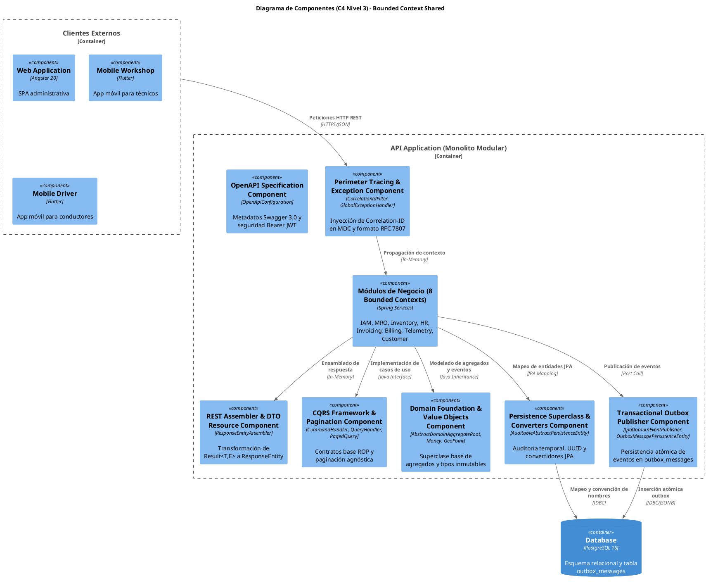
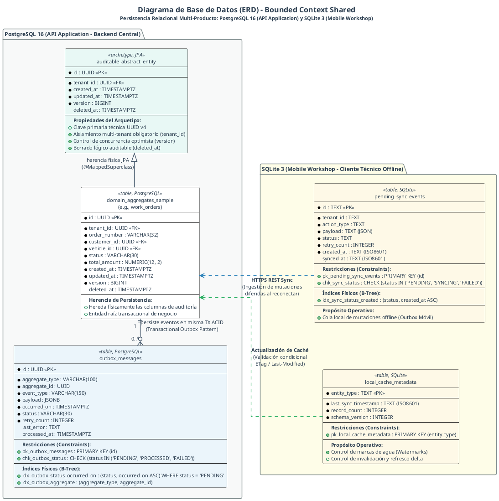

## 3. Fase 0: Bounded Context Shared Canónico (`com.andeva.atelier.platform.shared`)

### 3.1 Domain Layer

El **Domain Layer** del Bounded Context Shared (`com.andeva.atelier.platform.shared.domain`) suministra las abstracciones arquitectónicas fundamentales, los contratos inmutables de eventos y el catálogo transversal de Value Objects y Excepciones compartidas por los 8 Bounded Contexts de Atelier Platform.

Su diseño responde a cuatro principios esenciales de Domain-Driven Design táctico:
1. **Aislamiento Total de Frameworks de Persistencia:** Las clases de dominio jamás importan dependencias de JPA (`jakarta.persistence.*`), Hibernate o Spring ORM. Únicamente se hereda de `AbstractAggregateRoot` de Spring Data Commons para habilitar el registro desacoplado de eventos de dominio en memoria.
2. **Inmutabilidad y Constructores Compactos:** Todos los Value Objects se estructuran como Java Records inmutables con validación de frontera en constructores compactos, garantizando que ninguna entidad u objeto de valor nazca en un estado inconsistente o corrompido.
3. **Seguridad de Tipos (*Type Safety*) en Identificadores:** Erradicación del antipatrón *Primitive Obsession* mediante envoltorios tipados sobre `UUID` (`TenantId`, `BranchId`, `CustomerId`, `VehicleId`, `UserId`), impidiendo que métodos intercambien accidentalmente claves foráneas de distinto significado semántico.
4. **Precisión Matemática y Financiera:** Modelado estricto de importes monetarios (`Money`), cubicajes/cantidades (`Quantity`) y coordenadas satelitales (`GeoPoint` con fórmula de Haversine), utilizando `BigDecimal` con redondeo bancario legal (*Half-Even*) a dos decimales.

---

#### 3.1.1. Diccionario de Clases de la Capa de Dominio (Bounded Context Shared)

| Clase o Tipo | Categoría Táctica | Propósito en el Dominio | Atributos Principales | Métodos Clave | Relaciones |
| :--- | :--- | :--- | :--- | :--- | :--- |
| `AbstractDomainAggregateRoot<T>` | Aggregate Base | Superclase abstracta base para todas las Raíces de Agregado; gestiona el ciclo de eventos en memoria. | Colección interna de eventos de dominio (`domainEvents`). | `registerDomainEvent`, `domainEvents`, `clearDomainEvents`. | Heredan todas las Raíces de Agregado de la solución. |
| `DomainEvent` | Domain Event Interface | Contrato inmutable base para la publicación y auditoría de eventos de dominio. | `eventId`, `occurredOn`, `aggregateId`, `eventType`. | Getters de contrato inmutable. | Implementado por todos los eventos de dominio de la plataforma. |
| `Currency` | Enum de Dominio | Catálogo de monedas formales aceptadas en la operativa del taller y del SaaS. | `description`, `symbol`. | `description()`, `symbol()`. | Utilizado por el Value Object `Money`. |
| `Money` | Value Object | Magnitud financiera inmutable con escala a 2 decimales y redondeo bancario *Half-Even*. | `amount: BigDecimal`, `currency: Currency`. | `add`, `subtract`, `multiply`, `divide`, `isGreaterThan`, `isPositive`. | Asociado a precios, costos, transacciones y facturación. |
| `MeasurementUnit` | Enum de Dominio | Unidades de medida de stock e insumos de mantenimiento. | `description`. | `description()`. | Utilizado por `Quantity`. |
| `Quantity` | Value Object | Cantidad física no negativa vinculada a su unidad de medida. | `value: BigDecimal`, `unit: MeasurementUnit`. | `add`, `subtract`, `hasSufficient`. | Utilizado en inventario, repuestos y partidas de MRO. |
| `Mileage` | Value Object | Kilometraje automotriz entero no negativo. | `value: int`. | `isGreaterThan`, `difference`. | Asociado a vehículos, recepciones y telemetría. |
| `TenantId` | Value Object (ID) | Identificador universal único fuertemente tipado del taller mecánico. | `value: UUID`. | `of`, `generate`. | Clave de particionamiento multitenant transversal. |
| `BranchId` | Value Object (ID) | Identificador universal único de la sucursal física de atención. | `value: UUID`. | `of`, `generate`. | Vinculado a bahías, inventario, series y turnos. |
| `CustomerId` | Value Object (ID) | Identificador universal único del cliente particular o corporativo. | `value: UUID`. | `of`, `generate`. | Vinculado a vehículos, citas y comprobantes. |
| `VehicleId` | Value Object (ID) | Identificador universal único del vehículo automotriz. | `value: UUID`. | `of`, `generate`. | Vinculado a órdenes de trabajo, citas y telemetría. |
| `UserId` | Value Object (ID) | Identificador universal único de la cuenta de usuario. | `value: UUID`. | `of`, `generate`. | Vinculado a membresías laborales y perfiles. |
| `DistanceMeters` | Value Object | Magnitud escalar de separación espacial en metros ($\ge 0.0$). | `value: double`. | `isWithinThreshold`. | Utilizado en validación de geocercas satelitales. |
| `GeoPoint` | Value Object | Coordenada satelital WGS84 con cálculo ortodrómico de Haversine. | `latitude: double`, `longitude: double`. | `distanceTo(GeoPoint)`. | Utilizado en geolocalización de sedes y asistencias. |
| `TaxIdType` | Enum de Dominio | Tipología de documento de identidad tributaria nacional. | `description`, `maxLength`. | `description()`, `maxLength()`. | Utilizado por `TaxId`. |
| `TaxId` | Value Object | Documento fiscal validado algorítmicamente (RUC módulo 11 y DNI). | `value: String`, `type: TaxIdType`. | `ruc`, `dni`, verificación módulo 11. | Utilizado en talleres, clientes y comprobantes SUNAT. |
| `EmailAddress` | Value Object | Dirección de correo electrónico validada bajo norma RFC 5322. | `value: String`. | `of`. | Utilizado en cuentas, invitaciones y notificaciones. |
| `PhoneNumber` | Value Object | Número telefónico internacional formateado según estándar E.164. | `value: String`. | `of`. | Utilizado en contactos de clientes y talleres. |
| `DateRange` | Value Object | Intervalo temporal delimitado por fechas de inicio y fin válidas. | `startDate: LocalDate`, `endDate: LocalDate`. | `contains`, `overlaps`. | Utilizado en turnos, contratos, períodos y reportes. |
| `DomainException` | Excepción Base | Superclase abstracta de errores semánticos y de reglas de negocio. | `errorCode: String`. | `errorCode()`. | Base para todas las excepciones de dominio. |

---

#### 3.1.2. Superclase Base de Agregados y Eventos de Dominio

##### 1. `AbstractDomainAggregateRoot<T>`

```java
package com.andeva.atelier.platform.shared.domain.model.aggregates;

import org.springframework.data.domain.AbstractAggregateRoot;

import java.util.Collection;
import java.util.Collections;
import java.util.Objects;

/**
 * Superclase abstracta para todas las Raíces de Agregado en Atelier Platform.
 * Extiende Spring Data Commons AbstractAggregateRoot únicamente para acumular
 * eventos de dominio en memoria sin acoplamiento con la capa de infraestructura JPA.
 *
 * @param <T> Tipo concreto del Agregado
 */
public abstract class AbstractDomainAggregateRoot<T extends AbstractDomainAggregateRoot<T>>
        extends AbstractAggregateRoot<T> {

    /**
     * Encola un evento de dominio inmutable para su posterior despacho.
     *
     * @param event Instancia del evento ocurrido
     */
    protected void registerDomainEvent(Object event) {
        Objects.requireNonNull(event, "El evento de dominio a registrar no puede ser nulo");
        super.registerEvent(event);
    }

    /**
     * Retorna una vista inmutable de la colección de eventos de dominio acumulados.
     *
     * @return Colección de eventos de dominio no modificable
     */
    @Override
    public Collection<Object> domainEvents() {
        return Collections.unmodifiableCollection(super.domainEvents());
    }

    /**
     * Limpia la cola de eventos de dominio una vez que han sido persistidos
     * o publicados hacia el Transactional Outbox.
     */
    @Override
    public void clearDomainEvents() {
        super.clearDomainEvents();
    }
}
```

##### 2. `DomainEvent` (Contrato Base Inmutable)

```java
package com.andeva.atelier.platform.shared.domain.events;

import java.time.Instant;
import java.util.UUID;

/**
 * Contrato inmutable que identifica formalmente a todo evento de dominio en Atelier Platform.
 * Garantiza los metadatos necesarios para auditoría, mensajería y persistencia Outbox.
 */
public interface DomainEvent {
    /**
     * Identificador unívoco del evento para deduplicación e idempotencia.
     */
    UUID eventId();

    /**
     * Marca de tiempo UTC exacta en la que se generó el suceso en el dominio.
     */
    Instant occurredOn();

    /**
     * Identificador de la Raíz de Agregado que originó el cambio de estado.
     */
    String aggregateId();

    /**
     * Nombre cualificado o canónico del tipo de evento emitido.
     */
    String eventType();
}
```

---

#### 3.1.3. Value Objects Financieros, Cuantitativos y Métricos

##### 1. `Currency` y `Money`

```java
package com.andeva.atelier.platform.shared.domain.model.valueobjects;

public enum Currency {
    PEN("Soles", "S/."),
    USD("Dólares Americanos", "$");

    private final String description;
    private final String symbol;

    Currency(String description, String symbol) {
        this.description = description;
        this.symbol = symbol;
    }

    public String description() { return description; }
    public String symbol() { return symbol; }
}
```

```java
package com.andeva.atelier.platform.shared.domain.model.valueobjects;

import com.andeva.atelier.platform.shared.domain.exceptions.CurrencyMismatchException;

import java.math.BigDecimal;
import java.math.RoundingMode;
import java.util.Objects;

/**
 * Objeto de valor financiero inmutable que representa magnitudes monetarias con
 * precisión exacta a dos decimales bajo redondeo bancario Half-Even.
 */
public record Money(BigDecimal amount, Currency currency) {

    public static final Money ZERO_PEN = new Money(BigDecimal.ZERO.setScale(2, RoundingMode.HALF_EVEN), Currency.PEN);
    public static final Money ZERO_USD = new Money(BigDecimal.ZERO.setScale(2, RoundingMode.HALF_EVEN), Currency.USD);

    public Money {
        Objects.requireNonNull(amount, "El monto monetario no puede ser nulo");
        Objects.requireNonNull(currency, "La divisa no puede ser nula");
        amount = amount.setScale(2, RoundingMode.HALF_EVEN);
    }

    public static Money of(BigDecimal amount, Currency currency) {
        return new Money(amount, currency);
    }

    public static Money of(double amount, Currency currency) {
        return new Money(BigDecimal.valueOf(amount), currency);
    }

    public static Money soles(BigDecimal amount) {
        return new Money(amount, Currency.PEN);
    }

    public static Money soles(double amount) {
        return new Money(BigDecimal.valueOf(amount), Currency.PEN);
    }

    public static Money dollars(BigDecimal amount) {
        return new Money(amount, Currency.USD);
    }

    public static Money dollars(double amount) {
        return new Money(BigDecimal.valueOf(amount), Currency.USD);
    }

    public Money add(Money other) {
        validateSameCurrency(other);
        return new Money(this.amount.add(other.amount), this.currency);
    }

    public Money subtract(Money other) {
        validateSameCurrency(other);
        return new Money(this.amount.subtract(other.amount), this.currency);
    }

    public Money multiply(BigDecimal factor) {
        Objects.requireNonNull(factor, "El factor multiplicador no puede ser nulo");
        return new Money(this.amount.multiply(factor), this.currency);
    }

    public Money multiply(double factor) {
        return multiply(BigDecimal.valueOf(factor));
    }

    public Money divide(BigDecimal divisor) {
        Objects.requireNonNull(divisor, "El divisor no puede ser nulo");
        if (divisor.compareTo(BigDecimal.ZERO) == 0) {
            throw new ArithmeticException("No se puede dividir una magnitud monetaria entre cero");
        }
        return new Money(this.amount.divide(divisor, 2, RoundingMode.HALF_EVEN), this.currency);
    }

    public boolean isGreaterThan(Money other) {
        validateSameCurrency(other);
        return this.amount.compareTo(other.amount) > 0;
    }

    public boolean isLessThan(Money other) {
        validateSameCurrency(other);
        return this.amount.compareTo(other.amount) < 0;
    }

    public boolean isPositive() {
        return this.amount.compareTo(BigDecimal.ZERO) > 0;
    }

    public boolean isZero() {
        return this.amount.compareTo(BigDecimal.ZERO) == 0;
    }

    private void validateSameCurrency(Money other) {
        Objects.requireNonNull(other, "El importe monetario a comparar no puede ser nulo");
        if (this.currency != other.currency) {
            throw new CurrencyMismatchException(this.currency.name(), other.currency.name());
        }
    }

    @Override
    public String toString() {
        return String.format("%s %s", currency.symbol(), amount.toPlainString());
    }
}
```

##### 2. `MeasurementUnit` y `Quantity`

```java
package com.andeva.atelier.platform.shared.domain.model.valueobjects;

public enum MeasurementUnit {
    UNIT("Unidad entera"),
    LITER("Litro de fluido"),
    GALLON("Galón de combustible/fluido"),
    KILOGRAM("Kilogramo"),
    METER("Metro lineal"),
    HOUR("Hora técnica de mano de obra");

    private final String description;

    MeasurementUnit(String description) {
        this.description = description;
    }

    public String description() { return description; }
}
```

```java
package com.andeva.atelier.platform.shared.domain.model.valueobjects;

import java.math.BigDecimal;
import java.math.RoundingMode;
import java.util.Objects;

/**
 * Objeto de valor que representa cantidades físicas para ítems de inventario
 * o unidades de tiempo de mano de obra.
 */
public record Quantity(BigDecimal value, MeasurementUnit unit) {

    public Quantity {
        Objects.requireNonNull(value, "El valor cuantitativo no puede ser nulo");
        Objects.requireNonNull(unit, "La unidad de medida no puede ser nula");
        if (value.compareTo(BigDecimal.ZERO) < 0) {
            throw new IllegalArgumentException("La cantidad no puede ser negativa: " + value);
        }
        value = value.setScale(2, RoundingMode.HALF_EVEN);
    }

    public static Quantity of(BigDecimal value, MeasurementUnit unit) {
        return new Quantity(value, unit);
    }

    public static Quantity of(double value, MeasurementUnit unit) {
        return new Quantity(BigDecimal.valueOf(value), unit);
    }

    public static Quantity ofUnits(int count) {
        return new Quantity(BigDecimal.valueOf(count), MeasurementUnit.UNIT);
    }

    public Quantity add(Quantity other) {
        validateSameUnit(other);
        return new Quantity(this.value.add(other.value), this.unit);
    }

    public Quantity subtract(Quantity other) {
        validateSameUnit(other);
        if (this.value.compareTo(other.value) < 0) {
            throw new IllegalArgumentException(String.format(
                    "Existencias insuficientes para deducir: actual %.2f, requerido %.2f",
                    this.value.doubleValue(), other.value.doubleValue()));
        }
        return new Quantity(this.value.subtract(other.value), this.unit);
    }

    public boolean hasSufficient(Quantity required) {
        validateSameUnit(required);
        return this.value.compareTo(required.value) >= 0;
    }

    private void validateSameUnit(Quantity other) {
        Objects.requireNonNull(other, "La cantidad de comparación no puede ser nula");
        if (this.unit != other.unit) {
            throw new IllegalArgumentException(String.format(
                    "Discrepancia de unidades de medida: %s vs %s", this.unit, other.unit));
        }
    }
}
```

##### 3. `Mileage`

```java
package com.andeva.atelier.platform.shared.domain.model.valueobjects;

/**
 * Representa el kilometraje automotriz recorrido por un vehículo.
 */
public record Mileage(int value) {

    public Mileage {
        if (value < 0) {
            throw new IllegalArgumentException("El kilometraje automotriz no puede ser negativo: " + value);
        }
    }

    public static Mileage of(int km) {
        return new Mileage(km);
    }

    public boolean isGreaterThan(Mileage other) {
        return this.value > other.value;
    }

    public int difference(Mileage other) {
        return Math.abs(this.value - other.value);
    }

    @Override
    public String toString() {
        return value + " km";
    }
}
```

---

#### 3.1.4. Taxonomía de Identificadores Fuertemente Tipados (Strongly Typed IDs)

Para erradicar el antipatrón de *Primitive Obsession* y prevenir que identificadores de diferente semántica sean intercambiados por error en invocaciones de métodos, se definen envoltorios inmutables sobre `UUID`:

```java
package com.andeva.atelier.platform.shared.domain.model.valueobjects;

import java.io.Serializable;
import java.util.Objects;
import java.util.UUID;

/**
 * Identificador universal inmutable del Taller Mecánico (Tenant).
 */
public record TenantId(UUID value) implements Serializable {
    public TenantId {
        Objects.requireNonNull(value, "El identificador de taller no puede ser nulo");
    }
    public static TenantId of(UUID value) { return new TenantId(value); }
    public static TenantId of(String value) { return new TenantId(UUID.fromString(value)); }
    public static TenantId generate() { return new TenantId(UUID.randomUUID()); }
}

/**
 * Identificador universal inmutable de la Sede Física del Taller (Branch).
 */
public record BranchId(UUID value) implements Serializable {
    public BranchId {
        Objects.requireNonNull(value, "El identificador de sucursal no puede ser nulo");
    }
    public static BranchId of(UUID value) { return new BranchId(value); }
    public static BranchId of(String value) { return new BranchId(UUID.fromString(value)); }
    public static BranchId generate() { return new BranchId(UUID.randomUUID()); }
}

/**
 * Identificador universal inmutable del Cliente (Customer).
 */
public record CustomerId(UUID value) implements Serializable {
    public CustomerId {
        Objects.requireNonNull(value, "El identificador de cliente no puede ser nulo");
    }
    public static CustomerId of(UUID value) { return new CustomerId(value); }
    public static CustomerId of(String value) { return new CustomerId(UUID.fromString(value)); }
    public static CustomerId generate() { return new CustomerId(UUID.randomUUID()); }
}

/**
 * Identificador universal inmutable del Vehículo Automotriz (Vehicle).
 */
public record VehicleId(UUID value) implements Serializable {
    public VehicleId {
        Objects.requireNonNull(value, "El identificador de vehículo no puede ser nulo");
    }
    public static VehicleId of(UUID value) { return new VehicleId(value); }
    public static VehicleId of(String value) { return new VehicleId(UUID.fromString(value)); }
    public static VehicleId generate() { return new VehicleId(UUID.randomUUID()); }
}

/**
 * Identificador universal inmutable de la Cuenta de Usuario (User).
 */
public record UserId(UUID value) implements Serializable {
    public UserId {
        Objects.requireNonNull(value, "El identificador de usuario no puede ser nulo");
    }
    public static UserId of(UUID value) { return new UserId(value); }
    public static UserId of(String value) { return new UserId(UUID.fromString(value)); }
    public static UserId generate() { return new UserId(UUID.randomUUID()); }
}
```

---

#### 3.1.5. Value Objects Geoespaciales, Fiscales y de Contacto

##### 1. `GeoPoint` y `DistanceMeters` (Formulación de Haversine)

```java
package com.andeva.atelier.platform.shared.domain.model.valueobjects;

/**
 * Magnitud de separación física en metros, empleada en la validación de geocercas.
 */
public record DistanceMeters(double value) {
    public DistanceMeters {
        if (value < 0.0) {
            throw new IllegalArgumentException("La distancia en metros no puede ser negativa: " + value);
        }
    }
    public static DistanceMeters of(double meters) { return new DistanceMeters(meters); }
    public boolean isWithinThreshold(double thresholdMeters) { return this.value <= thresholdMeters; }
}
```

```java
package com.andeva.atelier.platform.shared.domain.model.valueobjects;

import java.util.Objects;

/**
 * Coordenada geográfica expresada en el elipsoide WGS84.
 * Incorpora el cálculo trigonométrico esférico mediante la fórmula de Haversine.
 */
public record GeoPoint(double latitude, double longitude) {

    private static final double EARTH_RADIUS_METERS = 6371000.0;

    public GeoPoint {
        if (latitude < -90.0 || latitude > 90.0) {
            throw new IllegalArgumentException("Latitud fuera de rango WGS84 [-90.0, 90.0]: " + latitude);
        }
        if (longitude < -180.0 || longitude > 180.0) {
            throw new IllegalArgumentException("Longitud fuera de rango WGS84 [-180.0, 180.0]: " + longitude);
        }
    }

    public static GeoPoint of(double lat, double lon) {
        return new GeoPoint(lat, lon);
    }

    /**
     * Calcula la distancia ortodrómica esférica entre dos puntos geográficos mediante la fórmula de Haversine:
     * d = 2 * R * arcsin(sqrt(sin^2(delta_lat / 2) + cos(lat1) * cos(lat2) * sin^2(delta_lon / 2)))
     *
     * @param other Coordenada satelital de destino
     * @return Separación en metros representada por DistanceMeters
     */
    public DistanceMeters distanceTo(GeoPoint other) {
        Objects.requireNonNull(other, "El punto geográfico de destino no puede ser nulo");

        double phi1 = Math.toRadians(this.latitude);
        double phi2 = Math.toRadians(other.latitude);
        double deltaPhi = Math.toRadians(other.latitude - this.latitude);
        double deltaLambda = Math.toRadians(other.longitude - this.longitude);

        double a = Math.sin(deltaPhi / 2.0) * Math.sin(deltaPhi / 2.0)
                + Math.cos(phi1) * Math.cos(phi2)
                * Math.sin(deltaLambda / 2.0) * Math.sin(deltaLambda / 2.0);

        double c = 2.0 * Math.atan2(Math.sqrt(a), Math.sqrt(1.0 - a));
        return DistanceMeters.of(EARTH_RADIUS_METERS * c);
    }
}
```

##### 2. `TaxIdType` y `TaxId` (Validación Módulo 11 de SUNAT)

```java
package com.andeva.atelier.platform.shared.domain.model.valueobjects;

public enum TaxIdType {
    RUC("Registro Único de Contribuyentes", 11),
    DNI("Documento Nacional de Identidad", 8),
    CE("Carné de Extranjería", 12),
    PASSPORT("Pasaporte Internacional", 12);

    private final String description;
    private final int expectedLength;

    TaxIdType(String description, int expectedLength) {
        this.description = description;
        this.expectedLength = expectedLength;
    }

    public String description() { return description; }
    public int expectedLength() { return expectedLength; }
}
```

```java
package com.andeva.atelier.platform.shared.domain.model.valueobjects;

import com.andeva.atelier.platform.shared.domain.exceptions.BusinessRuleValidationException;

import java.util.Objects;
import java.util.regex.Pattern;

/**
 * Representa el identificador tributario nacional legalmente validado.
 * Implementa el algoritmo de comprobación del dígito verificador ponderado (módulo 11) para RUCs peruanos.
 */
public record TaxId(String value, TaxIdType type) {

    private static final Pattern DNI_PATTERN = Pattern.compile("^\d{8}$");
    private static final Pattern RUC_PATTERN = Pattern.compile("^(10|15|17|20)\d{9}$");
    private static final int[] RUC_WEIGHTS = {5, 4, 3, 2, 7, 6, 5, 4, 3, 2};

    public TaxId {
        Objects.requireNonNull(value, "El valor del documento tributario no puede ser nulo");
        Objects.requireNonNull(type, "El tipo de documento tributario no puede ser nulo");
        value = value.trim();

        if (type == TaxIdType.DNI) {
            if (!DNI_PATTERN.matcher(value).matches()) {
                throw new BusinessRuleValidationException(
                        "INVALID_DNI_FORMAT", "El DNI debe poseer exactamente 8 dígitos numéricos: " + value);
            }
        } else if (type == TaxIdType.RUC) {
            if (!RUC_PATTERN.matcher(value).matches()) {
                throw new BusinessRuleValidationException(
                        "INVALID_RUC_FORMAT", "El RUC debe tener 11 dígitos e iniciar con 10, 15, 17 o 20: " + value);
            }
            if (!isValidRucChecksum(value)) {
                throw new BusinessRuleValidationException(
                        "INVALID_RUC_CHECKSUM", "El dígito verificador del RUC no es matemáticamente válido: " + value);
            }
        }
    }

    public static TaxId ruc(String ruc) { return new TaxId(ruc, TaxIdType.RUC); }
    public static TaxId dni(String dni) { return new TaxId(dni, TaxIdType.DNI); }

    /**
     * Valida el dígito verificador oficial de SUNAT bajo el algoritmo Módulo 11.
     */
    private static boolean isValidRucChecksum(String ruc) {
        int sum = 0;
        for (int i = 0; i < 10; i++) {
            sum += Character.getNumericValue(ruc.charAt(i)) * RUC_WEIGHTS[i];
        }
        int remainder = sum % 11;
        int checkDigit = 11 - remainder;
        if (checkDigit == 10) checkDigit = 0;
        else if (checkDigit == 11) checkDigit = 1;

        return checkDigit == Character.getNumericValue(ruc.charAt(10));
    }
}
```

##### 3. `EmailAddress`, `PhoneNumber` y `DateRange`

```java
package com.andeva.atelier.platform.shared.domain.model.valueobjects;

import com.andeva.atelier.platform.shared.domain.exceptions.BusinessRuleValidationException;

import java.time.LocalDate;
import java.util.Objects;
import java.util.regex.Pattern;

public record EmailAddress(String value) {
    private static final Pattern EMAIL_PATTERN = Pattern.compile("^[a-zA-Z0-9._%+-]+@[a-zA-Z0-9.-]+\.[a-zA-Z]{2,}$");

    public EmailAddress {
        Objects.requireNonNull(value, "El correo electrónico no puede ser nulo");
        value = value.trim().toLowerCase();
        if (!EMAIL_PATTERN.matcher(value).matches()) {
            throw new BusinessRuleValidationException("INVALID_EMAIL_FORMAT", "Dirección de correo electrónico inválida: " + value);
        }
    }
    public static EmailAddress of(String email) { return new EmailAddress(email); }
}

public record PhoneNumber(String value) {
    private static final Pattern PHONE_PATTERN = Pattern.compile("^\+?[0-9]{8,15}$");

    public PhoneNumber {
        Objects.requireNonNull(value, "El número telefónico no puede ser nulo");
        value = value.trim().replaceAll("\s+", "");
        if (!PHONE_PATTERN.matcher(value).matches()) {
            throw new BusinessRuleValidationException("INVALID_PHONE_FORMAT", "Número telefónico fuera de norma E.164: " + value);
        }
    }
    public static PhoneNumber of(String phone) { return new PhoneNumber(phone); }
}

public record DateRange(LocalDate startDate, LocalDate endDate) {
    public DateRange {
        Objects.requireNonNull(startDate, "La fecha inicial no puede ser nula");
        Objects.requireNonNull(endDate, "La fecha final no puede ser nula");
        if (endDate.isBefore(startDate)) {
            throw new BusinessRuleValidationException("INVALID_DATE_RANGE", "La fecha de culminación no puede ser anterior al inicio");
        }
    }
    public static DateRange of(LocalDate start, LocalDate end) { return new DateRange(start, end); }
    public boolean contains(LocalDate date) {
        return !date.isBefore(startDate) && !date.isAfter(endDate);
    }
    public boolean overlaps(DateRange other) {
        return !this.endDate.isBefore(other.startDate) && !this.startDate.isAfter(other.endDate);
    }
}
```

---

#### 3.1.6. Jerarquía de Excepciones de Dominio

```java
package com.andeva.atelier.platform.shared.domain.exceptions;

/**
 * Superclase abstracta de tiempo de ejecución para todas las excepciones del dominio.
 */
public abstract class DomainException extends RuntimeException {
    private final String errorCode;

    protected DomainException(String errorCode, String message) {
        super(message);
        this.errorCode = errorCode;
    }

    public String errorCode() { return errorCode; }
}

/**
 * Lanzada ante la transgresión de una invariante de negocio en el dominio.
 */
public class BusinessRuleValidationException extends DomainException {
    public BusinessRuleValidationException(String errorCode, String message) {
        super(errorCode, message);
    }
}

/**
 * Lanzada cuando se intenta referenciar o mutar una entidad que no existe en el catálogo.
 */
public class EntityNotFoundException extends DomainException {
    public EntityNotFoundException(String entityName, Object id) {
        super("ENTITY_NOT_FOUND", String.format("No se encontró la entidad %s con identificador %s", entityName, id));
    }
}

/**
 * Lanzada al intentar operar aritméticamente magnitudes monetarias en distintas divisas.
 */
public class CurrencyMismatchException extends DomainException {
    public CurrencyMismatchException(String sourceCurrency, String targetCurrency) {
        super("CURRENCY_MISMATCH", String.format("Incompatibilidad de divisas: no se puede operar %s con %s", sourceCurrency, targetCurrency));
    }
}
```

---

### 3.2 Application Layer

La **Application Layer** del Bounded Context Shared (`com.andeva.atelier.platform.shared.application`) orquesta los flujos de casos de uso y procesos de negocio de Atelier Platform de forma puramente agnóstica a tecnologías de entrega (controladores web) o de almacenamiento físico (bases de datos relacionales o NoSQL).

Su concepción arquitectónica responde a cuatro principios esenciales de Clean Architecture y Domain-Driven Design táctico:
1. **Programación Orientada a Vías (*Railway-Oriented Programming*):** Erradicación del uso de excepciones como mecanismo de control de flujo para fallas de negocio previsibles (recursos no encontrados, duplicados, validaciones insatisfechas). Toda operación susceptible de error retorna la mónada sellada `Result<T, E>`, imponiendo al compilador de Java 26 la verificación exhaustiva de los caminos de éxito (`Success`) y fallo (`Failure`).
2. **Taxonomía Semántica de Errores de Aplicación:** El registro `ApplicationError` estructura de forma uniforme el código alfanumérico, mensaje descriptivo y detalles granulares de cada fallo, permitiendo que la Capa de Interfaz traduzca estos errores directamente a respuestas HTTP estándar (RFC 7807) sin acoplar la aplicación a la web.
3. **Estandarización de Contratos CQRS:** Definición de interfaces genéricas puras para manejadores de comandos (`CommandHandler<C, R>`, `VoidCommandHandler<C>`), manejadores de consultas (`QueryHandler<Q, R>`) y suscriptores de eventos en memoria (`DomainEventHandler<E>`), desacoplando la definición de casos de uso de frameworks mediadores de terceros.
4. **Paginación Desacoplada y Publicación de Eventos:** Estructuración de modelos de consulta paginada (`PagedQuery`, `PagedResult<T>`) independientes de Spring Data `Pageable`, y definición del puerto `DomainEventPublisher` que canaliza los eventos acumulados por las raíces de agregado hacia el worker asíncrono del Transactional Outbox.

---

#### 3.2.1. Diccionario de Clases de la Capa de Aplicación (Bounded Context Shared)

| Clase o Tipo | Categoría Táctica | Paquete Canónico | Propósito en la Capa | Atributos Principales | Métodos Clave | Relaciones |
| :--- | :--- | :--- | :--- | :--- | :--- | :--- |
| `Result<T, E>` | Mónada Funcional | `...shared.application.result` | Interfaz sellada que modela el resultado determinista de operaciones de negocio. | `value: T` (en Success), `error: E` (en Failure). | `success`, `failure`, `map`, `flatMap`, `mapError`, `onSuccess`, `onFailure`, `orElseThrow`. | Retorno estándar de todos los Command y Query Handlers. |
| `ApplicationError` | Registro de Error | `...shared.application.result` | Estructura inmutable que transporta código, mensaje y detalles de validación. | `code`, `message`, `details`. | Factorías semánticas (`notFound`, `conflict`, `badRequest`, etc.). | Encapsulado como error en `Result.Failure`. |
| `CommandHandler<C, R>` | Contrato CQRS | `...shared.application.handlers` | Interfaz funcional para manejadores de comandos transaccionales con retorno. | Ninguno (contrato). | `handle(C command): Result<R, ApplicationError>`. | Implementado por casos de uso mutacionales en todos los contextos. |
| `VoidCommandHandler<C>` | Contrato CQRS | `...shared.application.handlers` | Interfaz funcional para manejadores de comandos sin carga útil de respuesta. | Ninguno (contrato). | `handle(C command): Result<Void, ApplicationError>`. | Implementado por casos de uso de acción simple (ej. borrado lógico). |
| `QueryHandler<Q, R>` | Contrato CQRS | `...shared.application.handlers` | Interfaz funcional para manejadores de consultas de lectura de datos. | Ninguno (contrato). | `handle(Q query): Result<R, ApplicationError>`. | Implementado por casos de uso de consulta en todos los contextos. |
| `DomainEventHandler<E>` | Manejador de Eventos | `...shared.application.handlers` | Interfaz funcional para consumidores en memoria de eventos de dominio emitidos. | Ninguno (contrato). | `handle(E event): void`. | Suscrito a eventos generados por agregados tras el commit. |
| `SortDirection` | Enumeración | `...shared.application.pagination` | Sentido de ordenamiento en consultas de lectura (`ASC`, `DESC`). | Ninguno. | Constantes `ASC` y `DESC`. | Utilizado por `PagedQuery`. |
| `PagedQuery` | Modelo de Consulta | `...shared.application.pagination` | Solicitud inmutable de paginación agnóstica de frameworks ORM. | `page`, `size`, `sortBy`, `sortDirection`. | Constructor compacto con valores por defecto y validación. | Objeto base para consultas paginadas en la aplicación. |
| `PagedResult<T>` | Contenedor de Datos | `...shared.application.pagination` | Contenedor inmutable de colecciones paginadas con metadatos. | `content`, `page`, `size`, `totalElements`, `totalPages`. | `of`, `map(mapper)`. | Producido por Query Handlers y consumido por la Capa de Interfaz. |
| `DomainEventPublisher` | Puerto de Aplicación | `...shared.application.events` | Contrato para la emisión y propagación de eventos hacia el Transactional Outbox. | Ninguno (contrato). | `publish(DomainEvent)`, `publishAll(Collection<Object>)`. | Invocado por repositorios y servicios de aplicación. |

---

#### 3.2.2. Mónada Funcional de Retorno y Registro de Error

##### 1. `Result<T, E>` (Sealed Functional Monad)

```java
package com.andeva.atelier.platform.shared.application.result;

import java.util.Objects;
import java.util.Optional;
import java.util.function.Consumer;
import java.util.function.Function;
import java.util.function.Supplier;

/**
 * Mónada funcional sellada para modelar de manera determinista los dos posibles resultados
 * de una operación de negocio: éxito portando un valor válido (Success), o fallo portando un error (Failure).
 *
 * @param <T> Tipo del valor de éxito
 * @param <E> Tipo del objeto de error
 */
public sealed interface Result<T, E> permits Result.Success, Result.Failure {

    record Success<T, E>(T value) implements Result<T, E> {
        public Success {
            Objects.requireNonNull(value, "El valor de éxito no puede ser nulo");
        }
    }

    record Failure<T, E>(E error) implements Result<T, E> {
        public Failure {
            Objects.requireNonNull(error, "El objeto de error no puede ser nulo");
        }
    }

    // --- Factorías Estáticas ---

    static <T, E> Result<T, E> success(T value) {
        return new Success<>(value);
    }

    static <T, E> Result<T, E> failure(E error) {
        return new Failure<>(error);
    }

    static <T, E> Result<T, E> fromOptional(Optional<T> optional, E errorIfEmpty) {
        Objects.requireNonNull(optional, "El Optional no puede ser nulo");
        return optional.<Result<T, E>>map(Result::success)
                .orElseGet(() -> Result.failure(errorIfEmpty));
    }

    // --- Predicados Lógicos ---

    default boolean isSuccess() {
        return this instanceof Success;
    }

    default boolean isFailure() {
        return this instanceof Failure;
    }

    // --- Conversiones a Optional ---

    default Optional<T> toOptional() {
        if (this instanceof Success<T, E> s) {
            return Optional.of(s.value());
        }
        return Optional.empty();
    }

    default Optional<E> toErrorOptional() {
        if (this instanceof Failure<T, E> f) {
            return Optional.of(f.error());
        }
        return Optional.empty();
    }

    // --- Operaciones Monádicas (Functor y Mónada) ---

    @SuppressWarnings("unchecked")
    default <R> Result<R, E> map(Function<? super T, ? extends R> mapper) {
        Objects.requireNonNull(mapper, "La función de mapeo no puede ser nula");
        if (this instanceof Success<T, E> s) {
            return Result.success(mapper.apply(s.value()));
        }
        return (Result<R, E>) this;
    }

    @SuppressWarnings("unchecked")
    default <R> Result<R, E> flatMap(Function<? super T, Result<R, E>> mapper) {
        Objects.requireNonNull(mapper, "La función flatMap no puede ser nula");
        if (this instanceof Success<T, E> s) {
            return Objects.requireNonNull(mapper.apply(s.value()), "El resultado de flatMap no puede ser nulo");
        }
        return (Result<R, E>) this;
    }

    @SuppressWarnings("unchecked")
    default <F> Result<T, F> mapError(Function<? super E, ? extends F> errorMapper) {
        Objects.requireNonNull(errorMapper, "La función de mapeo de error no puede ser nula");
        if (this instanceof Failure<T, E> f) {
            return Result.failure(errorMapper.apply(f.error()));
        }
        return (Result<T, F>) this;
    }

    // --- Efectos Secundarios Declarativos ---

    default Result<T, E> onSuccess(Consumer<? super T> action) {
        Objects.requireNonNull(action, "La acción onSuccess no puede ser nula");
        if (this instanceof Success<T, E> s) {
            action.accept(s.value());
        }
        return this;
    }

    default Result<T, E> onFailure(Consumer<? super E> action) {
        Objects.requireNonNull(action, "La acción onFailure no puede ser nula");
        if (this instanceof Failure<T, E> f) {
            action.accept(f.error());
        }
        return this;
    }

    // --- Desempaquetado Seguro ---

    default T orElse(T defaultValue) {
        if (this instanceof Success<T, E> s) {
            return s.value();
        }
        return defaultValue;
    }

    default T orElseGet(Supplier<? extends T> supplier) {
        Objects.requireNonNull(supplier, "El Supplier no puede ser nulo");
        if (this instanceof Success<T, E> s) {
            return s.value();
        }
        return supplier.get();
    }

    default <X extends Throwable> T orElseThrow(Function<? super E, X> exceptionSupplier) throws X {
        Objects.requireNonNull(exceptionSupplier, "La función de excepción no puede ser nula");
        if (this instanceof Success<T, E> s) {
            return s.value();
        }
        var failure = (Failure<T, E>) this;
        throw exceptionSupplier.apply(failure.error());
    }
}
```

##### 2. `ApplicationError`

```java
package com.andeva.atelier.platform.shared.application.result;

import java.util.List;
import java.util.Objects;

/**
 * Registro inmutable que transporta la información semántica de una condición anómala o regla insatisfecha.
 * Diseñado para desacoplar el control de excepciones de la capa de aplicación y suministrar metadatos limpios a la capa web.
 *
 * @param code    Código alfanumérico estandarizado del error (ej. NOT_FOUND, CONFLICT, BAD_REQUEST)
 * @param message Mensaje legible amigable para el usuario final o diagnóstico
 * @param details Lista inmutable de detalles específicos de validación a nivel de campo
 */
public record ApplicationError(
        String code,
        String message,
        List<String> details
) {
    public ApplicationError {
        Objects.requireNonNull(code, "El código de error no puede ser nulo");
        Objects.requireNonNull(message, "El mensaje de error no puede ser nulo");
        details = details != null ? List.copyOf(details) : List.of();
    }

    public static ApplicationError notFound(String resource, Object id) {
        return new ApplicationError("NOT_FOUND", String.format("%s con identificador %s no fue encontrado", resource, id), List.of());
    }

    public static ApplicationError notFound(String message) {
        return new ApplicationError("NOT_FOUND", message, List.of());
    }

    public static ApplicationError conflict(String message) {
        return new ApplicationError("CONFLICT", message, List.of());
    }

    public static ApplicationError badRequest(String message) {
        return new ApplicationError("BAD_REQUEST", message, List.of());
    }

    public static ApplicationError badRequest(String message, List<String> details) {
        return new ApplicationError("BAD_REQUEST", message, details);
    }

    public static ApplicationError unauthorized(String message) {
        return new ApplicationError("UNAUTHORIZED", message, List.of());
    }

    public static ApplicationError forbidden(String message) {
        return new ApplicationError("FORBIDDEN", message, List.of());
    }

    public static ApplicationError unprocessableEntity(String message) {
        return new ApplicationError("UNPROCESSABLE_ENTITY", message, List.of());
    }

    public static ApplicationError internalError(String message) {
        return new ApplicationError("INTERNAL_ERROR", message, List.of());
    }
}
```

---

#### 3.2.3. Contratos Base Transversales para CQRS

##### 1. `CommandHandler<C, R>` y `VoidCommandHandler<C>`

```java
package com.andeva.atelier.platform.shared.application.handlers;

import com.andeva.atelier.platform.shared.application.result.ApplicationError;
import com.andeva.atelier.platform.shared.application.result.Result;

/**
 * Contrato funcional base para manejadores de comandos que producen una entidad o identificador de salida.
 *
 * @param <C> Tipo del objeto de comando
 * @param <R> Tipo del resultado de retorno
 */
@FunctionalInterface
public interface CommandHandler<C, R> {
    Result<R, ApplicationError> handle(C command);
}
```

```java
package com.andeva.atelier.platform.shared.application.handlers;

import com.andeva.atelier.platform.shared.application.result.ApplicationError;
import com.andeva.atelier.platform.shared.application.result.Result;

/**
 * Contrato funcional base para manejadores de comandos de mutación que no retornan carga útil sustancial.
 *
 * @param <C> Tipo del objeto de comando
 */
@FunctionalInterface
public interface VoidCommandHandler<C> {
    Result<Void, ApplicationError> handle(C command);
}
```

##### 2. `QueryHandler<Q, R>`

```java
package com.andeva.atelier.platform.shared.application.handlers;

import com.andeva.atelier.platform.shared.application.result.ApplicationError;
import com.andeva.atelier.platform.shared.application.result.Result;

/**
 * Contrato funcional base para manejadores de consultas de lectura de datos e informes.
 *
 * @param <Q> Tipo del objeto de consulta
 * @param <R> Tipo de la proyección de datos resultante
 */
@FunctionalInterface
public interface QueryHandler<Q, R> {
    Result<R, ApplicationError> handle(Q query);
}
```

##### 3. `DomainEventHandler<E extends DomainEvent>`

```java
package com.andeva.atelier.platform.shared.application.handlers;

import com.andeva.atelier.platform.shared.domain.events.DomainEvent;

/**
 * Contrato funcional base para suscriptores en memoria de eventos de dominio emitidos por agregados.
 *
 * @param <E> Tipo del evento de dominio concreto
 */
@FunctionalInterface
public interface DomainEventHandler<E extends DomainEvent> {
    void handle(E event);
}
```

---

#### 3.2.4. Modelos de Paginación de Capa de Aplicación

##### 1. `SortDirection` y `PagedQuery`

```java
package com.andeva.atelier.platform.shared.application.pagination;

/**
 * Sentido de ordenamiento para consultas paginadas en la capa de aplicación.
 */
public enum SortDirection {
    ASC,
    DESC
}
```

```java
package com.andeva.atelier.platform.shared.application.pagination;

import java.util.Objects;

/**
 * Modelo inmutable para peticiones de consulta paginada en la capa de aplicación.
 * Desacoplado totalmente de las clases de frameworks de persistencia (como Pageable de Spring Data).
 *
 * @param page          Índice de página solicitado (base 0)
 * @param size          Tamaño de página o límite de elementos
 * @param sortBy        Campo de ordenamiento
 * @param sortDirection Sentido de ordenación (ASC o DESC)
 */
public record PagedQuery(
        int page,
        int size,
        String sortBy,
        SortDirection sortDirection
) {
    public PagedQuery {
        if (page < 0) {
            throw new IllegalArgumentException("El índice de página no puede ser negativo");
        }
        if (size <= 0) {
            throw new IllegalArgumentException("El tamaño de página debe ser estrictamente positivo");
        }
        sortBy = (sortBy != null && !sortBy.isBlank()) ? sortBy : "id";
        sortDirection = sortDirection != null ? sortDirection : SortDirection.ASC;
    }

    public static PagedQuery of(int page, int size) {
        return new PagedQuery(page, size, "id", SortDirection.ASC);
    }

    public static PagedQuery of(int page, int size, String sortBy, SortDirection direction) {
        return new PagedQuery(page, size, sortBy, direction);
    }
}
```

##### 2. `PagedResult<T>`

```java
package com.andeva.atelier.platform.shared.application.pagination;

import java.util.List;
import java.util.Objects;
import java.util.function.Function;

/**
 * Contenedor inmutable para resultados de consultas paginadas en la capa de aplicación.
 *
 * @param <T>           Tipo del contenido de la página
 * @param content       Lista inmutable de elementos
 * @param page          Índice de página actual (base 0)
 * @param size          Dimensión de página solicitada
 * @param totalElements Cantidad total de registros existentes
 * @param totalPages    Número total de páginas computadas
 */
public record PagedResult<T>(
        List<T> content,
        int page,
        int size,
        long totalElements,
        int totalPages
) {
    public PagedResult {
        Objects.requireNonNull(content, "El contenido de la página no puede ser nulo");
        content = List.copyOf(content);
        if (page < 0) {
            throw new IllegalArgumentException("El índice de página no puede ser negativo");
        }
        if (size <= 0) {
            throw new IllegalArgumentException("El tamaño de página debe ser estrictamente positivo");
        }
        if (totalElements < 0) {
            throw new IllegalArgumentException("El total de elementos no puede ser negativo");
        }
    }

    public static <T> PagedResult<T> of(List<T> content, int page, int size, long totalElements) {
        int calculatedTotalPages = size > 0 ? (int) Math.ceil((double) totalElements / size) : 0;
        return new PagedResult<>(content, page, size, totalElements, calculatedTotalPages);
    }

    /**
     * Aplica una función de transformación funcional sobre cada elemento preservando los metadatos de paginación.
     */
    public <R> PagedResult<R> map(Function<? super T, ? extends R> mapper) {
        Objects.requireNonNull(mapper, "La función de mapeo no puede ser nula");
        List<R> transformed = this.content.stream().map(mapper).toList();
        return new PagedResult<>(transformed, this.page, this.size, this.totalElements, this.totalPages);
    }
}
```

---

#### 3.2.5. Puerto de Publicación de Eventos de Dominio

##### 1. `DomainEventPublisher`

```java
package com.andeva.atelier.platform.shared.application.events;

import com.andeva.atelier.platform.shared.domain.events.DomainEvent;

import java.util.Collection;

/**
 * Puerto de la capa de aplicación para despachar eventos de dominio hacia suscriptores en memoria
 * o hacia la tabla de persistencia del Transactional Outbox para publicación en brokers de mensajería.
 */
public interface DomainEventPublisher {

    /**
     * Publica un evento de dominio individual.
     *
     * @param event Evento de dominio inmutable a despachar
     */
    void publish(DomainEvent event);

    /**
     * Publica una colección de eventos extraídos de la raíz de agregado mediante aggregate.domainEvents().
     *
     * @param events Colección de eventos acumulados en memoria
     */
    void publishAll(Collection<Object> events);
}
```


### 3.3 Infrastructure Layer

La **Infrastructure Layer** del Bounded Context Shared (`com.andeva.atelier.platform.shared.infrastructure`) materializa los adaptadores técnicos y mecanismos de persistencia, conversión de tipos, serialización distribuida y documentación de API que dan soporte transversal a todos los Bounded Contexts de Atelier Platform.

Su diseño arquitectónico obedece a cuatro principios fundamentales de Clean Architecture y resiliencia de sistemas:
1. **Desacoplamiento Estricto de Persistencia:** Los agregados de dominio jamás dependen de anotaciones JPA (`@Entity`, `@Table`) ni de librerías de persistencia. Toda responsabilidad de mapeo relacional se confina a entidades de persistencia dedicadas (`*PersistenceEntity`) que heredan auditoría temporal automática (`createdAt`, `updatedAt`) y clave primaria técnica `UUID` a través de `AuditableAbstractPersistenceEntity`.
2. **Normalización Relacional de Objetos de Valor:** Los Value Objects inmutables del dominio se transforman de forma transparente a tipos nativos y columnas escalares en PostgreSQL 16 (`NUMERIC(12, 2)`, `INTEGER`, `VARCHAR`) mediante convertidores JPA especializados (`@Converter`), garantizando que la base de datos relacional almacene representaciones atómicas sin corromper las invariantes del modelo de objetos.
3. **Estandarización Física del Esquema Relacional:** La convención de nombrado físico `SnakeCaseWithPluralizedTablePhysicalNamingStrategy` transforma automáticamente las identidades de clases PascalCase a tablas en minúsculas, separadas por guiones bajos y pluralizadas en idioma inglés (ej. `TenantPersistenceEntity` $\to$ `tenants`, `WorkOrderPersistenceEntity` $\to$ `work_orders`).
4. **Publicación Confiable y Consistencia Eventual (Transactional Outbox):** La emisión de eventos de dominio hacia brokers de mensajería asíncrona se implementa mediante el patrón Transactional Outbox. El componente `JpaDomainEventPublisher` serializa los eventos a JSON y los inserta atómicamente en la tabla `outbox_messages` de PostgreSQL dentro de la transacción activa, garantizando entrega confiable libre de pérdidas (*at-least-once delivery*) ante eventuales caídas del servidor.

---

#### 3.3.1. Diccionario de Clases de la Capa de Infraestructura (Bounded Context Shared)

| Clase o Tipo | Categoría Táctica | Paquete Canónico | Propósito en la Arquitectura | Atributos Principales | Métodos Clave | Relaciones |
| :--- | :--- | :--- | :--- | :--- | :--- | :--- |
| `AuditableAbstractPersistenceEntity` | Superclase JPA | `...shared.infrastructure.persistence.jpa.entities` | Base abstracta con clave primaria UUID y marcas temporales auditables automáticas. | `id`, `createdAt`, `updatedAt`. | `getId()`, `setId()`, `getCreatedAt()`, `getUpdatedAt()`, `equals()`, `hashCode()`. | Heredada por todas las entidades `*PersistenceEntity` del sistema. |
| `MoneyAttributeConverter` | Convertidor JPA | `...shared.infrastructure.persistence.jpa.converters` | Mapeo bidireccional seguro entre `Money` y `NUMERIC(12, 2)`. | Ninguno. | `convertToDatabaseColumn(Money)`, `convertToEntityAttribute(BigDecimal)`. | Aplica sobre atributos monetarios de entidades de persistencia. |
| `MileageAttributeConverter` | Convertidor JPA | `...shared.infrastructure.persistence.jpa.converters` | Mapeo bidireccional entre `Mileage` y columna `INTEGER`. | Ninguno. | `convertToDatabaseColumn(Mileage)`, `convertToEntityAttribute(Integer)`. | Aplica sobre odómetros en vehículos, recepciones y telemetría. |
| `TaxIdAttributeConverter` | Convertidor JPA | `...shared.infrastructure.persistence.jpa.converters` | Mapeo bidireccional nulo-seguro entre `TaxId` y columna `VARCHAR(11)`. | Ninguno. | `convertToDatabaseColumn(TaxId)`, `convertToEntityAttribute(String)`. | Aplica sobre documentos tributarios (RUC, DNI). |
| `EmailAddressAttributeConverter` | Convertidor JPA | `...shared.infrastructure.persistence.jpa.converters` | Mapeo bidireccional normalizado entre `EmailAddress` y `VARCHAR(254)`. | Ninguno. | `convertToDatabaseColumn(EmailAddress)`, `convertToEntityAttribute(String)`. | Aplica sobre direcciones de correo electrónico. |
| `PhoneNumberAttributeConverter` | Convertidor JPA | `...shared.infrastructure.persistence.jpa.converters` | Mapeo bidireccional entre `PhoneNumber` y columna `VARCHAR(15)`. | Ninguno. | `convertToDatabaseColumn(PhoneNumber)`, `convertToEntityAttribute(String)`. | Aplica sobre números telefónicos en formato E.164. |
| `SnakeCaseWithPluralizedTablePhysicalNamingStrategy` | Estrategia Física | `...shared.infrastructure.persistence.jpa.configuration.strategy` | Regla Hibernate de nombrado de tablas pluralizadas en snake_case. | Ninguno. | `toPhysicalTableName()`, `toPhysicalColumnName()`. | Configurada en el bootstrap del EntityManagerFactory de Spring Boot. |
| `OutboxStatus` | Enumeración | `...shared.infrastructure.outbox.entities` | Ciclo de vida del mensaje outbox (`PENDING`, `PUBLISHED`, `FAILED`). | Constantes enum. | `name()`, `valueOf()`. | Atributo de estado en `OutboxMessagePersistenceEntity`. |
| `OutboxMessagePersistenceEntity` | Entidad JPA | `...shared.infrastructure.outbox.entities` | Entidad ORM mapeada a la tabla transaccional `outbox_messages`. | `id`, `aggregateType`, `aggregateId`, `eventType`, `payload`, `occurredOn`, `status`, `retryCount`, `lastError`, `processedAt`. | Getters, setters, factoría de nuevo evento pendiente. | Persistida en PostgreSQL por `JpaDomainEventPublisher`. |
| `OutboxMessageJpaRepository` | Repositorio Spring Data | `...shared.infrastructure.outbox.repositories` | Acceso a datos y polling de mensajes outbox pendientes. | Ninguno (interfaz). | `findTop50ByStatusOrderByOccurredOnAsc(OutboxStatus)`. | Invocado por el worker asíncrono de reintento y despacho. |
| `JpaDomainEventPublisher` | Adaptador de Salida | `...shared.infrastructure.outbox.publisher` | Implementación del puerto `DomainEventPublisher` con inserción outbox. | `outboxRepository`, `objectMapper`, `applicationEventPublisher`. | `publish(DomainEvent)`, `publishAll(Collection<Object>)`. | Implementa el puerto de aplicación; interactúa con PostgreSQL y Spring. |
| `OpenApiConfiguration` | Configuración | `...shared.infrastructure.documentation.openapi.configuration` | Definición de metadatos globales OpenAPI 3.0 y esquemas de seguridad Bearer JWT. | Ninguno. | `@Bean customOpenAPI()`. | Utilizado por Swagger UI y generadores de contratos cliente. |

---

#### 3.3.2. Superclase Base de Persistencia y Auditoría JPA

##### 1. `AuditableAbstractPersistenceEntity`

```java
package com.andeva.atelier.platform.shared.infrastructure.persistence.jpa.entities;

import jakarta.persistence.Column;
import jakarta.persistence.EntityListeners;
import jakarta.persistence.GeneratedValue;
import jakarta.persistence.GenerationType;
import jakarta.persistence.Id;
import jakarta.persistence.MappedSuperclass;
import lombok.Getter;
import lombok.Setter;
import org.springframework.data.annotation.CreatedDate;
import org.springframework.data.annotation.LastModifiedDate;
import org.springframework.data.jpa.domain.support.AuditingEntityListener;

import java.time.Instant;
import java.util.Objects;
import java.util.UUID;

/**
 * Superclase abstracta de persistencia JPA que dota a todas las entidades relacionales
 * del sistema de un identificador técnico UUID universal y marcas temporales de auditoría
 * automáticas gestionadas mediante Spring Data JPA Auditing.
 *
 * Principio de Aislamiento Arquitectónico:
 * Esta clase pertenece exclusivamente a la Capa de Infraestructura. Los agregados y entidades
 * puras del Dominio NUNCA heredan de ella; únicamente las entidades de persistencia dedicadas
 * (*PersistenceEntity) extienden esta estructura para desacoplar el modelo del ORM.
 */
@Getter
@MappedSuperclass
@EntityListeners(AuditingEntityListener.class)
public abstract class AuditableAbstractPersistenceEntity {

    @Id
    @GeneratedValue(strategy = GenerationType.UUID)
    @Setter
    @Column(name = "id", columnDefinition = "uuid", updatable = false, nullable = false)
    private UUID id;

    @CreatedDate
    @Setter
    @Column(name = "created_at", nullable = false, updatable = false)
    private Instant createdAt;

    @LastModifiedDate
    @Setter
    @Column(name = "updated_at", nullable = false)
    private Instant updatedAt;

    protected AuditableAbstractPersistenceEntity() {
    }

    protected AuditableAbstractPersistenceEntity(UUID id) {
        this.id = id;
    }

    @Override
    public boolean equals(Object o) {
        if (this == o) return true;
        if (o == null || getClass() != o.getClass()) return false;
        AuditableAbstractPersistenceEntity that = (AuditableAbstractPersistenceEntity) o;
        return id != null && Objects.equals(id, that.id);
    }

    @Override
    public int hashCode() {
        return getClass().hashCode();
    }
}
```

---

#### 3.3.3. Convertidores JPA de Atributos para Value Objects

##### 1. `MoneyAttributeConverter`

```java
package com.andeva.atelier.platform.shared.infrastructure.persistence.jpa.converters;

import com.andeva.atelier.platform.shared.domain.model.valueobjects.Currency;
import com.andeva.atelier.platform.shared.domain.model.valueobjects.Money;
import jakarta.persistence.AttributeConverter;
import jakarta.persistence.Converter;

import java.math.BigDecimal;

/**
 * Convertidor JPA para transformar de forma bidireccional y segura el Value Object Money
 * a una columna relacional NUMERIC(12, 2) en PostgreSQL, reconstituyendo la divisa base PEN.
 */
@Converter(autoApply = false)
public class MoneyAttributeConverter implements AttributeConverter<Money, BigDecimal> {

    @Override
    public BigDecimal convertToDatabaseColumn(Money attribute) {
        if (attribute == null) {
            return null;
        }
        return attribute.amount();
    }

    @Override
    public Money convertToEntityAttribute(BigDecimal dbData) {
        if (dbData == null) {
            return null;
        }
        return Money.of(dbData, Currency.PEN);
    }
}
```

##### 2. `MileageAttributeConverter`

```java
package com.andeva.atelier.platform.shared.infrastructure.persistence.jpa.converters;

import com.andeva.atelier.platform.shared.domain.model.valueobjects.Mileage;
import jakarta.persistence.AttributeConverter;
import jakarta.persistence.Converter;

/**
 * Convertidor JPA para transformar bidireccionalmente el Value Object Mileage
 * hacia una columna escalar INTEGER en PostgreSQL.
 */
@Converter(autoApply = false)
public class MileageAttributeConverter implements AttributeConverter<Mileage, Integer> {

    @Override
    public Integer convertToDatabaseColumn(Mileage attribute) {
        if (attribute == null) {
            return null;
        }
        return attribute.value();
    }

    @Override
    public Mileage convertToEntityAttribute(Integer dbData) {
        if (dbData == null) {
            return null;
        }
        return new Mileage(dbData);
    }
}
```

##### 3. `TaxIdAttributeConverter`

```java
package com.andeva.atelier.platform.shared.infrastructure.persistence.jpa.converters;

import com.andeva.atelier.platform.shared.domain.model.valueobjects.TaxId;
import com.andeva.atelier.platform.shared.domain.model.valueobjects.TaxIdType;
import jakarta.persistence.AttributeConverter;
import jakarta.persistence.Converter;

/**
 * Convertidor JPA para transformar bidireccionalmente el Value Object TaxId
 * a una columna VARCHAR(11) en PostgreSQL deduciendo el tipo de documento por longitud.
 */
@Converter(autoApply = false)
public class TaxIdAttributeConverter implements AttributeConverter<TaxId, String> {

    @Override
    public String convertToDatabaseColumn(TaxId attribute) {
        if (attribute == null) {
            return null;
        }
        return attribute.value();
    }

    @Override
    public TaxId convertToEntityAttribute(String dbData) {
        if (dbData == null || dbData.isBlank()) {
            return null;
        }
        TaxIdType type = dbData.trim().length() == 11 ? TaxIdType.RUC : TaxIdType.DNI;
        return new TaxId(type, dbData.trim());
    }
}
```

##### 4. `EmailAddressAttributeConverter`

```java
package com.andeva.atelier.platform.shared.infrastructure.persistence.jpa.converters;

import com.andeva.atelier.platform.shared.domain.model.valueobjects.EmailAddress;
import jakarta.persistence.AttributeConverter;
import jakarta.persistence.Converter;

/**
 * Convertidor JPA para mapear bidireccionalmente el Value Object EmailAddress
 * a una columna VARCHAR(254) normalizada en minúsculas en PostgreSQL.
 */
@Converter(autoApply = false)
public class EmailAddressAttributeConverter implements AttributeConverter<EmailAddress, String> {

    @Override
    public String convertToDatabaseColumn(EmailAddress attribute) {
        if (attribute == null) {
            return null;
        }
        return attribute.value();
    }

    @Override
    public EmailAddress convertToEntityAttribute(String dbData) {
        if (dbData == null || dbData.isBlank()) {
            return null;
        }
        return new EmailAddress(dbData);
    }
}
```

##### 5. `PhoneNumberAttributeConverter`

```java
package com.andeva.atelier.platform.shared.infrastructure.persistence.jpa.converters;

import com.andeva.atelier.platform.shared.domain.model.valueobjects.PhoneNumber;
import jakarta.persistence.AttributeConverter;
import jakarta.persistence.Converter;

/**
 * Convertidor JPA para mapear bidireccionalmente el Value Object PhoneNumber
 * a una columna VARCHAR(15) bajo el estándar E.164 en PostgreSQL.
 */
@Converter(autoApply = false)
public class PhoneNumberAttributeConverter implements AttributeConverter<PhoneNumber, String> {

    @Override
    public String convertToDatabaseColumn(PhoneNumber attribute) {
        if (attribute == null) {
            return null;
        }
        return attribute.value();
    }

    @Override
    public PhoneNumber convertToEntityAttribute(String dbData) {
        if (dbData == null || dbData.isBlank()) {
            return null;
        }
        return new PhoneNumber(dbData);
    }
}
```

---

#### 3.3.4. Estrategia Física de Nombrado de Tablas y Columnas

##### 1. `SnakeCaseWithPluralizedTablePhysicalNamingStrategy`

```java
package com.andeva.atelier.platform.shared.infrastructure.persistence.jpa.configuration.strategy;

import org.hibernate.boot.model.naming.CamelCaseToUnderscoresNamingStrategy;
import org.hibernate.boot.model.naming.Identifier;
import org.hibernate.engine.jdbc.env.spi.JdbcEnvironment;

import java.util.Locale;

/**
 * Estrategia física personalizada de nombrado para Hibernate 6.x.
 * Transforma los nombres de entidades en CamelCase a nombres de tablas en minúsculas,
 * separados por guiones bajos y pluralizados en idioma inglés, removiendo el sufijo 'PersistenceEntity'.
 * Asimismo, transforma nombres de atributos camelCase en nombres de columnas snake_case.
 */
public class SnakeCaseWithPluralizedTablePhysicalNamingStrategy extends CamelCaseToUnderscoresNamingStrategy {

    private static final String PERSISTENCE_ENTITY_SUFFIX = "PersistenceEntity";
    private static final String ENTITY_SUFFIX = "Entity";

    @Override
    public Identifier toPhysicalTableName(Identifier logicalName, JdbcEnvironment jdbcEnvironment) {
        if (logicalName == null) {
            return null;
        }

        String rawText = logicalName.getText();

        // 1. Remover sufijos técnicos de persistencia
        if (rawText.endsWith(PERSISTENCE_ENTITY_SUFFIX)) {
            rawText = rawText.substring(0, rawText.length() - PERSISTENCE_ENTITY_SUFFIX.length());
        } else if (rawText.endsWith(ENTITY_SUFFIX)) {
            rawText = rawText.substring(0, rawText.length() - ENTITY_SUFFIX.length());
        }

        // 2. Aplicar pluralización canónica en inglés
        String pluralized = pluralize(rawText);

        // 3. Delegar transformación a snake_case en minúsculas
        Identifier baseIdentifier = Identifier.toIdentifier(pluralized, logicalName.isQuoted());
        return super.toPhysicalTableName(baseIdentifier, jdbcEnvironment);
    }

    @Override
    public Identifier toPhysicalColumnName(Identifier logicalName, JdbcEnvironment jdbcEnvironment) {
        return super.toPhysicalColumnName(logicalName, jdbcEnvironment);
    }

    /**
     * Aplica reglas sintácticas estándar de pluralización en inglés.
     */
    private String pluralize(String input) {
        if (input == null || input.isBlank()) {
            return input;
        }
        String lower = input.toLowerCase(Locale.ROOT);

        if (lower.endsWith("y") && !lower.endsWith("ay") && !lower.endsWith("ey") && !lower.endsWith("oy") && !lower.endsWith("uy")) {
            return input.substring(0, input.length() - 1) + "ies";
        }
        if (lower.endsWith("s") || lower.endsWith("sh") || lower.endsWith("ch") || lower.endsWith("x") || lower.endsWith("z")) {
            return input + "es";
        }
        return input + "s";
    }
}
```

---

#### 3.3.5. Infraestructura del Patrón Transactional Outbox

##### 1. `OutboxStatus`

```java
package com.andeva.atelier.platform.shared.infrastructure.outbox.entities;

/**
 * Enumeración que tipifica el ciclo de vida transaccional de un mensaje Outbox
 * registrado en la base de datos para entrega asíncrona hacia brokers de eventos.
 */
public enum OutboxStatus {
    PENDING,
    PUBLISHED,
    FAILED
}
```

##### 2. `OutboxMessagePersistenceEntity`

```java
package com.andeva.atelier.platform.shared.infrastructure.outbox.entities;

import jakarta.persistence.Column;
import jakarta.persistence.Entity;
import jakarta.persistence.EnumType;
import jakarta.persistence.Enumerated;
import jakarta.persistence.GeneratedValue;
import jakarta.persistence.GenerationType;
import jakarta.persistence.Id;
import jakarta.persistence.Index;
import jakarta.persistence.Table;
import lombok.Getter;
import lombok.NoArgsConstructor;
import lombok.Setter;

import java.time.Instant;
import java.util.Objects;
import java.util.UUID;

/**
 * Entidad relacional de persistencia JPA mapeada a la tabla outbox_messages.
 * Representa el registro inmutable de un evento de dominio serializado que debe
 * ser propagado de forma confiable hacia el exterior dentro del patrón Transactional Outbox.
 */
@Getter
@Setter
@NoArgsConstructor
@Entity
@Table(
        name = "outbox_messages",
        indexes = {
                @Index(name = "idx_outbox_status_occurred_on", columnList = "status, occurred_on")
        }
)
public class OutboxMessagePersistenceEntity {

    @Id
    @GeneratedValue(strategy = GenerationType.UUID)
    @Column(name = "id", columnDefinition = "uuid", updatable = false, nullable = false)
    private UUID id;

    @Column(name = "aggregate_type", nullable = false, length = 100)
    private String aggregateType;

    @Column(name = "aggregate_id", nullable = false, length = 100)
    private String aggregateId;

    @Column(name = "event_type", nullable = false, length = 150)
    private String eventType;

    @Column(name = "payload", columnDefinition = "jsonb", nullable = false)
    private String payload;

    @Column(name = "occurred_on", nullable = false, updatable = false)
    private Instant occurredOn;

    @Enumerated(EnumType.STRING)
    @Column(name = "status", nullable = false, length = 20)
    private OutboxStatus status;

    @Column(name = "retry_count", nullable = false)
    private int retryCount;

    @Column(name = "last_error", columnDefinition = "text")
    private String lastError;

    @Column(name = "processed_at")
    private Instant processedAt;

    public static OutboxMessagePersistenceEntity pendingOf(
            String aggregateType,
            String aggregateId,
            String eventType,
            String payload,
            Instant occurredOn
    ) {
        OutboxMessagePersistenceEntity entity = new OutboxMessagePersistenceEntity();
        entity.setAggregateType(Objects.requireNonNull(aggregateType));
        entity.setAggregateId(Objects.requireNonNull(aggregateId));
        entity.setEventType(Objects.requireNonNull(eventType));
        entity.setPayload(Objects.requireNonNull(payload));
        entity.setOccurredOn(Objects.requireNonNull(occurredOn));
        entity.setStatus(OutboxStatus.PENDING);
        entity.setRetryCount(0);
        return entity;
    }
}
```

##### 3. `OutboxMessageJpaRepository`

```java
package com.andeva.atelier.platform.shared.infrastructure.outbox.repositories;

import com.andeva.atelier.platform.shared.infrastructure.outbox.entities.OutboxMessagePersistenceEntity;
import com.andeva.atelier.platform.shared.infrastructure.outbox.entities.OutboxStatus;
import org.springframework.data.jpa.repository.JpaRepository;
import org.springframework.stereotype.Repository;

import java.util.List;
import java.util.UUID;

/**
 * Repositorio Spring Data JPA para el acceso y sondeo de mensajes outbox pendientes o fallidos.
 */
@Repository
public interface OutboxMessageJpaRepository extends JpaRepository<OutboxMessagePersistenceEntity, UUID> {

    /**
     * Recupera en orden cronológico los primeros 50 mensajes con el estado especificado.
     * Utilizado por el worker asíncrono para despachar eventos hacia el broker RabbitMQ.
     *
     * @param status Estado de procesamiento (ej. PENDING)
     * @return Lista de mensajes outbox listos para publicación
     */
    List<OutboxMessagePersistenceEntity> findTop50ByStatusOrderByOccurredOnAsc(OutboxStatus status);
}
```

##### 4. `JpaDomainEventPublisher`

```java
package com.andeva.atelier.platform.shared.infrastructure.outbox.publisher;

import com.andeva.atelier.platform.shared.application.events.DomainEventPublisher;
import com.andeva.atelier.platform.shared.domain.events.DomainEvent;
import com.andeva.atelier.platform.shared.infrastructure.outbox.entities.OutboxMessagePersistenceEntity;
import com.andeva.atelier.platform.shared.infrastructure.outbox.repositories.OutboxMessageJpaRepository;
import com.fasterxml.jackson.core.JsonProcessingException;
import com.fasterxml.jackson.databind.ObjectMapper;
import lombok.RequiredArgsConstructor;
import lombok.extern.slf4j.Slf4j;
import org.springframework.context.ApplicationEventPublisher;
import org.springframework.stereotype.Component;
import org.springframework.transaction.annotation.Propagation;
import org.springframework.transaction.annotation.Transactional;

import java.util.Collection;
import java.util.Objects;

/**
 * Adaptador de salida que implementa el puerto DomainEventPublisher de la Capa de Aplicación.
 * Persiste los eventos de dominio de forma transaccional y atómica en la tabla outbox_messages
 * de PostgreSQL bajo el patrón Transactional Outbox, y complementariamente los emite
 * en el contexto de Spring para consumidores en memoria.
 */
@Slf4j
@Component
@RequiredArgsConstructor
public class JpaDomainEventPublisher implements DomainEventPublisher {

    private final OutboxMessageJpaRepository outboxRepository;
    private final ObjectMapper objectMapper;
    private final ApplicationEventPublisher applicationEventPublisher;

    @Override
    @Transactional(propagation = Propagation.MANDATORY)
    public void publish(DomainEvent event) {
        Objects.requireNonNull(event, "El evento de dominio no puede ser nulo");

        try {
            String payload = objectMapper.writeValueAsString(event);
            String aggregateType = event.getClass().getPackageName();
            String aggregateId = event.aggregateId() != null ? event.aggregateId() : "UNKNOWN";
            String eventType = event.eventType();

            OutboxMessagePersistenceEntity outboxEntity = OutboxMessagePersistenceEntity.pendingOf(
                    aggregateType,
                    aggregateId,
                    eventType,
                    payload,
                    event.occurredOn()
            );

            outboxRepository.save(outboxEntity);
            log.debug("Evento outbox persistido: type={}, id={}", eventType, event.eventId());

            // Publicación complementaria en memoria para consumidores locales
            applicationEventPublisher.publishEvent(event);

        } catch (JsonProcessingException e) {
            log.error("Fallo crítico al serializar evento de dominio para Outbox: {}", event, e);
            throw new IllegalStateException("No se pudo serializar el evento para Outbox", e);
        }
    }

    @Override
    @Transactional(propagation = Propagation.MANDATORY)
    public void publishAll(Collection<Object> events) {
        if (events == null || events.isEmpty()) {
            return;
        }
        for (Object event : events) {
            if (event instanceof DomainEvent domainEvent) {
                publish(domainEvent);
            } else {
                log.warn("Objeto en cola de eventos no implementa DomainEvent: {}", event);
                applicationEventPublisher.publishEvent(event);
            }
        }
    }
}
```

---

#### 3.3.6. Configuración de Metadatos OpenAPI 3.0

##### 1. `OpenApiConfiguration`

```java
package com.andeva.atelier.platform.shared.infrastructure.documentation.openapi.configuration;

import io.swagger.v3.oas.models.Components;
import io.swagger.v3.oas.models.OpenAPI;
import io.swagger.v3.oas.models.info.Contact;
import io.swagger.v3.oas.models.info.Info;
import io.swagger.v3.oas.models.info.License;
import io.swagger.v3.oas.models.security.SecurityRequirement;
import io.swagger.v3.oas.models.security.SecurityScheme;
import io.swagger.v3.oas.models.servers.Server;
import org.springframework.beans.factory.annotation.Value;
import org.springframework.context.annotation.Bean;
import org.springframework.context.annotation.Configuration;

import java.util.List;

/**
 * Configuración global de metadatos OpenAPI 3.0 para la generación dinámica de contratos,
 * especificación Swagger UI y documentación interactiva del backend de Atelier Platform.
 */
@Configuration
public class OpenApiConfiguration {

    @Value("${spring.application.name:Atelier Platform Backend API}")
    private String applicationName;

    @Bean
    public OpenAPI customOpenAPI() {
        final String securitySchemeName = "bearerAuth";

        return new OpenAPI()
                .info(new Info()
                        .title(applicationName)
                        .version("1.0.0")
                        .description("Especificación de API RESTful para la plataforma SaaS de gestión automotriz multisede Atelier.")
                        .contact(new Contact()
                                .name("Andeva Engineering Team")
                                .email("engineering@andeva.pe")
                                .url("https://atelier.andeva.pe"))
                        .license(new License()
                                .name("Proprietary - Andeva Software")
                                .url("https://atelier.andeva.pe/terms")))
                .servers(List.of(
                        new Server().url("/api/v1").description("Servidor de Contexto API v1"),
                        new Server().url("https://api.atelier.andeva.pe/api/v1").description("Entorno de Producción")))
                .addSecurityItem(new SecurityRequirement().addList(securitySchemeName))
                .components(new Components()
                        .addSecuritySchemes(securitySchemeName, new SecurityScheme()
                                .name(securitySchemeName)
                                .type(SecurityScheme.Type.HTTP)
                                .scheme("bearer")
                                .bearerFormat("JWT")
                                .description("Autenticación basada en tokens JWT firmados (RFC 7519). Ingrese 'Bearer {token}'.")));
    }
}
```

---

### 3.4 Interface Layer

La **Interface Layer** del Bounded Context Shared (`com.andeva.atelier.platform.shared.interfaces`) estandariza los contratos de comunicación perimetral, la transformación de resultados monádicos hacia respuestas HTTP, la serialización de errores bajo la norma internacional RFC 7807 (*Problem Details for HTTP APIs*), la intercepción global de anomalías web y la trazabilidad distribuida mediante identificadores de correlación en las solicitudes que ingresan a los ocho Bounded Contexts de Atelier Platform.

Su diseño responde a cuatro directrices arquitectónicas clave:
1. **Desacoplamiento entre Controladores y el Dominio:** Los controladores REST jamás interactúan con entidades de dominio ni capturan excepciones de bajo nivel. Toda comunicación fluye hacia los servicios de aplicación a través de comandos o consultas, recibiendo como respuesta la mónada sellada `Result<T, ApplicationError>`, cuya conversión a `ResponseEntity<?>` se delega en ensambladores especializados (`ResponseEntityAssembler`).
2. **Representación Homogénea de Errores (RFC 7807):** Toda condición anómala, ya sea una falla de validación de sintaxis en Jakarta Bean Validation (`@Valid`) o una regla de negocio insatisfecha en el dominio, se transforma en un recurso inmutable `ErrorResource`, evitando filtraciones de volcados de pila (*stack traces*) o detalles de infraestructura hacia el cliente externo.
3. **Paginación Uniforme para Consultas Masivas:** El registro genérico `PagedResultResource<T>` estandariza el sobre de respuesta para listados de clientes, vehículos, órdenes de trabajo, repuestos y telemetría, suministrando metadatos consistentes de navegación (`page`, `size`, `totalElements`, `totalPages`, `first`, `last`).
4. **Observabilidad y Trazabilidad Distribuida:** El filtro perimetral `CorrelationIdFilter` inyecta o propaga un identificador único `X-Correlation-Id` en los encabezados HTTP y en el contexto de diagnóstico de registros (MDC de SLF4J), permitiendo correlacionar peticiones a través de microservicios o hilos asíncronos del monolito modular.

---

#### 3.4.1. Diccionario de Clases de la Capa de Interfaz (Bounded Context Shared)

| Clase o Tipo | Categoría Táctica | Paquete Canónico | Propósito en la Capa | Atributos Principales | Métodos Clave | Relaciones |
| :--- | :--- | :--- | :--- | :--- | :--- | :--- |
| `ErrorResource` | REST Resource DTO | `...shared.interfaces.rest.resources` | Representación inmutable de errores HTTP conforme a RFC 7807. | `code`, `message`, `details`, `timestamp`. | `of(code, msg)`, `of(code, msg, details)`. | Utilizado por `ErrorResponseAssembler` y `GlobalExceptionHandler`. |
| `MessageResource` | REST Resource DTO | `...shared.interfaces.rest.resources` | Respuesta inmutable para confirmaciones simples sin cuerpo de entidad. | `message`, `timestamp`. | `of(message)`. | Utilizado en endpoints de comandos asíncronos o de acción sin retorno. |
| `PagedResultResource<T>` | REST Resource DTO | `...shared.interfaces.rest.resources` | Contenedor genérico para respuestas de colecciones paginadas. | `items`, `page`, `size`, `totalElements`, `totalPages`, `first`, `last`. | `of(items, page, size, totalElements)`. | Consumido por controladores REST de CRM, MRO, Inventario y Facturación. |
| `ErrorResponseAssembler` | REST Assembler | `...shared.interfaces.rest.transform` | Transforma `ApplicationError` en `ResponseEntity<ErrorResource>` con el código HTTP apropiado. | Ninguno (utilidad estática). | `toErrorResponseFromApplicationError`. | Mapea códigos semánticos hacia códigos de estado HTTP (400 a 500). |
| `ResponseEntityAssembler` | REST Assembler | `...shared.interfaces.rest.transform` | Ensamblador genérico que transforma mónadas `Result` a `ResponseEntity<?>`. | Ninguno (utilidad estática). | `toResponseEntityFromResult`, `toResponseEntityFromListResult`, `toResponseEntityFromPagedResult`, `toResponseEntityFromEmptyResult`. | Utilizado por los controladores REST de todos los Bounded Contexts. |
| `GlobalExceptionHandler` | Controller Advice | `...shared.interfaces.rest` | Interceptor global de excepciones web, Bean Validation y fallas de dominio. | `log: Logger`. | `handleMethodArgumentNotValid`, `handleConstraintViolation`, `handleDomainException`, `handleHttpMessageNotReadable`, `handleUnhandledException`. | Intercepta excepciones arrojadas durante el ciclo de vida HTTP. |
| `CorrelationIdFilter` | Web Filter | `...shared.interfaces.rest.filters` | Filtro perimetral que inyecta `X-Correlation-Id` en la petición, respuesta y MDC. | `CORRELATION_ID_HEADER`, `CORRELATION_ID_MDC_KEY`. | `doFilterInternal`. | Filtro de máxima precedencia en la cadena perimetral de Spring Web. |

---

#### 3.4.2. DTOs y Recursos REST Compartidos

##### 1. `ErrorResource`

```java
package com.andeva.atelier.platform.shared.interfaces.rest.resources;

import com.fasterxml.jackson.annotation.JsonInclude;

import java.time.Instant;
import java.util.List;
import java.util.Objects;

/**
 * Representación inmutable de errores HTTP estandarizada conforme a los principios de RFC 7807 (Problem Details).
 * Transporta el código de error semántico, mensaje legible, detalles de validación de campos y marca de tiempo UTC.
 *
 * @param code      Código de error alfanumérico estandarizado (ej. NOT_FOUND, VALIDATION_FAILED)
 * @param message   Descripción legible y amigable del error para el consumidor de la API
 * @param details   Lista de errores específicos de validación (ej. campos rechazados en Bean Validation)
 * @param timestamp Marca temporal UTC de ocurrencia del fallo
 */
@JsonInclude(JsonInclude.Include.NON_EMPTY)
public record ErrorResource(
        String code,
        String message,
        List<String> details,
        Instant timestamp
) {
    public ErrorResource {
        Objects.requireNonNull(code, "El código de error no puede ser nulo");
        Objects.requireNonNull(message, "El mensaje de error no puede ser nulo");
        details = details != null ? List.copyOf(details) : List.of();
        timestamp = timestamp != null ? timestamp : Instant.now();
    }

    public static ErrorResource of(String code, String message) {
        return new ErrorResource(code, message, List.of(), Instant.now());
    }

    public static ErrorResource of(String code, String message, List<String> details) {
        return new ErrorResource(code, message, details, Instant.now());
    }
}
```

##### 2. `MessageResource`

```java
package com.andeva.atelier.platform.shared.interfaces.rest.resources;

import java.time.Instant;
import java.util.Objects;

/**
 * Representación inmutable para respuestas de confirmación simple o comandos asíncronos
 * que no retornan un cuerpo de entidad sustantivo (ej. solicitud de restablecimiento de contraseña,
 * revocación de credenciales, confirmación de purga de recursos).
 *
 * @param message   Mensaje explicativo de confirmación operativa
 * @param timestamp Marca temporal UTC en la que se generó la confirmación
 */
public record MessageResource(
        String message,
        Instant timestamp
) {
    public MessageResource {
        Objects.requireNonNull(message, "El mensaje no puede ser nulo");
        timestamp = timestamp != null ? timestamp : Instant.now();
    }

    public static MessageResource of(String message) {
        return new MessageResource(message, Instant.now());
    }
}
```

##### 3. `PagedResultResource<T>`

```java
package com.andeva.atelier.platform.shared.interfaces.rest.resources;

import java.util.List;
import java.util.Objects;

/**
 * Contenedor inmutable universal para colecciones paginadas de recursos REST.
 * Estandariza la estructura de paginación para consultas en CRM, MRO, Inventario, Facturación y Telemetría.
 *
 * @param <T>           Tipo de recurso contenido en la página
 * @param items         Lista inmutable de elementos de la página actual
 * @param page          Índice de la página actual (base 0)
 * @param size          Tamaño de página o límite de elementos solicitados
 * @param totalElements Cantidad total de registros existentes en la base de datos
 * @param totalPages    Número total de páginas disponibles calculadas
 * @param first         Indica si la página actual es la primera del conjunto
 * @param last          Indica si la página actual es la última del conjunto
 */
public record PagedResultResource<T>(
        List<T> items,
        int page,
        int size,
        long totalElements,
        int totalPages,
        boolean first,
        boolean last
) {
    public PagedResultResource {
        Objects.requireNonNull(items, "La lista de elementos no puede ser nula");
        items = List.copyOf(items);
        if (page < 0) {
            throw new IllegalArgumentException("El índice de página no puede ser negativo");
        }
        if (size <= 0) {
            throw new IllegalArgumentException("El tamaño de página debe ser estrictamente positivo");
        }
        if (totalElements < 0) {
            throw new IllegalArgumentException("El total de elementos no puede ser negativo");
        }
    }

    /**
     * Factoría estática que computa automáticamente las páginas totales y los flags first/last.
     *
     * @param <T>           Tipo de recurso
     * @param items         Elementos contenidos en la página
     * @param page          Número de página solicitado
     * @param size          Tamaño de página
     * @param totalElements Cantidad total de registros encontrados
     * @return Instancia inmutable de PagedResultResource
     */
    public static <T> PagedResultResource<T> of(List<T> items, int page, int size, long totalElements) {
        int calculatedTotalPages = size > 0 ? (int) Math.ceil((double) totalElements / size) : 0;
        boolean isFirst = page == 0;
        boolean isLast = calculatedTotalPages == 0 || page >= calculatedTotalPages - 1;
        return new PagedResultResource<>(items, page, size, totalElements, calculatedTotalPages, isFirst, isLast);
    }
}
```

---

#### 3.4.3. Ensambladores y Transformadores REST

##### 1. `ErrorResponseAssembler`

```java
package com.andeva.atelier.platform.shared.interfaces.rest.transform;

import com.andeva.atelier.platform.shared.application.result.ApplicationError;
import com.andeva.atelier.platform.shared.interfaces.rest.resources.ErrorResource;
import org.springframework.http.HttpStatus;
import org.springframework.http.ResponseEntity;

import java.util.Objects;

/**
 * Ensamblador de utilidad para transformar anomalías y errores de la capa de aplicación (ApplicationError)
 * en respuestas HTTP estandarizadas con el código de estado correspondiente y cuerpo ErrorResource.
 */
public final class ErrorResponseAssembler {

    private ErrorResponseAssembler() {
        // Clase de utilidades; previene instanciación externa
    }

    /**
     * Mapea un ApplicationError a un ResponseEntity<ErrorResource> evaluando el código semántico del error.
     *
     * @param error Error de aplicación a mapear
     * @return Respuesta HTTP con el código de estado apropiado y cuerpo de error estructurado
     */
    public static ResponseEntity<ErrorResource> toErrorResponseFromApplicationError(ApplicationError error) {
        Objects.requireNonNull(error, "El ApplicationError no puede ser nulo");

        HttpStatus status = switch (error.code()) {
            case "NOT_FOUND", "RESOURCE_NOT_FOUND", "ENTITY_NOT_FOUND" -> HttpStatus.NOT_FOUND;
            case "CONFLICT", "ALREADY_EXISTS", "DUPLICATE_RESOURCE" -> HttpStatus.CONFLICT;
            case "BAD_REQUEST", "VALIDATION_FAILED", "INVALID_ARGUMENT" -> HttpStatus.BAD_REQUEST;
            case "UNAUTHORIZED", "INVALID_CREDENTIALS", "TOKEN_EXPIRED" -> HttpStatus.UNAUTHORIZED;
            case "FORBIDDEN", "ACCESS_DENIED", "SUBSCRIPTION_REQUIRED" -> HttpStatus.FORBIDDEN;
            case "UNPROCESSABLE_ENTITY", "BUSINESS_RULE_VIOLATION", "INSUFFICIENT_STOCK", "CURRENCY_MISMATCH" -> HttpStatus.UNPROCESSABLE_ENTITY;
            default -> HttpStatus.INTERNAL_SERVER_ERROR;
        };

        ErrorResource resource = ErrorResource.of(error.code(), error.message(), error.details());
        return new ResponseEntity<>(resource, status);
    }
}
```

##### 2. `ResponseEntityAssembler`

```java
package com.andeva.atelier.platform.shared.interfaces.rest.transform;

import com.andeva.atelier.platform.shared.application.result.ApplicationError;
import com.andeva.atelier.platform.shared.application.result.Result;
import com.andeva.atelier.platform.shared.interfaces.rest.resources.PagedResultResource;
import org.springframework.http.HttpStatus;
import org.springframework.http.ResponseEntity;

import java.util.List;
import java.util.Objects;
import java.util.function.Function;

/**
 * Clase de utilidad genérica para ensamblar respuestas HTTP a partir de mónadas funcionales Result.
 * Elimina el código repetitivo de validación de errores en controladores REST de todos los Bounded Contexts.
 */
public final class ResponseEntityAssembler {

    private ResponseEntityAssembler() {
        // Clase de utilidades; previene instanciación
    }

    /**
     * Ensambla una respuesta HTTP para una entidad individual a partir de un Result monádico.
     *
     * @param <T>               Tipo de la entidad de dominio o DTO de salida
     * @param <R>               Tipo del recurso REST de respuesta
     * @param result            Mónada Result generada por la capa de aplicación
     * @param resourceAssembler Función de transformación de la entidad a recurso REST
     * @param successStatus     Código de estado HTTP a emitir en caso de éxito (ej. OK, CREATED)
     * @return ResponseEntity con el recurso transformado o el error estructurado
     */
    public static <T, R> ResponseEntity<?> toResponseEntityFromResult(
            Result<T, ApplicationError> result,
            Function<T, R> resourceAssembler,
            HttpStatus successStatus) {
        Objects.requireNonNull(result, "El Result no puede ser nulo");
        Objects.requireNonNull(resourceAssembler, "El ensamblador de recursos no puede ser nulo");
        Objects.requireNonNull(successStatus, "El código de estado no puede ser nulo");

        if (result instanceof Result.Success<T, ApplicationError> success) {
            return new ResponseEntity<>(resourceAssembler.apply(success.value()), successStatus);
        }

        var failure = (Result.Failure<T, ApplicationError>) result;
        return ErrorResponseAssembler.toErrorResponseFromApplicationError(failure.error());
    }

    /**
     * Ensambla una respuesta HTTP para colecciones de entidades aplicando transformación funcional elemento a elemento.
     *
     * @param <T>               Tipo de las entidades en la lista
     * @param <R>               Tipo de los recursos REST en la lista resultante
     * @param result            Mónada Result que contiene una lista de elementos
     * @param itemAssembler     Función de mapeo elemento a elemento
     * @param successStatus     Código de estado HTTP de éxito (ej. OK)
     * @return ResponseEntity con la lista de recursos o el error correspondiente
     */
    public static <T, R> ResponseEntity<?> toResponseEntityFromListResult(
            Result<List<T>, ApplicationError> result,
            Function<T, R> itemAssembler,
            HttpStatus successStatus) {
        Objects.requireNonNull(result, "El Result no puede ser nulo");
        Objects.requireNonNull(itemAssembler, "El ensamblador de elementos no puede ser nulo");
        Objects.requireNonNull(successStatus, "El código de estado no puede ser nulo");

        if (result instanceof Result.Success<List<T>, ApplicationError> success) {
            List<R> resources = success.value().stream()
                    .map(itemAssembler)
                    .toList();
            return new ResponseEntity<>(resources, successStatus);
        }

        var failure = (Result.Failure<List<T>, ApplicationError>) result;
        return ErrorResponseAssembler.toErrorResponseFromApplicationError(failure.error());
    }

    /**
     * Ensambla una respuesta HTTP para operaciones que no retornan contenido (ej. eliminaciones lógicas o actualizaciones sin payload).
     *
     * @param result        Mónada Result de tipo Void
     * @param successStatus Código de estado HTTP de éxito (ej. NO_CONTENT, OK)
     * @return ResponseEntity vacío o con el ErrorResource en caso de fallo
     */
    public static ResponseEntity<?> toResponseEntityFromEmptyResult(
            Result<Void, ApplicationError> result,
            HttpStatus successStatus) {
        Objects.requireNonNull(result, "El Result no puede ser nulo");
        Objects.requireNonNull(successStatus, "El código de estado no puede ser nulo");

        if (result instanceof Result.Success<Void, ApplicationError>) {
            return new ResponseEntity<>(successStatus);
        }

        var failure = (Result.Failure<Void, ApplicationError>) result;
        return ErrorResponseAssembler.toErrorResponseFromApplicationError(failure.error());
    }
}
```

---

#### 3.4.4. Manejador Global de Excepciones Web (`@RestControllerAdvice`)

##### 1. `GlobalExceptionHandler`

```java
package com.andeva.atelier.platform.shared.interfaces.rest;

import com.andeva.atelier.platform.shared.domain.exceptions.DomainException;
import com.andeva.atelier.platform.shared.interfaces.rest.resources.ErrorResource;
import jakarta.validation.ConstraintViolationException;
import org.slf4j.Logger;
import org.slf4j.LoggerFactory;
import org.slf4j.MDC;
import org.springframework.http.HttpStatus;
import org.springframework.http.ResponseEntity;
import org.springframework.http.converter.HttpMessageNotReadableException;
import org.springframework.validation.FieldError;
import org.springframework.web.HttpMediaTypeNotSupportedException;
import org.springframework.web.HttpRequestMethodNotSupportedException;
import org.springframework.web.bind.MethodArgumentNotValidException;
import org.springframework.web.bind.annotation.ExceptionHandler;
import org.springframework.web.bind.annotation.RestControllerAdvice;

import java.util.List;

/**
 * Controlador de asesoramiento global (@RestControllerAdvice) para interceptar anomalías web,
 * errores de validación de sintaxis (Bean Validation), violaciones de dominio y excepciones no controladas.
 * Garantiza respuestas estandarizadas bajo RFC 7807 y evita la filtración de detalles internos del sistema.
 */
@RestControllerAdvice
public class GlobalExceptionHandler {

    private static final Logger log = LoggerFactory.getLogger(GlobalExceptionHandler.class);

    /**
     * Captura fallos de validación de Bean Validation (@Valid) en cuerpos DTO de peticiones entrantes.
     */
    @ExceptionHandler(MethodArgumentNotValidException.class)
    public ResponseEntity<ErrorResource> handleMethodArgumentNotValid(MethodArgumentNotValidException ex) {
        List<String> details = ex.getBindingResult().getFieldErrors().stream()
                .map(this::formatFieldError)
                .toList();

        log.warn("Falla de validación en petición REST: {} errores detectados", details.size());
        ErrorResource errorResource = ErrorResource.of(
                "VALIDATION_FAILED",
                "Los datos suministrados en la solicitud no satisfacen las restricciones de validación",
                details
        );
        return new ResponseEntity<>(errorResource, HttpStatus.BAD_REQUEST);
    }

    /**
     * Captura violaciones de restricciones sobre parámetros de URL o cadenas de consulta (@RequestParam, @PathVariable).
     */
    @ExceptionHandler(ConstraintViolationException.class)
    public ResponseEntity<ErrorResource> handleConstraintViolation(ConstraintViolationException ex) {
        List<String> details = ex.getConstraintViolations().stream()
                .map(v -> "%s: %s".formatted(v.getPropertyPath(), v.getMessage()))
                .toList();

        log.warn("Violación de restricción de parámetro: {}", ex.getMessage());
        ErrorResource errorResource = ErrorResource.of(
                "CONSTRAINT_VIOLATION",
                "Uno o más parámetros de la petición no satisfacen las restricciones requeridas",
                details
        );
        return new ResponseEntity<>(errorResource, HttpStatus.BAD_REQUEST);
    }

    /**
     * Captura excepciones de dominio que violan invariantes del núcleo del negocio no interceptadas por la aplicación.
     */
    @ExceptionHandler(DomainException.class)
    public ResponseEntity<ErrorResource> handleDomainException(DomainException ex) {
        log.warn("Invariante de dominio violada: [{}] {}", ex.errorCode(), ex.getMessage());
        ErrorResource errorResource = ErrorResource.of(
                ex.errorCode(),
                ex.getMessage()
        );
        return new ResponseEntity<>(errorResource, HttpStatus.UNPROCESSABLE_ENTITY);
    }

    /**
     * Captura solicitudes con formato JSON mal formado o con tipos de datos incompatibles.
     */
    @ExceptionHandler(HttpMessageNotReadableException.class)
    public ResponseEntity<ErrorResource> handleHttpMessageNotReadable(HttpMessageNotReadableException ex) {
        log.warn("Cuerpo de solicitud HTTP ilegible o malformado: {}", ex.getMessage());
        ErrorResource errorResource = ErrorResource.of(
                "MALFORMED_JSON_REQUEST",
                "El cuerpo de la solicitud no contiene un JSON sintácticamente válido o presenta tipos incompatibles"
        );
        return new ResponseEntity<>(errorResource, HttpStatus.BAD_REQUEST);
    }

    /**
     * Captura peticiones enviadas con métodos HTTP no soportados por el endpoint invocado.
     */
    @ExceptionHandler(HttpRequestMethodNotSupportedException.class)
    public ResponseEntity<ErrorResource> handleMethodNotSupported(HttpRequestMethodNotSupportedException ex) {
        log.warn("Método HTTP no soportado: {}", ex.getMethod());
        ErrorResource errorResource = ErrorResource.of(
                "METHOD_NOT_ALLOWED",
                "El método HTTP %s no está soportado para este recurso".formatted(ex.getMethod())
        );
        return new ResponseEntity<>(errorResource, HttpStatus.METHOD_NOT_ALLOWED);
    }

    /**
     * Captura tipos de medios (Content-Type) no soportados en la solicitud.
     */
    @ExceptionHandler(HttpMediaTypeNotSupportedException.class)
    public ResponseEntity<ErrorResource> handleMediaTypeNotSupported(HttpMediaTypeNotSupportedException ex) {
        log.warn("Tipo de medio HTTP no soportado: {}", ex.getContentType());
        ErrorResource errorResource = ErrorResource.of(
                "UNSUPPORTED_MEDIA_TYPE",
                "El Content-Type suministrado no es compatible con este endpoint"
        );
        return new ResponseEntity<>(errorResource, HttpStatus.UNSUPPORTED_MEDIA_TYPE);
    }

    /**
     * Manejador de rescate final (fallback) para cualquier excepción no controlada en el sistema.
     * Registra la anomalía con severidad ERROR y contexto de correlación sin filtrar trazas al cliente.
     */
    @ExceptionHandler(Exception.class)
    public ResponseEntity<ErrorResource> handleUnhandledException(Exception ex) {
        String correlationId = MDC.get("correlationId");
        log.error("Excepción no controlada detectada [correlationId={}]: {}", correlationId, ex.getMessage(), ex);

        ErrorResource errorResource = ErrorResource.of(
                "INTERNAL_SERVER_ERROR",
                "Ha ocurrido un error interno inesperado en el servidor. Por favor, comuníquese con el soporte técnico indicando el ID de correlación si persiste el inconveniente."
        );
        return new ResponseEntity<>(errorResource, HttpStatus.INTERNAL_SERVER_ERROR);
    }

    private String formatFieldError(FieldError fieldError) {
        return "%s: %s".formatted(fieldError.getField(), fieldError.getDefaultMessage());
    }
}
```

---

#### 3.4.5. Filtros Perimetrales y Trazabilidad Distribuida

##### 1. `CorrelationIdFilter`

```java
package com.andeva.atelier.platform.shared.interfaces.rest.filters;

import jakarta.servlet.FilterChain;
import jakarta.servlet.ServletException;
import jakarta.servlet.http.HttpServletRequest;
import jakarta.servlet.http.HttpServletResponse;
import org.slf4j.MDC;
import org.springframework.core.Ordered;
import org.springframework.core.annotation.Order;
import org.springframework.stereotype.Component;
import org.springframework.util.StringUtils;
import org.springframework.web.filter.OncePerRequestFilter;

import java.io.IOException;
import java.util.UUID;

/**
 * Filtro perimetral que asegura la presencia de un identificador de correlación distribuida (X-Correlation-Id)
 * en cada petición HTTP entrante, enriqueciendo el Mapped Diagnostic Context (MDC) de logging y la respuesta HTTP.
 */
@Component
@Order(Ordered.HIGHEST_PRECEDENCE)
public class CorrelationIdFilter extends OncePerRequestFilter {

    public static final String CORRELATION_ID_HEADER = "X-Correlation-Id";
    public static final String CORRELATION_ID_MDC_KEY = "correlationId";

    @Override
    protected void doFilterInternal(
            HttpServletRequest request,
            HttpServletResponse response,
            FilterChain filterChain) throws ServletException, IOException {

        String correlationId = request.getHeader(CORRELATION_ID_HEADER);
        if (!StringUtils.hasText(correlationId)) {
            correlationId = UUID.randomUUID().toString();
        }

        MDC.put(CORRELATION_ID_MDC_KEY, correlationId);
        response.setHeader(CORRELATION_ID_HEADER, correlationId);

        try {
            filterChain.doFilter(request, response);
        } finally {
            MDC.remove(CORRELATION_ID_MDC_KEY);
        }
    }
}
```


### 3.5 Bounded Context Software Architecture Component Level Diagrams

En esta sección se presenta la descomposición arquitectónica interna del contenedor central **API Application** (`com.andeva.atelier.platform`) en relación con el Bounded Context **Shared**, siguiendo las directrices del **Modelo C4 en su Nivel 3 (Component Diagram)** y los estándares definidos en `report/assets/diagram-sources/c4-diagrams/c4-guidelines.md`.

Dentro de la arquitectura de monolito modular de Atelier Platform, el Bounded Context Shared no opera como un subsistema periférico ni como un módulo funcional aislado, sino como la **infraestructura y dominio transversal fundacional** que dota de coherencia a los ocho Bounded Contexts de negocio (`IAM & Tenancy`, `Customer & Fleet`, `Workshop Operations (MRO)`, `Inventory & Supply Chain`, `Human Resources (HR)`, `Invoicing & Compliance`, `SaaS Billing`, y `IoT Telemetry`). Todos los controladores REST, servicios de comando/consulta, agregados de dominio, entidades de persistencia y adaptadores de integración del backend se sustentan en los componentes del Bounded Context Shared para interactuar con clientes externos, persistir en PostgreSQL 16 y publicar eventos transaccionales confiables.

---

#### 3.5.1. Catálogo de Componentes de Software Architecture (Bounded Context Shared)

| Componente | Tipo C4 | Tecnología | Responsabilidad Arquitectónica | Componentes e Interfaces Relacionadas |
| :--- | :--- | :--- | :--- | :--- |
| **Perimeter Tracing & Exception Handling Component** | Component | Spring Web, `OncePerRequestFilter`, SLF4J MDC, RFC 7807 | Intercepta todas las peticiones HTTP entrantes inyectando `X-Correlation-Id`, alimenta el contexto de diagnóstico MDC para logs distribuidos y captura anomalías no controladas transformándolas en `ErrorResource` bajo la RFC 7807. | Entrada desde clientes HTTP; envuelve controladores REST de todos los módulos; alimenta contexto SLF4J MDC. |
| **REST Assembler & DTO Resource Component** | Component | Spring MVC, Java 26 Records, Generics | Traduce de forma determinista la mónada funcional `Result<T, ApplicationError>` hacia `ResponseEntity<?>`, asignando códigos HTTP semánticos y estructurando sobres de paginación uniforme `PagedResultResource<T>`. | Invocado por controladores REST de los 8 módulos de negocio; consume `Result<T, E>` y `ApplicationError`. |
| **CQRS Framework & Pagination Component** | Component | Java 26 Functional Interfaces, Sealed Interfaces, Monadic ROP | Provee los contratos base para manejadores de comandos transaccionales (`CommandHandler`, `VoidCommandHandler`), consultas de lectura (`QueryHandler`) y eventos (`DomainEventHandler`), además de modelos de consulta paginada (`PagedQuery`, `PagedResult<T>`). | Implementado por clases de servicio de aplicación en los 8 módulos; base para la orquestación de casos de uso. |
| **Domain Foundation & Value Objects Component** | Component | Spring Data Commons, Java Records, Haversine Engine, SUNAT Módulo 11 | Suministra la superclase base de agregados `AbstractDomainAggregateRoot<T>`, el contrato `DomainEvent`, la taxonomía de identificadores UUID fuertemente tipados (`TenantId`, etc.), objetos de valor monetarios (`Money`), espaciales (`GeoPoint`) y la jerarquía de `DomainException`. | Heredado por las raíces de agregado de todos los módulos; base del lenguaje ubicuo transversal. |
| **Persistence Superclass & Converters Component** | Component | Jakarta Persistence 3.1, Spring Data JPA Auditing, Hibernate 6.x | Provee la superclase `@MappedSuperclass` `AuditableAbstractPersistenceEntity` con auditoría automática (`createdAt`, `updatedAt`) y clave UUID, convertidores JPA (`@Converter`) para Value Objects y la estrategia física de tablas pluralizadas en snake_case. | Heredado por entidades `*PersistenceEntity`; interactúa directamente con el esquema relacional de PostgreSQL 16. |
| **Transactional Outbox Publisher Component** | Component | Spring Data JPA, Jackson JSONB, Spring `ApplicationEventPublisher`, PostgreSQL 16 | Implementa el puerto `DomainEventPublisher` de la capa de aplicación, serializando eventos a JSON e insertándolos atómicamente en la tabla `outbox_messages` dentro de la transacción activa en PostgreSQL, complementado con publicación en memoria. | Invocado por Command Handlers; persiste en tabla `outbox_messages`; alimenta `ApplicationEventPublisher`. |
| **OpenAPI Specification Component** | Component | SpringDoc OpenAPI 2.8, Swagger UI, RFC 7519 (JWT Bearer) | Centraliza la configuración de metadatos globales de la API, servidores de ejecución y definición del esquema de seguridad `bearerAuth` con tokens JWT para la generación de contratos y documentación interactiva Swagger. | Descubre dinámicamente endpoints de todos los módulos; consultado por desarrolladores y Swagger UI. |

---

#### 3.5.2. Diagrama C4 a Nivel de Componentes (Mermaid C4Component)

A continuación, se ilustra la descomposición interna del contenedor **API Application**, destacando los componentes del Bounded Context **Shared**, sus relaciones con los clientes perimetrales, los ocho módulos de negocio de Atelier Platform, la base de datos PostgreSQL 16 y el contexto de ejecución de Spring Boot:

```mermaid
C4Component
    title Component Diagram (C4 Nivel 3) - Bounded Context Shared en API Application

    Container_Boundary(clients, "Clientes Externos de la Plataforma")
        Component(webapp, "Web Application", "Angular 20, SPA", "Portal administrativo del taller para gestión, inventario, RRHH y finanzas")
        Component(workshop_mob, "Mobile Workshop", "Flutter, SQLite", "App móvil offline-first para técnicos y mecánicos en patio")
        Component(driver_mob, "Mobile Driver", "Flutter", "App móvil para conductores y propietarios de vehículos")
        Component(swagger, "Swagger UI / OpenAPI Client", "HTML/JS", "Consola interactiva de contratos y documentación de API")
    Boundary_End()

    Container_Boundary(api_app, "API Application (Monolito Modular - Java 26 / Spring Boot 3.5)")

        Boundary(perimeter_layer, "Capa de Perímetro y Presentación REST")
            Component(correlation_filter, "Perimeter Tracing & Exception Component", "CorrelationIdFilter, GlobalExceptionHandler", "Inyecta X-Correlation-Id en MDC y mapea excepciones no capturadas a RFC 7807")
            Component(assemblers, "REST Assembler & DTO Resource Component", "ResponseEntityAssembler, ErrorResponseAssembler", "Transforma Result<T, E> a ResponseEntity<?> y formatea ErrorResource y PagedResultResource")
            Component(openapi_conf, "OpenAPI Specification Component", "OpenApiConfiguration, SpringDoc 2.8", "Configura metadatos Swagger 3.0 y esquema de seguridad Bearer JWT")
        Boundary_End()

        Boundary(app_framework_layer, "Capa de Aplicación y Orquestación CQRS")
            Component(cqrs_framework, "CQRS Framework & Pagination Component", "CommandHandler, QueryHandler, PagedQuery, Result<T,E>", "Contratos funcionales ROP, mónada sellada Result y modelos de paginación desacoplados")
            Component(outbox_publisher, "Transactional Outbox Publisher Component", "JpaDomainEventPublisher, OutboxMessageJpaRepository", "Implementa DomainEventPublisher; serializa e inserta eventos atómicamente en outbox_messages")
        Boundary_End()

        Boundary(domain_foundation_layer, "Capa de Dominio y Lenguaje Ubicuo Transversal")
            Component(domain_foundation, "Domain Foundation & Value Objects Component", "AbstractDomainAggregateRoot, DomainEvent, Money, GeoPoint, TaxId", "Superclase base de agregados, catálogo de tipos inmutables, eventos de dominio y DomainException")
        Boundary_End()

        Boundary(persistence_infra_layer, "Capa de Persistencia e Infraestructura JPA")
            Component(persistence_infra, "Persistence Superclass & Converters Component", "AuditableAbstractPersistenceEntity, AttributeConverters, NamingStrategy", "Superclase JPA auditable con UUID, convertidores de Value Objects a tipos nativos y tablas snake_case pluralizadas")
        Boundary_End()

        Boundary(business_modules, "Módulos de Negocio de Atelier (8 Bounded Contexts)")
            Component(iam_mod, "IAM & Tenancy Module", "Spring Service, JPA", "Autenticación, roles RBAC y aislamiento multi-inquilino")
            Component(customer_mod, "Customer & Fleet Module", "Spring Service, JPA", "Clientes, fichas vehiculares y reservas de citas")
            Component(mro_mod, "Workshop Operations (MRO) Module", "Spring Service, JPA", "Órdenes de trabajo, asignación de bahías y tareas")
            Component(inv_mod, "Inventory & Supply Chain Module", "Spring Service, JPA", "Catálogo de repuestos, valuación FIFO y compras")
            Component(hr_mod, "Human Resources Module", "Spring Service, JPA", "Turnos, planillas y asistencia GPS con Haversine")
            Component(inv_sunat_mod, "Invoicing & Compliance Module", "Spring Service, ACL", "Emisión tributaria electrónica SUNAT UBL 2.1 vía Nubefact")
            Component(billing_mod, "SaaS Billing Module", "Spring Service, Stripe SDK", "Suscripciones B2B, cobros recurrentes y webhooks")
            Component(telemetry_mod, "IoT Telemetry Module", "Spring Service, Timescale", "Ingesta de telemetría OBD-II y alertas predictivas")
        Boundary_End()

    Boundary_End()

    ContainerDb(db_postgres, "Database", "PostgreSQL 16 & TimescaleDB", "Almacena entidades relacionales de negocio, marcas de auditoría y tabla outbox_messages")
    System_Ext(spring_events, "Spring Application Context", "ApplicationEventPublisher en memoria para suscriptores locales")

    Rel(webapp, correlation_filter, "Envía peticiones HTTP REST con token JWT y X-Tenant-ID", "HTTPS/JSON")
    Rel(workshop_mob, correlation_filter, "Sincroniza órdenes y eventos MRO offline por lotes", "HTTPS/JSON")
    Rel(driver_mob, correlation_filter, "Envía solicitudes de citas y consultas telemétricas", "HTTPS/JSON")
    Rel(swagger, openapi_conf, "Consulta contratos OpenAPI y esquemas de endpoints", "HTTPS/JSON")

    Rel(correlation_filter, business_modules, "Propaga Correlation-ID y contexto de seguridad a controladores", "In-Memory FilterChain")
    Rel(business_modules, assemblers, "Delega conversión de Result<T, ApplicationError> a ResponseEntity", "In-Memory Call")
    Rel(business_modules, cqrs_framework, "Implementa CommandHandler, QueryHandler y utiliza PagedQuery / Result", "Java Interfaces")
    Rel(business_modules, domain_foundation, "Hereda AbstractDomainAggregateRoot, usa Money, GeoPoint, TaxId y emite DomainEvent", "Java Inheritance / Composition")
    Rel(business_modules, persistence_infra, "Entidades de persistencia extienden AuditableAbstractPersistenceEntity y usan @Convert", "JPA Mapping")
    Rel(business_modules, outbox_publisher, "Invoca DomainEventPublisher.publishAll(events) tras confirmar mutación", "Java Interface Call")

    Rel(persistence_infra, db_postgres, "Aplica estrategia física de tablas y mapea escalares NUMERIC/VARCHAR", "JDBC / Hibernate")
    Rel(outbox_publisher, db_postgres, "Inserta registros OutboxMessagePersistenceEntity en outbox_messages (JSONB)", "JDBC / ACID Transaction")
    Rel(outbox_publisher, spring_events, "Publica DomainEvent localmente para listeners asíncronos en memoria", "Spring Events")
```

---

#### 3.5.3. Especificación C4 Model-as-Code (Structurizr DSL y PlantUML C4)

Para asegurar la total integración del Bounded Context Shared en el modelo centralizado del proyecto conforme a `report/assets/diagram-sources/c4-diagrams/c4-guidelines.md`, se proporciona a continuación la especificación en **Structurizr DSL** y su correspondiente vista **PlantUML C4**:

##### 1. Definición en Structurizr DSL (`model/components/shared-components.dsl`)

```dsl
// Definición de componentes del Bounded Context Shared dentro del contenedor api
shared_perimeter = component "Perimeter Tracing & Exception Component" "Intercepta peticiones HTTP, inyecta X-Correlation-Id en MDC y formatea errores bajo RFC 7807." "Spring Web, SLF4J MDC, OncePerRequestFilter" "SharedKernel"
shared_assemblers = component "REST Assembler & DTO Resource Component" "Mapea mónadas funcionales Result<T, E> a ResponseEntity<?> y formatea ErrorResource y PagedResultResource." "Spring MVC, Java 26 Records" "SharedKernel"
shared_cqrs = component "CQRS Framework & Pagination Component" "Contratos base para Command/Query/Event Handlers, mónada sellada Result y modelos de paginación agnósticos." "Java 26 Interfaces, Railway-Oriented Programming" "SharedKernel"
shared_domain = component "Domain Foundation & Value Objects Component" "Superclase base de agregados con acumulador de eventos, catálogo de tipos inmutables (Money, GeoPoint, TaxId) y excepciones." "Spring Data Commons, Java Records" "SharedKernel"
shared_persistence = component "Persistence Superclass & Converters Component" "Superclase JPA auditable con UUID, convertidores de Value Objects a tipos nativos y estrategia física pluralizada." "Jakarta Persistence 3.1, Hibernate 6.x" "SharedKernel"
shared_outbox = component "Transactional Outbox Publisher Component" "Implementa DomainEventPublisher; serializa eventos a JSONB y los persiste en outbox_messages dentro de la transacción activa." "Spring Data JPA, Jackson, Spring Events" "SharedKernel"
shared_openapi = component "OpenAPI Specification Component" "Configura metadatos globales OpenAPI 3.0, servidores y esquema de autenticación Bearer JWT para Swagger UI." "SpringDoc OpenAPI 2.8" "SharedKernel"

// Relaciones con los componentes del Bounded Context Shared
webapp -> shared_perimeter "Envía peticiones HTTP REST con Bearer JWT vía" "HTTPS/JSON"
workshop_mobile -> shared_perimeter "Sincroniza datos MRO por lotes vía" "HTTPS/JSON"
driver_mobile -> shared_perimeter "Envía solicitudes telemétricas y de citas vía" "HTTPS/JSON"

shared_perimeter -> iam_comp "Propaga Correlation-ID y contexto de seguridad a" "FilterChain"
shared_perimeter -> mro_comp "Propaga Correlation-ID y contexto de seguridad a" "FilterChain"
shared_perimeter -> inventory_comp "Propaga Correlation-ID y contexto de seguridad a" "FilterChain"

mro_comp -> shared_assemblers "Convierte Result a ResponseEntity usando" "In-Memory Call"
inventory_comp -> shared_assemblers "Convierte Result a ResponseEntity usando" "In-Memory Call"
invoicing_comp -> shared_assemblers "Convierte Result a ResponseEntity usando" "In-Memory Call"

iam_comp -> shared_cqrs "Implementa contratos CommandHandler y QueryHandler de" "Java Interface"
mro_comp -> shared_cqrs "Implementa contratos CommandHandler y QueryHandler de" "Java Interface"
inventory_comp -> shared_cqrs "Implementa contratos CommandHandler y QueryHandler de" "Java Interface"

iam_comp -> shared_domain "Hereda de AbstractDomainAggregateRoot y usa Value Objects de" "Java Inheritance"
mro_comp -> shared_domain "Hereda de AbstractDomainAggregateRoot y usa Value Objects de" "Java Inheritance"
customer_fleet_comp -> shared_domain "Hereda de AbstractDomainAggregateRoot y usa Value Objects de" "Java Inheritance"

mro_comp -> shared_persistence "Extiende AuditableAbstractPersistenceEntity y usa convertidores de" "JPA Inheritance"
inventory_comp -> shared_persistence "Extiende AuditableAbstractPersistenceEntity y usa convertidores de" "JPA Inheritance"
invoicing_comp -> shared_persistence "Extiende AuditableAbstractPersistenceEntity y usa convertidores de" "JPA Inheritance"

mro_comp -> shared_outbox "Despacha eventos de dominio usando" "DomainEventPublisher Port"
invoicing_comp -> shared_outbox "Despacha eventos de dominio usando" "DomainEventPublisher Port"

shared_outbox -> db "Inserta registros en outbox_messages vía" "JDBC/JSONB"
shared_persistence -> db "Aplica mapeos relacionales y estrategia física de tablas vía" "JDBC/TCP"
```

##### 2. Definición en PlantUML C4 (`report/assets/c4-diagrams/component-level-diagram-shared.puml`)



---

#### 3.5.4. Dinámica de Interacción y Ciclos de Vida Operativos

Para evidenciar cómo los componentes del Bounded Context Shared interactúan de forma coordinada durante la ejecución del sistema, se especifican tres flujos representativos de procesamiento:

##### 1. Ciclo de Vida de una Petición HTTP Entrante (Inbound Request Lifecycle)
1. **Llegada de la Petición:** Un cliente externo (e.g. `Web Application` o `Mobile Workshop`) emite una solicitud HTTP hacia un endpoint protegido del backend (e.g., `POST /api/v1/work-orders`).
2. **Intercepción y Trazabilidad:** `CorrelationIdFilter` intercepta la solicitud en el punto perimetral. Si la petición porta el encabezado `X-Correlation-Id`, lo extrae; de lo contrario, genera un nuevo UUID versión 4. Inyecta dicho valor en el contexto `MDC` de SLF4J (`correlationId`) y lo asigna preventivamente en el encabezado de respuesta.
3. **Enrutamiento y Ejecución:** La solicitud pasa a través de la cadena de filtros de seguridad hacia el controlador REST del módulo específico (`WorkOrderController`). El controlador invoca el caso de uso mediante la interfaz `CommandHandler<CreateWorkOrderCommand, WorkOrderId>` provista por el componente de CQRS.
4. **Respuesta Monádica:** El manejador procesa el comando y retorna un `Result<WorkOrderId, ApplicationError>`.
5. **Ensamblado REST:** El controlador delega la respuesta a `ResponseEntityAssembler.toResponse(result)`.
   - Si el resultado es exitoso (`Success`), se genera un HTTP 201 Created con el identificador en la carga útil.
   - Si el resultado es fallido (`Failure`), se traduce el `ApplicationError` a `ErrorResource` y se emite la respuesta HTTP correspondiente (e.g., HTTP 400 Bad Request o HTTP 409 Conflict) bajo la norma RFC 7807.
6. **Intercepción de Fallas Inesperadas:** Si ocurre una excepción no controlada (`RuntimeException`), el interceptor `GlobalExceptionHandler` la captura, registra el incidente vinculando el identificador de correlación del MDC y emite un HTTP 500 Internal Server Error seguro sin exponer volcados de memoria hacia el exterior.
7. **Limpieza de Hilo:** El bloque `finally` de `CorrelationIdFilter` purga la clave del MDC, evitando fugas de contexto en el pool de conexiones de hilos del servidor.

##### 2. Ciclo de Vida de Mutación de Dominio y Despacho Outbox (Domain Mutation & Transactional Outbox Flow)
1. **Recuperación del Agregado:** Un Command Handler recupera la raíz de agregado correspondiente (e.g. `WorkOrder`), la cual extiende `AbstractDomainAggregateRoot<WorkOrder>`.
2. **Mutación de Negocio y Registro de Evento:** El método de negocio del agregado valida las invariantes de estado y registra un evento inmutable (e.g., `WorkOrderCompletedEvent` que implementa `DomainEvent`) mediante el método protegido `registerDomainEvent(event)`. El evento queda almacenado temporalmente en la colección interna en memoria del agregado.
3. **Persistencia Relacional:** El repositorio JPA mapea el agregado a su respectiva entidad relacional (`WorkOrderPersistenceEntity`), la cual extiende `AuditableAbstractPersistenceEntity`. Hibernate asigna automáticamente las marcas auditadas de actualización (`updatedAt`) y los convertidores JPA traducen los Value Objects a columnas PostgreSQL.
4. **Despacho al Puerto Outbox:** Antes de cerrar la transacción activa, el manejador de comando invoca `JpaDomainEventPublisher.publishAll(workOrder.domainEvents())`.
5. **Inserción Atómica en Base de Datos:** `JpaDomainEventPublisher` (bajo propagación `@Transactional(propagation = Propagation.MANDATORY)`) serializa cada evento a formato JSON mediante Jackson y lo persiste como un registro `OutboxMessagePersistenceEntity` en la tabla `outbox_messages` de PostgreSQL con estado `PENDING`.
6. **Emisión Complementaria en Memoria:** De manera concurrente a la transacción, el adaptador emite el evento en el contexto local mediante `ApplicationEventPublisher.publishEvent(event)` para cualquier suscriptor en memoria suscrito en fase posterior al commit (`@TransactionalEventListener(phase = TransactionPhase.AFTER_COMMIT)`).
7. **Confirmación Transaccional y Purga:** El motor de base de datos confirma el commit ACID de la transacción (asegurando simultáneamente el cambio de estado del agregado y el registro del outbox). Inmediatamente después, el agregado purga su colección de eventos mediante `clearDomainEvents()`.
8. **Procesamiento Asíncrono Desacoplado:** Un worker independiente consulta `OutboxMessageJpaRepository.findTop50ByStatusOrderByOccurredOnAsc(PENDING)` periódicamente para despachar los mensajes hacia colas de RabbitMQ o adaptadores perimetrales (e.g., servicios de correo como Resend), garantizando entrega confiable libre de pérdidas (*at-least-once delivery*).

##### 3. Ciclo de Consulta Paginada Desacoplada (Decoupled Paged Query Flow)
1. **Entrada de Parámetros:** El cliente solicita un listado con parámetros de consulta (`page=0&size=20&sortBy=createdAt&sortDirection=DESC`).
2. **Construcción del Modelo de Consulta:** El controlador instancia un registro inmutable `PagedQuery`, validando sus invariantes de frontera ($page \ge 0$, $size > 0$).
3. **Ejecución en Servicio:** El servicio implementa `QueryHandler<ListWorkOrdersQuery, PagedResult<WorkOrderDto>>`, ejecutando la consulta en la base de datos y envolviendo el contenido en `PagedResult<T>.of(items, page, size, totalElements)`.
4. **Proyección y Entrega:** `ResponseEntityAssembler` proyecta el `PagedResult<T>` hacia `PagedResultResource<T>`, suministrando metadatos estándar de navegación (`first`, `last`, `totalPages`) al cliente frontend sin haber acoplado la capa de aplicación a bibliotecas de Spring Data.


---

### 3.6 Bounded Context Software Architecture Code Level Diagrams

En esta sección se exponen los diagramas y especificaciones que presentan el nivel de mayor granularidad y detalle sobre la implementación de componentes de software para el Bounded Context Shared. Se aborda la estructura estática del modelo de dominio (*Domain Layer Class Diagrams*) y el diseño de los mecanismos de almacenamiento persistente y sincronización (*Database Design Diagram*), formalizando las estructuras de datos, firmas de métodos, tipos fuertemente tipados, invariantes operativas y contratos de consistencia física.

#### 3.6.1. Bounded Context Domain Layer Class Diagrams

##### 1. Justificación Arquitectónica y Principios de Diseño

El diseño de la Capa de Dominio del Bounded Context Shared responde a la necesidad de dotar a los ocho Bounded Contexts de la plataforma Atelier de un conjunto canónico de tipos fundamentales que garanticen:
1. **Erradicación de la Obsesión por Tipos Primitivos (*Primitive Obsession*):** En sistemas de gestión automotriz y facturación electrónica, el uso indiscriminado de `UUID`, `String`, `BigDecimal` o `double` para representar identidades o magnitudes físicas induce errores silenciosos de transposición de argumentos en tiempo de compilación. El Bounded Context Shared tipifica fuertemente las identidades mediante `TypedId<T>` y registros específicos (`TenantId`, `UserId`, `WorkOrderId`, `VehicleId`, `CustomerId`).
2. **Inmutabilidad Garantizada por el Lenguaje:** Todos los objetos de valor y tipos de identidad están modelados como `record` de Java 26. Esto asegura semántica de inmutabilidad en memoria, métodos `equals()` y `hashCode()` basados en valor por defecto, serialización compacta y ausencia total de efectos secundarios (*side-effects*) en operaciones de cálculo financiero o métrico.
3. **Encapsulamiento Estricto de Reglas de Negocio en Constructores Compactos:** Cada objeto de valor valida sus invariantes en su constructor compacto (`compact constructor`), impidiendo la instanciación de objetos en estados inconsistentes (e.g. importes negativos en `Money`, RUC con dígito verificador inválido en `TaxId`, coordenadas geográficas fuera de los rangos válidos $[-90, 90]$ y $[-180, 180]$ en `GeoPoint`).
4. **Acumulación Controlada de Eventos de Dominio:** La superclase `AbstractDomainAggregateRoot<ID>` centraliza la recolección en memoria de eventos que extienden `DomainEvent`, desacoplando la emisión de eventos de su despacho transaccional en la infraestructura.

##### 2. Catálogo Taxonómico de Clases, Interfaces, Records y Enumeraciones

A continuación se detalla la taxonomía de los 22 tipos estructurados que componen la capa de dominio:

###### Paquete `com.andeva.atelier.platform.shared.domain.model.aggregates`
* **`AbstractDomainAggregateRoot<ID>` (Clase Abstracta):**
  * *Propósito:* Supertipo de capa para todas las raíces de agregado de los módulos de negocio.
  * *Atributos:* `# id: ID` (identificador único del agregado), `- domainEvents: List<DomainEvent>` (acumulador en memoria de eventos ocurridos).
  * *Métodos:* `# AbstractDomainAggregateRoot(id: ID)` (constructor protegido), `+ id(): ID` (getter de identidad), `+ domainEvents(): List<DomainEvent>` (colección inmutable de eventos pendientes), `# registerDomainEvent(event: DomainEvent): void` (agrega un evento validando no-nulidad), `+ clearDomainEvents(): void` (purga la colección tras el commit transaccional).
* **`DomainEvent` (Interface):**
  * *Propósito:* Contrato base inmutable para todos los eventos de dominio del ecosistema.
  * *Métodos:* `+ eventId(): UUID` (identificador único del evento), `+ occurredOn(): Instant` (marca temporal en UTC), `+ eventType(): String` (nombre calificado o clasificador semántico del evento).

###### Paquete `com.andeva.atelier.platform.shared.domain.model.ids`
* **`TypedId<T>` (Interface Genérica):**
  * *Propósito:* Contrato formal para identidades encapsuladas.
  * *Métodos:* `+ value(): T` (extrae el valor primitivo subyacente).
* **`TenantId` (Record, implementa `TypedId<UUID>`):** Identificador universal de taller. Métodos factoría: `+ of(UUID)`, `+ fromString(String)`, `+ generate()`.
* **`UserId` (Record, implementa `TypedId<UUID>`):** Identificador de usuario autenticado. Métodos factoría: `+ of(UUID)`, `+ fromString(String)`, `+ generate()`.
* **`WorkOrderId` (Record, implementa `TypedId<UUID>`):** Identificador de orden de trabajo automotriz. Métodos factoría: `+ of(UUID)`, `+ fromString(String)`, `+ generate()`.
* **`VehicleId` (Record, implementa `TypedId<UUID>`):** Identificador de vehículo en custodia. Métodos factoría: `+ of(UUID)`, `+ fromString(String)`, `+ generate()`.
* **`CustomerId` (Record, implementa `TypedId<UUID>`):** Identificador de cliente / propietario. Métodos factoría: `+ of(UUID)`, `+ fromString(String)`, `+ generate()`.

###### Paquete `com.andeva.atelier.platform.shared.domain.model.valueobjects`
* **`Currency` (Enum):** Monedas transaccionales soportadas: `PEN` (Soles peruanos), `USD` (Dólares estadounidenses).
* **`Money` (Record):**
  * *Atributos:* `- amount: BigDecimal` (escala normalizada a 2 decimales con redondeo bancario `RoundingMode.HALF_EVEN`), `- currency: Currency`.
  * *Métodos:* `+ of(BigDecimal, Currency)`, `+ pen(BigDecimal)`, `+ usd(BigDecimal)`, `+ add(Money): Money`, `+ subtract(Money): Money`, `+ multiply(BigDecimal): Money`, `+ isPositive(): boolean`, `+ isZero(): boolean`, `+ amount(): BigDecimal`, `+ currency(): Currency`.
  * *Invariantes:* Valida compatibilidad monetaria en operaciones de adición/sustracción, lanzando `CurrencyMismatchException` ante monedas dispares. Impide montos con escalas mayores a 2 decimales sin redondeo explícito.
* **`UnitOfMeasure` (Enum):** Unidades de magnitud de repuestos y suministros: `UNIT` (unidades), `LITER` (litros), `GALLON` (galones), `KILOGRAM` (kilogramos), `METER` (metros).
* **`Quantity` (Record):**
  * *Atributos:* `- value: BigDecimal` (escala a 4 decimales para precisión en surtidores y fluidos), `- uom: UnitOfMeasure`.
  * *Métodos:* `+ of(BigDecimal, UnitOfMeasure)`, `+ units(BigDecimal)`, `+ add(Quantity): Quantity`, `+ subtract(Quantity): Quantity`, `+ value(): BigDecimal`, `+ uom(): UnitOfMeasure`.
  * *Invariantes:* Prohíbe cantidades negativas salvo transacciones explícitas de merma debidamente tipificadas; valida que las operaciones aritméticas coincidan en su unidad de medida.
* **`Mileage` (Record):**
  * *Atributos:* `- kilometers: int`.
  * *Métodos:* `+ of(int): Mileage`, `+ isGreaterThan(Mileage): boolean`, `+ distanceTo(Mileage): int`, `+ kilometers(): int`.
  * *Invariantes:* Requiere que el kilometraje sea estrictamente >= 0. Valida la no-regresión de odómetro en inspecciones de órdenes de trabajo.
* **`GeoPoint` (Record):**
  * *Atributos:* `- latitude: double`, `- longitude: double`.
  * *Métodos:* `+ of(double, double): GeoPoint`, `+ distanceTo(GeoPoint): double` (calcula la distancia ortodrómica en metros aplicando la fórmula trigonométrica del semiverseno o Haversine), `+ latitude(): double`, `+ longitude(): double`.
  * *Invariantes:* Requiere latitude en [-90.0, 90.0] y longitude en [-180.0, 180.0].
* **`TaxIdType` (Enum):** Tipos de identificación fiscal reconocidos por SUNAT: `DNI` (8 dígitos), `RUC` (11 dígitos), `CE` (Carné de Extranjería), `PASSPORT` (Pasaporte).
* **`TaxId` (Record):**
  * *Atributos:* `- type: TaxIdType`, `- value: String`.
  * *Métodos:* `+ dni(String): TaxId`, `+ ruc(String): TaxId`, `+ passport(String): TaxId`, `+ of(TaxIdType, String): TaxId`, `+ type(): TaxIdType`, `+ value(): String`.
  * *Invariantes:* Valida expresión regular de 8 dígitos para DNI; para RUC peruano valida inicio con 10, 15, 17 o 20, longitud de 11 dígitos y verificación algorítmica ponderada de suma por módulo 11.
* **`EmailAddress` (Record):**
  * *Atributos:* `- value: String`.
  * *Métodos:* `+ of(String): EmailAddress`, `+ value(): String`.
  * *Invariantes:* Valida conformidad estricta con el estándar RFC 5322 simplificado.
* **`PhoneNumber` (Record):**
  * *Atributos:* `- value: String`.
  * *Métodos:* `+ of(String): PhoneNumber`, `+ value(): String`.
  * *Invariantes:* Valida el formato internacional ITU-T E.164 (`^\+[1-9]\d{1,14}$`).
* **`DateRange` (Record):**
  * *Atributos:* `- startDate: LocalDate`, `- endDate: LocalDate`.
  * *Métodos:* `+ of(LocalDate, LocalDate): DateRange`, `+ contains(LocalDate): boolean`, `+ overlaps(DateRange): boolean`, `+ startDate(): LocalDate`, `+ endDate(): LocalDate`.
  * *Invariantes:* Requiere startDate <= endDate.

###### Paquete `com.andeva.atelier.platform.shared.domain.exceptions`
* **`DomainException` (Clase Abstracta, extiende `RuntimeException`):**
  * *Atributos:* `- errorCode: String`.
  * *Métodos:* `# DomainException(errorCode: String, message: String)`, `+ errorCode(): String`.
* **`BusinessRuleValidationException` (Clase, extiende `DomainException`):** Lanzada cuando la instanciación o mutación de un objeto viola una invariante de dominio.
* **`EntityNotFoundException` (Clase, extiende `DomainException`):** Lanzada cuando una entidad o agregado requerido no existe en el almacenamiento persistente.
* **`CurrencyMismatchException` (Clase, extiende `DomainException`):** Lanzada cuando se intenta realizar una operación aritmética entre instancias de `Money` con divisas heterogéneas.

##### 3. Especificación del Diagrama de Clases en PlantUML (Diagram-as-Code)

El código fuente PlantUML que genera el diagrama de clases se encuentra versionado en `report/assets/diagram-sources/class-diagrams/class-diagram-shared.puml` y se reproduce íntegramente a continuación:

```plantuml
@startuml class-diagram-shared
title <size:18>Diagrama de Clases UML - Bounded Context Shared (Domain Layer)</size>\n<size:12>Paquete Canónico: com.andeva.atelier.platform.shared.domain</size>

' Configuraciones visuales y de diseño profesional
skinparam classAttributeIconSize 0
skinparam monochrome false
skinparam shadowing false
skinparam roundcorner 6
skinparam linetype ortho
skinparam nodesep 40
skinparam ranksep 50
skinparam defaultFontName "Helvetica", "Arial", sans-serif
skinparam defaultFontSize 11
skinparam defaultFontColor #2C3E50
skinparam arrowColor #34495E
skinparam arrowThickness 1.2
skinparam packageBorderColor #7F8C8D
skinparam packageFontSize 12
skinparam packageFontStyle bold

' Estilos específicos por categoría táctica
skinparam class {
    BackgroundColor #FFFFFF
    BorderColor #2C3E50
    HeaderBackgroundColor #EAEDED
}
skinparam class<<AggregateBase>> {
    BackgroundColor #E8F8F5
    BorderColor #16A085
    HeaderBackgroundColor #A3E4D7
}
skinparam class<<ValueObject>> {
    BackgroundColor #FEF9E7
    BorderColor #D68910
    HeaderBackgroundColor #FAD7A0
}
skinparam class<<TypedId>> {
    BackgroundColor #EBF5FB
    BorderColor #2980B9
    HeaderBackgroundColor #AED6F1
}
skinparam class<<Exception>> {
    BackgroundColor #F4ECF7
    BorderColor #8E44AD
    HeaderBackgroundColor #D2B4DE
}
skinparam interface {
    BackgroundColor #E8F6F3
    BorderColor #117A65
    HeaderBackgroundColor #A2D9CE
}
skinparam enum {
    BackgroundColor #FCF3CF
    BorderColor #B7950B
    HeaderBackgroundColor #F9E79F
}

' Evitar anidamiento automático por puntos en los nombres de paquetes
set separator none

' ==============================================================================
' 1. MODELO DE AGREGADOS Y EVENTOS DE DOMINIO
' ==============================================================================
package "domain.model.aggregates" as aggregates #FDFEFE {

    interface DomainEvent <<DomainEvent>> {
        + eventId(): UUID
        + occurredOn(): Instant
        + eventType(): String
    }

    abstract class "AbstractDomainAggregateRoot<ID>" as AbstractDomainAggregateRoot <<AggregateBase>> {
        # id: ID
        - domainEvents: List<DomainEvent>
        --
        # AbstractDomainAggregateRoot(id: ID)
        + id(): ID
        + domainEvents(): List<DomainEvent>
        # registerDomainEvent(event: DomainEvent): void
        + clearDomainEvents(): void
    }
}

' ==============================================================================
' 2. IDENTIFICADORES FUERTEMENTE TIPADOS (TYPED IDS)
' ==============================================================================
package "domain.model.ids" as ids #FDFEFE {

    interface "TypedId<T>" as TypedId <<Interface>> {
        + value(): T
    }

    class TenantId <<TypedId, record>> {
        - value: UUID
        --
        + TenantId(value: UUID)
        + {static} of(value: UUID): TenantId
        + {static} fromString(value: String): TenantId
        + {static} generate(): TenantId
        + value(): UUID
    }

    class UserId <<TypedId, record>> {
        - value: UUID
        --
        + UserId(value: UUID)
        + {static} of(value: UUID): UserId
        + {static} fromString(value: String): UserId
        + {static} generate(): UserId
        + value(): UUID
    }

    class WorkOrderId <<TypedId, record>> {
        - value: UUID
        --
        + WorkOrderId(value: UUID)
        + {static} of(value: UUID): WorkOrderId
        + {static} fromString(value: String): WorkOrderId
        + {static} generate(): WorkOrderId
        + value(): UUID
    }

    class VehicleId <<TypedId, record>> {
        - value: UUID
        --
        + VehicleId(value: UUID)
        + {static} of(value: UUID): VehicleId
        + {static} fromString(value: String): VehicleId
        + {static} generate(): VehicleId
        + value(): UUID
    }

    class CustomerId <<TypedId, record>> {
        - value: UUID
        --
        + CustomerId(value: UUID)
        + {static} of(value: UUID): CustomerId
        + {static} fromString(value: String): CustomerId
        + {static} generate(): CustomerId
        + value(): UUID
    }
}

' ==============================================================================
' 3. OBJETOS DE VALOR FINANCIEROS, MÉTRICOS Y OPERATIVOS
' ==============================================================================
package "domain.model.valueobjects" as valueobjects #FDFEFE {

    enum Currency <<Enum>> {
        PEN
        USD
    }

    class Money <<ValueObject, record>> {
        - amount: BigDecimal
        - currency: Currency
        --
        + Money(amount: BigDecimal, currency: Currency)
        + {static} of(amount: BigDecimal, currency: Currency): Money
        + {static} pen(amount: BigDecimal): Money
        + {static} usd(amount: BigDecimal): Money
        + add(other: Money): Money
        + subtract(other: Money): Money
        + multiply(factor: BigDecimal): Money
        + isPositive(): boolean
        + isZero(): boolean
        + amount(): BigDecimal
        + currency(): Currency
    }

    enum UnitOfMeasure <<Enum>> {
        UNIT
        LITER
        GALLON
        KILOGRAM
        METER
    }

    class Quantity <<ValueObject, record>> {
        - value: BigDecimal
        - uom: UnitOfMeasure
        --
        + Quantity(value: BigDecimal, uom: UnitOfMeasure)
        + {static} of(value: BigDecimal, uom: UnitOfMeasure): Quantity
        + {static} units(value: BigDecimal): Quantity
        + add(other: Quantity): Quantity
        + subtract(other: Quantity): Quantity
        + value(): BigDecimal
        + uom(): UnitOfMeasure
    }

    class Mileage <<ValueObject, record>> {
        - kilometers: int
        --
        + Mileage(kilometers: int)
        + {static} of(kilometers: int): Mileage
        + isGreaterThan(other: Mileage): boolean
        + distanceTo(other: Mileage): int
        + kilometers(): int
    }

    class GeoPoint <<ValueObject, record>> {
        - latitude: double
        - longitude: double
        --
        + GeoPoint(latitude: double, longitude: double)
        + {static} of(latitude: double, longitude: double): GeoPoint
        + distanceTo(other: GeoPoint): double
        + latitude(): double
        + longitude(): double
    }

    enum TaxIdType <<Enum>> {
        DNI
        RUC
        CE
        PASSPORT
    }

    class TaxId <<ValueObject, record>> {
        - type: TaxIdType
        - value: String
        --
        + TaxId(type: TaxIdType, value: String)
        + {static} dni(value: String): TaxId
        + {static} ruc(value: String): TaxId
        + {static} passport(value: String): TaxId
        + {static} of(type: TaxIdType, value: String): TaxId
        + type(): TaxIdType
        + value(): String
    }

    class EmailAddress <<ValueObject, record>> {
        - value: String
        --
        + EmailAddress(value: String)
        + {static} of(email: String): EmailAddress
        + value(): String
    }

    class PhoneNumber <<ValueObject, record>> {
        - value: String
        --
        + PhoneNumber(value: String)
        + {static} of(phone: String): PhoneNumber
        + value(): String
    }

    class DateRange <<ValueObject, record>> {
        - startDate: LocalDate
        - endDate: LocalDate
        --
        + DateRange(startDate: LocalDate, endDate: LocalDate)
        + {static} of(start: LocalDate, end: LocalDate): DateRange
        + contains(date: LocalDate): boolean
        + overlaps(other: DateRange): boolean
        + startDate(): LocalDate
        + endDate(): LocalDate
    }
}

' ==============================================================================
' 4. JERARQUÍA DE EXCEPCIONES DE DOMINIO
' ==============================================================================
package "domain.exceptions" as exceptions #FDFEFE {

    abstract class DomainException <<Exception>> {
        - errorCode: String
        --
        # DomainException(errorCode: String, message: String)
        + errorCode(): String
    }

    class BusinessRuleValidationException <<Exception>> {
        + BusinessRuleValidationException(errorCode: String, message: String)
    }

    class EntityNotFoundException <<Exception>> {
        + EntityNotFoundException(entityName: String, id: Object)
    }

    class CurrencyMismatchException <<Exception>> {
        + CurrencyMismatchException(sourceCurrency: String, targetCurrency: String)
    }
}

' ==============================================================================
' RELACIONES ESTRUCTURALES Y CARDINALIDADES
' ==============================================================================

' Agregado y Eventos
AbstractDomainAggregateRoot "1" o-- "0..*" DomainEvent : "acumula en memoria >"

' Realización de TypedId
TypedId <|.. TenantId
TypedId <|.. UserId
TypedId <|.. WorkOrderId
TypedId <|.. VehicleId
TypedId <|.. CustomerId

' Dependencia de Agregado con TypedId
AbstractDomainAggregateRoot .down.> TypedId : "identificado por >"

' Composiciones y Asociaciones de Value Objects
Money "1" *-- "1" Currency : "denominado en >"
Quantity "1" *-- "1" UnitOfMeasure : "expresado en >"
TaxId "1" *-- "1" TaxIdType : "clasificado como >"

' Jerarquía de Excepciones
DomainException <|-- BusinessRuleValidationException
DomainException <|-- EntityNotFoundException
DomainException <|-- CurrencyMismatchException

' Disparo de Excepciones de Negocio
Money .down.> CurrencyMismatchException : "lanza en disparidad >"
TaxId .down.> BusinessRuleValidationException : "lanza si falla Módulo 11 >"
valueobjects .down.> BusinessRuleValidationException : "invariantes de validación >"

' Disposición espacial interna para equilibrar el lienzo (evitar bandas horizontales ultra-anchas)
TypedId -[hidden]down-> TenantId
TenantId -[hidden]down-> VehicleId
UserId -[hidden]down-> CustomerId

Currency -[hidden]down-> Mileage
Money -[hidden]down-> GeoPoint
UnitOfMeasure -[hidden]down-> TaxIdType
Quantity -[hidden]down-> TaxId
Mileage -[hidden]down-> EmailAddress
GeoPoint -[hidden]down-> PhoneNumber
TaxId -[hidden]down-> DateRange

' Forzar disposición en dos filas (Row 1 arriba, Row 2 abajo) mediante enlaces ocultos a nivel de clase
AbstractDomainAggregateRoot -[hidden]down-> DomainException
DomainEvent -[hidden]down-> BusinessRuleValidationException
TenantId -[hidden]down-> Money
UserId -[hidden]down-> Quantity
WorkOrderId -[hidden]down-> TaxId

@enduml

```



##### 4. Análisis Detallado de Invariantes y Comportamiento Táctico

El modelo de clases del Bounded Context Shared implementa tres patrones tácticos fundamentales:
1. **Patrón de Fábrica Estática e Inmutabilidad con Records:** Los métodos factoría `of()`, `pen()`, `usd()`, `ruc()`, `dni()` aseguran que la creación de objetos esté sujeta a validaciones previas sin exponer constructores con argumentos ambiguos. Al ser registros de Java, son funcionalmente inmutables y garantizan transparencia referencial.
2. **Cálculo Geodésico de Alta Precisión (Fórmula de Haversine):** El método `distanceTo` en `GeoPoint` resuelve la distancia esférica entre dos coordenadas geográficas $(\phi_1, \lambda_1)$ y $(\phi_2, \lambda_2)$ según:
   $$d = 2 R \arcsin \left( \sqrt{\sin^2\left(\frac{\Delta\phi}{2}\right) + \cos(\phi_1)\cos(\phi_2)\sin^2\left(\frac{\Delta\lambda}{2}\right)} \right)$$
   donde $R = 6\,371\,000 \text{ m}$ es el radio medio terrestre. Esta formulación permite a los módulos de MRO y Telemetría validar geocercas operativas y radios de cobertura de auxilio mecánico.
3. **Validación Algorítmica de RUC SUNAT (Módulo 11 Ponderado):** Para cada dígito $d_i$ del RUC de 11 caracteres con factores de ponderación $w = [5, 4, 3, 2, 7, 6, 5, 4, 3, 2]$, se computa:
   $$S = \sum_{i=1}^{10} d_i \cdot w_i, \quad r = 11 - (S \bmod 11)$$
   El dígito de control esperado es 0 si $r = 11$, 1 si $r = 10$, o $r$ en cualquier otro caso. Esta invariante es evaluada de forma sincrónica en el constructor de `TaxId`, garantizando que ningún RUC inválido penetre la capa de aplicación ni la base de datos.

---

#### 3.6.2. Bounded Context Database Design Diagram

##### 1. Justificación Arquitectónica y Persistencia Distribuida

El Bounded Context Shared no gestiona entidades transaccionales directas de negocio (tales como órdenes de trabajo, facturas o clientes); no obstante, ejerce una función de gobierno arquitectónico transversal sobre los esquemas de persistencia relacional, la auditoría temporal, el particionamiento lógico multi-inquilino (*multi-tenancy*) y la consistencia eventual entre los diferentes componentes del ecosistema Atelier. Esta responsabilidad se manifiesta de manera concreta en los dos productos de software donde se despliega la plataforma:

1. **Producto Central (`API Application` - Backend Central sobre PostgreSQL 16):**
   * *Aislamiento y Auditoría Transversal (`auditable_abstract_entity`):* Todas las tablas maestras y transaccionales del backend heredan físicamente una estructura uniforme de auditoría inyectada por la superclase JPA `AuditableAbstractPersistenceEntity`. Esta base asegura que cada registro disponga de un identificador técnico universal `UUID` v4 generado de forma aleatoria y criptográficamente segura, un identificador de inquilino `tenant_id` que actúa como clave de particionamiento lógico para garantizar que ningún taller acceda a datos ajenos, marcas temporales inmutables de creación y modificación en formato UTC (`TIMESTAMPTZ`), un contador de versión `BIGINT` para el control de concurrencia optimista (`Optimistic Locking`), y una marca temporal opcional `deleted_at` para implementar borrado lógico (*soft-delete*) sin pérdida de evidencia histórica.
   * *Garantía de Consistencia Eventual (`outbox_messages`):* La emisión confiable de eventos de dominio hacia servicios asíncronos (e.g., colas RabbitMQ, o integraciones perimetrales como SUNAT/Nubefact para comprobantes electrónicos, Resend para correos transaccionales y Stripe para pasarela de cobros) no puede realizarse de forma sincrónica dentro de la transacción de negocio debido al riesgo de fallos en dos fases (*Dual-Write Problem*). Para mitigar este riesgo, el Bounded Context Shared define la tabla física `outbox_messages`. Cuando una raíz de agregado muta su estado, los eventos de dominio acumulados en memoria se serializan en formato `JSONB` y se insertan atómicamente en `outbox_messages` dentro de la misma transacción ACID local de PostgreSQL. Posteriormente, un proceso en segundo plano (*polling worker*) lee periódicamente los mensajes en estado `PENDING`, los despacha a RabbitMQ o al servicio perimetral correspondiente, y actualiza su estado de forma idempotente.
   * *Optimización Física con Índices Parciales B-Tree:* Dado que la tabla `outbox_messages` experimenta un volumen elevado de escrituras y lecturas continuas, se define un índice parcial B-Tree denominado `idx_outbox_status_occurred_on` sobre las columnas `(status, occurred_on ASC)` con la cláusula restrictiva `WHERE status = 'PENDING'`. Este índice mantiene únicamente los punteros hacia los mensajes no procesados, reduciendo drásticamente el tamaño del árbol en memoria y permitiendo consultas de sondeo en tiempos de ejecución sub-milisegundos, independientemente del volumen acumulado de registros históricos en estado `PROCESSED`.

2. **Producto Móvil (`Mobile Workshop` - Cliente Técnico Offline sobre SQLite 3):**
   * *Operatividad Técnico-Mecánica en Modo Desconectado:* La aplicación móvil orientada a jefes de taller y mecánicos de patio opera frecuentemente en condiciones de conectividad nula o intermitente (fosos de lubricación subterráneos, galpones industriales con apantallamiento electromagnético o auxilio mecánico en carretera). Para asegurar una experiencia fluida sin pérdida de información, la arquitectura móvil desacopla las operaciones del mecánico de la disponibilidad de red, implementando persistencia local relacional mediante **SQLite 3** (orquestada con Room Database en la variante Kotlin / Android Jetpack, o sqflite en la variante multiplataforma Flutter).
   * *Cola Local de Mutaciones Offline (`pending_sync_events`):* Cada mutación de estado efectuada por el técnico (e.g., inicio de inspección preventiva, registro fotográfico de evidencias de desgaste, marcación de tareas culminadas o actualización de odómetro) se registra de inmediato en la tabla relacional local `pending_sync_events`. Esta estructura actúa como un Outbox Móvil transaccional, garantizando que ninguna acción técnica se pierda ante un cierre repentino de la aplicación o descarga de la batería del dispositivo.
   * *Control de Invalidación y Marcas de Agua (`local_cache_metadata`):* Para evitar la transferencia redundante de catálogos estáticos o cuasi-estáticos (servicios estándar, tarifas de mano de obra, repuestos frecuentes), SQLite gestiona la tabla `local_cache_metadata`. Esta almacena la marca temporal de la última sincronización exitosa (`last_sync_timestamp` en formato ISO-8601 UTC), la versión del esquema y la cantidad de registros en caché, permitiendo solicitar deltas incrementales al backend mediante cabeceras HTTP condicionales `If-Modified-Since` y `ETag`.

3. **Tipificación Física y Correspondencia de Tipos:**
   * *PostgreSQL 16:* Se aprovechan las capacidades avanzadas del motor: `UUID` nativo de 128 bits para llaves primarias y foráneas; `TIMESTAMPTZ` para marcas de tiempo con preservación de zona horaria UTC explícita; `JSONB` para almacenamiento binario indexable de cargas útiles; `NUMERIC(12, 2)` para representaciones monetarias exactas libres de errores de redondeo de punto flotante; y `BIGINT` para números de versión de bloqueo optimista.
   * *SQLite 3:* Se emplean las afinidades nativas de SQLite (`TEXT`, `INTEGER`): `TEXT` para UUIDs canónicos (RFC 4122), marcas temporales en estándar ISO-8601 UTC y cadenas JSON serializadas; e `INTEGER` para contadores de reintentos y versiones.

##### 2. Diccionario de Datos Físico por Producto

A continuación se formaliza el catálogo completo de tablas, columnas, tipos físicos, restricciones (*constraints*) e índices que conforman la persistencia relacional del Bounded Context Shared.

###### A. Producto 1: API Application (Backend Central - PostgreSQL 16)

**1. Tabla Física: `outbox_messages` (Transactional Outbox Pattern)**

La tabla `outbox_messages` constituye el mecanismo de desacoplamiento asíncrono y garantía de entrega al menos una vez (*At-Least-Once Delivery*) para los eventos de dominio generados por todos los agregados del sistema.

| Columna | Tipo de Dato Físico | Nulidad | Valor por Defecto | Rol / Restricción | Descripción Técnica y Regla de Persistencia |
| :--- | :--- | :---: | :--- | :--- | :--- |
| `id` | `UUID` | NOT NULL | `gen_random_uuid()` | Clave Primaria (`pk_outbox_messages`) | Identificador único universal generado mediante generador criptográfico nativo de PostgreSQL 16. |
| `aggregate_type` | `VARCHAR(100)` | NOT NULL | Ninguno | Metadato de Agregado | Nombre canónico de la raíz de agregado emisora (e.g., `'WorkOrder'`, `'Invoice'`, `'Tenant'`). |
| `aggregate_id` | `UUID` | NOT NULL | Ninguno | Identidad de Negocio | Identificador de la entidad raíz específica que mutó su estado en la transacción activa. |
| `event_type` | `VARCHAR(150)` | NOT NULL | Ninguno | Clasificador de Evento | Nombre completamente calificado o identificador semántico del evento (e.g., `'WorkOrderCompletedEvent'`). |
| `payload` | `JSONB` | NOT NULL | Ninguno | Carga Útil Serializada | Representación serializada del evento de dominio en formato JSON binario optimizado para almacenamiento y filtrado. |
| `occurred_on` | `TIMESTAMPTZ` | NOT NULL | `clock_timestamp()` | Marca Temporal UTC | Fecha y hora exacta con zona horaria en la que se generó y confirmó la transacción en base de datos. |
| `status` | `VARCHAR(30)` | NOT NULL | `'PENDING'` | Control de Estado (`chk_outbox_status`) | Estado del ciclo de vida del mensaje: `PENDING` (pendiente de despacho), `PROCESSED` (despachado) o `FAILED` (fallido). |
| `retry_count` | `INTEGER` | NOT NULL | `0` | Métrica de Resiliencia | Cantidad de intentos fallidos de envío registrados por el worker asíncrono. |
| `last_error` | `TEXT` | NULL | Ninguno | Trazabilidad de Fallo | Mensaje de error, código HTTP o traza resumida de la excepción capturada en el último intento fallido. |
| `processed_at` | `TIMESTAMPTZ` | NULL | Ninguno | Marca Temporal de Éxito | Fecha y hora en la que el broker o API receptora confirmó satisfactoriamente la recepción del evento. |

*Restricciones e Índices Físicos:*
* `pk_outbox_messages`: PRIMARY KEY (`id`).
* `chk_outbox_status`: CHECK (`status` IN (`'PENDING'`, `'PROCESSED'`, `'FAILED'`)).
* `idx_outbox_status_occurred_on`: CREATE INDEX `idx_outbox_status_occurred_on` ON `outbox_messages` (`status`, `occurred_on` ASC) WHERE `status = 'PENDING'`. Optimiza el sondeo del worker asíncrono con escaneos de índice inmediatos sin evaluar registros históricos.
* `idx_outbox_aggregate`: CREATE INDEX `idx_outbox_aggregate` ON `outbox_messages` (`aggregate_type`, `aggregate_id`). Soporta consultas forenses y auditoría del historial de mutaciones de un agregado específico.

**2. Arquetipo Relacional de Persistencia: `auditable_abstract_entity` (Base de Mapeo JPA)**

Estructura de columnas obligatorias inyectada transversalmente en todas las tablas de persistencia relacional de agregados (`tenants`, `work_orders`, `inventory_items`, `electronic_vouchers`, etc.) a través de `@MappedSuperclass`.

| Columna | Tipo de Dato Físico | Nulidad | Valor por Defecto | Rol / Restricción | Descripción Técnica y Regla de Persistencia |
| :--- | :--- | :---: | :--- | :--- | :--- |
| `id` | `UUID` | NOT NULL | `gen_random_uuid()` | Clave Primaria Técnica | Identificador único global de la fila en la tabla relacional. |
| `tenant_id` | `UUID` | NOT NULL | Ninguno | Clave Foránea Lógica | Clave de particionamiento lógico multi-inquilino. Aplica como discriminador en todas las consultas del ORM. |
| `created_at` | `TIMESTAMPTZ` | NOT NULL | `clock_timestamp()` | Auditoría de Creación | Marca temporal inmutable asignada automáticamente al persistir la entidad por vez primera. |
| `updated_at` | `TIMESTAMPTZ` | NOT NULL | `clock_timestamp()` | Auditoría de Actualización | Marca temporal actualizada automáticamente por el listener JPA en cada mutación de registro. |
| `version` | `BIGINT` | NOT NULL | `0` | Bloqueo Optimista | Contador secuencial incrementado en cada actualización para prevenir sobreescrituras concurrentes (*lost updates*). |
| `deleted_at` | `TIMESTAMPTZ` | NULL | Ninguno | Borrado Lógico (*Soft-Delete*) | Marca temporal de deshabilitación. Si es `NULL`, el registro se encuentra activo; si posee valor, está archivado. |

**3. Tabla de Negocio Representativa: `domain_aggregates_sample` (e.g., `work_orders`)**

Instanciación concreta que ejemplifica la herencia física de `auditable_abstract_entity` y la relación transaccional con `outbox_messages`.

| Columna | Tipo de Dato Físico | Nulidad | Rol / Restricción | Descripción de Negocio |
| :--- | :--- | :---: | :--- | :--- |
| `id` | `UUID` | NOT NULL | Clave Primaria (`pk_work_orders`) | Identificador único de la orden de trabajo. |
| `tenant_id` | `UUID` | NOT NULL | Clave Foránea (`fk_work_orders_tenant`) | Taller automotriz al que pertenece la orden. |
| `order_number` | `VARCHAR(32)` | NOT NULL | Restricción de Unicidad (`uq_order_tenant`) | Código correlativo de seguimiento del servicio (ej. `OT-2026-00142`). |
| `customer_id` | `UUID` | NOT NULL | Clave Foránea Lógica | Propietario o empresa cliente contratante del servicio. |
| `vehicle_id` | `UUID` | NOT NULL | Clave Foránea Lógica | Vehículo automotor objeto de la intervención técnica. |
| `status` | `VARCHAR(30)` | NOT NULL | Restricción CHECK | Estado operativo (`DRAFT`, `IN_PROGRESS`, `WAITING_PARTS`, `COMPLETED`, `INVOICED`). |
| `total_amount` | `NUMERIC(12, 2)` | NOT NULL | Restricción CHECK (`>= 0`) | Monto total acumulado del servicio valorizado en Soles (PEN). |
| `created_at` | `TIMESTAMPTZ` | NOT NULL | Herencia Auditoría | Marca temporal de apertura del expediente de taller. |
| `updated_at` | `TIMESTAMPTZ` | NOT NULL | Herencia Auditoría | Marca temporal de la última actualización operativa. |
| `version` | `BIGINT` | NOT NULL | Herencia Control Concurrente | Versión de control de bloqueo optimista Hibernate. |
| `deleted_at` | `TIMESTAMPTZ` | NULL | Herencia Soft-Delete | Anulación o archivado de la orden de trabajo. |

###### B. Producto 2: Mobile Workshop (Cliente Técnico Offline - SQLite 3)

**1. Tabla Física: `pending_sync_events` (Cola Local de Mutaciones)**

Estructura persistente en el dispositivo móvil del técnico donde se encolan las mutaciones realizadas durante períodos sin conectividad celular o Wi-Fi.

| Columna | Tipo de Dato Físico | Nulidad | Valor por Defecto | Rol / Restricción | Descripción Técnica y Regla Operativa |
| :--- | :--- | :---: | :--- | :--- | :--- |
| `id` | `TEXT` | NOT NULL | Ninguno | Clave Primaria (`pk_pending_sync_events`) | UUID v4 generado localmente en el dispositivo para garantizar idempotencia en la ingestión backend. |
| `tenant_id` | `TEXT` | NOT NULL | Ninguno | Aislamiento Multi-Tenant | Identificador del taller mecánico activo en la sesión móvil del usuario. |
| `action_type` | `TEXT` | NOT NULL | Ninguno | Clasificador de Acción | Tipo de mutación realizada (e.g., `'UPDATE_TASK_STATUS'`, `'RECORD_EVIDENCE'`, `'UPDATE_ODOMETER'`). |
| `payload` | `TEXT` | NOT NULL | Ninguno | Carga Útil en JSON | Objeto JSON estructurado con los parámetros y datos atómicos de la operación ejecutada por el técnico. |
| `status` | `TEXT` | NOT NULL | `'PENDING'` | Control de Estado (`chk_sync_status`) | Estado en la cola local: `PENDING` (pendiente de envío), `SYNCING` (en proceso de despacho) o `FAILED` (fallido con reintentos). |
| `retry_count` | `INTEGER` | NOT NULL | `0` | Resiliencia Móvil | Conteo de intentos de despacho móvil no confirmados por la red. |
| `created_at` | `TEXT` | NOT NULL | Ninguno | Marca Temporal ISO-8601 UTC | Marca de tiempo capturada en el reloj del dispositivo móvil en el instante de la acción física del mecánico. |
| `synced_at` | `TEXT` | NULL | Ninguno | Confirmación de Red | Marca temporal asignada cuando la API responde con código HTTP exitoso (200 OK o 201 Created). |

*Restricciones e Índices:*
* `pk_pending_sync_events`: PRIMARY KEY (`id`).
* `chk_sync_status`: CHECK (`status` IN (`'PENDING'`, `'SYNCING'`, `'FAILED'`)).
* `idx_sync_status_created`: CREATE INDEX `idx_sync_status_created` ON `pending_sync_events` (`status`, `created_at` ASC). Facilita el procesamiento ordenado (FIFO) de las mutaciones pendientes por el worker en segundo plano.

**2. Tabla Física: `local_cache_metadata` (Metadatos de Invalidación y Marcas de Agua)**

Controla la frescura de los datos cacheados localmente en el dispositivo móvil para catálogos de consulta rápida.

| Columna | Tipo de Dato Físico | Nulidad | Valor por Defecto | Rol / Restricción | Descripción Operativa |
| :--- | :--- | :---: | :--- | :--- | :--- |
| `entity_type` | `TEXT` | NOT NULL | Ninguno | Clave Primaria (`pk_local_cache_metadata`) | Tipo de catálogo o entidad cacheada (e.g., `'SERVICES_CATALOG'`, `'PARTS_CATALOG'`, `'MY_ASSIGNMENTS'`). |
| `last_sync_timestamp` | `TEXT` | NOT NULL | Ninguno | Marca de Agua (Watermark) | Marca temporal ISO-8601 UTC del último refresco exitoso contra la API central. |
| `record_count` | `INTEGER` | NOT NULL | `0` | Métrica Local | Cantidad total de registros almacenados localmente en la tabla de caché asociada. |
| `schema_version` | `INTEGER` | NOT NULL | `1` | Control de Migración | Versión estructural del modelo de datos para gestionar migraciones automáticas de base de datos local Room/sqflite. |

*Restricciones:*
* `pk_local_cache_metadata`: PRIMARY KEY (`entity_type`).

##### 3. Especificación Visual y Código Fuente PlantUML (ERD)

El diagrama entidad-relación que formaliza la persistencia multi-producto del Bounded Context Shared se mantiene bajo la disciplina Diagram-as-Code en el repositorio (`report/assets/diagram-sources/database-diagrams/database-diagram-shared.puml`) y se compila mediante la regla `make db-diagrams`. A continuación se presenta el código fuente íntegro:



##### 4. Flujo de Consistencia Eventual y Sincronización Offline-First

La persistencia distribuida gobernada por el Bounded Context Shared garantiza dos propiedades críticas del sistema: la consistencia eventual entre el backend y los brokers/servicios externos, y la continuidad operativa del personal técnico en condiciones de conectividad discontinua.

1. **Flujo de Publicación Confiable (*At-Least-Once Delivery*) vía Transactional Outbox (PostgreSQL 16):**
   * *Ejecución Atómica Local:* Cuando se procesa un comando transaccional de mutación en la Capa de Aplicación (e.g. `CompleteWorkOrderCommand`), el manejador de comando recupera el agregado de dominio, ejecuta sus operaciones de negocio y registra en memoria el evento resultante (`WorkOrderCompletedEvent`). Al invocar el repositorio de infraestructura para persistir el nuevo estado del agregado en la tabla `work_orders`, el adaptador `JpaDomainEventPublisher` serializa simultáneamente el evento a formato `JSONB` y lo almacena en la tabla física `outbox_messages` con estado `PENDING`. Ambas operaciones se ejecutan dentro de la misma transacción ACID de PostgreSQL 16 coordinada por Spring Framework (`@Transactional`). Si la base de datos falla al confirmar la orden, el mensaje outbox tampoco se guarda, resolviendo de raíz el problema de la doble escritura (*dual-write problem*).
   * *Despacho Asíncrono Resiliente:* Un proceso en segundo plano (`OutboxPollingWorker`) configurado mediante `@Scheduled(fixedDelay = 1000)` consulta periódicamente la tabla `outbox_messages` ejecutando una instrucción SQL altamente optimizada mediante el índice parcial:
     ```sql
     SELECT * FROM outbox_messages 
     WHERE status = 'PENDING' 
     ORDER BY occurred_on ASC 
     LIMIT 50 FOR UPDATE SKIP LOCKED;
     ```
     La cláusula `FOR UPDATE SKIP LOCKED` evita la contención de bloqueos entre múltiples instancias concurrentes del backend. Para cada mensaje obtenido, el despachador publica el evento en el intermediario de mensajería RabbitMQ o invoca el adaptador perimetral correspondiente (e.g. emisión de comprobante tributario en SUNAT/Nubefact). Tras recibir la confirmación de entrega (*acknowledgement*), el worker marca el registro como `PROCESSED` y asigna `processed_at = clock_timestamp()`. Si el canal externo falla o responde con error transitorio, se incrementa `retry_count`, se persiste el detalle del fallo en `last_error` y, si se supera el umbral de cinco reintentos con retraso exponencial, el mensaje transiciona al estado `FAILED` para inspección operativa o canalización a una cola de mensajes no entregados (*Dead Letter Queue*).

2. **Flujo de Sincronización Offline-First e Ingestión Diferida (SQLite 3 $\to$ PostgreSQL 16):**
   * *Persistencia Inmediata en el Dispositivo:* Cuando el mecánico completa una inspección en el foso del taller o adjunta evidencias fotográficas sin cobertura de datos, la capa de persistencia local Room/SQLite inserta la acción en la tabla `pending_sync_events` con `status = 'PENDING'` y un UUID v4 generado localmente. La interfaz de usuario móvil confirma la operación al operario de inmediato, garantizando una experiencia de usuario interactiva y fluida sin bloqueos de red.
   * *Detección de Red y Despacho en Lote:* El servicio en segundo plano `WorkManager` de Android (o background service en Flutter) monitorea el estado del adaptador de red mediante `ConnectivityManager`. En cuanto se establece una conexión estable a Wi-Fi o datos móviles, el worker extrae las mutaciones acumuladas en orden cronológico (`ORDER BY created_at ASC`) y envía una petición HTTPS POST en lote hacia el endpoint `/api/v1/sync/mutations` de la `API Application`, anexando el token de autenticación Bearer JWT del taller.
   * *Ingestión Backend Idempotente:* El controlador central recibe el paquete y despacha cada acción hacia el caso de uso respectivo. Gracias al identificador `id` de la mutación originado en el dispositivo, el backend comprueba si dicho evento ya fue procesado previamente, descartando duplicados provocados por retransmisiones de red (*at-least-once delivery* con idempotencia de aplicación). Cada mutación exitosa muta las tablas relacionales de PostgreSQL 16 (`work_orders`) y genera a su vez los eventos outbox pertinentes.
   * *Confirmación y Purgado Local:* La API responde al dispositivo móvil con un código HTTP 200 OK y la lista de identidades procesadas. El cliente móvil actualiza la columna `synced_at` en `pending_sync_events` o elimina los eventos sincronizados tras un período de retención preventiva (7 días), manteniendo bajo el consumo de almacenamiento en el terminal.
   * *Refresco Delta de Catálogos:* De manera complementaria, el dispositivo móvil consulta las rutas de catálogos maestros enviando la marca temporal `last_sync_timestamp` registrada en `local_cache_metadata` mediante la cabecera `If-Modified-Since`. Si los catálogos de servicios o piezas no han variado en el servidor, el backend responde con un código HTTP 304 Not Modified sin cuerpo de respuesta, conservando batería y consumo de datos móviles. En caso de actualizaciones, la API transfiere únicamente el delta de registros modificados, actualizando la base de datos local SQLite y refrescando la marca temporal.

