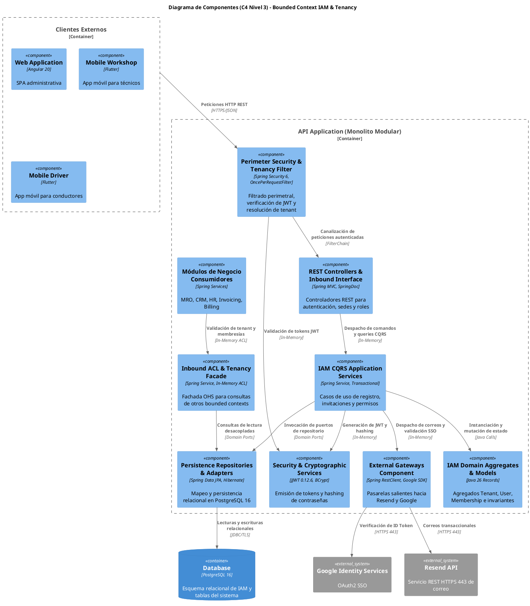

## 4. Fase 1: Bounded Context 1 — Identity and Access Management (IAM) & Tenancy Context (`com.andeva.atelier.platform.iam`)

### 4.1. Diccionario y Propósito del Contexto

#### 4.1.1. Propósito y Límites de Responsabilidad
El **Identity and Access Management (IAM) & Tenancy Context** es el pilar fundacional de la arquitectura de Atelier Platform. Su responsabilidad primordial es triple:
1. **Aislamiento Multi-Tenant de Primer Nivel:** Proporcionar la estructura corporativa de talleres mecánicos (`Tenant`) y sus sedes físicas de operación (`Branch`), garantizando que cada registro transaccional en el ecosistema esté estrictamente segregado por el identificador de inquilino (`TenantId`). Delimita las coordenadas geográficas de las sedes con geocercas GPS circulares para el control presencial del personal.
2. **Identidad Universal y Seguridad Federada:** Gestionar las identidades de cuentas de acceso (`User`) y sus datos biográficos (`Profile`), admitiendo credenciales locales protegidas por funciones criptográficas de derivación de claves (`BCrypt`) y autenticación federada mediante Single Sign-On (SSO) con Google OAuth2. Controla el ciclo de vida de tokens de un solo uso (`VerificationToken`) para validación de direcciones de correo electrónico y recuperación de contraseñas.
3. **Membresías Laborales, Onboarding y Control de Acceso Basado en Roles (RBAC):** Modelar la relación contractual de empleo entre una persona y un taller determinado (`TenantMembership`), asociando condiciones salariales (`fixed` o `hourly`), coordinando la emisión de invitaciones tokenizadas de onboarding (`Invitation`) despachadas por correo electrónico transaccional, y gestionando roles dinámicos por taller (`Role`) vinculados a permisos atómicos del catálogo de seguridad (`Permission`).

#### 4.1.2. Decisiones de Diseño e Integraciones Críticas
* **Eliminación Definitiva del Bloqueo SMTP:** La versión previa (v1) empleaba `JavaMailSender` apuntando al puerto SMTP 587 (`smtp.gmail.com`), provocando fallos sistemáticos de `SocketTimeoutException` en entornos de producción PaaS (Render / Railway / AWS ECS) debido a políticas perimetrales anti-spam. En esta especificación v2, el contexto IAM delega todo despacho de correo saliente (códigos OTP, invitaciones de personal y enlaces de restablecimiento de contraseña) a la **API REST HTTPS de Resend (puerto 443)** mediante un cliente WebClient/RestClient asíncrono y resiliente.
* **Tokens JWT Enriquecidos y Contextuales:** A diferencia de sistemas desacoplados que requieren consultas recurrentes a la base de datos para verificar membresías, el emisor de tokens (`BearerTokenService`) genera tokens JWT (`jjwt:0.12.6`) que integran en sus *claims* criptográficos el `userId`, el `tenantId` activo, el `branchId` predeterminado y la lista unificada de códigos de permisos (`authorities`), permitiendo al filtro perimetral `BearerAuthorizationRequestFilter` autorizar peticiones en memoria con coste O(1).
* **Fachada de Contexto Abierta (Open Host Service / Inbound ACL):** Para salvaguardar la pureza del modelo de dominio e impedir acoplamientos circulares, IAM expone la interfaz `TenancyContextFacade`. Cualquier Bounded Context que requiera validar la existencia de un taller, la afiliación laboral de un mecánico o la vigencia de una sucursal física invoca esta fachada en memoria sin acceder a las entidades JPA de IAM.

---

### 4.2. 2.6.1.1. Domain Layer

#### 4.2.1. Aggregates & Aggregate Roots

##### 1. `Tenant` (Aggregate Root)
* **Paquete:** `com.andeva.atelier.platform.iam.domain.model.aggregates`
* **Herencia:** Extiende `AbstractDomainAggregateRoot<Tenant>`
* **Propósito:** Representa la empresa o taller mecánico titular de una cuenta en la plataforma Atelier. Es la raíz de particionamiento lógico para el aislamiento multi-tenant.
* **Atributos:**
  * `id: TenantId` — Identificador universal del inquilino (UUID v7/v4).
  * `name: String` — Nombre comercial de la empresa automotriz (máx. 100 caracteres).
  * `legalName: String` — Razón Social formal registrada ante la autoridad tributaria (SUNAT, máx. 150 caracteres).
  * `taxId: TaxId` — Registro Único de Contribuyentes (RUC) validado formalmente (11 dígitos numéricos).
  * `status: TenantStatus` — Estado operativo del taller (`PENDING`, `ACTIVE`, `SUSPENDED`).
  * `stripeCustomerId: String` — Identificador de cliente asignado en la pasarela de pagos Stripe (nullable).
  * `branches: List<Branch>` — Colección de sedes físicas administradas por el taller (entidades internas dependientes).
* **Invariantes y Reglas de Negocio:**
  * El `name` y `legalName` no pueden ser nulos ni cadenas en blanco.
  * El `taxId` es obligatorio, inmutable tras la validación fiscal y único en toda la plataforma.
  * Todo `Tenant` nuevo se inicializa en estado `ACTIVE` (o `PENDING` si requiere validación tributaria).
  * No se puede suspender un taller que ya se encuentra en estado `SUSPENDED`.
* **Métodos:**
  * `+ static Tenant create(String name, String legalName, TaxId taxId): Tenant`: Factoría de dominio que valida datos, instancia el agregado y registra `TenantRegisteredEvent`.
  * `+ void assignStripeCustomerId(String customerId): void`: Asocia el identificador de cliente de Stripe una vez sincronizado por el módulo de suscripciones.
  * `+ void activate(): void`: Transiciona el estado del taller a `ACTIVE`.
  * `+ void suspend(String reason): void`: Transiciona el estado a `SUSPENDED` e invalida el acceso de sus usuarios activos.
  * `+ Branch addBranch(String name, String sunatCode, GeoPoint location, int geofenceRadiusMeters): Branch`: Crea e incorpora una nueva sede física en la colección interna, registrando `BranchCreatedEvent`.
  * `+ void updateProfile(String name, String legalName): void`: Actualiza los metadatos corporativos del taller.
  * `+ Optional<Branch> findBranchById(BranchId branchId): Optional<Branch>`: Consulta una sede física específica dentro del agregado.

##### 2. `User` (Aggregate Root)
* **Paquete:** `com.andeva.atelier.platform.iam.domain.model.aggregates`
* **Herencia:** Extiende `AbstractDomainAggregateRoot<User>`
* **Propósito:** Representa la identidad de autenticación global de un individuo dentro del ecosistema Atelier (propietario de taller, recepcionista, mecánico o conductor particular).
* **Atributos:**
  * `id: UserId` — Identificador universal de la cuenta (UUID).
  * `email: EmailAddress` — Dirección de correo electrónico única y canónica de acceso.
  * `password: Password` — Contraseña cifrada mediante hash BCrypt (nullable si el proveedor es federado).
  * `authProvider: AuthProvider` — Proveedor de identidad (`LOCAL`, `GOOGLE`).
  * `googleId: String` — Identificador único asignado por Google OAuth2 SSO (nullable si es `LOCAL`).
  * `fcmToken: String` — Token de registro en Firebase Cloud Messaging para notificaciones móviles (nullable).
  * `status: UserStatus` — Estado de la cuenta (`PENDING_VERIFICATION`, `ACTIVE`, `SUSPENDED`).
  * `profile: Profile` — Entidad 1:1 que contiene los datos demográficos del usuario.
  * `verificationTokens: List<VerificationToken>` — Colección histórica y activa de tokens OTP o de restablecimiento de contraseña.
* **Invariantes y Reglas de Negocio:**
  * El `email` es estrictamente único en todo el ecosistema global.
  * Si `authProvider == LOCAL`, el atributo `password` es estrictamente obligatorio y debe poseer un hash BCrypt válido.
  * Si `authProvider == GOOGLE`, el atributo `googleId` es obligatorio y el `password` puede ser nulo.
  * Una cuenta no puede autenticarse si su estado es `SUSPENDED`.
* **Métodos:**
  * `+ static User registerWithLocalCredentials(EmailAddress email, Password password, PersonName name, PhoneNumber phone): User`: Instancia un nuevo usuario local en estado `PENDING_VERIFICATION`, inicializa su perfil y registra `UserRegisteredEvent`.
  * `+ static User registerWithGoogle(EmailAddress email, String googleId, PersonName name, String avatarUrl): User`: Instancia un nuevo usuario federado en estado `ACTIVE`, saltando la verificación de correo por estar validado por Google.
  * `+ void verifyEmail(): void`: Transiciona el estado de `PENDING_VERIFICATION` a `ACTIVE`.
  * `+ void updatePassword(Password newPassword): void`: Reemplaza el hash de la contraseña por uno nuevo.
  * `+ void updateFcmToken(String fcmToken): void`: Actualiza el token de mensajería push de Firebase.
  * `+ VerificationToken issueVerificationToken(TokenType type, Duration validity): VerificationToken`: Genera un token numérico (OTP) o alfanumérico seguro, lo añade a la colección interna y registra `VerificationTokenIssuedEvent`.
  * `+ boolean validateAndConsumeToken(String tokenValue, TokenType expectedType): boolean`: Localiza un token activo, valida su vigencia temporal y lo marca como consumido (`isUsed = true`).
  * `+ void updateProfile(PersonName newName, PhoneNumber newPhone): void`: Delega la mutación de atributos demográficos a la entidad interna `Profile`.

##### 3. `TenantMembership` (Aggregate Root)
* **Paquete:** `com.andeva.atelier.platform.iam.domain.model.aggregates`
* **Herencia:** Extiende `AbstractDomainAggregateRoot<TenantMembership>`
* **Propósito:** Modela el vínculo contractual y operativo entre un `User` y un `Tenant`. Representa al "Empleado" o "Colaborador" en el taller mecánico, centralizando la configuración de remuneración y los roles de seguridad asignados.
* **Atributos:**
  * `id: TenantMembershipId` — Identificador único de la membresía (UUID).
  * `tenantId: TenantId` — Inquilino o taller al que pertenece el contrato.
  * `userId: UserId` — Cuenta de usuario global asociada a la membresía.
  * `status: MembershipStatus` — Estado del vínculo laboral (`ACTIVE`, `INACTIVE`).
  * `salaryType: SalaryType` — Esquema de remuneración pactado (`FIXED` para salario mensual o quincenal, `HOURLY` para pago por hora efectiva).
  * `baseSalary: Money` — Remuneración base expresada en moneda local (ej. PEN con precisión de dos decimales).
  * `assignedRoles: Set<Role>` — Conjunto de roles de seguridad asociados al colaborador en este taller.
* **Invariantes y Reglas de Negocio:**
  * La tupla `(tenantId, userId)` es estrictamente única (un usuario solo puede tener un registro de membresía por taller).
  * El `baseSalary` no puede ser negativo (`amount >= 0.00`).
  * Toda membresía activa debe tener asignado al menos un rol de seguridad válido dentro del taller.
* **Métodos:**
  * `+ static TenantMembership create(TenantId tenantId, UserId userId, SalaryType salaryType, Money baseSalary, Set<Role> initialRoles): TenantMembership`: Factoría que inicializa la relación contractual y registra `TenantMembershipCreatedEvent`.
  * `+ void assignRole(Role role): void`: Incorpora un nuevo rol al conjunto de privilegios del colaborador.
  * `+ void revokeRole(RoleId roleId): void`: Remueve un rol del colaborador garantizando que mantenga al menos uno activo.
  * `+ void updateCompensation(SalaryType newSalaryType, Money newBaseSalary): void`: Ajusta el tipo de remuneración y monto pactado.
  * `+ void activate(): void`: Restablece el vínculo laboral a estado `ACTIVE`.
  * `+ void deactivate(): void`: Suspende el vínculo laboral a estado `INACTIVE`, revocando de inmediato el acceso al taller.
  * `+ boolean hasPermission(String permissionName): boolean`: Evalúa recursivamente si alguno de los roles asignados contiene el permiso especificado.

##### 4. `Role` (Aggregate Root)
* **Paquete:** `com.andeva.atelier.platform.iam.domain.model.aggregates`
* **Herencia:** Extiende `AbstractDomainAggregateRoot<Role>`
* **Propósito:** Agrupador de permisos de seguridad específico por taller (RBAC multitenant) o provisto globalmente por la plataforma como plantilla de sistema.
* **Atributos:**
  * `id: RoleId` — Identificador único del rol (UUID).
  * `tenantId: TenantId` — Taller propietario del rol (o `null` si es un rol semilla global del sistema como `ROLE_SUPERADMIN`).
  * `name: String` — Nombre legible del rol (ej. "Dueño de Taller", "Mecánico Principal", "Asesor de Servicio").
  * `description: String` — Explicación funcional de los privilegios otorgados.
  * `isSystemRole: boolean` — Indicador booleano que protege el rol contra eliminación si es nativo de la plataforma.
  * `permissions: Set<Permission>` — Conjunto de permisos atómicos asignados al rol.
* **Invariantes y Reglas de Negocio:**
  * El `name` no puede ser nulo ni vacío, y es único en el ámbito del taller (`tenant_id, name`).
  * Los roles marcados con `isSystemRole == true` no pueden ser eliminados ni renombrados por usuarios del taller.
* **Métodos:**
  * `+ static Role defineTenantRole(TenantId tenantId, String name, String description, Set<Permission> permissions): Role`: Factoría para roles personalizados de un taller.
  * `+ static Role defineSystemRole(String name, String description, Set<Permission> permissions): Role`: Factoría para roles canónicos del sistema.
  * `+ void grantPermission(Permission permission): void`: Asocia un permiso al rol.
  * `+ void revokePermission(PermissionId permissionId): void`: Remueve un permiso del conjunto.
  * `+ void updateDetails(String name, String description): void`: Modifica los metadatos descriptivos del rol.

##### 5. `Invitation` (Aggregate Root)
* **Paquete:** `com.andeva.atelier.platform.iam.domain.model.aggregates`
* **Herencia:** Extiende `AbstractDomainAggregateRoot<Invitation>`
* **Propósito:** Controla el proceso de invitación y onboarding de personal al taller, permitiendo la incorporación fluida de nuevos mecánicos y recepcionistas mediante enlaces tokenizados y seguros.
* **Atributos:**
  * `id: InvitationId` — Identificador de la invitación (UUID).
  * `tenantId: TenantId` — Taller que emite la invitación de trabajo.
  * `email: EmailAddress` — Dirección de correo a la que se envía la invitación.
  * `token: String` — Token criptográfico único y aleatorio generado con `SecureRandom` (URL-safe).
  * `status: InvitationStatus` — Estado de la invitación (`PENDING`, `ACCEPTED`, `EXPIRED`, `REVOKED`).
  * `targetRoleId: RoleId` — Rol de seguridad que se le asignará al usuario tras completar su registro.
  * `expiresAt: Instant` — Fecha y hora límite para canjear la invitación (ej. 7 días naturales).
* **Invariantes y Reglas de Negocio:**
  * No se pueden emitir múltiples invitaciones en estado `PENDING` al mismo correo dentro del mismo taller.
  * Solo una invitación en estado `PENDING` cuya fecha `expiresAt` sea estrictamente posterior al instante actual puede ser aceptada.
* **Métodos:**
  * `+ static Invitation issue(TenantId tenantId, EmailAddress email, RoleId targetRoleId, Duration validity): Invitation`: Instancia la invitación y dispara `StaffInvitedEvent`.
  * `+ void accept(UserId acceptedByUserId): void`: Transiciona el estado a `ACCEPTED` y registra `StaffInvitationAcceptedEvent`.
  * `+ void expire(): void`: Marca la invitación como `EXPIRED` si ha superado el plazo de validez.
  * `+ void revoke(): void`: Anula manualmente la invitación por parte de la administración del taller.
  * `+ boolean isPending(): boolean`: Determina si la invitación está vigente y pendiente de canje.

---

#### 4.2.2. Entities

##### 1. `Branch` (Entidad Dependiente de `Tenant`)
* **Paquete:** `com.andeva.atelier.platform.iam.domain.model.entities`
* **Propósito:** Representa una sucursal o localización física de atención automotriz perteneciente al taller.
* **Atributos:**
  * `id: BranchId` — Identificador único de la sede (UUID).
  * `tenantId: TenantId` — Referencia al taller propietario.
  * `name: String` — Denominación operativa (ej. "Sede Principal - Surquillo", "Sede Miraflores").
  * `sunatCode: String` — Código de anexo tributario de cuatro dígitos registrado ante SUNAT (ej. "0000" para matriz).
  * `location: GeoPoint` — Coordenadas geográficas WGS84 (latitud y longitud).
  * `geofenceRadiusMeters: int` — Radio en metros aceptado para validación de geocercas GPS (default: 50m).
  * `isActive: boolean` — Bandera que indica si la sede está operando actualmente.
* **Métodos:**
  * `+ void updateLocation(GeoPoint newLocation, int newRadiusMeters): void`: Ajusta el centroide y radio de la geocerca.
  * `+ void updateDetails(String newName, String newSunatCode): void`: Actualiza nombre y código tributario.
  * `+ boolean isWithinGeofence(GeoPoint coordinates): boolean`: Evalúa si un punto GPS se encuentra dentro del radio permitido utilizando la fórmula de Haversine.
  * `+ void deactivate(): void`: Marca la sucursal como inactiva.

##### 2. `Profile` (Entidad Dependiente de `User`)
* **Paquete:** `com.andeva.atelier.platform.iam.domain.model.entities`
* **Propósito:** Contiene los atributos personales y de contacto del individuo, desacoplados de los datos criptográficos de autenticación.
* **Atributos:**
  * `userId: UserId` — Clave foránea e identificador 1:1 con la cuenta de usuario.
  * `name: PersonName` — Nombre completo del usuario (nombres y apellidos).
  * `phone: PhoneNumber` — Teléfono o celular de contacto normalizado.
* **Métodos:**
  * `+ void update(PersonName name, PhoneNumber phone): void`: Actualiza la información demográfica.
  * `+ String getFullName(): String`: Retorna la concatenación estándar de nombre y apellidos.

##### 3. `VerificationToken` (Entidad Dependiente de `User`)
* **Paquete:** `com.andeva.atelier.platform.iam.domain.model.entities`
* **Propósito:** Almacena tokens de un solo uso para flujos transaccionales de seguridad (OTP de 6 dígitos para validación de email o hashes URL-safe para reset de contraseña).
* **Atributos:**
  * `id: UUID` — Identificador del registro.
  * `userId: UserId` — Cuenta titular del token.
  * `tokenValue: String` — Valor del código o hash secreto.
  * `type: TokenType` — Propósito del token (`EMAIL_VERIFICATION`, `PASSWORD_RESET`, `LOGIN_OTP`).
  * `expiresAt: Instant` — Marca de tiempo de expiración.
  * `isUsed: boolean` — Bandera de canje efectivo.
* **Métodos:**
  * `+ boolean isValid(): boolean`: Retorna `true` si `!isUsed` y `expiresAt.isAfter(Instant.now())`.
  * `+ void consume(): void`: Marca el token como consumido e inutilizable para futuros intentos.

##### 4. `Permission` (Entidad de Catálogo)
* **Paquete:** `com.andeva.atelier.platform.iam.domain.model.entities`
* **Propósito:** Representa un privilegio atómico de autorización en el sistema (ej. `work_orders:create`, `inventory:read`).
* **Atributos:**
  * `id: PermissionId` — Clave primaria del permiso (UUID).
  * `name: String` — Nombre canónico único (ej. `mro:work-orders:create`).
  * `description: String` — Detalle del alcance del privilegio.
  * `category: String` — Bounded context al que aplica (ej. "OPERATIONS", "INVENTORY", "BILLING").

---

#### 4.2.3. Value Objects

Todos los Value Objects son inmutables y se implementan como Java Records con validaciones en su constructor compacto:

* **`TenantId(UUID value)`:** Identificador tipado de inquilino. Valida `Objects.requireNonNull(value)`.
* **`BranchId(UUID value)`:** Identificador tipado de sede física. Valida `Objects.requireNonNull(value)`.
* **`UserId(UUID value)`:** Identificador tipado de usuario global. Valida `Objects.requireNonNull(value)`.
* **`TenantMembershipId(UUID value)`:** Identificador tipado de membresía/empleado. Valida `Objects.requireNonNull(value)`.
* **`RoleId(UUID value)`:** Identificador tipado de rol. Valida `Objects.requireNonNull(value)`.
* **`PermissionId(UUID value)`:** Identificador tipado de permiso. Valida `Objects.requireNonNull(value)`.
* **`InvitationId(UUID value)`:** Identificador tipado de invitación. Valida `Objects.requireNonNull(value)`.
* **`TaxId(String value)`:** Representa el RUC peruano. Valida que posea exactamente 11 caracteres numéricos, inicie con prefijos válidos (`10`, `15`, `17`, `20`) y satisfaga el algoritmo de verificación Módulo 11 de SUNAT.
* **`EmailAddress(String value)`:** Valida formato estricto RFC 5322 mediante expresión regular y normaliza a minúsculas (`value.trim().toLowerCase()`).
* **`Password(String hashedValue)`:** Encapsula el hash criptográfico BCrypt. No almacena texto plano en ningún momento del ciclo de vida del objeto.
* **`PersonName(String firstName, String lastName)`:** Encapsula nombres y apellidos, validando longitudes mínimas de 2 caracteres y eliminando espacios superfluos.
* **`PhoneNumber(String value)`:** Valida cadenas de 9 dígitos numéricos para teléfonos móviles de Perú o formato internacional E.164.
* **`GeoPoint(Double latitude, Double longitude)`:** Representa una coordenada GPS WGS84. Valida rangos: `latitude >= -90.0 && latitude <= 90.0`, `longitude >= -180.0 && longitude <= 180.0`. Provee el método `distanceToInMeters(GeoPoint other)` aplicando la fórmula de Haversine.
* **Enumeraciones de Dominio:**
  * `TenantStatus` — `PENDING`, `ACTIVE`, `SUSPENDED`.
  * `UserStatus` — `PENDING_VERIFICATION`, `ACTIVE`, `SUSPENDED`.
  * `MembershipStatus` — `ACTIVE`, `INACTIVE`.
  * `SalaryType` — `FIXED`, `HOURLY`.
  * `TokenType` — `EMAIL_VERIFICATION`, `PASSWORD_RESET`, `LOGIN_OTP`.
  * `InvitationStatus` — `PENDING`, `ACCEPTED`, `EXPIRED`, `REVOKED`.
  * `AuthProvider` — `LOCAL`, `GOOGLE`.

---

#### 4.2.4. Domain Commands

Comandos inmutables que encapsulan la intención de mutar el estado en el contexto IAM:

* `RegisterTenantCommand(String name, String legalName, String taxId, String adminEmail, String adminPassword, String adminFirstName, String adminLastName, String adminPhone)`
* `RegisterUserCommand(String email, String password, String firstName, String lastName, String phone)`
* `AuthenticateUserCommand(String email, String password)`
* `AuthenticateWithGoogleCommand(String idToken)`
* `VerifyEmailTokenCommand(String token)`
* `RequestPasswordResetCommand(String email)`
* `ResetPasswordCommand(String token, String newPassword)`
* `CreateBranchCommand(TenantId tenantId, String name, String sunatCode, Double latitude, Double longitude, int geofenceRadiusMeters)`
* `InviteStaffCommand(TenantId tenantId, String email, RoleId roleId)`
* `AcceptInvitationCommand(String token, String password, String firstName, String lastName, String phone)`
* `AssignRoleToMembershipCommand(TenantMembershipId membershipId, RoleId roleId)`
* `CreateCustomRoleCommand(TenantId tenantId, String name, String description, List<PermissionId> permissionIds)`
* `UpdateMembershipCompensationCommand(TenantMembershipId membershipId, SalaryType salaryType, BigDecimal baseSalary, String currency)`

---

#### 4.2.5. Domain Queries

Consultas de lectura inmutables para el contexto IAM:

* `GetTenantByIdQuery(TenantId tenantId)`
* `GetBranchByIdQuery(BranchId branchId)`
* `GetBranchesByTenantIdQuery(TenantId tenantId)`
* `GetUserByIdQuery(UserId userId)`
* `GetUserByEmailQuery(EmailAddress email)`
* `GetMembershipsByTenantIdQuery(TenantId tenantId)`
* `GetMembershipByIdQuery(TenantMembershipId membershipId)`
* `GetMembershipByTenantAndUserQuery(TenantId tenantId, UserId userId)`
* `GetRolesByTenantIdQuery(TenantId tenantId)`
* `GetAllPermissionsQuery()`

---

#### 4.2.6. Domain Events

Eventos de dominio internos que registran hechos consumados dentro del agregado:

* `TenantRegisteredEvent(TenantId tenantId, String name, TaxId taxId, Instant occurredOn)`
* `BranchCreatedEvent(BranchId branchId, TenantId tenantId, String name, Instant occurredOn)`
* `UserRegisteredEvent(UserId userId, EmailAddress email, Instant occurredOn)`
* `VerificationTokenIssuedEvent(UserId userId, String tokenValue, TokenType type, Instant expiresAt, Instant occurredOn)`
* `PasswordResetRequestedEvent(UserId userId, EmailAddress email, String tokenValue, Instant expiresAt, Instant occurredOn)`
* `TenantMembershipCreatedEvent(TenantMembershipId membershipId, TenantId tenantId, UserId userId, Instant occurredOn)`
* `StaffInvitedEvent(InvitationId invitationId, TenantId tenantId, EmailAddress email, String token, Instant occurredOn)`
* `StaffInvitationAcceptedEvent(InvitationId invitationId, TenantId tenantId, UserId userId, Instant occurredOn)`

---

#### 4.2.7. Repositories (Interfaces de Dominio)

Puertos de salida puros sin acoplamiento a frameworks de persistencia:

* **`TenantRepository`:**
  * `Tenant save(Tenant tenant)`
  * `Optional<Tenant> findById(TenantId id)`
  * `Optional<Tenant> findByTaxId(TaxId taxId)`
  * `boolean existsByTaxId(TaxId taxId)`
* **`BranchRepository`:**
  * `Branch save(Branch branch)`
  * `Optional<Branch> findById(BranchId id)`
  * `List<Branch> findByTenantId(TenantId tenantId)`
* **`UserRepository`:**
  * `User save(User user)`
  * `Optional<User> findById(UserId id)`
  * `Optional<User> findByEmail(EmailAddress email)`
  * `boolean existsByEmail(EmailAddress email)`
  * `Optional<User> findByGoogleId(String googleId)`
* **`TenantMembershipRepository`:**
  * `TenantMembership save(TenantMembership membership)`
  * `Optional<TenantMembership> findById(TenantMembershipId id)`
  * `Optional<TenantMembership> findByTenantIdAndUserId(TenantId tenantId, UserId userId)`
  * `List<TenantMembership> findByTenantId(TenantId tenantId)`
  * `List<TenantMembership> findByUserId(UserId userId)`
* **`RoleRepository`:**
  * `Role save(Role role)`
  * `Optional<Role> findById(RoleId id)`
  * `Optional<Role> findByTenantIdAndName(TenantId tenantId, String name)`
  * `List<Role> findByTenantId(TenantId tenantId)`
* **`PermissionRepository`:**
  * `List<Permission> findAll()`
  * `List<Permission> findByIdIn(Collection<PermissionId> ids)`
* **`InvitationRepository`:**
  * `Invitation save(Invitation invitation)`
  * `Optional<Invitation> findById(InvitationId id)`
  * `Optional<Invitation> findByToken(String token)`
  * `Optional<Invitation> findByTenantIdAndEmail(TenantId tenantId, EmailAddress email)`

---

### 4.3. 2.6.1.2. Interface Layer

#### 4.3.1. REST Controllers

Controladores HTTP anotados con `@RestController`, `@RequestMapping` y especificaciones OpenAPI 3 (`@Tag`, `@Operation`, `@ApiResponses`):

##### 1. `AuthenticationController`
* **Ruta Base:** `/api/v1/authentication`
* **Propósito:** Registro de usuarios y talleres, inicio de sesión, verificación de correo y restablecimiento de contraseña.
* **Endpoints:**
  * `POST /sign-up`: Registro integral del taller y su cuenta administradora inicial. Recibe `CreateTenantResource`, retorna `TenantResource` (HTTP 201 Created).
  * `POST /sign-in`: Autenticación con credenciales locales. Recibe `SignInResource`, retorna `AuthenticatedUserResource` con el JWT Bearer (HTTP 200 OK).
  * `POST /google-sign-in`: Autenticación federada mediante token de Google. Recibe `GoogleSignInResource`, retorna `AuthenticatedUserResource` (HTTP 200 OK).
  * `POST /verify-email`: Confirmación de cuenta mediante token OTP. Recibe `VerifyEmailResource`, retorna `MessageResponseResource` (HTTP 200 OK).
  * `POST /forgot-password`: Solicitud de restablecimiento de contraseña. Genera el token y despacha correo vía Resend. Recibe `ForgotPasswordResource`, retorna `MessageResponseResource` (HTTP 200 OK).
  * `POST /reset-password`: Canje de token y actualización de clave. Recibe `ResetPasswordResource`, retorna `MessageResponseResource` (HTTP 200 OK).

##### 2. `TenantsController`
* **Ruta Base:** `/api/v1/tenants`
* **Propósito:** Gestión corporativa de talleres mecánicos.
* **Endpoints:**
  * `GET /current`: Consulta los metadatos del taller activo resuelto a partir del token JWT autenticado. Retorna `TenantResource` (HTTP 200 OK).
  * `PUT /current`: Actualización de razón social o nombre comercial del taller. Recibe `UpdateTenantProfileResource`, retorna `TenantResource` (HTTP 200 OK).

##### 3. `BranchesController`
* **Ruta Base:** `/api/v1/tenants/{tenantId}/branches`
* **Propósito:** Administración de sedes físicas y geocercas GPS.
* **Endpoints:**
  * `POST`: Creación de una nueva sede física en el taller. Recibe `CreateBranchResource`, retorna `BranchResource` (HTTP 201 Created).
  * `GET`: Listado de sedes físicas pertenecientes al taller. Retorna `List<BranchResource>` (HTTP 200 OK).
  * `GET /{branchId}`: Consulta del detalle de una sede física. Retorna `BranchResource` (HTTP 200 OK / 404 Not Found).
  * `PUT /{branchId}`: Actualización de coordenadas GPS y radio de geocerca. Recibe `UpdateBranchLocationResource`, retorna `BranchResource` (HTTP 200 OK).

##### 4. `MembershipsController`
* **Ruta Base:** `/api/v1/tenants/{tenantId}/memberships`
* **Propósito:** Gestión del personal laboral del taller, sus roles asignados y condiciones salariales.
* **Endpoints:**
  * `GET`: Listado del personal adscrito al taller. Retorna `List<MembershipResource>` (HTTP 200 OK).
  * `GET /{membershipId}`: Detalle de la membresía de un colaborador. Retorna `MembershipResource` (HTTP 200 OK).
  * `PUT /{membershipId}/roles`: Asignación y revocación de roles para el empleado. Recibe `AssignRolesResource`, retorna `MembershipResource` (HTTP 200 OK).
  * `PUT /{membershipId}/compensation`: Modificación de salario base y tipo de remuneración. Recibe `UpdateCompensationResource`, retorna `MembershipResource` (HTTP 200 OK).
  * `DELETE /{membershipId}`: Desactivación laboral del colaborador en el taller. Retorna HTTP 204 No Content.

##### 5. `InvitationsController`
* **Ruta Base:** `/api/v1/invitations`
* **Propósito:** Onboarding y bienvenida digital de nuevos miembros.
* **Endpoints:**
  * `POST /tenant/{tenantId}`: Emisión de una nueva invitación por email mediante Resend. Recibe `InviteStaffResource`, retorna `InvitationResource` (HTTP 201 Created).
  * `GET /validate?token={token}`: Verificación previa del estado del token de invitación para renderizar la pantalla de registro. Retorna `InvitationValidationResource` (HTTP 200 OK).
  * `POST /accept`: Aceptación de la invitación y creación de credenciales del nuevo empleado. Recibe `AcceptInvitationResource`, retorna `AuthenticatedUserResource` (HTTP 201 Created).

##### 6. `RolesController`
* **Ruta Base:** `/api/v1/tenants/{tenantId}/roles`
* **Propósito:** Gestión del esquema dinámico de seguridad RBAC.
* **Endpoints:**
  * `GET`: Listado de roles disponibles en el taller. Retorna `List<RoleResource>` (HTTP 200 OK).
  * `POST`: Creación de un rol personalizado con selección de permisos. Recibe `CreateRoleResource`, retorna `RoleResource` (HTTP 201 Created).
  * `GET /api/v1/permissions`: Consulta del catálogo transversal de permisos del sistema. Retorna `List<PermissionResource>` (HTTP 200 OK).

---

#### 4.3.2. Resources / DTOs

Estructuras de datos inmutables (Java Records) para entrada y salida HTTP:

* **Peticiones (Requests):**
  * `CreateTenantResource(String name, String legalName, String taxId, String adminEmail, String adminPassword, String adminFirstName, String adminLastName, String adminPhone)`
  * `SignInResource(String email, String password)`
  * `GoogleSignInResource(String idToken)`
  * `VerifyEmailResource(String token)`
  * `ForgotPasswordResource(String email)`
  * `ResetPasswordResource(String token, String newPassword)`
  * `UpdateTenantProfileResource(String name, String legalName)`
  * `CreateBranchResource(String name, String sunatCode, Double latitude, Double longitude, int geofenceRadiusMeters)`
  * `UpdateBranchLocationResource(Double latitude, Double longitude, int geofenceRadiusMeters)`
  * `InviteStaffResource(String email, UUID roleId)`
  * `AcceptInvitationResource(String token, String password, String firstName, String lastName, String phone)`
  * `AssignRolesResource(List<UUID> roleIds)`
  * `CreateRoleResource(String name, String description, List<UUID> permissionIds)`
  * `UpdateCompensationResource(String salaryType, BigDecimal baseSalary, String currency)`
* **Respuestas (Responses):**
  * `AuthenticatedUserResource(UUID userId, String email, String fullName, String token, String tokenType, TenantSummaryResource activeTenant, List<String> permissions)`
  * `TenantResource(UUID id, String name, String legalName, String taxId, String status, String stripeCustomerId, Instant createdAt)`
  * `TenantSummaryResource(UUID id, String name, String taxId)`
  * `BranchResource(UUID id, UUID tenantId, String name, String sunatCode, Double latitude, Double longitude, int geofenceRadiusMeters, boolean isActive)`
  * `MembershipResource(UUID id, UUID tenantId, UUID userId, String employeeName, String email, String status, String salaryType, BigDecimal baseSalary, String currency, List<RoleResource> roles)`
  * `RoleResource(UUID id, String name, String description, boolean isSystemRole, List<String> permissions)`
  * `PermissionResource(UUID id, String name, String description, String category)`
  * `InvitationResource(UUID id, UUID tenantId, String email, String status, Instant expiresAt)`
  * `InvitationValidationResource(boolean valid, String email, String tenantName, String roleName)`
  * `MessageResponseResource(String message, Instant timestamp)`

---

#### 4.3.3. Resource Assemblers

Clases transformadoras entre Resources (DTOs) y Command/Query/Aggregate:

* `CreateTenantCommandFromResourceAssembler`: Transforma `CreateTenantResource` a `CreateTenantCommand`.
* `SignInCommandFromResourceAssembler`: Transforma `SignInResource` a `AuthenticateUserCommand`.
* `TenantResourceFromAggregateAssembler`: Transforma `Tenant` a `TenantResource`.
* `BranchResourceFromEntityAssembler`: Transforma `Branch` a `BranchResource`.
* `MembershipResourceFromAggregateAssembler`: Transforma `TenantMembership`, resolviendo el `User` asociado, a `MembershipResource`.
* `RoleResourceFromAggregateAssembler`: Transforma `Role` a `RoleResource`.
* `InvitationResourceFromAggregateAssembler`: Transforma `Invitation` a `InvitationResource`.

---

#### 4.3.4. Open Host Service (OHS) / Inbound ACL Facade

Interfaz pública expuesta en `com.andeva.atelier.platform.iam.interfaces.acl` para el consumo seguro de otros Bounded Contexts:

```java
package com.andeva.atelier.platform.iam.interfaces.acl;

import java.util.List;
import java.util.Optional;
import java.util.UUID;

public interface TenancyContextFacade {
    Optional<TenantAclDto> fetchTenantById(UUID tenantId);
    Optional<BranchAclDto> fetchBranchById(UUID branchId);
    Optional<UserAclDto> fetchUserById(UUID userId);
    boolean validateTenantMembership(UUID tenantId, UUID userId);
    List<String> fetchUserPermissionsInTenant(UUID tenantId, UUID userId);
    Optional<BranchGeofenceAclDto> fetchBranchGeofence(UUID branchId);
    boolean isPointWithinBranchGeofence(UUID branchId, Double latitude, Double longitude);
}
```

*DTOs Exportados por la Fachada:*
* `TenantAclDto(UUID id, String name, String legalName, String taxId, String status, String stripeCustomerId)`
* `BranchAclDto(UUID id, UUID tenantId, String name, String sunatCode)`
* `UserAclDto(UUID id, String email, String fullName, String phone, String fcmToken)`
* `BranchGeofenceAclDto(UUID branchId, Double latitude, Double longitude, int radiusMeters)`

---

#### 4.3.5. Integration Events (Published Language)

Eventos asíncronos emitidos por IAM para que otros Bounded Contexts reaccionen sin acoplamiento transaccional:

* **`TenantCreatedIntegrationEvent(UUID tenantId, String name, String legalName, String taxId, Instant occurredOn)`:** Notifica a *SaaS Billing* para preparar la cuenta de suscripción y a *Invoicing* para pre-configurar el emisor tributario.
* **`BranchCreatedIntegrationEvent(UUID branchId, UUID tenantId, String name, String sunatCode, Double latitude, Double longitude, int geofenceRadiusMeters, Instant occurredOn)`:** Notifica a *Workshop Operations* para habilitar la creación de bahías de trabajo y a *HR* para asociar turnos presenciales.
* **`UserRegisteredIntegrationEvent(UUID userId, String email, String fullName, Instant occurredOn)`:** Notifica a *Customer & Fleet (CRM)* para sincronizar la ficha del cliente si el usuario se registró como conductor particular.
* **`TenantMembershipCreatedIntegrationEvent(UUID membershipId, UUID tenantId, UUID userId, List<String> roleNames, Instant occurredOn)`:** Notifica a *HR Management* para aperturar el expediente de asistencia y legajo laboral del mecánico.
* **`StaffInvitedIntegrationEvent(UUID invitationId, UUID tenantId, String email, Instant occurredOn)`:** Registra la auditoría de invitación de personal.

---

### 4.4. 2.6.1.3. Application Layer

#### 4.4.1. Command Services & Implementations

Servicios orquestadores que ejecutan casos de uso de escritura, coordinan transacciones (`@Transactional`), validan reglas y retornan el tipo sellado `Result<T, ApplicationError>`:

##### 1. `TenantCommandService` & `TenantCommandServiceImpl`
* `Result<Tenant, ApplicationError> handle(CreateTenantCommand command)`:
  1. Valida que el `taxId` (RUC) no exista previamente (`TenantRepository.existsByTaxId`).
  2. Valida que el `adminEmail` no esté en uso (`UserRepository.existsByEmail`).
  3. Cifra la contraseña del administrador con `BCryptHashingService`.
  4. Crea la cuenta `User` en estado `ACTIVE` con su entidad `Profile`.
  5. Instancia el nuevo `Tenant` y le agrega automáticamente la sede inicial por defecto ("Sede Principal", código SUNAT "0000").
  6. Resuelve los roles del sistema (`ROLE_WORKSHOP_ADMIN`) y crea la membresía inicial `TenantMembership` vinculando al usuario administrador con el nuevo taller.
  7. Persiste `User`, `Tenant` y `TenantMembership`.
  8. Retorna `Result.success(tenant)`.
* `Result<Tenant, ApplicationError> handle(UpdateTenantProfileCommand command)`: Modifica razón social y nombre comercial.

##### 2. `UserCommandService` & `UserCommandServiceImpl`
* `Result<User, ApplicationError> handle(RegisterUserCommand command)`: Registra una cuenta de usuario independiente en estado `PENDING_VERIFICATION`, emite un OTP de 6 dígitos y publica `VerificationTokenIssuedEvent`.
* `Result<AuthenticatedUser, ApplicationError> handle(AuthenticateUserCommand command)`:
  1. Busca el usuario por correo electrónico; si no existe, retorna `ApplicationError.unauthorized("Credenciales inválidas")`.
  2. Compara el password provisto contra el hash almacenado mediante `BCryptHashingService`.
  3. Verifica que la cuenta esté activa.
  4. Obtiene las membresías y roles del usuario para resolver el taller activo por defecto.
  5. Genera el token Bearer JWT con `BearerTokenService` enriquecido con los claims de tenant y permisos.
  6. Retorna `Result.success(new AuthenticatedUser(user, token, ...))`.
* `Result<AuthenticatedUser, ApplicationError> handle(AuthenticateWithGoogleCommand command)`: Valida el Google ID Token mediante `GoogleIdentityGateway`, aprovisiona automáticamente la cuenta si es la primera vez que inicia sesión y emite el JWT.
* `Result<Void, ApplicationError> handle(VerifyEmailTokenCommand command)`: Valida y consume el token OTP, activando la cuenta del usuario.
* `Result<Void, ApplicationError> handle(RequestPasswordResetCommand command)`: Genera un token alfanumérico seguro con caducidad de 2 horas y dispara `PasswordResetRequestedEvent`.
* `Result<Void, ApplicationError> handle(ResetPasswordCommand command)`: Valida el token de restablecimiento y aplica el nuevo hash de contraseña.

##### 3. `BranchCommandService` & `BranchCommandServiceImpl`
* `Result<Branch, ApplicationError> handle(CreateBranchCommand command)`: Incorpora una nueva sucursal física al taller y persiste el agregado.

##### 4. `MembershipCommandService` & `MembershipCommandServiceImpl`
* `Result<TenantMembership, ApplicationError> handle(AssignRoleToMembershipCommand command)`: Actualiza los roles del colaborador.
* `Result<TenantMembership, ApplicationError> handle(UpdateMembershipCompensationCommand command)`: Modifica el salario base y tipo de remuneración.
* `Result<Void, ApplicationError> handle(DeactivateMembershipCommand command)`: Desactiva el vínculo laboral.

##### 5. `InvitationCommandService` & `InvitationCommandServiceImpl`
* `Result<Invitation, ApplicationError> handle(InviteStaffCommand command)`:
  1. Valida que no exista una invitación pendiente previa al mismo correo en el taller.
  2. Genera un token criptográfico seguro de 32 bytes en base64 URL-safe con validez de 7 días.
  3. Persiste la invitación y dispara `StaffInvitedEvent`, el cual desencadena el envío del correo electrónico vía Resend.
* `Result<AuthenticatedUser, ApplicationError> handle(AcceptInvitationCommand command)`:
  1. Valida y consume el token de invitación.
  2. Crea la cuenta `User` con la contraseña y datos del colaborador.
  3. Crea la membresía `TenantMembership` en el taller asociado con el rol predeterminado de la invitación.
  4. Genera y retorna la sesión autenticada con su JWT.

##### 6. `RoleCommandService` & `RoleCommandServiceImpl`
* `Result<Role, ApplicationError> handle(CreateCustomRoleCommand command)`: Resuelve los permisos solicitados del catálogo y persiste el nuevo rol.
* `void seedDefaultRolesAndPermissions()`: Ejecutado durante el arranque de la aplicación para asegurar que el catálogo base de permisos y roles del sistema existan en la base de datos.

---

#### 4.4.2. Query Services & Implementations

Servicios de lectura inmutables:

* **`TenantQueryService` & `TenantQueryServiceImpl`:**
  * `Optional<Tenant> handle(GetTenantByIdQuery query)`
  * `Optional<Tenant> handle(GetTenantByTaxIdQuery query)`
* **`UserQueryService` & `UserQueryServiceImpl`:**
  * `Optional<User> handle(GetUserByIdQuery query)`
  * `Optional<User> handle(GetUserByEmailQuery query)`
* **`BranchQueryService` & `BranchQueryServiceImpl`:**
  * `Optional<Branch> handle(GetBranchByIdQuery query)`
  * `List<Branch> handle(GetBranchesByTenantIdQuery query)`
* **`MembershipQueryService` & `MembershipQueryServiceImpl`:**
  * `Optional<TenantMembership> handle(GetMembershipByIdQuery query)`
  * `List<TenantMembership> handle(GetMembershipsByTenantIdQuery query)`
  * `Optional<TenantMembership> handle(GetMembershipByTenantAndUserQuery query)`
* **`RoleQueryService` & `RoleQueryServiceImpl`:**
  * `List<Role> handle(GetRolesByTenantIdQuery query)`
  * `List<Permission> handle(GetAllPermissionsQuery query)`

---

#### 4.4.3. Event Handlers & Listeners

Clases oyentes anotadas con `@EventListener` o `@TransactionalEventListener(phase = TransactionPhase.AFTER_COMMIT)`:

* **`UserDomainEventsHandler`:**
  * `@EventListener void on(VerificationTokenIssuedEvent event)`: Invoca a `ResendEmailService.sendVerificationEmail(email, tokenValue)` con plantilla HTML responsive.
  * `@EventListener void on(PasswordResetRequestedEvent event)`: Invoca a `ResendEmailService.sendPasswordResetEmail(email, tokenValue)` con enlace directo al front web (`https://app.atelier.pe/auth/reset-password?token=...`).
* **`TenantDomainEventsHandler`:**
  * `@EventListener void on(StaffInvitedEvent event)`: Invoca a `ResendEmailService.sendStaffInvitationEmail(email, tenantName, inviteUrl)` con botón de aceptación de invitación.
  * `@TransactionalEventListener void on(TenantRegisteredEvent event)`: Publica `TenantCreatedIntegrationEvent` al bus de eventos de Spring.

---

#### 4.4.4. Outbound ACL Services

Adaptadores de salida en la capa de aplicación que aíslan dependencias externas:

* **`ResendEmailService`:** Interfaz y servicio que modela las operaciones de correo saliente requeridas por el negocio:
  * `void sendVerificationEmail(EmailAddress recipient, String otpCode)`
  * `void sendPasswordResetEmail(EmailAddress recipient, String resetToken)`
  * `void sendStaffInvitationEmail(EmailAddress recipient, String tenantName, String inviteToken)`
* **`GoogleIdentityGateway`:** Interfaz y servicio para validación de firmas criptográficas de tokens emitidos por Google Identity Services:
  * `Optional<GoogleUserPayload> verifyIdToken(String idTokenString)`

---

### 4.5. 2.6.1.4. Infrastructure Layer

#### 4.5.1. JPA Persistence Entities

Clases mapeadas físicamente a la base de datos PostgreSQL, ubicadas en `com.andeva.atelier.platform.iam.infrastructure.persistence.jpa.entities`:

##### 1. `TenantPersistenceEntity` (Tabla `tenants`)
* Extiende `AuditableAbstractPersistenceEntity` (hereda `id: UUID`, `created_at`, `updated_at`).
* `@Column(name = "name", nullable = false, length = 100)`: Nombre comercial.
* `@Column(name = "legal_name", nullable = false, length = 150)`: Razón social.
* `@Column(name = "tax_id", nullable = false, unique = true, length = 20)`: RUC.
* `@Column(name = "status", nullable = false, length = 20)`: `active`, `suspended`, `pending`.
* `@Column(name = "stripe_customer_id", length = 100)`: Identificador cruzado con Stripe.
* `@OneToMany(mappedBy = "tenant", cascade = CascadeType.ALL, orphanRemoval = true)`: Relación con `BranchPersistenceEntity`.

##### 2. `BranchPersistenceEntity` (Tabla `branches`)
* Extiende `AuditableAbstractPersistenceEntity`.
* `@ManyToOne(fetch = FetchType.LAZY) @JoinColumn(name = "tenant_id", nullable = false)`: Referencia al taller dueño.
* `@Column(name = "name", nullable = false, length = 100)`: Nombre de la sede.
* `@Column(name = "sunat_code", length = 10)`: Código de anexo SUNAT (default `'0000'`).
* `@Column(name = "latitude", precision = 10, scale = 8)`: Latitud GPS.
* `@Column(name = "longitude", precision = 11, scale = 8)`: Longitud GPS.
* `@Column(name = "geofence_radius_m", nullable = false)`: Radio de geocerca en metros (default `50`).
* `@Column(name = "is_active", nullable = false)`: Estado operativo de la sede.

##### 3. `UserPersistenceEntity` (Tabla `users`)
* Extiende `AuditableAbstractPersistenceEntity`.
* `@Column(name = "email", nullable = false, unique = true, length = 150)`: Correo canónico.
* `@Column(name = "password_hash", length = 255)`: Hash BCrypt.
* `@Column(name = "auth_provider", nullable = false, length = 20)`: `local`, `google`.
* `@Column(name = "google_id", length = 255)`: ID de cuenta Google.
* `@Column(name = "fcm_token", length = 255)`: Token Firebase Cloud Messaging.
* `@Column(name = "status", nullable = false, length = 20)`: `pending_verification`, `active`, `suspended`.
* `@OneToOne(mappedBy = "user", cascade = CascadeType.ALL, orphanRemoval = true)`: Relación 1:1 con `ProfilePersistenceEntity`.
* `@OneToMany(mappedBy = "user", cascade = CascadeType.ALL, orphanRemoval = true)`: Relación con `VerificationTokenPersistenceEntity`.

##### 4. `ProfilePersistenceEntity` (Tabla `profiles`)
* `@Id @Column(name = "user_id", columnDefinition = "uuid")`: Identificador que comparte la misma clave que `users`.
* `@OneToOne @MapsId @JoinColumn(name = "user_id")`: Mapeo compartido de clave primaria.
* `@Column(name = "first_name", nullable = false, length = 100)`: Nombres.
* `@Column(name = "last_name", nullable = false, length = 100)`: Apellidos.
* `@Column(name = "phone_number", length = 20)`: Teléfono de contacto.

##### 5. `VerificationTokenPersistenceEntity` (Tabla `verification_tokens`)
* Extiende `AuditableAbstractPersistenceEntity`.
* `@ManyToOne(fetch = FetchType.LAZY) @JoinColumn(name = "user_id", nullable = false)`: Usuario destinatario.
* `@Column(name = "token", nullable = false, length = 255)`: Valor del token OTP o hash.
* `@Column(name = "type", nullable = false, length = 30)`: `email_verification`, `password_reset`, `login_otp`.
* `@Column(name = "expires_at", nullable = false)`: Timestamp de expiración.
* `@Column(name = "is_used", nullable = false)`: Bandera booleana de consumo.

##### 6. `TenantMembershipPersistenceEntity` (Tabla `tenant_memberships`)
* Extiende `AuditableAbstractPersistenceEntity`.
* `@ManyToOne(fetch = FetchType.LAZY) @JoinColumn(name = "tenant_id", nullable = false)`: Referencia al taller.
* `@ManyToOne(fetch = FetchType.LAZY) @JoinColumn(name = "user_id", nullable = false)`: Referencia al usuario.
* `@Column(name = "status", nullable = false, length = 20)`: `active`, `inactive`.
* `@Column(name = "salary_type", nullable = false, length = 20)`: `fixed`, `hourly`.
* `@Column(name = "base_salary", precision = 10, scale = 2, nullable = false)`: Salario base.
* `@ManyToMany(fetch = FetchType.LAZY)`
  `@JoinTable(name = "membership_roles", joinColumns = @JoinColumn(name = "membership_id"), inverseJoinColumns = @JoinColumn(name = "role_id"))`: Relación N:M de roles asignados.

##### 7. `InvitationPersistenceEntity` (Tabla `invitations`)
* Extiende `AuditableAbstractPersistenceEntity`.
* `@ManyToOne(fetch = FetchType.LAZY) @JoinColumn(name = "tenant_id", nullable = false)`: Taller emisor.
* `@Column(name = "email", nullable = false, length = 150)`: Correo destinatario.
* `@Column(name = "token", nullable = false, unique = true, length = 255)`: Token URL-safe.
* `@Column(name = "status", nullable = false, length = 20)`: `pending`, `accepted`, `expired`, `revoked`.
* `@Column(name = "target_role_id", nullable = false)`: Rol predeterminado para el invitado.
* `@Column(name = "expires_at", nullable = false)`: Fecha límite.

##### 8. `RolePersistenceEntity` (Tabla `roles`)
* Extiende `AuditableAbstractPersistenceEntity`.
* `@ManyToOne(fetch = FetchType.LAZY) @JoinColumn(name = "tenant_id")`: Taller dueño (nullable si es rol global del sistema).
* `@Column(name = "name", nullable = false, length = 100)`: Nombre del rol.
* `@Column(name = "description", length = 255)`: Descripción.
* `@Column(name = "is_system_role", nullable = false)`: Bandera de rol protegido.
* `@ManyToMany(fetch = FetchType.EAGER)`
  `@JoinTable(name = "role_permissions", joinColumns = @JoinColumn(name = "role_id"), inverseJoinColumns = @JoinColumn(name = "permission_id"))`: Relación N:M de permisos.

##### 9. `PermissionPersistenceEntity` (Tabla `permissions`)
* `@Id @GeneratedValue(strategy = GenerationType.UUID) @Column(columnDefinition = "uuid")`: Identificador.
* `@Column(name = "name", nullable = false, unique = true, length = 100)`: Nombre canónico (ej. `mro:work-orders:create`).
* `@Column(name = "description", length = 255)`: Descripción funcional.
* `@Column(name = "category", nullable = false, length = 50)`: Módulo de dominio al que pertenece.

---

#### 4.5.2. JPA Persistence Repositories

Interfaces Spring Data JPA ubicadas en `com.andeva.atelier.platform.iam.infrastructure.persistence.jpa.repositories`:

* `TenantPersistenceRepository extends JpaRepository<TenantPersistenceEntity, UUID>`
* `BranchPersistenceRepository extends JpaRepository<BranchPersistenceEntity, UUID>`
* `UserPersistenceRepository extends JpaRepository<UserPersistenceEntity, UUID>`
* `TenantMembershipPersistenceRepository extends JpaRepository<TenantMembershipPersistenceEntity, UUID>`
* `RolePersistenceRepository extends JpaRepository<RolePersistenceEntity, UUID>`
* `PermissionPersistenceRepository extends JpaRepository<PermissionPersistenceEntity, UUID>`
* `InvitationPersistenceRepository extends JpaRepository<InvitationPersistenceEntity, UUID>`

---

#### 4.5.3. JPA Adapters (`*RepositoryImpl`)

Clases adaptadoras que implementan las interfaces del dominio, delegan en Spring Data JPA, realizan las transformaciones mediante ensambladores de persistencia y limpian/publican eventos de dominio acumulados:

* `TenantRepositoryImpl implements TenantRepository`
* `BranchRepositoryImpl implements BranchRepository`
* `UserRepositoryImpl implements UserRepository`
* `TenantMembershipRepositoryImpl implements TenantMembershipRepository`
* `RoleRepositoryImpl implements RoleRepository`
* `PermissionRepositoryImpl implements PermissionRepository`
* `InvitationRepositoryImpl implements InvitationRepository`

---

#### 4.5.4. Persistence Assemblers

Mapeadores bidireccionales entre modelos de dominio puro y entidades JPA de persistencia:

* `TenantPersistenceAssembler`: Transforma `Tenant` <-> `TenantPersistenceEntity`.
* `BranchPersistenceAssembler`: Transforma `Branch` <-> `BranchPersistenceEntity`.
* `UserPersistenceAssembler`: Transforma `User` <-> `UserPersistenceEntity`.
* `TenantMembershipPersistenceAssembler`: Transforma `TenantMembership` <-> `TenantMembershipPersistenceEntity`.
* `RolePersistenceAssembler`: Transforma `Role` <-> `RolePersistenceEntity`.
* `InvitationPersistenceAssembler`: Transforma `Invitation` <-> `InvitationPersistenceEntity`.

---

#### 4.5.5. JPA Converters & Embeddables

* `TaxIdAttributeConverter`: Implementa `AttributeConverter<TaxId, String>`.
* `EmailAddressAttributeConverter`: Implementa `AttributeConverter<EmailAddress, String>`.
* `MoneyAttributeConverter`: Implementa `AttributeConverter<Money, BigDecimal>`.
* `GeoPointEmbeddable`: Clase `@Embeddable` con campos `latitude: Double` y `longitude: Double`.

---

#### 4.5.6. Seguridad e Integración con Pasarelas Externas

##### 1. `WebSecurityConfiguration`
* Configura la cadena de filtros de Spring Security 6 (`SecurityFilterChain`).
* Política de sesión estrictamente sin estado: `SessionCreationPolicy.STATELESS`.
* Desactiva protección CSRF para APIs REST (`csrf.disable()`).
* Configura políticas de CORS restrictivas admitiendo orígenes configurados en variables de entorno (Web SPA y Mobile apps).
* Reglas de autorización en endpoints:
  * Rutas públicas permitidas con `permitAll()`:
    * `/api/v1/authentication/**`
    * `/api/v1/invitations/validate`
    * `/api/v1/invitations/accept`
    * `/swagger-ui/**`, `/v3/api-docs/**`
  * Todas las demás rutas requieren autenticación válida: `.anyRequest().authenticated()`.
* Inyecta el filtro `BearerAuthorizationRequestFilter` antes de `UsernamePasswordAuthenticationFilter.class`.

##### 2. `BearerAuthorizationRequestFilter`
* Extiende `OncePerRequestFilter`.
* Extrae la cabecera HTTP `Authorization: Bearer <jwt>`.
* Invoca a `BearerTokenService` para verificar firma criptográfica y vigencia temporal.
* Extrae los claims del token:
  * `subject` (`userId`).
  * `tenant_id` (Inquilino activo).
  * `branch_id` (Sede activa).
  * `roles` y `permissions` (Autoridades de seguridad).
* Construye una instancia de `UsernamePasswordAuthenticationToken` y puebla el `SecurityContextHolder`.

##### 3. `BearerTokenService` & `BearerTokenServiceImpl`
* Emplea la librería `jjwt:0.12.6` con algoritmo HMAC-SHA256 y clave simétrica de 256 bits (`jwt.secret`).
* Provee métodos:
  * `String generateToken(User user, UUID activeTenantId, UUID activeBranchId, List<String> permissions)`
  * `boolean validateToken(String token)`
  * `Claims extractClaims(String token)`
  * `UUID extractUserId(String token)`
  * `UUID extractTenantId(String token)`

##### 4. `BCryptHashingService` & `BCryptHashingServiceImpl`
* Encapsula `org.springframework.security.crypto.bcrypt.BCryptPasswordEncoder` con factor de coste 12.
* Métodos:
  * `Password encode(String rawPassword)`
  * `boolean matches(String rawPassword, Password encodedPassword)`

##### 5. `ResendEmailClient` (Integración Externa Resend HTTPS API)
* Paquete: `com.andeva.atelier.platform.iam.infrastructure.communication.resend`
* Implementa la comunicación con la API oficial de **Resend** (`https://api.resend.com/emails`) a través de HTTPS (puerto 443) mediante Spring `RestClient` o `WebClient`.
* Inyecta la clave de API segura mediante variable de entorno `RESEND_API_KEY`.
* Configura timeouts de conexión (5 segundos) y de lectura (10 segundos), con reintentos automáticos mediante directiva de resiliencia.
* Soporta despacho de correos HTML con plantillas CSS *inlined* y remitente de dominio verificado (ej. `Atelier Security <seguridad@atelier.pe>`).

##### 6. `GoogleTokenVerifierGatewayImpl` (Google OAuth2 SDK)
* Paquete: `com.andeva.atelier.platform.iam.infrastructure.identity.google`
* Utiliza la librería oficial `com.google.api-client:google-api-client` y `GoogleIdTokenVerifier`.
* Valida la firma del token criptográfico contra las claves públicas de Google (`certs`) y verifica que el `audience` coincida con el `google.client-id` configurado para Atelier.

---

### 4.6. 2.6.1.5. Bounded Context Software Architecture Component Level Diagrams

En esta sección se presenta la descomposición arquitectónica interna del contenedor central **API Application** (`com.andeva.atelier.platform`) en relación con el Bounded Context **IAM & Tenancy**, siguiendo las directrices del **Modelo C4 en su Nivel 3 (Component Diagram)** y los estándares definidos en `report/assets/diagram-sources/c4-diagrams/c4-guidelines.md`.

Dentro de la arquitectura de monolito modular de Atelier Platform, el Bounded Context IAM & Tenancy opera como el pilar de identidad, control perimetral y aislamiento multi-inquilino. Gobierna el acceso de los usuarios que interactúan desde el portal web (`Web Application`) y los aplicativos móviles (`Mobile Workshop`, `Mobile Driver`), delimitando estrictamente las fronteras operacionales de cada taller mecánico mediante identificadores fuertemente tipados (`TenantId`) y control de acceso basado en roles (RBAC).

---

#### 4.6.1. Catálogo de Componentes de Software Architecture (Bounded Context IAM & Tenancy)

| Componente | Tipo C4 | Tecnología | Responsabilidad Arquitectónica | Componentes e Interfaces Relacionadas |
| :--- | :---: | :--- | :--- | :--- |
| **Perimeter Security & Tenancy Filter Component** | Component | Spring Security 6, `OncePerRequestFilter`, JJWT, SecurityFilterChain | Intercepta peticiones HTTP entrantes, valida la firma HMAC-SHA256 de tokens Bearer JWT, extrae claims de inquilino y usuario, valida concordancia de rutas multi-tenant y puebla el `SecurityContextHolder`. | Entrada desde clientes HTTP; invoca `BearerTokenService`; canaliza solicitudes hacia controladores REST de IAM y módulos de negocio. |
| **REST Controllers & Inbound Interface Component** | Component | Spring MVC `@RestController`, SpringDoc OpenAPI 2.8, Jakarta Validation | Expone endpoints REST perimetrales para autenticación local/Google SSO, gestión de talleres, sedes con geocercas, invitaciones de personal y roles; valida DTOs de entrada y proyecta respuestas mediante ensambladores. | Invocado por WebApp y aplicaciones móviles; despacha a `TenantCommandService`, `UserCommandService`, etc.; consume `ResponseEntityAssembler`. |
| **IAM CQRS Application Services Component** | Component | Spring `@Service`, `@Transactional`, Java 26 Functional Interfaces, ROP | Orquesta la lógica de casos de uso de registro, onboarding, invitaciones, gestión de sedes y asignación de roles; gobierna transacciones ACID, valida unicidad de RUC y correo, y coordina publicación de eventos. | Implementa interfaces de comando y consulta; invoca modelos de dominio; delega persistencia a adaptadores JPA; publica en Transactional Outbox. |
| **Security & Cryptographic Services Component** | Component | JJWT 0.12.6, Spring Security Crypto (`BCryptPasswordEncoder` coste 12) | Genera, firma y valida tokens JWT sin estado con claims enriquecidos (`userId`, `tenantId`, `branchId`, `roles`, `permissions`); realiza hashing y verificación de contraseñas de usuarios con algoritmo BCrypt. | Consumido por `BearerAuthorizationRequestFilter`, `UserCommandService` y controladores de autenticación. |
| **IAM Domain Aggregate Roots & Core Models Component** | Component | Modelo de dominio puro Java 26, `AbstractDomainAggregateRoot`, Records | Encapsula reglas de negocio fundamentales, validación SUNAT RUC Módulo 11, validación de coordenadas y geocercas Haversine, matrices de permisos RBAC y acumulación de eventos de dominio en memoria. | Raíces de agregado (`Tenant`, `User`, `TenantMembership`, `Role`, `Invitation`); entidades y Value Objects inmutables; genera `DomainEvent`. |
| **Persistence Repositories & JPA Adapters Component** | Component | Jakarta Persistence 3.1, Spring Data JPA, Hibernate 6.x, PostgreSQL 16 | Implementa puertos de persistencia de dominio, transforma bidireccionalmente entre agregados y entidades JPA mediante ensambladores, y ejecuta operaciones relacionales en la base de datos PostgreSQL 16. | Realiza interfaces de repositorio (`TenantRepository`, etc.); mapea entidades relacionales; persiste en esquema físico de base de datos. |
| **Inbound ACL & Tenancy Facade Component** | Component | Spring `@Service`, In-Memory ACL, Published Language DTOs | Publica una interfaz Open Host Service (OHS) en memoria para que los otros bounded contexts verifiquen la validez de inquilinos, membresías activas y permisos sin acoplarse a entidades internas de IAM. | Consumido por MRO, CRM, HR, Invoicing y SaaS Billing; invoca adaptadores de repositorio de lectura en memoria. |
| **External Gateways & Outbound Integration Component** | Component | Spring `RestClient` / `WebClient` (HTTPS 443), Google API Client SDK | Conecta con servicios de nube externos; despacha correos transaccionales (OTP, invitaciones) vía API REST de Resend y valida certificados de Google OAuth2 SSO. | Invocado por servicios de aplicación y manejadores de eventos; interactúa con Resend API y Google Identity Services. |

---

#### 4.6.2. Diagrama C4 a Nivel de Componentes (Mermaid C4Component)

A continuación, se ilustra la descomposición interna del contenedor **API Application**, focalizando en los componentes del Bounded Context **IAM & Tenancy**, sus relaciones con los clientes perimetrales, los otros módulos de negocio de Atelier Platform, la base de datos relacional PostgreSQL 16 y los servicios externos de nube:

```mermaid
C4Component
    title Component Diagram (C4 Nivel 3) - IAM & Tenancy en API Application

    Container_Boundary(clients, "Clientes Externos de la Plataforma")
        Component(webapp, "Web Application", "Angular 20, SPA", "Portal de administración general, inventario, RRHH y facturación")
        Component(workshop_mob, "Mobile Workshop", "Flutter, SQLite", "App móvil para jefes de taller y mecánicos en patio")
        Component(driver_mob, "Mobile Driver", "Flutter", "App móvil para conductores y propietarios de vehículos")
    Boundary_End()

    Container_Boundary(api_app, "API Application (Monolito Modular - Spring Boot 3.5)")

        Boundary(perimeter_security, "Seguridad Perimetral y Controladores REST")
            Component(iam_perimeter, "Perimeter Security & Tenancy Filter", "Spring Security 6, OncePerRequestFilter, JJWT", "Intercepta peticiones HTTP, valida JWT HMAC-SHA256, extrae claims de tenant/usuario y establece el SecurityContext")
            Component(iam_controllers, "REST Controllers & Inbound Interface", "Spring MVC, SpringDoc OpenAPI", "Expone endpoints REST para autenticación, sedes, membresías, invitaciones y roles; ensambla recursos y valida DTOs")
        Boundary_End()

        Boundary(security_crypto, "Servicios Criptográficos y de Seguridad")
            Component(iam_security_services, "Security & Cryptographic Services", "JJWT 0.12.6, BCrypt (coste 12)", "Genera y valida tokens JWT con claims enriquecidos, y realiza hashing y verificación de contraseñas con BCrypt")
        Boundary_End()

        Boundary(application_cqrs, "Servicios de Aplicación CQRS")
            Component(iam_app_services, "IAM CQRS Application Services", "Spring Service, Transactional, ROP", "Orquesta casos de uso de registro, onboarding, invitaciones y roles bajo transacciones ACID")
        Boundary_End()

        Boundary(domain_core, "Núcleo de Dominio")
            Component(iam_domain, "IAM Domain Aggregates & Models", "Java 26, Domain Model, Records", "Encapsula reglas de negocio, validación SUNAT RUC Módulo 11, geocercas Haversine y acumulación de eventos")
        Boundary_End()

        Boundary(persistence_infra, "Persistencia e Infraestructura")
            Component(iam_persistence, "Persistence Repositories & Adapters", "Spring Data JPA, Hibernate, PostgreSQL 16", "Implementa puertos de persistencia, mapeando agregados hacia entidades JPA en PostgreSQL 16")
            Component(iam_external_gateways, "External Gateways Component", "Spring RestClient (HTTPS 443), Google SDK", "Despacha correos vía Resend API y valida tokens OAuth2 con Google Identity Services")
        Boundary_End()

        Boundary(acl_facade, "Capa Anticorrupción / Open Host Service")
            Component(iam_facade, "Inbound ACL & Tenancy Facade", "Spring Service, In-Memory ACL, Published Language", "Fachada OHS en memoria para validación de talleres, membresías y permisos desde otros bounded contexts")
        Boundary_End()

        Boundary(other_modules, "Otros Bounded Contexts de la Plataforma")
            Component(mro_mod, "Workshop Operations (MRO)", "Spring Service", "Gestión de órdenes de trabajo y mecánicos")
            Component(customer_mod, "Customer & Fleet (CRM)", "Spring Service", "Gestión de clientes y vehículos")
            Component(hr_mod, "Human Resources (HR)", "Spring Service", "Marcación de asistencia por geocerca")
            Component(invoicing_mod, "Invoicing & Compliance", "Spring Service", "Emisión tributaria de comprobantes SUNAT")
            Component(billing_mod, "SaaS Billing", "Spring Service", "Control de planes y suscripciones del taller")
        Boundary_End()

    Boundary_End()

    ContainerDb(db, "Database", "PostgreSQL 16 (Aiven Cloud)", "Esquema relacional: tenants, branches, users, profiles, memberships, roles, permissions")
    System_Ext(resend_cloud, "Resend API (Cloud)", "Servicio HTTPS REST (puerto 443) para entrega confiable de correos de onboarding y OTP")
    System_Ext(google_id, "Google Identity Services", "Servicio OAuth2 externo para autenticación federada Single Sign-On")

    Rel(webapp, iam_perimeter, "Peticiones HTTP REST con Bearer JWT", "HTTPS/JSON")
    Rel(workshop_mob, iam_perimeter, "Peticiones de autenticación y sincronización", "HTTPS/JSON")
    Rel(driver_mob, iam_perimeter, "Peticiones de acceso móvil", "HTTPS/JSON")

    Rel(iam_perimeter, iam_security_services, "Valida firmas JWT y extrae claims con", "In-Memory")
    Rel(iam_perimeter, iam_controllers, "Canaliza peticiones autenticadas hacia", "FilterChain")

    Rel(iam_controllers, iam_app_services, "Despacha comandos y consultas CQRS a", "In-Memory")

    Rel(iam_app_services, iam_security_services, "Cifra contraseñas y genera tokens con", "In-Memory")
    Rel(iam_app_services, iam_domain, "Instancia raíces de agregado y valida invariantes en", "Java Calls")
    Rel(iam_app_services, iam_persistence, "Persiste y recupera agregados de dominio mediante", "Domain Ports")
    Rel(iam_app_services, iam_external_gateways, "Delega despacho de correos y validación SSO a", "In-Memory")

    Rel(iam_persistence, db, "Operaciones SQL relacionales en tablas de IAM", "JDBC/TLS")

    Rel(iam_external_gateways, resend_cloud, "Envía emails transaccionales de OTP e invitaciones vía", "HTTPS REST (Puerto 443)")
    Rel(iam_external_gateways, google_id, "Valida ID Tokens de Single Sign-On con", "HTTPS (Puerto 443)")

    Rel(mro_mod, iam_facade, "Verifica taller activo y membresía de técnicos vía", "In-Memory ACL")
    Rel(customer_mod, iam_facade, "Consulta configuración de taller y sede vía", "In-Memory ACL")
    Rel(hr_mod, iam_facade, "Consulta geocercas oficiales de sede física vía", "In-Memory ACL")
    Rel(invoicing_mod, iam_facade, "Valida RUC y razón social de sede emisora vía", "In-Memory ACL")
    Rel(billing_mod, iam_facade, "Verifica propietario y estado de suscripción de taller vía", "In-Memory ACL")

    Rel(iam_facade, iam_persistence, "Consulta lecturas optimizadas de agregados usando", "Domain Repositories")
```

---

#### 4.6.3. Especificación C4 Model-as-Code (Structurizr DSL y PlantUML C4)

Para asegurar la total integración del Bounded Context IAM & Tenancy en el modelo centralizado del proyecto conforme a `report/assets/diagram-sources/c4-diagrams/c4-guidelines.md`, se proporciona a continuación la especificación formal en **Structurizr DSL** y su correspondiente vista **PlantUML C4**:

##### 1. Definición en Structurizr DSL (`model/components/iam-components.dsl` e `iam-relationships.dsl`)

```dsl
// Definición de componentes del Bounded Context IAM & Tenancy dentro del contenedor API Application
iam_perimeter = component "Perimeter Security & Tenancy Filter Component" "Intercepta peticiones HTTP, valida JWT HMAC-SHA256, extrae claims de tenant/usuario y establece el SecurityContext." "Spring Security 6, OncePerRequestFilter, JJWT"
iam_controllers = component "REST Controllers & Inbound Interface Component" "Expone endpoints REST para login, registro de talleres, sedes, invitaciones y roles; ensambla recursos y valida DTOs." "Spring MVC, SpringDoc OpenAPI"
iam_app_services = component "IAM CQRS Application Services Component" "Orquesta casos de uso de registro, onboarding, invitaciones y asignación de roles bajo transacciones ACID." "Spring Service, CQRS, Transactional"
iam_security_services = component "Security & Cryptographic Services Component" "Emite y valida tokens JWT con claims enriquecidos, y realiza hashing y verificación de contraseñas con BCrypt." "JJWT 0.12.6, Spring Security Crypto"
iam_domain = component "IAM Domain Aggregate Roots & Core Models Component" "Encapsula reglas de negocio, validación SUNAT RUC Módulo 11, geocercas Haversine y acumulación de eventos de dominio." "Java 26, Domain Model, Records"
iam_persistence = component "Persistence Repositories & JPA Adapters Component" "Implementa puertos de persistencia con Spring Data JPA y Hibernate, mapeando agregados a tablas en PostgreSQL 16." "Jakarta Persistence 3.1, Spring Data JPA"
iam_facade = component "Inbound ACL & Tenancy Facade Component" "Fachada Open Host Service en memoria para validación de talleres, membresías y permisos desde otros bounded contexts." "Spring Service, In-Memory ACL"
iam_external_gateways = component "External Gateways & Outbound Integration Component" "Despacha correos transaccionales vía Resend API (HTTPS 443) y verifica tokens OAuth2 con Google Identity Services." "Spring RestClient, Google API Client SDK"

// Relaciones del Bounded Context IAM & Tenancy
webapp -> iam_perimeter "Envía peticiones de autenticación y gestión con Bearer JWT vía" "HTTPS/JSON"
workshop_mobile -> iam_perimeter "Envía credenciales de personal y solicitudes de token vía" "HTTPS/JSON"
driver_mobile -> iam_perimeter "Envía credenciales de conductores y solicitudes de acceso vía" "HTTPS/JSON"

iam_perimeter -> iam_security_services "Valida firmas JWT y extrae claims de tenant/rol con" "In-Memory Call"
iam_perimeter -> iam_controllers "Canaliza peticiones autenticadas y autorizadas hacia" "FilterChain"

iam_controllers -> iam_app_services "Despacha comandos de mutación y consultas de lectura a" "In-Memory Call"

iam_app_services -> iam_security_services "Cifra contraseñas con BCrypt y genera tokens JWT con" "In-Memory Call"
iam_app_services -> iam_domain "Instancia raíces de agregado y ejecuta reglas de negocio en" "Java Domain Calls"
iam_app_services -> iam_persistence "Persiste y recupera agregados de dominio mediante" "Domain Ports"
iam_app_services -> iam_external_gateways "Delega despacho de correos y validación SSO a" "In-Memory Call"

iam_persistence -> db "Lee y escribe en tablas tenants, users, branches, roles, etc. vía" "JDBC/TCP"

iam_external_gateways -> resend "Despacha correos de OTP, invitaciones y reseteo vía" "HTTPS REST (Puerto 443)"
iam_external_gateways -> google_identity "Verifica tokens de Google Single Sign-On vía" "HTTPS (Puerto 443)"

mro_comp -> iam_facade "Valida taller activo y membresía de mecánicos vía" "In-Memory ACL"
customer_fleet_comp -> iam_facade "Consulta configuración de taller y sede vía" "In-Memory ACL"
hr_comp -> iam_facade "Consulta geocercas oficiales de sede para asistencia vía" "In-Memory ACL"
invoicing_comp -> iam_facade "Valida RUC y razón social de taller emisor vía" "In-Memory ACL"
billing_comp -> iam_facade "Verifica propietario y estado de suscripción de taller vía" "In-Memory ACL"

iam_facade -> iam_persistence "Consulta lecturas optimizadas de agregados mediante" "Domain Repositories"
```

##### 2. Definición en PlantUML C4 (`report/assets/c4-diagrams/component-level-diagram-iam.puml`)



---

#### 4.6.4. Dinámica de Interacción y Ciclos de Vida Operativos

Para evidenciar la colaboración cohesiva entre los componentes del Bounded Context IAM & Tenancy durante la ejecución del sistema, se analizan a continuación los tres flujos operacionales más representativos de la plataforma:

- **Ciclo de Autenticación Perimetral y Verificación de Contexto de Seguridad:**
  Cuando un usuario inicia sesión desde la aplicación web o móvil, la solicitud HTTP ingresa a través del componente **Perimeter Security & Tenancy Filter Component**. Al tratarse de una ruta de autenticación pública (`/api/v1/authentication/sign-in`), la cadena de seguridad `SecurityFilterChain` omite la exigencia de token previo y canaliza la petición directamente hacia `AuthenticationController` en el componente **REST Controllers & Inbound Interface Component**.

  El controlador transforma el cuerpo JSON en un comando inmutable `SignInCommand` y lo traslada hacia `UserCommandService` en el componente **IAM CQRS Application Services Component**. Este servicio recupera el registro de usuario mediante los puertos de repositorio en **Persistence Repositories & JPA Adapters Component**, e invoca a **Security & Cryptographic Services Component** para validar la correspondencia de la contraseña ingresada contra el hash seguro almacenado utilizando `BCryptHashingService.matches()`.

  Una vez confirmada la validez de las credenciales, el servicio de comando consulta las membresías del usuario para determinar su taller activo y rol operativo. Acto seguido, solicita a `BearerTokenService` la emisión de un token Bearer JWT estructurado bajo el estándar RFC 7519, embebiendo en su carga útil (*payload*) los identificadores `userId`, `tenantId`, `branchId` y la lista inmutable de permisos RBAC autorizados. El token resultante es retornado al cliente en una respuesta HTTP 200 OK estructurada por `ResponseEntityAssembler`. En peticiones protegidas subsecuentes, `BearerAuthorizationRequestFilter` extrae el token, verifica su firma criptográfica HMAC-SHA256 sin recurrir a la base de datos y establece el `SecurityContextHolder`, garantizando un filtrado perimetral de latencia mínima.

- **Ciclo Transaccional de Aprovisionamiento de Taller y Onboarding Multi-Tenant:**
  Cuando un nuevo propietario de taller automotriz registra su establecimiento en la plataforma, el componente **REST Controllers & Inbound Interface Component** recibe la petición en `TenantsController.registerTenant()`. Tras validar que el RUC cumpla sintácticamente con el algoritmo ponderado de Módulo 11 de la SUNAT a través del Value Object `TaxId`, el controlador despacha el comando `RegisterTenantCommand` a `TenantCommandService` dentro de una transacción gestionada (`@Transactional(isolation = Isolation.READ_COMMITTED)`).

  El servicio de comando valida que el identificador fiscal tributario no haya sido registrado previamente (`existsByTaxId`). Tras corroborar la unicidad, instancia la raíz de agregado `Tenant` en el componente **IAM Domain Aggregate Roots & Core Models Component**, acompañada de su sucursal inicial `Branch`, cuyos límites espaciales y radio de geocerca son normalizados mediante el objeto de valor `GeoPoint` y la fórmula ortodrómica de Haversine. Simultáneamente, el servicio instancia la raíz `User` asignada como propietario inicial (*Owner*), genera un rol predeterminado de Administrador de Taller con la totalidad de permisos del sistema y materializa la raíz de agregado `TenantMembership` que formaliza el vínculo laboral y contractual.

  La persistencia de esta constelación de agregados se ejecuta de manera atómica a través del componente **Persistence Repositories & JPA Adapters Component**, el cual traduce las entidades de dominio a registros en las tablas `tenants`, `branches`, `users`, `roles` y `tenant_memberships` de PostgreSQL 16. Antes de comprometer la transacción (*commit*), la raíz `Tenant` registra el evento `TenantProvisionedDomainEvent`. Finalmente, el servicio de aplicación delega en el componente **External Gateways & Outbound Integration Component** la notificación del evento, invocando a `ResendEmailClient` para despachar de forma asíncrona un correo electrónico de bienvenida con credenciales iniciales hacia la API REST de Resend sobre HTTPS (puerto 443), eludiendo los bloqueos del protocolo SMTP tradicionales en nubes PaaS.

- **Ciclo de Consumo Intercontextual mediante Fachada OHS/ACL:**
  En la operatoria cotidiana de Atelier Platform, los módulos de negocio periféricos requieren validar la vigencia de talleres y permisos de empleados sin vulnerar los límites de su propio dominio. Por ejemplo, cuando el módulo *Workshop Operations (MRO)* va a asignar un mecánico a una orden de trabajo, o cuando el módulo *Human Resources (HR)* debe registrar una marcación horaria presencial, no acceden a las tablas relacionales de IAM ni a sus entidades de persistencia JPA.

  En su lugar, el módulo invocador consume la interfaz en memoria `TenancyContextFacade`, provista por el componente **Inbound ACL & Tenancy Facade Component** como un servicio de tipo Open Host Service (OHS). El invocador traslada identificadores inmutables de taller y usuario (`tenantId`, `userId`), y la fachada ejecuta una lectura transaccional optimizada a través de los adaptadores de persistencia de IAM (`TenantMembershipRepositoryImpl`).

  La fachada transforma las proyecciones de base de datos en contratos inmutables del lenguaje publicado (*Published Language*), tales como `TenantAclDto` o `MemberAclDto`, que indican si el empleado se encuentra activo y detallan las coordenadas geoespaciales oficiales de la sede física (`latitude`, `longitude`, `geofenceRadiusMeters`). Dicha información permite a *HR* evaluar la cercanía del operario sin tener noción de contraseñas, tokens JWT ni roles internos de seguridad, garantizando una separación táctica absoluta entre el control de accesos y la gestión laboral del taller.

---

### 4.7. 2.6.1.6. Bounded Context Software Architecture Code Level Diagrams

En esta sección se formaliza el nivel de mayor granularidad técnica para la arquitectura de software del Bounded Context IAM & Tenancy. A través de esta especificación estática de código y persistencia, se traducen las fronteras de agregados, las invariantes de seguridad multi-inquilino y las políticas de autorización RBAC hacia construcciones de software deterministas, tipificadas y desacopladas de librerías de infraestructura.

Esta dimensión abarca dos componentes complementarios: el Diagrama de Clases de la Capa de Dominio (*Domain Layer Class Diagram*), que rige los contratos de agregados, entidades, identificadores tipados, objetos de valor, repositorios y excepciones de negocio; y el Diagrama de Base de Datos (*Database Diagram*), que formaliza el esquema relacional físico en PostgreSQL 16 con aislamiento lógico por `tenant_id` e integridad referencial estricta.

#### 4.7.1. 2.6.1.6.1. Bounded Context Domain Layer Class Diagram

##### 1. Justificación Arquitectónica y Principios de Diseño

El modelado estático de la Capa de Dominio de IAM & Tenancy responde a directrices fundamentales de diseño táctico bajo Domain-Driven Design y Clean Architecture:

1. **Modelo de Dominio Rico frente a Modelo Anémico:** Toda lógica de negocio, transición de estados, asignación de credenciales y validación de vigencia contractual reside exclusivamente en los agregados (`Tenant`, `User`, `TenantMembership`, `Role`, `Invitation`). Las entidades no exponen métodos mutadores genéricos (*setters*); cada mutación de estado se ejecuta a través de operaciones semánticas que preservan de forma estricta las invariantes operativas.
2. **Desacoplamiento entre Identidad Universal y Membresía Laboral Multi-inquilino:** El sistema desacopla la existencia ontológica de una persona natural (`User`) de su relación contractual con un taller específico (`TenantMembership`). Este principio habilita que un mecánico, jefe de taller o auditor mantenga una única identidad de acceso biométrica o federada, y desempeñe roles remunerados o turnos operacionales diferenciados en múltiples talleres automotrices sin colisión de esquemas de datos ni duplicación de credenciales.
3. **Erradicación de la Obsesión por Tipos Primitivos (*Primitive Obsession*):** Todas las identidades técnicas están formalizadas mediante `TypedId<UUID>`, derivando en registros especializados inmutables (`TenantMembershipId`, `RoleId`, `PermissionId`, `InvitationId`, `BranchId`) junto con `TenantId` y `UserId` del Shared Kernel. Esta distinción previene la transposición accidental de identificadores dispares en tiempo de compilación.
4. **Encapsulamiento Estricto de Seguridad en Objetos de Valor:** Atributos sensibles como contraseñas (`Password`) y nombres personales (`PersonName`) están protegidos bajo registros inmutables de Java 26. `Password` encapsula el hash BCrypt e impide la fuga accidental de texto plano hacia capas de transporte o logs de aplicación.
5. **Inversión de Dependencias mediante Puertos de Dominio:** Los repositorios (`TenantRepository`, `UserRepository`, `BranchRepository`, `TenantMembershipRepository`, `RoleRepository`, `PermissionRepository`, `InvitationRepository`) se definen como interfaces puras en la capa de dominio, garantizando que el modelo sea independiente de frameworks de persistencia como Spring Data JPA, Hibernate o motores SQL específicos.

##### 2. Catálogo Taxonómico de Clases, Interfaces, Records y Enumeraciones

A continuación se detalla la taxonomía de los tipos estructurados que constituyen la capa de dominio:

###### Paquete `com.andeva.atelier.platform.iam.domain.model.aggregates`
* **`AbstractDomainAggregateRoot<T>` (Clase Abstracta, Shared Kernel):** Supertipo base que centraliza la recolección en memoria de eventos de dominio (`DomainEvent`) y el control de ciclo de vida transaccional.
* **`Tenant` (Clase, Raíz de Agregado):** Modela el taller mecánico automotriz como sujeto fiscal, contractual y organizativo. Administra la lista de sedes físicas operativas (`Branch`), el RUC validado (`TaxId`), el estado operativo (`TenantStatus`) y la vinculación de facturación con la pasarela de pagos (`stripeCustomerId`).
* **`User` (Clase, Raíz de Agregado):** Modela la cuenta universal de un usuario en el ecosistema Atelier. Administra el correo canónico (`EmailAddress`), el hash criptográfico (`Password`), la identidad federada (`googleId`), el token de notificaciones push (`fcmToken`), el estado de verificación (`UserStatus`), el perfil demográfico (`Profile`) y los tokens temporales de activación (`VerificationToken`).
* **`TenantMembership` (Clase, Raíz de Agregado):** Modela la relación contractual formal entre un usuario y un taller. Define el esquema remunerativo (`SalaryType`), el salario base pactado (`Money`), la vigencia de contratación (`MembershipStatus`) y el conjunto de roles de autorización otorgados (`Set<Role>`).
* **`Role` (Clase, Raíz de Agregado):** Agrupación de privilegios de seguridad RBAC. Puede poseer alcance global del sistema (`isSystemRole = true`) o alcance exclusivo de un taller particular (`tenantId`).
* **`Invitation` (Clase, Raíz de Agregado):** Modela el ciclo de incorporación (*onboarding*) de un nuevo colaborador al taller. Contiene el correo de destino (`EmailAddress`), el rol a asignar (`RoleId`), el token criptográfico URL-safe y la fecha de expiración.

###### Paquete `com.andeva.atelier.platform.iam.domain.model.entities`
* **`Branch` (Clase, Entidad):** Representa una sede física del taller mecánico. Posee código anexo SUNAT, coordenadas geográficas WGS84 (`GeoPoint`), radio de geocerca en metros e indicador de operatividad.
* **`Profile` (Clase, Entidad):** Entidad de cardinalidad 1 a 1 asociada a `User` que preserva la información civil y de contacto: nombres y apellidos (`PersonName`), teléfono internacional (`PhoneNumber`) y URL de fotografía de avatar.
* **`VerificationToken` (Clase, Entidad):** Entidad de ciclo de vida efímero vinculada a `User` para procesos de verificación de correo, reestablecimiento de clave u OTP de acceso.
* **`Permission` (Clase, Entidad):** Privilegio granular de autorización atómica (e.g., `mro:work-orders:create`), clasificado por Bounded Context.

###### Paquete `com.andeva.atelier.platform.iam.domain.model.ids`
* **`TypedId<UUID>` (Interface, Shared Kernel):** Contrato genérico para identificadores inmutables de dominio.
* **`BranchId` (Record, implementa `TypedId<UUID>`):** Identificador universal de sede física. Factoría estática: `+ of(UUID)`.
* **`TenantMembershipId` (Record, implementa `TypedId<UUID>`):** Identificador único de contrato laboral. Factoría estática: `+ of(UUID)`.
* **`RoleId` (Record, implementa `TypedId<UUID>`):** Identificador de rol de seguridad. Factoría estática: `+ of(UUID)`.
* **`PermissionId` (Record, implementa `TypedId<UUID>`):** Identificador de privilegio atómico. Factoría estática: `+ of(UUID)`.
* **`InvitationId` (Record, implementa `TypedId<UUID>`):** Identificador único de invitación de onboarding. Factoría estática: `+ of(UUID)`.

###### Paquete `com.andeva.atelier.platform.iam.domain.model.valueobjects`
* **`Password` (Record):** Encapsula el hash criptográfico BCrypt con factor de costo 12 (`hashedValue`). Factoría estática: `+ fromHash(String)`.
* **`PersonName` (Record):** Modela el nombre formal compuesto por `firstName` y `lastName`, proveyendo el método `fullName()`. Factoría estática: `+ of(String, String)`.
* **Tipos Referenciados de Shared Kernel:** `TaxId` (identificación tributaria RUC validada mediante Módulo 11), `GeoPoint` (coordenadas geodésicas con cálculo de Haversine), `EmailAddress` (RFC 5322), `PhoneNumber` (ITU-T E.164), `Money` (cuantía monetaria inmutable en PEN o USD).

###### Paquete `com.andeva.atelier.platform.iam.domain.model.enums`
* **`TenantStatus` (Enum):** Estados del taller: `PENDING`, `ACTIVE`, `SUSPENDED`.
* **`UserStatus` (Enum):** Estados del usuario: `PENDING_VERIFICATION`, `ACTIVE`, `SUSPENDED`.
* **`AuthProvider` (Enum):** Mecanismo de autenticación: `LOCAL`, `GOOGLE`.
* **`TokenType` (Enum):** Propósito de token efímero: `EMAIL_VERIFICATION`, `PASSWORD_RESET`, `LOGIN_OTP`.
* **`MembershipStatus` (Enum):** Vigencia contractual: `ACTIVE`, `INACTIVE`.
* **`SalaryType` (Enum):** Modalidad remunerativa: `FIXED` (mensual fijo), `HOURLY` (tarifa por hora efectiva).
* **`InvitationStatus` (Enum):** Ciclo de vida de la invitación: `PENDING`, `ACCEPTED`, `EXPIRED`, `REVOKED`.

###### Paquete `com.andeva.atelier.platform.iam.domain.repositories`
* **`TenantRepository` (Interface):** Puerto de persistencia para `Tenant`. Métodos: `save`, `findById`, `findByTaxId`, `existsByTaxId`.
* **`UserRepository` (Interface):** Puerto de persistencia para `User`. Métodos: `save`, `findById`, `findByEmail`, `findByGoogleId`, `existsByEmail`.
* **`BranchRepository` (Interface):** Puerto de persistencia para `Branch`. Métodos: `save`, `findById`, `findByTenantId`.
* **`TenantMembershipRepository` (Interface):** Puerto de persistencia para `TenantMembership`. Métodos: `save`, `findById`, `findByTenantIdAndUserId`, `findByUserId`, `findByTenantId`.
* **`RoleRepository` (Interface):** Puerto de persistencia para `Role`. Métodos: `save`, `findById`, `findByTenantIdOrSystem`, `findSystemRoles`.
* **`PermissionRepository` (Interface):** Puerto de lectura para `Permission`. Métodos: `findAll`, `findById`, `findByName`.
* **`InvitationRepository` (Interface):** Puerto de persistencia para `Invitation`. Métodos: `save`, `findById`, `findByToken`, `findByTenantIdAndEmail`.

###### Paquete `com.andeva.atelier.platform.iam.domain.exceptions`
* **`DomainException` (Clase Abstracta, Shared Kernel):** Supertipo de excepciones no comprobadas con código semántico.
* **`TenantNotFoundException` (Clase):** Lanzada ante búsqueda infructuosa de taller por `TenantId`.
* **`TenantAlreadyExistsException` (Clase):** Lanzada al intentar registrar un taller con un `TaxId` previamente existente.
* **`UserNotFoundException` (Clase):** Lanzada cuando las credenciales no corresponden a un usuario registrado.
* **`UserAlreadyExistsException` (Clase):** Lanzada si se intenta registrar una cuenta con un correo ya en uso.
* **`InvalidCredentialsException` (Clase):** Lanzada en caso de discrepancia en contraseña o fallo de validación OAuth2.
* **`MembershipNotFoundException` (Clase):** Lanzada al consultar una vinculación laboral inexistente para un taller y usuario.
* **`RoleNotFoundException` (Clase):** Lanzada cuando se referencia un `RoleId` no matriculado en el catálogo.
* **`InvitationNotFoundException` (Clase):** Lanzada al intentar canjear un token de invitación inexistente o revocado.

##### 3. Diccionario Completo de Atributos, Métodos y Relaciones de Dominio

En la siguiente tabla se consolidan exhaustivamente los elementos estructurales, tipos de datos, firmas operativas y reglas de negocio del Bounded Context IAM & Tenancy:

| Clase o Estructura | Elemento | Firma o Tipo | Ámbito | Descripción, Relaciones y Reglas de Negocio |
| :---: | :---: | :--- | :---: | :--- |
| Tenant | Atributos | `TenantId id`, `String name`, `String legalName`, `TaxId taxId`, `TenantStatus status`, `String stripeCustomerId`, `List<Branch> branches` | Privado | Raíz de agregado. Administra razón social, RUC y sedes operativas. Generalización de `AbstractDomainAggregateRoot<TenantId>`. |
| Tenant | Métodos factoría y estado | `Tenant create(...)`, `void activate()`, `void suspend(String reason)` | Público | Invariantes: estado inicial PENDING; activación sujeta a RUC válido y registro de sede principal. Transiciones semánticas de estado. |
| Tenant | Métodos de gestión de sedes | `Branch addBranch(name, sunatCode, loc, radius)`, `Optional<Branch> findBranchById(BranchId)`, `List<Branch> activeBranches()` | Público | Composición 1 a 1..* con **Branch**. Garantiza que el taller disponga de al menos una sede activa en todo momento. |
| Branch | Atributos | `BranchId id`, `TenantId tenantId`, `String name`, `String sunatCode`, `GeoPoint location`, `int geofenceRadiusMeters`, `boolean isActive` | Privado | Entidad de sede física. Asociada a **Tenant**. Delimitada espacialmente por **GeoPoint**. |
| Branch | Métodos operativos | `void updateLocation(GeoPoint, int)`, `void updateDetails(String, String)`, `boolean isWithinGeofence(GeoPoint)` | Público | Invariantes: *geofenceRadiusMeters* > 0. Evalúa pertenencia espacial del operario aplicando la fórmula geodésica de Haversine. |
| User | Atributos | `UserId id`, `EmailAddress email`, `Password password`, `AuthProvider authProvider`, `String googleId`, `String fcmToken`, `UserStatus status`, `Profile profile`, `List<VerificationToken> verificationTokens` | Privado | Raíz de agregado de identidad universal. Generalización de `AbstractDomainAggregateRoot<UserId>`. Composición 1 a 1 con **Profile** y 1 a 0..* con **VerificationToken**. |
| User | Métodos factoría | `User registerWithLocalCredentials(...)`, `User registerWithGoogle(...)` | Público | Factorías estáticas según proveedor de identidad. Inicializa estado en PENDING_VERIFICATION para flujo local o ACTIVE para federación Google. |
| User | Métodos de seguridad | `void verifyEmail()`, `void updatePassword(Password)`, `void updateFcmToken(String)`, `void suspend()` | Público | Invariantes: actualización de contraseña requiere hash previo válido. Suspensión inhabilita acceso transversal inmediato. |
| User | Métodos de tokens efímeros | `VerificationToken issueVerificationToken(TokenType, Duration)`, `boolean validateAndConsumeToken(String, TokenType)` | Público | Emite y valida tokens criptográficos con expiración temporal fija. Invalida tokens canjeados de forma irrevocable. |
| Profile | Atributos y métodos | `UserId userId`, `PersonName name`, `PhoneNumber phone`, `String avatarUrl`, `void update(PersonName, PhoneNumber)`, `String fullName()` | Privado / Público | Entidad biográfica enlazada 1 a 1 con **User**. Centraliza nombres completos y contacto telefónico internacional. |
| VerificationToken | Atributos y métodos | `UUID id`, `UserId userId`, `String tokenValue`, `TokenType type`, `Instant expiresAt`, `boolean isUsed`, `boolean isValid()`, `void consume()` | Privado / Público | Entidad efímera. Invariante: válido si *isUsed* es falso e *Instant.now()* es estrictamente anterior a *expiresAt*. |
| TenantMembership | Atributos | `TenantMembershipId id`, `TenantId tenantId`, `UserId userId`, `MembershipStatus status`, `SalaryType salaryType`, `Money baseSalary`, `Set<Role> assignedRoles` | Privado | Raíz de agregado de contratación laboral. Enlaza un **Tenant** con un **User**. Agregación 1 a 1..* con **Role**. |
| TenantMembership | Métodos de gestión de roles | `void assignRole(Role)`, `void revokeRole(RoleId)`, `boolean hasPermission(String)` | Público | Invariantes: asignación de roles restringe a roles de alcance global o pertenecientes al mismo inquilino. Evalúa pertenencia atómica de permisos. |
| TenantMembership | Métodos contractuales | `void updateCompensation(SalaryType, Money)`, `void activate()`, `void deactivate()` | Público | Modifica esquema remunerativo validando que el importe monetario no sea negativo. Gestiona vigencia laboral en el taller. |
| Role | Atributos | `RoleId id`, `TenantId tenantId`, `String name`, `String description`, `boolean isSystemRole`, `Set<Permission> permissions` | Privado | Raíz de agregado de seguridad RBAC. `tenantId` nulo denota alcance de sistema transversal. Agregación 1 a 1..* con **Permission**. |
| Role | Métodos de permisos | `Role defineTenantRole(...)`, `Role defineSystemRole(...)`, `void grantPermission(Permission)`, `void revokePermission(PermissionId)` | Público | Invariantes: roles de sistema inmutables frente a eliminación o revocación estructural. Roles de inquilino editables por administradores locales. |
| Permission | Atributos y métodos | `PermissionId id`, `String name`, `String description`, `String category`, `Permission of(...)` | Privado / Público | Entidad inmutable de privilegio atómico. Modela el recurso y acción bajo formato jerárquico. |
| Invitation | Atributos y métodos | `InvitationId id`, `TenantId tenantId`, `EmailAddress email`, `RoleId roleId`, `String token`, `InvitationStatus status`, `Instant expiresAt`, `void accept()`, `void revoke()` | Privado / Público | Raíz de agregado para onboarding. Invariante: transición a ACCEPTED valida que la fecha actual no exceda *expiresAt* y que el estado sea PENDING. |
| Password | Atributo y métodos | `String hashedValue`, `Password fromHash(String)` | Privado / Público | Objeto de valor inmutable (Java Record). Encapsula hash criptográfico BCrypt. Previene la exposición de contraseñas en memoria. |
| PersonName | Atributos y métodos | `String firstName`, `String lastName`, `PersonName of(String, String)`, `String fullName()` | Privado / Público | Objeto de valor inmutable (Java Record). Asegura capitalización correcta y no-nulidad de nombres de pila y apellidos. |
| BranchId, TenantMembershipId, RoleId, PermissionId, InvitationId | Atributo value y factoría | `UUID value`, `of(UUID)` | Privado / Público | Registros inmutables tipados que realizan `TypedId<UUID>`. Garantizan seguridad de tipos en identidades técnicas de dominio. |
| TenantStatus, UserStatus, AuthProvider, TokenType, MembershipStatus, SalaryType, InvitationStatus | Valores constantes | Enumeraciones de dominio | Público | Conjuntos finitos de estados y tipos de autenticación, compensación y seguridad que gobiernan las transiciones de los agregados. |
| TenantRepository, UserRepository, BranchRepository, TenantMembershipRepository, RoleRepository, PermissionRepository, InvitationRepository | Firmas de acceso persistente | Interfaces puras de repositorio | Público | Puertos de dominio para recuperación y almacenamiento idempotente de agregados y entidades. Desacoplados de la tecnología JPA subyacente. |
| Jerarquía de Excepciones de Dominio | Constructores tipados | Clases especializadas que extienden `DomainException` | Público | Proveen códigos de error semánticos legibles por máquina para fallos de unicidad, existencia, autenticación o autorización de seguridad. |

##### 4. Especificación del Diagrama de Clases en PlantUML (Diagram-as-Code)

El código fuente PlantUML canónico que genera el diagrama de clases se encuentra versionado en `report/assets/diagram-sources/class-diagrams/class-diagram-iam.puml` y se reproduce íntegramente a continuación:

```plantuml
@startuml class-diagram-iam
title <size:18>Diagrama de Clases UML - Bounded Context IAM & Tenancy (Domain Layer)</size>\n<size:12>Paquete Canónico: com.andeva.atelier.platform.iam.domain</size>

' Configuraciones visuales y de diseño profesional
skinparam classAttributeIconSize 0
skinparam monochrome false
skinparam shadowing false
skinparam roundcorner 6
skinparam linetype ortho
skinparam nodesep 26
skinparam ranksep 30
skinparam defaultFontName "Helvetica", "Arial", sans-serif
skinparam defaultFontSize 10
skinparam defaultFontColor #2C3E50
skinparam arrowColor #34495E
skinparam arrowThickness 1.1
skinparam packageBorderColor #7F8C8D
skinparam packageFontSize 11
skinparam packageFontStyle bold

' Estilos específicos por categoría táctica
skinparam class {
    BackgroundColor #FFFFFF
    BorderColor #2C3E50
    HeaderBackgroundColor #EAEDED
}
skinparam class<<AggregateRoot>> {
    BackgroundColor #E8F8F5
    BorderColor #16A085
    HeaderBackgroundColor #A3E4D7
}
skinparam class<<Entity>> {
    BackgroundColor #EBF5FB
    BorderColor #2980B9
    HeaderBackgroundColor #AED6F1
}
skinparam class<<ValueObject>> {
    BackgroundColor #FEF9E7
    BorderColor #D68910
    HeaderBackgroundColor #FAD7A0
}
skinparam class<<TypedId>> {
    BackgroundColor #EBF5FB
    BorderColor #2980B9
    HeaderBackgroundColor #AED6F1
}
skinparam class<<Exception>> {
    BackgroundColor #F4ECF7
    BorderColor #8E44AD
    HeaderBackgroundColor #D2B4DE
}
skinparam class<<SharedKernel>> {
    BackgroundColor #F8F9F9
    BorderColor #BDC3C7
    HeaderBackgroundColor #EAEDED
}
skinparam interface {
    BackgroundColor #E8F6F3
    BorderColor #117A65
    HeaderBackgroundColor #A2D9CE
}
skinparam enum {
    BackgroundColor #FCF3CF
    BorderColor #B7950B
    HeaderBackgroundColor #F9E79F
}

set separator none

' ==============================================================================
' 1. MODELO DE AGREGADOS (AGGREGATES)
' ==============================================================================
package "iam.domain.model.aggregates" as aggregates #FDFEFE {

    abstract class "AbstractDomainAggregateRoot<T>" as AbstractDomainAggregateRoot <<SharedKernel>> {
        # id: T
        - domainEvents: List<DomainEvent>
        --
        # registerDomainEvent(event: DomainEvent): void
        + domainEvents(): List<DomainEvent>
        + clearDomainEvents(): void
    }

    class Tenant <<AggregateRoot>> {
        - id: TenantId
        - name: String
        - legalName: String
        - taxId: TaxId
        - status: TenantStatus
        - stripeCustomerId: String
        - branches: List<Branch>
        --
        + {static} create(name: String, legalName: String, taxId: TaxId): Tenant
        + assignStripeCustomerId(customerId: String): void
        + activate(): void
        + suspend(reason: String): void
        + addBranch(name: String, sunatCode: String, loc: GeoPoint, radius: int): Branch
        + updateProfile(name: String, legalName: String): void
        + findBranchById(branchId: BranchId): Optional<Branch>
        + activeBranches(): List<Branch>
        + id(): TenantId
        + status(): TenantStatus
        + taxId(): TaxId
    }

    class User <<AggregateRoot>> {
        - id: UserId
        - email: EmailAddress
        - password: Password
        - authProvider: AuthProvider
        - googleId: String
        - fcmToken: String
        - status: UserStatus
        - profile: Profile
        - verificationTokens: List<VerificationToken>
        --
        + {static} registerWithLocalCredentials(email: EmailAddress, pass: Password, name: PersonName, phone: PhoneNumber): User
        + {static} registerWithGoogle(email: EmailAddress, googleId: String, name: PersonName, avatarUrl: String): User
        + verifyEmail(): void
        + updatePassword(newPassword: Password): void
        + updateFcmToken(fcmToken: String): void
        + issueVerificationToken(type: TokenType, validity: Duration): VerificationToken
        + validateAndConsumeToken(tokenVal: String, type: TokenType): boolean
        + updateProfile(name: PersonName, phone: PhoneNumber): void
        + suspend(): void
        + id(): UserId
        + email(): EmailAddress
        + status(): UserStatus
    }

    class TenantMembership <<AggregateRoot>> {
        - id: TenantMembershipId
        - tenantId: TenantId
        - userId: UserId
        - status: MembershipStatus
        - salaryType: SalaryType
        - baseSalary: Money
        - assignedRoles: Set<Role>
        --
        + {static} create(tenantId: TenantId, userId: UserId, type: SalaryType, salary: Money, roles: Set<Role>): TenantMembership
        + assignRole(role: Role): void
        + revokeRole(roleId: RoleId): void
        + updateCompensation(type: SalaryType, salary: Money): void
        + activate(): void
        + deactivate(): void
        + hasPermission(permissionName: String): boolean
        + id(): TenantMembershipId
        + tenantId(): TenantId
        + userId(): UserId
        + status(): MembershipStatus
    }

    class Role <<AggregateRoot>> {
        - id: RoleId
        - tenantId: TenantId
        - name: String
        - description: String
        - isSystemRole: boolean
        - permissions: Set<Permission>
        --
        + {static} defineTenantRole(tenantId: TenantId, name: String, desc: String, perms: Set<Permission>): Role
        + {static} defineSystemRole(name: String, desc: String, perms: Set<Permission>): Role
        + grantPermission(permission: Permission): void
        + revokePermission(permissionId: PermissionId): void
        + updateDetails(name: String, desc: String): void
        + id(): RoleId
        + tenantId(): TenantId
        + isSystemRole(): boolean
        + permissions(): Set<Permission>
    }

    class Invitation <<AggregateRoot>> {
        - id: InvitationId
        - tenantId: TenantId
        - email: EmailAddress
        - roleId: RoleId
        - token: String
        - status: InvitationStatus
        - expiresAt: Instant
        --
        + {static} issue(tenantId: TenantId, email: EmailAddress, roleId: RoleId, token: String, validity: Duration): Invitation
        + accept(): void
        + revoke(): void
        + isExpired(): boolean
        + isValid(): boolean
        + id(): InvitationId
        + tenantId(): TenantId
        + email(): EmailAddress
        + roleId(): RoleId
        + status(): InvitationStatus
    }
}

' ==============================================================================
' 2. ENTIDADES DEPENDIENTES (ENTITIES)
' ==============================================================================
package "iam.domain.model.entities" as entities #FDFEFE {

    class Branch <<Entity>> {
        - id: BranchId
        - tenantId: TenantId
        - name: String
        - sunatCode: String
        - location: GeoPoint
        - geofenceRadiusMeters: int
        - isActive: boolean
        --
        + updateLocation(newLoc: GeoPoint, newRadius: int): void
        + updateDetails(newName: String, newSunatCode: String): void
        + deactivate(): void
        + activate(): void
        + isWithinGeofence(coord: GeoPoint): boolean
        + id(): BranchId
        + location(): GeoPoint
        + geofenceRadiusMeters(): int
        + isActive(): boolean
    }

    class Profile <<Entity>> {
        - userId: UserId
        - name: PersonName
        - phone: PhoneNumber
        - avatarUrl: String
        --
        + update(name: PersonName, phone: PhoneNumber): void
        + updateAvatar(avatarUrl: String): void
        + fullName(): String
        + name(): PersonName
        + phone(): PhoneNumber
        + avatarUrl(): String
    }

    class VerificationToken <<Entity>> {
        - id: UUID
        - userId: UserId
        - tokenValue: String
        - type: TokenType
        - expiresAt: Instant
        - isUsed: boolean
        --
        + isValid(): boolean
        + consume(): void
        + tokenValue(): String
        + type(): TokenType
        + isUsed(): boolean
    }

    class Permission <<Entity>> {
        - id: PermissionId
        - name: String
        - description: String
        - category: String
        --
        + {static} of(id: PermissionId, name: String, desc: String, cat: String): Permission
        + id(): PermissionId
        + name(): String
        + category(): String
    }
}

' ==============================================================================
' 3. IDENTIFICADORES TIPADOS Y OBJETOS DE VALOR
' ==============================================================================
package "iam.domain.model.ids" as ids #FDFEFE {
    interface "TypedId<UUID>" as TypedId <<SharedKernel>> {
        + value(): UUID
    }

    class TenantMembershipId <<TypedId, record>> {
        - value: UUID
        + {static} of(value: UUID): TenantMembershipId
        + value(): UUID
    }

    class RoleId <<TypedId, record>> {
        - value: UUID
        + {static} of(value: UUID): RoleId
        + value(): UUID
    }

    class PermissionId <<TypedId, record>> {
        - value: UUID
        + {static} of(value: UUID): PermissionId
        + value(): UUID
    }

    class InvitationId <<TypedId, record>> {
        - value: UUID
        + {static} of(value: UUID): InvitationId
        + value(): UUID
    }

    class BranchId <<TypedId, record>> {
        - value: UUID
        + {static} of(value: UUID): BranchId
        + value(): UUID
    }
}

package "iam.domain.model.valueobjects" as valueobjects #FDFEFE {
    class Password <<ValueObject, record>> {
        - hashedValue: String
        --
        + {static} fromHash(hash: String): Password
        + hashedValue(): String
    }

    class PersonName <<ValueObject, record>> {
        - firstName: String
        - lastName: String
        --
        + {static} of(first: String, last: String): PersonName
        + fullName(): String
    }
}

' ==============================================================================
' 4. ENUMERACIONES DE DOMINIO
' ==============================================================================
package "iam.domain.model.enums" as enums #FDFEFE {
    enum TenantStatus <<Enum>> {
        PENDING
        ACTIVE
        SUSPENDED
    }

    enum UserStatus <<Enum>> {
        PENDING_VERIFICATION
        ACTIVE
        SUSPENDED
    }

    enum AuthProvider <<Enum>> {
        LOCAL
        GOOGLE
    }

    enum TokenType <<Enum>> {
        EMAIL_VERIFICATION
        PASSWORD_RESET
        LOGIN_OTP
    }

    enum MembershipStatus <<Enum>> {
        ACTIVE
        INACTIVE
    }

    enum SalaryType <<Enum>> {
        FIXED
        HOURLY
    }

    enum InvitationStatus <<Enum>> {
        PENDING
        ACCEPTED
        EXPIRED
        REVOKED
    }
}

' ==============================================================================
' 5. PUERTOS DE REPOSITORIO (DOMAIN PORTS)
' ==============================================================================
package "iam.domain.repositories" as repositories #FDFEFE {
    interface TenantRepository <<Repository>> {
        + save(tenant: Tenant): Tenant
        + findById(id: TenantId): Optional<Tenant>
        + findByTaxId(taxId: TaxId): Optional<Tenant>
        + existsByTaxId(taxId: TaxId): boolean
    }

    interface UserRepository <<Repository>> {
        + save(user: User): User
        + findById(id: UserId): Optional<User>
        + findByEmail(email: EmailAddress): Optional<User>
        + findByGoogleId(googleId: String): Optional<User>
        + existsByEmail(email: EmailAddress): boolean
    }

    interface BranchRepository <<Repository>> {
        + save(branch: Branch): Branch
        + findById(id: BranchId): Optional<Branch>
        + findByTenantId(tenantId: TenantId): List<Branch>
    }

    interface TenantMembershipRepository <<Repository>> {
        + save(membership: TenantMembership): TenantMembership
        + findById(id: TenantMembershipId): Optional<TenantMembership>
        + findByTenantIdAndUserId(tenantId: TenantId, userId: UserId): Optional<TenantMembership>
        + findByUserId(userId: UserId): List<TenantMembership>
        + findByTenantId(tenantId: TenantId): List<TenantMembership>
    }

    interface RoleRepository <<Repository>> {
        + save(role: Role): Role
        + findById(id: RoleId): Optional<Role>
        + findByTenantIdOrSystem(tenantId: TenantId): List<Role>
        + findSystemRoles(): List<Role>
    }

    interface PermissionRepository <<Repository>> {
        + findAll(): List<Permission>
        + findById(id: PermissionId): Optional<Permission>
        + findByName(name: String): Optional<Permission>
    }

    interface InvitationRepository <<Repository>> {
        + save(invitation: Invitation): Invitation
        + findById(id: InvitationId): Optional<Invitation>
        + findByToken(token: String): Optional<Invitation>
        + findByTenantIdAndEmail(tenantId: TenantId, email: EmailAddress): Optional<Invitation>
    }
}

' ==============================================================================
' 6. JERARQUÍA DE EXCEPCIONES DE DOMINIO
' ==============================================================================
package "iam.domain.exceptions" as exceptions #FDFEFE {
    abstract class DomainException <<SharedKernel>> {
        - errorCode: String
        + errorCode(): String
    }

    class TenantNotFoundException <<Exception>> {
        + TenantNotFoundException(id: TenantId)
    }

    class TenantAlreadyExistsException <<Exception>> {
        + TenantAlreadyExistsException(taxId: TaxId)
    }

    class UserNotFoundException <<Exception>> {
        + UserNotFoundException(email: EmailAddress)
    }

    class UserAlreadyExistsException <<Exception>> {
        + UserAlreadyExistsException(email: EmailAddress)
    }

    class InvalidCredentialsException <<Exception>> {
        + InvalidCredentialsException(msg: String)
    }

    class MembershipNotFoundException <<Exception>> {
        + MembershipNotFoundException(tenantId: TenantId, userId: UserId)
    }

    class RoleNotFoundException <<Exception>> {
        + RoleNotFoundException(roleId: RoleId)
    }

    class InvitationNotFoundException <<Exception>> {
        + InvitationNotFoundException(token: String)
    }
}

' ==============================================================================
' RELACIONES ESTRUCTURALES Y CARDINALIDADES
' ==============================================================================

' Herencia de Agregados
AbstractDomainAggregateRoot <|-- Tenant
AbstractDomainAggregateRoot <|-- User
AbstractDomainAggregateRoot <|-- TenantMembership
AbstractDomainAggregateRoot <|-- Role
AbstractDomainAggregateRoot <|-- Invitation

' Composiciones y Agregaciones de Tenant
Tenant "1" *-- "1..*" Branch : "administra sedes >"
Tenant "1" o-- "1" TenantStatus : "estado >"
Branch "1" o-- "1" BranchId : "identificada por >"

' Composiciones y Agregaciones de User
User "1" *-- "1" Profile : "perfil biográfico >"
User "1" *-- "0..*" VerificationToken : "emite tokens >"
User "1" o-- "0..1" Password : "hash de acceso >"
User "1" o-- "1" UserStatus : "estado >"
User "1" o-- "1" AuthProvider : "proveedor >"
Profile "1" o-- "1" PersonName : "nombre >"
VerificationToken "1" o-- "1" TokenType : "propósito >"

' Relaciones de TenantMembership
TenantMembership "1" o-- "1..*" Role : "roles asignados >"
TenantMembership "1" o-- "1" SalaryType : "esquema >"
TenantMembership "1" o-- "1" MembershipStatus : "vigencia >"
TenantMembership "1" o-- "1" TenantMembershipId : "identificada por >"

' Relaciones de Role y Permission
Role "1" o-- "1..*" Permission : "agrupa privilegios >"
Role "1" o-- "1" RoleId : "identificado por >"
Permission "1" o-- "1" PermissionId : "identificado por >"

' Relaciones de Invitation
Invitation "1" o-- "1" InvitationStatus : "estado >"
Invitation "1" o-- "1" InvitationId : "identificada por >"

' Realizaciones de TypedId
TypedId <|.. BranchId
TypedId <|.. TenantMembershipId
TypedId <|.. RoleId
TypedId <|.. PermissionId
TypedId <|.. InvitationId

' Generalizaciones de Excepciones
DomainException <|-- TenantNotFoundException
DomainException <|-- TenantAlreadyExistsException
DomainException <|-- UserNotFoundException
DomainException <|-- UserAlreadyExistsException
DomainException <|-- InvalidCredentialsException
DomainException <|-- MembershipNotFoundException
DomainException <|-- RoleNotFoundException
DomainException <|-- InvitationNotFoundException

' Enlaces de uso con Repositorios
TenantRepository ..> Tenant : "persiste"
BranchRepository ..> Branch : "persiste"
UserRepository ..> User : "persiste"
TenantMembershipRepository ..> TenantMembership : "persiste"
RoleRepository ..> Role : "persiste"
PermissionRepository ..> Permission : "consulta"
InvitationRepository ..> Invitation : "persiste"

' ==============================================================================
' CONTROL DE DISPOSICIÓN ESPACIAL (ENLACES OCULTOS ENTRE CLASES)
' ==============================================================================
' Nivel 1 (Superclase y Agregados principales)
AbstractDomainAggregateRoot -[hidden]down-> Tenant
Tenant -[hidden]right-> User

' Nivel 2 (Agregados secundarios)
Tenant -[hidden]down-> TenantMembership
User -[hidden]down-> Role
TenantMembership -[hidden]right-> Role
Role -[hidden]right-> Invitation

' Nivel 3 (Entidades dependientes)
TenantMembership -[hidden]down-> Branch
Role -[hidden]down-> Profile
Invitation -[hidden]down-> VerificationToken
Profile -[hidden]right-> Permission

' Nivel 4 (Puertos de Repositorio - Fila 1)
Branch -[hidden]down-> TenantRepository
TenantRepository -[hidden]right-> BranchRepository
BranchRepository -[hidden]right-> UserRepository

' Nivel 5 (Puertos de Repositorio - Fila 2)
TenantRepository -[hidden]down-> TenantMembershipRepository
TenantMembershipRepository -[hidden]right-> RoleRepository
RoleRepository -[hidden]right-> PermissionRepository
PermissionRepository -[hidden]right-> InvitationRepository

' Nivel 6 (Typed IDs, VOs y Enums)
TenantMembershipRepository -[hidden]down-> TypedId
TypedId -[hidden]down-> BranchId
BranchId -[hidden]right-> TenantMembershipId
TenantMembershipId -[hidden]right-> RoleId
RoleId -[hidden]right-> PermissionId
PermissionId -[hidden]right-> InvitationId

RoleRepository -[hidden]down-> Password
Password -[hidden]right-> PersonName
PersonName -[hidden]right-> TenantStatus
TenantStatus -[hidden]right-> UserStatus
UserStatus -[hidden]right-> AuthProvider

PermissionRepository -[hidden]down-> TokenType
TokenType -[hidden]right-> MembershipStatus
MembershipStatus -[hidden]right-> SalaryType
SalaryType -[hidden]right-> InvitationStatus

' Nivel 7 (Excepciones en 2 filas de 4)
BranchId -[hidden]down-> DomainException
DomainException -[hidden]down-> TenantNotFoundException
TenantNotFoundException -[hidden]right-> TenantAlreadyExistsException
TenantAlreadyExistsException -[hidden]right-> UserNotFoundException
UserNotFoundException -[hidden]right-> UserAlreadyExistsException

TenantNotFoundException -[hidden]down-> InvalidCredentialsException
InvalidCredentialsException -[hidden]right-> MembershipNotFoundException
MembershipNotFoundException -[hidden]right-> RoleNotFoundException
RoleNotFoundException -[hidden]right-> InvitationNotFoundException

@enduml
```

##### 5. Diagrama de Clases Mermaid (Vista Interactiva Markdown)

El siguiente diagrama Mermaid ofrece una vista interactiva de las relaciones estructurales, agregados, entidades, objetos de valor y puertos de repositorio del Bounded Context IAM & Tenancy:

```mermaid
classDiagram
    direction TB

    class AbstractDomainAggregateRoot~T~ {
        <<abstract>>
        #registerDomainEvent(event: Object) void
        +domainEvents() Collection~Object~
        +clearDomainEvents() void
    }

    class Tenant {
        -id: TenantId
        -name: String
        -legalName: String
        -taxId: TaxId
        -status: TenantStatus
        -stripeCustomerId: String
        -branches: List~Branch~
        +create(name: String, legalName: String, taxId: TaxId)$ Tenant
        +assignStripeCustomerId(customerId: String) void
        +activate() void
        +suspend(reason: String) void
        +addBranch(name: String, sunatCode: String, loc: GeoPoint, radius: int) Branch
        +updateProfile(name: String, legalName: String) void
        +findBranchById(branchId: BranchId) Optional~Branch~
        +activeBranches() List~Branch~
        +id() TenantId
        +status() TenantStatus
        +taxId() TaxId
    }

    class Branch {
        -id: BranchId
        -tenantId: TenantId
        -name: String
        -sunatCode: String
        -location: GeoPoint
        -geofenceRadiusMeters: int
        -isActive: boolean
        +updateLocation(newLoc: GeoPoint, newRadius: int) void
        +updateDetails(newName: String, newSunatCode: String) void
        +deactivate() void
        +activate() void
        +isWithinGeofence(coord: GeoPoint) boolean
        +id() BranchId
        +location() GeoPoint
        +geofenceRadiusMeters() int
        +isActive() boolean
    }

    class User {
        -id: UserId
        -email: EmailAddress
        -password: Password
        -authProvider: AuthProvider
        -googleId: String
        -fcmToken: String
        -status: UserStatus
        -profile: Profile
        -verificationTokens: List~VerificationToken~
        +registerWithLocalCredentials(email: EmailAddress, pass: Password, name: PersonName, phone: PhoneNumber)$ User
        +registerWithGoogle(email: EmailAddress, googleId: String, name: PersonName, avatarUrl: String)$ User
        +verifyEmail() void
        +updatePassword(newPassword: Password) void
        +updateFcmToken(fcmToken: String) void
        +issueVerificationToken(type: TokenType, validity: Duration) VerificationToken
        +validateAndConsumeToken(tokenVal: String, type: TokenType) boolean
        +updateProfile(name: PersonName, phone: PhoneNumber) void
        +suspend() void
        +id() UserId
        +email() EmailAddress
        +status() UserStatus
    }

    class Profile {
        -userId: UserId
        -name: PersonName
        -phone: PhoneNumber
        -avatarUrl: String
        +update(name: PersonName, phone: PhoneNumber) void
        +updateAvatar(avatarUrl: String) void
        +fullName() String
        +name() PersonName
        +phone() PhoneNumber
        +avatarUrl() String
    }

    class VerificationToken {
        -id: UUID
        -userId: UserId
        -tokenValue: String
        -type: TokenType
        -expiresAt: Instant
        -isUsed: boolean
        +isValid() boolean
        +consume() void
        +tokenValue() String
        +type() TokenType
        +isUsed() boolean
    }

    class TenantMembership {
        -id: TenantMembershipId
        -tenantId: TenantId
        -userId: UserId
        -status: MembershipStatus
        -salaryType: SalaryType
        -baseSalary: Money
        -assignedRoles: Set~Role~
        +create(tenantId: TenantId, userId: UserId, type: SalaryType, salary: Money, roles: Set~Role~)$ TenantMembership
        +assignRole(role: Role) void
        +revokeRole(roleId: RoleId) void
        +updateCompensation(type: SalaryType, salary: Money) void
        +activate() void
        +deactivate() void
        +hasPermission(permissionName: String) boolean
        +id() TenantMembershipId
        +tenantId() TenantId
        +userId() UserId
        +status() MembershipStatus
    }

    class Role {
        -id: RoleId
        -tenantId: TenantId
        -name: String
        -description: String
        -isSystemRole: boolean
        -permissions: Set~Permission~
        +defineTenantRole(tenantId: TenantId, name: String, desc: String, perms: Set~Permission~)$ Role
        +defineSystemRole(name: String, desc: String, perms: Set~Permission~)$ Role
        +grantPermission(permission: Permission) void
        +revokePermission(permissionId: PermissionId) void
        +updateDetails(name: String, desc: String) void
        +id() RoleId
        +tenantId() TenantId
        +isSystemRole() boolean
        +permissions() Set~Permission~
    }

    class Permission {
        -id: PermissionId
        -name: String
        -description: String
        -category: String
        +of(id: PermissionId, name: String, desc: String, cat: String)$ Permission
        +id() PermissionId
        +name() String
        +category() String
    }

    class Invitation {
        -id: InvitationId
        -tenantId: TenantId
        -email: EmailAddress
        -roleId: RoleId
        -token: String
        -status: InvitationStatus
        -expiresAt: Instant
        +issue(tenantId: TenantId, email: EmailAddress, roleId: RoleId, token: String, validity: Duration)$ Invitation
        +accept() void
        +revoke() void
        +isExpired() boolean
        +isValid() boolean
        +id() InvitationId
        +tenantId() TenantId
        +email() EmailAddress
        +roleId() RoleId
        +status() InvitationStatus
    }

    class Password {
        <<record>>
        -hashedValue: String
        +fromHash(hash: String)$ Password
        +hashedValue() String
    }

    class PersonName {
        <<record>>
        -firstName: String
        -lastName: String
        +of(first: String, last: String)$ PersonName
        +fullName() String
    }

    class TenantRepository {
        <<interface>>
        +save(tenant: Tenant) Tenant
        +findById(id: TenantId) Optional~Tenant~
        +findByTaxId(taxId: TaxId) Optional~Tenant~
        +existsByTaxId(taxId: TaxId) boolean
    }

    class UserRepository {
        <<interface>>
        +save(user: User) User
        +findById(id: UserId) Optional~User~
        +findByEmail(email: EmailAddress) Optional~User~
        +findByGoogleId(googleId: String) Optional~User~
        +existsByEmail(email: EmailAddress) boolean
    }

    class BranchRepository {
        <<interface>>
        +save(branch: Branch) Branch
        +findById(id: BranchId) Optional~Branch~
        +findByTenantId(tenantId: TenantId) List~Branch~
    }

    class TenantMembershipRepository {
        <<interface>>
        +save(membership: TenantMembership) TenantMembership
        +findById(id: TenantMembershipId) Optional~TenantMembership~
        +findByTenantIdAndUserId(tenantId: TenantId, userId: UserId) Optional~TenantMembership~
        +findByUserId(userId: UserId) List~TenantMembership~
        +findByTenantId(tenantId: TenantId) List~TenantMembership~
    }

    class RoleRepository {
        <<interface>>
        +save(role: Role) Role
        +findById(id: RoleId) Optional~Role~
        +findByTenantIdOrSystem(tenantId: TenantId) List~Role~
        +findSystemRoles() List~Role~
    }

    class PermissionRepository {
        <<interface>>
        +findAll() List~Permission~
        +findById(id: PermissionId) Optional~Permission~
        +findByName(name: String) Optional~Permission~
    }

    class InvitationRepository {
        <<interface>>
        +save(invitation: Invitation) Invitation
        +findById(id: InvitationId) Optional~Invitation~
        +findByToken(token: String) Optional~Invitation~
        +findByTenantIdAndEmail(tenantId: TenantId, email: EmailAddress) Optional~Invitation~
    }

    AbstractDomainAggregateRoot <|-- Tenant
    AbstractDomainAggregateRoot <|-- User
    AbstractDomainAggregateRoot <|-- TenantMembership
    AbstractDomainAggregateRoot <|-- Role
    AbstractDomainAggregateRoot <|-- Invitation

    Tenant "1" *-- "1..*" Branch : administra sedes
    User "1" *-- "1" Profile : perfil biografico
    User "1" *-- "0..*" VerificationToken : emite tokens
    User o-- "0..1" Password : hash de acceso
    Profile o-- "1" PersonName : nombre completo

    TenantMembership "1" o-- "1..*" Role : roles de seguridad
    Role "1" o-- "1..*" Permission : agrupa privilegios

    TenantRepository ..> Tenant : persiste
    BranchRepository ..> Branch : persiste
    UserRepository ..> User : persiste
    TenantMembershipRepository ..> TenantMembership : persiste
    RoleRepository ..> Role : persiste
    PermissionRepository ..> Permission : consulta
    InvitationRepository ..> Invitation : persiste
```



##### 6. Análisis Detallado de Invariantes y Comportamiento Táctico

El modelo de clases de la Capa de Dominio de IAM & Tenancy implementa tres algoritmos e invariantes críticas:

1. **Delimitación Espacial de Sedes mediante la Fórmula del Semiverseno (Haversine):**
   Para verificar la presencia legítima del personal mecánico en la sede antes de habilitar el registro de asistencia o asignación de tareas físicas, el método `isWithinGeofence(coord)` de `Branch` computa la distancia ortodrómica entre la ubicación satelital del operario $(\phi_u, \lambda_u)$ y el vértice central de la sede $(\phi_b, \lambda_b)$:
   $$d = 2 R \arcsin \left( \sqrt{\sin^2\left(\frac{\Delta\phi}{2}\right) + \cos(\phi_b)\cos(\phi_u)\sin^2\left(\frac{\Delta\lambda}{2}\right)} \right)$$
   donde $R = 6\,371\,000 \text{ m}$ es el radio medio terrestre, $\Delta\phi = \phi_u - \phi_b$ y $\Delta\lambda = \lambda_u - \lambda_b$ expresados en radianes. La condición de pertenencia se cumple si y solo si:
   $$d \le r_{\text{geofence}}$$
   garantizando precisión geodésica submétrica sin recurrir a motores GIS externos en la capa de aplicación.
2. **Validación Algorítmica de RUC SUNAT (Módulo 11 Ponderado):**
   Al instanciar un `Tenant`, el RUC se valida mediante el objeto de valor `TaxId`. Para los 10 primeros dígitos $(d_1, d_2, \dots, d_{10})$ y los factores de ponderación $w = [5, 4, 3, 2, 7, 6, 5, 4, 3, 2]$, se evalúa la suma ponderada:
   $$S = \sum_{i=1}^{10} d_i \cdot w_i, \quad r = 11 - (S \bmod 11)$$
   El dígito de control esperado $d_{11}$ debe satisfacer:
   $$d_{11} = \begin{cases} 0 & \text{si } r = 11 \\ 1 & \text{si } r = 10 \\ r & \text{en otro caso} \end{cases}$$
   Cualquier divergencia aborta la operación lanzando una `BusinessRuleValidationException`, impidiendo la matrícula de talleres con identificación fiscal anómala.
3. **Resguardo Criptográfico BCrypt y Expiración Inmutable de Tokens:**
   El objeto de valor `Password` asegura que ninguna contraseña en texto claro sea persistida o registrada en memoria fuera del pipeline de hashing seguro, empleando BCrypt con 12 rondas de salting adaptativo. Asimismo, las entidades efímeras `VerificationToken` e `Invitation` validan irrevocablemente que el instante temporal de canje cumpla $t_{\text{now}} < t_{\text{expires}}$ y que el indicador booleano de consumo previo sea estrictamente falso, garantizando idempotencia y resistencia contra ataques de repetición (*replay attacks*).

---


#### 4.7.2. 2.6.1.6.2. Bounded Context Database Diagram (ERD Relacional)

##### 1. Justificación Arquitectónica de Persistencia Multi-Producto

El Bounded Context **Identity and Access Management (IAM) & Tenancy** gobierna la fundación de seguridad, la demarcación de fronteras organizacionales multi-inquilino (*multi-tenancy*), la autenticación de usuarios globales y el control de accesos basado en roles (*Role-Based Access Control*, RBAC) dentro del ecosistema Atelier. Debido a los requerimientos operacionales divergentes entre los componentes centrales de la plataforma y el cliente de campo, este contexto materializa su persistencia relacional a través de dos productos de software complementarios:

1. **Producto Central (`API Application` - Backend Central sobre PostgreSQL 16):**
   * *Consistencia Transaccional ACID y Multi-Inquilino Estricto:* La gestión de inquilinos corporativos, sucursales físicas, credenciales de acceso, contratos laborales y asignación granular de privilegios exige garantías transaccionales estrictas (Atomicidad, Consistencia, Aislamiento y Durabilidad). PostgreSQL 16 actúa como la fuente canónica de verdad (*Single Source of Truth*), garantizando la integridad referencial mediante restricciones declarativas de clave foránea (`FK`), unicidad (`UK`) y verificación (`CHECK`).
   * *Aislamiento Lógico por `tenant_id` y Auditoría Transversal (`auditable_abstract_entity`):* Todas las tablas maestras y transaccionales del backend heredan físicamente del arquetipo relacional inyectado por la superclase `@MappedSuperclass` JPA `AuditableAbstractPersistenceEntity`. Este modelo provee a cada tupla de un identificador técnico universal `UUID` v4 criptográficamente seguro (`gen_random_uuid()`), un discriminador `tenant_id` que actúa como clave de particionamiento lógico para erradicar cualquier vector de fuga de datos entre talleres mecánicos concurrentes, marcas temporales inmutables con preservación de huso horario UTC (`TIMESTAMPTZ`), un contador de versión secuencial `BIGINT` para control de concurrencia optimista (`Optimistic Locking`) y una marca opcional `deleted_at` para borrado lógico (*soft-delete*), preservando la evidencia histórica requerida para auditorías tributarias y forenses.
   * *Normalización 3NF del Esquema RBAC:* La separación de roles (`roles`), permisos canónicos (`permissions`), membresías laborales (`tenant_memberships`) y tablas de unión intermedias (`membership_roles`, `role_permissions`) previene redundancias, anomalías de actualización y asegura que la revocación de un permiso a nivel de rol surta efecto inmediato en todas las cuentas de usuario vinculadas.
   * *Optimización Física con Índices B-Tree:* Se configuran índices B-Tree especializados (simples, compuestos y parciales) sobre campos de búsqueda de alta frecuencia, tales como correos electrónicos canónicos (`idx_users_email`), identificadores fiscales únicos (`idx_tenants_tax_id`), tokens de onboarding (`idx_invitations_token`) e identidades federadas Google OAuth2 (`idx_users_google_id WHERE google_id IS NOT NULL`), asegurando tiempos de respuesta sub-milisegundo en la autenticación e inspección de membresías.

2. **Producto Móvil (`Mobile Workshop` - Cliente Técnico Offline sobre SQLite 3):**
   * *Autonomía Operativa Desconectada en Fosos Mecánicos:* La aplicación móvil orientada a jefes de taller y mecánicos de patio opera rutinariamente en entornos con apantallamiento electromagnético severo, fosos subterráneos de lubricación o zonas industriales con conectividad celular nula o intermitente. El personal operativo no puede quedar bloqueado en el arranque de su jornada ni ver impedida la consulta de sus asignaciones de trabajo por latencia de red. Para resolver esta restricción física, el cliente móvil implementa persistencia local relacional mediante **SQLite 3** (orquestada mediante Room Database en Android Jetpack / Kotlin o Drift en Flutter).
   * *Persistencia de Sesión Segura y Contexto Técnico (`auth_session`):* SQLite 3 resguarda en la tabla local `auth_session` los datos de identidad del técnico, credenciales de acceso JWT (Access Token y Refresh Token), identificadores de taller y membresía activa, y las coordenadas geodésicas de la sucursal de asignación. Esto permite que el operario acceda instantáneamente a la aplicación en frío sin requerir comunicación con la API central.
   * *Caché Local de Permisos Granulares (`local_permissions_cache`):* Para garantizar que la interfaz móvil oculte o inhabilite de inmediato acciones no autorizadas sin consultar continuamente al backend, el dispositivo mantiene una réplica local del catálogo de permisos activos asociados al rol del mecánico, permitiendo una validación de autorización instantánea y fluida en el dispositivo.

3. **Tipificación Física y Correspondencia de Tipos de Datos:**
   * *PostgreSQL 16:* Se emplean tipos nativos optimizados: `UUID` nativo de 128 bits para todas las claves primarias y foráneas; `TIMESTAMPTZ` para marcas temporales absolutas con zona horaria UTC explícita; `VARCHAR(n)` y `TEXT` para cadenas alfanuméricas con restricciones de longitud; `DECIMAL(10,8)` y `DECIMAL(11,8)` para precisión submétrica de coordenadas GPS WGS84; `DECIMAL(10,2)` para magnitudes monetarias en Soles (PEN) sin errores de punto flotante; `BOOLEAN` para banderas lógicas de un bit; y `BIGINT` para números de versión de concurrencia.
   * *SQLite 3:* Se adoptan las afinidades de tipo nativas del motor embebido: `TEXT` para UUIDs canónicos formateados según RFC 4122, marcas temporales en estándar ISO-8601 UTC y colecciones de roles/permisos serializadas en cadenas JSON; `REAL` para coordenadas geodésicas de coma flotante de 64 bits IEEE 754; e `INTEGER` para radios métricos y banderas booleanas (0 y 1).

---

##### 2. Diccionario de Datos Físico por Producto

A continuación se detalla el catálogo exhaustivo de tablas, columnas, tipos de datos físicos, nulabilidad, valores predeterminados, restricciones e índices que configuran la persistencia relacional del Bounded Context IAM & Tenancy.

###### A. Producto 1: API Application (Backend Central - PostgreSQL 16)

**1. Arquetipo Relacional de Persistencia: `auditable_abstract_entity` (Base de Mapeo JPA)**

Estructura de columnas uniforme inyectada transversalmente mediante la superclase JPA `@MappedSuperclass` en las entidades raíz de agregado (`tenants`, `branches`, `users`, `tenant_memberships`, `roles`, `invitations`).

| Columna | Tipo de Dato Físico | Nulidad | Valor por Defecto | Rol / Restricción | Descripción Técnica y Regla de Persistencia |
| :--- | :--- | :---: | :--- | :--- | :--- |
| `id` | `UUID` | NOT NULL | `gen_random_uuid()` | Clave Primaria Técnica | Identificador único universal de la tupla relacional (RFC 4122 v4). |
| `tenant_id` | `UUID` | NOT NULL | Ninguno | Clave Foránea Lógica | Clave de particionamiento lógico multi-inquilino. Discriminador obligatorio en todas las consultas de la aplicación. |
| `created_at` | `TIMESTAMPTZ` | NOT NULL | `clock_timestamp()` | Auditoría de Creación | Marca temporal inmutable en UTC asignada automáticamente al persistir el registro por primera vez. |
| `updated_at` | `TIMESTAMPTZ` | NOT NULL | `clock_timestamp()` | Auditoría de Actualización | Marca temporal en UTC actualizada automáticamente por el listener JPA en cada mutación de la tupla. |
| `version` | `BIGINT` | NOT NULL | `0` | Bloqueo Optimista | Contador incremental gestionado por el motor ORM para evitar sobreescrituras concurrentes (*lost updates*). |
| `deleted_at` | `TIMESTAMPTZ` | NULL | Ninguno | Borrado Lógico (*Soft-Delete*) | Marca temporal de deshabilitación. Si es `NULL`, la entidad está activa; si posee valor, se considera archivada. |

**2. Tabla Física: `tenants` (Taller Automotriz / Inquilino Empresarial)**

Entidad raíz que representa al taller mecánico o empresa automotriz cliente que contrata el servicio de Atelier, delimitando la frontera lógica de sus datos.

| Columna | Tipo de Dato Físico | Nulidad | Valor por Defecto | Rol / Restricción | Descripción Técnica y Regla de Persistencia |
| :--- | :--- | :---: | :--- | :--- | :--- |
| `id` | `UUID` | NOT NULL | `gen_random_uuid()` | Clave Primaria (`pk_tenants`) | Identificador único del taller automotriz en la plataforma. |
| `name` | `VARCHAR(100)` | NOT NULL | Ninguno | Nombre Comercial | Denominación comercial o de fantasía del taller automotriz. |
| `legal_name` | `VARCHAR(150)` | NOT NULL | Ninguno | Razón Social | Razón social formal inscrita ante la administración tributaria (SUNAT). |
| `tax_id` | `VARCHAR(20)` | NOT NULL | Ninguno | Restricción de Unicidad (`uk_tenants_tax_id`) | Registro Único de Contribuyentes (RUC peruano de 11 dígitos), validado mediante Módulo 11. |
| `status` | `VARCHAR(20)` | NOT NULL | `'active'` | Control de Estado (`chk_tenant_status`) | Estado operativo de la cuenta del taller: `active` (activo), `suspended` (suspendido) o `pending` (en alta). |
| `stripe_customer_id` | `VARCHAR(100)` | NULL | Ninguno | Enlace SaaS Billing | Identificador cruzado de cliente en la pasarela de pagos Stripe para facturación recurrente. |
| `created_at` | `TIMESTAMPTZ` | NOT NULL | `clock_timestamp()` | Auditoría Inmutable | Marca temporal UTC de registro inicial del taller. |
| `updated_at` | `TIMESTAMPTZ` | NOT NULL | `clock_timestamp()` | Auditoría Mutable | Marca temporal UTC de la última modificación en la configuración del taller. |
| `version` | `BIGINT` | NOT NULL | `0` | Bloqueo Optimista | Versión secuencial de control de concurrencia. |
| `deleted_at` | `TIMESTAMPTZ` | NULL | Ninguno | Borrado Lógico | Marca temporal de desactivación o baja voluntaria del taller. |

*Restricciones e Índices Físicos:*
* `pk_tenants`: PRIMARY KEY (`id`).
* `uk_tenants_tax_id`: UNIQUE (`tax_id`).
* `chk_tenant_status`: CHECK (`status` IN (`'active'`, `'suspended'`, `'pending'`)).
* `idx_tenants_tax_id`: CREATE INDEX `idx_tenants_tax_id` ON `tenants` (`tax_id`). Acelera la búsqueda de inquilinos durante el login y validación tributaria.
* `idx_tenants_status`: CREATE INDEX `idx_tenants_status` ON `tenants` (`status`). Optimiza el filtrado operativo y auditorías periódicas de inquilinos activos.

**3. Tabla Física: `branches` (Sucursales Físicas y Patios de Operación)**

Representa los establecimientos físicos, talleres anexos o patios de maniobra pertenecientes a un determinado taller automotriz.

| Columna | Tipo de Dato Físico | Nulidad | Valor por Defecto | Rol / Restricción | Descripción Técnica y Regla de Persistencia |
| :--- | :--- | :---: | :--- | :--- | :--- |
| `id` | `UUID` | NOT NULL | `gen_random_uuid()` | Clave Primaria (`pk_branches`) | Identificador único de la sede física. |
| `tenant_id` | `UUID` | NOT NULL | Ninguno | Clave Foránea (`fk_branches_tenant_id`) | Referencia al taller propietario en `tenants(id)`. Particionador multi-inquilino. |
| `name` | `VARCHAR(100)` | NOT NULL | Ninguno | Nombre de Sede | Denominación legible de la sucursal (ej. "Sede Central La Molina", "Taller Auxiliar Surquillo"). |
| `sunat_code` | `VARCHAR(10)` | NULL | `'0000'` | Código SUNAT Anexo | Código de establecimiento anexo declarado ante SUNAT (`0000` para domicilio fiscal principal). |
| `latitude` | `DECIMAL(10,8)` | NULL | Ninguno | Coordenada GPS Y | Latitud en proyección geográfica WGS84 del centroide de la sucursal. |
| `longitude` | `DECIMAL(11,8)` | NULL | Ninguno | Coordenada GPS X | Longitud en proyección geográfica WGS84 del centroide de la sucursal. |
| `geofence_radius_m` | `INTEGER` | NOT NULL | `50` | Restricción CHECK (`chk_geofence_radius`) | Radio perimetral de tolerancia en metros para fichaje y validación física de presencia ($r \ge 10$). |
| `is_active` | `BOOLEAN` | NOT NULL | `TRUE` | Bandera Operativa | Indica si la sucursal física se encuentra operativa para citas y asignación de órdenes. |
| `created_at` | `TIMESTAMPTZ` | NOT NULL | `clock_timestamp()` | Auditoría Inmutable | Fecha y hora UTC del registro físico de la sucursal. |
| `updated_at` | `TIMESTAMPTZ` | NOT NULL | `clock_timestamp()` | Auditoría Mutable | Fecha y hora UTC de la última modificación de datos o coordenadas. |
| `version` | `BIGINT` | NOT NULL | `0` | Bloqueo Optimista | Versión de control concurrente. |
| `deleted_at` | `TIMESTAMPTZ` | NULL | Ninguno | Borrado Lógico | Marca temporal de clausura de la sucursal. |

*Restricciones e Índices Físicos:*
* `pk_branches`: PRIMARY KEY (`id`).
* `fk_branches_tenant_id`: FOREIGN KEY (`tenant_id`) REFERENCES `tenants` (`id`).
* `chk_geofence_radius`: CHECK (`geofence_radius_m` >= 10).
* `idx_branches_tenant_id`: CREATE INDEX `idx_branches_tenant_id` ON `branches` (`tenant_id`). Optimiza la recuperación de sucursales asociadas a un inquilino.
* `idx_branches_coords`: CREATE INDEX `idx_branches_coords` ON `branches` (`latitude`, `longitude`). Agiliza búsquedas espaciales y validaciones de cercanía geodésica.

**4. Tabla Física: `users` (Identidad Global y Credenciales de Acceso)**

Entidad global de autenticación compartida por todos los actores de la plataforma (propietarios de taller, jefes mecánicos, técnicos de patio y conductores clientes).

| Columna | Tipo de Dato Físico | Nulidad | Valor por Defecto | Rol / Restricción | Descripción Técnica y Regla de Persistencia |
| :--- | :--- | :---: | :--- | :--- | :--- |
| `id` | `UUID` | NOT NULL | `gen_random_uuid()` | Clave Primaria (`pk_users`) | Identificador universal único de la persona en la plataforma. |
| `email` | `VARCHAR(150)` | NOT NULL | Ninguno | Restricción de Unicidad (`uk_users_email`) | Dirección canónica de correo electrónico normalizada a minúsculas, empleada como login. |
| `password_hash` | `VARCHAR(255)` | NULL | Ninguno | Resguardo Criptográfico | Resumen criptográfico generado con algoritmo BCrypt (coste 12). Es `NULL` si usa Google SSO. |
| `auth_provider` | `VARCHAR(20)` | NOT NULL | `'local'` | Control de Proveedor (`chk_users_auth_provider`) | Mecanismo de autenticación: `local` (contraseña encriptada) o `google` (proveedor federado OAuth2). |
| `google_id` | `VARCHAR(255)` | NULL | Ninguno | Enlace OAuth2 | Subject ID (`sub`) devuelto por el servicio de identidad de Google. |
| `fcm_token` | `VARCHAR(255)` | NULL | Ninguno | Token de Notificación | Token de registro en Firebase Cloud Messaging para despacho de alertas push móviles. |
| `status` | `VARCHAR(20)` | NOT NULL | `'pending_verification'` | Control de Estado (`chk_users_status`) | Estado de la cuenta: `pending_verification` (no confirmada), `active` (activa) o `suspended` (bloqueada). |
| `created_at` | `TIMESTAMPTZ` | NOT NULL | `clock_timestamp()` | Auditoría Inmutable | Marca temporal UTC de registro del usuario. |
| `updated_at` | `TIMESTAMPTZ` | NOT NULL | `clock_timestamp()` | Auditoría Mutable | Marca temporal UTC del último cambio de contraseña, estatus o perfil. |
| `version` | `BIGINT` | NOT NULL | `0` | Bloqueo Optimista | Versión de control concurrente. |
| `deleted_at` | `TIMESTAMPTZ` | NULL | Ninguno | Borrado Lógico | Marca temporal de eliminación lógica o derecho al olvido. |

*Restricciones e Índices Físicos:*
* `pk_users`: PRIMARY KEY (`id`).
* `uk_users_email`: UNIQUE (`email`).
* `chk_users_auth_provider`: CHECK (`auth_provider` IN (`'local'`, `'google'`)).
* `chk_users_status`: CHECK (`status` IN (`'pending_verification'`, `'active'`, `'suspended'`)).
* `idx_users_email`: CREATE INDEX `idx_users_email` ON `users` (`email`). Optimiza el flujo crítico de inicio de sesión por correo electrónico.
* `idx_users_google_id`: CREATE INDEX `idx_users_google_id` ON `users` (`google_id`) WHERE `google_id IS NOT NULL`. Índice parcial para resolución rápida de logins federados vía Google SSO.

**5. Tabla Física: `profiles` (Información Demográfica de Usuario)**

Materializa la información demográfica complementaria asociada 1:1 a un registro de usuario.

| Columna | Tipo de Dato Físico | Nulidad | Valor por Defecto | Rol / Restricción | Descripción Técnica y Regla de Persistencia |
| :--- | :--- | :---: | :--- | :--- | :--- |
| `user_id` | `UUID` | NOT NULL | Ninguno | Clave Primaria y Foránea (`pk_profiles`, `fk_profiles_user_id`) | Clave foránea 1:1 hacia `users(id)` con eliminación en cascada (`ON DELETE CASCADE`). |
| `first_name` | `VARCHAR(100)` | NOT NULL | Ninguno | Nombre Personal | Nombres de pila de la persona según documento nacional de identidad. |
| `last_name` | `VARCHAR(100)` | NOT NULL | Ninguno | Apellidos Personales | Apellidos completos (paterno y materno) del usuario. |
| `phone_number` | `VARCHAR(20)` | NULL | Ninguno | Teléfono de Contacto | Número telefónico móvil o de contacto con código de área internacional. |
| `avatar_url` | `VARCHAR(255)` | NULL | Ninguno | Recurso Multimedia | URL pública protegida hacia la imagen de avatar alojada en Google Cloud Storage / Firebase Storage. |
| `created_at` | `TIMESTAMPTZ` | NOT NULL | `clock_timestamp()` | Auditoría Inmutable | Marca temporal UTC de instanciación del perfil. |
| `updated_at` | `TIMESTAMPTZ` | NOT NULL | `clock_timestamp()` | Auditoría Mutable | Marca temporal UTC de última modificación de los datos personales. |

*Restricciones:*
* `pk_profiles`: PRIMARY KEY (`user_id`).
* `fk_profiles_user_id`: FOREIGN KEY (`user_id`) REFERENCES `users` (`id`) ON DELETE CASCADE.

**6. Tabla Física: `verification_tokens` (Tokens Efímeros de Seguridad y OTP)**

Gestiona los códigos criptográficos de verificación de correo, restablecimiento de contraseñas y contraseñas de un solo uso (*One-Time Passwords*, OTP).

| Columna | Tipo de Dato Físico | Nulidad | Valor por Defecto | Rol / Restricción | Descripción Técnica y Regla de Persistencia |
| :--- | :--- | :---: | :--- | :--- | :--- |
| `id` | `UUID` | NOT NULL | `gen_random_uuid()` | Clave Primaria (`pk_verification_tokens`) | Identificador técnico del registro de token. |
| `user_id` | `UUID` | NOT NULL | Ninguno | Clave Foránea (`fk_verification_tokens_user_id`) | Referencia al usuario destinatario en `users(id)` con borrado en cascada (`ON DELETE CASCADE`). |
| `token` | `VARCHAR(255)` | NOT NULL | Ninguno | Código Criptográfico | OTP numérico de 6 dígitos para flujo móvil o hash alfanumérico seguro para enlaces web. |
| `type` | `VARCHAR(30)` | NOT NULL | Ninguno | Clasificador de Token (`chk_token_type`) | Propósito del token: `email_verification`, `password_reset` o `login_otp`. |
| `expires_at` | `TIMESTAMPTZ` | NOT NULL | Ninguno | Límite Temporal | Fecha y hora límite en UTC tras la cual el token carece de validez operativa. |
| `is_used` | `BOOLEAN` | NOT NULL | `FALSE` | Bandera de Canje | Se marca `TRUE` de manera irrevocable al ser canjeado para prevenir ataques de repetición. |
| `created_at` | `TIMESTAMPTZ` | NOT NULL | `clock_timestamp()` | Auditoría Inmutable | Fecha y hora UTC de generación y emisión del token. |
| `updated_at` | `TIMESTAMPTZ` | NOT NULL | `clock_timestamp()` | Auditoría Mutable | Fecha y hora UTC de consumo o invalidación del token. |

*Restricciones e Índices Físicos:*
* `pk_verification_tokens`: PRIMARY KEY (`id`).
* `fk_verification_tokens_user_id`: FOREIGN KEY (`user_id`) REFERENCES `users` (`id`) ON DELETE CASCADE.
* `chk_token_type`: CHECK (`type` IN (`'email_verification'`, `'password_reset'`, `'login_otp'`)).
* `idx_verification_tokens_lookup`: CREATE INDEX `idx_verification_tokens_lookup` ON `verification_tokens` (`user_id`, `token`, `type`). Acelera la validación atómica durante el canje de tokens de seguridad.

**7. Tabla Física: `tenant_memberships` (Contratos Laborales y Membresías)**

Representa la relación contractual formal entre un usuario y un taller automotriz específico. En los contextos de Operaciones (MRO) y Recursos Humanos (HR), esta entidad define la figura del "Empleado".

| Columna | Tipo de Dato Físico | Nulidad | Valor por Defecto | Rol / Restricción | Descripción Técnica y Regla de Persistencia |
| :--- | :--- | :---: | :--- | :--- | :--- |
| `id` | `UUID` | NOT NULL | `gen_random_uuid()` | Clave Primaria (`pk_tenant_memberships`) | Identificador único del contrato de trabajo o membresía. |
| `tenant_id` | `UUID` | NOT NULL | Ninguno | Clave Foránea (`fk_memberships_tenant_id`) | Taller empleador en `tenants(id)`. Particionador multi-inquilino. |
| `user_id` | `UUID` | NOT NULL | Ninguno | Clave Foránea (`fk_memberships_user_id`) | Persona contratada en `users(id)`. |
| `status` | `VARCHAR(20)` | NOT NULL | `'active'` | Control de Estado (`chk_membership_status`) | Estatus laboral: `active` (empleado vigente) o `inactive` (vínculo cesado). |
| `salary_type` | `VARCHAR(20)` | NOT NULL | `'fixed'` | Modalidad Salarial (`chk_membership_salary_type`) | Régimen de remuneración: `fixed` (sueldo fijo mensual) o `hourly` (pago por hora efectiva). |
| `base_salary` | `DECIMAL(10,2)` | NOT NULL | `0.00` | Remuneración Base (`chk_base_salary`) | Monto nominal pactado en Soles (PEN), sujeto a restricción $base\_salary \ge 0.00$. |
| `created_at` | `TIMESTAMPTZ` | NOT NULL | `clock_timestamp()` | Auditoría Inmutable | Fecha y hora UTC del alta contractual en el taller. |
| `updated_at` | `TIMESTAMPTZ` | NOT NULL | `clock_timestamp()` | Auditoría Mutable | Fecha y hora UTC del último cambio en remuneración, estado o roles. |
| `version` | `BIGINT` | NOT NULL | `0` | Bloqueo Optimista | Versión de control concurrente. |
| `deleted_at` | `TIMESTAMPTZ` | NULL | Ninguno | Borrado Lógico | Marca temporal de liquidación o término definitivo de la membresía. |

*Restricciones e Índices Físicos:*
* `pk_tenant_memberships`: PRIMARY KEY (`id`).
* `fk_memberships_tenant_id`: FOREIGN KEY (`tenant_id`) REFERENCES `tenants` (`id`).
* `fk_memberships_user_id`: FOREIGN KEY (`user_id`) REFERENCES `users` (`id`).
* `uk_memberships_tenant_user`: UNIQUE (`tenant_id`, `user_id`). Impide que un usuario posea múltiples contratos activos simultáneos en el mismo taller.
* `chk_membership_status`: CHECK (`status` IN (`'active'`, `'inactive'`)).
* `chk_membership_salary_type`: CHECK (`salary_type` IN (`'fixed'`, `'hourly'`)).
* `chk_base_salary`: CHECK (`base_salary` >= 0.00).
* `idx_memberships_tenant_status`: CREATE INDEX `idx_memberships_tenant_status` ON `tenant_memberships` (`tenant_id`, `status`). Optimiza listados de personal activo por taller.
* `idx_memberships_user_id`: CREATE INDEX `idx_memberships_user_id` ON `tenant_memberships` (`user_id`). Agiliza la resolución de los talleres donde un usuario labora.

**8. Tabla Física: `roles` (Roles de Seguridad RBAC y Alcance Organizacional)**

Define las agrupaciones de privilegios de acceso al sistema, diferenciando roles nativos de plataforma de roles personalizados creados por cada taller.

| Columna | Tipo de Dato Físico | Nulidad | Valor por Defecto | Rol / Restricción | Descripción Técnica y Regla de Persistencia |
| :--- | :--- | :---: | :--- | :--- | :--- |
| `id` | `UUID` | NOT NULL | `gen_random_uuid()` | Clave Primaria (`pk_roles`) | Identificador único del rol de seguridad. |
| `tenant_id` | `UUID` | NULL | Ninguno | Clave Foránea (`fk_roles_tenant_id`) | Taller propietario en `tenants(id)` (`ON DELETE CASCADE`). Es `NULL` si es un rol global de sistema. |
| `name` | `VARCHAR(100)` | NOT NULL | Ninguno | Denominación de Rol | Nombre legible del rol (ej. "Administrador de Taller", "Mecánico de Patio", "Jefe de Almacén"). |
| `description` | `VARCHAR(255)` | NOT NULL | Ninguno | Alcance Operativo | Glosa descriptiva que especifica las facultades y responsabilidades asignadas al rol. |
| `is_system_role` | `BOOLEAN` | NOT NULL | `FALSE` | Bandera de Sistema | Si es `TRUE`, representa un rol predeterminado de plataforma protegido contra mutación o borrado. |
| `created_at` | `TIMESTAMPTZ` | NOT NULL | `clock_timestamp()` | Auditoría Inmutable | Marca temporal UTC de registro del rol. |
| `updated_at` | `TIMESTAMPTZ` | NOT NULL | `clock_timestamp()` | Auditoría Mutable | Marca temporal UTC de última modificación del rol. |
| `version` | `BIGINT` | NOT NULL | `0` | Bloqueo Optimista | Versión de control concurrente. |
| `deleted_at` | `TIMESTAMPTZ` | NULL | Ninguno | Borrado Lógico | Marca temporal de descontinuación del rol personalizado. |

*Restricciones e Índices Físicos:*
* `pk_roles`: PRIMARY KEY (`id`).
* `fk_roles_tenant_id`: FOREIGN KEY (`tenant_id`) REFERENCES `tenants` (`id`) ON DELETE CASCADE.
* `chk_roles_tenant_or_system`: CHECK ((`is_system_role` = TRUE AND `tenant_id` IS NULL) OR (`is_system_role` = FALSE AND `tenant_id` IS NOT NULL)).
* `idx_roles_tenant_name`: CREATE INDEX `idx_roles_tenant_name` ON `roles` (`tenant_id`, `name`). Optimiza la resolución y validación de nombres de rol por taller.

**9. Tabla Física: `permissions` (Catálogo Canónico de Permisos del Sistema)**

Contiene el catálogo inmutable de permisos atómicos definidos en la plataforma, categorizados por Bounded Context.

| Columna | Tipo de Dato Físico | Nulidad | Valor por Defecto | Rol / Restricción | Descripción Técnica y Regla de Persistencia |
| :--- | :--- | :---: | :--- | :--- | :--- |
| `id` | `UUID` | NOT NULL | `gen_random_uuid()` | Clave Primaria (`pk_permissions`) | Identificador único del permiso atómico. |
| `name` | `VARCHAR(100)` | NOT NULL | Ninguno | Restricción de Unicidad (`uk_permissions_name`) | Código canónico de la operación en formato estructurado (ej. `mro:work-orders:create`, `iam:users:read`). |
| `description` | `VARCHAR(255)` | NOT NULL | Ninguno | Glosa de Permiso | Explicación detallada de la facultad otorgada al autorizar esta operación. |
| `category` | `VARCHAR(50)` | NOT NULL | Ninguno | Agrupador Contextual | Bounded Context al que pertenece el permiso (`IAM`, `MRO`, `CRM`, `INVENTORY`, `HR`, `INVOICING`, `IOT`, `BILLING`). |

*Restricciones e Índices Físicos:*
* `pk_permissions`: PRIMARY KEY (`id`).
* `uk_permissions_name`: UNIQUE (`name`).
* `idx_permissions_category`: CREATE INDEX `idx_permissions_category` ON `permissions` (`category`). Agiliza la consulta del catálogo de permisos clasificado por subsistema.

**10. Tabla Física: `membership_roles` (Asignación N:M de Roles a Membresías)**

Tabla de unión relacional que adjudica uno o más roles de seguridad a una membresía laboral.

| Columna | Tipo de Dato Físico | Nulidad | Valor por Defecto | Rol / Restricción | Descripción Técnica y Regla de Persistencia |
| :--- | :--- | :---: | :--- | :--- | :--- |
| `membership_id` | `UUID` | NOT NULL | Ninguno | Clave Primaria Compuesta y Foránea (`pk_membership_roles`, `fk_membership_roles_membership`) | Referencia a `tenant_memberships(id)` con eliminación en cascada (`ON DELETE CASCADE`). |
| `role_id` | `UUID` | NOT NULL | Ninguno | Clave Primaria Compuesta y Foránea (`pk_membership_roles`, `fk_membership_roles_role`) | Referencia a `roles(id)` con eliminación en cascada (`ON DELETE CASCADE`). |
| `granted_at` | `TIMESTAMPTZ` | NOT NULL | `clock_timestamp()` | Trazabilidad Temporal | Marca de tiempo UTC en la que el rol fue otorgado formalmente al colaborador. |

*Restricciones:*
* `pk_membership_roles`: PRIMARY KEY (`membership_id`, `role_id`).
* `fk_membership_roles_membership`: FOREIGN KEY (`membership_id`) REFERENCES `tenant_memberships` (`id`) ON DELETE CASCADE.
* `fk_membership_roles_role`: FOREIGN KEY (`role_id`) REFERENCES `roles` (`id`) ON DELETE CASCADE.

**11. Tabla Física: `role_permissions` (Asignación N:M de Permisos a Roles)**

Tabla de unión relacional que asocia los permisos canónicos concedidos a cada rol del sistema o del taller.

| Columna | Tipo de Dato Físico | Nulidad | Valor por Defecto | Rol / Restricción | Descripción Técnica y Regla de Persistencia |
| :--- | :--- | :---: | :--- | :--- | :--- |
| `role_id` | `UUID` | NOT NULL | Ninguno | Clave Primaria Compuesta y Foránea (`pk_role_permissions`, `fk_role_permissions_role`) | Referencia al rol en `roles(id)` con eliminación en cascada (`ON DELETE CASCADE`). |
| `permission_id` | `UUID` | NOT NULL | Ninguno | Clave Primaria Compuesta y Foránea (`pk_role_permissions`, `fk_role_permissions_permission`) | Referencia al permiso en `permissions(id)` con eliminación en cascada (`ON DELETE CASCADE`). |
| `granted_at` | `TIMESTAMPTZ` | NOT NULL | `clock_timestamp()` | Trazabilidad Temporal | Marca de tiempo UTC en la que el permiso fue incorporado al rol. |

*Restricciones:*
* `pk_role_permissions`: PRIMARY KEY (`role_id`, `permission_id`).
* `fk_role_permissions_role`: FOREIGN KEY (`role_id`) REFERENCES `roles` (`id`) ON DELETE CASCADE.
* `fk_role_permissions_permission`: FOREIGN KEY (`permission_id`) REFERENCES `permissions` (`id`) ON DELETE CASCADE.

**12. Tabla Física: `invitations` (Onboarding y Ciclo de Vida de Invitaciones)**

Orquesta el proceso de incorporación de nuevos colaboradores al taller automotriz mediante el envío de correos electrónicos transaccionales con tokens seguros de enrolamiento.

| Columna | Tipo de Dato Físico | Nulidad | Valor por Defecto | Rol / Restricción | Descripción Técnica y Regla de Persistencia |
| :--- | :--- | :---: | :--- | :--- | :--- |
| `id` | `UUID` | NOT NULL | `gen_random_uuid()` | Clave Primaria (`pk_invitations`) | Identificador único de la invitación de personal. |
| `tenant_id` | `UUID` | NOT NULL | Ninguno | Clave Foránea (`fk_invitations_tenant_id`) | Taller emisor en `tenants(id)` con eliminación en cascada (`ON DELETE CASCADE`). |
| `email` | `VARCHAR(150)` | NOT NULL | Ninguno | Correo Destinatario | Dirección de correo del colaborador invitado. |
| `target_role_id` | `UUID` | NOT NULL | Ninguno | Clave Foránea (`fk_invitations_role_id`) | Rol predeterminado asignado al usuario tras confirmar la invitación (`roles(id)`). |
| `token` | `VARCHAR(255)` | NOT NULL | Ninguno | Restricción de Unicidad (`uk_invitations_token`) | Token criptográfico URL-safe de alta entropía (64 caracteres) utilizado en el enlace web de registro. |
| `status` | `VARCHAR(20)` | NOT NULL | `'pending'` | Control de Estado (`chk_invitations_status`) | Estado del ciclo de vida: `pending` (pendiente), `accepted` (aceptada), `expired` (caducada) o `revoked` (anulada). |
| `expires_at` | `TIMESTAMPTZ` | NOT NULL | Ninguno | Límite de Validez | Marca temporal UTC en la que la invitación caduca (por defecto, 7 días naturales tras su emisión). |
| `created_at` | `TIMESTAMPTZ` | NOT NULL | `clock_timestamp()` | Auditoría Inmutable | Fecha y hora UTC del envío de la invitación vía correo transaccional (Resend). |
| `updated_at` | `TIMESTAMPTZ` | NOT NULL | `clock_timestamp()` | Auditoría Mutable | Fecha y hora UTC de la última transición de estado (aceptación o revocación). |
| `version` | `BIGINT` | NOT NULL | `0` | Bloqueo Optimista | Versión de control concurrente. |
| `deleted_at` | `TIMESTAMPTZ` | NULL | Ninguno | Borrado Lógico | Marca temporal de archivado o baja de la invitación. |

*Restricciones e Índices Físicos:*
* `pk_invitations`: PRIMARY KEY (`id`).
* `fk_invitations_tenant_id`: FOREIGN KEY (`tenant_id`) REFERENCES `tenants` (`id`) ON DELETE CASCADE.
* `fk_invitations_role_id`: FOREIGN KEY (`target_role_id`) REFERENCES `roles` (`id`).
* `uk_invitations_token`: UNIQUE (`token`).
* `chk_invitations_status`: CHECK (`status` IN (`'pending'`, `'accepted'`, `'expired'`, `'revoked'`)).
* `idx_invitations_tenant_status`: CREATE INDEX `idx_invitations_tenant_status` ON `invitations` (`tenant_id`, `status`). Acelera el monitoreo de invitaciones pendientes por taller.
* `idx_invitations_token`: CREATE INDEX `idx_invitations_token` ON `invitations` (`token`). Optimiza el canje instantáneo al hacer clic en el enlace de onboarding.

---

###### B. Producto 2: Mobile Workshop (Cliente Técnico Offline - SQLite 3)

**1. Tabla Física: `auth_session` (Persistencia de Sesión Segura y Contexto Técnico)**

Estructura de persistencia local en el dispositivo móvil del técnico que resguarda la sesión autenticada, tokens criptográficos, privilegios y coordenadas físicas de la sede de trabajo para operar sin red.

| Columna | Tipo de Dato Físico | Nulidad | Valor por Defecto | Rol / Restricción | Descripción Técnica y Regla Operativa |
| :--- | :--- | :---: | :--- | :--- | :--- |
| `user_id` | `TEXT` | NOT NULL | Ninguno | Clave Primaria (`pk_auth_session`) | UUID v4 canónico del usuario mecánico autenticado en el terminal móvil. |
| `tenant_id` | `TEXT` | NOT NULL | Ninguno | Contexto de Taller | Identificador UUID del taller mecánico en el que labora activamente el usuario. |
| `membership_id` | `TEXT` | NOT NULL | Ninguno | Identidad Laboral | UUID de la membresía de trabajo que vincula al usuario con el taller activo. |
| `email` | `TEXT` | NOT NULL | Ninguno | Credencial de Usuario | Correo electrónico institucional validado del mecánico. |
| `full_name` | `TEXT` | NOT NULL | Ninguno | Identidad Visual | Nombres y apellidos concatenados para despliegue en la cabecera de la interfaz de usuario. |
| `avatar_url` | `TEXT` | NULL | Ninguno | Recurso Gráfico | URI local o remota de la fotografía de perfil del colaborador. |
| `access_token` | `TEXT` | NOT NULL | Ninguno | Credencial Bearer JWT | Token de acceso firmado con algoritmo HMAC-SHA256 para llamadas a la API REST central. |
| `refresh_token` | `TEXT` | NOT NULL | Ninguno | Token de Renovación | Token criptográfico de larga duración para rotación y extensión de sesión sin reingresar contraseña. |
| `cached_roles` | `TEXT` | NOT NULL | Ninguno | Roles Serializados | Cadena JSON con el arreglo de nombres de rol concedidos (ej. `["MECHANIC_LEAD", "TIRE_SPECIALIST"]`). |
| `cached_permissions` | `TEXT` | NOT NULL | Ninguno | Permisos Serializados | Cadena JSON con el arreglo de códigos de permiso activos (ej. `["mro:tasks:update", "iot:telemetry:read"]`). |
| `branch_id` | `TEXT` | NOT NULL | Ninguno | Sede Asignada | Identificador UUID de la sucursal o patio de taller asignado al técnico. |
| `branch_latitude` | `REAL` | NULL | Ninguno | Coordenada GPS Y | Latitud geográfica WGS84 del centroide de la sede de asignación. |
| `branch_longitude` | `REAL` | NULL | Ninguno | Coordenada GPS X | Longitud geográfica WGS84 del centroide de la sede de asignación. |
| `geofence_radius_m` | `INTEGER` | NOT NULL | `50` | Tolerancia de Geocerca | Radio perimetral en metros configurado para validar la presencia física del técnico antes del fichaje. |
| `session_expires_at` | `TEXT` | NOT NULL | Ninguno | Caducidad Temporal | Marca de tiempo ISO-8601 UTC que establece el límite de validez de la sesión local desconectada. |
| `last_authenticated_at` | `TEXT` | NOT NULL | Ninguno | Marca de Validación | Fecha y hora ISO-8601 UTC del último intercambio exitoso de credenciales con la API central. |

*Restricciones:*
* `pk_auth_session`: PRIMARY KEY (`user_id`).

**2. Tabla Física: `local_permissions_cache` (Caché Local de Catálogo de Permisos)**

Almacena la réplica local de permisos del sistema para habilitar o restringir componentes de interfaz de usuario de forma reactiva y sin latencia de red.

| Columna | Tipo de Dato Físico | Nulidad | Valor por Defecto | Rol / Restricción | Descripción Técnica y Regla Operativa |
| :--- | :--- | :---: | :--- | :--- | :--- |
| `permission_name` | `TEXT` | NOT NULL | Ninguno | Clave Primaria (`pk_local_permissions_cache`) | Código canónico del permiso (ej. `mro:work-orders:read`). |
| `category` | `TEXT` | NOT NULL | Ninguno | Agrupador Contextual | Bounded Context o subsistema del permiso (`IAM`, `MRO`, `INVENTORY`, etc.). |
| `description` | `TEXT` | NOT NULL | Ninguno | Glosa Descriptiva | Descripción legible de la funcionalidad controlada. |
| `synced_at` | `TEXT` | NOT NULL | Ninguno | Marca Temporal de Sincronización | Fecha y hora ISO-8601 UTC del último refresco del catálogo desde la API central. |

*Restricciones e Índices:*
* `pk_local_permissions_cache`: PRIMARY KEY (`permission_name`).
* `idx_local_permissions_category`: CREATE INDEX `idx_local_permissions_category` ON `local_permissions_cache` (`category`). Optimiza el filtrado de permisos por contexto funcional.

---

###### C. Matriz de Índices Físicos B-Tree y Optimización de Consultas

La siguiente matriz consolida los índices secundarios B-Tree definidos en las bases de datos de ambos productos, detallando su tipificación, condiciones restrictivas y justificación en términos de rendimiento:

| Producto y Motor | Tabla Afectada | Nombre del Índice | Columnas Indexadas | Tipo de Índice | Condición WHERE / Restricción | Justificación Técnica de Rendimiento |
| :--- | :--- | :--- | :--- | :--- | :--- | :--- |
| **PostgreSQL 16** | `tenants` | `idx_tenants_tax_id` | `(tax_id)` | B-Tree Clave Única | Ninguna | Resolución instantánea del taller mediante su RUC durante el onboarding y liquidación de suscripciones. |
| **PostgreSQL 16** | `tenants` | `idx_tenants_status` | `(status)` | B-Tree Estándar | Ninguna | Filtrado acelerado de inquilinos activos frente a inquilinos suspendidos por impago en pasarela Stripe. |
| **PostgreSQL 16** | `branches` | `idx_branches_tenant_id` | `(tenant_id)` | B-Tree Foráneo | Ninguna | Particionamiento lógico que evita escaneos secuenciales de sedes al operar dentro del contexto de un taller. |
| **PostgreSQL 16** | `branches` | `idx_branches_coords` | `(latitude, longitude)` | B-Tree Compuesto | Ninguna | Optimización de consultas de proximidad geodésica para derivación inteligente de citas hacia la sede más cercana. |
| **PostgreSQL 16** | `users` | `idx_users_email` | `(email)` | B-Tree Clave Única | Ninguna | Punto de entrada crítico para autenticación por credenciales locales con latencia sub-milisegundo. |
| **PostgreSQL 16** | `users` | `idx_users_google_id` | `(google_id)` | B-Tree Parcial | `WHERE google_id IS NOT NULL` | Índice compacto que contiene únicamente usuarios federados, reduciendo significativamente el tamaño del árbol en memoria. |
| **PostgreSQL 16** | `verification_tokens` | `idx_verification_tokens_lookup` | `(user_id, token, type)` | B-Tree Compuesto | Ninguna | Búsqueda combinada atómica durante la verificación de correo electrónico y canje de códigos OTP móviles. |
| **PostgreSQL 16** | `tenant_memberships` | `idx_memberships_tenant_status` | `(tenant_id, status)` | B-Tree Compuesto | Ninguna | Acelera la generación de planillas salariales en el Bounded Context HR y la asignación de tareas operativas en MRO. |
| **PostgreSQL 16** | `tenant_memberships` | `idx_memberships_user_id` | `(user_id)` | B-Tree Foráneo | Ninguna | Resolución inmediata de todos los talleres en los que un usuario particular mantiene membresía laboral activa. |
| **PostgreSQL 16** | `roles` | `idx_roles_tenant_name` | `(tenant_id, name)` | B-Tree Compuesto | Ninguna | Prevención de duplicados de nombre de rol dentro del mismo taller y agilización de asignaciones en panel de control. |
| **PostgreSQL 16** | `permissions` | `idx_permissions_category` | `(category)` | B-Tree Estándar | Ninguna | Consulta agrupada del árbol de permisos durante la configuración de privilegios en el frontend administrativo. |
| **PostgreSQL 16** | `invitations` | `idx_invitations_tenant_status` | `(tenant_id, status)` | B-Tree Compuesto | Ninguna | Monitoreo administrativo de invitaciones pendientes, expiradas o aceptadas por taller. |
| **PostgreSQL 16** | `invitations` | `idx_invitations_token` | `(token)` | B-Tree Clave Única | Ninguna | Validación inmediata del token de alta entropía al recibir peticiones HTTP de acceso al enlace de invitación. |
| **SQLite 3** | `local_permissions_cache` | `idx_local_permissions_category` | `(category)` | B-Tree Local | Ninguna | Filtrado local eficiente en el dispositivo móvil para evaluar permisos agrupados por contexto de negocio. |

---

##### 3. Especificación del Diagrama de Base de Datos en PlantUML (Diagram-as-Code)

El modelo relacional físico multi-producto para el Bounded Context IAM & Tenancy se gestiona bajo la disciplina *Diagram-as-Code* en el repositorio central del proyecto (`report/assets/diagram-sources/database-diagrams/database-diagram-iam.puml`), compilándose de manera reproducible mediante la regla `make db-diagrams`. A continuación se reproduce íntegramente su especificación formal en PlantUML DSL:

```plantuml
@startuml database-diagram-iam
title <size:16>Diagrama de Base de Datos (ERD) - Bounded Context IAM & Tenancy</size>\n<size:11>Persistencia Relacional Multi-Producto: PostgreSQL 16 (API Application) y SQLite 3 (Mobile Workshop)</size>

' Configuraciones visuales y de diseño profesional
hide circle
skinparam monochrome false
skinparam shadowing false
skinparam roundcorner 6
skinparam linetype ortho
skinparam nodesep 70
skinparam ranksep 55
skinparam defaultFontName "Helvetica", "Arial", sans-serif
skinparam defaultFontSize 11
skinparam defaultFontColor #2C3E50
skinparam arrowColor #34495E
skinparam arrowThickness 1.3
skinparam packageBorderColor #7F8C8D
skinparam packageFontSize 12
skinparam packageFontStyle bold

skinparam entity {
    BackgroundColor #FFFFFF
    BorderColor #34495E
    HeaderBackgroundColor #EAEDED
}

' ==============================================================================
' PRODUCTO 1: API APPLICATION (BACKEND CENTRAL - POSTGRESQL 16)
' ==============================================================================
package "PostgreSQL 16 (API Application - Backend Central)" as pg_backend #F8F9F9 {

    ' ==========================================================================
    ' COLUMNA 1: ARQUETIPO JPA, ORGANIZACIÓN Y SEDES (TENANCY)
    ' ==========================================================================
    entity "auditable_abstract_entity" as auditable_abstract_entity <<archetype, JPA>> #E8F8F5 {
        * id : UUID <<PK>>
        --
        * tenant_id : UUID <<FK>>
        * created_at : TIMESTAMPTZ
        * updated_at : TIMESTAMPTZ
        * version : BIGINT
        deleted_at : TIMESTAMPTZ
        --
        <b>Propiedades del Arquetipo JPA:</b>
        + Clave primaria técnica UUID v4
        + Aislamiento multi-tenant obligatorio (tenant_id)
        + Control de concurrencia optimista (version)
        + Borrado lógico auditable (deleted_at)
        + Heredado físicamente por entidades raíz de negocio:
          tenants, branches, users, tenant_memberships,
          roles e invitations (@MappedSuperclass)
    }

    entity "tenants" as tenants <<table, PostgreSQL>> #FFFFFF {
        * id : UUID <<PK>>
        --
        * name : VARCHAR(100)
        * legal_name : VARCHAR(150)
        * tax_id : VARCHAR(20) <<UK>>
        * status : VARCHAR(20)
        stripe_customer_id : VARCHAR(100)
        * created_at : TIMESTAMPTZ
        * updated_at : TIMESTAMPTZ
        * version : BIGINT
        deleted_at : TIMESTAMPTZ
        --
        <b>Restricciones (Constraints):</b>
        + pk_tenants : PRIMARY KEY (id)
        + uk_tenants_tax_id : UNIQUE (tax_id)
        + chk_tenant_status : CHECK (status IN ('active', 'suspended', 'pending'))
        --
        <b>Índices Físicos (B-Tree):</b>
        + idx_tenants_tax_id : (tax_id)
        + idx_tenants_status : (status)
    }

    entity "branches" as branches <<table, PostgreSQL>> #FFFFFF {
        * id : UUID <<PK>>
        --
        * tenant_id : UUID <<FK>>
        * name : VARCHAR(100)
        sunat_code : VARCHAR(10)
        latitude : DECIMAL(10,8)
        longitude : DECIMAL(11,8)
        * geofence_radius_m : INTEGER
        * is_active : BOOLEAN
        * created_at : TIMESTAMPTZ
        * updated_at : TIMESTAMPTZ
        * version : BIGINT
        deleted_at : TIMESTAMPTZ
        --
        <b>Restricciones (Constraints):</b>
        + pk_branches : PRIMARY KEY (id)
        + fk_branches_tenant_id : FOREIGN KEY (tenant_id) REFERENCES tenants(id)
        + chk_geofence_radius : CHECK (geofence_radius_m >= 10)
        --
        <b>Índices Físicos (B-Tree):</b>
        + idx_branches_tenant_id : (tenant_id)
        + idx_branches_coords : (latitude, longitude)
    }

    entity "invitations" as invitations <<table, PostgreSQL>> #FFFFFF {
        * id : UUID <<PK>>
        --
        * tenant_id : UUID <<FK>>
        * email : VARCHAR(150)
        * target_role_id : UUID <<FK>>
        * token : VARCHAR(255) <<UK>>
        * status : VARCHAR(20)
        * expires_at : TIMESTAMPTZ
        * created_at : TIMESTAMPTZ
        * updated_at : TIMESTAMPTZ
        * version : BIGINT
        deleted_at : TIMESTAMPTZ
        --
        <b>Restricciones (Constraints):</b>
        + pk_invitations : PRIMARY KEY (id)
        + fk_invitations_tenant_id : FOREIGN KEY (tenant_id) REFERENCES tenants(id) ON DELETE CASCADE
        + fk_invitations_role_id : FOREIGN KEY (target_role_id) REFERENCES roles(id)
        + uk_invitations_token : UNIQUE (token)
        + chk_invitations_status : CHECK (status IN ('pending', 'accepted', 'expired', 'revoked'))
        --
        <b>Índices Físicos (B-Tree):</b>
        + idx_invitations_tenant_status : (tenant_id, status)
        + idx_invitations_token : (token)
    }

    ' ==========================================================================
    ' COLUMNA 2: MEMBRESÍAS, CONTRATOS Y CONTROL DE ACCESOS (RBAC)
    ' ==========================================================================
    entity "tenant_memberships" as tenant_memberships <<table, PostgreSQL>> #FFFFFF {
        * id : UUID <<PK>>
        --
        * tenant_id : UUID <<FK>>
        * user_id : UUID <<FK>>
        * status : VARCHAR(20)
        * salary_type : VARCHAR(20)
        * base_salary : DECIMAL(10,2)
        * created_at : TIMESTAMPTZ
        * updated_at : TIMESTAMPTZ
        * version : BIGINT
        deleted_at : TIMESTAMPTZ
        --
        <b>Restricciones (Constraints):</b>
        + pk_tenant_memberships : PRIMARY KEY (id)
        + fk_memberships_tenant_id : FOREIGN KEY (tenant_id) REFERENCES tenants(id)
        + fk_memberships_user_id : FOREIGN KEY (user_id) REFERENCES users(id)
        + uk_memberships_tenant_user : UNIQUE (tenant_id, user_id)
        + chk_membership_status : CHECK (status IN ('active', 'inactive'))
        + chk_membership_salary_type : CHECK (salary_type IN ('fixed', 'hourly'))
        + chk_base_salary : CHECK (base_salary >= 0.00)
        --
        <b>Índices Físicos (B-Tree):</b>
        + idx_memberships_tenant_status : (tenant_id, status)
        + idx_memberships_user_id : (user_id)
    }

    entity "membership_roles" as membership_roles <<table, PostgreSQL>> #FFFFFF {
        * membership_id : UUID <<PK, FK>>
        * role_id : UUID <<PK, FK>>
        --
        * granted_at : TIMESTAMPTZ
        --
        <b>Restricciones (Constraints):</b>
        + pk_membership_roles : PRIMARY KEY (membership_id, role_id)
        + fk_membership_roles_membership : FOREIGN KEY (membership_id) REFERENCES tenant_memberships(id) ON DELETE CASCADE
        + fk_membership_roles_role : FOREIGN KEY (role_id) REFERENCES roles(id) ON DELETE CASCADE
    }

    entity "roles" as roles <<table, PostgreSQL>> #FFFFFF {
        * id : UUID <<PK>>
        --
        tenant_id : UUID <<FK>>
        * name : VARCHAR(100)
        * description : VARCHAR(255)
        * is_system_role : BOOLEAN
        * created_at : TIMESTAMPTZ
        * updated_at : TIMESTAMPTZ
        * version : BIGINT
        deleted_at : TIMESTAMPTZ
        --
        <b>Restricciones (Constraints):</b>
        + pk_roles : PRIMARY KEY (id)
        + fk_roles_tenant_id : FOREIGN KEY (tenant_id) REFERENCES tenants(id) ON DELETE CASCADE
        + chk_roles_tenant_or_system : CHECK ((is_system_role = TRUE AND tenant_id IS NULL) OR (is_system_role = FALSE AND tenant_id IS NOT NULL))
        --
        <b>Índices Físicos (B-Tree):</b>
        + idx_roles_tenant_name : (tenant_id, name)
    }

    entity "role_permissions" as role_permissions <<table, PostgreSQL>> #FFFFFF {
        * role_id : UUID <<PK, FK>>
        * permission_id : UUID <<PK, FK>>
        --
        * granted_at : TIMESTAMPTZ
        --
        <b>Restricciones (Constraints):</b>
        + pk_role_permissions : PRIMARY KEY (role_id, permission_id)
        + fk_role_permissions_role : FOREIGN KEY (role_id) REFERENCES roles(id) ON DELETE CASCADE
        + fk_role_permissions_permission : FOREIGN KEY (permission_id) REFERENCES permissions(id) ON DELETE CASCADE
    }

    entity "permissions" as permissions <<table, PostgreSQL>> #FFFFFF {
        * id : UUID <<PK>>
        --
        * name : VARCHAR(100) <<UK>>
        * description : VARCHAR(255)
        * category : VARCHAR(50)
        --
        <b>Restricciones (Constraints):</b>
        + pk_permissions : PRIMARY KEY (id)
        + uk_permissions_name : UNIQUE (name)
        --
        <b>Índices Físicos (B-Tree):</b>
        + idx_permissions_category : (category)
    }

    ' ==========================================================================
    ' COLUMNA 3: IDENTIDAD GLOBAL, PERFILES Y TOKENS
    ' ==========================================================================
    entity "users" as users <<table, PostgreSQL>> #FFFFFF {
        * id : UUID <<PK>>
        --
        * email : VARCHAR(150) <<UK>>
        password_hash : VARCHAR(255)
        * auth_provider : VARCHAR(20)
        google_id : VARCHAR(255)
        fcm_token : VARCHAR(255)
        * status : VARCHAR(20)
        * created_at : TIMESTAMPTZ
        * updated_at : TIMESTAMPTZ
        * version : BIGINT
        deleted_at : TIMESTAMPTZ
        --
        <b>Restricciones (Constraints):</b>
        + pk_users : PRIMARY KEY (id)
        + uk_users_email : UNIQUE (email)
        + chk_users_auth_provider : CHECK (auth_provider IN ('local', 'google'))
        + chk_users_status : CHECK (status IN ('pending_verification', 'active', 'suspended'))
        --
        <b>Índices Físicos (B-Tree):</b>
        + idx_users_email : (email)
        + idx_users_google_id : (google_id) WHERE google_id IS NOT NULL
    }

    entity "profiles" as profiles <<table, PostgreSQL>> #FFFFFF {
        * user_id : UUID <<PK, FK>>
        --
        * first_name : VARCHAR(100)
        * last_name : VARCHAR(100)
        phone_number : VARCHAR(20)
        avatar_url : VARCHAR(255)
        * created_at : TIMESTAMPTZ
        * updated_at : TIMESTAMPTZ
        --
        <b>Restricciones (Constraints):</b>
        + pk_profiles : PRIMARY KEY (user_id)
        + fk_profiles_user_id : FOREIGN KEY (user_id) REFERENCES users(id) ON DELETE CASCADE
    }

    entity "verification_tokens" as verification_tokens <<table, PostgreSQL>> #FFFFFF {
        * id : UUID <<PK>>
        --
        * user_id : UUID <<FK>>
        * token : VARCHAR(255)
        * type : VARCHAR(30)
        * expires_at : TIMESTAMPTZ
        * is_used : BOOLEAN
        * created_at : TIMESTAMPTZ
        * updated_at : TIMESTAMPTZ
        --
        <b>Restricciones (Constraints):</b>
        + pk_verification_tokens : PRIMARY KEY (id)
        + fk_verification_tokens_user_id : FOREIGN KEY (user_id) REFERENCES users(id) ON DELETE CASCADE
        + chk_token_type : CHECK (type IN ('email_verification', 'password_reset', 'login_otp'))
        --
        <b>Índices Físicos (B-Tree):</b>
        + idx_verification_tokens_lookup : (user_id, token, type)
    }

    ' Disposición vertical forzada en Columnas
    auditable_abstract_entity -[hidden]down-> tenants
    tenants -[hidden]down-> branches
    branches -[hidden]down-> invitations

    tenant_memberships -[hidden]down-> membership_roles
    membership_roles -[hidden]down-> roles
    roles -[hidden]down-> role_permissions
    role_permissions -[hidden]down-> permissions

    users -[hidden]down-> profiles
    profiles -[hidden]down-> verification_tokens

    ' Disposición horizontal entre columnas de Backend
    tenants -[hidden]right-> tenant_memberships
    tenant_memberships -[hidden]right-> users

    ' Relaciones de Herencia JPA
    auditable_abstract_entity <|-- tenants : "herencia física JPA\n(@MappedSuperclass)"

    ' Relaciones Cardinales de Integridad Referencial
    tenants "1  " ||--o{ "0..* " branches : "posee sedes"
    tenants "1  " ||--o{ "0..* " invitations : "emite"
    tenants "0..1" ||--o{ "0..* " roles : "define roles"
    tenants "1  " ||--o{ "0..* " tenant_memberships : "emplea"

    users "1  " ||--|| "1  " profiles : "perfil demográfico"
    users "1  " ||--o{ "0..* " verification_tokens : "recibe"
    users "1  " ||--o{ "0..* " tenant_memberships : "contratado en"

    tenant_memberships "1  " ||--o{ "0..* " membership_roles : "asigna rol"
    roles "1  " ||--o{ "0..* " membership_roles : "concedido a"
    roles "1  " ||--o{ "0..* " role_permissions : "agrupa"
    permissions "1  " ||--o{ "0..* " role_permissions : "incluido en"
    roles "1  " ||--o{ "0..* " invitations : "rol predeterminado"
}

' ==============================================================================
' PRODUCTO 2: MOBILE WORKSHOP (CLIENTE TÉCNICO OFFLINE - SQLITE 3)
' ==============================================================================
package "SQLite 3 (Mobile Workshop - Cliente Técnico Offline)" as sqlite_mobile #FEFDE8 {

    entity "auth_session" as auth_session <<table, SQLite>> #FEF9E7 {
        * user_id : TEXT <<PK>>
        --
        * tenant_id : TEXT
        * membership_id : TEXT
        * email : TEXT
        * full_name : TEXT
        avatar_url : TEXT
        * access_token : TEXT
        * refresh_token : TEXT
        * cached_roles : TEXT (JSON)
        * cached_permissions : TEXT (JSON)
        * branch_id : TEXT
        branch_latitude : REAL
        branch_longitude : REAL
        * geofence_radius_m : INTEGER
        * session_expires_at : TEXT (ISO8601)
        * last_authenticated_at : TEXT (ISO8601)
        --
        <b>Restricciones (Constraints):</b>
        + pk_auth_session : PRIMARY KEY (user_id)
        --
        <b>Propósito Operativo:</b>
        + Almacenamiento seguro de sesión offline
        + Validación instantánea de roles y permisos en frío
        + Validación local de geocerca para marcación
    }

    entity "local_permissions_cache" as local_permissions_cache <<table, SQLite>> #FEF9E7 {
        * permission_name : TEXT <<PK>>
        --
        * category : TEXT
        * description : TEXT
        * synced_at : TEXT (ISO8601)
        --
        <b>Restricciones (Constraints):</b>
        + pk_local_permissions_cache : PRIMARY KEY (permission_name)
        --
        <b>Índices Físicos (B-Tree):</b>
        + idx_local_permissions_category : (category)
        --
        <b>Propósito Operativo:</b>
        + Caché local de catálogo de permisos
        + Control de autorización offline en patio
    }

    auth_session -[hidden]down-> local_permissions_cache
}

' Disposición horizontal entre paquetes
users -[hidden]right-> auth_session
pg_backend -[hidden]right-> sqlite_mobile

' ==============================================================================
' RELACIONES DE SINCRONIZACIÓN INTER-PRODUCTO
' ==============================================================================
auth_session .[#2980B9]left.> users : "<b>HTTPS REST OAuth2</b>\n(Token Refresh & Auth Sync)"
local_permissions_cache .[#27AE60]left.> permissions : "<b>Sincronización Incremental</b>\n(Delta de catálogo de permisos)"

@enduml
```



---

##### 4. Diagrama de Base de Datos Mermaid ERD Interactivo

El siguiente diagrama entidad-relación (**ERD**) interactivo proporciona una visualización estructurada y sincronizada 1:1 con las entidades maestras, tablas de unión intermedias y artefactos de persistencia offline del Bounded Context IAM & Tenancy, ilustrando los atributos, tipos de datos físicos, claves primarias (`PK`), claves foráneas (`FK`), restricciones de unicidad (`UK`) y cardinalidades relacionales:

```mermaid
erDiagram
    tenants ||--o{ branches : "posee sedes fisicas"
    tenants ||--o{ tenant_memberships : "emplea colaboradores"
    tenants ||--o{ invitations : "emite invitaciones"
    tenants ||--o{ roles : "define roles de seguridad"

    users ||--|| profiles : "tiene perfil demografico 1 a 1"
    users ||--o{ verification_tokens : "recibe tokens de seguridad"
    users ||--o{ tenant_memberships : "mantiene membresias laborales"

    tenant_memberships ||--o{ membership_roles : "se le asignan roles"
    roles ||--o{ membership_roles : "esta asignado a"

    roles ||--o{ role_permissions : "contiene permisos"
    permissions ||--o{ role_permissions : "forma parte de"

    roles ||--o{ invitations : "rol predeterminado para"

    auth_session }o--|| users : "sincroniza credenciales offline"
    local_permissions_cache }o--|| permissions : "cache local de permisos"

    tenants {
        uuid id PK "Identificador unico universal"
        varchar name "Nombre comercial del taller"
        varchar legal_name "Razon social ante SUNAT"
        varchar tax_id UK "RUC de 11 digitos unico"
        varchar status "active | suspended | pending"
        varchar stripe_customer_id "ID de cliente Stripe"
        timestamptz created_at "Auditoria creacion"
        timestamptz updated_at "Auditoria modificacion"
        bigint version "Bloqueo optimista"
        timestamptz deleted_at "Borrado logico soft-delete"
    }

    branches {
        uuid id PK "Identificador unico de sede"
        uuid tenant_id FK "Taller propietario"
        varchar name "Nombre de la sede"
        varchar sunat_code "Codigo anexo SUNAT"
        decimal latitude "Latitud GPS WGS84"
        decimal longitude "Longitud GPS WGS84"
        integer geofence_radius_m "Radio geocerca en metros"
        boolean is_active "Estado operativo"
        timestamptz created_at "Auditoria creacion"
        timestamptz updated_at "Auditoria modificacion"
        bigint version "Bloqueo optimista"
        timestamptz deleted_at "Borrado logico"
    }

    users {
        uuid id PK "Identificador universal de usuario"
        varchar email UK "Correo canonico de acceso"
        varchar password_hash "Hash criptografico BCrypt"
        varchar auth_provider "local | google"
        varchar google_id "Subject ID Google OAuth2"
        varchar fcm_token "Token Firebase Cloud Messaging"
        varchar status "pending_verification | active | suspended"
        timestamptz created_at "Auditoria creacion"
        timestamptz updated_at "Auditoria modificacion"
        bigint version "Bloqueo optimista"
        timestamptz deleted_at "Borrado logico"
    }

    profiles {
        uuid user_id PK,FK "Referencia 1:1 a users"
        varchar first_name "Nombres de la persona"
        varchar last_name "Apellidos de la persona"
        varchar phone_number "Telefono de contacto"
        varchar avatar_url "URL de imagen de perfil"
        timestamptz created_at "Auditoria creacion"
        timestamptz updated_at "Auditoria modificacion"
    }

    verification_tokens {
        uuid id PK "Identificador unico de token"
        uuid user_id FK "Usuario destinatario"
        varchar token "OTP numerico o hash alfanumerico"
        varchar type "email_verification | password_reset | login_otp"
        timestamptz expires_at "Limite de validez temporal"
        boolean is_used "Bandera de canje efectivo"
        timestamptz created_at "Auditoria creacion"
        timestamptz updated_at "Auditoria modificacion"
    }

    tenant_memberships {
        uuid id PK "Identificador de contrato laboral"
        uuid tenant_id FK "Taller empleador"
        uuid user_id FK "Persona contratada"
        varchar status "active | inactive"
        varchar salary_type "fixed | hourly"
        decimal base_salary "Remuneracion pactada en PEN"
        timestamptz created_at "Auditoria creacion"
        timestamptz updated_at "Auditoria modificacion"
        bigint version "Bloqueo optimista"
        timestamptz deleted_at "Borrado logico"
    }

    roles {
        uuid id PK "Identificador de rol de seguridad"
        uuid tenant_id FK "Taller propietario o null si es sistema"
        varchar name "Nombre legible del rol"
        varchar description "Alcance de los privilegios"
        boolean is_system_role "Proteccion contra borrado"
        timestamptz created_at "Auditoria creacion"
        timestamptz updated_at "Auditoria modificacion"
        bigint version "Bloqueo optimista"
        timestamptz deleted_at "Borrado logico"
    }

    permissions {
        uuid id PK "Identificador de permiso"
        varchar name UK "Codigo canonico contextual"
        varchar description "Descripcion de la operacion"
        varchar category "Bounded Context agrupador"
    }

    membership_roles {
        uuid membership_id PK,FK "Referencia a tenant_memberships"
        uuid role_id PK,FK "Referencia a roles"
        timestamptz granted_at "Fecha de asignacion de rol"
    }

    role_permissions {
        uuid role_id PK,FK "Referencia a roles"
        uuid permission_id PK,FK "Referencia a permissions"
        timestamptz granted_at "Fecha de concesion de permiso"
    }

    invitations {
        uuid id PK "Identificador de invitacion"
        uuid tenant_id FK "Taller emisor"
        varchar email "Correo electronico destinatario"
        uuid target_role_id FK "Rol asignado por defecto"
        varchar token UK "Token criptografico URL-safe"
        varchar status "pending | accepted | expired | revoked"
        timestamptz expires_at "Fecha y hora de caducidad"
        timestamptz created_at "Auditoria creacion"
        timestamptz updated_at "Auditoria modificacion"
        bigint version "Bloqueo optimista"
        timestamptz deleted_at "Borrado logico"
    }

    auth_session {
        text user_id PK "UUID canonico del tecnico autenticado"
        text tenant_id "UUID del taller activo"
        text membership_id "UUID de membresia laboral"
        text email "Correo electronico de usuario"
        text full_name "Nombre completo para interfaz"
        text avatar_url "Ruta o URI de avatar local"
        text access_token "JWT para consumo de API"
        text refresh_token "Token de refresco de sesion"
        text cached_roles "Array JSON de roles"
        text cached_permissions "Array JSON de permisos"
        text branch_id "UUID de sede asignada"
        real branch_latitude "Latitud WGS84 para geocerca"
        real branch_longitude "Longitud WGS84 para geocerca"
        integer geofence_radius_m "Radio perimetral en metros"
        text session_expires_at "Caducidad de sesion ISO8601"
        text last_authenticated_at "Ultima auth exitosa ISO8601"
    }

    local_permissions_cache {
        text permission_name PK "Codigo canonico de permiso"
        text category "Bounded Context agrupador"
        text description "Glosa descriptiva de autorizacion"
        text synced_at "Marca de tiempo de sincronizacion"
    }
```



---

##### 5. Análisis Detallado de Mecanismos de Aislamiento, Seguridad y Sesión

###### 5.1. Particionamiento Lógico Multi-Inquilino y Mitigación de Fugas de Datos

La arquitectura de persistencia de Atelier adopta el patrón de base de datos compartida con aislamiento lógico por discriminador (*Shared Database, Separate Schemas / Shared Tables with Discriminator Column*). En este modelo, todas las tuplas de negocio pertenecientes a diferentes talleres automotrices residen en las mismas tablas físicas de PostgreSQL 16, diferenciadas de forma inexorable por la columna `tenant_id`:

1. **Gobernanza a Nivel de ORM mediante Filtros Globales Hibernate:**
   Para eliminar la dependencia en la disciplina manual del desarrollador en cada consulta SQL, el backend implementa filtros globales declarativos mediante las anotaciones `@FilterDef` y `@Filter` de Hibernate sobre las entidades JPA:
   ```java
   @FilterDef(name = "tenantFilter", parameters = @ParamDef(name = "tenantId", type = UUID.class))
   @Filter(name = "tenantFilter", condition = "tenant_id = :tenantId")
   ```
   Un interceptor a nivel de capa de aplicación (`TenantSecurityContextFilter`) extrae el `tenant_id` validado criptográficamente desde el token JWT del usuario y habilita automáticamente el filtro en la sesión activa de Hibernate antes de ejecutar cualquier operación de repositorio. Cualquier instrucción `SELECT`, `UPDATE` o `DELETE` inyecta automáticamente la cláusula `WHERE tenant_id = :tenantId` en el árbol abstracto de sintaxis SQL generado, imposibilitando que un taller acceda a registros de terceros.

2. **Mitigación Estricta de Vulnerabilidades IDOR (*Insecure Direct Object Reference*):**
   Incluso si un usuario malintencionado deduce o intercepta un identificador `UUID` perteneciente a una sucursal, contrato de membresía o rol de otro taller, las consultas de resolución directa en repositorios siempre concatenan la clave primaria con el identificador del inquilino autenticado:
   ```sql
   SELECT * FROM branches WHERE id = :branchId AND tenant_id = :authenticatedTenantId;
   ```
   Si el identificador no pertenece al taller en sesión, la base de datos retorna un conjunto vacío de resultados y la capa de aplicación dispara una excepción de tipo `EntityNotFoundException` (código HTTP 404), evitando revelar si el recurso existe en la plataforma y mitigando vectores de enumeración de recursos.

3. **Convivencia Segura de Roles Globales de Sistema y Roles de Inquilino:**
   La tabla `roles` implementa la restricción de integridad declarativa `chk_roles_tenant_or_system`:
   $$\left( \text{is\_system\_role} = \text{TRUE} \land \text{tenant\_id IS NULL} \right) \lor \left( \text{is\_system\_role} = \text{FALSE} \land \text{tenant\_id IS NOT NULL} \right)$$
   Esta regla física garantiza que los roles estándar provistos por la plataforma (tales como "Administrador de Plataforma" o "Mecánico Base") posean alcance transversal sin pertenecer a ningún taller específico, mientras que los roles personalizados definidos por los propietarios del taller queden rígidamente confinados a su respectivo `tenant_id` con borrado en cascada ante una baja contractual.

###### 5.2. Resguardo Criptográfico de Credenciales y Ciclo de Vida de Tokens Efímeros

La seguridad de las credenciales de acceso y los mecanismos efímeros de verificación se rige por estándares criptográficos de alta resistencia contra ataques de fuerza bruta, colisiones y reutilización de credenciales:

1. **Hashing de Contraseñas con BCrypt (Factor de Coste Adaptativo 12):**
   Las contraseñas de usuarios locales nunca se almacenan en texto claro. El objeto de valor `Password` delega la generación del hash a la función criptográfica BCrypt con un factor de trabajo o coste computacional de $2^{12} = 4\,096$ iteraciones sobre el algoritmo de cifrado Blowfish, combinando una sal (*salt*) pseudoaleatoria criptográficamente segura de 128 bits generada por cada contraseña individual:
   $$\text{Hash} = \text{BCrypt}(\text{password}, \text{cost} = 12, \text{salt} = \text{SecureRandom}(128))$$
   Este nivel de coste introduce un retardo computacional deliberado de aproximadamente 250 a 350 milisegundos por verificación en procesadores modernos, neutralizando de forma efectiva ataques masivos basados en diccionarios precalculados (*Rainbow Tables*) o granjas de procesamiento paralelo GPU/ASIC. Asimismo, para cuentas federadas mediante Google OAuth2 (`auth_provider = 'google'`), la columna `password_hash` permanece como `NULL` estricto, impidiendo la autenticación local por contraseñas espurias o ficticias.

2. **Garantía de No-Repudio y Canje Atómico en `verification_tokens`:**
   Los tokens temporales utilizados para confirmación de correo electrónico, reseteo de contraseñas y códigos OTP móviles poseen una ventana temporal estricta de validez (15 minutos para OTPs numéricos de 6 dígitos y 24 horas para enlaces web de restablecimiento). Para evitar ataques de repetición (*replay attacks*), el canje se ejecuta mediante una operación condicional atómica en base de datos:
   ```sql
   UPDATE verification_tokens 
   SET is_used = TRUE, updated_at = clock_timestamp() 
   WHERE id = :tokenId AND is_used = FALSE AND expires_at > clock_timestamp();
   ```
   Si la cantidad de filas afectadas es cero, la transacción aborta lanzando una excepción `SecurityTokenInvalidOrExpiredException`, garantizando que ningún token sea consumido en más de una oportunidad.

3. **Ciclo de Vida de Invitaciones Corporativas (`invitations`):**
   El proceso de onboarding de mecánicos genera un token criptográfico URL-safe de alta entropía (256 bits representados en 64 caracteres hexadecimales) generado a través de `java.security.SecureRandom`. La invitación posee una vida útil de 7 días naturales. Al ser consumida a través del portal de registro, la transacción de base de datos valida irrevocablemente que `status = 'pending'`, marca la invitación como `accepted`, crea el usuario en `users`, el perfil en `profiles`, la membresía en `tenant_memberships` y adjudica el rol en `membership_roles` bajo una misma transacción atómica coordinada por Spring (`@Transactional`).

###### 5.3. Flujo de Sincronización de Sesión y Permisos (SQLite 3 $\leftrightarrow$ PostgreSQL 16)

La coexistencia entre la base de datos central PostgreSQL 16 y el motor relacional embebido SQLite 3 en el terminal móvil asegura la continuidad operativa de los mecánicos en fosos de taller sin conectividad, articulando el siguiente ciclo de vida de sincronización:

1. **Autenticación Inicial y Aprovisionamiento en Frío:**
   Cuando el técnico inicia sesión por primera vez en `Mobile Workshop` (con conectividad disponible), la API central valida sus credenciales y genera un par de tokens JWT: un *Access Token* de corta duración (15 minutos) firmado con clave asimétrica RSA-256 o secreta HMAC-SHA256 y un *Refresh Token* de larga duración (30 días). Simultáneamente, la API ejecuta una consulta con agregación JSON que extrae la lista completa de roles y códigos de permiso asignados al usuario en su membresía activa.
   El cliente móvil persiste estos datos de forma atómica en la tabla `auth_session` de SQLite 3 dentro del almacenamiento interno seguro del dispositivo (utilizando cifrado en reposo provisto por SQLCipher y respaldado por Android Keystore / iOS Keychain). Asimismo, las coordenadas y el radio de la sede asignada (`branch_latitude`, `branch_longitude`, `geofence_radius_m`) quedan almacenados localmente.

2. **Operatividad Autónoma Desconectada en Fosos Mecánicos:**
   En condiciones de conectividad nula (foso subterráneo de lubricación, galpón blindado o patio trasero sin Wi-Fi), el técnico interactúa exclusivamente con SQLite 3:
   * *Acceso Inmediato en Frío:* Al abrir la aplicación, el motor local valida que la marca temporal actual cumpla $t_{\text{now}} < \text{session\_expires\_at}$ en `auth_session`, concediendo acceso instantáneo a la interfaz gráfica de usuario en menos de 100 milisegundos sin requerir peticiones de red bloqueantes.
   * *Autorización Granular Local:* Cuando el mecánico intenta ejecutar una acción técnica (e.g., aprobar un diagnóstico, registrar kilometraje de ingreso o solicitar un repuesto en almacén), el componente `MobileAuthorizationManager` evalúa en memoria el array `cached_permissions` o consulta la tabla `local_permissions_cache` en SQLite 3. Si el código canónico requerido (e.g., `mro:work-orders:update`) está presente, la acción se habilita de inmediato en la UI.
   * *Verificación Geodésica de Presencia Física:* Antes de habilitar la marcación de asistencia matutina o la firma de entrega de un vehículo, el dispositivo móvil computa la distancia ortodrómica entre las coordenadas GPS emitidas por el sensor del dispositivo y las coordenadas de la sucursal almacenadas en `auth_session` mediante la fórmula del Semiverseno (Haversine). Si la distancia computada es menor o igual al radio `geofence_radius_m` almacenado localmente, la operación se aprueba localmente y se encola para su posterior sincronización diferida.

3. **Rotación Silenciosa de Credenciales y Refresco Delta de Catálogo al Reconectar:**
   Al restaurarse la conectividad celular o Wi-Fi, el interceptor de red de `Mobile Workshop` detecta el cambio de estado y ejecuta dos rutinas asíncronas en segundo plano:
   * *Renovación Transparente de Tokens:* Si el *Access Token* está próximo a expirar (margen de 2 minutos), el cliente envía el *Refresh Token* al endpoint `/api/v1/auth/refresh`. El backend emite un nuevo par de tokens rotativos y actualiza la marca `last_authenticated_at`.
   * *Sincronización Incremental del Catálogo de Permisos:* El cliente envía una petición `GET /api/v1/iam/permissions/delta?since={synced_at}` adjuntando la marca temporal de su última actualización en `local_permissions_cache`. Si el catálogo en PostgreSQL 16 no ha sufrido modificaciones, el servidor responde con un código HTTP 304 *Not Modified*, conservando el plan de datos y la batería del terminal. Si existieron mutaciones o adiciones de permisos, el backend envía únicamente el delta de registros modificados, los cuales son insertados o actualizados atómicamente en `local_permissions_cache`, garantizando consistencia eventual entre ambos motores relacionales.

---


