## 4. Fase 1: Bounded Context 1 — Identity and Access Management (IAM) & Tenancy Context (`com.andeva.atelier.platform.iam`)

### 4.1. Diccionario y Propósito del Contexto

#### 4.1.1. Propósito y Límites de Responsabilidad
El **Identity and Access Management (IAM) & Tenancy Context** es el pilar fundacional de la arquitectura de Atelier Platform. Su responsabilidad primordial es triple:
1. **Aislamiento Multi-Tenant de Primer Nivel:** Proporcionar la estructura corporativa de talleres mecánicos (`Tenant`) y sus sedes físicas de operación (`Branch`), garantizando que cada registro transaccional en el ecosistema esté estrictamente segregado por el identificador de inquilino (`TenantId`). Delimita las coordenadas geográficas de las sedes con geocercas GPS circulares para el control presencial del personal.
2. **Identidad Universal y Seguridad Federada:** Gestionar las identidades de cuentas de acceso (`User`) y sus datos biográficos (`Profile`), admitiendo credenciales locales protegidas por funciones criptográficas de derivación de claves (`BCrypt`) y autenticación federada mediante Single Sign-On (SSO) con Google OAuth2. Controla el ciclo de vida de tokens de un solo uso (`VerificationToken`) para validación de direcciones de correo electrónico y recuperación de contraseñas.
3. **Membresías Laborales, Onboarding y Control de Acceso Basado en Roles (RBAC):** Modelar la relación contractual de empleo entre una persona y un taller determinado (`TenantMembership`), asociando condiciones salariales (`fixed` o `hourly`), coordinando la emisión de invitaciones tokenizadas de onboarding (`Invitation`) despachadas por correo electrónico transaccional, y gestionando roles dinámicos por taller (`Role`) vinculados a permisos atómicos del catálogo de seguridad (`Permission`).

#### 4.1.2. Decisiones de Diseño e Integraciones Críticas
* **Eliminación Definitiva del Bloqueo SMTP:** La versión previa (v1) empleaba `JavaMailSender` apuntando al puerto SMTP 587 (`smtp.gmail.com`), provocando fallos sistemáticos de `SocketTimeoutException` en entornos de producción PaaS (Render / Railway / AWS ECS) debido a políticas perimetrales anti-spam. En esta especificación v2, el contexto IAM delega todo despacho de correo saliente (códigos OTP, invitaciones de personal y enlaces de restablecimiento de contraseña) a la **API REST HTTPS de Resend (puerto 443)** mediante un cliente WebClient/RestClient asíncrono y resiliente.
* **Tokens JWT Enriquecidos y Contextuales:** A diferencia de sistemas desacoplados que requieren consultas recurrentes a la base de datos para verificar membresías, el emisor de tokens (`BearerTokenService`) genera tokens JWT (`jjwt:0.12.6`) que integran en sus *claims* criptográficos el `userId`, el `tenantId` activo, el `branchId` predeterminado y la lista unificada de códigos de permisos (`authorities`), permitiendo al filtro perimetral `BearerAuthorizationRequestFilter` autorizar peticiones en memoria con coste O(1).
* **Fachada de Contexto Abierta (Open Host Service / Inbound ACL):** Para salvaguardar la pureza del modelo de dominio e impedir acoplamientos circulares, IAM expone la interfaz `TenancyContextFacade`. Cualquier Bounded Context que requiera validar la existencia de un taller, la afiliación laboral de un mecánico o la vigencia de una sucursal física invoca esta fachada en memoria sin acceder a las entidades JPA de IAM.

---

### 4.2. 2.6.1.1. Domain Layer

#### 4.2.1. Aggregates & Aggregate Roots

##### 1. `Tenant` (Aggregate Root)
* **Paquete:** `com.andeva.atelier.platform.iam.domain.model.aggregates`
* **Herencia:** Extiende `AbstractDomainAggregateRoot<Tenant>`
* **Propósito:** Representa la empresa o taller mecánico titular de una cuenta en la plataforma Atelier. Es la raíz de particionamiento lógico para el aislamiento multi-tenant.
* **Atributos:**
  * `id: TenantId` — Identificador universal del inquilino (UUID v7/v4).
  * `name: String` — Nombre comercial de la empresa automotriz (máx. 100 caracteres).
  * `legalName: String` — Razón Social formal registrada ante la autoridad tributaria (SUNAT, máx. 150 caracteres).
  * `taxId: TaxId` — Registro Único de Contribuyentes (RUC) validado formalmente (11 dígitos numéricos).
  * `status: TenantStatus` — Estado operativo del taller (`PENDING`, `ACTIVE`, `SUSPENDED`).
  * `stripeCustomerId: String` — Identificador de cliente asignado en la pasarela de pagos Stripe (nullable).
  * `branches: List<Branch>` — Colección de sedes físicas administradas por el taller (entidades internas dependientes).
* **Invariantes y Reglas de Negocio:**
  * El `name` y `legalName` no pueden ser nulos ni cadenas en blanco.
  * El `taxId` es obligatorio, inmutable tras la validación fiscal y único en toda la plataforma.
  * Todo `Tenant` nuevo se inicializa en estado `ACTIVE` (o `PENDING` si requiere validación tributaria).
  * No se puede suspender un taller que ya se encuentra en estado `SUSPENDED`.
* **Métodos:**
  * `+ static Tenant create(String name, String legalName, TaxId taxId): Tenant`: Factoría de dominio que valida datos, instancia el agregado y registra `TenantRegisteredEvent`.
  * `+ void assignStripeCustomerId(String customerId): void`: Asocia el identificador de cliente de Stripe una vez sincronizado por el módulo de suscripciones.
  * `+ void activate(): void`: Transiciona el estado del taller a `ACTIVE`.
  * `+ void suspend(String reason): void`: Transiciona el estado a `SUSPENDED` e invalida el acceso de sus usuarios activos.
  * `+ Branch addBranch(String name, String sunatCode, GeoPoint location, int geofenceRadiusMeters): Branch`: Crea e incorpora una nueva sede física en la colección interna, registrando `BranchCreatedEvent`.
  * `+ void updateProfile(String name, String legalName): void`: Actualiza los metadatos corporativos del taller.
  * `+ Optional<Branch> findBranchById(BranchId branchId): Optional<Branch>`: Consulta una sede física específica dentro del agregado.

##### 2. `User` (Aggregate Root)
* **Paquete:** `com.andeva.atelier.platform.iam.domain.model.aggregates`
* **Herencia:** Extiende `AbstractDomainAggregateRoot<User>`
* **Propósito:** Representa la identidad de autenticación global de un individuo dentro del ecosistema Atelier (propietario de taller, recepcionista, mecánico o conductor particular).
* **Atributos:**
  * `id: UserId` — Identificador universal de la cuenta (UUID).
  * `email: EmailAddress` — Dirección de correo electrónico única y canónica de acceso.
  * `password: Password` — Contraseña cifrada mediante hash BCrypt (nullable si el proveedor es federado).
  * `authProvider: AuthProvider` — Proveedor de identidad (`LOCAL`, `GOOGLE`).
  * `googleId: String` — Identificador único asignado por Google OAuth2 SSO (nullable si es `LOCAL`).
  * `fcmToken: String` — Token de registro en Firebase Cloud Messaging para notificaciones móviles (nullable).
  * `status: UserStatus` — Estado de la cuenta (`PENDING_VERIFICATION`, `ACTIVE`, `SUSPENDED`).
  * `profile: Profile` — Entidad 1:1 que contiene los datos demográficos del usuario.
  * `verificationTokens: List<VerificationToken>` — Colección histórica y activa de tokens OTP o de restablecimiento de contraseña.
* **Invariantes y Reglas de Negocio:**
  * El `email` es estrictamente único en todo el ecosistema global.
  * Si `authProvider == LOCAL`, el atributo `password` es estrictamente obligatorio y debe poseer un hash BCrypt válido.
  * Si `authProvider == GOOGLE`, el atributo `googleId` es obligatorio y el `password` puede ser nulo.
  * Una cuenta no puede autenticarse si su estado es `SUSPENDED`.
* **Métodos:**
  * `+ static User registerWithLocalCredentials(EmailAddress email, Password password, PersonName name, PhoneNumber phone): User`: Instancia un nuevo usuario local en estado `PENDING_VERIFICATION`, inicializa su perfil y registra `UserRegisteredEvent`.
  * `+ static User registerWithGoogle(EmailAddress email, String googleId, PersonName name, String avatarUrl): User`: Instancia un nuevo usuario federado en estado `ACTIVE`, saltando la verificación de correo por estar validado por Google.
  * `+ void verifyEmail(): void`: Transiciona el estado de `PENDING_VERIFICATION` a `ACTIVE`.
  * `+ void updatePassword(Password newPassword): void`: Reemplaza el hash de la contraseña por uno nuevo.
  * `+ void updateFcmToken(String fcmToken): void`: Actualiza el token de mensajería push de Firebase.
  * `+ VerificationToken issueVerificationToken(TokenType type, Duration validity): VerificationToken`: Genera un token numérico (OTP) o alfanumérico seguro, lo añade a la colección interna y registra `VerificationTokenIssuedEvent`.
  * `+ boolean validateAndConsumeToken(String tokenValue, TokenType expectedType): boolean`: Localiza un token activo, valida su vigencia temporal y lo marca como consumido (`isUsed = true`).
  * `+ void updateProfile(PersonName newName, PhoneNumber newPhone): void`: Delega la mutación de atributos demográficos a la entidad interna `Profile`.

##### 3. `TenantMembership` (Aggregate Root)
* **Paquete:** `com.andeva.atelier.platform.iam.domain.model.aggregates`
* **Herencia:** Extiende `AbstractDomainAggregateRoot<TenantMembership>`
* **Propósito:** Modela el vínculo contractual y operativo entre un `User` y un `Tenant`. Representa al "Empleado" o "Colaborador" en el taller mecánico, centralizando la configuración de remuneración y los roles de seguridad asignados.
* **Atributos:**
  * `id: TenantMembershipId` — Identificador único de la membresía (UUID).
  * `tenantId: TenantId` — Inquilino o taller al que pertenece el contrato.
  * `userId: UserId` — Cuenta de usuario global asociada a la membresía.
  * `status: MembershipStatus` — Estado del vínculo laboral (`ACTIVE`, `INACTIVE`).
  * `salaryType: SalaryType` — Esquema de remuneración pactado (`FIXED` para salario mensual o quincenal, `HOURLY` para pago por hora efectiva).
  * `baseSalary: Money` — Remuneración base expresada en moneda local (ej. PEN con precisión de dos decimales).
  * `assignedRoles: Set<Role>` — Conjunto de roles de seguridad asociados al colaborador en este taller.
* **Invariantes y Reglas de Negocio:**
  * La tupla `(tenantId, userId)` es estrictamente única (un usuario solo puede tener un registro de membresía por taller).
  * El `baseSalary` no puede ser negativo (`amount >= 0.00`).
  * Toda membresía activa debe tener asignado al menos un rol de seguridad válido dentro del taller.
* **Métodos:**
  * `+ static TenantMembership create(TenantId tenantId, UserId userId, SalaryType salaryType, Money baseSalary, Set<Role> initialRoles): TenantMembership`: Factoría que inicializa la relación contractual y registra `TenantMembershipCreatedEvent`.
  * `+ void assignRole(Role role): void`: Incorpora un nuevo rol al conjunto de privilegios del colaborador.
  * `+ void revokeRole(RoleId roleId): void`: Remueve un rol del colaborador garantizando que mantenga al menos uno activo.
  * `+ void updateCompensation(SalaryType newSalaryType, Money newBaseSalary): void`: Ajusta el tipo de remuneración y monto pactado.
  * `+ void activate(): void`: Restablece el vínculo laboral a estado `ACTIVE`.
  * `+ void deactivate(): void`: Suspende el vínculo laboral a estado `INACTIVE`, revocando de inmediato el acceso al taller.
  * `+ boolean hasPermission(String permissionName): boolean`: Evalúa recursivamente si alguno de los roles asignados contiene el permiso especificado.

##### 4. `Role` (Aggregate Root)
* **Paquete:** `com.andeva.atelier.platform.iam.domain.model.aggregates`
* **Herencia:** Extiende `AbstractDomainAggregateRoot<Role>`
* **Propósito:** Agrupador de permisos de seguridad específico por taller (RBAC multitenant) o provisto globalmente por la plataforma como plantilla de sistema.
* **Atributos:**
  * `id: RoleId` — Identificador único del rol (UUID).
  * `tenantId: TenantId` — Taller propietario del rol (o `null` si es un rol semilla global del sistema como `ROLE_SUPERADMIN`).
  * `name: String` — Nombre legible del rol (ej. "Dueño de Taller", "Mecánico Principal", "Asesor de Servicio").
  * `description: String` — Explicación funcional de los privilegios otorgados.
  * `isSystemRole: boolean` — Indicador booleano que protege el rol contra eliminación si es nativo de la plataforma.
  * `permissions: Set<Permission>` — Conjunto de permisos atómicos asignados al rol.
* **Invariantes y Reglas de Negocio:**
  * El `name` no puede ser nulo ni vacío, y es único en el ámbito del taller (`tenant_id, name`).
  * Los roles marcados con `isSystemRole == true` no pueden ser eliminados ni renombrados por usuarios del taller.
* **Métodos:**
  * `+ static Role defineTenantRole(TenantId tenantId, String name, String description, Set<Permission> permissions): Role`: Factoría para roles personalizados de un taller.
  * `+ static Role defineSystemRole(String name, String description, Set<Permission> permissions): Role`: Factoría para roles canónicos del sistema.
  * `+ void grantPermission(Permission permission): void`: Asocia un permiso al rol.
  * `+ void revokePermission(PermissionId permissionId): void`: Remueve un permiso del conjunto.
  * `+ void updateDetails(String name, String description): void`: Modifica los metadatos descriptivos del rol.

##### 5. `Invitation` (Aggregate Root)
* **Paquete:** `com.andeva.atelier.platform.iam.domain.model.aggregates`
* **Herencia:** Extiende `AbstractDomainAggregateRoot<Invitation>`
* **Propósito:** Controla el proceso de invitación y onboarding de personal al taller, permitiendo la incorporación fluida de nuevos mecánicos y recepcionistas mediante enlaces tokenizados y seguros.
* **Atributos:**
  * `id: InvitationId` — Identificador de la invitación (UUID).
  * `tenantId: TenantId` — Taller que emite la invitación de trabajo.
  * `email: EmailAddress` — Dirección de correo a la que se envía la invitación.
  * `token: String` — Token criptográfico único y aleatorio generado con `SecureRandom` (URL-safe).
  * `status: InvitationStatus` — Estado de la invitación (`PENDING`, `ACCEPTED`, `EXPIRED`, `REVOKED`).
  * `targetRoleId: RoleId` — Rol de seguridad que se le asignará al usuario tras completar su registro.
  * `expiresAt: Instant` — Fecha y hora límite para canjear la invitación (ej. 7 días naturales).
* **Invariantes y Reglas de Negocio:**
  * No se pueden emitir múltiples invitaciones en estado `PENDING` al mismo correo dentro del mismo taller.
  * Solo una invitación en estado `PENDING` cuya fecha `expiresAt` sea estrictamente posterior al instante actual puede ser aceptada.
* **Métodos:**
  * `+ static Invitation issue(TenantId tenantId, EmailAddress email, RoleId targetRoleId, Duration validity): Invitation`: Instancia la invitación y dispara `StaffInvitedEvent`.
  * `+ void accept(UserId acceptedByUserId): void`: Transiciona el estado a `ACCEPTED` y registra `StaffInvitationAcceptedEvent`.
  * `+ void expire(): void`: Marca la invitación como `EXPIRED` si ha superado el plazo de validez.
  * `+ void revoke(): void`: Anula manualmente la invitación por parte de la administración del taller.
  * `+ boolean isPending(): boolean`: Determina si la invitación está vigente y pendiente de canje.

---

#### 4.2.2. Entities

##### 1. `Branch` (Entidad Dependiente de `Tenant`)
* **Paquete:** `com.andeva.atelier.platform.iam.domain.model.entities`
* **Propósito:** Representa una sucursal o localización física de atención automotriz perteneciente al taller.
* **Atributos:**
  * `id: BranchId` — Identificador único de la sede (UUID).
  * `tenantId: TenantId` — Referencia al taller propietario.
  * `name: String` — Denominación operativa (ej. "Sede Principal - Surquillo", "Sede Miraflores").
  * `sunatCode: String` — Código de anexo tributario de cuatro dígitos registrado ante SUNAT (ej. "0000" para matriz).
  * `location: GeoPoint` — Coordenadas geográficas WGS84 (latitud y longitud).
  * `geofenceRadiusMeters: int` — Radio en metros aceptado para validación de geocercas GPS (default: 50m).
  * `isActive: boolean` — Bandera que indica si la sede está operando actualmente.
* **Métodos:**
  * `+ void updateLocation(GeoPoint newLocation, int newRadiusMeters): void`: Ajusta el centroide y radio de la geocerca.
  * `+ void updateDetails(String newName, String newSunatCode): void`: Actualiza nombre y código tributario.
  * `+ boolean isWithinGeofence(GeoPoint coordinates): boolean`: Evalúa si un punto GPS se encuentra dentro del radio permitido utilizando la fórmula de Haversine.
  * `+ void deactivate(): void`: Marca la sucursal como inactiva.

##### 2. `Profile` (Entidad Dependiente de `User`)
* **Paquete:** `com.andeva.atelier.platform.iam.domain.model.entities`
* **Propósito:** Contiene los atributos personales y de contacto del individuo, desacoplados de los datos criptográficos de autenticación.
* **Atributos:**
  * `userId: UserId` — Clave foránea e identificador 1:1 con la cuenta de usuario.
  * `name: PersonName` — Nombre completo del usuario (nombres y apellidos).
  * `phone: PhoneNumber` — Teléfono o celular de contacto normalizado.
* **Métodos:**
  * `+ void update(PersonName name, PhoneNumber phone): void`: Actualiza la información demográfica.
  * `+ String getFullName(): String`: Retorna la concatenación estándar de nombre y apellidos.

##### 3. `VerificationToken` (Entidad Dependiente de `User`)
* **Paquete:** `com.andeva.atelier.platform.iam.domain.model.entities`
* **Propósito:** Almacena tokens de un solo uso para flujos transaccionales de seguridad (OTP de 6 dígitos para validación de email o hashes URL-safe para reset de contraseña).
* **Atributos:**
  * `id: UUID` — Identificador del registro.
  * `userId: UserId` — Cuenta titular del token.
  * `tokenValue: String` — Valor del código o hash secreto.
  * `type: TokenType` — Propósito del token (`EMAIL_VERIFICATION`, `PASSWORD_RESET`, `LOGIN_OTP`).
  * `expiresAt: Instant` — Marca de tiempo de expiración.
  * `isUsed: boolean` — Bandera de canje efectivo.
* **Métodos:**
  * `+ boolean isValid(): boolean`: Retorna `true` si `!isUsed` y `expiresAt.isAfter(Instant.now())`.
  * `+ void consume(): void`: Marca el token como consumido e inutilizable para futuros intentos.

##### 4. `Permission` (Entidad de Catálogo)
* **Paquete:** `com.andeva.atelier.platform.iam.domain.model.entities`
* **Propósito:** Representa un privilegio atómico de autorización en el sistema (ej. `work_orders:create`, `inventory:read`).
* **Atributos:**
  * `id: PermissionId` — Clave primaria del permiso (UUID).
  * `name: String` — Nombre canónico único (ej. `mro:work-orders:create`).
  * `description: String` — Detalle del alcance del privilegio.
  * `category: String` — Bounded context al que aplica (ej. "OPERATIONS", "INVENTORY", "BILLING").

---

#### 4.2.3. Value Objects

Todos los Value Objects son inmutables y se implementan como Java Records con validaciones en su constructor compacto:

* **`TenantId(UUID value)`:** Identificador tipado de inquilino. Valida `Objects.requireNonNull(value)`.
* **`BranchId(UUID value)`:** Identificador tipado de sede física. Valida `Objects.requireNonNull(value)`.
* **`UserId(UUID value)`:** Identificador tipado de usuario global. Valida `Objects.requireNonNull(value)`.
* **`TenantMembershipId(UUID value)`:** Identificador tipado de membresía/empleado. Valida `Objects.requireNonNull(value)`.
* **`RoleId(UUID value)`:** Identificador tipado de rol. Valida `Objects.requireNonNull(value)`.
* **`PermissionId(UUID value)`:** Identificador tipado de permiso. Valida `Objects.requireNonNull(value)`.
* **`InvitationId(UUID value)`:** Identificador tipado de invitación. Valida `Objects.requireNonNull(value)`.
* **`TaxId(String value)`:** Representa el RUC peruano. Valida que posea exactamente 11 caracteres numéricos, inicie con prefijos válidos (`10`, `15`, `17`, `20`) y satisfaga el algoritmo de verificación Módulo 11 de SUNAT.
* **`EmailAddress(String value)`:** Valida formato estricto RFC 5322 mediante expresión regular y normaliza a minúsculas (`value.trim().toLowerCase()`).
* **`Password(String hashedValue)`:** Encapsula el hash criptográfico BCrypt. No almacena texto plano en ningún momento del ciclo de vida del objeto.
* **`PersonName(String firstName, String lastName)`:** Encapsula nombres y apellidos, validando longitudes mínimas de 2 caracteres y eliminando espacios superfluos.
* **`PhoneNumber(String value)`:** Valida cadenas de 9 dígitos numéricos para teléfonos móviles de Perú o formato internacional E.164.
* **`GeoPoint(Double latitude, Double longitude)`:** Representa una coordenada GPS WGS84. Valida rangos: `latitude >= -90.0 && latitude <= 90.0`, `longitude >= -180.0 && longitude <= 180.0`. Provee el método `distanceToInMeters(GeoPoint other)` aplicando la fórmula de Haversine.
* **Enumeraciones de Dominio:**
  * `TenantStatus` — `PENDING`, `ACTIVE`, `SUSPENDED`.
  * `UserStatus` — `PENDING_VERIFICATION`, `ACTIVE`, `SUSPENDED`.
  * `MembershipStatus` — `ACTIVE`, `INACTIVE`.
  * `SalaryType` — `FIXED`, `HOURLY`.
  * `TokenType` — `EMAIL_VERIFICATION`, `PASSWORD_RESET`, `LOGIN_OTP`.
  * `InvitationStatus` — `PENDING`, `ACCEPTED`, `EXPIRED`, `REVOKED`.
  * `AuthProvider` — `LOCAL`, `GOOGLE`.

---

#### 4.2.4. Domain Commands

Comandos inmutables que encapsulan la intención de mutar el estado en el contexto IAM:

* `RegisterTenantCommand(String name, String legalName, String taxId, String adminEmail, String adminPassword, String adminFirstName, String adminLastName, String adminPhone)`
* `RegisterUserCommand(String email, String password, String firstName, String lastName, String phone)`
* `AuthenticateUserCommand(String email, String password)`
* `AuthenticateWithGoogleCommand(String idToken)`
* `VerifyEmailTokenCommand(String token)`
* `RequestPasswordResetCommand(String email)`
* `ResetPasswordCommand(String token, String newPassword)`
* `CreateBranchCommand(TenantId tenantId, String name, String sunatCode, Double latitude, Double longitude, int geofenceRadiusMeters)`
* `InviteStaffCommand(TenantId tenantId, String email, RoleId roleId)`
* `AcceptInvitationCommand(String token, String password, String firstName, String lastName, String phone)`
* `AssignRoleToMembershipCommand(TenantMembershipId membershipId, RoleId roleId)`
* `CreateCustomRoleCommand(TenantId tenantId, String name, String description, List<PermissionId> permissionIds)`
* `UpdateMembershipCompensationCommand(TenantMembershipId membershipId, SalaryType salaryType, BigDecimal baseSalary, String currency)`

---

#### 4.2.5. Domain Queries

Consultas de lectura inmutables para el contexto IAM:

* `GetTenantByIdQuery(TenantId tenantId)`
* `GetBranchByIdQuery(BranchId branchId)`
* `GetBranchesByTenantIdQuery(TenantId tenantId)`
* `GetUserByIdQuery(UserId userId)`
* `GetUserByEmailQuery(EmailAddress email)`
* `GetMembershipsByTenantIdQuery(TenantId tenantId)`
* `GetMembershipByIdQuery(TenantMembershipId membershipId)`
* `GetMembershipByTenantAndUserQuery(TenantId tenantId, UserId userId)`
* `GetRolesByTenantIdQuery(TenantId tenantId)`
* `GetAllPermissionsQuery()`

---

#### 4.2.6. Domain Events

Eventos de dominio internos que registran hechos consumados dentro del agregado:

* `TenantRegisteredEvent(TenantId tenantId, String name, TaxId taxId, Instant occurredOn)`
* `BranchCreatedEvent(BranchId branchId, TenantId tenantId, String name, Instant occurredOn)`
* `UserRegisteredEvent(UserId userId, EmailAddress email, Instant occurredOn)`
* `VerificationTokenIssuedEvent(UserId userId, String tokenValue, TokenType type, Instant expiresAt, Instant occurredOn)`
* `PasswordResetRequestedEvent(UserId userId, EmailAddress email, String tokenValue, Instant expiresAt, Instant occurredOn)`
* `TenantMembershipCreatedEvent(TenantMembershipId membershipId, TenantId tenantId, UserId userId, Instant occurredOn)`
* `StaffInvitedEvent(InvitationId invitationId, TenantId tenantId, EmailAddress email, String token, Instant occurredOn)`
* `StaffInvitationAcceptedEvent(InvitationId invitationId, TenantId tenantId, UserId userId, Instant occurredOn)`

---

#### 4.2.7. Repositories (Interfaces de Dominio)

Puertos de salida puros sin acoplamiento a frameworks de persistencia:

* **`TenantRepository`:**
  * `Tenant save(Tenant tenant)`
  * `Optional<Tenant> findById(TenantId id)`
  * `Optional<Tenant> findByTaxId(TaxId taxId)`
  * `boolean existsByTaxId(TaxId taxId)`
* **`BranchRepository`:**
  * `Branch save(Branch branch)`
  * `Optional<Branch> findById(BranchId id)`
  * `List<Branch> findByTenantId(TenantId tenantId)`
* **`UserRepository`:**
  * `User save(User user)`
  * `Optional<User> findById(UserId id)`
  * `Optional<User> findByEmail(EmailAddress email)`
  * `boolean existsByEmail(EmailAddress email)`
  * `Optional<User> findByGoogleId(String googleId)`
* **`TenantMembershipRepository`:**
  * `TenantMembership save(TenantMembership membership)`
  * `Optional<TenantMembership> findById(TenantMembershipId id)`
  * `Optional<TenantMembership> findByTenantIdAndUserId(TenantId tenantId, UserId userId)`
  * `List<TenantMembership> findByTenantId(TenantId tenantId)`
  * `List<TenantMembership> findByUserId(UserId userId)`
* **`RoleRepository`:**
  * `Role save(Role role)`
  * `Optional<Role> findById(RoleId id)`
  * `Optional<Role> findByTenantIdAndName(TenantId tenantId, String name)`
  * `List<Role> findByTenantId(TenantId tenantId)`
* **`PermissionRepository`:**
  * `List<Permission> findAll()`
  * `List<Permission> findByIdIn(Collection<PermissionId> ids)`
* **`InvitationRepository`:**
  * `Invitation save(Invitation invitation)`
  * `Optional<Invitation> findById(InvitationId id)`
  * `Optional<Invitation> findByToken(String token)`
  * `Optional<Invitation> findByTenantIdAndEmail(TenantId tenantId, EmailAddress email)`

---

### 4.3. 2.6.1.2. Interface Layer

#### 4.3.1. REST Controllers

Controladores HTTP anotados con `@RestController`, `@RequestMapping` y especificaciones OpenAPI 3 (`@Tag`, `@Operation`, `@ApiResponses`):

##### 1. `AuthenticationController`
* **Ruta Base:** `/api/v1/authentication`
* **Propósito:** Registro de usuarios y talleres, inicio de sesión, verificación de correo y restablecimiento de contraseña.
* **Endpoints:**
  * `POST /sign-up`: Registro integral del taller y su cuenta administradora inicial. Recibe `CreateTenantResource`, retorna `TenantResource` (HTTP 201 Created).
  * `POST /sign-in`: Autenticación con credenciales locales. Recibe `SignInResource`, retorna `AuthenticatedUserResource` con el JWT Bearer (HTTP 200 OK).
  * `POST /google-sign-in`: Autenticación federada mediante token de Google. Recibe `GoogleSignInResource`, retorna `AuthenticatedUserResource` (HTTP 200 OK).
  * `POST /verify-email`: Confirmación de cuenta mediante token OTP. Recibe `VerifyEmailResource`, retorna `MessageResponseResource` (HTTP 200 OK).
  * `POST /forgot-password`: Solicitud de restablecimiento de contraseña. Genera el token y despacha correo vía Resend. Recibe `ForgotPasswordResource`, retorna `MessageResponseResource` (HTTP 200 OK).
  * `POST /reset-password`: Canje de token y actualización de clave. Recibe `ResetPasswordResource`, retorna `MessageResponseResource` (HTTP 200 OK).

##### 2. `TenantsController`
* **Ruta Base:** `/api/v1/tenants`
* **Propósito:** Gestión corporativa de talleres mecánicos.
* **Endpoints:**
  * `GET /current`: Consulta los metadatos del taller activo resuelto a partir del token JWT autenticado. Retorna `TenantResource` (HTTP 200 OK).
  * `PUT /current`: Actualización de razón social o nombre comercial del taller. Recibe `UpdateTenantProfileResource`, retorna `TenantResource` (HTTP 200 OK).

##### 3. `BranchesController`
* **Ruta Base:** `/api/v1/tenants/{tenantId}/branches`
* **Propósito:** Administración de sedes físicas y geocercas GPS.
* **Endpoints:**
  * `POST`: Creación de una nueva sede física en el taller. Recibe `CreateBranchResource`, retorna `BranchResource` (HTTP 201 Created).
  * `GET`: Listado de sedes físicas pertenecientes al taller. Retorna `List<BranchResource>` (HTTP 200 OK).
  * `GET /{branchId}`: Consulta del detalle de una sede física. Retorna `BranchResource` (HTTP 200 OK / 404 Not Found).
  * `PUT /{branchId}`: Actualización de coordenadas GPS y radio de geocerca. Recibe `UpdateBranchLocationResource`, retorna `BranchResource` (HTTP 200 OK).

##### 4. `MembershipsController`
* **Ruta Base:** `/api/v1/tenants/{tenantId}/memberships`
* **Propósito:** Gestión del personal laboral del taller, sus roles asignados y condiciones salariales.
* **Endpoints:**
  * `GET`: Listado del personal adscrito al taller. Retorna `List<MembershipResource>` (HTTP 200 OK).
  * `GET /{membershipId}`: Detalle de la membresía de un colaborador. Retorna `MembershipResource` (HTTP 200 OK).
  * `PUT /{membershipId}/roles`: Asignación y revocación de roles para el empleado. Recibe `AssignRolesResource`, retorna `MembershipResource` (HTTP 200 OK).
  * `PUT /{membershipId}/compensation`: Modificación de salario base y tipo de remuneración. Recibe `UpdateCompensationResource`, retorna `MembershipResource` (HTTP 200 OK).
  * `DELETE /{membershipId}`: Desactivación laboral del colaborador en el taller. Retorna HTTP 204 No Content.

##### 5. `InvitationsController`
* **Ruta Base:** `/api/v1/invitations`
* **Propósito:** Onboarding y bienvenida digital de nuevos miembros.
* **Endpoints:**
  * `POST /tenant/{tenantId}`: Emisión de una nueva invitación por email mediante Resend. Recibe `InviteStaffResource`, retorna `InvitationResource` (HTTP 201 Created).
  * `GET /validate?token={token}`: Verificación previa del estado del token de invitación para renderizar la pantalla de registro. Retorna `InvitationValidationResource` (HTTP 200 OK).
  * `POST /accept`: Aceptación de la invitación y creación de credenciales del nuevo empleado. Recibe `AcceptInvitationResource`, retorna `AuthenticatedUserResource` (HTTP 201 Created).

##### 6. `RolesController`
* **Ruta Base:** `/api/v1/tenants/{tenantId}/roles`
* **Propósito:** Gestión del esquema dinámico de seguridad RBAC.
* **Endpoints:**
  * `GET`: Listado de roles disponibles en el taller. Retorna `List<RoleResource>` (HTTP 200 OK).
  * `POST`: Creación de un rol personalizado con selección de permisos. Recibe `CreateRoleResource`, retorna `RoleResource` (HTTP 201 Created).
  * `GET /api/v1/permissions`: Consulta del catálogo transversal de permisos del sistema. Retorna `List<PermissionResource>` (HTTP 200 OK).

---

#### 4.3.2. Resources / DTOs

Estructuras de datos inmutables (Java Records) para entrada y salida HTTP:

* **Peticiones (Requests):**
  * `CreateTenantResource(String name, String legalName, String taxId, String adminEmail, String adminPassword, String adminFirstName, String adminLastName, String adminPhone)`
  * `SignInResource(String email, String password)`
  * `GoogleSignInResource(String idToken)`
  * `VerifyEmailResource(String token)`
  * `ForgotPasswordResource(String email)`
  * `ResetPasswordResource(String token, String newPassword)`
  * `UpdateTenantProfileResource(String name, String legalName)`
  * `CreateBranchResource(String name, String sunatCode, Double latitude, Double longitude, int geofenceRadiusMeters)`
  * `UpdateBranchLocationResource(Double latitude, Double longitude, int geofenceRadiusMeters)`
  * `InviteStaffResource(String email, UUID roleId)`
  * `AcceptInvitationResource(String token, String password, String firstName, String lastName, String phone)`
  * `AssignRolesResource(List<UUID> roleIds)`
  * `CreateRoleResource(String name, String description, List<UUID> permissionIds)`
  * `UpdateCompensationResource(String salaryType, BigDecimal baseSalary, String currency)`
* **Respuestas (Responses):**
  * `AuthenticatedUserResource(UUID userId, String email, String fullName, String token, String tokenType, TenantSummaryResource activeTenant, List<String> permissions)`
  * `TenantResource(UUID id, String name, String legalName, String taxId, String status, String stripeCustomerId, Instant createdAt)`
  * `TenantSummaryResource(UUID id, String name, String taxId)`
  * `BranchResource(UUID id, UUID tenantId, String name, String sunatCode, Double latitude, Double longitude, int geofenceRadiusMeters, boolean isActive)`
  * `MembershipResource(UUID id, UUID tenantId, UUID userId, String employeeName, String email, String status, String salaryType, BigDecimal baseSalary, String currency, List<RoleResource> roles)`
  * `RoleResource(UUID id, String name, String description, boolean isSystemRole, List<String> permissions)`
  * `PermissionResource(UUID id, String name, String description, String category)`
  * `InvitationResource(UUID id, UUID tenantId, String email, String status, Instant expiresAt)`
  * `InvitationValidationResource(boolean valid, String email, String tenantName, String roleName)`
  * `MessageResponseResource(String message, Instant timestamp)`

---

#### 4.3.3. Resource Assemblers

Clases transformadoras entre Resources (DTOs) y Command/Query/Aggregate:

* `CreateTenantCommandFromResourceAssembler`: Transforma `CreateTenantResource` a `CreateTenantCommand`.
* `SignInCommandFromResourceAssembler`: Transforma `SignInResource` a `AuthenticateUserCommand`.
* `TenantResourceFromAggregateAssembler`: Transforma `Tenant` a `TenantResource`.
* `BranchResourceFromEntityAssembler`: Transforma `Branch` a `BranchResource`.
* `MembershipResourceFromAggregateAssembler`: Transforma `TenantMembership`, resolviendo el `User` asociado, a `MembershipResource`.
* `RoleResourceFromAggregateAssembler`: Transforma `Role` a `RoleResource`.
* `InvitationResourceFromAggregateAssembler`: Transforma `Invitation` a `InvitationResource`.

---

#### 4.3.4. Open Host Service (OHS) / Inbound ACL Facade

Interfaz pública expuesta en `com.andeva.atelier.platform.iam.interfaces.acl` para el consumo seguro de otros Bounded Contexts:

```java
package com.andeva.atelier.platform.iam.interfaces.acl;

import java.util.List;
import java.util.Optional;
import java.util.UUID;

public interface TenancyContextFacade {
    Optional<TenantAclDto> fetchTenantById(UUID tenantId);
    Optional<BranchAclDto> fetchBranchById(UUID branchId);
    Optional<UserAclDto> fetchUserById(UUID userId);
    boolean validateTenantMembership(UUID tenantId, UUID userId);
    List<String> fetchUserPermissionsInTenant(UUID tenantId, UUID userId);
    Optional<BranchGeofenceAclDto> fetchBranchGeofence(UUID branchId);
    boolean isPointWithinBranchGeofence(UUID branchId, Double latitude, Double longitude);
}
```

*DTOs Exportados por la Fachada:*
* `TenantAclDto(UUID id, String name, String legalName, String taxId, String status, String stripeCustomerId)`
* `BranchAclDto(UUID id, UUID tenantId, String name, String sunatCode)`
* `UserAclDto(UUID id, String email, String fullName, String phone, String fcmToken)`
* `BranchGeofenceAclDto(UUID branchId, Double latitude, Double longitude, int radiusMeters)`

---

#### 4.3.5. Integration Events (Published Language)

Eventos asíncronos emitidos por IAM para que otros Bounded Contexts reaccionen sin acoplamiento transaccional:

* **`TenantCreatedIntegrationEvent(UUID tenantId, String name, String legalName, String taxId, Instant occurredOn)`:** Notifica a *SaaS Billing* para preparar la cuenta de suscripción y a *Invoicing* para pre-configurar el emisor tributario.
* **`BranchCreatedIntegrationEvent(UUID branchId, UUID tenantId, String name, String sunatCode, Double latitude, Double longitude, int geofenceRadiusMeters, Instant occurredOn)`:** Notifica a *Workshop Operations* para habilitar la creación de bahías de trabajo y a *HR* para asociar turnos presenciales.
* **`UserRegisteredIntegrationEvent(UUID userId, String email, String fullName, Instant occurredOn)`:** Notifica a *Customer & Fleet (CRM)* para sincronizar la ficha del cliente si el usuario se registró como conductor particular.
* **`TenantMembershipCreatedIntegrationEvent(UUID membershipId, UUID tenantId, UUID userId, List<String> roleNames, Instant occurredOn)`:** Notifica a *HR Management* para aperturar el expediente de asistencia y legajo laboral del mecánico.
* **`StaffInvitedIntegrationEvent(UUID invitationId, UUID tenantId, String email, Instant occurredOn)`:** Registra la auditoría de invitación de personal.

---

### 4.4. 2.6.1.3. Application Layer

#### 4.4.1. Command Services & Implementations

Servicios orquestadores que ejecutan casos de uso de escritura, coordinan transacciones (`@Transactional`), validan reglas y retornan el tipo sellado `Result<T, ApplicationError>`:

##### 1. `TenantCommandService` & `TenantCommandServiceImpl`
* `Result<Tenant, ApplicationError> handle(CreateTenantCommand command)`:
  1. Valida que el `taxId` (RUC) no exista previamente (`TenantRepository.existsByTaxId`).
  2. Valida que el `adminEmail` no esté en uso (`UserRepository.existsByEmail`).
  3. Cifra la contraseña del administrador con `BCryptHashingService`.
  4. Crea la cuenta `User` en estado `ACTIVE` con su entidad `Profile`.
  5. Instancia el nuevo `Tenant` y le agrega automáticamente la sede inicial por defecto ("Sede Principal", código SUNAT "0000").
  6. Resuelve los roles del sistema (`ROLE_WORKSHOP_ADMIN`) y crea la membresía inicial `TenantMembership` vinculando al usuario administrador con el nuevo taller.
  7. Persiste `User`, `Tenant` y `TenantMembership`.
  8. Retorna `Result.success(tenant)`.
* `Result<Tenant, ApplicationError> handle(UpdateTenantProfileCommand command)`: Modifica razón social y nombre comercial.

##### 2. `UserCommandService` & `UserCommandServiceImpl`
* `Result<User, ApplicationError> handle(RegisterUserCommand command)`: Registra una cuenta de usuario independiente en estado `PENDING_VERIFICATION`, emite un OTP de 6 dígitos y publica `VerificationTokenIssuedEvent`.
* `Result<AuthenticatedUser, ApplicationError> handle(AuthenticateUserCommand command)`:
  1. Busca el usuario por correo electrónico; si no existe, retorna `ApplicationError.unauthorized("Credenciales inválidas")`.
  2. Compara el password provisto contra el hash almacenado mediante `BCryptHashingService`.
  3. Verifica que la cuenta esté activa.
  4. Obtiene las membresías y roles del usuario para resolver el taller activo por defecto.
  5. Genera el token Bearer JWT con `BearerTokenService` enriquecido con los claims de tenant y permisos.
  6. Retorna `Result.success(new AuthenticatedUser(user, token, ...))`.
* `Result<AuthenticatedUser, ApplicationError> handle(AuthenticateWithGoogleCommand command)`: Valida el Google ID Token mediante `GoogleIdentityGateway`, aprovisiona automáticamente la cuenta si es la primera vez que inicia sesión y emite el JWT.
* `Result<Void, ApplicationError> handle(VerifyEmailTokenCommand command)`: Valida y consume el token OTP, activando la cuenta del usuario.
* `Result<Void, ApplicationError> handle(RequestPasswordResetCommand command)`: Genera un token alfanumérico seguro con caducidad de 2 horas y dispara `PasswordResetRequestedEvent`.
* `Result<Void, ApplicationError> handle(ResetPasswordCommand command)`: Valida el token de restablecimiento y aplica el nuevo hash de contraseña.

##### 3. `BranchCommandService` & `BranchCommandServiceImpl`
* `Result<Branch, ApplicationError> handle(CreateBranchCommand command)`: Incorpora una nueva sucursal física al taller y persiste el agregado.

##### 4. `MembershipCommandService` & `MembershipCommandServiceImpl`
* `Result<TenantMembership, ApplicationError> handle(AssignRoleToMembershipCommand command)`: Actualiza los roles del colaborador.
* `Result<TenantMembership, ApplicationError> handle(UpdateMembershipCompensationCommand command)`: Modifica el salario base y tipo de remuneración.
* `Result<Void, ApplicationError> handle(DeactivateMembershipCommand command)`: Desactiva el vínculo laboral.

##### 5. `InvitationCommandService` & `InvitationCommandServiceImpl`
* `Result<Invitation, ApplicationError> handle(InviteStaffCommand command)`:
  1. Valida que no exista una invitación pendiente previa al mismo correo en el taller.
  2. Genera un token criptográfico seguro de 32 bytes en base64 URL-safe con validez de 7 días.
  3. Persiste la invitación y dispara `StaffInvitedEvent`, el cual desencadena el envío del correo electrónico vía Resend.
* `Result<AuthenticatedUser, ApplicationError> handle(AcceptInvitationCommand command)`:
  1. Valida y consume el token de invitación.
  2. Crea la cuenta `User` con la contraseña y datos del colaborador.
  3. Crea la membresía `TenantMembership` en el taller asociado con el rol predeterminado de la invitación.
  4. Genera y retorna la sesión autenticada con su JWT.

##### 6. `RoleCommandService` & `RoleCommandServiceImpl`
* `Result<Role, ApplicationError> handle(CreateCustomRoleCommand command)`: Resuelve los permisos solicitados del catálogo y persiste el nuevo rol.
* `void seedDefaultRolesAndPermissions()`: Ejecutado durante el arranque de la aplicación para asegurar que el catálogo base de permisos y roles del sistema existan en la base de datos.

---

#### 4.4.2. Query Services & Implementations

Servicios de lectura inmutables:

* **`TenantQueryService` & `TenantQueryServiceImpl`:**
  * `Optional<Tenant> handle(GetTenantByIdQuery query)`
  * `Optional<Tenant> handle(GetTenantByTaxIdQuery query)`
* **`UserQueryService` & `UserQueryServiceImpl`:**
  * `Optional<User> handle(GetUserByIdQuery query)`
  * `Optional<User> handle(GetUserByEmailQuery query)`
* **`BranchQueryService` & `BranchQueryServiceImpl`:**
  * `Optional<Branch> handle(GetBranchByIdQuery query)`
  * `List<Branch> handle(GetBranchesByTenantIdQuery query)`
* **`MembershipQueryService` & `MembershipQueryServiceImpl`:**
  * `Optional<TenantMembership> handle(GetMembershipByIdQuery query)`
  * `List<TenantMembership> handle(GetMembershipsByTenantIdQuery query)`
  * `Optional<TenantMembership> handle(GetMembershipByTenantAndUserQuery query)`
* **`RoleQueryService` & `RoleQueryServiceImpl`:**
  * `List<Role> handle(GetRolesByTenantIdQuery query)`
  * `List<Permission> handle(GetAllPermissionsQuery query)`

---

#### 4.4.3. Event Handlers & Listeners

Clases oyentes anotadas con `@EventListener` o `@TransactionalEventListener(phase = TransactionPhase.AFTER_COMMIT)`:

* **`UserDomainEventsHandler`:**
  * `@EventListener void on(VerificationTokenIssuedEvent event)`: Invoca a `ResendEmailService.sendVerificationEmail(email, tokenValue)` con plantilla HTML responsive.
  * `@EventListener void on(PasswordResetRequestedEvent event)`: Invoca a `ResendEmailService.sendPasswordResetEmail(email, tokenValue)` con enlace directo al front web (`https://app.atelier.pe/auth/reset-password?token=...`).
* **`TenantDomainEventsHandler`:**
  * `@EventListener void on(StaffInvitedEvent event)`: Invoca a `ResendEmailService.sendStaffInvitationEmail(email, tenantName, inviteUrl)` con botón de aceptación de invitación.
  * `@TransactionalEventListener void on(TenantRegisteredEvent event)`: Publica `TenantCreatedIntegrationEvent` al bus de eventos de Spring.

---

#### 4.4.4. Outbound ACL Services

Adaptadores de salida en la capa de aplicación que aíslan dependencias externas:

* **`ResendEmailService`:** Interfaz y servicio que modela las operaciones de correo saliente requeridas por el negocio:
  * `void sendVerificationEmail(EmailAddress recipient, String otpCode)`
  * `void sendPasswordResetEmail(EmailAddress recipient, String resetToken)`
  * `void sendStaffInvitationEmail(EmailAddress recipient, String tenantName, String inviteToken)`
* **`GoogleIdentityGateway`:** Interfaz y servicio para validación de firmas criptográficas de tokens emitidos por Google Identity Services:
  * `Optional<GoogleUserPayload> verifyIdToken(String idTokenString)`

---

### 4.5. 2.6.1.4. Infrastructure Layer

#### 4.5.1. JPA Persistence Entities

Clases mapeadas físicamente a la base de datos PostgreSQL, ubicadas en `com.andeva.atelier.platform.iam.infrastructure.persistence.jpa.entities`:

##### 1. `TenantPersistenceEntity` (Tabla `tenants`)
* Extiende `AuditableAbstractPersistenceEntity` (hereda `id: UUID`, `created_at`, `updated_at`).
* `@Column(name = "name", nullable = false, length = 100)`: Nombre comercial.
* `@Column(name = "legal_name", nullable = false, length = 150)`: Razón social.
* `@Column(name = "tax_id", nullable = false, unique = true, length = 20)`: RUC.
* `@Column(name = "status", nullable = false, length = 20)`: `active`, `suspended`, `pending`.
* `@Column(name = "stripe_customer_id", length = 100)`: Identificador cruzado con Stripe.
* `@OneToMany(mappedBy = "tenant", cascade = CascadeType.ALL, orphanRemoval = true)`: Relación con `BranchPersistenceEntity`.

##### 2. `BranchPersistenceEntity` (Tabla `branches`)
* Extiende `AuditableAbstractPersistenceEntity`.
* `@ManyToOne(fetch = FetchType.LAZY) @JoinColumn(name = "tenant_id", nullable = false)`: Referencia al taller dueño.
* `@Column(name = "name", nullable = false, length = 100)`: Nombre de la sede.
* `@Column(name = "sunat_code", length = 10)`: Código de anexo SUNAT (default `'0000'`).
* `@Column(name = "latitude", precision = 10, scale = 8)`: Latitud GPS.
* `@Column(name = "longitude", precision = 11, scale = 8)`: Longitud GPS.
* `@Column(name = "geofence_radius_m", nullable = false)`: Radio de geocerca en metros (default `50`).
* `@Column(name = "is_active", nullable = false)`: Estado operativo de la sede.

##### 3. `UserPersistenceEntity` (Tabla `users`)
* Extiende `AuditableAbstractPersistenceEntity`.
* `@Column(name = "email", nullable = false, unique = true, length = 150)`: Correo canónico.
* `@Column(name = "password_hash", length = 255)`: Hash BCrypt.
* `@Column(name = "auth_provider", nullable = false, length = 20)`: `local`, `google`.
* `@Column(name = "google_id", length = 255)`: ID de cuenta Google.
* `@Column(name = "fcm_token", length = 255)`: Token Firebase Cloud Messaging.
* `@Column(name = "status", nullable = false, length = 20)`: `pending_verification`, `active`, `suspended`.
* `@OneToOne(mappedBy = "user", cascade = CascadeType.ALL, orphanRemoval = true)`: Relación 1:1 con `ProfilePersistenceEntity`.
* `@OneToMany(mappedBy = "user", cascade = CascadeType.ALL, orphanRemoval = true)`: Relación con `VerificationTokenPersistenceEntity`.

##### 4. `ProfilePersistenceEntity` (Tabla `profiles`)
* `@Id @Column(name = "user_id", columnDefinition = "uuid")`: Identificador que comparte la misma clave que `users`.
* `@OneToOne @MapsId @JoinColumn(name = "user_id")`: Mapeo compartido de clave primaria.
* `@Column(name = "first_name", nullable = false, length = 100)`: Nombres.
* `@Column(name = "last_name", nullable = false, length = 100)`: Apellidos.
* `@Column(name = "phone_number", length = 20)`: Teléfono de contacto.

##### 5. `VerificationTokenPersistenceEntity` (Tabla `verification_tokens`)
* Extiende `AuditableAbstractPersistenceEntity`.
* `@ManyToOne(fetch = FetchType.LAZY) @JoinColumn(name = "user_id", nullable = false)`: Usuario destinatario.
* `@Column(name = "token", nullable = false, length = 255)`: Valor del token OTP o hash.
* `@Column(name = "type", nullable = false, length = 30)`: `email_verification`, `password_reset`, `login_otp`.
* `@Column(name = "expires_at", nullable = false)`: Timestamp de expiración.
* `@Column(name = "is_used", nullable = false)`: Bandera booleana de consumo.

##### 6. `TenantMembershipPersistenceEntity` (Tabla `tenant_memberships`)
* Extiende `AuditableAbstractPersistenceEntity`.
* `@ManyToOne(fetch = FetchType.LAZY) @JoinColumn(name = "tenant_id", nullable = false)`: Referencia al taller.
* `@ManyToOne(fetch = FetchType.LAZY) @JoinColumn(name = "user_id", nullable = false)`: Referencia al usuario.
* `@Column(name = "status", nullable = false, length = 20)`: `active`, `inactive`.
* `@Column(name = "salary_type", nullable = false, length = 20)`: `fixed`, `hourly`.
* `@Column(name = "base_salary", precision = 10, scale = 2, nullable = false)`: Salario base.
* `@ManyToMany(fetch = FetchType.LAZY)`
  `@JoinTable(name = "membership_roles", joinColumns = @JoinColumn(name = "membership_id"), inverseJoinColumns = @JoinColumn(name = "role_id"))`: Relación N:M de roles asignados.

##### 7. `InvitationPersistenceEntity` (Tabla `invitations`)
* Extiende `AuditableAbstractPersistenceEntity`.
* `@ManyToOne(fetch = FetchType.LAZY) @JoinColumn(name = "tenant_id", nullable = false)`: Taller emisor.
* `@Column(name = "email", nullable = false, length = 150)`: Correo destinatario.
* `@Column(name = "token", nullable = false, unique = true, length = 255)`: Token URL-safe.
* `@Column(name = "status", nullable = false, length = 20)`: `pending`, `accepted`, `expired`, `revoked`.
* `@Column(name = "target_role_id", nullable = false)`: Rol predeterminado para el invitado.
* `@Column(name = "expires_at", nullable = false)`: Fecha límite.

##### 8. `RolePersistenceEntity` (Tabla `roles`)
* Extiende `AuditableAbstractPersistenceEntity`.
* `@ManyToOne(fetch = FetchType.LAZY) @JoinColumn(name = "tenant_id")`: Taller dueño (nullable si es rol global del sistema).
* `@Column(name = "name", nullable = false, length = 100)`: Nombre del rol.
* `@Column(name = "description", length = 255)`: Descripción.
* `@Column(name = "is_system_role", nullable = false)`: Bandera de rol protegido.
* `@ManyToMany(fetch = FetchType.EAGER)`
  `@JoinTable(name = "role_permissions", joinColumns = @JoinColumn(name = "role_id"), inverseJoinColumns = @JoinColumn(name = "permission_id"))`: Relación N:M de permisos.

##### 9. `PermissionPersistenceEntity` (Tabla `permissions`)
* `@Id @GeneratedValue(strategy = GenerationType.UUID) @Column(columnDefinition = "uuid")`: Identificador.
* `@Column(name = "name", nullable = false, unique = true, length = 100)`: Nombre canónico (ej. `mro:work-orders:create`).
* `@Column(name = "description", length = 255)`: Descripción funcional.
* `@Column(name = "category", nullable = false, length = 50)`: Módulo de dominio al que pertenece.

---

#### 4.5.2. JPA Persistence Repositories

Interfaces Spring Data JPA ubicadas en `com.andeva.atelier.platform.iam.infrastructure.persistence.jpa.repositories`:

* `TenantPersistenceRepository extends JpaRepository<TenantPersistenceEntity, UUID>`
* `BranchPersistenceRepository extends JpaRepository<BranchPersistenceEntity, UUID>`
* `UserPersistenceRepository extends JpaRepository<UserPersistenceEntity, UUID>`
* `TenantMembershipPersistenceRepository extends JpaRepository<TenantMembershipPersistenceEntity, UUID>`
* `RolePersistenceRepository extends JpaRepository<RolePersistenceEntity, UUID>`
* `PermissionPersistenceRepository extends JpaRepository<PermissionPersistenceEntity, UUID>`
* `InvitationPersistenceRepository extends JpaRepository<InvitationPersistenceEntity, UUID>`

---

#### 4.5.3. JPA Adapters (`*RepositoryImpl`)

Clases adaptadoras que implementan las interfaces del dominio, delegan en Spring Data JPA, realizan las transformaciones mediante ensambladores de persistencia y limpian/publican eventos de dominio acumulados:

* `TenantRepositoryImpl implements TenantRepository`
* `BranchRepositoryImpl implements BranchRepository`
* `UserRepositoryImpl implements UserRepository`
* `TenantMembershipRepositoryImpl implements TenantMembershipRepository`
* `RoleRepositoryImpl implements RoleRepository`
* `PermissionRepositoryImpl implements PermissionRepository`
* `InvitationRepositoryImpl implements InvitationRepository`

---

#### 4.5.4. Persistence Assemblers

Mapeadores bidireccionales entre modelos de dominio puro y entidades JPA de persistencia:

* `TenantPersistenceAssembler`: Transforma `Tenant` <-> `TenantPersistenceEntity`.
* `BranchPersistenceAssembler`: Transforma `Branch` <-> `BranchPersistenceEntity`.
* `UserPersistenceAssembler`: Transforma `User` <-> `UserPersistenceEntity`.
* `TenantMembershipPersistenceAssembler`: Transforma `TenantMembership` <-> `TenantMembershipPersistenceEntity`.
* `RolePersistenceAssembler`: Transforma `Role` <-> `RolePersistenceEntity`.
* `InvitationPersistenceAssembler`: Transforma `Invitation` <-> `InvitationPersistenceEntity`.

---

#### 4.5.5. JPA Converters & Embeddables

* `TaxIdAttributeConverter`: Implementa `AttributeConverter<TaxId, String>`.
* `EmailAddressAttributeConverter`: Implementa `AttributeConverter<EmailAddress, String>`.
* `MoneyAttributeConverter`: Implementa `AttributeConverter<Money, BigDecimal>`.
* `GeoPointEmbeddable`: Clase `@Embeddable` con campos `latitude: Double` y `longitude: Double`.

---

#### 4.5.6. Seguridad e Integración con Pasarelas Externas

##### 1. `WebSecurityConfiguration`
* Configura la cadena de filtros de Spring Security 6 (`SecurityFilterChain`).
* Política de sesión estrictamente sin estado: `SessionCreationPolicy.STATELESS`.
* Desactiva protección CSRF para APIs REST (`csrf.disable()`).
* Configura políticas de CORS restrictivas admitiendo orígenes configurados en variables de entorno (Web SPA y Mobile apps).
* Reglas de autorización en endpoints:
  * Rutas públicas permitidas con `permitAll()`:
    * `/api/v1/authentication/**`
    * `/api/v1/invitations/validate`
    * `/api/v1/invitations/accept`
    * `/swagger-ui/**`, `/v3/api-docs/**`
  * Todas las demás rutas requieren autenticación válida: `.anyRequest().authenticated()`.
* Inyecta el filtro `BearerAuthorizationRequestFilter` antes de `UsernamePasswordAuthenticationFilter.class`.

##### 2. `BearerAuthorizationRequestFilter`
* Extiende `OncePerRequestFilter`.
* Extrae la cabecera HTTP `Authorization: Bearer <jwt>`.
* Invoca a `BearerTokenService` para verificar firma criptográfica y vigencia temporal.
* Extrae los claims del token:
  * `subject` (`userId`).
  * `tenant_id` (Inquilino activo).
  * `branch_id` (Sede activa).
  * `roles` y `permissions` (Autoridades de seguridad).
* Construye una instancia de `UsernamePasswordAuthenticationToken` y puebla el `SecurityContextHolder`.

##### 3. `BearerTokenService` & `BearerTokenServiceImpl`
* Emplea la librería `jjwt:0.12.6` con algoritmo HMAC-SHA256 y clave simétrica de 256 bits (`jwt.secret`).
* Provee métodos:
  * `String generateToken(User user, UUID activeTenantId, UUID activeBranchId, List<String> permissions)`
  * `boolean validateToken(String token)`
  * `Claims extractClaims(String token)`
  * `UUID extractUserId(String token)`
  * `UUID extractTenantId(String token)`

##### 4. `BCryptHashingService` & `BCryptHashingServiceImpl`
* Encapsula `org.springframework.security.crypto.bcrypt.BCryptPasswordEncoder` con factor de coste 12.
* Métodos:
  * `Password encode(String rawPassword)`
  * `boolean matches(String rawPassword, Password encodedPassword)`

##### 5. `ResendEmailClient` (Integración Externa Resend HTTPS API)
* Paquete: `com.andeva.atelier.platform.iam.infrastructure.communication.resend`
* Implementa la comunicación con la API oficial de **Resend** (`https://api.resend.com/emails`) a través de HTTPS (puerto 443) mediante Spring `RestClient` o `WebClient`.
* Inyecta la clave de API segura mediante variable de entorno `RESEND_API_KEY`.
* Configura timeouts de conexión (5 segundos) y de lectura (10 segundos), con reintentos automáticos mediante directiva de resiliencia.
* Soporta despacho de correos HTML con plantillas CSS *inlined* y remitente de dominio verificado (ej. `Atelier Security <seguridad@atelier.pe>`).

##### 6. `GoogleTokenVerifierGatewayImpl` (Google OAuth2 SDK)
* Paquete: `com.andeva.atelier.platform.iam.infrastructure.identity.google`
* Utiliza la librería oficial `com.google.api-client:google-api-client` y `GoogleIdTokenVerifier`.
* Valida la firma del token criptográfico contra las claves públicas de Google (`certs`) y verifica que el `audience` coincida con el `google.client-id` configurado para Atelier.

---

### 4.6. 2.6.1.5. Bounded Context Software Architecture Component Level Diagram

El siguiente diagrama en modelo **C4 Component (Nivel 3)** ilustra la descomposición interna del contenedor Backend (`API Application`) focalizado en el **IAM & Tenancy Context**, sus controladores REST, servicios de aplicación CQRS, entidades de dominio, adaptadores de infraestructura y las conexiones hacia la base de datos PostgreSQL en Aiven y servicios de nube externos:

```mermaid
C4Component
    title Component Diagram - IAM & Tenancy Context (API Application Container)

    Container_Boundary(b1, "IAM & Tenancy Module (com.andeva.atelier.platform.iam)") {
        
        Component(authCtrl, "AuthenticationController", "Spring REST Controller", "Expone endpoints para login, registro de talleres, validación de OTP y recuperación de clave.")
        Component(tenantCtrl, "TenantsController", "Spring REST Controller", "Expone endpoints para configuración de talleres multi-tenant.")
        Component(branchCtrl, "BranchesController", "Spring REST Controller", "Expone endpoints para sedes físicas y geocercas GPS.")
        Component(memberCtrl, "MembershipsController", "Spring REST Controller", "Expone endpoints para gestión de empleados, roles y remuneración.")
        Component(inviteCtrl, "InvitationsController", "Spring REST Controller", "Expone endpoints para invitaciones de personal y onboarding.")
        Component(roleCtrl, "RolesController", "Spring REST Controller", "Expone endpoints para catálogo de permisos y roles RBAC.")

        Component(secFilter, "BearerAuthorizationRequestFilter", "Spring Security Filter", "Intercepta peticiones HTTP, valida JWT y extrae tenant_id y authorities.")
        Component(tokenService, "BearerTokenService", "JJWT 0.12.6 Service", "Genera y valida tokens Bearer JWT stateless con claims enriquecidos.")
        Component(hashingService, "BCryptHashingService", "Spring Security Crypto", "Cifra y valida hashes de contraseñas mediante BCrypt (coste 12).")

        Component(authCmdService, "UserCommandService", "Spring Application Service", "Orquesta registro de usuarios, login local/Google y reseteo de claves.")
        Component(tenantCmdService, "TenantCommandService", "Spring Application Service", "Orquesta creación de talleres y sedes iniciales con consistencia ACID.")
        Component(branchCmdService, "BranchCommandService", "Spring Application Service", "Gestiona creación y actualización de geocercas en sedes.")
        Component(memberCmdService, "MembershipCommandService", "Spring Application Service", "Administra contratos laborales, salarios y asignación de roles.")
        Component(inviteCmdService, "InvitationCommandService", "Spring Application Service", "Emite invitaciones tokenizadas y procesa onboarding.")

        Component(queryServices, "IAM Query Services", "Spring Application Services", "Consultas inmutables de talleres, sedes, usuarios, membresías y permisos.")
        Component(eventHandlers, "IAM Event Handlers", "Spring Event Listeners", "Reacciona a eventos de dominio y coordina correos salientes.")

        Component(tenancyFacade, "TenancyContextFacadeImpl", "Spring Service (OHS / ACL)", "Fachada pública que expone servicios de IAM a otros Bounded Contexts.")

        Component(domainModel, "IAM Domain Model", "Java Aggregates & Entities", "Tenant, Branch, User, Profile, TenantMembership, Role, Invitation.")

        Component(repoAdapters, "IAM Repository Adapters", "Spring Data JPA Adapters", "TenantRepositoryImpl, UserRepositoryImpl, MembershipRepositoryImpl, etc.")
        Component(emailGateway, "ResendEmailClient", "Spring RestClient (HTTPS 443)", "Cliente HTTP para envío de correos transaccionales vía Resend API.")
        Component(googleGateway, "GoogleIdentityGateway", "Google API Client SDK", "Verifica Google ID Tokens de Single Sign-On.")
    }

    ContainerDb(postgresDb, "PostgreSQL 16 Multi-Tenant DB", "Aiven Managed Cloud", "Almacena tenants, branches, users, profiles, memberships, roles, permissions.")
    System_Ext(resendApi, "Resend API (Cloud)", "API REST HTTPS 443 externa para entrega confiable de correos electrónicos.")
    System_Ext(googleAuth, "Google Identity Services", "Servicio OAuth2 externo para autenticación federada SSO.")
    Container_Boundary(otherContexts, "Otros Bounded Contexts (CRM, MRO, HR, Invoicing, Billing)") {
        Component(externalModules, "External Context Consumers", "Spring Services", "Consumen TenancyContextFacade y escuchan Integration Events.")
    }

    Rel(authCtrl, authCmdService, "Invoca comandos con", "Java DTO / Command")
    Rel(tenantCtrl, tenantCmdService, "Invoca comandos con", "Java DTO / Command")
    Rel(branchCtrl, branchCmdService, "Invoca comandos con", "Java DTO / Command")
    Rel(memberCtrl, memberCmdService, "Invoca comandos con", "Java DTO / Command")
    Rel(inviteCtrl, inviteCmdService, "Invoca comandos con", "Java DTO / Command")
    Rel(roleCtrl, queryServices, "Consulta permisos vía", "Java Query")

    Rel(secFilter, tokenService, "Valida firmas JWT con", "In-Memory HMAC-SHA256")
    Rel(authCmdService, hashingService, "Verifica hashes con", "BCrypt")
    Rel(authCmdService, tokenService, "Solicita emisión de JWT a", "Java API")
    Rel(authCmdService, googleGateway, "Valida ID Token con", "HTTPS")

    Rel(authCmdService, domainModel, "Instancia y muta", "Java Domain Calls")
    Rel(tenantCmdService, domainModel, "Instancia y muta", "Java Domain Calls")
    Rel(branchCmdService, domainModel, "Instancia y muta", "Java Domain Calls")
    Rel(memberCmdService, domainModel, "Instancia y muta", "Java Domain Calls")
    Rel(inviteCmdService, domainModel, "Instancia y muta", "Java Domain Calls")

    Rel(domainModel, repoAdapters, "Se persiste a través de", "Domain Ports")
    Rel(repoAdapters, postgresDb, "Lee y escribe en", "JDBC / SQL (TLS)")

    Rel(authCmdService, eventHandlers, "Publica eventos a", "Spring ApplicationEventPublisher")
    Rel(inviteCmdService, eventHandlers, "Publica eventos a", "Spring ApplicationEventPublisher")
    Rel(eventHandlers, emailGateway, "Delega despacho de correos a", "Java Calls")
    Rel(emailGateway, resendApi, "Despacha emails transaccionales vía", "HTTPS REST (Puerto 443)")
    Rel(googleGateway, googleAuth, "Verifica certificados con", "HTTPS (Puerto 443)")

    Rel(externalModules, tenancyFacade, "Consulta validación de tenants y membresías vía", "In-Memory Java Interface")
    Rel(tenancyFacade, repoAdapters, "Consulta agregados mediante", "Domain Repositories")
```



---

### 4.7. 2.6.1.6. Bounded Context Software Architecture Code Level Diagrams

#### 4.7.1. 2.6.1.6.1. Bounded Context Domain Layer Class Diagram

El siguiente diagrama UML de clases detalla las clases, interfaces, registros, entidades y relaciones que conforman la capa de dominio de **IAM & Tenancy Context**, especificando modificadores de acceso, tipos de datos, parámetros y métodos de negocio:

```mermaid
classDiagram
    direction TB

    class AbstractDomainAggregateRoot~T~ {
        <<abstract>>
        #registerDomainEvent(event: Object) void
        +domainEvents() Collection~Object~
        +clearDomainEvents() void
    }

    class Tenant {
        -id: TenantId
        -name: String
        -legalName: String
        -taxId: TaxId
        -status: TenantStatus
        -stripeCustomerId: String
        -branches: List~Branch~
        +create(name: String, legalName: String, taxId: TaxId)$ Tenant
        +assignStripeCustomerId(customerId: String) void
        +activate() void
        +suspend(reason: String) void
        +addBranch(name: String, sunatCode: String, location: GeoPoint, radius: int) Branch
        +updateProfile(name: String, legalName: String) void
        +findBranchById(branchId: BranchId) Optional~Branch~
        +getId() TenantId
        +getStatus() TenantStatus
    }

    class Branch {
        -id: BranchId
        -tenantId: TenantId
        -name: String
        -sunatCode: String
        -location: GeoPoint
        -geofenceRadiusMeters: int
        -isActive: boolean
        +updateLocation(newLocation: GeoPoint, newRadius: int) void
        +updateDetails(newName: String, newSunatCode: String) void
        +isWithinGeofence(coordinates: GeoPoint) boolean
        +deactivate() void
        +activate() void
        +getId() BranchId
        +getLocation() GeoPoint
    }

    class User {
        -id: UserId
        -email: EmailAddress
        -password: Password
        -authProvider: AuthProvider
        -googleId: String
        -fcmToken: String
        -status: UserStatus
        -profile: Profile
        -verificationTokens: List~VerificationToken~
        +registerWithLocalCredentials(email: EmailAddress, password: Password, name: PersonName, phone: PhoneNumber)$ User
        +registerWithGoogle(email: EmailAddress, googleId: String, name: PersonName, avatarUrl: String)$ User
        +verifyEmail() void
        +updatePassword(newPassword: Password) void
        +updateFcmToken(fcmToken: String) void
        +issueVerificationToken(type: TokenType, validity: Duration) VerificationToken
        +validateAndConsumeToken(tokenValue: String, expectedType: TokenType) boolean
        +updateProfile(newName: PersonName, newPhone: PhoneNumber) void
        +getId() UserId
        +getEmail() EmailAddress
        +getStatus() UserStatus
    }

    class Profile {
        -userId: UserId
        -name: PersonName
        -phone: PhoneNumber
        +update(name: PersonName, phone: PhoneNumber) void
        +getFullName() String
        +getName() PersonName
        +getPhone() PhoneNumber
    }

    class VerificationToken {
        -id: UUID
        -userId: UserId
        -tokenValue: String
        -type: TokenType
        -expiresAt: Instant
        -isUsed: boolean
        +isValid() boolean
        +consume() void
        +getTokenValue() String
        +getType() TokenType
    }

    class TenantMembership {
        -id: TenantMembershipId
        -tenantId: TenantId
        -userId: UserId
        -status: MembershipStatus
        -salaryType: SalaryType
        -baseSalary: Money
        -assignedRoles: Set~Role~
        +create(tenantId: TenantId, userId: UserId, salaryType: SalaryType, baseSalary: Money, initialRoles: Set~Role~)$ TenantMembership
        +assignRole(role: Role) void
        +revokeRole(roleId: RoleId) void
        +updateCompensation(newType: SalaryType, newSalary: Money) void
        +activate() void
        +deactivate() void
        +hasPermission(permissionName: String) boolean
        +getId() TenantMembershipId
        +getTenantId() TenantId
        +getUserId() UserId
    }

    class Role {
        -id: RoleId
        -tenantId: TenantId
        -name: String
        -description: String
        -isSystemRole: boolean
        -permissions: Set~Permission~
        +defineTenantRole(tenantId: TenantId, name: String, desc: String, perms: Set~Permission~)$ Role
        +defineSystemRole(name: String, desc: String, perms: Set~Permission~)$ Role
        +grantPermission(permission: Permission) void
        +revokePermission(permissionId: PermissionId) void
        +updateDetails(name: String, desc: String) void
        +getId() RoleId
        +getName() String
        +getPermissions() Set~Permission~
    }

    class Permission {
        -id: PermissionId
        -name: String
        -description: String
        -category: String
        +getId() PermissionId
        +getName() String
        +getCategory() String
    }

    class TenantId {
        <<record>>
        +value: UUID
    }

    class BranchId {
        <<record>>
        +value: UUID
    }

    class UserId {
        <<record>>
        +value: UUID
    }

    class TenantMembershipId {
        <<record>>
        +value: UUID
    }

    class RoleId {
        <<record>>
        +value: UUID
    }

    class PermissionId {
        <<record>>
        +value: UUID
    }

    class TaxId {
        <<record>>
        +value: String
        +isValidRuc() boolean
    }

    class EmailAddress {
        <<record>>
        +value: String
    }

    class Password {
        <<record>>
        +hashedValue: String
    }

    class PersonName {
        <<record>>
        +firstName: String
        +lastName: String
        +fullName() String
    }

    class PhoneNumber {
        <<record>>
        +value: String
    }

    class GeoPoint {
        <<record>>
        +latitude: Double
        +longitude: Double
        +distanceToInMeters(other: GeoPoint) double
    }

    class TenantStatus {
        <<enumeration>>
        PENDING
        ACTIVE
        SUSPENDED
    }

    class UserStatus {
        <<enumeration>>
        PENDING_VERIFICATION
        ACTIVE
        SUSPENDED
    }

    class MembershipStatus {
        <<enumeration>>
        ACTIVE
        INACTIVE
    }

    class SalaryType {
        <<enumeration>>
        FIXED
        HOURLY
    }

    class TokenType {
        <<enumeration>>
        EMAIL_VERIFICATION
        PASSWORD_RESET
        LOGIN_OTP
    }

    class AuthProvider {
        <<enumeration>>
        LOCAL
        GOOGLE
    }

    AbstractDomainAggregateRoot <|-- Tenant
    AbstractDomainAggregateRoot <|-- User
    AbstractDomainAggregateRoot <|-- TenantMembership
    AbstractDomainAggregateRoot <|-- Role

    Tenant "1" *-- "1..*" Branch : administra
    Tenant o-- "1" TaxId : identificado fiscalmente por
    Tenant o-- "1" TenantStatus : estado

    Branch o-- "1" GeoPoint : delimitado por

    User "1" *-- "1" Profile : posee datos biográficos en
    User "1" *-- "0..*" VerificationToken : emite
    User o-- "1" EmailAddress : credencial única
    User o-- "1" Password : hash de acceso
    User o-- "1" UserStatus : estado
    User o-- "1" AuthProvider : federación

    Profile o-- "1" PersonName : nombre completo
    Profile o-- "0..1" PhoneNumber : teléfono

    TenantMembership o-- "1" TenantId : referencia a taller
    TenantMembership o-- "1" UserId : referencia a usuario
    TenantMembership o-- "1" MembershipStatus : estado contractual
    TenantMembership o-- "1" SalaryType : esquema remunerativo
    TenantMembership "1" o-- "1..*" Role : roles de seguridad otorgados

    Role o-- "0..1" TenantId : ámbito (null si es global)
    Role "1" o-- "1..*" Permission : agrupa permisos atómicos
```



---

#### 4.7.2. 2.6.1.6.2. Bounded Context Database Diagram (ERD Relacional)

El siguiente diagrama entidad-relación (**ERD**) detalla la materialización relacional de las tablas físicas asignadas a **IAM & Tenancy Context** en la base de datos PostgreSQL, incluyendo tipos de datos exactos, restricciones de integridad referencial (`FK`), claves primarias (`PK`) y restricciones de unicidad (`UK`):

```mermaid
erDiagram
    tenants ||--o{ branches : "posee sucursales físicas"
    tenants ||--o{ tenant_memberships : "emplea colaboradores"
    tenants ||--o{ invitations : "emite invitaciones"
    tenants ||--o{ roles : "define roles de seguridad"

    users ||--|| profiles : "tiene perfil demográfico 1 a 1"
    users ||--o{ verification_tokens : "recibe tokens de seguridad"
    users ||--o{ tenant_memberships : "mantiene membresías laborales"

    tenant_memberships ||--o{ membership_roles : "se le asignan roles"
    roles ||--o{ membership_roles : "está asignado a"

    roles ||--o{ role_permissions : "contiene permisos"
    permissions ||--o{ role_permissions : "forma parte de"

    tenants {
        uuid id PK "uuid_generate_v4()"
        varchar(100) name "Nombre comercial del taller"
        varchar(150) legal_name "Razón social para SUNAT"
        varchar(20) tax_id UK "RUC de 11 dígitos"
        varchar(20) status "active | suspended | pending"
        varchar(100) stripe_customer_id "ID de cliente Stripe (nullable)"
        timestamp created_at "Fecha de registro"
        timestamp updated_at "Última modificación"
    }

    branches {
        uuid id PK "uuid_generate_v4()"
        uuid tenant_id FK "Referencia al taller dueño"
        varchar(100) name "Nombre de la sede (ej. Sede Central)"
        varchar(10) sunat_code "Código anexo SUNAT (default '0000')"
        decimal(10_8) latitude "Latitud GPS WGS84"
        decimal(11_8) longitude "Longitud GPS WGS84"
        int geofence_radius_m "Radio de geocerca en metros (default 50)"
        boolean is_active "Estado operativo de la sede"
        timestamp created_at "Fecha de creación"
        timestamp updated_at "Última modificación"
    }

    users {
        uuid id PK "uuid_generate_v4()"
        varchar(150) email UK "Correo canónico de acceso"
        varchar(255) password_hash "Hash criptográfico BCrypt (coste 12)"
        varchar(20) auth_provider "local | google"
        varchar(255) google_id "Subject ID de Google OAuth2 (nullable)"
        varchar(255) fcm_token "Token de Firebase Cloud Messaging"
        varchar(20) status "pending_verification | active | suspended"
        timestamp created_at "Fecha de alta"
        timestamp updated_at "Última modificación"
    }

    profiles {
        uuid user_id PK,FK "Relación 1:1 con tabla users"
        varchar(100) first_name "Nombres de la persona"
        varchar(100) last_name "Apellidos de la persona"
        varchar(20) phone_number "Teléfono de contacto o celular"
        timestamp created_at "Fecha de creación"
        timestamp updated_at "Última modificación"
    }

    verification_tokens {
        uuid id PK "uuid_generate_v4()"
        uuid user_id FK "Usuario destinatario del token"
        varchar(255) token "OTP numérico (6 dígitos) o hash URL-safe"
        varchar(30) type "email_verification | password_reset | login_otp"
        timestamp expires_at "Fecha y hora límite de validez"
        boolean is_used "Bandera de canje efectivo"
        timestamp created_at "Fecha de generación"
        timestamp updated_at "Última modificación"
    }

    tenant_memberships {
        uuid id PK "uuid_generate_v4()"
        uuid tenant_id FK "Taller que contrata al empleado"
        uuid user_id FK "Persona contratada"
        varchar(20) status "active | inactive"
        varchar(20) salary_type "fixed (mensual) | hourly (por horas)"
        decimal(10_2) base_salary "Remuneración base pactada"
        timestamp created_at "Fecha de alta laboral"
        timestamp updated_at "Última modificación"
    }

    invitations {
        uuid id PK "uuid_generate_v4()"
        uuid tenant_id FK "Taller que envía la invitación"
        varchar(150) email "Correo destinatario del colaborador"
        varchar(255) token UK "Token criptográfico URL-safe para onboarding"
        varchar(20) status "pending | accepted | expired | revoked"
        uuid target_role_id "Rol predeterminado asignado"
        timestamp expires_at "Fecha y hora de expiración (7 días)"
        timestamp created_at "Fecha de emisión"
        timestamp updated_at "Última modificación"
    }

    roles {
        uuid id PK "uuid_generate_v4()"
        uuid tenant_id FK "Taller propietario (null si es rol global)"
        varchar(100) name "Nombre legible (ej. Mecánico Principal)"
        varchar(255) description "Alcance de los privilegios"
        boolean is_system_role "Protección contra borrado si es nativo"
        timestamp created_at "Fecha de creación"
        timestamp updated_at "Última modificación"
    }

    permissions {
        uuid id PK "uuid_generate_v4()"
        varchar(100) name UK "Código canónico (ej. mro:work-orders:create)"
        varchar(255) description "Descripción de la acción autorizada"
        varchar(50) category "Bounded context (OPERATIONS, HR, etc.)"
    }

    membership_roles {
        uuid membership_id PK,FK "Referencia a tenant_memberships"
        uuid role_id PK,FK "Referencia a roles"
    }

    role_permissions {
        uuid role_id PK,FK "Referencia a roles"
        uuid permission_id PK,FK "Referencia a permissions"
    }
```



---

