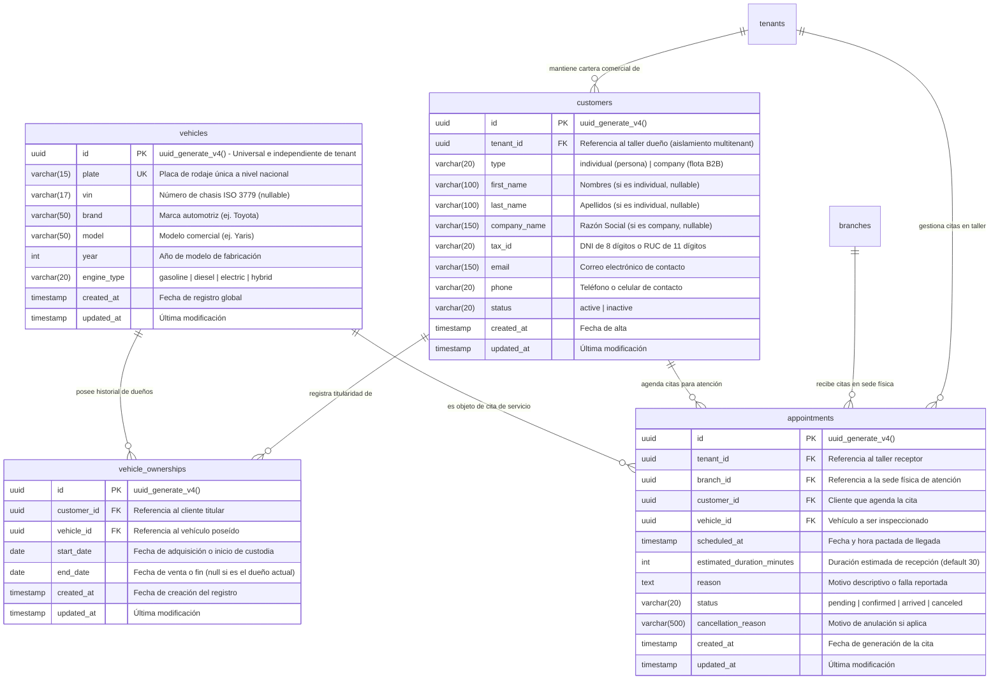

## 5. Fase 2: Bounded Context 2 — Customer & Fleet Management Context (CRM) (`com.andeva.atelier.platform.crm`)

### 5.1. Diccionario y Propósito del Contexto

#### 5.1.1. Propósito y Límites de Responsabilidad
El **Customer & Fleet Management Context (CRM)** centraliza la gestión comercial, la administración de la cartera de clientes, el registro universal del parque automotor y el agendamiento de citas de servicio técnico. Sus responsabilidades fundamentales son:
1. **Gestión Integral de Clientes (B2C y B2B):** Modelar las fichas comerciales de clientes particulares (`Customer` de tipo `INDIVIDUAL`) y de empresas propietarias de flotas automotrices (`Customer` de tipo `COMPANY`). Los clientes están estrictamente aislados por taller (`TenantId`), garantizando la confidencialidad de la cartera comercial de cada taller mecánico.
2. **Parque Automotor Universal e Independiente del Inquilino (`Vehicle`):** A diferencia de los clientes, los vehículos constituyen entidades universales independientes del `TenantId`. Un automóvil (definido unívocamente por su placa de rodaje `LicensePlate` y su número de chasis `Vin`) existe en el mundo físico y puede visitar distintos talleres de la red Atelier a lo largo de su vida útil. Esto permite consolidar una **hoja clínica automotriz histórica global** que acompaña al automóvil independientemente de qué taller realice el mantenimiento.
3. **Trazabilidad Histórica de Propiedad (`VehicleOwnership`):** Gestionar la cadena de custodia y propiedad de los vehículos mediante registros fechados (`start_date`, `end_date`), permitiendo traspasos de dominio (ej. venta de una flota comercial a un particular o compraventa de segunda mano) sin corromper ni duplicar los historiales mecánicos previos.
4. **Agendamiento y Orquestación de Citas de Taller (`Appointment`):** Administrar las solicitudes de servicio previas al ingreso al taller, coordinando fechas, sedes físicas (`BranchId`) y motivos de revisión. La cita actúa como el disparador comercial del taller: al transicionar a estado `ARRIVED`, habilita la generación de la Orden de Trabajo (`WorkOrder`) en el contexto operativo (*Workshop Operations*).

#### 5.1.2. Decisiones de Diseño e Integraciones Críticas
* **Sincronización Bidireccional con Atelier Driver:** Los clientes particulares y administradores de flota interactúan mediante la aplicación móvil **Atelier Driver**. La confirmación, recordatorio y reprogramación de citas se notifican instantáneamente mediante notificaciones push despachadas vía **Firebase Cloud Messaging (FCM)**.
* **Geocodificación con Google Places API:** Para empresas de transporte y flotas B2B, la captura de domicilios fiscales y patios de maniobras se asiste mediante la API de **Google Places**, normalizando direcciones y resolviendo coordenadas geográficas.
* **Fachada de Dominio Abierta (Inbound ACL / OHS):** IAM y CRM no comparten repositorios. CRM expone `CustomerFleetContextFacade` para que *Workshop Operations* resuelva los datos del vehículo y propietario al aperturar una orden de trabajo, e *Invoicing* obtenga el RUC/DNI y razón social para comprobantes SUNAT.

---

### 5.2. 2.6.2.1. Domain Layer

#### 5.2.1. Aggregates & Aggregate Roots

##### 1. `Customer` (Aggregate Root)
* **Paquete:** `com.andeva.atelier.platform.crm.domain.model.aggregates`
* **Herencia:** Extiende `AbstractDomainAggregateRoot<Customer>`
* **Propósito:** Representa a la persona natural o jurídica titular de una cuenta de cliente dentro de la cartera comercial de un taller específico.
* **Atributos:**
  * `id: CustomerId` — Identificador universal del cliente (UUID).
  * `tenantId: TenantId` — Taller mecánico al que pertenece la ficha comercial.
  * `type: CustomerType` — Naturaleza jurídica del cliente (`INDIVIDUAL` para particulares, `COMPANY` para empresas/flotas).
  * `name: PersonName` — Nombres y apellidos (obligatorio si `type == INDIVIDUAL`, nulo si `type == COMPANY`).
  * `companyName: String` — Razón social o denominación comercial (obligatorio si `type == COMPANY`, nulo si `type == INDIVIDUAL`).
  * `taxId: TaxId` — Documento de identidad tributaria (DNI de 8 dígitos para persona natural o RUC de 11 dígitos para empresa/persona jurídica).
  * `email: EmailAddress` — Correo electrónico de contacto y notificaciones comerciales.
  * `phone: PhoneNumber` — Teléfono o celular de contacto.
  * `status: CustomerStatus` — Estado de la ficha comercial (`ACTIVE`, `INACTIVE`).
* **Invariantes y Reglas de Negocio:**
  * Si `type == INDIVIDUAL`, el atributo `name` no puede ser nulo y el `companyName` debe ser nulo.
  * Si `type == COMPANY`, el atributo `companyName` no puede ser nulo ni vacío y el `name` debe ser nulo.
  * El `taxId` es obligatorio y debe corresponder a un DNI o RUC peruano válido.
  * La tupla `(tenantId, taxId)` es única en el sistema (un cliente no puede duplicarse dentro del mismo taller).
  * Al menos uno entre `email` o `phone` debe estar provisto para asegurar un canal de contacto.
* **Métodos:**
  * `+ static Customer registerIndividual(TenantId tenantId, PersonName name, TaxId taxId, EmailAddress email, PhoneNumber phone): Customer`: Factoría de dominio para personas naturales; registra `CustomerRegisteredEvent`.
  * `+ static Customer registerCompany(TenantId tenantId, String companyName, TaxId taxId, EmailAddress email, PhoneNumber phone): Customer`: Factoría de dominio para flotas corporativas; registra `CustomerRegisteredEvent`.
  * `+ void updateContact(EmailAddress newEmail, PhoneNumber newPhone): void`: Actualiza los canales de contacto del cliente.
  * `+ void updateProfile(PersonName newName): void`: Actualiza el nombre de la persona natural (solo válido para `INDIVIDUAL`).
  * `+ void updateCompanyDetails(String newCompanyName): void`: Actualiza la razón social de la empresa (solo válido para `COMPANY`).
  * `+ void activate(): void`: Transiciona el estado a `ACTIVE`.
  * `+ void deactivate(): void`: Marca la ficha comercial como `INACTIVE`.
  * `+ String getDisplayName(): String`: Retorna el nombre comercial o nombre completo según el tipo.

##### 2. `Vehicle` (Aggregate Root)
* **Paquete:** `com.andeva.atelier.platform.crm.domain.model.aggregates`
* **Herencia:** Extiende `AbstractDomainAggregateRoot<Vehicle>`
* **Propósito:** Representa la unidad automotriz física. Es una entidad global e independiente del `tenantId` que consolida la historia técnica y la cadena de custodia del vehículo.
* **Atributos:**
  * `id: VehicleId` — Identificador universal del vehículo (UUID).
  * `plate: LicensePlate` — Placa de rodaje única a nivel nacional (ej. "ABC-123").
  * `vin: Vin` — Número de Identificación Vehicular / Número de Chasis (17 caracteres alfanuméricos ISO 3779, nullable).
  * `brand: String` — Marca del vehículo (ej. Toyota, Hyundai, Nissan).
  * `model: String` — Modelo comercial (ej. Yaris, Tucson, Sentra).
  * `year: int` — Año del modelo de fabricación (ej. 2022).
  * `engineType: EngineType` — Tipo de motorización (`GASOLINE`, `DIESEL`, `ELECTRIC`, `HYBRID`).
  * `ownershipHistory: List<VehicleOwnership>` — Colección histórica de propietarios que han poseído este vehículo.
* **Invariantes y Reglas de Negocio:**
  * La placa `plate` es obligatoria, única globalmente y se almacena normalizada en mayúsculas sin guiones ni caracteres especiales.
  * El año `year` debe situarse entre `1950` y el año actual más uno (`Year.now().getValue() + 1`).
  * La marca `brand` y modelo `model` no pueden ser cadenas vacías.
  * Solo puede existir **exactamente un registro activo** en `ownershipHistory` con `endDate == null`.
* **Métodos:**
  * `+ static Vehicle register(LicensePlate plate, Vin vin, String brand, String model, int year, EngineType engineType, CustomerId initialOwnerId): Vehicle`: Factoría de dominio que crea el vehículo, inicializa su primer registro de propiedad activo y registra `VehicleRegisteredEvent`.
  * `+ VehicleOwnership transferOwnership(CustomerId newOwnerId, LocalDate transferDate): VehicleOwnership`: Cierra el registro de propiedad activo actual fijando su `endDate = transferDate`, añade un nuevo `VehicleOwnership` con `startDate = transferDate` y registra `VehicleOwnershipTransferredEvent`.
  * `+ Optional<VehicleOwnership> getActiveOwnership(): Optional<VehicleOwnership>`: Retorna el registro de titularidad vigente.
  * `+ Optional<CustomerId> getCurrentOwnerId(): Optional<CustomerId>`: Retorna el identificador del cliente dueño actual.
  * `+ void updateTechnicalDetails(Vin newVin, EngineType newEngineType): void`: Actualiza especificaciones técnicas del vehículo.

##### 3. `Appointment` (Aggregate Root)
* **Paquete:** `com.andeva.atelier.platform.crm.domain.model.aggregates`
* **Herencia:** Extiende `AbstractDomainAggregateRoot<Appointment>`
* **Propósito:** Modela la reserva o cita previa agendada por el cliente o recepcionista para la atención automotriz en una sucursal física determinada.
* **Atributos:**
  * `id: AppointmentId` — Identificador universal de la cita (UUID).
  * `tenantId: TenantId` — Taller receptor de la cita.
  * `branchId: BranchId` — Sede física donde se llevará a cabo la revisión.
  * `customerId: CustomerId` — Cliente titular que solicita la atención.
  * `vehicleId: VehicleId` — Vehículo objeto del servicio técnico.
  * `scheduledAt: Instant` — Fecha y hora pactada para la recepción del vehículo.
  * `estimatedDurationMinutes: int` — Tiempo estimado de recepción e inspección inicial (default: 30 minutos).
  * `reason: String` — Motivo descriptivo de la cita (ej. "Mantenimiento preventivo 10,000 km", "Ruido en tren delantero", "Alerta predictiva OBD2 de sobrecalentamiento").
  * `status: AppointmentStatus` — Estado del ciclo de vida de la cita (`PENDING`, `CONFIRMED`, `ARRIVED`, `CANCELED`).
  * `cancellationReason: String` — Justificación en caso de anulación (nullable).
* **Invariantes y Reglas de Negocio:**
  * Al crearse, la fecha `scheduledAt` debe ser posterior al instante actual (`scheduledAt.isAfter(Instant.now())`).
  * No se puede cancelar una cita que ya se encuentre en estado `ARRIVED`.
  * Una cita en estado `CANCELED` no puede volver a transicionar a `CONFIRMED` ni `ARRIVED`.
  * La transición a `ARRIVED` marca la llegada física del auto al taller y constituye el prerrequisito para que el módulo de *Workshop Operations* genere una Orden de Trabajo (`WorkOrder`).
* **Métodos:**
  * `+ static Appointment schedule(TenantId tenantId, BranchId branchId, CustomerId customerId, VehicleId vehicleId, Instant scheduledAt, int estimatedDurationMinutes, String reason): Appointment`: Factoría de dominio en estado inicial `PENDING` que registra `AppointmentScheduledEvent`.
  * `+ void confirm(): void`: Transiciona el estado a `CONFIRMED` y registra `AppointmentConfirmedEvent`.
  * `+ void markArrived(): void`: Registra el arribo físico del cliente al taller (`ARRIVED`) y dispara `AppointmentArrivedEvent`.
  * `+ void cancel(String reason): void`: Anula la cita registrando el motivo y dispara `AppointmentCanceledEvent`.
  * `+ void reschedule(Instant newScheduledAt): void`: Modifica la fecha pactada (siempre que esté en estado `PENDING` o `CONFIRMED`) y registra `AppointmentRescheduledEvent`.

---

#### 5.2.2. Entities

##### 1. `VehicleOwnership` (Entidad Dependiente de `Vehicle`)
* **Paquete:** `com.andeva.atelier.platform.crm.domain.model.entities`
* **Propósito:** Modela el vínculo de titularidad y custodia entre un `Customer` y un `Vehicle` en un intervalo de tiempo específico.
* **Atributos:**
  * `id: VehicleOwnershipId` — Identificador de la relación (UUID).
  * `vehicleId: VehicleId` — Vehículo en cuestión.
  * `customerId: CustomerId` — Cliente propietario.
  * `startDate: LocalDate` — Fecha de adquisición o inicio de custodia en el taller.
  * `endDate: LocalDate` — Fecha de enajenación o fin de custodia (`null` si es el propietario actual).
* **Métodos:**
  * `+ boolean isCurrent(): boolean`: Retorna `true` si `endDate == null`.
  * `+ void terminate(LocalDate terminationDate): void`: Fija la fecha de finalización de propiedad garantizando que sea posterior a `startDate`.

---

#### 5.2.3. Value Objects

Java Records inmutables con validación estricta en su constructor compacto:

* **`CustomerId(UUID value)`:** Identificador tipado de cliente. Valida `Objects.requireNonNull(value)`.
* **`VehicleId(UUID value)`:** Identificador tipado de vehículo. Valida `Objects.requireNonNull(value)`.
* **`VehicleOwnershipId(UUID value)`:** Identificador tipado del vínculo de titularidad. Valida `Objects.requireNonNull(value)`.
* **`AppointmentId(UUID value)`:** Identificador tipado de cita de taller. Valida `Objects.requireNonNull(value)`.
* **`LicensePlate(String value)`:** Encapsula la placa de rodaje vehicular. Normaliza eliminando guiones y espacios, convirtiendo a mayúsculas. Valida formatos peruanos tradicionales (ej. `ABC-123`, `A1B-234`) y de motocicletas/remolques.
* **`Vin(String value)`:** Vehicle Identification Number conforme al estándar internacional ISO 3779 (17 caracteres alfanuméricos en mayúsculas, excluyendo letras confusas `I`, `O`, `Q`).
* **`CustomerType` (Enum):** `INDIVIDUAL`, `COMPANY`.
* **`CustomerStatus` (Enum):** `ACTIVE`, `INACTIVE`.
* **`EngineType` (Enum):** `GASOLINE`, `DIESEL`, `ELECTRIC`, `HYBRID`.
* **`AppointmentStatus` (Enum):** `PENDING`, `CONFIRMED`, `ARRIVED`, `CANCELED`.

---

#### 5.2.4. Domain Commands

Comandos inmutables que encapsulan casos de uso de escritura:

* `RegisterIndividualCustomerCommand(TenantId tenantId, String firstName, String lastName, String taxId, String email, String phone)`
* `RegisterCompanyCustomerCommand(TenantId tenantId, String companyName, String taxId, String email, String phone)`
* `UpdateCustomerContactCommand(CustomerId customerId, String email, String phone)`
* `RegisterVehicleCommand(String plate, String vin, String brand, String model, int year, EngineType engineType, CustomerId initialOwnerId)`
* `TransferVehicleOwnershipCommand(VehicleId vehicleId, CustomerId newOwnerId, LocalDate transferDate)`
* `ScheduleAppointmentCommand(TenantId tenantId, BranchId branchId, CustomerId customerId, VehicleId vehicleId, Instant scheduledAt, int estimatedDurationMinutes, String reason)`
* `ConfirmAppointmentCommand(AppointmentId appointmentId)`
* `MarkAppointmentArrivedCommand(AppointmentId appointmentId)`
* `CancelAppointmentCommand(AppointmentId appointmentId, String cancellationReason)`
* `RescheduleAppointmentCommand(AppointmentId appointmentId, Instant newScheduledAt)`

---

#### 5.2.5. Domain Queries

Consultas de lectura inmutables para CRM:

* `GetCustomerByIdQuery(CustomerId customerId)`
* `GetCustomersByTenantIdQuery(TenantId tenantId)`
* `GetCustomerByTaxIdQuery(TenantId tenantId, TaxId taxId)`
* `GetVehicleByIdQuery(VehicleId vehicleId)`
* `GetVehicleByPlateQuery(LicensePlate plate)`
* `GetVehiclesByCustomerIdQuery(CustomerId customerId)`
* `GetAppointmentByIdQuery(AppointmentId appointmentId)`
* `GetAppointmentsByTenantAndBranchQuery(TenantId tenantId, BranchId branchId, LocalDate date)`
* `GetAppointmentsByCustomerQuery(CustomerId customerId)`
* `GetAppointmentsByVehicleQuery(VehicleId vehicleId)`

---

#### 5.2.6. Domain Events

Eventos atómicos que registran hechos consumados dentro del dominio CRM:

* `CustomerRegisteredEvent(CustomerId customerId, TenantId tenantId, CustomerType type, String displayName, TaxId taxId, Instant occurredOn)`
* `VehicleRegisteredEvent(VehicleId vehicleId, LicensePlate plate, CustomerId initialOwnerId, Instant occurredOn)`
* `VehicleOwnershipTransferredEvent(VehicleId vehicleId, CustomerId previousOwnerId, CustomerId newOwnerId, LocalDate transferDate, Instant occurredOn)`
* `AppointmentScheduledEvent(AppointmentId appointmentId, TenantId tenantId, BranchId branchId, CustomerId customerId, VehicleId vehicleId, Instant scheduledAt, Instant occurredOn)`
* `AppointmentConfirmedEvent(AppointmentId appointmentId, CustomerId customerId, Instant scheduledAt, Instant occurredOn)`
* `AppointmentArrivedEvent(AppointmentId appointmentId, TenantId tenantId, CustomerId customerId, VehicleId vehicleId, Instant occurredOn)`
* `AppointmentCanceledEvent(AppointmentId appointmentId, String cancellationReason, Instant occurredOn)`
* `AppointmentRescheduledEvent(AppointmentId appointmentId, Instant newScheduledAt, Instant occurredOn)`

---

#### 5.2.7. Repositories (Interfaces de Dominio)

Puertos de salida de persistencia puros:

* **`CustomerRepository`:**
  * `Customer save(Customer customer)`
  * `Optional<Customer> findById(CustomerId id)`
  * `Optional<Customer> findByTenantIdAndTaxId(TenantId tenantId, TaxId taxId)`
  * `List<Customer> findByTenantId(TenantId tenantId)`
  * `boolean existsByTenantIdAndTaxId(TenantId tenantId, TaxId taxId)`
* **`VehicleRepository`:**
  * `Vehicle save(Vehicle vehicle)`
  * `Optional<Vehicle> findById(VehicleId id)`
  * `Optional<Vehicle> findByPlate(LicensePlate plate)`
  * `boolean existsByPlate(LicensePlate plate)`
  * `List<Vehicle> findByCurrentOwnerId(CustomerId customerId)`
* **`VehicleOwnershipRepository`:**
  * `VehicleOwnership save(VehicleOwnership ownership)`
  * `List<VehicleOwnership> findByVehicleId(VehicleId vehicleId)`
  * `Optional<VehicleOwnership> findActiveOwnershipByVehicleId(VehicleId vehicleId)`
* **`AppointmentRepository`:**
  * `Appointment save(Appointment appointment)`
  * `Optional<Appointment> findById(AppointmentId id)`
  * `List<Appointment> findByTenantIdAndBranchIdAndDate(TenantId tenantId, BranchId branchId, Instant startOfDay, Instant endOfDay)`
  * `List<Appointment> findByCustomerId(CustomerId customerId)`
  * `List<Appointment> findByVehicleId(VehicleId vehicleId)`

---

### 5.3. 2.6.2.2. Interface Layer

#### 5.3.1. REST Controllers

##### 1. `CustomersController`
* **Ruta Base:** `/api/v1/customers`
* **Propósito:** Gestión integral de la cartera de clientes de un taller mecánico.
* **Endpoints:**
  * `POST /individual`: Registro de cliente persona natural. Recibe `CreateIndividualCustomerResource`, retorna `CustomerResource` (HTTP 201 Created).
  * `POST /company`: Registro de cliente corporativo / empresa de flota. Recibe `CreateCompanyCustomerResource`, retorna `CustomerResource` (HTTP 201 Created).
  * `GET`: Listado de clientes adscritos al taller autenticado (`tenant_id`). Retorna `List<CustomerResource>` (HTTP 200 OK).
  * `GET /{customerId}`: Detalle de cliente por ID. Retorna `CustomerResource` (HTTP 200 OK / 404 Not Found).
  * `PUT /{customerId}/contact`: Actualización de teléfono y email. Recibe `UpdateCustomerContactResource`, retorna `CustomerResource` (HTTP 200 OK).
  * `GET /{customerId}/vehicles`: Lista de vehículos actualmente bajo titularidad del cliente. Retorna `List<VehicleResource>` (HTTP 200 OK).

##### 2. `VehiclesController`
* **Ruta Base:** `/api/v1/vehicles`
* **Propósito:** Registro y consulta del parque automotor universal.
* **Endpoints:**
  * `POST`: Alta de nuevo vehículo en el catálogo global vinculándolo a su dueño inicial. Recibe `CreateVehicleResource`, retorna `VehicleResource` (HTTP 201 Created).
  * `GET /{vehicleId}`: Consulta técnica del vehículo por ID. Retorna `VehicleResource` (HTTP 200 OK / 404 Not Found).
  * `GET /plate/{plate}`: Búsqueda rápida por placa de rodaje. Retorna `VehicleResource` (HTTP 200 OK / 404 Not Found).
  * `POST /{vehicleId}/transfer`: Traspaso formal de propiedad a otro cliente. Recibe `TransferVehicleResource`, retorna `VehicleResource` (HTTP 200 OK).
  * `GET /{vehicleId}/ownership-history`: Historial completo de propietarios pasados y presente. Retorna `List<VehicleOwnershipResource>` (HTTP 200 OK).

##### 3. `AppointmentsController`
* **Ruta Base:** `/api/v1/appointments`
* **Propósito:** Agendamiento y ciclo de vida de citas previas.
* **Endpoints:**
  * `POST`: Creación de nueva cita. Recibe `ScheduleAppointmentResource`, retorna `AppointmentResource` (HTTP 201 Created).
  * `GET`: Búsqueda de citas filtradas por sucursal y fecha. Retorna `List<AppointmentResource>` (HTTP 200 OK).
  * `GET /{appointmentId}`: Detalle individual de la cita. Retorna `AppointmentResource` (HTTP 200 OK).
  * `PUT /{appointmentId}/confirm`: Confirmación de cita por parte del taller. Retorna `AppointmentResource` (HTTP 200 OK).
  * `PUT /{appointmentId}/arrived`: Registro de arribo físico del automóvil a recepción. Retorna `AppointmentResource` (HTTP 200 OK).
  * `PUT /{appointmentId}/reschedule`: Modificación de fecha y hora pactada. Recibe `RescheduleAppointmentResource`, retorna `AppointmentResource` (HTTP 200 OK).
  * `PUT /{appointmentId}/cancel`: Cancelación con justificación. Recibe `CancelAppointmentResource`, retorna `AppointmentResource` (HTTP 200 OK).

---

#### 5.3.2. Resources / DTOs

* **Peticiones (Requests):**
  * `CreateIndividualCustomerResource(String firstName, String lastName, String taxId, String email, String phone)`
  * `CreateCompanyCustomerResource(String companyName, String taxId, String email, String phone)`
  * `UpdateCustomerContactResource(String email, String phone)`
  * `CreateVehicleResource(String plate, String vin, String brand, String model, int year, String engineType, UUID initialOwnerId)`
  * `TransferVehicleResource(UUID newOwnerId, LocalDate transferDate)`
  * `ScheduleAppointmentResource(UUID branchId, UUID customerId, UUID vehicleId, Instant scheduledAt, int estimatedDurationMinutes, String reason)`
  * `RescheduleAppointmentResource(Instant newScheduledAt)`
  * `CancelAppointmentResource(String reason)`
* **Respuestas (Responses):**
  * `CustomerResource(UUID id, UUID tenantId, String type, String displayName, String taxId, String email, String phone, String status)`
  * `VehicleResource(UUID id, String plate, String vin, String brand, String model, int year, String engineType, UUID currentOwnerId, String currentOwnerName)`
  * `VehicleOwnershipResource(UUID id, UUID vehicleId, UUID customerId, String ownerName, LocalDate startDate, LocalDate endDate, boolean isCurrent)`
  * `AppointmentResource(UUID id, UUID tenantId, UUID branchId, UUID customerId, String customerName, UUID vehicleId, String vehiclePlate, Instant scheduledAt, int estimatedDurationMinutes, String reason, String status)`

---

#### 5.3.3. Resource Assemblers

* `CustomerResourceAssembler`: Mapea `Customer` a `CustomerResource`.
* `VehicleResourceAssembler`: Mapea `Vehicle` y su dueño resuelto a `VehicleResource`.
* `AppointmentResourceAssembler`: Mapea `Appointment` a `AppointmentResource`.
* `CreateCustomerCommandFromResourceAssembler`: Transforma recursos HTTP en comandos inmutables de dominio.

---

#### 5.3.4. Open Host Service (OHS) / Inbound ACL Facade

Interfaz pública en `com.andeva.atelier.platform.crm.interfaces.acl`:

```java
package com.andeva.atelier.platform.crm.interfaces.acl;

import java.util.Optional;
import java.util.UUID;

public interface CustomerFleetContextFacade {
    Optional<CustomerAclDto> fetchCustomerById(UUID customerId);
    Optional<VehicleAclDto> fetchVehicleById(UUID vehicleId);
    Optional<VehicleAclDto> fetchVehicleByPlate(String plate);
    Optional<UUID> fetchCurrentOwnerId(UUID vehicleId);
    Optional<AppointmentAclDto> fetchAppointmentById(UUID appointmentId);
    boolean markAppointmentAsConvertedToWorkOrder(UUID appointmentId);
}
```

*DTOs Exportados por la Fachada:*
* `CustomerAclDto(UUID id, UUID tenantId, String displayName, String taxId, String email, String phone)`
* `VehicleAclDto(UUID id, String plate, String vin, String brand, String model, int year, String engineType, UUID currentOwnerId)`
* `AppointmentAclDto(UUID id, UUID tenantId, UUID branchId, UUID customerId, UUID vehicleId, String scheduledAt, String status)`

---

#### 5.3.5. Integration Events (Published Language)

* `CustomerCreatedIntegrationEvent(UUID customerId, UUID tenantId, String displayName, String taxId, Instant occurredOn)`: Notifica a *Invoicing* para pre-cargar datos fiscales de facturación.
* `VehicleRegisteredIntegrationEvent(UUID vehicleId, String plate, String vin, UUID ownerId, Instant occurredOn)`: Notifica a *IoT Telemetry* para habilitar la vinculación de dispositivos OBD2.
* `VehicleOwnershipTransferredIntegrationEvent(UUID vehicleId, UUID previousOwnerId, UUID newOwnerId, Instant occurredOn)`: Notifica a *IoT Telemetry* para reasignar la visualización telemétrica al nuevo usuario en Atelier Driver.
* `AppointmentScheduledIntegrationEvent(UUID appointmentId, UUID tenantId, UUID branchId, UUID customerId, UUID vehicleId, Instant scheduledAt, Instant occurredOn)`: Notifica a *Workshop Operations* para prever capacidad en bahías.
* `AppointmentArrivedIntegrationEvent(UUID appointmentId, UUID tenantId, UUID branchId, UUID customerId, UUID vehicleId, Instant occurredOn)`: Desencadena en *Workshop Operations* la apertura de la Orden de Trabajo de recepción.

---

### 5.4. 2.6.2.3. Application Layer

#### 5.4.1. Command Services & Implementations

##### 1. `CustomerCommandService` & `CustomerCommandServiceImpl`
* `Result<Customer, ApplicationError> handle(RegisterIndividualCustomerCommand command)`:
  1. Valida unicidad de `(tenantId, taxId)` mediante `CustomerRepository.existsByTenantIdAndTaxId`.
  2. Valida formato de DNI/RUC.
  3. Instancia el agregado `Customer` vía factoría estática `registerIndividual`.
  4. Persiste el cliente y retorna `Result.success(customer)`.
* `Result<Customer, ApplicationError> handle(RegisterCompanyCustomerCommand command)`: Registra empresa corporativa con validación de RUC 11 dígitos y persiste el cliente.
* `Result<Customer, ApplicationError> handle(UpdateCustomerContactCommand command)`: Actualiza correo y teléfono del cliente.

##### 2. `VehicleCommandService` & `VehicleCommandServiceImpl`
* `Result<Vehicle, ApplicationError> handle(RegisterVehicleCommand command)`:
  1. Valida que la placa `plate` no exista previamente en la plataforma global (`VehicleRepository.existsByPlate`).
  2. Verifica que el `initialOwnerId` corresponda a un cliente existente.
  3. Instancia el agregado `Vehicle` con su primer `VehicleOwnership`.
  4. Persiste el agregado y retorna `Result.success(vehicle)`.
* `Result<Vehicle, ApplicationError> handle(TransferVehicleOwnershipCommand command)`:
  1. Localiza el vehículo por ID.
  2. Ejecuta el método de dominio `vehicle.transferOwnership(newOwnerId, transferDate)`.
  3. Persiste el vehículo con el historial actualizado.

##### 3. `AppointmentCommandService` & `AppointmentCommandServiceImpl`
* `Result<Appointment, ApplicationError> handle(ScheduleAppointmentCommand command)`:
  1. Valida la existencia del cliente y del vehículo.
  2. Valida que la fecha y hora sean futuras.
  3. Instancia la cita en estado `PENDING`.
  4. Persiste y retorna `Result.success(appointment)`.
* `Result<Appointment, ApplicationError> handle(ConfirmAppointmentCommand command)`: Transiciona la cita a `CONFIRMED` y dispara notificación push al conductor vía FCM.
* `Result<Appointment, ApplicationError> handle(MarkAppointmentArrivedCommand command)`: Marca la llegada física del cliente (`ARRIVED`) y publica `AppointmentArrivedEvent`.
* `Result<Appointment, ApplicationError> handle(CancelAppointmentCommand command)`: Cancela la cita con el motivo indicado.
* `Result<Appointment, ApplicationError> handle(RescheduleAppointmentCommand command)`: Reprograma fecha pactada.

---

#### 5.4.2. Query Services & Implementations

* **`CustomerQueryService` & `CustomerQueryServiceImpl`:**
  * `Optional<Customer> handle(GetCustomerByIdQuery query)`
  * `List<Customer> handle(GetCustomersByTenantIdQuery query)`
  * `Optional<Customer> handle(GetCustomerByTaxIdQuery query)`
* **`VehicleQueryService` & `VehicleQueryServiceImpl`:**
  * `Optional<Vehicle> handle(GetVehicleByIdQuery query)`
  * `Optional<Vehicle> handle(GetVehicleByPlateQuery query)`
  * `List<Vehicle> handle(GetVehiclesByCustomerIdQuery query)`
* **`AppointmentQueryService` & `AppointmentQueryServiceImpl`:**
  * `Optional<Appointment> handle(GetAppointmentByIdQuery query)`
  * `List<Appointment> handle(GetAppointmentsByTenantAndBranchQuery query)`
  * `List<Appointment> handle(GetAppointmentsByCustomerQuery query)`

---

#### 5.4.3. Event Handlers & Listeners

* **`AppointmentDomainEventsHandler`:**
  * `@EventListener void on(AppointmentConfirmedEvent event)`: Invoca al cliente FCM para enviar notificación push al smartphone del cliente indicando fecha y dirección de la sede.
  * `@EventListener void on(AppointmentCanceledEvent event)`: Notifica al conductor sobre la cancelación de la cita.
  * `@TransactionalEventListener void on(AppointmentArrivedEvent event)`: Publica `AppointmentArrivedIntegrationEvent` al bus de eventos de Spring para que *Workshop Operations* cree el borrador de la Orden de Trabajo.

---

#### 5.4.4. Outbound ACL Services

* **`PlacesAddressVerificationGateway`:** Invoca Google Places API para validar direcciones físicas de clientes y sedes de flotas.
* **`DriverAppPushGateway`:** Despacha notificaciones push móviles hacia **Atelier Driver** mediante Firebase Cloud Messaging (FCM).

---

### 5.5. 2.6.2.4. Infrastructure Layer

#### 5.5.1. JPA Persistence Entities

Ubicadas en `com.andeva.atelier.platform.crm.infrastructure.persistence.jpa.entities`:

##### 1. `CustomerPersistenceEntity` (Tabla `customers`)
* Extiende `AuditableAbstractPersistenceEntity`.
* `@Column(name = "tenant_id", nullable = false)`: Referencia al taller dueño de la ficha comercial.
* `@Column(name = "type", nullable = false, length = 20)`: `individual`, `company`.
* `@Column(name = "first_name", length = 100)`: Nombres.
* `@Column(name = "last_name", length = 100)`: Apellidos.
* `@Column(name = "company_name", length = 150)`: Razón social.
* `@Column(name = "tax_id", nullable = false, length = 20)`: DNI o RUC.
* `@Column(name = "email", length = 150)`: Correo de contacto.
* `@Column(name = "phone", length = 20)`: Teléfono de contacto.
* `@Column(name = "status", nullable = false, length = 20)`: `active`, `inactive`.

##### 2. `VehiclePersistenceEntity` (Tabla `vehicles`)
* Extiende `AuditableAbstractPersistenceEntity`.
* `@Column(name = "plate", nullable = false, unique = true, length = 15)`: Placa de rodaje normalizada.
* `@Column(name = "vin", length = 17)`: Número de chasis ISO 3779.
* `@Column(name = "brand", nullable = false, length = 50)`: Marca.
* `@Column(name = "model", nullable = false, length = 50)`: Modelo.
* `@Column(name = "year", nullable = false)`: Año de fabricación.
* `@Column(name = "engine_type", nullable = false, length = 20)`: `gasoline`, `diesel`, `electric`, `hybrid`.
* `@OneToMany(mappedBy = "vehicle", cascade = CascadeType.ALL, orphanRemoval = true)`: Historial de propiedad.

##### 3. `VehicleOwnershipPersistenceEntity` (Tabla `vehicle_ownerships`)
* Extiende `AuditableAbstractPersistenceEntity`.
* `@ManyToOne(fetch = FetchType.LAZY) @JoinColumn(name = "vehicle_id", nullable = false)`: Vehículo asociado.
* `@Column(name = "customer_id", nullable = false)`: Cliente propietario.
* `@Column(name = "start_date", nullable = false)`: Fecha de inicio de titularidad.
* `@Column(name = "end_date")`: Fecha de finalización (`null` si es el propietario actual).

##### 4. `AppointmentPersistenceEntity` (Tabla `appointments`)
* Extiende `AuditableAbstractPersistenceEntity`.
* `@Column(name = "tenant_id", nullable = false)`: Taller receptor.
* `@Column(name = "branch_id", nullable = false)`: Sede física.
* `@Column(name = "customer_id", nullable = false)`: Cliente.
* `@Column(name = "vehicle_id", nullable = false)`: Vehículo.
* `@Column(name = "scheduled_at", nullable = false)`: Fecha y hora programada.
* `@Column(name = "estimated_duration_minutes", nullable = false)`: Minutos estimados.
* `@Column(name = "reason", length = 2000)`: Motivo de la cita.
* `@Column(name = "status", nullable = false, length = 20)`: `pending`, `confirmed`, `arrived`, `canceled`.
* `@Column(name = "cancellation_reason", length = 500)`: Justificación de anulación.

---

#### 5.5.2. JPA Persistence Repositories

* `CustomerPersistenceRepository extends JpaRepository<CustomerPersistenceEntity, UUID>`
* `VehiclePersistenceRepository extends JpaRepository<VehiclePersistenceEntity, UUID>`
* `VehicleOwnershipPersistenceRepository extends JpaRepository<VehicleOwnershipPersistenceEntity, UUID>`
* `AppointmentPersistenceRepository extends JpaRepository<AppointmentPersistenceEntity, UUID>`

---

#### 5.5.3. JPA Adapters (`*RepositoryImpl`)

* `CustomerRepositoryImpl implements CustomerRepository`
* `VehicleRepositoryImpl implements VehicleRepository`
* `VehicleOwnershipRepositoryImpl implements VehicleOwnershipRepository`
* `AppointmentRepositoryImpl implements AppointmentRepository`

---

#### 5.5.4. Persistence Assemblers

* `CustomerPersistenceAssembler`: Transforma `Customer` <-> `CustomerPersistenceEntity`.
* `VehiclePersistenceAssembler`: Transforma `Vehicle` <-> `VehiclePersistenceEntity`.
* `VehicleOwnershipPersistenceAssembler`: Transforma `VehicleOwnership` <-> `VehicleOwnershipPersistenceEntity`.
* `AppointmentPersistenceAssembler`: Transforma `Appointment` <-> `AppointmentPersistenceEntity`.

---

#### 5.5.5. JPA Converters

* `LicensePlateAttributeConverter`: Convierte `LicensePlate` a `varchar(15)`.
* `VinAttributeConverter`: Convierte `Vin` a `varchar(17)`.
* `CustomerTypeAttributeConverter`: Convierte `CustomerType` a `varchar(20)`.
* `EngineTypeAttributeConverter`: Convierte `EngineType` a `varchar(20)`.
* `AppointmentStatusAttributeConverter`: Convierte `AppointmentStatus` a `varchar(20)`.

---

#### 5.5.6. Pasarelas Externas de Infraestructura

##### 1. `GooglePlacesClient` (Google Maps Places API)
* Paquete: `com.andeva.atelier.platform.crm.infrastructure.external.places`
* Invoca la API REST de Google Places vía HTTPS con API Key para validación de direcciones de flotas comerciales B2B y cálculo de geocodificación inversa.

##### 2. `DriverAppFcmClient` (Firebase Cloud Messaging Gateway)
* Paquete: `com.andeva.atelier.platform.crm.infrastructure.external.fcm`
* Emplea el SDK oficial de **Firebase Admin** para despachar tramas push seguras hacia dispositivos móviles Android/iOS donde corre **Atelier Driver**. Notifica confirmación de citas y recordatorios 24 horas antes de la llegada al taller.

---

### 5.6. 2.6.2.5. Bounded Context Software Architecture Component Level Diagram

El siguiente diagrama en modelo **C4 Component (Nivel 3)** ilustra la descomposición interna del contenedor Backend (`API Application`) para el **Customer & Fleet Management Context (CRM)**:

```mermaid
C4Component
    title Component Diagram - Customer & Fleet Management Context (API Application Container)

    Container_Boundary(b1, "Customer & Fleet Module (com.andeva.atelier.platform.crm)") {
        
        Component(custCtrl, "CustomersController", "Spring REST Controller", "Expone endpoints para registro y gestión de clientes particulares y flotas B2B.")
        Component(vehCtrl, "VehiclesController", "Spring REST Controller", "Expone endpoints para parque automotor universal, consultas y traspasos de dominio.")
        Component(apptCtrl, "AppointmentsController", "Spring REST Controller", "Expone endpoints para agendamiento, confirmación y arribo de citas.")

        Component(custCmdService, "CustomerCommandService", "Spring Application Service", "Orquesta alta y actualización de clientes particulares y corporativos.")
        Component(vehCmdService, "VehicleCommandService", "Spring Application Service", "Orquesta registro de vehículos y traspasos de titularidad.")
        Component(apptCmdService, "AppointmentCommandService", "Spring Application Service", "Orquesta agendamiento, confirmación, arribo y cancelación de citas.")

        Component(crmQueryServices, "CRM Query Services", "Spring Application Services", "Consultas inmutables de clientes, vehículos, historial de propiedad y citas.")
        Component(crmEventHandlers, "CRM Event Handlers", "Spring Event Listeners", "Reacciona a eventos de citas y dispara notificaciones push móviles.")

        Component(crmFacade, "CustomerFleetContextFacadeImpl", "Spring Service (OHS / ACL)", "Fachada pública que expone fichas de clientes y vehículos a otros módulos.")

        Component(domainModel, "CRM Domain Model", "Java Aggregates & Entities", "Customer, Vehicle, VehicleOwnership, Appointment, LicensePlate, Vin.")

        Component(repoAdapters, "CRM Repository Adapters", "Spring Data JPA Adapters", "CustomerRepositoryImpl, VehicleRepositoryImpl, AppointmentRepositoryImpl.")
        Component(placesClient, "GooglePlacesClient", "Spring RestClient (HTTPS)", "Cliente REST para validación de direcciones corporativas vía Google Places.")
        Component(fcmGateway, "DriverAppPushGateway", "Firebase Admin SDK", "Despacha notificaciones push hacia la app Atelier Driver vía Firebase FCM.")
    }

    ContainerDb(postgresDb, "PostgreSQL 16 Multi-Tenant DB", "Aiven Managed Cloud", "Almacena customers, vehicles, vehicle_ownerships, appointments.")
    System_Ext(googlePlaces, "Google Places API", "Servicio externo en la nube para normalización de direcciones geográficas.")
    System_Ext(firebaseFcm, "Firebase Cloud Messaging (FCM)", "Servicio externo en la nube para entrega de notificaciones push a Atelier Driver.")
    
    Container_Boundary(otherContexts, "Otros Bounded Contexts (MRO, Invoicing, IoT)") {
        Component(externalModules, "MRO & Invoicing Consumers", "Spring Services", "Consumen CustomerFleetContextFacade y escuchan eventos de arribo de citas.")
    }

    Rel(custCtrl, custCmdService, "Invoca comandos con", "Java DTO / Command")
    Rel(vehCtrl, vehCmdService, "Invoca comandos con", "Java DTO / Command")
    Rel(apptCtrl, apptCmdService, "Invoca comandos con", "Java DTO / Command")

    Rel(custCtrl, crmQueryServices, "Consulta datos con", "Java Query")
    Rel(vehCtrl, crmQueryServices, "Consulta datos con", "Java Query")
    Rel(apptCtrl, crmQueryServices, "Consulta datos con", "Java Query")

    Rel(custCmdService, domainModel, "Instancia y muta", "Java Domain Calls")
    Rel(vehCmdService, domainModel, "Instancia y muta", "Java Domain Calls")
    Rel(apptCmdService, domainModel, "Instancia y muta", "Java Domain Calls")

    Rel(domainModel, repoAdapters, "Se persiste a través de", "Domain Ports")
    Rel(repoAdapters, postgresDb, "Lee y escribe en", "JDBC / SQL (TLS)")

    Rel(apptCmdService, crmEventHandlers, "Publica eventos a", "Spring ApplicationEventPublisher")
    Rel(crmEventHandlers, fcmGateway, "Solicita envío push a", "Java Calls")
    Rel(fcmGateway, firebaseFcm, "Despacha notificación móvil vía", "HTTPS (Puerto 443)")
    Rel(custCmdService, placesClient, "Valida dirección con", "Java Calls")
    Rel(placesClient, googlePlaces, "Consulta API geocoding vía", "HTTPS (Puerto 443)")

    Rel(externalModules, crmFacade, "Consulta clientes y vehículos vía", "In-Memory Java Interface")
    Rel(crmFacade, repoAdapters, "Consulta agregados mediante", "Domain Repositories")
```



---

### 5.7. 2.6.2.6. Bounded Context Software Architecture Code Level Diagrams

#### 5.7.1. 2.6.2.6.1. Bounded Context Domain Layer Class Diagram

El siguiente diagrama UML de clases detalla las clases, entidades, registros inmutables y relaciones que conforman la capa de dominio de **Customer & Fleet Management Context (CRM)**:

```mermaid
classDiagram
    direction TB

    class AbstractDomainAggregateRoot~T~ {
        <<abstract>>
        #registerDomainEvent(event: Object) void
        +domainEvents() Collection~Object~
        +clearDomainEvents() void
    }

    class Customer {
        -id: CustomerId
        -tenantId: TenantId
        -type: CustomerType
        -name: PersonName
        -companyName: String
        -taxId: TaxId
        -email: EmailAddress
        -phone: PhoneNumber
        -status: CustomerStatus
        +registerIndividual(tenantId: TenantId, name: PersonName, taxId: TaxId, email: EmailAddress, phone: PhoneNumber)$ Customer
        +registerCompany(tenantId: TenantId, companyName: String, taxId: TaxId, email: EmailAddress, phone: PhoneNumber)$ Customer
        +updateContact(newEmail: EmailAddress, newPhone: PhoneNumber) void
        +updateProfile(newName: PersonName) void
        +updateCompanyDetails(newCompanyName: String) void
        +activate() void
        +deactivate() void
        +getDisplayName() String
        +getId() CustomerId
        +getTenantId() TenantId
        +getTaxId() TaxId
        +getStatus() CustomerStatus
    }

    class Vehicle {
        -id: VehicleId
        -plate: LicensePlate
        -vin: Vin
        -brand: String
        -model: String
        -year: int
        -engineType: EngineType
        -ownershipHistory: List~VehicleOwnership~
        +register(plate: LicensePlate, vin: Vin, brand: String, model: String, year: int, engineType: EngineType, initialOwnerId: CustomerId)$ Vehicle
        +transferOwnership(newOwnerId: CustomerId, transferDate: LocalDate) VehicleOwnership
        +getActiveOwnership() Optional~VehicleOwnership~
        +getCurrentOwnerId() Optional~CustomerId~
        +updateTechnicalDetails(newVin: Vin, newEngineType: EngineType) void
        +getId() VehicleId
        +getPlate() LicensePlate
        +getVin() Vin
    }

    class VehicleOwnership {
        -id: VehicleOwnershipId
        -vehicleId: VehicleId
        -customerId: CustomerId
        -startDate: LocalDate
        -endDate: LocalDate
        +isCurrent() boolean
        +terminate(terminationDate: LocalDate) void
        +getId() VehicleOwnershipId
        +getCustomerId() CustomerId
        +getStartDate() LocalDate
        +getEndDate() LocalDate
    }

    class Appointment {
        -id: AppointmentId
        -tenantId: TenantId
        -branchId: BranchId
        -customerId: CustomerId
        -vehicleId: VehicleId
        -scheduledAt: Instant
        -estimatedDurationMinutes: int
        -reason: String
        -status: AppointmentStatus
        -cancellationReason: String
        +schedule(tenantId: TenantId, branchId: BranchId, customerId: CustomerId, vehicleId: VehicleId, scheduledAt: Instant, duration: int, reason: String)$ Appointment
        +confirm() void
        +markArrived() void
        +cancel(reason: String) void
        +reschedule(newScheduledAt: Instant) void
        +getId() AppointmentId
        +getStatus() AppointmentStatus
        +getScheduledAt() Instant
    }

    class CustomerId {
        <<record>>
        +value: UUID
    }

    class VehicleId {
        <<record>>
        +value: UUID
    }

    class VehicleOwnershipId {
        <<record>>
        +value: UUID
    }

    class AppointmentId {
        <<record>>
        +value: UUID
    }

    class LicensePlate {
        <<record>>
        +value: String
        +normalized() String
    }

    class Vin {
        <<record>>
        +value: String
        +isValid() boolean
    }

    class TaxId {
        <<record>>
        +value: String
        +isDni() boolean
        +isRuc() boolean
    }

    class PersonName {
        <<record>>
        +firstName: String
        +lastName: String
        +fullName() String
    }

    class EmailAddress {
        <<record>>
        +value: String
    }

    class PhoneNumber {
        <<record>>
        +value: String
    }

    class CustomerType {
        <<enumeration>>
        INDIVIDUAL
        COMPANY
    }

    class CustomerStatus {
        <<enumeration>>
        ACTIVE
        INACTIVE
    }

    class EngineType {
        <<enumeration>>
        GASOLINE
        DIESEL
        ELECTRIC
        HYBRID
    }

    class AppointmentStatus {
        <<enumeration>>
        PENDING
        CONFIRMED
        ARRIVED
        CANCELED
    }

    AbstractDomainAggregateRoot <|-- Customer
    AbstractDomainAggregateRoot <|-- Vehicle
    AbstractDomainAggregateRoot <|-- Appointment

    Customer o-- "1" CustomerType : clasificado como
    Customer o-- "0..1" PersonName : nombre (si es individual)
    Customer o-- "1" TaxId : identificado fiscalmente
    Customer o-- "0..1" EmailAddress : contacto
    Customer o-- "0..1" PhoneNumber : contacto
    Customer o-- "1" CustomerStatus : estado

    Vehicle "1" *-- "1..*" VehicleOwnership : posee historial de titularidad
    Vehicle o-- "1" LicensePlate : placa única
    Vehicle o-- "0..1" Vin : chasis ISO 3779
    Vehicle o-- "1" EngineType : motorización

    VehicleOwnership o-- "1" CustomerId : asignado a cliente

    Appointment o-- "1" CustomerId : solicitado por
    Appointment o-- "1" VehicleId : sobre vehículo
    Appointment o-- "1" AppointmentStatus : estado operativo
```



---

#### 5.7.2. 2.6.2.6.2. Bounded Context Database Diagram (ERD Relacional)

El siguiente diagrama relacional (**ERD**) especifica las tablas físicas asignadas a **Customer & Fleet Management Context (CRM)** en PostgreSQL, sus tipos de datos, claves primarias (`PK`), claves foráneas (`FK`), restricciones de unicidad (`UK`) y relaciones de integridad:



---

