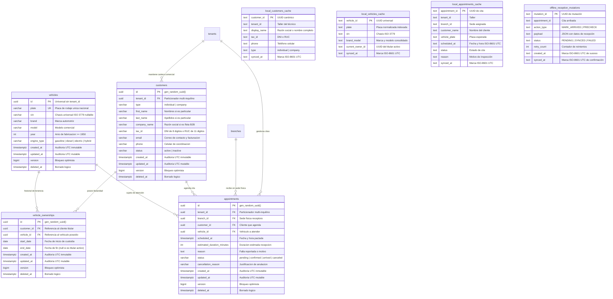

## 5. Fase 2: Bounded Context 2 — Customer & Fleet Management Context (CRM) (`com.andeva.atelier.platform.crm`)

### 5.1. Diccionario y Propósito del Contexto

#### 5.1.1. Propósito y Límites de Responsabilidad
El **Customer & Fleet Management Context (CRM)** centraliza la gestión comercial, la administración de la cartera de clientes, el registro universal del parque automotor y el agendamiento de citas de servicio técnico. Sus responsabilidades fundamentales son:
1. **Gestión Integral de Clientes (B2C y B2B):** Modelar las fichas comerciales de clientes particulares (`Customer` de tipo `INDIVIDUAL`) y de empresas propietarias de flotas automotrices (`Customer` de tipo `COMPANY`). Los clientes están estrictamente aislados por taller (`TenantId`), garantizando la confidencialidad de la cartera comercial de cada taller mecánico.
2. **Parque Automotor Universal e Independiente del Inquilino (`Vehicle`):** A diferencia de los clientes, los vehículos constituyen entidades universales independientes del `TenantId`. Un automóvil (definido unívocamente por su placa de rodaje `LicensePlate` y su número de chasis `Vin`) existe en el mundo físico y puede visitar distintos talleres de la red Atelier a lo largo de su vida útil. Esto permite consolidar una **hoja clínica automotriz histórica global** que acompaña al automóvil independientemente de qué taller realice el mantenimiento.
3. **Trazabilidad Histórica de Propiedad (`VehicleOwnership`):** Gestionar la cadena de custodia y propiedad de los vehículos mediante registros fechados (`start_date`, `end_date`), permitiendo traspasos de dominio (ej. venta de una flota comercial a un particular o compraventa de segunda mano) sin corromper ni duplicar los historiales mecánicos previos.
4. **Agendamiento y Orquestación de Citas de Taller (`Appointment`):** Administrar las solicitudes de servicio previas al ingreso al taller, coordinando fechas, sedes físicas (`BranchId`) y motivos de revisión. La cita actúa como el disparador comercial del taller: al transicionar a estado `ARRIVED`, habilita la generación de la Orden de Trabajo (`WorkOrder`) en el contexto operativo (*Workshop Operations*).

#### 5.1.2. Decisiones de Diseño e Integraciones Críticas
* **Sincronización Bidireccional con Atelier Driver:** Los clientes particulares y administradores de flota interactúan mediante la aplicación móvil **Atelier Driver**. La confirmación, recordatorio y reprogramación de citas se notifican instantáneamente mediante notificaciones push despachadas vía **Firebase Cloud Messaging (FCM)**.
* **Geocodificación con Google Places API:** Para empresas de transporte y flotas B2B, la captura de domicilios fiscales y patios de maniobras se asiste mediante la API de **Google Places**, normalizando direcciones y resolviendo coordenadas geográficas.
* **Fachada de Dominio Abierta (Inbound ACL / OHS):** IAM y CRM no comparten repositorios. CRM expone `CustomerFleetContextFacade` para que *Workshop Operations* resuelva los datos del vehículo y propietario al aperturar una orden de trabajo, e *Invoicing* obtenga el RUC/DNI y razón social para comprobantes SUNAT.

---

### 5.2. 2.6.2.1. Domain Layer

#### 5.2.1. Aggregates & Aggregate Roots

##### 1. `Customer` (Aggregate Root)
* **Paquete:** `com.andeva.atelier.platform.crm.domain.model.aggregates`
* **Herencia:** Extiende `AbstractDomainAggregateRoot<Customer>`
* **Propósito:** Representa a la persona natural o jurídica titular de una cuenta de cliente dentro de la cartera comercial de un taller específico.
* **Atributos:**
  * `id: CustomerId` — Identificador universal del cliente (UUID).
  * `tenantId: TenantId` — Taller mecánico al que pertenece la ficha comercial.
  * `type: CustomerType` — Naturaleza jurídica del cliente (`INDIVIDUAL` para particulares, `COMPANY` para empresas/flotas).
  * `name: PersonName` — Nombres y apellidos (obligatorio si `type == INDIVIDUAL`, nulo si `type == COMPANY`).
  * `companyName: String` — Razón social o denominación comercial (obligatorio si `type == COMPANY`, nulo si `type == INDIVIDUAL`).
  * `taxId: TaxId` — Documento de identidad tributaria (DNI de 8 dígitos para persona natural o RUC de 11 dígitos para empresa/persona jurídica).
  * `email: EmailAddress` — Correo electrónico de contacto y notificaciones comerciales.
  * `phone: PhoneNumber` — Teléfono o celular de contacto.
  * `status: CustomerStatus` — Estado de la ficha comercial (`ACTIVE`, `INACTIVE`).
* **Invariantes y Reglas de Negocio:**
  * Si `type == INDIVIDUAL`, el atributo `name` no puede ser nulo y el `companyName` debe ser nulo.
  * Si `type == COMPANY`, el atributo `companyName` no puede ser nulo ni vacío y el `name` debe ser nulo.
  * El `taxId` es obligatorio y debe corresponder a un DNI o RUC peruano válido.
  * La tupla `(tenantId, taxId)` es única en el sistema (un cliente no puede duplicarse dentro del mismo taller).
  * Al menos uno entre `email` o `phone` debe estar provisto para asegurar un canal de contacto.
* **Métodos:**
  * `+ static Customer registerIndividual(TenantId tenantId, PersonName name, TaxId taxId, EmailAddress email, PhoneNumber phone): Customer`: Factoría de dominio para personas naturales; registra `CustomerRegisteredEvent`.
  * `+ static Customer registerCompany(TenantId tenantId, String companyName, TaxId taxId, EmailAddress email, PhoneNumber phone): Customer`: Factoría de dominio para flotas corporativas; registra `CustomerRegisteredEvent`.
  * `+ void updateContact(EmailAddress newEmail, PhoneNumber newPhone): void`: Actualiza los canales de contacto del cliente.
  * `+ void updateProfile(PersonName newName): void`: Actualiza el nombre de la persona natural (solo válido para `INDIVIDUAL`).
  * `+ void updateCompanyDetails(String newCompanyName): void`: Actualiza la razón social de la empresa (solo válido para `COMPANY`).
  * `+ void activate(): void`: Transiciona el estado a `ACTIVE`.
  * `+ void deactivate(): void`: Marca la ficha comercial como `INACTIVE`.
  * `+ String getDisplayName(): String`: Retorna el nombre comercial o nombre completo según el tipo.

##### 2. `Vehicle` (Aggregate Root)
* **Paquete:** `com.andeva.atelier.platform.crm.domain.model.aggregates`
* **Herencia:** Extiende `AbstractDomainAggregateRoot<Vehicle>`
* **Propósito:** Representa la unidad automotriz física. Es una entidad global e independiente del `tenantId` que consolida la historia técnica y la cadena de custodia del vehículo.
* **Atributos:**
  * `id: VehicleId` — Identificador universal del vehículo (UUID).
  * `plate: LicensePlate` — Placa de rodaje única a nivel nacional (ej. "ABC-123").
  * `vin: Vin` — Número de Identificación Vehicular / Número de Chasis (17 caracteres alfanuméricos ISO 3779, nullable).
  * `brand: String` — Marca del vehículo (ej. Toyota, Hyundai, Nissan).
  * `model: String` — Modelo comercial (ej. Yaris, Tucson, Sentra).
  * `year: int` — Año del modelo de fabricación (ej. 2022).
  * `engineType: EngineType` — Tipo de motorización (`GASOLINE`, `DIESEL`, `ELECTRIC`, `HYBRID`).
  * `ownershipHistory: List<VehicleOwnership>` — Colección histórica de propietarios que han poseído este vehículo.
* **Invariantes y Reglas de Negocio:**
  * La placa `plate` es obligatoria, única globalmente y se almacena normalizada en mayúsculas sin guiones ni caracteres especiales.
  * El año `year` debe situarse entre `1950` y el año actual más uno (`Year.now().getValue() + 1`).
  * La marca `brand` y modelo `model` no pueden ser cadenas vacías.
  * Solo puede existir **exactamente un registro activo** en `ownershipHistory` con `endDate == null`.
* **Métodos:**
  * `+ static Vehicle register(LicensePlate plate, Vin vin, String brand, String model, int year, EngineType engineType, CustomerId initialOwnerId): Vehicle`: Factoría de dominio que crea el vehículo, inicializa su primer registro de propiedad activo y registra `VehicleRegisteredEvent`.
  * `+ VehicleOwnership transferOwnership(CustomerId newOwnerId, LocalDate transferDate): VehicleOwnership`: Cierra el registro de propiedad activo actual fijando su `endDate = transferDate`, añade un nuevo `VehicleOwnership` con `startDate = transferDate` y registra `VehicleOwnershipTransferredEvent`.
  * `+ Optional<VehicleOwnership> getActiveOwnership(): Optional<VehicleOwnership>`: Retorna el registro de titularidad vigente.
  * `+ Optional<CustomerId> getCurrentOwnerId(): Optional<CustomerId>`: Retorna el identificador del cliente dueño actual.
  * `+ void updateTechnicalDetails(Vin newVin, EngineType newEngineType): void`: Actualiza especificaciones técnicas del vehículo.

##### 3. `Appointment` (Aggregate Root)
* **Paquete:** `com.andeva.atelier.platform.crm.domain.model.aggregates`
* **Herencia:** Extiende `AbstractDomainAggregateRoot<Appointment>`
* **Propósito:** Modela la reserva o cita previa agendada por el cliente o recepcionista para la atención automotriz en una sucursal física determinada.
* **Atributos:**
  * `id: AppointmentId` — Identificador universal de la cita (UUID).
  * `tenantId: TenantId` — Taller receptor de la cita.
  * `branchId: BranchId` — Sede física donde se llevará a cabo la revisión.
  * `customerId: CustomerId` — Cliente titular que solicita la atención.
  * `vehicleId: VehicleId` — Vehículo objeto del servicio técnico.
  * `scheduledAt: Instant` — Fecha y hora pactada para la recepción del vehículo.
  * `estimatedDurationMinutes: int` — Tiempo estimado de recepción e inspección inicial (default: 30 minutos).
  * `reason: String` — Motivo descriptivo de la cita (ej. "Mantenimiento preventivo 10,000 km", "Ruido en tren delantero", "Alerta predictiva OBD2 de sobrecalentamiento").
  * `status: AppointmentStatus` — Estado del ciclo de vida de la cita (`PENDING`, `CONFIRMED`, `ARRIVED`, `CANCELED`).
  * `cancellationReason: String` — Justificación en caso de anulación (nullable).
* **Invariantes y Reglas de Negocio:**
  * Al crearse, la fecha `scheduledAt` debe ser posterior al instante actual (`scheduledAt.isAfter(Instant.now())`).
  * No se puede cancelar una cita que ya se encuentre en estado `ARRIVED`.
  * Una cita en estado `CANCELED` no puede volver a transicionar a `CONFIRMED` ni `ARRIVED`.
  * La transición a `ARRIVED` marca la llegada física del auto al taller y constituye el prerrequisito para que el módulo de *Workshop Operations* genere una Orden de Trabajo (`WorkOrder`).
* **Métodos:**
  * `+ static Appointment schedule(TenantId tenantId, BranchId branchId, CustomerId customerId, VehicleId vehicleId, Instant scheduledAt, int estimatedDurationMinutes, String reason): Appointment`: Factoría de dominio en estado inicial `PENDING` que registra `AppointmentScheduledEvent`.
  * `+ void confirm(): void`: Transiciona el estado a `CONFIRMED` y registra `AppointmentConfirmedEvent`.
  * `+ void markArrived(): void`: Registra el arribo físico del cliente al taller (`ARRIVED`) y dispara `AppointmentArrivedEvent`.
  * `+ void cancel(String reason): void`: Anula la cita registrando el motivo y dispara `AppointmentCanceledEvent`.
  * `+ void reschedule(Instant newScheduledAt): void`: Modifica la fecha pactada (siempre que esté en estado `PENDING` o `CONFIRMED`) y registra `AppointmentRescheduledEvent`.

---

#### 5.2.2. Entities

##### 1. `VehicleOwnership` (Entidad Dependiente de `Vehicle`)
* **Paquete:** `com.andeva.atelier.platform.crm.domain.model.entities`
* **Propósito:** Modela el vínculo de titularidad y custodia entre un `Customer` y un `Vehicle` en un intervalo de tiempo específico.
* **Atributos:**
  * `id: VehicleOwnershipId` — Identificador de la relación (UUID).
  * `vehicleId: VehicleId` — Vehículo en cuestión.
  * `customerId: CustomerId` — Cliente propietario.
  * `startDate: LocalDate` — Fecha de adquisición o inicio de custodia en el taller.
  * `endDate: LocalDate` — Fecha de enajenación o fin de custodia (`null` si es el propietario actual).
* **Métodos:**
  * `+ boolean isCurrent(): boolean`: Retorna `true` si `endDate == null`.
  * `+ void terminate(LocalDate terminationDate): void`: Fija la fecha de finalización de propiedad garantizando que sea posterior a `startDate`.

---

#### 5.2.3. Value Objects

Java Records inmutables con validación estricta en su constructor compacto:

* **`CustomerId(UUID value)`:** Identificador tipado de cliente. Valida `Objects.requireNonNull(value)`.
* **`VehicleId(UUID value)`:** Identificador tipado de vehículo. Valida `Objects.requireNonNull(value)`.
* **`VehicleOwnershipId(UUID value)`:** Identificador tipado del vínculo de titularidad. Valida `Objects.requireNonNull(value)`.
* **`AppointmentId(UUID value)`:** Identificador tipado de cita de taller. Valida `Objects.requireNonNull(value)`.
* **`LicensePlate(String value)`:** Encapsula la placa de rodaje vehicular. Normaliza eliminando guiones y espacios, convirtiendo a mayúsculas. Valida formatos peruanos tradicionales (ej. `ABC-123`, `A1B-234`) y de motocicletas/remolques.
* **`Vin(String value)`:** Vehicle Identification Number conforme al estándar internacional ISO 3779 (17 caracteres alfanuméricos en mayúsculas, excluyendo letras confusas `I`, `O`, `Q`).
* **`CustomerType` (Enum):** `INDIVIDUAL`, `COMPANY`.
* **`CustomerStatus` (Enum):** `ACTIVE`, `INACTIVE`.
* **`EngineType` (Enum):** `GASOLINE`, `DIESEL`, `ELECTRIC`, `HYBRID`.
* **`AppointmentStatus` (Enum):** `PENDING`, `CONFIRMED`, `ARRIVED`, `CANCELED`.

---

#### 5.2.4. Domain Commands

Comandos inmutables que encapsulan casos de uso de escritura:

* `RegisterIndividualCustomerCommand(TenantId tenantId, String firstName, String lastName, String taxId, String email, String phone)`
* `RegisterCompanyCustomerCommand(TenantId tenantId, String companyName, String taxId, String email, String phone)`
* `UpdateCustomerContactCommand(CustomerId customerId, String email, String phone)`
* `RegisterVehicleCommand(String plate, String vin, String brand, String model, int year, EngineType engineType, CustomerId initialOwnerId)`
* `TransferVehicleOwnershipCommand(VehicleId vehicleId, CustomerId newOwnerId, LocalDate transferDate)`
* `ScheduleAppointmentCommand(TenantId tenantId, BranchId branchId, CustomerId customerId, VehicleId vehicleId, Instant scheduledAt, int estimatedDurationMinutes, String reason)`
* `ConfirmAppointmentCommand(AppointmentId appointmentId)`
* `MarkAppointmentArrivedCommand(AppointmentId appointmentId)`
* `CancelAppointmentCommand(AppointmentId appointmentId, String cancellationReason)`
* `RescheduleAppointmentCommand(AppointmentId appointmentId, Instant newScheduledAt)`

---

#### 5.2.5. Domain Queries

Consultas de lectura inmutables para CRM:

* `GetCustomerByIdQuery(CustomerId customerId)`
* `GetCustomersByTenantIdQuery(TenantId tenantId)`
* `GetCustomerByTaxIdQuery(TenantId tenantId, TaxId taxId)`
* `GetVehicleByIdQuery(VehicleId vehicleId)`
* `GetVehicleByPlateQuery(LicensePlate plate)`
* `GetVehiclesByCustomerIdQuery(CustomerId customerId)`
* `GetAppointmentByIdQuery(AppointmentId appointmentId)`
* `GetAppointmentsByTenantAndBranchQuery(TenantId tenantId, BranchId branchId, LocalDate date)`
* `GetAppointmentsByCustomerQuery(CustomerId customerId)`
* `GetAppointmentsByVehicleQuery(VehicleId vehicleId)`

---

#### 5.2.6. Domain Events

Eventos atómicos que registran hechos consumados dentro del dominio CRM:

* `CustomerRegisteredEvent(CustomerId customerId, TenantId tenantId, CustomerType type, String displayName, TaxId taxId, Instant occurredOn)`
* `VehicleRegisteredEvent(VehicleId vehicleId, LicensePlate plate, CustomerId initialOwnerId, Instant occurredOn)`
* `VehicleOwnershipTransferredEvent(VehicleId vehicleId, CustomerId previousOwnerId, CustomerId newOwnerId, LocalDate transferDate, Instant occurredOn)`
* `AppointmentScheduledEvent(AppointmentId appointmentId, TenantId tenantId, BranchId branchId, CustomerId customerId, VehicleId vehicleId, Instant scheduledAt, Instant occurredOn)`
* `AppointmentConfirmedEvent(AppointmentId appointmentId, CustomerId customerId, Instant scheduledAt, Instant occurredOn)`
* `AppointmentArrivedEvent(AppointmentId appointmentId, TenantId tenantId, CustomerId customerId, VehicleId vehicleId, Instant occurredOn)`
* `CustomerContactUpdatedEvent(CustomerId customerId, EmailAddress email, PhoneNumber phone, Instant occurredOn)`
* `AppointmentCanceledEvent(AppointmentId appointmentId, String cancellationReason, Instant occurredOn)`
* `AppointmentRescheduledEvent(AppointmentId appointmentId, Instant newScheduledAt, Instant occurredOn)`

---

#### 5.2.7. Repositories (Interfaces de Dominio)

Puertos de salida de persistencia puros:

* **`CustomerRepository`:**
  * `Customer save(Customer customer)`
  * `Optional<Customer> findById(CustomerId id)`
  * `Optional<Customer> findByTenantIdAndTaxId(TenantId tenantId, TaxId taxId)`
  * `List<Customer> findByTenantId(TenantId tenantId)`
  * `boolean existsByTenantIdAndTaxId(TenantId tenantId, TaxId taxId)`
* **`VehicleRepository`:**
  * `Vehicle save(Vehicle vehicle)`
  * `Optional<Vehicle> findById(VehicleId id)`
  * `Optional<Vehicle> findByPlate(LicensePlate plate)`
  * `Optional<Vehicle> findByVin(Vin vin)`
  * `boolean existsByPlate(LicensePlate plate)`
  * `List<Vehicle> findByCurrentOwnerId(CustomerId customerId)`
* **`VehicleOwnershipRepository`:**
  * `VehicleOwnership save(VehicleOwnership ownership)`
  * `List<VehicleOwnership> findByVehicleId(VehicleId vehicleId)`
  * `Optional<VehicleOwnership> findActiveOwnershipByVehicleId(VehicleId vehicleId)`
* **`AppointmentRepository`:**
  * `Appointment save(Appointment appointment)`
  * `Optional<Appointment> findById(AppointmentId id)`
  * `List<Appointment> findByTenantIdAndBranchIdAndDate(TenantId tenantId, BranchId branchId, Instant startOfDay, Instant endOfDay)`
  * `List<Appointment> findByCustomerId(CustomerId customerId)`
  * `List<Appointment> findByVehicleId(VehicleId vehicleId)`
  * `long countActiveByBranchAndSlot(TenantId tenantId, BranchId branchId, Instant slotStart, Instant slotEnd)`

---

#### 5.2.8. Domain Services

Servicios de lógica de negocio pura que no pertenecen naturalmente a un único agregado:

* **`AppointmentSchedulingService`:**
  * **Paquete:** `com.andeva.atelier.platform.crm.domain.services`
  * **Propósito:** Valida la viabilidad operativa y la capacidad física de recepción para una cita en una sucursal determinada.
  * **Reglas de Negocio:**
    * Comprueba que la fecha y hora pactada se sitúe dentro de la ventana de atención técnica del taller.
    * Exige una antelación mínima de al menos 2 horas con respecto a la marca temporal actual (`Instant.now()`).
    * Consulta la carga concurrente en `AppointmentRepository` para garantizar que no se sobrepase el aforo de recepción de la sucursal en la franja temporal.
  * **Firma:** `Result<Void, DomainException> validateSlotAvailability(TenantId tenantId, BranchId branchId, Instant scheduledAt, int maxConcurrentSlots)`

* **`VehicleTransferDomainService`:**
  * **Paquete:** `com.andeva.atelier.platform.crm.domain.services`
  * **Propósito:** Orquesta la transferencia de titularidad y custodia vehicular entre clientes.
  * **Reglas de Negocio:**
    * Verifica que el vehículo exista y posea un registro de propiedad vigente en `ownershipHistory`.
    * Verifica que el cliente adquirente se encuentre debidamente registrado y activo.
    * Valida que no existan órdenes de trabajo activas o pendientes de liquidación en *Workshop Operations* sobre la unidad vehicular antes de permitir el traspaso.
    * Ejecuta el método `transferOwnership` del agregado `Vehicle`, cerrando la titularidad anterior y registrando la nueva relación en un único límite transaccional.
  * **Firma:** `Result<VehicleOwnership, DomainException> transferVehicle(Vehicle vehicle, Customer targetCustomer, LocalDate transferDate)`

---

#### 5.2.9. Domain Exceptions

Taxonomía de excepciones de dominio semánticas derivadas de `DomainException` del Bounded Context Shared:

* **`CustomerNotFoundException` (`CUSTOMER_NOT_FOUND`):** Se lanza cuando no se encuentra un cliente con el identificador o documento provisto en el taller.
* **`CustomerAlreadyExistsException` (`CUSTOMER_ALREADY_EXISTS`):** Se lanza al intentar registrar un cliente con un documento tributario (`TaxId`) que ya existe bajo el mismo `TenantId`.
* **`CustomerInactiveException` (`CUSTOMER_INACTIVE`):** Se lanza al intentar operar comercialmente con una ficha de cliente en estado `INACTIVE`.
* **`VehicleNotFoundException` (`VEHICLE_NOT_FOUND`):** Se lanza cuando el vehículo consultado no existe en el catálogo global.
* **`VehicleAlreadyExistsException` (`VEHICLE_ALREADY_EXISTS`):** Se lanza cuando la placa de rodaje ya está registrada en el sistema.
* **`InvalidLicensePlateException` (`INVALID_LICENSE_PLATE`):** Se lanza cuando el formato de la placa vehicular no se ajusta al estándar oficial peruano MTC.
* **`InvalidVinException` (`INVALID_VIN`):** Se lanza cuando el número de chasis no cumple los 17 caracteres alfanuméricos según la norma ISO 3779.
* **`VehicleActiveOwnershipNotFoundException` (`VEHICLE_ACTIVE_OWNERSHIP_NOT_FOUND`):** Se lanza cuando se intenta operar sobre un vehículo que carece de titular activo vigente.
* **`VehicleHasOpenWorkOrdersException` (`VEHICLE_HAS_OPEN_WORK_ORDERS`):** Se lanza cuando se pretende transferir un vehículo que mantiene órdenes de trabajo abiertas en taller.
* **`AppointmentNotFoundException` (`APPOINTMENT_NOT_FOUND`):** Se lanza cuando el identificador de la cita no corresponde a ninguna reserva registrada.
* **`AppointmentSlotUnavailableException` (`APPOINTMENT_SLOT_UNAVAILABLE`):** Se lanza cuando la franja horaria solicitada en la sucursal sobrepasa la capacidad de recepción.
* **`AppointmentInvalidStateTransitionException` (`APPOINTMENT_INVALID_STATE_TRANSITION`):** Se lanza cuando se intenta una mutación de estado no permitida en el ciclo de vida de la cita.
* **`AppointmentAlreadyArrivedException` (`APPOINTMENT_ALREADY_ARRIVED`):** Se lanza cuando se intenta anular o reprogramar una cita que ya fue ingresada a patio de taller.
* **`AppointmentPastDateException` (`APPOINTMENT_PAST_DATE`):** Se lanza cuando se intenta agendar una cita en una marca temporal pretérita.

---

### 5.3. 2.6.2.2. Interface Layer

La Capa de Interfaz (*Interface Layer*) actúa como el adaptador primario o de entrada (*inbound adapter*) dentro de la arquitectura hexagonal de Atelier para el contexto de **Customer & Fleet Management (CRM)**. Su responsabilidad técnica es exponer los puertos de entrada del sistema ante solicitudes externas e intermodulares, aislando el núcleo de dominio y coordinando la mediación entre los protocolos de transporte y los servicios de aplicación. Esta capa implementa tres componentes esenciales:

1. **Controladores RESTful (`@RestController`):** Exponen recursos HTTP bajo estándares REST de alta madurez, delegando la orquestación a los servicios de comando y consulta de la capa de aplicación.
2. **Fachada de Contexto Abierto (*Open Host Service* / Inbound ACL):** Proporciona un contrato de servicio Java público e inmutable (`CustomerFleetContextFacade`) consumido síncronamente en memoria por otros Bounded Contexts modulares sin acoplarse a las entidades o agregados internos.
3. **Eventos de Integración (*Published Language*):** Publica eventos canónicos inmutables mediante el patrón *Transactional Outbox* para la sincronización reactiva y asíncrona con *Workshop Operations*, *IoT Telemetry* e *Invoicing*.

---

#### 5.3.1. REST Controllers

Los controladores web residen en el paquete `com.andeva.atelier.platform.crm.interfaces.rest`. Se encuentran anotados con `@RestController`, `@RequestMapping`, `@Validated` de Jakarta Validation, y cuentan con documentación OpenAPI 3 mediante `@Tag`, `@Operation` y `@ApiResponses`.

##### 1. `CustomersController`
* **Ruta Base:** `/api/v1/customers`
* **Propósito:** Gestión integral de la cartera de clientes de un taller mecánico en entorno multi-inquilino (*multi-tenancy*), admitiendo la distinción entre personas naturales y personas jurídicas (flotas corporativas).
* **Endpoints:**
  * `POST /individuals`: Registro de persona natural titular.
    * **Cuerpo de Petición:** `CreateIndividualCustomerResource` con nombre, apellido, DNI (8 dígitos), correo electrónico y teléfono móvil.
    * **Respuesta Exitosa:** `CustomerResource` (HTTP 201 Created con cabecera `Location: /api/v1/customers/{customerId}`).
    * **Códigos de Error:** HTTP 400 Bad Request (errores de validación sintáctica), HTTP 409 Conflict (`CUSTOMER_TAX_ID_ALREADY_EXISTS`, `CUSTOMER_EMAIL_ALREADY_EXISTS`).
  * `POST /companies`: Registro de cliente corporativo / empresa con flota vehicular.
    * **Cuerpo de Petición:** `CreateCompanyCustomerResource` con razón social, RUC (11 dígitos), correo corporativo y teléfono de contacto.
    * **Respuesta Exitosa:** `CustomerResource` (HTTP 201 Created con cabecera `Location: /api/v1/customers/{customerId}`).
    * **Códigos de Error:** HTTP 400 Bad Request (RUC inválido o campos faltantes), HTTP 409 Conflict (`CUSTOMER_TAX_ID_ALREADY_EXISTS`).
  * `GET`: Listado de clientes adscritos al taller autenticado (`tenantId` resuelto a través del token JWT).
    * **Parámetros de Consulta (Query Params):** `type` (opcional: `INDIVIDUAL`, `COMPANY`), `search` (opcional: término para coincidencia parcial en nombre o documento), `status` (opcional: `ACTIVE`, `INACTIVE`), `page` (default 0), `size` (default 20).
    * **Respuesta Exitosa:** `List<CustomerResource>` (HTTP 200 OK).
  * `GET /{customerId}`: Detalle completo de cliente por identificador universal.
    * **Parámetros de Ruta:** `customerId` (UUID).
    * **Respuesta Exitosa:** `CustomerResource` (HTTP 200 OK).
    * **Códigos de Error:** HTTP 404 Not Found (`CUSTOMER_NOT_FOUND`).
  * `PUT /{customerId}/contact`: Actualización de canales de contacto directo del cliente (teléfono y correo electrónico).
    * **Parámetros de Ruta:** `customerId` (UUID).
    * **Cuerpo de Petición:** `UpdateCustomerContactResource`.
    * **Respuesta Exitosa:** `CustomerResource` (HTTP 200 OK).
    * **Códigos de Error:** HTTP 400 Bad Request, HTTP 404 Not Found (`CUSTOMER_NOT_FOUND`).
  * `GET /{customerId}/vehicles`: Lista de vehículos automotores actualmente bajo titularidad activa del cliente.
    * **Parámetros de Ruta:** `customerId` (UUID).
    * **Respuesta Exitosa:** `List<VehicleResource>` (HTTP 200 OK).
    * **Códigos de Error:** HTTP 404 Not Found (`CUSTOMER_NOT_FOUND`).

##### 2. `VehiclesController`
* **Ruta Base:** `/api/v1/vehicles`
* **Propósito:** Registro técnico y consulta del parque automotor universal, modelando el vehículo como un activo global independiente del inquilino y rastreando su cadena ininterrumpida de custodia y titularidad.
* **Endpoints:**
  * `POST`: Alta global de vehículo y asignación de su titular inicial.
    * **Cuerpo de Petición:** `CreateVehicleResource` con placa de rodaje normalizada, número de chasis (VIN), marca, modelo, año de fabricación, tipo de motorización e identificador del cliente titular inicial (`initialOwnerId`).
    * **Respuesta Exitosa:** `VehicleResource` (HTTP 201 Created con cabecera `Location: /api/v1/vehicles/{vehicleId}`).
    * **Códigos de Error:** HTTP 400 Bad Request (formato de placa inválido, VIN disconforme con ISO 3779, año fuera de rango), HTTP 404 Not Found (`CUSTOMER_NOT_FOUND` para `initialOwnerId`), HTTP 409 Conflict (`VEHICLE_PLATE_ALREADY_EXISTS`, `VEHICLE_VIN_ALREADY_EXISTS`).
  * `GET /{vehicleId}`: Consulta técnica integral del vehículo por su ID universal.
    * **Parámetros de Ruta:** `vehicleId` (UUID).
    * **Respuesta Exitosa:** `VehicleResource` (HTTP 200 OK).
    * **Códigos de Error:** HTTP 404 Not Found (`VEHICLE_NOT_FOUND`).
  * `GET /by-plate/{plate}`: Búsqueda rápida de vehículo por placa de rodaje normalizada.
    * **Parámetros de Ruta:** `plate` (String normalizado sin guiones en mayúsculas, ej. `ABC123`).
    * **Respuesta Exitosa:** `VehicleResource` (HTTP 200 OK).
    * **Códigos de Error:** HTTP 404 Not Found (`VEHICLE_NOT_FOUND`).
  * `POST /{vehicleId}/ownerships`: Traspaso de titularidad vehicular creando un nuevo periodo de custodia.
    * **Parámetros de Ruta:** `vehicleId` (UUID).
    * **Cuerpo de Petición:** `TransferVehicleOwnershipResource` con el identificador del nuevo propietario (`newOwnerId`) y la fecha de traspaso (`transferDate`).
    * **Respuesta Exitosa:** `VehicleOwnershipResource` (HTTP 201 Created con cabecera `Location: /api/v1/vehicles/{vehicleId}/ownerships/{ownershipId}`).
    * **Códigos de Error:** HTTP 400 Bad Request (`VEHICLE_ALREADY_OWNED_BY_CUSTOMER`, fecha de traspaso futura o disconforme con el historial), HTTP 404 Not Found (`VEHICLE_NOT_FOUND`, `CUSTOMER_NOT_FOUND`).
  * `GET /{vehicleId}/ownerships`: Historial cronológico completo de propietarios pasados y custodio vigente del vehículo.
    * **Parámetros de Ruta:** `vehicleId` (UUID).
    * **Respuesta Exitosa:** `List<VehicleOwnershipResource>` (HTTP 200 OK).
    * **Códigos de Error:** HTTP 404 Not Found (`VEHICLE_NOT_FOUND`).

##### 3. `AppointmentsController`
* **Ruta Base:** `/api/v1/appointments`
* **Propósito:** Agendamiento, reprogramación y seguimiento del ciclo de vida de citas previas de inspección y mantenimiento automotriz en las sedes físicas del taller.
* **Endpoints:**
  * `POST`: Agendamiento de cita previa.
    * **Cuerpo de Petición:** `ScheduleAppointmentResource` con sede física (`branchId`), cliente (`customerId`), vehículo (`vehicleId`), fecha y hora pactada (`scheduledAt`), duración estimada y motivo descriptivo.
    * **Respuesta Exitosa:** `AppointmentResource` (HTTP 201 Created con cabecera `Location: /api/v1/appointments/{appointmentId}`).
    * **Códigos de Error:** HTTP 400 Bad Request (`APPOINTMENT_PAST_DATE`), HTTP 404 Not Found (`CUSTOMER_NOT_FOUND`, `VEHICLE_NOT_FOUND`, `BRANCH_NOT_FOUND`), HTTP 409 Conflict (`APPOINTMENT_SLOT_UNAVAILABLE`).
  * `GET`: Búsqueda filtrada de citas por sede física (`branchId`), fecha de calendario (`date`) y estado opcional (`status`).
    * **Parámetros de Consulta (Query Params):** `branchId` (UUID, opcional si el usuario tiene rol de sede fija), `date` (LocalDate en formato ISO-8601 `YYYY-MM-DD`), `status` (opcional: `PENDING`, `CONFIRMED`, `ARRIVED`, `CANCELED`).
    * **Respuesta Exitosa:** `List<AppointmentResource>` (HTTP 200 OK).
  * `GET /{appointmentId}`: Detalle individual de la cita por identificador.
    * **Parámetros de Ruta:** `appointmentId` (UUID).
    * **Respuesta Exitosa:** `AppointmentResource` (HTTP 200 OK).
    * **Códigos de Error:** HTTP 404 Not Found (`APPOINTMENT_NOT_FOUND`).
  * `POST /{appointmentId}/confirm`: Confirmación formal de la cita por parte del personal de recepción del taller.
    * **Parámetros de Ruta:** `appointmentId` (UUID).
    * **Respuesta Exitosa:** `AppointmentResource` (HTTP 200 OK, transicionando a estado `CONFIRMED`).
    * **Códigos de Error:** HTTP 400 Bad Request (`APPOINTMENT_INVALID_STATE_TRANSITION`), HTTP 404 Not Found (`APPOINTMENT_NOT_FOUND`).
  * `POST /{appointmentId}/arrive`: Registro de arribo físico del automóvil a recepción de patio.
    * **Parámetros de Ruta:** `appointmentId` (UUID).
    * **Respuesta Exitosa:** `AppointmentResource` (HTTP 200 OK, transicionando a estado `ARRIVED`). Desencadena en *Workshop Operations* la apertura de la Orden de Trabajo preliminar.
    * **Códigos de Error:** HTTP 400 Bad Request (`APPOINTMENT_ALREADY_ARRIVED`, `APPOINTMENT_INVALID_STATE_TRANSITION`), HTTP 404 Not Found (`APPOINTMENT_NOT_FOUND`).
  * `POST /{appointmentId}/reschedule`: Reprogramación de fecha y hora acordada.
    * **Parámetros de Ruta:** `appointmentId` (UUID).
    * **Cuerpo de Petición:** `RescheduleAppointmentResource` con la nueva marca temporal (`newScheduledAt`).
    * **Respuesta Exitosa:** `AppointmentResource` (HTTP 200 OK).
    * **Códigos de Error:** HTTP 400 Bad Request (`APPOINTMENT_PAST_DATE`, `APPOINTMENT_ALREADY_ARRIVED`), HTTP 404 Not Found (`APPOINTMENT_NOT_FOUND`).
  * `POST /{appointmentId}/cancel`: Cancelación formal con registro de justificación.
    * **Parámetros de Ruta:** `appointmentId` (UUID).
    * **Cuerpo de Petición:** `CancelAppointmentResource` con motivo justificado (`reason`).
    * **Respuesta Exitosa:** `AppointmentResource` (HTTP 200 OK, transicionando a estado `CANCELED`).
    * **Códigos de Error:** HTTP 400 Bad Request (`APPOINTMENT_ALREADY_ARRIVED`), HTTP 404 Not Found (`APPOINTMENT_NOT_FOUND`).

---

#### 5.3.2. Resources / DTOs

Estructuras de datos inmutables modeladas estrictamente como Java Records en el paquete `com.andeva.atelier.platform.crm.interfaces.rest.resources`. Cada record de entrada incorpora validaciones formales de Jakarta Bean Validation (`jakarta.validation.constraints.*`) para garantizar la integridad perimetral antes de invocar la capa de aplicación:

##### Recursos de Petición (Requests)

1. **`CreateIndividualCustomerResource`:**
```java
public record CreateIndividualCustomerResource(
    @NotBlank(message = "El nombre de pila es obligatorio")
    @Size(min = 2, max = 100, message = "El nombre debe contener entre 2 y 100 caracteres")
    String firstName,

    @NotBlank(message = "El apellido es obligatorio")
    @Size(min = 2, max = 100, message = "El apellido debe contener entre 2 y 100 caracteres")
    String lastName,

    @NotBlank(message = "El documento de identidad es obligatorio")
    @Pattern(regexp = "^[0-9]{8}$", message = "El DNI debe estar compuesto exactamente por 8 dígitos numéricos")
    String taxId,

    @NotBlank(message = "El correo electrónico es obligatorio")
    @Email(message = "El formato de correo electrónico es inválido")
    String email,

    @NotBlank(message = "El número telefónico es obligatorio")
    @Pattern(regexp = "^\\+?[0-9]{9,15}$", message = "El teléfono debe cumplir con formato internacional E.164")
    String phone
) {}
```

2. **`CreateCompanyCustomerResource`:**
```java
public record CreateCompanyCustomerResource(
    @NotBlank(message = "La razón social de la empresa es obligatoria")
    @Size(min = 3, max = 150, message = "La razón social debe contener entre 3 y 150 caracteres")
    String companyName,

    @NotBlank(message = "El número de RUC es obligatorio")
    @Pattern(regexp = "^(10|20)[0-9]{9}$", message = "El RUC corporativo debe contener exactamente 11 dígitos e iniciar con 10 o 20")
    String taxId,

    @NotBlank(message = "El correo corporativo es obligatorio")
    @Email(message = "El formato de correo electrónico es inválido")
    String email,

    @NotBlank(message = "El teléfono corporativo es obligatorio")
    @Pattern(regexp = "^\\+?[0-9]{9,15}$", message = "El teléfono debe cumplir con formato internacional E.164")
    String phone
) {}
```

3. **`UpdateCustomerContactResource`:**
```java
public record UpdateCustomerContactResource(
    @NotBlank(message = "El correo electrónico es obligatorio")
    @Email(message = "El formato de correo electrónico es inválido")
    String email,

    @NotBlank(message = "El número telefónico es obligatorio")
    @Pattern(regexp = "^\\+?[0-9]{9,15}$", message = "El teléfono debe cumplir con formato internacional E.164")
    String phone
) {}
```

4. **`CreateVehicleResource`:**
```java
public record CreateVehicleResource(
    @NotBlank(message = "La placa de rodaje es obligatoria")
    @Pattern(regexp = "^[A-Z0-9]{3}-?[A-Z0-9]{3}$", message = "La placa vehicular debe tener un formato estándar alfanumérico de 6 caracteres")
    String plate,

    @Pattern(regexp = "^[A-HJ-NPR-Z0-9]{17}$", message = "El VIN debe cumplir con la norma ISO 3779 (17 caracteres alfanuméricos excluyendo I, O, Q)")
    String vin,

    @NotBlank(message = "La marca del vehículo es obligatoria")
    @Size(min = 2, max = 50, message = "La marca debe contener entre 2 y 50 caracteres")
    String brand,

    @NotBlank(message = "El modelo del vehículo es obligatorio")
    @Size(min = 1, max = 50, message = "El modelo debe contener entre 1 y 50 caracteres")
    String model,

    @NotNull(message = "El año del modelo de fabricación es obligatorio")
    @Min(value = 1950, message = "El año de fabricación no puede ser anterior a 1950")
    Integer year,

    @NotBlank(message = "El tipo de motorización es obligatorio")
    @Pattern(regexp = "^(GASOLINE|DIESEL|ELECTRIC|HYBRID)$", message = "El tipo de motorización debe ser GASOLINE, DIESEL, ELECTRIC o HYBRID")
    String engineType,

    @NotNull(message = "El identificador del cliente titular inicial es obligatorio")
    UUID initialOwnerId
) {}
```

5. **`TransferVehicleOwnershipResource`:**
```java
public record TransferVehicleOwnershipResource(
    @NotNull(message = "El identificador del nuevo cliente titular es obligatorio")
    UUID newOwnerId,

    @NotNull(message = "La fecha formal de traspaso de custodia es obligatoria")
    @PastOrPresent(message = "La fecha de traspaso no puede ser una fecha futura")
    LocalDate transferDate
) {}
```

6. **`ScheduleAppointmentResource`:**
```java
public record ScheduleAppointmentResource(
    @NotNull(message = "El identificador de la sede física de atención es obligatorio")
    UUID branchId,

    @NotNull(message = "El identificador del cliente titular es obligatorio")
    UUID customerId,

    @NotNull(message = "El identificador del vehículo es obligatorio")
    UUID vehicleId,

    @NotNull(message = "La fecha y hora acordada para la cita es obligatoria")
    @Future(message = "La cita técnica debe agendarse para una fecha y hora futura")
    Instant scheduledAt,

    @Min(value = 15, message = "La duración estimada de recepción mínima es de 15 minutos")
    int estimatedDurationMinutes,

    @NotBlank(message = "El motivo de la cita es obligatorio")
    @Size(min = 5, max = 500, message = "El motivo debe contener entre 5 y 500 caracteres")
    String reason
) {}
```

7. **`RescheduleAppointmentResource`:**
```java
public record RescheduleAppointmentResource(
    @NotNull(message = "La nueva fecha y hora programada es obligatoria")
    @Future(message = "La nueva fecha de la cita debe ser futura")
    Instant newScheduledAt
) {}
```

8. **`CancelAppointmentResource`:**
```java
public record CancelAppointmentResource(
    @NotBlank(message = "El motivo de cancelación es obligatorio")
    @Size(min = 5, max = 250, message = "La justificación debe contener entre 5 y 250 caracteres")
    String reason
) {}
```

##### Recursos de Respuesta (Responses)

1. **`CustomerResource`:**
```java
public record CustomerResource(
    UUID id,
    UUID tenantId,
    String type,
    String displayName,
    String taxId,
    String email,
    String phone,
    String status,
    Instant createdAt
) {}
```

2. **`VehicleResource`:**
```java
public record VehicleResource(
    UUID id,
    String plate,
    String vin,
    String brand,
    String model,
    int year,
    String engineType,
    UUID currentOwnerId,
    String currentOwnerName
) {}
```

3. **`VehicleOwnershipResource`:**
```java
public record VehicleOwnershipResource(
    UUID id,
    UUID vehicleId,
    UUID customerId,
    String ownerName,
    LocalDate startDate,
    LocalDate endDate,
    boolean isCurrent
) {}
```

4. **`AppointmentResource`:**
```java
public record AppointmentResource(
    UUID id,
    UUID tenantId,
    UUID branchId,
    UUID customerId,
    String customerName,
    UUID vehicleId,
    String vehiclePlate,
    Instant scheduledAt,
    int estimatedDurationMinutes,
    String reason,
    String status,
    String cancellationReason
) {}
```

---

#### 5.3.3. Resource Assemblers

Los ensambladores de recursos residen en el paquete `com.andeva.atelier.platform.crm.interfaces.rest.assemblers`. Implementan el desacoplamiento bidireccional entre los contratos de transporte REST (Resources) y el modelo de aplicación y dominio:

##### Inbound Assemblers (Mapeo de Resources a Commands)
* **`RegisterCustomerCommandFromResourceAssembler`:** Transforma `CreateIndividualCustomerResource` o `CreateCompanyCustomerResource` en `RegisterIndividualCustomerCommand` o `RegisterCompanyCustomerCommand` respectivamente, vinculando el `TenantId` del contexto de seguridad autenticado.
* **`UpdateCustomerContactCommandFromResourceAssembler`:** Transforma `UpdateCustomerContactResource` y el identificador `CustomerId` de la ruta en un `UpdateCustomerContactCommand`.
* **`RegisterVehicleCommandFromResourceAssembler`:** Transforma `CreateVehicleResource` en `RegisterVehicleCommand`, instanciando y validando los Value Objects correspondientes (`LicensePlate`, `Vin`, `EngineType`, `CustomerId`).
* **`TransferVehicleOwnershipCommandFromResourceAssembler`:** Convierte `TransferVehicleOwnershipResource` y el identificador `VehicleId` de la URI en un comando `TransferVehicleOwnershipCommand`.
* **`ScheduleAppointmentCommandFromResourceAssembler`:** Transforma `ScheduleAppointmentResource` en `ScheduleAppointmentCommand`, incorporando el identificador del taller (`TenantId`) resuelto en sesión.
* **`RescheduleAppointmentCommandFromResourceAssembler`:** Convierte `RescheduleAppointmentResource` y el `AppointmentId` en `RescheduleAppointmentCommand`.
* **`CancelAppointmentCommandFromResourceAssembler`:** Convierte `CancelAppointmentResource` y el `AppointmentId` en `CancelAppointmentCommand`.

##### Outbound Assemblers (Mapeo de Entities/Aggregates a Resources)
* **`CustomerResourceFromAggregateAssembler`:** Transforma la raíz de agregado `Customer` en su representación externa `CustomerResource`, calculando el nombre para mostrar (`displayName`) según el tipo de cliente.
* **`VehicleResourceFromAggregateAssembler`:** Transforma la raíz de agregado `Vehicle`, resolviendo a través del historial de titularidad vigente (`VehicleOwnership`) los metadatos del dueño actual para componer `VehicleResource`.
* **`VehicleOwnershipResourceFromEntityAssembler`:** Convierte la entidad de dominio `VehicleOwnership` en `VehicleOwnershipResource`, resolviendo el nombre comercial o nombre completo del titular histórico.
* **`AppointmentResourceFromAggregateAssembler`:** Transforma la raíz de agregado `Appointment` en `AppointmentResource`, enriqueciendo la carga útil con la denominación del cliente y la placa del automóvil para su consumo inmediato en interfaces de usuario web y móvil.

---

#### 5.3.4. Open Host Service (OHS) / Inbound ACL Facade

La interfaz pública Java `CustomerFleetContextFacade` se expone en el paquete `com.andeva.atelier.platform.crm.interfaces.acl`. Provee un contrato de servicio abierto y estable (*Open Host Service*) para la consulta síncrona en memoria y comandos de integración por parte de otros Bounded Contexts modulares (*Workshop Operations*, *Invoicing*, *IoT Telemetry*, *SaaS Billing*), evitando que dichos módulos externos dependan directamente de los agregados de dominio de CRM:

```java
package com.andeva.atelier.platform.crm.interfaces.acl;

import com.andeva.atelier.platform.crm.interfaces.acl.dto.AppointmentAclDto;
import com.andeva.atelier.platform.crm.interfaces.acl.dto.CustomerAclDto;
import com.andeva.atelier.platform.crm.interfaces.acl.dto.VehicleAclDto;

import java.util.List;
import java.util.Optional;
import java.util.UUID;

/**
 * Open Host Service (OHS) / Inbound ACL Facade for Customer and Fleet Management (CRM).
 * Expone operaciones de lectura síncrona en memoria y comandos transaccionales controlados
 * para módulos clientes sin violar las invariantes del agregado ni compartir entidades JPA.
 */
public interface CustomerFleetContextFacade {

    /**
     * Consulta un cliente por su identificador único dentro del taller.
     *
     * @param customerId Identificador universal del cliente.
     * @return DTO inmutable con datos fiscales y de contacto del cliente.
     */
    Optional<CustomerAclDto> fetchCustomerById(UUID customerId);

    /**
     * Consulta un cliente mediante su número de documento tributario (DNI o RUC) dentro del taller.
     *
     * @param tenantId Identificador del taller mecánico.
     * @param taxId    Número de documento tributario normalizado.
     * @return DTO inmutable del cliente si existe.
     */
    Optional<CustomerAclDto> fetchCustomerByTenantIdAndTaxId(UUID tenantId, String taxId);

    /**
     * Consulta la ficha técnica de un vehículo por su identificador universal.
     *
     * @param vehicleId Identificador único del vehículo.
     * @return DTO inmutable con especificaciones técnicas y titular actual.
     */
    Optional<VehicleAclDto> fetchVehicleById(UUID vehicleId);

    /**
     * Consulta un vehículo a partir de su placa de rodaje nacional normalizada.
     *
     * @param plate Placa vehicular normalizada (sin guiones ni espacios).
     * @return DTO inmutable del vehículo encontrado.
     */
    Optional<VehicleAclDto> fetchVehicleByPlate(String plate);

    /**
     * Obtiene el identificador del cliente que ostenta la titularidad y custodia activa del vehículo.
     *
     * @param vehicleId Identificador del vehículo.
     * @return Identificador del cliente propietario actual.
     */
    Optional<UUID> fetchCurrentOwnerId(UUID vehicleId);

    /**
     * Lista todos los vehículos que se encuentran bajo la titularidad activa de un cliente.
     *
     * @param customerId Identificador del cliente.
     * @return Colección inmutable de fichas vehiculares activas.
     */
    List<VehicleAclDto> fetchVehiclesByCustomerId(UUID customerId);

    /**
     * Consulta los metadatos esenciales de una cita programada.
     *
     * @param appointmentId Identificador de la cita técnica.
     * @return DTO inmutable de la cita.
     */
    Optional<AppointmentAclDto> fetchAppointmentById(UUID appointmentId);

    /**
     * Marca formalmente una cita previa como convertida a Orden de Trabajo tras el arribo a taller.
     * Invocado transaccionalmente por Workshop Operations al consolidar la recepción del vehículo.
     *
     * @param appointmentId Identificador de la cita técnica.
     * @return true si la transición de estado fue procesada exitosamente; false en caso contrario.
     */
    boolean markAppointmentAsConvertedToWorkOrder(UUID appointmentId);
}
```

##### DTOs Exportados por la Fachada (Paquete `com.andeva.atelier.platform.crm.interfaces.acl.dto`)

Estructuras de datos inmutables compartidas con otros contextos de la plataforma:

1. **`CustomerAclDto`:**
```java
public record CustomerAclDto(
    UUID id,
    UUID tenantId,
    String type,
    String displayName,
    String taxId,
    String email,
    String phone,
    String status
) {}
```

2. **`VehicleAclDto`:**
```java
public record VehicleAclDto(
    UUID id,
    String plate,
    String vin,
    String brand,
    String model,
    int year,
    String engineType,
    UUID currentOwnerId
) {}
```

3. **`AppointmentAclDto`:**
```java
public record AppointmentAclDto(
    UUID id,
    UUID tenantId,
    UUID branchId,
    UUID customerId,
    UUID vehicleId,
    String scheduledAt,
    int estimatedDurationMinutes,
    String status
) {}
```

---

#### 5.3.5. Integration Events (Published Language)

Los eventos de integración residen en el paquete `com.andeva.atelier.platform.crm.interfaces.events`. Constituyen el lenguaje publicado (*Published Language*) del contexto, despachados de manera atómica mediante el patrón *Transactional Outbox* para asegurar consistencia eventual entre módulos desacoplados:

1. **`CustomerCreatedIntegrationEvent`:**
   * **Atributos Inmutables:** `UUID customerId`, `UUID tenantId`, `String type`, `String displayName`, `String taxId`, `String email`, `String phone`, `Instant occurredOn`.
   * **Propósito y Módulos Receptores:** Notifica a *Invoicing* para pre-cargar la ficha tributaria del cliente y emitir comprobantes de pago electrónicos de forma inmediata; notifica a *IAM & Tenancy* cuando se requiere vincular el perfil de usuario conductor con su ficha de cliente.

2. **`VehicleRegisteredIntegrationEvent`:**
   * **Atributos Inmutables:** `UUID vehicleId`, `String plate`, `String vin`, `String brand`, `String model`, `int year`, `String engineType`, `UUID ownerId`, `Instant occurredOn`.
   * **Propósito y Módulos Receptores:** Notifica a *IoT Telemetry* para registrar la unidad automotriz en el catálogo del broker MQTT y habilitar el emparejamiento con hardware OBD2; notifica a *Workshop Operations* para habilitar la apertura inmediata de órdenes de servicio técnico.

3. **`VehicleOwnershipTransferredIntegrationEvent`:**
   * **Atributos Inmutables:** `UUID vehicleId`, `UUID previousOwnerId`, `UUID newOwnerId`, `LocalDate transferDate`, `Instant occurredOn`.
   * **Propósito y Módulos Receptores:** Notifica a *IoT Telemetry* para reasignar la visualización del streaming de telemetría y diagnóstico en vivo al nuevo cliente en Atelier Driver, revocando el acceso del titular anterior; notifica a *Invoicing* para dar de baja cuentas corrientes o cobros recurrentes de mantenimiento de flotas vinculados al cliente previo.

4. **`AppointmentScheduledIntegrationEvent`:**
   * **Atributos Inmutables:** `UUID appointmentId`, `UUID tenantId`, `UUID branchId`, `UUID customerId`, `UUID vehicleId`, `Instant scheduledAt`, `int estimatedDurationMinutes`, `String reason`, `Instant occurredOn`.
   * **Propósito y Módulos Receptores:** Notifica a *Workshop Operations* para reservar el aforo operativo en las bahías de inspección física; notifica al subsistema de *Notificaciones* para programar recordatorios preventivos automatizados vía correo electrónico y push FCM hacia el conductor.

5. **`AppointmentArrivedIntegrationEvent`:**
   * **Atributos Inmutables:** `UUID appointmentId`, `UUID tenantId`, `UUID branchId`, `UUID customerId`, `UUID vehicleId`, `Instant occurredOn`.
   * **Propósito y Módulos Receptores:** Desencadena en *Workshop Operations* la apertura automática de la Orden de Trabajo preliminar (hoja de recepción, registro fotográfico y triaje de entrada) en la sede física del taller.

---

### 5.4. 2.6.2.3. Application Layer

La Capa de Aplicación (*Application Layer*) orquesta los flujos de procesos de negocio y casos de uso del Bounded Context **Customer & Fleet Management (CRM)**, actuando como mediadora directa entre la capa de interfaz y el modelo de dominio puro. Siguiendo el patrón arquitectónico **CQRS (Command Query Responsibility Segregation)**, esta capa separa con rigor las operaciones mutacionales de escritura de las proyecciones optimizadas de solo lectura.

Residiendo bajo el paquete raíz `com.andeva.atelier.platform.crm.application`, sus responsabilidades se distribuyen en cuatro subsistemas técnicos:

1. **Servicios de Comando (`@Service`):** Coordinan transacciones atómicas de escritura, ejecutan validaciones previas de negocio contra repositorios, invocan factorías y métodos de negocio de los agregados (`Customer`, `Vehicle`, `Appointment`) y retornan tipos de resultado sellados `Result<T, ApplicationError>`.
2. **Servicios de Consulta (`@Service`):** Ejecutan lecturas optimizadas decoradas con `@Transactional(readOnly = true)`, prescindiendo de la sobrecarga de seguimiento de cambios (*dirty checking*) de JPA.
3. **Manejadores de Eventos (`Event Handlers`):** Reaccionan tanto a eventos de dominio en memoria mediante oyentes locales inmediatos (`@EventListener`), como a eventos que requieren confirmación transaccional (`@TransactionalEventListener(phase = TransactionPhase.AFTER_COMMIT)`) para construir y depositar eventos del lenguaje publicado en el *Transactional Outbox*.
4. **Puertos de Salida y Pasarelas (`Outbound ACL Gateways`):** Definen contratos de interfaz para interactuar con servicios externos (Google Places API para validación geográfica, Firebase Cloud Messaging para notificaciones push a *Atelier Driver*, y verificación de cuotas SaaS en *Billing*).

---

#### 5.4.1. Command Services & Implementations

Los servicios de comando se encuentran anotados con `@Service` y `@Transactional(isolation = Isolation.READ_COMMITTED, rollbackFor = Exception.class)`, garantizando consistencia transaccional ACID en cada caso de uso:

##### 1. `CustomerCommandService` & `CustomerCommandServiceImpl`
* Paquete: `com.andeva.atelier.platform.crm.application.services`
* Contratos y Casos de Uso:
  * `Result<Customer, ApplicationError> handle(RegisterIndividualCustomerCommand command)`:
    1. Resuelve el taller activo (`tenantId`) a partir del contexto de seguridad autenticado.
    2. Comprueba la unicidad del documento de identidad mediante `CustomerRepository.existsByTenantIdAndTaxId(tenantId, command.taxId())`. Si colisiona, retorna `Result.failure(CustomerErrors.taxIdAlreadyExists())`.
    3. Comprueba la unicidad del correo electrónico mediante `CustomerRepository.existsByTenantIdAndEmail(tenantId, command.email())`. Si colisiona, retorna `Result.failure(CustomerErrors.emailAlreadyExists())`.
    4. Consulta la cuota máxima de clientes asignada al plan SaaS del taller mediante `SubscriptionValidationService.validateCustomerQuota(tenantId)`. Si excede el límite contratado, retorna `Result.failure(CustomerErrors.quotaExceeded())`.
    5. Instancia el agregado `Customer` mediante la factoría estática `Customer.registerIndividual(CustomerId.generate(), tenantId, new PersonName(command.firstName(), command.lastName()), new TaxId(command.taxId(), TaxIdType.DNI), new EmailAddress(command.email()), new PhoneNumber(command.phone()))`.
    6. Persiste la entidad mediante `CustomerRepository.save(customer)` y retorna `Result.success(customer)`.
  * `Result<Customer, ApplicationError> handle(RegisterCompanyCustomerCommand command)`:
    1. Verifica la unicidad del RUC corporativo dentro del taller mediante `CustomerRepository.existsByTenantIdAndTaxId(tenantId, command.taxId())`.
    2. Valida la existencia y geocodificación del domicilio fiscal de la flota a través de `PlacesAddressVerificationGateway.verifyAddress(command.address())`.
    3. Instancia el agregado `Customer` vía `Customer.registerCompany(CustomerId.generate(), tenantId, command.companyName(), new TaxId(command.taxId(), TaxIdType.RUC), new EmailAddress(command.email()), new PhoneNumber(command.phone()))`.
    4. Persiste el cliente y retorna `Result.success(customer)`.
  * `Result<Customer, ApplicationError> handle(UpdateCustomerContactCommand command)`:
    1. Recupera el cliente mediante `CustomerRepository.findByIdAndTenantId(command.customerId(), tenantId)`. Si no existe, retorna `Result.failure(CustomerErrors.notFound())`.
    2. Ejecuta el método de dominio `customer.updateContactInfo(new EmailAddress(command.email()), new PhoneNumber(command.phone()))`.
    3. Persiste los cambios y retorna `Result.success(customer)`.
  * `Result<Customer, ApplicationError> handle(DeactivateCustomerCommand command)`:
    1. Recupera el cliente por ID y taller.
    2. Verifica mediante `AppointmentRepository.existsActiveAppointmentsByCustomerId(command.customerId())` que no existan citas previas en estado pendiente o confirmado.
    3. Ejecuta `customer.deactivate()` y persiste la actualización.

##### 2. `VehicleCommandService` & `VehicleCommandServiceImpl`
* Paquete: `com.andeva.atelier.platform.crm.application.services`
* Contratos y Casos de Uso:
  * `Result<Vehicle, ApplicationError> handle(RegisterVehicleCommand command)`:
    1. Normaliza la placa automotriz a mayúsculas sin guiones y verifica que no exista en el catálogo global mediante `VehicleRepository.existsByPlate(command.normalizedPlate())`. Si existe, retorna `Result.failure(VehicleErrors.plateAlreadyExists())`.
    2. Si se suministró número de chasis (VIN), verifica su unicidad global mediante `VehicleRepository.existsByVin(command.vin())`.
    3. Comprueba que el cliente titular inicial exista y pertenezca al taller activo (`CustomerRepository.findByIdAndTenantId(command.initialOwnerId(), tenantId)`).
    4. Instancia el agregado universal `Vehicle` mediante la factoría estática `Vehicle.register(VehicleId.generate(), new LicensePlate(command.normalizedPlate()), command.vin() != null ? new Vin(command.vin()) : null, command.brand(), command.model(), command.year(), command.engineType(), command.initialOwnerId(), command.registrationDate())`.
    5. Persiste el agregado con su primer registro en la colección de titularidades (`VehicleOwnership`) mediante `VehicleRepository.save(vehicle)`.
    6. Retorna `Result.success(vehicle)`.
  * `Result<Vehicle, ApplicationError> handle(TransferVehicleOwnershipCommand command)`:
    1. Recupera el vehículo universal por ID mediante `VehicleRepository.findById(command.vehicleId())`. Si no existe, retorna `Result.failure(VehicleErrors.notFound())`.
    2. Comprueba la existencia y vigencia del nuevo cliente titular (`CustomerRepository.findByIdAndTenantId(command.newOwnerId(), tenantId)`).
    3. Ejecuta la transferencia formal de custodia invocando el método de negocio del agregado `vehicle.transferOwnership(command.newOwnerId(), command.transferDate())`. El agregado cierra la titularidad previa asignando `endDate` y crea una nueva instancia de `VehicleOwnership` activa.
    4. Persiste el vehículo y propaga el evento de dominio `VehicleOwnershipTransferredEvent`.
    5. Retorna `Result.success(vehicle)`.

##### 3. `AppointmentCommandService` & `AppointmentCommandServiceImpl`
* Paquete: `com.andeva.atelier.platform.crm.application.services`
* Contratos y Casos de Uso:
  * `Result<Appointment, ApplicationError> handle(ScheduleAppointmentCommand command)`:
    1. Valida que la fecha y hora programada sea estrictamente futura y respete el horario de atención de la sede física (`command.scheduledAt().isAfter(Instant.now().plus(Duration.ofHours(2)))`).
    2. Verifica la existencia del cliente solicitante y del vehículo asociado.
    3. Comprueba que la sede física exista y se encuentre activa en el módulo IAM mediante `CustomerFleetContextFacade` o consulta de sede.
    4. Verifica la disponibilidad de bahías en el horario solicitado mediante `AppointmentRepository.countOverlappingAppointments(command.branchId(), command.scheduledAt(), command.estimatedDurationMinutes())`. Si supera la capacidad simultánea, retorna `Result.failure(AppointmentErrors.slotUnavailable())`.
    5. Instancia el agregado `Appointment` mediante `Appointment.schedule(AppointmentId.generate(), tenantId, command.branchId(), command.customerId(), command.vehicleId(), command.scheduledAt(), command.estimatedDurationMinutes(), command.reason())`.
    6. Persiste la cita en estado `PENDING` mediante `AppointmentRepository.save(appointment)` y retorna `Result.success(appointment)`.
  * `Result<Appointment, ApplicationError> handle(ConfirmAppointmentCommand command)`:
    1. Recupera la cita por ID y taller. Si no existe, retorna `Result.failure(AppointmentErrors.notFound())`.
    2. Invoca el método de transición `appointment.confirm()`.
    3. Persiste la cita y emite `AppointmentConfirmedEvent`. Retorna `Result.success(appointment)`.
  * `Result<Appointment, ApplicationError> handle(MarkAppointmentArrivedCommand command)`:
    1. Recupera la cita por ID y taller.
    2. Invoca el método de transición `appointment.markAsArrived()`.
    3. Persiste la cita en estado `ARRIVED` y emite `AppointmentArrivedEvent`.
    4. Retorna `Result.success(appointment)`.
  * `Result<Appointment, ApplicationError> handle(RescheduleAppointmentCommand command)`:
    1. Recupera la cita por ID. Valida que no se encuentre en estado `ARRIVED` o `CANCELED`.
    2. Valida la nueva marca temporal y disponibilidad de cupo en la sede.
    3. Ejecuta `appointment.reschedule(command.newScheduledAt())` y persiste la actualización.
  * `Result<Appointment, ApplicationError> handle(CancelAppointmentCommand command)`:
    1. Recupera la cita por ID. Valida que no se encuentre ya arribada a patio.
    2. Ejecuta `appointment.cancel(command.reason())` registrando el motivo formal de anulación.
    3. Persiste la cita en estado `CANCELED` y emite `AppointmentCanceledEvent`.

---

#### 5.4.2. Query Services & Implementations

Los servicios de consulta se implementan bajo `@Transactional(readOnly = true)` y retornan proyecciones inmutables sin efectos colaterales sobre el estado de la base de datos:

##### 1. `CustomerQueryService` & `CustomerQueryServiceImpl`
* Paquete: `com.andeva.atelier.platform.crm.application.services`
* Métodos:
  * `Optional<Customer> handle(GetCustomerByIdQuery query)`: Recupera un cliente por su identificador único dentro del taller autenticado.
  * `List<Customer> handle(GetCustomersByTenantIdQuery query)`: Lista los clientes del taller aplicando filtros opcionales de tipo (`INDIVIDUAL`, `COMPANY`), criterio de búsqueda por texto y paginación.
  * `Optional<Customer> handle(GetCustomerByTaxIdQuery query)`: Localiza un cliente a partir de su número de DNI o RUC.

##### 2. `VehicleQueryService` & `VehicleQueryServiceImpl`
* Paquete: `com.andeva.atelier.platform.crm.application.services`
* Métodos:
  * `Optional<Vehicle> handle(GetVehicleByIdQuery query)`: Recupera las especificaciones técnicas del vehículo universal por ID.
  * `Optional<Vehicle> handle(GetVehicleByPlateQuery query)`: Resuelve un vehículo automotor a partir de su placa de rodaje normalizada.
  * `List<Vehicle> handle(GetVehiclesByCustomerIdQuery query)`: Lista todos los vehículos que se encuentran actualmente bajo la titularidad activa del cliente.
  * `List<VehicleOwnership> handle(GetVehicleOwnershipHistoryQuery query)`: Recupera el historial cronológico completo de transferencias de custodia de un vehículo.

##### 3. `AppointmentQueryService` & `AppointmentQueryServiceImpl`
* Paquete: `com.andeva.atelier.platform.crm.application.services`
* Métodos:
  * `Optional<Appointment> handle(GetAppointmentByIdQuery query)`: Recupera la ficha integral de una cita por su identificador.
  * `List<Appointment> handle(GetAppointmentsByTenantAndBranchQuery query)`: Lista las citas agendadas para una sede física y fecha de calendario específica, con filtro opcional por estado operativo.
  * `List<Appointment> handle(GetAppointmentsByCustomerQuery query)`: Recupera el historial de citas programadas por un cliente particular o empresa.
  * `List<Appointment> handle(GetAppointmentsByDateRangeQuery query)`: Proyecta la demanda de citas dentro de un rango de fechas para planificación de turnos técnicos.

---

#### 5.4.3. Event Handlers & Listeners

El desacoplamiento entre casos de uso mutacionales y los efectos colaterales del negocio se instrumenta a través de tres manejadores de eventos en el paquete `com.andeva.atelier.platform.crm.application.events`:

##### 1. `CustomerDomainEventsHandler`
* `@TransactionalEventListener(phase = TransactionPhase.AFTER_COMMIT)`
  * `void on(CustomerCreatedEvent event)`: Captura el alta de un nuevo cliente tras la confirmación exitosa de la transacción relacional, construye la carga útil inmutable `CustomerCreatedIntegrationEvent` y la registra en la tabla `outbox_messages` para su sincronización asíncrona hacia el Bounded Context de *Invoicing*.

##### 2. `VehicleDomainEventsHandler`
* `@TransactionalEventListener(phase = TransactionPhase.AFTER_COMMIT)`
  * `void on(VehicleRegisteredEvent event)`: Construye y deposita `VehicleRegisteredIntegrationEvent` en el *Transactional Outbox*, notificando a *IoT Telemetry* para habilitar la vinculación telemétrica de dispositivos OBD2.
  * `void on(VehicleOwnershipTransferredEvent event)`: Construye y deposita `VehicleOwnershipTransferredIntegrationEvent` en el *Transactional Outbox*, posibilitando que *IoT Telemetry* y *Atelier Driver* reasignen la visualización del vehículo hacia el nuevo conductor titular.

##### 3. `AppointmentDomainEventsHandler`
* Manejo dual de eventos según la criticidad y naturaleza del efecto:
  * `@EventListener void on(AppointmentConfirmedEvent event)`: Oyente sincrónico inmediato. Extrae el token FCM del cliente y despacha una notificación push a través de `DriverAppPushGateway` confirmando el agendamiento y los datos de localización de la sede física.
  * `@EventListener void on(AppointmentCanceledEvent event)`: Oyente sincrónico inmediato. Remite una alerta push al conductor detallando la justificación de anulación de la cita.
  * `@TransactionalEventListener(phase = TransactionPhase.AFTER_COMMIT) void on(AppointmentScheduledEvent event)`: Publica `AppointmentScheduledIntegrationEvent` al *Transactional Outbox* para que *Workshop Operations* anticipe la demanda de bahías técnicas.
  * `@TransactionalEventListener(phase = TransactionPhase.AFTER_COMMIT) void on(AppointmentArrivedEvent event)`: Captura el arribo físico del vehículo y publica `AppointmentArrivedIntegrationEvent` al *Transactional Outbox*, desencadenando en *Workshop Operations* la apertura inmediata de la Orden de Trabajo preliminar y la generación de la hoja de recepción.

---

#### 5.4.4. Outbound ACL Gateways

Para preservar la independencia del núcleo de aplicación frente a protocolos de transporte o SDKs propietarios de terceros, la capa define contratos puros de pasarela en el paquete `com.andeva.atelier.platform.crm.application.acl`:

##### 1. `PlacesAddressVerificationGateway`
* **Propósito:** Validación y estandarización geográfica de domicilios corporativos para clientes empresa.
* **Firma:**
  ```java
  public interface PlacesAddressVerificationGateway {
      Optional<VerifiedAddressDto> verifyAddress(String rawAddress);
  }
  ```

##### 2. `DriverAppPushGateway`
* **Propósito:** Despacho de notificaciones push móviles hacia la aplicación **Atelier Driver** mediante Firebase Cloud Messaging (FCM).
* **Firma:**
  ```java
  public interface DriverAppPushGateway {
      boolean sendPushNotification(String fcmToken, String title, String body, Map<String, String> data);
  }
  ```

##### 3. `SubscriptionValidationService`
* **Propósito:** Consulta síncrona de cuotas activas hacia el módulo de *Billing & Subscriptions* para gobernar los límites de clientes y vehículos según el plan SaaS contratado.
* **Firma:**
  ```java
  public interface SubscriptionValidationService {
      boolean validateCustomerQuota(UUID tenantId);
      boolean validateVehicleQuota(UUID tenantId);
  }
  ```

---

### 5.5. 2.6.2.4. Infrastructure Layer

La Capa de Infraestructura del contexto **Customer & Fleet Management (CRM)** materializa técnicamente los puertos de persistencia y comunicación externa definidos en las capas de Dominio y Aplicación. Provee el soporte para el almacenamiento físico relacional en PostgreSQL 16 (alojado en Aiven Cloud) a través de Spring Data JPA y Hibernate ORM, encapsula la conversión de objetos de valor tipados mediante convertidores JPA estandarizados, implementa los adaptadores de repositorio con despacho atómico de eventos hacia la tabla del *Transactional Outbox* (`outbox_messages`), y gestiona la integración con pasarelas de nube externas (Google Maps Places API y Firebase Cloud Messaging) y clientes de cuotas SaaS (*Billing*).

---

#### 5.5.1. JPA Persistence Entities

Clases mapeadas físicamente a las tablas relacionales de PostgreSQL bajo el paquete `com.andeva.atelier.platform.crm.infrastructure.persistence.jpa.entities`. Todas las entidades mutables heredan de la superclase `AuditableAbstractPersistenceEntity`, adquiriendo un identificador primario universal (`id: UUID`) y marcas temporales de auditoría gestionadas automáticamente por Hibernate (`created_at: Instant`, `updated_at: Instant`).

##### 1. `CustomerPersistenceEntity` (Tabla `customers`)
* **Paquete:** `com.andeva.atelier.platform.crm.infrastructure.persistence.jpa.entities`
* **Herencia:** Extiende `AuditableAbstractPersistenceEntity` (clave primaria `id: UUID`, `created_at`, `updated_at`).
* **Anotaciones de Mapeo:**
  * `@Entity`
  * `@Table(name = "customers", uniqueConstraints = { @UniqueConstraint(name = "uk_customers_tenant_tax_id", columnNames = {"tenant_id", "tax_id"}) }, indexes = { @Index(name = "idx_customers_tenant_type", columnList = "tenant_id, type"), @Index(name = "idx_customers_tenant_email", columnList = "tenant_id, email") })`
* **Atributos y Columnas Físicas:**
  * `@Column(name = "tenant_id", nullable = false)`: Identificador UUID del taller automotriz (aislamiento multitenant estricto).
  * `@Convert(converter = CustomerTypeAttributeConverter.class) @Column(name = "type", nullable = false, length = 20)`: Discriminador de tipo de cliente (`individual`, `company`).
  * `@Column(name = "first_name", length = 100)`: Nombres de la persona natural (nullable si el cliente es corporativo).
  * `@Column(name = "last_name", length = 100)`: Apellidos de la persona natural (nullable si el cliente es corporativo).
  * `@Column(name = "company_name", length = 150)`: Razón social de la empresa de flota B2B (nullable si el cliente es individual).
  * `@Convert(converter = TaxIdAttributeConverter.class) @Column(name = "tax_id", nullable = false, length = 20)`: Número de documento de identidad fiscal (DNI de 8 dígitos o RUC de 11 dígitos). Restringido por la clave única compuesta `uk_customers_tenant_tax_id`.
  * `@Convert(converter = EmailAddressAttributeConverter.class) @Column(name = "email", length = 150)`: Dirección canónica de correo electrónico para notificaciones comerciales y facturación.
  * `@Column(name = "phone", length = 20)`: Número telefónico de contacto en formato internacional E.164.
  * `@Enumerated(EnumType.STRING) @Column(name = "status", nullable = false, length = 20)`: Estado operativo de la ficha del cliente (`ACTIVE`, `INACTIVE`).

##### 2. `VehiclePersistenceEntity` (Tabla `vehicles`)
* **Paquete:** `com.andeva.atelier.platform.crm.infrastructure.persistence.jpa.entities`
* **Herencia:** Extiende `AuditableAbstractPersistenceEntity`.
* **Diseño Multitenant:** Entidad global e independiente de `tenant_id`. Representa el activo físico universal en el parque automotor de la plataforma Atelier, permitiendo que una misma unidad mecánica mantenga su historial técnico inalterable si transita entre diferentes talleres de la red o cambia de titular.
* **Anotaciones de Mapeo:**
  * `@Entity`
  * `@Table(name = "vehicles", uniqueConstraints = { @UniqueConstraint(name = "uk_vehicles_plate", columnNames = {"plate"}) }, indexes = { @Index(name = "idx_vehicles_vin", columnList = "vin") })`
* **Atributos y Columnas Físicas:**
  * `@Convert(converter = LicensePlateAttributeConverter.class) @Column(name = "plate", nullable = false, unique = true, length = 15)`: Placa de rodaje vehicular normalizada (sin guiones ni espacios, forzada a mayúsculas). Restringida por la clave única global `uk_vehicles_plate`.
  * `@Convert(converter = VinAttributeConverter.class) @Column(name = "vin", length = 17)`: Número de Identificación Vehicular estandarizado bajo la norma internacional ISO 3779 (17 caracteres alfanuméricos, nullable).
  * `@Column(name = "brand", nullable = false, length = 50)`: Marca del fabricante del automóvil (ej. Toyota, Hyundai, Nissan).
  * `@Column(name = "model", nullable = false, length = 50)`: Modelo comercial o línea de producción (ej. Yaris, Tucson, Sentra).
  * `@Column(name = "year", nullable = false)`: Año del modelo de fabricación (entero de 4 dígitos entre 1950 y el año en curso más uno).
  * `@Convert(converter = EngineTypeAttributeConverter.class) @Column(name = "engine_type", nullable = false, length = 20)`: Tipo de tren motriz (`gasoline`, `diesel`, `electric`, `hybrid`).
  * `@OneToMany(mappedBy = "vehicle", cascade = CascadeType.ALL, orphanRemoval = true, fetch = FetchType.LAZY) @OrderBy("startDate DESC")`: Colección relacional bidireccional de registros de custodia y propiedad histórica (`List<VehicleOwnershipPersistenceEntity>`). Las transferencias de titularidad persisten automáticamente a través del ciclo de vida del agregado `Vehicle`.

##### 3. `VehicleOwnershipPersistenceEntity` (Tabla `vehicle_ownerships`)
* **Paquete:** `com.andeva.atelier.platform.crm.infrastructure.persistence.jpa.entities`
* **Herencia:** Extiende `AuditableAbstractPersistenceEntity`.
* **Anotaciones de Mapeo:**
  * `@Entity`
  * `@Table(name = "vehicle_ownerships", indexes = { @Index(name = "idx_vo_vehicle_dates", columnList = "vehicle_id, start_date, end_date"), @Index(name = "idx_vo_customer_active", columnList = "customer_id, end_date") })`
* **Índice Parcial en Base de Datos:** `idx_vo_active` definido a nivel de DDL (`CREATE UNIQUE INDEX idx_vo_active ON vehicle_ownerships (vehicle_id) WHERE end_date IS NULL;`), garantizando a nivel de motor relacional la invariante de que un vehículo automotor solo puede ostentar un único propietario activo simultáneamente.
* **Atributos y Columnas Físicas:**
  * `@Column(name = "customer_id", nullable = false)`: Identificador UUID del cliente titular (asociación lógica hacia `customers.id`).
  * `@ManyToOne(fetch = FetchType.LAZY) @JoinColumn(name = "vehicle_id", nullable = false, foreignKey = @ForeignKey(name = "fk_vo_vehicle"))`: Asociación relacional hacia la entidad física de persistencia `VehiclePersistenceEntity`.
  * `@Column(name = "start_date", nullable = false)`: Fecha de inicio de titularidad y custodia del vehículo (`DATE`).
  * `@Column(name = "end_date")`: Fecha de culminación o transferencia de la titularidad (`DATE`, nullable; el valor `null` explicita que es el custodio vigente).

##### 4. `AppointmentPersistenceEntity` (Tabla `appointments`)
* **Paquete:** `com.andeva.atelier.platform.crm.infrastructure.persistence.jpa.entities`
* **Herencia:** Extiende `AuditableAbstractPersistenceEntity`.
* **Anotaciones de Mapeo:**
  * `@Entity`
  * `@Table(name = "appointments", indexes = { @Index(name = "idx_appt_tenant_branch_date", columnList = "tenant_id, branch_id, scheduled_at"), @Index(name = "idx_appt_customer", columnList = "customer_id"), @Index(name = "idx_appt_vehicle", columnList = "vehicle_id") })`
* **Atributos y Columnas Físicas:**
  * `@Column(name = "tenant_id", nullable = false)`: Identificador UUID del taller mecánico receptor.
  * `@Column(name = "branch_id", nullable = false)`: Sede física operativa donde se materializará la recepción técnica.
  * `@Column(name = "customer_id", nullable = false)`: Identificador UUID del cliente solicitante de la cita.
  * `@Column(name = "vehicle_id", nullable = false)`: Identificador UUID del vehículo que ingresará a inspección.
  * `@Column(name = "scheduled_at", nullable = false)`: Marca temporal pactada de la cita con precisión UTC (`TIMESTAMP WITH TIME ZONE` / `Instant`).
  * `@Column(name = "estimated_duration_minutes", nullable = false)`: Duración proyectada para la recepción y prediagnóstico en minutos (por defecto 30 minutos).
  * `@Column(name = "reason", length = 2000)`: Exposición de motivos, requerimientos de mantenimiento preventivo o fallas reportadas por el cliente.
  * `@Convert(converter = AppointmentStatusAttributeConverter.class) @Column(name = "status", nullable = false, length = 20)`: Estado operativo del ciclo de vida (`pending`, `confirmed`, `arrived`, `canceled`).
  * `@Column(name = "cancellation_reason", length = 500)`: Justificación formal requerida ante la anulación de una reserva (nullable).

---

#### 5.5.2. JPA Persistence Repositories

Interfaces Spring Data JPA ubicadas en `com.andeva.atelier.platform.crm.infrastructure.persistence.jpa.repositories`. Extienden `JpaRepository<T, UUID>` y definen métodos de consulta derivados optimizados junto con sentencias JPQL para satisfacer las invariantes de consulta y reglas operativas del dominio:

##### 1. `CustomerPersistenceRepository`
```java
public interface CustomerPersistenceRepository extends JpaRepository<CustomerPersistenceEntity, UUID> {

    boolean existsByTenantIdAndTaxId(UUID tenantId, String taxId);

    boolean existsByTenantIdAndEmail(UUID tenantId, String email);

    Optional<CustomerPersistenceEntity> findByIdAndTenantId(UUID id, UUID tenantId);

    Optional<CustomerPersistenceEntity> findByTenantIdAndTaxId(UUID tenantId, String taxId);

    Page<CustomerPersistenceEntity> findAllByTenantId(UUID tenantId, Pageable pageable);

    @Query("SELECT c FROM CustomerPersistenceEntity c " +
           "WHERE c.tenantId = :tenantId " +
           "AND (:type IS NULL OR c.type = :type) " +
           "AND (:searchTerm IS NULL OR " +
           "     LOWER(c.firstName) LIKE LOWER(CONCAT('%', :searchTerm, '%')) OR " +
           "     LOWER(c.lastName) LIKE LOWER(CONCAT('%', :searchTerm, '%')) OR " +
           "     LOWER(c.companyName) LIKE LOWER(CONCAT('%', :searchTerm, '%')) OR " +
           "     c.taxId LIKE CONCAT('%', :searchTerm, '%'))")
    Page<CustomerPersistenceEntity> searchCustomers(
        @Param("tenantId") UUID tenantId,
        @Param("type") CustomerType type,
        @Param("searchTerm") String searchTerm,
        Pageable pageable
    );
}
```

##### 2. `VehiclePersistenceRepository`
```java
public interface VehiclePersistenceRepository extends JpaRepository<VehiclePersistenceEntity, UUID> {

    boolean existsByPlate(String plate);

    boolean existsByVin(String vin);

    Optional<VehiclePersistenceEntity> findByPlate(String plate);

    Optional<VehiclePersistenceEntity> findByVin(String vin);

    @Query("SELECT v FROM VehiclePersistenceEntity v " +
           "JOIN v.ownershipHistory o " +
           "WHERE o.customerId = :customerId AND o.endDate IS NULL")
    List<VehiclePersistenceEntity> findAllActiveByCustomerId(@Param("customerId") UUID customerId);
}
```

##### 3. `VehicleOwnershipPersistenceRepository`
```java
public interface VehicleOwnershipPersistenceRepository extends JpaRepository<VehicleOwnershipPersistenceEntity, UUID> {

    @Query("SELECT o FROM VehicleOwnershipPersistenceEntity o " +
           "WHERE o.vehicle.id = :vehicleId AND o.endDate IS NULL")
    Optional<VehicleOwnershipPersistenceEntity> findActiveByVehicleId(@Param("vehicleId") UUID vehicleId);

    List<VehicleOwnershipPersistenceEntity> findAllByVehicleIdOrderByStartDateDesc(UUID vehicleId);

    List<VehicleOwnershipPersistenceEntity> findAllByCustomerIdAndEndDateIsNull(UUID customerId);

    boolean existsByVehicleIdAndCustomerIdAndEndDateIsNull(UUID vehicleId, UUID customerId);
}
```

##### 4. `AppointmentPersistenceRepository`
```java
public interface AppointmentPersistenceRepository extends JpaRepository<AppointmentPersistenceEntity, UUID> {

    @Query("SELECT a FROM AppointmentPersistenceEntity a " +
           "WHERE a.tenantId = :tenantId " +
           "AND a.branchId = :branchId " +
           "AND a.scheduledAt >= :startOfDay " +
           "AND a.scheduledAt <= :endOfDay " +
           "ORDER BY a.scheduledAt ASC")
    List<AppointmentPersistenceEntity> findAllByTenantIdAndBranchIdAndDate(
        @Param("tenantId") UUID tenantId,
        @Param("branchId") UUID branchId,
        @Param("startOfDay") Instant startOfDay,
        @Param("endOfDay") Instant endOfDay
    );

    @Query("SELECT COUNT(a) FROM AppointmentPersistenceEntity a " +
           "WHERE a.tenantId = :tenantId " +
           "AND a.branchId = :branchId " +
           "AND a.status IN ('PENDING', 'CONFIRMED') " +
           "AND a.scheduledAt < :slotEnd " +
           "AND FUNCTION('dateadd', 'minute', a.estimatedDurationMinutes, a.scheduledAt) > :slotStart")
    long countOverlappingAppointments(
        @Param("tenantId") UUID tenantId,
        @Param("branchId") UUID branchId,
        @Param("slotStart") Instant slotStart,
        @Param("slotEnd") Instant slotEnd
    );

    @Query("SELECT COUNT(a) > 0 FROM AppointmentPersistenceEntity a " +
           "WHERE a.customerId = :customerId " +
           "AND a.status IN ('PENDING', 'CONFIRMED')")
    boolean existsActiveAppointmentsByCustomerId(@Param("customerId") UUID customerId);

    List<AppointmentPersistenceEntity> findByCustomerIdOrderByScheduledAtDesc(UUID customerId);

    List<AppointmentPersistenceEntity> findByVehicleIdOrderByScheduledAtDesc(UUID vehicleId);
}
```

---

#### 5.5.3. JPA Adapters (`*RepositoryImpl`)

Ubicadas en `com.andeva.atelier.platform.crm.infrastructure.persistence.jpa.adapters`. Son las clases adaptadoras de salida (*Outbound Secondary Adapters*) que implementan las interfaces de repositorio del núcleo de Dominio (`CustomerRepository`, `VehicleRepository`, `VehicleOwnershipRepository`, `AppointmentRepository`). Conectan los contratos de dominio con los repositorios Spring Data JPA, orquestan el mapeo bidireccional mediante los ensambladores de persistencia y extraen los eventos de dominio para su almacenamiento en el *Transactional Outbox*:

##### Mecánica de Despacho Transaccional a `outbox_messages`:
Cada operación de escritura en los adaptadores sigue un flujo estricto y atómico:
1. Convierte el agregado inmutable a su entidad de persistencia JPA mediante `assembler.toPersistence(aggregate)`.
2. Persiste y sincroniza la entidad físicamente en PostgreSQL ejecutando `persistenceRepository.saveAndFlush(entity)`.
3. Extrae la lista de eventos de dominio acumulados en el agregado raíz (`aggregate.getDomainEvents()`).
4. Para cada evento de dominio, crea un registro en la tabla `outbox_messages` que contiene:
   * `id`: UUID autogenerado.
   * `aggregate_type`: Nombre canónico del agregado (`Customer`, `Vehicle`, `Appointment`).
   * `aggregate_id`: UUID identificador de la entidad raíz.
   * `event_type`: Nombre calificado de la clase del evento (ej. `CustomerRegisteredEvent`, `AppointmentScheduledEvent`).
   * `payload`: Representación JSON serializada del evento inmutable.
   * `occurred_on`: Marca temporal UTC de ocurrencia.
   * `status`: Estado inicial `'PENDING'`.
5. Limpia los eventos acumulados del agregado invocando `aggregate.clearDomainEvents()`.
6. Retorna el agregado reconstitudo hacia la capa de aplicación.

##### 1. `CustomerRepositoryImpl`
* **Implementa:** `CustomerRepository`
* **Dependencias:** `CustomerPersistenceRepository`, `CustomerPersistenceAssembler`, `OutboxMessageRepository`
* **Métodos Implementados:**
  * `Customer save(Customer customer)`: Mapea a `CustomerPersistenceEntity`, guarda en base de datos relacional, persiste eventos en `outbox_messages` y limpia la cola del agregado.
  * `Optional<Customer> findById(CustomerId id)`: Resuelve la entidad por UUID y la reconstituye a `Customer` de dominio.
  * `Optional<Customer> findByTenantIdAndTaxId(TenantId tenantId, TaxId taxId)`: Consulta aislada por inquilino y documento tributario.
  * `List<Customer> findByTenantId(TenantId tenantId)`: Lista todos los clientes pertenecientes a un taller.
  * `boolean existsByTenantIdAndTaxId(TenantId tenantId, TaxId taxId)`: Comprobación rápida para prevenir duplicados fiscales.
  * `boolean existsByTenantIdAndEmail(TenantId tenantId, EmailAddress email)`: Verificación de disponibilidad de correo comercial.

##### 2. `VehicleRepositoryImpl`
* **Implementa:** `VehicleRepository`
* **Dependencias:** `VehiclePersistenceRepository`, `VehiclePersistenceAssembler`, `OutboxMessageRepository`
* **Métodos Implementados:**
  * `Vehicle save(Vehicle vehicle)`: Persiste el agregado vehicular junto a toda su colección de titularidades históricas en cascada (`CascadeType.ALL`), registra eventos como `VehicleRegisteredEvent` o `VehicleOwnershipTransferredEvent` en `outbox_messages` y limpia los eventos del agregado.
  * `Optional<Vehicle> findById(VehicleId id)`: Reconstituye la ficha técnica del automóvil e hidrata su historial de custodia cronológica.
  * `Optional<Vehicle> findByPlate(LicensePlate plate)`: Búsqueda unívoca por placa normalizada.
  * `Optional<Vehicle> findByVin(Vin vin)`: Búsqueda unívoca por número de chasis ISO 3779.
  * `boolean existsByPlate(LicensePlate plate)`: Comprobación perimetral de no duplicidad de placa vehicular.
  * `boolean existsByVin(Vin vin)`: Validación de unicidad de VIN.
  * `List<Vehicle> findByCurrentOwnerId(CustomerId customerId)`: Recupera los vehículos cuya titularidad activa coincide con el cliente.

##### 3. `VehicleOwnershipRepositoryImpl`
* **Implementa:** `VehicleOwnershipRepository`
* **Dependencias:** `VehicleOwnershipPersistenceRepository`, `VehicleOwnershipPersistenceAssembler`
* **Métodos Implementados:**
  * `VehicleOwnership save(VehicleOwnership ownership)`: Persiste la relación de propiedad individual de manera atómica.
  * `List<VehicleOwnership> findByVehicleId(VehicleId vehicleId)`: Consulta cronológica completa de custodia para un vehículo.
  * `Optional<VehicleOwnership> findActiveOwnershipByVehicleId(VehicleId vehicleId)`: Resuelve el titular vigente (`endDate == null`).
  * `List<VehicleOwnership> findActiveByCustomerId(CustomerId customerId)`: Lista las titularidades vigentes asociadas a un cliente.

##### 4. `AppointmentRepositoryImpl`
* **Implementa:** `AppointmentRepository`
* **Dependencias:** `AppointmentPersistenceRepository`, `AppointmentPersistenceAssembler`, `OutboxMessageRepository`
* **Métodos Implementados:**
  * `Appointment save(Appointment appointment)`: Persiste la cita en la tabla `appointments`, serializa eventos (`AppointmentScheduledEvent`, `AppointmentConfirmedEvent`, `AppointmentArrivedEvent`, `AppointmentCanceledEvent`) en `outbox_messages` y limpia el agregado.
  * `Optional<Appointment> findById(AppointmentId id)`: Reconstituye la cita técnica en su estado operativo actual.
  * `List<Appointment> findByTenantIdAndBranchIdAndDate(TenantId tenantId, BranchId branchId, Instant startOfDay, Instant endOfDay)`: Proyecta la grilla de citas para una sede y rango de fechas.
  * `List<Appointment> findByCustomerId(CustomerId customerId)`: Historial de citas agendadas por un cliente.
  * `List<Appointment> findByVehicleId(VehicleId vehicleId)`: Historial de citas vinculadas a un vehículo.
  * `long countActiveByBranchAndSlot(TenantId tenantId, BranchId branchId, Instant slotStart, Instant slotEnd)`: Cuantifica citas solapadas en la ventana de tiempo para gobernar la capacidad de recepción técnica.

---

#### 5.5.4. Persistence Assemblers

Ubicados en `com.andeva.atelier.platform.crm.infrastructure.persistence.jpa.assemblers`. Son clases especializadas en la traducción bidireccional entre los modelos de dominio puros (inmutables, con Value Objects y lógica encapsulada) y las entidades de persistencia JPA mutables:

##### Principio de Aislamiento del Ciclo de Vida:
Los métodos `toDomain` reconstituyen los agregados y entidades sin invocar métodos de negocio que alteren el estado ni factorías de creación que emitan eventos de dominio (`domainEvents`). Se garantiza así que la simple lectura desde base de datos no genere eventos de integración espurios en el *Transactional Outbox*.

##### 1. `CustomerPersistenceAssembler`
* **`CustomerPersistenceEntity toPersistence(Customer domain)`:**
  * Extrae los valores escalares primitivos de los Value Objects del agregado (`id.value()`, `tenantId.value()`, `taxId.value()`, `email.value()`, `phone.value()`, `status`).
  * Discrimina según el tipo (`INDIVIDUAL` mapea `firstName` y `lastName`; `COMPANY` mapea `companyName`).
  * Si la entidad JPA ya existe, actualiza sus campos mutables preservando la versión e identidad de Hibernate.
* **`Customer toDomain(CustomerPersistenceEntity entity)`:**
  * Reconstituye el agregado `Customer` mediante su factoría estática de reconstitución interna (`Customer.reconstitute(...)`), instanciando de forma segura los Value Objects (`CustomerId`, `TenantId`, `PersonName`, `TaxId`, `EmailAddress`, `PhoneNumber`, `CustomerStatus`).

##### 2. `VehiclePersistenceAssembler`
* **`VehiclePersistenceEntity toPersistence(Vehicle domain)`:**
  * Transfiere placa normalizada, VIN alfanumérico, marca, modelo, año y tipo de motorización a columnas JPA.
  * Mapea en cascada cada elemento de `domain.getOwnershipHistory()` a `VehicleOwnershipPersistenceEntity` mediante `VehicleOwnershipPersistenceAssembler`.
* **`Vehicle toDomain(VehiclePersistenceEntity entity)`:**
  * Reconstituye el agregado raíz `Vehicle` e hidrata su colección inmutable `ownershipHistory` a partir de las entidades JPA hijas ordenadas cronológicamente, sin disparar `VehicleRegisteredEvent`.

##### 3. `VehicleOwnershipPersistenceAssembler`
* **`VehicleOwnershipPersistenceEntity toPersistence(VehicleOwnership domain, VehiclePersistenceEntity vehicleEntity)`:**
  * Asocia la clave foránea hacia la entidad de persistencia del vehículo (`vehicleEntity`), el identificador del cliente (`domain.customerId().value()`), `startDate` y `endDate`.
* **`VehicleOwnership toDomain(VehicleOwnershipPersistenceEntity entity)`:**
  * Reconstituye la entidad de dominio `VehicleOwnership` instanciando `VehicleOwnershipId`, `VehicleId`, `CustomerId`, `startDate` y `endDate`.

##### 4. `AppointmentPersistenceAssembler`
* **`AppointmentPersistenceEntity toPersistence(Appointment domain)`:**
  * Mapea los identificadores foráneos (`tenantId`, `branchId`, `customerId`, `vehicleId`), la fecha `scheduledAt`, duración en minutos, motivo, estado y motivo de cancelación.
* **`Appointment toDomain(AppointmentPersistenceEntity entity)`:**
  * Reconstituye el agregado `Appointment` mediante su factoría de reconstitución (`Appointment.reconstitute(...)`), asignando el estado operativo actual sin emitir eventos iniciales de agendamiento.

---

#### 5.5.5. JPA Attribute Converters

Ubicados en `com.andeva.atelier.platform.crm.infrastructure.persistence.jpa.converters`. Clases que implementan `jakarta.persistence.AttributeConverter<X, Y>` para garantizar la serialización segura y transparente entre Value Objects tipados de Java y columnas escalares de PostgreSQL:

##### 1. `LicensePlateAttributeConverter`
* **Implementa:** `AttributeConverter<LicensePlate, String>`
* **`convertToDatabaseColumn(LicensePlate attribute)`:** Retorna la placa vehicular como cadena limpia en mayúsculas sin guiones ni espacios (ej. `"ABC123"`), o `null` si el atributo es nulo. Mapeado a columna `VARCHAR(15)`.
* **`convertToEntityAttribute(String dbData)`:** Retorna `dbData != null ? new LicensePlate(dbData) : null`, validando el formato reglamentario peruano.

##### 2. `VinAttributeConverter`
* **Implementa:** `AttributeConverter<Vin, String>`
* **`convertToDatabaseColumn(Vin attribute)`:** Retorna el código de 17 caracteres alfanuméricos ISO 3779 o `null`. Mapeado a columna `VARCHAR(17)`.
* **`convertToEntityAttribute(String dbData)`:** Retorna `dbData != null ? new Vin(dbData) : null`.

##### 3. `CustomerTypeAttributeConverter`
* **Implementa:** `AttributeConverter<CustomerType, String>`
* **`convertToDatabaseColumn(CustomerType attribute)`:** Mapea el enum `CustomerType` a valor escalar en minúsculas (`"individual"`, `"company"`). Mapeado a columna `VARCHAR(20)`.
* **`convertToEntityAttribute(String dbData)`:** Realiza una resolución insensible a mayúsculas/minúsculas hacia `CustomerType.valueOf(dbData.toUpperCase())`.

##### 4. `EngineTypeAttributeConverter`
* **Implementa:** `AttributeConverter<EngineType, String>`
* **`convertToDatabaseColumn(EngineType attribute)`:** Mapea el enum `EngineType` a su representación escalar en minúsculas (`"gasoline"`, `"diesel"`, `"electric"`, `"hybrid"`). Mapeado a columna `VARCHAR(20)`.
* **`convertToEntityAttribute(String dbData)`:** Resuelve la cadena de base de datos hacia la constante correspondiente del enum `EngineType`.

##### 5. `AppointmentStatusAttributeConverter`
* **Implementa:** `AttributeConverter<AppointmentStatus, String>`
* **`convertToDatabaseColumn(AppointmentStatus attribute)`:** Mapea el estado operativo a valor escalar en minúsculas (`"pending"`, `"confirmed"`, `"arrived"`, `"canceled"`). Mapeado a columna `VARCHAR(20)`.
* **`convertToEntityAttribute(String dbData)`:** Convierte el valor de base de datos hacia el enum tipado `AppointmentStatus`.

##### 6. `TaxIdAttributeConverter`
* **Implementa:** `AttributeConverter<TaxId, String>`
* **`convertToDatabaseColumn(TaxId attribute)`:** Extrae el valor numérico del documento tributario (`attribute.value()`), almacenándolo en columna `VARCHAR(20)`.
* **`convertToEntityAttribute(String dbData)`:** Retorna `dbData != null ? new TaxId(dbData) : null`, aplicando la validación de 8 dígitos para DNI o 11 dígitos para RUC.

##### 7. `EmailAddressAttributeConverter`
* **Implementa:** `AttributeConverter<EmailAddress, String>`
* **`convertToDatabaseColumn(EmailAddress attribute)`:** Retorna el correo electrónico canónico en minúsculas (`attribute.value()`), mapeado a columna `VARCHAR(150)`.
* **`convertToEntityAttribute(String dbData)`:** Retorna `dbData != null ? new EmailAddress(dbData) : null`.

---

#### 5.5.6. Pasarelas Externas de Infraestructura

Implementaciones técnicas de los puertos de salida de la Capa de Aplicación (`PlacesAddressVerificationGateway`, `DriverAppPushGateway`, `SubscriptionValidationService`), ubicadas bajo el paquete `com.andeva.atelier.platform.crm.infrastructure.external`:

##### 1. `GooglePlacesClient` (Google Maps Places API Gateway)
* **Paquete:** `com.andeva.atelier.platform.crm.infrastructure.external.places`
* **Implementa:** `PlacesAddressVerificationGateway`
* **Tecnología:** Spring 6 `RestClient` sobre protocolo seguro HTTPS (puerto 443), invocando los endpoints oficiales de Google Places API (`/maps/api/place/findplacefromtext/json` y `/maps/api/place/details/json`).
* **Responsabilidad:** Validación, estandarización y enriquecimiento de domicilios fiscales y bases operativas de flotas comerciales B2B. Obtiene las coordenadas geográficas de precisión (latitud y longitud en formato WGS 84), componentes estructurados de dirección (calle, numeración, distrito, provincia, departamento) y código postal.
* **Resiliencia y Seguridad:** Autenticación mediante API Key de Google Cloud inyectada desde la variable de entorno protegida `GOOGLE_MAPS_API_KEY`. Configura una política de tiempos límite estrictos (timeout de conexión de 3 segundos y timeout de lectura de 5 segundos) y un patrón de *fallback* resiliente que preserva la dirección original no verificada en caso de degradación temporal del servicio de Google.

##### 2. `DriverAppFcmClient` (Firebase Cloud Messaging Gateway)
* **Paquete:** `com.andeva.atelier.platform.crm.infrastructure.external.fcm`
* **Implementa:** `DriverAppPushGateway`
* **Tecnología:** SDK oficial de **Firebase Admin** (`com.google.firebase:firebase-admin:9.3.0`).
* **Responsabilidad:** Construcción, empaquetado y despacho seguro de notificaciones push móviles hacia las instancias de la aplicación **Atelier Driver** desplegadas en dispositivos Android e iOS de los conductores y propietarios de vehículos.
* **Casos de Despacho:**
  * Notificación push inmediata tras la confirmación de la cita técnica (`AppointmentConfirmedEvent`), adjuntando nombre de la sede física y coordenadas GPS.
  * Recordatorio automático preventivo 24 horas antes del horario programado de atención.
  * Notificación push tras el arribo formal a patio de recepción (`AppointmentArrivedEvent`), informando que la inspección preliminar ha comenzado.
  * Alerta de anulación con exposición del motivo (`AppointmentCanceledEvent`).
* **Seguridad y Gestión de Tokens:** Se autentica mediante credenciales de cuenta de servicio de Google Cloud (`service-account.json`) inyectadas de forma segura. Captura excepciones de tokens caducados o revocados (`FirebaseMessagingException` con códigos `UNREGISTERED` o `INVALID_ARGUMENT`) para solicitar la invalidación asíncrona del token en el perfil móvil del usuario.

##### 3. `SubscriptionValidationClient` (Cliente de Integración de Cuotas SaaS Billing)
* **Paquete:** `com.andeva.atelier.platform.crm.infrastructure.external.billing`
* **Implementa:** `SubscriptionValidationService`
* **Tecnología:** Integración síncrona en memoria a través de la interfaz de fachada `BillingContextFacade` (cuando opera en modo monolito modular) o cliente HTTP seguro (`RestClient` con token de servicio JWT inter-servicio en despliegue distribuido).
* **Responsabilidad:** Verificación en tiempo real de las cuotas contractuales del plan de suscripción SaaS contratado por el taller (`tenantId`) antes de admitir operaciones mutacionales de alta en el CRM:
  * `boolean validateCustomerQuota(UUID tenantId)`: Comprueba si el taller ha alcanzado el límite máximo de clientes permitidos según su plan activo (ej. Plan Básico con tope de 100 clientes, Plan Pro hasta 500 clientes, Plan Enterprise ilimitado).
  * `boolean validateVehicleQuota(UUID tenantId)`: Verifica que la cantidad de vehículos bajo custodia activa del taller no sobrepase el umbral contratado.
* **Gobernanza:** Si la cuota contratada ha sido superada, bloquea de forma preventiva el registro lanzando una excepción de negocio (`QuotaExceededException`), asegurando la integridad del modelo de monetización SaaS de la plataforma Atelier.

---

### 5.6. 2.6.2.5. Bounded Context Software Architecture Component Level Diagram

En esta sección se expone la descomposición arquitectónica interna del contenedor central **API Application** (`com.andeva.atelier.platform`) para el Bounded Context **Customer & Fleet Management (CRM)**, siguiendo las directrices del **Modelo C4 en su Nivel 3 (Component Diagram)** y los estándares de ingeniería definidos en la plataforma.

Dentro del monolito modular de Atelier Platform, el Bounded Context CRM asume la responsabilidad de gobernar la cartera comercial de clientes particulares y corporativos, el catálogo automotriz universal multimarca, la trazabilidad histórica de tenencias vehiculares y el motor de agendamiento y recepción de citas técnicas. Opera en estrecha colaboración con los clientes perimetrales (`Web Application`, `Mobile Workshop`, `Mobile Driver`), la base de datos relacional multi-tenant PostgreSQL 16 y servicios de nube externos como Google Maps Platform y Firebase Cloud Messaging (FCM).

---

#### 5.6.1. Catálogo de Componentes de Software Architecture (Bounded Context Customer & Fleet Management - CRM)

A continuación, se detalla la especificación formal de los siete componentes de software que integran este bounded context dentro del contenedor API Application:

| Componente | Tipo C4 | Tecnología | Responsabilidad Arquitectónica | Componentes e Interfaces Relacionadas |
| :--- | :---: | :--- | :--- | :--- |
| **CRM REST Controllers & Resource Assemblers Component** | Component | Spring MVC `@RestController`, SpringDoc OpenAPI 2.8, Jakarta Bean Validation 3.0 | Expone los endpoints REST perimetrales para la gestión de clientes particulares y corporativos, catálogo automotriz universal, transferencias de tenencia vehicular y el ciclo de vida completo de citas técnicas. Valida sintácticamente las cargas útiles de entrada y proyecta las respuestas HTTP mediante ensambladores de recursos REST. | Invocado por Web Application, Mobile Workshop y Mobile Driver; despacha comandos y consultas hacia **CRM CQRS Application Services Component**; utiliza ensambladores de recursos (`CustomerResourceAssembler`, `VehicleResourceAssembler`, `AppointmentResourceAssembler`). |
| **CRM CQRS Application Services Component** | Component | Spring `@Service`, `@Transactional`, Java 26 Records, Railway-Oriented Programming | Orquesta la ejecución de casos de uso de negocio bajo demarcación transaccional ACID. Coordina el alta de clientes verificando solvencia fiscal y cuotas SaaS, el registro automotriz con validación de bastidor ISO 3779, el traspaso inmutable de titularidades vehiculares y las transiciones de la máquina de estados de citas técnicas. | Implementa contratos de comandos y consultas (`CustomerCommandService`, `VehicleCommandService`, `AppointmentCommandService`, etc.); invoca invariantes en **CRM Domain Model & Aggregate Roots Component**; delega persistencia en **CRM Persistence Repositories & JPA Adapters Component**; consulta cuotas y normalización en **External Gateways & Cloud Integration Component**; emite eventos hacia **CRM Domain Event Listeners & Integration Dispatcher Component**. |
| **CRM Domain Event Listeners & Integration Dispatcher Component** | Component | Spring Events (`@EventListener`, `@TransactionalEventListener`), Transactional Outbox Pattern | Captura eventos de dominio síncronos y transaccionales emitidos por las raíces de agregado ante mutaciones de estado (confirmación de citas, arribo a taller, transferencias de propiedad). Despacha alertas push móviles hacia las apps de conductores y transforma los eventos de dominio en eventos de integración estructurados para su almacenamiento atómico en el Transactional Outbox. | Suscrito a eventos de dominio de `Appointment` y `Vehicle`; delega en **External Gateways & Cloud Integration Component** (`DriverAppFcmClient`) para notificaciones móviles; persiste eventos de integración (`AppointmentArrivedIntegrationEvent`, etc.) en la tabla `outbox_messages` para sincronización con MRO, Invoicing e IoT Telemetry. |
| **CRM Domain Model & Aggregate Roots Component** | Component | Java 26 Domain Model puro, `AbstractDomainAggregateRoot`, Records inmutables, Value Objects | Encapsula el núcleo de reglas de negocio, invariantes y políticas de consistencia de clientes y vehículos sin acoplamiento a frameworks de infraestructura. Modela las raíces de agregado `Customer`, `Vehicle`, `VehicleOwnership` y `Appointment`, gobernando identidades tipadas, validaciones formales de VIN y placas de rodaje, y la acumulación de eventos de dominio en memoria. | Contiene los agregados `Customer`, `Vehicle`, `VehicleOwnership`, `Appointment`, entidades y Value Objects inmutables (`TaxId`, `LicensePlate`, `Vin`, `EngineType`, `PersonName`, `EmailAddress`, `PhoneNumber`); instanciado y mutado exclusivamente por **CRM CQRS Application Services Component**. |
| **CRM Persistence Repositories & JPA Adapters Component** | Component | Jakarta Persistence 3.1, Spring Data JPA, Hibernate 6.x, PostgreSQL 16 | Materializa los puertos de persistencia definidos en la capa de dominio, gobernando la traducción bidireccional entre agregados puros y entidades relacionales JPA mediante ensambladores dedicados. Ejecuta operaciones SQL transaccionales en PostgreSQL 16 sobre las tablas `customers`, `vehicles`, `vehicle_ownerships` y `appointments` con aislamiento multi-tenant estricto por `tenant_id`. | Implementa interfaces de repositorio de dominio (`CustomerRepository`, `VehicleRepository`, `VehicleOwnershipRepository`, `AppointmentRepository`); interactúa directamente con PostgreSQL 16 vía JDBC/TCP; consumido por **CRM CQRS Application Services Component** e **Inbound ACL & Customer Fleet Facade Component**. |
| **Inbound ACL & Customer Fleet Facade Component** | Component | Spring `@Service`, In-Memory ACL, Open Host Service (OHS), Published Language DTOs | Publica una interfaz de servicio abierto (OHS) y capa anticorrupción (ACL) en memoria que provee fichas técnicas vehiculares, titulares activos y perfiles fiscales de clientes a bounded contexts adyacentes, desacoplando completamente su lógica de los modelos internos de CRM. | Consumido directamente por Workshop Operations (`mro_comp`), Invoicing & Compliance (`invoicing_comp`) e IoT Telemetry (`iot_comp`); delega lecturas optimizadas en **CRM Persistence Repositories & JPA Adapters Component**; proyecta DTOs inmutables (`CustomerAclDto`, `VehicleAclDto`). |
| **External Gateways & Cloud Integration Component** | Component | Spring 6 `RestClient` (HTTPS 443), Firebase Admin SDK (FCM), Billing Quota Client | Conecta con servicios externos en la nube y módulos perimetrales de la plataforma. Realiza peticiones HTTPS seguras hacia Google Maps Places API para normalizar domicilios de flotas; despacha notificaciones push móviles hacia Atelier Driver vía Firebase Cloud Messaging; y audita en tiempo real contra SaaS Billing las cuotas contratadas por el taller. | Invocado por **CRM CQRS Application Services Component** y **CRM Domain Event Listeners & Integration Dispatcher Component**; conecta con Google Maps Platform, Firebase Cloud Messaging y con el módulo `billing_comp`. |

---

#### 5.6.2. Diagrama C4 a Nivel de Componentes (Mermaid C4Component)

A continuación, se ilustra la arquitectura de componentes internos del Bounded Context **Customer & Fleet Management (CRM)** dentro de **API Application**, su integración con clientes externos, módulos adyacentes de Atelier Platform, el esquema relacional en PostgreSQL 16 y las plataformas en la nube:

```mermaid
C4Component
    title Component Diagram (C4 Nivel 3) - Customer & Fleet Management (CRM) en API Application

    Container_Boundary(clients, "Clientes Externos de la Plataforma")
        Component(webapp, "Web Application", "Angular 20, SPA", "Portal administrativo para gestión de clientes, parque vehicular y agenda de citas")
        Component(workshop_mob, "Mobile Workshop", "Flutter, SQLite", "App móvil para jefes de taller y mecánicos: recepción vehicular y consulta de fichas")
        Component(driver_mob, "Mobile Driver", "Flutter", "App móvil para conductores: reserva de citas técnicas y seguimiento vehicular")
    Boundary_End()

    Container_Boundary(api_app, "API Application (Monolito Modular - Spring Boot 3.5)")

        Boundary(crm_interface, "Interfaz Perimetral y Controladores REST")
            Component(crm_controllers, "CRM REST Controllers & Resource Assemblers", "Spring MVC, SpringDoc OpenAPI, Jakarta Validation", "Expone endpoints REST para clientes, flotas, vehículos, titularidades y citas; valida DTOs y ensambla recursos")
        Boundary_End()

        Boundary(crm_application, "Servicios de Aplicación CQRS y Manejo de Eventos")
            Component(crm_app_services, "CRM CQRS Application Services", "Spring Service, Transactional, CQRS, ROP", "Orquesta casos de uso de registro de clientes, vehículos, transferencias de tenencia y ciclo de vida de citas")
            Component(crm_event_handlers, "CRM Domain Event Listeners & Integration Dispatcher", "Spring Events, TransactionalEventListener", "Captura eventos de citas y vehículos, despacha push móviles y registra eventos en Transactional Outbox")
        Boundary_End()

        Boundary(crm_domain_core, "Núcleo de Dominio")
            Component(crm_domain, "CRM Domain Model & Aggregate Roots", "Java 26, Domain Model, Records, Value Objects", "Encapsula reglas de negocio, validación VIN ISO 3779, placas, invariantes de clientes y cadenas de custodia")
        Boundary_End()

        Boundary(crm_persistence_infra, "Persistencia e Infraestructura")
            Component(crm_persistence, "CRM Persistence Repositories & JPA Adapters", "Jakarta Persistence 3.1, Spring Data JPA, Hibernate, PostgreSQL 16", "Implementa puertos de repositorio, mapeando agregados hacia entidades JPA en PostgreSQL 16")
            Component(crm_external_gateways, "External Gateways & Cloud Integration", "Spring RestClient, Firebase Admin SDK, Billing Client", "Normaliza direcciones en Google Places, despacha push vía FCM y valida cuotas en SaaS Billing")
        Boundary_End()

        Boundary(crm_acl, "Capa Anticorrupción / Open Host Service")
            Component(crm_facade, "Inbound ACL & Customer Fleet Facade", "Spring Service, In-Memory ACL, Published Language", "Fachada OHS en memoria para proveer fichas técnicas de vehículos y clientes sin acoplamiento a otros módulos")
        Boundary_End()

        Boundary(adjacent_modules, "Otros Bounded Contexts de Atelier Platform")
            Component(iam_mod, "IAM & Tenancy Module", "Spring Service, JJWT", "Aislamiento multi-inquilino y validación de contexto de seguridad")
            Component(mro_mod, "Workshop Operations (MRO)", "Spring Service", "Apertura de órdenes de trabajo ante citas arribadas y asignación de bahías")
            Component(invoicing_mod, "Invoicing & Compliance", "Spring Service", "Emisión de comprobantes electrónicos SUNAT para clientes del taller")
            Component(billing_mod, "SaaS Billing Module", "Spring Service, Stripe SDK", "Control de cuotas y límites de clientes y vehículos contratados en el plan")
            Component(iot_mod, "IoT Telemetry Module", "Spring Service, TimescaleDB", "Asociación de telemetría vehicular y detección de fallas predictivas")
        Boundary_End()

    Boundary_End()

    ContainerDb(db, "Database", "PostgreSQL 16 (Aiven Cloud)", "Esquema relacional multi-tenant: customers, vehicles, vehicle_ownerships, appointments")
    System_Ext(google_places, "Google Maps Platform", "Servicio REST HTTPS (puerto 443) para geocodificación y validación de direcciones corporativas")
    System_Ext(firebase_fcm, "Firebase Cloud Messaging (FCM)", "Servicio en la nube HTTPS (puerto 443) para entrega confiable de notificaciones push móviles")

    Rel(webapp, crm_controllers, "Peticiones HTTP REST para clientes, flotas, vehículos y citas vía", "HTTPS/JSON")
    Rel(workshop_mob, crm_controllers, "Consulta clientes y registra arribo de vehículos a bahía vía", "HTTPS/JSON")
    Rel(driver_mob, crm_controllers, "Agenda citas técnicas y consulta fichas vehiculares vía", "HTTPS/JSON")

    Rel(crm_controllers, crm_app_services, "Despacha comandos de mutación y consultas de lectura a", "In-Memory Call")

    Rel(crm_app_services, crm_domain, "Instancia raíces de agregado y ejecuta invariantes de negocio en", "Java Domain Calls")
    Rel(crm_app_services, crm_persistence, "Persiste y recupera agregados de dominio mediante", "Domain Ports")
    Rel(crm_app_services, crm_external_gateways, "Delega normalización de direcciones y validación de cuotas a", "In-Memory Call")
    Rel(crm_app_services, crm_event_handlers, "Publica eventos de dominio síncronos y transaccionales a", "Spring Events")
    Rel(crm_app_services, iam_mod, "Valida contexto de taller activo y pertenencia de sede vía", "In-Memory ACL")

    Rel(crm_event_handlers, crm_external_gateways, "Dispara despacho de notificaciones push móviles vía", "In-Memory Call")

    Rel(crm_persistence, db, "Lee y escribe en tablas customers, vehicles, vehicle_ownerships, appointments vía", "JDBC/TCP")

    Rel(crm_external_gateways, google_places, "Normaliza y geocodifica direcciones corporativas de flotas vía", "HTTPS REST (Puerto 443)")
    Rel(crm_external_gateways, firebase_fcm, "Despacha notificaciones push móviles hacia Atelier Driver vía", "HTTPS REST (Puerto 443)")
    Rel(crm_external_gateways, billing_mod, "Valida límites de cuotas de clientes y vehículos según plan SaaS vía", "In-Memory Call")

    Rel(mro_mod, crm_facade, "Consulta ficha técnica vehicular y titular para órdenes MRO vía", "In-Memory ACL")
    Rel(invoicing_mod, crm_facade, "Obtiene datos fiscales de facturación de clientes particulares y corporativos vía", "In-Memory ACL")
    Rel(iot_mod, crm_facade, "Valida asociación de vehículo y propietario para flujo telemétrico vía", "In-Memory ACL")

    Rel(crm_facade, crm_persistence, "Consulta lecturas optimizadas de agregados mediante", "Domain Repositories")
```

---

#### 5.6.3. Especificación C4 Model-as-Code (Structurizr DSL)

Para garantizar la reproducibilidad y el mantenimiento evolutivo de la arquitectura conforme a las directrices de Diagram-as-Code del proyecto, se presentan las especificaciones formales correspondientes a los componentes y relaciones del Bounded Context Customer & Fleet Management (CRM):

##### 1. Definición de Componentes (`report/assets/diagram-sources/c4-diagrams/model/components/crm-components.dsl`)

```dsl
// Definición de componentes del Bounded Context Customer & Fleet Management (CRM) dentro del contenedor API Application
crm_controllers = component "CRM REST Controllers & Resource Assemblers Component" "Expone endpoints REST para clientes, flotas, vehículos, transferencias de custodia y citas; valida DTOs y proyecta respuestas." "Spring MVC, SpringDoc OpenAPI, Jakarta Validation"
crm_app_services = component "CRM CQRS Application Services Component" "Orquesta casos de uso de registro de clientes, vehículos, traspasos de titularidad y máquina de estados de citas." "Spring Service, Transactional, CQRS"
crm_event_handlers = component "CRM Domain Event Listeners & Integration Dispatcher Component" "Captura eventos de dominio de citas y vehículos, despacha notificaciones push móviles y publica eventos de integración." "Spring Events, TransactionalEventListener"
crm_domain = component "CRM Domain Model & Aggregate Roots Component" "Encapsula reglas de negocio, validación VIN ISO 3779, normalización de placas, invariantes de clientes e historial de propiedad." "Java 26, Domain Model, Records"
crm_persistence = component "CRM Persistence Repositories & JPA Adapters Component" "Implementa puertos de repositorio de dominio con Spring Data JPA y Hibernate, mapeando agregados a PostgreSQL 16." "Jakarta Persistence 3.1, Spring Data JPA, PostgreSQL 16"
crm_facade = component "Inbound ACL & Customer Fleet Facade Component" "Fachada Open Host Service en memoria que provee fichas de clientes y vehículos sin acoplamiento para módulos adyacentes." "Spring Service, In-Memory ACL, Published Language"
crm_external_gateways = component "External Gateways & Cloud Integration Component" "Conecta con Google Places API para normalización de direcciones, Firebase FCM para push móvil y valida cuotas en Billing." "Spring RestClient, Firebase Admin SDK, Billing Quota Client"
```

##### 2. Definición de Relaciones (`report/assets/diagram-sources/c4-diagrams/model/components/crm-relationships.dsl`)

```dsl
// Relaciones del Bounded Context Customer & Fleet Management (CRM)

// Clientes externos hacia controladores REST de CRM
webapp -> crm_controllers "Envía peticiones para gestión de clientes, flotas, vehículos y citas vía" "HTTPS/JSON"
workshop_mobile -> crm_controllers "Consulta clientes y registra arribo de vehículos a bahía vía" "HTTPS/JSON"
driver_mobile -> crm_controllers "Agenda citas técnicas y consulta fichas vehiculares vía" "HTTPS/JSON"

// Controladores hacia servicios de aplicación CQRS
crm_controllers -> crm_app_services "Despacha comandos de mutación y consultas de lectura a" "In-Memory Call"

// Servicios de aplicación hacia dominio, persistencia, pasarelas y eventos
crm_app_services -> crm_domain "Instancia raíces de agregado y ejecuta invariantes de negocio en" "Java Domain Calls"
crm_app_services -> crm_persistence "Persiste y recupera agregados de dominio mediante" "Domain Ports"
crm_app_services -> crm_external_gateways "Delega normalización de direcciones y validación de cuotas a" "In-Memory Call"
crm_app_services -> crm_event_handlers "Publica eventos de dominio síncronos y transaccionales a" "Spring Events"
crm_app_services -> iam_comp "Valida contexto de taller activo y pertenencia de sede vía" "In-Memory ACL"

// Manejadores de eventos hacia pasarelas externas
crm_event_handlers -> crm_external_gateways "Dispara despacho de notificaciones push móviles vía" "In-Memory Call"

// Adaptadores de persistencia hacia base de datos física
crm_persistence -> db "Lee y escribe en tablas customers, vehicles, vehicle_ownerships, appointments vía" "JDBC/TCP"

// Pasarelas externas hacia sistemas externos y módulos
crm_external_gateways -> google_maps "Normaliza y geocodifica direcciones corporativas de flotas vía" "HTTPS REST (Puerto 443)"
crm_external_gateways -> fcm "Despacha notificaciones push móviles hacia Atelier Driver vía" "HTTPS REST (Puerto 443)"
crm_external_gateways -> billing_comp "Valida límites de cuotas de clientes y vehículos según plan SaaS vía" "In-Memory Call"

// Fachada ACL (Open Host Service) consumida por otros Bounded Contexts
mro_comp -> crm_facade "Consulta ficha técnica vehicular y titular para órdenes MRO vía" "In-Memory ACL"
invoicing_comp -> crm_facade "Obtiene datos fiscales de facturación de clientes particulares y corporativos vía" "In-Memory ACL"
iot_comp -> crm_facade "Valida asociación de vehículo y propietario para flujo telemétrico vía" "In-Memory ACL"

// Fachada ACL hacia persistencia interna
crm_facade -> crm_persistence "Consulta lecturas optimizadas de agregados mediante" "Domain Repositories"
```

---

#### 5.6.4. Dinámica de Interacción y Flujos Operativos

Para comprender la colaboración dinámica y el flujo de control entre los componentes del Bounded Context Customer & Fleet Management (CRM), se analizan en detalle tres escenarios operacionales críticos:

##### 1. Registro de Empresa de Flota B2B con Normalización Geográfica y Auditoría de Cuotas SaaS

1. **Recepción e Interceptación Perimetral:** El usuario administrador de taller registra una empresa de flota corporativa desde `Web Application`. La petición HTTP POST arriba al endpoint `/api/v1/customers/companies` gestionado por **CRM REST Controllers & Resource Assemblers Component** (`CustomersController`).
2. **Validación Sintáctica Declarativa:** El controlador valida el contrato de entrada `CreateCompanyCustomerResource` mediante Jakarta Bean Validation, asegurando la conformidad del RUC (11 dígitos numéricos), razón social y contacto.
3. **Despacho Transaccional CQRS:** El controlador transforma el recurso en `RegisterCompanyCustomerCommand` y lo despacha hacia `CustomerCommandServiceImpl` en **CRM CQRS Application Services Component** bajo demarcación transaccional (`@Transactional(isolation = Isolation.READ_COMMITTED)`).
4. **Auditoría de Cuotas SaaS:** El servicio de aplicación invoca el puerto `SubscriptionValidationService` en **External Gateways & Cloud Integration Component** (`SubscriptionValidationClient`), el cual verifica síncronamente contra el módulo de SaaS Billing (`billing_comp`) que el taller cuente con cupo disponible para incorporar nuevos clientes corporativos.
5. **Normalización Geocodificada de Domicilio:** Tras validar la cuota, el servicio delega en `PlacesAddressVerificationGateway` en el componente de pasarelas externas (`GooglePlacesClient`), conectando mediante Spring `RestClient` sobre HTTPS (puerto 443) con Google Maps Places API para estandarizar el domicilio fiscal y resolver sus coordenadas geográficas WGS 84.
6. **Instanciación y Mutación de Dominio:** Con la dirección verificada, el servicio instancia la raíz de agregado `Customer` en **CRM Domain Model & Aggregate Roots Component** bajo el tipo `COMPANY`, asociando los objetos de valor `TaxId`, `PersonName`, `EmailAddress` y `PhoneNumber`.
7. **Persistencia Relacional Atómica:** El agregado es delegado al puerto `CustomerRepository`, implementado por `CustomerRepositoryImpl` en **CRM Persistence Repositories & JPA Adapters Component**, el cual traduce el modelo a `CustomerPersistenceEntity` mediante `CustomerPersistenceAssembler` y lo escribe en la tabla `customers` de PostgreSQL 16.
8. **Generación de Eventos e Integración:** La raíz `Customer` registra en memoria el evento `CustomerCreatedDomainEvent`. Tras la confirmación del commit transaccional, se deposita el evento de integración `CustomerCreatedIntegrationEvent` en el Transactional Outbox para sincronización con el módulo de Invoicing.
9. **Respuesta Enriquecida al Cliente:** El controlador recibe el agregado resultante envuelto en `Result.success(customer)`, utiliza `CustomerResourceAssembler` para proyectar `CustomerResource` y retorna una respuesta HTTP 201 Created.

##### 2. Agendamiento, Confirmación y Arribo Vehicular a Taller con Notificación Push y Desencadenamiento Operativo

1. **Solicitud de Cita Técnica:** El conductor solicita una cita desde `Mobile Driver` o el personal de recepción desde `Web Application`. La solicitud HTTP POST ingresa a `/api/v1/appointments` en `AppointmentsController`.
2. **Validación y Creación de Reserva:** `AppointmentsController` valida que la fecha posea una antelación mínima de dos horas (`ScheduleAppointmentResource`) y delega el comando `ScheduleAppointmentCommand` a `AppointmentCommandServiceImpl`. El servicio verifica disponibilidad horaria y persiste la raíz de agregado `Appointment` en estado inicial `PENDING` a través de `AppointmentRepositoryImpl`.
3. **Confirmación de Cita y Emisión de Alerta Push:** Cuando el taller confirma la disponibilidad, se emite una petición POST a `/api/v1/appointments/{id}/confirm`. `AppointmentCommandServiceImpl` invoca la operación de dominio `appointment.confirm()`, transicionando el estado a `CONFIRMED` y registrando el evento `AppointmentConfirmedDomainEvent`.
4. **Despacho Móvil vía Firebase Cloud Messaging:** El componente **CRM Domain Event Listeners & Integration Dispatcher Component** (`AppointmentDomainEventsHandler`) intercepta el evento y solicita a **External Gateways & Cloud Integration Component** (`DriverAppFcmClient`) el envío de una notificación push. El cliente establece conexión segura HTTPS (puerto 443) con Firebase FCM, entregando la notificación en el dispositivo móvil del conductor con los detalles de fecha y sede.
5. **Registro de Arribo Físico a Bahía:** Al arribar el vehículo al establecimiento, el personal operativo registra el ingreso desde `Mobile Workshop` mediante `POST /api/v1/appointments/{id}/arrive`. `AppointmentsController` despacha `MarkAppointmentArrivedCommand` a `AppointmentCommandServiceImpl`.
6. **Transición de Estado y Disparo de Orden de Trabajo:** El agregado transiciona a `ARRIVED` mediante `appointment.markArrived()` y registra `AppointmentArrivedDomainEvent`. `AppointmentDomainEventsHandler` escucha el evento posterior a la confirmación de la transacción (`@TransactionalEventListener(phase = TransactionPhase.AFTER_COMMIT)`) y registra `AppointmentArrivedIntegrationEvent` en la tabla `outbox_messages`.
7. **Integración Asíncrona con Operaciones:** El procesador Transactional Outbox despacha el evento de integración hacia el módulo Workshop Operations (`mro_mod`), permitiendo la apertura automática y sin retardo de la Orden de Trabajo (`WorkOrder`) y asignando la bahía física correspondiente.

##### 3. Traspaso de Titularidad Automotriz y Consumo Intercontextual mediante Fachada OHS/ACL

1. **Solicitud de Traspaso de Dominio:** Ante la venta o reasignación de una unidad vehicular de flota, el usuario emite una petición HTTP POST a `/api/v1/vehicles/{vehicleId}/ownerships` en `VehiclesController`.
2. **Validación del Nuevo Titular:** El controlador valida el recurso `TransferVehicleOwnershipResource` y despacha `TransferVehicleOwnershipCommand` hacia `VehicleCommandServiceImpl`.
3. **Cierre de Tenencia y Registro Histórico:** El servicio recupera el agregado `Vehicle` y su colección histórica mediante `VehicleRepositoryImpl` y `VehicleOwnershipRepositoryImpl`. Invoca el método de dominio `vehicle.transferOwnership(newCustomerId, transferDate)`.
4. **Inmutabilidad de la Cadena de Custodia:** El agregado cierra el segmento de tenencia anterior asignando la fecha de finalización y materializa un nuevo registro `VehicleOwnership` para el nuevo titular, preservando intacto el historial clínico vehicular y emitiendo el evento `VehicleOwnershipTransferredDomainEvent`.
5. **Persistencia Relacional en PostgreSQL:** `VehicleRepositoryImpl` actualiza atómicamente las tablas `vehicles` y `vehicle_ownerships`, garantizando consistencia referencial estricta.
6. **Invocación Intercontextual Desacoplada:** Cuando módulos externos requieren consultar la información del vehículo (por ejemplo, Workshop Operations para validar cobertura de garantía o Invoicing para emitir la factura tributaria al propietario legal actual), no acceden a las entidades internas de CRM ni ejecutan consultas directas sobre sus tablas.
7. **Ejecución vía Fachada Open Host Service (OHS):** El módulo invocador consume la interfaz en memoria `CustomerFleetContextFacade` expuesta por **Inbound ACL & Customer Fleet Facade Component** (`CustomerFleetContextFacadeImpl`), trasladando el identificador tipado `vehicleId`.
8. **Proyección del Lenguaje Publicado:** La fachada ejecuta una consulta de solo lectura a través de `VehicleRepositoryImpl`, resuelve el titular activo y proyecta la información en un contrato inmutable del lenguaje publicado (`VehicleAclDto`, `CustomerAclDto`). Esto permite que los subsistemas adyacentes operen con total garantía de tipado estricto y sin riesgo de acoplamiento táctico ni fugas transaccionales.

---

### 5.7. 2.6.3.6. Bounded Context Software Architecture Code Level Diagrams

#### 5.7.0. Justificación Arquitectónica del Nivel de Código en CRM

La especificación arquitectónica a nivel de código (**Software Architecture Code Level Diagrams**) constituye la representación estática de máxima fidelidad y granularidad técnica dentro del Bounded Context **Customer & Fleet Management (CRM)**. Mientras que las vistas contextuales (C4 Nivel 1), de contenedores (C4 Nivel 2) y de componentes (C4 Nivel 3) delimitan los límites del subsistema, los protocolos de comunicación perimetral y la topología modular interna, el nivel de código formaliza las estructuras operativas que residen en memoria y gobiernan la ejecución transaccional de la plataforma.

Esta perspectiva de código se descompone en dos representaciones simbióticas y rigurosamente desacopladas:
1. **El Diagrama de Clases de la Capa de Dominio (Domain Layer Class Diagram):** Modela el núcleo de negocio puro (`com.andeva.atelier.platform.crm.domain`), estructurado conforme a los patrones tácticos de Domain-Driven Design (DDD). Define las raíces de agregado, entidades dependientes, identificadores fuertemente tipados, objetos de valor inmutables, enumeraciones de ciclo de vida, servicios de dominio y puertos de repositorio, abstrayéndose por completo de cualquier infraestructura de persistencia relacional o framework web.
2. **El Diagrama de Base de Datos (Database Design Diagram):** Formaliza el esquema físico relacional en PostgreSQL 16 (`customers`, `vehicles`, `vehicle_ownerships`, `appointments`), especificando tipos de columnas físicas, claves primarias compuestas o subrogadas, claves foráneas, restricciones de unicidad e índices B-Tree para salvaguardar la consistencia ACID y el aislamiento multi-inquilino.

La articulación entre ambos modelos se materializa mediante el patrón Data Mapper en la Capa de Infraestructura, garantizando que las mutaciones de negocio operen sobre modelos orientados a objetos con invariantes autocontenidas, mientras que la base de datos optimiza la eficiencia de consulta, la normalización relacional y la integridad referencial a largo plazo.

---

#### 5.7.1. 2.6.3.6.1. Bounded Context Domain Layer Class Diagram

##### 1. Principios de Diseño Táctico de la Capa de Dominio

El modelo de clases de la Capa de Dominio de **Customer & Fleet Management (CRM)** ha sido concebido bajo directrices rigurosas de Clean Architecture y DDD táctico:

1. **Aislamiento Tecnológico y Pureza del Dominio:**
   El paquete `com.andeva.atelier.platform.crm.domain` carece intencionalmente de cualquier anotación o dependencia de frameworks externos (tales como `@Entity`, `@Table`, `@Column` de Jakarta Persistence, o `@Component`, `@Autowired` de Spring Framework). Las entidades y agregados se implementan como clases Java estándar (POJOs), garantizando que las pruebas unitarias se ejecuten en milisegundos sin requerir contextos de Spring ni contenedores de base de datos.
2. **Erradicación de la Obsesión por Primitivos (Primitive Obsession):**
   Ningún identificador de entidad o concepto con reglas de validación intrínsecas se modela mediante tipos primitivos planos (`UUID`, `String`, `int`). Se emplean registros Java inmutables (`record`) para los identificadores (`CustomerId`, `VehicleId`, `VehicleOwnershipId`, `AppointmentId`) y objetos de valor (`LicensePlate`, `Vin`, `TaxId`, `PersonName`, `EmailAddress`, `PhoneNumber`), los cuales validan sus invariantes en sus respectivos constructores compactos y previenen la instanciación de estados inválidos en tiempo de ejecución.
3. **Segregación Ontológica entre Activo Vehicular y Custodia Jurídica:**
   A diferencia de los sistemas CRM convencionales donde el vehículo se anida rígidamente dentro del cliente como una propiedad secundaria, en Atelier el automóvil constituye un agregado independiente y universal (`Vehicle`), identificado por su placa de rodaje nacional y número de chasis ISO 3779. La relación entre cliente y vehículo se gestiona mediante una entidad dependiente de historial (`VehicleOwnership`), permitiendo que el expediente técnico automotriz permanezca inalterable a lo largo de compraventas y transferencias de titularidad.
4. **Máquina de Estados Finitos en Citas de Taller:**
   La raíz de agregado `Appointment` modela el ciclo de vida de recepción vehicular como una máquina de estados finitos estricta (`PENDING` $\to$ `CONFIRMED` $\to$ `ARRIVED` $\to$ `CANCELED`), impidiendo regresiones anómalas o anulaciones de citas cuyos vehículos ya ingresaron físicamente a las bahías de inspección.
5. **Servicios de Dominio para Reglas Transversales:**
   Las operaciones que involucran la verificación de concurrencia temporal y capacidad de planta (`AppointmentSchedulingService`), así como la orquestación transaccional de traspasos vehiculares entre clientes (`VehicleTransferDomainService`), se formalizan como servicios de dominio sin estado que operan exclusivamente a través de puertos de repositorio.

---

##### 2. Diccionario Técnico y Especificación de Clases de Dominio

En la siguiente tabla se documenta el catálogo exhaustivo de clases, estructuras, miembros, modificadores de visibilidad, tipos de retorno y reglas de negocio del modelo de dominio de CRM:

| Clase o Estructura | Elemento | Firma o Tipo | Ámbito | Descripción, Relaciones y Reglas de Negocio |
| :---: | :---: | :--- | :---: | :--- |
| **Customer** | Atributos | `CustomerId id`<br>`TenantId tenantId`<br>`CustomerType type`<br>`PersonName name`<br>`String companyName`<br>`TaxId taxId`<br>`EmailAddress email`<br>`PhoneNumber phone`<br>`CustomerStatus status` | Privado | Raíz de agregado comercial del taller. Extiende `AbstractDomainAggregateRoot<CustomerId>`. Asocia al cliente con un inquilino específico mediante `TenantId`. |
| **Customer** | Factorías | `Customer registerIndividual(TenantId, PersonName, TaxId, EmailAddress, PhoneNumber)`<br>`Customer registerCompany(TenantId, String, TaxId, EmailAddress, PhoneNumber)` | Público | Factorías estáticas de dominio. Exigen `name` no nulo si `type == INDIVIDUAL` y `companyName` no nulo si `type == COMPANY`. Estado inicial `ACTIVE`. Registra `CustomerRegisteredEvent`. |
| **Customer** | Operaciones | `void updateContact(EmailAddress, PhoneNumber)`<br>`void updateProfile(PersonName)`<br>`void updateCompanyDetails(String)`<br>`void activate()`<br>`void deactivate()`<br>`String getDisplayName()` | Público | Modificación controlada de atributos de contacto y razón social. Genera eventos de dominio ante cambios de identidad. `getDisplayName()` resuelve el nombre o razón social según el tipo. |
| **Vehicle** | Atributos | `VehicleId id`<br>`LicensePlate plate`<br>`Vin vin`<br>`String brand`<br>`String model`<br>`int year`<br>`EngineType engineType`<br>`List<VehicleOwnership> ownershipHistory` | Privado | Raíz de agregado del parque automotor universal. Extiende `AbstractDomainAggregateRoot<VehicleId>`. Composición 1 a 1..* con `VehicleOwnership`. |
| **Vehicle** | Factorías | `Vehicle register(LicensePlate, Vin, String, String, int, EngineType, CustomerId)` | Público | Factoría estática. Normaliza la placa, valida que el año se sitúe entre 1950 y el año en curso más uno, e inicializa el primer registro de propiedad vigente. Dispara `VehicleRegisteredEvent`. |
| **Vehicle** | Custodia | `VehicleOwnership transferOwnership(CustomerId, LocalDate)`<br>`Optional<VehicleOwnership> getActiveOwnership()`<br>`Optional<CustomerId> getCurrentOwnerId()`<br>`void updateTechnicalDetails(Vin, EngineType)` | Público | Cierra la titularidad anterior fijando su fecha de fin y añade un nuevo `VehicleOwnership` con fecha de inicio pactada. Emite `VehicleOwnershipTransferredEvent`. |
| **VehicleOwnership** | Atributos | `VehicleOwnershipId id`<br>`VehicleId vehicleId`<br>`CustomerId customerId`<br>`LocalDate startDate`<br>`LocalDate endDate` | Privado | Entidad interna dependiente de `Vehicle`. Representa el vínculo temporal de posesión o custodia de una unidad automotriz por parte de un cliente. |
| **VehicleOwnership** | Operaciones | `boolean isCurrent()`<br>`void terminate(LocalDate)` | Público | `isCurrent()` verifica si `endDate == null`. `terminate()` fija la fecha de cierre de custodia validando que sea posterior a `startDate`. |
| **Appointment** | Atributos | `AppointmentId id`<br>`TenantId tenantId`<br>`BranchId branchId`<br>`CustomerId customerId`<br>`VehicleId vehicleId`<br>`Instant scheduledAt`<br>`int estimatedDurationMinutes`<br>`String reason`<br>`AppointmentStatus status`<br>`String cancellationReason` | Privado | Raíz de agregado para la reserva técnica en sucursal. Extiende `AbstractDomainAggregateRoot<AppointmentId>`. |
| **Appointment** | Factorías | `Appointment schedule(TenantId, BranchId, CustomerId, VehicleId, Instant, int, String)` | Público | Factoría de reserva. Valida antelación mínima de 2 horas. Estado inicial `PENDING`. Emite `AppointmentScheduledEvent`. |
| **Appointment** | Ciclo de Vida | `void confirm()`<br>`void markArrived()`<br>`void cancel(String)`<br>`void reschedule(Instant)` | Público | Transiciones de estado. `confirm()` transiciona a `CONFIRMED`. `markArrived()` transiciona a `ARRIVED` y emite evento que dispara la apertura de WorkOrder en MRO. `cancel()` exige justificación y prohíbe anular citas ya arribadas. |
| **CustomerId** | Identificador | `UUID value` | Público | Registro inmutable (`record`) que realiza `TypedId<UUID>`. Identificador universal del cliente. |
| **VehicleId** | Identificador | `UUID value` | Público | Registro inmutable (`record`) que realiza `TypedId<UUID>`. Identificador universal del vehículo. |
| **VehicleOwnershipId** | Identificador | `UUID value` | Público | Registro inmutable (`record`) que realiza `TypedId<UUID>`. Identificador del periodo de tenencia. |
| **AppointmentId** | Identificador | `UUID value` | Público | Registro inmutable (`record`) que realiza `TypedId<UUID>`. Identificador universal de la cita técnica. |
| **LicensePlate** | Objeto de Valor | `String value` | Público | Registro inmutable (`record`). Sanitiza espacios y guiones, convierte a mayúsculas y valida formatos de rodaje según normativa oficial del MTC peruano. |
| **Vin** | Objeto de Valor | `String value` | Público | Registro inmutable (`record`). Valida longitud de 17 caracteres alfanuméricos según norma ISO 3779, excluyendo caracteres ambiguos (`I`, `O`, `Q`). |
| **CustomerType** | Enumeración | `INDIVIDUAL, COMPANY` | Público | Naturaleza jurídica del cliente: particular o flota empresarial. |
| **CustomerStatus** | Enumeración | `ACTIVE, INACTIVE` | Público | Estado operativo de la cartera comercial del taller. |
| **EngineType** | Enumeración | `GASOLINE, DIESEL, ELECTRIC, HYBRID` | Público | Clasificación tecnológica del sistema motriz del automóvil. |
| **AppointmentStatus** | Enumeración | `PENDING, CONFIRMED, ARRIVED, CANCELED` | Público | Estados de la máquina de estados finitos de recepción técnica. |
| **AppointmentSchedulingService** | Servicio | `Result<Void, DomainException> validateSlotAvailability(TenantId, BranchId, Instant, int)` | Público | Servicio de dominio. Evalúa ventanas de atención y aforo concurrente de recepción en la sucursal antes de agendar o reprogramar. |
| **VehicleTransferDomainService** | Servicio | `Result<VehicleOwnership, DomainException> transferVehicle(Vehicle, Customer, LocalDate)` | Público | Servicio de dominio. Valida vigencia de ambas partes y orquesta el cierre de custodia previa y apertura de la nueva titularidad en un límite atómico. |
| **CustomerRepository** | Puerto | Métodos `save`, `findById`, `findByTenantIdAndTaxId`, `findByTenantId`, `existsByTenantIdAndTaxId` | Público | Puerto de repositorio para el ciclo de vida de clientes en el taller. |
| **VehicleRepository** | Puerto | Métodos `save`, `findById`, `findByPlate`, `findByVin`, `existsByPlate`, `findByCurrentOwnerId` | Público | Puerto de repositorio para el parque automotor global. |
| **VehicleOwnershipRepository** | Puerto | Métodos `save`, `findByVehicleId`, `findActiveOwnershipByVehicleId` | Público | Puerto de persistencia para el historial de custodia vehicular. |
| **AppointmentRepository** | Puerto | Métodos `save`, `findById`, `findByTenantIdAndBranchIdAndDate`, `findByCustomerId`, `findByVehicleId`, `countActiveByBranchAndSlot` | Público | Puerto de persistencia para el agendamiento y control de citas de taller. |
| **DomainException** | Jerarquía | Subclases semánticas: `CustomerNotFoundException`, `CustomerAlreadyExistsException`, `CustomerInactiveException`, `VehicleNotFoundException`, `VehicleAlreadyExistsException`, `InvalidLicensePlateException`, `InvalidVinException`, `VehicleActiveOwnershipNotFoundException`, `AppointmentNotFoundException`, `AppointmentSlotUnavailableException`, `AppointmentInvalidStateTransitionException`, `AppointmentAlreadyArrivedException` | Público | Jerarquía de excepciones de dominio no comprobadas con códigos legibles por máquina para canalización perimetral hacia respuestas HTTP 4xx. |

---

##### 3. Especificación del Diagrama de Clases en PlantUML (Diagram-as-Code)

El siguiente bloque de código contiene la especificación formal del Diagrama de Clases de la Capa de Dominio en sintaxis PlantUML DSL, compilado automáticamente mediante la directiva `make diagrams` hacia el archivo `report/assets/class-diagrams/class-diagram-crm.png`:

```plantuml
@startuml class-diagram-crm
title <size:18>Diagrama de Clases UML - Bounded Context Customer & Fleet Management (CRM) (Domain Layer)</size>\n<size:12>Paquete Canónico: com.andeva.atelier.platform.crm.domain</size>

' Configuraciones visuales y de diseño profesional
skinparam classAttributeIconSize 0
skinparam monochrome false
skinparam shadowing false
skinparam roundcorner 6
skinparam linetype ortho
skinparam nodesep 24
skinparam ranksep 28
skinparam defaultFontName "Helvetica", "Arial", sans-serif
skinparam defaultFontSize 10
skinparam defaultFontColor #2C3E50
skinparam arrowColor #34495E
skinparam arrowThickness 1.1
skinparam packageBorderColor #7F8C8D
skinparam packageFontSize 11
skinparam packageFontStyle bold

' Estilos específicos por categoría táctica
skinparam class {
    BackgroundColor #FFFFFF
    BorderColor #2C3E50
    HeaderBackgroundColor #EAEDED
}
skinparam class<<AggregateRoot>> {
    BackgroundColor #E8F8F5
    BorderColor #16A085
    HeaderBackgroundColor #A3E4D7
}
skinparam class<<Entity>> {
    BackgroundColor #EBF5FB
    BorderColor #2980B9
    HeaderBackgroundColor #AED6F1
}
skinparam class<<ValueObject>> {
    BackgroundColor #FEF9E7
    BorderColor #D68910
    HeaderBackgroundColor #FAD7A0
}
skinparam class<<TypedId>> {
    BackgroundColor #EBF5FB
    BorderColor #2980B9
    HeaderBackgroundColor #AED6F1
}
skinparam class<<Exception>> {
    BackgroundColor #F4ECF7
    BorderColor #8E44AD
    HeaderBackgroundColor #D2B4DE
}
skinparam class<<SharedKernel>> {
    BackgroundColor #F8F9F9
    BorderColor #BDC3C7
    HeaderBackgroundColor #EAEDED
}
skinparam interface {
    BackgroundColor #E8F6F3
    BorderColor #117A65
    HeaderBackgroundColor #A2D9CE
}
skinparam enum {
    BackgroundColor #FCF3CF
    BorderColor #B7950B
    HeaderBackgroundColor #F9E79F
}

set separator none

' ==============================================================================
' 1. MODELO DE AGREGADOS (AGGREGATES)
' ==============================================================================
package "crm.domain.model.aggregates" as aggregates #FDFEFE {

    abstract class "AbstractDomainAggregateRoot<T>" as AbstractDomainAggregateRoot <<SharedKernel>> {
        # id: T
        - domainEvents: List<DomainEvent>
        --
        # registerDomainEvent(event: DomainEvent): void
        + domainEvents(): List<DomainEvent>
        + clearDomainEvents(): void
    }

    class Customer <<AggregateRoot>> {
        - id: CustomerId
        - tenantId: TenantId
        - type: CustomerType
        - name: PersonName
        - companyName: String
        - taxId: TaxId
        - email: EmailAddress
        - phone: PhoneNumber
        - status: CustomerStatus
        --
        + {static} registerIndividual(tenantId: TenantId, name: PersonName, taxId: TaxId, email: EmailAddress, phone: PhoneNumber): Customer
        + {static} registerCompany(tenantId: TenantId, companyName: String, taxId: TaxId, email: EmailAddress, phone: PhoneNumber): Customer
        + updateContact(newEmail: EmailAddress, newPhone: PhoneNumber): void
        + updateProfile(newName: PersonName): void
        + updateCompanyDetails(newCompanyName: String): void
        + activate(): void
        + deactivate(): void
        + getDisplayName(): String
        + id(): CustomerId
        + tenantId(): TenantId
        + taxId(): TaxId
        + status(): CustomerStatus
    }

    class Vehicle <<AggregateRoot>> {
        - id: VehicleId
        - plate: LicensePlate
        - vin: Vin
        - brand: String
        - model: String
        - year: int
        - engineType: EngineType
        - ownershipHistory: List<VehicleOwnership>
        --
        + {static} register(plate: LicensePlate, vin: Vin, brand: String, model: String, year: int, engineType: EngineType, initialOwnerId: CustomerId): Vehicle
        + transferOwnership(newOwnerId: CustomerId, transferDate: LocalDate): VehicleOwnership
        + getActiveOwnership(): Optional<VehicleOwnership>
        + getCurrentOwnerId(): Optional<CustomerId>
        + updateTechnicalDetails(newVin: Vin, newEngineType: EngineType): void
        + id(): VehicleId
        + plate(): LicensePlate
        + vin(): Vin
        + engineType(): EngineType
    }

    class Appointment <<AggregateRoot>> {
        - id: AppointmentId
        - tenantId: TenantId
        - branchId: BranchId
        - customerId: CustomerId
        - vehicleId: VehicleId
        - scheduledAt: Instant
        - estimatedDurationMinutes: int
        - reason: String
        - status: AppointmentStatus
        - cancellationReason: String
        --
        + {static} schedule(tenantId: TenantId, branchId: BranchId, customerId: CustomerId, vehicleId: VehicleId, scheduledAt: Instant, duration: int, reason: String): Appointment
        + confirm(): void
        + markArrived(): void
        + cancel(reason: String): void
        + reschedule(newScheduledAt: Instant): void
        + id(): AppointmentId
        + status(): AppointmentStatus
        + scheduledAt(): Instant
        + estimatedDurationMinutes(): int
    }
}

' ==============================================================================
' 2. ENTIDADES DEPENDIENTES (ENTITIES)
' ==============================================================================
package "crm.domain.model.entities" as entities #FDFEFE {

    class VehicleOwnership <<Entity>> {
        - id: VehicleOwnershipId
        - vehicleId: VehicleId
        - customerId: CustomerId
        - startDate: LocalDate
        - endDate: LocalDate
        --
        + isCurrent(): boolean
        + terminate(terminationDate: LocalDate): void
        + id(): VehicleOwnershipId
        + vehicleId(): VehicleId
        + customerId(): CustomerId
        + startDate(): LocalDate
        + endDate(): LocalDate
    }
}

' ==============================================================================
' 3. SERVICIOS DE DOMINIO (DOMAIN SERVICES)
' ==============================================================================
package "crm.domain.services" as services #FDFEFE {
    class AppointmentSchedulingService <<DomainService>> {
        - appointmentRepository: AppointmentRepository
        --
        + validateSlotAvailability(tenantId: TenantId, branchId: BranchId, scheduledAt: Instant, maxSlots: int): Result<Void, DomainException>
    }

    class VehicleTransferDomainService <<DomainService>> {
        - vehicleRepository: VehicleRepository
        - ownershipRepository: VehicleOwnershipRepository
        --
        + transferVehicle(vehicle: Vehicle, targetCustomer: Customer, transferDate: LocalDate): Result<VehicleOwnership, DomainException>
    }
}

' ==============================================================================
' 4. PUERTOS DE REPOSITORIO (DOMAIN PORTS)
' ==============================================================================
package "crm.domain.repositories" as repositories #FDFEFE {
    interface CustomerRepository <<Repository>> {
        + save(customer: Customer): Customer
        + findById(id: CustomerId): Optional<Customer>
        + findByTenantIdAndTaxId(tenantId: TenantId, taxId: TaxId): Optional<Customer>
        + findByTenantId(tenantId: TenantId): List<Customer>
        + existsByTenantIdAndTaxId(tenantId: TenantId, taxId: TaxId): boolean
    }

    interface VehicleRepository <<Repository>> {
        + save(vehicle: Vehicle): Vehicle
        + findById(id: VehicleId): Optional<Vehicle>
        + findByPlate(plate: LicensePlate): Optional<Vehicle>
        + findByVin(vin: Vin): Optional<Vehicle>
        + existsByPlate(plate: LicensePlate): boolean
        + findByCurrentOwnerId(customerId: CustomerId): List<Vehicle>
    }

    interface VehicleOwnershipRepository <<Repository>> {
        + save(ownership: VehicleOwnership): VehicleOwnership
        + findByVehicleId(vehicleId: VehicleId): List<VehicleOwnership>
        + findActiveOwnershipByVehicleId(vehicleId: VehicleId): Optional<VehicleOwnership>
    }

    interface AppointmentRepository <<Repository>> {
        + save(appointment: Appointment): Appointment
        + findById(id: AppointmentId): Optional<Appointment>
        + findByTenantIdAndBranchIdAndDate(tenantId: TenantId, branchId: BranchId, start: Instant, end: Instant): List<Appointment>
        + findByCustomerId(customerId: CustomerId): List<Appointment>
        + findByVehicleId(vehicleId: VehicleId): List<Appointment>
        + countActiveByBranchAndSlot(tenantId: TenantId, branchId: BranchId, slotStart: Instant, slotEnd: Instant): long
    }
}

' ==============================================================================
' 5. IDENTIFICADORES TIPADOS Y OBJETOS DE VALOR
' ==============================================================================
package "crm.domain.model.ids" as ids #FDFEFE {
    interface "TypedId<UUID>" as TypedId <<SharedKernel>> {
        + value(): UUID
    }

    class CustomerId <<TypedId, record>> {
        - value: UUID
        + {static} of(value: UUID): CustomerId
        + value(): UUID
    }

    class VehicleId <<TypedId, record>> {
        - value: UUID
        + {static} of(value: UUID): VehicleId
        + value(): UUID
    }

    class VehicleOwnershipId <<TypedId, record>> {
        - value: UUID
        + {static} of(value: UUID): VehicleOwnershipId
        + value(): UUID
    }

    class AppointmentId <<TypedId, record>> {
        - value: UUID
        + {static} of(value: UUID): AppointmentId
        + value(): UUID
    }
}

package "crm.domain.model.valueobjects" as valueobjects #FDFEFE {
    class LicensePlate <<ValueObject, record>> {
        - value: String
        --
        + {static} of(plate: String): LicensePlate
        + normalized(): String
        + value(): String
    }

    class Vin <<ValueObject, record>> {
        - value: String
        --
        + {static} of(vin: String): Vin
        + isValid(): boolean
        + value(): String
    }
}

' ==============================================================================
' 6. ENUMERACIONES DE DOMINIO
' ==============================================================================
package "crm.domain.model.enums" as enums #FDFEFE {
    enum CustomerType <<Enum>> {
        INDIVIDUAL
        COMPANY
    }

    enum CustomerStatus <<Enum>> {
        ACTIVE
        INACTIVE
    }

    enum EngineType <<Enum>> {
        GASOLINE
        DIESEL
        ELECTRIC
        HYBRID
    }

    enum AppointmentStatus <<Enum>> {
        PENDING
        CONFIRMED
        ARRIVED
        CANCELED
    }
}

' ==============================================================================
' 7. JERARQUÍA DE EXCEPCIONES DE DOMINIO
' ==============================================================================
package "crm.domain.exceptions" as exceptions #FDFEFE {
    abstract class DomainException <<SharedKernel>> {
        - errorCode: String
        + errorCode(): String
    }

    class CustomerNotFoundException <<Exception>> {
        + CustomerNotFoundException(id: CustomerId)
    }

    class CustomerAlreadyExistsException <<Exception>> {
        + CustomerAlreadyExistsException(taxId: TaxId)
    }

    class CustomerInactiveException <<Exception>> {
        + CustomerInactiveException(id: CustomerId)
    }

    class VehicleNotFoundException <<Exception>> {
        + VehicleNotFoundException(plate: LicensePlate)
    }

    class VehicleAlreadyExistsException <<Exception>> {
        + VehicleAlreadyExistsException(plate: LicensePlate)
    }

    class InvalidLicensePlateException <<Exception>> {
        + InvalidLicensePlateException(plate: String)
    }

    class InvalidVinException <<Exception>> {
        + InvalidVinException(vin: String)
    }

    class VehicleActiveOwnershipNotFoundException <<Exception>> {
        + VehicleActiveOwnershipNotFoundException(id: VehicleId)
    }

    class AppointmentNotFoundException <<Exception>> {
        + AppointmentNotFoundException(id: AppointmentId)
    }

    class AppointmentSlotUnavailableException <<Exception>> {
        + AppointmentSlotUnavailableException(slot: Instant)
    }

    class AppointmentInvalidStateTransitionException <<Exception>> {
        + AppointmentInvalidStateTransitionException(current: AppointmentStatus, target: AppointmentStatus)
    }

    class AppointmentAlreadyArrivedException <<Exception>> {
        + AppointmentAlreadyArrivedException(id: AppointmentId)
    }
}

' ==============================================================================
' RELACIONES ESTRUCTURALES Y CARDINALIDADES
' ==============================================================================

' Herencia de Agregados
AbstractDomainAggregateRoot <|-- Customer
AbstractDomainAggregateRoot <|-- Vehicle
AbstractDomainAggregateRoot <|-- Appointment

' Composiciones y Agregaciones de Customer
Customer "1" o-- "1" CustomerType : "clasificación >"
Customer "1" o-- "1" CustomerStatus : "estado >"
Customer "1" o-- "1" CustomerId : "identificado por >"

' Composiciones y Agregaciones de Vehicle
Vehicle "1" *-- "1..*" VehicleOwnership : "historial custodia >"
Vehicle "1" o-- "1" LicensePlate : "placa de rodaje >"
Vehicle "1" o-- "0..1" Vin : "chasis ISO 3779 >"
Vehicle "1" o-- "1" EngineType : "motorización >"
Vehicle "1" o-- "1" VehicleId : "identificado por >"

' Relaciones de VehicleOwnership
VehicleOwnership "1" o-- "1" VehicleOwnershipId : "identificado por >"
VehicleOwnership "1" o-- "1" CustomerId : "titular asignado >"

' Relaciones de Appointment
Appointment "1" o-- "1" AppointmentStatus : "estado operativo >"
Appointment "1" o-- "1" AppointmentId : "identificada por >"
Appointment "1" o-- "1" CustomerId : "solicitada por >"
Appointment "1" o-- "1" VehicleId : "vehículo atención >"

' Realizaciones de TypedId
TypedId <|.. CustomerId
TypedId <|.. VehicleId
TypedId <|.. VehicleOwnershipId
TypedId <|.. AppointmentId

' Generalizaciones de Excepciones
DomainException <|-- CustomerNotFoundException
DomainException <|-- CustomerAlreadyExistsException
DomainException <|-- CustomerInactiveException
DomainException <|-- VehicleNotFoundException
DomainException <|-- VehicleAlreadyExistsException
DomainException <|-- InvalidLicensePlateException
DomainException <|-- InvalidVinException
DomainException <|-- VehicleActiveOwnershipNotFoundException
DomainException <|-- AppointmentNotFoundException
DomainException <|-- AppointmentSlotUnavailableException
DomainException <|-- AppointmentInvalidStateTransitionException
DomainException <|-- AppointmentAlreadyArrivedException

' Enlaces de uso con Repositorios
CustomerRepository ..up> Customer : "persiste"
VehicleRepository ..up> Vehicle : "persiste"
VehicleOwnershipRepository ..up> VehicleOwnership : "persiste"
AppointmentRepository ..up> Appointment : "persiste"

' Enlaces de Servicios de Dominio
AppointmentSchedulingService ..down> AppointmentRepository : "consulta aforo"
VehicleTransferDomainService ..up> Vehicle : "orquesta"
VehicleTransferDomainService ..up> VehicleOwnership : "transfiere"

' ==============================================================================
' CONTROL DE DISPOSICIÓN ESPACIAL (ENLACES OCULTOS ENTRE CLASES)
' ==============================================================================

' Nivel 1: Superclase y Agregados principales
AbstractDomainAggregateRoot -[hidden]down-> Customer
Customer -[hidden]right-> Vehicle
Vehicle -[hidden]right-> Appointment

' Nivel 2: Entidades dependientes y Servicios de Dominio
Customer -[hidden]down-> VehicleOwnership
VehicleOwnership -[hidden]right-> AppointmentSchedulingService
AppointmentSchedulingService -[hidden]right-> VehicleTransferDomainService

' Nivel 3: Puertos de Repositorio (debajo de entidades y servicios)
VehicleOwnership -[hidden]down-> CustomerRepository
CustomerRepository -[hidden]right-> VehicleRepository
VehicleRepository -[hidden]right-> VehicleOwnershipRepository
VehicleOwnershipRepository -[hidden]right-> AppointmentRepository

' Nivel 4: Typed IDs, Value Objects y Enumeraciones
CustomerRepository -[hidden]down-> TypedId
TypedId -[hidden]down-> CustomerId
CustomerId -[hidden]right-> VehicleId
VehicleId -[hidden]right-> VehicleOwnershipId
VehicleOwnershipId -[hidden]right-> AppointmentId

VehicleRepository -[hidden]down-> LicensePlate
LicensePlate -[hidden]right-> Vin

VehicleOwnershipRepository -[hidden]down-> CustomerType
CustomerType -[hidden]right-> CustomerStatus

AppointmentRepository -[hidden]down-> EngineType
EngineType -[hidden]right-> AppointmentStatus

' Nivel 5: Excepciones (en 3 filas equilibradas de 4)
CustomerId -[hidden]down-> DomainException
DomainException -[hidden]down-> CustomerNotFoundException
CustomerNotFoundException -[hidden]right-> CustomerAlreadyExistsException
CustomerAlreadyExistsException -[hidden]right-> CustomerInactiveException
CustomerInactiveException -[hidden]right-> VehicleNotFoundException

CustomerNotFoundException -[hidden]down-> VehicleAlreadyExistsException
VehicleAlreadyExistsException -[hidden]right-> InvalidLicensePlateException
InvalidLicensePlateException -[hidden]right-> InvalidVinException
InvalidVinException -[hidden]right-> VehicleActiveOwnershipNotFoundException

VehicleAlreadyExistsException -[hidden]down-> AppointmentNotFoundException
AppointmentNotFoundException -[hidden]right-> AppointmentSlotUnavailableException
AppointmentSlotUnavailableException -[hidden]right-> AppointmentInvalidStateTransitionException
AppointmentInvalidStateTransitionException -[hidden]right-> AppointmentAlreadyArrivedException

@enduml
```

---

##### 4. Diagrama de Clases Mermaid (Vista Interactiva Markdown)

El siguiente diagrama Mermaid ofrece una visualización interactiva de los tipos de dominio, relaciones estructurales y puertos de persistencia de Customer & Fleet Management (CRM):

```mermaid
classDiagram
    direction TB

    class AbstractDomainAggregateRoot~T~ {
        <<abstract>>
        #registerDomainEvent(event: Object) void
        +domainEvents() Collection~Object~
        +clearDomainEvents() void
    }

    class Customer {
        -id: CustomerId
        -tenantId: TenantId
        -type: CustomerType
        -name: PersonName
        -companyName: String
        -taxId: TaxId
        -email: EmailAddress
        -phone: PhoneNumber
        -status: CustomerStatus
        +registerIndividual(tenantId: TenantId, name: PersonName, taxId: TaxId, email: EmailAddress, phone: PhoneNumber)$ Customer
        +registerCompany(tenantId: TenantId, companyName: String, taxId: TaxId, email: EmailAddress, phone: PhoneNumber)$ Customer
        +updateContact(newEmail: EmailAddress, newPhone: PhoneNumber) void
        +updateProfile(newName: PersonName) void
        +updateCompanyDetails(newCompanyName: String) void
        +activate() void
        +deactivate() void
        +getDisplayName() String
        +getId() CustomerId
        +getTenantId() TenantId
        +getTaxId() TaxId
        +getStatus() CustomerStatus
    }

    class Vehicle {
        -id: VehicleId
        -plate: LicensePlate
        -vin: Vin
        -brand: String
        -model: String
        -year: int
        -engineType: EngineType
        -ownershipHistory: List~VehicleOwnership~
        +register(plate: LicensePlate, vin: Vin, brand: String, model: String, year: int, engineType: EngineType, initialOwnerId: CustomerId)$ Vehicle
        +transferOwnership(newOwnerId: CustomerId, transferDate: LocalDate) VehicleOwnership
        +getActiveOwnership() Optional~VehicleOwnership~
        +getCurrentOwnerId() Optional~CustomerId~
        +updateTechnicalDetails(newVin: Vin, newEngineType: EngineType) void
        +getId() VehicleId
        +getPlate() LicensePlate
        +getVin() Vin
        +getEngineType() EngineType
    }

    class VehicleOwnership {
        -id: VehicleOwnershipId
        -vehicleId: VehicleId
        -customerId: CustomerId
        -startDate: LocalDate
        -endDate: LocalDate
        +isCurrent() boolean
        +terminate(terminationDate: LocalDate) void
        +getId() VehicleOwnershipId
        +getVehicleId() VehicleId
        +getCustomerId() CustomerId
        +getStartDate() LocalDate
        +getEndDate() LocalDate
    }

    class Appointment {
        -id: AppointmentId
        -tenantId: TenantId
        -branchId: BranchId
        -customerId: CustomerId
        -vehicleId: VehicleId
        -scheduledAt: Instant
        -estimatedDurationMinutes: int
        -reason: String
        -status: AppointmentStatus
        -cancellationReason: String
        +schedule(tenantId: TenantId, branchId: BranchId, customerId: CustomerId, vehicleId: VehicleId, scheduledAt: Instant, duration: int, reason: String)$ Appointment
        +confirm() void
        +markArrived() void
        +cancel(reason: String) void
        +reschedule(newScheduledAt: Instant) void
        +getId() AppointmentId
        +getStatus() AppointmentStatus
        +getScheduledAt() Instant
        +getEstimatedDurationMinutes() int
    }

    class AppointmentSchedulingService {
        <<service>>
        -appointmentRepository: AppointmentRepository
        +validateSlotAvailability(tenantId: TenantId, branchId: BranchId, scheduledAt: Instant, maxSlots: int) Result
    }

    class VehicleTransferDomainService {
        <<service>>
        -vehicleRepository: VehicleRepository
        -ownershipRepository: VehicleOwnershipRepository
        +transferVehicle(vehicle: Vehicle, targetCustomer: Customer, transferDate: LocalDate) Result
    }

    class CustomerRepository {
        <<interface>>
        +save(customer: Customer) Customer
        +findById(id: CustomerId) Optional~Customer~
        +findByTenantIdAndTaxId(tenantId: TenantId, taxId: TaxId) Optional~Customer~
        +findByTenantId(tenantId: TenantId) List~Customer~
        +existsByTenantIdAndTaxId(tenantId: TenantId, taxId: TaxId) boolean
    }

    class VehicleRepository {
        <<interface>>
        +save(vehicle: Vehicle) Vehicle
        +findById(id: VehicleId) Optional~Vehicle~
        +findByPlate(plate: LicensePlate) Optional~Vehicle~
        +findByVin(vin: Vin) Optional~Vehicle~
        +existsByPlate(plate: LicensePlate) boolean
        +findByCurrentOwnerId(customerId: CustomerId) List~Vehicle~
    }

    class VehicleOwnershipRepository {
        <<interface>>
        +save(ownership: VehicleOwnership) VehicleOwnership
        +findByVehicleId(vehicleId: VehicleId) List~VehicleOwnership~
        +findActiveOwnershipByVehicleId(vehicleId: VehicleId) Optional~VehicleOwnership~
    }

    class AppointmentRepository {
        <<interface>>
        +save(appointment: Appointment) Appointment
        +findById(id: AppointmentId) Optional~Appointment~
        +findByTenantIdAndBranchIdAndDate(tenantId: TenantId, branchId: BranchId, start: Instant, end: Instant) List~Appointment~
        +findByCustomerId(customerId: CustomerId) List~Appointment~
        +findByVehicleId(vehicleId: VehicleId) List~Appointment~
        +countActiveByBranchAndSlot(tenantId: TenantId, branchId: BranchId, slotStart: Instant, slotEnd: Instant) long
    }

    class CustomerId {
        <<record>>
        +value: UUID
    }

    class VehicleId {
        <<record>>
        +value: UUID
    }

    class VehicleOwnershipId {
        <<record>>
        +value: UUID
    }

    class AppointmentId {
        <<record>>
        +value: UUID
    }

    class LicensePlate {
        <<record>>
        +value: String
        +normalized() String
    }

    class Vin {
        <<record>>
        +value: String
        +isValid() boolean
    }

    class CustomerType {
        <<enumeration>>
        INDIVIDUAL
        COMPANY
    }

    class CustomerStatus {
        <<enumeration>>
        ACTIVE
        INACTIVE
    }

    class EngineType {
        <<enumeration>>
        GASOLINE
        DIESEL
        ELECTRIC
        HYBRID
    }

    class AppointmentStatus {
        <<enumeration>>
        PENDING
        CONFIRMED
        ARRIVED
        CANCELED
    }

    AbstractDomainAggregateRoot <|-- Customer
    AbstractDomainAggregateRoot <|-- Vehicle
    AbstractDomainAggregateRoot <|-- Appointment

    Customer o-- "1" CustomerType : clasificado como
    Customer o-- "1" CustomerStatus : estado
    Customer o-- "1" CustomerId : identificado por

    Vehicle "1" *-- "1..*" VehicleOwnership : posee historial de titularidad
    Vehicle o-- "1" LicensePlate : placa única
    Vehicle o-- "0..1" Vin : chasis ISO 3779
    Vehicle o-- "1" EngineType : motorización
    Vehicle o-- "1" VehicleId : identificado por

    VehicleOwnership o-- "1" CustomerId : asignado a cliente
    VehicleOwnership o-- "1" VehicleOwnershipId : identificado por

    Appointment o-- "1" CustomerId : solicitado por
    Appointment o-- "1" VehicleId : sobre vehículo
    Appointment o-- "1" AppointmentStatus : estado operativo
    Appointment o-- "1" AppointmentId : identificada por

    CustomerRepository ..> Customer : persiste
    VehicleRepository ..> Vehicle : persiste
    VehicleOwnershipRepository ..> VehicleOwnership : persiste
    AppointmentRepository ..> Appointment : persiste

    AppointmentSchedulingService ..> AppointmentRepository : consulta
    VehicleTransferDomainService ..> Vehicle : orquesta
    VehicleTransferDomainService ..> VehicleOwnership : transfiere
```



---

##### 5. Fundamentos Algorítmicos e Invariantes de Dominio

La robustez de la Capa de Dominio de CRM radica en la formalización de algoritmos deterministas para la validación de activos físicos y contratos de servicio:

###### A. Normalización y Validación Oficial de Placas de Rodaje (MTC Perú)
El objeto de valor `LicensePlate` encapsula las reglas del Sistema de Placa Única Nacional de Rodaje regulado por el Ministerio de Transportes y Comunicaciones (MTC) del Perú:
- **Estandarización Sintáctica:** Se aceptan placas vehiculares ordinarias (formato tradicional `ABC-123` o nuevo formato alfanumérico `A1B-234`), así como series especiales de transporte público, mercancías y vehículos menores.
- **Normalización Inmutable:** El constructor compacto elimina guiones (`-`), espacios en blanco y caracteres no alfanuméricos, convirtiendo toda cadena a mayúsculas estrictas:
  $$\text{normalizedPlate} = \text{regexReplace}(rawInput, \text{"[^A-Za-z0-9]"}, \text{""}).toUpperCase()$$
- **Regla de Invariante:** La longitud debe ser estrictamente de 6 caracteres alfanuméricos válidos para unidades ligeras/pesadas, satisfaciendo el patrón `^[A-Z0-9]{6}$`. Si no cumple este criterio, se rechaza la instanciación mediante `InvalidLicensePlateException`.

###### B. Validación de Número de Identificación Vehicular (VIN ISO 3779)
El objeto de valor `Vin` modela el estándar automotriz universal ISO 3779 (17 caracteres alfanuméricos):
- **Exclusión de Ambigüedad:** Los caracteres `I` (letra i mayúscula), `O` (letra o mayúscula) y `Q` (letra q mayúscula) están formalmente prohibidos por la norma para evitar confusiones visuales con los dígitos `1` y `0`.
- **Composición Estructural:**
  1. *World Manufacturer Identifier (WMI):* Caracteres 1 a 3 (región geográfica, país y fabricante).
  2. *Vehicle Descriptor Section (VDS):* Caracteres 4 a 8 (modelo, motorización, tipo de carrocería).
  3. *Check Digit:* Carácter 9 (dígito de verificación calculado mediante suma ponderada módulo 11).
  4. *Vehicle Identifier Section (VIS):* Caracteres 10 a 17 (año de modelo, planta de ensamblaje y número correlativo de serie).
- **Algoritmo del Dígito Verificador (Módulo 11 Ponderado ISO 3779):**
  Cada letra se translitera a un valor numérico predeterminado por el estándar ISO. Sean $v_i$ el valor numérico del carácter en la posición $i \in \{1, \dots, 17\}$ y $w_i$ el vector de pesos fijos:
  $$W = [8, 7, 6, 5, 4, 3, 2, 10, 0, 9, 8, 7, 6, 5, 4, 3, 2]$$
  La suma de verificación se evalúa como:
  $$S = \sum_{i=1}^{17} (v_i \cdot w_i) \pmod{11}$$
  El dígito de control esperado es $S$ si $S < 10$, o el carácter `'X'` si $S = 10$. Cualquier discordancia entre el carácter 9 y el valor calculado dispara `InvalidVinException`.

###### C. Máquina de Estados Finitos para el Agendamiento de Citas
La raíz `Appointment` implementa una máquina de estados finitos determinista que rige el flujo operativo de recepción de vehículos en las sedes físicas:

$$\begin{aligned}
\text{PENDING} &\xrightarrow{\text{confirm()}} \text{CONFIRMED} \\
\text{PENDING} &\xrightarrow{\text{cancel(reason)}} \text{CANCELED} \\
\text{CONFIRMED} &\xrightarrow{\text{markArrived()}} \text{ARRIVED} \\
\text{CONFIRMED} &\xrightarrow{\text{reschedule(newTime)}} \text{PENDING} \\
\text{CONFIRMED} &\xrightarrow{\text{cancel(reason)}} \text{CANCELED}
\end{aligned}$$

- **Estados Terminales:** `ARRIVED` y `CANCELED` constituyen estados sumidero (*sink states*). Una vez que un automotor arriba al taller (`ARRIVED`), queda estrictamente prohibida su anulación o reprogramación (`AppointmentAlreadyArrivedException`), debido a que su arribo genera de forma inmediata el evento de dominio que desencadena la apertura de la Orden de Trabajo (`WorkOrder`) en el Bounded Context Workshop Operations.

---

#### 5.7.2. 2.6.3.6.2. Bounded Context Database Diagram (ERD Relacional)

##### 1. Justificación Arquitectónica de Persistencia Multi-Producto

El Bounded Context **Customer & Fleet Management (CRM)** asume el gobierno de la cartera comercial de clientes (particulares B2C y flotas corporativas B2B), el empadronamiento del parque automotor multimarca, la trazabilidad temporal de la cadena de custodia vehicular y la programación anticipada de citas para intervenciones mecánicas. En virtud de los requerimientos operacionales divergentes entre los servicios centrales de la nube y los clientes de campo en taller, este contexto articula su persistencia relacional a través de dos motores complementarios:

1. **Producto Central (`API Application` - Backend Central sobre PostgreSQL 16):**
   * *Consistencia Transaccional ACID y Multi-Inquilino Estricto:* La gestión de clientes y citas exige consistencia transaccional absoluta (Atomicidad, Consistencia, Aislamiento y Durabilidad). PostgreSQL 16 actúa como la fuente canónica de verdad (*Single Source of Truth*), garantizando el aislamiento multi-inquilino mediante el discriminador indexado `tenant_id` en las tablas `customers` y `appointments`, y la integridad referencial mediante claves foráneas hacia `tenants` y `branches` de IAM.
   * *Desacoplamiento Universal de Activos Vehiculares:* A diferencia de los clientes, la tabla `vehicles` se modela deliberadamente **sin columna `tenant_id`**. Un vehículo automotor es un activo físico universal dotado de identidad legal única a nivel nacional (placa de rodaje y número de chasis ISO 3779). Este diseño permite que un mismo automóvil pueda ser atendido en diferentes talleres de la red Atelier a lo largo de su vida útil, consolidando un historial de mantenimiento, telemetría y diagnósticos unificado y continuo en la plataforma.
   * *Trazabilidad Temporal de Custodia con Índice Único Parcial:* La vinculación entre clientes y vehículos se formaliza mediante `vehicle_ownerships`. Para impedir que un automóvil figure con múltiples propietarios activos simultáneamente ante ventas o traspasos de flota, la base de datos implementa un índice único parcial en PostgreSQL: `CREATE UNIQUE INDEX uk_vehicle_active_ownership ON vehicle_ownerships (vehicle_id) WHERE end_date IS NULL`. Este mecanismo garantiza a nivel de motor de base de datos que solo pueda existir un custodio vigente por vehículo en cualquier instante de tiempo.
   * *Arquetipo de Persistencia y Bloqueo Optimista:* Las tablas de clientes y citas heredan de la superclase JPA `auditable_abstract_entity`, incorporando identificadores universales `UUID` v4 (`gen_random_uuid()`), marcas de tiempo inmutables en UTC (`TIMESTAMPTZ`), borrado lógico (`deleted_at`) y un contador de versión secuencial `BIGINT` para control de concurrencia optimista (`@Version`), previniendo sobreescrituras accidentales en modificaciones concurrentes.
   * *Optimización Física con Índices B-Tree:* Se configuran índices B-Tree especializados para búsquedas de alta frecuencia: búsqueda compuesta por taller y documento tributario (`idx_customers_tenant_tax_id`), localización unívoca por placa (`idx_vehicles_plate`), índice parcial por VIN (`idx_vehicles_vin WHERE vin IS NOT NULL`) y cuadrícula de citas por taller, sucursal y fecha (`idx_appointments_tenant_branch_date`).

2. **Producto Móvil (`Mobile Workshop` - Cliente Técnico Offline sobre SQLite 3):**
   * *Autonomía Operativa Desconectada en Fosos y Sótanos:* La aplicación móvil utilizada por mecánicos y recepcionistas en patios de maniobra y sótanos opera frecuentemente en condiciones de apantallamiento electromagnético severo o cobertura de red intermitente. La recepción vehicular no puede detenerse ante caídas de conectividad celular. Por ello, el cliente móvil implementa persistencia local en **SQLite 3** (gestionada mediante Room en Android Kotlin o sqflite en Flutter).
   * *Caché Local de Consulta Rápida:* Las tablas locales `local_customers_cache`, `local_vehicles_cache` y `local_appointments_cache` almacenan réplicas optimizadas de solo lectura con los datos indispensables para validar identidades, reconocer placas vehiculares y desplegar la grilla de citas del día sin incurrir en latencia de red.
   * *Buffer Transaccional de Mutaciones Desconectadas (`offline_reception_mutations`):* Cuando el operario registra el arribo físico de un vehículo o completa la lista de verificación preliminar sin señal de red, la operación se serializa como un comando en JSON y se encola en `offline_reception_mutations` con estado `PENDING`. Al restablecerse la conectividad HTTPS, un servicio de sincronización en segundo plano drena las mutaciones hacia el endpoint central `POST /api/v1/appointments/{id}/arrive`, garantizando entrega exactamente una vez mediante reintentos exponenciales y conciliación determinista.

3. **Correspondencia de Tipos Físicos entre Motores:**
   * *PostgreSQL 16:* `UUID` nativo de 128 bits para claves primarias y foráneas; `VARCHAR(n)` y `TEXT` con restricciones de longitud; `DATE` para fechas de tenencia sin componente horario; `TIMESTAMPTZ` para marcas temporales UTC; `INTEGER` para duraciones y años de fabricación; y `BIGINT` para números de versión.
   * *SQLite 3:* `TEXT` para UUIDs formateados según RFC 4122, marcas temporales en estándar ISO-8601 UTC y cargas útiles JSON serializadas; e `INTEGER` para contadores de reintento y versiones de esquema.

---

##### 2. Diccionario de Datos Físico por Producto

A continuación se detalla el catálogo exhaustivo de tablas, columnas, tipos de datos físicos, nulabilidad, valores predeterminados, restricciones e índices que configuran la persistencia relacional del Bounded Context Customer & Fleet Management.

###### A. Producto 1: API Application (Backend Central - PostgreSQL 16)

**1. Arquetipo Relacional de Persistencia: `auditable_abstract_entity` (Base de Mapeo JPA)**

Estructura de columnas uniforme inyectada transversalmente mediante la superclase JPA `@MappedSuperclass` en las entidades del backend (`customers` y `appointments`).

| Columna | Tipo de Dato Físico | Nulidad | Valor por Defecto | Rol / Restricción | Descripción Técnica y Regla de Persistencia |
| :--- | :--- | :---: | :--- | :--- | :--- |
| `id` | `UUID` | NOT NULL | `gen_random_uuid()` | Clave Primaria Técnica | Identificador único universal de la tupla relacional (RFC 4122 v4). |
| `tenant_id` | `UUID` | NOT NULL | Ninguno | Clave Foránea Lógica | Clave de particionamiento lógico multi-inquilino. Discriminador obligatorio en todas las consultas de la aplicación. |
| `created_at` | `TIMESTAMPTZ` | NOT NULL | `clock_timestamp()` | Auditoría de Creación | Marca temporal inmutable en UTC asignada automáticamente al persistir el registro por primera vez. |
| `updated_at` | `TIMESTAMPTZ` | NOT NULL | `clock_timestamp()` | Auditoría de Actualización | Marca temporal en UTC actualizada automáticamente por el listener JPA en cada mutación de la tupla. |
| `version` | `BIGINT` | NOT NULL | `0` | Bloqueo Optimista | Contador incremental gestionado por el motor ORM para evitar sobreescrituras concurrentes (*lost updates*). |
| `deleted_at` | `TIMESTAMPTZ` | NULL | Ninguno | Borrado Lógico (*Soft-Delete*) | Marca temporal de deshabilitación. Si es `NULL`, la entidad está activa; si posee valor, se considera archivada. |

**2. Tabla Física: `customers` (Clientes Particulares B2C y Flotas Corporativas B2B)**

Entidad raíz que modela a los contratantes y propietarios comerciales adscritos a un taller específico.

| Columna | Tipo de Dato Físico | Nulidad | Valor por Defecto | Rol / Restricción | Descripción Técnica y Regla de Persistencia |
| :--- | :--- | :---: | :--- | :--- | :--- |
| `id` | `UUID` | NOT NULL | `gen_random_uuid()` | Clave Primaria (`pk_customers`) | Identificador universal único del cliente. |
| `tenant_id` | `UUID` | NOT NULL | Ninguno | Clave Foránea (`fk_customers_tenant_id`) | Referencia al taller mecánico en `tenants(id)`. Particionador multi-inquilino. |
| `type` | `VARCHAR(20)` | NOT NULL | `'individual'` | Restricción CHECK (`chk_customer_type`) | Discriminador polimórfico comercial: `'individual'` (persona natural B2C) o `'company'` (empresa de flota B2B). |
| `first_name` | `VARCHAR(100)` | NULL | Ninguno | Dato Personal | Nombres del cliente particular (requerido si `type = 'individual'`). |
| `last_name` | `VARCHAR(100)` | NULL | Ninguno | Dato Personal | Apellidos del cliente particular (requerido si `type = 'individual'`). |
| `company_name` | `VARCHAR(150)` | NULL | Ninguno | Razón Social | Razón social formal ante SUNAT (requerido si `type = 'company'`). |
| `tax_id` | `VARCHAR(20)` | NULL | Ninguno | Identificación Fiscal | Documento de identidad tributaria: DNI (8 dígitos) o RUC (11 dígitos). |
| `email` | `VARCHAR(150)` | NULL | Ninguno | Contacto Digital | Correo electrónico de contacto y facturación electrónica. |
| `phone` | `VARCHAR(20)` | NULL | Ninguno | Telefonía | Número de celular o teléfono de contacto para alertas operativas. |
| `status` | `VARCHAR(20)` | NOT NULL | `'active'` | Restricción CHECK (`chk_customer_status`) | Estado operativo de la cuenta del cliente: `'active'` o `'inactive'`. |
| `created_at` | `TIMESTAMPTZ` | NOT NULL | `clock_timestamp()` | Auditoría Inmutable | Marca temporal UTC de registro inicial. |
| `updated_at` | `TIMESTAMPTZ` | NOT NULL | `clock_timestamp()` | Auditoría Mutable | Marca temporal UTC de última modificación. |
| `version` | `BIGINT` | NOT NULL | `0` | Bloqueo Optimista | Versión secuencial de control de concurrencia. |
| `deleted_at` | `TIMESTAMPTZ` | NULL | Ninguno | Borrado Lógico | Marca temporal de baja lógica del cliente. |

*Restricciones e Índices Físicos:*
* `pk_customers`: PRIMARY KEY (`id`).
* `fk_customers_tenant_id`: FOREIGN KEY (`tenant_id`) REFERENCES `tenants` (`id`).
* `uk_customers_tenant_tax_id`: UNIQUE (`tenant_id`, `tax_id`). Impide duplicidad del mismo documento tributario dentro del mismo taller.
* `chk_customer_type`: CHECK (`type` IN (`'individual'`, `'company'`)).
* `chk_customer_status`: CHECK (`status` IN (`'active'`, `'inactive'`)).
* `idx_customers_tenant_tax_id`: CREATE INDEX `idx_customers_tenant_tax_id` ON `customers` (`tenant_id`, `tax_id`). Acelera búsquedas fiscales y validación perimetral de duplicados.
* `idx_customers_search`: CREATE INDEX `idx_customers_search` ON `customers` (`tenant_id`, `status`). Optimiza filtros en los paneles comerciales de clientes activos.

**3. Tabla Física: `vehicles` (Parque Automotor Universal)**

Entidad global que modela los automóviles físicos atendidos en la red de talleres Atelier. No posee `tenant_id` para garantizar su naturaleza universal cross-taller.

| Columna | Tipo de Dato Físico | Nulidad | Valor por Defecto | Rol / Restricción | Descripción Técnica y Regla de Persistencia |
| :--- | :--- | :---: | :--- | :--- | :--- |
| `id` | `UUID` | NOT NULL | `gen_random_uuid()` | Clave Primaria (`pk_vehicles`) | Identificador universal único del vehículo. |
| `plate` | `VARCHAR(15)` | NOT NULL | Ninguno | Restricción de Unicidad (`uk_vehicles_plate`) | Placa de rodaje normalizada (sin guiones ni espacios, 6 caracteres alfanuméricos MTC). |
| `vin` | `VARCHAR(17)` | NULL | Ninguno | Bastidor Universal | Número de identificación vehicular ISO 3779 (17 caracteres alfanuméricos sin I, O ni Q). |
| `brand` | `VARCHAR(50)` | NOT NULL | Ninguno | Ficha Técnica | Marca automotriz de la unidad (ej. Toyota, Hyundai, Volvo). |
| `model` | `VARCHAR(50)` | NOT NULL | Ninguno | Ficha Técnica | Modelo comercial del fabricante (ej. Yaris, Tucson, FH16). |
| `year` | `INTEGER` | NOT NULL | Ninguno | Restricción CHECK (`chk_vehicles_year`) | Año de fabricación o modelo del vehículo ($\ge 1950$). |
| `engine_type` | `VARCHAR(20)` | NOT NULL | `'gasoline'` | Restricción CHECK (`chk_vehicles_engine_type`) | Tipo de tren de potencia: `'gasoline'`, `'diesel'`, `'electric'` o `'hybrid'`. |
| `created_at` | `TIMESTAMPTZ` | NOT NULL | `clock_timestamp()` | Auditoría Inmutable | Marca temporal UTC del registro físico del vehículo en la plataforma. |
| `updated_at` | `TIMESTAMPTZ` | NOT NULL | `clock_timestamp()` | Auditoría Mutable | Marca temporal UTC de última modificación técnica. |
| `version` | `BIGINT` | NOT NULL | `0` | Bloqueo Optimista | Versión secuencial de control de concurrencia. |
| `deleted_at` | `TIMESTAMPTZ` | NULL | Ninguno | Borrado Lógico | Marca temporal de baja técnica o desguace vehicular. |

*Restricciones e Índices Físicos:*
* `pk_vehicles`: PRIMARY KEY (`id`).
* `uk_vehicles_plate`: UNIQUE (`plate`). Garantiza que ninguna placa se registre por duplicado en toda la plataforma.
* `chk_vehicles_engine_type`: CHECK (`engine_type` IN (`'gasoline'`, `'diesel'`, `'electric'`, `'hybrid'`)).
* `chk_vehicles_year`: CHECK (`year` >= 1950).
* `idx_vehicles_plate`: CREATE INDEX `idx_vehicles_plate` ON `vehicles` (`plate`). Búsqueda instantánea sub-milisegundo durante recepción en bahía.
* `idx_vehicles_vin`: CREATE INDEX `idx_vehicles_vin` ON `vehicles` (`vin`) WHERE `vin` IS NOT NULL. Búsqueda por chasis en homologaciones y siniestros.

**4. Tabla Física: `vehicle_ownerships` (Historial de Titularidad y Cadena de Custodia)**

Registra los periodos formales de posesión y custodia de un cliente sobre una unidad vehicular.

| Columna | Tipo de Dato Físico | Nulidad | Valor por Defecto | Rol / Restricción | Descripción Técnica y Regla de Persistencia |
| :--- | :--- | :---: | :--- | :--- | :--- |
| `id` | `UUID` | NOT NULL | `gen_random_uuid()` | Clave Primaria (`pk_vehicle_ownerships`) | Identificador único del registro de titularidad. |
| `customer_id` | `UUID` | NOT NULL | Ninguno | Clave Foránea (`fk_ownerships_customer_id`) | Referencia al cliente poseedor en `customers(id)`. |
| `vehicle_id` | `UUID` | NOT NULL | Ninguno | Clave Foránea (`fk_ownerships_vehicle_id`) | Referencia al vehículo automotor en `vehicles(id)`. |
| `start_date` | `DATE` | NOT NULL | `CURRENT_DATE` | Inicio de Custodia | Fecha formal de adquisición o inicio de custodia por parte del cliente. |
| `end_date` | `DATE` | NULL | Ninguno | Cese de Custodia | Fecha de venta, baja o traspaso. Es `NULL` mientras sea el propietario legal activo. |
| `created_at` | `TIMESTAMPTZ` | NOT NULL | `clock_timestamp()` | Auditoría Inmutable | Marca temporal UTC de formalización de la titularidad. |
| `updated_at` | `TIMESTAMPTZ` | NOT NULL | `clock_timestamp()` | Auditoría Mutable | Marca temporal UTC de cese de custodia o actualización de fechas. |
| `version` | `BIGINT` | NOT NULL | `0` | Bloqueo Optimista | Versión secuencial de control de concurrencia. |
| `deleted_at` | `TIMESTAMPTZ` | NULL | Ninguno | Borrado Lógico | Marca de anulación administrativa del registro. |

*Restricciones e Índices Físicos:*
* `pk_vehicle_ownerships`: PRIMARY KEY (`id`).
* `fk_ownerships_customer_id`: FOREIGN KEY (`customer_id`) REFERENCES `customers` (`id`).
* `fk_ownerships_vehicle_id`: FOREIGN KEY (`vehicle_id`) REFERENCES `vehicles` (`id`).
* `chk_ownership_dates`: CHECK (`end_date` IS NULL OR `end_date` >= `start_date`). Impide inconsistencias temporales en el cese de custodia.
* `uk_vehicle_active_ownership`: CREATE UNIQUE INDEX `uk_vehicle_active_ownership` ON `vehicle_ownerships` (`vehicle_id`) WHERE `end_date` IS NULL. Garantiza matemáticamente que un vehículo no tenga más de un titular activo concurrente.
* `idx_ownerships_customer`: CREATE INDEX `idx_ownerships_customer` ON `vehicle_ownerships` (`customer_id`). Recupera la flota automotriz activa e histórica de un cliente.
* `idx_ownerships_vehicle`: CREATE INDEX `idx_ownerships_vehicle` ON `vehicle_ownerships` (`vehicle_id`, `end_date`). Proyecta la línea de tiempo completa de tenencia de una unidad.

**5. Tabla Física: `appointments` (Citas Técnicas y Agendamiento de Recepción)**

Gobierna la reserva de capacidad operativa en las sucursales físicas y actúa como antesala de las Órdenes de Trabajo en MRO.

| Columna | Tipo de Dato Físico | Nulidad | Valor por Defecto | Rol / Restricción | Descripción Técnica y Regla de Persistencia |
| :--- | :--- | :---: | :--- | :--- | :--- |
| `id` | `UUID` | NOT NULL | `gen_random_uuid()` | Clave Primaria (`pk_appointments`) | Identificador universal único de la cita programada. |
| `tenant_id` | `UUID` | NOT NULL | Ninguno | Clave Foránea (`fk_appointments_tenant_id`) | Referencia al taller mecánico en `tenants(id)`. Particionador multi-inquilino. |
| `branch_id` | `UUID` | NOT NULL | Ninguno | Clave Foránea (`fk_appointments_branch_id`) | Referencia a la sede física receptora en `branches(id)`. |
| `customer_id` | `UUID` | NOT NULL | Ninguno | Clave Foránea (`fk_appointments_customer_id`) | Referencia al cliente solicitante en `customers(id)`. |
| `vehicle_id` | `UUID` | NOT NULL | Ninguno | Clave Foránea (`fk_appointments_vehicle_id`) | Referencia a la unidad automotriz en `vehicles(id)`. |
| `scheduled_at` | `TIMESTAMPTZ` | NOT NULL | Ninguno | Horario Pactado | Marca temporal precisa con zona horaria para el arribo pactado al taller. |
| `estimated_duration_minutes` | `INTEGER` | NOT NULL | `30` | Ventana de Recepción | Duración estimada de la inspección preliminar y recepción técnica en minutos. |
| `reason` | `TEXT` | NULL | Ninguno | Motivo de Cita | Falla reportada por el conductor o servicio preventivo solicitado. |
| `status` | `VARCHAR(20)` | NOT NULL | `'pending'` | Restricción CHECK (`chk_appointment_status`) | Estado operativo: `'pending'`, `'confirmed'`, `'arrived'` o `'canceled'`. |
| `cancellation_reason` | `VARCHAR(500)` | NULL | Ninguno | Motivo de Anulación | Justificación explícita registrada en caso de cancelación de la cita. |
| `created_at` | `TIMESTAMPTZ` | NOT NULL | `clock_timestamp()` | Auditoría Inmutable | Marca temporal UTC de emisión de la solicitud de cita. |
| `updated_at` | `TIMESTAMPTZ` | NOT NULL | `clock_timestamp()` | Auditoría Mutable | Marca temporal UTC del último cambio de estado operativo. |
| `version` | `BIGINT` | NOT NULL | `0` | Bloqueo Optimista | Versión secuencial de control de concurrencia. |
| `deleted_at` | `TIMESTAMPTZ` | NULL | Ninguno | Borrado Lógico | Marca de descarte administrativo de la cita. |

*Restricciones e Índices Físicos:*
* `pk_appointments`: PRIMARY KEY (`id`).
* `fk_appointments_tenant_id`: FOREIGN KEY (`tenant_id`) REFERENCES `tenants` (`id`).
* `fk_appointments_branch_id`: FOREIGN KEY (`branch_id`) REFERENCES `branches` (`id`).
* `fk_appointments_customer_id`: FOREIGN KEY (`customer_id`) REFERENCES `customers` (`id`).
* `fk_appointments_vehicle_id`: FOREIGN KEY (`vehicle_id`) REFERENCES `vehicles` (`id`).
* `chk_appointment_status`: CHECK (`status` IN (`'pending'`, `'confirmed'`, `'arrived'`, `'canceled'`)).
* `idx_appointments_tenant_branch_date`: CREATE INDEX `idx_appointments_tenant_branch_date` ON `appointments` (`tenant_id`, `branch_id`, `scheduled_at`). Acelera la proyección de la grilla de ocupación por sede y fecha.
* `idx_appointments_customer`: CREATE INDEX `idx_appointments_customer` ON `appointments` (`customer_id`). Agiliza la consulta de citas históricas y pendientes de un cliente.
* `idx_appointments_vehicle`: CREATE INDEX `idx_appointments_vehicle` ON `appointments` (`vehicle_id`). Optimiza la verificación de citas previas asociadas a la unidad automotriz.

---

###### B. Producto 2: Mobile Workshop (Cliente Técnico Offline - SQLite 3)

**1. Tabla Local: `local_customers_cache` (Directorio Local Desconectado de Clientes)**

Copia local optimizada para la resolución instantánea de información comercial durante la recepción de vehículos en patio.

| Columna | Tipo Físico (SQLite) | Nulidad | Valor por Defecto | Rol / Restricción | Descripción Técnica y Regla de Persistencia |
| :--- | :--- | :---: | :--- | :--- | :--- |
| `customer_id` | `TEXT` | NOT NULL | Ninguno | Clave Primaria (`pk_local_customers`) | Identificador UUID canónico del cliente. |
| `tenant_id` | `TEXT` | NOT NULL | Ninguno | Particionador Local | Identificador UUID del taller al que pertenece el técnico en sesión. |
| `display_name` | `TEXT` | NOT NULL | Ninguno | Nombre Formateado | Razón social o nombres y apellidos concatenados para visualización inmediata. |
| `tax_id` | `TEXT` | NULL | Ninguno | Documento Fiscal | Número de DNI o RUC del cliente para corroboración presencial. |
| `phone` | `TEXT` | NULL | Ninguno | Celular de Contacto | Teléfono para llamadas de coordinación desde el patio del taller. |
| `type` | `TEXT` | NOT NULL | Ninguno | Categoría Comercial | Clasificación del cliente (`individual` o `company`). |
| `synced_at` | `TEXT` | NOT NULL | Ninguno | Marca de Sincronización | Marca temporal ISO-8601 UTC del último refresco desde la API central. |

*Restricciones e Índices Físicos:*
* `pk_local_customers`: PRIMARY KEY (`customer_id`).

**2. Tabla Local: `local_vehicles_cache` (Caché Rápida de Placas y Parque Automotor)**

Permite a los mecánicos escanear o tipear placas de rodaje y validar inmediatamente la ficha técnica sin conexión.

| Columna | Tipo Físico (SQLite) | Nulidad | Valor por Defecto | Rol / Restricción | Descripción Técnica y Regla de Persistencia |
| :--- | :--- | :---: | :--- | :--- | :--- |
| `vehicle_id` | `TEXT` | NOT NULL | Ninguno | Clave Primaria (`pk_local_vehicles`) | Identificador UUID universal del vehículo. |
| `plate` | `TEXT` | NOT NULL | Ninguno | Índice de Búsqueda (`idx_local_vehicles_plate`) | Placa vehicular normalizada de 6 caracteres para coincidencia instantánea. |
| `vin` | `TEXT` | NULL | Ninguno | Bastidor | Número de chasis para validación técnica en fosa mecánica. |
| `brand_model` | `TEXT` | NOT NULL | Ninguno | Descripción Concatenada | Marca y modelo consolidados (ej. "Toyota Yaris 2022"). |
| `current_owner_id` | `TEXT` | NULL | Ninguno | Propietario Vigente | UUID del cliente titular actual para cruce local de datos. |
| `synced_at` | `TEXT` | NOT NULL | Ninguno | Marca de Sincronización | Marca temporal ISO-8601 UTC de la última replicación desde el servidor. |

*Restricciones e Índices Físicos:*
* `pk_local_vehicles`: PRIMARY KEY (`vehicle_id`).
* `idx_local_vehicles_plate`: CREATE INDEX `idx_local_vehicles_plate` ON `local_vehicles_cache` (`plate`). Búsqueda instantánea sub-milisegundo en la interfaz móvil.

**3. Tabla Local: `local_appointments_cache` (Agenda Técnica del Día en Sede)**

Resguarda las citas programadas para la sede de asignación del mecánico durante la jornada en curso.

| Columna | Tipo Físico (SQLite) | Nulidad | Valor por Defecto | Rol / Restricción | Descripción Técnica y Regla de Persistencia |
| :--- | :--- | :---: | :--- | :--- | :--- |
| `appointment_id` | `TEXT` | NOT NULL | Ninguno | Clave Primaria (`pk_local_appointments`) | Identificador UUID de la cita programada. |
| `tenant_id` | `TEXT` | NOT NULL | Ninguno | Particionador Local | Identificador UUID del taller mecánico. |
| `branch_id` | `TEXT` | NOT NULL | Ninguno | Sede Asignada | Identificador UUID de la sede donde se encuentra conectado el dispositivo. |
| `customer_name` | `TEXT` | NOT NULL | Ninguno | Nombre del Titular | Nombre del cliente para identificación visual en el listado de arribos. |
| `vehicle_plate` | `TEXT` | NOT NULL | Ninguno | Placa del Automóvil | Placa esperada para cotejo al momento de ingresar a patio. |
| `scheduled_at` | `TEXT` | NOT NULL | Ninguno | Índice Cronológico (`idx_local_appointments_date`) | Fecha y hora programada en formato ISO-8601 UTC para ordenamiento. |
| `status` | `TEXT` | NOT NULL | Ninguno | Estado Local | Estado de la cita (`pending`, `confirmed`, `arrived`, `canceled`). |
| `reason` | `TEXT` | NULL | Ninguno | Motivo Declarado | Descripción breve del motivo de visita técnica para preparación de bahía. |
| `synced_at` | `TEXT` | NOT NULL | Ninguno | Marca de Sincronización | Marca temporal ISO-8601 UTC de descarga de la agenda técnica. |

*Restricciones e Índices Físicos:*
* `pk_local_appointments`: PRIMARY KEY (`appointment_id`).
* `idx_local_appointments_date`: CREATE INDEX `idx_local_appointments_date` ON `local_appointments_cache` (`scheduled_at`). Ordenamiento cronológico de la grilla de citas del día.

**4. Tabla Local: `offline_reception_mutations` (Buffer Transaccional de Mutaciones Desconectadas)**

Cola local de mutaciones (*Mobile Outbox*) que almacena de forma durable los arribos vehiculares registrados en fosa o patio sin conectividad celular.

| Columna | Tipo Físico (SQLite) | Nulidad | Valor por Defecto | Rol / Restricción | Descripción Técnica y Regla de Persistencia |
| :--- | :--- | :---: | :--- | :--- | :--- |
| `mutation_id` | `TEXT` | NOT NULL | Ninguno | Clave Primaria (`pk_offline_reception_mutations`) | Identificador UUID único de la mutación offline. |
| `appointment_id` | `TEXT` | NOT NULL | Ninguno | Cita Afectada | UUID de la cita sobre la cual se ejecutó la acción operativa. |
| `action_type` | `TEXT` | NOT NULL | Ninguno | Acción Semántica | Tipo de operación ejecutada (ej. `MARK_ARRIVED`, `PRECHECK_COMPLETE`). |
| `payload` | `TEXT` | NOT NULL | Ninguno | Carga Útil Serializada | Objeto JSON con los datos del arribo (kilometraje inicial, combustible, fotos). |
| `status` | `TEXT` | NOT NULL | `'PENDING'` | Restricción CHECK (`chk_mutation_status`) | Estado de entrega: `'PENDING'` (en cola), `'SYNCED'` (replicado) o `'FAILED'` (error). |
| `retry_count` | `INTEGER` | NOT NULL | `0` | Reintentos Exponenciales | Contador de intentos de despacho hacia la API central. |
| `created_at` | `TEXT` | NOT NULL | Ninguno | Marca Temporal de Suceso | Fecha y hora ISO-8601 UTC del suceso operativo en el dispositivo. |
| `synced_at` | `TEXT` | NULL | Ninguno | Marca Temporal de Entrega | Fecha y hora ISO-8601 UTC en que el backend confirmó la persistencia ACID. |

*Restricciones e Índices Físicos:*
* `pk_offline_reception_mutations`: PRIMARY KEY (`mutation_id`).
* `chk_mutation_status`: CHECK (`status` IN (`'PENDING'`, `'SYNCED'`, `'FAILED'`)).
* `idx_mutations_status`: CREATE INDEX `idx_mutations_status` ON `offline_reception_mutations` (`status`, `created_at`). Permite al despachador en segundo plano procesar mutaciones pendientes en estricto orden FIFO.

---

##### 3. Matriz de Índices Físicos B-Tree

La siguiente matriz consolida los índices de base de datos definidos en ambos productos para optimizar tiempos de respuesta, garantizar unicidad lógica y resolver consultas transaccionales de alta concurrencia:

| Producto / Motor | Nombre del Índice | Tabla | Tipo de Índice | Columnas Indexadas | Condición / Filtro | Propósito de Optimización Operativa |
| :--- | :--- | :--- | :---: | :--- | :--- | :--- |
| PostgreSQL 16 | `idx_customers_tenant_tax_id` | `customers` | B-Tree Compuesto | `tenant_id`, `tax_id` | Ninguna | Acelera la búsqueda de clientes por RUC/DNI en el login comercial y previene duplicados en el alta. |
| PostgreSQL 16 | `idx_customers_search` | `customers` | B-Tree Compuesto | `tenant_id`, `status` | Ninguna | Optimiza la paginación de carteras de clientes activos en la interfaz administrativa web. |
| PostgreSQL 16 | `idx_vehicles_plate` | `vehicles` | B-Tree Simple (UK) | `plate` | Ninguna | Resolución unívoca de fichas técnicas vehiculares por placa en sub-milisegundo. |
| PostgreSQL 16 | `idx_vehicles_vin` | `vehicles` | B-Tree Parcial | `vin` | `WHERE vin IS NOT NULL` | Localización de vehículos por número de chasis ISO 3779 sin indexar valores nulos. |
| PostgreSQL 16 | `idx_ownerships_customer` | `vehicle_ownerships` | B-Tree Simple | `customer_id` | Ninguna | Proyecta la flota de vehículos bajo custodia activa o histórica de un cliente corporativo B2B. |
| PostgreSQL 16 | `idx_ownerships_vehicle` | `vehicle_ownerships` | B-Tree Compuesto | `vehicle_id`, `end_date` | Ninguna | Recupera la cronología completa de tenencia de una unidad para trazabilidad forense. |
| PostgreSQL 16 | `uk_vehicle_active_ownership` | `vehicle_ownerships` | B-Tree Único Parcial | `vehicle_id` | `WHERE end_date IS NULL` | Impide a nivel de motor de datos que un vehículo posea más de un propietario activo en simultáneo. |
| PostgreSQL 16 | `idx_appointments_tenant_branch_date` | `appointments` | B-Tree Compuesto | `tenant_id`, `branch_id`, `scheduled_at` | Ninguna | Proyecta el calendario y grilla de ocupación de citas por sede física y rango de fechas. |
| PostgreSQL 16 | `idx_appointments_customer` | `appointments` | B-Tree Simple | `customer_id` | Ninguna | Historial de citas agendadas por un cliente particular o corporativo. |
| PostgreSQL 16 | `idx_appointments_vehicle` | `vehicle_ownerships` | B-Tree Simple | `vehicle_id` | Ninguna | Historial de citas y atenciones mecánicas previas vinculadas a una unidad automotriz. |
| SQLite 3 | `idx_local_vehicles_plate` | `local_vehicles_cache` | B-Tree Simple | `plate` | Ninguna | Búsqueda local instantánea de vehículos en el cliente móvil al tipear o escanear placas. |
| SQLite 3 | `idx_local_appointments_date` | `local_appointments_cache` | B-Tree Simple | `scheduled_at` | Ninguna | Renderizado ágil y ordenado de la agenda técnica del día en la interfaz móvil del taller. |
| SQLite 3 | `idx_mutations_status` | `offline_reception_mutations` | B-Tree Compuesto | `status`, `created_at` | Ninguna | Despacho secuencial FIFO de mutaciones offline hacia la API central al reconectar señal. |

---

##### 4. Código Fuente Canónico del Diagrama en PlantUML DSL

Conforme al principio arquitectónico de *Diagram-as-Code*, a continuación se reproduce textualmente la especificación canónica del diagrama entidad-relación multi-producto definida en `report/assets/diagram-sources/database-diagrams/database-diagram-crm.puml`:

```plantuml
@startuml database-diagram-crm
title <size:16>Diagrama de Base de Datos (ERD) - Bounded Context Customer & Fleet Management (CRM)</size>\n<size:11>Persistencia Relacional Multi-Producto: PostgreSQL 16 (API Application) y SQLite 3 (Mobile Workshop)</size>

' Configuraciones visuales y de diseño profesional
hide circle
skinparam monochrome false
skinparam shadowing false
skinparam roundcorner 6
skinparam linetype ortho
skinparam nodesep 110
skinparam ranksep 60
skinparam defaultFontName "Helvetica", "Arial", sans-serif
skinparam defaultFontSize 11
skinparam defaultFontColor #2C3E50
skinparam arrowColor #34495E
skinparam arrowThickness 1.3
skinparam packageBorderColor #7F8C8D
skinparam packageFontSize 12
skinparam packageFontStyle bold

skinparam entity {
    BackgroundColor #FFFFFF
    BorderColor #34495E
    HeaderBackgroundColor #EAEDED
}

' ==============================================================================
' PRODUCTO 1: API APPLICATION (BACKEND CENTRAL - POSTGRESQL 16)
' ==============================================================================
package "PostgreSQL 16 (API Application - Backend Central)" as pg_backend #F8F9F9 {

    ' ==========================================================================
    ' COLUMNA 1: ARQUETIPO JPA Y CONTEXTO ORGANIZACIONAL EXTERNO
    ' ==========================================================================
    entity "auditable_abstract_entity" as auditable_abstract_entity <<archetype, JPA>> #E8F8F5 {
        * id : UUID <<PK>>
        --
        * tenant_id : UUID <<FK>>
        * created_at : TIMESTAMPTZ
        * updated_at : TIMESTAMPTZ
        * version : BIGINT
        deleted_at : TIMESTAMPTZ
        --
        <b>Propiedades del Arquetipo JPA:</b>
        + Clave primaria técnica UUID v4
        + Aislamiento multi-tenant obligatorio (tenant_id)
        + Control de concurrencia optimista (version)
        + Borrado lógico auditable (deleted_at)
        + Heredado físicamente por entidades de negocio:
          customers y appointments (@MappedSuperclass)
    }

    entity "tenants" as tenants <<table, PostgreSQL>> #FFFFFF {
        * id : UUID <<PK>>
        --
        * name : VARCHAR(100)
        * legal_name : VARCHAR(150)
        * tax_id : VARCHAR(20) <<UK>>
        --
        <b>Contexto Externo (IAM & Tenancy):</b>
        + Delimita la frontera del taller automotriz
    }

    entity "branches" as branches <<table, PostgreSQL>> #FFFFFF {
        * id : UUID <<PK>>
        --
        * tenant_id : UUID <<FK>>
        * name : VARCHAR(100)
        sunat_code : VARCHAR(10)
        --
        <b>Contexto Externo (IAM & Tenancy):</b>
        + Sede física del taller para recepción
    }

    ' ==========================================================================
    ' COLUMNA 2: GESTIÓN DE CLIENTES Y CITAS OPERATIVAS
    ' ==========================================================================
    entity "customers" as customers <<table, PostgreSQL>> #FFFFFF {
        * id : UUID <<PK>>
        --
        * tenant_id : UUID <<FK>>
        * type : VARCHAR(20)
        first_name : VARCHAR(100)
        last_name : VARCHAR(100)
        company_name : VARCHAR(150)
        tax_id : VARCHAR(20)
        email : VARCHAR(150)
        phone : VARCHAR(20)
        * status : VARCHAR(20)
        * created_at : TIMESTAMPTZ
        * updated_at : TIMESTAMPTZ
        * version : BIGINT
        deleted_at : TIMESTAMPTZ
        --
        <b>Restricciones (Constraints):</b>
        + pk_customers : PRIMARY KEY (id)
        + fk_customers_tenant_id : FOREIGN KEY (tenant_id) REFERENCES tenants(id)
        + uk_customers_tenant_tax_id : UNIQUE (tenant_id, tax_id)
        + chk_customer_type : CHECK (type IN ('individual', 'company'))
        + chk_customer_status : CHECK (status IN ('active', 'inactive'))
        --
        <b>Índices Físicos (B-Tree):</b>
        + idx_customers_tenant_tax_id : (tenant_id, tax_id)
        + idx_customers_search : (tenant_id, status)
    }

    entity "appointments" as appointments <<table, PostgreSQL>> #FFFFFF {
        * id : UUID <<PK>>
        --
        * tenant_id : UUID <<FK>>
        * branch_id : UUID <<FK>>
        * customer_id : UUID <<FK>>
        * vehicle_id : UUID <<FK>>
        * scheduled_at : TIMESTAMPTZ
        * estimated_duration_minutes : INTEGER
        reason : TEXT
        * status : VARCHAR(20)
        cancellation_reason : VARCHAR(500)
        * created_at : TIMESTAMPTZ
        * updated_at : TIMESTAMPTZ
        * version : BIGINT
        deleted_at : TIMESTAMPTZ
        --
        <b>Restricciones (Constraints):</b>
        + pk_appointments : PRIMARY KEY (id)
        + fk_appointments_tenant_id : FOREIGN KEY (tenant_id) REFERENCES tenants(id)
        + fk_appointments_branch_id : FOREIGN KEY (branch_id) REFERENCES branches(id)
        + fk_appointments_customer_id : FOREIGN KEY (customer_id) REFERENCES customers(id)
        + fk_appointments_vehicle_id : FOREIGN KEY (vehicle_id) REFERENCES vehicles(id)
        + chk_appointment_status : CHECK (status IN ('pending', 'confirmed', 'arrived', 'canceled'))
        --
        <b>Índices Físicos (B-Tree):</b>
        + idx_appointments_tenant_branch_date : (tenant_id, branch_id, scheduled_at)
        + idx_appointments_customer : (customer_id)
        + idx_appointments_vehicle : (vehicle_id)
    }

    ' ==========================================================================
    ' COLUMNA 3: PARQUE AUTOMOTOR Y CADENA DE CUSTODIA
    ' ==========================================================================
    entity "vehicles" as vehicles <<table, PostgreSQL>> #FFFFFF {
        * id : UUID <<PK>>
        --
        * plate : VARCHAR(15) <<UK>>
        vin : VARCHAR(17)
        * brand : VARCHAR(50)
        * model : VARCHAR(50)
        * year : INTEGER
        * engine_type : VARCHAR(20)
        * created_at : TIMESTAMPTZ
        * updated_at : TIMESTAMPTZ
        * version : BIGINT
        deleted_at : TIMESTAMPTZ
        --
        <b>Restricciones (Constraints):</b>
        + pk_vehicles : PRIMARY KEY (id)
        + uk_vehicles_plate : UNIQUE (plate)
        + chk_vehicles_engine_type : CHECK (engine_type IN ('gasoline', 'diesel', 'electric', 'hybrid'))
        + chk_vehicles_year : CHECK (year >= 1950)
        --
        <b>Índices Físicos (B-Tree):</b>
        + idx_vehicles_plate : (plate)
        + idx_vehicles_vin : (vin) WHERE vin IS NOT NULL
        --
        <b>Propiedad Arquitectónica:</b>
        + Activo físico universal sin tenant_id
    }

    entity "vehicle_ownerships" as vehicle_ownerships <<table, PostgreSQL>> #FFFFFF {
        * id : UUID <<PK>>
        --
        * customer_id : UUID <<FK>>
        * vehicle_id : UUID <<FK>>
        * start_date : DATE
        end_date : DATE
        * created_at : TIMESTAMPTZ
        * updated_at : TIMESTAMPTZ
        * version : BIGINT
        deleted_at : TIMESTAMPTZ
        --
        <b>Restricciones (Constraints):</b>
        + pk_vehicle_ownerships : PRIMARY KEY (id)
        + fk_ownerships_customer_id : FOREIGN KEY (customer_id) REFERENCES customers(id)
        + fk_ownerships_vehicle_id : FOREIGN KEY (vehicle_id) REFERENCES vehicles(id)
        + chk_ownership_dates : CHECK (end_date IS NULL OR end_date >= start_date)
        --
        <b>Índices Físicos (B-Tree):</b>
        + idx_ownerships_customer : (customer_id)
        + idx_ownerships_vehicle : (vehicle_id, end_date)
        + uk_vehicle_active_ownership : UNIQUE (vehicle_id) WHERE end_date IS NULL
    }

    ' Disposición vertical forzada por columnas
    auditable_abstract_entity -[hidden]down-> tenants
    tenants -[hidden]down-> branches

    customers -[hidden]down-> appointments

    vehicle_ownerships -[hidden]down-> vehicles

    ' Disposición horizontal entre columnas de Backend
    tenants -[hidden]right-> customers
    customers -[hidden]right-> vehicle_ownerships

    ' Relaciones de Herencia JPA
    auditable_abstract_entity <|-- customers : "herencia física JPA\n(@MappedSuperclass)"

    ' Relaciones Cardinales de Integridad Referencial
    tenants "1  " ||--o{ "0..* " customers : "\ncartera clientes"
    tenants "1  " ||--o{ "0..* " appointments : "gestiona citas"
    branches "1  " ||--o{ "0..* " appointments : "sede física"

    customers "1  " ||--o{ "0..* " vehicle_ownerships : "\ntitularidad"
    customers "1  " ||--o{ "0..* " appointments : "agenda cita"

    vehicles "1  " ||--o{ "0..* " vehicle_ownerships : "historial tenencia"
    vehicles "1  " ||--o{ "0..* " appointments : "sujeto atención"
}

' ==============================================================================
' PRODUCTO 2: MOBILE WORKSHOP (CLIENTE TÉCNICO OFFLINE - SQLITE 3)
' ==============================================================================
package "SQLite 3 (Mobile Workshop - Cliente Técnico Offline)" as sqlite_mobile #FEFDE8 {

    entity "local_customers_cache" as local_customers_cache <<table, SQLite>> #FEF9E7 {
        * customer_id : TEXT <<PK>>
        --
        * tenant_id : TEXT
        * display_name : TEXT
        tax_id : TEXT
        phone : TEXT
        * type : TEXT
        * synced_at : TEXT (ISO8601)
        --
        <b>Restricciones (Constraints):</b>
        + pk_local_customers : PRIMARY KEY (customer_id)
        --
        <b>Propósito Operativo:</b>
        + Directorio local de clientes del taller
        + Búsqueda instantánea en recepción de patio
    }

    entity "local_vehicles_cache" as local_vehicles_cache <<table, SQLite>> #FEF9E7 {
        * vehicle_id : TEXT <<PK>>
        --
        * plate : TEXT
        vin : TEXT
        * brand_model : TEXT
        current_owner_id : TEXT
        * synced_at : TEXT (ISO8601)
        --
        <b>Restricciones (Constraints):</b>
        + pk_local_vehicles : PRIMARY KEY (vehicle_id)
        --
        <b>Índices Físicos (B-Tree):</b>
        + idx_local_vehicles_plate : (plate)
        --
        <b>Propósito Operativo:</b>
        + Validación instantánea de placas de rodaje
        + Resolución de chasis e historial en frío
    }

    entity "local_appointments_cache" as local_appointments_cache <<table, SQLite>> #FEF9E7 {
        * appointment_id : TEXT <<PK>>
        --
        * tenant_id : TEXT
        * branch_id : TEXT
        * customer_name : TEXT
        * vehicle_plate : TEXT
        * scheduled_at : TEXT (ISO8601)
        * status : TEXT
        reason : TEXT
        * synced_at : TEXT (ISO8601)
        --
        <b>Restricciones (Constraints):</b>
        + pk_local_appointments : PRIMARY KEY (appointment_id)
        --
        <b>Índices Físicos (B-Tree):</b>
        + idx_local_appointments_date : (scheduled_at)
        --
        <b>Propósito Operativo:</b>
        + Agenda técnica del día en sucursal
        + Visualización de citas sin latencia de red
    }

    entity "offline_reception_mutations" as offline_reception_mutations <<table, SQLite>> #FEF9E7 {
        * mutation_id : TEXT <<PK>>
        --
        * appointment_id : TEXT
        * action_type : TEXT
        * payload : TEXT (JSON)
        * status : TEXT
        * retry_count : INTEGER
        * created_at : TEXT (ISO8601)
        synced_at : TEXT (ISO8601)
        --
        <b>Restricciones (Constraints):</b>
        + pk_offline_reception_mutations : PRIMARY KEY (mutation_id)
        + chk_mutation_status : CHECK (status IN ('PENDING', 'SYNCED', 'FAILED'))
        --
        <b>Índices Físicos (B-Tree):</b>
        + idx_mutations_status : (status, created_at)
        --
        <b>Propósito Operativo:</b>
        + Cola de mutaciones de arribo y fichaje
        + Buffer transaccional ante pérdida de señal
    }

    local_customers_cache -[hidden]down-> local_vehicles_cache
    local_vehicles_cache -[hidden]down-> local_appointments_cache
    local_appointments_cache -[hidden]down-> offline_reception_mutations
}

' Disposición horizontal entre paquetes
vehicle_ownerships -[hidden]right-> local_customers_cache
pg_backend -[hidden]right-> sqlite_mobile

' ==============================================================================
' RELACIONES DE SINCRONIZACIÓN INTER-PRODUCTO
' ==============================================================================
offline_reception_mutations .[#2980B9]left.> appointments : "<b>HTTPS REST Replicación de Arribo</b>\n(POST /api/v1/appointments/{id}/arrive)"
local_appointments_cache .[#27AE60]left.> appointments : "<b>Descarga y Refresco de Agenda</b>\n(GET /api/v1/appointments?branchId=&date=)"
local_customers_cache .[#8E44AD]left.> customers : "<b>Caché de Cartera Comercial</b>\n(GET /api/v1/customers)"
local_vehicles_cache .[#D35400]left.> vehicles : "<b>Consulta Rápida de Placas</b>\n(GET /api/v1/vehicles/by-plate/...)"

@enduml
```



---

##### 5. Diagrama Interactivo Mermaid ERD (Sincronizado 1:1)

Para su consulta dinámica e interactiva en visores web y documentación Markdown, el siguiente diagrama Mermaid reproduce la totalidad de las entidades relacionales de backend y almacenamiento móvil:



---


