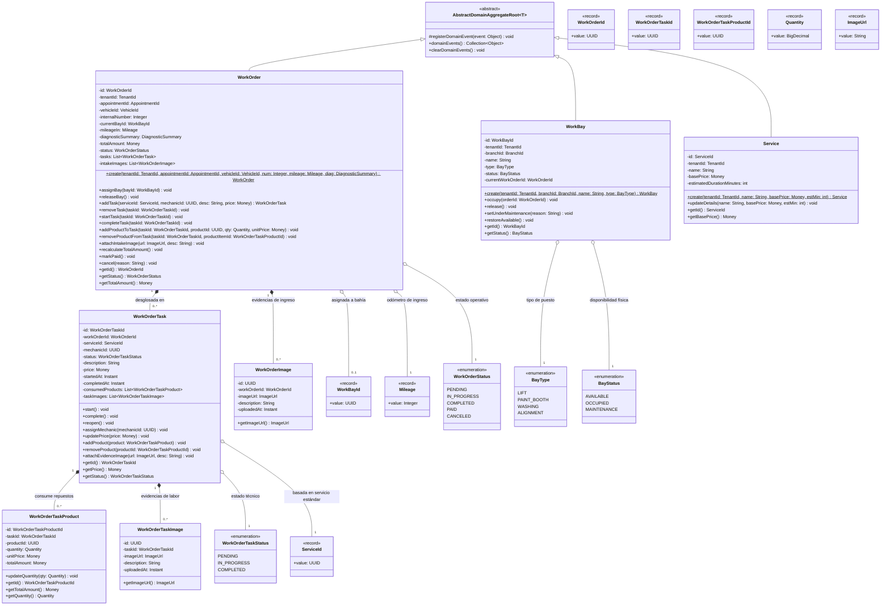
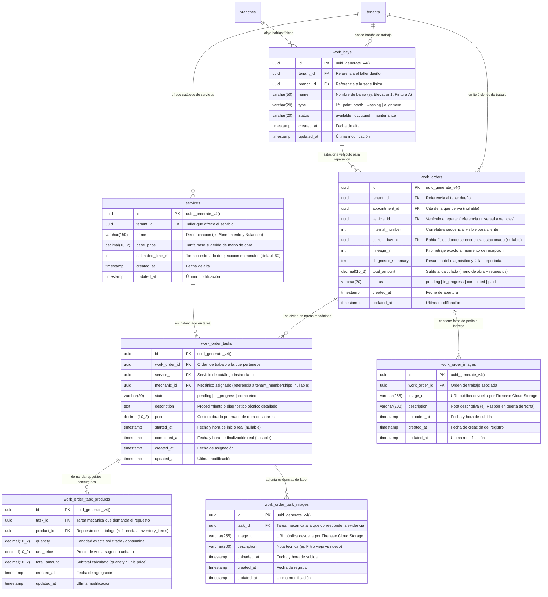

## 6. Fase 3: Bounded Context 3 — Workshop Operations Context (MRO) (`com.andeva.atelier.platform.operations`)

### 6.1. Diccionario y Propósito del Contexto

#### 6.1.1. Propósito y Límites de Responsabilidad
El **Workshop Operations Context (MRO - Maintenance, Repair, and Operations)** es el motor operativo y transaccional central del taller mecánico en Atelier Platform. Su propósito es orquestar todo el flujo físico de reparación automotriz desde que el vehículo ingresa a recepción hasta su entrega final, aislando esta complejidad operativa de los detalles contables de facturación tributaria y de suscripciones SaaS:
1. **Orquestación del Ciclo de Vida de la Orden de Trabajo (`WorkOrder`):** Modela la orden de servicio automotriz completa (`internal_number`, `mileage_in`, `diagnostic_summary`, `total_amount`), gestionando transiciones estrictas de estado (`PENDING`, `IN_PROGRESS`, `COMPLETED`, `PAID`, `CANCELED`).
2. **Control Físico y Capacidad de Bahías de Trabajo (`WorkBay`):** Administra la disponibilidad, ocupación y mantenimiento de los elevadores hidráulicos (`lift`), cabinas de pintura (`paint_booth`), áreas de alineamiento y zonas de lavado en cada sucursal física (`branch_id`).
3. **Desglose Atómico de Tareas de Mano de Obra (`WorkOrderTask`):** Permite seccionar la reparación en intervenciones puntuales, asociadas a servicios estándar del catálogo (`Service`), asignadas a mecánicos específicos (`mechanic_id` referenciado a `tenant_memberships`) y con registro de tiempos reales de inicio y finalización para métricas de productividad.
4. **Demanda y Consumo de Repuestos (`WorkOrderTaskProduct`):** Registra los materiales, piezas y lubricantes consumidos por cada tarea. Al agregarse un repuesto, MRO no descuenta directamente los lotes FIFO (responsabilidad de *Inventory & Supply Chain*), sino que emite eventos de dominio para solicitar la reserva y bloqueo de stock dentro de la misma transacción o mediante consistencia eventual.
5. **Auditoría Visual y Evidencias Fotográficas (`WorkOrderImage` y `WorkOrderTaskImage`):** Soporta el peritaje de ingreso (fotos de rayones, abolladuras o estado del odómetro) y evidencias de reparación técnica (repuesto dañado extraído vs. repuesto nuevo instalado).

#### 6.1.2. Decisiones de Diseño e Integraciones Críticas
* **Patrón de Almacenamiento *Direct-to-Cloud* (Firebase Cloud Storage):** La carga de imágenes de alta resolución capturadas en patio por la aplicación móvil (Atelier Workshop) no satura el backend de Spring Boot. Los clientes móviles suben los binarios directamente a un bucket de **Google Cloud Storage / Firebase Storage** utilizando credenciales seguras o URLs prefirmadas, y envían únicamente al backend la URL pública inmutable (`image_url`) y la descripción textual para su registro transaccional.
* **Soporte de Operatividad *Offline-First*:** Dado que las fosas mecánicas y sótanos de talleres sufren de conectividad intermitente, los mecánicos operan contra una base de datos relacional local embebida en sus dispositivos móviles (**SQLite** mediante Room en Kotlin y sqflite en Flutter). Al recuperar conectividad a internet, el cliente móvil sincroniza las tareas y evidencias hacia los endpoints idempotentes de `/api/v1/work-orders/{id}/tasks`.
* **Cálculo Financiero Centralizado en el Agregado:** El monto total (`total_amount`) de la orden se recalcula de forma puramente determinista y atómica dentro del agregado raíz sumando el costo de mano de obra de todas las tareas activas más el producto de `(quantity * unit_price)` de todos los repuestos solicitados, garantizando coherencia absoluta con el módulo de *Invoicing*.

---

### 6.2. 2.6.3.1. Domain Layer

#### 6.2.1. Aggregates & Aggregate Roots

##### 1. `WorkOrder` (Aggregate Root)
* **Paquete:** `com.andeva.atelier.platform.operations.domain.model.aggregates`
* **Herencia:** Extiende `AbstractDomainAggregateRoot<WorkOrder>`
* **Propósito:** Representa la orden de servicio automotriz. Es el agregado raíz que custodia la integridad del diagnóstico, la asignación de bahía, las tareas mecánicas y los repuestos demandados.
* **Atributos:**
  * `id: WorkOrderId` — Identificador único universal de la orden (UUID).
  * `tenantId: TenantId` — Taller mecánico propietario.
  * `appointmentId: AppointmentId` — Cita previa de la cual deriva la orden (nullable si es ingreso directo de emergencia).
  * `vehicleId: VehicleId` — Vehículo objeto de intervención mecánica.
  * `internalNumber: Integer` — Correlativo numérico secuencial legible por el cliente (ej. 1042).
  * `currentBayId: WorkBayId` — Bahía física donde se encuentra estacionado el vehículo (nullable).
  * `mileageIn: Mileage` — Kilometraje del vehículo al momento de ingresar a recepción.
  * `diagnosticSummary: DiagnosticSummary` — Diagnóstico y fallas reportadas (máx. 2000 caracteres).
  * `totalAmount: Money` — Importe total calculado de la orden (mano de obra + repuestos consumidos).
  * `status: WorkOrderStatus` — Estado operativo (`PENDING`, `IN_PROGRESS`, `COMPLETED`, `PAID`, `CANCELED`).
  * `tasks: List<WorkOrderTask>` — Colección interna de tareas de mano de obra.
  * `intakeImages: List<WorkOrderImage>` — Colección de evidencias fotográficas de recepción.
* **Invariantes y Reglas de Negocio:**
  * El kilometraje de ingreso `mileageIn` no puede ser negativo (`value >= 0`).
  * No se pueden agregar, modificar ni eliminar tareas o repuestos si la orden está en estado `COMPLETED`, `PAID` o `CANCELED`.
  * Toda mutación en tareas o repuestos recalcula inmediatamente el atributo `totalAmount`.
  * La orden no puede transicionar a `COMPLETED` si contiene al menos una tarea en estado `PENDING` o `IN_PROGRESS`.
  * Al completarse la última tarea pendiente, la orden transiciona automáticamente a estado `COMPLETED`.
  * Una orden solo puede marcarse como `PAID` si se encuentra previamente en estado `COMPLETED`.
* **Métodos:**
  * `+ static WorkOrder create(TenantId tenantId, AppointmentId appointmentId, VehicleId vehicleId, Integer internalNumber, Mileage mileageIn, DiagnosticSummary diagnosticSummary): WorkOrder`: Factoría de dominio en estado inicial `PENDING`; registra `WorkOrderCreatedEvent`.
  * `+ void assignBay(WorkBayId bayId): void`: Asigna el vehículo a una bahía física y dispara `WorkBayAssignedEvent`.
  * `+ void releaseBay(): void`: Libera la bahía física ocupada y registra `WorkBayReleasedEvent`.
  * `+ WorkOrderTask addTask(ServiceId serviceId, UUID mechanicId, String description, Money price): WorkOrderTask`: Añade una tarea mecánica al plan de trabajo y recalcula el monto total.
  * `+ void removeTask(WorkOrderTaskId taskId): void`: Remueve una tarea si no ha sido completada, cancela la reserva de sus repuestos asociados y recalcula el total.
  * `+ void startTask(WorkOrderTaskId taskId): void`: Pone en marcha una tarea (`IN_PROGRESS`), transiciona la orden completa a `IN_PROGRESS` si estaba `PENDING` y dispara `WorkOrderTaskStartedEvent`.
  * `+ void completeTask(WorkOrderTaskId taskId): void`: Finaliza la tarea fijando su marca de tiempo de fin y evalúa si todas las tareas han concluido para transicionar la orden a `COMPLETED` (`WorkOrderCompletedEvent`).
  * `+ void addProductToTask(WorkOrderTaskId taskId, UUID productId, Quantity quantity, Money unitPrice): void`: Incorpora un repuesto a la tarea, recalcula el `totalAmount` y registra `ProductStockReservationRequestedEvent`.
  * `+ void removeProductFromTask(WorkOrderTaskId taskId, WorkOrderTaskProductId productItemId): void`: Elimina un repuesto de la tarea, recalcula el `totalAmount` y registra `ProductStockReservationCancelledEvent`.
  * `+ void attachIntakeImage(ImageUrl imageUrl, String description): void`: Registra una evidencia fotográfica del peritaje inicial.
  * `+ void recalculateTotalAmount(): void`: Suma aritmética determinista de la mano de obra de cada tarea activa más `(quantity * unit_price)` de todos los repuestos consumidos.
  * `+ void markPaid(): void`: Registra la cancelación económica de la orden y dispara `WorkOrderPaidEvent`.
  * `+ void cancel(String reason): void`: Anula la orden y libera todas las reservas de repuestos activas.

##### 2. `WorkBay` (Aggregate Root)
* **Paquete:** `com.andeva.atelier.platform.operations.domain.model.aggregates`
* **Herencia:** Extiende `AbstractDomainAggregateRoot<WorkBay>`
* **Propósito:** Representa un espacio físico o puesto de trabajo habilitado en una sucursal del taller (elevador de dos columnas, fosa mecánica, cabina de pintura, etc.).
* **Atributos:**
  * `id: WorkBayId` — Identificador único de la bahía (UUID).
  * `tenantId: TenantId` — Taller propietario.
  * `branchId: BranchId` — Sede física donde se ubica la bahía.
  * `name: String` — Denominación identificatoria (ej. "Elevador 1", "Bahía Rápida A").
  * `type: BayType` — Clasificación técnica (`LIFT`, `PAINT_BOOTH`, `WASHING`, `ALIGNMENT`).
  * `status: BayStatus` — Estado de ocupación física (`AVAILABLE`, `OCCUPIED`, `MAINTENANCE`).
  * `currentWorkOrderId: WorkOrderId` — Orden de trabajo que ocupa actualmente la bahía (nullable).
* **Invariantes y Reglas de Negocio:**
  * No se puede ocupar una bahía que ya se encuentre en estado `OCCUPIED` o `MAINTENANCE`.
  * Solo una bahía ocupada puede ser liberada.
* **Métodos:**
  * `+ static WorkBay create(TenantId tenantId, BranchId branchId, String name, BayType type): WorkBay`: Factoría de dominio en estado `AVAILABLE`.
  * `+ void occupy(WorkOrderId orderId): void`: Bloquea la bahía asociándola a la orden activa y cambia el estado a `OCCUPIED`.
  * `+ void release(): void`: Desvincula la orden y restablece el estado a `AVAILABLE`.
  * `+ void setUnderMaintenance(String reason): void`: Inhabilita la bahía por avería mecánica o calibración.
  * `+ void restoreAvailable(): void`: Restituye la operatividad de la bahía a `AVAILABLE`.

##### 3. `Service` (Aggregate Root - Catálogo de Mano de Obra)
* **Paquete:** `com.andeva.atelier.platform.operations.domain.model.aggregates`
* **Herencia:** Extiende `AbstractDomainAggregateRoot<Service>`
* **Propósito:** Modela el catálogo de servicios estándar y paquetes de mano de obra que ofrece el taller automotriz a sus clientes.
* **Atributos:**
  * `id: ServiceId` — Identificador del servicio (UUID).
  * `tenantId: TenantId` — Taller dueño del catálogo.
  * `name: String` — Denominación del servicio (ej. "Alineamiento y Balanceo Computarizado", "Cambio de Pastillas de Freno").
  * `basePrice: Money` — Tarifa base sugerida por concepto de mano de obra.
  * `estimatedDurationMinutes: int` — Tiempo promedio estimado de ejecución técnica (default: 60 minutos).
* **Métodos:**
  * `+ static Service create(TenantId tenantId, String name, Money basePrice, int estimatedMinutes): Service`: Factoría de dominio.
  * `+ void updateDetails(String newName, Money newBasePrice, int newEstimatedMinutes): void`: Actualiza tarifa y tiempos estándar.

---

#### 6.2.2. Entities

##### 1. `WorkOrderTask` (Entidad Dependiente de `WorkOrder`)
* **Paquete:** `com.andeva.atelier.platform.operations.domain.model.entities`
* **Propósito:** Representa una actividad concreta de mano de obra dentro del plan de reparación vehicular.
* **Atributos:**
  * `id: WorkOrderTaskId` — Identificador único de la tarea (UUID).
  * `workOrderId: WorkOrderId` — Orden de trabajo a la que pertenece.
  * `serviceId: ServiceId` — Servicio de catálogo asociado.
  * `mechanicId: UUID` — Identificador de membresía del mecánico asignado (referencia a `tenant_memberships`, nullable).
  * `status: WorkOrderTaskStatus` — Estado de la labor (`PENDING`, `IN_PROGRESS`, `COMPLETED`).
  * `description: String` — Detalle del procedimiento mecánico o diagnóstico específico.
  * `price: Money` — Costo cobrado por la mano de obra de esta tarea específica.
  * `startedAt: Instant` — Marca de tiempo en que el mecánico inició la tarea.
  * `completedAt: Instant` — Marca de tiempo en que el mecánico finalizó la labor.
  * `consumedProducts: List<WorkOrderTaskProduct>` — Colección de repuestos utilizados en esta tarea.
  * `taskImages: List<WorkOrderTaskImage>` — Evidencias fotográficas específicas de esta labor.
* **Métodos:**
  * `+ void start(): void`: Registra `startedAt = Instant.now()` y fija `status = IN_PROGRESS`.
  * `+ void complete(): void`: Registra `completedAt = Instant.now()` y fija `status = COMPLETED`.
  * `+ void reopen(): void`: Retorna a `IN_PROGRESS` y anula `completedAt`.
  * `+ void assignMechanic(UUID mechanicMembershipId): void`: Asocia el técnico responsable.
  * `+ void updatePrice(Money newPrice): void`: Actualiza el importe de mano de obra.
  * `+ void addProduct(WorkOrderTaskProduct product): void`: Agrega un requerimiento de repuesto.
  * `+ void removeProduct(WorkOrderTaskProductId productId): void`: Elimina un repuesto.
  * `+ void attachEvidenceImage(ImageUrl url, String description): void`: Adjunta evidencia de trabajo.

##### 2. `WorkOrderTaskProduct` (Entidad Dependiente de `WorkOrderTask`)
* **Paquete:** `com.andeva.atelier.platform.operations.domain.model.entities`
* **Propósito:** Cuantifica el consumo de un repuesto, insumo o lubricante físico para una tarea determinada.
* **Atributos:**
  * `id: WorkOrderTaskProductId` — Identificador único del ítem (UUID).
  * `taskId: WorkOrderTaskId` — Tarea que demanda el repuesto.
  * `productId: UUID` — Identificador del ítem en catálogo (`inventory_items`).
  * `quantity: Quantity` — Cantidad solicitada (con precisión de dos decimales).
  * `unitPrice: Money` — Precio unitario de venta pactado al momento de su incorporación.
  * `totalAmount: Money` — Subtotal calculado (`quantity * unitPrice`).
* **Métodos:**
  * `+ void updateQuantity(Quantity newQuantity): void`: Modifica la cantidad consumida y recalcula `totalAmount`.

##### 3. `WorkOrderImage` (Entidad Dependiente de `WorkOrder`)
* **Paquete:** `com.andeva.atelier.platform.operations.domain.model.entities`
* **Propósito:** Registra evidencias visuales del peritaje de ingreso a recepción del taller.
* **Atributos:**
  * `id: UUID` — Identificador del registro fotográfico.
  * `workOrderId: WorkOrderId` — Orden de trabajo vinculada.
  * `imageUrl: ImageUrl` — URL pública del objeto alojado en Firebase Cloud Storage.
  * `description: String` — Nota explicativa del perito (ej. "Abolladura previa en parachoque delantero").
  * `uploadedAt: Instant` — Marca de tiempo de registro.

##### 4. `WorkOrderTaskImage` (Entidad Dependiente de `WorkOrderTask`)
* **Paquete:** `com.andeva.atelier.platform.operations.domain.model.entities`
* **Propósito:** Registra evidencias visuales del procedimiento técnico ejecutado por el mecánico.
* **Atributos:**
  * `id: UUID` — Identificador del registro.
  * `taskId: WorkOrderTaskId` — Tarea mecánica asociada.
  * `imageUrl: ImageUrl` — URL pública en Firebase Cloud Storage.
  * `description: String` — Descripción técnica (ej. "Disco de freno fisurado vs disco ventilado nuevo").
  * `uploadedAt: Instant` — Marca de tiempo.

---

#### 6.2.3. Value Objects

* **`WorkOrderId(UUID value)`:** Identificador tipado de orden de trabajo.
* **`WorkOrderTaskId(UUID value)`:** Identificador tipado de tarea.
* **`WorkOrderTaskProductId(UUID value)`:** Identificador tipado de repuesto consumido.
* **`WorkBayId(UUID value)`:** Identificador tipado de bahía de trabajo.
* **`ServiceId(UUID value)`:** Identificador tipado de servicio de catálogo.
* **`Mileage(Integer value)`:** Kilometraje automotriz entero no negativo (`value >= 0`).
* **`DiagnosticSummary(String value)`:** Resumen de diagnóstico preliminar (máximo 2000 caracteres, normalizado sin espacios redundantes).
* **`Quantity(BigDecimal value)`:** Cantidad numérica no negativa para repuestos o litros de lubricante (escala 2).
* **`ImageUrl(String value)`:** Valida formato URL HTTPS canónico apuntando al storage de la nube (`storage.googleapis.com` o dominio verificado de Firebase).
* **`WorkOrderStatus` (Enum):** `PENDING`, `IN_PROGRESS`, `COMPLETED`, `PAID`, `CANCELED`.
* **`WorkOrderTaskStatus` (Enum):** `PENDING`, `IN_PROGRESS`, `COMPLETED`.
* **`BayType` (Enum):** `LIFT`, `PAINT_BOOTH`, `WASHING`, `ALIGNMENT`.
* **`BayStatus` (Enum):** `AVAILABLE`, `OCCUPIED`, `MAINTENANCE`.

---

#### 6.2.4. Domain Commands

* `CreateWorkOrderCommand(TenantId tenantId, AppointmentId appointmentId, VehicleId vehicleId, Mileage mileageIn, DiagnosticSummary diagnosticSummary)`
* `AssignWorkBayCommand(WorkOrderId workOrderId, WorkBayId bayId)`
* `ReleaseWorkBayCommand(WorkOrderId workOrderId)`
* `AddTaskToWorkOrderCommand(WorkOrderId workOrderId, ServiceId serviceId, UUID mechanicId, String description, BigDecimal price, String currency)`
* `StartWorkOrderTaskCommand(WorkOrderId workOrderId, WorkOrderTaskId taskId)`
* `CompleteWorkOrderTaskCommand(WorkOrderId workOrderId, WorkOrderTaskId taskId)`
* `AddProductToTaskCommand(WorkOrderId workOrderId, WorkOrderTaskId taskId, UUID productId, BigDecimal quantity, BigDecimal unitPrice, String currency)`
* `RemoveProductFromTaskCommand(WorkOrderId workOrderId, WorkOrderTaskId taskId, WorkOrderTaskProductId productItemId)`
* `AttachIntakeImageCommand(WorkOrderId workOrderId, String imageUrl, String description)`
* `AttachTaskEvidenceImageCommand(WorkOrderId workOrderId, WorkOrderTaskId taskId, String imageUrl, String description)`
* `CreateWorkBayCommand(TenantId tenantId, BranchId branchId, String name, BayType bayType)`
* `UpdateWorkBayStatusCommand(WorkBayId bayId, BayStatus status, String reason)`
* `CreateServiceItemCommand(TenantId tenantId, String name, BigDecimal basePrice, String currency, int estimatedMinutes)`
* `UpdateServiceItemCommand(ServiceId serviceId, String name, BigDecimal basePrice, String currency, int estimatedMinutes)`
* `MarkWorkOrderAsPaidCommand(WorkOrderId workOrderId)`

---

#### 6.2.5. Domain Queries

* `GetWorkOrderByIdQuery(WorkOrderId workOrderId)`
* `GetWorkOrdersByTenantIdQuery(TenantId tenantId)`
* `GetWorkOrdersByBranchIdQuery(TenantId tenantId, BranchId branchId)`
* `GetWorkOrdersByVehicleIdQuery(VehicleId vehicleId)`
* `GetWorkOrdersByBayIdQuery(WorkBayId bayId)`
* `GetWorkBaysByBranchIdQuery(TenantId tenantId, BranchId branchId)`
* `GetAvailableWorkBaysQuery(TenantId tenantId, BranchId branchId, BayType bayType)`
* `GetServicesByTenantIdQuery(TenantId tenantId)`
* `GetServiceByIdQuery(ServiceId serviceId)`

---

#### 6.2.6. Domain Events

* `WorkOrderCreatedEvent(WorkOrderId workOrderId, TenantId tenantId, VehicleId vehicleId, Integer internalNumber, Instant occurredOn)`
* `WorkBayAssignedEvent(WorkOrderId workOrderId, WorkBayId bayId, Instant occurredOn)`
* `WorkBayReleasedEvent(WorkOrderId workOrderId, WorkBayId bayId, Instant occurredOn)`
* `WorkOrderTaskStartedEvent(WorkOrderId workOrderId, WorkOrderTaskId taskId, UUID mechanicId, Instant occurredOn)`
* `WorkOrderTaskCompletedEvent(WorkOrderId workOrderId, WorkOrderTaskId taskId, UUID mechanicId, Instant occurredOn)`
* `WorkOrderCompletedEvent(WorkOrderId workOrderId, TenantId tenantId, VehicleId vehicleId, Money totalAmount, Instant occurredOn)`
* `WorkOrderPaidEvent(WorkOrderId workOrderId, TenantId tenantId, Money totalAmount, Instant occurredOn)`
* `ProductStockReservationRequestedEvent(WorkOrderId workOrderId, WorkOrderTaskId taskId, UUID productId, Quantity quantity, Instant occurredOn)`
* `ProductStockReservationCancelledEvent(WorkOrderId workOrderId, WorkOrderTaskId taskId, UUID productId, Quantity quantity, Instant occurredOn)`
* `WorkOrderIntakeImageAttachedEvent(WorkOrderId workOrderId, UUID imageId, ImageUrl imageUrl, Instant occurredOn)`
* `WorkOrderTaskEvidenceAttachedEvent(WorkOrderId workOrderId, WorkOrderTaskId taskId, UUID imageId, ImageUrl imageUrl, Instant occurredOn)`

---

#### 6.2.7. Repositories (Interfaces de Dominio)

* **`WorkOrderRepository`:**
  * `WorkOrder save(WorkOrder workOrder)`
  * `Optional<WorkOrder> findById(WorkOrderId id)`
  * `List<WorkOrder> findByTenantId(TenantId tenantId)`
  * `List<WorkOrder> findByVehicleId(VehicleId vehicleId)`
  * `Optional<WorkOrder> findByCurrentBayId(WorkBayId bayId)`
  * `Integer findNextInternalNumber(TenantId tenantId)`
* **`WorkBayRepository`:**
  * `WorkBay save(WorkBay workBay)`
  * `Optional<WorkBay> findById(WorkBayId id)`
  * `List<WorkBay> findByTenantIdAndBranchId(TenantId tenantId, BranchId branchId)`
  * `List<WorkBay> findAvailableBays(TenantId tenantId, BranchId branchId, BayType bayType)`
* **`ServiceRepository`:**
  * `Service save(Service service)`
  * `Optional<Service> findById(ServiceId id)`
  * `List<Service> findByTenantId(TenantId tenantId)`

---

### 6.3. 2.6.3.2. Interface Layer

#### 6.3.1. REST Controllers

##### 1. `WorkOrdersController`
* **Ruta Base:** `/api/v1/work-orders`
* **Propósito:** Apertura, supervisión, asignación de bahías y liquidación de órdenes de trabajo.
* **Endpoints:**
  * `POST`: Apertura de nueva orden de trabajo. Recibe `CreateWorkOrderResource`, retorna `WorkOrderResource` (HTTP 201 Created).
  * `GET`: Listado de órdenes filtradas por sucursal, vehículo o estado. Retorna `List<WorkOrderSummaryResource>` (HTTP 200 OK).
  * `GET /{id}`: Consulta detallada de la orden con sus tareas, repuestos e imágenes de recepción. Retorna `WorkOrderDetailResource` (HTTP 200 OK / 404 Not Found).
  * `PUT /{id}/bay`: Asignación o reubicación de bahía de trabajo. Recibe `AssignWorkBayResource`, retorna `WorkOrderResource` (HTTP 200 OK).
  * `DELETE /{id}/bay`: Liberación manual de la bahía de trabajo actual. Retorna HTTP 204 No Content.
  * `POST /{id}/intake-images`: Registro de imagen de inspección de ingreso. Recibe `AttachImageResource`, retorna `WorkOrderImageResource` (HTTP 201 Created).
  * `POST /{id}/tasks`: Incorporación de una nueva tarea mecánica al plan de trabajo. Recibe `CreateWorkOrderTaskResource`, retorna `WorkOrderTaskResource` (HTTP 201 Created).
  * `PUT /{id}/cancel`: Anulación de la orden con liberación de repuestos y bahía. Recibe `CancelWorkOrderResource`, retorna `WorkOrderResource` (HTTP 200 OK).

##### 2. `WorkOrderTasksController`
* **Ruta Base:** `/api/v1/work-order-tasks`
* **Propósito:** Operaciones de ejecución mecánica en foso por parte de los técnicos.
* **Endpoints:**
  * `PUT /{taskId}/start`: El mecánico inicia la intervención técnica. Retorna `WorkOrderTaskResource` (HTTP 200 OK).
  * `PUT /{taskId}/complete`: El mecánico marca la labor completada. Retorna `WorkOrderTaskResource` (HTTP 200 OK).
  * `POST /{taskId}/products`: Solicitud de repuesto para la tarea (reserva stock en inventario). Recibe `AddTaskProductResource`, retorna `TaskProductResource` (HTTP 201 Created).
  * `DELETE /{taskId}/products/{productId}`: Remoción de repuesto (libera reserva en inventario). Retorna HTTP 204 No Content.
  * `POST /{taskId}/evidence-images`: Carga de evidencia fotográfica del trabajo. Recibe `AttachImageResource`, retorna `WorkOrderImageResource` (HTTP 201 Created).

##### 3. `WorkBaysController`
* **Ruta Base:** `/api/v1/work-bays`
* **Propósito:** Gestión física de elevadores y puestos de taller.
* **Endpoints:**
  * `POST`: Alta de nueva bahía en una sucursal. Recibe `CreateWorkBayResource`, retorna `WorkBayResource` (HTTP 201 Created).
  * `GET`: Listado de bahías con estado de ocupación actual. Retorna `List<WorkBayResource>` (HTTP 200 OK).
  * `PUT /{id}/maintenance`: Puesta en mantenimiento de la bahía. Recibe `MaintenanceBayResource`, retorna `WorkBayResource` (HTTP 200 OK).
  * `PUT /{id}/restore`: Restitución a estado disponible. Retorna `WorkBayResource` (HTTP 200 OK).

##### 4. `ServicesController`
* **Ruta Base:** `/api/v1/services`
* **Propósito:** Catálogo maestro de servicios y mano de obra del taller.
* **Endpoints:**
  * `POST`: Creación de servicio estándar. Recibe `CreateServiceResource`, retorna `ServiceResource` (HTTP 201 Created).
  * `GET`: Catálogo de servicios del taller. Retorna `List<ServiceResource>` (HTTP 200 OK).
  * `PUT /{id}`: Actualización de tarifa base o tiempos. Recibe `UpdateServiceResource`, retorna `ServiceResource` (HTTP 200 OK).

---

#### 6.3.2. Resources / DTOs

* **Peticiones (Requests):**
  * `CreateWorkOrderResource(UUID appointmentId, UUID vehicleId, Integer mileageIn, String diagnosticSummary)`
  * `AssignWorkBayResource(UUID bayId)`
  * `CreateWorkOrderTaskResource(UUID serviceId, UUID mechanicId, String description, BigDecimal price, String currency)`
  * `AddTaskProductResource(UUID productId, BigDecimal quantity, BigDecimal unitPrice, String currency)`
  * `AttachImageResource(String imageUrl, String description)`
  * `CancelWorkOrderResource(String reason)`
  * `CreateWorkBayResource(UUID branchId, String name, String bayType)`
  * `MaintenanceBayResource(String reason)`
  * `CreateServiceResource(String name, BigDecimal basePrice, String currency, int estimatedMinutes)`
  * `UpdateServiceResource(String name, BigDecimal basePrice, String currency, int estimatedMinutes)`
* **Respuestas (Responses):**
  * `WorkOrderResource(UUID id, UUID tenantId, Integer internalNumber, UUID vehicleId, UUID currentBayId, Integer mileageIn, String status, BigDecimal totalAmount, String currency)`
  * `WorkOrderDetailResource(UUID id, UUID tenantId, Integer internalNumber, UUID vehicleId, UUID currentBayId, String bayName, Integer mileageIn, String diagnosticSummary, String status, BigDecimal totalAmount, String currency, List<WorkOrderTaskResource> tasks, List<WorkOrderImageResource> intakeImages)`
  * `WorkOrderTaskResource(UUID id, UUID workOrderId, UUID serviceId, String serviceName, UUID mechanicId, String mechanicName, String status, String description, BigDecimal price, String currency, Instant startedAt, Instant completedAt, List<TaskProductResource> products, List<WorkOrderImageResource> evidenceImages)`
  * `TaskProductResource(UUID id, UUID taskId, UUID productId, String productName, BigDecimal quantity, BigDecimal unitPrice, BigDecimal totalAmount, String currency)`
  * `WorkOrderImageResource(UUID id, String imageUrl, String description, Instant uploadedAt)`
  * `WorkBayResource(UUID id, UUID tenantId, UUID branchId, String name, String bayType, String status, UUID currentWorkOrderId)`
  * `ServiceResource(UUID id, UUID tenantId, String name, BigDecimal basePrice, String currency, int estimatedMinutes)`

---

#### 6.3.3. Resource Assemblers

* `WorkOrderResourceAssembler`: Transforma `WorkOrder` a `WorkOrderResource` y `WorkOrderDetailResource`.
* `WorkOrderTaskResourceAssembler`: Transforma `WorkOrderTask` a `WorkOrderTaskResource`.
* `WorkBayResourceAssembler`: Transforma `WorkBay` a `WorkBayResource`.
* `ServiceResourceAssembler`: Transforma `Service` a `ServiceResource`.

---

#### 6.3.4. Open Host Service (OHS) / Inbound ACL Facade

Interfaz pública en `com.andeva.atelier.platform.operations.interfaces.acl`:

```java
package com.andeva.atelier.platform.operations.interfaces.acl;

import java.math.BigDecimal;
import java.util.List;
import java.util.Optional;
import java.util.UUID;

public interface WorkshopOperationsContextFacade {
    Optional<WorkOrderSummaryDto> fetchWorkOrderById(UUID workOrderId);
    Optional<WorkOrderBillingDto> fetchWorkOrderBillingDetails(UUID workOrderId);
    List<WorkOrderConsumedProductDto> fetchProductsConsumedInOrder(UUID workOrderId);
    boolean markWorkOrderAsPaid(UUID workOrderId);
    boolean isBayOccupied(UUID bayId);
}
```

*DTOs Exportados por la Fachada:*
* `WorkOrderSummaryDto(UUID id, UUID tenantId, Integer internalNumber, UUID vehicleId, String status, BigDecimal totalAmount, String currency)`
* `WorkOrderBillingDto(UUID id, UUID tenantId, Integer internalNumber, UUID customerId, UUID vehicleId, BigDecimal laborSubtotal, BigDecimal productsSubtotal, BigDecimal totalAmount, String currency)`
* `WorkOrderConsumedProductDto(UUID productId, BigDecimal quantity, BigDecimal unitPrice, BigDecimal totalAmount)`

---

#### 6.3.5. Integration Events (Published Language)

* `WorkOrderCreatedIntegrationEvent(UUID workOrderId, UUID tenantId, UUID vehicleId, Integer internalNumber, Instant occurredOn)`: Notifica a la app del conductor que su auto ha sido recibido en el taller.
* `WorkOrderCompletedIntegrationEvent(UUID workOrderId, UUID tenantId, UUID vehicleId, BigDecimal totalAmount, String currency, Instant occurredOn)`: Notifica a *Invoicing* que la orden está lista para liquidación y emisión de comprobante.
* `WorkOrderPaidIntegrationEvent(UUID workOrderId, UUID tenantId, Instant occurredOn)`: Registra la finalización contable y operativa del servicio.
* `ProductStockReservationRequestedIntegrationEvent(UUID workOrderId, UUID taskId, UUID productId, BigDecimal quantity, Instant occurredOn)`: Solicita al contexto *Inventory & Supply Chain* la reserva física de repuestos mediante costeo FIFO.
* `ProductStockReservationCancelledIntegrationEvent(UUID workOrderId, UUID taskId, UUID productId, BigDecimal quantity, Instant occurredOn)`: Libera la reserva en el inventario ante retiro o anulación de la tarea.

---

### 6.4. 2.6.3.3. Application Layer

#### 6.4.1. Command Services & Implementations

##### 1. `WorkOrderCommandService` & `WorkOrderCommandServiceImpl`
* `Result<WorkOrder, ApplicationError> handle(CreateWorkOrderCommand command)`:
  1. Consulta a *CRM* vía `CustomerFleetContextFacade` para validar la existencia del `vehicleId` y la cita asociada.
  2. Obtiene el correlativo secuencial siguiente del taller (`WorkOrderRepository.findNextInternalNumber`).
  3. Instancia el agregado `WorkOrder` en estado `PENDING`.
  4. Persiste la orden y retorna `Result.success(workOrder)`.
* `Result<WorkOrder, ApplicationError> handle(AssignWorkBayCommand command)`:
  1. Localiza la bahía física por ID (`WorkBayRepository`).
  2. Verifica que la bahía esté en estado `AVAILABLE`.
  3. Ejecuta `workBay.occupy(workOrderId)` y `workOrder.assignBay(bayId)`.
  4. Persiste ambos agregados en una transacción atómica.
* `Result<WorkOrder, ApplicationError> handle(AddTaskToWorkOrderCommand command)`:
  1. Valida existencia del servicio en el catálogo (`ServiceRepository`).
  2. Si se especificó mecánico, valida que sea miembro activo del taller mediante `TenancyContextFacade`.
  3. Añade la tarea al agregado `workOrder.addTask(...)`.
  4. Persiste la orden y retorna `Result.success(workOrder)`.
* `Result<WorkOrder, ApplicationError> handle(StartWorkOrderTaskCommand command)`: Inicia la tarea del mecánico y promueve el estado de la orden a `IN_PROGRESS`.
* `Result<WorkOrder, ApplicationError> handle(CompleteWorkOrderTaskCommand command)`: Marca la tarea completada y, si todas las demás terminaron, transiciona la orden completa a `COMPLETED`.
* `Result<WorkOrder, ApplicationError> handle(AddProductToTaskCommand command)`:
  1. Añade el repuesto consumido a la tarea.
  2. Publica `ProductStockReservationRequestedEvent` para que el módulo de Inventario bloquee las unidades por FIFO.
  3. Recalcula el `totalAmount` y persiste la orden.
* `Result<WorkOrder, ApplicationError> handle(RemoveProductFromTaskCommand command)`: Remueve el ítem, publica `ProductStockReservationCancelledEvent` y actualiza el monto total.
* `Result<WorkOrder, ApplicationError> handle(AttachIntakeImageCommand command)`: Registra la metadata de la imagen subida a Firebase Storage.
* `Result<Void, ApplicationError> handle(MarkWorkOrderAsPaidCommand command)`: Marca la orden como `PAID` y libera la bahía si aún estaba ocupada.

##### 2. `WorkBayCommandService` & `WorkBayCommandServiceImpl`
* `Result<WorkBay, ApplicationError> handle(CreateWorkBayCommand command)`: Valida la existencia de la sede física (`branchId`) y crea la nueva bahía.
* `Result<WorkBay, ApplicationError> handle(UpdateWorkBayStatusCommand command)`: Conmuta estado a mantenimiento o disponible.

##### 3. `ServiceCommandService` & `ServiceCommandServiceImpl`
* `Result<Service, ApplicationError> handle(CreateServiceItemCommand command)`: Da de alta un nuevo servicio de mano de obra en el catálogo del taller.
* `Result<Service, ApplicationError> handle(UpdateServiceItemCommand command)`: Actualiza precio y tiempo estimado de un servicio.

---

#### 6.4.2. Query Services & Implementations

* **`WorkOrderQueryService` & `WorkOrderQueryServiceImpl`:**
  * `Optional<WorkOrder> handle(GetWorkOrderByIdQuery query)`
  * `List<WorkOrder> handle(GetWorkOrdersByTenantIdQuery query)`
  * `List<WorkOrder> handle(GetWorkOrdersByBranchIdQuery query)`
  * `List<WorkOrder> handle(GetWorkOrdersByVehicleIdQuery query)`
* **`WorkBayQueryService` & `WorkBayQueryServiceImpl`:**
  * `Optional<WorkBay> handle(GetWorkBayByIdQuery query)`
  * `List<WorkBay> handle(GetWorkBaysByBranchIdQuery query)`
  * `List<WorkBay> handle(GetAvailableWorkBaysQuery query)`
* **`ServiceQueryService` & `ServiceQueryServiceImpl`:**
  * `Optional<Service> handle(GetServiceByIdQuery query)`
  * `List<Service> handle(GetServicesByTenantIdQuery query)`

---

#### 6.4.3. Event Handlers & Listeners

* **`AppointmentArrivedListener`:**
  * `@TransactionalEventListener(phase = TransactionPhase.AFTER_COMMIT) void on(AppointmentArrivedIntegrationEvent event)`: Captura el arribo físico del cliente desde el contexto CRM y genera automáticamente un borrador preliminar de `WorkOrder` con el kilometraje y motivo de inspección reportados.
* **`PaymentProcessedListener`:**
  * `@EventListener void on(PaymentProcessedIntegrationEvent event)`: Escucha la liquidación tributaria emitida por *Invoicing* y ejecuta `MarkWorkOrderAsPaidCommand`.
* **`WorkOrderInventoryEventHandler`:**
  * `@EventListener void on(ProductStockReservationRequestedEvent event)`: Publica el evento de integración hacia *Inventory & Supply Chain*.

---

#### 6.4.4. Outbound ACL Services

* **`CustomerFleetAclService`:** Consulta el propietario del vehículo, placa y detalles técnicos al módulo CRM.
* **`InventoryReservationAclService`:** Comunica requerimientos de piezas al motor FIFO de Inventario.
* **`FirebaseStorageDirectUploadGateway`:** Valida que las URLs provistas provengan del bucket oficial de Firebase Storage configurado para Atelier (`gs://atelier-platform.firebasestorage.app`).

---

### 6.5. 2.6.3.4. Infrastructure Layer

#### 6.5.1. JPA Persistence Entities

Ubicadas en `com.andeva.atelier.platform.operations.infrastructure.persistence.jpa.entities`:

##### 1. `WorkOrderPersistenceEntity` (Tabla `work_orders`)
* Extiende `AuditableAbstractPersistenceEntity`.
* `@Column(name = "tenant_id", nullable = false)`: Taller dueño.
* `@Column(name = "appointment_id")`: Cita de la que deriva (nullable).
* `@Column(name = "vehicle_id", nullable = false)`: Vehículo objeto de servicio.
* `@Column(name = "internal_number", nullable = false)`: Correlativo numérico secuencial.
* `@Column(name = "current_bay_id")`: Bahía asignada (nullable).
* `@Column(name = "mileage_in", nullable = false)`: Kilometraje de entrada.
* `@Column(name = "diagnostic_summary", length = 2000, nullable = false)`: Resumen del diagnóstico.
* `@Column(name = "total_amount", precision = 10, scale = 2, nullable = false)`: Importe total de la orden.
* `@Column(name = "status", nullable = false, length = 20)`: `pending`, `in_progress`, `completed`, `paid`.
* `@OneToMany(mappedBy = "workOrder", cascade = CascadeType.ALL, orphanRemoval = true)`: Colección de `WorkOrderTaskPersistenceEntity`.
* `@OneToMany(mappedBy = "workOrder", cascade = CascadeType.ALL, orphanRemoval = true)`: Colección de `WorkOrderImagePersistenceEntity`.

##### 2. `WorkBayPersistenceEntity` (Tabla `work_bays`)
* Extiende `AuditableAbstractPersistenceEntity`.
* `@Column(name = "tenant_id", nullable = false)`: Taller dueño.
* `@Column(name = "branch_id", nullable = false)`: Sede física donde opera la bahía.
* `@Column(name = "name", nullable = false, length = 50)`: Nombre o código de bahía.
* `@Column(name = "type", nullable = false, length = 20)`: `lift`, `paint_booth`, `washing`, `alignment`.
* `@Column(name = "status", nullable = false, length = 20)`: `available`, `occupied`, `maintenance`.
* `@Column(name = "current_work_order_id")`: OT asociada si está ocupada.

##### 3. `WorkOrderTaskPersistenceEntity` (Tabla `work_order_tasks`)
* Extiende `AuditableAbstractPersistenceEntity`.
* `@ManyToOne(fetch = FetchType.LAZY) @JoinColumn(name = "work_order_id", nullable = false)`: Orden de trabajo padre.
* `@Column(name = "service_id", nullable = false)`: Servicio de catálogo asociado.
* `@Column(name = "mechanic_id")`: Membresía del mecánico asignado (nullable).
* `@Column(name = "status", nullable = false, length = 20)`: `pending`, `in_progress`, `completed`.
* `@Column(name = "description", nullable = false, columnDefinition = "TEXT")`: Procedimiento detallado.
* `@Column(name = "price", precision = 10, scale = 2, nullable = false)`: Mano de obra cobrada.
* `@Column(name = "started_at")`: Fecha y hora de inicio real.
* `@Column(name = "completed_at")`: Fecha y hora de finalización real.
* `@OneToMany(mappedBy = "task", cascade = CascadeType.ALL, orphanRemoval = true)`: Colección de `WorkOrderTaskProductPersistenceEntity`.
* `@OneToMany(mappedBy = "task", cascade = CascadeType.ALL, orphanRemoval = true)`: Colección de `WorkOrderTaskImagePersistenceEntity`.

##### 4. `WorkOrderTaskProductPersistenceEntity` (Tabla `work_order_task_products`)
* Extiende `AuditableAbstractPersistenceEntity`.
* `@ManyToOne(fetch = FetchType.LAZY) @JoinColumn(name = "task_id", nullable = false)`: Tarea solicitante.
* `@Column(name = "product_id", nullable = false)`: Repuesto del catálogo de inventario.
* `@Column(name = "quantity", precision = 10, scale = 2, nullable = false)`: Cantidad utilizada.
* `@Column(name = "unit_price", precision = 10, scale = 2, nullable = false)`: Precio unitario cobrado.
* `@Column(name = "total_amount", precision = 10, scale = 2, nullable = false)`: Subtotal (`quantity * unit_price`).

##### 5. `WorkOrderImagePersistenceEntity` (Tabla `work_order_images`)
* Extiende `AuditableAbstractPersistenceEntity`.
* `@ManyToOne(fetch = FetchType.LAZY) @JoinColumn(name = "work_order_id", nullable = false)`: OT asociada.
* `@Column(name = "image_url", nullable = false, length = 255)`: URL pública en Firebase Cloud Storage.
* `@Column(name = "description", length = 200)`: Nota explicativa del peritaje.
* `@Column(name = "uploaded_at", nullable = false)`: Fecha y hora de subida.

##### 6. `WorkOrderTaskImagePersistenceEntity` (Tabla `work_order_task_images`)
* Extiende `AuditableAbstractPersistenceEntity`.
* `@ManyToOne(fetch = FetchType.LAZY) @JoinColumn(name = "task_id", nullable = false)`: Tarea asociada.
* `@Column(name = "image_url", nullable = false, length = 255)`: URL pública en Firebase Cloud Storage.
* `@Column(name = "description", length = 200)`: Explicación de la evidencia mecánica.
* `@Column(name = "uploaded_at", nullable = false)`: Fecha y hora de subida.

##### 7. `ServicePersistenceEntity` (Tabla `services`)
* Extiende `AuditableAbstractPersistenceEntity`.
* `@Column(name = "tenant_id", nullable = false)`: Taller dueño del catálogo.
* `@Column(name = "name", nullable = false, length = 150)`: Denominación del servicio.
* `@Column(name = "base_price", precision = 10, scale = 2, nullable = false)`: Tarifa sugerida de mano de obra.
* `@Column(name = "estimated_time_m", nullable = false)`: Duración estimada en minutos.

---

#### 6.5.2. JPA Persistence Repositories

* `WorkOrderPersistenceRepository extends JpaRepository<WorkOrderPersistenceEntity, UUID>`
* `WorkBayPersistenceRepository extends JpaRepository<WorkBayPersistenceEntity, UUID>`
* `WorkOrderTaskPersistenceRepository extends JpaRepository<WorkOrderTaskPersistenceEntity, UUID>`
* `WorkOrderTaskProductPersistenceRepository extends JpaRepository<WorkOrderTaskProductPersistenceEntity, UUID>`
* `WorkOrderImagePersistenceRepository extends JpaRepository<WorkOrderImagePersistenceEntity, UUID>`
* `WorkOrderTaskImagePersistenceRepository extends JpaRepository<WorkOrderTaskImagePersistenceEntity, UUID>`
* `ServicePersistenceRepository extends JpaRepository<ServicePersistenceEntity, UUID>`

---

#### 6.5.3. JPA Adapters (`*RepositoryImpl`)

* `WorkOrderRepositoryImpl implements WorkOrderRepository`
* `WorkBayRepositoryImpl implements WorkBayRepository`
* `ServiceRepositoryImpl implements ServiceRepository`

---

#### 6.5.4. Persistence Assemblers

* `WorkOrderPersistenceAssembler`: Transforma `WorkOrder` <-> `WorkOrderPersistenceEntity` y sus entidades internas anidadas.
* `WorkBayPersistenceAssembler`: Transforma `WorkBay` <-> `WorkBayPersistenceEntity`.
* `ServicePersistenceAssembler`: Transforma `Service` <-> `ServicePersistenceEntity`.

---

#### 6.5.5. JPA Converters & Embeddables

* `WorkOrderStatusAttributeConverter`: Convierte `WorkOrderStatus` a `varchar(20)`.
* `WorkOrderTaskStatusAttributeConverter`: Convierte `WorkOrderTaskStatus` a `varchar(20)`.
* `BayTypeAttributeConverter`: Convierte `BayType` a `varchar(20)`.
* `BayStatusAttributeConverter`: Convierte `BayStatus` a `varchar(20)`.
* `DiagnosticSummaryAttributeConverter`: Convierte `DiagnosticSummary` a `text`.
* `QuantityAttributeConverter`: Convierte `Quantity` a `decimal(10,2)`.

---

#### 6.5.6. Clientes y Pasarelas de Infraestructura Externa

##### 1. `FirebaseStorageDirectUploadClient` (Google Cloud Storage / Firebase Storage)
* Paquete: `com.andeva.atelier.platform.operations.infrastructure.external.firebase`
* Genera URLs firmadas (*Pre-signed URLs*) con expiración de 15 minutos mediante el SDK de Google Cloud Storage para permitir que las aplicaciones móviles suban evidencias fotográficas directamente a los buckets perimetrales de Google sin atravesar la memoria RAM del servidor de Spring Boot.

---

### 6.6. 2.6.3.5. Bounded Context Software Architecture Component Level Diagram

El siguiente diagrama en modelo **C4 Component (Nivel 3)** ilustra la descomposición interna del contenedor Backend (`API Application`) para el **Workshop Operations Context (MRO)**:

```mermaid
C4Component
    title Component Diagram - Workshop Operations Context (API Application Container)

    Container_Boundary(b1, "Workshop Operations Module (com.andeva.atelier.platform.operations)") {
        
        Component(woCtrl, "WorkOrdersController", "Spring REST Controller", "Expone endpoints para apertura, bahías y liquidación de órdenes de trabajo.")
        Component(taskCtrl, "WorkOrderTasksController", "Spring REST Controller", "Expone endpoints para inicio/fin de tareas mecánicas y demanda de repuestos.")
        Component(bayCtrl, "WorkBaysController", "Spring REST Controller", "Expone endpoints para puestos de trabajo, elevadores y mantenimiento de bahías.")
        Component(srvCtrl, "ServicesController", "Spring REST Controller", "Expone catálogo maestro de mano de obra y servicios estándar.")

        Component(woCmdService, "WorkOrderCommandService", "Spring Application Service", "Orquesta apertura de OTs, asignación de bahías y recálculo financiero atómico.")
        Component(bayCmdService, "WorkBayCommandService", "Spring Application Service", "Gestiona ocupación y liberación física de bahías.")
        Component(srvCmdService, "ServiceCommandService", "Spring Application Service", "Administra catálogo de mano de obra del taller.")

        Component(mroQueryServices, "Operations Query Services", "Spring Application Services", "Consultas inmutables de OTs, tareas, repuestos y bahías disponibles.")
        Component(mroEventHandlers, "Operations Event Handlers", "Spring Event Listeners", "Reacciona a arribo de citas, pagos de clientes y coordina reservas de stock.")

        Component(mroFacade, "WorkshopOperationsFacadeImpl", "Spring Service (OHS / ACL)", "Fachada pública que expone subtotales de liquidación a Facturación.")

        Component(domainModel, "MRO Domain Model", "Java Aggregates & Entities", "WorkOrder, WorkBay, Service, WorkOrderTask, WorkOrderTaskProduct, Images.")

        Component(repoAdapters, "MRO Repository Adapters", "Spring Data JPA Adapters", "WorkOrderRepositoryImpl, WorkBayRepositoryImpl, ServiceRepositoryImpl.")
        Component(fbClient, "FirebaseStorageDirectUploadClient", "Google Cloud Storage SDK", "Genera URLs prefirmadas para subida directa de fotos desde móvil.")
    }

    ContainerDb(postgresDb, "PostgreSQL 16 Multi-Tenant DB", "Aiven Managed Cloud", "Almacena work_orders, work_bays, work_order_tasks, work_order_task_products, services, images.")
    System_Ext(firebaseStorage, "Google Cloud / Firebase Storage", "Bucket cloud para almacenamiento directo de evidencias fotográficas de peritaje.")
    
    Container_Boundary(otherContexts, "Otros Bounded Contexts (CRM, Inventory, Invoicing)") {
        Component(crmModule, "Customer & Fleet (CRM)", "Bounded Context", "Provee datos de vehículo y emite evento de arribo de cita.")
        Component(invModule, "Inventory & Supply Chain", "Bounded Context", "Reserva y descuenta repuestos mediante motor FIFO por lotes.")
        Component(invocModule, "Invoicing & Compliance", "Bounded Context", "Liquida la orden emitiendo comprobante fiscal SUNAT.")
    }

    Rel(woCtrl, woCmdService, "Invoca comandos con", "Java DTO / Command")
    Rel(taskCtrl, woCmdService, "Invoca comandos de tareas con", "Java DTO / Command")
    Rel(bayCtrl, bayCmdService, "Invoca comandos de bahía con", "Java DTO / Command")
    Rel(srvCtrl, srvCmdService, "Invoca comandos de catálogo con", "Java DTO / Command")

    Rel(woCtrl, mroQueryServices, "Consulta datos con", "Java Query")
    Rel(bayCtrl, mroQueryServices, "Consulta datos con", "Java Query")
    Rel(srvCtrl, mroQueryServices, "Consulta datos con", "Java Query")

    Rel(woCmdService, domainModel, "Instancia y muta", "Java Domain Calls")
    Rel(bayCmdService, domainModel, "Instancia y muta", "Java Domain Calls")
    Rel(srvCmdService, domainModel, "Instancia y muta", "Java Domain Calls")

    Rel(domainModel, repoAdapters, "Se persiste a través de", "Domain Ports")
    Rel(repoAdapters, postgresDb, "Lee y escribe en", "JDBC / SQL (TLS)")

    Rel(woCmdService, mroEventHandlers, "Publica eventos a", "Spring ApplicationEventPublisher")
    Rel(mroEventHandlers, invModule, "Solicita reserva FIFO de repuesto vía", "Integration Event")
    Rel(crmModule, mroEventHandlers, "Dispara apertura de OT al arribar cita vía", "Integration Event")
    Rel(invocModule, mroEventHandlers, "Notifica pago de orden vía", "Integration Event")
    Rel(invocModule, mroFacade, "Consulta subtotales de mano de obra y repuestos vía", "In-Memory Java Interface")

    Rel(woCmdService, fbClient, "Solicita URL prefirmada a", "Java Calls")
    Rel(fbClient, firebaseStorage, "Firma solicitudes de carga vía", "HTTPS (Puerto 443)")
```



---

### 6.7. 2.6.3.6. Bounded Context Software Architecture Code Level Diagrams

#### 6.7.1. 2.6.3.6.1. Bounded Context Domain Layer Class Diagram

El siguiente diagrama UML de clases detalla las clases, entidades, registros inmutables y relaciones que conforman la capa de dominio de **Workshop Operations Context (MRO)**:



---

#### 6.7.2. 2.6.3.6.2. Bounded Context Database Diagram (ERD Relacional)

El siguiente diagrama entidad-relación (**ERD**) especifica las 7 tablas físicas asignadas a **Workshop Operations Context (MRO)** en PostgreSQL, sus tipos de datos exactos, claves primarias (`PK`), claves foráneas (`FK`) y relaciones de integridad:



---

