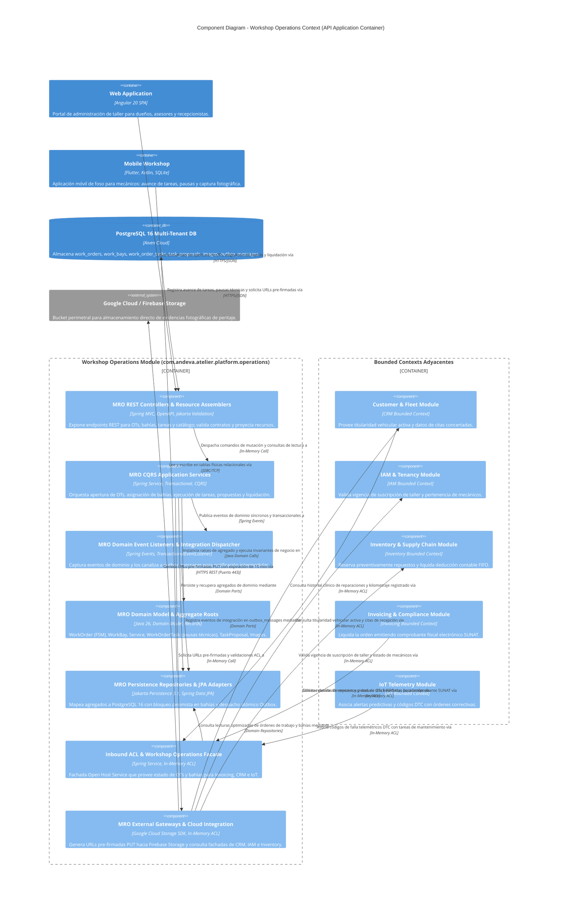

## 6. Fase 3: Bounded Context 3 — Workshop Operations Context (MRO) (`com.andeva.atelier.platform.operations`)

### 6.1. Diccionario y Propósito del Contexto

#### 6.1.1. Propósito y Límites de Responsabilidad
El **Workshop Operations Context (MRO - Maintenance, Repair, and Operations)** es el motor operativo y transaccional central del taller mecánico en Atelier Platform. Su propósito es orquestar todo el flujo físico de reparación automotriz desde que el vehículo ingresa a recepción hasta su entrega final, aislando esta complejidad operativa de los detalles contables de facturación tributaria y de suscripciones SaaS:
1. **Orquestación del Ciclo de Vida de la Orden de Trabajo (`WorkOrder`):** Modela la orden de servicio automotriz completa (`internal_number`, `mileage_in`, `diagnostic_summary`, `total_amount`), gestionando transiciones estrictas de estado (`DRAFT`, `IN_PROGRESS`, `COMPLETED`, `PAID`, `CANCELED`) bajo la custodia del Asesor de Servicio. La orden actúa como el expediente marco de recepción vehicular y no se asigna a un mecánico individual, sino que se vincula a una bahía física de atención.
2. **Control Físico y Capacidad de Bahías de Trabajo (`WorkBay`):** Administra la disponibilidad, ocupación y mantenimiento de los elevadores hidráulicos (`lift`), cabinas de pintura (`paint_booth`), áreas de alineamiento y zonas de lavado en cada sucursal física (`branch_id`).
3. **Desglose Atómico de Tareas de Mano de Obra (`WorkOrderTask`):** Permite seccionar la reparación en intervenciones puntuales, asociadas a servicios estándar del catálogo (`Service`), asignadas a mecánicos específicos (`mechanic_id` referenciado a `tenant_memberships`) y con registro de tiempos reales de inicio, pausas por falta de repuestos (`ON_HOLD`) y finalización para métricas de productividad (*Wrench Time*).
4. **Demanda y Consumo de Repuestos (`WorkOrderTaskProduct`):** Registra los materiales, piezas y lubricantes consumidos por cada tarea. Al agregarse un repuesto, MRO no descuenta directamente los lotes FIFO (responsabilidad de *Inventory & Supply Chain*), sino que emite eventos de dominio para solicitar la reserva lógica inmediata, consolidándose en deducción física al liquidar el pago (`PAID`).
5. **Auditoría Visual y Evidencias Fotográficas (`WorkOrderImage` y `WorkOrderTaskImage`):** Soporta el peritaje de ingreso (fotos de rayones, abolladuras o estado del odómetro) y evidencias de reparación técnica (repuesto dañado extraído vs. repuesto nuevo instalado).
6. **Hallazgos Periciales y Propuestas de Tareas Adicionales (`task_proposals`):** Modela averías imprevistas o vicios ocultos detectados por el técnico durante la inspección en elevador/foso. El mecánico documenta el hallazgo técnico sin calcular montos económicos arbitrarios. Requiere validación y cotización por parte del Asesor de Servicio y diálogo pedagógico humano con el conductor. Si se aprueba, se instancia como una tarea formal (`WorkOrderTask`) en estado `ASSIGNED` (o `PENDING` si no se asignó técnico aún); si se desestima, queda archivada como antecedente clínico en el historial vehicular para soporte de mantenimiento predictivo.

#### 6.1.2. Decisiones de Diseño e Integraciones Críticas
* **Patrón de Almacenamiento *Direct-to-Cloud* (Firebase Cloud Storage):** La carga de imágenes de alta resolución capturadas en patio por la aplicación móvil (Atelier Workshop) no satura el backend de Spring Boot. Los clientes móviles suben los binarios directamente a un bucket de **Google Cloud Storage / Firebase Storage** utilizando credenciales seguras o URLs prefirmadas, y envían únicamente al backend la URL pública inmutable (`image_url`) y la descripción textual para su registro transaccional.
* **Soporte de Operatividad *Offline-First* y *Shallow Routing* REST:** Dado que las fosas mecánicas y sótanos de talleres sufren de conectividad intermitente, los mecánicos operan contra una base de datos relacional local embebida en sus dispositivos móviles (**SQLite** mediante Room en Kotlin y Drift en Flutter). Al recuperar conectividad, el cliente móvil sincroniza consumiendo endpoints planos de segundo nivel (`/api/v1/tasks/{taskId}/products` y `/api/v1/tasks/{taskId}/evidence-images`), erradicando antipatrones de URIs sobre-anidadas.
* **Cálculo Financiero Centralizado en el Agregado:** El monto total (`total_amount`) de la orden se recalcula de forma puramente determinista y atómica dentro del agregado raíz sumando el costo de mano de obra de todas las tareas activas más el producto de `(quantity * unit_price)` de todos los repuestos solicitados, garantizando coherencia absoluta con el módulo de *Invoicing*.

---

### 6.2. 2.6.4.1. Domain Layer

#### 6.2.1. Aggregates & Aggregate Roots

##### 1. `WorkOrder` (Aggregate Root)
* **Paquete:** `com.andeva.atelier.platform.operations.domain.model.aggregates`
* **Herencia:** Extiende `AbstractDomainAggregateRoot<WorkOrder>`
* **Propósito:** Representa la orden de servicio automotriz y frontera de consistencia transaccional del taller mecánico. Es el agregado raíz que custodia la integridad del diagnóstico vehicular, la asignación física de bahía, el desglose de tareas mecánicas, el consumo de repuestos hacia inventario FIFO y el cálculo financiero determinista del costo total. No se asigna a un mecánico global, sino que alberga tareas individuales asignadas a especialistas.
* **Atributos:**
  * `id: WorkOrderId` — Identificador único universal fuertemente tipado de la orden de trabajo (UUID).
  * `tenantId: TenantId` — Taller mecánico propietario del registro.
  * `branchId: BranchId` — Sede física donde se ejecuta la intervención técnica.
  * `appointmentId: AppointmentId` — Cita previa de la cual deriva la orden (nullable en caso de ingreso directo de emergencia).
  * `vehicleId: VehicleId` — Unidad vehicular objeto de la intervención técnica.
  * `customerId: CustomerId` — Cliente propietario civil o empresa flotillera responsable del vehículo.
  * `internalNumber: WorkOrderNumber` — Código correlativo legible y formal de la orden (`WO-YYYYMM-XXXX`).
  * `currentBayId: WorkBayId` — Bahía física donde se encuentra posicionado el vehículo (nullable).
  * `mileageIn: Mileage` — Kilometraje del vehículo al momento de ingresar a recepción técnica (`value >= 0`).
  * `diagnosticSummary: DiagnosticSummary` — Diagnóstico y fallas reportadas (máximo 2000 caracteres normalizados).
  * `subtotal: Money` — Importe acumulado antes de impuestos de mano de obra y repuestos consumidos.
  * `tax: Money` — Monto tributario correspondiente al Impuesto General a las Ventas (IGV 18%).
  * `totalAmount: Money` — Importe total liquidado de la orden (`totalAmount = subtotal + tax`).
  * `status: WorkOrderStatus` — Estado en la máquina de estados finita (`DRAFT`, `IN_PROGRESS`, `COMPLETED`, `PAID`, `CANCELED`).
  * `tasks: List<WorkOrderTask>` — Colección interna de tareas mecánicas desglosadas.
  * `proposals: List<TaskProposal>` — Colección interna de hallazgos periciales y propuestas de tareas adicionales detectadas en foso.
  * `intakeImages: List<WorkOrderImage>` — Colección de evidencias fotográficas del peritaje de recepción.
* **Invariantes de Negocio y Máquina de Estados Finita:**
  * Máquina de estados determinista:
    $$\text{DRAFT} \xrightarrow{\text{startTask}} \text{IN\_PROGRESS} \xrightarrow{\text{completeAllTasks}} \text{COMPLETED} \xrightarrow{\text{markPaid}} \text{PAID}$$
    $$\text{DRAFT / IN\_PROGRESS} \xrightarrow{\text{cancel}} \text{CANCELED}$$
  * El kilometraje de ingreso `mileageIn` no puede ser negativo (`value >= 0`).
  * No se pueden agregar, modificar ni remover tareas o repuestos si la orden se encuentra en estado `COMPLETED`, `PAID` o `CANCELED`.
  * Toda mutación en tareas o repuestos recalcula inmediatamente y de forma atómica los atributos `subtotal`, `tax` y `totalAmount`.
  * La orden transiciona automáticamente a `IN_PROGRESS` en cuanto se pone en marcha la primera tarea en foso.
  * La orden no puede transicionar a `COMPLETED` si contiene al menos una tarea en estado `PENDING`, `ASSIGNED`, `IN_PROGRESS` u `ON_HOLD`.
  * Al completarse la última tarea pendiente, la orden transiciona automáticamente a estado `COMPLETED` emitiendo `WorkOrderCompletedEvent`.
  * Una orden solo puede marcarse como `PAID` si se encuentra previamente en estado `COMPLETED`.
* **Métodos:**
  * `+ static WorkOrder create(TenantId tenantId, BranchId branchId, AppointmentId appointmentId, VehicleId vehicleId, CustomerId customerId, WorkOrderNumber internalNumber, Mileage mileageIn, DiagnosticSummary diagnosticSummary): WorkOrder`: Factoría de dominio en estado inicial `DRAFT`; registra `WorkOrderCreatedEvent`.
  * `+ void assignWorkBay(WorkBayId bayId): void`: Asigna bahía física operativa donde se posiciona el vehículo y registra `WorkBayAssignedEvent`.
  * `+ void releaseBay(): void`: Libera la bahía física ocupada y registra `WorkBayReleasedEvent`.
  * `+ void startWork(): void`: Transiciona el estado de la orden a `IN_PROGRESS`.
  * `+ WorkOrderTask addTask(ServiceId serviceId, UUID mechanicId, String description, Money price, LaborHours estimatedHours): WorkOrderTask`: Añade una labor técnica formal autorizada al plan de trabajo, valida precondiciones y recalcula el total. Si se suministra `mechanicId`, la tarea nace en `ASSIGNED`; de lo contrario, en `PENDING`.
  * `+ void removeTask(WorkOrderTaskId taskId): void`: Remueve una tarea si no ha sido completada, cancela la reserva de sus repuestos asociados y recalcula el total.
  * `+ void startTask(WorkOrderTaskId taskId): void`: Pone en marcha una tarea (`IN_PROGRESS`), transiciona la orden completa a `IN_PROGRESS` si estaba en `DRAFT` y dispara `WorkOrderTaskStartedEvent`.
  * `+ void completeTask(WorkOrderTaskId taskId, LaborHours actualHours): void`: Finaliza la tarea fijando su marca temporal de fin y horas hombre reales, evalúa si todas las tareas han concluido para transicionar la orden a `COMPLETED` y emite `WorkOrderTaskCompletedEvent`.
  * `+ TaskProposal submitProposal(UUID mechanicId, String description, ProposalSeverity severity, StorageUrl imageUrl, UUID suggestedServiceId): TaskProposal`: Registra un hallazgo pericial en foso (sin valoración económica del técnico) y emite `TaskProposalSubmittedEvent`.
  * `+ WorkOrderTask approveProposal(UUID proposalId, ServiceId serviceId, Money finalPrice, LaborHours hours, UUID mechanicId, String notes): WorkOrderTask`: Aprueba el hallazgo tras concertación y presupuesto con el cliente, instancia una `WorkOrderTask` en `ASSIGNED` (o `PENDING` si no se asignó técnico aún) y emite `TaskProposalApprovedEvent`.
  * `+ void rejectProposal(UUID proposalId, String customerNotes): void`: Rechaza la propuesta por desestimación del cliente y emite `TaskProposalRejectedEvent`.
  * `+ void addProductToTask(WorkOrderTaskId taskId, UUID productId, Quantity quantity, Money unitPrice): void`: Incorpora un repuesto a la tarea, recalcula `totalAmount` y registra `ProductStockReservationRequestedEvent`.
  * `+ void removeProductFromTask(WorkOrderTaskId taskId, WorkOrderTaskProductId productItemId): void`: Elimina un repuesto de la tarea, recalcula `totalAmount` y registra `ProductStockReservationCancelledEvent`.
  * `+ void attachIntakeImage(StorageUrl imageUrl, String description): void`: Registra una evidencia fotográfica del peritaje inicial y emite `WorkOrderIntakeImageAttachedEvent`.
  * `+ void recalculateTotalAmount(): void`: Suma determinista de la mano de obra de cada tarea activa más `(quantity * unit_price)` de todos los repuestos consumidos, aplicando IGV 18% con redondeo bancario `RoundingMode.HALF_EVEN`.
  * `+ void markPaid(): void`: Registra la cancelación económica de la orden y dispara `WorkOrderPaidEvent`.
  * `+ void deliverVehicle(): void`: Registra la entrega final del vehículo al cliente y emite `WorkOrderDeliveredEvent`.
  * `+ void cancel(String reason): void`: Anula la orden, libera la bahía física y solicita la cancelación de todas las reservas de repuestos activas.

##### 2. `WorkBay` (Aggregate Root)
* **Paquete:** `com.andeva.atelier.platform.operations.domain.model.aggregates`
* **Herencia:** Extiende `AbstractDomainAggregateRoot<WorkBay>`
* **Propósito:** Representa un espacio físico o puesto de trabajo habilitado en una sucursal del taller (elevador de dos columnas, fosa mecánica, cabina de pintura, zona de alineamiento o lavado).
* **Atributos:**
  * `id: WorkBayId` — Identificador único universal de la bahía (UUID).
  * `tenantId: TenantId` — Taller propietario de la instalación física.
  * `branchId: BranchId` — Sede física donde se ubica la bahía.
  * `name: String` — Denominación identificatoria legible (ej. "Elevador Hidráulico 1", "Cabina de Pintura A").
  * `type: BayType` — Clasificación técnica de la bahía (`LIFT`, `PAINT_BOOTH`, `WASHING`, `ALIGNMENT`).
  * `status: BayStatus` — Estado de ocupación operativa (`AVAILABLE`, `OCCUPIED`, `MAINTENANCE`).
  * `currentWorkOrderId: WorkOrderId` — Orden de trabajo que ocupa actualmente la bahía (nullable).
* **Invariantes y Reglas de Negocio:**
  * No se puede ocupar una bahía que ya se encuentre en estado `OCCUPIED` o `MAINTENANCE`.
  * Solo una bahía en estado `OCCUPIED` puede ser liberada.
  * La puesta en mantenimiento exige que la bahía se encuentre en estado `AVAILABLE` y desocupada.
* **Métodos:**
  * `+ static WorkBay create(TenantId tenantId, BranchId branchId, String name, BayType type): WorkBay`: Factoría de dominio en estado inicial `AVAILABLE`.
  * `+ void occupy(WorkOrderId orderId): void`: Bloquea la bahía asociándola a la orden activa y cambia el estado a `OCCUPIED`.
  * `+ void release(): void`: Desvincula la orden y restablece el estado a `AVAILABLE`.
  * `+ void setUnderMaintenance(String reason): void`: Inhabilita la bahía por avería técnica, inspección de seguridad o calibración.
  * `+ void restoreAvailable(): void`: Restituye la operatividad de la bahía a `AVAILABLE`.

##### 3. `Service` (Aggregate Root - Catálogo de Mano de Obra)
* **Paquete:** `com.andeva.atelier.platform.operations.domain.model.aggregates`
* **Herencia:** Extiende `AbstractDomainAggregateRoot<Service>`
* **Propósito:** Modela el catálogo de servicios estándar y paquetes de mano de obra técnica que ofrece el taller automotriz a sus clientes.
* **Atributos:**
  * `id: ServiceId` — Identificador único universal del servicio (UUID).
  * `tenantId: TenantId` — Taller dueño del catálogo tarifario.
  * `name: String` — Denominación del servicio (ej. "Alineamiento y Balanceo Computarizado", "Cambio de Pastillas de Freno").
  * `basePrice: Money` — Tarifa base sugerida por concepto de mano de obra.
  * `estimatedDurationMinutes: int` — Tiempo promedio estimado de ejecución técnica (por defecto: 60 minutos).
* **Invariantes:**
  * El nombre del servicio no puede ser nulo ni vacío (longitud entre 3 y 150 caracteres).
  * La tarifa base debe ser un monto no negativo (`basePrice >= 0.00`).
  * La duración estimada debe ser estrictamente positiva (`estimatedDurationMinutes > 0`).
* **Métodos:**
  * `+ static Service create(TenantId tenantId, String name, Money basePrice, int estimatedMinutes): Service`: Factoría de dominio.
  * `+ void updateDetails(String newName, Money newBasePrice, int newEstimatedMinutes): void`: Actualiza denominación, tarifa base y tiempos estándar.

---

#### 6.2.2. Entities

##### 1. `WorkOrderTask` (Entidad Dependiente de `WorkOrder`)
* **Paquete:** `com.andeva.atelier.platform.operations.domain.model.entities`
* **Propósito:** Representa una actividad atómica y concreta de mano de obra técnica dentro del plan de reparación vehicular.
* **Atributos:**
  * `id: WorkOrderTaskId` — Identificador único universal de la tarea (UUID).
  * `workOrderId: WorkOrderId` — Orden de trabajo a la que se subordina.
  * `serviceId: ServiceId` — Servicio de catálogo asociado.
  * `mechanicId: UUID` — Identificador de membresía del mecánico ejecutante (referencia a `tenant_memberships`, nullable).
  * `status: WorkOrderTaskStatus` — Estado de la labor (`PENDING`, `ASSIGNED`, `IN_PROGRESS`, `ON_HOLD`, `COMPLETED`, `CANCELLED`).
  * `description: String` — Detalle del procedimiento mecánico o diagnóstico específico ejecutado.
  * `price: Money` — Costo cobrado por la mano de obra de esta tarea específica.
  * `estimatedHours: LaborHours` — Tiempo presupuestado en horas hombre para la intervención (`> 0.00`).
  * `actualHours: LaborHours` — Tiempo real consumido de mano de obra efectiva (*Wrench Time*) tras la culminación de la labor.
  * `holdReason: HoldReason` — Motivo tipado de suspensión técnica (`WAITING_PARTS`, nullable).
  * `missingItemDescription: String` — Detalle del repuesto o insumo faltante que provocó la suspensión (nullable).
  * `pausedAt: Instant` — Marca temporal del momento en que se suspendió la labor (nullable).
  * `totalPausedSeconds: long` — Tiempo acumulado en suspensión por falta de repuestos para descontar del cómputo de rendimiento.
  * `startedAt: Instant` — Marca de tiempo en que el técnico inició efectivamente la labor.
  * `completedAt: Instant` — Marca de tiempo en que el técnico finalizó el procedimiento mecánico.
  * `consumedProducts: List<WorkOrderTaskProduct>` — Colección de repuestos e insumos demandados para esta labor.
  * `taskImages: List<WorkOrderTaskImage>` — Evidencias fotográficas periciales específicas de esta labor.
* **Métodos:**
  * `+ void assignMechanic(UUID mechanicMembershipId): void`: Asocia el técnico responsable de la intervención y transiciona a `ASSIGNED`.
  * `+ void start(): void`: Registra `startedAt = Instant.now()`, fija `status = IN_PROGRESS` y activa el cómputo de horas efectivas.
  * `+ void holdForWaitingParts(String missingItemDescription, UUID inventoryItemId): void`: Suspende la labor por falta de repuesto en almacén (`ON_HOLD`), fija `pausedAt = Instant.now()`, congela el cómputo de mano de obra y emite `WorkOrderTaskHoldEvent`.
  * `+ void resume(): void`: Reanuda la labor al recibir el repuesto en foso (`IN_PROGRESS`), calcula la duración de la pausa acumulándola en `totalPausedSeconds` y emite `WorkOrderTaskResumedEvent`.
  * `+ void complete(LaborHours actualHours, String notes): void`: Registra `completedAt = Instant.now()`, almacena las horas reales de mano de obra efectiva (*Wrench Time*) y fija `status = COMPLETED`.
  * `+ void reopen(String reason): void`: Retorna el estado a `IN_PROGRESS` y anula `completedAt` para reproceso de calidad.
  * `+ void updatePrice(Money newPrice): void`: Actualiza el importe cobrado por mano de obra.
  * `+ void addProduct(WorkOrderTaskProduct product): void`: Agrega un requerimiento de repuesto o lubricante.
  * `+ void removeProduct(WorkOrderTaskProductId productId): void`: Remueve un requerimiento de repuesto.
  * `+ void attachEvidenceImage(StorageUrl url, EvidenceType evidenceType, String description): void`: Adjunta evidencia visual de la reparación.

##### 2. `WorkOrderTaskProduct` (Entidad Dependiente de `WorkOrderTask`)
* **Paquete:** `com.andeva.atelier.platform.operations.domain.model.entities`
* **Propósito:** Cuantifica la demanda y el consumo físico de un repuesto, insumo o lubricante para una tarea determinada.
* **Atributos:**
  * `id: WorkOrderTaskProductId` — Identificador único universal del requerimiento de repuesto (UUID).
  * `taskId: WorkOrderTaskId` — Tarea mecánica que demanda el ítem.
  * `productId: UUID` — Identificador del repuesto en catálogo de inventario (`inventory_items`).
  * `quantity: Quantity` — Cantidad solicitada con precisión decimal fija (`value > 0.00`).
  * `unitPrice: Money` — Precio unitario de venta pactado al momento de su incorporación a la orden.
  * `totalAmount: Money` — Subtotal calculado (`quantity * unitPrice`).
* **Métodos:**
  * `+ void updateQuantity(Quantity newQuantity): void`: Modifica la cantidad consumida y recalcula `totalAmount`.

##### 3. `WorkOrderImage` (Entidad Dependiente de `WorkOrder`)
* **Paquete:** `com.andeva.atelier.platform.operations.domain.model.entities`
* **Propósito:** Registra evidencias visuales del peritaje de recepción o entrega del vehículo bajo el patrón Direct-to-Cloud.
* **Atributos:**
  * `id: UUID` — Identificador único de la evidencia fotográfica.
  * `workOrderId: WorkOrderId` — Orden de trabajo vinculada.
  * `imageUrl: StorageUrl` — URL HTTPS inmutable alojada en Firebase Cloud Storage / Google Cloud Storage.
  * `description: String` — Nota pericial descriptiva (ej. "Abolladura previa en guardafango delantero derecho").
  * `uploadedAt: Instant` — Marca de tiempo de registro de la fotografía.

##### 4. `WorkOrderTaskImage` (Entidad Dependiente de `WorkOrderTask`)
* **Paquete:** `com.andeva.atelier.platform.operations.domain.model.entities`
* **Propósito:** Registra evidencias visuales del procedimiento técnico pericial ejecutado por el mecánico sobre un componente.
* **Atributos:**
  * `id: UUID` — Identificador único del registro fotográfico.
  * `taskId: WorkOrderTaskId` — Tarea mecánica asociada a la evidencia.
  * `imageUrl: StorageUrl` — URL HTTPS inmutable del binario en Firebase Cloud Storage.
  * `evidenceType: EvidenceType` — Tipología técnica de la evidencia (`INITIAL_INSPECTION`, `DEFECT`, `IN_PROGRESS`, `COMPLETED`).
  * `description: String` — Descripción técnica pericial (ej. "Pastilla de freno desgastada al 10% vs pastilla cerámica nueva").
  * `uploadedAt: Instant` — Marca de tiempo de captura y registro.

##### 5. `TaskProposal` (Entidad Dependiente de `WorkOrder`)
* **Paquete:** `com.andeva.atelier.platform.operations.domain.model.entities`
* **Propósito:** Modela hallazgos periciales y propuestas de tareas técnicas adicionales detectadas por el mecánico en foso o elevador. El mecánico no calcula montos financieros; documenta el problema técnico y lo envía al Asesor de Servicio, quien cotiza formalmente mano de obra y repuestos en diálogo concertado con el conductor.
* **Atributos:**
  * `id: UUID` — Identificador único del hallazgo / propuesta.
  * `workOrderId: WorkOrderId` — Orden de trabajo vinculada.
  * `taskId: WorkOrderTaskId` — Tarea durante la cual se detectó la avería (nullable).
  * `serviceId: ServiceId` — Servicio de catálogo sugerido por el mecánico o seleccionado por el asesor (nullable).
  * `mechanicId: UUID` — Técnico que detectó el hallazgo (referencia a `tenant_memberships`).
  * `description: String` — Descripción técnica del hallazgo pericial.
  * `severity: ProposalSeverity` — Nivel de severidad técnica (`LOW`, `MEDIUM`, `CRITICAL`).
  * `imageUrl: StorageUrl` — Evidencia fotográfica pericial alojada en Firebase Cloud Storage.
  * `status: ProposalStatus` — Estado de evaluación (`PENDING_REVIEW`, `APPROVED`, `REJECTED`).
  * `customerNotes: String` — Anotaciones de la concertación con el cliente o justificación de rechazo.
  * `createdAt: Instant` — Marca temporal de reporte en foso.
  * `updatedAt: Instant` — Marca temporal de resolución por el asesor.
* **Métodos:**
  * `+ void approve(String notes): void`: Transiciona el estado a `APPROVED`, registrando las notas de la concertación y presupuesto acordado con el cliente.
  * `+ void reject(String customerReason): void`: Transiciona el estado a `REJECTED`, preservando la causa del rechazo para trazabilidad en el expediente vehicular.

---

#### 6.2.3. Value Objects & Enums

* **`WorkOrderId(UUID value)`:** Identificador único universal fuertemente tipado de la orden de trabajo.
* **`WorkOrderNumber(String value)`:** Código correlativo legible formateado bajo la expresión regular `^WO-[0-9]{6}-[0-9]{4}$` (ej. `WO-202609-0142`), inmutable y único por taller.
* **`WorkOrderTaskId(UUID value)`:** Identificador único universal fuertemente tipado para tareas mecánicas.
* **`WorkOrderTaskProductId(UUID value)`:** Identificador único universal para requerimientos de repuestos en tareas.
* **`WorkBayId(UUID value)`:** Identificador único universal fuertemente tipado para bahías de taller.
* **`ServiceId(UUID value)`:** Identificador único universal fuertemente tipado para servicios de catálogo.
* **`Mileage(Integer value)`:** Kilometraje automotriz entero no negativo (`value >= 0`).
* **`DiagnosticSummary(String value)`:** Resumen de diagnóstico preliminar de recepción (máximo 2000 caracteres, normalizado sin espacios redundantes).
* **`LaborHours(BigDecimal value)`:** Cantidad de horas hombre de trabajo mecánico con escala fija de 2 decimales y valor estrictamente positivo (`value > 0.00`).
* **`Quantity(BigDecimal value)`:** Cantidad numérica positiva para repuestos o volumen de lubricantes con escala fija de 2 decimales (`value > 0.00`).
* **`StorageUrl(String value)`:** Dirección URL segura HTTPS validada proveniente de Firebase Cloud Storage o Google Cloud Storage (`storage.googleapis.com` o dominio verificado).
* **`WorkOrderStatus` (Enum):** Ciclo de vida determinista de la orden de trabajo:
  * `DRAFT` — Orden en recepción inicial; levantamiento de diagnóstico, peritaje y asignación de bahía.
  * `IN_PROGRESS` — Labores mecánicas activas en patio de taller (iniciadas por al menos una tarea en foso).
  * `COMPLETED` — Todas las tareas mecánicas finalizadas satisfactoriamente.
  * `PAID` — Liquidación económica registrada; lista para entrega vehicular.
  * `CANCELED` — Orden anulada con liberación de bahía y reversión de reservas de stock.
* **`WorkOrderTaskStatus` (Enum):** Ciclo de ejecución de la labor mecánica en foso:
  * `PENDING` — Tarea creada sin técnico asignado aún.
  * `ASSIGNED` — Técnico mecánico asignado a la labor; listo para iniciar.
  * `IN_PROGRESS` — Técnico ejecutando activamente la labor en bahía o foso.
  * `ON_HOLD` — Labor suspendida por falta de repuestos o fluidos en almacén; cronómetro de mano de obra efectiva pausado.
  * `COMPLETED` — Labor técnica finalizada con registro de horas reales de mano de obra (*Wrench Time*).
  * `CANCELLED` — Tarea cancelada antes de su culminación.
* **`HoldReason` (Enum):** Causal tipada de suspensión de la labor técnica:
  * `WAITING_PARTS` — Tarea detenida en foso por desabastecimiento temporal de repuesto o lubricante en almacén central; alerta disparada a compras y cronómetro de horas efectivas pausado.
* **`ProposalSeverity` (Enum):** Gravedad técnica del hallazgo detectado:
  * `LOW` — Defecto estético o mantenimiento preventivo no urgente.
  * `MEDIUM` — Desgaste mecánico moderado que amerita sustitución a corto plazo.
  * `CRITICAL` — Riesgo inminente para la seguridad del vehículo o integridad del motor.
* **`ProposalStatus` (Enum):** Estado del flujo de aprobación del hallazgo:
  * `PENDING_REVIEW` — Registrado en foso; pendiente de revisión y cotización por el Asesor de Servicio.
  * `APPROVED` — Aceptado por el conductor tras diálogo humano; instanciado como tarea formal en estado `ASSIGNED` (o `PENDING`).
  * `REJECTED` — Desestimado por el cliente; archivado en el expediente clínico para mantenimiento predictivo.
* **`BayType` (Enum):** Clasificación física y electromecánica del puesto de taller:
  * `LIFT` — Elevador hidráulico o electromecánico de dos o cuatro postes.
  * `PAINT_BOOTH` — Cabina presurizada de pintura y secado térmico.
  * `WASHING` — Bahía de lavado, detal y descontaminado de carrocería.
  * `ALIGNMENT` — Fosa o rampa con equipo computarizado de dirección y alineamiento.
* **`BayStatus` (Enum):** Estado de disponibilidad física del puesto de taller:
  * `AVAILABLE` — Bahía desocupada lista para recibir un vehículo.
  * `OCCUPIED` — Bahía bloqueada con una orden de trabajo activa.
  * `MAINTENANCE` — Bahía inhabilitada por calibración o avería mecánica.
* **`EvidenceType` (Enum):** Clasificación pericial de la fotografía técnica:
  * `INITIAL_INSPECTION` — Fotografía de diagnóstico y condición de ingreso.
  * `DEFECT` — Evidencia del componente averiado, fisurado o desgastado.
  * `IN_PROGRESS` — Registro del proceso de montaje o rectificación.
  * `COMPLETED` — Evidencia del componente nuevo instalado y calibrado.

---

#### 6.2.4. Domain Services

##### 1. `WorkOrderCostCalculator`
* **Paquete:** `com.andeva.atelier.platform.operations.domain.services`
* **Firma:** `WorkOrderBillingSummary calculateTotal(WorkOrder workOrder)`
* **Lógica de Negocio y Orquestación:**
  * Recorre las tareas mecánicas activas de la orden y totaliza el costo de mano de obra pactado.
  * Totaliza el producto de `(quantity * unitPrice)` de todos los repuestos y lubricantes demandados en cada tarea.
  * Determina el `subtotal` como la suma aritmética exacta de mano de obra y repuestos.
  * Calcula el `tax` aplicando la alícuota del Impuesto General a las Ventas (IGV 18%) mediante redondeo bancario determinista `RoundingMode.HALF_EVEN`.
  * Establece el `totalAmount = subtotal + tax`, garantizando coherencia financiera absoluta con el Bounded Context de Facturación (*Invoicing*).

##### 2. `BayAllocationService`
* **Paquete:** `com.andeva.atelier.platform.operations.domain.services`
* **Firma:** `void validateBayAvailability(WorkBayId bayId, WorkOrderId orderId)`
* **Lógica de Negocio y Orquestación:**
  * Consulta el estado de persistencia de la bahía física a través de `WorkBayRepository`.
  * Verifica que la bahía se encuentre en estado `AVAILABLE`. Si está en `OCCUPIED` o `MAINTENANCE`, arroja `WorkBayOccupiedException` o `WorkBayUnderMaintenanceException`.
  * Valida que la bahía física pertenezca a la misma sucursal (`branchId`) donde se ejecuta la orden de trabajo.

##### 3. `WorkOrderTransitionValidator`
* **Paquete:** `com.andeva.atelier.platform.operations.domain.services`
* **Firma:** `void validateTransition(WorkOrder workOrder, WorkOrderStatus targetStatus)`
* **Lógica de Negocio y Orquestación:**
  * Aplica la matriz de transiciones válidas de la máquina de estados finita determinista.
  * Valida precondiciones operativas: rechaza la transición a `COMPLETED` si existen tareas en `PENDING` o `IN_PROGRESS`.
  * Rechaza el paso a `PAID` si la orden no se encuentra en estado `COMPLETED`.
  * Lanza `InvalidWorkOrderStatusTransitionException` ante cualquier mutación anómala.

---

#### 6.2.5. Domain Commands & Queries

####### 1. Domain Commands
* `CreateWorkOrderCommand(TenantId tenantId, BranchId branchId, AppointmentId appointmentId, VehicleId vehicleId, CustomerId customerId, Mileage mileageIn, DiagnosticSummary diagnosticSummary)`
* `AssignWorkBayCommand(WorkOrderId workOrderId, WorkBayId bayId)`
* `ReleaseWorkBayCommand(WorkOrderId workOrderId)`
* `StartWorkOrderCommand(WorkOrderId workOrderId)`
* `AddTaskToWorkOrderCommand(WorkOrderId workOrderId, ServiceId serviceId, UUID mechanicId, String description, BigDecimal price, BigDecimal estimatedHours, String currency)`
* `AssignTaskMechanicCommand(WorkOrderTaskId taskId, UUID mechanicId)`
* `SubmitTaskProposalCommand(WorkOrderId workOrderId, UUID mechanicId, String description, ProposalSeverity severity, StorageUrl imageUrl, UUID suggestedServiceId)`
* `ApproveTaskProposalCommand(WorkOrderId workOrderId, UUID proposalId, ServiceId serviceId, BigDecimal finalPrice, BigDecimal laborHours, UUID mechanicId, String notes)`
* `RejectTaskProposalCommand(WorkOrderId workOrderId, UUID proposalId, String customerNotes)`
* `StartWorkOrderTaskCommand(WorkOrderTaskId taskId)`
* `HoldWorkOrderTaskCommand(WorkOrderTaskId taskId, String missingItemDescription, UUID inventoryItemId)`
* `ResumeWorkOrderTaskCommand(WorkOrderTaskId taskId)`
* `CompleteWorkOrderTaskCommand(WorkOrderTaskId taskId, BigDecimal actualHours, String notes)`
* `ReopenWorkOrderTaskCommand(WorkOrderTaskId taskId, String reason)`
* `AddProductToTaskCommand(WorkOrderTaskId taskId, UUID productId, BigDecimal quantity, BigDecimal unitPrice, String currency)`
* `UpdateTaskProductQuantityCommand(WorkOrderTaskId taskId, UUID productId, BigDecimal newQuantity)`
* `RemoveProductFromTaskCommand(WorkOrderTaskId taskId, WorkOrderTaskProductId productItemId)`
* `AttachIntakeImageCommand(WorkOrderId workOrderId, String imageUrl, String description)`
* `AttachTaskEvidenceImageCommand(WorkOrderTaskId taskId, String imageUrl, EvidenceType evidenceType, String description)`
* `CreateWorkBayCommand(TenantId tenantId, BranchId branchId, String name, BayType bayType)`
* `UpdateWorkBayStatusCommand(WorkBayId bayId, BayStatus status, String reason)`
* `CreateServiceItemCommand(TenantId tenantId, String name, BigDecimal basePrice, String currency, int estimatedMinutes)`
* `UpdateServiceItemCommand(ServiceId serviceId, String name, BigDecimal basePrice, String currency, int estimatedMinutes)`
* `MarkWorkOrderAsPaidCommand(WorkOrderId workOrderId)`
* `DeliverVehicleCommand(WorkOrderId workOrderId)`
* `CancelWorkOrderCommand(WorkOrderId workOrderId, String reason)`

##### 2. Domain Queries
* `GetWorkOrderByIdQuery(WorkOrderId workOrderId)`
* `GetWorkOrdersByTenantIdQuery(TenantId tenantId)`
* `GetWorkOrdersByBranchIdQuery(TenantId tenantId, BranchId branchId)`
* `GetWorkOrdersByVehicleIdQuery(VehicleId vehicleId)`
* `GetWorkOrdersByCustomerIdQuery(CustomerId customerId)`
* `GetWorkOrdersByBayIdQuery(WorkBayId bayId)`
* `GetTaskProposalsByWorkOrderIdQuery(WorkOrderId workOrderId)`
* `GetWorkOrderTaskByIdQuery(WorkOrderTaskId taskId)`
* `GetWorkBaysByBranchIdQuery(TenantId tenantId, BranchId branchId)`
* `GetAvailableWorkBaysQuery(TenantId tenantId, BranchId branchId, BayType bayType)`
* `GetServicesByTenantIdQuery(TenantId tenantId)`
* `GetServiceByIdQuery(ServiceId serviceId)`

---

#### 6.2.6. Domain Events (Taxonomía Completa de 17 Eventos)

Todos los eventos de dominio implementan la interfaz canónica `DomainEvent` provista por el Shared Kernel, registrando su marca temporal `occurredOn: Instant`:

1. `WorkOrderCreatedEvent(WorkOrderId workOrderId, TenantId tenantId, BranchId branchId, VehicleId vehicleId, CustomerId customerId, WorkOrderNumber internalNumber, Instant occurredOn)`: Disparado al registrar la orden en recepción técnica; prepara la inspección y alerta al patio.
2. `WorkBayAssignedEvent(WorkOrderId workOrderId, WorkBayId bayId, Instant occurredOn)`: Emitido al posicionar el automóvil en una bahía física operativa; actualiza ocupación en el monitor de taller.
3. `WorkBayReleasedEvent(WorkOrderId workOrderId, WorkBayId bayId, Instant occurredOn)`: Emitido al desocupar la bahía física; restituye la disponibilidad operativa del elevador o fosa.
4. `WorkOrderTaskAssignedEvent(WorkOrderId workOrderId, WorkOrderTaskId taskId, UUID mechanicId, Instant occurredOn)`: Emitido al asignar formalmente un técnico mecánico a una tarea de taller.
5. `WorkOrderTaskStartedEvent(WorkOrderId workOrderId, WorkOrderTaskId taskId, UUID mechanicId, Instant occurredOn)`: Emitido cuando el mecánico inicia efectivamente la labor técnica en foso; sincroniza la orden a `IN_PROGRESS` y activa el cómputo de horas efectivas (*Wrench Time*).
6. `WorkOrderTaskHoldEvent(WorkOrderId workOrderId, WorkOrderTaskId taskId, UUID mechanicId, String missingItemDescription, Instant occurredOn)`: Emitido cuando el técnico suspende la labor por falta de repuestos en almacén (`ON_HOLD`); congela el cronómetro de mano de obra y alerta a logística/compras.
7. `WorkOrderTaskResumedEvent(WorkOrderId workOrderId, WorkOrderTaskId taskId, UUID mechanicId, Instant occurredOn)`: Emitido cuando el mecánico reanuda la labor al recibir los repuestos en bahía (`IN_PROGRESS`); reactiva el cronómetro de horas efectivas.
8. `WorkOrderTaskCompletedEvent(WorkOrderId workOrderId, WorkOrderTaskId taskId, UUID mechanicId, LaborHours actualHours, Instant occurredOn)`: Emitido al concluir la tarea mecánica; alimenta métricas de productividad técnica laboral (*Wrench Time*).
9. `TaskProposalSubmittedEvent(WorkOrderId workOrderId, UUID proposalId, UUID mechanicId, ProposalSeverity severity, Instant occurredOn)`: Disparado cuando el mecánico reporta un hallazgo pericial o avería oculta en foso; notifica al Asesor de Servicio para su evaluación y cotización.
10. `TaskProposalApprovedEvent(WorkOrderId workOrderId, UUID proposalId, WorkOrderTaskId createdTaskId, Instant occurredOn)`: Emitido cuando el Asesor de Servicio y el cliente aprueban la propuesta; añade la labor formal a la orden en `ASSIGNED` o `PENDING`.
11. `TaskProposalRejectedEvent(WorkOrderId workOrderId, UUID proposalId, String customerNotes, Instant occurredOn)`: Emitido cuando el cliente desestima la labor sugerida; se archiva en la historia clínica vehicular para mantenimiento predictivo.
12. `ProductStockReservationRequestedEvent(WorkOrderId workOrderId, WorkOrderTaskId taskId, UUID productId, Quantity quantity, Instant occurredOn)`: Disparado al incorporar un repuesto; solicita al contexto de inventario el bloqueo y reserva de existencias FIFO.
13. `ProductStockReservationCancelledEvent(WorkOrderId workOrderId, WorkOrderTaskId taskId, UUID productId, Quantity quantity, Instant occurredOn)`: Disparado al retirar un repuesto o cancelar la orden; libera la reserva de existencias en inventario.
14. `WorkOrderCompletedEvent(WorkOrderId workOrderId, TenantId tenantId, VehicleId vehicleId, Money totalAmount, Instant occurredOn)`: Emitido cuando la última tarea activa concluye satisfactoriamente; notifica a facturación para preparar la proforma o comprobante fiscal.
15. `WorkOrderPaidEvent(WorkOrderId workOrderId, TenantId tenantId, Money totalAmount, Instant occurredOn)`: Emitido tras la cancelación económica del servicio; convierte reservas lógicas en deducción FIFO definitiva y habilita la entrega formal del vehículo.
16. `WorkOrderDeliveredEvent(WorkOrderId workOrderId, TenantId tenantId, VehicleId vehicleId, Instant occurredOn)`: Emitido al entregar el automóvil al cliente; concluye el ciclo de vida MRO y notifica al cliente vía Firebase Cloud Messaging.
17. `WorkOrderIntakeImageAttachedEvent(WorkOrderId workOrderId, UUID imageId, StorageUrl imageUrl, Instant occurredOn)`: Emitido al registrar una fotografía pericial de recepción Direct-to-Cloud.
18. `WorkOrderTaskEvidenceAttachedEvent(WorkOrderId workOrderId, WorkOrderTaskId taskId, UUID imageId, StorageUrl imageUrl, EvidenceType evidenceType, Instant occurredOn)`: Emitido al adjuntar evidencia fotográfica pericial de la labor mecánica realizada.

---

#### 6.2.7. Repositories (Interfaces de Dominio)

* **`WorkOrderRepository`:**
  * `WorkOrder save(WorkOrder workOrder)`
  * `Optional<WorkOrder> findById(WorkOrderId id)`
  * `Optional<WorkOrder> findByOrderNumber(WorkOrderNumber orderNumber)`
  * `List<WorkOrder> findByTenantId(TenantId tenantId)`
  * `List<WorkOrder> findByBranchId(TenantId tenantId, BranchId branchId)`
  * `List<WorkOrder> findByVehicleId(VehicleId vehicleId)`
  * `List<WorkOrder> findByCustomerId(CustomerId customerId)`
  * `Optional<WorkOrder> findByCurrentBayId(WorkBayId bayId)`
  * `Integer findNextInternalSequence(TenantId tenantId)`
* **`WorkBayRepository`:**
  * `WorkBay save(WorkBay workBay)`
  * `Optional<WorkBay> findById(WorkBayId id)`
  * `List<WorkBay> findByTenantIdAndBranchId(TenantId tenantId, BranchId branchId)`
  * `List<WorkBay> findAvailableBays(TenantId tenantId, BranchId branchId, BayType bayType)`
* **`ServiceRepository`:**
  * `Service save(Service service)`
  * `Optional<Service> findById(ServiceId id)`
  * `List<Service> findByTenantId(TenantId tenantId)`
  * `Optional<Service> findByTenantIdAndName(TenantId tenantId, String name)`

---

#### 6.2.8. Domain Exceptions (Jerarquía Semántica y RFC 7807)

Todas las excepciones de dominio extienden la clase base no comprobada `DomainException` del Shared Kernel, encapsulando un código de error semántico legible y su correspondiente mapeo a código de estado HTTP bajo el estándar RFC 7807:

* **`WorkOrderNotFoundException`:**
  * Código: `WORK_ORDER_NOT_FOUND`
  * Estatus HTTP: 404 Not Found
  * Disparador: La orden de trabajo solicitada no existe en la base de datos del taller.
* **`WorkBayNotFoundException`:**
  * Código: `WORK_BAY_NOT_FOUND`
  * Estatus HTTP: 404 Not Found
  * Disparador: La bahía física consultada no existe en la sede del taller.
* **`ServiceNotFoundException`:**
  * Código: `SERVICE_NOT_FOUND`
  * Estatus HTTP: 404 Not Found
  * Disparador: El servicio de catálogo requerido no existe en el registro del taller.
* **`WorkBayOccupiedException`:**
  * Código: `WORK_BAY_OCCUPIED`
  * Estatus HTTP: 409 Conflict
  * Disparador: Intento de asignar una orden a una bahía que ya alberga otro vehículo en atención activa.
* **`WorkBayUnderMaintenanceException`:**
  * Código: `WORK_BAY_UNDER_MAINTENANCE`
  * Estatus HTTP: 409 Conflict
  * Disparador: Intento de ocupar una bahía física inhabilitada por avería o calibración técnica.
* **`InvalidWorkOrderStatusTransitionException`:**
  * Código: `INVALID_WORK_ORDER_STATUS_TRANSITION`
  * Estatus HTTP: 422 Unprocessable Entity
  * Disparador: Intento de ejecutar una transición no permitida por la máquina de estados finita determinista.
* **`WorkOrderTaskNotFoundException`:**
  * Código: `WORK_ORDER_TASK_NOT_FOUND`
  * Estatus HTTP: 404 Not Found
  * Disparador: La tarea mecánica consultada no existe dentro de la orden de trabajo.
* **`WorkOrderTaskAlreadyCompletedException`:**
  * Código: `WORK_ORDER_TASK_ALREADY_COMPLETED`
  * Estatus HTTP: 422 Unprocessable Entity
  * Disparador: Intento de modificar o reiniciar una labor técnica que ya fue finalizada satisfactoriamente.
* **`TaskCannotBePutOnHoldException`:**
  * Código: `TASK_CANNOT_BE_PUT_ON_HOLD`
  * Estatus HTTP: 422 Unprocessable Entity
  * Disparador: Intento de suspender por falta de repuestos una tarea que no se encuentra en estado `IN_PROGRESS` o que ya está en pausa.
* **`TaskNotOnHoldException`:**
  * Código: `TASK_NOT_ON_HOLD`
  * Estatus HTTP: 422 Unprocessable Entity
  * Disparador: Intento de reanudar una tarea mecánica que no se encuentra en estado `ON_HOLD`.
* **`WorkOrderCannotBePaidException`:**
  * Código: `WORK_ORDER_CANNOT_BE_PAID`
  * Estatus HTTP: 422 Unprocessable Entity
  * Disparador: Intento de registrar el pago de una orden que todavía no ha sido completada en su totalidad.
* **`InvalidMileageException`:**
  * Código: `INVALID_MILEAGE`
  * Estatus HTTP: 400 Bad Request
  * Disparador: Kilometraje vehicular de recepción negativo o en formato no numérico.
* **`InvalidStorageUrlException`:**
  * Código: `INVALID_STORAGE_URL`
  * Estatus HTTP: 400 Bad Request
  * Disparador: La URL de la fotografía no satisface el protocolo seguro HTTPS o no proviene de Firebase Cloud Storage.
* **`InvalidLaborHoursException`:**
  * Código: `INVALID_LABOR_HOURS`
  * Estatus HTTP: 400 Bad Request
  * Disparador: Horas hombre asignadas o consumidas no numéricas, con escala inválida o menores o iguales a cero.
* **`InvalidQuantityException`:**
  * Código: `INVALID_QUANTITY`
  * Estatus HTTP: 400 Bad Request
  * Disparador: Cantidad de repuesto demandada menor o igual a cero o con precisión decimal incompatible.
* **`TaskProposalNotFoundException`:**
  * Código: `TASK_PROPOSAL_NOT_FOUND`
  * Estatus HTTP: 404 Not Found
  * Disparador: El hallazgo pericial o propuesta de tarea consultada no existe dentro de la orden de trabajo.
* **`TaskProposalAlreadyProcessedException`:**
  * Código: `TASK_PROPOSAL_ALREADY_PROCESSED`
  * Estatus HTTP: 409 Conflict
  * Disparador: Intento de aprobar o rechazar una propuesta que ya fue previamente resuelta (`APPROVED` o `REJECTED`).

---

### 6.3. 2.6.4.2. Interface Layer

Controladores REST HTTP anotados con `@RestController`, `@RequestMapping` y especificaciones OpenAPI 3 (`@Tag`, `@Operation`, `@ApiResponses`), exponiendo interfaces semánticas puras organizadas bajo el patrón **RESTful Shallow Routing** (máximo 2 niveles de anidamiento) para garantizar desacoplamiento y eficiencia de red en dispositivos móviles de taller:

#### 6.3.1. REST Controllers

##### 1. `WorkOrdersController`
* **Ruta Base:** `/api/v1/work-orders`
* **Propósito:** Apertura de órdenes por el Asesor de Servicio, supervisión de planta, asignación de bahías físicas, incorporación de tareas autorizadas, gestión de propuestas/hallazgos periciales, peritaje fotográfico de recepción y liquidación del ciclo de vida.
* **Endpoints:**
  * `POST /api/v1/work-orders`: Apertura de nueva orden de trabajo de reparación asociada a vehículo y cita previa opcional. Recibe `CreateWorkOrderResource`, retorna `WorkOrderResource` con URI en cabecera `Location` (HTTP 201 Created).
  * `GET /api/v1/work-orders`: Consulta paginada y filtrada de órdenes por sucursal (`branchId`), estado operativo (`status`), vehículo (`vehicleId`) y rango cronológico (`from`, `to`). Retorna `PagedModel<WorkOrderSummaryResource>` (HTTP 200 OK).
  * `GET /api/v1/work-orders/{workOrderId}`: Consulta exhaustiva de la orden de trabajo con sus tareas mecánicas asignadas, propuestas registradas, repuestos demandados y evidencias fotográficas de recepción. Retorna `WorkOrderDetailResource` (HTTP 200 OK / 404 Not Found).
  * `PUT /api/v1/work-orders/{workOrderId}`: Actualización de diagnóstico de recepción o kilometraje verificado. Recibe `UpdateWorkOrderResource`, retorna `WorkOrderResource` (HTTP 200 OK).
  * `PUT /api/v1/work-orders/{workOrderId}/bay`: Asignación inicial o reubicación física del vehículo en una bahía operativa libre. Recibe `AssignWorkBayResource`, retorna `WorkOrderResource` (HTTP 200 OK / 409 Conflict si la bahía está ocupada).
  * `DELETE /api/v1/work-orders/{workOrderId}/bay`: Liberación manual o desasignación de la bahía de trabajo actual. Retorna HTTP 204 No Content.
  * `POST /api/v1/work-orders/{workOrderId}/tasks`: Incorporación de una nueva labor técnica formal autorizada por el Asesor de Servicio. Si se incluye mecánico, se crea en `ASSIGNED`; de lo contrario, en `PENDING`. Recibe `CreateWorkOrderTaskResource`, retorna `WorkOrderTaskResource` con URI en `Location` (HTTP 201 Created).
  * `POST /api/v1/work-orders/{workOrderId}/proposals`: Registro de hallazgo pericial o avería oculta detectada por el técnico en elevador/foso (sin cotización económica). Recibe `SubmitTaskProposalResource`, retorna `TaskProposalResource` con URI en `Location` (HTTP 201 Created).
  * `GET /api/v1/work-orders/{workOrderId}/proposals`: Listado de hallazgos periciales y propuestas de tareas adicionales de la orden. Retorna `List<TaskProposalResource>` (HTTP 200 OK).
  * `POST /api/v1/work-orders/{workOrderId}/proposals/{proposalId}/approve`: Aprobación formal por parte del Asesor de Servicio tras concertar y presupuestar con el conductor. Instancia una tarea formal `WorkOrderTask` en estado `ASSIGNED` (o `PENDING`). Recibe `ApproveTaskProposalResource`, retorna `WorkOrderTaskResource` (HTTP 200 OK).
  * `POST /api/v1/work-orders/{workOrderId}/proposals/{proposalId}/reject`: Desestimación de la propuesta por decisión del cliente. Queda archivada en la historia clínica del vehículo. Recibe `RejectTaskProposalResource`, retorna `TaskProposalResource` (HTTP 200 OK).
  * `POST /api/v1/work-orders/{workOrderId}/intake-images`: Registro de metadatos de evidencia fotográfica del peritaje vehicular inicial (*Direct-to-Cloud* en Firebase Cloud Storage). Recibe `AttachImageResource`, retorna `WorkOrderImageResource` (HTTP 201 Created).
  * `POST /api/v1/work-orders/{workOrderId}/start`: Transición formal de la orden al estado en progreso (`IN_PROGRESS`), dando inicio simultáneo a las labores de foso. Retorna `WorkOrderResource` (HTTP 200 OK).
  * `POST /api/v1/work-orders/{workOrderId}/complete`: Cierre técnico de la orden tras constatar que todas las tareas mecánicas han finalizado, calculando importes consolidados y liberando la bahía. Retorna `WorkOrderResource` (HTTP 200 OK).
  * `POST /api/v1/work-orders/{workOrderId}/mark-as-paid`: Conciliación formal del pago económico de la orden (invocado por listener o endpoint administrativo), consolidando reservas de stock en deducción FIFO. Retorna `WorkOrderResource` (HTTP 200 OK).
  * `POST /api/v1/work-orders/{workOrderId}/cancel`: Cancelación justificada de la orden de reparación, liberando la bahía ocupada y cancelando reservas de inventario. Recibe `CancelWorkOrderResource`, retorna `WorkOrderResource` (HTTP 200 OK).

##### 2. `TasksController` (Shallow Routing para Labores en Foso)
* **Ruta Base:** `/api/v1/tasks`
* **Propósito:** Orquestación operativa desacoplada de labores mecánicas puntuales en foso, cómputo de horas hombre efectivas (*Wrench Time*), suspensión por falta de repuestos (`ON_HOLD`), solicitud, ajuste y liberación de repuestos e inspección pericial intermedia por parte de los mecánicos.
* **Endpoints:**
  * `GET /api/v1/tasks/{taskId}`: Consulta técnica individual de la labor en foso con sus repuestos reservados y evidencias periciales. Retorna `WorkOrderTaskResource` (HTTP 200 OK / 404 Not Found).
  * `PUT /api/v1/tasks/{taskId}`: Modificación de datos técnicos de la tarea (descripción operativa, asignación de técnico o tarifa de mano de obra). Recibe `UpdateWorkOrderTaskResource`, retorna `WorkOrderTaskResource` (HTTP 200 OK).
  * `POST /api/v1/tasks/{taskId}/start`: El técnico mecánico asignado inicia la intervención operativa de la tarea (`IN_PROGRESS`), arrancando el cómputo de horas efectivas. Retorna `WorkOrderTaskResource` (HTTP 200 OK).
  * `POST /api/v1/tasks/{taskId}/hold`: El técnico suspende la labor por falta de repuesto o lubricante en almacén (`ON_HOLD`), pausando el cómputo de horas efectivas y disparando alerta al almacenero y asesor. Recibe `HoldTaskResource`, retorna `WorkOrderTaskResource` (HTTP 200 OK).
  * `POST /api/v1/tasks/{taskId}/resume`: El técnico reanuda la labor al recibir los repuestos en bahía (`IN_PROGRESS`), reactivando el cómputo de horas de mano de obra efectiva. Retorna `WorkOrderTaskResource` (HTTP 200 OK).
  * `POST /api/v1/tasks/{taskId}/complete`: El técnico concluye la tarea registrando las horas hombre reales consumidas de mano de obra efectiva (*Wrench Time*) y notas de servicio (`COMPLETED`). Recibe `CompleteTaskResource`, retorna `WorkOrderTaskResource` (HTTP 200 OK).
  * `POST /api/v1/tasks/{taskId}/reopen`: Reapertura de una tarea finalizada para rectificación o calibración técnica. Retorna `WorkOrderTaskResource` (HTTP 200 OK).
  * `POST /api/v1/tasks/{taskId}/products`: Solicitud e incorporación de un repuesto consumido en la labor técnica (desencadena reserva lógica inmediata en Inventario bajo método FIFO). Recibe `AddTaskProductResource`, retorna `TaskProductResource` con URI en `Location` (HTTP 201 Created).
  * `PUT /api/v1/tasks/{taskId}/products/{productId}`: Ajuste de la cantidad de repuesto consumido, actualizando la reserva de existencias y recalculando el total de la orden. Recibe `UpdateTaskProductResource`, retorna `TaskProductResource` (HTTP 200 OK).
  * `DELETE /api/v1/tasks/{taskId}/products/{productId}`: Remoción de repuesto de la tarea y anulación inmediata de la reserva de stock asociada en inventario. Retorna HTTP 204 No Content.
  * `POST /api/v1/tasks/{taskId}/evidence-images`: Carga pericial de evidencias fotográficas del procedimiento mecánico (*Direct-to-Cloud* vía Firebase Storage). Recibe `AttachTaskEvidenceResource`, retorna `WorkOrderTaskImageResource` (HTTP 201 Created).

##### 3. `WorkBaysController`
* **Ruta Base:** `/api/v1/work-bays`
* **Propósito:** Administración de la infraestructura física del taller automotriz (elevadores mecánicos, fosos de alineación, cabinas de pintura y puestos de diagnóstico).
* **Endpoints:**
  * `POST /api/v1/work-bays`: Creación y habilitación de un nuevo puesto de trabajo en una sucursal física. Recibe `CreateWorkBayResource`, retorna `WorkBayResource` con URI en `Location` (HTTP 201 Created).
  * `GET /api/v1/work-bays`: Consulta de bahías de trabajo con filtros por sucursal (`branchId`), tipología operativa (`bayType`) y estado de disponibilidad (`status`). Retorna `List<WorkBayResource>` (HTTP 200 OK).
  * `GET /api/v1/work-bays/{bayId}`: Consulta del detalle individual de una bahía de trabajo y vehículo que la ocupa actualmente. Retorna `WorkBayResource` (HTTP 200 OK / 404 Not Found).
  * `PUT /api/v1/work-bays/{bayId}/maintenance`: Bloqueo preventivo o correctivo de la bahía por mantenimiento técnico de maquinaria. Recibe `MaintenanceBayResource`, retorna `WorkBayResource` (HTTP 200 OK).
  * `PUT /api/v1/work-bays/{bayId}/restore`: Restitución de operatividad de la bahía a estado disponible (`AVAILABLE`). Retorna `WorkBayResource` (HTTP 200 OK).

##### 4. `ServicesController`
* **Ruta Base:** `/api/v1/services`
* **Propósito:** Catálogo maestro de servicios, tarifario estándar de mano de obra y tiempos predefinidos de intervención mecánica del taller.
* **Endpoints:**
  * `POST /api/v1/services`: Registro de nuevo servicio en el tarifario estándar del taller. Recibe `CreateServiceResource`, retorna `ServiceResource` con URI en `Location` (HTTP 201 Created).
  * `GET /api/v1/services`: Consulta del catálogo activo de servicios mecánicos del taller automotriz. Retorna `List<ServiceResource>` (HTTP 200 OK).
  * `GET /api/v1/services/{serviceId}`: Detalle de tarifa base, duración estimada e historial del servicio. Retorna `ServiceResource` (HTTP 200 OK / 404 Not Found).
  * `PUT /api/v1/services/{serviceId}`: Actualización de precio base de mano de obra y tiempos estimados estándar. Recibe `UpdateServiceResource`, retorna `ServiceResource` (HTTP 200 OK).

---

#### 6.3.2. Resources / DTOs

Estructuras de datos inmutables modeladas como Java Records de transporte perimetral, decoradas con Jakarta Bean Validation 3.0 para validación sintáctica defensiva en el perímetro:

##### 1. Recursos de Petición (Requests)
```java
// Apertura de Orden de Trabajo
public record CreateWorkOrderResource(
    UUID appointmentId,
    @NotNull(message = "El identificador del vehículo es mandatorio")
    UUID vehicleId,
    @NotNull(message = "El kilometraje de ingreso es obligatorio")
    @PositiveOrZero(message = "El kilometraje no puede ser negativo")
    Integer mileageIn,
    @Size(max = 2000, message = "El diagnóstico de recepción no puede superar 2000 caracteres")
    String diagnosticSummary
) {}

// Actualización de Diagnóstico o Kilometraje
public record UpdateWorkOrderResource(
    @PositiveOrZero(message = "El kilometraje no puede ser negativo")
    Integer mileageIn,
    @Size(max = 2000, message = "El diagnóstico no puede superar 2000 caracteres")
    String diagnosticSummary
) {}

// Asignación de Bahía Física
public record AssignWorkBayResource(
    @NotNull(message = "El identificador de la bahía es mandatorio")
    UUID bayId
) {}

// Incorporación de Tarea Mecánica
public record CreateWorkOrderTaskResource(
    @NotNull(message = "El identificador del servicio tarifario es obligatorio")
    UUID serviceId,
    @NotNull(message = "El identificador del técnico mecánico es mandatorio")
    UUID mechanicId,
    @NotBlank(message = "La descripción de la tarea es obligatoria")
    @Size(max = 1000, message = "La descripción no puede exceder 1000 caracteres")
    String description,
    @NotNull(message = "El precio de mano de obra es mandatorio")
    @Positive(message = "El precio de mano de obra debe ser estrictamente positivo")
    BigDecimal price,
    @NotBlank(message = "La divisa es obligatoria")
    @Pattern(regexp = "PEN|USD", message = "La divisa debe ser PEN o USD")
    String currency
) {}

// Actualización de Tarea Mecánica
public record UpdateWorkOrderTaskResource(
    @Size(max = 1000, message = "La descripción no puede exceder 1000 caracteres")
    String description,
    @Positive(message = "El precio de mano de obra debe ser positivo")
    BigDecimal price,
    UUID mechanicId
) {}

// Propuesta de Tarea / Hallazgo Pericial en Foso
public record SubmitTaskProposalResource(
    @NotNull(message = "El identificador del mecánico es obligatorio")
    UUID mechanicId,
    @NotBlank(message = "La descripción del hallazgo es obligatoria")
    @Size(max = 2000, message = "La descripción no puede superar 2000 caracteres")
    String description,
    @NotBlank(message = "La severidad técnica es obligatoria")
    @Pattern(regexp = "LOW|MEDIUM|CRITICAL", message = "La severidad debe ser LOW, MEDIUM o CRITICAL")
    String severity,
    @NotBlank(message = "La URL de la fotografía pericial es obligatoria")
    @URL(message = "Debe proporcionar una URL válida de Firebase Storage")
    String imageUrl,
    UUID suggestedServiceId
) {}

// Suspensión de Tarea por Falta de Repuestos en Almacén
public record HoldTaskResource(
    @NotBlank(message = "La descripción del repuesto faltante es obligatoria")
    @Size(max = 500, message = "La descripción no puede exceder 500 caracteres")
    String missingItemDescription,
    UUID inventoryItemId
) {}

// Aprobación de Propuesta por Asesor de Servicio
public record ApproveTaskProposalResource(
    @NotNull(message = "El servicio tarifario formal es obligatorio")
    UUID serviceId,
    @NotNull(message = "El precio acordado es obligatorio")
    @Positive(message = "El precio acordado debe ser positivo")
    BigDecimal finalPrice,
    @NotNull(message = "Las horas estimadas son obligatorias")
    @Positive(message = "Las horas estimadas deben ser positivas")
    BigDecimal laborHours,
    UUID mechanicId,
    @Size(max = 1000, message = "Las notas de concertación no pueden exceder 1000 caracteres")
    String notes
) {}

// Desestimación de Propuesta por Cliente
public record RejectTaskProposalResource(
    @NotBlank(message = "El motivo de desestimación es obligatorio")
    @Size(max = 1000, message = "El motivo no puede exceder 1000 caracteres")
    String customerNotes
) {}

// Culminación de Tarea Mecánica
public record CompleteTaskResource(
    @NotNull(message = "Las horas laboradas reales son obligatorias")
    @Positive(message = "Las horas laboradas deben ser mayores a cero")
    BigDecimal actualLaborHours,
    @Size(max = 1000, message = "Las notas técnicas no pueden superar 1000 caracteres")
    String notes
) {}

// Adición de Repuesto / Producto Consumido
public record AddTaskProductResource(
    @NotNull(message = "El identificador del producto es obligatorio")
    UUID productId,
    @NotNull(message = "La cantidad es mandatoria")
    @Positive(message = "La cantidad demandada debe ser estrictamente positiva")
    BigDecimal quantity,
    @NotNull(message = "El precio unitario es obligatorio")
    @Positive(message = "El precio unitario debe ser positivo")
    BigDecimal unitPrice,
    @NotBlank(message = "La divisa es obligatoria")
    @Pattern(regexp = "PEN|USD", message = "La divisa debe ser PEN o USD")
    String currency
) {}

// Actualización de Cantidad de Repuesto Consumido
public record UpdateTaskProductResource(
    @NotNull(message = "La cantidad demandada es obligatoria")
    @Positive(message = "La cantidad demandada debe ser estrictamente positiva")
    BigDecimal quantity
) {}

// Evidencia Fotográfica de Recepción Inicial
public record AttachImageResource(
    @NotBlank(message = "La URL de la imagen en Firebase Storage es obligatoria")
    @URL(message = "Debe proporcionar una URL válida de almacenamiento HTTPS")
    String imageUrl,
    @Size(max = 500, message = "La descripción no puede superar 500 caracteres")
    String description
) {}

// Evidencia Fotográfica Pericial de Tarea en Foso
public record AttachTaskEvidenceResource(
    @NotBlank(message = "La URL de la evidencia fotográfica es obligatoria")
    @URL(message = "Debe proporcionar una URL HTTPS válida de Firebase Storage")
    String imageUrl,
    @Size(max = 500, message = "La descripción de la evidencia no puede superar 500 caracteres")
    String description
) {}

// Cancelación Justificada de Orden de Trabajo
public record CancelWorkOrderResource(
    @NotBlank(message = "El motivo formal de anulación es obligatorio")
    @Size(max = 1000, message = "El motivo no puede exceder 1000 caracteres")
    String reason
) {}

// Creación de Puesto / Bahía de Taller
public record CreateWorkBayResource(
    @NotNull(message = "La sucursal de pertenencia es obligatoria")
    UUID branchId,
    @NotBlank(message = "El nombre identificador de la bahía es mandatorio")
    @Size(max = 100, message = "El nombre de la bahía no puede exceder 100 caracteres")
    String name,
    @NotBlank(message = "La tipología de bahía es mandatoria")
    @Pattern(regexp = "MECHANICAL_LIFT|PAINT_BOOTH|WASH_BAY|DIAGNOSTIC_PIT|ALIGNMENT_STATION",
             message = "Tipología de bahía no reconocida")
    String bayType
) {}

// Puesta en Mantenimiento de Bahía
public record MaintenanceBayResource(
    @NotBlank(message = "La justificación de mantenimiento es mandatoria")
    @Size(max = 1000, message = "La justificación no puede exceder 1000 caracteres")
    String reason
) {}

// Creación de Servicio Estándar de Catálogo
public record CreateServiceResource(
    @NotBlank(message = "El nombre del servicio es obligatorio")
    @Size(max = 150, message = "El nombre del servicio no puede superar 150 caracteres")
    String name,
    @NotNull(message = "La tarifa base es obligatoria")
    @Positive(message = "La tarifa base debe ser estrictamente positiva")
    BigDecimal basePrice,
    @NotBlank(message = "La divisa es obligatoria")
    @Pattern(regexp = "PEN|USD", message = "La divisa debe ser PEN o USD")
    String currency,
    @Positive(message = "El tiempo estimado en minutos debe ser positivo")
    int estimatedMinutes
) {}

// Actualización de Servicio Estándar
public record UpdateServiceResource(
    @NotBlank(message = "El nombre del servicio es obligatorio")
    @Size(max = 150, message = "El nombre del servicio no puede superar 150 caracteres")
    String name,
    @NotNull(message = "La tarifa base es obligatoria")
    @Positive(message = "La tarifa base debe ser estrictamente positiva")
    BigDecimal basePrice,
    @NotBlank(message = "La divisa es obligatoria")
    @Pattern(regexp = "PEN|USD", message = "La divisa debe ser PEN o USD")
    String currency,
    @Positive(message = "El tiempo estimado en minutos debe ser positivo")
    int estimatedMinutes
) {}
```

##### 2. Recursos de Respuesta (Responses)
```java
public record WorkOrderResource(
    UUID id,
    UUID tenantId,
    Integer internalNumber,
    UUID vehicleId,
    UUID currentBayId,
    Integer mileageIn,
    String status,
    BigDecimal totalAmount,
    String currency
) {}

public record WorkOrderSummaryResource(
    UUID id,
    UUID tenantId,
    Integer internalNumber,
    UUID vehicleId,
    UUID currentBayId,
    String bayName,
    String status,
    BigDecimal totalAmount,
    String currency,
    Instant createdAt
) {}

public record WorkOrderDetailResource(
    UUID id,
    UUID tenantId,
    Integer internalNumber,
    UUID vehicleId,
    UUID currentBayId,
    String bayName,
    Integer mileageIn,
    String diagnosticSummary,
    String status,
    BigDecimal totalAmount,
    String currency,
    List<WorkOrderTaskResource> tasks,
    List<TaskProposalResource> proposals,
    List<WorkOrderImageResource> intakeImages,
    Instant createdAt,
    Instant updatedAt
) {}

public record WorkOrderTaskResource(
    UUID id,
    UUID workOrderId,
    UUID serviceId,
    String serviceName,
    UUID mechanicId,
    String mechanicName,
    String status,
    String description,
    BigDecimal price,
    String currency,
    String holdReason,
    String missingItemDescription,
    Long totalPausedSeconds,
    Instant startedAt,
    Instant completedAt,
    List<TaskProductResource> products,
    List<WorkOrderTaskImageResource> evidenceImages
) {}

public record TaskProposalResource(
    UUID id,
    UUID workOrderId,
    UUID taskId,
    UUID serviceId,
    String serviceName,
    UUID mechanicId,
    String mechanicName,
    String description,
    String severity,
    String imageUrl,
    String status,
    String customerNotes,
    Instant createdAt,
    Instant updatedAt
) {}

public record TaskProductResource(
    UUID id,
    UUID taskId,
    UUID productId,
    String productName,
    BigDecimal quantity,
    BigDecimal unitPrice,
    BigDecimal totalAmount,
    String currency
) {}

public record WorkOrderImageResource(
    UUID id,
    UUID workOrderId,
    String imageUrl,
    String description,
    Instant uploadedAt
) {}

public record WorkOrderTaskImageResource(
    UUID id,
    UUID taskId,
    String imageUrl,
    String description,
    Instant uploadedAt
) {}

public record WorkBayResource(
    UUID id,
    UUID tenantId,
    UUID branchId,
    String name,
    String bayType,
    String status,
    UUID currentWorkOrderId
) {}

public record ServiceResource(
    UUID id,
    UUID tenantId,
    String name,
    BigDecimal basePrice,
    String currency,
    int estimatedMinutes
) {}
```

---

#### 6.3.3. Resource Assemblers

Clases transformadoras bidireccionales ubicadas en `com.andeva.atelier.platform.operations.interfaces.rest.transform`, desacoplando completamente el transporte web de los comandos transaccionales y entidades del dominio:

* **Ensambladores de Entrada (Inbound):**
  * `CreateWorkOrderCommandFromResourceAssembler`: Mapea `CreateWorkOrderResource` junto con el `tenantId` autenticado hacia `CreateWorkOrderCommand`.
  * `AssignWorkBayCommandFromResourceAssembler`: Mapea `AssignWorkBayResource` y `workOrderId` de la URI hacia `AssignWorkBayCommand`.
  * `CreateWorkOrderTaskCommandFromResourceAssembler`: Mapea `CreateWorkOrderTaskResource` y `workOrderId` hacia `CreateWorkOrderTaskCommand`.
  * `AssignTaskMechanicCommandFromResourceAssembler`: Mapea `AssignTaskMechanicResource`, `workOrderId` y `taskId` hacia `AssignTaskMechanicCommand`.
  * `HoldTaskCommandFromResourceAssembler`: Mapea `HoldTaskResource` y `taskId` hacia `HoldWorkOrderTaskCommand`.
  * `ResumeTaskCommandFromResourceAssembler`: Mapea `taskId` hacia `ResumeWorkOrderTaskCommand`.
  * `SubmitTaskProposalCommandFromResourceAssembler`: Mapea `SubmitTaskProposalResource` y `workOrderId` hacia `SubmitTaskProposalCommand`.
  * `ApproveTaskProposalCommandFromResourceAssembler`: Mapea `ApproveTaskProposalResource`, `workOrderId` y `proposalId` hacia `ApproveTaskProposalCommand`.
  * `RejectTaskProposalCommandFromResourceAssembler`: Mapea `RejectTaskProposalResource`, `workOrderId` y `proposalId` hacia `RejectTaskProposalCommand`.
  * `CompleteWorkOrderTaskCommandFromResourceAssembler`: Mapea `CompleteTaskResource` y `taskId` hacia `CompleteWorkOrderTaskCommand`.
  * `AddTaskProductCommandFromResourceAssembler`: Mapea `AddTaskProductResource` y `taskId` hacia `AddTaskProductCommand`.
  * `UpdateTaskProductQuantityCommandFromResourceAssembler`: Mapea `UpdateTaskProductResource`, `taskId` y `productId` hacia `UpdateTaskProductQuantityCommand`.
  * `AttachIntakeImageCommandFromResourceAssembler`: Mapea `AttachImageResource` y `workOrderId` hacia `AttachWorkOrderIntakeImageCommand`.
  * `AttachTaskEvidenceCommandFromResourceAssembler`: Mapea `AttachTaskEvidenceResource` y `taskId` hacia `AttachTaskEvidenceCommand`.
  * `CancelWorkOrderCommandFromResourceAssembler`: Mapea `CancelWorkOrderResource` y `workOrderId` hacia `CancelWorkOrderCommand`.
  * `CreateWorkBayCommandFromResourceAssembler`: Mapea `CreateWorkBayResource` y `tenantId` hacia `CreateWorkBayCommand`.
  * `CreateServiceCommandFromResourceAssembler`: Mapea `CreateServiceResource` y `tenantId` hacia `CreateServiceItemCommand`.
  * `UpdateServiceCommandFromResourceAssembler`: Mapea `UpdateServiceResource` y `serviceId` hacia `UpdateServiceItemCommand`.

* **Ensambladores de Salida (Outbound):**
  * `WorkOrderResourceAssembler`: Transforma el agregado raíz `WorkOrder` hacia `WorkOrderResource`, `WorkOrderSummaryResource` y, resolviendo tareas, propuestas e imágenes anexas, hacia `WorkOrderDetailResource`.
  * `WorkOrderTaskResourceAssembler`: Transforma la entidad `WorkOrderTask`, sus repuestos asociados y evidencias fotográficas hacia `WorkOrderTaskResource`.
  * `TaskProposalResourceAssembler`: Transforma la entidad `TaskProposal` hacia `TaskProposalResource`.
  * `WorkBayResourceAssembler`: Transforma la entidad `WorkBay` hacia `WorkBayResource`.
  * `ServiceResourceAssembler`: Transforma la entidad `Service` hacia `ServiceResource`.

---

#### 6.3.4. Open Host Service (OHS) / Inbound ACL Facade

Interfaz canónica pública en memoria expuesta en `com.andeva.atelier.platform.operations.interfaces.acl` para el consumo seguro y desacoplado por parte de otros Bounded Contexts (Invoicing, Inventory y CRM):

```java
package com.andeva.atelier.platform.operations.interfaces.acl;

import java.math.BigDecimal;
import java.util.List;
import java.util.Optional;
import java.util.UUID;

public interface WorkshopOperationsContextFacade {
    Optional<WorkOrderSummaryDto> fetchWorkOrderById(UUID workOrderId);
    Optional<WorkOrderBillingDto> fetchWorkOrderBillingDetails(UUID workOrderId);
    List<WorkOrderConsumedProductDto> fetchProductsConsumedInOrder(UUID workOrderId);
    boolean markWorkOrderAsPaid(UUID workOrderId);
    boolean isBayOccupied(UUID bayId);
    Optional<WorkBaySummaryDto> fetchBayStatus(UUID bayId);
}
```

*DTOs Inmutables Exportados por la Fachada:*
```java
public record WorkOrderSummaryDto(
    UUID id,
    UUID tenantId,
    Integer internalNumber,
    UUID vehicleId,
    String status,
    BigDecimal totalAmount,
    String currency
) {}

public record WorkOrderBillingDto(
    UUID id,
    UUID tenantId,
    Integer internalNumber,
    UUID customerId,
    UUID vehicleId,
    BigDecimal laborSubtotal,
    BigDecimal productsSubtotal,
    BigDecimal totalAmount,
    String currency
) {}

public record WorkOrderConsumedProductDto(
    UUID productId,
    String productName,
    BigDecimal quantity,
    BigDecimal unitPrice,
    BigDecimal totalAmount,
    String currency
) {}

public record WorkBaySummaryDto(
    UUID id,
    UUID branchId,
    String name,
    String bayType,
    String status,
    UUID currentWorkOrderId
) {}
```

---

#### 6.3.5. Integration Events (Published Language)

Eventos de integración inmutables publicados a través del patrón Transactional Outbox hacia el bus de eventos de Spring, garantizando consistencia eventual intermodular:

* `WorkOrderCreatedIntegrationEvent(UUID workOrderId, UUID tenantId, UUID vehicleId, Integer internalNumber, Instant occurredOn)`: Notifica a CRM y Atelier Driver la apertura formal de la orden de trabajo tras la recepción física del vehículo.
* `WorkOrderBayAssignedIntegrationEvent(UUID workOrderId, UUID tenantId, UUID bayId, String bayName, Instant occurredOn)`: Notifica la asignación de bahía física para monitorización de ocupación en planta.
* `WorkOrderStartedIntegrationEvent(UUID workOrderId, UUID tenantId, UUID vehicleId, Instant occurredOn)`: Notifica al conductor y al sistema de telemetría que el vehículo ha ingresado a foso y se encuentra bajo intervención mecánica activa.
* `ProductStockReservationRequestedIntegrationEvent(UUID workOrderId, UUID taskId, UUID productId, BigDecimal quantity, Instant occurredOn)`: Demanda formalmente a *Inventory & Supply Chain* la reserva física y separación de repuestos mediante costeo FIFO.
* `ProductStockReservationCancelledIntegrationEvent(UUID workOrderId, UUID taskId, UUID productId, BigDecimal quantity, Instant occurredOn)`: Solicita a *Inventory* la reversión y liberación de stock reservado por cancelación o rectificación de tarea técnica.
* `WorkOrderCompletedIntegrationEvent(UUID workOrderId, UUID tenantId, UUID vehicleId, BigDecimal totalAmount, String currency, Instant occurredOn)`: Notifica a *Invoicing & Fiscal Compliance* que la orden culminó técnicamente y está lista para liquidación contable y emisión de comprobante electrónico SUNAT.
* `WorkOrderPaidIntegrationEvent(UUID workOrderId, UUID tenantId, Instant occurredOn)`: Confirma la conciliación del pago formal de la orden, habilitando el retiro físico y entrega del vehículo.
* `WorkOrderDeliveredIntegrationEvent(UUID workOrderId, UUID tenantId, UUID vehicleId, Instant occurredOn)`: Notifica el egreso final del vehículo de las instalaciones del taller y actualiza el expediente histórico de mantenimiento en CRM.

---

### 6.4. 2.6.4.3. Application Layer

La Capa de Aplicación (*Application Layer*) orquesta los procesos de negocio y casos de uso del Bounded Context **Workshop Operations (MRO)**, coordinando el ciclo de vida técnico del vehículo en taller desde su recepción inicial hasta su liquidación y entrega formal. Diseñada bajo el patrón arquitectónico **CQRS (Command Query Responsibility Segregation)**, esta capa separa con rigor las mutaciones de estado transaccionales de las proyecciones optimizadas de solo lectura.

Residiendo bajo el paquete raíz canónico `com.andeva.atelier.platform.operations.application`, su arquitectura descansa sobre cuatro pilares tácticos fundamentales:

1. **Orquestación transaccional atómica de órdenes y bahías:** Coordina transacciones ACID de escritura anotadas con `@Transactional(isolation = Isolation.READ_COMMITTED, rollbackFor = Exception.class)`, garantizando consistencia fuerte entre el agregado raíz **WorkOrder** y el agregado de infraestructura **WorkBay**. Esta sincronización previene colisiones en la ocupación física de puestos de trabajo, asegura la observancia de la máquina de estados finita determinista (`DRAFT` $\rightarrow$ `IN_PROGRESS` $\rightarrow$ `COMPLETED` $\rightarrow$ `PAID`, con derivación controlada a `CANCELED`) y gobierna el recálculo financiero de mano de obra y repuestos mediante operaciones de precisión fija y redondeo bancario (`RoundingMode.HALF_EVEN`).
2. **Manejo de errores determinista con `Result<T, ApplicationError>`:** Adopta un enfoque funcional basado en tipos de resultado sellados para la gobernanza del flujo de control sin incurrir en el escape indiscriminado de excepciones no comprobadas en la capa de aplicación. Cada fallo de negocio, violación de precondición o conflicto de disponibilidad se encapsula en estructuras de error semánticas (**WorkOrderErrors**, **WorkBayErrors**, **ServiceErrors**) provistas de un código legible, mensaje contextual y su correspondiente mapeo a especificaciones de error estandarizadas RFC 7807 en el perímetro REST.
3. **Coreografía de eventos y Transactional Outbox:** Desacopla asíncronamente los efectos colaterales intermodulares mediante oyentes de eventos de dominio anotados con `@TransactionalEventListener(phase = TransactionPhase.AFTER_COMMIT)`. Los eventos de integración pertenecientes al lenguaje publicado (*Published Language*) se persisten atómicamente en la tabla relacional `outbox_messages` dentro de la misma unidad transaccional relacional, garantizando entrega confiable al menos una vez (*at-least-once delivery*) hacia *Inventory & Supply Chain* (reservas y cancelaciones FIFO), *Invoicing & Fiscal Compliance* (liquidación y emisión de comprobantes SUNAT), y *Customer & Fleet Management (CRM)* (trazabilidad del historial clínico vehicular y notificaciones móviles).
4. **Inversión de dependencias perimetrales mediante puertos de salida ACL:** Aísla el núcleo de aplicación frente a detalles de infraestructura o contratos externos mediante interfaces Java puras ubicadas en el paquete `com.andeva.atelier.platform.operations.application.acl`. Los adaptadores perimetrales (*Anti-Corruption Layer*) intermedian la verificación vehicular y de clientes con CRM (**CustomerFleetAclService**), la comprobación de membresías activas y sucursales con IAM (**TenancyAclService**), la reserva física de piezas con Inventario (**InventoryReservationAclService**) y la validación de firmas y binarios en Firebase Cloud Storage (**DirectToCloudStorageGateway**).

---

#### 6.4.1. Command Services & Implementations

Los servicios de comando se encuentran anotados con `@Service` y aplican `@Transactional(isolation = Isolation.READ_COMMITTED, rollbackFor = Exception.class)`, garantizando consistencia transaccional en cada caso de uso mutacional:

##### 1. `WorkOrderCommandService` & `WorkOrderCommandServiceImpl`
* Paquete: `com.andeva.atelier.platform.operations.application.services`
* Contratos y Casos de Uso:
  * `Result<WorkOrder, ApplicationError> handle(CreateWorkOrderCommand command)`:
    1. Resuelve el identificador del taller (`tenantId`) a partir del contexto autenticado.
    2. Valida la existencia del vehículo y que pertenezca a la custodia del cliente titular mediante `CustomerFleetAclService.isVehicleValidForTenant(command.vehicleId(), tenantId)` y `CustomerFleetAclService.isCustomerValid(command.customerId(), tenantId)`. Si la validación falla, retorna `Result.failure(WorkOrderErrors.vehicleOrCustomerNotFound())`.
    3. Si el comando contiene un `appointmentId`, verifica su validez y vigencia con CRM.
    4. Obtiene el siguiente correlativo secuencial interno del taller llamando a `WorkOrderRepository.findNextInternalSequence(tenantId)` y genera el identificador formal `WorkOrderNumber` con formato `WO-YYYYMM-XXXX`.
    5. Instancia el agregado `WorkOrder` en estado inicial `DRAFT` mediante la factoría estática `WorkOrder.create(tenantId, command.branchId(), command.appointmentId(), command.vehicleId(), command.customerId(), internalNumber, command.mileageIn(), command.diagnosticSummary())`.
    6. Persiste la orden de trabajo mediante `WorkOrderRepository.save(workOrder)` y propaga el evento de dominio `WorkOrderCreatedEvent`.
    7. Retorna `Result.success(workOrder)`.
  * `Result<WorkOrder, ApplicationError> handle(AssignWorkBayCommand command)`:
    1. Recupera la orden de trabajo mediante `WorkOrderRepository.findById(command.workOrderId())`. Si no existe, retorna `Result.failure(WorkOrderErrors.notFound())`.
    2. Recupera la bahía física mediante `WorkBayRepository.findById(command.bayId())`. Si no existe, retorna `Result.failure(WorkBayErrors.notFound())`.
    3. Valida la coincidencia de sede física (`workBay.getBranchId().equals(workOrder.getBranchId())`).
    4. Comprueba que la bahía se encuentre en estado `AVAILABLE`. Si está ocupada o en mantenimiento, retorna `Result.failure(WorkBayErrors.bayUnavailable())`.
    5. Si la orden ya ocupaba previamente otra bahía física, recupera dicha bahía previa y ejecuta `previousBay.release()`, persistiendo su estado libre.
    6. Ejecuta de forma atómica: `workBay.occupy(workOrder.getId())` y `workOrder.assignWorkBay(command.bayId())`.
    7. Persiste ambos agregados en la transacción (`workBayRepository.save(workBay)` y `workOrderRepository.save(workOrder)`).
    8. Registra el evento de dominio `WorkBayAssignedEvent` y retorna `Result.success(workOrder)`.
  * `Result<WorkOrder, ApplicationError> handle(ReleaseWorkBayCommand command)`:
    1. Recupera la orden de trabajo por su identificador. Si no existe, retorna `Result.failure(WorkOrderErrors.notFound())`.
    2. Comprueba que la orden mantenga una bahía asignada (`workOrder.getCurrentBayId() != null`). En caso contrario, retorna `Result.failure(WorkOrderErrors.noBayAssigned())`.
    3. Recupera la bahía física mediante `WorkBayRepository.findById(workOrder.getCurrentBayId())`.
    4. Ejecuta la desvinculación operativa: `workBay.release()` y `workOrder.releaseBay()`.
    5. Persiste ambos agregados dentro de la misma transacción atómica.
    6. Registra el evento de dominio `WorkBayReleasedEvent` y retorna `Result.success(workOrder)`.
  * `Result<WorkOrder, ApplicationError> handle(AddTaskToWorkOrderCommand command)`:
    1. Recupera la orden de trabajo y verifica que su estado sea mutable (`DRAFT` o `IN_PROGRESS`). Si la orden está en `COMPLETED`, `PAID` o `CANCELED`, retorna `Result.failure(WorkOrderErrors.immutableStatus())`.
    2. Valida la existencia del servicio técnico en el catálogo maestro mediante `ServiceRepository.findById(command.serviceId())`. Si no existe, retorna `Result.failure(ServiceErrors.notFound())`.
    3. Si el comando especifica un técnico mecánico (`command.mechanicId() != null`), valida mediante `TenancyAclService.isMechanicEligible(command.mechanicId(), tenantId)` que sea un colaborador activo con membresía técnica habilitada. Si no es elegible, retorna `Result.failure(WorkOrderErrors.mechanicNotEligible())`.
    4. Invoca el método de dominio `workOrder.addTask(command.serviceId(), command.mechanicId(), command.description(), Money.of(command.price(), command.currency()), new LaborHours(command.estimatedHours()))`. Si se especificó mecánico, la tarea nace en estado `ASSIGNED` y se dispara `WorkOrderTaskAssignedEvent`; si no, nace en estado `PENDING`.
    5. El agregado recalcula automáticamente los importes `subtotal`, `tax` y `totalAmount`.
    6. Persiste la orden de trabajo mediante `WorkOrderRepository.save(workOrder)` y retorna `Result.success(workOrder)`.
  * `Result<WorkOrder, ApplicationError> handle(AssignTaskMechanicCommand command)`:
    1. Recupera la orden de trabajo que aloja la tarea solicitada y localiza la entidad `WorkOrderTask` por `command.taskId()`. Si no existe, retorna `Result.failure(WorkOrderErrors.taskNotFound())`.
    2. Valida que la tarea no haya alcanzado un estado terminal (`COMPLETED` o `CANCELLED`).
    3. Verifica la membresía activa del técnico mecánico en IAM a través de `TenancyAclService`.
    4. Invoca `task.assignMechanic(command.mechanicId())`, transicionando su estado a `ASSIGNED`.
    5. Persiste la orden y emite `WorkOrderTaskAssignedEvent`, desencadenando una notificación push inmediata hacia el dispositivo móvil del técnico en taller.
    6. Retorna `Result.success(workOrder)`.
  * `Result<WorkOrder, ApplicationError> handle(StartWorkOrderTaskCommand command)`:
    1. Recupera la orden de trabajo y localiza la tarea técnica identificada por `command.taskId()`.
    2. Valida que la labor se encuentre en estado `ASSIGNED` (o asigna al técnico autenticado si estaba `PENDING`).
    3. Invoca `task.start()`, registrando `startedAt = Instant.now()`, fijando `status = IN_PROGRESS` y activando el cómputo de horas efectivas de mano de obra (*Wrench Time*).
    4. Si la orden de trabajo raíz se encontraba en estado `DRAFT`, transiciona automáticamente a `IN_PROGRESS` mediante `workOrder.startWork()`.
    5. Persiste la orden de trabajo y emite los eventos `WorkOrderTaskStartedEvent` y `WorkOrderStartedEvent`.
    6. Retorna `Result.success(workOrder)`.
  * `Result<WorkOrder, ApplicationError> handle(HoldWorkOrderTaskCommand command)`:
    1. Recupera la orden de trabajo y la tarea técnica por sus identificadores.
    2. Verifica que la tarea técnica se encuentre en ejecución activa bajo estado `IN_PROGRESS`. Si no lo está, retorna `Result.failure(WorkOrderErrors.taskCannotBePutOnHold())`.
    3. Ejecuta `task.holdForWaitingParts(command.missingItemDescription(), command.inventoryItemId())`:
       - Transiciona el estado de la tarea a `ON_HOLD`.
       - Asigna el motivo tipado `holdReason = HoldReason.WAITING_PARTS`.
       - Registra la descripción del repuesto faltante (`missingItemDescription`) y la marca temporal `pausedAt = Instant.now()`.
       - Congela inmediatamente el cronómetro y cómputo de horas activas de mano de obra (*Wrench Time*), evitando que los tiempos muertos por desabastecimiento de repuestos falseen o distorsionen el rendimiento real del mecánico.
    4. Persiste la orden y emite el evento de dominio `WorkOrderTaskHoldEvent`.
    5. El manejador de eventos alerta de inmediato al personal de almacén central y al Asesor de Servicio para gestionar el suministro o adquisición del repuesto.
    6. Retorna `Result.success(workOrder)`.
  * `Result<WorkOrder, ApplicationError> handle(ResumeWorkOrderTaskCommand command)`:
    1. Recupera la orden de trabajo y la tarea técnica.
    2. Verifica que la tarea se encuentre en estado `ON_HOLD`. En caso contrario, retorna `Result.failure(WorkOrderErrors.taskNotOnHold())`.
    3. Invoca `task.resume()`:
       - Calcula el lapso transcurrido desde `pausedAt` hasta `Instant.now()`.
       - Acumula la duración en segundos en `totalPausedSeconds`.
       - Limpia los atributos temporales `pausedAt = null` y `holdReason = null`.
       - Restablece el estado operativo de la tarea a `IN_PROGRESS`.
       - Reactiva el cómputo de horas efectivas de mano de obra (*Wrench Time*).
    4. Persiste la orden y emite `WorkOrderTaskResumedEvent`.
    5. Retorna `Result.success(workOrder)`.
  * `Result<WorkOrder, ApplicationError> handle(CompleteWorkOrderTaskCommand command)`:
    1. Recupera la orden de trabajo y la tarea técnica correspondiente.
    2. Valida que la tarea se encuentre en estado `IN_PROGRESS`.
    3. Valida que las horas reales suministradas sean estrictamente positivas (`command.actualHours() > 0.00`).
    4. Invoca `task.complete(new LaborHours(command.actualHours()), command.notes())`:
       - Registra `completedAt = Instant.now()`.
       - Almacena las horas reales de mano de obra efectiva (*Wrench Time*) en el atributo `actualHours`.
       - Fija el estado de la tarea en `COMPLETED`.
    5. Evalúa el estado de todas las tareas hermanas de la orden: si la totalidad de tareas activas ha alcanzado el estado `COMPLETED` (o `CANCELLED`), el agregado `WorkOrder` transiciona automáticamente su estado general a `COMPLETED` (`workOrder.complete()`) y emite `WorkOrderCompletedEvent`.
    6. Persiste la orden mediante `WorkOrderRepository.save(workOrder)` y emite `WorkOrderTaskCompletedEvent`.
    7. Retorna `Result.success(workOrder)`.
  * `Result<WorkOrder, ApplicationError> handle(AddTaskProductCommand command)`:
    1. Recupera la orden de trabajo y la tarea técnica respectiva. Valida que la orden no se encuentre en un estado terminal (`COMPLETED`, `PAID`, `CANCELED`).
    2. Valida que la cantidad y precio unitario cumplan las restricciones de valor (`quantity > 0.00`, `unitPrice >= 0.00`).
    3. Instancia la entidad dependiente `WorkOrderTaskProduct` y la incorpora a la tarea (`task.addProduct(...)`).
    4. El agregado `WorkOrder` ejecuta `recalculateTotalAmount()`, sumando mano de obra y repuestos y computando el IGV (18%) con redondeo bancario determinista.
    5. Persiste la orden y emite `ProductStockReservationRequestedEvent`.
    6. El evento deposita en el Outbox la integración `ProductStockReservationRequestedIntegrationEvent`, instruyendo a *Inventory & Supply Chain* a registrar la reserva física y separación de piezas bajo costeo FIFO.
    7. Retorna `Result.success(workOrder)`.
  * `Result<WorkOrder, ApplicationError> handle(UpdateTaskProductQuantityCommand command)`:
    1. Recupera la orden, tarea técnica y el repuesto consumido. Valida que la orden permanezca mutable.
    2. Modifica la cantidad solicitada mediante `productItem.updateQuantity(new Quantity(command.newQuantity()))`.
    3. Recalcula los importes totales de la orden de trabajo (`recalculateTotalAmount()`).
    4. Persiste la orden y propaga el evento de ajuste de reserva hacia el motor FIFO de inventario.
    5. Retorna `Result.success(workOrder)`.
  * `Result<WorkOrder, ApplicationError> handle(RemoveProductFromTaskCommand command)`:
    1. Recupera la orden de trabajo, la tarea técnica y localiza el repuesto por su identificador `WorkOrderTaskProductId`.
    2. Invoca `task.removeProduct(command.productItemId())` desvinculando el insumo.
    3. Recalcula deterministamente `subtotal`, `tax` y `totalAmount`.
    4. Persiste la orden y emite `ProductStockReservationCancelledEvent`.
    5. El evento genera en el Outbox el evento de integración `ProductStockReservationCancelledIntegrationEvent`, notificando al contexto de Inventario para revertir y desbloquear las unidades de stock reservadas bajo método FIFO.
    6. Retorna `Result.success(workOrder)`.
  * `Result<TaskProposal, ApplicationError> handle(SubmitTaskProposalCommand command)`:
    1. Recupera la orden de trabajo por ID y comprueba que se encuentre en estado `DRAFT` o `IN_PROGRESS`.
    2. Valida la URL de la evidencia fotográfica mediante `DirectToCloudStorageGateway.validateStorageUrl(command.imageUrl())`.
    3. El técnico mecánico en elevador o foso documenta un hallazgo pericial imprevisto o defecto oculto: invoca `workOrder.submitProposal(command.mechanicId(), command.description(), command.severity(), new StorageUrl(command.imageUrl()), command.suggestedServiceId())`. El mecánico únicamente suministra la descripción técnica, severidad y fotografía pericial, sin cotización de precios ni estimación económica.
    4. La entidad `TaskProposal` se crea en estado `PENDING_REVIEW`.
    5. Persiste la orden y emite `TaskProposalSubmittedEvent`, alertando al Asesor de Servicio para su revisión técnica y cotización ante el conductor.
    6. Retorna `Result.success(proposal)`.
  * `Result<WorkOrderTask, ApplicationError> handle(ApproveTaskProposalCommand command)`:
    1. Recupera la orden de trabajo y la propuesta técnica por ID.
    2. Valida que la propuesta se encuentre en estado `PENDING_REVIEW`. Si ya fue procesada, retorna `Result.failure(WorkOrderErrors.proposalAlreadyProcessed())`.
    3. El Asesor de Servicio, tras coordinar y concertar telefónica o presencialmente el presupuesto con el conductor del vehículo, define el precio final acordado de mano de obra (`command.finalPrice()`), las horas presupuestadas (`command.laborHours()`), el servicio de catálogo formal y las notas de concertación.
    4. Invoca `workOrder.approveProposal(command.proposalId(), command.serviceId(), Money.of(command.finalPrice()), new LaborHours(command.laborHours()), command.mechanicId(), command.notes())`:
       - Transiciona el estado de la propuesta técnica a `APPROVED`.
       - Instancia automáticamente una nueva tarea técnica `WorkOrderTask` en el plan de trabajo en estado `ASSIGNED` (o `PENDING` si aún no se asignó técnico).
       - Recalcula inmediatamente el total económico de la orden.
    5. Persiste la orden en `WorkOrderRepository.save(workOrder)` y emite `TaskProposalApprovedEvent`.
    6. Retorna `Result.success(createdTask)`.
  * `Result<TaskProposal, ApplicationError> handle(RejectTaskProposalCommand command)`:
    1. Recupera la orden de trabajo y la propuesta técnica correspondiente.
    2. Valida que la propuesta se encuentre en estado `PENDING_REVIEW`.
    3. El Asesor de Servicio registra la desestimación explícita por parte del conductor: invoca `workOrder.rejectProposal(command.proposalId(), command.customerNotes())`.
    4. La propuesta transiciona a estado `REJECTED` y sus notas quedan archivadas de manera inmutable en el historial clínico del vehículo para trazabilidad en inspecciones futuras.
    5. Persiste la orden y emite `TaskProposalRejectedEvent`.
    6. Retorna `Result.success(proposal)`.
  * `Result<WorkOrder, ApplicationError> handle(AttachWorkOrderIntakeImageCommand command)`:
    1. Recupera la orden de trabajo por ID y taller.
    2. Valida mediante `DirectToCloudStorageGateway` que la URL provista corresponda a una carga completada con éxito en el bucket oficial de Firebase Cloud Storage (`gs://atelier-platform.firebasestorage.app`).
    3. Invoca `workOrder.attachIntakeImage(new StorageUrl(command.imageUrl()), command.description())`, anexando la evidencia del peritaje inicial de recepción física (daños previos en carrocería, nivel de combustible o kilometraje en odómetro).
    4. Persiste la orden y emite `WorkOrderIntakeImageAttachedEvent`.
    5. Retorna `Result.success(workOrder)`.
  * `Result<WorkOrderTask, ApplicationError> handle(AttachTaskEvidenceCommand command)`:
    1. Recupera la orden de trabajo y la tarea técnica por ID.
    2. Valida con `DirectToCloudStorageGateway` la autenticidad y existencia de la URL en Firebase Cloud Storage.
    3. Invoca `task.attachEvidenceImage(new StorageUrl(command.imageUrl()), command.evidenceType(), command.description())`, documentando fotográficamente el estado pericial del componente intervenido (`INITIAL_INSPECTION`, `DEFECT`, `IN_PROGRESS`, `COMPLETED`).
    4. Persiste la orden y emite `WorkOrderTaskEvidenceAttachedEvent`.
    5. Retorna `Result.success(task)`.
  * `Result<WorkOrder, ApplicationError> handle(CompleteWorkOrderCommand command)`:
    1. Recupera la orden de trabajo por su identificador.
    2. Comprueba las precondiciones de cierre técnico: verifica que no existan tareas en estado `PENDING`, `ASSIGNED`, `IN_PROGRESS` u `ON_HOLD`. Si alguna tarea permanece incompleta, retorna `Result.failure(WorkOrderErrors.hasUnfinishedTasks())`.
    3. Invoca el método de cierre formal `workOrder.complete()`, estableciendo el estado del agregado en `COMPLETED`.
    4. Si la orden ocupa una bahía física y no requiere calibraciones posteriores, ejecuta `workBay.release()` y persiste la disponibilidad física.
    5. Persiste la orden y emite `WorkOrderCompletedEvent`.
    6. Deposita en el Outbox el evento `WorkOrderCompletedIntegrationEvent`, notificando a *Invoicing & Fiscal Compliance* que la orden se encuentra técnica y financieramente consolidada para la emisión de comprobante tributario.
    7. Retorna `Result.success(workOrder)`.
  * `Result<WorkOrder, ApplicationError> handle(MarkWorkOrderAsPaidCommand command)`:
    1. Recupera la orden de trabajo por ID.
    2. Valida que la orden se encuentre previamente en estado `COMPLETED`. Si aún está en `DRAFT` o `IN_PROGRESS`, aborta la operación retornando `Result.failure(WorkOrderErrors.cannotBePaid())`.
    3. Invoca `workOrder.markPaid()`, transicionando el estado del agregado a `PAID`.
    4. Si la bahía física continuaba asociada a la orden, ejecuta de forma atómica su liberación (`workBay.release()`) y desvinculación (`workOrder.releaseBay()`).
    5. Persiste ambos agregados en `WorkOrderRepository` y `WorkBayRepository`.
    6. Registra el evento de dominio `WorkOrderPaidEvent`, el cual genera `WorkOrderPaidIntegrationEvent` en el Outbox.
    7. Este evento instruye a *Inventory & Supply Chain* a transformar las reservas lógicas temporales en deducciones físicas y contables definitivas bajo método FIFO (descargo de existencias) y habilita formalmente la entrega del vehículo.
    8. Retorna `Result.success(workOrder)`.
  * `Result<WorkOrder, ApplicationError> handle(DeliverWorkOrderCommand command)`:
    1. Recupera la orden de trabajo por ID.
    2. Verifica que la orden se encuentre formalmente en estado `PAID`. Si no ha sido saldada, impide la salida del automóvil retornando `Result.failure(WorkOrderErrors.orderNotPaid())`.
    3. Invoca `workOrder.deliverVehicle()`.
    4. Persiste la orden y deposita en el Outbox el evento `WorkOrderDeliveredIntegrationEvent`.
    5. Dicho evento notifica a *Customer & Fleet Management (CRM)* para cerrar el expediente de atención técnica y desencadena una notificación push mediante FCM hacia la aplicación del conductor confirmando el egreso del vehículo.
    6. Retorna `Result.success(workOrder)`.
  * `Result<WorkOrder, ApplicationError> handle(CancelWorkOrderCommand command)`:
    1. Recupera la orden de trabajo por ID y valida que su estado no sea terminal completado ni liquidado (`COMPLETED`, `PAID`).
    2. Invoca `workOrder.cancel(command.reason())`, fijando el estado del agregado en `CANCELED`.
    3. Si la orden mantenía una bahía física asignada, recupera la bahía en `WorkBayRepository`, ejecuta `workBay.release()` y persiste su estado como `AVAILABLE`.
    4. Recorre todos los repuestos reservados en las tareas de la orden y emite eventos `ProductStockReservationCancelledEvent` para revertir las reservas de existencias.
    5. Persiste la orden y registra en el Outbox las instrucciones de reversión física para el módulo de Inventario.
    6. Retorna `Result.success(workOrder)`.

##### 2. `WorkBayCommandService` & `WorkBayCommandServiceImpl`
* Paquete: `com.andeva.atelier.platform.operations.application.services`
* Contratos y Casos de Uso:
  * `Result<WorkBay, ApplicationError> handle(CreateWorkBayCommand command)`:
    1. Valida mediante `TenancyAclService` que la sede física (`branchId`) exista y pertenezca al taller activo (`tenantId`).
    2. Valida la unicidad del nombre identificatorio de la bahía dentro de la sucursal física consultando `WorkBayRepository`. Si colisiona, retorna `Result.failure(WorkBayErrors.nameAlreadyExists())`.
    3. Instancia el agregado `WorkBay` en estado inicial `AVAILABLE` mediante la factoría estática `WorkBay.create(command.tenantId(), command.branchId(), command.name(), command.bayType())`.
    4. Persiste la bahía en `WorkBayRepository.save(workBay)` y retorna `Result.success(workBay)`.
  * `Result<WorkBay, ApplicationError> handle(UpdateWorkBayStatusCommand command)`:
    1. Recupera la bahía física por ID mediante `WorkBayRepository.findById(command.bayId())`. Si no existe, retorna `Result.failure(WorkBayErrors.notFound())`.
    2. Valida que el cambio de estado solicitado sea congruente con la ocupación física actual (una bahía ocupada por un vehículo no puede ser transferida directamente a mantenimiento sin desocuparse).
    3. Aplica la mutación de estado y persiste la entidad.
    4. Retorna `Result.success(workBay)`.
  * `Result<WorkBay, ApplicationError> handle(SetBayMaintenanceCommand command)`:
    1. Recupera la bahía física por ID.
    2. Verifica que la bahía se encuentre en estado `AVAILABLE` y desocupada (`currentWorkOrderId == null`). Si está ocupada por una orden de trabajo activa, retorna `Result.failure(WorkBayErrors.cannotSetMaintenanceWhileOccupied())`.
    3. Invoca el método de dominio `workBay.setUnderMaintenance(command.reason())`, fijando el estado en `MAINTENANCE`.
    4. Persiste los cambios en `WorkBayRepository.save(workBay)` y retorna `Result.success(workBay)`.
  * `Result<WorkBay, ApplicationError> handle(RestoreBayAvailableCommand command)`:
    1. Recupera la bahía física por ID.
    2. Verifica que la bahía se encuentre en estado `MAINTENANCE`. Si ya estaba disponible u ocupada, retorna error de dominio.
    3. Invoca `workBay.restoreAvailable()`, restituyendo su operatividad a `AVAILABLE`.
    4. Persiste la bahía y retorna `Result.success(workBay)`.

##### 3. `ServiceCommandService` & `ServiceCommandServiceImpl`
* Paquete: `com.andeva.atelier.platform.operations.application.services`
* Contratos y Casos de Uso:
  * `Result<Service, ApplicationError> handle(CreateServiceItemCommand command)`:
    1. Comprueba la unicidad de la denominación del servicio dentro del catálogo del taller mediante `ServiceRepository.findByTenantIdAndName(tenantId, command.name())`. Si ya existe, retorna `Result.failure(ServiceErrors.nameAlreadyExists())`.
    2. Valida que la tarifa base (`basePrice >= 0.00`) y la duración estimada (`estimatedMinutes > 0`) sean válidas.
    3. Instancia el agregado de catálogo `Service` mediante la factoría estática `Service.create(command.tenantId(), command.name(), Money.of(command.basePrice(), command.currency()), command.estimatedMinutes())`.
    4. Persiste el servicio en `ServiceRepository.save(service)` y retorna `Result.success(service)`.
  * `Result<Service, ApplicationError> handle(UpdateServiceItemCommand command)`:
    1. Recupera el servicio por ID mediante `ServiceRepository.findById(command.serviceId())`. Si no existe, retorna `Result.failure(ServiceErrors.notFound())`.
    2. Valida la corrección de los nuevos parámetros de tarifa y duración.
    3. Invoca el método de dominio `service.updateDetails(command.name(), Money.of(command.basePrice(), command.currency()), command.estimatedMinutes())`.
    4. Persiste los cambios en `ServiceRepository.save(service)` y retorna `Result.success(service)`.
  * `Result<Void, ApplicationError> handle(DeactivateServiceItemCommand command)`:
    1. Recupera el servicio por ID.
    2. Comprueba que el servicio no se encuentre actualmente referenciado en tareas mecánicas activas en progreso.
    3. Marca el servicio como inactivo para impedir nuevas asignaciones en órdenes futuras, preservando la integridad referencial histórica.
    4. Retorna `Result.success(null)`.

---

#### 6.4.2. Query Services & Implementations

Los servicios de consulta se implementan bajo `@Transactional(readOnly = true)` y retornan proyecciones inmutables optimizadas sin la sobrecarga del seguimiento de cambios (*dirty checking*) de JPA:

##### 1. `WorkOrderQueryService` & `WorkOrderQueryServiceImpl`
* Paquete: `com.andeva.atelier.platform.operations.application.services`
* Métodos:
  * `Optional<WorkOrder> handle(GetWorkOrderByIdQuery query)`: Recupera la ficha técnica integral del agregado `WorkOrder` por su identificador único universal, incluyendo sus colecciones de tareas mecánicas, propuestas técnicas periciales, repuestos y evidencias fotográficas de recepción.
  * `List<WorkOrder> handle(GetWorkOrdersByTenantQuery query)`: Consulta el conjunto completo de órdenes de trabajo asociadas al taller automotriz autenticado, soportando filtros por rango de fechas.
  * `List<WorkOrder> handle(GetWorkOrdersByBranchQuery query)`: Recupera las órdenes de trabajo ejecutadas en una sede física determinada (`branchId`).
  * `List<WorkOrder> handle(GetWorkOrdersByStatusQuery query)`: Filtra las órdenes de trabajo en función de su estado operativo dentro de la máquina de estados (`DRAFT`, `IN_PROGRESS`, `COMPLETED`, `PAID`, `CANCELED`).
  * `List<WorkOrder> handle(GetWorkOrdersByVehicleQuery query)`: Consulta el historial clínico completo de órdenes de reparación y mantenimiento de una unidad vehicular particular (`vehicleId`).
  * `List<WorkOrder> handle(GetWorkOrdersByCustomerQuery query)`: Recupera el listado de órdenes de trabajo facturadas o asignadas a un cliente particular o empresa flotillera (`customerId`).
  * `Optional<WorkOrderTask> handle(GetTaskByIdQuery query)`: Localiza una tarea mecánica específica por su identificador único universal (`WorkOrderTaskId`), desglosando sus horas hombre estimadas, horas reales efectivas (*Wrench Time*), repuestos consumidos e imágenes periciales en foso.
  * `List<WorkOrderTask> handle(GetTasksByWorkOrderQuery query)`: Recupera la totalidad de tareas técnicas desglosadas que componen el plan de trabajo de una orden específica.
  * `List<WorkOrderTask> handle(GetTasksByMechanicQuery query)`: Lista todas las tareas técnicas asignadas a un mecánico colaborador específico (`mechanicId`), permitiendo la visualización de su carga de trabajo diaria y tareas pendientes en foso.
  * `List<TaskProposal> handle(GetProposalsByWorkOrderQuery query)`: Obtiene la lista de hallazgos periciales y propuestas de tareas adicionales detectadas en foso para una orden de trabajo, filtrables por estado (`PENDING_REVIEW`, `APPROVED`, `REJECTED`).

##### 2. `WorkBayQueryService` & `WorkBayQueryServiceImpl`
* Paquete: `com.andeva.atelier.platform.operations.application.services`
* Métodos:
  * `Optional<WorkBay> handle(GetWorkBayByIdQuery query)`: Recupera los detalles técnicos y estado de ocupación de una bahía física por su identificador.
  * `List<WorkBay> handle(GetWorkBaysByBranchQuery query)`: Consulta el catálogo completo de bahías físicas instaladas en una sede del taller (`branchId`), desglosando su tipología técnica (`LIFT`, `PAINT_BOOTH`, `WASHING`, `ALIGNMENT`).
  * `List<WorkBay> handle(GetAvailableWorkBaysQuery query)`: Consulta en tiempo real las bahías físicas que se encuentran desocupadas y en estado operativo `AVAILABLE` en una sucursal, con filtro opcional por tipo de infraestructura para planificar el ingreso de vehículos a foso.

##### 3. `ServiceQueryService` & `ServiceQueryServiceImpl`
* Paquete: `com.andeva.atelier.platform.operations.application.services`
* Métodos:
  * `Optional<Service> handle(GetServiceByIdQuery query)`: Recupera la ficha técnica y tarifaria de un servicio maestro del catálogo por su identificador.
  * `List<Service> handle(GetServicesByTenantQuery query)`: Lista la totalidad de servicios estándar de mano de obra habilitados para el taller autenticado (`tenantId`), incluyendo sus tarifas base y tiempos estimados.

---

#### 6.4.3. Event Handlers & Listeners

El desacoplamiento entre casos de uso de mutación técnica y los efectos colaterales intermodulares se instrumenta mediante manejadores de eventos especializados en el paquete `com.andeva.atelier.platform.operations.application.events`, combinando oyentes síncronos en memoria (`@EventListener`) con oyentes transaccionales posteriores a la confirmación relacional (`@TransactionalEventListener(phase = TransactionPhase.AFTER_COMMIT)`):

##### 1. `WorkOrderDomainEventsHandler`
Manejador transaccional responsable de transformar eventos de dominio del agregado `WorkOrder` en eventos de integración inmutables del Published Language y depositarlos en la tabla `outbox_messages`:
* `@TransactionalEventListener(phase = TransactionPhase.AFTER_COMMIT)`
  * `void on(WorkOrderCreatedEvent event)`: Captura la apertura formal de la orden de trabajo tras la confirmación de la transacción. Construye y deposita `WorkOrderCreatedIntegrationEvent` en el *Transactional Outbox*, permitiendo que el Bounded Context de *CRM* y la aplicación móvil *Atelier Driver* actualicen el estado de recepción del vehículo e inicien el expediente técnico.
  * `void on(WorkBayAssignedEvent event)`: Construye y deposita `WorkOrderBayAssignedIntegrationEvent` en el Outbox, notificando al sistema de visualización de planta sobre la ocupación física de la bahía.
  * `void on(WorkOrderStartedEvent event)`: Construye y deposita `WorkOrderStartedIntegrationEvent` en el Outbox para alertar al conductor y activar la sincronización telemétrica con dispositivos OBD2 en *IoT Telemetry*.
  * `void on(WorkOrderCompletedEvent event)`: Construye y deposita `WorkOrderCompletedIntegrationEvent` en el Outbox con el resumen financiero liquidado (`totalAmount`, `subtotal`, `tax`), notificando al Bounded Context de *Invoicing & Fiscal Compliance* que el vehículo culminó su proceso técnico y se encuentra listo para facturación y generación del comprobante electrónico SUNAT.
  * `void on(WorkOrderPaidEvent event)`: Construye y deposita `WorkOrderPaidIntegrationEvent` en el Outbox, notificando a *Inventory & Supply Chain* que el pago ha sido conciliado formalmente, ordenando la deducción física y contable definitiva de los repuestos reservados bajo método FIFO (descargo definitivo del almacén) y habilitando la entrega formal del automóvil.
  * `void on(WorkOrderDeliveredEvent event)`: Construye y deposita `WorkOrderDeliveredIntegrationEvent` en el Outbox, comunicando a *Customer & Fleet Management (CRM)* el egreso del vehículo para el cierre formal del expediente de mantenimiento y despachando una alerta push al cliente.
  * `void on(WorkOrderCancelledEvent event)`: Deposita las instrucciones de anulación en el Outbox, ordenando a *Inventory* liberar la totalidad de reservas de piezas asociadas y notificando a *CRM*.

##### 2. `WorkOrderTaskDomainEventsHandler`
Manejador que atiende el ciclo de ejecución de labores en foso, alertas push operativas y reservas de repuestos:
* `@EventListener`
  * `void on(WorkOrderTaskAssignedEvent event)`: Oyente sincrónico inmediato. Extrae los metadatos de la tarea asignada y despacha una notificación push a través de WebSockets / FCM hacia el terminal o tablet del mecánico en taller, alertándole sobre la nueva labor programada.
  * `void on(WorkOrderTaskHoldEvent event)`: Oyente sincrónico inmediato. Emite una alerta de alta prioridad a la estación de trabajo de almacén central y al monitor del Asesor de Servicio, especificando el repuesto o insumo faltante (`missingItemDescription`) y la bahía afectada para agilizar el suministro o compra de emergencia.
  * `void on(WorkOrderTaskResumedEvent event)`: Notifica el restablecimiento de la intervención técnica en planta, reactivando el cómputo de mano de obra en el monitor de operaciones.
  * `void on(WorkOrderTaskCompletedEvent event)`: Registra las métricas de productividad técnica (*Wrench Time*) y evalúa si la orden no contiene tareas activas remanentes para coordinar el cierre técnico del vehículo.
  * `void on(TaskProposalSubmittedEvent event)`: Alerta al Asesor de Servicio sobre una nueva propuesta pericial o avería oculta detectada en elevador/foso, adjuntando la fotografía pericial para su evaluación y cotización.
  * `void on(TaskProposalApprovedEvent event)`: Notifica al técnico mecánico sobre la concertación presupuestaria y autorización del cliente, programando la nueva tarea en su tablero operativo.
  * `void on(TaskProposalRejectedEvent event)`: Registra la desestimación del cliente en la bitácora técnica vehicular.
* `@TransactionalEventListener(phase = TransactionPhase.AFTER_COMMIT)`
  * `void on(ProductStockReservationRequestedEvent event)`: Construye y deposita `ProductStockReservationRequestedIntegrationEvent` en el Outbox para que el motor FIFO de *Inventory & Supply Chain* ejecute la reserva física y separación de stock.
  * `void on(ProductStockReservationCancelledEvent event)`: Construye y deposita `ProductStockReservationCancelledIntegrationEvent` en el Outbox para revertir y desbloquear unidades de repuestos en el inventario FIFO.

##### 3. `WorkshopExternalEventsListener`
Oyente de eventos de integración generados por otros Bounded Contexts que desencadenan casos de uso en Workshop Operations:
* `@TransactionalEventListener(phase = TransactionPhase.AFTER_COMMIT)`
  * `void on(AppointmentArrivedIntegrationEvent event)`: Escucha el arribo físico del cliente desde el contexto *Customer & Fleet Management (CRM)*. Extrae el identificador de cita, vehículo, cliente, sede física y kilometraje inicial registrado en recepción, e invoca automáticamente `WorkOrderCommandService.handle(CreateWorkOrderCommand)` generando un borrador preliminar de orden de trabajo en estado inicial `DRAFT`, agilizando la transición operativa de patio a inspección técnica.
  * `void on(PaymentProcessedIntegrationEvent event)`: Escucha la confirmación de liquidación tributaria emitida por *Invoicing & Fiscal Compliance* tras la emisión exitosa del comprobante electrónico ante SUNAT. Extrae el identificador de la orden asociada y ejecuta automáticamente `WorkOrderCommandService.handle(new MarkWorkOrderAsPaidCommand(event.workOrderId()))`, transicionando la orden a `PAID`, liberando la bahía física ocupada y activando las instrucciones de deducción definitiva de stock FIFO en inventario.

---

#### 6.4.4. Outbound ACL Gateways

Para preservar la independencia del núcleo de aplicación frente a protocolos de transporte, esquemas de bases de datos externas o SDKs propietarios de terceros, la capa define contratos puros de pasarela en el paquete `com.andeva.atelier.platform.operations.application.acl`:

##### 1. `CustomerFleetAclService`
* **Propósito:** Consulta y validación remota hacia el Bounded Context *Customer & Fleet Management (CRM)* para verificar la existencia del vehículo automotor, su placa de rodaje, la titularidad activa del cliente civil o empresa flotillera, y los datos de contacto para la orden de trabajo.
* **Firma e Interfaz:**
  ```java
  package com.andeva.atelier.platform.operations.application.acl;

  import java.util.Optional;
  import java.util.UUID;

  public interface CustomerFleetAclService {
      boolean isVehicleValidForTenant(UUID vehicleId, UUID tenantId);
      boolean isCustomerValid(UUID customerId, UUID tenantId);
      Optional<VehicleSummaryDto> fetchVehicleDetails(UUID vehicleId);
      Optional<CustomerSummaryDto> fetchCustomerDetails(UUID customerId);
  }
  ```
* **DTOs de Transferencia ACL:**
  ```java
  public record VehicleSummaryDto(
      UUID id,
      String plate,
      String vin,
      String brand,
      String model,
      Integer year,
      UUID ownerCustomerId
  ) {}

  public record CustomerSummaryDto(
      UUID id,
      String fullName,
      String taxId,
      String email,
      String phone,
      String customerType
  ) {}
  ```

##### 2. `TenancyAclService`
* **Propósito:** Intermediación con el Bounded Context *IAM & Multi-Tenancy* para validar la existencia y operatividad de sucursales físicas (`branchId`) y comprobar la vigencia de membresías laborales (`tenant_memberships`) de los técnicos mecánicos antes de asignarles labores de taller.
* **Firma e Interfaz:**
  ```java
  package com.andeva.atelier.platform.operations.application.acl;

  import java.util.Optional;
  import java.util.UUID;

  public interface TenancyAclService {
      boolean isBranchActive(UUID branchId, UUID tenantId);
      boolean isMechanicEligible(UUID mechanicMembershipId, UUID tenantId);
      Optional<MechanicStaffDto> fetchMechanicDetails(UUID mechanicMembershipId);
  }
  ```
* **DTOs de Transferencia ACL:**
  ```java
  public record MechanicStaffDto(
      UUID membershipId,
      UUID userId,
      String fullName,
      String email,
      String specialtyRole,
      boolean active
  ) {}
  ```

##### 3. `InventoryReservationAclService`
* **Propósito:** Comunicación y orquestación con el Bounded Context *Inventory & Supply Chain* para coordinar la solicitud de reserva lógica de repuestos bajo costeo FIFO, verificación preliminar de disponibilidad de insumos en almacén, y la cancelación o ajuste de reservas físicas.
* **Firma e Interfaz:**
  ```java
  package com.andeva.atelier.platform.operations.application.acl;

  import java.math.BigDecimal;
  import java.util.Optional;
  import java.util.UUID;

  public interface InventoryReservationAclService {
      boolean checkItemStockAvailability(UUID inventoryItemId, BigDecimal requiredQuantity);
      Optional<InventoryItemSummaryDto> fetchItemDetails(UUID inventoryItemId);
  }
  ```
* **DTOs de Transferencia ACL:**
  ```java
  public record InventoryItemSummaryDto(
      UUID id,
      String sku,
      String name,
      BigDecimal currentStock,
      BigDecimal reservedStock,
      String unitOfMeasure,
      String currency
  ) {}
  ```

##### 4. `DirectToCloudStorageGateway`
* **Propósito:** Validación criptográfica, comprobación de integridad y verificación de orígenes seguros de almacenamiento bajo el patrón *Direct-to-Cloud*, garantizando que las URLs de evidencias fotográficas periciales provengan del bucket oficial de Firebase Cloud Storage configurado para Atelier (`gs://atelier-platform.firebasestorage.app`).
* **Firma e Interfaz:**
  ```java
  package com.andeva.atelier.platform.operations.application.acl;

  import java.util.Optional;

  public interface DirectToCloudStorageGateway {
      boolean validateStorageUrl(String rawUrl);
      Optional<StorageMetadataDto> fetchMetadata(String rawUrl);
  }
  ```
* **DTOs de Transferencia ACL:**
  ```java
  public record StorageMetadataDto(
      String storagePath,
      String contentType,
      long sizeBytes,
      String sha256Checksum,
      String publicHttpsUrl
  ) {}
  ```

---

### 6.5. 2.6.4.4. Infrastructure Layer

La Capa de Infraestructura del Bounded Context **Workshop Operations (MRO)** (`com.andeva.atelier.platform.operations.infrastructure`) materializa técnicamente los puertos de persistencia relacional, los mecanismos de integración perimetral y los servicios de soporte en la nube para la gestión operativa del taller mecánico. Esta capa proporciona la implementación concreta sobre PostgreSQL 16 alojado en Aiven Cloud mediante Spring Data JPA y Hibernate ORM, encapsula la conversión nulo-segura de enumeraciones y objetos de valor a tipos escalares de base de datos a través de 8 convertidores JPA dedicados, implementa los adaptadores de repositorio secundarios con despacho atómico de eventos hacia la tabla `outbox_messages` bajo el patrón Transactional Outbox, y gobierna las pasarelas hacia servicios externos como Firebase Cloud Storage (carga directa multimedia Direct-to-Cloud con cero consumo de memoria en la API) y adaptadores ACL hacia los Bounded Contexts CRM, IAM e Inventory.

---

#### 6.5.1. JPA Persistence Entities

Las entidades de persistencia residen en el paquete `com.andeva.atelier.platform.operations.infrastructure.persistence.jpa.entities`. Todas las entidades mutables de este módulo extienden la superclase `AuditableAbstractPersistenceEntity`, adquiriendo un identificador primario universal (`id: UUID`), marcas temporales de auditoría (`created_at: Instant`, `updated_at: Instant`), soporte para borrado lógico (`deleted_at: Instant`) y control de concurrencia optimista (`@Version private Long version;`) para evitar colisiones ante mutaciones simultáneas de estado en bahías y órdenes de trabajo.

##### 1. `WorkOrderPersistenceEntity` (Tabla `work_orders`)
* **Paquete:** `com.andeva.atelier.platform.operations.infrastructure.persistence.jpa.entities`
* **Herencia:** Extiende `AuditableAbstractPersistenceEntity` (clave primaria `id: UUID`, `version: Long`, marcas temporales de auditoría).
* **Anotaciones de Mapeo:**
  * `@Entity`
  * `@Table(name = "work_orders", uniqueConstraints = { @UniqueConstraint(name = "uk_work_orders_tenant_internal_number", columnNames = {"tenant_id", "internal_number"}) }, indexes = { @Index(name = "idx_work_orders_tenant_status", columnList = "tenant_id, status"), @Index(name = "idx_work_orders_vehicle", columnList = "vehicle_id"), @Index(name = "idx_work_orders_current_bay", columnList = "current_bay_id") })`
* **Atributos y Columnas Físicas:**
  * `@Column(name = "tenant_id", nullable = false)`: Identificador UUID del taller automotriz (aislamiento multi-tenant estricto).
  * `@Column(name = "appointment_id")`: Identificador UUID de la cita técnica de recepción originaria en CRM (nullable).
  * `@Column(name = "vehicle_id", nullable = false)`: Identificador UUID del vehículo automotor objeto de la intervención.
  * `@Column(name = "internal_number", nullable = false)`: Correlativo numérico secuencial del taller visible para el cliente (entero positivo), protegido por la restricción de unicidad compuesta `uk_work_orders_tenant_internal_number`.
  * `@Column(name = "current_bay_id")`: Clave foránea nullable hacia la bahía física (`work_bays.id`) donde se encuentra posicionado el vehículo.
  * `@Column(name = "mileage_in", nullable = false)`: Kilometraje registrado en odómetro al momento de la recepción física en taller.
  * `@Column(name = "diagnostic_summary", nullable = false, columnDefinition = "TEXT", length = 2000)`: Resumen descriptivo del diagnóstico preliminar y requerimientos reportados.
  * `@Column(name = "total_amount", precision = 10, scale = 2, nullable = false)`: Importe total consolidado de la orden de trabajo (subtotal acumulado de mano de obra y repuestos).
  * `@Convert(converter = WorkOrderStatusAttributeConverter.class) @Column(name = "status", nullable = false, length = 20)`: Estado operativo de la orden (`draft`, `in_progress`, `completed`, `paid`, `canceled`).
  * `@OneToMany(mappedBy = "workOrder", cascade = CascadeType.ALL, orphanRemoval = true, fetch = FetchType.LAZY) @OrderBy("id ASC")`: Colección relacional bidireccional de tareas mecánicas asociadas (`List<WorkOrderTaskPersistenceEntity>`).
  * `@OneToMany(mappedBy = "workOrder", cascade = CascadeType.ALL, orphanRemoval = true, fetch = FetchType.LAZY) @OrderBy("uploadedAt DESC")`: Colección de fotografías periciales de inspección de ingreso (`List<WorkOrderImagePersistenceEntity>`).
  * `@OneToMany(mappedBy = "workOrder", cascade = CascadeType.ALL, orphanRemoval = true, fetch = FetchType.LAZY) @OrderBy("createdAt DESC")`: Colección de propuestas y hallazgos adicionales detectados en inspección (`List<TaskProposalPersistenceEntity>`).

##### 2. `WorkBayPersistenceEntity` (Tabla `work_bays`)
* **Paquete:** `com.andeva.atelier.platform.operations.infrastructure.persistence.jpa.entities`
* **Herencia:** Extiende `AuditableAbstractPersistenceEntity`.
* **Anotaciones de Mapeo:**
  * `@Entity`
  * `@Table(name = "work_bays", uniqueConstraints = { @UniqueConstraint(name = "uk_work_bays_tenant_branch_name", columnNames = {"tenant_id", "branch_id", "name"}) }, indexes = { @Index(name = "idx_work_bays_tenant_branch", columnList = "tenant_id, branch_id"), @Index(name = "idx_work_bays_status", columnList = "status") })`
* **Atributos y Columnas Físicas:**
  * `@Column(name = "tenant_id", nullable = false)`: Identificador UUID del taller mecánico dueño del puesto.
  * `@Column(name = "branch_id", nullable = false)`: Identificador UUID de la sede física operativa donde radica la bahía.
  * `@Column(name = "name", nullable = false, length = 50)`: Nombre o código visible del puesto de trabajo (ej. "Elevador Hidráulico 1", "Cabina de Pintura A").
  * `@Convert(converter = BayTypeAttributeConverter.class) @Column(name = "type", nullable = false, length = 20)`: Tipología funcional de la bahía (`lift`, `paint_booth`, `washing`, `alignment`).
  * `@Convert(converter = BayStatusAttributeConverter.class) @Column(name = "status", nullable = false, length = 20)`: Estado de disponibilidad física (`available`, `occupied`, `maintenance`).
  * `@Column(name = "current_work_order_id")`: Identificador UUID de la orden de trabajo activa que ocupa el puesto (nullable cuando está disponible o en mantenimiento).

##### 3. `WorkOrderTaskPersistenceEntity` (Tabla `work_order_tasks`)
* **Paquete:** `com.andeva.atelier.platform.operations.infrastructure.persistence.jpa.entities`
* **Herencia:** Extiende `AuditableAbstractPersistenceEntity`.
* **Anotaciones de Mapeo:**
  * `@Entity`
  * `@Table(name = "work_order_tasks", indexes = { @Index(name = "idx_tasks_work_order", columnList = "work_order_id"), @Index(name = "idx_tasks_mechanic", columnList = "mechanic_id"), @Index(name = "idx_tasks_status", columnList = "status") })`
* **Atributos y Columnas Físicas:**
  * `@ManyToOne(fetch = FetchType.LAZY) @JoinColumn(name = "work_order_id", nullable = false, foreignKey = @ForeignKey(name = "fk_tasks_work_order"))`: Orden de trabajo a la que pertenece la labor técnica.
  * `@Column(name = "service_id", nullable = false)`: Identificador UUID del servicio de catálogo de mano de obra asociado.
  * `@Column(name = "mechanic_id")`: Identificador UUID de la membresía del técnico asignado (`tenant_memberships.id` en IAM, nullable si la labor aún no ha sido asignada).
  * `@Convert(converter = WorkOrderTaskStatusAttributeConverter.class) @Column(name = "status", nullable = false, length = 20)`: Estado de ejecución de la tarea (`pending`, `assigned`, `in_progress`, `on_hold`, `completed`, `cancelled`).
  * `@Column(name = "description", nullable = false, columnDefinition = "TEXT")`: Procedimiento técnico o diagnóstico detallado ejecutado por el mecánico.
  * `@Column(name = "price", precision = 10, scale = 2, nullable = false)`: Tarifa cobrada por la mano de obra del procedimiento.
  * `@Column(name = "hold_reason", length = 50)`: Causal técnica de suspensión o pausa temporal (ej. `waiting_parts`, nullable).
  * `@Column(name = "missing_item_description", columnDefinition = "TEXT")`: Detalle explicativo del repuesto o insumo faltante que forzó la detención (nullable).
  * `@Column(name = "paused_at")`: Marca temporal UTC de suspensión técnica (`TIMESTAMP WITH TIME ZONE`, nullable).
  * `@Column(name = "total_paused_seconds", nullable = false)`: Tiempo total acumulado transcurrido en estado de suspensión en segundos (por defecto 0).
  * `@Column(name = "started_at")`: Marca temporal UTC de inicio real de las labores mecánicas (`TIMESTAMP WITH TIME ZONE`, nullable).
  * `@Column(name = "completed_at")`: Marca temporal UTC de culminación efectiva del trabajo técnico (`TIMESTAMP WITH TIME ZONE`, nullable).
  * `@OneToMany(mappedBy = "task", cascade = CascadeType.ALL, orphanRemoval = true, fetch = FetchType.LAZY)`: Colección de repuestos o insumos demandados por la tarea (`List<WorkOrderTaskProductPersistenceEntity>`).
  * `@OneToMany(mappedBy = "task", cascade = CascadeType.ALL, orphanRemoval = true, fetch = FetchType.LAZY) @OrderBy("uploadedAt DESC")`: Colección de fotografías periciales de evidencia técnica de la labor (`List<WorkOrderTaskImagePersistenceEntity>`).

##### 4. `WorkOrderTaskProductPersistenceEntity` (Tabla `work_order_task_products`)
* **Paquete:** `com.andeva.atelier.platform.operations.infrastructure.persistence.jpa.entities`
* **Herencia:** Extiende `AuditableAbstractPersistenceEntity`.
* **Anotaciones de Mapeo:**
  * `@Entity`
  * `@Table(name = "work_order_task_products", indexes = { @Index(name = "idx_task_products_task", columnList = "task_id"), @Index(name = "idx_task_products_product", columnList = "product_id") })`
* **Atributos y Columnas Físicas:**
  * `@ManyToOne(fetch = FetchType.LAZY) @JoinColumn(name = "task_id", nullable = false, foreignKey = @ForeignKey(name = "fk_products_task"))`: Tarea mecánica solicitante del repuesto.
  * `@Column(name = "product_id", nullable = false)`: Identificador UUID del artículo en catálogo de inventario (`inventory_items.id`).
  * `@Column(name = "quantity", precision = 10, scale = 2, nullable = false)`: Cantidad física exacta requerida o consumida.
  * `@Column(name = "unit_price", precision = 10, scale = 2, nullable = false)`: Precio unitario cobrado al cliente al momento de incorporar el insumo.
  * `@Column(name = "total_amount", precision = 10, scale = 2, nullable = false)`: Importe total de la línea (`quantity * unit_price`).

##### 5. `TaskProposalPersistenceEntity` (Tabla `task_proposals`)
* **Paquete:** `com.andeva.atelier.platform.operations.infrastructure.persistence.jpa.entities`
* **Herencia:** Extiende `AuditableAbstractPersistenceEntity`.
* **Anotaciones de Mapeo:**
  * `@Entity`
  * `@Table(name = "task_proposals", indexes = { @Index(name = "idx_proposals_work_order", columnList = "work_order_id"), @Index(name = "idx_proposals_mechanic", columnList = "mechanic_id"), @Index(name = "idx_proposals_status", columnList = "status") })`
* **Atributos y Columnas Físicas:**
  * `@ManyToOne(fetch = FetchType.LAZY) @JoinColumn(name = "work_order_id", nullable = false, foreignKey = @ForeignKey(name = "fk_proposals_work_order"))`: Orden de trabajo donde se detectó el hallazgo.
  * `@Column(name = "task_id")`: Identificador UUID de la tarea en curso durante la cual se identificó la avería (nullable).
  * `@Column(name = "service_id")`: Identificador UUID del servicio sugerido en el catálogo maestro para solucionar la falla (nullable).
  * `@Column(name = "mechanic_id", nullable = false)`: Identificador UUID de la membresía del técnico mecánico que registró la observación.
  * `@Column(name = "description", nullable = false, columnDefinition = "TEXT")`: Detalle técnico de la falla o desgaste imprevisto detectado en foso.
  * `@Convert(converter = ProposalSeverityAttributeConverter.class) @Column(name = "severity", nullable = false, length = 20)`: Severidad del hallazgo (`low`, `medium`, `critical`).
  * `@Column(name = "image_url", nullable = false, length = 255)`: URL pública en Firebase Cloud Storage que respalda fotográficamente el peritaje.
  * `@Convert(converter = ProposalStatusAttributeConverter.class) @Column(name = "status", nullable = false, length = 20)`: Estado de resolución de la propuesta (`pending_review`, `approved`, `rejected`).
  * `@Column(name = "customer_notes", length = 500)`: Justificación u observaciones aportadas por el cliente al aprobar o desestimar el trabajo (nullable).

##### 6. `WorkOrderImagePersistenceEntity` (Tabla `work_order_images`)
* **Paquete:** `com.andeva.atelier.platform.operations.infrastructure.persistence.jpa.entities`
* **Herencia:** Extiende `AuditableAbstractPersistenceEntity`.
* **Anotaciones de Mapeo:**
  * `@Entity`
  * `@Table(name = "work_order_images", indexes = { @Index(name = "idx_wo_images_work_order", columnList = "work_order_id") })`
* **Atributos y Columnas Físicas:**
  * `@ManyToOne(fetch = FetchType.LAZY) @JoinColumn(name = "work_order_id", nullable = false, foreignKey = @ForeignKey(name = "fk_wo_images_work_order"))`: Orden de trabajo asociada.
  * `@Column(name = "image_url", nullable = false, length = 255)`: URL pública de la fotografía en Firebase Cloud Storage.
  * `@Column(name = "description", length = 200)`: Nota explicativa del peritaje visual (ej. "Raspón en puerta delantera derecha", nullable).
  * `@Column(name = "uploaded_at", nullable = false)`: Marca temporal UTC de registro pericial (`TIMESTAMP WITH TIME ZONE`).

##### 7. `WorkOrderTaskImagePersistenceEntity` (Tabla `work_order_task_images`)
* **Paquete:** `com.andeva.atelier.platform.operations.infrastructure.persistence.jpa.entities`
* **Herencia:** Extiende `AuditableAbstractPersistenceEntity`.
* **Anotaciones de Mapeo:**
  * `@Entity`
  * `@Table(name = "work_order_task_images", indexes = { @Index(name = "idx_task_images_task", columnList = "task_id") })`
* **Atributos y Columnas Físicas:**
  * `@ManyToOne(fetch = FetchType.LAZY) @JoinColumn(name = "task_id", nullable = false, foreignKey = @ForeignKey(name = "fk_task_images_task"))`: Tarea mecánica vinculada.
  * `@Column(name = "image_url", nullable = false, length = 255)`: URL pública de la evidencia pericial en Firebase Cloud Storage.
  * `@Column(name = "description", length = 200)`: Nota técnica descriptiva (ej. "Filtro de aire sucio vs filtro nuevo instalado", nullable).
  * `@Column(name = "uploaded_at", nullable = false)`: Marca temporal UTC de subida y certificación pericial (`TIMESTAMP WITH TIME ZONE`).

##### 8. `ServicePersistenceEntity` (Tabla `services`)
* **Paquete:** `com.andeva.atelier.platform.operations.infrastructure.persistence.jpa.entities`
* **Herencia:** Extiende `AuditableAbstractPersistenceEntity`.
* **Anotaciones de Mapeo:**
  * `@Entity`
  * `@Table(name = "services", indexes = { @Index(name = "idx_services_tenant", columnList = "tenant_id"), @Index(name = "idx_services_name", columnList = "tenant_id, name") })`
* **Atributos y Columnas Físicas:**
  * `@Column(name = "tenant_id", nullable = false)`: Identificador UUID del taller propietario del catálogo de servicios.
  * `@Column(name = "name", nullable = false, length = 150)`: Denominación comercial estándar del servicio (ej. "Alineamiento y Balanceo", "Cambio de Pastillas de Freno").
  * `@Column(name = "base_price", precision = 10, scale = 2, nullable = false)`: Tarifa sugerida de mano de obra en moneda del taller.
  * `@Column(name = "estimated_time_m", nullable = false)`: Duración proyectada de ejecución en minutos (por defecto 60 minutos).

---

#### 6.5.2. JPA Persistence Repositories

Interfaces Spring Data JPA ubicadas bajo el paquete `com.andeva.atelier.platform.operations.infrastructure.persistence.jpa.repositories`. Extienden `JpaRepository<T, UUID>` y declaran métodos de consulta derivados y sentencias JPQL con bloqueos optimistas y pesimistas (`@Lock(LockModeType.PESSIMISTIC_WRITE)`) para gobernar la concurrencia en bahías físicas y transiciones críticas de órdenes:

##### 1. `WorkOrderPersistenceRepository`
```java
package com.andeva.atelier.platform.operations.infrastructure.persistence.jpa.repositories;

import com.andeva.atelier.platform.operations.infrastructure.persistence.jpa.entities.WorkOrderPersistenceEntity;
import jakarta.persistence.LockModeType;
import org.springframework.data.domain.Page;
import org.springframework.data.domain.Pageable;
import org.springframework.data.jpa.repository.JpaRepository;
import org.springframework.data.jpa.repository.Lock;
import org.springframework.data.jpa.repository.Query;
import org.springframework.data.repository.query.Param;
import org.springframework.stereotype.Repository;

import java.util.List;
import java.util.Optional;
import java.util.UUID;

@Repository
public interface WorkOrderPersistenceRepository extends JpaRepository<WorkOrderPersistenceEntity, UUID> {

    Optional<WorkOrderPersistenceEntity> findByIdAndTenantId(UUID id, UUID tenantId);

    Optional<WorkOrderPersistenceEntity> findByTenantIdAndInternalNumber(UUID tenantId, Integer internalNumber);

    List<WorkOrderPersistenceEntity> findByTenantIdOrderByCreatedAtDesc(UUID tenantId);

    Page<WorkOrderPersistenceEntity> findByTenantIdOrderByCreatedAtDesc(UUID tenantId, Pageable pageable);

    List<WorkOrderPersistenceEntity> findByTenantIdAndVehicleId(UUID tenantId, UUID vehicleId);

    @Query("SELECT w FROM WorkOrderPersistenceEntity w " +
           "WHERE w.tenantId = :tenantId AND w.vehicleId = :vehicleId " +
           "AND w.status IN ('draft', 'in_progress')")
    Optional<WorkOrderPersistenceEntity> findActiveByTenantIdAndVehicleId(
        @Param("tenantId") UUID tenantId,
        @Param("vehicleId") UUID vehicleId
    );

    Optional<WorkOrderPersistenceEntity> findByTenantIdAndCurrentBayId(UUID tenantId, UUID currentBayId);

    @Query("SELECT COALESCE(MAX(w.internalNumber), 0) + 1 FROM WorkOrderPersistenceEntity w " +
           "WHERE w.tenantId = :tenantId")
    Integer findNextInternalNumber(@Param("tenantId") UUID tenantId);

    @Lock(LockModeType.PESSIMISTIC_WRITE)
    @Query("SELECT w FROM WorkOrderPersistenceEntity w WHERE w.id = :id AND w.tenantId = :tenantId")
    Optional<WorkOrderPersistenceEntity> findByIdForUpdate(
        @Param("id") UUID id,
        @Param("tenantId") UUID tenantId
    );
}
```

##### 2. `WorkBayPersistenceRepository`
```java
package com.andeva.atelier.platform.operations.infrastructure.persistence.jpa.repositories;

import com.andeva.atelier.platform.operations.domain.model.valueobjects.BayType;
import com.andeva.atelier.platform.operations.infrastructure.persistence.jpa.entities.WorkBayPersistenceEntity;
import jakarta.persistence.LockModeType;
import org.springframework.data.jpa.repository.JpaRepository;
import org.springframework.data.jpa.repository.Lock;
import org.springframework.data.jpa.repository.Query;
import org.springframework.data.repository.query.Param;
import org.springframework.stereotype.Repository;

import java.util.List;
import java.util.Optional;
import java.util.UUID;

@Repository
public interface WorkBayPersistenceRepository extends JpaRepository<WorkBayPersistenceEntity, UUID> {

    Optional<WorkBayPersistenceEntity> findByIdAndTenantId(UUID id, UUID tenantId);

    List<WorkBayPersistenceEntity> findAllByTenantIdAndBranchId(UUID tenantId, UUID branchId);

    @Query("SELECT b FROM WorkBayPersistenceEntity b " +
           "WHERE b.tenantId = :tenantId AND b.branchId = :branchId " +
           "AND b.type = :type AND b.status = 'available'")
    List<WorkBayPersistenceEntity> findAvailableByBranchIdAndType(
        @Param("tenantId") UUID tenantId,
        @Param("branchId") UUID branchId,
        @Param("type") BayType type
    );

    boolean existsByTenantIdAndBranchIdAndName(UUID tenantId, UUID branchId, String name);

    @Lock(LockModeType.PESSIMISTIC_WRITE)
    @Query("SELECT b FROM WorkBayPersistenceEntity b WHERE b.id = :id AND b.tenantId = :tenantId")
    Optional<WorkBayPersistenceEntity> findByIdForUpdate(
        @Param("id") UUID id,
        @Param("tenantId") UUID tenantId
    );
}
```

##### 3. `WorkOrderTaskPersistenceRepository`
```java
package com.andeva.atelier.platform.operations.infrastructure.persistence.jpa.repositories;

import com.andeva.atelier.platform.operations.domain.model.valueobjects.WorkOrderTaskStatus;
import com.andeva.atelier.platform.operations.infrastructure.persistence.jpa.entities.WorkOrderTaskPersistenceEntity;
import jakarta.persistence.LockModeType;
import org.springframework.data.jpa.repository.JpaRepository;
import org.springframework.data.jpa.repository.Lock;
import org.springframework.data.jpa.repository.Query;
import org.springframework.data.repository.query.Param;
import org.springframework.stereotype.Repository;

import java.util.List;
import java.util.Optional;
import java.util.UUID;

@Repository
public interface WorkOrderTaskPersistenceRepository extends JpaRepository<WorkOrderTaskPersistenceEntity, UUID> {

    List<WorkOrderTaskPersistenceEntity> findAllByWorkOrderId(UUID workOrderId);

    List<WorkOrderTaskPersistenceEntity> findAllByMechanicIdAndStatus(UUID mechanicId, WorkOrderTaskStatus status);

    @Lock(LockModeType.PESSIMISTIC_WRITE)
    @Query("SELECT t FROM WorkOrderTaskPersistenceEntity t WHERE t.id = :id")
    Optional<WorkOrderTaskPersistenceEntity> findByIdForUpdate(@Param("id") UUID id);
}
```

##### 4. `WorkOrderTaskProductPersistenceRepository`
```java
package com.andeva.atelier.platform.operations.infrastructure.persistence.jpa.repositories;

import com.andeva.atelier.platform.operations.infrastructure.persistence.jpa.entities.WorkOrderTaskProductPersistenceEntity;
import org.springframework.data.jpa.repository.JpaRepository;
import org.springframework.data.jpa.repository.Query;
import org.springframework.data.repository.query.Param;
import org.springframework.stereotype.Repository;

import java.util.List;
import java.util.UUID;

@Repository
public interface WorkOrderTaskProductPersistenceRepository extends JpaRepository<WorkOrderTaskProductPersistenceEntity, UUID> {

    List<WorkOrderTaskProductPersistenceEntity> findAllByTaskId(UUID taskId);

    @Query("SELECT p FROM WorkOrderTaskProductPersistenceEntity p " +
           "WHERE p.task.workOrder.id = :workOrderId")
    List<WorkOrderTaskProductPersistenceEntity> findAllByWorkOrderId(@Param("workOrderId") UUID workOrderId);
}
```

##### 5. `TaskProposalPersistenceRepository`
```java
package com.andeva.atelier.platform.operations.infrastructure.persistence.jpa.repositories;

import com.andeva.atelier.platform.operations.domain.model.valueobjects.ProposalStatus;
import com.andeva.atelier.platform.operations.infrastructure.persistence.jpa.entities.TaskProposalPersistenceEntity;
import org.springframework.data.jpa.repository.JpaRepository;
import org.springframework.data.jpa.repository.Query;
import org.springframework.data.repository.query.Param;
import org.springframework.stereotype.Repository;

import java.util.List;
import java.util.UUID;

@Repository
public interface TaskProposalPersistenceRepository extends JpaRepository<TaskProposalPersistenceEntity, UUID> {

    List<TaskProposalPersistenceEntity> findAllByWorkOrderId(UUID workOrderId);

    List<TaskProposalPersistenceEntity> findAllByWorkOrderIdAndStatus(UUID workOrderId, ProposalStatus status);

    @Query("SELECT p FROM TaskProposalPersistenceEntity p " +
           "WHERE p.workOrder.tenantId = :tenantId AND p.status = 'pending_review'")
    List<TaskProposalPersistenceEntity> findAllPendingReviewByTenantId(@Param("tenantId") UUID tenantId);
}
```

##### 6. `WorkOrderImagePersistenceRepository`
```java
package com.andeva.atelier.platform.operations.infrastructure.persistence.jpa.repositories;

import com.andeva.atelier.platform.operations.infrastructure.persistence.jpa.entities.WorkOrderImagePersistenceEntity;
import org.springframework.data.jpa.repository.JpaRepository;
import org.springframework.stereotype.Repository;

import java.util.List;
import java.util.UUID;

@Repository
public interface WorkOrderImagePersistenceRepository extends JpaRepository<WorkOrderImagePersistenceEntity, UUID> {

    List<WorkOrderImagePersistenceEntity> findAllByWorkOrderIdOrderByUploadedAtDesc(UUID workOrderId);
}
```

##### 7. `WorkOrderTaskImagePersistenceRepository`
```java
package com.andeva.atelier.platform.operations.infrastructure.persistence.jpa.repositories;

import com.andeva.atelier.platform.operations.infrastructure.persistence.jpa.entities.WorkOrderTaskImagePersistenceEntity;
import org.springframework.data.jpa.repository.JpaRepository;
import org.springframework.stereotype.Repository;

import java.util.List;
import java.util.UUID;

@Repository
public interface WorkOrderTaskImagePersistenceRepository extends JpaRepository<WorkOrderTaskImagePersistenceEntity, UUID> {

    List<WorkOrderTaskImagePersistenceEntity> findAllByTaskIdOrderByUploadedAtDesc(UUID taskId);
}
```

##### 8. `ServicePersistenceRepository`
```java
package com.andeva.atelier.platform.operations.infrastructure.persistence.jpa.repositories;

import com.andeva.atelier.platform.operations.infrastructure.persistence.jpa.entities.ServicePersistenceEntity;
import org.springframework.data.jpa.repository.JpaRepository;
import org.springframework.data.jpa.repository.Query;
import org.springframework.data.repository.query.Param;
import org.springframework.stereotype.Repository;

import java.util.List;
import java.util.Optional;
import java.util.UUID;

@Repository
public interface ServicePersistenceRepository extends JpaRepository<ServicePersistenceEntity, UUID> {

    List<ServicePersistenceEntity> findAllByTenantId(UUID tenantId);

    Optional<ServicePersistenceEntity> findByIdAndTenantId(UUID id, UUID tenantId);

    Optional<ServicePersistenceEntity> findByTenantIdAndName(UUID tenantId, String name);

    @Query("SELECT s FROM ServicePersistenceEntity s " +
           "WHERE s.tenantId = :tenantId " +
           "AND LOWER(s.name) LIKE LOWER(CONCAT('%', :searchTerm, '%'))")
    List<ServicePersistenceEntity> searchByName(
        @Param("tenantId") UUID tenantId,
        @Param("searchTerm") String searchTerm
    );
}
```

---

#### 6.5.3. JPA Adapters (`*RepositoryImpl`)

Ubicados en `com.andeva.atelier.platform.operations.infrastructure.persistence.jpa.adapters`. Son las clases adaptadoras de salida (*Outbound Secondary Adapters*) que implementan los contratos de repositorio de la Capa de Dominio (`WorkOrderRepository`, `WorkBayRepository`, `ServiceRepository`), conectándolos con Spring Data JPA y orquestando el despacho transaccional de eventos de dominio hacia la infraestructura de mensajería:

##### Mecánica de Despacho Transaccional a `outbox_messages`:
Cada mutación de estado ejecutada en los adaptadores de repositorio sigue un protocolo atómico de seis pasos dentro de la misma transacción de PostgreSQL:
1. Mapea el agregado inmutable a su entidad de persistencia JPA mediante el ensamblador correspondiente (`assembler.toPersistenceEntity(aggregate)`).
2. Persiste y sincroniza la entidad físicamente en base de datos ejecutando `persistenceRepository.saveAndFlush(entity)`.
3. Extrae la lista de eventos de dominio acumulados en la raíz de agregado invocando `aggregate.getDomainEvents()`.
4. Para cada evento de dominio extraído, serializa su carga útil a formato JSON e inserta un registro en la tabla `outbox_messages` a través de `DomainEventPublisher` (que gestiona `outbox_messages` con identificador UUID, tipo de agregado, tipo de evento, payload JSON, marca temporal UTC y estado `PENDING`).
5. Limpia los eventos acumulados en el agregado en memoria mediante `aggregate.clearDomainEvents()`.
6. Retorna la instancia de dominio reconstituida hacia la Capa de Aplicación.

##### 1. `WorkOrderRepositoryImpl`
* **Implementa:** `WorkOrderRepository`
* **Dependencias:** `WorkOrderPersistenceRepository`, `WorkBayPersistenceRepository`, `WorkOrderPersistenceAssembler`, `DomainEventPublisher`
* **Métodos Implementados:**
  * `WorkOrder save(WorkOrder workOrder)`: Traduce el agregado completo (incluyendo sus tareas mecánicas, repuestos asociados, propuestas y fotografías periciales) a `WorkOrderPersistenceEntity`, ejecuta `saveAndFlush`, publica atómicamente los eventos de dominio (`WorkOrderCreatedEvent`, `WorkOrderStatusChangedEvent`, `WorkOrderTaskCompletedEvent`, etc.) en la tabla `outbox_messages`, limpia los eventos de la memoria del agregado y retorna la entidad reconstituida.
  * `Optional<WorkOrder> findById(WorkOrderId id)`: Resuelve la orden por su UUID y la reconstituye al modelo de dominio `WorkOrder` con todas sus colecciones hijas hidratadas.
  * `Optional<WorkOrder> findByOrderNumber(WorkOrderNumber orderNumber)`: Recupera la orden por su número correlativo de taller.
  * `List<WorkOrder> findByTenantId(TenantId tenantId)`: Lista todas las órdenes pertenecientes al taller automotriz.
  * `List<WorkOrder> findByBranchId(TenantId tenantId, BranchId branchId)`: Proyecta las órdenes vinculadas a una sede operativa.
  * `List<WorkOrder> findByVehicleId(VehicleId vehicleId)`: Consulta la historia clínica de mantenimiento de una unidad automotriz.
  * `List<WorkOrder> findByCustomerId(CustomerId customerId)`: Proyecta las órdenes pertenecientes a un cliente civil o corporativo.
  * `Optional<WorkOrder> findByCurrentBayId(WorkBayId bayId)`: Recupera la orden que se encuentra físicamente ocupando una bahía de trabajo.
  * `Optional<WorkOrder> findActiveByVehicleId(VehicleId vehicleId)`: Resuelve la orden en curso activo (`DRAFT`, `IN_PROGRESS`) vinculada al vehículo para prevenir aperturas concurrentes duplicadas.
  * `Integer findNextInternalSequence(TenantId tenantId)`: Ejecuta la consulta agregada para determinar el siguiente número secuencial unívoco del taller.

##### 2. `WorkBayRepositoryImpl`
* **Implementa:** `WorkBayRepository`
* **Dependencias:** `WorkBayPersistenceRepository`, `WorkBayPersistenceAssembler`, `DomainEventPublisher`
* **Métodos Implementados:**
  * `WorkBay save(WorkBay workBay)`: Persiste el puesto de trabajo físico en la tabla `work_bays`. En operaciones mutacionales de asignación o liberación (`occupy()`, `release()`), aplica un bloqueo pesimista de escritura (`@Lock(LockModeType.PESSIMISTIC_WRITE)`) a través de `findByIdForUpdate` para erradicar condiciones de carrera en las que dos asesores o técnicos intenten asignar simultáneamente el mismo elevador o foso. Publica eventos como `WorkBayOccupiedEvent` y `WorkBayReleasedEvent` en `outbox_messages` y limpia la cola del agregado.
  * `Optional<WorkBay> findById(WorkBayId id)`: Reconstituye la bahía física según su identificador UUID.
  * `List<WorkBay> findByTenantIdAndBranchId(TenantId tenantId, BranchId branchId)`: Proyecta la totalidad de puestos operativos en una sede física.
  * `List<WorkBay> findAvailableBays(TenantId tenantId, BranchId branchId, BayType bayType)`: Filtra bahías desocupadas en estado operativo `AVAILABLE` aptas para el tipo de labor requerida (`LIFT`, `PAINT_BOOTH`, `WASHING`, `ALIGNMENT`).

##### 3. `ServiceRepositoryImpl`
* **Implementa:** `ServiceRepository`
* **Dependencias:** `ServicePersistenceRepository`, `ServicePersistenceAssembler`
* **Métodos Implementados:**
  * `Service save(Service service)`: Registra o actualiza un servicio estandarizado de mano de obra en la tabla `services`.
  * `Optional<Service> findById(ServiceId id)`: Resuelve la labor tarifada por su identificador UUID.
  * `List<Service> findByTenantId(TenantId tenantId)`: Proyecta el catálogo maestro completo de mano de obra del taller.
  * `Optional<Service> findByTenantIdAndName(TenantId tenantId, String name)`: Búsqueda unívoca por denominación exacta del servicio.
  * `List<Service> searchByName(TenantId tenantId, String searchTerm)`: Búsqueda insensible a mayúsculas/minúsculas para autocompletado en la interfaz de asesoría técnica.

---

#### 6.5.4. Persistence Assemblers

Ubicados en el paquete `com.andeva.atelier.platform.operations.infrastructure.persistence.jpa.transform`. Son componentes encargados de la transformación bidireccional entre los modelos de dominio puros (inmutables, con Value Objects y métodos de comportamiento) y las entidades de persistencia JPA:

##### Principio de Aislamiento de Ciclo de Vida y Reconstitución:
Los métodos `toDomain` emplean exclusivamente métodos estáticos de reconstitución (`reconstitute(...)`) provistos por los agregados y entidades de dominio (`WorkOrder.reconstitute(...)`, `WorkBay.reconstitute(...)`, `Service.reconstitute(...)`, `TaskProposal.reconstitute(...)`). Estos métodos rehidratan el estado interno a partir de los datos relacionales sin validar invariantes de creación ni disparar eventos de dominio espurios en el *Transactional Outbox*, asegurando que operaciones de lectura nunca contaminen la mensajería distribuida.

##### 1. `WorkOrderPersistenceAssembler`
* **`WorkOrderPersistenceEntity toPersistenceEntity(WorkOrder domain, WorkOrderPersistenceEntity existingEntity)`:**
  * Mapea identificadores de taller, cita de origen, vehículo, correlativo, bahía física, kilometraje, resumen de diagnóstico y estado operativo.
  * Calcula y sincroniza el importe total consolidado (`totalAmount`).
  * Sincroniza en cascada la colección de tareas mediante `WorkOrderTaskPersistenceAssembler`, manejando adiciones, mutaciones y remociones con desvinculación huérfana (`orphanRemoval = true`).
  * Mapea colecciones de imágenes periciales de ingreso y propuestas adicionales mediante sus respectivos ensambladores.
* **`WorkOrder toDomain(WorkOrderPersistenceEntity entity)`:**
  * Reconstituye el agregado raíz `WorkOrder` mediante `WorkOrder.reconstitute(...)`, reconstruyendo los Value Objects (`WorkOrderId`, `TenantId`, `AppointmentId`, `VehicleId`, `WorkOrderNumber`, `WorkBayId`, `Mileage`, `DiagnosticSummary`, `Money`, `WorkOrderStatus`).
  * Hidrata las listas inmutables de tareas (`WorkOrderTask`), propuestas (`TaskProposal`) e imágenes de inspección (`WorkOrderEvidenceImage`).

##### 2. Ensambladores Auxiliares de Tareas, Productos e Imágenes:
* **`WorkOrderTaskPersistenceAssembler`:** Traduce `WorkOrderTask` hacia `WorkOrderTaskPersistenceEntity` (y viceversa mediante `WorkOrderTask.reconstitute(...)`), persistiendo métricas de suspensión (`pausedAt`, `totalPausedSeconds`, `holdReason`, `missingItemDescription`) y marcas temporales de ejecución (`startedAt`, `completedAt`).
* **`WorkOrderTaskProductPersistenceAssembler`:** Traduce `TaskProduct` hacia `WorkOrderTaskProductPersistenceEntity`, mapeando cantidad física, precio unitario e importe subtotal.
* **`TaskProposalPersistenceAssembler`:** Traduce `TaskProposal` hacia `TaskProposalPersistenceEntity` (y viceversa mediante `TaskProposal.reconstitute(...)`), asignando severidad técnica, enlace pericial fotográfico en Firebase y estado de aprobación del cliente.
* **`WorkOrderImagePersistenceAssembler` y `WorkOrderTaskImagePersistenceAssembler`:** Mapean fotografías periciales (`image_url`, `description`, `uploaded_at`) hacia sus correspondientes entidades JPA hijas.

##### 3. `WorkBayPersistenceAssembler`
* **`WorkBayPersistenceEntity toPersistenceEntity(WorkBay domain, WorkBayPersistenceEntity existingEntity)`:**
  * Mapea atributos escalares: `tenantId`, `branchId`, `name`, `type`, `status` y el identificador de la orden de trabajo activa que ocupa el puesto (`currentWorkOrderId`).
* **`WorkBay toDomain(WorkBayPersistenceEntity entity)`:**
  * Reconstituye el agregado `WorkBay` vía `WorkBay.reconstitute(...)` instanciando `WorkBayId`, `TenantId`, `BranchId`, `BayType`, `BayStatus` y la referencia opcional a `WorkOrderId`.

##### 4. `ServicePersistenceAssembler`
* **`ServicePersistenceEntity toPersistenceEntity(Service domain)`:**
  * Mapea denominación del servicio, tarifa base de mano de obra (`Money`) y duración proyectada en minutos.
* **`Service toDomain(ServicePersistenceEntity entity)`:**
  * Reconstituye la entidad `Service` vía `Service.reconstitute(...)`, instanciando `ServiceId`, `TenantId`, nombre, `Money` y tiempo estándar.

---

#### 6.5.5. JPA Attribute Converters

Ubicados en el paquete `com.andeva.atelier.platform.operations.infrastructure.persistence.jpa.converters`. Clases que implementan `jakarta.persistence.AttributeConverter<X, Y>` con la anotación `@Converter(autoApply = false)` para garantizar la serialización transparente y determinista entre objetos de valor fuertemente tipados de Java y columnas relacionales de PostgreSQL 16:

##### 1. `WorkOrderStatusAttributeConverter`
* **Implementa:** `AttributeConverter<WorkOrderStatus, String>`
* **`convertToDatabaseColumn(WorkOrderStatus attribute)`:** Mapea la enumeración a valor escalar en minúsculas (`"draft"`, `"in_progress"`, `"completed"`, `"paid"`, `"canceled"`). Columna `VARCHAR(20)`.
* **`convertToEntityAttribute(String dbData)`:** Resuelve insensible a mayúsculas/minúsculas hacia `WorkOrderStatus.valueOf(dbData.toUpperCase())`.

##### 2. `WorkOrderTaskStatusAttributeConverter`
* **Implementa:** `AttributeConverter<WorkOrderTaskStatus, String>`
* **`convertToDatabaseColumn(WorkOrderTaskStatus attribute)`:** Mapea el estado de tarea a cadena escalar (`"pending"`, `"assigned"`, `"in_progress"`, `"on_hold"`, `"completed"`, `"cancelled"`). Columna `VARCHAR(20)`.
* **`convertToEntityAttribute(String dbData)`:** Convierte el valor de base de datos hacia la constante correspondiente de `WorkOrderTaskStatus`.

##### 3. `BayTypeAttributeConverter`
* **Implementa:** `AttributeConverter<BayType, String>`
* **`convertToDatabaseColumn(BayType attribute)`:** Mapea el tipo funcional de bahía a cadena escalar (`"lift"`, `"paint_booth"`, `"washing"`, `"alignment"`). Columna `VARCHAR(20)`.
* **`convertToEntityAttribute(String dbData)`:** Resuelve la cadena hacia `BayType`.

##### 4. `BayStatusAttributeConverter`
* **Implementa:** `AttributeConverter<BayStatus, String>`
* **`convertToDatabaseColumn(BayStatus attribute)`:** Mapea el estado de disponibilidad del puesto (`"available"`, `"occupied"`, `"maintenance"`). Columna `VARCHAR(20)`.
* **`convertToEntityAttribute(String dbData)`:** Resuelve la cadena hacia `BayStatus`.

##### 5. `ProposalSeverityAttributeConverter`
* **Implementa:** `AttributeConverter<ProposalSeverity, String>`
* **`convertToDatabaseColumn(ProposalSeverity attribute)`:** Mapea la severidad de avería en foso (`"low"`, `"medium"`, `"critical"`). Columna `VARCHAR(20)`.
* **`convertToEntityAttribute(String dbData)`:** Resuelve la cadena hacia `ProposalSeverity`.

##### 6. `ProposalStatusAttributeConverter`
* **Implementa:** `AttributeConverter<ProposalStatus, String>`
* **`convertToDatabaseColumn(ProposalStatus attribute)`:** Mapea la resolución del cliente (`"pending_review"`, `"approved"`, `"rejected"`). Columna `VARCHAR(20)`.
* **`convertToEntityAttribute(String dbData)`:** Resuelve la cadena hacia `ProposalStatus`.

##### 7. `EvidenceTypeAttributeConverter`
* **Implementa:** `AttributeConverter<EvidenceType, String>`
* **`convertToDatabaseColumn(EvidenceType attribute)`:** Mapea el tipo de evidencia fotográfica (`"reception_inspection"`, `"task_diagnostic"`, `"task_completion"`, `"unforeseen_fault"`). Columna `VARCHAR(30)`.
* **`convertToEntityAttribute(String dbData)`:** Resuelve hacia la enumeración `EvidenceType`.

##### 8. `MoneyAttributeConverter`
* **Implementa:** `AttributeConverter<Money, BigDecimal>`
* **`convertToDatabaseColumn(Money attribute)`:** Extrae el importe numérico como `BigDecimal` con escala fijada en 2 decimales y redondeo `HALF_EVEN` (`attribute.amount()`), verificando que no sea negativo. Columna `DECIMAL(10,2)`.
* **`convertToEntityAttribute(BigDecimal dbData)`:** Retorna `dbData != null ? new Money(dbData, Currency.getInstance("PEN")) : Money.zero(Currency.getInstance("PEN"))`, reconstruyendo el objeto de valor monetario del taller.

---

#### 6.5.6. Pasarelas Externas de Infraestructura y Servicios de Integración Cloud

Implementaciones de pasarelas perimetrales y adaptadores anticorrupción (ACL) ubicadas en `com.andeva.atelier.platform.operations.infrastructure.external`:

##### 1. `FirebaseStorageDirectUploadGatewayImpl` (Google Cloud Storage / Firebase Direct-to-Cloud)
* **Paquete:** `com.andeva.atelier.platform.operations.infrastructure.external.firebase`
* **Implementa:** `DirectUploadStorageGateway`, `DirectToCloudStorageGateway`
* **Tecnología:** Google Cloud Storage SDK oficial para Java (`com.google.cloud:google-cloud-storage:2.42.0`).
* **Responsabilidad y Arquitectura Direct-to-Cloud:**
  * Genera URLs pre-firmadas seguras (`Pre-signed PUT URLs`) con una ventana de expiración estricta de 15 minutos (`Storage.signUrl(blobInfo, 15, TimeUnit.MINUTES, SignUrlOption.httpMethod(HttpMethod.PUT), SignUrlOption.withContentType())`).
  * Permite que las aplicaciones móviles (`Mobile Workshop`, `Mobile Driver`) transmitan los flujos binarios de fotografías periciales de inspección y evidencias mecánicas directamente a los buckets de almacenamiento en la nube de Google (`gs://atelier-platform.firebasestorage.app`).
  * Esta arquitectura garantiza **cero consumo de memoria RAM y procesamiento de I/O en la API de Spring Boot**, erradicando los cuellos de botella por subida de archivos multipart masivos en el servidor backend.
  * Valida estrictamente tipos MIME periciales autorizados (`image/jpeg`, `image/png`, `image/webp`), restringe el tamaño máximo por fotografía a 10 MB y verifica la integridad del archivo mediante sumas de verificación criptográfica SHA-256 antes de persistir las referencias en `work_order_images` y `work_order_task_images`.

##### 2. `CustomerFleetAclAdapter` (Adaptador Perimetral hacia CRM & Fleet)
* **Paquete:** `com.andeva.atelier.platform.operations.infrastructure.external.crm`
* **Implementa:** `CustomerFleetGateway`, `CustomerFleetAclService`
* **Tecnología:** Comunicación síncrona en memoria a través de la interfaz de fachada `CustomerFleetContextFacade` (cuando opera en modo monolito modular) o cliente HTTP seguro (`RestClient` con token JWT inter-servicio en despliegue distribuido).
* **Responsabilidad:**
  * Valida la existencia física del vehículo automotor, su placa de rodaje normalizada y su número de bastidor ISO 3779 antes de autorizar la apertura de una orden de trabajo.
  * Verifica la titularidad activa del cliente (`ownerCustomerId`) y rescata su perfil fiscal y datos de contacto comercial para la orden.
  * Convalida las citas de recepción agendadas (`appointmentId`), extrayendo el kilometraje inicial y motivo de ingreso pactado para precargar la orden en estado `DRAFT`.

##### 3. `TenancyAclAdapter` (Adaptador Perimetral hacia IAM & Multi-Tenancy)
* **Paquete:** `com.andeva.atelier.platform.operations.infrastructure.external.iam`
* **Implementa:** `TenancyGateway`, `TenancyAclService`
* **Tecnología:** Fachada en memoria `TenancyContextFacade` con validación estricta de aislamiento de datos por `tenant_id`.
* **Responsabilidad:**
  * Valida la existencia, habilitación operativa y pertenencia de la sede física (`branchId`) vinculada a la orden de trabajo y a las bahías de mantenimiento.
  * Audita la vigencia y rol de las membresías laborales de los técnicos mecánicos (`tenant_memberships.id`) antes de admitir su asignación en tareas mecánicas (`WorkOrderTask`), impidiendo que personal inactivo o desvinculado opere órdenes de trabajo.

##### 4. `InventoryReservationAclAdapter` (Adaptador Perimetral hacia Inventory FIFO)
* **Paquete:** `com.andeva.atelier.platform.operations.infrastructure.external.inventory`
* **Implementa:** `InventoryReservationGateway`, `InventoryReservationAclService`
* **Tecnología:** Fachada en memoria `InventoryContextFacade` y puente de eventos transaccionales hacia el motor de inventario.
* **Responsabilidad:**
  * Consulta en tiempo real la disponibilidad física y reservas comprometidas de repuestos en el catálogo de inventario (`inventory_items`).
  * Emite solicitudes de reserva preventiva de stock ante la incorporación de repuestos en una tarea mecánica (`ProductStockReservationRequestedIntegrationEvent`), bloqueando existencias en el lote FIFO correspondiente.
  * Cancela reservas lógicas si una tarea es retirada o anulada (`ProductStockReservationCancelledIntegrationEvent`).
  * Al completarse y liquidarse la orden de trabajo (`PAID`), coordina la deducción contable definitiva y fijación del costo real de los insumos según la valoración FIFO de los lotes consumidos.

---

### 6.6. 2.6.4.5. Bounded Context Software Architecture Component Level Diagram

En esta sección se expone la descomposición arquitectónica interna del contenedor central **API Application** (`api`) en relación con el Bounded Context **Workshop Operations (MRO)** (`com.andeva.atelier.platform.operations`). Siguiendo el Nivel 3 del Modelo C4, se ilustran los bloques estructurales que conforman este subsistema productivo, formalizando sus responsabilidades técnicas, fronteras operacionales y mecanismos de integración con clientes, módulos adyacentes y servicios externos en la nube.

Dentro de la arquitectura de monolito modular de Atelier Platform, el Bounded Context Workshop Operations asume la responsabilidad de gobernar el flujo productivo del taller mecánico, el ciclo de vida transaccional de las órdenes de trabajo (OT), la ocupación física concurrente de bahías y elevadores, el control de tiempos de llave y pausas técnicas por desabastecimiento de piezas, la captura de evidencias fotográficas periciales en foso y la coordinación de demanda de repuestos hacia inventario.

---

#### 6.6.1. Catálogo de Componentes de Software Architecture (Bounded Context Workshop Operations - MRO)

A continuación, se detalla la especificación de los siete componentes de software que conforman el módulo de Workshop Operations dentro del contenedor `API Application`:

| Componente | Tipo de Elemento | Tecnologías | Responsabilidad | Relaciones |
| :--- | :---: | :--- | :--- | :--- |
| **MRO REST Controllers & Resource Assemblers Component** | Componente | Spring MVC, SpringDoc OpenAPI, Jakarta Validation | Expone endpoints REST perimetrales para la gestión del ciclo de vida de órdenes de servicio, puestos de trabajo físicos, tareas de foso y catálogo tarifario. Valida contratos sintácticos de entrada y proyecta recursos REST enriquecidos con enlaces HATEOAS. | Invocado por WebApp y Mobile Workshop. Despacha comandos de escritura y consultas de lectura hacia los servicios CQRS. Utiliza ensambladores de recursos REST. |
| **MRO CQRS Application Services Component** | Componente | Spring Service, Transactional, CQRS, Interfaces Funcionales | Orquesta los casos de uso de negocio de apertura de OTs, control de concurrencia en asignación de bahías, ejecución/pausa de labores técnicas, registro de hallazgos periciales y liquidación contable bajo transacciones ACID. | Implementa contratos de comando y consulta. Invoca reglas de negocio en el núcleo de dominio. Delega en adaptadores de persistencia JPA y pasarelas de nube. Emite eventos de dominio hacia oyentes dedicados. |
| **MRO Domain Event Listeners & Integration Dispatcher Component** | Componente | Spring Events, TransactionalEventListener, Outbox Pattern | Captura eventos de dominio emitidos por los agregados (cambios de estado en OT, pausas por desabastecimiento de piezas, tareas completadas) y los canaliza a la tabla transaccional `outbox_messages` para notificación asíncrona hacia módulos adyacentes. | Escucha eventos de dominio de servicios de aplicación. Persiste mensajes transaccionales en base de datos. Notifica a consumidores en Inventory, Invoicing y CRM. |
| **MRO Domain Model & Aggregate Roots Component** | Componente | Java 26 puro, Domain Model, Records, Inmutabilidad | Encapsula las reglas puras del negocio: máquina de estados finita de órdenes de trabajo, estados de disponibilidad de bahías, pausas técnicas objetivas (`waiting_parts`), cálculo financiero con redondeo contable HALF_EVEN e invariantes periciales. | Contiene raíces `WorkOrder`, `WorkBay`, `Service` y entidades dependientes `WorkOrderTask`, `WorkOrderTaskProduct`, `TaskProposal`, `WorkOrderImage`, `WorkOrderTaskImage`. |
| **MRO Persistence Repositories & JPA Adapters Component** | Componente | Jakarta Persistence 3.1, Spring Data JPA, Hibernate ORM, PostgreSQL 16 | Materializa los puertos de repositorio de dominio mediante adaptadores secundarios, implementando bloqueos pesimistas para asignación concurrente de puestos físicos y despacho atómico Outbox dentro de la misma transacción de persistencia. | Realiza interfaces `WorkOrderRepository`, `WorkBayRepository`, `ServiceRepository`. Lee y escribe en las tablas relacionales de PostgreSQL 16. |
| **Inbound ACL & Workshop Operations Facade Component** | Componente | Spring Service, In-Memory ACL, Published Language | Publica una interfaz Open Host Service (OHS) en memoria que provee a módulos adyacentes (Invoicing, CRM, IoT) el estado de órdenes de trabajo, resúmenes diagnósticos y ocupación de bahías sin acoplamiento interno. | Invocado por Invoicing & Compliance (liquidación fiscal), IoT Telemetry (asociación de DTCs) y Customer & Fleet (historial clínico). Delega lecturas en repositorios JPA. |
| **MRO External Gateways & Cloud Integration Component** | Componente | Google Cloud Storage SDK, In-Memory ACL Adapters | Genera URLs pre-firmadas HTTP PUT hacia Google Cloud Storage con expiración de 15 minutos para carga directa de fotos periciales (cero memoria RAM en el backend), y canaliza adaptadores anticorrupción hacia CRM, IAM e Inventory. | Invocado por servicios de aplicación. Conecta vía HTTPS con Google Cloud Storage / Firebase y mediante llamadas en memoria con las fachadas de CRM, IAM e Inventory. |

---

#### 6.6.2. Diagrama C4 a Nivel de Componentes (Mermaid C4Component)



---

#### 6.6.3. Especificación C4 Model-as-Code (Structurizr DSL)

Siguiendo el estándar **Model-as-Code**, el diagrama C4 de componentes de Workshop Operations se define formalmente en Structurizr DSL dentro del directorio `report/assets/diagram-sources/c4-diagrams/`:

##### 1. Definición de Componentes (`model/components/mro-components.dsl`)
```dsl
// Definición de componentes del Bounded Context Workshop Operations (MRO) dentro del contenedor API Application
mro_controllers = component "MRO REST Controllers & Resource Assemblers Component" "Expone endpoints REST para órdenes de trabajo, bahías físicas, tareas mecánicas y servicios; valida DTOs y proyecta recursos." "Spring MVC, SpringDoc OpenAPI, Jakarta Validation"
mro_app_services = component "MRO CQRS Application Services Component" "Orquesta casos de uso de apertura de OTs, asignación de bahías, ejecución de tareas en foso, propuestas periciales y liquidación contable." "Spring Service, Transactional, CQRS"
mro_event_handlers = component "MRO Domain Event Listeners & Integration Dispatcher Component" "Captura eventos de dominio de órdenes de trabajo y tareas, canaliza eventos hacia outbox_messages y notifica a módulos adyacentes." "Spring Events, TransactionalEventListener, Outbox Pattern"
mro_domain = component "MRO Domain Model & Aggregate Roots Component" "Encapsula reglas de negocio, FSM de órdenes de trabajo, estados de bahías y tareas, cálculo de costos con redondeo y pausas técnicas." "Java 26, Domain Model, Records"
mro_persistence = component "MRO Persistence Repositories & JPA Adapters Component" "Implementa puertos de repositorio de dominio con Spring Data JPA y Hibernate, mapeando agregados a PostgreSQL 16 con despacho Outbox." "Jakarta Persistence 3.1, Spring Data JPA, PostgreSQL 16"
mro_facade = component "Inbound ACL & Workshop Operations Facade Component" "Fachada Open Host Service en memoria que provee estado de órdenes de trabajo y bahías sin acoplamiento para módulos adyacentes." "Spring Service, In-Memory ACL, Published Language"
mro_external_gateways = component "MRO External Gateways & Cloud Integration Component" "Genera URLs pre-firmadas hacia Google Cloud Storage para peritaje Direct-to-Cloud, y coordina reservas con Inventory y validaciones con CRM e IAM." "Google Cloud Storage SDK, In-Memory ACL Adapters"
```

##### 2. Definición de Relaciones (`model/components/mro-relationships.dsl`)
```dsl
// Relaciones del Bounded Context Workshop Operations (MRO)

// Clientes externos hacia controladores REST de MRO
webapp -> mro_controllers "Envía comandos de apertura de OTs, asignación de bahías y liquidación vía" "HTTPS/JSON"
workshop_mobile -> mro_controllers "Registra avance de tareas, pausas técnicas y solicita URLs pre-firmadas vía" "HTTPS/JSON"

// Controladores hacia servicios de aplicación CQRS
mro_controllers -> mro_app_services "Despacha comandos de mutación y consultas de lectura a" "In-Memory Call"

// Servicios de aplicación hacia dominio, persistencia, pasarelas y eventos
mro_app_services -> mro_domain "Instancia raíces de agregado y ejecuta invariantes de negocio en" "Java Domain Calls"
mro_app_services -> mro_persistence "Persiste y recupera agregados de dominio mediante" "Domain Ports"
mro_app_services -> mro_external_gateways "Solicita generación de URLs pre-firmadas y validaciones ACL a" "In-Memory Call"
mro_app_services -> mro_event_handlers "Publica eventos de dominio síncronos y transaccionales a" "Spring Events"

// Manejadores de eventos hacia persistencia Outbox
mro_event_handlers -> mro_persistence "Registra eventos de integración en outbox_messages mediante" "Domain Ports"

// Adaptadores de persistencia hacia base de datos física
mro_persistence -> db "Lee y escribe en tablas work_orders, work_bays, work_order_tasks, task_proposals vía" "JDBC/TCP"

// Pasarelas externas hacia almacenamiento en la nube y módulos adyacentes
mro_external_gateways -> firebase_storage "Genera URLs pre-firmadas PUT con expiración de 15 min vía" "HTTPS REST (Puerto 443)"
mro_external_gateways -> customer_fleet_comp "Consulta titularidad vehicular activa y citas de recepción vía" "In-Memory ACL"
mro_external_gateways -> iam_comp "Valida vigencia de suscripción de taller y estado de mecánicos vía" "In-Memory ACL"
mro_external_gateways -> inventory_comp "Solicita reservas de repuestos y deduce stock FIFO tras liquidación vía" "In-Memory ACL"

// Fachada ACL (Open Host Service) consumida por otros Bounded Contexts
invoicing_comp -> mro_facade "Obtiene detalle de servicios y piezas de OTs liquidadas para comprobante SUNAT vía" "In-Memory ACL"
iot_comp -> mro_facade "Asocia códigos de falla telemétricos DTC con tareas de mantenimiento vía" "In-Memory ACL"
customer_fleet_comp -> mro_facade "Consulta historial clínico de reparaciones y kilometraje registrado vía" "In-Memory ACL"

// Fachada ACL hacia persistencia interna
mro_facade -> mro_persistence "Consulta lecturas optimizadas de órdenes de trabajo y bahías mediante" "Domain Repositories"
```

##### 3. Definición de la Vista de Componentes (`views/component-views.dsl`)
```dsl
component api "component-level-diagram-mro" "Diagrama de Componentes C4 (Nivel 3) para el Bounded Context Workshop Operations (MRO) en API Application" {
    include mro_controllers mro_app_services mro_event_handlers mro_domain mro_persistence mro_facade mro_external_gateways
    include webapp workshop_mobile db firebase_storage
    include customer_fleet_comp iam_comp inventory_comp invoicing_comp iot_comp
    autoLayout tb 250 200
}
```

---

#### 6.6.4. Dinámica de Interacción y Flujos Operativos

Para comprender la colaboración entre los componentes de Workshop Operations y los módulos adyacentes durante la ejecución del sistema, se analizan a continuación los tres flujos operacionales más representativos de la plataforma:

##### 1. Ciclo de Apertura de Orden de Trabajo, Asignación de Bahía y Peritaje Multimedia Direct-to-Cloud
Cuando un vehículo arriba a la recepción del taller, el Asesor de Servicio registra el kilometraje de ingreso y el diagnóstico preliminar desde la aplicación web o tableta móvil. El componente **MRO REST Controllers & Resource Assemblers** recibe la petición HTTP POST en `/api/v1/work-orders`, valida la integridad sintáctica de los identificadores y despacha el comando `OpenWorkOrderCommand` hacia **MRO CQRS Application Services**.

El servicio de aplicación consulta la pasarela **MRO External Gateways & Cloud Integration**, la cual verifica síncronamente en memoria frente a **Customer & Fleet Module** que el vehículo posea una titularidad activa y que la cita previa se encuentre en estado arribado. Validada la precondición, el servicio invoca el método de fábrica del agregado en **MRO Domain Model & Aggregate Roots**, asignando un número correlativo secuencial único por taller y estableciendo el estado inicial `DRAFT`.

Si la solicitud especifica una bahía inicial (elevador o foso de alineamiento), el servicio invoca `WorkBayPersistenceRepository.findByIdForUpdate` en **MRO Persistence Repositories & JPA Adapters** aplicando bloqueo pesimista (`PESSIMISTIC_WRITE`) para evitar sobreocupación física ante recepciones simultáneas. Una vez vinculada la bahía, el adaptador de persistencia salva la orden y el nuevo estado `OCCUPIED` de la bahía en PostgreSQL 16, extrayendo los eventos de dominio acumulados (`WorkOrderOpenedEvent`, `WorkBayOccupiedEvent`) e insertándolos en la tabla `outbox_messages` dentro de la misma transacción ACID.

Para el registro fotográfico pericial de recepción, el cliente móvil solicita URLs de subida a `/api/v1/work-orders/{id}/images/presigned-url`. La pasarela externa invoca Google Cloud Storage SDK para emitir URLs firmadas HTTP PUT con expiración de 15 minutos y restricción estricta de tipo MIME (`image/jpeg`, `image/png`, `image/webp`). El dispositivo móvil transfiere directamente el binario fotográfico al bucket perimetral de Google sin transitar por la memoria RAM del servidor de Spring Boot, notificando posteriormente la finalización mediante metadata ligera para asociar la evidencia a la orden de trabajo.

##### 2. Ciclo de Intervención en Foso, Pausas por Desabastecimiento de Piezas y Reserva FIFO
Una vez que el vehículo ingresa a la bahía asignada, el mecánico asignado consulta su tablero de labores en la aplicación móvil de taller (**Mobile Workshop**). Al iniciar una labor, el operario interactúa con la interfaz móvil, emitiendo una petición a `/api/v1/work-orders/{id}/tasks/{taskId}/start`. El controlador delega en **MRO CQRS Application Services**, el cual recupera la orden de trabajo mediante su adaptador de persistencia y ejecuta la transición hacia `IN_PROGRESS` en la entidad dependiente `WorkOrderTask`, estampando la marca temporal real de inicio.

Si durante la intervención el mecánico detecta la necesidad de un repuesto no disponible en patio, emite un reporte de suspensión a `/api/v1/work-orders/{id}/tasks/{taskId}/pause` especificando la causal objetiva `waiting_parts` y el detalle del insumo faltante. El modelo de dominio valida la transición hacia `ON_HOLD`, registra el instante `paused_at` e interrumpe el cómputo de productividad laboral, evitando que el tiempo de inactividad involuntaria penalice los indicadores de rendimiento técnico. La orden acumula el evento `WorkOrderTaskPausedEvent`, notificando al área de compras para agilizar el abastecimiento.

Cuando el almacén suministra la pieza requerida, el asesor de servicio agrega el repuesto a la tarea a través de `/api/v1/work-orders/{id}/tasks/{taskId}/products`. El servicio de aplicación invoca la pasarela **MRO External Gateways & Cloud Integration**, la cual se comunica con **Inventory & Supply Chain Module** solicitando una reserva preventiva de stock (`ProductStockReservationRequestedIntegrationEvent`). El motor logístico bloquea las existencias en el lote físico FIFO correspondiente. Finalmente, el mecánico reanuda la tarea mediante `/api/v1/work-orders/{id}/tasks/{taskId}/resume`, computando la diferencia temporal acumulada en `total_paused_seconds` y restableciendo el estado `IN_PROGRESS` hasta certificar su culminación física con fotografías de peritaje final.

##### 3. Ciclo de Liquidación Financiera, Despacho Transactional Outbox y Consumo Definitivo FIFO
Una vez que la totalidad de labores técnicas ha alcanzado el estado `COMPLETED` y las bahías físicas han sido liberadas hacia `AVAILABLE`, el asesor de servicio solicita la liquidación financiera de la orden a través de `/api/v1/work-orders/{id}/complete`. El servicio de aplicación recupera la orden y delega en el servicio de dominio `WorkOrderCostCalculator`, el cual efectúa la sumatoria atómica de mano de obra y repuestos aplicados, incorporando la tasa impositiva del Impuesto General a las Ventas (18%) bajo modo de redondeo contable bancario `RoundingMode.HALF_EVEN`, transitando la orden deterministamente al estado `COMPLETED`.

Cuando el cliente efectúa el pago en recepción, la pasarela perimetral registra la transición hacia `PAID`, registrando en memoria el evento `WorkOrderPaidDomainEvent`. El adaptador **WorkOrderRepositoryImpl** persiste el estado terminal en la tabla `work_orders` y canaliza el evento hacia la tabla `outbox_messages`. El componente en segundo plano `Transactional Outbox Worker` detecta el mensaje no procesado y despacha el evento de integración `WorkOrderPaidIntegrationEvent` hacia los módulos adyacentes.

Al recibir la notificación de pago, **Invoicing & Compliance Module** consulta en memoria la fachada **Inbound ACL & Workshop Operations Facade Component**, obteniendo el desglose inmutable de conceptos gravados para la emisión electrónica del comprobante fiscal ante la SUNAT mediante Nubefact. Simultáneamente, **Inventory & Supply Chain Module** transforma las reservas preventivas en deducciones contables definitivas, consumiendo los lotes físicos FIFO al costo histórico de adquisición y recalculando el balance de existencias en almacén sin requerir bloqueos distribuidos ni comprometer la disponibilidad del sistema.


---

### 6.7. 2.6.4.6. Bounded Context Software Architecture Code Level Diagrams

#### 6.7.0. Justificación Arquitectónica del Nivel de Código en Workshop Operations (MRO)

La especificación arquitectónica a nivel de código (**Software Architecture Code Level Diagrams**) constituye la representación estática de máxima fidelidad y granularidad técnica dentro del Bounded Context **Workshop Operations (MRO)**. Mientras que las vistas de contexto (C4 Nivel 1), de contenedores (C4 Nivel 2) y de componentes (C4 Nivel 3) delimitan los límites del subsistema, los protocolos perimetrales y la topología modular interna, el nivel de código formaliza las estructuras operativas que residen en memoria y gobiernan la ejecución transaccional de los procesos de reparación vehicular en taller.

Esta perspectiva de código se descompone en dos representaciones simbióticas y rigurosamente desacopladas:
1. **El Diagrama de Clases de la Capa de Dominio (Domain Layer Class Diagram):** Modela el núcleo de negocio puro (`com.andeva.atelier.platform.operations.domain`), estructurado conforme a los patrones tácticos de Domain-Driven Design (DDD). Define las raíces de agregado (**WorkOrder**, **WorkBay**, **Service**), las entidades dependientes de faena técnica, repuestos y peritaje multimedia (**WorkOrderTask**, **WorkOrderTaskProduct**, **TaskProposal**, **WorkOrderImage**, **WorkOrderTaskImage**), los identificadores fuertemente tipados, los objetos de valor inmutables, las enumeraciones de ciclo de vida, los servicios de dominio de alta cohesión y los puertos secundarios de repositorio, abstrayéndose por completo de cualquier infraestructura de persistencia relacional o framework web.
2. **El Diagrama de Base de Datos (Database Design Diagram):** Formaliza el esquema físico relacional en PostgreSQL 16 (`work_orders`, `work_bays`, `services`, `work_order_tasks`, `work_order_task_products`, `task_proposals`, `work_order_images`, `work_order_task_images`), especificando tipos de datos físicos, claves primarias, claves foráneas, restricciones de unicidad, restricciones de verificación e índices B-Tree para salvaguardar la consistencia ACID y el aislamiento multi-inquilino.

La articulación entre ambos modelos se materializa mediante el patrón Data Mapper en la Capa de Infraestructura, garantizando que las mutaciones operativas se ejecuten sobre modelos orientados a objetos con invariantes autocontenidas, mientras que la base de datos optimiza la eficiencia de consulta, la normalización relacional y la integridad referencial a largo plazo.

---

#### 6.7.1. 2.6.4.6.1. Bounded Context Domain Layer Class Diagram

##### 1. Principios de Diseño Táctico de la Capa de Dominio

El modelo de clases de la Capa de Dominio de **Workshop Operations (MRO)** ha sido concebido bajo directrices rigurosas de Clean Architecture y DDD táctico:

1. **Aislamiento Tecnológico y Pureza del Dominio:**
   El paquete `com.andeva.atelier.platform.operations.domain` carece intencionalmente de cualquier anotación o dependencia de frameworks externos (tales como `@Entity`, `@Table`, `@Column` de Jakarta Persistence, o `@Component`, `@Autowired` de Spring Framework). Las entidades y agregados se implementan como clases Java estándar (POJOs), garantizando que las pruebas unitarias se ejecuten en milisegundos sin requerir contextos de Spring ni contenedores de base de datos.
2. **Erradicación de la Obsesión por Primitivos (Primitive Obsession):**
   Ningún identificador de entidad o concepto con reglas de validación intrínsecas se modela mediante tipos primitivos planos (`UUID`, `String`, `int`, `BigDecimal`). Se emplean registros Java inmutables (`record`) para los identificadores (`WorkOrderId`, `WorkOrderTaskId`, `WorkOrderTaskProductId`, `WorkBayId`, `ServiceId`) y objetos de valor (`WorkOrderNumber`, `Mileage`, `DiagnosticSummary`, `LaborHours`, `Quantity`, `StorageUrl`, `Money`), los cuales validan sus invariantes en sus respectivos constructores compactos y previenen la instanciación de estados inválidos en tiempo de ejecución.
3. **Consistencia Transaccional y Raíz Centralizadora WorkOrder:**
   La raíz de agregado `WorkOrder` custodia de manera atómica todas las mutaciones del plan de trabajo técnico (inclusión y remoción de tareas, solicitudes de repuestos y hallazgos periciales). Las entidades dependientes no poseen ciclo de vida autónomo ni pueden ser modificadas desde el exterior sin la mediación de `WorkOrder`, garantizando que el recálculo financiero de subtotales, tributos y totales se mantenga siempre sincronizado.
4. **Desacoplamiento Multimedia Direct-to-Cloud:**
   La captura pericial fotográfica de recepción y procedimiento en foso no transita por la memoria RAM del servidor de Spring Boot. Las entidades `WorkOrderImage` y `WorkOrderTaskImage` almacenan referencias inmutables `StorageUrl` validadas contra Google Cloud Storage / Firebase Storage, permitiendo que los clientes móviles carguen los binarios pesados directamente mediante URLs firmadas HTTP PUT y notifiquen posteriormente metadatos ligeros al dominio.
5. **Máquina de Estados Finita Determinista y Pausas Técnicas WAITING_PARTS:**
   Tanto la orden de servicio como las labores en foso se rigen por máquinas de estados finitos deterministas. La entidad `WorkOrderTask` implementa la transición hacia `ON_HOLD` por causal objetiva `WAITING_PARTS`, estampando la marca temporal de suspensión y acumulando el tiempo de inactividad involuntaria (`totalPausedSeconds`), garantizando que los indicadores de rendimiento técnico (*Wrench Time*) reflejen la productividad real sin sesgos por falta de abastecimiento en almacén.

---

##### 2. Diccionario Técnico y Especificación de Clases de Dominio

En la siguiente tabla se documenta el catálogo exhaustivo de clases, estructuras, miembros, modificadores de visibilidad, tipos de retorno y reglas de negocio del modelo de dominio de Workshop Operations (MRO):

| Clase o Estructura | Elemento | Firma o Tipo | Ámbito | Descripción, Relaciones y Reglas de Negocio |
| :---: | :---: | :--- | :---: | :--- |
| **WorkOrder** | Atributos | `WorkOrderId id`<br>`TenantId tenantId`<br>`BranchId branchId`<br>`AppointmentId appointmentId`<br>`VehicleId vehicleId`<br>`CustomerId customerId`<br>`WorkOrderNumber internalNumber`<br>`WorkBayId currentBayId`<br>`Mileage mileageIn`<br>`DiagnosticSummary diagnosticSummary`<br>`Money subtotal`<br>`Money tax`<br>`Money totalAmount`<br>`WorkOrderStatus status`<br>`List<WorkOrderTask> tasks`<br>`List<TaskProposal> proposals`<br>`List<WorkOrderImage> intakeImages` | Privado | Raíz de agregado principal del flujo operativo de taller. Extiende `AbstractDomainAggregateRoot<WorkOrderId>`. Custodia la consistencia transaccional de faena, bahías físicas, repuestos y peritaje multimedia. |
| **WorkOrder** | Factorías | `WorkOrder create(TenantId, BranchId, AppointmentId, VehicleId, CustomerId, WorkOrderNumber, Mileage, DiagnosticSummary)` | Público | Factoría de dominio en estado inicial `DRAFT`. Requiere odómetro no negativo (`mileageIn >= 0`). Registra `WorkOrderCreatedEvent`. |
| **WorkOrder** | Bahías y Estados | `void assignWorkBay(WorkBayId)`<br>`void releaseBay()`<br>`void startWork()`<br>`void markPaid()`<br>`void deliverVehicle()`<br>`void cancel(String)` | Público | Transiciones de ciclo de vida. `assignWorkBay()` vincula el vehículo al puesto físico (`WorkBayAssignedEvent`). `releaseBay()` desvincula la bahía (`WorkBayReleasedEvent`). `startWork()` transiciona a `IN_PROGRESS`. `markPaid()` registra el cobro (`WorkOrderPaidEvent`). `cancel()` libera bahía y cancela reservas de repuestos. |
| **WorkOrder** | Labores y Repuestos | `WorkOrderTask addTask(ServiceId, UUID, String, Money, LaborHours)`<br>`void removeTask(WorkOrderTaskId)`<br>`void startTask(WorkOrderTaskId)`<br>`void completeTask(WorkOrderTaskId, LaborHours)`<br>`void addProductToTask(WorkOrderTaskId, UUID, Quantity, Money)`<br>`void removeProductFromTask(WorkOrderTaskId, WorkOrderTaskProductId)`<br>`void attachIntakeImage(StorageUrl, String)`<br>`void recalculateTotalAmount()` | Público | Mutaciones de faena. `addTask()` crea tarea en `ASSIGNED` (si tiene técnico) o `PENDING`. `removeTask()` revierte reservas. `completeTask()` evalúa cierre de orden a `COMPLETED`. `recalculateTotalAmount()` suma mano de obra + repuestos + IGV 18% con `RoundingMode.HALF_EVEN`. |
| **WorkOrder** | Propuestas Periciales | `TaskProposal submitProposal(UUID, String, ProposalSeverity, StorageUrl, ServiceId)`<br>`WorkOrderTask approveProposal(UUID, ServiceId, Money, LaborHours, UUID, String)`<br>`void rejectProposal(UUID, String)` | Público | Tramitación de averías ocultas detectadas en foso. `submitProposal()` registra hallazgo sin montos financieros (`TaskProposalSubmittedEvent`). `approveProposal()` cotiza y crea tarea formal en `ASSIGNED` (`TaskProposalApprovedEvent`). `rejectProposal()` desestima el hallazgo. |
| **WorkBay** | Atributos | `WorkBayId id`<br>`TenantId tenantId`<br>`BranchId branchId`<br>`String name`<br>`BayType type`<br>`BayStatus status`<br>`WorkOrderId currentWorkOrderId` | Privado | Raíz de agregado del puesto físico de trabajo en sucursal. Extiende `AbstractDomainAggregateRoot<WorkBayId>`. |
| **WorkBay** | Métodos | `WorkBay create(TenantId, BranchId, String, BayType)`<br>`void occupy(WorkOrderId)`<br>`void release()`<br>`void setUnderMaintenance(String)`<br>`void restoreAvailable()` | Público | `create()` inicializa en `AVAILABLE`. `occupy()` conmuta a `OCCUPIED` si está disponible. `release()` desvincula la orden y conmuta a `AVAILABLE`. `setUnderMaintenance()` inhabilita el puesto. |
| **Service** | Atributos | `ServiceId id`<br>`TenantId tenantId`<br>`String name`<br>`Money basePrice`<br>`int estimatedDurationMinutes` | Privado | Raíz de agregado del catálogo maestro tarifario de mano de obra del taller. Extiende `AbstractDomainAggregateRoot<ServiceId>`. |
| **Service** | Métodos | `Service create(TenantId, String, Money, int)`<br>`void updateDetails(String, Money, int)` | Público | Factoría de catálogo y actualización de tarifa base y tiempo estimado (`estimatedDurationMinutes > 0`). |
| **WorkOrderTask** | Atributos | `WorkOrderTaskId id`<br>`WorkOrderId workOrderId`<br>`ServiceId serviceId`<br>`UUID mechanicId`<br>`WorkOrderTaskStatus status`<br>`String description`<br>`Money price`<br>`LaborHours estimatedHours`<br>`LaborHours actualHours`<br>`HoldReason holdReason`<br>`String missingItemDescription`<br>`Instant pausedAt`<br>`Long totalPausedSeconds`<br>`Instant startedAt`<br>`Instant completedAt`<br>`List<WorkOrderTaskProduct> consumedProducts`<br>`List<WorkOrderTaskImage> taskImages` | Privado | Entidad interna dependiente de `WorkOrder`. Representa una intervención atómica de mano de obra técnica ejecutada por un mecánico asignado. |
| **WorkOrderTask** | Operaciones | `void assignMechanic(UUID)`<br>`void start()`<br>`void holdForWaitingParts(String)`<br>`void resume()`<br>`void complete(LaborHours)`<br>`void reopen()`<br>`void updatePrice(Money)`<br>`void addProduct(WorkOrderTaskProduct)`<br>`void removeProduct(WorkOrderTaskProductId)`<br>`void attachEvidenceImage(StorageUrl, EvidenceType, String)` | Público | Gestión de faena en foso. `assignMechanic()` pasa a `ASSIGNED`. `start()` fija `startedAt` e `IN_PROGRESS`. `holdForWaitingParts()` conmuta a `ON_HOLD` y pausa reloj. `resume()` acumula `totalPausedSeconds` y reactiva faena. `complete()` fija `completedAt` y horas reales. |
| **WorkOrderTaskProduct** | Atributos y Métodos | `WorkOrderTaskProductId id`<br>`WorkOrderTaskId taskId`<br>`UUID productId`<br>`Quantity quantity`<br>`Money unitPrice`<br>`Money totalAmount`<br>`void updateQuantity(Quantity)` | Privado / Público | Entidad dependiente de `WorkOrderTask`. Cuantifica repuestos demandados a inventario. `totalAmount = quantity * unitPrice`. Dispara eventos de reserva de existencias FIFO. |
| **TaskProposal** | Atributos y Métodos | `UUID id`<br>`WorkOrderId workOrderId`<br>`WorkOrderTaskId taskId`<br>`ServiceId serviceId`<br>`UUID mechanicId`<br>`String description`<br>`ProposalSeverity severity`<br>`StorageUrl imageUrl`<br>`ProposalStatus status`<br>`String customerNotes`<br>`Instant createdAt`<br>`Instant updatedAt`<br>`void approve(String)`<br>`void reject(String)` | Privado / Público | Entidad dependiente de `WorkOrder`. Modela hallazgos periciales del mecánico en foso. Sin montos financieros; presupuesto formalizado por el Asesor de Servicio. |
| **WorkOrderImage** | Atributos y Métodos | `UUID id`<br>`WorkOrderId workOrderId`<br>`StorageUrl imageUrl`<br>`String description`<br>`Instant uploadedAt`<br>`StorageUrl imageUrl()` | Privado / Público | Entidad dependiente de `WorkOrder`. Evidencia visual de recepción y entrega vehicular bajo el patrón Direct-to-Cloud. |
| **WorkOrderTaskImage** | Atributos y Métodos | `UUID id`<br>`WorkOrderTaskId taskId`<br>`StorageUrl imageUrl`<br>`EvidenceType evidenceType`<br>`String description`<br>`Instant uploadedAt`<br>`StorageUrl imageUrl()` | Privado / Público | Entidad dependiente de `WorkOrderTask`. Evidencias técnicas de peritaje en foso (piezas desgastadas vs nuevas). |
| **WorkOrderId** | Identificador | `UUID value` | Público | Registro inmutable (`record`) que realiza `TypedId<UUID>`. Identificador universal de orden de trabajo. |
| **WorkOrderTaskId** | Identificador | `UUID value` | Público | Registro inmutable (`record`) que realiza `TypedId<UUID>`. Identificador universal de labor técnica. |
| **WorkOrderTaskProductId** | Identificador | `UUID value` | Público | Registro inmutable (`record`) que realiza `TypedId<UUID>`. Identificador de demanda de repuesto. |
| **WorkBayId** | Identificador | `UUID value` | Público | Registro inmutable (`record`) que realiza `TypedId<UUID>`. Identificador de puesto físico de taller. |
| **ServiceId** | Identificador | `UUID value` | Público | Registro inmutable (`record`) que realiza `TypedId<UUID>`. Identificador de servicio de catálogo. |
| **WorkOrderNumber** | Objeto de Valor | `String value` | Público | Registro inmutable (`record`). Código correlativo legible bajo formato canónico `WO-YYYYMM-XXXX` único por taller. |
| **Mileage** | Objeto de Valor | `Integer value` | Público | Registro inmutable (`record`). Odómetro de ingreso entero no negativo (`value >= 0`). |
| **DiagnosticSummary** | Objeto de Valor | `String value` | Público | Registro inmutable (`record`). Resumen preliminar de síntomas y fallas reportadas (máximo 2000 caracteres). |
| **LaborHours** | Objeto de Valor | `BigDecimal value` | Público | Registro inmutable (`record`). Horas hombre con escala fija a dos decimales y valor positivo (`value > 0.00`). |
| **Quantity** | Objeto de Valor | `BigDecimal value` | Público | Registro inmutable (`record`). Cantidad de repuestos o fluidos con escala fija a dos decimales (`value > 0.00`). |
| **StorageUrl** | Objeto de Valor | `String value` | Público | Registro inmutable (`record`). URL HTTPS validada alojada en Firebase Cloud Storage / Google Cloud Storage. |
| **WorkOrderStatus** | Enumeración | `DRAFT, IN_PROGRESS, COMPLETED, PAID, CANCELED` | Público | Estados del ciclo de vida operativo determinista de la orden de servicio. |
| **WorkOrderTaskStatus** | Enumeración | `PENDING, ASSIGNED, IN_PROGRESS, ON_HOLD, COMPLETED, CANCELLED` | Público | Estados del ciclo de vida de labores mecánicas en foso. |
| **HoldReason** | Enumeración | `WAITING_PARTS` | Público | Causal objetiva de detención temporal de faena en foso por desabastecimiento de piezas. |
| **BayType** | Enumeración | `LIFT, PAINT_BOOTH, WASHING, ALIGNMENT` | Público | Clasificación funcional y equipamiento del puesto de trabajo físico. |
| **BayStatus** | Enumeración | `AVAILABLE, OCCUPIED, MAINTENANCE` | Público | Disponibilidad física y operativa de la bahía de trabajo. |
| **ProposalSeverity** | Enumeración | `LOW, MEDIUM, CRITICAL` | Público | Nivel de severidad técnica del hallazgo pericial en foso. |
| **ProposalStatus** | Enumeración | `PENDING_REVIEW, APPROVED, REJECTED` | Público | Estado de concertación comercial del hallazgo pericial con el cliente. |
| **EvidenceType** | Enumeración | `INITIAL_INSPECTION, DEFECT, IN_PROGRESS, COMPLETED` | Público | Tipología técnica de evidencia fotográfica de intervención mecánica. |
| **WorkOrderCostCalculator** | Servicio de Dominio | `Money calculateSubtotal(WorkOrder)`<br>`Money calculateTax(Money subtotal)`<br>`Money calculateTotal(Money subtotal, Money tax)` | Público | Calcula atómicamente subtotales de mano de obra y repuestos, aplicando IGV 18% con `RoundingMode.HALF_EVEN`. |
| **BayAllocationService** | Servicio de Dominio | `void validateBayAvailability(WorkBayId, WorkOrderId)`<br>`void verifyBayCapacity(BranchId, BayType)` | Público | Verifica exclusión mutua de ocupación física, aforo concurrente y compatibilidad técnica de puestos de trabajo. |
| **WorkOrderTransitionValidator** | Servicio de Dominio | `void validateOrderCompletion(WorkOrder)`<br>`void validatePaymentReadiness(WorkOrder)` | Público | Valida precondiciones de cierre de orden (todas las tareas finalizadas) y cobro financiero. |
| **WorkOrderRepository** | Puerto de Repositorio | `WorkOrder save(WorkOrder)`<br>`Optional<WorkOrder> findById(WorkOrderId)`<br>`Optional<WorkOrder> findByOrderNumber(TenantId, WorkOrderNumber)`<br>`List<WorkOrder> findByTenantId(TenantId)`<br>`List<WorkOrder> findByBranchId(BranchId)`<br>`List<WorkOrder> findByVehicleId(VehicleId)`<br>`List<WorkOrder> findByCustomerId(CustomerId)` | Público | Contrato de persistencia agnóstica para órdenes de trabajo. |
| **WorkBayRepository** | Puerto de Repositorio | `WorkBay save(WorkBay)`<br>`Optional<WorkBay> findById(WorkBayId)`<br>`List<WorkBay> findByTenantIdAndBranchId(TenantId, BranchId)`<br>`List<WorkBay> findAvailableBays(TenantId, BranchId, BayType)` | Público | Contrato de persistencia agnóstica para bahías físicas y control de ocupación. |
| **ServiceRepository** | Puerto de Repositorio | `Service save(Service)`<br>`Optional<Service> findById(ServiceId)`<br>`List<Service> findByTenantId(TenantId)`<br>`Optional<Service> findByTenantIdAndName(TenantId, String)` | Público | Contrato de persistencia agnóstica para el catálogo maestro de servicios de mano de obra. |
| **Excepciones de Dominio** | Jerarquía de Excepciones | `WorkOrderNotFoundException`<br>`WorkBayNotFoundException`<br>`ServiceNotFoundException`<br>`WorkOrderTaskNotFoundException`<br>`WorkBayOccupiedException`<br>`WorkBayUnderMaintenanceException`<br>`InvalidWorkOrderStatusTransitionException`<br>`TaskProposalNotFoundException`<br>`TaskProposalAlreadyProcessedException`<br>`InvalidMileageException`<br>`InvalidLaborHoursException`<br>`DuplicateWorkOrderNumberException` | Público | Clases no comprobadas derivadas de `DomainException`. Encapsulan códigos semánticos legibles y mapeo a estatus HTTP 4xx bajo el estándar RFC 7807. |

---

##### 3. Especificación del Diagrama de Clases en PlantUML (Diagram-as-Code)

A continuación se presenta la especificación canónica en lenguaje PlantUML DSL del Diagrama de Clases de la Capa de Dominio de Workshop Operations (MRO), compilado de manera determinista mediante `make class-diagrams` hacia `report/assets/class-diagrams/class-diagram-mro.png`:

```plantuml
@startuml class-diagram-mro
title <size:18>Diagrama de Clases UML - Bounded Context Workshop Operations (MRO) (Domain Layer)</size>\n<size:12>Paquete Canónico: com.andeva.atelier.platform.operations.domain</size>

' Configuraciones visuales y de diseño profesional
skinparam classAttributeIconSize 0
skinparam monochrome false
skinparam shadowing false
skinparam roundcorner 6
skinparam linetype ortho
skinparam nodesep 24
skinparam ranksep 28
skinparam defaultFontName "Helvetica", "Arial", sans-serif
skinparam defaultFontSize 10
skinparam defaultFontColor #2C3E50
skinparam arrowColor #34495E
skinparam arrowThickness 1.1
skinparam packageBorderColor #7F8C8D
skinparam packageFontSize 11
skinparam packageFontStyle bold

' Estilos específicos por categoría táctica
skinparam class {
    BackgroundColor #FFFFFF
    BorderColor #2C3E50
    HeaderBackgroundColor #EAEDED
}
skinparam class<<AggregateRoot>> {
    BackgroundColor #E8F8F5
    BorderColor #16A085
    HeaderBackgroundColor #A3E4D7
}
skinparam class<<Entity>> {
    BackgroundColor #EBF5FB
    BorderColor #2980B9
    HeaderBackgroundColor #AED6F1
}
skinparam class<<ValueObject>> {
    BackgroundColor #FEF9E7
    BorderColor #D68910
    HeaderBackgroundColor #FAD7A0
}
skinparam class<<TypedId>> {
    BackgroundColor #EBF5FB
    BorderColor #2980B9
    HeaderBackgroundColor #AED6F1
}
skinparam class<<Exception>> {
    BackgroundColor #F4ECF7
    BorderColor #8E44AD
    HeaderBackgroundColor #D2B4DE
}
skinparam class<<SharedKernel>> {
    BackgroundColor #F8F9F9
    BorderColor #BDC3C7
    HeaderBackgroundColor #EAEDED
}
skinparam interface {
    BackgroundColor #E8F6F3
    BorderColor #117A65
    HeaderBackgroundColor #A2D9CE
}
skinparam enum {
    BackgroundColor #FCF3CF
    BorderColor #B7950B
    HeaderBackgroundColor #F9E79F
}

set separator none

' ==============================================================================
' 1. MODELO DE AGREGADOS (AGGREGATES)
' ==============================================================================
package "operations.domain.model.aggregates" as aggregates #FDFEFE {

    abstract class "AbstractDomainAggregateRoot<T>" as AbstractDomainAggregateRoot <<SharedKernel>> {
        # id: T
        - domainEvents: List<DomainEvent>
        --
        # registerDomainEvent(event: DomainEvent): void
        + domainEvents(): List<DomainEvent>
        + clearDomainEvents(): void
    }

    class WorkOrder <<AggregateRoot>> {
        - id: WorkOrderId
        - tenantId: TenantId
        - branchId: BranchId
        - appointmentId: AppointmentId
        - vehicleId: VehicleId
        - customerId: CustomerId
        - internalNumber: WorkOrderNumber
        - currentBayId: WorkBayId
        - mileageIn: Mileage
        - diagnosticSummary: DiagnosticSummary
        - subtotal: Money
        - tax: Money
        - totalAmount: Money
        - status: WorkOrderStatus
        - tasks: List<WorkOrderTask>
        - proposals: List<TaskProposal>
        - intakeImages: List<WorkOrderImage>
        --
        + {static} create(tenantId: TenantId, branchId: BranchId, vehicleId: VehicleId, customerId: CustomerId, mileage: Mileage, summary: DiagnosticSummary, apptId: AppointmentId): WorkOrder
        + assignWorkBay(bayId: WorkBayId): void
        + releaseBay(): void
        + startWork(): void
        + addTask(serviceId: ServiceId, mechanicId: UUID, desc: String, price: Money, estHours: LaborHours): WorkOrderTask
        + removeTask(taskId: WorkOrderTaskId): void
        + startTask(taskId: WorkOrderTaskId): void
        + completeTask(taskId: WorkOrderTaskId, actualHours: LaborHours): void
        + submitProposal(mechanicId: UUID, desc: String, sev: ProposalSeverity, url: StorageUrl, serviceId: ServiceId): TaskProposal
        + approveProposal(propId: UUID, serviceId: ServiceId, mechanicId: UUID, price: Money, hrs: LaborHours, notes: String): WorkOrderTask
        + rejectProposal(propId: UUID, notes: String): void
        + addProductToTask(taskId: WorkOrderTaskId, productId: UUID, qty: Quantity, price: Money): void
        + removeProductFromTask(taskId: WorkOrderTaskId, prodId: WorkOrderTaskProductId): void
        + attachIntakeImage(imageUrl: StorageUrl, description: String): void
        + recalculateTotalAmount(): void
        + markPaid(): void
        + deliverVehicle(): void
        + cancel(reason: String): void
        + id(): WorkOrderId
        + status(): WorkOrderStatus
        + totalAmount(): Money
        + currentBayId(): WorkBayId
    }

    class WorkBay <<AggregateRoot>> {
        - id: WorkBayId
        - tenantId: TenantId
        - branchId: BranchId
        - name: String
        - type: BayType
        - status: BayStatus
        - currentWorkOrderId: WorkOrderId
        --
        + {static} create(tenantId: TenantId, branchId: BranchId, name: String, type: BayType): WorkBay
        + occupy(orderId: WorkOrderId): void
        + release(): void
        + setUnderMaintenance(reason: String): void
        + restoreAvailable(): void
        + id(): WorkBayId
        + status(): BayStatus
        + type(): BayType
        + currentWorkOrderId(): WorkOrderId
    }

    class Service <<AggregateRoot>> {
        - id: ServiceId
        - tenantId: TenantId
        - name: String
        - basePrice: Money
        - estimatedDurationMinutes: int
        --
        + {static} create(tenantId: TenantId, name: String, basePrice: Money, duration: int): Service
        + updateDetails(name: String, price: Money, minutes: int): void
        + id(): ServiceId
        + name(): String
        + basePrice(): Money
        + estimatedDurationMinutes(): int
    }
}

' ==============================================================================
' 2. ENTIDADES DEPENDIENTES (ENTITIES)
' ==============================================================================
package "operations.domain.model.entities" as entities #FDFEFE {

    class WorkOrderTask <<Entity>> {
        - id: WorkOrderTaskId
        - workOrderId: WorkOrderId
        - serviceId: ServiceId
        - mechanicId: UUID
        - status: WorkOrderTaskStatus
        - description: String
        - price: Money
        - estimatedHours: LaborHours
        - actualHours: LaborHours
        - holdReason: HoldReason
        - missingItemDescription: String
        - pausedAt: Instant
        - totalPausedSeconds: Long
        - startedAt: Instant
        - completedAt: Instant
        - consumedProducts: List<WorkOrderTaskProduct>
        - taskImages: List<WorkOrderTaskImage>
        --
        + assignMechanic(mechanicId: UUID): void
        + start(): void
        + holdForWaitingParts(missingItemDescription: String): void
        + resume(): void
        + complete(actualHours: LaborHours): void
        + reopen(): void
        + updatePrice(newPrice: Money): void
        + addProduct(product: WorkOrderTaskProduct): void
        + removeProduct(productId: WorkOrderTaskProductId): void
        + attachEvidenceImage(imageUrl: StorageUrl, type: EvidenceType, desc: String): void
        + id(): WorkOrderTaskId
        + status(): WorkOrderTaskStatus
        + price(): Money
    }

    class WorkOrderTaskProduct <<Entity>> {
        - id: WorkOrderTaskProductId
        - taskId: WorkOrderTaskId
        - productId: UUID
        - quantity: Quantity
        - unitPrice: Money
        - totalAmount: Money
        --
        + updateQuantity(newQuantity: Quantity): void
        + id(): WorkOrderTaskProductId
        + totalAmount(): Money
        + quantity(): Quantity
        + unitPrice(): Money
    }

    class TaskProposal <<Entity>> {
        - id: UUID
        - workOrderId: WorkOrderId
        - taskId: WorkOrderTaskId
        - serviceId: ServiceId
        - mechanicId: UUID
        - description: String
        - severity: ProposalSeverity
        - imageUrl: StorageUrl
        - status: ProposalStatus
        - customerNotes: String
        - createdAt: Instant
        - updatedAt: Instant
        --
        + approve(notes: String): void
        + reject(customerReason: String): void
        + id(): UUID
        + status(): ProposalStatus
        + severity(): ProposalSeverity
    }

    class WorkOrderImage <<Entity>> {
        - id: UUID
        - workOrderId: WorkOrderId
        - imageUrl: StorageUrl
        - description: String
        - uploadedAt: Instant
        --
        + id(): UUID
        + imageUrl(): StorageUrl
        + description(): String
    }

    class WorkOrderTaskImage <<Entity>> {
        - id: UUID
        - taskId: WorkOrderTaskId
        - imageUrl: StorageUrl
        - evidenceType: EvidenceType
        - description: String
        - uploadedAt: Instant
        --
        + id(): UUID
        + imageUrl(): StorageUrl
        + evidenceType(): EvidenceType
        + description(): String
    }
}

' ==============================================================================
' 3. SERVICIOS DE DOMINIO (DOMAIN SERVICES)
' ==============================================================================
package "operations.domain.services" as services #FDFEFE {
    class WorkOrderCostCalculator <<DomainService>> {
        + calculateTotal(workOrder: WorkOrder): Money
    }

    class WorkOrderTransitionValidator <<DomainService>> {
        + validateTransition(workOrder: WorkOrder, targetStatus: WorkOrderStatus): Result<Void, DomainException>
    }

    class BayAllocationService <<DomainService>> {
        - bayRepository: WorkBayRepository
        --
        + validateBayAvailability(bayId: WorkBayId, orderId: WorkOrderId): Result<Void, DomainException>
    }
}

' ==============================================================================
' 4. PUERTOS DE REPOSITORIO (DOMAIN PORTS)
' ==============================================================================
package "operations.domain.repositories" as repositories #FDFEFE {
    interface WorkOrderRepository <<Repository>> {
        + save(workOrder: WorkOrder): WorkOrder
        + findById(id: WorkOrderId): Optional<WorkOrder>
        + findByOrderNumber(tenantId: TenantId, orderNumber: WorkOrderNumber): Optional<WorkOrder>
        + findByTenantId(tenantId: TenantId): List<WorkOrder>
        + findByBranchId(tenantId: TenantId, branchId: BranchId): List<WorkOrder>
        + findByVehicleId(vehicleId: VehicleId): List<WorkOrder>
        + findByCustomerId(customerId: CustomerId): List<WorkOrder>
        + findByCurrentBayId(bayId: WorkBayId): Optional<WorkOrder>
        + findNextInternalSequence(tenantId: TenantId, branchId: BranchId): long
    }

    interface WorkBayRepository <<Repository>> {
        + save(bay: WorkBay): WorkBay
        + findById(id: WorkBayId): Optional<WorkBay>
        + findByTenantIdAndBranchId(tenantId: TenantId, branchId: BranchId): List<WorkBay>
        + findAvailableBays(tenantId: TenantId, branchId: BranchId, type: BayType): List<WorkBay>
    }

    interface ServiceRepository <<Repository>> {
        + save(service: Service): Service
        + findById(id: ServiceId): Optional<Service>
        + findByTenantId(tenantId: TenantId): List<Service>
        + findByTenantIdAndName(tenantId: TenantId, name: String): Optional<Service>
    }
}

' ==============================================================================
' 5. IDENTIFICADORES TIPADOS Y OBJETOS DE VALOR
' ==============================================================================
package "operations.domain.model.ids" as ids #FDFEFE {
    interface "TypedId<UUID>" as TypedId <<SharedKernel>> {
        + value(): UUID
    }

    class WorkOrderId <<TypedId, record>> {
        - value: UUID
        --
        + {static} of(value: UUID): WorkOrderId
        + value(): UUID
    }

    class WorkOrderTaskId <<TypedId, record>> {
        - value: UUID
        --
        + {static} of(value: UUID): WorkOrderTaskId
        + value(): UUID
    }

    class WorkOrderTaskProductId <<TypedId, record>> {
        - value: UUID
        --
        + {static} of(value: UUID): WorkOrderTaskProductId
        + value(): UUID
    }

    class WorkBayId <<TypedId, record>> {
        - value: UUID
        --
        + {static} of(value: UUID): WorkBayId
        + value(): UUID
    }

    class ServiceId <<TypedId, record>> {
        - value: UUID
        --
        + {static} of(value: UUID): ServiceId
        + value(): UUID
    }

    ' Referencias externas de identidad
    class TenantId <<SharedKernel, record>> {
        - value: UUID
        + value(): UUID
    }

    class BranchId <<SharedKernel, record>> {
        - value: UUID
        + value(): UUID
    }

    class AppointmentId <<SharedKernel, record>> {
        - value: UUID
        + value(): UUID
    }

    class VehicleId <<SharedKernel, record>> {
        - value: UUID
        + value(): UUID
    }

    class CustomerId <<SharedKernel, record>> {
        - value: UUID
        + value(): UUID
    }
}

package "operations.domain.model.valueobjects" as valueobjects #FDFEFE {
    class WorkOrderNumber <<ValueObject, record>> {
        - value: String
        --
        + {static} of(number: String): WorkOrderNumber
        + value(): String
    }

    class Mileage <<ValueObject, record>> {
        - value: Integer
        --
        + {static} of(mileage: Integer): Mileage
        + value(): Integer
    }

    class DiagnosticSummary <<ValueObject, record>> {
        - value: String
        --
        + {static} of(summary: String): DiagnosticSummary
        + value(): String
    }

    class LaborHours <<ValueObject, record>> {
        - value: BigDecimal
        --
        + {static} of(hours: BigDecimal): LaborHours
        + value(): BigDecimal
    }

    class Quantity <<ValueObject, record>> {
        - value: BigDecimal
        --
        + {static} of(quantity: BigDecimal): Quantity
        + value(): BigDecimal
    }

    class StorageUrl <<ValueObject, record>> {
        - value: String
        --
        + {static} of(url: String): StorageUrl
        + isValid(): boolean
        + value(): String
    }

    ' Referencia monetaria externa
    class Money <<SharedKernel, ValueObject>> {
        - amount: BigDecimal
        - currency: Currency
        --
        + {static} of(amount: BigDecimal, currency: Currency): Money
        + amount(): BigDecimal
        + currency(): Currency
    }
}

' ==============================================================================
' 6. ENUMERACIONES DE DOMINIO
' ==============================================================================
package "operations.domain.model.enums" as enums #FDFEFE {
    enum WorkOrderStatus <<Enum>> {
        DRAFT
        IN_PROGRESS
        COMPLETED
        PAID
        CANCELED
    }

    enum WorkOrderTaskStatus <<Enum>> {
        PENDING
        ASSIGNED
        IN_PROGRESS
        ON_HOLD
        COMPLETED
        CANCELLED
    }

    enum HoldReason <<Enum>> {
        WAITING_PARTS
    }

    enum BayType <<Enum>> {
        LIFT
        PAINT_BOOTH
        WASHING
        ALIGNMENT
    }

    enum BayStatus <<Enum>> {
        AVAILABLE
        OCCUPIED
        MAINTENANCE
    }

    enum ProposalSeverity <<Enum>> {
        LOW
        MEDIUM
        CRITICAL
    }

    enum ProposalStatus <<Enum>> {
        PENDING_REVIEW
        APPROVED
        REJECTED
    }

    enum EvidenceType <<Enum>> {
        INITIAL_INSPECTION
        DEFECT
        IN_PROGRESS
        COMPLETED
    }
}

' ==============================================================================
' 7. JERARQUÍA DE EXCEPCIONES DE DOMINIO
' ==============================================================================
package "operations.domain.exceptions" as exceptions #FDFEFE {
    abstract class DomainException <<SharedKernel>> {
        - errorCode: String
        + errorCode(): String
    }

    ' Fila 1: Entidades y Tareas
    class WorkOrderNotFoundException <<Exception>> {
        + WorkOrderNotFoundException(id: WorkOrderId)
    }

    class WorkBayNotFoundException <<Exception>> {
        + WorkBayNotFoundException(id: WorkBayId)
    }

    class ServiceNotFoundException <<Exception>> {
        + ServiceNotFoundException(id: ServiceId)
    }

    class WorkOrderTaskNotFoundException <<Exception>> {
        + WorkOrderTaskNotFoundException(taskId: WorkOrderTaskId)
    }

    ' Fila 2: Bahías, Estados y Propuestas
    class WorkBayOccupiedException <<Exception>> {
        + WorkBayOccupiedException(id: WorkBayId)
    }

    class WorkBayUnderMaintenanceException <<Exception>> {
        + WorkBayUnderMaintenanceException(id: WorkBayId)
    }

    class InvalidWorkOrderStatusTransitionException <<Exception>> {
        + InvalidWorkOrderStatusTransitionException(current: WorkOrderStatus, target: WorkOrderStatus)
    }

    class TaskProposalNotFoundException <<Exception>> {
        + TaskProposalNotFoundException(id: UUID)
    }

    ' Fila 3: Resoluciones, Invariantes y Unicidad
    class TaskProposalAlreadyProcessedException <<Exception>> {
        + TaskProposalAlreadyProcessedException(id: UUID)
    }

    class InvalidMileageException <<Exception>> {
        + InvalidMileageException(mileage: Integer)
    }

    class InvalidLaborHoursException <<Exception>> {
        + InvalidLaborHoursException(hours: BigDecimal)
    }

    class DuplicateWorkOrderNumberException <<Exception>> {
        + DuplicateWorkOrderNumberException(number: WorkOrderNumber)
    }
}

' ==============================================================================
' RELACIONES ESTRUCTURALES Y CARDINALIDADES
' ==============================================================================

' Herencia de Agregados
AbstractDomainAggregateRoot <|-- WorkOrder
AbstractDomainAggregateRoot <|-- WorkBay
AbstractDomainAggregateRoot <|-- Service

' Composiciones y Agregaciones de WorkOrder (Columna 1)
WorkOrder "1" *-- "0..*" WorkOrderTask : "tareas planificadas >"
WorkOrder "1" *-- "0..*" TaskProposal : "hallazgos periciales >"
WorkOrder "1" *-- "0..*" WorkOrderImage : "evidencias recepción >"
WorkOrder "1" o-- "1" WorkOrderId : "identificada por >"

' Composiciones y Agregaciones de WorkOrderTask (Columna 1)
WorkOrderTask "1" *-- "0..*" WorkOrderTaskProduct : "repuestos demandados >"
WorkOrderTask "1" *-- "0..*" WorkOrderTaskImage : "evidencias en foso >"
WorkOrderTask "1" o-- "1" WorkOrderTaskId : "identificada por >"

' Relaciones de WorkOrderTaskProduct
WorkOrderTaskProduct "1" o-- "1" WorkOrderTaskProductId : "identificada por >"

' Relaciones de WorkBay (Columna 2)
WorkBay "1" o-- "1" WorkBayId : "identificada por >"
WorkBay "1" o-- "0..1" WorkOrderId : "orden ocupante >"

' Relaciones de Service (Columna 3)
Service "1" o-- "1" ServiceId : "identificado por >"

' Realizaciones de TypedId
TypedId <|.. WorkOrderId
TypedId <|.. WorkOrderTaskId
TypedId <|.. WorkOrderTaskProductId
TypedId <|.. WorkBayId
TypedId <|.. ServiceId

' Generalizaciones de Excepciones
DomainException <|-- WorkOrderNotFoundException
DomainException <|-- WorkBayNotFoundException
DomainException <|-- ServiceNotFoundException
DomainException <|-- WorkOrderTaskNotFoundException
DomainException <|-- WorkBayOccupiedException
DomainException <|-- WorkBayUnderMaintenanceException
DomainException <|-- InvalidWorkOrderStatusTransitionException
DomainException <|-- TaskProposalNotFoundException
DomainException <|-- TaskProposalAlreadyProcessedException
DomainException <|-- InvalidMileageException
DomainException <|-- InvalidLaborHoursException
DomainException <|-- DuplicateWorkOrderNumberException

' Enlaces de uso con Repositorios
WorkOrderRepository ..up> WorkOrder : "persiste"
WorkBayRepository ..up> WorkBay : "persiste"
ServiceRepository ..up> Service : "persiste"

' Enlaces de Servicios de Dominio
WorkOrderCostCalculator ..up> WorkOrder : "totaliza costos"
WorkOrderTransitionValidator ..up> WorkOrder : "valida estado"
BayAllocationService ..up> WorkBay : "verifica aforo"
BayAllocationService ..down> WorkBayRepository : "consulta disponibilidad"

' ==============================================================================
' CONTROL DE DISPOSICIÓN ESPACIAL (ENLACES OCULTOS ENTRE CLASES)
' ==============================================================================

' Fila 1: Superclase y Agregados en 3 columnas
AbstractDomainAggregateRoot -[hidden]down-> WorkOrder
WorkOrder -[hidden]right-> WorkBay
WorkBay -[hidden]right-> Service

' Fila 2: Entidades subordinadas a WorkOrder (Columna 1)
WorkOrder -[hidden]down-> WorkOrderTask
WorkOrderTask -[hidden]right-> WorkOrderTaskProduct
WorkOrderTaskProduct -[hidden]right-> TaskProposal
WorkOrderTask -[hidden]down-> WorkOrderImage
WorkOrderImage -[hidden]right-> WorkOrderTaskImage

' Fila 3: Servicios de Dominio (Columnas 1 y 2)
WorkOrderImage -[hidden]down-> WorkOrderCostCalculator
WorkOrderCostCalculator -[hidden]right-> WorkOrderTransitionValidator
WorkOrderTransitionValidator -[hidden]right-> BayAllocationService
WorkBay -[hidden]down-> BayAllocationService

' Fila 4: Puertos de Repositorio (3 columnas)
WorkOrderCostCalculator -[hidden]down-> WorkOrderRepository
WorkOrderRepository -[hidden]right-> WorkBayRepository
WorkBayRepository -[hidden]right-> ServiceRepository
BayAllocationService -[hidden]down-> WorkBayRepository
Service -[hidden]down-> ServiceRepository

' Fila 5: IDs (Col. 1), Value Objects (Col. 2), Enums (Col. 3)
WorkOrderRepository -[hidden]down-> TypedId
TypedId -[hidden]down-> WorkOrderId
WorkOrderId -[hidden]right-> WorkOrderTaskId
WorkOrderTaskId -[hidden]right-> WorkOrderTaskProductId
WorkOrderTaskProductId -[hidden]right-> WorkBayId
WorkBayId -[hidden]right-> ServiceId

WorkOrderId -[hidden]down-> TenantId
TenantId -[hidden]right-> BranchId
BranchId -[hidden]right-> AppointmentId
AppointmentId -[hidden]right-> VehicleId
VehicleId -[hidden]right-> CustomerId

WorkBayRepository -[hidden]down-> WorkOrderNumber
WorkOrderNumber -[hidden]right-> Mileage
Mileage -[hidden]right-> DiagnosticSummary
DiagnosticSummary -[hidden]right-> LaborHours

WorkOrderNumber -[hidden]down-> Quantity
Quantity -[hidden]right-> StorageUrl
StorageUrl -[hidden]right-> Money

ServiceRepository -[hidden]down-> WorkOrderStatus
WorkOrderStatus -[hidden]right-> WorkOrderTaskStatus
WorkOrderTaskStatus -[hidden]right-> HoldReason
HoldReason -[hidden]right-> BayType

WorkOrderStatus -[hidden]down-> BayStatus
BayStatus -[hidden]right-> ProposalSeverity
ProposalSeverity -[hidden]right-> ProposalStatus
ProposalStatus -[hidden]right-> EvidenceType

ServiceId -[hidden]right-> WorkOrderNumber
Money -[hidden]right-> WorkOrderStatus

' Fila 6: Excepciones (centradas en 3 filas de 4 debajo de Value Objects)
Quantity -[hidden]down-> DomainException
DomainException -[hidden]down-> WorkOrderNotFoundException
WorkOrderNotFoundException -[hidden]right-> WorkBayNotFoundException
WorkBayNotFoundException -[hidden]right-> ServiceNotFoundException
ServiceNotFoundException -[hidden]right-> WorkOrderTaskNotFoundException

WorkOrderNotFoundException -[hidden]down-> WorkBayOccupiedException
WorkBayOccupiedException -[hidden]right-> WorkBayUnderMaintenanceException
WorkBayUnderMaintenanceException -[hidden]right-> InvalidWorkOrderStatusTransitionException
InvalidWorkOrderStatusTransitionException -[hidden]right-> TaskProposalNotFoundException

WorkBayOccupiedException -[hidden]down-> TaskProposalAlreadyProcessedException
TaskProposalAlreadyProcessedException -[hidden]right-> InvalidMileageException
InvalidMileageException -[hidden]right-> InvalidLaborHoursException
InvalidLaborHoursException -[hidden]right-> DuplicateWorkOrderNumberException

@enduml
```

---

##### 4. Diagrama de Clases Mermaid Actualizado

El siguiente diagrama Mermaid interactivo sincroniza 1:1 las entidades, agregados, objetos de valor, enumeraciones y relaciones tácticas consolidadas de la Capa de Dominio de Workshop Operations (MRO):

```mermaid
classDiagram
    direction TB

    class AbstractDomainAggregateRoot~T~ {
        <<abstract>>
        #id: T
        -domainEvents: List~DomainEvent~
        #registerDomainEvent(event: DomainEvent) void
        +domainEvents() List~DomainEvent~
        +clearDomainEvents() void
    }

    class WorkOrder {
        <<AggregateRoot>>
        -id: WorkOrderId
        -tenantId: TenantId
        -branchId: BranchId
        -appointmentId: AppointmentId
        -vehicleId: VehicleId
        -customerId: CustomerId
        -internalNumber: WorkOrderNumber
        -currentBayId: WorkBayId
        -mileageIn: Mileage
        -diagnosticSummary: DiagnosticSummary
        -subtotal: Money
        -tax: Money
        -totalAmount: Money
        -status: WorkOrderStatus
        -tasks: List~WorkOrderTask~
        -proposals: List~TaskProposal~
        -intakeImages: List~WorkOrderImage~
        +create(tenantId, branchId, appointmentId, vehicleId, customerId, num, mileage, diag)$ WorkOrder
        +assignWorkBay(bayId: WorkBayId) void
        +releaseBay() void
        +startWork() void
        +addTask(serviceId, mechanicId, desc, price, estHours) WorkOrderTask
        +removeTask(taskId: WorkOrderTaskId) void
        +startTask(taskId: WorkOrderTaskId) void
        +completeTask(taskId: WorkOrderTaskId, actualHours: LaborHours) void
        +submitProposal(mechanicId, desc, severity, imgUrl, serviceId) TaskProposal
        +approveProposal(proposalId, serviceId, price, hours, mechanicId, notes) WorkOrderTask
        +rejectProposal(proposalId, notes) void
        +addProductToTask(taskId, productId, qty, unitPrice) void
        +removeProductFromTask(taskId, productItemId) void
        +attachIntakeImage(url: StorageUrl, desc: String) void
        +recalculateTotalAmount() void
        +markPaid() void
        +deliverVehicle() void
        +cancel(reason: String) void
    }

    class WorkBay {
        <<AggregateRoot>>
        -id: WorkBayId
        -tenantId: TenantId
        -branchId: BranchId
        -name: String
        -type: BayType
        -status: BayStatus
        -currentWorkOrderId: WorkOrderId
        +create(tenantId, branchId, name, type)$ WorkBay
        +occupy(orderId: WorkOrderId) void
        +release() void
        +setUnderMaintenance(reason: String) void
        +restoreAvailable() void
    }

    class Service {
        <<AggregateRoot>>
        -id: ServiceId
        -tenantId: TenantId
        -name: String
        -basePrice: Money
        -estimatedDurationMinutes: int
        +create(tenantId, name, basePrice, estMin)$ Service
        +updateDetails(name, basePrice, estMin) void
    }

    class WorkOrderTask {
        <<Entity>>
        -id: WorkOrderTaskId
        -workOrderId: WorkOrderId
        -serviceId: ServiceId
        -mechanicId: UUID
        -status: WorkOrderTaskStatus
        -description: String
        -price: Money
        -estimatedHours: LaborHours
        -actualHours: LaborHours
        -holdReason: HoldReason
        -missingItemDescription: String
        -pausedAt: Instant
        -totalPausedSeconds: Long
        -startedAt: Instant
        -completedAt: Instant
        -consumedProducts: List~WorkOrderTaskProduct~
        -taskImages: List~WorkOrderTaskImage~
        +assignMechanic(mechanicId: UUID) void
        +start() void
        +holdForWaitingParts(missingItemDescription: String) void
        +resume() void
        +complete(actualHours: LaborHours) void
        +reopen() void
        +updatePrice(newPrice: Money) void
        +addProduct(product: WorkOrderTaskProduct) void
        +removeProduct(productId: WorkOrderTaskProductId) void
        +attachEvidenceImage(url, evidenceType, desc) void
    }

    class WorkOrderTaskProduct {
        <<Entity>>
        -id: WorkOrderTaskProductId
        -taskId: WorkOrderTaskId
        -productId: UUID
        -quantity: Quantity
        -unitPrice: Money
        -totalAmount: Money
        +updateQuantity(newQuantity: Quantity) void
    }

    class TaskProposal {
        <<Entity>>
        -id: UUID
        -workOrderId: WorkOrderId
        -taskId: WorkOrderTaskId
        -serviceId: ServiceId
        -mechanicId: UUID
        -description: String
        -severity: ProposalSeverity
        -imageUrl: StorageUrl
        -status: ProposalStatus
        -customerNotes: String
        -createdAt: Instant
        -updatedAt: Instant
        +approve(notes: String) void
        +reject(reason: String) void
    }

    class WorkOrderImage {
        <<Entity>>
        -id: UUID
        -workOrderId: WorkOrderId
        -imageUrl: StorageUrl
        -description: String
        -uploadedAt: Instant
        +imageUrl() StorageUrl
    }

    class WorkOrderTaskImage {
        <<Entity>>
        -id: UUID
        -taskId: WorkOrderTaskId
        -imageUrl: StorageUrl
        -evidenceType: EvidenceType
        -description: String
        -uploadedAt: Instant
        +imageUrl() StorageUrl
    }

    class WorkOrderId {
        <<record>>
        +value: UUID
    }

    class WorkOrderTaskId {
        <<record>>
        +value: UUID
    }

    class WorkOrderTaskProductId {
        <<record>>
        +value: UUID
    }

    class WorkBayId {
        <<record>>
        +value: UUID
    }

    class ServiceId {
        <<record>>
        +value: UUID
    }

    class WorkOrderNumber {
        <<record>>
        +value: String
    }

    class Mileage {
        <<record>>
        +value: Integer
    }

    class DiagnosticSummary {
        <<record>>
        +value: String
    }

    class LaborHours {
        <<record>>
        +value: BigDecimal
    }

    class Quantity {
        <<record>>
        +value: BigDecimal
    }

    class StorageUrl {
        <<record>>
        +value: String
    }

    class WorkOrderStatus {
        <<enumeration>>
        DRAFT
        IN_PROGRESS
        COMPLETED
        PAID
        CANCELED
    }

    class WorkOrderTaskStatus {
        <<enumeration>>
        PENDING
        ASSIGNED
        IN_PROGRESS
        ON_HOLD
        COMPLETED
        CANCELLED
    }

    class HoldReason {
        <<enumeration>>
        WAITING_PARTS
    }

    class BayType {
        <<enumeration>>
        LIFT
        PAINT_BOOTH
        WASHING
        ALIGNMENT
    }

    class BayStatus {
        <<enumeration>>
        AVAILABLE
        OCCUPIED
        MAINTENANCE
    }

    class ProposalSeverity {
        <<enumeration>>
        LOW
        MEDIUM
        CRITICAL
    }

    class ProposalStatus {
        <<enumeration>>
        PENDING_REVIEW
        APPROVED
        REJECTED
    }

    class EvidenceType {
        <<enumeration>>
        INITIAL_INSPECTION
        DEFECT
        IN_PROGRESS
        COMPLETED
    }

    AbstractDomainAggregateRoot <|-- WorkOrder
    AbstractDomainAggregateRoot <|-- WorkBay
    AbstractDomainAggregateRoot <|-- Service

    WorkOrder "1" *-- "0..*" WorkOrderTask : contiene labores
    WorkOrder "1" *-- "0..*" TaskProposal : hallazgos en foso
    WorkOrder "1" *-- "0..*" WorkOrderImage : evidencias de recepcion
    WorkOrder o-- "1" WorkOrderStatus : estado operativo
    WorkOrder o-- "1" Mileage : odometro de ingreso
    WorkOrder o-- "1" WorkOrderNumber : correlativo formal
    WorkOrder o-- "0..1" WorkBayId : asignada a puesto fisico

    WorkOrderTask "1" *-- "0..*" WorkOrderTaskProduct : demanda repuestos
    WorkOrderTask "1" *-- "0..*" WorkOrderTaskImage : evidencias de labor
    WorkOrderTask o-- "1" WorkOrderTaskStatus : estado tecnico
    WorkOrderTask o-- "1" ServiceId : basada en tarifa estandar
    WorkOrderTask o-- "0..1" HoldReason : causal de suspension

    WorkBay o-- "1" BayType : tipologia tecnica
    WorkBay o-- "1" BayStatus : disponibilidad fisica
    WorkBay o-- "0..1" WorkOrderId : vehiculo en atencion

    TaskProposal o-- "1" ProposalSeverity : severidad de averia
    TaskProposal o-- "1" ProposalStatus : estado comercial
    TaskProposal o-- "0..1" StorageUrl : evidencia fotografica
```



---

##### 5. Fundamentos Algorítmicos e Invariantes Matemáticas

El diseño táctico de la Capa de Dominio de Workshop Operations (MRO) formaliza cuatro fundamentos matemáticos y de ingeniería de software que garantizan consistencia y precisión operativa:

1. **Cálculo Financiero Determinista e Impuesto General a las Ventas (IGV 18%):**
   El cálculo del costo total de la orden de servicio se ejecuta en memoria mediante el servicio de dominio `WorkOrderCostCalculator`. Para prevenir discrepancias de redondeo y acumulación de centavos residuales, el subtotal se obtiene de la suma aritmética del precio de cada labor técnica más el producto de la cantidad consumida por el precio unitario pactado de cada repuesto:
   $$\text{Subtotal} = \sum_{i=1}^{n} \text{LaborPrice}_i + \sum_{j=1}^{m} (\text{Quantity}_j \times \text{UnitPrice}_j)$$
   El importe tributario se determina aplicando la tasa fiscal vigente del 18% sobre el subtotal, redondeando al centésimo más cercano mediante el modo contable bancario `RoundingMode.HALF_EVEN`:
   $$\text{Tax} = \text{round}_{\text{HALF\_EVEN}}(\text{Subtotal} \times 0.18, 2)$$
   $$\text{TotalAmount} = \text{Subtotal} + \text{Tax}$$
2. **Máquinas de Estados Finitos Deterministas:**
   El ciclo de vida de `WorkOrder` y `WorkOrderTask` se estructura sobre grafos de transición dirigidos estrictos:
   - Para `WorkOrder`: $\text{DRAFT} \to \text{IN\_PROGRESS} \to \text{COMPLETED} \to \text{PAID}$, con transiciones de anulación permitidas $\text{DRAFT / IN\_PROGRESS} \to \text{CANCELED}$. Queda prohibida la transición a `COMPLETED` si existe al menos una labor técnica en estado `PENDING`, `ASSIGNED`, `IN_PROGRESS` u `ON_HOLD`.
   - Para `WorkOrderTask`: $\text{PENDING} \to \text{ASSIGNED} \to \text{IN\_PROGRESS} \to \text{COMPLETED}$, permitiendo la suspensión controlada $\text{IN\_PROGRESS} \rightleftharpoons \text{ON\_HOLD}$ exclusivamente bajo el motivo `WAITING_PARTS`.
3. **Cómputo de Horas Hombre Efectivas (*Wrench Time*) con Deducción de Pausas Técnicas:**
   Para evaluar el rendimiento real de los técnicos en patio sin falsear las métricas de productividad ante demoras logísticas imputables al almacén de repuestos, el modelo deduce de manera exacta el tiempo acumulado en pausa:
   $$\Delta t_{\text{pausa}} = t_{\text{resume}} - t_{\text{paused}}$$
   $$\text{TotalPausedSeconds} = \sum \Delta t_{\text{pausa}}$$
   $$\text{WrenchTimeEffective} = (t_{\text{completed}} - t_{\text{started}}) - \text{TotalPausedSeconds}$$
   De este modo, cuando el mecánico detiene su faena por falta de piezas en almacén, el reloj de productividad se congela, garantizando equidad en el cálculo de incentivos laborales.
4. **Arquitectura Multimedia Direct-to-Cloud:**
   La incorporación de evidencias visuales utiliza firmas criptográficas temporales de 15 minutos generadas por Google Cloud Storage SDK (`generateV4PutStringUrl`). El cliente móvil transfiere el binario directamente al bucket de almacenamiento en la nube, remitiendo únicamente la URL persistida y sanitizada (`StorageUrl`) al agregado del dominio. Esta técnica preserva la pureza y ligereza del servidor backend, garantizando cero consumo de memoria heap en el procesamiento de imágenes periciales de alta resolución.

---

#### 6.7.2. 2.6.4.6.2. Bounded Context Database Diagram (ERD Relacional)

##### 1. Justificación Arquitectónica de Persistencia Multi-Producto

El Bounded Context **Workshop Operations (MRO)** asume el gobierno integral de las faenas mecánicas, la custodia y reubicación de unidades vehiculares en bahías y elevadores físicos, la medición de tiempos efectivos de mano de obra (*Wrench Time*), el peritaje técnico multimedia de recepción y entrega, y la canalización pedagógica de averías imprevistas detectadas durante la inspección. En virtud de los requerimientos operativos divergentes entre el centro de comando administrativo en la nube y el trabajo de campo de los mecánicos en el taller, este contexto articula su persistencia relacional a través de dos motores complementarios:

1. **Producto Central (`API Application` - Backend Central sobre PostgreSQL 16):**
   * *Consistencia Transaccional ACID y Multi-Inquilino Estricto:* La orquestación de órdenes de trabajo maestras, labores técnicas, reservas logísticas de repuestos e imputaciones de costos exige consistencia transaccional absoluta (Atomicidad, Consistencia, Aislamiento y Durabilidad). PostgreSQL 16 actúa como la fuente canónica de verdad (*Single Source of Truth*), garantizando el aislamiento multi-inquilino mediante el discriminador indexado `tenant_id` en las tablas maestras (`work_bays`, `work_orders`, `services`), y la integridad referencial declarativa mediante claves foráneas hacia `tenants` y `branches` de IAM.
   * *Arquetipo de Persistencia y Bloqueo Optimista:* Todas las tablas principales heredan de la superclase JPA `@MappedSuperclass` `auditable_abstract_entity` (`id UUID PK`, `tenant_id UUID FK`, `created_at`, `updated_at`, `version BIGINT`, `deleted_at`). La columna `version` gestiona el bloqueo optimista para impedir colisiones o sobrescrituras concurrentes entre el asesor de servicio y el mecánico en foso.
   * *Integridad Relacional Compleja:* Articula las relaciones de cardinalidad estricta entre órdenes de servicio (`work_orders`), puestos de trabajo (`work_bays`), intervenciones técnicas (`work_order_tasks`), consumos de repuestos (`work_order_task_products`), peritaje fotográfico (`work_order_images`), evidencias de faena (`work_order_task_images`) y propuestas adicionales de reparación (`task_proposals`).

2. **Producto Perimetral (`Mobile Workshop` - Cliente Técnico Offline sobre SQLite 3):**
   * *Autonomía Desconectada en Foso Automotriz:* Las bahías de reparación profunda, fosas subterráneas de alineamiento y cabinas aisladas de pintura presentan zonas de sombra electromagnética donde la conectividad Wi-Fi o 4G/5G se degrada o interrumpe por completo. El cliente móvil incorpora una base de datos relacional local en SQLite 3 que permite a los mecánicos consultar órdenes activas, registrar inicios y pausas de cronómetro, y tomar fotografías periciales sin latencia ni dependencia de red.
   * *Caché Local de Ficha Operativa:* Las tablas `local_work_orders_cache`, `local_tasks_cache` y `local_bays_cache` mantienen réplicas optimizadas de lectura que se sincronizan al inicio de la jornada o ante cambios de sede.
   * *Cola Transaccional de Mutaciones y Evidencias (Outbox Local):* Las tablas `offline_pit_mutations` y `offline_pending_evidences` actúan como buffers transaccionales locales donde se encolan las mutaciones técnicas y las capturas fotográficas. Al restablecerse el enlace de radio, un despachador en segundo plano sincroniza las acciones hacia el backend mediante llamadas REST idempotentes.

3. **Mecanismo de Sincronización Inter-Producto y Arquitectura Direct-to-Cloud:**
   * *Sincronización Bidireccional REST:* Las mutaciones de foso encoladas localmente se transmiten vía HTTPS hacia los endpoints de la API central (`POST /api/v1/tasks/{id}/actions`), aplicando reintentos exponenciales con fluctuación aleatoria (*jitter*).
   * *Desacoplamiento Multimedia Direct-to-Cloud:* La subida de fotografías periciales elude la memoria heap del backend central. El cliente móvil solicita una URL firmada de Google Cloud Storage / Firebase (`StorageUrl`), realiza la subida directa (`PUT`) del archivo binario a la infraestructura de almacenamiento en la nube, y posteriormente registra únicamente el metadato (`image_url`) en la API central mediante `POST /api/v1/tasks/{id}/evidences`.

---

##### 2. Diccionario Físico de Datos Exhaustivo

A continuación se presenta la especificación técnica pormenorizada de los esquemas relacionales físicos en ambos productos.

###### 2.1. Esquema Relacional en PostgreSQL 16 (API Application - Backend Central)

**(A) Arquetipo JPA: `auditable_abstract_entity` (`@MappedSuperclass`)**

| Columna | Tipo Físico | Nulidad | Default | Rol / Restricción | Descripción Técnica y Regla de Persistencia |
| :--- | :---: | :---: | :---: | :--- | :--- |
| `id` | `UUID` | NOT NULL | `gen_random_uuid()` | PK | Identificador único universal técnico autogenerado. |
| `tenant_id` | `UUID` | NOT NULL | - | FK (`tenants.id`) | Particionador multi-inquilino obligatorio en el esquema central. |
| `created_at` | `TIMESTAMPTZ` | NOT NULL | `CURRENT_TIMESTAMP` | Auditoría | Marca temporal UTC inmutable de inserción. |
| `updated_at` | `TIMESTAMPTZ` | NOT NULL | `CURRENT_TIMESTAMP` | Auditoría | Marca temporal UTC actualizada ante mutaciones. |
| `version` | `BIGINT` | NOT NULL | `0` | Bloqueo Optimista | Contador de versión JPA para control de concurrencia optimista. |
| `deleted_at` | `TIMESTAMPTZ` | NULL | NULL | Borrado Lógico | Marca temporal UTC de baja lógica. Si es NULL, el registro está activo. |

**(B) Tabla: `work_bays` (Puestos Físicos de Trabajo y Elevadores)**

| Columna | Tipo Físico | Nulidad | Default | Rol / Restricción | Descripción Técnica y Regla de Persistencia |
| :--- | :---: | :---: | :---: | :--- | :--- |
| `id` | `UUID` | NOT NULL | `gen_random_uuid()` | PK (`pk_work_bays`) | Identificador universal de la bahía física. |
| `tenant_id` | `UUID` | NOT NULL | - | FK (`fk_work_bays_tenant_id`) | Referencia al taller dueño (`tenants.id`). |
| `branch_id` | `UUID` | NOT NULL | - | FK (`fk_work_bays_branch_id`) | Sede física donde se ubica el puesto (`branches.id`). |
| `name` | `VARCHAR(50)` | NOT NULL | - | Atributo | Denominación física del puesto (ej. Elevador Hidráulico 1, Foso 2). |
| `type` | `VARCHAR(20)` | NOT NULL | - | CHECK (`chk_bay_type`) | Tipología de puesto: `lift`, `paint_booth`, `washing`, `alignment`. |
| `status` | `VARCHAR(20)` | NOT NULL | `available` | CHECK (`chk_bay_status`) | Estado operativo de disponibilidad: `available`, `occupied`, `maintenance`. |
| `created_at` | `TIMESTAMPTZ` | NOT NULL | `CURRENT_TIMESTAMP` | Auditoría | Auditoría temporal heredada del arquetipo JPA. |
| `updated_at` | `TIMESTAMPTZ` | NOT NULL | `CURRENT_TIMESTAMP` | Auditoría | Auditoría temporal heredada del arquetipo JPA. |
| `version` | `BIGINT` | NOT NULL | `0` | Concurrencia | Versión para bloqueo optimista de asignación simultánea. |
| `deleted_at` | `TIMESTAMPTZ` | NULL | NULL | Borrado Lógico | Marca temporal de desmantelamiento físico de la bahía. |

**(C) Tabla: `work_orders` (Órdenes de Servicio Automotriz)**

| Columna | Tipo Físico | Nulidad | Default | Rol / Restricción | Descripción Técnica y Regla de Persistencia |
| :--- | :---: | :---: | :---: | :--- | :--- |
| `id` | `UUID` | NOT NULL | `gen_random_uuid()` | PK (`pk_work_orders`) | Identificador universal de la orden de trabajo. |
| `tenant_id` | `UUID` | NOT NULL | - | FK (`fk_work_orders_tenant_id`) | Taller titular de la orden de servicio. |
| `branch_id` | `UUID` | NOT NULL | - | FK (`fk_work_orders_branch_id`) | Sede física donde se atiende la unidad vehicular. |
| `appointment_id` | `UUID` | NULL | NULL | FK (`fk_work_orders_appointment_id`) | Cita técnica previa opcional de la que deriva (`appointments.id`). |
| `vehicle_id` | `UUID` | NOT NULL | - | FK (`fk_work_orders_vehicle_id`) | Activo automotriz universal sujeto de atención (`vehicles.id`). |
| `customer_id` | `UUID` | NOT NULL | - | FK (`fk_work_orders_customer_id`) | Cliente solicitante o empresa titular (`customers.id`). |
| `internal_number` | `INTEGER` | NOT NULL | - | UK (`uk_work_orders_tenant_number`) | Correlativo secuencial numérico único por taller (ej. 1001, 1002). |
| `current_bay_id` | `UUID` | NULL | NULL | FK (`fk_work_orders_current_bay_id`) | Puesto físico donde se encuentra la unidad (`work_bays.id`). |
| `mileage_in` | `INTEGER` | NOT NULL | - | CHECK (`mileage_in >= 0`) | Odómetro registrado al momento del peritaje de recepción. |
| `diagnostic_summary` | `TEXT` | NOT NULL | - | Longitud ≤ 2000 | Síntesis pericial preliminar del motivo de ingreso y fallas reportadas. |
| `subtotal` | `DECIMAL(10,2)` | NOT NULL | `0.00` | CHECK (`subtotal >= 0.00`) | Monto acumulado de mano de obra y repuestos antes de impuestos. |
| `tax` | `DECIMAL(10,2)` | NOT NULL | `0.00` | CHECK (`tax >= 0.00`) | Alícuota fiscal liquidada (18% IGV) calculada con RoundingMode.HALF_EVEN. |
| `total_amount` | `DECIMAL(10,2)` | NOT NULL | `0.00` | CHECK (`total_amount >= 0.00`) | Importe bruto total liquidado a cobrar (`subtotal + tax`). |
| `status` | `VARCHAR(20)` | NOT NULL | `draft` | CHECK (`chk_work_order_status`) | FSM de la orden: `draft`, `in_progress`, `completed`, `paid`, `canceled`. |
| `created_at` | `TIMESTAMPTZ` | NOT NULL | `CURRENT_TIMESTAMP` | Auditoría | Auditoría temporal heredada. |
| `updated_at` | `TIMESTAMPTZ` | NOT NULL | `CURRENT_TIMESTAMP` | Auditoría | Auditoría temporal heredada. |
| `version` | `BIGINT` | NOT NULL | `0` | Concurrencia | Versión para bloqueo optimista ante mutaciones concurrentes. |
| `deleted_at` | `TIMESTAMPTZ` | NULL | NULL | Borrado Lógico | Marca de anulación técnica de la orden. |

**(D) Tabla: `services` (Catálogo Maestro de Servicios y Tarifas)**

| Columna | Tipo Físico | Nulidad | Default | Rol / Restricción | Descripción Técnica y Regla de Persistencia |
| :--- | :---: | :---: | :---: | :--- | :--- |
| `id` | `UUID` | NOT NULL | `gen_random_uuid()` | PK (`pk_services`) | Identificador universal del servicio estándar. |
| `tenant_id` | `UUID` | NOT NULL | - | FK (`fk_services_tenant_id`) | Taller que ofrece la prestación de servicio. |
| `name` | `VARCHAR(150)` | NOT NULL | - | UK (`uk_services_tenant_name`) | Nombre del servicio (ej. Mantenimiento Preventivo 10K, Cambio de Pastillas). |
| `base_price` | `DECIMAL(10,2)` | NOT NULL | `0.00` | CHECK (`base_price >= 0.00`) | Tarifa base estandarizada de mano de obra sugerida. |
| `estimated_time_m` | `INTEGER` | NOT NULL | `60` | CHECK (`estimated_time_m > 0`) | Duración técnica estimada de ejecución en minutos. |
| `created_at` | `TIMESTAMPTZ` | NOT NULL | `CURRENT_TIMESTAMP` | Auditoría | Auditoría temporal heredada. |
| `updated_at` | `TIMESTAMPTZ` | NOT NULL | `CURRENT_TIMESTAMP` | Auditoría | Auditoría temporal heredada. |
| `version` | `BIGINT` | NOT NULL | `0` | Concurrencia | Control de versiones JPA. |
| `deleted_at` | `TIMESTAMPTZ` | NULL | NULL | Borrado Lógico | Marca de descontinuación del servicio en el catálogo. |

**(E) Tabla: `work_order_tasks` (Labores Técnicas Asignadas a Mecánicos)**

| Columna | Tipo Físico | Nulidad | Default | Rol / Restricción | Descripción Técnica y Regla de Persistencia |
| :--- | :---: | :---: | :---: | :--- | :--- |
| `id` | `UUID` | NOT NULL | `gen_random_uuid()` | PK (`pk_work_order_tasks`) | Identificador universal de la labor técnica. |
| `work_order_id` | `UUID` | NOT NULL | - | FK (`fk_tasks_work_order`) | Orden de trabajo a la que pertenece (`work_orders.id`). |
| `service_id` | `UUID` | NOT NULL | - | FK (`fk_tasks_service`) | Servicio del catálogo instanciado (`services.id`). |
| `mechanic_id` | `UUID` | NULL | NULL | FK (`fk_tasks_mechanic`) | Mecánico asignado (`tenant_memberships.id`). |
| `status` | `VARCHAR(20)` | NOT NULL | `pending` | CHECK (`chk_task_status`) | Estados: `pending`, `assigned`, `in_progress`, `on_hold`, `completed`, `cancelled`. |
| `description` | `TEXT` | NOT NULL | - | Atributo | Instrucciones técnicas y procedimiento operativo. |
| `price` | `DECIMAL(10,2)` | NOT NULL | `0.00` | CHECK (`price >= 0.00`) | Costo cotizado de mano de obra para esta labor específica. |
| `estimated_hours` | `DECIMAL(4,2)` | NOT NULL | `1.00` | CHECK (`estimated_hours > 0.00`) | Horas de labor estimadas para el mecánico. |
| `actual_hours` | `DECIMAL(4,2)` | NULL | NULL | CHECK (`actual_hours >= 0.00`) | Horas efectivas cronometradas netas deducidas de pausas. |
| `hold_reason` | `VARCHAR(50)` | NULL | NULL | CHECK (`chk_hold_reason`) | Motivo de suspensión de labor (debe ser `waiting_parts`). |
| `missing_item_description` | `TEXT` | NULL | NULL | Atributo | Detalle del repuesto o insumo faltante que provocó la pausa. |
| `paused_at` | `TIMESTAMPTZ` | NULL | NULL | Atributo | Marca temporal del momento en que se activó la pausa. |
| `total_paused_seconds` | `BIGINT` | NOT NULL | `0` | CHECK (`total_paused_seconds >= 0`) | Segundos acumulados en pausa para descontar del Wrench Time. |
| `started_at` | `TIMESTAMPTZ` | NULL | NULL | Atributo | Marca temporal UTC en que el mecánico inició la faena. |
| `completed_at` | `TIMESTAMPTZ` | NULL | NULL | Atributo | Marca temporal UTC de culminación definitiva de la labor. |
| `created_at` | `TIMESTAMPTZ` | NOT NULL | `CURRENT_TIMESTAMP` | Auditoría | Marca temporal de alta de la tarea. |
| `updated_at` | `TIMESTAMPTZ` | NOT NULL | `CURRENT_TIMESTAMP` | Auditoría | Marca temporal de última modificación. |

**(F) Tabla: `work_order_task_products` (Consumo de Repuestos y Materiales)**

| Columna | Tipo Físico | Nulidad | Default | Rol / Restricción | Descripción Técnica y Regla de Persistencia |
| :--- | :---: | :---: | :---: | :--- | :--- |
| `id` | `UUID` | NOT NULL | `gen_random_uuid()` | PK (`pk_task_products`) | Identificador universal de la demanda de repuesto. |
| `task_id` | `UUID` | NOT NULL | - | FK (`fk_task_products_task`) | Labor mecánica que requiere el repuesto (`work_order_tasks.id`). |
| `product_id` | `UUID` | NOT NULL | - | FK (`fk_task_products_item`) | Repuesto o insumo del catálogo (`inventory_items.id`). |
| `quantity` | `DECIMAL(10,2)` | NOT NULL | - | CHECK (`quantity > 0.00`) | Cantidad física solicitada o consumida. |
| `unit_price` | `DECIMAL(10,2)` | NOT NULL | - | CHECK (`unit_price >= 0.00`) | Precio unitario cotizado sugerido de venta. |
| `total_amount` | `DECIMAL(10,2)` | NOT NULL | - | CHECK (`total_amount >= 0.00`) | Importe total liquidado calculado (`quantity * unit_price`). |
| `created_at` | `TIMESTAMPTZ` | NOT NULL | `CURRENT_TIMESTAMP` | Auditoría | Marca temporal de inserción. |
| `updated_at` | `TIMESTAMPTZ` | NOT NULL | `CURRENT_TIMESTAMP` | Auditoría | Marca temporal de actualización. |

**(G) Tabla: `work_order_images` (Peritaje Fotográfico de Ingreso y Egreso)**

| Columna | Tipo Físico | Nulidad | Default | Rol / Restricción | Descripción Técnica y Regla de Persistencia |
| :--- | :---: | :---: | :---: | :--- | :--- |
| `id` | `UUID` | NOT NULL | `gen_random_uuid()` | PK (`pk_work_order_images`) | Identificador universal de la imagen de peritaje. |
| `work_order_id` | `UUID` | NOT NULL | - | FK (`fk_images_work_order`) | Orden de trabajo documentada (`work_orders.id`). |
| `image_url` | `VARCHAR(255)` | NOT NULL | - | URL Segura | URL persistida sanitizada de Firebase Storage / GCS. |
| `description` | `VARCHAR(200)` | NULL | NULL | Atributo | Observación pericial (ej. Raspón en parachoques frontal). |
| `uploaded_at` | `TIMESTAMPTZ` | NOT NULL | `CURRENT_TIMESTAMP` | Auditoría | Marca temporal en que se completó la subida. |
| `created_at` | `TIMESTAMPTZ` | NOT NULL | `CURRENT_TIMESTAMP` | Auditoría | Marca temporal de creación del registro. |
| `updated_at` | `TIMESTAMPTZ` | NOT NULL | `CURRENT_TIMESTAMP` | Auditoría | Marca temporal de modificación. |

**(H) Tabla: `work_order_task_images` (Evidencias Técnicas Periciales en Foso)**

| Columna | Tipo Físico | Nulidad | Default | Rol / Restricción | Descripción Técnica y Regla de Persistencia |
| :--- | :---: | :---: | :---: | :--- | :--- |
| `id` | `UUID` | NOT NULL | `gen_random_uuid()` | PK (`pk_task_images`) | Identificador universal de la evidencia técnica. |
| `task_id` | `UUID` | NOT NULL | - | FK (`fk_task_images_task`) | Labor mecánica documentada (`work_order_tasks.id`). |
| `image_url` | `VARCHAR(255)` | NOT NULL | - | URL Segura | URL sanitizada de almacenamiento en la nube. |
| `evidence_type` | `VARCHAR(30)` | NOT NULL | - | CHECK (`chk_evidence_type`) | Tipos: `initial_inspection`, `defect`, `in_progress`, `completed`. |
| `description` | `VARCHAR(200)` | NULL | NULL | Atributo | Nota técnica del mecánico (ej. Estado de zapatas desgastadas). |
| `uploaded_at` | `TIMESTAMPTZ` | NOT NULL | `CURRENT_TIMESTAMP` | Auditoría | Marca temporal de subida confirmada. |
| `created_at` | `TIMESTAMPTZ` | NOT NULL | `CURRENT_TIMESTAMP` | Auditoría | Marca temporal de registro. |
| `updated_at` | `TIMESTAMPTZ` | NOT NULL | `CURRENT_TIMESTAMP` | Auditoría | Marca temporal de última modificación. |

**(I) Tabla: `task_proposals` (Averías Imprevistas Detectadas en Foso)**

| Columna | Tipo Físico | Nulidad | Default | Rol / Restricción | Descripción Técnica y Regla de Persistencia |
| :--- | :---: | :---: | :---: | :--- | :--- |
| `id` | `UUID` | NOT NULL | `gen_random_uuid()` | PK (`pk_task_proposals`) | Identificador universal de la propuesta de avería. |
| `work_order_id` | `UUID` | NOT NULL | - | FK (`fk_proposals_order`) | Orden de trabajo receptora (`work_orders.id`). |
| `task_id` | `UUID` | NULL | NULL | FK (`fk_proposals_task`) | Tarea durante la cual se descubrió la falla (`work_order_tasks.id`). |
| `service_id` | `UUID` | NULL | NULL | FK (`fk_proposals_service`) | Servicio del catálogo sugerido para subsanar (`services.id`). |
| `mechanic_id` | `UUID` | NOT NULL | - | FK (`fk_proposals_mechanic`) | Mecánico que detectó el desperfecto (`tenant_memberships.id`). |
| `description` | `TEXT` | NOT NULL | - | Atributo | Descripción pericial del daño imprevisto encontrado. |
| `severity` | `VARCHAR(20)` | NOT NULL | `medium` | CHECK (`chk_proposal_severity`) | Criticidad del hallazgo: `low`, `medium`, `critical`. |
| `image_url` | `VARCHAR(255)` | NOT NULL | - | URL Segura | Fotografía pericial que sustenta el hallazgo ante el cliente. |
| `status` | `VARCHAR(20)` | NOT NULL | `pending_review` | CHECK (`chk_proposal_status`) | Estados: `pending_review`, `approved`, `rejected`. |
| `customer_notes` | `VARCHAR(500)` | NULL | NULL | Atributo | Justificación del cliente ante aprobación o descarte. |
| `created_at` | `TIMESTAMPTZ` | NOT NULL | `CURRENT_TIMESTAMP` | Auditoría | Marca temporal de hallazgo en foso. |
| `updated_at` | `TIMESTAMPTZ` | NOT NULL | `CURRENT_TIMESTAMP` | Auditoría | Marca temporal de resolución comercial. |

###### 2.2. Esquema Relacional en SQLite 3 (Mobile Workshop - Cliente Técnico Offline)

**(A) Tabla: `local_bays_cache` (Directorio Local de Bahías)**

| Columna | Tipo Físico | Nulidad | Default | Rol / Restricción | Descripción Técnica y Regla de Persistencia |
| :--- | :---: | :---: | :---: | :--- | :--- |
| `bay_id` | `TEXT` | NOT NULL | - | PK (`pk_local_bays`) | Identificador UUID canónico de la bahía física. |
| `tenant_id` | `TEXT` | NOT NULL | - | Atributo | Identificador del taller al que pertenece el operario. |
| `branch_id` | `TEXT` | NOT NULL | - | Atributo | Sede física configurada en el terminal móvil. |
| `name` | `TEXT` | NOT NULL | - | Atributo | Nombre legible de la bahía para selección visual. |
| `type` | `TEXT` | NOT NULL | - | Atributo | Tipología (`lift`, `paint_booth`, `washing`, `alignment`). |
| `status` | `TEXT` | NOT NULL | - | Atributo | Estado de disponibilidad (`available`, `occupied`, `maintenance`). |
| `current_work_order_id` | `TEXT` | NULL | NULL | Atributo | UUID de la orden actualmente estacionada en la bahía. |
| `synced_at` | `TEXT` | NOT NULL | - | Marca Temporal | Marca ISO-8601 UTC de sincronización con el backend. |

**(B) Tabla: `local_work_orders_cache` (Ficha Operativa Local de Órdenes)**

| Columna | Tipo Físico | Nulidad | Default | Rol / Restricción | Descripción Técnica y Regla de Persistencia |
| :--- | :---: | :---: | :---: | :--- | :--- |
| `order_id` | `TEXT` | NOT NULL | - | PK (`pk_local_orders`) | Identificador UUID canónico de la orden de trabajo. |
| `tenant_id` | `TEXT` | NOT NULL | - | Atributo | Taller del usuario autenticado. |
| `branch_id` | `TEXT` | NOT NULL | - | Atributo | Sede física de atención. |
| `internal_number` | `TEXT` | NOT NULL | - | Atributo | Número correlativo visible (ej. OT-1005). |
| `vehicle_plate` | `TEXT` | NOT NULL | - | Atributo | Placa normalizada del vehículo en reparación. |
| `vehicle_brand_model` | `TEXT` | NOT NULL | - | Atributo | Marca y modelo comercial consolidado para identificación rápida. |
| `customer_name` | `TEXT` | NOT NULL | - | Atributo | Nombre completo o razón social del cliente. |
| `current_bay_id` | `TEXT` | NULL | NULL | Atributo | UUID de la bahía física asignada. |
| `bay_name` | `TEXT` | NULL | NULL | Atributo | Nombre de la bahía física para orientación en patio. |
| `status` | `TEXT` | NOT NULL | - | Atributo | Estado de la orden (`draft`, `in_progress`, `completed`, `paid`). |
| `diagnostic_summary` | `TEXT` | NULL | NULL | Atributo | Diagnóstico preliminar de ingreso. |
| `mileage_in` | `INTEGER` | NOT NULL | - | Atributo | Kilometraje de ingreso registrado. |
| `total_amount` | `REAL` | NOT NULL | `0.0` | Atributo | Monto total liquidado provisional. |
| `synced_at` | `TEXT` | NOT NULL | - | Marca Temporal | Marca ISO-8601 UTC de refresco de la ficha. |

**(C) Tabla: `local_tasks_cache` (Tareas Asignadas al Mecánico)**

| Columna | Tipo Físico | Nulidad | Default | Rol / Restricción | Descripción Técnica y Regla de Persistencia |
| :--- | :---: | :---: | :---: | :--- | :--- |
| `task_id` | `TEXT` | NOT NULL | - | PK (`pk_local_tasks`) | Identificador UUID canónico de la tarea mecánica. |
| `work_order_id` | `TEXT` | NOT NULL | - | Atributo | UUID de la orden de trabajo contenedora. |
| `service_name` | `TEXT` | NOT NULL | - | Atributo | Nombre del servicio técnico a ejecutar. |
| `mechanic_id` | `TEXT` | NULL | NULL | Atributo | UUID del mecánico asignado (usuario de la app). |
| `status` | `TEXT` | NOT NULL | - | Atributo | Estado (`pending`, `assigned`, `in_progress`, `on_hold`, `completed`). |
| `description` | `TEXT` | NOT NULL | - | Atributo | Instrucciones técnicas del procedimiento. |
| `estimated_hours` | `REAL` | NOT NULL | - | Atributo | Tiempo estimado en horas. |
| `actual_hours` | `REAL` | NULL | NULL | Atributo | Tiempo efectivo cronometrado localmente. |
| `hold_reason` | `TEXT` | NULL | NULL | Atributo | Razón de pausa (`waiting_parts`). |
| `missing_item_description` | `TEXT` | NULL | NULL | Atributo | Detalle del insumo faltante reportado en foso. |
| `paused_at` | `TEXT` | NULL | NULL | Atributo | Marca ISO-8601 UTC de inicio de pausa local. |
| `total_paused_seconds` | `INTEGER` | NOT NULL | `0` | Atributo | Segundos totales en suspensión acumulados en foso. |
| `synced_at` | `TEXT` | NOT NULL | - | Marca Temporal | Marca ISO-8601 UTC de sincronización. |

**(D) Tabla: `offline_pit_mutations` (Cola Transaccional de Mutaciones de Foso)**

| Columna | Tipo Físico | Nulidad | Default | Rol / Restricción | Descripción Técnica y Regla de Persistencia |
| :--- | :---: | :---: | :---: | :--- | :--- |
| `mutation_id` | `TEXT` | NOT NULL | - | PK (`pk_pit_mutations`) | UUID autogenerado en el cliente para garantizar idempotencia. |
| `work_order_id` | `TEXT` | NOT NULL | - | Atributo | UUID de la orden afectada por la acción. |
| `task_id` | `TEXT` | NOT NULL | - | Atributo | UUID de la tarea mecánica modificada. |
| `action_type` | `TEXT` | NOT NULL | - | Atributo | Acción técnica: `START_TASK`, `PAUSE_TASK`, `RESUME_TASK`, `COMPLETE_TASK`. |
| `payload` | `TEXT` | NOT NULL | - | JSON | Carga útil con marcas temporales, motivo de pausa o notas técnicas. |
| `status` | `TEXT` | NOT NULL | `PENDING` | CHECK (`chk_pit_mutation_status`) | Estados de sincronización: `PENDING`, `SYNCED`, `FAILED`. |
| `retry_count` | `INTEGER` | NOT NULL | `0` | Atributo | Número de intentos de despacho HTTP fallidos. |
| `created_at` | `TEXT` | NOT NULL | - | Marca Temporal | Marca ISO-8601 UTC exacta del evento físico en foso. |
| `synced_at` | `TEXT` | NULL | NULL | Marca Temporal | Marca ISO-8601 UTC de confirmación 200 OK del backend. |

**(E) Tabla: `offline_pending_evidences` (Cola de Evidencias Fotográficas)**

| Columna | Tipo Físico | Nulidad | Default | Rol / Restricción | Descripción Técnica y Regla de Persistencia |
| :--- | :---: | :---: | :---: | :--- | :--- |
| `evidence_id` | `TEXT` | NOT NULL | - | PK (`pk_pending_evidences`) | UUID identificador local de la captura fotográfica. |
| `task_id` | `TEXT` | NOT NULL | - | Atributo | Tarea mecánica vinculada a la fotografía. |
| `local_file_path` | `TEXT` | NOT NULL | - | Ruta Local | Ruta física absoluta del binario JPEG en el almacenamiento del teléfono. |
| `target_storage_path` | `TEXT` | NOT NULL | - | Ruta Cloud | Ruta de destino en el bucket (ej. `evidences/{tenantId}/{taskId}/{uuid}.jpg`). |
| `evidence_type` | `TEXT` | NOT NULL | - | Atributo | Tipo: `initial_inspection`, `defect`, `in_progress`, `completed`. |
| `upload_status` | `TEXT` | NOT NULL | `PENDING` | CHECK (`chk_upload_status`) | Estados: `PENDING`, `UPLOADING`, `UPLOADED`, `FAILED`. |
| `signed_url` | `TEXT` | NULL | NULL | URL Temporal | URL prefirmada devuelta por la API para carga Direct-to-Cloud. |
| `created_at` | `TEXT` | NOT NULL | - | Marca Temporal | Marca ISO-8601 UTC de captura pericial en foso. |

---

###### 2.3. Matriz de Índices Físicos B-Tree

| Tabla | Nombre del Índice | Columnas Indexadas | Tipo de Índice | Propósito y Optimización de Rendimiento |
| :--- | :--- | :--- | :---: | :--- |
| `work_bays` | `idx_work_bays_tenant_branch` | `(tenant_id, branch_id)` | B-Tree Compuesto | Filtra rápidamente las bahías físicas adscritas a la sede activa del taller. |
| `work_bays` | `idx_work_bays_status` | `(tenant_id, status)` | B-Tree Compuesto | Optimiza la consulta en tiempo real de puestos libres para asignación vehicular. |
| `services` | `idx_services_tenant_name` | `(tenant_id, name)` | B-Tree Único | Garantiza unicidad del nombre de servicio dentro del taller y acelera autocompletado. |
| `work_orders` | `idx_work_orders_tenant_branch_status` | `(tenant_id, branch_id, status)` | B-Tree Compuesto | Acelera la carga de tableros Kanban operativos y listados por sucursal. |
| `work_orders` | `idx_work_orders_vehicle` | `(vehicle_id)` | B-Tree Simple | Recupera el historial clínico completo de reparaciones del vehículo. |
| `work_orders` | `idx_work_orders_customer` | `(customer_id)` | B-Tree Simple | Acelera la consulta de órdenes activas e históricas por cliente o flota comercial. |
| `work_orders` | `idx_work_orders_current_bay` | `(current_bay_id)` | B-Tree Parcial | Índice condicional `WHERE current_bay_id IS NOT NULL` para mapeo de patio. |
| `work_order_tasks` | `idx_tasks_work_order` | `(work_order_id)` | B-Tree Simple | Resuelve en tiempo sub-milisegundo el desglose de labores de una orden. |
| `work_order_tasks` | `idx_tasks_mechanic_status` | `(mechanic_id, status)` | B-Tree Compuesto | Consulta inmediata de labores activas y pendientes asignadas a cada operario. |
| `work_order_task_products` | `idx_task_products_task` | `(task_id)` | B-Tree Simple | Agrupa repuestos y lubricantes asociados a una tarea mecánica. |
| `work_order_task_products` | `idx_task_products_product` | `(product_id)` | B-Tree Simple | Soporta trazabilidad inversa de qué repuestos se consumieron en qué órdenes. |
| `work_order_images` | `idx_images_work_order` | `(work_order_id)` | B-Tree Simple | Recupera instantáneamente el peritaje fotográfico vehicular de recepción. |
| `work_order_task_images` | `idx_task_images_task` | `(task_id)` | B-Tree Simple | Carga la galería de evidencias de desmontaje y montaje técnico de la labor. |
| `task_proposals` | `idx_proposals_work_order` | `(work_order_id)` | B-Tree Simple | Lista hallazgos periciales para revisión del asesor y concertación con el cliente. |
| `task_proposals` | `idx_proposals_status` | `(status)` | B-Tree Simple | Filtra propuestas en estado `pending_review` que requieren validación urgente. |
| `local_orders_cache` | `idx_local_orders_branch_status` | `(branch_id, status)` | SQLite B-Tree | Búsqueda instantánea de órdenes abiertas en la app móvil del técnico. |
| `local_tasks_cache` | `idx_local_tasks_order` | `(work_order_id)` | SQLite B-Tree | Agrupa tareas locales por orden de trabajo sin conexión a internet. |
| `local_tasks_cache` | `idx_local_tasks_mechanic` | `(mechanic_id, status)` | SQLite B-Tree | Presenta la lista de tareas activas del mecánico en su terminal móvil. |
| `local_bays_cache` | `idx_local_bays_branch` | `(branch_id)` | SQLite B-Tree | Mapa visual de elevadores libres y ocupados en el patio de maniobras. |
| `offline_pit_mutations` | `idx_pit_mutations_status` | `(status, created_at)` | SQLite B-Tree | Drenaje FIFO secuencial de mutaciones pendientes hacia el backend central. |
| `offline_pending_evidences` | `idx_evidences_status` | `(upload_status)` | SQLite B-Tree | Procesa la cola de subida directa de fotografías hacia Firebase Storage. |

---

##### 3. Especificación del Diagrama de Base de Datos en PlantUML (Diagram-as-Code)

A continuación se transcribe de forma canónica el código fuente en **PlantUML DSL** compilado para generar el artefacto gráfico oficial de base de datos (`report/assets/database-diagrams/database-diagram-mro.png`):

```plantuml
@startuml database-diagram-mro
title <size:16>Diagrama de Base de Datos (ERD) - Bounded Context Workshop Operations (MRO)</size>\n<size:11>Persistencia Relacional Multi-Producto: PostgreSQL 16 (API Application) y SQLite 3 (Mobile Workshop)</size>

' Configuraciones visuales y de diseño profesional
hide circle
skinparam monochrome false
skinparam shadowing false
skinparam roundcorner 6
skinparam linetype ortho
skinparam nodesep 70
skinparam ranksep 48
skinparam defaultFontName "Helvetica", "Arial", sans-serif
skinparam defaultFontSize 11
skinparam defaultFontColor #2C3E50
skinparam arrowColor #34495E
skinparam arrowThickness 1.3
skinparam packageBorderColor #7F8C8D
skinparam packageFontSize 12
skinparam packageFontStyle bold

skinparam entity {
    BackgroundColor #FFFFFF
    BorderColor #34495E
    HeaderBackgroundColor #EAEDED
}

' ==============================================================================
' PRODUCTO 1: API APPLICATION (BACKEND CENTRAL - POSTGRESQL 16)
' ==============================================================================
package "PostgreSQL 16 (API Application - Backend Central)" as pg_backend #F8F9F9 {

    ' ==========================================================================
    ' COLUMNA 1: ARQUETIPO JPA, INFRAESTRUCTURA FÍSICA Y CATÁLOGO DE SERVICIOS
    ' ==========================================================================
    entity "auditable_abstract_entity" as auditable_abstract_entity <<archetype, JPA>> #E8F8F5 {
        * id : UUID <<PK>>
        --
        * tenant_id : UUID <<FK>>
        * created_at : TIMESTAMPTZ
        * updated_at : TIMESTAMPTZ
        * version : BIGINT
        deleted_at : TIMESTAMPTZ
        --
        <b>Propiedades del Arquetipo JPA:</b>
        + Clave primaria técnica UUID v4
        + Aislamiento multi-tenant obligatorio (tenant_id)
        + Control de concurrencia optimista (version)
        + Borrado lógico auditable (deleted_at)
        + Heredado físicamente por entidades de negocio:
          work_bays, work_orders y services (@MappedSuperclass)
    }

    entity "tenants" as tenants <<table, PostgreSQL>> #FFFFFF {
        * id : UUID <<PK>>
        --
        * name : VARCHAR(100)
        * tax_id : VARCHAR(20) <<UK>>
        --
        <b>Contexto Externo (IAM & Tenancy):</b>
        + Delimita la frontera del taller automotriz
    }

    entity "branches" as branches <<table, PostgreSQL>> #FFFFFF {
        * id : UUID <<PK>>
        --
        * tenant_id : UUID <<FK>>
        * name : VARCHAR(100)
        --
        <b>Contexto Externo (IAM & Tenancy):</b>
        + Sede física del taller para asignación de bahías
    }

    entity "work_bays" as work_bays <<table, PostgreSQL>> #FFFFFF {
        * id : UUID <<PK>>
        --
        * tenant_id : UUID <<FK>>
        * branch_id : UUID <<FK>>
        * name : VARCHAR(50)
        * type : VARCHAR(20)
        * status : VARCHAR(20)
        * created_at : TIMESTAMPTZ
        * updated_at : TIMESTAMPTZ
        * version : BIGINT
        deleted_at : TIMESTAMPTZ
        --
        <b>Restricciones (Constraints):</b>
        + pk_work_bays : PRIMARY KEY (id)
        + fk_work_bays_tenant_id : FOREIGN KEY (tenant_id) REFERENCES tenants(id)
        + fk_work_bays_branch_id : FOREIGN KEY (branch_id) REFERENCES branches(id)
        + chk_bay_type : CHECK (type IN ('lift', 'paint_booth', 'washing', 'alignment'))
        + chk_bay_status : CHECK (status IN ('available', 'occupied', 'maintenance'))
        --
        <b>Índices Físicos (B-Tree):</b>
        + idx_work_bays_tenant_branch : (tenant_id, branch_id)
        + idx_work_bays_status : (tenant_id, status)
    }

    entity "services" as services <<table, PostgreSQL>> #FFFFFF {
        * id : UUID <<PK>>
        --
        * tenant_id : UUID <<FK>>
        * name : VARCHAR(150)
        * base_price : DECIMAL(10,2)
        * estimated_time_m : INTEGER
        * created_at : TIMESTAMPTZ
        * updated_at : TIMESTAMPTZ
        * version : BIGINT
        deleted_at : TIMESTAMPTZ
        --
        <b>Restricciones (Constraints):</b>
        + pk_services : PRIMARY KEY (id)
        + fk_services_tenant_id : FOREIGN KEY (tenant_id) REFERENCES tenants(id)
        + uk_services_tenant_name : UNIQUE (tenant_id, name)
        + chk_services_base_price : CHECK (base_price >= 0.00)
        + chk_services_estimated_time : CHECK (estimated_time_m > 0)
        --
        <b>Índices Físicos (B-Tree):</b>
        + idx_services_tenant_name : (tenant_id, name)
    }

    ' ==========================================================================
    ' COLUMNA 2: NÚCLEO DE ÓRDENES, INGRESO, PERITAJE Y PROPUESTAS
    ' ==========================================================================
    entity "customers" as customers <<table, PostgreSQL>> #FFFFFF {
        * id : UUID <<PK>>
        --
        * tenant_id : UUID <<FK>>
        first_name : VARCHAR(100)
        last_name : VARCHAR(100)
        tax_id : VARCHAR(20)
        --
        <b>Contexto Externo (CRM & Fleet):</b>
        + Propietario o solicitante de la orden
    }

    entity "vehicles" as vehicles <<table, PostgreSQL>> #FFFFFF {
        * id : UUID <<PK>>
        --
        * plate : VARCHAR(15) <<UK>>
        vin : VARCHAR(17)
        --
        <b>Contexto Externo (CRM & Fleet):</b>
        + Activo físico universal sin tenant_id
    }

    entity "appointments" as appointments <<table, PostgreSQL>> #FFFFFF {
        * id : UUID <<PK>>
        --
        * scheduled_at : TIMESTAMPTZ
        * status : VARCHAR(20)
        --
        <b>Contexto Externo (CRM & Fleet):</b>
        + Cita previa de recepción (opcional)
    }

    entity "work_orders" as work_orders <<table, PostgreSQL>> #FFFFFF {
        * id : UUID <<PK>>
        --
        * tenant_id : UUID <<FK>>
        * branch_id : UUID <<FK>>
        appointment_id : UUID <<FK>>
        * vehicle_id : UUID <<FK>>
        * customer_id : UUID <<FK>>
        * internal_number : INTEGER
        current_bay_id : UUID <<FK>>
        * mileage_in : INTEGER
        * diagnostic_summary : TEXT
        * subtotal : DECIMAL(10,2)
        * tax : DECIMAL(10,2)
        * total_amount : DECIMAL(10,2)
        * status : VARCHAR(20)
        * created_at : TIMESTAMPTZ
        * updated_at : TIMESTAMPTZ
        * version : BIGINT
        deleted_at : TIMESTAMPTZ
        --
        <b>Restricciones (Constraints):</b>
        + pk_work_orders : PRIMARY KEY (id)
        + fk_work_orders_tenant_id : FOREIGN KEY (tenant_id) REFERENCES tenants(id)
        + fk_work_orders_branch_id : FOREIGN KEY (branch_id) REFERENCES branches(id)
        + fk_work_orders_appointment_id : FOREIGN KEY (appointment_id) REFERENCES appointments(id)
        + fk_work_orders_vehicle_id : FOREIGN KEY (vehicle_id) REFERENCES vehicles(id)
        + fk_work_orders_customer_id : FOREIGN KEY (customer_id) REFERENCES customers(id)
        + fk_work_orders_current_bay_id : FOREIGN KEY (current_bay_id) REFERENCES work_bays(id)
        + uk_work_orders_tenant_number : UNIQUE (tenant_id, internal_number)
        + chk_work_order_status : CHECK (status IN ('draft', 'in_progress', 'completed', 'paid', 'canceled'))
        --
        <b>Índices Físicos (B-Tree):</b>
        + idx_work_orders_tenant_branch_status : (tenant_id, branch_id, status)
        + idx_work_orders_vehicle : (vehicle_id)
        + idx_work_orders_customer : (customer_id)
        + idx_work_orders_current_bay : (current_bay_id) WHERE current_bay_id IS NOT NULL
    }

    entity "work_order_images" as work_order_images <<table, PostgreSQL>> #FFFFFF {
        * id : UUID <<PK>>
        --
        * work_order_id : UUID <<FK>>
        * image_url : VARCHAR(255)
        description : VARCHAR(200)
        * uploaded_at : TIMESTAMPTZ
        * created_at : TIMESTAMPTZ
        * updated_at : TIMESTAMPTZ
        --
        <b>Restricciones (Constraints):</b>
        + pk_work_order_images : PRIMARY KEY (id)
        + fk_work_order_images_work_order_id : FOREIGN KEY (work_order_id) REFERENCES work_orders(id)
        --
        <b>Índices Físicos (B-Tree):</b>
        + idx_images_work_order : (work_order_id)
    }

    entity "task_proposals" as task_proposals <<table, PostgreSQL>> #FFFFFF {
        * id : UUID <<PK>>
        --
        * work_order_id : UUID <<FK>>
        task_id : UUID <<FK>>
        service_id : UUID <<FK>>
        * mechanic_id : UUID <<FK>>
        * description : TEXT
        * severity : VARCHAR(20)
        * image_url : VARCHAR(255)
        * status : VARCHAR(20)
        customer_notes : VARCHAR(500)
        * created_at : TIMESTAMPTZ
        * updated_at : TIMESTAMPTZ
        --
        <b>Restricciones (Constraints):</b>
        + pk_task_proposals : PRIMARY KEY (id)
        + fk_task_proposals_work_order_id : FOREIGN KEY (work_order_id) REFERENCES work_orders(id)
        + fk_task_proposals_task_id : FOREIGN KEY (task_id) REFERENCES work_order_tasks(id)
        + fk_task_proposals_service_id : FOREIGN KEY (service_id) REFERENCES services(id)
        + fk_task_proposals_mechanic_id : FOREIGN KEY (mechanic_id) REFERENCES tenant_memberships(id)
        + chk_proposal_severity : CHECK (severity IN ('low', 'medium', 'critical'))
        + chk_proposal_status : CHECK (status IN ('pending_review', 'approved', 'rejected'))
        --
        <b>Índices Físicos (B-Tree):</b>
        + idx_proposals_work_order : (work_order_id)
        + idx_proposals_status : (status)
    }

    ' ==========================================================================
    ' COLUMNA 3: EJECUCIÓN OPERATIVA, TAREAS, REPUESTOS Y EVIDENCIAS
    ' ==========================================================================
    entity "tenant_memberships" as tenant_memberships <<table, PostgreSQL>> #FFFFFF {
        * id : UUID <<PK>>
        --
        * tenant_id : UUID <<FK>>
        * user_id : UUID <<FK>>
        --
        <b>Contexto Externo (IAM & Tenancy):</b>
        + Mecánicos y técnicos de la sede
    }

    entity "inventory_items" as inventory_items <<table, PostgreSQL>> #FFFFFF {
        * id : UUID <<PK>>
        --
        * tenant_id : UUID <<FK>>
        * sku : VARCHAR(50)
        * name : VARCHAR(150)
        --
        <b>Contexto Externo (Inventory & Supply):</b>
        + Repuestos, insumos y fluidos
    }

    entity "work_order_tasks" as work_order_tasks <<table, PostgreSQL>> #FFFFFF {
        * id : UUID <<PK>>
        --
        * work_order_id : UUID <<FK>>
        * service_id : UUID <<FK>>
        mechanic_id : UUID <<FK>>
        * status : VARCHAR(20)
        * description : TEXT
        * price : DECIMAL(10,2)
        * estimated_hours : DECIMAL(4,2)
        actual_hours : DECIMAL(4,2)
        hold_reason : VARCHAR(50)
        missing_item_description : TEXT
        paused_at : TIMESTAMPTZ
        * total_paused_seconds : BIGINT DEFAULT 0
        started_at : TIMESTAMPTZ
        completed_at : TIMESTAMPTZ
        * created_at : TIMESTAMPTZ
        * updated_at : TIMESTAMPTZ
        --
        <b>Restricciones (Constraints):</b>
        + pk_work_order_tasks : PRIMARY KEY (id)
        + fk_work_order_tasks_work_order_id : FOREIGN KEY (work_order_id) REFERENCES work_orders(id)
        + fk_work_order_tasks_service_id : FOREIGN KEY (service_id) REFERENCES services(id)
        + fk_work_order_tasks_mechanic_id : FOREIGN KEY (mechanic_id) REFERENCES tenant_memberships(id)
        + chk_task_status : CHECK (status IN ('pending', 'assigned', 'in_progress', 'on_hold', 'completed', 'cancelled'))
        + chk_hold_reason : CHECK (hold_reason IS NULL OR hold_reason = 'waiting_parts')
        --
        <b>Índices Físicos (B-Tree):</b>
        + idx_tasks_work_order : (work_order_id)
        + idx_tasks_mechanic_status : (mechanic_id, status)
    }

    entity "work_order_task_products" as work_order_task_products <<table, PostgreSQL>> #FFFFFF {
        * id : UUID <<PK>>
        --
        * task_id : UUID <<FK>>
        * product_id : UUID <<FK>>
        * quantity : DECIMAL(10,2)
        * unit_price : DECIMAL(10,2)
        * total_amount : DECIMAL(10,2)
        * created_at : TIMESTAMPTZ
        * updated_at : TIMESTAMPTZ
        --
        <b>Restricciones (Constraints):</b>
        + pk_work_order_task_products : PRIMARY KEY (id)
        + fk_work_order_task_products_task_id : FOREIGN KEY (task_id) REFERENCES work_order_tasks(id)
        + fk_work_order_task_products_product_id : FOREIGN KEY (product_id) REFERENCES inventory_items(id)
        + chk_task_products_quantity : CHECK (quantity > 0.00)
        + chk_task_products_total : CHECK (total_amount >= 0.00)
        --
        <b>Índices Físicos (B-Tree):</b>
        + idx_task_products_task : (task_id)
        + idx_task_products_product : (product_id)
    }

    entity "work_order_task_images" as work_order_task_images <<table, PostgreSQL>> #FFFFFF {
        * id : UUID <<PK>>
        --
        * task_id : UUID <<FK>>
        * image_url : VARCHAR(255)
        * evidence_type : VARCHAR(30)
        description : VARCHAR(200)
        * uploaded_at : TIMESTAMPTZ
        * created_at : TIMESTAMPTZ
        * updated_at : TIMESTAMPTZ
        --
        <b>Restricciones (Constraints):</b>
        + pk_work_order_task_images : PRIMARY KEY (id)
        + fk_work_order_task_images_task_id : FOREIGN KEY (task_id) REFERENCES work_order_tasks(id)
        + chk_evidence_type : CHECK (evidence_type IN ('initial_inspection', 'defect', 'in_progress', 'completed'))
        --
        <b>Índices Físicos (B-Tree):</b>
        + idx_task_images_task : (task_id)
    }

    ' ==========================================================================
    ' DISPOSICIÓN ESPACIAL EN COLUMNAS (ALINEAMIENTO HORIZONTAL Y VERTICAL)
    ' ==========================================================================
    ' Columna 1 (Vertical)
    auditable_abstract_entity -[hidden]down-> tenants
    tenants -[hidden]down-> branches
    branches -[hidden]down-> work_bays
    work_bays -[hidden]down-> services

    ' Columna 2 (Vertical)
    customers -[hidden]down-> vehicles
    vehicles -[hidden]down-> appointments
    appointments -[hidden]down-> work_orders
    work_orders -[hidden]down-> work_order_images
    work_order_images -[hidden]down-> task_proposals

    ' Columna 3 (Vertical)
    tenant_memberships -[hidden]down-> inventory_items
    inventory_items -[hidden]down-> work_order_tasks
    work_order_tasks -[hidden]down-> work_order_task_products
    work_order_task_products -[hidden]down-> work_order_task_images

    ' Alineamiento horizontal forzado entre columnas
    tenants -[hidden]right-> customers
    customers -[hidden]right-> tenant_memberships

    branches -[hidden]right-> vehicles
    vehicles -[hidden]right-> inventory_items

    work_bays -[hidden]right-> work_orders
    work_orders -[hidden]right-> work_order_tasks

    services -[hidden]right-> work_order_images
    work_order_images -[hidden]right-> work_order_task_products

    task_proposals -[hidden]right-> work_order_task_images

    ' ==========================================================================
    ' HERENCIA JPA Y RELACIONES CARDINALES
    ' ==========================================================================
    auditable_abstract_entity <|-- work_bays : "herencia física JPA\n(@MappedSuperclass)"
    auditable_abstract_entity <|-- work_orders
    auditable_abstract_entity <|-- services

    tenants "1  " ||--o{ "0..* " work_bays : "bahías del taller"
    tenants "1  " ||--o{ "0..* " work_orders : "órdenes del taller"
    tenants "1  " ||--o{ "0..* " services : "catálogo servicios"

    branches "1  " ||--o{ "0..* " work_bays : "sede física"
    branches "1  " ||--o{ "0..* " work_orders : "sede atención"

    work_bays "0..1" ||--o{ "0..* " work_orders : "estaciona vehículo"

    customers "1  " ||--o{ "0..* " work_orders : "solicitante / titular"
    vehicles "1  " ||--o{ "0..* " work_orders : "sujeto de servicio"
    appointments "0..1" ||--o{ "0..* " work_orders : "deriva de cita"

    work_orders "1  " ||--o{ "0..* " work_order_tasks : "desglose técnico"
    work_orders "1  " ||--o{ "0..* " work_order_images : "peritaje recepción"
    work_orders "1  " ||--o{ "0..* " task_proposals : "hallazgos periciales"

    services "1  " ||--o{ "0..* " work_order_tasks : "instanciación catálogo"
    services "0..1" ||--o{ "0..* " task_proposals : "servicio sugerido"

    tenant_memberships "0..1" ||--o{ "0..* " work_order_tasks : "mecánico asignado"
    tenant_memberships "1  " ||--o{ "0..* " task_proposals : "detectado por"

    work_order_tasks "1  " ||--o{ "0..* " work_order_task_products : "demanda repuestos"
    work_order_tasks "1  " ||--o{ "0..* " work_order_task_images : "evidencias en foso"
    work_order_tasks "0..1" ||--o{ "0..* " task_proposals : "tarea asociada"

    inventory_items "1  " ||--o{ "0..* " work_order_task_products : "reserva inventario"
}

' ==============================================================================
' PRODUCTO 2: MOBILE WORKSHOP (CLIENTE TÉCNICO OFFLINE - SQLITE 3)
' ==============================================================================
package "SQLite 3 (Mobile Workshop - Cliente Técnico Offline)" as sqlite_mobile #FEFDE8 {

    entity "local_bays_cache" as local_bays_cache <<table, SQLite>> #FEF9E7 {
        * bay_id : TEXT <<PK>>
        --
        * tenant_id : TEXT
        * branch_id : TEXT
        * name : TEXT
        * type : TEXT
        * status : TEXT
        current_work_order_id : TEXT
        * synced_at : TEXT (ISO8601)
        --
        <b>Restricciones (Constraints):</b>
        + pk_local_bays : PRIMARY KEY (bay_id)
        --
        <b>Propósito Operativo:</b>
        + Mapa local de ocupación de elevadores
        + Reubicación física en patio de maniobras
    }

    entity "local_work_orders_cache" as local_work_orders_cache <<table, SQLite>> #FEF9E7 {
        * order_id : TEXT <<PK>>
        --
        * tenant_id : TEXT
        * branch_id : TEXT
        * internal_number : TEXT
        * vehicle_plate : TEXT
        * vehicle_brand_model : TEXT
        * customer_name : TEXT
        current_bay_id : TEXT
        bay_name : TEXT
        * status : TEXT
        diagnostic_summary : TEXT
        * mileage_in : INTEGER
        * total_amount : REAL
        * synced_at : TEXT (ISO8601)
        --
        <b>Restricciones (Constraints):</b>
        + pk_local_work_orders : PRIMARY KEY (order_id)
        --
        <b>Propósito Operativo:</b>
        + Réplica local de la orden de trabajo
        + Consulta en foso sin conexión de red
    }

    entity "local_tasks_cache" as local_tasks_cache <<table, SQLite>> #FEF9E7 {
        * task_id : TEXT <<PK>>
        --
        * work_order_id : TEXT
        * service_name : TEXT
        mechanic_id : TEXT
        * status : TEXT
        * description : TEXT
        * estimated_hours : REAL
        actual_hours : REAL
        hold_reason : TEXT
        missing_item_description : TEXT
        paused_at : TEXT
        * total_paused_seconds : INTEGER
        * synced_at : TEXT (ISO8601)
        --
        <b>Restricciones (Constraints):</b>
        + pk_local_tasks : PRIMARY KEY (task_id)
        --
        <b>Propósito Operativo:</b>
        + Ejecución offline de cronómetros y pausas
        + Tareas asignadas al mecánico en foso
    }

    entity "offline_pit_mutations" as offline_pit_mutations <<table, SQLite>> #FEF9E7 {
        * mutation_id : TEXT <<PK>>
        --
        * work_order_id : TEXT
        * task_id : TEXT
        * action_type : TEXT
        * payload : TEXT (JSON)
        * status : TEXT
        * retry_count : INTEGER
        * created_at : TEXT (ISO8601)
        synced_at : TEXT (ISO8601)
        --
        <b>Restricciones (Constraints):</b>
        + pk_offline_pit_mutations : PRIMARY KEY (mutation_id)
        + chk_pit_mutation_status : CHECK (status IN ('PENDING', 'SYNCED', 'FAILED'))
        --
        <b>Índices Físicos (B-Tree):</b>
        + idx_pit_mutations_status : (status, created_at)
        --
        <b>Propósito Operativo:</b>
        + Cola transaccional de inicio, pausa y fin
        + Drenaje asíncrono con reintentos exponenciales
    }

    entity "offline_pending_evidences" as offline_pending_evidences <<table, SQLite>> #FEF9E7 {
        * evidence_id : TEXT <<PK>>
        --
        * task_id : TEXT
        * local_file_path : TEXT
        * target_storage_path : TEXT
        * evidence_type : TEXT
        * upload_status : TEXT
        signed_url : TEXT
        * created_at : TEXT (ISO8601)
        --
        <b>Restricciones (Constraints):</b>
        + pk_offline_pending_evidences : PRIMARY KEY (evidence_id)
        + chk_evidence_upload_status : CHECK (upload_status IN ('PENDING', 'UPLOADING', 'UPLOADED', 'FAILED'))
        --
        <b>Propósito Operativo:</b>
        + Cola de imágenes pendientes en almacenamiento local
        + Carga directa a Google Cloud Storage / Firebase
    }

    ' Disposición vertical en columna SQLite
    local_bays_cache -[hidden]down-> local_work_orders_cache
    local_work_orders_cache -[hidden]down-> local_tasks_cache
    local_tasks_cache -[hidden]down-> offline_pit_mutations
    offline_pit_mutations -[hidden]down-> offline_pending_evidences
}

' Disposición horizontal entre paquetes
tenant_memberships -[hidden]right-> local_bays_cache
pg_backend -[hidden]right-> sqlite_mobile

' ==============================================================================
' RELACIONES DE SINCRONIZACIÓN INTER-PRODUCTO
' ==============================================================================
local_bays_cache .[#16A085]left.> work_bays : "<b>Disponibilidad de Puestos Físicos</b>\n(GET /api/v1/work-bays)"
local_work_orders_cache .[#27AE60]left.> work_orders : "<b>Descarga y Refresco de Órdenes</b>\n(GET /api/v1/work-orders)"
local_tasks_cache .[#8E44AD]left.> work_order_tasks : "<b>Tareas Asignadas al Mecánico</b>\n(GET /api/v1/tasks/assigned)"
offline_pit_mutations .[#2980B9]left.> work_order_tasks : "<b>Replicación de Faena en Foso</b>\n(POST /api/v1/tasks/{id}/actions)"
offline_pending_evidences .[#E67E22]left.> work_order_task_images : "<b>Direct-to-Cloud Upload y Notificación</b>\n(POST /api/v1/tasks/{id}/evidences)"

@enduml
```

---

##### 4. Diagrama Interactivo Mermaid ERD (Sincronizado 1:1)

Para consulta dinámica en navegadores web y renderizado nativo en plataformas Markdown, el siguiente diagrama Mermaid reproduce con fidelidad estricta las entidades de PostgreSQL 16 y SQLite 3:

```mermaid
erDiagram
    tenants ||--o{ work_bays : "posee bahías físicas"
    tenants ||--o{ work_orders : "emite órdenes de servicio"
    tenants ||--o{ services : "catálogo de servicios"
    branches ||--o{ work_bays : "aloja en sede física"
    branches ||--o{ work_orders : "atiende en sucursal"

    work_bays ||--o{ work_orders : "estaciona vehículo"
    customers ||--o{ work_orders : "solicita servicio"
    vehicles ||--o{ work_orders : "activo atendido"
    appointments ||--o{ work_orders : "deriva de cita previa"

    work_orders ||--o{ work_order_tasks : "desglosa labores"
    work_orders ||--o{ work_order_images : "peritaje de recepción"
    work_orders ||--o{ task_proposals : "hallazgos de foso"

    services ||--o{ work_order_tasks : "instancia tarifa estándar"
    services ||--o{ task_proposals : "servicio sugerido"
    tenant_memberships ||--o{ work_order_tasks : "mecánico asignado"
    tenant_memberships ||--o{ task_proposals : "detectado por técnico"

    work_order_tasks ||--o{ work_order_task_products : "demanda repuestos"
    work_order_tasks ||--o{ work_order_task_images : "evidencias de faena"
    work_order_tasks ||--o{ task_proposals : "tarea asociada"
    inventory_items ||--o{ work_order_task_products : "reserva existencias"

    work_bays {
        uuid id PK "gen_random_uuid()"
        uuid tenant_id FK "Particionador multi-inquilino"
        uuid branch_id FK "Sede física del puesto"
        varchar name "Elevador 1, Cabina A, Foso 2"
        varchar type "lift | paint_booth | washing | alignment"
        varchar status "available | occupied | maintenance"
        timestamptz created_at "Auditoría UTC"
        timestamptz updated_at "Auditoría UTC"
        bigint version "Bloqueo optimista"
        timestamptz deleted_at "Borrado lógico"
    }

    work_orders {
        uuid id PK "gen_random_uuid()"
        uuid tenant_id FK "Particionador multi-inquilino"
        uuid branch_id FK "Sede física de atención"
        uuid appointment_id FK "Cita técnica previa nullable"
        uuid vehicle_id FK "Vehículo atendido (universal)"
        uuid customer_id FK "Cliente solicitante"
        int internal_number UK "Correlativo secuencial de taller"
        uuid current_bay_id FK "Bahía física actual nullable"
        int mileage_in "Odómetro registrado en ingreso"
        text diagnostic_summary "Síntesis pericial preliminar"
        decimal subtotal "Mano de obra + repuestos neto"
        decimal tax "IGV 18% RoundingMode.HALF_EVEN"
        decimal total_amount "Importe bruto liquidado"
        varchar status "draft | in_progress | completed | paid | canceled"
        timestamptz created_at "Auditoría UTC"
        timestamptz updated_at "Auditoría UTC"
        bigint version "Bloqueo optimista"
        timestamptz deleted_at "Borrado lógico"
    }

    services {
        uuid id PK "gen_random_uuid()"
        uuid tenant_id FK "Particionador multi-inquilino"
        varchar name UK "Denominación estándar de servicio"
        decimal base_price "Tarifa base sugerida mano de obra"
        int estimated_time_m "Tiempo estándar estimado minutos"
        timestamptz created_at "Auditoría UTC"
        timestamptz updated_at "Auditoría UTC"
        bigint version "Bloqueo optimista"
        timestamptz deleted_at "Borrado lógico"
    }

    work_order_tasks {
        uuid id PK "gen_random_uuid()"
        uuid work_order_id FK "Orden de trabajo contenedora"
        uuid service_id FK "Servicio de catálogo instanciado"
        uuid mechanic_id FK "Mecánico asignado nullable"
        varchar status "pending | assigned | in_progress | on_hold | completed | cancelled"
        text description "Instrucciones técnicas de faena"
        decimal price "Costo liquidado de mano de obra"
        decimal estimated_hours "Horas hombre estimadas"
        decimal actual_hours "Horas netas efectivas cronometradas"
        varchar hold_reason "waiting_parts si suspendida"
        text missing_item_description "Detalle de pieza faltante"
        timestamptz paused_at "Marca UTC de inicio de pausa"
        bigint total_paused_seconds "Acumulador segundos en pausa"
        timestamptz started_at "Marca UTC inicio de labor"
        timestamptz completed_at "Marca UTC fin de labor"
        timestamptz created_at "Auditoría UTC"
        timestamptz updated_at "Auditoría UTC"
    }

    work_order_task_products {
        uuid id PK "gen_random_uuid()"
        uuid task_id FK "Labor mecánica demandante"
        uuid product_id FK "Repuesto del catálogo inventario"
        decimal quantity "Cantidad física consumida"
        decimal unit_price "Precio unitario cotizado"
        decimal total_amount "Total calculado quantity * unit_price"
        timestamptz created_at "Auditoría UTC"
        timestamptz updated_at "Auditoría UTC"
    }

    work_order_images {
        uuid id PK "gen_random_uuid()"
        uuid work_order_id FK "Orden de servicio asociada"
        varchar image_url "URL sanitizada Firebase Storage"
        varchar description "Nota descriptiva pericial"
        timestamptz uploaded_at "Marca temporal de subida"
        timestamptz created_at "Auditoría UTC"
        timestamptz updated_at "Auditoría UTC"
    }

    work_order_task_images {
        uuid id PK "gen_random_uuid()"
        uuid task_id FK "Tarea mecánica documentada"
        varchar image_url "URL sanitizada Firebase Storage"
        varchar evidence_type "initial_inspection | defect | in_progress | completed"
        varchar description "Nota pericial de foso"
        timestamptz uploaded_at "Marca temporal de subida"
        timestamptz created_at "Auditoría UTC"
        timestamptz updated_at "Auditoría UTC"
    }

    task_proposals {
        uuid id PK "gen_random_uuid()"
        uuid work_order_id FK "Orden de trabajo asociada"
        uuid task_id FK "Tarea origen del hallazgo nullable"
        uuid service_id FK "Servicio estándar sugerido nullable"
        uuid mechanic_id FK "Mecánico que reporta el daño"
        text description "Detalle pericial de la avería imprevista"
        varchar severity "low | medium | critical"
        varchar image_url "Fotografía de sustento pericial"
        varchar status "pending_review | approved | rejected"
        varchar customer_notes "Respuesta y notas del cliente"
        timestamptz created_at "Auditoría UTC"
        timestamptz updated_at "Auditoría UTC"
    }

    local_bays_cache {
        text bay_id PK "UUID canónico de bahía"
        text tenant_id "Taller del técnico"
        text branch_id "Sede física activa"
        text name "Nombre legible del puesto"
        text type "lift | paint_booth | washing | alignment"
        text status "available | occupied | maintenance"
        text current_work_order_id "Orden en atención nullable"
        text synced_at "Marca ISO-8601 UTC de sincronización"
    }

    local_work_orders_cache {
        text order_id PK "UUID canónico de orden"
        text tenant_id "Taller del usuario"
        text branch_id "Sede de atención"
        text internal_number "Correlativo de orden"
        text vehicle_plate "Placa vehicular"
        text vehicle_brand_model "Marca y modelo vehicular"
        text customer_name "Nombre de cliente o razón social"
        text current_bay_id "Bahía asignada nullable"
        text bay_name "Nombre de bahía nullable"
        text status "draft | in_progress | completed | paid"
        text diagnostic_summary "Diagnóstico de recepción"
        int mileage_in "Kilometraje de ingreso"
        real total_amount "Monto liquidado"
        text synced_at "Marca ISO-8601 UTC de refresco"
    }

    local_tasks_cache {
        text task_id PK "UUID canónico de tarea"
        text work_order_id "Orden de trabajo contenedora"
        text service_name "Nombre de servicio técnico"
        text mechanic_id "Mecánico autenticado en app"
        text status "pending | assigned | in_progress | on_hold | completed"
        text description "Instrucciones técnicas"
        real estimated_hours "Horas estimadas"
        real actual_hours "Horas netas cronometradas localmente"
        text hold_reason "waiting_parts si suspendida"
        text missing_item_description "Detalle de pieza faltante"
        text paused_at "Marca ISO-8601 UTC de pausa local"
        int total_paused_seconds "Segundos en pausa acumulados localmente"
        text synced_at "Marca ISO-8601 UTC de sincronización"
    }

    offline_pit_mutations {
        text mutation_id PK "UUID de mutación para idempotencia"
        text work_order_id "Orden de trabajo afectada"
        text task_id "Tarea mecánica modificada"
        text action_type "START_TASK | PAUSE_TASK | RESUME_TASK | COMPLETE_TASK"
        text payload "JSON con marcas temporales y notas"
        text status "PENDING | SYNCED | FAILED"
        int retry_count "Contador de reintentos"
        text created_at "Marca ISO-8601 UTC física del suceso"
        text synced_at "Marca ISO-8601 UTC de confirmación 200 OK"
    }

    offline_pending_evidences {
        text evidence_id PK "UUID de captura local"
        text task_id "Tarea mecánica asociada"
        text local_file_path "Ruta absoluta del binario JPEG local"
        text target_storage_path "Ruta destino en bucket cloud"
        text evidence_type "initial_inspection | defect | in_progress | completed"
        text upload_status "PENDING | UPLOADING | UPLOADED | FAILED"
        text signed_url "URL prefirmada temporal para subida Direct-to-Cloud"
        text created_at "Marca ISO-8601 UTC de captura pericial"
    }
```



---

##### 5. Análisis Arquitectónico de Aislamiento, Consistencia y Resiliencia

1. **Aislamiento Lógico Multi-Inquilino y Mitigación de Fugas de Información Operativa:**
   El diseño relacional en PostgreSQL 16 segrega de manera mandatoria la información de cada taller mecánico mediante la inclusión del discriminador `tenant_id` en las entidades maestras `work_bays`, `work_orders` y `services`. Esta clave foránea hacia la tabla `tenants` de IAM & Tenancy garantiza que ninguna consulta de patio, listado de órdenes o cotización de mano de obra pueda exponer datos entre talleres competidores que coexisten en la nube SaaS. Adicionalmente, el índice único compuesto `uk_work_orders_tenant_number` sobre `(tenant_id, internal_number)` asegura correlativos de órdenes de servicio independientes, legibles y estrictamente secuenciales para cada cliente automotriz.

2. **Integridad Transaccional ACID y Coordinación Atómica con Inventario FIFO:**
   La vinculación estricta entre las labores mecánicas en `work_order_tasks` y los insumos demandados en `work_order_task_products` previene consumos materiales desarticulados. Cuando el técnico registra la necesidad de repuestos para una tarea en curso, el backend ejecuta una transacción ACID que valida existencias y genera reservas lógicas en `inventory_items`. Posteriormente, al completarse la labor técnica, se dispara un evento de integración transaccional que instruye al Bounded Context de Inventory & Supply Chain a liquidar las deducciones contables bajo el método FIFO de valoración de inventarios, asegurando que los costos imputados en la orden de trabajo reflejen el desembolso histórico real del taller.

3. **Resiliencia Operacional en Foso Desconectado y Desacoplamiento Multimedia:**
   La coexistencia de PostgreSQL 16 en el servidor central con SQLite 3 en el terminal móvil resuelve las limitaciones de conectividad en zonas de blindaje electromagnético del taller. La tabla `offline_pit_mutations` absorbe de forma síncrona en el dispositivo móvil los eventos de cronometraje, suspensión técnica por repuestos y culminación de labores sin requerir señal de red. Paralelamente, la tabla `offline_pending_evidences` gestiona la subida asíncrona de archivos multimedia pesados directamente a Firebase Cloud Storage mediante el patrón Direct-to-Cloud, liberando la memoria heap del backend y garantizando la entrega de evidencias técnicas periciales con alta disponibilidad.
