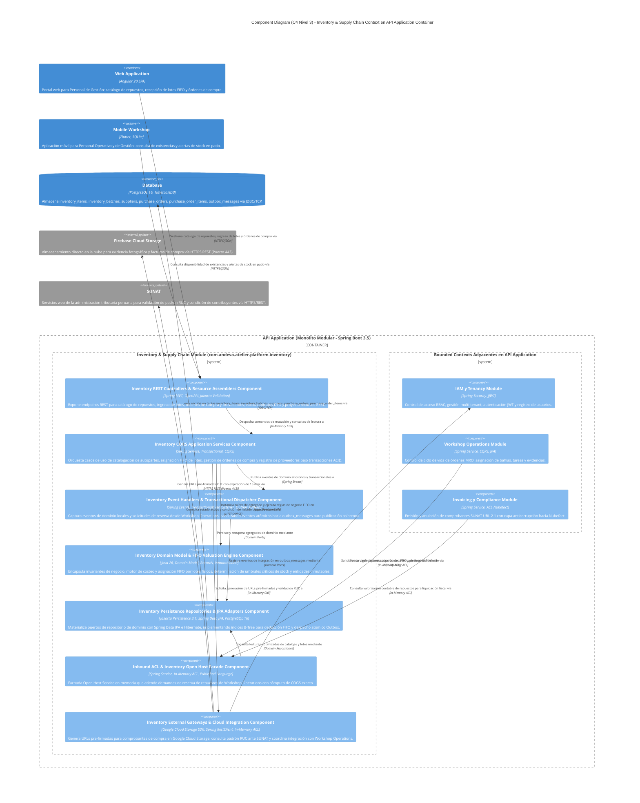
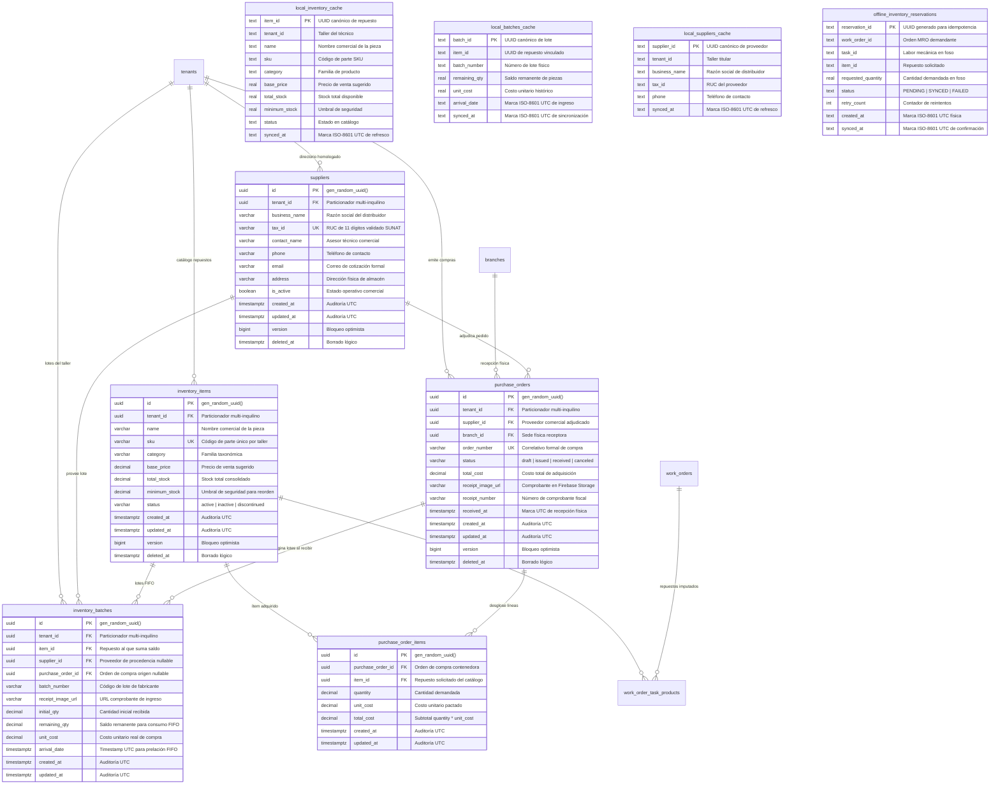

## 7. Fase 4: Bounded Context 4 — Inventory & Supply Chain Context (`com.andeva.atelier.platform.inventory`)

### 7.1. Diccionario y Propósito del Contexto

#### 7.1.1. Propósito y Límites de Responsabilidad
El **Inventory & Supply Chain Context** opera como el núcleo logístico y financiero de materiales de Atelier Platform. Su responsabilidad es doble: garantizar la disponibilidad continua de repuestos, fluidos y consumibles requeridos para el mantenimiento automotriz, y proteger la rentabilidad contable del taller mediante una estricta valuación del costo de ventas:
1. **Catálogo de Repuestos y Materiales (`InventoryItem`):** Centraliza el inventario físico de repuestos clasificados por categoría y codificados mediante su número de parte o código interno (`sku`). Cada ítem está aislado por taller (`TenantId`) y mantiene un precio de venta sugerido y un umbral de stock mínimo para reposición preventiva.
2. **Motor de Costeo FIFO Estricto por Lotes (`InventoryBatch`):** A diferencia de sistemas tradicionales que utilizan promedios ponderados erráticos, Atelier implementa el método **FIFO (First-In, First-Out / Primeras Entradas, Primeras Salidas)**. Cada lote de repuestos conserva su fecha y hora exacta de arribo (`arrival_date`), su costo unitario de adquisición (`unit_cost`) y su cantidad remanente (`remaining_qty`). Al demandarse repuestos desde el módulo de operaciones (MRO), el motor consume las unidades del lote más antiguo disponible, calculando con exactitud matemática el Costo de Mercadería Vendida (COGS / *Cost of Goods Sold*).
3. **Directorio de Proveedores Comerciales (`Supplier`):** Mantiene el padrón de proveedores de autopartes, lubricantes y herramientas, asociando su RUC formal (`tax_id`), datos de contacto y condiciones comerciales.
4. **Órdenes de Compra y Recepción Documental (`PurchaseOrder` y `PurchaseOrderItem`):** Administra el aprovisionamiento de stock desde la emisión del pedido hasta la recepción en la sede física (`branch_id`), vinculando el comprobante de pago emitido por el proveedor mediante una imagen escaneada o fotografiada (`receipt_image_url`).
5. **Trazabilidad Fotográfica de Facturas de Compra:** Permite al administrador o jefe de repuestos fotografiar la factura física de compra desde la aplicación móvil o web. La imagen se almacena en **Firebase Cloud Storage**, y su enlace directo queda indexado en el lote correspondiente (`receipt_image_url`), garantizando una auditoría contable visual instantánea frente a discrepancias de precios.

#### 7.1.2. Decisiones de Diseño e Integraciones Críticas
* **Resolución del Cuello de Botella de v1:** En la versión previa, el método de reserva tomaba los lotes según el orden arbitrario devuelto por el motor de persistencia en memoria, sin ordenar por fecha de recepción ni calcular el costo ponderado. En v2, el servicio de dominio `FifoAllocationEngine` ordena de forma inmutable los lotes con `arrival_date ASC` y genera un registro atómico `StockAllocation` con el desglose exacto de cada lote deducido.
* **Desacoplamiento con MRO mediante Eventos y Fachada (OHS):** El contexto MRO no accede a la tabla `inventory_batches`. Cuando una tarea en MRO demanda un repuesto, emite `ProductStockReservationRequestedEvent`. El módulo de inventario procesa este requerimiento a través de su fachada `InventoryContextFacade`, valida la existencia de stock, ejecuta la deducción FIFO y responde con éxito o error de desabastecimiento.
* **Auditoría Directa de Comprobantes de Compra:** Al recepcionar una orden de compra o crear un lote directo, la imagen del comprobante fiscal (Factura/Boleta de proveedor) se vincula directamente al lote, cerrando el círculo entre la compra física y el consumo en el foso mecánico.

---

### 7.2. 2.6.4.1. Domain Layer

#### 7.2.1. Aggregates & Aggregate Roots

##### 1. `InventoryItem` (Aggregate Root)
* **Paquete:** `com.andeva.atelier.platform.inventory.domain.model.aggregates`
* **Herencia:** Extiende `AbstractDomainAggregateRoot<InventoryItem>`
* **Propósito:** Representa un tipo de repuesto, líquido o consumible comercializado o utilizado en el taller. Es la raíz del agregado que custodia la suma virtual de existencias y sus lotes FIFO asociados.
* **Atributos:**
  * `id: InventoryItemId` — Identificador universal del repuesto (UUID).
  * `tenantId: TenantId` — Taller mecánico dueño del inventario.
  * `name: String` — Denominación comercial (ej. "Filtro de Aceite Bosch PH3614", "Aceite Sintético 5W-30 Mobil 1").
  * `sku: Sku` — Código interno o número de parte de fabricante (único por taller).
  * `category: ItemCategory` — Categoría técnica (`LUBRICANTS`, `BRAKES`, `SUSPENSION`, `ENGINE`, `ELECTRICAL`, `TIRES`, `FILTERS`).
  * `basePrice: Money` — Precio unitario de venta sugerido al cliente final.
  * `totalStock: Quantity` — Cantidad total de existencias disponibles (suma virtual de `remaining_qty` de todos los lotes activos).
  * `minimumStock: Quantity` — Umbral mínimo de existencias para disparo de alertas de reorden.
  * `status: InventoryItemStatus` — Estado del ítem (`ACTIVE`, `INACTIVE`, `DISCONTINUED`).
  * `batches: List<InventoryBatch>` — Colección interna de lotes físicos ordenados cronológicamente.
* **Invariantes y Reglas de Negocio:**
  * El `sku` debe ser único en el ámbito del `tenantId`.
  * El `totalStock` no puede ser negativo y siempre debe ser exactamente igual a la suma aritmética de los `remainingQuantity` de los lotes de la colección interna.
  * El `basePrice` debe ser superior a cero y no puede ser inferior al costo promedio de los lotes activos (regla de margen comercial mínimo).
* **Métodos:**
  * `+ static InventoryItem create(TenantId tenantId, String name, Sku sku, ItemCategory category, Money basePrice, Quantity minStock): InventoryItem`: Factoría de dominio en estado `ACTIVE` con `totalStock = 0`; registra `InventoryItemCreatedEvent`.
  * `+ InventoryBatch addBatch(SupplierId supplierId, String batchNumber, Quantity quantity, Money unitCost, Instant arrivalDate, ImageUrl receiptImageUrl): InventoryBatch`: Incorpora un nuevo lote de compras, suma la cantidad al `totalStock`, agrega el lote a la colección interna y registra `InventoryBatchAddedEvent`.
  * `+ StockAllocation allocateStockFifo(Quantity requestedQuantity): StockAllocation`:
    1. Valida que `totalStock >= requestedQuantity`; si no hay stock suficiente, lanza excepción de dominio `InsufficientStockException`.
    2. Filtra los lotes con `remainingQuantity > 0` y los ordena cronológicamente por `arrivalDate ASC`.
    3. Itera deduciendo unidades de cada lote hasta satisfacer completamente la cantidad solicitada.
    4. Calcula el Costo de Mercadería Vendida acumulado (`cogs = sum(qty * batch.unitCost)`).
    5. Actualiza `totalStock`.
    6. Si `totalStock <= minimumStock`, registra `LowStockThresholdReachedEvent`.
    7. Registra `StockAllocatedFifoEvent` y retorna el registro inmutable `StockAllocation`.
  * `+ void releaseStockAllocation(StockAllocation allocation): void`: Itera sobre las deducciones de la asignación y restituye las unidades a los lotes correspondientes, actualizando `totalStock` y registrando `StockReleasedEvent`.
  * `+ void updateDetails(String name, ItemCategory category, Money basePrice, Quantity minStock): void`: Actualiza metadatos y precio de venta sugerido.
  * `+ void deactivate(): void`: Marca el repuesto como inactivo.

##### 2. `Supplier` (Aggregate Root)
* **Paquete:** `com.andeva.atelier.platform.inventory.domain.model.aggregates`
* **Herencia:** Extiende `AbstractDomainAggregateRoot<Supplier>`
* **Propósito:** Modela al proveedor comercial de repuestos, lubricantes y consumibles del taller.
* **Atributos:**
  * `id: SupplierId` — Identificador único del proveedor (UUID).
  * `tenantId: TenantId` — Taller propietario del registro de proveedor.
  * `businessName: String` — Razón Social o nombre comercial formal.
  * `taxId: TaxId` — RUC de 11 dígitos de la empresa proveedora (validado formalmente).
  * `contactName: String` — Nombre de la persona o asesor de ventas de contacto.
  * `phone: PhoneNumber` — Teléfono de contacto.
  * `email: EmailAddress` — Correo electrónico para cotizaciones y órdenes de compra.
  * `address: String` — Dirección fiscal o almacén principal del proveedor.
  * `isActive: boolean` — Estado operativo del proveedor en el taller.
* **Invariantes y Reglas de Negocio:**
  * El `taxId` (RUC) es obligatorio y único dentro del mismo taller (`tenant_id, tax_id`).
  * `businessName` no puede ser vacío.
* **Métodos:**
  * `+ static Supplier register(TenantId tenantId, String businessName, TaxId taxId, String contactName, PhoneNumber phone, EmailAddress email, String address): Supplier`: Factoría de dominio; registra `SupplierRegisteredEvent`.
  * `+ void updateContactInfo(String contactName, PhoneNumber phone, EmailAddress email, String address): void`: Actualiza datos comerciales.
  * `+ void deactivate(): void`: Inhabilita al proveedor para futuras órdenes de compra.
  * `+ void activate(): void`: Restituye la vigencia del proveedor.

##### 3. `PurchaseOrder` (Aggregate Root)
* **Paquete:** `com.andeva.atelier.platform.inventory.domain.model.aggregates`
* **Herencia:** Extiende `AbstractDomainAggregateRoot<PurchaseOrder>`
* **Propósito:** Representa la orden formal de adquisición de repuestos emitida a un proveedor y su posterior recepción física con comprobante.
* **Atributos:**
  * `id: PurchaseOrderId` — Identificador universal de la orden de compra (UUID).
  * `tenantId: TenantId` — Taller emisor.
  * `supplierId: SupplierId` — Proveedor seleccionado.
  * `branchId: BranchId` — Sede física que recibirá la mercadería.
  * `orderNumber: String` — Correlativo interno de compra (ej. "OC-2026-0042").
  * `status: PurchaseOrderStatus` — Estado (`DRAFT`, `ISSUED`, `RECEIVED`, `CANCELED`).
  * `totalCost: Money` — Costo total de adquisición de la orden.
  * `receiptImageUrl: ImageUrl` — URL de la factura o boleta escaneada en Firebase Storage (nullable hasta recepción).
  * `receiptNumber: String` — Número del comprobante fiscal del proveedor (ej. "F001-004928", nullable hasta recepción).
  * `receivedAt: Instant` — Fecha y hora de recepción física y conformidad (nullable hasta recepción).
  * `items: List<PurchaseOrderItem>` — Colección de repuestos y cantidades compradas.
* **Invariantes y Reglas de Negocio:**
  * No se pueden modificar ítems si la orden se encuentra en estado `RECEIVED` o `CANCELED`.
  * Solo una orden en estado `ISSUED` puede ser recibida (`RECEIVED`).
  * Al transicionar a `RECEIVED`, el `receiptImageUrl` y `receiptNumber` son estrictamente obligatorios.
* **Métodos:**
  * `+ static PurchaseOrder create(TenantId tenantId, SupplierId supplierId, BranchId branchId, String orderNumber): PurchaseOrder`: Factoría en estado `DRAFT`; registra `PurchaseOrderCreatedEvent`.
  * `+ void addItem(InventoryItemId itemId, Quantity quantity, Money unitCost): void`: Incorpora un ítem a la orden y recalcula `totalCost`.
  * `+ void removeItem(PurchaseOrderItemId itemId): void`: Remueve un ítem y actualiza `totalCost`.
  * `+ void issue(): void`: Emite formalmente la orden hacia el proveedor pasando a estado `ISSUED`.
  * `+ void receive(ImageUrl receiptImageUrl, String receiptNumber, Instant receivedAt): void`:
    1. Valida comprobante y fecha.
    2. Transiciona a `RECEIVED`.
    3. Fija `receivedAt`.
    4. Dispara `PurchaseOrderReceivedEvent`, el cual desencadena la creación automática de los `InventoryBatch` en cada repuesto.
  * `+ void cancel(String reason): void`: Anula la orden de compra.

---

#### 7.2.2. Entities

##### 1. `InventoryBatch` (Entidad Dependiente de `InventoryItem`)
* **Paquete:** `com.andeva.atelier.platform.inventory.domain.model.entities`
* **Propósito:** Modela el lote físico específico ingresado al taller, portador del costo de adquisición histórico para el algoritmo FIFO.
* **Atributos:**
  * `id: InventoryBatchId` — Identificador único del lote (UUID).
  * `tenantId: TenantId` — Taller propietario.
  * `itemId: InventoryItemId` — Repuesto al que pertenece el lote.
  * `supplierId: SupplierId` — Proveedor de procedencia (nullable si es stock inicial).
  * `batchNumber: String` — Código de lote provisto por el fabricante o proveedor.
  * `initialQuantity: Quantity` — Cantidad original ingresada al almacén.
  * `remainingQuantity: Quantity` — Cantidad remanente disponible para consumo.
  * `unitCost: Money` — Costo unitario real de adquisición de este lote.
  * `arrivalDate: Instant` — Marca de tiempo exacta de recepción (clave del ordenamiento FIFO).
  * `receiptImageUrl: ImageUrl` — Enlace a la fotografía de la factura de compra en Firebase Storage.
* **Métodos:**
  * `+ boolean hasStock(): boolean`: Retorna `true` si `remainingQuantity.isGreaterThan(Quantity.ZERO)`.
  * `+ Quantity deduct(Quantity requestedQuantity): Quantity`: Deduce hasta el máximo de `remainingQuantity` disponible y retorna la cantidad efectivamente consumida de este lote.
  * `+ void restore(Quantity quantityToRestore): void`: Restituye existencias liberadas asegurando no superar `initialQuantity`.

##### 2. `PurchaseOrderItem` (Entidad Dependiente de `PurchaseOrder`)
* **Paquete:** `com.andeva.atelier.platform.inventory.domain.model.entities`
* **Propósito:** Línea de detalle de compra de un repuesto específico.
* **Atributos:**
  * `id: PurchaseOrderItemId` — Identificador del ítem (UUID).
  * `orderId: PurchaseOrderId` — Orden de compra padre.
  * `itemId: InventoryItemId` — Repuesto solicitado.
  * `quantity: Quantity` — Cantidad demandada.
  * `unitCost: Money` — Costo unitario pactado con el proveedor.
  * `totalCost: Money` — Subtotal calculado (`quantity * unitCost`).
* **Métodos:**
  * `+ void updateQuantity(Quantity newQuantity): void`: Modifica cantidad y recalcula `totalCost`.

---

#### 7.2.3. Value Objects

* **`InventoryItemId(UUID value)`:** Identificador tipado de repuesto.
* **`InventoryBatchId(UUID value)`:** Identificador tipado de lote.
* **`SupplierId(UUID value)`:** Identificador tipado de proveedor.
* **`PurchaseOrderId(UUID value)`:** Identificador tipado de orden de compra.
* **`PurchaseOrderItemId(UUID value)`:** Identificador tipado de ítem de orden de compra.
* **`Sku(String value)`:** Stock Keeping Unit. Normaliza eliminando espacios y convirtiendo a mayúsculas. Valida formato alfanumérico de 3 a 50 caracteres.
* **`Quantity(BigDecimal value)`:** Cantidad numérica no negativa con dos decimales de precisión. Métodos: `add()`, `subtract()`, `isGreaterThan()`, `isLessThanOrEqualTo()`.
* **`ItemCategory` (Enum):** `LUBRICANTS`, `BRAKES`, `SUSPENSION`, `ENGINE`, `ELECTRICAL`, `TIRES`, `FILTERS`, `BODYWORK`, `ACCESSORIES`.
* **`InventoryItemStatus` (Enum):** `ACTIVE`, `INACTIVE`, `DISCONTINUED`.
* **`PurchaseOrderStatus` (Enum):** `DRAFT`, `ISSUED`, `RECEIVED`, `CANCELED`.
* **`StockAllocation(UUID allocationId, Quantity allocatedQuantity, Money totalCostOfGoodsSold, List<BatchDeduction> deductions)`:** Registro inmutable que encapsula el resultado de una deducción FIFO completa, incluyendo el Costo de Ventas (COGS) ponderado.
* **`BatchDeduction(UUID batchId, Quantity quantityDeducted, Money unitCost)`:** Detalle de las unidades y costo extraídos de un lote específico.

---

#### 7.2.4. Domain Commands

* `CreateInventoryItemCommand(TenantId tenantId, String name, String sku, String category, BigDecimal basePrice, BigDecimal minStock, String currency)`
* `AddInventoryBatchCommand(InventoryItemId itemId, UUID supplierId, String batchNumber, BigDecimal quantity, BigDecimal unitCost, String currency, String receiptImageUrl)`
* `AllocateStockFifoCommand(InventoryItemId itemId, BigDecimal quantity)`
* `ReleaseStockAllocationCommand(InventoryItemId itemId, StockAllocation allocation)`
* `UpdateInventoryItemCommand(InventoryItemId itemId, String name, String category, BigDecimal basePrice, BigDecimal minStock, String currency)`
* `RegisterSupplierCommand(TenantId tenantId, String businessName, String taxId, String contactName, String phone, String email, String address)`
* `UpdateSupplierCommand(SupplierId supplierId, String contactName, String phone, String email, String address)`
* `CreatePurchaseOrderCommand(TenantId tenantId, SupplierId supplierId, BranchId branchId, String orderNumber)`
* `AddPurchaseOrderItemCommand(PurchaseOrderId orderId, InventoryItemId itemId, BigDecimal quantity, BigDecimal unitCost, String currency)`
* `IssuePurchaseOrderCommand(PurchaseOrderId orderId)`
* `ReceivePurchaseOrderCommand(PurchaseOrderId orderId, String receiptImageUrl, String receiptNumber, Instant receivedAt)`
* `CancelPurchaseOrderCommand(PurchaseOrderId orderId, String reason)`

---

#### 7.2.5. Domain Queries

* `GetInventoryItemByIdQuery(InventoryItemId itemId)`
* `GetInventoryItemsByTenantIdQuery(TenantId tenantId)`
* `GetInventoryBatchesByItemIdQuery(InventoryItemId itemId)`
* `GetLowStockItemsQuery(TenantId tenantId)`
* `GetInventoryValuationQuery(TenantId tenantId)`
* `GetSupplierByIdQuery(SupplierId supplierId)`
* `GetSuppliersByTenantIdQuery(TenantId tenantId)`
* `GetPurchaseOrderByIdQuery(PurchaseOrderId orderId)`
* `GetPurchaseOrdersByTenantIdQuery(TenantId tenantId)`

---

#### 7.2.6. Domain Events

* `InventoryItemCreatedEvent(InventoryItemId itemId, TenantId tenantId, Sku sku, String name, Instant occurredOn)`
* `InventoryBatchAddedEvent(InventoryBatchId batchId, InventoryItemId itemId, Quantity quantity, Money unitCost, Instant occurredOn)`
* `StockAllocatedFifoEvent(InventoryItemId itemId, Quantity allocatedQuantity, Money cogs, Instant occurredOn)`
* `StockReleasedEvent(InventoryItemId itemId, Quantity releasedQuantity, Instant occurredOn)`
* `LowStockThresholdReachedEvent(InventoryItemId itemId, TenantId tenantId, Quantity currentStock, Quantity minStock, Instant occurredOn)`
* `SupplierRegisteredEvent(SupplierId supplierId, TenantId tenantId, String businessName, TaxId taxId, Instant occurredOn)`
* `PurchaseOrderCreatedEvent(PurchaseOrderId orderId, TenantId tenantId, SupplierId supplierId, Instant occurredOn)`
* `PurchaseOrderReceivedEvent(PurchaseOrderId orderId, TenantId tenantId, SupplierId supplierId, Money totalCost, Instant occurredOn)`
* `PurchaseOrderCanceledEvent(PurchaseOrderId orderId, String reason, Instant occurredOn)`

---

#### 7.2.7. Repositories (Interfaces de Dominio)

* **`InventoryItemRepository`:**
  * `InventoryItem save(InventoryItem item)`
  * `Optional<InventoryItem> findById(InventoryItemId id)`
  * `Optional<InventoryItem> findByTenantIdAndSku(TenantId tenantId, Sku sku)`
  * `List<InventoryItem> findByTenantId(TenantId tenantId)`
  * `List<InventoryItem> findLowStockItems(TenantId tenantId)`
  * `boolean existsByTenantIdAndSku(TenantId tenantId, Sku sku)`
* **`InventoryBatchRepository`:**
  * `InventoryBatch save(InventoryBatch batch)`
  * `List<InventoryBatch> findByItemIdOrderByArrivalDateAsc(InventoryItemId itemId)`
  * `List<InventoryBatch> findActiveBatchesByItemId(InventoryItemId itemId)`
* **`SupplierRepository`:**
  * `Supplier save(Supplier supplier)`
  * `Optional<Supplier> findById(SupplierId id)`
  * `Optional<Supplier> findByTenantIdAndTaxId(TenantId tenantId, TaxId taxId)`
  * `List<Supplier> findByTenantId(TenantId tenantId)`
* **`PurchaseOrderRepository`:**
  * `PurchaseOrder save(PurchaseOrder order)`
  * `Optional<PurchaseOrder> findById(PurchaseOrderId id)`
  * `List<PurchaseOrder> findByTenantId(TenantId tenantId)`
  * `List<PurchaseOrder> findBySupplierId(SupplierId supplierId)`

#### 7.2.8. Domain Services

##### 1. `FifoAllocationEngine` (Motor Algorítmico de Asignación y Costeo FIFO)
* **Paquete:** `com.andeva.atelier.platform.inventory.domain.services`
* **Responsabilidad:** Implementa el algoritmo matemático determinista de asignación de inventario por orden cronológico estricto de recepción física (*First-In, First-Out*).
* **Firma Principal:** `StockAllocation allocate(InventoryItem item, Quantity requestedQuantity)`
* **Lógica Algorítmica:**
  1. Recupera los lotes físicos activos asociados al ítem con saldo remanente positivo (`remainingQuantity > 0`).
  2. Ordena los lotes de forma inmutable por fecha de arribo ascendente (`arrivalDate ASC`).
  3. Itera sobre la lista ordenada deduciendo la cantidad demandada del lote más antiguo disponible:
     $$\text{cuota}_i = \min(Q_{\text{pendiente}}, B_i.\text{remainingQuantity})$$
  4. Calcula el costo unitario real de adquisición de la fracción asignada y acumula el Costo de Mercadería Vendida (COGS):
     $$\text{COGS} = \sum_{i=1}^{k} (\text{cuota}_i \times B_i.\text{unitCost})$$
  5. Aplica la deducción sobre cada lote ($B_i.\text{deduct}(\text{cuota}_i)$) y actualiza el `totalStock` del agregado.
  6. Si la sumatoria total del saldo remanente de los lotes es estrictamente menor a la cantidad solicitada ($\sum B_i < Q_{\text{solicitada}}$), aborta atómicamente la operación y arroja la excepción de negocio `InsufficientStockException`.
  7. Retorna el registro inmutable `StockAllocation` con el identificador de asignación, la cantidad total extraída, el importe acumulado de COGS y el desglose de deducciones por lote (`List<BatchDeduction>`).

##### 2. `InventoryValuationService` (Servicio de Valuación Patrimonial de Almacén)
* **Paquete:** `com.andeva.atelier.platform.inventory.domain.services`
* **Responsabilidad:** Calcula la capitalización económica y el valor contable consolidado de existencias físicas disponibles en el taller automotriz bajo el método FIFO.
* **Firma Principal:** `Money calculateTotalValuation(TenantId tenantId, List<InventoryItem> items)`
* **Lógica Algorítmica:**
  1. Itera sobre cada ítem de inventario activo perteneciente al taller.
  2. Suma el producto del saldo disponible de cada lote activo por su costo unitario histórico de compra inmutable:
     $$\text{ValuaciónTotal} = \sum_{j=1}^{m} \sum_{i=1}^{n_j} (B_{j,i}.\text{remainingQuantity} \times B_{j,i}.\text{unitCost})$$
  3. Retorna el valor financiero total en la moneda operativa del taller con precisión bancaria (`RoundingMode.HALF_EVEN`), proveyendo sustento para balances contables, liquidaciones impositivas y auditorías patrimoniales.

##### 3. `StockReorderEvaluationService` (Servicio de Monitoreo de Umbral Crítico y Reposición)
* **Paquete:** `com.andeva.atelier.platform.inventory.domain.services`
* **Responsabilidad:** Evalúa los niveles de inventario físico tras cada consumo o ajuste, determinando la necesidad de reposición preventiva para evitar desabastecimiento en bahías de servicio.
* **Firma Principal:** `ReorderRecommendation evaluateReorder(InventoryItem item, int averageDailyDemand, int supplierLeadTimeDays)`
* **Lógica Algorítmica:**
  1. Compara el `totalStock` actual del ítem contra su `minimumStock` configurado.
  2. Si `totalStock <= minimumStock`, calcula el punto de pedido (*Reorder Point*) y la cantidad económica sugerida de reposición:
     $$\text{CantidadSugerida} = (\text{averageDailyDemand} \times \text{supplierLeadTimeDays}) + \text{minimumStock} - \text{totalStock}$$
  3. Retorna una recomendación de compra inmutable y habilita la generación de un borrador de orden de compra en estado `DRAFT`.

---

#### 7.2.9. Domain Exceptions

Jerarquía de excepciones semánticas no comprobadas del dominio de inventario, derivadas de `DomainException` (`com.andeva.atelier.platform.shared.domain.exceptions.DomainException`), provistas de código legible según la norma RFC 7807 y mapeo a códigos de estado HTTP:

| Excepción de Dominio | Código RFC 7807 | Estatus HTTP | Condición de Activación en el Dominio |
| :--- | :--- | :---: | :--- |
| `InsufficientStockException` | `ERR_INSUFFICIENT_STOCK` | 409 Conflict | La cantidad solicitada para consumo en orden de trabajo supera el saldo total disponible de existencias. |
| `DuplicateSkuException` | `ERR_DUPLICATE_SKU` | 409 Conflict | Se intenta registrar o actualizar un ítem con un código SKU que ya existe en el ámbito del mismo taller. |
| `DuplicateSupplierTaxIdException` | `ERR_DUPLICATE_SUPPLIER_RUC` | 409 Conflict | Se intenta registrar un proveedor con un RUC que ya se encuentra activo en el directorio del taller. |
| `InvalidBatchQuantityException` | `ERR_INVALID_BATCH_QUANTITY` | 422 Unprocessable | La cantidad ingresada o deducida de un lote físico es menor o igual a cero, o excede la capacidad remanente. |
| `InvalidPurchaseOrderTransitionException` | `ERR_INVALID_PO_TRANSITION` | 400 Bad Request | Se intenta una transición no permitida en la máquina de estados de la orden de compra (ej. transicionar de DRAFT a RECEIVED directamente). |
| `PurchaseOrderEmptyException` | `ERR_EMPTY_PURCHASE_ORDER` | 422 Unprocessable | Se intenta emitir formalmente una orden de compra que no contiene ninguna línea de repuesto agregada. |
| `MissingReceiptDocumentationException` | `ERR_MISSING_RECEIPT_DOC` | 422 Unprocessable | Se intenta dar conformidad de recepción física a una orden de compra sin adjuntar la fotografía de la factura o número de comprobante. |
| `InventoryItemNotFoundException` | `ERR_ITEM_NOT_FOUND` | 404 Not Found | No se localiza el repuesto solicitado en el catálogo del taller mediante el identificador provisto. |
| `SupplierNotFoundException` | `ERR_SUPPLIER_NOT_FOUND` | 404 Not Found | No se localiza el proveedor comercial en el directorio del taller mediante su identificador único. |
| `PurchaseOrderNotFoundException` | `ERR_PO_NOT_FOUND` | 404 Not Found | No se localiza la orden de compra especificada para operaciones de consulta, emisión o recepción. |

---

### 7.3. 2.6.4.2. Interface Layer

#### 7.3.1. REST Controllers

##### 1. `InventoryItemsController`
* **Ruta Base:** `/api/v1/inventory/items`
* **Propósito:** Catálogo de repuestos, precios y consulta de existencias.
* **Endpoints:**
  * `POST`: Creación de nuevo repuesto en catálogo. Recibe `CreateInventoryItemResource`, retorna `InventoryItemResource` (HTTP 201 Created).
  * `GET`: Listado del catálogo de repuestos con stock disponible. Retorna `List<InventoryItemSummaryResource>` (HTTP 200 OK).
  * `GET /{id}`: Detalle del repuesto con desglose de sus lotes activos. Retorna `InventoryItemDetailResource` (HTTP 200 OK / 404 Not Found).
  * `PUT /{id}`: Actualización de precio, SKU y stock mínimo. Recibe `UpdateInventoryItemResource`, retorna `InventoryItemResource` (HTTP 200 OK).
  * `GET /low-stock`: Listado de repuestos en situación crítica por debajo del umbral mínimo. Retorna `List<InventoryItemSummaryResource>` (HTTP 200 OK).
  * `GET /valuation`: Cálculo de valuación total del inventario a costo FIFO. Retorna `InventoryValuationResource` (HTTP 200 OK).

##### 2. `InventoryBatchesController`
* **Ruta Base:** `/api/v1/inventory/items/{itemId}/batches`
* **Propósito:** Incorporación directa de lotes de repuestos con factura.
* **Endpoints:**
  * `POST`: Ingreso manual de lote con costo unitario y foto de factura. Recibe `AddInventoryBatchResource`, retorna `InventoryBatchResource` (HTTP 201 Created).
  * `GET`: Trazabilidad histórica de todos los lotes del repuesto. Retorna `List<InventoryBatchResource>` (HTTP 200 OK).

##### 3. `SuppliersController`
* **Ruta Base:** `/api/v1/inventory/suppliers`
* **Propósito:** Gestión del directorio comercial de proveedores.
* **Endpoints:**
  * `POST`: Registro de proveedor de repuestos. Recibe `CreateSupplierResource`, retorna `SupplierResource` (HTTP 201 Created).
  * `GET`: Directorio de proveedores del taller. Retorna `List<SupplierResource>` (HTTP 200 OK).
  * `GET /{id}`: Detalle de proveedor. Retorna `SupplierResource` (HTTP 200 OK).
  * `PUT /{id}`: Actualización de contacto y dirección. Recibe `UpdateSupplierResource`, retorna `SupplierResource` (HTTP 200 OK).

##### 4. `PurchaseOrdersController`
* **Ruta Base:** `/api/v1/inventory/purchase-orders`
* **Propósito:** Órdenes de compra y recepción de mercadería con comprobante.
* **Endpoints:**
  * `POST`: Creación de orden de compra en borrador. Recibe `CreatePurchaseOrderResource`, retorna `PurchaseOrderResource` (HTTP 201 Created).
  * `GET`: Listado de órdenes de compra del taller. Retorna `List<PurchaseOrderResource>` (HTTP 200 OK).
  * `POST /{id}/items`: Adición de repuestos a la orden de compra. Recibe `AddPurchaseOrderItemResource`, retorna `PurchaseOrderResource` (HTTP 201 Created).
  * `PUT /{id}/issue`: Emisión formal al proveedor. Retorna `PurchaseOrderResource` (HTTP 200 OK).
  * `PUT /{id}/receive`: Conformidad de recepción con subida de factura escaneada. Recibe `ReceivePurchaseOrderResource`, retorna `PurchaseOrderResource` (HTTP 200 OK).
  * `PUT /{id}/cancel`: Anulación de la orden. Recibe `CancelPurchaseOrderResource`, retorna `PurchaseOrderResource` (HTTP 200 OK).

---

#### 7.3.2. Resources / DTOs

* **Peticiones (Requests):**
  * `CreateInventoryItemResource(String name, String sku, String category, BigDecimal basePrice, BigDecimal minStock, String currency)`
  * `UpdateInventoryItemResource(String name, String category, BigDecimal basePrice, BigDecimal minStock, String currency)`
  * `AddInventoryBatchResource(UUID supplierId, String batchNumber, BigDecimal quantity, BigDecimal unitCost, String currency, String receiptImageUrl)`
  * `CreateSupplierResource(String businessName, String taxId, String contactName, String phone, String email, String address)`
  * `UpdateSupplierResource(String contactName, String phone, String email, String address)`
  * `CreatePurchaseOrderResource(UUID supplierId, UUID branchId, String orderNumber)`
  * `AddPurchaseOrderItemResource(UUID itemId, BigDecimal quantity, BigDecimal unitCost, String currency)`
  * `ReceivePurchaseOrderResource(String receiptImageUrl, String receiptNumber, Instant receivedAt)`
  * `CancelPurchaseOrderResource(String reason)`
* **Respuestas (Responses):**
  * `InventoryItemResource(UUID id, UUID tenantId, String name, String sku, String category, BigDecimal basePrice, BigDecimal totalStock, BigDecimal minimumStock, String status, String currency)`
  * `InventoryItemSummaryResource(UUID id, String name, String sku, String category, BigDecimal basePrice, BigDecimal totalStock, String currency)`
  * `InventoryItemDetailResource(UUID id, String name, String sku, String category, BigDecimal basePrice, BigDecimal totalStock, BigDecimal minimumStock, String currency, List<InventoryBatchResource> batches)`
  * `InventoryBatchResource(UUID id, UUID itemId, UUID supplierId, String supplierName, String batchNumber, BigDecimal initialQuantity, BigDecimal remainingQuantity, BigDecimal unitCost, String currency, Instant arrivalDate, String receiptImageUrl)`
  * `SupplierResource(UUID id, UUID tenantId, String businessName, String taxId, String contactName, String phone, String email, String address, boolean isActive)`
  * `PurchaseOrderResource(UUID id, UUID tenantId, UUID supplierId, String supplierName, UUID branchId, String orderNumber, String status, BigDecimal totalCost, String currency, String receiptImageUrl, String receiptNumber, Instant receivedAt, List<PurchaseOrderItemResource> items)`
  * `PurchaseOrderItemResource(UUID id, UUID itemId, String itemName, String sku, BigDecimal quantity, BigDecimal unitCost, BigDecimal totalCost, String currency)`
  * `InventoryValuationResource(UUID tenantId, BigDecimal totalValuation, int distinctItemsCount, Instant calculatedAt)`

---

#### 7.3.3. Resource Assemblers

* `InventoryItemResourceAssembler`: Mapea `InventoryItem` a `InventoryItemResource`, `InventoryItemSummaryResource` y `InventoryItemDetailResource`.
* `InventoryBatchResourceAssembler`: Mapea `InventoryBatch` a `InventoryBatchResource`.
* `SupplierResourceAssembler`: Mapea `Supplier` a `SupplierResource`.
* `PurchaseOrderResourceAssembler`: Mapea `PurchaseOrder` a `PurchaseOrderResource`.

---

#### 7.3.4. Open Host Service (OHS) / Inbound ACL Facade

Interfaz pública en `com.andeva.atelier.platform.inventory.interfaces.acl`:

```java
package com.andeva.atelier.platform.inventory.interfaces.acl;

import com.andeva.atelier.platform.shared.application.result.Result;
import java.math.BigDecimal;
import java.util.List;
import java.util.Optional;
import java.util.UUID;

public interface InventoryContextFacade {
    Result<StockAllocationAclDto, String> reserveStockForWorkOrder(UUID tenantId, UUID itemId, BigDecimal quantity);
    void releaseStockReservation(UUID tenantId, UUID itemId, List<BatchDeductionAclDto> deductions);
    Optional<InventoryItemSummaryAclDto> fetchItemSummary(UUID itemId);
    BigDecimal fetchItemCurrentStock(UUID itemId);
    BigDecimal calculateInventoryValuation(UUID tenantId);
}
```

*DTOs Exportados por la Fachada:*
* `StockAllocationAclDto(UUID allocationId, BigDecimal allocatedQuantity, BigDecimal totalCogs, List<BatchDeductionAclDto> deductions)`
* `BatchDeductionAclDto(UUID batchId, BigDecimal quantityDeducted, BigDecimal unitCost)`
* `InventoryItemSummaryAclDto(UUID id, UUID tenantId, String name, String sku, BigDecimal basePrice, BigDecimal totalStock)`

---

#### 7.3.5. Integration Events (Published Language)

* `StockReservedIntegrationEvent(UUID workOrderId, UUID itemId, BigDecimal quantity, BigDecimal cogsAmount, Instant occurredOn)`: Confirma la reserva exitosa y transmite el Costo de Ventas a contabilidad.
* `StockReservationFailedIntegrationEvent(UUID workOrderId, UUID itemId, BigDecimal requestedQuantity, String reason, Instant occurredOn)`: Alerta a MRO de que el repuesto no tiene existencias para detener la orden.
* `StockLowIntegrationEvent(UUID tenantId, UUID itemId, String sku, BigDecimal currentStock, BigDecimal minimumStock, Instant occurredOn)`: Dispara alertas en el panel de compras para reposición.
* `BatchReceivedIntegrationEvent(UUID batchId, UUID itemId, BigDecimal quantity, BigDecimal unitCost, Instant occurredOn)`: Registra el alta física de materiales en el sistema.

---

### 7.4. 2.6.5.3. Application Layer

La Capa de Aplicación del Bounded Context **Inventory & Supply Chain** actúa como el orquestador transaccional bajo el paquete canónico `com.andeva.atelier.platform.inventory.application`. Su cometido esencial radica en coordinar los flujos de negocio del almacén automotriz implementando el patrón arquitectónico CQRS (*Command Query Responsibility Segregation*), garantizando la integridad referencial y contable del catálogo de piezas, la disciplina algorítmica del costeo FIFO por lotes físicos, el padrón comercial de proveedores con validación de RUC ante SUNAT y el ciclo de vida de órdenes de compra multi-producto.

El diseño táctico de la Capa de Aplicación se fundamenta en cuatro pilares de ingeniería de software:
- **Orquestación transaccional atómica de inventario FIFO y abastecimiento:** Cada deducción de repuestos solicitada por MRO o recepción física de compra se ejecuta bajo transacciones estrictas que actualizan atómicamente los saldos remanentes de los lotes y el stock total del agregado.
- **Manejo determinista de resultados mediante el tipo sellado `Result<T, ApplicationError>`:** Todos los servicios de comandos canalizan el éxito o fracaso operativo a través del contenedor funcional sellado del Shared Kernel, erradicando el uso indiscriminado de excepciones en tiempo de ejecución para control de flujo.
- **Coreografía reactiva de eventos y garantía de entrega At-Least-Once:** Los eventos de dominio se propagan síncronamente dentro de la frontera transaccional y se persisten en la tabla `outbox_messages` en fase `AFTER_COMMIT` para su posterior publicación asíncrona hacia el bus de integración.
- **Inversión de dependencias y aislamiento perimetral mediante puertos ACL:** La interacción con subsistemas externos de almacenamiento de imágenes (*Firebase Cloud Storage*) y validación de padrones fiscales (*SUNAT RUC*) se abstrae detrás de pasarelas de infraestructura.

---

#### 7.4.1. Command Services & Implementations

##### 1. `InventoryItemCommandService` & `InventoryItemCommandServiceImpl`

* `Result<InventoryItem, ApplicationError> handle(CreateInventoryItemCommand command)`:
  1. Valida la unicidad del código SKU dentro del taller (`InventoryItemRepository.existsByTenantIdAndSku`). Si ya existe, retorna `ApplicationError.conflict("ERR_DUPLICATE_SKU", "El código SKU ya se encuentra registrado en este taller")`.
  2. Instancia la raíz de agregado `InventoryItem` a través de su factoría estática `create`, estableciendo estado `ACTIVE` y saldo inicial en cero.
  3. Persiste la entidad mediante `InventoryItemRepository.save` y registra el evento de dominio `InventoryItemCreatedEvent`.
  4. Retorna `Result.success(item)`.

* `Result<InventoryBatch, ApplicationError> handle(AddInventoryBatchCommand command)`:
  1. Localiza el repuesto por su identificador único (`InventoryItemRepository.findById`). Si no existe, retorna `ApplicationError.notFound("ERR_ITEM_NOT_FOUND", "Repuesto no encontrado")`.
  2. Si se especificó `supplierId`, valida la existencia del proveedor comercial (`SupplierRepository.findById`).
  3. Valida la validez de la URL del comprobante escaneado mediante `FirebaseReceiptImageStorageGateway`.
  4. Invoca el método de dominio `item.addBatch(supplierId, null, batchNumber, quantity, unitCost, arrivalDate, receiptImageUrl)`.
  5. Persiste el agregado actualizado, registrando el lote físico en `inventory_batches`, recalculando el `totalStock` e incrementando la versión de concurrencia optimista.
  6. Retorna `Result.success(newBatch)`.

* `Result<StockAllocation, ApplicationError> handle(AllocateStockFifoCommand command)`:
  1. Localiza el repuesto mediante `InventoryItemRepository.findById`.
  2. Evalúa si el stock total disponible satisface la cantidad solicitada. Si `totalStock < requestedQuantity`, retorna `ApplicationError.conflict("ERR_INSUFFICIENT_STOCK", "Existencias insuficientes para satisfacer la reserva")`.
  3. Ejecuta el algoritmo de deducción FIFO (`item.allocateStockFifo(requestedQuantity)`), el cual recorre cronológicamente los lotes activos con `remainingQuantity > 0`, consumiendo las unidades disponibles e imputando el Costo de Ventas (COGS) unitario real de cada remesa.
  4. Persiste los lotes afectados y el nuevo saldo total.
  5. Retorna `Result.success(allocation)` conteniendo las deducciones por lote y el monto total de COGS calculado.

* `Result<Void, ApplicationError> handle(ReleaseStockAllocationCommand command)`:
  1. Localiza el repuesto.
  2. Itera sobre la lista de deducciones previas y restituye las unidades liberadas a cada uno de los lotes correspondientes mediante `item.restoreBatchStock(batchId, quantityToRestore)`.
  3. Recalcula el `totalStock` del agregado y persiste los cambios.
  4. Retorna `Result.success(null)`.

* `Result<InventoryItem, ApplicationError> handle(UpdateInventoryItemCommand command)`:
  1. Localiza el repuesto por ID.
  2. Actualiza la descripción, categoría, precio base de venta y umbral de stock mínimo invocando los métodos de negocio del agregado.
  3. Persiste y retorna `Result.success(item)`.

* `Result<Void, ApplicationError> handle(DeactivateInventoryItemCommand command)`:
  1. Localiza el repuesto.
  2. Invoca `item.deactivate()`, verificando que no existan reservas activas en órdenes de trabajo en curso.
  3. Persiste y emite `InventoryItemDeactivatedEvent`.
  4. Retorna `Result.success(null)`.

##### 2. `SupplierCommandService` & `SupplierCommandServiceImpl`

* `Result<Supplier, ApplicationError> handle(RegisterSupplierCommand command)`:
  1. Valida sintácticamente el RUC de 11 dígitos y consulta su estado activo y condición de habido ante el padrón oficial mediante `SunatTaxIdValidationGateway`.
  2. Verifica que el RUC no se encuentre registrado previamente en el taller (`SupplierRepository.existsByTenantIdAndTaxId`). Si existe, retorna `ApplicationError.conflict("ERR_DUPLICATE_TAX_ID", "El proveedor ya se encuentra registrado con este RUC")`.
  3. Instancia la raíz de agregado `Supplier` con sus datos fiscales, de contacto y domicilio.
  4. Persiste en base de datos y retorna `Result.success(supplier)`.

* `Result<Supplier, ApplicationError> handle(UpdateSupplierCommand command)`:
  1. Localiza el proveedor mediante `SupplierRepository.findById`.
  2. Actualiza nombre de contacto, número telefónico, correo electrónico y dirección física.
  3. Persiste y retorna `Result.success(supplier)`.

* `Result<Void, ApplicationError> handle(DeactivateSupplierCommand command)`:
  1. Localiza el proveedor y verifica que no tenga órdenes de compra en estado `ISSUED` pendientes de recepción.
  2. Invoca `supplier.deactivate()`.
  3. Persiste y retorna `Result.success(null)`.

##### 3. `PurchaseOrderCommandService` & `PurchaseOrderCommandServiceImpl`

* `Result<PurchaseOrder, ApplicationError> handle(CreatePurchaseOrderCommand command)`:
  1. Valida la existencia del proveedor comercial (`SupplierRepository.findById`) y de la sucursal del taller (`branchId`).
  2. Genera el número correlativo formal de compra mediante `PurchaseOrderRepository.findNextOrderNumber`.
  3. Instancia la raíz de agregado `PurchaseOrder` en estado `DRAFT` con costo total inicial en cero.
  4. Persiste y retorna `Result.success(order)`.

* `Result<PurchaseOrder, ApplicationError> handle(AddPurchaseOrderItemCommand command)`:
  1. Localiza la orden de compra en estado `DRAFT`. Si se encuentra en otro estado, retorna error de precondición.
  2. Valida la existencia del repuesto en catálogo (`InventoryItemRepository.findById`).
  3. Invoca `order.addItem(itemId, quantity, unitCost)`, agregando la entidad dependiente `PurchaseOrderItem` y recalculando atómicamente el `totalCost` de la orden.
  4. Persiste y retorna `Result.success(order)`.

* `Result<PurchaseOrder, ApplicationError> handle(RemovePurchaseOrderItemCommand command)`:
  1. Localiza la orden en estado `DRAFT`.
  2. Invoca `order.removeItem(itemId)`, recalculando el costo consolidado.
  3. Persiste y retorna `Result.success(order)`.

* `Result<PurchaseOrder, ApplicationError> handle(IssuePurchaseOrderCommand command)`:
  1. Localiza la orden de compra y valida que contenga al menos un ítem registrado.
  2. Invoca `order.issue()`, transicionando el estado a `ISSUED`.
  3. Persiste y registra el evento de integración `PurchaseOrderIssuedIntegrationEvent`.
  4. Retorna `Result.success(order)`.

* `Result<PurchaseOrder, ApplicationError> handle(ReceivePurchaseOrderCommand command)`:
  1. Localiza la orden en estado `ISSUED`.
  2. Valida la imagen de la factura o boleta del proveedor en Firebase Storage (`FirebaseReceiptImageStorageGateway`) y registra el número de comprobante tributario correlativo.
  3. Invoca `order.receive(receiptImageUrl, receiptNumber, receivedAt)`, transicionando el estado a `RECEIVED`.
  4. Itera sobre cada ítem de la orden e invoca automáticamente `inventoryItem.addBatch(supplierId, purchaseOrderId, batchNumber, quantity, unitCost, arrivalDate, receiptImageUrl)`, creando los lotes físicos FIFO en `inventory_batches` vinculados al `purchase_order_id` de la cabecera.
  5. Actualiza las existencias de cada repuesto y persiste atómicamente la orden y los nuevos lotes.
  6. Registra el evento de integración `PurchaseOrderReceivedIntegrationEvent` para habilitar el registro del egreso en el estado de cuenta y flujo de caja del taller.
  7. Retorna `Result.success(order)`.

* `Result<PurchaseOrder, ApplicationError> handle(CancelPurchaseOrderCommand command)`:
  1. Localiza la orden en estado `DRAFT` o `ISSUED`. Si ya fue recibida, rechaza la operación por invariante de negocio.
  2. Invoca `order.cancel(reason)`, registrando el motivo de anulación.
  3. Persiste y retorna `Result.success(order)`.

---

#### 7.4.2. Query Services & Implementations

Los servicios de consulta se ejecutan bajo aislamiento transaccional de solo lectura (`@Transactional(readOnly = true)`), optimizando los planes de ejecución en PostgreSQL:

* **`InventoryItemQueryService` & `InventoryItemQueryServiceImpl`:**
  * `Optional<InventoryItem> handle(GetInventoryItemByIdQuery query)`: Recupera el agregado completo por su identificador único.
  * `PagedModel<InventoryItemSummaryProjection> handle(GetInventoryItemsPagedQuery query)`: Retorna el catálogo paginado con filtros combinados por categoría, búsqueda textual en nombre/SKU y estado.
  * `Optional<InventoryItemDetailProjection> handle(GetInventoryItemDetailQuery query)`: Proyecta la información maestra del repuesto junto con el desglose cronológico de todos sus lotes activos con saldo remanente.
  * `List<InventoryItemSummaryProjection> handle(GetLowStockItemsQuery query)`: Identifica los repuestos cuyas existencias totales se ubican por debajo del umbral de stock mínimo (`totalStock <= minimumStock`).
  * `InventoryValuationProjection handle(GetInventoryValuationQuery query)`: Computa la valuación monetaria total del almacén calculando la suma ponderada $\sum (\text{remainingQuantity} \times \text{unitCost})$ de todos los lotes activos del taller.

* **`SupplierQueryService` & `SupplierQueryServiceImpl`:**
  * `Optional<Supplier> handle(GetSupplierByIdQuery query)`: Recupera la ficha comercial del proveedor.
  * `List<SupplierSummaryProjection> handle(GetSuppliersByTenantIdQuery query)`: Lista los proveedores registrados para el taller con filtros por estado activo.

* **`PurchaseOrderQueryService` & `PurchaseOrderQueryServiceImpl`:**
  * `Optional<PurchaseOrder> handle(GetPurchaseOrderByIdQuery query)`: Recupera la cabecera de la orden.
  * `Optional<PurchaseOrderDetailProjection> handle(GetPurchaseOrderDetailQuery query)`: Proyecta la cabecera junto a la lista completa de repuestos solicitados, costos y comprobante de compra.
  * `List<PurchaseOrderSummaryProjection> handle(GetPurchaseOrdersByTenantIdQuery query)`: Lista las órdenes de compra con filtros por proveedor, sucursal física y estado.

---

#### 7.4.3. Event Handlers & Listeners

* **Manejadores Síncronos Locales (`@EventListener`):**
  * `WorkOrderStockReservationRequestedListener`: Escucha el evento `ProductStockReservationRequestedIntegrationEvent` originado en *Workshop Operations (MRO)*. Invoca atómicamente `InventoryItemCommandService.handle(AllocateStockFifoCommand)`. Si la asignación tiene éxito, emite `StockReservedIntegrationEvent` transportando el COGS exacto; si las existencias son insuficientes, emite `StockReservationFailedIntegrationEvent` para pausar la labor mecánica en foso.
  * `WorkOrderStockReservationCancelledListener`: Escucha `ProductStockReservationCancelledIntegrationEvent` cuando una tarea de foso es modificada o cancelada, restituyendo los repuestos a sus lotes de procedencia mediante `ReleaseStockAllocationCommand`.
  * `InventoryLowStockAlertListener`: Escucha `StockLowEvent` emitido por el agregado `InventoryItem` cuando el saldo desciende del umbral de seguridad, registrando alertas en el panel de compras del taller.

* **Manejadores Transaccionales Posteriores a Confirmación (`@TransactionalEventListener(phase = AFTER_COMMIT)`):**
  * `InventoryTransactionalOutboxPublisher`: Captura los eventos de dominio e integración emitidos por los agregados del contexto y serializa sus cargas útiles en formato JSON dentro de la tabla física `outbox_messages` del Shared Kernel, asegurando publicación confiable hacia Kafka o RabbitMQ sin comprometer la atomicidad local.

---

#### 7.4.4. Outbound ACL Services & Gateways

* **`FirebaseReceiptImageStorageGateway`:** Interfaz y adaptador de salida que valida la accesibilidad y los metadatos de las fotografías de comprobantes de compra almacenadas en Google Cloud Storage / Firebase Storage mediante URLs firmadas HTTPS.
* **`SunatTaxIdValidationGateway`:** Pasarela perimetral que consulta los servicios de validación de padrón RUC ante SUNAT para certificar la existencia, razón social y condición tributaria de los proveedores comerciales antes de autorizar su registro en el sistema.
* **`InventoryEventPublisherPort`:** Puerto de infraestructura para el despacho asíncrono de eventos de integración hacia otros Bounded Contexts.

---

### 7.5. 2.6.5.4. Infrastructure Layer

La Capa de Infraestructura del Bounded Context **Inventory & Supply Chain** (`com.andeva.atelier.platform.inventory.infrastructure`) materializa técnicamente los puertos secundarios de persistencia relacional, los mecanismos de integración perimetral y los servicios de soporte en la nube para el aprovisionamiento y gestión física y financiera de materiales. Esta capa proporciona la implementación concreta sobre **PostgreSQL 16** alojado en **Aiven Cloud** mediante **Spring Data JPA** e **Hibernate ORM**, asegurando un aislamiento multi-inquilino estricto (*multi-tenancy*) gobernado por la columna `tenant_id` en cada consulta y mutación. Asimismo, incorpora control de concurrencia optimista (`@Version private Long version;`) y herencia de la superclase `AuditableAbstractPersistenceEntity` para salvaguardar la integridad de existencias ante demandas simultáneas de repuestos en bahías de servicio.

El desacoplamiento entre el modelo de dominio puro y el esquema de almacenamiento relacional se garantiza mediante 7 convertidores JPA dedicados (`AttributeConverter<X, Y>`), los cuales traducen objetos de valor fuertemente tipados (`Sku`, `TaxId`, `Quantity`, `Money`) y enumeraciones del negocio a columnas escalares SQL de forma determinista y nulo-segura. La confiabilidad en la propagación de cambios de estado hacia otros Bounded Contexts se logra mediante el patrón **Transactional Outbox**, persistiendo atómicamente los eventos de dominio e integración en la tabla `outbox_messages` dentro de la misma transacción de base de datos antes de confirmar el registro. Por último, la capa gestiona pasarelas hacia servicios externos de nube, incluyendo el almacenamiento de comprobantes de pago mediante arquitectura Direct-to-Cloud sobre Google Cloud Storage / Firebase Storage y la consulta automatizada del padrón de RUC ante la Superintendencia Nacional de Aduanas y de Administración Tributaria (SUNAT).

---

#### 7.5.1. JPA Persistence Entities

Las entidades de persistencia residen en el paquete canónico `com.andeva.atelier.platform.inventory.infrastructure.persistence.jpa.entities`. Todas las entidades mutables de este módulo extienden la superclase base `AuditableAbstractPersistenceEntity`, adquiriendo un identificador primario universal (`id: UUID`), marcas temporales de auditoría (`created_at: Instant`, `updated_at: Instant`), soporte para borrado lógico (`deleted_at: Instant`) y control de concurrencia optimista (`@Version private Long version;`) para prevenir condiciones de carrera durante reservas y recepciones concurrentes:

##### 1. `InventoryItemPersistenceEntity` (Tabla `inventory_items`)
* **Paquete:** `com.andeva.atelier.platform.inventory.infrastructure.persistence.jpa.entities`
* **Herencia:** Extiende `AuditableAbstractPersistenceEntity` (clave primaria `id: UUID`, `version: Long`, marcas temporales de auditoría).
* **Anotaciones de Mapeo:**
  * `@Entity`
  * `@Table(name = "inventory_items", uniqueConstraints = { @UniqueConstraint(name = "uk_inventory_items_tenant_sku", columnNames = {"tenant_id", "sku"}) }, indexes = { @Index(name = "idx_inventory_items_tenant_status", columnList = "tenant_id, status"), @Index(name = "idx_inventory_items_search", columnList = "tenant_id, name, sku") })`
* **Atributos y Columnas Físicas:**
  * `@Column(name = "tenant_id", nullable = false)`: Identificador UUID del taller automotriz propietario del catálogo (aislamiento multi-tenant estricto).
  * `@Convert(converter = SkuAttributeConverter.class) @Column(name = "sku", nullable = false, length = 50)`: Código unívoco de parte o referencia interna de inventario por taller (*Stock Keeping Unit*), respaldado por la restricción `uk_inventory_items_tenant_sku`.
  * `@Column(name = "name", nullable = false, length = 150)`: Denominación comercial o técnica de la autoparte, fluido o consumible.
  * `@Column(name = "description", columnDefinition = "TEXT")`: Descripción técnica detallada, aplicaciones vehiculares y compatibilidades de montaje (nullable).
  * `@Convert(converter = ItemCategoryAttributeConverter.class) @Column(name = "category", nullable = false, length = 50)`: Clasificación taxonómica de la pieza (`LUBRICANTS`, `BRAKES`, `SUSPENSION`, `ENGINE`, `ELECTRICAL`, `TIRES`, `FILTERS`, `BODYWORK`, `ACCESSORIES`).
  * `@Convert(converter = MoneyAttributeConverter.class) @Column(name = "base_price", precision = 10, scale = 2, nullable = false)`: Precio unitario de venta sugerido al cliente en moneda local.
  * `@Convert(converter = QuantityAttributeConverter.class) @Column(name = "total_stock", precision = 10, scale = 2, nullable = false)`: Saldo consolidado total de existencias físicas disponibles para asignación (mantenido en estricta sincronía con la suma de `remaining_quantity` de sus lotes activos).
  * `@Convert(converter = QuantityAttributeConverter.class) @Column(name = "minimum_stock", precision = 10, scale = 2, nullable = false)`: Umbral crítico de seguridad para reposición automática o emisión de alertas preventivas de reorden.
  * `@Convert(converter = InventoryItemStatusAttributeConverter.class) @Column(name = "status", nullable = false, length = 20)`: Estado operativo del catálogo (`active`, `inactive`, `discontinued`).
  * `@OneToMany(mappedBy = "item", cascade = CascadeType.ALL, orphanRemoval = true, fetch = FetchType.LAZY) @OrderBy("arrivalDate ASC") private List<InventoryBatchPersistenceEntity> batches = new ArrayList<>();`: Colección relacional bidireccional de lotes físicos de adquisición histórica gobernados bajo la política FIFO.
* **Restricciones e Índices:**
  * Restricción unívoca compuesta `uk_inventory_items_tenant_sku` sobre `(tenant_id, sku)`.
  * Índice `idx_inventory_items_tenant_status` para filtrado veloz de artículos vigentes por taller.
  * Índice `idx_inventory_items_search` sobre `(tenant_id, name, sku)` para optimizar consultas de autocompletado y catálogo en la interfaz web y móvil.

##### 2. `InventoryBatchPersistenceEntity` (Tabla `inventory_batches`)
* **Paquete:** `com.andeva.atelier.platform.inventory.infrastructure.persistence.jpa.entities`
* **Herencia:** Extiende `AuditableAbstractPersistenceEntity`.
* **Anotaciones de Mapeo:**
  * `@Entity`
  * `@Table(name = "inventory_batches", indexes = { @Index(name = "idx_batches_fifo", columnList = "item_id, arrival_date ASC, remaining_quantity"), @Index(name = "idx_batches_supplier", columnList = "supplier_id"), @Index(name = "idx_batches_purchase_order", columnList = "purchase_order_id") })`
* **Atributos y Columnas Físicas:**
  * `@ManyToOne(fetch = FetchType.LAZY) @JoinColumn(name = "item_id", nullable = false, foreignKey = @ForeignKey(name = "fk_batches_item"))`: Repuesto padre al que pertenece la remesa física.
  * `@Column(name = "supplier_id")`: Identificador UUID del proveedor comercial que suministró la remesa (`suppliers.id`, nullable si proviene de carga inicial de saldo).
  * `@Column(name = "purchase_order_id")`: Identificador UUID de la orden de compra formal que originó el lote (`purchase_orders.id`, nullable si proviene de ajuste manual inicial).
  * `@Column(name = "batch_number", nullable = false, length = 50)`: Código alfanumérico de lote otorgado por el fabricante o proveedor comercial.
  * `@Convert(converter = QuantityAttributeConverter.class) @Column(name = "initial_quantity", precision = 10, scale = 2, nullable = false)`: Cantidad física ingresada originalmente al almacén en la fecha de arribo.
  * `@Convert(converter = QuantityAttributeConverter.class) @Column(name = "remaining_quantity", precision = 10, scale = 2, nullable = false)`: Cantidad remanente aún disponible para consumo FIFO en órdenes de trabajo.
  * `@Convert(converter = MoneyAttributeConverter.class) @Column(name = "unit_cost", precision = 10, scale = 2, nullable = false)`: Costo unitario real de adquisición pactado en la factura de compra sin impuestos especulativos.
  * `@Column(name = "arrival_date", nullable = false)`: Marca temporal UTC de recepción física en almacén (`TIMESTAMP WITH TIME ZONE`), determinante para el criterio estricto de prelación FIFO.
  * `@Column(name = "receipt_image_url", length = 500)`: Enlace permanente al comprobante digital en Firebase Cloud Storage que respalda la factura de compra o guía de remisión física (nullable).
* **Restricciones DDL de Integridad en PostgreSQL:**
  * `chk_batches_remaining_qty_non_negative`: `CHECK (remaining_quantity >= 0)`
  * `chk_batches_initial_qty_positive`: `CHECK (initial_quantity > 0)`
  * `chk_batches_unit_cost_non_negative`: `CHECK (unit_cost >= 0)`
  * `chk_batches_remaining_le_initial`: `CHECK (remaining_quantity <= initial_quantity)`
* **Índice Crucial B-Tree FIFO:**
  * `idx_batches_fifo (item_id, arrival_date ASC, remaining_quantity)`: Índice compuesto de alto rendimiento que permite al motor de persistencia ejecutar consultas de asignación FIFO en tiempo logarítmico, resolviendo los lotes disponibles con `remaining_quantity > 0` ordenados por antigüedad sin necesidad de *sorting* en memoria o escaneos completos de tabla (*full table scans*).

##### 3. `SupplierPersistenceEntity` (Tabla `suppliers`)
* **Paquete:** `com.andeva.atelier.platform.inventory.infrastructure.persistence.jpa.entities`
* **Herencia:** Extiende `AuditableAbstractPersistenceEntity`.
* **Anotaciones de Mapeo:**
  * `@Entity`
  * `@Table(name = "suppliers", uniqueConstraints = { @UniqueConstraint(name = "uk_suppliers_tenant_tax_id", columnNames = {"tenant_id", "tax_id"}) }, indexes = { @Index(name = "idx_suppliers_tenant_tax_id", columnList = "tenant_id, tax_id"), @Index(name = "idx_suppliers_search", columnList = "tenant_id, business_name") })`
* **Atributos y Columnas Físicas:**
  * `@Column(name = "tenant_id", nullable = false)`: Identificador UUID del taller automotriz propietario del registro comercial.
  * `@Column(name = "business_name", nullable = false, length = 150)`: Razón social o denominación comercial formal registrada ante la autoridad tributaria.
  * `@Convert(converter = TaxIdAttributeConverter.class) @Column(name = "tax_id", nullable = false, length = 20)`: Registro Único de Contribuyentes (RUC de 11 dígitos en Perú) con validación sintáctica y fiscal.
  * `@Column(name = "contact_name", length = 100)`: Nombre y apellidos del asesor comercial o ejecutivo de cuenta asignado.
  * `@Column(name = "phone", length = 30)`: Teléfono fijo o móvil de contacto comercial o despacho.
  * `@Column(name = "email", length = 150)`: Dirección de correo electrónico corporativa para remisión de cotizaciones y órdenes de compra.
  * `@Column(name = "address", length = 255)`: Domicilio fiscal o dirección del centro de distribución mayorista.
  * `@Column(name = "is_active", nullable = false)`: Bandera lógica indicativa del estatus comercial del proveedor (`true` activo para nuevas compras, `false` suspendido).
* **Restricciones e Índices:**
  * Restricción unívoca compuesta `uk_suppliers_tenant_tax_id` sobre `(tenant_id, tax_id)` que impide el alta duplicada de un mismo proveedor en el taller.
  * Índice `idx_suppliers_tenant_tax_id` para búsquedas directas por RUC e `idx_suppliers_search` sobre `(tenant_id, business_name)` para autocompletado y ordenamiento alfanumérico.

##### 4. `PurchaseOrderPersistenceEntity` (Tabla `purchase_orders`)
* **Paquete:** `com.andeva.atelier.platform.inventory.infrastructure.persistence.jpa.entities`
* **Herencia:** Extiende `AuditableAbstractPersistenceEntity`.
* **Anotaciones de Mapeo:**
  * `@Entity`
  * `@Table(name = "purchase_orders", uniqueConstraints = { @UniqueConstraint(name = "uk_purchase_orders_tenant_number", columnNames = {"tenant_id", "order_number"}) }, indexes = { @Index(name = "idx_purchase_orders_tenant_status", columnList = "tenant_id, status"), @Index(name = "idx_purchase_orders_supplier", columnList = "supplier_id"), @Index(name = "idx_purchase_orders_branch", columnList = "branch_id") })`
* **Atributos y Columnas Físicas:**
  * `@Column(name = "tenant_id", nullable = false)`: Identificador UUID del taller automotriz emisor de la orden.
  * `@Column(name = "supplier_id", nullable = false)`: Clave foránea referencial hacia el proveedor comercial adjudicado (`suppliers.id`).
  * `@Column(name = "branch_id", nullable = false)`: Identificador UUID de la sucursal física operativa receptora de la mercadería.
  * `@Column(name = "order_number", nullable = false, length = 50)`: Correlativo formal de la orden de compra visible para el usuario (ej. "PO-2026-0001"), protegido por `uk_purchase_orders_tenant_number`.
  * `@Convert(converter = PurchaseOrderStatusAttributeConverter.class) @Column(name = "status", nullable = false, length = 20)`: Estado operativo de la orden (`draft`, `issued`, `received`, `canceled`).
  * `@Column(name = "total_cost", precision = 10, scale = 2, nullable = false)`: Costo total consolidado de adquisición pactado en la orden.
  * `@Column(name = "currency", nullable = false, length = 3)`: Código ISO 4217 de la divisa de facturación (`PEN`, `USD`).
  * `@Column(name = "receipt_image_url", length = 500)`: URL segura de la factura comercial en Firebase Storage (obligatoria para transicionar a `RECEIVED`).
  * `@Column(name = "receipt_number", length = 50)`: Serie y correlativo del comprobante tributario emitido formalmente por el proveedor (ej. "F001-0004523").
  * `@Column(name = "received_at")`: Marca temporal UTC de conformidad de entrega física en almacén (`TIMESTAMP WITH TIME ZONE`, nullable).
  * `@OneToMany(mappedBy = "purchaseOrder", cascade = CascadeType.ALL, orphanRemoval = true, fetch = FetchType.LAZY) @OrderBy("id ASC") private List<PurchaseOrderItemPersistenceEntity> items = new ArrayList<>();`: Colección relacional bidireccional de líneas de repuestos adquiridos.
* **Restricciones e Índices:**
  * Restricción de unicidad `uk_purchase_orders_tenant_number` en `(tenant_id, order_number)`.
  * Índices `idx_purchase_orders_tenant_status` para consultas por estado operativo e `idx_purchase_orders_supplier` para historial de compras por proveedor.

##### 5. `PurchaseOrderItemPersistenceEntity` (Tabla `purchase_order_items`)
* **Paquete:** `com.andeva.atelier.platform.inventory.infrastructure.persistence.jpa.entities`
* **Herencia:** Extiende `AuditableAbstractPersistenceEntity`.
* **Anotaciones de Mapeo:**
  * `@Entity`
  * `@Table(name = "purchase_order_items", indexes = { @Index(name = "idx_po_items_order", columnList = "purchase_order_id"), @Index(name = "idx_po_items_item", columnList = "item_id") })`
* **Atributos y Columnas Físicas:**
  * `@ManyToOne(fetch = FetchType.LAZY) @JoinColumn(name = "purchase_order_id", nullable = false, foreignKey = @ForeignKey(name = "fk_po_items_order"))`: Orden de compra a la que pertenece la línea de adquisición.
  * `@Column(name = "item_id", nullable = false)`: Identificador UUID del repuesto en catálogo (`inventory_items.id`).
  * `@Column(name = "quantity", precision = 10, scale = 2, nullable = false)`: Cantidad de unidades físicas acordadas para adquisición.
  * `@Column(name = "unit_cost", precision = 10, scale = 2, nullable = false)`: Costo unitario pactado con el proveedor sin impuestos.
  * `@Column(name = "total_cost", precision = 10, scale = 2, nullable = false)`: Subtotal de la línea resultante de la multiplicación de `quantity * unit_cost`.
* **Restricciones DDL:**
  * `chk_po_items_quantity_positive`: `CHECK (quantity > 0)`
  * `chk_po_items_unit_cost_non_negative`: `CHECK (unit_cost >= 0)`
  * `chk_po_items_total_cost_non_negative`: `CHECK (total_cost >= 0)`

---

#### 7.5.2. JPA Persistence Repositories

Interfaces Spring Data JPA ubicadas bajo el paquete `com.andeva.atelier.platform.inventory.infrastructure.persistence.jpa.repositories`. Extienden `JpaRepository<T, UUID>` y declaran métodos derivados de consulta, bloqueos pesimistas para control de concurrencia y sentencias JPQL agregadas para la gestión eficiente del almacén:

##### 1. `InventoryItemPersistenceRepository`
```java
package com.andeva.atelier.platform.inventory.infrastructure.persistence.jpa.repositories;

import com.andeva.atelier.platform.inventory.infrastructure.persistence.jpa.entities.InventoryItemPersistenceEntity;
import jakarta.persistence.LockModeType;
import org.springframework.data.domain.Page;
import org.springframework.data.domain.Pageable;
import org.springframework.data.jpa.repository.JpaRepository;
import org.springframework.data.jpa.repository.Lock;
import org.springframework.data.jpa.repository.Query;
import org.springframework.data.repository.query.Param;
import org.springframework.stereotype.Repository;

import java.math.BigDecimal;
import java.util.List;
import java.util.Optional;
import java.util.UUID;

@Repository
public interface InventoryItemPersistenceRepository extends JpaRepository<InventoryItemPersistenceEntity, UUID> {

    Optional<InventoryItemPersistenceEntity> findByIdAndTenantId(UUID id, UUID tenantId);

    boolean existsByTenantIdAndSku(UUID tenantId, String sku);

    Optional<InventoryItemPersistenceEntity> findByTenantIdAndSku(UUID tenantId, String sku);

    List<InventoryItemPersistenceEntity> findAllByTenantId(UUID tenantId);

    Page<InventoryItemPersistenceEntity> findAllByTenantId(UUID tenantId, Pageable pageable);

    @Query("SELECT i FROM InventoryItemPersistenceEntity i " +
           "WHERE i.tenantId = :tenantId AND i.totalStock <= i.minimumStock " +
           "AND i.status = 'active' ORDER BY i.totalStock ASC")
    List<InventoryItemPersistenceEntity> findAllByTenantIdAndTotalStockLessThanEqual(
        @Param("tenantId") UUID tenantId,
        @Param("minimumStock") BigDecimal minimumStock
    );

    @Lock(LockModeType.PESSIMISTIC_WRITE)
    @Query("SELECT i FROM InventoryItemPersistenceEntity i WHERE i.id = :id AND i.tenantId = :tenantId")
    Optional<InventoryItemPersistenceEntity> findByIdForUpdate(
        @Param("id") UUID id,
        @Param("tenantId") UUID tenantId
    );

    @Query("SELECT i FROM InventoryItemPersistenceEntity i " +
           "WHERE i.tenantId = :tenantId " +
           "AND (LOWER(i.name) LIKE LOWER(CONCAT('%', :search, '%')) OR LOWER(i.sku) LIKE LOWER(CONCAT('%', :search, '%')))")
    Page<InventoryItemPersistenceEntity> searchByTenantIdAndTerm(
        @Param("tenantId") UUID tenantId,
        @Param("search") String search,
        Pageable pageable
    );
}
```

##### 2. `InventoryBatchPersistenceRepository`
```java
package com.andeva.atelier.platform.inventory.infrastructure.persistence.jpa.repositories;

import com.andeva.atelier.platform.inventory.infrastructure.persistence.jpa.entities.InventoryBatchPersistenceEntity;
import org.springframework.data.jpa.repository.JpaRepository;
import org.springframework.data.jpa.repository.Query;
import org.springframework.data.repository.query.Param;
import org.springframework.stereotype.Repository;

import java.math.BigDecimal;
import java.util.List;
import java.util.UUID;

@Repository
public interface InventoryBatchPersistenceRepository extends JpaRepository<InventoryBatchPersistenceEntity, UUID> {

    List<InventoryBatchPersistenceEntity> findByItemIdAndRemainingQuantityGreaterThanOrderByArrivalDateAsc(
        UUID itemId,
        BigDecimal remainingQuantity
    );

    List<InventoryBatchPersistenceEntity> findAllByItemIdOrderByArrivalDateAsc(UUID itemId);

    List<InventoryBatchPersistenceEntity> findAllByPurchaseOrderId(UUID purchaseOrderId);

    List<InventoryBatchPersistenceEntity> findAllBySupplierId(UUID supplierId);

    @Query("SELECT COALESCE(SUM(b.remainingQuantity * b.unitCost), 0) " +
           "FROM InventoryBatchPersistenceEntity b " +
           "JOIN b.item i " +
           "WHERE i.tenantId = :tenantId AND b.remainingQuantity > 0")
    BigDecimal sumValuationByTenantId(@Param("tenantId") UUID tenantId);
}
```

##### 3. `SupplierPersistenceRepository`
```java
package com.andeva.atelier.platform.inventory.infrastructure.persistence.jpa.repositories;

import com.andeva.atelier.platform.inventory.infrastructure.persistence.jpa.entities.SupplierPersistenceEntity;
import org.springframework.data.domain.Page;
import org.springframework.data.domain.Pageable;
import org.springframework.data.jpa.repository.JpaRepository;
import org.springframework.data.jpa.repository.Query;
import org.springframework.data.repository.query.Param;
import org.springframework.stereotype.Repository;

import java.util.List;
import java.util.Optional;
import java.util.UUID;

@Repository
public interface SupplierPersistenceRepository extends JpaRepository<SupplierPersistenceEntity, UUID> {

    Optional<SupplierPersistenceEntity> findByIdAndTenantId(UUID id, UUID tenantId);

    boolean existsByTenantIdAndTaxId(UUID tenantId, String taxId);

    Optional<SupplierPersistenceEntity> findByTenantIdAndTaxId(UUID tenantId, String taxId);

    List<SupplierPersistenceEntity> findAllByTenantId(UUID tenantId);

    Page<SupplierPersistenceEntity> findAllByTenantIdAndIsActiveTrue(UUID tenantId, Pageable pageable);

    @Query("SELECT s FROM SupplierPersistenceEntity s " +
           "WHERE s.tenantId = :tenantId " +
           "AND LOWER(s.businessName) LIKE LOWER(CONCAT('%', :search, '%'))")
    List<SupplierPersistenceEntity> searchByBusinessName(
        @Param("tenantId") UUID tenantId,
        @Param("search") String search
    );
}
```

##### 4. `PurchaseOrderPersistenceRepository`
```java
package com.andeva.atelier.platform.inventory.infrastructure.persistence.jpa.repositories;

import com.andeva.atelier.platform.inventory.infrastructure.persistence.jpa.entities.PurchaseOrderPersistenceEntity;
import org.springframework.data.domain.Page;
import org.springframework.data.domain.Pageable;
import org.springframework.data.jpa.repository.JpaRepository;
import org.springframework.data.jpa.repository.Query;
import org.springframework.data.repository.query.Param;
import org.springframework.stereotype.Repository;

import java.util.List;
import java.util.Optional;
import java.util.UUID;

@Repository
public interface PurchaseOrderPersistenceRepository extends JpaRepository<PurchaseOrderPersistenceEntity, UUID> {

    Optional<PurchaseOrderPersistenceEntity> findByIdAndTenantId(UUID id, UUID tenantId);

    Optional<PurchaseOrderPersistenceEntity> findByTenantIdAndOrderNumber(UUID tenantId, String orderNumber);

    List<PurchaseOrderPersistenceEntity> findAllByTenantId(UUID tenantId);

    Page<PurchaseOrderPersistenceEntity> findAllByTenantId(UUID tenantId, Pageable pageable);

    List<PurchaseOrderPersistenceEntity> findAllByTenantIdAndSupplierId(UUID tenantId, UUID supplierId);

    List<PurchaseOrderPersistenceEntity> findAllByTenantIdAndBranchId(UUID tenantId, UUID branchId);

    @Query("SELECT COALESCE(MAX(CAST(SUBSTRING(po.orderNumber, 4) AS integer)), 0) + 1 " +
           "FROM PurchaseOrderPersistenceEntity po " +
           "WHERE po.tenantId = :tenantId")
    Integer findNextOrderSequence(@Param("tenantId") UUID tenantId);
}
```

##### 5. `PurchaseOrderItemPersistenceRepository`
```java
package com.andeva.atelier.platform.inventory.infrastructure.persistence.jpa.repositories;

import com.andeva.atelier.platform.inventory.infrastructure.persistence.jpa.entities.PurchaseOrderItemPersistenceEntity;
import org.springframework.data.jpa.repository.JpaRepository;
import org.springframework.stereotype.Repository;

import java.util.List;
import java.util.UUID;

@Repository
public interface PurchaseOrderItemPersistenceRepository extends JpaRepository<PurchaseOrderItemPersistenceEntity, UUID> {

    List<PurchaseOrderItemPersistenceEntity> findAllByPurchaseOrderId(UUID purchaseOrderId);

    List<PurchaseOrderItemPersistenceEntity> findAllByItemId(UUID itemId);
}
```

---

#### 7.5.3. JPA Adapters (`*RepositoryImpl`)

Ubicados en `com.andeva.atelier.platform.inventory.infrastructure.persistence.jpa.adapters`. Son las clases adaptadoras de salida (*Outbound Secondary Adapters*) que materializan los contratos de persistencia definidos en la Capa de Dominio (`InventoryItemRepository`, `SupplierRepository`, `PurchaseOrderRepository`), integrándolos con Spring Data JPA y asegurando el despacho transaccional atómico de eventos hacia la infraestructura de mensajería:

##### Mecánica de Despacho Transaccional a `outbox_messages`:
Cada mutación de estado ejecutada en los adaptadores de repositorio sigue un protocolo atómico de seis pasos dentro de la misma transacción de PostgreSQL:
1. Mapea el agregado de dominio a su entidad de persistencia JPA mediante el ensamblador correspondiente (`assembler.toPersistenceEntity(aggregate)`).
2. Persiste y sincroniza la entidad físicamente en base de datos ejecutando `persistenceRepository.saveAndFlush(entity)`.
3. Extrae la lista inmutable de eventos de dominio acumulados en la raíz de agregado invocando `aggregate.pullDomainEvents()`.
4. Para cada evento de dominio extraído, serializa su carga útil a formato JSON e inserta un registro en la tabla `outbox_messages` a través de `DomainEventPublisher` (que registra identificador UUID, tipo de agregado, tipo de evento, payload JSONB, marca temporal UTC y estado inicial `PENDING`).
5. Limpia los eventos acumulados en la memoria del agregado mediante `aggregate.clearDomainEvents()`.
6. Retorna la instancia de dominio reconstituida hacia la Capa de Aplicación.

##### 1. `InventoryItemRepositoryImpl`
* **Implementa:** `InventoryItemRepository`
* **Dependencias:** `InventoryItemPersistenceRepository`, `InventoryBatchPersistenceRepository`, `InventoryItemPersistenceAssembler`, `DomainEventPublisher`
* **Métodos Implementados:**
  * `InventoryItem save(InventoryItem item)`: Traduce el agregado completo (incluyendo sus lotes FIFO dependientes) a `InventoryItemPersistenceEntity`, ejecuta `saveAndFlush`, serializa e inserta atómicamente los eventos de dominio (`InventoryItemCreatedEvent`, `InventoryBatchAddedEvent`, `StockAllocatedFifoEvent`, `StockReleasedEvent`, `LowStockThresholdReachedEvent`) en la tabla `outbox_messages`, limpia la cola interna de eventos y retorna la entidad reconstituida.
  * `Optional<InventoryItem> findById(InventoryItemId id)`: Recupera el ítem por su identificador UUID y reconstituye el agregado completo hidratando sus lotes FIFO en orden cronológico ascendente.
  * `Optional<InventoryItem> findByTenantIdAndSku(TenantId tenantId, Sku sku)`: Resuelve el repuesto mediante la clave natural compuesta por taller y código SKU.
  * `List<InventoryItem> findByTenantId(TenantId tenantId)`: Proyecta el catálogo completo de repuestos y materiales pertenecientes al taller.
  * `List<InventoryItem> findLowStockItems(TenantId tenantId)`: Consulta repuestos activos cuyo stock consolidado ha descendido a un nivel igual o inferior a su umbral mínimo de seguridad (`totalStock <= minimumStock`).
  * `boolean existsByTenantIdAndSku(TenantId tenantId, Sku sku)`: Verifica eficientemente la existencia previa de un código de parte antes de admitir creaciones duplicadas.

##### 2. `SupplierRepositoryImpl`
* **Implementa:** `SupplierRepository`
* **Dependencias:** `SupplierPersistenceRepository`, `SupplierPersistenceAssembler`, `DomainEventPublisher`
* **Métodos Implementados:**
  * `Supplier save(Supplier supplier)`: Registra o actualiza un proveedor comercial en la tabla `suppliers`, publicando atómicamente en `outbox_messages` el evento `SupplierRegisteredEvent` cuando corresponda a un alta nueva.
  * `Optional<Supplier> findById(SupplierId id)`: Reconstituye la ficha comercial del proveedor según su identificador universal UUID.
  * `Optional<Supplier> findByTenantIdAndTaxId(TenantId tenantId, TaxId taxId)`: Localiza al proveedor mediante su número de RUC en el ámbito del taller.
  * `List<Supplier> findByTenantId(TenantId tenantId)`: Lista la totalidad de proveedores comerciales registrados para el taller.
  * `boolean existsByTenantIdAndTaxId(TenantId tenantId, TaxId taxId)`: Convalida la unicidad fiscal del RUC dentro del taller solicitante.

##### 3. `PurchaseOrderRepositoryImpl`
* **Implementa:** `PurchaseOrderRepository`
* **Dependencias:** `PurchaseOrderPersistenceRepository`, `PurchaseOrderPersistenceAssembler`, `DomainEventPublisher`
* **Métodos Implementados:**
  * `PurchaseOrder save(PurchaseOrder order)`: Persiste en cascada la cabecera de la orden y sus líneas de detalle (`PurchaseOrderItemPersistenceEntity`). Al transicionar a `RECEIVED`, publica `PurchaseOrderReceivedEvent` en `outbox_messages`, desencadenando la creación downstream de los lotes FIFO correspondientes.
  * `Optional<PurchaseOrder> findById(PurchaseOrderId id)`: Recupera la orden de compra junto con la totalidad de sus líneas de repuesto y metadatos de comprobante.
  * `Optional<PurchaseOrder> findByTenantIdAndOrderNumber(TenantId tenantId, String orderNumber)`: Resuelve la orden a partir de su número correlativo de taller.
  * `List<PurchaseOrder> findByTenantId(TenantId tenantId)`: Lista todas las órdenes de compra emitidas en el taller.
  * `List<PurchaseOrder> findBySupplierId(SupplierId supplierId)`: Proyecta el historial comercial de órdenes asociadas a un proveedor específico.
  * `Integer findNextOrderSequence(TenantId tenantId)`: Ejecuta una consulta agregada para generar de manera atómica el próximo correlativo numérico unívoco del taller.

---

#### 7.5.4. Persistence Assemblers

Ubicados en el paquete `com.andeva.atelier.platform.inventory.infrastructure.persistence.jpa.transform`. Son componentes responsables de la conversión bidireccional entre los modelos de dominio puros (inmutables, con Value Objects y métodos de comportamiento) y las entidades relacionales JPA:

##### Principio de Aislamiento de Ciclo de Vida y Reconstitución:
Los métodos `toDomain` emplean estrictamente métodos estáticos de reconstitución (`reconstitute(...)`) provistos por los agregados y entidades de dominio (`InventoryItem.reconstitute(...)`, `InventoryBatch.reconstitute(...)`, `Supplier.reconstitute(...)`, `PurchaseOrder.reconstitute(...)`, `PurchaseOrderItem.reconstitute(...)`). Estos métodos rehidratan el estado interno a partir de las columnas de base de datos sin disparar eventos de dominio espurios en el *Transactional Outbox* ni evaluar invariantes de inicialización, asegurando que operaciones de lectura y proyecciones nunca contaminen la mensajería distribuida.

##### 1. `InventoryItemPersistenceAssembler`
* **`InventoryItemPersistenceEntity toPersistenceEntity(InventoryItem domain, InventoryItemPersistenceEntity existingEntity)`:**
  * Mapea identificadores de taller, código SKU, denominación comercial, descripción técnica, categoría taxonómica y precio unitario base.
  * Sincroniza las cantidades consolidadas de stock total y umbral mínimo de seguridad.
  * Mapea el estado operativo (`ACTIVE`, `INACTIVE`, `DISCONTINUED`).
  * Sincroniza en cascada la colección de lotes físicos mediante `InventoryBatchPersistenceAssembler`, administrando altas de nuevos lotes y decrementos de saldos remanentes con desvinculación huérfana (`orphanRemoval = true`).
* **`InventoryItem toDomain(InventoryItemPersistenceEntity entity)`:**
  * Reconstituye el agregado raíz `InventoryItem` vía `InventoryItem.reconstitute(...)`, instanciando sus Value Objects constitutivos (`InventoryItemId`, `TenantId`, `Sku`, `ItemCategory`, `Money`, `Quantity`, `InventoryItemStatus`).
  * Hidrata la lista interna inmutable de lotes físicos ordenados cronológicamente por `arrivalDate ASC`.

##### 2. Ensambladores Auxiliares de Lotes e Ítems de Compra:
* **`InventoryBatchPersistenceAssembler`:** Traduce `InventoryBatch` hacia `InventoryBatchPersistenceEntity` (y viceversa mediante `InventoryBatch.reconstitute(...)`), preservando cantidades originales, saldos remanentes para FIFO, costo unitario de compra y enlace a la factura digital en Firebase Storage.
* **`PurchaseOrderItemPersistenceAssembler`:** Traduce `PurchaseOrderItem` hacia `PurchaseOrderItemPersistenceEntity` (y viceversa vía `PurchaseOrderItem.reconstitute(...)`), mapeando cantidad solicitada, costo unitario e importe total de la línea.

##### 3. `SupplierPersistenceAssembler`
* **`SupplierPersistenceEntity toPersistenceEntity(Supplier domain, SupplierPersistenceEntity existingEntity)`:**
  * Mapea identificador de taller, razón social formal, RUC, persona de contacto, teléfono, correo electrónico, domicilio fiscal y bandera de activación comercial.
* **`Supplier toDomain(SupplierPersistenceEntity entity)`:**
  * Reconstituye la raíz de agregado `Supplier` mediante `Supplier.reconstitute(...)`, validando sintácticamente el RUC de 11 dígitos y ensamblando sus Value Objects de contacto.

##### 4. `PurchaseOrderPersistenceAssembler`
* **`PurchaseOrderPersistenceEntity toPersistenceEntity(PurchaseOrder domain, PurchaseOrderPersistenceEntity existingEntity)`:**
  * Mapea taller emisor, proveedor seleccionado, sucursal receptora, correlativo formal de compra, estado del pedido, costo total consolidado y divisa.
  * Registra la URL del comprobante de compra, número de comprobante tributario y marca temporal de recepción al alcanzar el estado `RECEIVED`.
  * Sincroniza en cascada las líneas de pedido mediante `PurchaseOrderItemPersistenceAssembler`.
* **`PurchaseOrder toDomain(PurchaseOrderPersistenceEntity entity)`:**
  * Reconstituye el agregado `PurchaseOrder` mediante `PurchaseOrder.reconstitute(...)`, ensamblando las líneas de detalle asociadas y rehidratando los Value Objects correspondientes.

---

#### 7.5.5. JPA Attribute Converters

Ubicados en el paquete canónico `com.andeva.atelier.platform.inventory.infrastructure.persistence.jpa.converters`. Clases que implementan `jakarta.persistence.AttributeConverter<X, Y>` con la anotación `@Converter(autoApply = false)` para garantizar la serialización transparente, determinista y nulo-segura entre los objetos de valor y enumeraciones de Java y las columnas relacionales de PostgreSQL 16:

##### 1. `SkuAttributeConverter`
* **Implementa:** `AttributeConverter<Sku, String>`
* **`convertToDatabaseColumn(Sku attribute)`:** Retorna `attribute != null ? attribute.value() : null`. Mapea el código de parte normalizado en mayúsculas a una columna `VARCHAR(50)`.
* **`convertToEntityAttribute(String dbData)`:** Retorna `dbData != null ? new Sku(dbData) : null`. Reconstituye el objeto de valor aplicando las validaciones alfanuméricas de longitud.

##### 2. `TaxIdAttributeConverter`
* **Implementa:** `AttributeConverter<TaxId, String>`
* **`convertToDatabaseColumn(TaxId attribute)`:** Retorna `attribute != null ? attribute.value() : null`. Serializa el RUC a una columna `VARCHAR(20)`.
* **`convertToEntityAttribute(String dbData)`:** Retorna `dbData != null ? new TaxId(dbData) : null`. Reconstruye el identificador tributario garantizando los 11 dígitos reglamentarios.

##### 3. `QuantityAttributeConverter`
* **Implementa:** `AttributeConverter<Quantity, BigDecimal>`
* **`convertToDatabaseColumn(Quantity attribute)`:** Extrae el valor numérico decimal no negativo fijando 2 cifras decimales (`attribute.value().setScale(2, RoundingMode.HALF_EVEN)`). Columna `NUMERIC(10,2)`.
* **`convertToEntityAttribute(BigDecimal dbData)`:** Retorna `dbData != null ? Quantity.of(dbData) : Quantity.ZERO`. Reconstituye el objeto de valor de cantidad física.

##### 4. `MoneyAttributeConverter`
* **Implementa:** `AttributeConverter<Money, BigDecimal>`
* **`convertToDatabaseColumn(Money attribute)`:** Extrae el importe monetario como `BigDecimal` con escala fijada en 2 decimales y redondeo bancario (`attribute.amount()`). Columna `NUMERIC(10,2)`.
* **`convertToEntityAttribute(BigDecimal dbData)`:** Retorna `dbData != null ? new Money(dbData, Currency.getInstance("PEN")) : Money.zero(Currency.getInstance("PEN"))`. Reconstituye el objeto monetario en la divisa estándar del sistema.

##### 5. `ItemCategoryAttributeConverter`
* **Implementa:** `AttributeConverter<ItemCategory, String>`
* **`convertToDatabaseColumn(ItemCategory attribute)`:** Mapea la constante de enumeración a cadena escalar en mayúsculas (`"LUBRICANTS"`, `"BRAKES"`, `"ENGINE"`, etc.). Columna `VARCHAR(50)`.
* **`convertToEntityAttribute(String dbData)`:** Resuelve insensible a mayúsculas hacia `ItemCategory.valueOf(dbData.toUpperCase())`.

##### 6. `InventoryItemStatusAttributeConverter`
* **Implementa:** `AttributeConverter<InventoryItemStatus, String>`
* **`convertToDatabaseColumn(InventoryItemStatus attribute)`:** Mapea el estado operativo del ítem a cadena en minúsculas (`"active"`, `"inactive"`, `"discontinued"`). Columna `VARCHAR(20)`.
* **`convertToEntityAttribute(String dbData)`:** Convierte el valor persistido hacia la constante correspondiente de `InventoryItemStatus`.

##### 7. `PurchaseOrderStatusAttributeConverter`
* **Implementa:** `AttributeConverter<PurchaseOrderStatus, String>`
* **`convertToDatabaseColumn(PurchaseOrderStatus attribute)`:** Mapea el estado del pedido a cadena en minúsculas (`"draft"`, `"issued"`, `"received"`, `"canceled"`). Columna `VARCHAR(20)`.
* **`convertToEntityAttribute(String dbData)`:** Convierte el valor de base de datos hacia `PurchaseOrderStatus.valueOf(dbData.toUpperCase())`.

---

#### 7.5.6. Pasarelas Externas de Infraestructura y Servicios de Integración Cloud

Implementaciones de adaptadores de salida y pasarelas perimetrales ubicadas en el paquete canónico `com.andeva.atelier.platform.inventory.infrastructure.external`:

##### 1. `FirebaseReceiptImageStorageGatewayImpl` (Google Cloud Storage / Firebase Direct-to-Cloud)
* **Paquete:** `com.andeva.atelier.platform.inventory.infrastructure.external.firebase`
* **Implementa:** `FirebaseReceiptImageStorageGateway`
* **Tecnología:** Google Cloud Storage SDK oficial para Java (`com.google.cloud:google-cloud-storage:2.42.0`).
* **Responsabilidad y Arquitectura Direct-to-Cloud:**
  * Genera URLs pre-firmadas seguras (`Pre-signed PUT URLs`) con expiración estricta de 15 minutos (`Storage.signUrl(blobInfo, 15, TimeUnit.MINUTES, SignUrlOption.httpMethod(HttpMethod.PUT))`).
  * Habilita a las aplicaciones móviles y paneles administrativos para transmitir los flujos binarios de comprobantes de pago (facturas y guías de remisión física escaneadas) directamente hacia los buckets de Google Cloud Storage (`gs://atelier-platform.firebasestorage.app/invoices/{tenantId}/{year}/{uuid}`).
  * Esta arquitectura proporciona **cero consumo de memoria RAM y procesamiento de I/O en la API de Spring Boot**, suprimiendo la sobrecarga de subida de archivos multipart masivos en el servidor backend.
  * Valida estrictamente tipos MIME autorizados (`image/jpeg`, `image/png`, `image/webp`, `application/pdf`), impone un límite de tamaño de archivo de 10 MB y comprueba la integridad criptográfica SHA-256 antes de indexar la referencia en `inventory_batches` y `purchase_orders`.

##### 2. `SunatTaxIdValidationGatewayImpl` (Validación Perimetral de Proveedores ante SUNAT)
* **Paquete:** `com.andeva.atelier.platform.inventory.infrastructure.external.sunat`
* **Implementa:** `SunatTaxIdValidationGateway`
* **Tecnología:** Cliente REST HTTPS seguro implementado mediante Spring 6 `RestClient` con soporte para mTLS y autenticación por token portador (*Bearer Token*).
* **Responsabilidad:**
  * Consulta en tiempo real el padrón oficial de RUC ante los servicios web de SUNAT previo al registro formal de un proveedor en el directorio comercial del taller.
  * Valida la existencia jurídica del contribuyente, su denominación social oficial registrada (*Razón Social*), su estado tributario activo (*ACTIVO*) y su condición domiciliaria (*HABIDO*).
  * Incorpora una capa de almacenamiento en caché en memoria mediante Caffeine con tiempo de expiración (TTL) de 24 horas, minimizando la latencia de respuesta y protegiendo el sistema frente a límites de tasa (*rate-limiting*) del servicio tributario estatal.

##### 3. `InventoryTransactionalOutboxPublisherImpl` (Transactional Outbox Publisher)
* **Paquete:** `com.andeva.atelier.platform.inventory.infrastructure.external.outbox`
* **Implementa:** `InventoryTransactionalOutboxPublisher`, `DomainEventPublisher`
* **Tecnología:** Persistencia transaccional directa sobre la tabla `outbox_messages` en PostgreSQL 16 con serialización JSONB mediante Jackson ObjectMapper.
* **Responsabilidad:**
  * Recibe los eventos de dominio e integración emitidos por los agregados (`InventoryItemCreatedEvent`, `StockAllocatedFifoEvent`, `PurchaseOrderReceivedEvent`, etc.) y los persiste de forma atómica dentro de la misma transacción de base de datos del agregado.
  * Almacena metadatos de auditoría: identificador universal UUID, tipo de agregado (`INVENTORY_ITEM`, `SUPPLIER`, `PURCHASE_ORDER`), identificador del agregado, tipo de evento, payload JSONB serializado, marca temporal UTC y estado inicial `PENDING`.
  * Los registros en estado `PENDING` son leídos de manera asíncrona mediante un componente relay en segundo plano (utilizando Debezium CDC o un worker planificado) para su publicación confiable con semántica *At-Least-Once* hacia el bus de mensajería empresarial (Apache Kafka / RabbitMQ).

##### 4. `WorkshopOperationsAclAdapter` (Adaptador Anticorrupción hacia Workshop Operations MRO)
* **Paquete:** `com.andeva.atelier.platform.inventory.infrastructure.external.operations`
* **Implementa:** Adaptador perimetral de enlace anticorrupción (ACL) para la integración con el Bounded Context de Workshop Operations.
* **Tecnología:** Fachada en memoria `InventoryContextFacade` (modo monolito modular) y coreografía de eventos de integración asíncronos.
* **Responsabilidad:**
  * Atiende las solicitudes de reserva de repuestos generadas por tareas mecánicas en foso (`ProductStockReservationRequestedIntegrationEvent`), canalizándolas hacia el servicio de aplicación `AllocateStockFifoCommand`.
  * Emite la confirmación de existencias reservadas (`StockReservedIntegrationEvent`) informando el Costo de Mercadería Vendida (COGS) exacto calculado bajo la metodología FIFO, o bien notifica el desabastecimiento (`StockReservationFailedIntegrationEvent`) para que el taller suspenda preventivamente la orden de trabajo.
  * Procesa cancelaciones o liberaciones de repuestos (`ProductStockReservationCancelledIntegrationEvent`) reintegrando el saldo físico a los lotes originales mediante `ReleaseStockAllocationCommand`.
  * Al liquidarse la orden de trabajo en MRO (`PAID`), coordina la fijación contable definitiva del costo de ventas y el cierre financiero de los materiales consumidos.

---

### 7.6. 2.6.5.5. Bounded Context Software Architecture Component Level Diagrams

En esta sección se formaliza la descomposición arquitectónica interna del contenedor central **API Application** (`com.andeva.atelier.platform`) en relación con el Bounded Context **Inventory & Supply Chain** (`com.andeva.atelier.platform.inventory`), dando estricto cumplimiento al Nivel 3 (Component Diagram) del Modelo C4 y a los lineamientos metodológicos establecidos en `report/assets/diagram-sources/c4-diagrams/c4-guidelines.md`.

Dentro de la arquitectura de monolito modular de Atelier Platform, el Bounded Context Inventory & Supply Chain opera como el núcleo logístico y de custodia patrimonial de materiales. Su misión arquitectónica radica en gobernar el abastecimiento, catalogación y valuación financiera de repuestos, lubricantes y consumibles bajo una rigurosa disciplina algorítmica FIFO (*First-In, First-Out* / Primeras Entradas, Primeras Salidas). Este módulo desacopla la variabilidad de compras físicas frente al consumo operativo en los fosos de servicio (MRO), garantizando la determinación exacta del Costo de Mercadería Vendida (COGS / *Cost of Goods Sold*), la certificación tributaria de proveedores comerciales ante la administración fiscal peruana (SUNAT) y el almacenamiento Direct-to-Cloud de comprobantes de pago escaneados sin sobrecargar la memoria del servidor de aplicaciones.

La descomposición en componentes dentro de `API Application` responde a los siguientes imperativos de diseño de software:
- **Segregación Estricta de Responsabilidades (SRP):** Desacoplamiento de la interfaz REST y proyección HATEOAS frente a la orquestación CQRS, las reglas puras del motor FIFO, la persistencia JPA y las integraciones de nube.
- **Aislamiento del Algoritmo FIFO e Inmutabilidad Contable:** Encapsulamiento del motor de costeo en un servicio de dominio puro libre de dependencias de infraestructura, asegurando reproducibilidad determinista en auditorías financieras.
- **Trazabilidad Perimetral Direct-to-Cloud:** Generación de URLs pre-firmadas para que los binarios pesados de comprobantes de compra transiten directamente hacia Google Cloud Storage, preservando el *throughput* y la memoria RAM del contenedor backend.
- **Resiliencia Transaccional y Publicación Asíncrona:** Canalización de eventos de dominio hacia la tabla `outbox_messages` dentro de la misma transacción atómica de base de datos, garantizando entrega confiable (*At-Least-Once*) sin bloqueos distribuidos de dos fases (2PC).
- **Protección Perimetral e Interoperabilidad Intermodular:** Exposición de una fachada Open Host Service (OHS) en memoria (`InventoryContextFacade`) para atender demandas de reserva de MRO y liquidaciones contables de Invoicing sin exponer el modelo de datos relacional interno.

---

#### 7.6.1. Catálogo de Componentes de Software Architecture (Bounded Context Inventory & Supply Chain)

A continuación, se detalla la especificación técnica exhaustiva de los siete componentes de software que conforman el módulo de Inventory & Supply Chain dentro del contenedor `API Application`:

| Componente | Tipo de Elemento | Tecnologías | Responsabilidad | Relaciones |
| :--- | :---: | :--- | :--- | :--- |
| **Inventory REST Controllers & Resource Assemblers Component** | Componente | Spring MVC, SpringDoc OpenAPI, Jakarta Validation | Expone endpoints REST perimetrales para catálogo de repuestos, ingreso de lotes físicos, órdenes de compra y gestión de proveedores comerciales; valida contratos DTO sintácticos y proyecta recursos REST enriquecidos con enlaces HATEOAS. | Invocado por WebApp y Mobile Workshop. Despacha comandos de mutación y consultas de lectura hacia los servicios CQRS. Utiliza ensambladores de recursos REST (`InventoryItemResourceAssembler`, etc.). |
| **Inventory CQRS Application Services Component** | Componente | Spring Service, Transactional, CQRS, Interfaces Funcionales | Orquesta los casos de uso de catalogación de autopartes, asignación FIFO de lotes, gestión del ciclo de vida de órdenes de compra y registro de proveedores bajo transacciones ACID, canalizando resultados deterministas mediante `Result<T, ApplicationError>`. | Implementa contratos de comando y consulta. Invoca reglas de negocio en el núcleo de dominio. Delega en adaptadores de persistencia JPA y pasarelas de nube. Emite eventos de dominio hacia oyentes transaccionales. |
| **Inventory Event Handlers & Transactional Dispatcher Component** | Componente | Spring Events, TransactionalEventListener, Outbox Pattern | Captura eventos de dominio locales y solicitudes de reserva desde Workshop Operations, canalizando eventos atómicos hacia la tabla `outbox_messages` para publicación asíncrona hacia módulos adyacentes y el bus de integración. | Escucha eventos de dominio de servicios de aplicación. Persiste mensajes transaccionales en base de datos PostgreSQL 16 mediante puertos de repositorio. Notifica a consumidores en MRO, Invoicing y Billing. |
| **Inventory Domain Model & FIFO Valuation Engine Component** | Componente | Java 26 puro, Domain Model, Records, Inmutabilidad | Encapsula invariantes de negocio, el motor algorítmico de costeo y asignación FIFO por lotes físicos cronológicos, la determinación matemática de umbrales críticos de stock de seguridad y las raíces de agregado inmutables (`InventoryItem`, `Supplier`, `PurchaseOrder`). | Contiene raíces de agregado y entidades dependientes (`InventoryBatch`, `PurchaseOrderItem`). Define objetos de valor (`Sku`, `Quantity`, `StockAllocation`, `BatchDeduction`). Ejecuta algoritmos en `FifoAllocationEngine` e `InventoryValuationService`. |
| **Inventory Persistence Repositories & JPA Adapters Component** | Componente | Jakarta Persistence 3.1, Spring Data JPA, Hibernate ORM, PostgreSQL 16 | Materializa los puertos de repositorio de dominio con Spring Data JPA e Hibernate, implementando índices B-Tree especializados para deducción FIFO cronológica (`arrival_date ASC`), bloqueos de concurrencia optimista y despacho atómico en la tabla Outbox. | Realiza interfaces de repositorio (`InventoryItemRepository`, `SupplierRepository`, `PurchaseOrderRepository`). Lee y escribe en las tablas relacionales `inventory_items`, `inventory_batches`, `suppliers`, `purchase_orders`, `purchase_order_items` y `outbox_messages`. |
| **Inbound ACL & Inventory Open Host Facade Component** | Componente | Spring Service, In-Memory ACL, Published Language | Publica una fachada Open Host Service (OHS) en memoria que atiende demandas de reserva preventiva y consumo definitivo de repuestos desde Workshop Operations con cómputo exacto de COGS, y consultas de valuación para Invoicing sin acoplamiento interno. | Invocado por Workshop Operations Module (reserva de piezas con costeo FIFO y deducción final) e Invoicing & Compliance Module (consulta de valorización contable de repuestos). Delega lecturas optimizadas en adaptadores de persistencia JPA. |
| **Inventory External Gateways & Cloud Integration Component** | Componente | Google Cloud Storage SDK, Spring RestClient, In-Memory ACL | Genera URLs pre-firmadas HTTP PUT con expiración de 15 minutos para comprobantes de compra en Google Cloud Storage (Direct-to-Cloud), consulta el padrón RUC en tiempo real ante SUNAT mediante HTTPS/REST con caché Caffeine, y coordina validaciones de tenencia con IAM. | Invocado por servicios de aplicación. Conecta vía HTTPS con Google Cloud Storage / Firebase y con los servicios web de SUNAT. Consulta en memoria la fachada de IAM & Tenancy Module para verificar estado de taller y sede. |

---

#### 7.6.2. Diagrama C4 a Nivel de Componentes (Mermaid C4Component)

El siguiente diagrama en notación **Mermaid C4Component** representa con fidelidad 1:1 la arquitectura de componentes del Bounded Context **Inventory & Supply Chain** dentro del contenedor `API Application`, modelando sus interacciones internas, dependencias con módulos adyacentes y conexiones con infraestructura de almacenamiento y servicios tributarios externos:



---

#### 7.6.3. Especificación C4 Model-as-Code (Structurizr DSL)

Siguiendo el estándar corporativo de **Model-as-Code**, el diagrama C4 de componentes de Inventory & Supply Chain se encuentra formalmente declarado en los fuentes Structurizr DSL bajo `report/assets/diagram-sources/c4-diagrams/`:

##### 1. Definición de Componentes (`model/components/inventory-components.dsl`)
```dsl
// Definición de componentes del Bounded Context Inventory & Supply Chain dentro del contenedor API Application
inventory_controllers = component "Inventory REST Controllers & Resource Assemblers Component" "Expone endpoints REST para catálogo de repuestos, ingreso de lotes, órdenes de compra y proveedores; valida contratos DTO y proyecta recursos REST." "Spring MVC, SpringDoc OpenAPI, Jakarta Validation"
inventory_app_services = component "Inventory CQRS Application Services Component" "Orquesta casos de uso de catalogación de autopartes, asignación FIFO de lotes, gestión de órdenes de compra y registro de proveedores bajo transacciones ACID." "Spring Service, Transactional, CQRS"
inventory_event_handlers = component "Inventory Event Handlers & Transactional Dispatcher Component" "Captura eventos de dominio locales y solicitudes de reserva desde Workshop Operations, canalizando eventos atómicos hacia outbox_messages para publicación asíncrona." "Spring Events, TransactionalEventListener, Outbox Pattern"
inventory_domain = component "Inventory Domain Model & FIFO Valuation Engine Component" "Encapsula invariantes de negocio, motor de costeo y asignación FIFO por lotes físicos, determinación de umbrales críticos de stock y entidades inmutables." "Java 26, Domain Model, Records, Inmutabilidad"
inventory_persistence = component "Inventory Persistence Repositories & JPA Adapters Component" "Materializa puertos de repositorio de dominio con Spring Data JPA e Hibernate, implementando índices B-Tree para deducción FIFO y despacho atómico Outbox." "Jakarta Persistence 3.1, Spring Data JPA, PostgreSQL 16"
inventory_facade = component "Inbound ACL & Inventory Open Host Facade Component" "Fachada Open Host Service en memoria que atiende demandas de reserva de repuestos de Workshop Operations con cómputo de COGS exacto." "Spring Service, In-Memory ACL, Published Language"
inventory_external_gateways = component "Inventory External Gateways & Cloud Integration Component" "Genera URLs pre-firmadas para comprobantes de compra en Google Cloud Storage, consulta padrón RUC ante SUNAT y coordina integración con Workshop Operations." "Google Cloud Storage SDK, Spring RestClient, In-Memory ACL"
```

##### 2. Definición de Relaciones (`model/components/inventory-relationships.dsl`)
```dsl
// Relaciones del Bounded Context Inventory & Supply Chain

// Clientes externos hacia controladores REST de Inventory
webapp -> inventory_controllers "Gestiona catálogo de repuestos, ingreso de lotes y órdenes de compra vía" "HTTPS/JSON"
workshop_mobile -> inventory_controllers "Consulta disponibilidad de existencias y alertas de stock en patio vía" "HTTPS/JSON"

// Controladores hacia servicios de aplicación CQRS
inventory_controllers -> inventory_app_services "Despacha comandos de mutación y consultas de lectura a" "In-Memory Call"

// Servicios de aplicación hacia dominio, persistencia, pasarelas y eventos
inventory_app_services -> inventory_domain "Instancia raíces de agregado y ejecuta reglas de negocio FIFO en" "Java Domain Calls"
inventory_app_services -> inventory_persistence "Persiste y recupera agregados de dominio mediante" "Domain Ports"
inventory_app_services -> inventory_external_gateways "Solicita generación de URLs pre-firmadas y validación RUC a" "In-Memory Call"
inventory_app_services -> inventory_event_handlers "Publica eventos de dominio síncronos y transaccionales a" "Spring Events"

// Manejadores de eventos hacia persistencia Outbox
inventory_event_handlers -> inventory_persistence "Registra eventos de integración en outbox_messages mediante" "Domain Ports"

// Adaptadores de persistencia hacia base de datos física
inventory_persistence -> db "Lee y escribe en tablas inventory_items, inventory_batches, suppliers, purchase_orders, purchase_order_items vía" "JDBC/TCP"

// Pasarelas externas hacia almacenamiento en la nube, servicios estatales y módulos
inventory_external_gateways -> firebase_storage "Genera URLs pre-firmadas PUT con expiración de 15 min vía" "HTTPS REST (Puerto 443)"
inventory_external_gateways -> sunat "Consulta estado activo y condición de habido de proveedores vía" "HTTPS/REST"
inventory_external_gateways -> iam_comp "Valida vigencia de suscripción de taller y pertenencia de sede vía" "In-Memory ACL"

// Fachada ACL (Open Host Service) consumida por otros Bounded Contexts
mro_comp -> inventory_facade "Solicita reserva de repuestos con costeo FIFO y deducción final vía" "In-Memory ACL"
invoicing_comp -> inventory_facade "Consulta valorización contable de repuestos para liquidación fiscal vía" "In-Memory ACL"

// Fachada ACL hacia persistencia interna
inventory_facade -> inventory_persistence "Consulta lecturas optimizadas de catálogo y lotes mediante" "Domain Repositories"
```

##### 3. Definición de la Vista de Componentes (`views/component-views.dsl`)
```dsl
component api "component-level-diagram-inventory" "Diagrama de Componentes C4 (Nivel 3) para el Bounded Context Inventory & Supply Chain en API Application" {
    include inventory_controllers inventory_app_services inventory_event_handlers inventory_domain inventory_persistence inventory_facade inventory_external_gateways
    include webapp workshop_mobile db firebase_storage sunat
    include mro_comp invoicing_comp iam_comp
    autoLayout tb 250 200
}
```

---

#### 7.6.4. Dinámica de Interacción y Flujos Operativos

Para formalizar la interacción colaborativa entre los siete componentes del módulo de inventario, los subsistemas perimetrales y los Bounded Contexts adyacentes durante la operativa diaria, se analizan a continuación los tres flujos operacionales críticos:

##### 1. Ciclo de Ingreso y Valuación de Lotes FIFO con Evidencia Direct-to-Cloud
El proceso inicia cuando el jefe de almacén o administrador registra el ingreso físico de una remesa de autopartes desde la aplicación web o tableta móvil. Previo al envío de los datos maestros del lote, el cliente solicita al endpoint perimetral `/api/v1/inventory/items/{itemId}/batches/upload-url` una credencial de carga segura. El componente **Inventory REST Controllers & Resource Assemblers** canaliza la solicitud hacia **Inventory CQRS Application Services**, el cual delega en **Inventory External Gateways & Cloud Integration**. Esta pasarela invoca la API del SDK de Google Cloud Storage para emitir una URL pre-firmada HTTP PUT (`Pre-signed PUT URL`) con un tiempo de expiración estricto de 15 minutos y restricción estricta de tipo MIME (`image/jpeg`, `image/png`, `application/pdf`).

El dispositivo del usuario transfiere el archivo binario del comprobante tributario (factura o guía de remisión escaneada) directamente hacia el bucket seguro de almacenamiento en la nube, garantizando un consumo nulo de memoria RAM y ancho de banda de I/O en el servidor backend de Spring Boot. Una vez completada la carga en la nube, el cliente emite una petición HTTP POST a `/api/v1/inventory/items/{itemId}/batches` incluyendo el costo unitario de adquisición, la cantidad física recibida, el número de lote del fabricante y el enlace de la imagen almacenada (`receipt_image_url`).

El componente **Inventory CQRS Application Services** recibe el comando `AddInventoryBatchCommand`, valida el identificador del repuesto mediante **Inventory Persistence Repositories & JPA Adapters** e invoca el método de dominio `InventoryItem.addBatch(...)` en **Inventory Domain Model & FIFO Valuation Engine Component**. El agregado instancia una entidad dependiente `InventoryBatch` con su marca de tiempo exacta de recepción (`arrival_date = Instant.now()`), incorpora la cantidad al `total_stock` y registra el evento de dominio `InventoryBatchAddedEvent`. El adaptador de persistencia salva las modificaciones en la tabla `inventory_batches` y actualiza la cabecera en `inventory_items` dentro de una transacción ACID en PostgreSQL 16. Simultáneamente, el motor de valuación calcula la nueva capitalización de existencias sumando $\sum (B_i.\text{remainingQuantity} \times B_i.\text{unitCost})$ y el componente **Inventory Event Handlers & Transactional Dispatcher** persiste el evento en `outbox_messages` para sincronización analítica.

##### 2. Ciclo de Reserva Preventiva y Consumo FIFO Orquestado desde Taller
Durante la ejecución de labores de mantenimiento automotriz en foso mecánico, el operario o jefe de patio agrega un repuesto (por ejemplo, pastillas de freno o lubricante sintético) a una tarea de reparación en la aplicación móvil de taller. El módulo de **Workshop Operations (MRO)** emite una demanda de piezas que es interceptada por la interfaz en memoria **Inbound ACL & Inventory Open Host Facade Component** a través del método `reserveStockForWorkOrder(tenantId, itemId, quantity)`.

La fachada Open Host Service canaliza la solicitud hacia **Inventory CQRS Application Services** mediante el comando `AllocateStockFifoCommand`. El servicio de aplicación recupera la raíz de agregado `InventoryItem` junto con su colección de lotes físicos activos a través de **Inventory Persistence Repositories & JPA Adapters**, aprovechando un índice B-Tree en base de datos ordenado cronológicamente (`arrival_date ASC`). El servicio de aplicación delega la deducción en el motor algorítmico **FifoAllocationEngine** dentro de **Inventory Domain Model & FIFO Valuation Engine Component**.

El motor algorítmico evalúa la invariante de disponibilidad: si el stock total disponible es estrictamente menor a la cantidad demandada (`totalStock < requestedQuantity`), la operación se aborta de forma atómica y el servicio retorna un error funcional `ApplicationError.conflict("ERR_INSUFFICIENT_STOCK")`, lo que instruye al módulo MRO a suspender temporalmente la tarea bajo la causal técnica `waiting_parts`. Si las existencias son suficientes, el algoritmo itera cronológicamente sobre los lotes más antiguos que conserven saldo remanente (`remainingQuantity > 0`), deduciendo las fracciones necesarias hasta colmar la cantidad pedida y computando el Costo de Mercadería Vendida acumulado:
$$\text{COGS} = \sum_{i=1}^{k} (\text{cuota}_i \times B_i.\text{unitCost})$$

El método retorna un registro inmutable `StockAllocation` con el desglose de deducciones por lote. El adaptador de persistencia actualiza las existencias remanentes en `inventory_batches` y el saldo en `inventory_items`, mientras que **Inventory Event Handlers & Transactional Dispatcher** registra el evento `StockAllocatedFifoEvent` en la tabla `outbox_messages`. La fachada responde a MRO confirmando la reserva con el valor exacto de COGS. Cuando la orden de trabajo es finalmente liquidada y pagada en el taller, **Invoicing & Compliance Module** consulta a la fachada para incorporar la base de costo real en el balance de rentabilidad de la orden, consolidando la salida física y contable del almacén.

##### 3. Ciclo de Aprovisionamiento, Certificación Tributaria de Proveedores y Conformidad de Compra
Para prevenir compras a entidades irregulares o no autorizadas, el aprovisionamiento de stock exige la homologación previa del proveedor comercial. Cuando un usuario de compras emite el comando `RegisterSupplierCommand` desde la aplicación web con el RUC de 11 dígitos de una distribuidora de autopartes, **Inventory CQRS Application Services** delega la comprobación perimetral en **Inventory External Gateways & Cloud Integration**.

El componente de pasarelas externas ejecuta una consulta HTTP síncrona mediante Spring `RestClient` hacia la interfaz web de **SUNAT**. La pasarela verifica en tiempo real que el contribuyente figure en estado tributario *ACTIVO*, con condición domiciliaria de *HABIDO* y coincidencia exacta en su Razón Social oficial. Para mitigar penalizaciones por límites de consumo de peticiones (*rate-limiting*) de los servicios estatales, la pasarela interpone una caché en memoria mediante Caffeine con tiempo de expiración (TTL) de 24 horas. Verificada la conformidad fiscal y habiendo validado contra **IAM y Tenancy Module** la membresía del taller, **Inventory Persistence Repositories & JPA Adapters** almacena el registro en la tabla `suppliers`.

Posteriormente, el encargado de adquisiciones genera una orden de compra formal en estado `DRAFT` mediante `CreatePurchaseOrderCommand`, agregando líneas de repuestos con cantidades y costos pactados (`AddPurchaseOrderItemCommand`). Tras la emisión formal (`ISSUED`), el proveedor entrega físicamente los insumos en la sede del taller. El recepcionista examina la mercadería, digitaliza la factura física del proveedor mediante una URL pre-firmada a Google Cloud Storage y ejecuta la recepción en `/api/v1/inventory/purchase-orders/{id}/receive` enviando el número de comprobante fiscal y la URL de la evidencia. El servicio de aplicación invoca `PurchaseOrder.receive(...)`, transiciona el estado de la orden a `RECEIVED` e itera automáticamente sobre cada ítem adquirido invocando `InventoryItem.addBatch(...)`, creando de forma atómica los nuevos lotes FIFO en la tabla `inventory_batches` vinculados a la orden de compra padre. Finalmente, el componente **Inventory Event Handlers & Transactional Dispatcher** canaliza el evento `PurchaseOrderReceivedEvent` hacia `outbox_messages` para habilitar el registro contable de la cuenta por pagar en el módulo de finanzas.

---

### 7.7. 2.6.5.6. Bounded Context Software Architecture Code Level Diagrams

#### 7.7.0. Justificación Arquitectónica del Nivel de Código en Inventory & Supply Chain

La especificación arquitectónica a nivel de código (**Software Architecture Code Level Diagrams**) constituye la representación estática de máxima fidelidad y granularidad técnica dentro del Bounded Context **Inventory & Supply Chain (inventory)**. Mientras que las vistas contextuales (C4 Nivel 1), de contenedores (C4 Nivel 2) y de componentes (C4 Nivel 3) delimitan las fronteras del subsistema, los protocolos perimetrales y la topología modular interna, el nivel de código formaliza las estructuras operativas que residen en memoria y gobiernan la ejecución transaccional del inventario físico, el costeo financiero y el aprovisionamiento comercial.

Esta perspectiva a nivel de código se articula en dos representaciones simbióticas y rigurosamente desacopladas:
1. **El Diagrama de Clases de la Capa de Dominio (Domain Layer Class Diagram):** Modela el núcleo de negocio puro (`com.andeva.atelier.platform.inventory.domain`), estructurado conforme a los patrones tácticos de Domain-Driven Design (DDD). Define las tres raíces de agregado (**InventoryItem**, **Supplier**, **PurchaseOrder**), las dos entidades dependientes de lotes físicos y renglones de compra (**InventoryBatch**, **PurchaseOrderItem**), los identificadores fuertemente tipados inmutables, los objetos de valor con validación algorítmica de invariantes, las enumeraciones de ciclo de vida, los servicios de dominio de costeo y valuación, y los puertos secundarios de repositorio, abstrayéndose por completo de cualquier infraestructura de persistencia relacional o framework web.
2. **El Diagrama de Base de Datos (Database Design Diagram):** Formaliza el esquema físico relacional en PostgreSQL 16 (`inventory_items`, `inventory_batches`, `suppliers`, `purchase_orders`, `purchase_order_items`), especificando tipos de datos físicos, claves primarias, claves foráneas, restricciones de unicidad, restricciones de verificación e índices B-Tree para salvaguardar la consistencia ACID y el aislamiento multi-inquilino estricto.

La articulación entre ambos modelos se materializa mediante el patrón Data Mapper en la Capa de Infraestructura, garantizando que las mutaciones operativas se ejecuten sobre modelos orientados a objetos con invariantes autocontenidas, mientras que la base de datos optimiza la eficiencia de consulta, la normalización relacional y la integridad referencial a largo plazo.

---

#### 7.7.1. 2.6.5.6.1. Bounded Context Domain Layer Class Diagram

##### 1. Principios de Diseño Táctico de la Capa de Dominio

El modelo de clases de la Capa de Dominio de **Inventory & Supply Chain** ha sido concebido bajo directrices rigurosas de Clean Architecture y DDD táctico:

1. **Aislamiento Tecnológico y Pureza del Dominio:**
   El paquete `com.andeva.atelier.platform.inventory.domain` carece intencionalmente de cualquier anotación o dependencia de frameworks externos (tales como `@Entity`, `@Table`, `@Column` de Jakarta Persistence, o `@Component`, `@Autowired` de Spring Framework). Las entidades y agregados se implementan como clases Java estándar (POJOs), garantizando que las pruebas unitarias se ejecuten en milisegundos sin requerir contextos de Spring ni contenedores de base de datos.
2. **Erradicación de la Obsesión por Primitivos (Primitive Obsession):**
   Ningún identificador de entidad o concepto con reglas de validación intrínsecas se modela mediante tipos primitivos planos (`UUID`, `String`, `BigDecimal`). Se emplean registros Java inmutables (`record`) para los identificadores (`InventoryItemId`, `InventoryBatchId`, `SupplierId`, `PurchaseOrderId`, `PurchaseOrderItemId`) y objetos de valor (`Sku`, `Quantity`, `StockAllocation`, `BatchDeduction`, `PurchaseOrderNumber`, `StorageUrl`, `Money`, `TaxId`), los cuales validan sus invariantes en constructores compactos y previenen la instanciación de estados inválidos en tiempo de ejecución.
3. **Consistencia Transaccional y Custodia en Raíces de Agregado:**
   Las tres raíces de agregado (`InventoryItem`, `Supplier`, `PurchaseOrder`) custodian de forma atómica sus invariantes operativas. En particular, `InventoryItem` centraliza el control de existencias totales y la colección de lotes físicos (`InventoryBatch`), garantizando que la sumatoria de saldos remanentes coincida en todo momento con el stock consolidado. De igual forma, `PurchaseOrder` custodia sus líneas de pedido (`PurchaseOrderItem`) y recalcula atómicamente el importe financiero total de adquisición.
4. **Desacoplamiento Multimedia Direct-to-Cloud con StorageUrl:**
   La captura digitalizada de facturas y comprobantes tributarios de proveedores no transita por la memoria RAM del servidor de Spring Boot. Las entidades `InventoryBatch` y `PurchaseOrder` almacenan referencias inmutables `StorageUrl` validadas contra Google Cloud Storage / Firebase Storage, permitiendo que las aplicaciones cliente carguen los binarios pesados directamente mediante URLs firmadas HTTP PUT y notifiquen posteriormente metadatos ligeros al dominio.
5. **Consistencia Eventual Mediante el Patrón Transactional Outbox:**
   Toda mutación de dominio que afecte el inventario físico (recepción de compras, deducción FIFO, anulación de reservas o alertas de stock crítico) genera eventos de dominio inmutables registrados mediante `registerDomainEvent()`. Estos eventos son capturados por el despachador transaccional y serializados atómicamente en la tabla `outbox_messages` dentro de la misma unidad de trabajo de base de datos, garantizando una publicación libre de inconsistencias distribuidas hacia Message Brokers.
6. **Máquina de Estados Finita Determinista en Adquisiciones:**
   El ciclo de vida de la orden de compra se rige por un grafo dirigido estricto: $\text{DRAFT} \to \text{ISSUED} \to \text{RECEIVED}$, permitiendo cancelaciones justificadas $\text{DRAFT / ISSUED} \to \text{CANCELED}$. Queda terminantemente prohibido recibir una orden sin documentación probatoria (`receiptImageUrl`, `receiptNumber`), previniendo discrepancias fiscales en auditorías contables.

---

##### 2. Diccionario Técnico y Especificación de Clases de Dominio

En la siguiente tabla se documenta el catálogo exhaustivo de clases, estructuras, miembros, modificadores de visibilidad, tipos de retorno y reglas de negocio del modelo de dominio de Inventory & Supply Chain:

| Clase o Estructura | Elemento | Firma o Tipo | Ámbito | Descripción, Relaciones y Reglas de Negocio |
| :---: | :---: | :--- | :---: | :--- |
| **InventoryItem** | Atributos | `InventoryItemId id`<br>`TenantId tenantId`<br>`String name`<br>`Sku sku`<br>`ItemCategory category`<br>`Money basePrice`<br>`Quantity totalStock`<br>`Quantity minimumStock`<br>`InventoryItemStatus status`<br>`List<InventoryBatch> batches` | Privado | Raíz de agregado del catálogo de autopartes, lubricantes y consumibles. Extiende `AbstractDomainAggregateRoot<InventoryItemId>`. Custodia la consistencia transaccional del stock consolidado y los lotes FIFO. |
| **InventoryItem** | Factorías | `InventoryItem create(TenantId, String, Sku, ItemCategory, Money, Quantity)` | Público | Factoría de dominio en estado inicial `ACTIVE` con existencias iniciales en cero (`totalStock = 0`). Registra `InventoryItemCreatedEvent`. |
| **InventoryItem** | Lotes y FIFO | `InventoryBatch addBatch(SupplierId, String, Quantity, Money, Instant, StorageUrl)`<br>`StockAllocation allocateStockFifo(Quantity)`<br>`void releaseStockAllocation(StockAllocation)` | Público | Operaciones de abastecimiento y deducción. `addBatch()` incorpora un lote físico, suma a `totalStock` y registra `InventoryBatchAddedEvent`. `allocateStockFifo()` ejecuta el consumo cronológico First-In, First-Out, computa el COGS exacto y registra `StockAllocatedFifoEvent`. `releaseStockAllocation()` restituye unidades ante cancelaciones en foso. |
| **InventoryItem** | Gestión y Estado | `void updateDetails(String, ItemCategory, Money, Quantity)`<br>`void deactivate()`<br>`void activate()`<br>`InventoryItemId id()`<br>`Sku sku()`<br>`Quantity totalStock()`<br>`Money basePrice()`<br>`InventoryItemStatus status()` | Público | Métodos de mutación de catálogo y consulta de atributos. `deactivate()` inhabilita el repuesto impidiendo nuevas asignaciones si no hay reservas activas. |
| **Supplier** | Atributos | `SupplierId id`<br>`TenantId tenantId`<br>`String businessName`<br>`TaxId taxId`<br>`String contactName`<br>`String phone`<br>`String email`<br>`String address`<br>`boolean isActive` | Privado | Raíz de agregado del directorio comercial de proveedores homologados. Extiende `AbstractDomainAggregateRoot<SupplierId>`. |
| **Supplier** | Factorías y Métodos | `Supplier register(TenantId, String, TaxId, String, String, String, String)`<br>`void updateContactInfo(String, String, String, String)`<br>`void deactivate()`<br>`void activate()`<br>`SupplierId id()`<br>`String businessName()`<br>`TaxId taxId()`<br>`boolean isActive()` | Público | `register()` valida sintaxis RUC y registra `SupplierRegisteredEvent`. `updateContactInfo()` actualiza datos de localización. `deactivate()` impide emitir nuevas órdenes de compra al proveedor. |
| **PurchaseOrder** | Atributos | `PurchaseOrderId id`<br>`TenantId tenantId`<br>`SupplierId supplierId`<br>`BranchId branchId`<br>`PurchaseOrderNumber orderNumber`<br>`PurchaseOrderStatus status`<br>`Money totalCost`<br>`StorageUrl receiptImageUrl`<br>`String receiptNumber`<br>`Instant receivedAt`<br>`List<PurchaseOrderItem> items` | Privado | Raíz de agregado del aprovisionamiento formal de mercadería. Extiende `AbstractDomainAggregateRoot<PurchaseOrderId>`. |
| **PurchaseOrder** | Factorías y Ciclo de Vida | `PurchaseOrder create(TenantId, SupplierId, BranchId, PurchaseOrderNumber)`<br>`void addItem(InventoryItemId, Quantity, Money)`<br>`void removeItem(PurchaseOrderItemId)`<br>`void issue()`<br>`void receive(StorageUrl, String, Instant)`<br>`void cancel(String)`<br>`PurchaseOrderId id()`<br>`PurchaseOrderStatus status()`<br>`Money totalCost()`<br>`SupplierId supplierId()` | Público | `create()` inicia en `DRAFT`. `addItem()` añade repuesto y recalcula `totalCost`. `issue()` transiciona a `ISSUED`. `receive()` exige comprobante fiscal y URL de evidencia, transicionando a `RECEIVED` y registrando `PurchaseOrderReceivedEvent` para crear lotes FIFO. `cancel()` anula la orden. |
| **InventoryBatch** | Atributos | `InventoryBatchId id`<br>`TenantId tenantId`<br>`InventoryItemId itemId`<br>`SupplierId supplierId`<br>`String batchNumber`<br>`Quantity initialQuantity`<br>`Quantity remainingQuantity`<br>`Money unitCost`<br>`Instant arrivalDate`<br>`StorageUrl receiptImageUrl` | Privado | Entidad interna dependiente de `InventoryItem`. Representa un lote físico ingresado en una fecha determinada con un costo histórico inmutable para costeo FIFO. |
| **InventoryBatch** | Operaciones | `boolean hasStock()`<br>`Quantity deduct(Quantity)`<br>`void restore(Quantity)`<br>`InventoryBatchId id()`<br>`Quantity remainingQuantity()`<br>`Money unitCost()`<br>`Instant arrivalDate()` | Público | `hasStock()` evalúa remanente positivo (`remainingQuantity > 0`). `deduct()` descuenta hasta el saldo remanente y retorna lo consumido. `restore()` reintegra unidades liberadas sin exceder `initialQuantity`. |
| **PurchaseOrderItem** | Atributos y Métodos | `PurchaseOrderItemId id`<br>`PurchaseOrderId orderId`<br>`InventoryItemId itemId`<br>`Quantity quantity`<br>`Money unitCost`<br>`Money totalCost`<br>`void updateQuantity(Quantity)`<br>`PurchaseOrderItemId id()`<br>`InventoryItemId itemId()`<br>`Quantity quantity()`<br>`Money unitCost()`<br>`Money totalCost()` | Privado / Público | Entidad dependiente de `PurchaseOrder`. Modela un renglón de compra de un repuesto específico. Calcula `totalCost = quantity * unitCost`. |
| **FifoAllocationEngine** | Servicio de Dominio | `StockAllocation allocate(InventoryItem, Quantity)`<br>`Money calculateCogs(List<BatchDeduction>)` | Público | Servicio de dominio puro. Ordena los lotes por `arrivalDate ASC`, deduce unidades del lote más antiguo y totaliza el Costo de Mercadería Vendida (COGS) ponderado. |
| **InventoryValuationService** | Servicio de Dominio | `Money calculateTotalValuation(TenantId, List<InventoryItem>)`<br>`Money calculateItemValuation(InventoryItem)` | Público | Calcula la capitalización económica consolidada del inventario multiplicando saldos de lotes activos por sus costos unitarios bajo redondeo bancario `RoundingMode.HALF_EVEN`. |
| **StockReorderEvaluationService** | Servicio de Dominio | `boolean evaluateReorder(InventoryItem, int, int)`<br>`Quantity calculateReorderQuantity(InventoryItem, int, int)` | Público | Evalúa umbrales críticos de existencias frente a la demanda promedio y tiempo de abastecimiento, recomendando cantidades óptimas de reposición. |
| **InventoryItemRepository** | Puerto de Repositorio | `InventoryItem save(InventoryItem)`<br>`Optional<InventoryItem> findById(InventoryItemId)`<br>`Optional<InventoryItem> findByTenantIdAndSku(TenantId, Sku)`<br>`List<InventoryItem> findByTenantId(TenantId)`<br>`List<InventoryItem> findLowStockItems(TenantId)`<br>`boolean existsByTenantIdAndSku(TenantId, Sku)` | Público | Contrato de persistencia agnóstica para el catálogo maestro de repuestos y existencias consolidadas. |
| **InventoryBatchRepository** | Puerto de Repositorio | `InventoryBatch save(InventoryBatch)`<br>`Optional<InventoryBatch> findById(InventoryBatchId)`<br>`List<InventoryBatch> findByItemIdOrderByArrivalDateAsc(InventoryItemId)`<br>`List<InventoryBatch> findActiveBatchesByItemId(InventoryItemId)` | Público | Contrato de persistencia agnóstica para lotes físicos y consultas cronológicas optimizadas. |
| **SupplierRepository** | Puerto de Repositorio | `Supplier save(Supplier)`<br>`Optional<Supplier> findById(SupplierId)`<br>`Optional<Supplier> findByTenantIdAndTaxId(TenantId, TaxId)`<br>`List<Supplier> findByTenantId(TenantId)`<br>`boolean existsByTenantIdAndTaxId(TenantId, TaxId)` | Público | Contrato de persistencia agnóstica para el directorio de proveedores comerciales. |
| **PurchaseOrderRepository** | Puerto de Repositorio | `PurchaseOrder save(PurchaseOrder)`<br>`Optional<PurchaseOrder> findById(PurchaseOrderId)`<br>`List<PurchaseOrder> findByTenantId(TenantId)`<br>`List<PurchaseOrder> findBySupplierId(SupplierId)`<br>`PurchaseOrderNumber findNextOrderNumber(TenantId)` | Público | Contrato de persistencia agnóstica para órdenes de compra y generación de secuencias correlativas. |
| **InventoryItemId** | Identificador | `UUID value` | Público | Registro inmutable (`record`) que realiza `TypedId<UUID>`. Identificador universal de repuesto. |
| **InventoryBatchId** | Identificador | `UUID value` | Público | Registro inmutable (`record`) que realiza `TypedId<UUID>`. Identificador universal de lote físico. |
| **SupplierId** | Identificador | `UUID value` | Público | Registro inmutable (`record`) que realiza `TypedId<UUID>`. Identificador universal de proveedor comercial. |
| **PurchaseOrderId** | Identificador | `UUID value` | Público | Registro inmutable (`record`) que realiza `TypedId<UUID>`. Identificador universal de orden de compra. |
| **PurchaseOrderItemId** | Identificador | `UUID value` | Público | Registro inmutable (`record`) que realiza `TypedId<UUID>`. Identificador universal de línea de orden de compra. |
| **Sku** | Objeto de Valor | `String value` | Público | Registro inmutable (`record`). Código alfanumérico en mayúsculas de 3 a 50 caracteres único por taller. |
| **Quantity** | Objeto de Valor | `BigDecimal value` | Público | Registro inmutable (`record`). Cantidad física con escala fija a dos decimales y valor no negativo (`value >= 0.00`). |
| **StockAllocation** | Objeto de Valor | `UUID allocationId`<br>`Quantity allocatedQuantity`<br>`Money totalCostOfGoodsSold`<br>`List<BatchDeduction> deductions` | Público | Registro inmutable (`record`). Encapsula el resultado atómico de una asignación FIFO con su COGS ponderado. |
| **BatchDeduction** | Objeto de Valor | `UUID batchId`<br>`Quantity quantityDeducted`<br>`Money unitCost` | Público | Registro inmutable (`record`). Cuota individual y costo unitario extraído de un lote específico. |
| **PurchaseOrderNumber** | Objeto de Valor | `String value` | Público | Registro inmutable (`record`). Código formal legible correlativo bajo formato canónico `PO-YYYY-NNNNNN`. |
| **StorageUrl** | Objeto de Valor | `String value` | Público | Registro inmutable (`record`). URL HTTPS validada alojada en Firebase Cloud Storage / Google Cloud Storage. |
| **InventoryItemStatus** | Enumeración | `ACTIVE, INACTIVE, DISCONTINUED` | Público | Estados del ciclo de vida operativo del repuesto en catálogo. |
| **ItemCategory** | Enumeración | `LUBRICANTS, BRAKES, SUSPENSION, ENGINE, ELECTRICAL, TIRES, FILTERS, BODYWORK, ACCESSORIES` | Público | Clasificación técnica funcional de componentes automotrices. |
| **PurchaseOrderStatus** | Enumeración | `DRAFT, ISSUED, RECEIVED, CANCELED` | Público | Estados del ciclo de vida determinista del aprovisionamiento comercial. |
| **Excepciones de Dominio** | Jerarquía de Excepciones | `InsufficientStockException`<br>`DuplicateSkuException`<br>`DuplicateSupplierTaxIdException`<br>`InvalidBatchQuantityException`<br>`InvalidPurchaseOrderTransitionException`<br>`PurchaseOrderEmptyException`<br>`MissingReceiptDocumentationException`<br>`InventoryItemNotFoundException`<br>`InventoryBatchNotFoundException`<br>`SupplierNotFoundException`<br>`PurchaseOrderNotFoundException` | Público | Clases no comprobadas derivadas de `DomainException`. Encapsulan códigos semánticos legibles y mapeo a estatus HTTP 4xx bajo el estándar RFC 7807. |

---

##### 3. Especificación del Diagrama de Clases en PlantUML (Diagram-as-Code)

A continuación se presenta la especificación canónica en lenguaje PlantUML DSL del Diagrama de Clases de la Capa de Dominio de Inventory & Supply Chain, compilado de manera determinista mediante `make class-diagrams` hacia `report/assets/class-diagrams/class-diagram-inventory.png`:

```plantuml
@startuml class-diagram-inventory
title <size:18>Diagrama de Clases UML - Bounded Context Inventory & Supply Chain (Domain Layer)</size>\n<size:12>Paquete Canónico: com.andeva.atelier.platform.inventory.domain</size>

' Configuraciones visuales y de diseño profesional
skinparam classAttributeIconSize 0
skinparam monochrome false
skinparam shadowing false
skinparam roundcorner 6
skinparam linetype ortho
skinparam nodesep 26
skinparam ranksep 30
skinparam defaultFontName "Helvetica", "Arial", sans-serif
skinparam defaultFontSize 10
skinparam defaultFontColor #2C3E50
skinparam arrowColor #34495E
skinparam arrowThickness 1.1
skinparam packageBorderColor #7F8C8D
skinparam packageFontSize 11
skinparam packageFontStyle bold

' Estilos específicos por categoría táctica
skinparam class {
    BackgroundColor #FFFFFF
    BorderColor #2C3E50
    HeaderBackgroundColor #EAEDED
}
skinparam class<<AggregateRoot>> {
    BackgroundColor #E8F8F5
    BorderColor #16A085
    HeaderBackgroundColor #A3E4D7
}
skinparam class<<Entity>> {
    BackgroundColor #EBF5FB
    BorderColor #2980B9
    HeaderBackgroundColor #AED6F1
}
skinparam class<<ValueObject>> {
    BackgroundColor #FEF9E7
    BorderColor #D68910
    HeaderBackgroundColor #FAD7A0
}
skinparam class<<TypedId>> {
    BackgroundColor #EBF5FB
    BorderColor #2980B9
    HeaderBackgroundColor #AED6F1
}
skinparam class<<Exception>> {
    BackgroundColor #F4ECF7
    BorderColor #8E44AD
    HeaderBackgroundColor #D2B4DE
}
skinparam class<<SharedKernel>> {
    BackgroundColor #F8F9F9
    BorderColor #BDC3C7
    HeaderBackgroundColor #EAEDED
}
skinparam interface {
    BackgroundColor #E8F6F3
    BorderColor #117A65
    HeaderBackgroundColor #A2D9CE
}
skinparam enum {
    BackgroundColor #FCF3CF
    BorderColor #B7950B
    HeaderBackgroundColor #F9E79F
}

set separator none

' ==============================================================================
' 1. MODELO DE AGREGADOS (AGGREGATES)
' ==============================================================================
package "inventory.domain.model.aggregates" as aggregates #FDFEFE {

    abstract class "AbstractDomainAggregateRoot<T>" as AbstractDomainAggregateRoot <<SharedKernel>> {
        # id: T
        - domainEvents: List<DomainEvent>
        --
        # registerDomainEvent(event: DomainEvent): void
        + domainEvents(): List<DomainEvent>
        + clearDomainEvents(): void
    }

    class InventoryItem <<AggregateRoot>> {
        - id: InventoryItemId
        - tenantId: TenantId
        - name: String
        - sku: Sku
        - category: ItemCategory
        - basePrice: Money
        - totalStock: Quantity
        - minimumStock: Quantity
        - status: InventoryItemStatus
        - batches: List<InventoryBatch>
        --
        + {static} create(tenantId: TenantId, name: String, sku: Sku, category: ItemCategory, basePrice: Money, minimumStock: Quantity): InventoryItem
        + addBatch(supplierId: SupplierId, batchNumber: String, quantity: Quantity, unitCost: Money, arrivalDate: Instant, receiptImageUrl: StorageUrl): InventoryBatch
        + allocateStockFifo(requestedQuantity: Quantity): StockAllocation
        + releaseStockAllocation(allocation: StockAllocation): void
        + updateDetails(name: String, category: ItemCategory, basePrice: Money, minimumStock: Quantity): void
        + deactivate(): void
        + activate(): void
        + id(): InventoryItemId
        + sku(): Sku
        + totalStock(): Quantity
        + basePrice(): Money
        + status(): InventoryItemStatus
    }

    class Supplier <<AggregateRoot>> {
        - id: SupplierId
        - tenantId: TenantId
        - businessName: String
        - taxId: TaxId
        - contactName: String
        - phone: String
        - email: String
        - address: String
        - isActive: boolean
        --
        + {static} register(tenantId: TenantId, businessName: String, taxId: TaxId, contactName: String, phone: String, email: String, address: String): Supplier
        + updateContactInfo(contactName: String, phone: String, email: String, address: String): void
        + deactivate(): void
        + activate(): void
        + id(): SupplierId
        + businessName(): String
        + taxId(): TaxId
        + isActive(): boolean
    }

    class PurchaseOrder <<AggregateRoot>> {
        - id: PurchaseOrderId
        - tenantId: TenantId
        - supplierId: SupplierId
        - branchId: BranchId
        - orderNumber: PurchaseOrderNumber
        - status: PurchaseOrderStatus
        - totalCost: Money
        - receiptImageUrl: StorageUrl
        - receiptNumber: String
        - receivedAt: Instant
        - items: List<PurchaseOrderItem>
        --
        + {static} create(tenantId: TenantId, supplierId: SupplierId, branchId: BranchId, orderNumber: PurchaseOrderNumber): PurchaseOrder
        + addItem(itemId: InventoryItemId, quantity: Quantity, unitCost: Money): void
        + removeItem(itemId: PurchaseOrderItemId): void
        + issue(): void
        + receive(receiptImageUrl: StorageUrl, receiptNumber: String, receivedAt: Instant): void
        + cancel(reason: String): void
        + id(): PurchaseOrderId
        + status(): PurchaseOrderStatus
        + totalCost(): Money
        + supplierId(): SupplierId
    }
}

' ==============================================================================
' 2. ENTIDADES DEPENDIENTES (ENTITIES)
' ==============================================================================
package "inventory.domain.model.entities" as entities #FDFEFE {

    class InventoryBatch <<Entity>> {
        - id: InventoryBatchId
        - tenantId: TenantId
        - itemId: InventoryItemId
        - supplierId: SupplierId
        - batchNumber: String
        - initialQuantity: Quantity
        - remainingQuantity: Quantity
        - unitCost: Money
        - arrivalDate: Instant
        - receiptImageUrl: StorageUrl
        --
        + hasStock(): boolean
        + deduct(requestedQuantity: Quantity): Quantity
        + restore(quantityToRestore: Quantity): void
        + id(): InventoryBatchId
        + remainingQuantity(): Quantity
        + unitCost(): Money
        + arrivalDate(): Instant
    }

    class PurchaseOrderItem <<Entity>> {
        - id: PurchaseOrderItemId
        - orderId: PurchaseOrderId
        - itemId: InventoryItemId
        - quantity: Quantity
        - unitCost: Money
        - totalCost: Money
        --
        + updateQuantity(newQuantity: Quantity): void
        + id(): PurchaseOrderItemId
        + itemId(): InventoryItemId
        + quantity(): Quantity
        + unitCost(): Money
        + totalCost(): Money
    }
}

' ==============================================================================
' 3. SERVICIOS DE DOMINIO (DOMAIN SERVICES)
' ==============================================================================
package "inventory.domain.services" as services #FDFEFE {

    class FifoAllocationEngine <<DomainService>> {
        --
        + allocate(item: InventoryItem, requestedQuantity: Quantity): StockAllocation
        + calculateCogs(deductions: List<BatchDeduction>): Money
    }

    class InventoryValuationService <<DomainService>> {
        --
        + calculateTotalValuation(tenantId: TenantId, items: List<InventoryItem>): Money
        + calculateItemValuation(item: InventoryItem): Money
    }

    class StockReorderEvaluationService <<DomainService>> {
        --
        + evaluateReorder(item: InventoryItem, averageDailyDemand: int, supplierLeadTimeDays: int): boolean
        + calculateReorderQuantity(item: InventoryItem, averageDailyDemand: int, supplierLeadTimeDays: int): Quantity
    }
}

' ==============================================================================
' 4. PUERTOS DE REPOSITORIO (DOMAIN PORTS)
' ==============================================================================
package "inventory.domain.repositories" as repositories #FDFEFE {

    interface InventoryItemRepository <<Repository>> {
        + save(item: InventoryItem): InventoryItem
        + findById(id: InventoryItemId): Optional<InventoryItem>
        + findByTenantIdAndSku(tenantId: TenantId, sku: Sku): Optional<InventoryItem>
        + findByTenantId(tenantId: TenantId): List<InventoryItem>
        + findLowStockItems(tenantId: TenantId): List<InventoryItem>
        + existsByTenantIdAndSku(tenantId: TenantId, sku: Sku): boolean
    }

    interface InventoryBatchRepository <<Repository>> {
        + save(batch: InventoryBatch): InventoryBatch
        + findById(id: InventoryBatchId): Optional<InventoryBatch>
        + findByItemIdOrderByArrivalDateAsc(itemId: InventoryItemId): List<InventoryBatch>
        + findActiveBatchesByItemId(itemId: InventoryItemId): List<InventoryBatch>
    }

    interface SupplierRepository <<Repository>> {
        + save(supplier: Supplier): Supplier
        + findById(id: SupplierId): Optional<Supplier>
        + findByTenantIdAndTaxId(tenantId: TenantId, taxId: TaxId): Optional<Supplier>
        + findByTenantId(tenantId: TenantId): List<Supplier>
        + existsByTenantIdAndTaxId(tenantId: TenantId, taxId: TaxId): boolean
    }

    interface PurchaseOrderRepository <<Repository>> {
        + save(order: PurchaseOrder): PurchaseOrder
        + findById(id: PurchaseOrderId): Optional<PurchaseOrder>
        + findByTenantId(tenantId: TenantId): List<PurchaseOrder>
        + findBySupplierId(supplierId: SupplierId): List<PurchaseOrder>
        + findNextOrderNumber(tenantId: TenantId): PurchaseOrderNumber
    }
}

' ==============================================================================
' 5. IDENTIFICADORES TIPADOS (TYPED IDS)
' ==============================================================================
package "inventory.domain.model.ids" as ids #FDFEFE {

    interface "TypedId<UUID>" as TypedId <<SharedKernel>> {
        + value(): UUID
    }

    class InventoryItemId <<TypedId, record>> {
        - value: UUID
        --
        + {static} of(value: UUID): InventoryItemId
        + value(): UUID
    }

    class InventoryBatchId <<TypedId, record>> {
        - value: UUID
        --
        + {static} of(value: UUID): InventoryBatchId
        + value(): UUID
    }

    class SupplierId <<TypedId, record>> {
        - value: UUID
        --
        + {static} of(value: UUID): SupplierId
        + value(): UUID
    }

    class PurchaseOrderId <<TypedId, record>> {
        - value: UUID
        --
        + {static} of(value: UUID): PurchaseOrderId
        + value(): UUID
    }

    class PurchaseOrderItemId <<TypedId, record>> {
        - value: UUID
        --
        + {static} of(value: UUID): PurchaseOrderItemId
        + value(): UUID
    }

    class TenantId <<SharedKernel, record>> {
        - value: UUID
        --
        + value(): UUID
    }

    class BranchId <<SharedKernel, record>> {
        - value: UUID
        --
        + value(): UUID
    }
}

' ==============================================================================
' 6. OBJETOS DE VALOR (VALUE OBJECTS)
' ==============================================================================
package "inventory.domain.model.valueobjects" as valueobjects #FDFEFE {

    class Sku <<ValueObject, record>> {
        - value: String
        --
        + {static} of(value: String): Sku
        + normalized(): String
        + value(): String
    }

    class Quantity <<ValueObject, record>> {
        - value: BigDecimal
        --
        + {static} of(value: BigDecimal): Quantity
        + {static} ZERO: Quantity
        + add(other: Quantity): Quantity
        + subtract(other: Quantity): Quantity
        + isGreaterThan(other: Quantity): boolean
        + value(): BigDecimal
    }

    class StockAllocation <<ValueObject, record>> {
        - allocationId: UUID
        - allocatedQuantity: Quantity
        - totalCostOfGoodsSold: Money
        - deductions: List<BatchDeduction>
        --
        + allocationId(): UUID
        + allocatedQuantity(): Quantity
        + totalCostOfGoodsSold(): Money
        + deductions(): List<BatchDeduction>
    }

    class BatchDeduction <<ValueObject, record>> {
        - batchId: UUID
        - quantityDeducted: Quantity
        - unitCost: Money
        --
        + batchId(): UUID
        + quantityDeducted(): Quantity
        + unitCost(): Money
        + subtotal(): Money
    }

    class PurchaseOrderNumber <<ValueObject, record>> {
        - value: String
        --
        + {static} of(value: String): PurchaseOrderNumber
        + value(): String
    }

    class StorageUrl <<ValueObject, record>> {
        - value: String
        --
        + {static} of(value: String): StorageUrl
        + isValid(): boolean
        + value(): String
    }

    class Money <<SharedKernel, record>> {
        - amount: BigDecimal
        - currency: Currency
        --
        + amount(): BigDecimal
        + currency(): Currency
        + add(other: Money): Money
        + multiply(qty: Quantity): Money
    }

    class TaxId <<SharedKernel, record>> {
        - value: String
        --
        + value(): String
        + isValidRuc(): boolean
    }
}

' ==============================================================================
' 7. ENUMERACIONES DE DOMINIO (ENUMS)
' ==============================================================================
package "inventory.domain.model.enums" as enums #FDFEFE {

    enum InventoryItemStatus <<Enum>> {
        ACTIVE
        INACTIVE
        DISCONTINUED
    }

    enum ItemCategory <<Enum>> {
        LUBRICANTS
        BRAKES
        SUSPENSION
        ENGINE
        ELECTRICAL
        TIRES
        FILTERS
        BODYWORK
        ACCESSORIES
    }

    enum PurchaseOrderStatus <<Enum>> {
        DRAFT
        ISSUED
        RECEIVED
        CANCELED
    }
}

' ==============================================================================
' 8. JERARQUÍA DE EXCEPCIONES DE DOMINIO
' ==============================================================================
package "inventory.domain.exceptions" as exceptions #FDFEFE {

    abstract class DomainException <<SharedKernel>> {
        - errorCode: String
        + errorCode(): String
    }

    class InsufficientStockException <<Exception>> {
        + InsufficientStockException(itemId: InventoryItemId, requested: Quantity, available: Quantity)
    }

    class DuplicateSkuException <<Exception>> {
        + DuplicateSkuException(sku: Sku)
    }

    class DuplicateSupplierTaxIdException <<Exception>> {
        + DuplicateSupplierTaxIdException(taxId: TaxId)
    }

    class InvalidBatchQuantityException <<Exception>> {
        + InvalidBatchQuantityException(message: String)
    }

    class InvalidPurchaseOrderTransitionException <<Exception>> {
        + InvalidPurchaseOrderTransitionException(current: PurchaseOrderStatus, target: PurchaseOrderStatus)
    }

    class PurchaseOrderEmptyException <<Exception>> {
        + PurchaseOrderEmptyException(orderId: PurchaseOrderId)
    }

    class MissingReceiptDocumentationException <<Exception>> {
        + MissingReceiptDocumentationException(orderId: PurchaseOrderId)
    }

    class InventoryItemNotFoundException <<Exception>> {
        + InventoryItemNotFoundException(id: InventoryItemId)
    }

    class InventoryBatchNotFoundException <<Exception>> {
        + InventoryBatchNotFoundException(id: InventoryBatchId)
    }

    class SupplierNotFoundException <<Exception>> {
        + SupplierNotFoundException(id: SupplierId)
    }

    class PurchaseOrderNotFoundException <<Exception>> {
        + PurchaseOrderNotFoundException(id: PurchaseOrderId)
    }
}

' ==============================================================================
' RELACIONES ESTRUCTURALES Y CARDINALIDADES
' ==============================================================================

' Generalizaciones de Agregados
AbstractDomainAggregateRoot <|-- InventoryItem
AbstractDomainAggregateRoot <|-- Supplier
AbstractDomainAggregateRoot <|-- PurchaseOrder

' Composiciones y Agregaciones de InventoryItem
InventoryItem "1" *-- "0..*" InventoryBatch : "compuesto por lotes FIFO >"
InventoryItem "1" o-- "1" InventoryItemId : "identificado por >"
InventoryItem "1" o-- "1" Sku : "código de parte >"
InventoryItem "1" o-- "1" ItemCategory : "categoría técnica >"
InventoryItem "1" o-- "1" InventoryItemStatus : "estado operativo >"
InventoryItem "1" o-- "1" Quantity : "existencias totales >"
InventoryItem "1" o-- "1" Money : "precio base venta >"

' Relaciones de InventoryBatch
InventoryBatch "1" o-- "1" InventoryBatchId : "identificado por >"
InventoryBatch "1" o-- "1" InventoryItemId : "repuesto asociado >"
InventoryBatch "1" o-- "0..1" SupplierId : "adquirido de >"
InventoryBatch "1" o-- "1" Quantity : "saldo remanente >"
InventoryBatch "1" o-- "1" Money : "costo unitario histórico >"
InventoryBatch "1" o-- "0..1" StorageUrl : "evidencia factura >"

' Composiciones y Agregaciones de PurchaseOrder
PurchaseOrder "1" *-- "1..*" PurchaseOrderItem : "contiene líneas de compra >"
PurchaseOrder "1" o-- "1" PurchaseOrderId : "identificada por >"
PurchaseOrder "1" o-- "1" SupplierId : "emitida a >"
PurchaseOrder "1" o-- "1" PurchaseOrderStatus : "estado de compra >"
PurchaseOrder "1" o-- "1" PurchaseOrderNumber : "código correlativo >"
PurchaseOrder "1" o-- "1" Money : "costo consolidado >"
PurchaseOrder "1" o-- "0..1" StorageUrl : "evidencia comprobante >"

' Relaciones de PurchaseOrderItem
PurchaseOrderItem "1" o-- "1" PurchaseOrderItemId : "identificada por >"
PurchaseOrderItem "1" o-- "1" InventoryItemId : "repuesto solicitado >"
PurchaseOrderItem "1" o-- "1" Quantity : "cantidad demandada >"
PurchaseOrderItem "1" o-- "1" Money : "costo pactado >"

' Relaciones de Supplier
Supplier "1" o-- "1" SupplierId : "identificado por >"
Supplier "1" o-- "1" TaxId : "RUC registrado >"

' Relaciones de StockAllocation y BatchDeduction
StockAllocation "1" o-- "1..*" BatchDeduction : "desglose FIFO >"
StockAllocation "1" o-- "1" Quantity : "total asignado >"
StockAllocation "1" o-- "1" Money : "COGS acumulado >"
BatchDeduction "1" o-- "1" Quantity : "unidades lote >"
BatchDeduction "1" o-- "1" Money : "costo lote >"

' Realizaciones de TypedId
TypedId <|.. InventoryItemId
TypedId <|.. InventoryBatchId
TypedId <|.. SupplierId
TypedId <|.. PurchaseOrderId
TypedId <|.. PurchaseOrderItemId

' Generalizaciones de Excepciones
DomainException <|-- InsufficientStockException
DomainException <|-- DuplicateSkuException
DomainException <|-- DuplicateSupplierTaxIdException
DomainException <|-- InvalidBatchQuantityException
DomainException <|-- InvalidPurchaseOrderTransitionException
DomainException <|-- PurchaseOrderEmptyException
DomainException <|-- MissingReceiptDocumentationException
DomainException <|-- InventoryItemNotFoundException
DomainException <|-- InventoryBatchNotFoundException
DomainException <|-- SupplierNotFoundException
DomainException <|-- PurchaseOrderNotFoundException

' Enlaces de uso con Repositorios
InventoryItemRepository ..up> InventoryItem : "persiste"
InventoryBatchRepository ..up> InventoryBatch : "persiste"
SupplierRepository ..up> Supplier : "persiste"
PurchaseOrderRepository ..up> PurchaseOrder : "persiste"

' Enlaces de Servicios de Dominio
FifoAllocationEngine ..up> InventoryItem : "deduce existencias"
FifoAllocationEngine ..up> InventoryBatch : "consume por fecha"
FifoAllocationEngine ..> StockAllocation : "genera"
InventoryValuationService ..up> InventoryItem : "valúa inventario"
StockReorderEvaluationService ..up> InventoryItem : "evalúa reposición"

' ==============================================================================
' CONTROL DE DISPOSICIÓN ESPACIAL (ENLACES OCULTOS ENTRE CLASES)
' ==============================================================================

' Fila 1: Superclase y Agregados principales
AbstractDomainAggregateRoot -[hidden]down-> InventoryItem
InventoryItem -[hidden]right-> Supplier
Supplier -[hidden]right-> PurchaseOrder

' Fila 2: Entidades dependientes y Servicios de Dominio
InventoryItem -[hidden]down-> InventoryBatch
InventoryBatch -[hidden]right-> PurchaseOrderItem
PurchaseOrderItem -[hidden]right-> FifoAllocationEngine
FifoAllocationEngine -[hidden]right-> InventoryValuationService
InventoryValuationService -[hidden]right-> StockReorderEvaluationService

' Fila 3: Puertos de Repositorio (4 columnas ordenadas)
InventoryBatch -[hidden]down-> InventoryItemRepository
InventoryItemRepository -[hidden]right-> InventoryBatchRepository
InventoryBatchRepository -[hidden]right-> SupplierRepository
SupplierRepository -[hidden]right-> PurchaseOrderRepository

' Fila 4: Typed IDs
InventoryItemRepository -[hidden]down-> TypedId
TypedId -[hidden]down-> InventoryItemId
InventoryItemId -[hidden]right-> InventoryBatchId
InventoryBatchId -[hidden]right-> SupplierId
SupplierId -[hidden]right-> PurchaseOrderId
PurchaseOrderId -[hidden]right-> PurchaseOrderItemId
PurchaseOrderItemId -[hidden]right-> TenantId
TenantId -[hidden]right-> BranchId

' Fila 5: Value Objects y Enumeraciones
InventoryItemId -[hidden]down-> Sku
Sku -[hidden]right-> Quantity
Quantity -[hidden]right-> StockAllocation
StockAllocation -[hidden]right-> BatchDeduction
BatchDeduction -[hidden]right-> PurchaseOrderNumber
PurchaseOrderNumber -[hidden]right-> StorageUrl
StorageUrl -[hidden]right-> Money
Money -[hidden]right-> TaxId

InventoryBatchId -[hidden]down-> InventoryItemStatus
InventoryItemStatus -[hidden]right-> ItemCategory
ItemCategory -[hidden]right-> PurchaseOrderStatus

' Fila 6: Excepciones semánticas (en 3 filas equilibradas debajo de Value Objects)
Quantity -[hidden]down-> DomainException
DomainException -[hidden]down-> InsufficientStockException
InsufficientStockException -[hidden]right-> DuplicateSkuException
DuplicateSkuException -[hidden]right-> DuplicateSupplierTaxIdException
DuplicateSupplierTaxIdException -[hidden]right-> InvalidBatchQuantityException

InsufficientStockException -[hidden]down-> InvalidPurchaseOrderTransitionException
InvalidPurchaseOrderTransitionException -[hidden]right-> PurchaseOrderEmptyException
PurchaseOrderEmptyException -[hidden]right-> MissingReceiptDocumentationException
MissingReceiptDocumentationException -[hidden]right-> InventoryItemNotFoundException

InvalidPurchaseOrderTransitionException -[hidden]down-> InventoryBatchNotFoundException
InventoryBatchNotFoundException -[hidden]right-> SupplierNotFoundException
SupplierNotFoundException -[hidden]right-> PurchaseOrderNotFoundException

@enduml
```

---

##### 4. Diagrama de Clases Mermaid Actualizado

El siguiente diagrama Mermaid interactivo sincroniza 1:1 las entidades, agregados, objetos de valor, enumeraciones y relaciones tácticas consolidadas de la Capa de Dominio de Inventory & Supply Chain:

```mermaid
classDiagram
    direction TB

    class AbstractDomainAggregateRoot~T~ {
        <<abstract>>
        #id: T
        -domainEvents: List~DomainEvent~
        #registerDomainEvent(event: DomainEvent) void
        +domainEvents() List~DomainEvent~
        +clearDomainEvents() void
    }

    class InventoryItem {
        <<AggregateRoot>>
        -id: InventoryItemId
        -tenantId: TenantId
        -name: String
        -sku: Sku
        -category: ItemCategory
        -basePrice: Money
        -totalStock: Quantity
        -minimumStock: Quantity
        -status: InventoryItemStatus
        -batches: List~InventoryBatch~
        +create(tenantId, name, sku, category, basePrice, minimumStock)$ InventoryItem
        +addBatch(supplierId, batchNumber, qty, unitCost, arrivalDate, receiptImageUrl) InventoryBatch
        +allocateStockFifo(requestedQuantity: Quantity) StockAllocation
        +releaseStockAllocation(allocation: StockAllocation) void
        +updateDetails(name, category, basePrice, minimumStock) void
        +deactivate() void
        +activate() void
        +id() InventoryItemId
        +sku() Sku
        +totalStock() Quantity
        +basePrice() Money
        +status() InventoryItemStatus
    }

    class Supplier {
        <<AggregateRoot>>
        -id: SupplierId
        -tenantId: TenantId
        -businessName: String
        -taxId: TaxId
        -contactName: String
        -phone: String
        -email: String
        -address: String
        -isActive: boolean
        +register(tenantId, businessName, taxId, contactName, phone, email, address)$ Supplier
        +updateContactInfo(contactName, phone, email, address) void
        +deactivate() void
        +activate() void
        +id() SupplierId
        +businessName() String
        +taxId() TaxId
        +isActive() boolean
    }

    class PurchaseOrder {
        <<AggregateRoot>>
        -id: PurchaseOrderId
        -tenantId: TenantId
        -supplierId: SupplierId
        -branchId: BranchId
        -orderNumber: PurchaseOrderNumber
        -status: PurchaseOrderStatus
        -totalCost: Money
        -receiptImageUrl: StorageUrl
        -receiptNumber: String
        -receivedAt: Instant
        -items: List~PurchaseOrderItem~
        +create(tenantId, supplierId, branchId, orderNumber)$ PurchaseOrder
        +addItem(itemId, quantity, unitCost) void
        +removeItem(itemId: PurchaseOrderItemId) void
        +issue() void
        +receive(receiptImageUrl, receiptNumber, receivedAt) void
        +cancel(reason: String) void
        +id() PurchaseOrderId
        +status() PurchaseOrderStatus
        +totalCost() Money
        +supplierId() SupplierId
    }

    class InventoryBatch {
        <<Entity>>
        -id: InventoryBatchId
        -tenantId: TenantId
        -itemId: InventoryItemId
        -supplierId: SupplierId
        -batchNumber: String
        -initialQuantity: Quantity
        -remainingQuantity: Quantity
        -unitCost: Money
        -arrivalDate: Instant
        -receiptImageUrl: StorageUrl
        +hasStock() boolean
        +deduct(requestedQuantity: Quantity) Quantity
        +restore(quantityToRestore: Quantity) void
        +id() InventoryBatchId
        +remainingQuantity() Quantity
        +unitCost() Money
        +arrivalDate() Instant
    }

    class PurchaseOrderItem {
        <<Entity>>
        -id: PurchaseOrderItemId
        -orderId: PurchaseOrderId
        -itemId: InventoryItemId
        -quantity: Quantity
        -unitCost: Money
        -totalCost: Money
        +updateQuantity(newQuantity: Quantity) void
        +id() PurchaseOrderItemId
        +itemId() InventoryItemId
        +quantity() Quantity
        +unitCost() Money
        +totalCost() Money
    }

    class FifoAllocationEngine {
        <<DomainService>>
        +allocate(item: InventoryItem, requestedQuantity: Quantity) StockAllocation
        +calculateCogs(deductions: List~BatchDeduction~) Money
    }

    class InventoryValuationService {
        <<DomainService>>
        +calculateTotalValuation(tenantId: TenantId, items: List~InventoryItem~) Money
        +calculateItemValuation(item: InventoryItem) Money
    }

    class StockReorderEvaluationService {
        <<DomainService>>
        +evaluateReorder(item: InventoryItem, averageDailyDemand: int, supplierLeadTimeDays: int) boolean
        +calculateReorderQuantity(item: InventoryItem, averageDailyDemand: int, supplierLeadTimeDays: int) Quantity
    }

    class InventoryItemRepository {
        <<Repository>>
        +save(item: InventoryItem) InventoryItem
        +findById(id: InventoryItemId) Optional~InventoryItem~
        +findByTenantIdAndSku(tenantId, sku) Optional~InventoryItem~
        +findByTenantId(tenantId: TenantId) List~InventoryItem~
        +findLowStockItems(tenantId: TenantId) List~InventoryItem~
        +existsByTenantIdAndSku(tenantId, sku) boolean
    }

    class InventoryBatchRepository {
        <<Repository>>
        +save(batch: InventoryBatch) InventoryBatch
        +findById(id: InventoryBatchId) Optional~InventoryBatch~
        +findByItemIdOrderByArrivalDateAsc(itemId) List~InventoryBatch~
        +findActiveBatchesByItemId(itemId) List~InventoryBatch~
    }

    class SupplierRepository {
        <<Repository>>
        +save(supplier: Supplier) Supplier
        +findById(id: SupplierId) Optional~Supplier~
        +findByTenantIdAndTaxId(tenantId, taxId) Optional~Supplier~
        +findByTenantId(tenantId: TenantId) List~Supplier~
        +existsByTenantIdAndTaxId(tenantId, taxId) boolean
    }

    class PurchaseOrderRepository {
        <<Repository>>
        +save(order: PurchaseOrder) PurchaseOrder
        +findById(id: PurchaseOrderId) Optional~PurchaseOrder~
        +findByTenantId(tenantId: TenantId) List~PurchaseOrder~
        +findBySupplierId(supplierId: SupplierId) List~PurchaseOrder~
        +findNextOrderNumber(tenantId: TenantId) PurchaseOrderNumber
    }

    class TypedId~T~ {
        <<interface>>
        +value() T
    }

    class InventoryItemId {
        <<record>>
        +value: UUID
    }

    class InventoryBatchId {
        <<record>>
        +value: UUID
    }

    class SupplierId {
        <<record>>
        +value: UUID
    }

    class PurchaseOrderId {
        <<record>>
        +value: UUID
    }

    class PurchaseOrderItemId {
        <<record>>
        +value: UUID
    }

    class Sku {
        <<record>>
        +value: String
    }

    class Quantity {
        <<record>>
        +value: BigDecimal
    }

    class StockAllocation {
        <<record>>
        +allocationId: UUID
        +allocatedQuantity: Quantity
        +totalCostOfGoodsSold: Money
        +deductions: List~BatchDeduction~
    }

    class BatchDeduction {
        <<record>>
        +batchId: UUID
        +quantityDeducted: Quantity
        +unitCost: Money
    }

    class PurchaseOrderNumber {
        <<record>>
        +value: String
    }

    class StorageUrl {
        <<record>>
        +value: String
    }

    class InventoryItemStatus {
        <<enumeration>>
        ACTIVE
        INACTIVE
        DISCONTINUED
    }

    class ItemCategory {
        <<enumeration>>
        LUBRICANTS
        BRAKES
        SUSPENSION
        ENGINE
        ELECTRICAL
        TIRES
        FILTERS
        BODYWORK
        ACCESSORIES
    }

    class PurchaseOrderStatus {
        <<enumeration>>
        DRAFT
        ISSUED
        RECEIVED
        CANCELED
    }

    AbstractDomainAggregateRoot <|-- InventoryItem
    AbstractDomainAggregateRoot <|-- Supplier
    AbstractDomainAggregateRoot <|-- PurchaseOrder

    InventoryItem "1" *-- "0..*" InventoryBatch : compuesto por lotes FIFO
    InventoryItem o-- "1" InventoryItemId : identificado por
    InventoryItem o-- "1" Sku : codigo de parte
    InventoryItem o-- "1" ItemCategory : categoria tecnica
    InventoryItem o-- "1" InventoryItemStatus : estado operativo
    InventoryItem o-- "1" Quantity : existencias totales

    InventoryBatch o-- "1" InventoryBatchId : identificado por
    InventoryBatch o-- "1" InventoryItemId : repuesto asociado
    InventoryBatch o-- "0..1" SupplierId : adquirido de
    InventoryBatch o-- "1" Quantity : saldo remanente
    InventoryBatch o-- "0..1" StorageUrl : evidencia factura

    PurchaseOrder "1" *-- "1..*" PurchaseOrderItem : contiene lineas de compra
    PurchaseOrder o-- "1" PurchaseOrderId : identificada por
    PurchaseOrder o-- "1" SupplierId : emitida a
    PurchaseOrder o-- "1" PurchaseOrderStatus : estado de compra
    PurchaseOrder o-- "1" PurchaseOrderNumber : codigo correlativo
    PurchaseOrder o-- "0..1" StorageUrl : evidencia comprobante

    PurchaseOrderItem o-- "1" PurchaseOrderItemId : identificada por
    PurchaseOrderItem o-- "1" InventoryItemId : repuesto solicitado
    PurchaseOrderItem o-- "1" Quantity : cantidad demandada

    Supplier o-- "1" SupplierId : identificado por

    StockAllocation "1" o-- "1..*" BatchDeduction : desglose FIFO
    StockAllocation o-- "1" Quantity : total asignado
    BatchDeduction o-- "1" Quantity : unidades lote

    TypedId <|.. InventoryItemId
    TypedId <|.. InventoryBatchId
    TypedId <|.. SupplierId
    TypedId <|.. PurchaseOrderId
    TypedId <|.. PurchaseOrderItemId
```



---

##### 5. Fundamentos Algorítmicos e Invariantes Matemáticas

El diseño táctico de la Capa de Dominio de **Inventory & Supply Chain** formaliza cuatro fundamentos matemáticos y de ingeniería de software que garantizan consistencia contable, trazabilidad y precisión operativa:

1. **Deducción Cronológica First-In, First-Out (FIFO) y Costo de Mercadería Vendida (COGS):**
   A diferencia de aproximaciones heurísticas o promedios ponderados susceptibles a distorsiones inflacionarias, el servicio de dominio `FifoAllocationEngine` ejecuta un procedimiento matemático determinista. Dada una demanda de repuesto $Q_{\text{solicitada}}$ para una labor técnica en taller, el motor filtra la secuencia de lotes físicos activos $B = \{B_1, B_2, \dots, B_m\}$ con saldo remanente $B_i.\text{remainingQuantity} > 0$ ordenados estrictamente por fecha de recepción:
   $$B_1.\text{arrivalDate} \le B_2.\text{arrivalDate} \le \dots \le B_m.\text{arrivalDate}$$
   Para cada lote $B_i$ en orden ascendente, se determina la cuota de extracción $\text{cuota}_i$:
   $$\text{cuota}_i = \min(Q_{\text{pendiente}}, B_i.\text{remainingQuantity})$$
   Donde $Q_{\text{pendiente}}$ se inicializa en $Q_{\text{solicitada}}$ y decrece en cada iteración ($Q_{\text{pendiente}} \leftarrow Q_{\text{pendiente}} - \text{cuota}_i$). El Costo de Mercadería Vendida (*Cost of Goods Sold* - COGS) exacto imputable a la orden se calcula como el producto escalar de las cuotas extraídas por sus costos unitarios de adquisición históricos:
   $$\text{COGS} = \sum_{i=1}^{k} (\text{cuota}_i \times B_i.\text{unitCost})$$
   La invariante fundamental del agregado `InventoryItem` preserva que el saldo total consolidado coincida en todo momento con la suma de los saldos remanentes de sus lotes:
   $$\text{totalStock} = \sum_{j=1}^{m} B_j.\text{remainingQuantity}$$
   Si $\sum_{j=1}^m B_j.\text{remainingQuantity} < Q_{\text{solicitada}}$, el motor aborta la operación de forma atómica arrojando `InsufficientStockException`, impidiendo inventarios negativos.

2. **Valuación Patrimonial de Almacén con Redondeo Bancario `RoundingMode.HALF_EVEN`:**
   La capitalización económica y el valor contable consolidado de existencias en el taller automotriz se determina mediante `InventoryValuationService`. El valor monetario total del inventario para un taller $T$ con $m$ repuestos y $n_j$ lotes activos se formaliza como:
   $$\text{ValuaciónTotal} = \sum_{j=1}^{m} \sum_{i=1}^{n_j} (B_{j,i}.\text{remainingQuantity} \times B_{j,i}.\text{unitCost})$$
   Para erradicar el sesgo estadístico acumulativo propio del redondeo truncado o simétrico simple, cada multiplicación y acumulación monetaria se procesa mediante `BigDecimal` configurado con precisión de dos decimales y modo de redondeo bancario o de Gauss (`RoundingMode.HALF_EVEN`), garantizando conformidad contable y neutralidad tributaria.

3. **Punto de Reorden (*Reorder Point* - ROP) y Cantidad Económica Sugerida:**
   El monitoreo preventivo contra desabastecimientos de piezas críticas en taller se rige mediante `StockReorderEvaluationService`. El umbral crítico de disparo de compra se calcula a partir de la demanda media diaria del taller ($\bar{d}$), el tiempo de reposición del proveedor en días ($L$, *Lead Time*) y el stock de seguridad configurado ($\text{SS} = \text{minimumStock}$):
   $$\text{ROP} = (\bar{d} \times L) + \text{SS}$$
   Cuando las existencias descienden al umbral o por debajo de él ($\text{totalStock} \le \text{minimumStock}$), el servicio evalúa la brecha de reposición y computa la cantidad sugerida de compra:
   $$\text{CantidadSugerida} = \text{ROP} - \text{totalStock}$$
   Esta recomendación habilita al sistema a preparar un borrador automático de `PurchaseOrder` en estado `DRAFT`, asegurando continuidad operativa en las bahías de mantenimiento.

4. **Trazabilidad Fiscal y Desacoplamiento Multimedia Direct-to-Cloud:**
   La incorporación de comprobantes físicos de proveedores (Facturas y Boletas electrónicas) utiliza el objeto de valor `StorageUrl`. Al recepcionar una orden de compra mediante `PurchaseOrder.receive(...)`, el cliente web o móvil sube la fotografía digitalizada directamente al bucket seguro en Google Cloud Storage / Firebase Storage mediante una URL pre-firmada con expiración de 15 minutos, almacenando en el dominio únicamente el URI sanitizado inmutable. Esto elimina la carga de streams binarios pesados sobre la memoria heap de la API y garantiza una pista de auditoría visual instantánea vinculada a cada lote físico.

---

#### 7.7.2. 2.6.5.6.2. Bounded Context Database Diagram (ERD Relacional)

##### 1. Justificación Arquitectónica de Persistencia Multi-Producto

El Bounded Context **Inventory & Supply Chain (inventory)** asume la responsabilidad crítica de gobernar el catálogo físico de repuestos, lubricantes e insumos, custodiar el directorio homologado de proveedores comerciales, orquestar el ciclo formal de abastecimiento con órdenes de compra multi-ítem, garantizar la rentabilidad contable del taller mediante la valuación estricta por lotes bajo el método de costeo FIFO (*First-In, First-Out*), y coordinar reservas y consumos de materiales solicitados desde las órdenes de trabajo mecánicas (MRO). En virtud de las discrepancias operativas entre el centro de comando administrativo en la nube y la faena física de los operarios en foso o patio, este contexto articula su persistencia relacional a través de dos motores complementarios:

1. **Producto Central (`API Application` - Backend Central sobre PostgreSQL 16):**
   * *Consistencia Transaccional ACID y Multi-Inquilino Estricto:* La gestión de existencias consolidadas, la deducción atómica de lotes de adquisición y la imputación de costos unitarios exactos a las órdenes de trabajo demandan consistencia transaccional absoluta (Atomicidad, Consistencia, Aislamiento y Durabilidad). PostgreSQL 16 opera como la única fuente de verdad (*Single Source of Truth*), garantizando el aislamiento multi-inquilino mediante el discriminador indexado `tenant_id` en las tablas maestras (`inventory_items`, `suppliers`, `purchase_orders`, `inventory_batches`), y la integridad referencial declarativa mediante claves foráneas hacia `tenants` y `branches` de IAM.
   * *Arquetipo de Persistencia y Bloqueo Optimista:* Todas las tablas principales heredan de la superclase JPA `@MappedSuperclass` `auditable_abstract_entity` (`id UUID PK`, `tenant_id UUID FK`, `created_at`, `updated_at`, `version BIGINT`, `deleted_at`). La columna `version` gestiona el control de concurrencia optimista para evitar que dos asesores o mecánicos asignen simultáneamente el saldo remanente de un repuesto crítico.
   * *Núcleo Contable FIFO e Índices Parciales:* La tabla `inventory_batches` incorpora el índice parcial B-Tree `idx_inventory_batches_item_fifo` sobre `(item_id, arrival_date ASC)` filtrado condicionalmente bajo la cláusula `WHERE remaining_qty > 0.00`. Esta estructura garantiza que la consulta de deducción FIFO resuelva en tiempo sub-milisegundo los lotes activos más antiguos sin recorrer remesas históricas totalmente agotadas.

2. **Producto Perimetral (`Mobile Workshop` - Cliente Técnico Offline sobre SQLite 3):**
   * *Autonomía Desconectada en Foso y Patio:* Las bahías de inspección profunda, fosas subterráneas de lubricación y patios de maniobras presentan habitualmente blindaje electromagnético o puntos ciegos de red inalámbrica. El cliente móvil incorpora una base de datos relacional local en SQLite 3 que permite a los mecánicos verificar existencias en catálogo, consultar lotes y efectuar reservas provisionales de repuestos sin latencia ni dependencia de conectividad.
   * *Caché Local de Suministros:* Las tablas `local_inventory_cache`, `local_batches_cache` y `local_suppliers_cache` retienen réplicas ligeras de lectura sincronizadas al inicio del turno o ante aperturas de órdenes de servicio.
   * *Cola Transaccional de Reservas (Outbox Local):* La tabla `offline_inventory_reservations` actúa como un buffer transaccional local donde se registran los apartados de repuestos efectuados por el técnico en foso. Al recuperar señal de red, un servicio en segundo plano drena la cola hacia la API central de forma atómica e idempotente.

3. **Mecanismo de Sincronización Inter-Producto y Arquitectura Direct-to-Cloud:**
   * *Sincronización Bidireccional REST:* Las reservas encoladas en el móvil se transmiten vía HTTPS hacia el endpoint central (`POST /api/v1/inventory/items/{id}/allocate`), aplicando políticas de reintento exponencial con fluctuación aleatoria (*jitter*).
   * *Desacoplamiento Multimedia Direct-to-Cloud:* La captura fotográfica o escaneo de facturas, boletas de compra y guías de remisión física emitidas por proveedores elude el heap de la API Spring Boot. El cliente web o móvil solicita una URL prefirmada de Google Cloud Storage / Firebase Storage (`StorageUrl`), realiza la subida directa (`PUT`) del archivo binario a la nube, y registra exclusivamente la URI sanitizada (`receipt_image_url`) en las tablas `purchase_orders` o `inventory_batches`.

---

##### 2. Diccionario Físico de Datos Exhaustivo

A continuación se detalla la especificación técnica pormenorizada de los esquemas relacionales físicos en ambos productos de software.

###### 2.1. Esquema Relacional en PostgreSQL 16 (API Application - Backend Central)

**(A) Arquetipo JPA: `auditable_abstract_entity` (`@MappedSuperclass`)**

| Columna | Tipo Físico | Nulidad | Default | Rol / Restricción | Descripción Técnica y Regla de Persistencia |
| :--- | :---: | :---: | :---: | :--- | :--- |
| `id` | `UUID` | NOT NULL | `gen_random_uuid()` | PK | Identificador único universal técnico autogenerado. |
| `tenant_id` | `UUID` | NOT NULL | - | FK (`tenants.id`) | Particionador multi-inquilino obligatorio en el esquema central. |
| `created_at` | `TIMESTAMPTZ` | NOT NULL | `CURRENT_TIMESTAMP` | Auditoría | Marca temporal UTC inmutable de inserción del registro. |
| `updated_at` | `TIMESTAMPTZ` | NOT NULL | `CURRENT_TIMESTAMP` | Auditoría | Marca temporal UTC actualizada automáticamente ante mutaciones. |
| `version` | `BIGINT` | NOT NULL | `0` | Bloqueo Optimista | Contador de versión JPA para control de concurrencia optimista. |
| `deleted_at` | `TIMESTAMPTZ` | NULL | NULL | Borrado Lógico | Marca temporal UTC de baja lógica. Si es NULL, el registro está activo. |

**(B) Tabla: `inventory_items` (Catálogo Maestro de Repuestos, Insumos y Fluidos)**

| Columna | Tipo Físico | Nulidad | Default | Rol / Restricción | Descripción Técnica y Regla de Persistencia |
| :--- | :---: | :---: | :---: | :--- | :--- |
| `id` | `UUID` | NOT NULL | `gen_random_uuid()` | PK (`pk_inventory_items`) | Identificador universal del repuesto o consumible. |
| `tenant_id` | `UUID` | NOT NULL | - | FK (`fk_inventory_items_tenant_id`) | Taller automotriz titular del catálogo (`tenants.id`). |
| `name` | `VARCHAR(150)` | NOT NULL | - | Atributo | Denominación comercial o técnica de la pieza (ej. Filtro de Aceite Bosch). |
| `sku` | `VARCHAR(50)` | NOT NULL | - | UK (`uk_inventory_items_tenant_sku`) | Código de parte o referencia interna de inventario único por taller. |
| `category` | `VARCHAR(50)` | NOT NULL | - | Atributo | Categoría taxonómica: `LUBRICANTS`, `BRAKES`, `SUSPENSION`, etc. |
| `base_price` | `DECIMAL(10,2)` | NOT NULL | `0.00` | CHECK (`base_price >= 0.00`) | Precio unitario sugerido de venta al cliente sin impuestos. |
| `total_stock` | `DECIMAL(10,2)` | NOT NULL | `0.00` | CHECK (`total_stock >= 0.00`) | Stock total disponible consolidado (suma virtual de lotes activos). |
| `minimum_stock` | `DECIMAL(10,2)` | NOT NULL | `0.00` | CHECK (`minimum_stock >= 0.00`) | Umbral de seguridad para alertas preventivas de reorden logístico. |
| `status` | `VARCHAR(20)` | NOT NULL | `active` | CHECK (`chk_inventory_items_status`) | Estado operativo: `active`, `inactive`, `discontinued`. |
| `created_at` | `TIMESTAMPTZ` | NOT NULL | `CURRENT_TIMESTAMP` | Auditoría | Auditoría temporal heredada del arquetipo JPA. |
| `updated_at` | `TIMESTAMPTZ` | NOT NULL | `CURRENT_TIMESTAMP` | Auditoría | Auditoría temporal heredada del arquetipo JPA. |
| `version` | `BIGINT` | NOT NULL | `0` | Concurrencia | Versión para bloqueo optimista ante mutaciones concurrentes. |
| `deleted_at` | `TIMESTAMPTZ` | NULL | NULL | Borrado Lógico | Marca temporal de descontinuación física del ítem en almacén. |

**(C) Tabla: `suppliers` (Directorio Homologado de Proveedores Comerciales)**

| Columna | Tipo Físico | Nulidad | Default | Rol / Restricción | Descripción Técnica y Regla de Persistencia |
| :--- | :---: | :---: | :---: | :--- | :--- |
| `id` | `UUID` | NOT NULL | `gen_random_uuid()` | PK (`pk_suppliers`) | Identificador universal del proveedor comercial. |
| `tenant_id` | `UUID` | NOT NULL | - | FK (`fk_suppliers_tenant_id`) | Taller titular de la relación comercial (`tenants.id`). |
| `business_name` | `VARCHAR(150)` | NOT NULL | - | Atributo | Razón social o denominación comercial de la empresa proveedora. |
| `tax_id` | `VARCHAR(20)` | NOT NULL | - | UK (`uk_suppliers_tenant_tax_id`) | RUC de 11 dígitos validado ante el padrón de SUNAT unívoco por taller. |
| `contact_name` | `VARCHAR(100)` | NULL | NULL | Atributo | Asesor técnico o ejecutivo comercial asignado por el distribuidor. |
| `phone` | `VARCHAR(20)` | NULL | NULL | Atributo | Teléfono fijo o móvil para concertación de pedidos y cotizaciones. |
| `email` | `VARCHAR(150)` | NULL | NULL | Atributo | Correo electrónico institucional para remisión formal de órdenes. |
| `address` | `VARCHAR(200)` | NULL | NULL | Atributo | Domicilio fiscal o dirección física del almacén del proveedor. |
| `is_active` | `BOOLEAN` | NOT NULL | `TRUE` | Atributo | Estado de vigencia comercial para adjudicación de compras. |
| `created_at` | `TIMESTAMPTZ` | NOT NULL | `CURRENT_TIMESTAMP` | Auditoría | Auditoría temporal heredada del arquetipo JPA. |
| `updated_at` | `TIMESTAMPTZ` | NOT NULL | `CURRENT_TIMESTAMP` | Auditoría | Auditoría temporal heredada del arquetipo JPA. |
| `version` | `BIGINT` | NOT NULL | `0` | Concurrencia | Control de concurrencia optimista JPA. |
| `deleted_at` | `TIMESTAMPTZ` | NULL | NULL | Borrado Lógico | Marca de baja comercial del proveedor en el taller. |

**(D) Tabla: `purchase_orders` (Órdenes de Compra y Recepción Documental)**

| Columna | Tipo Físico | Nulidad | Default | Rol / Restricción | Descripción Técnica y Regla de Persistencia |
| :--- | :---: | :---: | :---: | :--- | :--- |
| `id` | `UUID` | NOT NULL | `gen_random_uuid()` | PK (`pk_purchase_orders`) | Identificador universal de la orden de compra. |
| `tenant_id` | `UUID` | NOT NULL | - | FK (`fk_purchase_orders_tenant_id`) | Taller emisor de la orden de compra (`tenants.id`). |
| `supplier_id` | `UUID` | NOT NULL | - | FK (`fk_purchase_orders_supplier_id`) | Proveedor comercial adjudicado (`suppliers.id`). |
| `branch_id` | `UUID` | NOT NULL | - | FK (`fk_purchase_orders_branch_id`) | Sede física donde se recepcionará la mercadería (`branches.id`). |
| `order_number` | `VARCHAR(50)` | NOT NULL | - | UK (`uk_purchase_orders_tenant_number`) | Correlativo formal de compra único por taller (ej. OC-2026-0042). |
| `status` | `VARCHAR(20)` | NOT NULL | `draft` | CHECK (`chk_purchase_order_status`) | Ciclo de vida: `draft`, `issued`, `received`, `canceled`. |
| `total_cost` | `DECIMAL(10,2)` | NOT NULL | `0.00` | CHECK (`total_cost >= 0.00`) | Monto total de adquisición calculado a partir de las líneas de compra. |
| `receipt_image_url` | `VARCHAR(255)` | NULL | NULL | Atributo | URL en Firebase Storage con el escaneo de la factura o boleta de compra. |
| `receipt_number` | `VARCHAR(50)` | NULL | NULL | Atributo | Número impreso del comprobante fiscal del proveedor (ej. F001-004928). |
| `received_at` | `TIMESTAMPTZ` | NULL | NULL | Atributo | Marca temporal UTC en que se confirmó la recepción física en almacén. |
| `created_at` | `TIMESTAMPTZ` | NOT NULL | `CURRENT_TIMESTAMP` | Auditoría | Auditoría temporal heredada del arquetipo JPA. |
| `updated_at` | `TIMESTAMPTZ` | NOT NULL | `CURRENT_TIMESTAMP` | Auditoría | Auditoría temporal heredada del arquetipo JPA. |
| `version` | `BIGINT` | NOT NULL | `0` | Concurrencia | Control de versiones JPA para recepción sin colisiones. |
| `deleted_at` | `TIMESTAMPTZ` | NULL | NULL | Borrado Lógico | Marca de anulación administrativa de la orden. |

**(E) Tabla: `inventory_batches` (Lotes de Adquisición y Núcleo Contable FIFO)**

| Columna | Tipo Físico | Nulidad | Default | Rol / Restricción | Descripción Técnica y Regla de Persistencia |
| :--- | :---: | :---: | :---: | :--- | :--- |
| `id` | `UUID` | NOT NULL | `gen_random_uuid()` | PK (`pk_inventory_batches`) | Identificador universal del lote físico de adquisición. |
| `tenant_id` | `UUID` | NOT NULL | - | FK (`fk_inventory_batches_tenant_id`) | Taller automotriz titular del lote (`tenants.id`). |
| `item_id` | `UUID` | NOT NULL | - | FK (`fk_inventory_batches_item_id`) | Repuesto al que suma existencias (`inventory_items.id`). |
| `supplier_id` | `UUID` | NULL | NULL | FK (`fk_inventory_batches_supplier_id`) | Proveedor que suministró la remesa (`suppliers.id`, nullable). |
| `purchase_order_id` | `UUID` | NULL | NULL | FK (`fk_inventory_batches_po_id`) | Orden de compra que originó el lote (`purchase_orders.id`, nullable). |
| `batch_number` | `VARCHAR(50)` | NOT NULL | - | Atributo | Código alfanumérico del lote provisto por el fabricante o proveedor. |
| `receipt_image_url` | `VARCHAR(255)` | NULL | NULL | Atributo | URL en Firebase Storage con el comprobante digital probatorio (nullable). |
| `initial_qty` | `DECIMAL(10,2)` | NOT NULL | - | CHECK (`initial_qty > 0.00`) | Cantidad física ingresada originalmente al almacén en la remesa. |
| `remaining_qty` | `DECIMAL(10,2)` | NOT NULL | - | CHECK (`remaining_qty >= 0.00`) | Saldo remanente disponible para consumo cronológico FIFO. |
| `unit_cost` | `DECIMAL(10,2)` | NOT NULL | - | CHECK (`unit_cost >= 0.00`) | Costo unitario real de adquisición pactado en la factura de compra. |
| `arrival_date` | `TIMESTAMPTZ` | NOT NULL | `CURRENT_TIMESTAMP` | Criterio FIFO | Marca temporal UTC de recepción que gobierna la prelación FIFO. |
| `created_at` | `TIMESTAMPTZ` | NOT NULL | `CURRENT_TIMESTAMP` | Auditoría | Marca temporal de alta del registro en la base de datos. |
| `updated_at` | `TIMESTAMPTZ` | NOT NULL | `CURRENT_TIMESTAMP` | Auditoría | Marca temporal de última mutación o descuento de stock. |

**(F) Tabla: `purchase_order_items` (Líneas de Detalle de la Orden de Compra)**

| Columna | Tipo Físico | Nulidad | Default | Rol / Restricción | Descripción Técnica y Regla de Persistencia |
| :--- | :---: | :---: | :---: | :--- | :--- |
| `id` | `UUID` | NOT NULL | `gen_random_uuid()` | PK (`pk_purchase_order_items`) | Identificador universal de la línea de compra. |
| `purchase_order_id` | `UUID` | NOT NULL | - | FK (`fk_po_items_order_id`) | Orden de compra contenedora (`purchase_orders.id`). |
| `item_id` | `UUID` | NOT NULL | - | FK (`fk_po_items_item_id`) | Repuesto o insumo solicitado del catálogo (`inventory_items.id`). |
| `quantity` | `DECIMAL(10,2)` | NOT NULL | - | CHECK (`quantity > 0.00`) | Cantidad requerida en la adquisición. |
| `unit_cost` | `DECIMAL(10,2)` | NOT NULL | - | CHECK (`unit_cost >= 0.00`) | Costo unitario cotizado y acordado con el distribuidor. |
| `total_cost` | `DECIMAL(10,2)` | NOT NULL | - | CHECK (`total_cost >= 0.00`) | Subtotal calculado de la línea (`quantity * unit_cost`). |
| `created_at` | `TIMESTAMPTZ` | NOT NULL | `CURRENT_TIMESTAMP` | Auditoría | Marca temporal de creación del registro. |
| `updated_at` | `TIMESTAMPTZ` | NOT NULL | `CURRENT_TIMESTAMP` | Auditoría | Marca temporal de última modificación. |

---

###### 2.2. Esquema Relacional en SQLite 3 (Mobile Workshop - Cliente Técnico Offline)

**(A) Tabla: `local_inventory_cache` (Caché Local de Repuestos e Insumos)**

| Columna | Tipo Físico | Nulidad | Default | Rol / Restricción | Descripción Técnica y Regla de Persistencia |
| :--- | :---: | :---: | :---: | :--- | :--- |
| `item_id` | `TEXT` | NOT NULL | - | PK (`pk_local_inventory`) | UUID canónico del repuesto o insumo en el catálogo. |
| `tenant_id` | `TEXT` | NOT NULL | - | Atributo | UUID del taller al que pertenece el técnico autenticado. |
| `name` | `TEXT` | NOT NULL | - | Atributo | Denominación comercial o técnica de la pieza automotriz. |
| `sku` | `TEXT` | NOT NULL | - | Atributo | Código unívoco de parte para búsqueda rápida en foso. |
| `category` | `TEXT` | NOT NULL | - | Atributo | Clasificación taxonómica (LUBRICANTS, BRAKES, etc.). |
| `base_price` | `REAL` | NOT NULL | - | Atributo | Precio unitario de venta sugerido al cliente. |
| `total_stock` | `REAL` | NOT NULL | - | Atributo | Existencia total disponible consolidada al momento del refresco. |
| `minimum_stock` | `REAL` | NOT NULL | - | Atributo | Umbral mínimo configurado para control de reposición. |
| `status` | `TEXT` | NOT NULL | - | Atributo | Estado operativo del artículo (`active`, `inactive`). |
| `synced_at` | `TEXT` | NOT NULL | - | Marca Temporal | Marca ISO-8601 UTC de sincronización con el backend central. |

**(B) Tabla: `local_batches_cache` (Caché Local de Lotes Disponibles)**

| Columna | Tipo Físico | Nulidad | Default | Rol / Restricción | Descripción Técnica y Regla de Persistencia |
| :--- | :---: | :---: | :---: | :--- | :--- |
| `batch_id` | `TEXT` | NOT NULL | - | PK (`pk_local_batches`) | UUID canónico del lote físico en la base central. |
| `item_id` | `TEXT` | NOT NULL | - | Atributo | UUID del repuesto asociado en el catálogo local. |
| `batch_number` | `TEXT` | NOT NULL | - | Atributo | Número de lote provisto por el fabricante o proveedor. |
| `remaining_qty` | `REAL` | NOT NULL | - | Atributo | Saldo remanente de piezas disponibles en este lote. |
| `unit_cost` | `REAL` | NOT NULL | - | Atributo | Costo unitario histórico de adquisición. |
| `arrival_date` | `TEXT` | NOT NULL | - | Criterio FIFO | Marca ISO-8601 UTC de ingreso para ordenamiento preliminar. |
| `synced_at` | `TEXT` | NOT NULL | - | Marca Temporal | Marca ISO-8601 UTC del último refresco local. |

**(C) Tabla: `local_suppliers_cache` (Directorio Local de Proveedores)**

| Columna | Tipo Físico | Nulidad | Default | Rol / Restricción | Descripción Técnica y Regla de Persistencia |
| :--- | :---: | :---: | :---: | :--- | :--- |
| `supplier_id` | `TEXT` | NOT NULL | - | PK (`pk_local_suppliers`) | UUID canónico del proveedor en el sistema central. |
| `tenant_id` | `TEXT` | NOT NULL | - | Atributo | UUID del taller titular de la cuenta. |
| `business_name` | `TEXT` | NOT NULL | - | Atributo | Razón social o denominación comercial de la empresa. |
| `tax_id` | `TEXT` | NOT NULL | - | Atributo | RUC validado de 11 dígitos del distribuidor. |
| `phone` | `TEXT` | NULL | NULL | Atributo | Teléfono de contacto de emergencia para repuestos urgentes. |
| `synced_at` | `TEXT` | NOT NULL | - | Marca Temporal | Marca ISO-8601 UTC de sincronización. |

**(D) Tabla: `offline_inventory_reservations` (Cola Transaccional de Reservas en Foso)**

| Columna | Tipo Físico | Nulidad | Default | Rol / Restricción | Descripción Técnica y Regla de Persistencia |
| :--- | :---: | :---: | :---: | :--- | :--- |
| `reservation_id` | `TEXT` | NOT NULL | - | PK (`pk_offline_reservations`) | UUID generado localmente para garantizar idempotencia. |
| `work_order_id` | `TEXT` | NOT NULL | - | Atributo | UUID de la orden de trabajo que demanda el material. |
| `task_id` | `TEXT` | NOT NULL | - | Atributo | UUID de la labor mecánica donde se instalará la pieza. |
| `item_id` | `TEXT` | NOT NULL | - | Atributo | UUID del repuesto o lubricante requerido del catálogo. |
| `requested_quantity` | `REAL` | NOT NULL | - | Atributo | Cantidad demandada por el mecánico en foso. |
| `status` | `TEXT` | NOT NULL | `PENDING` | CHECK (`chk_reservation_status`) | Estados de sincronización: `PENDING`, `SYNCED`, `FAILED`. |
| `retry_count` | `INTEGER` | NOT NULL | `0` | Atributo | Número de intentos de despacho HTTP efectuados. |
| `created_at` | `TEXT` | NOT NULL | - | Marca Temporal | Marca ISO-8601 UTC exacta de la solicitud física en foso. |
| `synced_at` | `TEXT` | NULL | NULL | Marca Temporal | Marca ISO-8601 UTC de confirmación 200 OK del backend. |

---

###### 2.3. Matriz de Índices Físicos B-Tree

| Tabla | Nombre del Índice | Columnas Indexadas | Tipo de Índice | Propósito y Optimización de Rendimiento |
| :--- | :--- | :--- | :---: | :--- |
| `inventory_items` | `idx_inventory_items_tenant_sku` | `(tenant_id, sku)` | B-Tree Único | Garantiza unicidad del código SKU por taller y acelera el escaneo de código de barras. |
| `inventory_items` | `idx_inventory_items_category` | `(tenant_id, category)` | B-Tree Compuesto | Filtra el catálogo por familia de productos en el módulo web de abastecimiento. |
| `inventory_items` | `idx_inventory_items_low_stock` | `(tenant_id, total_stock)` | B-Tree Parcial | Índice condicional `WHERE total_stock <= minimum_stock` para tableros de compras urgentes. |
| `suppliers` | `idx_suppliers_tenant_tax_id` | `(tenant_id, tax_id)` | B-Tree Único | Impide el registro duplicado de proveedores por RUC y acelera búsquedas fiscales. |
| `suppliers` | `idx_suppliers_tenant_business_name` | `(tenant_id, business_name)` | B-Tree Compuesto | Acelera el autocompletado de distribuidores en la emisión de órdenes de compra. |
| `purchase_orders` | `idx_purchase_orders_tenant_status` | `(tenant_id, status)` | B-Tree Compuesto | Optimiza la carga de bandejas de órdenes en borrador, emitidas o pendientes de recepción. |
| `purchase_orders` | `idx_purchase_orders_supplier` | `(supplier_id)` | B-Tree Simple | Resuelve el historial comercial y volumen de compras adjudicadas a un proveedor. |
| `purchase_orders` | `idx_purchase_orders_branch` | `(branch_id)` | B-Tree Simple | Acelera el filtrado de pedidos en tránsito dirigidos a una sucursal específica. |
| `inventory_batches` | `idx_inventory_batches_item_fifo` | `(item_id, arrival_date ASC)` | B-Tree Parcial | Índice clave `WHERE remaining_qty > 0.00` para resolución sub-milisegundo de la prelación FIFO. |
| `inventory_batches` | `idx_inventory_batches_tenant` | `(tenant_id)` | B-Tree Simple | Aísla las consultas de valoración patrimonial consolidada por taller. |
| `inventory_batches` | `idx_inventory_batches_po` | `(purchase_order_id)` | B-Tree Simple | Vincula trazabilidad directa entre la orden de compra y las remesas físicas ingresadas. |
| `inventory_batches` | `idx_inventory_batches_supplier` | `(supplier_id)` | B-Tree Simple | Consulta de auditoría de procedencia de autopartes en caso de reclamos de garantía. |
| `purchase_order_items` | `idx_po_items_order` | `(purchase_order_id)` | B-Tree Simple | Resuelve el desglose de productos solicitados en una orden de compra formal. |
| `purchase_order_items` | `idx_po_items_item` | `(item_id)` | B-Tree Simple | Evalúa el histórico de precios de compra unitarios negociados para un repuesto. |
| `offline_inventory_reservations` | `idx_reservations_status` | `(status, created_at)` | SQLite B-Tree | Optimiza el drenaje ordenado cronológicamente de apartados pendientes hacia la nube. |

---

##### 3. Código Fuente PlantUML DSL del Diagrama Canónico

A continuación se transcribe de forma canónica el código fuente en **PlantUML DSL** compilado para generar el artefacto gráfico oficial de base de datos (`report/assets/database-diagrams/database-diagram-inventory.png`):

```plantuml
@startuml database-diagram-inventory
title <size:16>Diagrama de Base de Datos (ERD) - Bounded Context Inventory & Supply Chain (inventory)</size>\n<size:11>Persistencia Relacional Multi-Producto: PostgreSQL 16 (API Application) y SQLite 3 (Mobile Workshop)</size>

' Configuraciones visuales y de diseño profesional
hide circle
skinparam monochrome false
skinparam shadowing false
skinparam roundcorner 6
skinparam linetype ortho
skinparam nodesep 80
skinparam ranksep 50
skinparam defaultFontName "Helvetica", "Arial", sans-serif
skinparam defaultFontSize 11
skinparam defaultFontColor #2C3E50
skinparam arrowColor #34495E
skinparam arrowThickness 1.3
skinparam packageBorderColor #7F8C8D
skinparam packageFontSize 12
skinparam packageFontStyle bold

skinparam entity {
    BackgroundColor #FFFFFF
    BorderColor #34495E
    HeaderBackgroundColor #EAEDED
}

' ==============================================================================
' PRODUCTO 1: API APPLICATION (BACKEND CENTRAL - POSTGRESQL 16)
' ==============================================================================
package "PostgreSQL 16 (API Application - Backend Central)" as pg_backend #F8F9F9 {

    ' ==========================================================================
    ' COLUMNA 1: ARQUETIPO JPA, TENANCY Y COMPRAS / PROVEEDORES
    ' ==========================================================================
    entity "auditable_abstract_entity" as auditable_abstract_entity <<archetype, JPA>> #E8F8F5 {
        * id : UUID <<PK>>
        --
        * tenant_id : UUID <<FK>>
        * created_at : TIMESTAMPTZ
        * updated_at : TIMESTAMPTZ
        * version : BIGINT
        deleted_at : TIMESTAMPTZ
        --
        <b>Propiedades del Arquetipo JPA:</b>
        + Clave primaria técnica UUID v4
        + Aislamiento multi-tenant obligatorio (tenant_id)
        + Control de concurrencia optimista (version)
        + Borrado lógico auditable (deleted_at)
        + Heredado físicamente por entidades de negocio:
          inventory_items, suppliers y purchase_orders (@MappedSuperclass)
    }

    entity "tenants" as tenants <<table, PostgreSQL>> #FFFFFF {
        * id : UUID <<PK>>
        --
        * name : VARCHAR(100)
        * tax_id : VARCHAR(20) <<UK>>
        --
        <b>Contexto Externo (IAM & Tenancy):</b>
        + Delimita la frontera del taller automotriz
    }

    entity "branches" as branches <<table, PostgreSQL>> #FFFFFF {
        * id : UUID <<PK>>
        --
        * tenant_id : UUID <<FK>>
        * name : VARCHAR(100)
        --
        <b>Contexto Externo (IAM & Tenancy):</b>
        + Sede física del taller para recepción de compras
    }

    entity "suppliers" as suppliers <<table, PostgreSQL>> #FFFFFF {
        * id : UUID <<PK>>
        --
        * tenant_id : UUID <<FK>>
        * business_name : VARCHAR(150)
        * tax_id : VARCHAR(20)
        contact_name : VARCHAR(100)
        phone : VARCHAR(20)
        email : VARCHAR(150)
        address : VARCHAR(200)
        * is_active : BOOLEAN
        * created_at : TIMESTAMPTZ
        * updated_at : TIMESTAMPTZ
        * version : BIGINT
        deleted_at : TIMESTAMPTZ
        --
        <b>Restricciones (Constraints):</b>
        + pk_suppliers : PRIMARY KEY (id)
        + fk_suppliers_tenant_id : FOREIGN KEY (tenant_id) REFERENCES tenants(id)
        + uk_suppliers_tenant_tax_id : UNIQUE (tenant_id, tax_id)
        --
        <b>Índices Físicos (B-Tree):</b>
        + idx_suppliers_tenant_tax_id : (tenant_id, tax_id)
        + idx_suppliers_tenant_business_name : (tenant_id, business_name)
    }

    entity "purchase_orders" as purchase_orders <<table, PostgreSQL>> #FFFFFF {
        * id : UUID <<PK>>
        --
        * tenant_id : UUID <<FK>>
        * supplier_id : UUID <<FK>>
        * branch_id : UUID <<FK>>
        * order_number : VARCHAR(50)
        * status : VARCHAR(20)
        * total_cost : DECIMAL(10,2)
        receipt_image_url : VARCHAR(255)
        receipt_number : VARCHAR(50)
        received_at : TIMESTAMPTZ
        * created_at : TIMESTAMPTZ
        * updated_at : TIMESTAMPTZ
        * version : BIGINT
        deleted_at : TIMESTAMPTZ
        --
        <b>Restricciones (Constraints):</b>
        + pk_purchase_orders : PRIMARY KEY (id)
        + fk_purchase_orders_tenant_id : FOREIGN KEY (tenant_id) REFERENCES tenants(id)
        + fk_purchase_orders_supplier_id : FOREIGN KEY (supplier_id) REFERENCES suppliers(id)
        + fk_purchase_orders_branch_id : FOREIGN KEY (branch_id) REFERENCES branches(id)
        + uk_purchase_orders_tenant_number : UNIQUE (tenant_id, order_number)
        + chk_purchase_order_status : CHECK (status IN ('draft', 'issued', 'received', 'canceled'))
        + chk_purchase_order_total : CHECK (total_cost >= 0.00)
        --
        <b>Índices Físicos (B-Tree):</b>
        + idx_purchase_orders_tenant_status : (tenant_id, status)
        + idx_purchase_orders_supplier : (supplier_id)
        + idx_purchase_orders_branch : (branch_id)
    }

    entity "purchase_order_items" as purchase_order_items <<table, PostgreSQL>> #FFFFFF {
        * id : UUID <<PK>>
        --
        * purchase_order_id : UUID <<FK>>
        * item_id : UUID <<FK>>
        * quantity : DECIMAL(10,2)
        * unit_cost : DECIMAL(10,2)
        * total_cost : DECIMAL(10,2)
        * created_at : TIMESTAMPTZ
        * updated_at : TIMESTAMPTZ
        --
        <b>Restricciones (Constraints):</b>
        + pk_purchase_order_items : PRIMARY KEY (id)
        + fk_po_items_order_id : FOREIGN KEY (purchase_order_id) REFERENCES purchase_orders(id)
        + fk_po_items_item_id : FOREIGN KEY (item_id) REFERENCES inventory_items(id)
        + chk_po_items_quantity : CHECK (quantity > 0.00)
        + chk_po_items_unit_cost : CHECK (unit_cost >= 0.00)
        + chk_po_items_total_cost : CHECK (total_cost >= 0.00)
        --
        <b>Índices Físicos (B-Tree):</b>
        + idx_po_items_order : (purchase_order_id)
        + idx_po_items_item : (item_id)
    }

    ' ==========================================================================
    ' COLUMNA 2: CONTEXTO MRO, ARTÍCULOS DE INVENTARIO Y LOTES FIFO
    ' ==========================================================================
    entity "work_orders" as work_orders <<table, PostgreSQL>> #FFFFFF {
        * id : UUID <<PK>>
        --
        * tenant_id : UUID <<FK>>
        * internal_number : INTEGER
        * status : VARCHAR(20)
        --
        <b>Contexto Externo (Workshop Operations - MRO):</b>
        + Orden automotriz demandante de repuestos
    }

    entity "work_order_task_products" as work_order_task_products <<table, PostgreSQL>> #FFFFFF {
        * id : UUID <<PK>>
        --
        * task_id : UUID <<FK>>
        * product_id : UUID <<FK>>
        * quantity : DECIMAL(10,2)
        * total_amount : DECIMAL(10,2)
        --
        <b>Contexto Externo (Workshop Operations - MRO):</b>
        + Imputación y consumo real de repuestos en faena
    }

    entity "inventory_items" as inventory_items <<table, PostgreSQL>> #FFFFFF {
        * id : UUID <<PK>>
        --
        * tenant_id : UUID <<FK>>
        * name : VARCHAR(150)
        * sku : VARCHAR(50)
        * category : VARCHAR(50)
        * base_price : DECIMAL(10,2)
        * total_stock : DECIMAL(10,2)
        * minimum_stock : DECIMAL(10,2)
        * status : VARCHAR(20)
        * created_at : TIMESTAMPTZ
        * updated_at : TIMESTAMPTZ
        * version : BIGINT
        deleted_at : TIMESTAMPTZ
        --
        <b>Restricciones (Constraints):</b>
        + pk_inventory_items : PRIMARY KEY (id)
        + fk_inventory_items_tenant_id : FOREIGN KEY (tenant_id) REFERENCES tenants(id)
        + uk_inventory_items_tenant_sku : UNIQUE (tenant_id, sku)
        + chk_inventory_items_status : CHECK (status IN ('active', 'inactive', 'discontinued'))
        + chk_inventory_items_stock : CHECK (total_stock >= 0.00)
        + chk_inventory_items_min_stock : CHECK (minimum_stock >= 0.00)
        + chk_inventory_items_price : CHECK (base_price >= 0.00)
        --
        <b>Índices Físicos (B-Tree):</b>
        + idx_inventory_items_tenant_sku : (tenant_id, sku)
        + idx_inventory_items_category : (tenant_id, category)
        + idx_inventory_items_low_stock : (tenant_id, total_stock) WHERE total_stock <= minimum_stock
    }

    entity "inventory_batches" as inventory_batches <<table, PostgreSQL>> #FFFFFF {
        * id : UUID <<PK>>
        --
        * tenant_id : UUID <<FK>>
        * item_id : UUID <<FK>>
        supplier_id : UUID <<FK>>
        purchase_order_id : UUID <<FK>>
        * batch_number : VARCHAR(50)
        receipt_image_url : VARCHAR(255)
        * initial_qty : DECIMAL(10,2)
        * remaining_qty : DECIMAL(10,2)
        * unit_cost : DECIMAL(10,2)
        * arrival_date : TIMESTAMPTZ
        * created_at : TIMESTAMPTZ
        * updated_at : TIMESTAMPTZ
        --
        <b>Restricciones (Constraints):</b>
        + pk_inventory_batches : PRIMARY KEY (id)
        + fk_inventory_batches_tenant_id : FOREIGN KEY (tenant_id) REFERENCES tenants(id)
        + fk_inventory_batches_item_id : FOREIGN KEY (item_id) REFERENCES inventory_items(id)
        + fk_inventory_batches_supplier_id : FOREIGN KEY (supplier_id) REFERENCES suppliers(id)
        + fk_inventory_batches_purchase_order_id : FOREIGN KEY (purchase_order_id) REFERENCES purchase_orders(id)
        + chk_batches_remaining_qty : CHECK (remaining_qty >= 0.00)
        + chk_batches_initial_qty : CHECK (initial_qty > 0.00)
        + chk_batches_unit_cost : CHECK (unit_cost >= 0.00)
        + chk_batches_remaining_le_initial : CHECK (remaining_qty <= initial_qty)
        --
        <b>Índices Físicos (B-Tree):</b>
        + idx_inventory_batches_item_fifo : (item_id, arrival_date ASC) WHERE remaining_qty > 0.00
        + idx_inventory_batches_tenant : (tenant_id)
        + idx_inventory_batches_po : (purchase_order_id)
        + idx_inventory_batches_supplier : (supplier_id)
    }

    ' ==========================================================================
    ' DISPOSICIÓN ESPACIAL EN COLUMNAS (ALINEAMIENTO HORIZONTAL Y VERTICAL)
    ' ==========================================================================
    ' Columna 1 (Vertical)
    auditable_abstract_entity -[hidden]down-> tenants
    tenants -[hidden]down-> branches
    branches -[hidden]down-> suppliers
    suppliers -[hidden]down-> purchase_orders
    purchase_orders -[hidden]down-> purchase_order_items

    ' Columna 2 (Vertical)
    work_orders -[hidden]down-> work_order_task_products
    work_order_task_products -[hidden]down-> inventory_items
    inventory_items -[hidden]down-> inventory_batches

    ' Alineamiento horizontal forzado entre columnas
    tenants -[hidden]right-> work_orders
    branches -[hidden]right-> work_order_task_products
    suppliers -[hidden]right-> inventory_items
    purchase_orders -[hidden]right-> inventory_batches

    ' ==========================================================================
    ' HERENCIA JPA Y RELACIONES CARDINALES
    ' ==========================================================================
    auditable_abstract_entity <|-- inventory_items : "herencia física JPA\n(@MappedSuperclass)"
    auditable_abstract_entity <|-- suppliers
    auditable_abstract_entity <|-- purchase_orders

    tenants "1  " ||--o{ "0..* " inventory_items : "catálogo repuestos"
    tenants "1  " ||--o{ "0..* " suppliers : "directorio homologado"
    tenants "1  " ||--o{ "0..* " purchase_orders : "emite compras"
    tenants "1  " ||--o{ "0..* " inventory_batches : "lotes del taller"

    branches "1  " ||--o{ "0..* " purchase_orders : "recepción física"

    suppliers "1  " ||--o{ "0..* " purchase_orders : "adjudica pedido"
    suppliers "0..1" ||--o{ "0..* " inventory_batches : "provee lote"

    inventory_items "1  " ||--o{ "0..* " inventory_batches : "lotes FIFO"
    inventory_items "1  " ||--o{ "0..* " purchase_order_items : "ítem adquirido"
    inventory_items "1  " ||--o{ "0..* " work_order_task_products : "repuestos demandados en MRO"

    purchase_orders "1  " ||--o{ "0..* " purchase_order_items : "desglose líneas"
    purchase_orders "0..1" ||--o{ "0..* " inventory_batches : "origina lotes al recibir"

    work_orders "1  " ||--o{ "0..* " work_order_task_products : "repuestos imputados"
}

' ==============================================================================
' PRODUCTO 2: MOBILE WORKSHOP (CLIENTE TÉCNICO OFFLINE - SQLITE 3)
' ==============================================================================
package "SQLite 3 (Mobile Workshop - Cliente Técnico Offline)" as sqlite_mobile #FEFDE8 {

    entity "local_inventory_cache" as local_inventory_cache <<table, SQLite>> #FEF9E7 {
        * item_id : TEXT <<PK>>
        --
        * tenant_id : TEXT
        * name : TEXT
        * sku : TEXT
        * category : TEXT
        * base_price : REAL
        * total_stock : REAL
        * minimum_stock : REAL
        * status : TEXT
        * synced_at : TEXT (ISO8601)
        --
        <b>Restricciones (Constraints):</b>
        + pk_local_inventory : PRIMARY KEY (item_id)
        --
        <b>Propósito Operativo:</b>
        + Catálogo local de repuestos e insumos
        + Consulta inmediata en foso sin conexión
    }

    entity "local_batches_cache" as local_batches_cache <<table, SQLite>> #FEF9E7 {
        * batch_id : TEXT <<PK>>
        --
        * item_id : TEXT
        * batch_number : TEXT
        * remaining_qty : REAL
        * unit_cost : REAL
        * arrival_date : TEXT (ISO8601)
        * synced_at : TEXT (ISO8601)
        --
        <b>Restricciones (Constraints):</b>
        + pk_local_batches : PRIMARY KEY (batch_id)
        --
        <b>Propósito Operativo:</b>
        + Lotes disponibles para validación local
        + Control de stock remanente en taller
    }

    entity "local_suppliers_cache" as local_suppliers_cache <<table, SQLite>> #FEF9E7 {
        * supplier_id : TEXT <<PK>>
        --
        * tenant_id : TEXT
        * business_name : TEXT
        * tax_id : TEXT
        phone : TEXT
        * synced_at : TEXT (ISO8601)
        --
        <b>Restricciones (Constraints):</b>
        + pk_local_suppliers : PRIMARY KEY (supplier_id)
        --
        <b>Propósito Operativo:</b>
        + Directorio local de proveedores homologados
        + Verificación rápida de procedencia de piezas
    }

    entity "offline_inventory_reservations" as offline_inventory_reservations <<table, SQLite>> #FEF9E7 {
        * reservation_id : TEXT <<PK>>
        --
        * work_order_id : TEXT
        * task_id : TEXT
        * item_id : TEXT
        * requested_quantity : REAL
        * status : TEXT
        * retry_count : INTEGER
        * created_at : TEXT (ISO8601)
        synced_at : TEXT (ISO8601)
        --
        <b>Restricciones (Constraints):</b>
        + pk_offline_inventory_reservations : PRIMARY KEY (reservation_id)
        + chk_reservation_status : CHECK (status IN ('PENDING', 'SYNCED', 'FAILED'))
        --
        <b>Índices Físicos (B-Tree):</b>
        + idx_reservations_status : (status, created_at)
        --
        <b>Propósito Operativo:</b>
        + Cola transaccional de apartados en foso
        + Drenaje atómico y seguro al recuperar red
    }

    ' Disposición vertical en columna SQLite
    local_inventory_cache -[hidden]down-> local_batches_cache
    local_batches_cache -[hidden]down-> local_suppliers_cache
    local_suppliers_cache -[hidden]down-> offline_inventory_reservations
}

' Disposición horizontal entre paquetes
work_orders -[hidden]right-> local_inventory_cache
pg_backend -[hidden]right-> sqlite_mobile

' ==============================================================================
' RELACIONES DE SINCRONIZACIÓN INTER-PRODUCTO
' ==============================================================================
local_inventory_cache .[#27AE60]left.> inventory_items : "<b>Descarga y Refresco de Catálogo</b>\n(GET /api/v1/inventory/items)"
local_batches_cache .[#8E44AD]left.> inventory_batches : "<b>Caché de Lotes Disponibles</b>\n(GET /api/v1/inventory/items/{id}/batches)"
local_suppliers_cache .[#16A085]left.> suppliers : "<b>Directorio de Proveedores</b>\n(GET /api/v1/inventory/suppliers)"
offline_inventory_reservations .[#2980B9]left.> inventory_batches : "<b>HTTPS REST Drenaje de Reservas en Foso</b>\n(POST /api/v1/inventory/items/{id}/allocate)"

@enduml
```

---

##### 4. Diagrama Interactivo Mermaid ERD

El siguiente diagrama interactivo en formato **Mermaid ERD** reproduce la totalidad de las entidades, atributos tipados, restricciones y enlaces de persistencia relacional que componen el Bounded Context de Inventory & Supply Chain en sus dos productos de software:



---

##### 5. Análisis Arquitectónico de Aislamiento, Concurrencia y Resiliencia

1. **Aislamiento Lógico Multi-Inquilino y Claves Compuestas Unívocas:**
   La segregación de la información en PostgreSQL 16 se sustenta en la presencia mandatoria de la columna `tenant_id` en las tablas maestras `inventory_items`, `suppliers`, `purchase_orders` e `inventory_batches`. La restricción unívoca compuesta `uk_inventory_items_tenant_sku` sobre `(tenant_id, sku)` asegura que cada taller administre su propia codificación interna de repuestos sin colisionar con otros negocios automotrices que comparten la plataforma en la nube. De forma análoga, la restricción `uk_suppliers_tenant_tax_id` sobre `(tenant_id, tax_id)` previene altas duplicadas del mismo RUC de proveedor dentro de un mismo taller, salvaguardando la integridad del padrón comercial y fiscal.

2. **Optimización de Asignación Cronológica FIFO y Deducción en Alta Concurrencia:**
   El motor contable del dominio erradica las distorsiones financieras provocadas por la inflación o la fluctuación de costos de piezas importadas mediante la deducción de lotes físicos en orden estrictamente cronológico (`arrival_date ASC`). Para viabilizar esta operación bajo alta concurrencia de órdenes mecánicas simultáneas, se implementa el índice B-Tree parcial `idx_inventory_batches_item_fifo` sobre `(item_id, arrival_date ASC)` filtrado condicionalmente bajo la cláusula `WHERE remaining_qty > 0.00`. Esta optimización permite que el motor de base de datos descarte de inmediato millones de lotes históricos agotados, recuperando el lote activo más antiguo en tiempo logarítmico sub-milisegundo. Al aplicar la deducción, el control de concurrencia optimista gobernado por `@Version` detecta cualquier modificación competitiva sobre el saldo del lote, forzando un reintento atómico de la transacción sin incurrir en lecturas fantasma o sobreventas de inventario.

3. **Desacoplamiento Multimedia Direct-to-Cloud para Comprobantes Fiscales:**
   La incorporación de comprobantes de pago escaneados (facturas electrónicas, boletas y guías de remisión física) en las tablas `purchase_orders` e `inventory_batches` adopta el patrón de arquitectura Direct-to-Cloud. En lugar de transmitir pesados archivos PDF o imágenes JPEG a través de la API Spring Boot, el cliente web o móvil solicita una URL prefirmada de Google Cloud Storage / Firebase Storage con vigencia temporal limitada. El cliente transfiere el archivo binario directamente al almacenamiento de objetos en la nube, retornando al backend central únicamente la URI sanitizada inmutable (`receipt_image_url`). Esta estrategia previene la saturación de la memoria heap de la API durante recepciones masivas de mercadería y asegura una pista de auditoría visual inalterable vinculada a cada lote físico ingresado.

4. **Resiliencia Operacional en Foso Desconectado y Reconciliación Determinista de Reservas:**
   La integración entre el servidor central PostgreSQL 16 y el motor relacional local SQLite 3 garantiza continuidad de servicio en bahías de lubricación subterráneas o patios aislados de taller. Cuando el técnico necesita un repuesto en una zona sin cobertura inalámbrica, consulta la existencia consolidada en `local_inventory_cache` y genera un apartado provisional en la tabla `offline_inventory_reservations`. Al restablecerse el enlace de red, el servicio de sincronización en segundo plano transmite las reservas pendientes hacia el endpoint `POST /api/v1/inventory/items/{id}/allocate` utilizando el identificador universal `reservation_id` como clave de idempotencia. Si el saldo disponible en la nube es suficiente, la API confirma la reserva y emite el evento transaccional correspondiente; en caso de desabastecimiento concurrente, el sistema notifica inmediatamente al operario y sugiere alternativas de repuestos compatibles, asegurando una reconciliación determinista sin pérdida de datos ni discrepancias contables.


