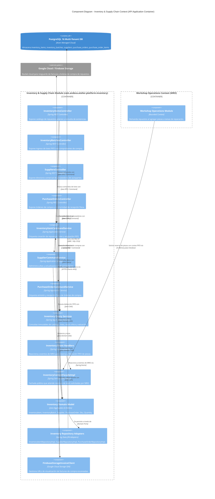
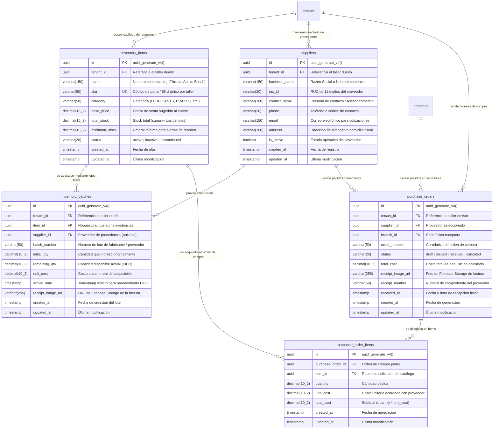

## 7. Fase 4: Bounded Context 4 — Inventory & Supply Chain Context (`com.andeva.atelier.platform.inventory`)

### 7.1. Diccionario y Propósito del Contexto

#### 7.1.1. Propósito y Límites de Responsabilidad
El **Inventory & Supply Chain Context** opera como el núcleo logístico y financiero de materiales de Atelier Platform. Su responsabilidad es doble: garantizar la disponibilidad continua de repuestos, fluidos y consumibles requeridos para el mantenimiento automotriz, y proteger la rentabilidad contable del taller mediante una estricta valuación del costo de ventas:
1. **Catálogo de Repuestos y Materiales (`InventoryItem`):** Centraliza el inventario físico de repuestos clasificados por categoría y codificados mediante su número de parte o código interno (`sku`). Cada ítem está aislado por taller (`TenantId`) y mantiene un precio de venta sugerido y un umbral de stock mínimo para reposición preventiva.
2. **Motor de Costeo FIFO Estricto por Lotes (`InventoryBatch`):** A diferencia de sistemas tradicionales que utilizan promedios ponderados erráticos, Atelier implementa el método **FIFO (First-In, First-Out / Primeras Entradas, Primeras Salidas)**. Cada lote de repuestos conserva su fecha y hora exacta de arribo (`arrival_date`), su costo unitario de adquisición (`unit_cost`) y su cantidad remanente (`remaining_qty`). Al demandarse repuestos desde el módulo de operaciones (MRO), el motor consume las unidades del lote más antiguo disponible, calculando con exactitud matemática el Costo de Mercadería Vendida (COGS / *Cost of Goods Sold*).
3. **Directorio de Proveedores Comerciales (`Supplier`):** Mantiene el padrón de proveedores de autopartes, lubricantes y herramientas, asociando su RUC formal (`tax_id`), datos de contacto y condiciones comerciales.
4. **Órdenes de Compra y Recepción Documental (`PurchaseOrder` y `PurchaseOrderItem`):** Administra el aprovisionamiento de stock desde la emisión del pedido hasta la recepción en la sede física (`branch_id`), vinculando el comprobante de pago emitido por el proveedor mediante una imagen escaneada o fotografiada (`receipt_image_url`).
5. **Trazabilidad Fotográfica de Facturas de Compra:** Permite al administrador o jefe de repuestos fotografiar la factura física de compra desde la aplicación móvil o web. La imagen se almacena en **Firebase Cloud Storage**, y su enlace directo queda indexado en el lote correspondiente (`receipt_image_url`), garantizando una auditoría contable visual instantánea frente a discrepancias de precios.

#### 7.1.2. Decisiones de Diseño e Integraciones Críticas
* **Resolución del Cuello de Botella de v1:** En la versión previa, el método de reserva tomaba los lotes según el orden arbitrario devuelto por el motor de persistencia en memoria, sin ordenar por fecha de recepción ni calcular el costo ponderado. En v2, el servicio de dominio `FifoAllocationEngine` ordena de forma inmutable los lotes con `arrival_date ASC` y genera un registro atómico `StockAllocation` con el desglose exacto de cada lote deducido.
* **Desacoplamiento con MRO mediante Eventos y Fachada (OHS):** El contexto MRO no accede a la tabla `inventory_batches`. Cuando una tarea en MRO demanda un repuesto, emite `ProductStockReservationRequestedEvent`. El módulo de inventario procesa este requerimiento a través de su fachada `InventoryContextFacade`, valida la existencia de stock, ejecuta la deducción FIFO y responde con éxito o error de desabastecimiento.
* **Auditoría Directa de Comprobantes de Compra:** Al recepcionar una orden de compra o crear un lote directo, la imagen del comprobante fiscal (Factura/Boleta de proveedor) se vincula directamente al lote, cerrando el círculo entre la compra física y el consumo en el foso mecánico.

---

### 7.2. 2.6.4.1. Domain Layer

#### 7.2.1. Aggregates & Aggregate Roots

##### 1. `InventoryItem` (Aggregate Root)
* **Paquete:** `com.andeva.atelier.platform.inventory.domain.model.aggregates`
* **Herencia:** Extiende `AbstractDomainAggregateRoot<InventoryItem>`
* **Propósito:** Representa un tipo de repuesto, líquido o consumible comercializado o utilizado en el taller. Es la raíz del agregado que custodia la suma virtual de existencias y sus lotes FIFO asociados.
* **Atributos:**
  * `id: InventoryItemId` — Identificador universal del repuesto (UUID).
  * `tenantId: TenantId` — Taller mecánico dueño del inventario.
  * `name: String` — Denominación comercial (ej. "Filtro de Aceite Bosch PH3614", "Aceite Sintético 5W-30 Mobil 1").
  * `sku: Sku` — Código interno o número de parte de fabricante (único por taller).
  * `category: ItemCategory` — Categoría técnica (`LUBRICANTS`, `BRAKES`, `SUSPENSION`, `ENGINE`, `ELECTRICAL`, `TIRES`, `FILTERS`).
  * `basePrice: Money` — Precio unitario de venta sugerido al cliente final.
  * `totalStock: Quantity` — Cantidad total de existencias disponibles (suma virtual de `remaining_qty` de todos los lotes activos).
  * `minimumStock: Quantity` — Umbral mínimo de existencias para disparo de alertas de reorden.
  * `status: InventoryItemStatus` — Estado del ítem (`ACTIVE`, `INACTIVE`, `DISCONTINUED`).
  * `batches: List<InventoryBatch>` — Colección interna de lotes físicos ordenados cronológicamente.
* **Invariantes y Reglas de Negocio:**
  * El `sku` debe ser único en el ámbito del `tenantId`.
  * El `totalStock` no puede ser negativo y siempre debe ser exactamente igual a la suma aritmética de los `remainingQuantity` de los lotes de la colección interna.
  * El `basePrice` debe ser superior a cero y no puede ser inferior al costo promedio de los lotes activos (regla de margen comercial mínimo).
* **Métodos:**
  * `+ static InventoryItem create(TenantId tenantId, String name, Sku sku, ItemCategory category, Money basePrice, Quantity minStock): InventoryItem`: Factoría de dominio en estado `ACTIVE` con `totalStock = 0`; registra `InventoryItemCreatedEvent`.
  * `+ InventoryBatch addBatch(SupplierId supplierId, String batchNumber, Quantity quantity, Money unitCost, Instant arrivalDate, ImageUrl receiptImageUrl): InventoryBatch`: Incorpora un nuevo lote de compras, suma la cantidad al `totalStock`, agrega el lote a la colección interna y registra `InventoryBatchAddedEvent`.
  * `+ StockAllocation allocateStockFifo(Quantity requestedQuantity): StockAllocation`:
    1. Valida que `totalStock >= requestedQuantity`; si no hay stock suficiente, lanza excepción de dominio `InsufficientStockException`.
    2. Filtra los lotes con `remainingQuantity > 0` y los ordena cronológicamente por `arrivalDate ASC`.
    3. Itera deduciendo unidades de cada lote hasta satisfacer completamente la cantidad solicitada.
    4. Calcula el Costo de Mercadería Vendida acumulado (`cogs = sum(qty * batch.unitCost)`).
    5. Actualiza `totalStock`.
    6. Si `totalStock <= minimumStock`, registra `LowStockThresholdReachedEvent`.
    7. Registra `StockAllocatedFifoEvent` y retorna el registro inmutable `StockAllocation`.
  * `+ void releaseStockAllocation(StockAllocation allocation): void`: Itera sobre las deducciones de la asignación y restituye las unidades a los lotes correspondientes, actualizando `totalStock` y registrando `StockReleasedEvent`.
  * `+ void updateDetails(String name, ItemCategory category, Money basePrice, Quantity minStock): void`: Actualiza metadatos y precio de venta sugerido.
  * `+ void deactivate(): void`: Marca el repuesto como inactivo.

##### 2. `Supplier` (Aggregate Root)
* **Paquete:** `com.andeva.atelier.platform.inventory.domain.model.aggregates`
* **Herencia:** Extiende `AbstractDomainAggregateRoot<Supplier>`
* **Propósito:** Modela al proveedor comercial de repuestos, lubricantes y consumibles del taller.
* **Atributos:**
  * `id: SupplierId` — Identificador único del proveedor (UUID).
  * `tenantId: TenantId` — Taller propietario del registro de proveedor.
  * `businessName: String` — Razón Social o nombre comercial formal.
  * `taxId: TaxId` — RUC de 11 dígitos de la empresa proveedora (validado formalmente).
  * `contactName: String` — Nombre de la persona o asesor de ventas de contacto.
  * `phone: PhoneNumber` — Teléfono de contacto.
  * `email: EmailAddress` — Correo electrónico para cotizaciones y órdenes de compra.
  * `address: String` — Dirección fiscal o almacén principal del proveedor.
  * `isActive: boolean` — Estado operativo del proveedor en el taller.
* **Invariantes y Reglas de Negocio:**
  * El `taxId` (RUC) es obligatorio y único dentro del mismo taller (`tenant_id, tax_id`).
  * `businessName` no puede ser vacío.
* **Métodos:**
  * `+ static Supplier register(TenantId tenantId, String businessName, TaxId taxId, String contactName, PhoneNumber phone, EmailAddress email, String address): Supplier`: Factoría de dominio; registra `SupplierRegisteredEvent`.
  * `+ void updateContactInfo(String contactName, PhoneNumber phone, EmailAddress email, String address): void`: Actualiza datos comerciales.
  * `+ void deactivate(): void`: Inhabilita al proveedor para futuras órdenes de compra.
  * `+ void activate(): void`: Restituye la vigencia del proveedor.

##### 3. `PurchaseOrder` (Aggregate Root)
* **Paquete:** `com.andeva.atelier.platform.inventory.domain.model.aggregates`
* **Herencia:** Extiende `AbstractDomainAggregateRoot<PurchaseOrder>`
* **Propósito:** Representa la orden formal de adquisición de repuestos emitida a un proveedor y su posterior recepción física con comprobante.
* **Atributos:**
  * `id: PurchaseOrderId` — Identificador universal de la orden de compra (UUID).
  * `tenantId: TenantId` — Taller emisor.
  * `supplierId: SupplierId` — Proveedor seleccionado.
  * `branchId: BranchId` — Sede física que recibirá la mercadería.
  * `orderNumber: String` — Correlativo interno de compra (ej. "OC-2026-0042").
  * `status: PurchaseOrderStatus` — Estado (`DRAFT`, `ISSUED`, `RECEIVED`, `CANCELED`).
  * `totalCost: Money` — Costo total de adquisición de la orden.
  * `receiptImageUrl: ImageUrl` — URL de la factura o boleta escaneada en Firebase Storage (nullable hasta recepción).
  * `receiptNumber: String` — Número del comprobante fiscal del proveedor (ej. "F001-004928", nullable hasta recepción).
  * `receivedAt: Instant` — Fecha y hora de recepción física y conformidad (nullable hasta recepción).
  * `items: List<PurchaseOrderItem>` — Colección de repuestos y cantidades compradas.
* **Invariantes y Reglas de Negocio:**
  * No se pueden modificar ítems si la orden se encuentra en estado `RECEIVED` o `CANCELED`.
  * Solo una orden en estado `ISSUED` puede ser recibida (`RECEIVED`).
  * Al transicionar a `RECEIVED`, el `receiptImageUrl` y `receiptNumber` son estrictamente obligatorios.
* **Métodos:**
  * `+ static PurchaseOrder create(TenantId tenantId, SupplierId supplierId, BranchId branchId, String orderNumber): PurchaseOrder`: Factoría en estado `DRAFT`; registra `PurchaseOrderCreatedEvent`.
  * `+ void addItem(InventoryItemId itemId, Quantity quantity, Money unitCost): void`: Incorpora un ítem a la orden y recalcula `totalCost`.
  * `+ void removeItem(PurchaseOrderItemId itemId): void`: Remueve un ítem y actualiza `totalCost`.
  * `+ void issue(): void`: Emite formalmente la orden hacia el proveedor pasando a estado `ISSUED`.
  * `+ void receive(ImageUrl receiptImageUrl, String receiptNumber, Instant receivedAt): void`:
    1. Valida comprobante y fecha.
    2. Transiciona a `RECEIVED`.
    3. Fija `receivedAt`.
    4. Dispara `PurchaseOrderReceivedEvent`, el cual desencadena la creación automática de los `InventoryBatch` en cada repuesto.
  * `+ void cancel(String reason): void`: Anula la orden de compra.

---

#### 7.2.2. Entities

##### 1. `InventoryBatch` (Entidad Dependiente de `InventoryItem`)
* **Paquete:** `com.andeva.atelier.platform.inventory.domain.model.entities`
* **Propósito:** Modela el lote físico específico ingresado al taller, portador del costo de adquisición histórico para el algoritmo FIFO.
* **Atributos:**
  * `id: InventoryBatchId` — Identificador único del lote (UUID).
  * `tenantId: TenantId` — Taller propietario.
  * `itemId: InventoryItemId` — Repuesto al que pertenece el lote.
  * `supplierId: SupplierId` — Proveedor de procedencia (nullable si es stock inicial).
  * `batchNumber: String` — Código de lote provisto por el fabricante o proveedor.
  * `initialQuantity: Quantity` — Cantidad original ingresada al almacén.
  * `remainingQuantity: Quantity` — Cantidad remanente disponible para consumo.
  * `unitCost: Money` — Costo unitario real de adquisición de este lote.
  * `arrivalDate: Instant` — Marca de tiempo exacta de recepción (clave del ordenamiento FIFO).
  * `receiptImageUrl: ImageUrl` — Enlace a la fotografía de la factura de compra en Firebase Storage.
* **Métodos:**
  * `+ boolean hasStock(): boolean`: Retorna `true` si `remainingQuantity.isGreaterThan(Quantity.ZERO)`.
  * `+ Quantity deduct(Quantity requestedQuantity): Quantity`: Deduce hasta el máximo de `remainingQuantity` disponible y retorna la cantidad efectivamente consumida de este lote.
  * `+ void restore(Quantity quantityToRestore): void`: Restituye existencias liberadas asegurando no superar `initialQuantity`.

##### 2. `PurchaseOrderItem` (Entidad Dependiente de `PurchaseOrder`)
* **Paquete:** `com.andeva.atelier.platform.inventory.domain.model.entities`
* **Propósito:** Línea de detalle de compra de un repuesto específico.
* **Atributos:**
  * `id: PurchaseOrderItemId` — Identificador del ítem (UUID).
  * `orderId: PurchaseOrderId` — Orden de compra padre.
  * `itemId: InventoryItemId` — Repuesto solicitado.
  * `quantity: Quantity` — Cantidad demandada.
  * `unitCost: Money` — Costo unitario pactado con el proveedor.
  * `totalCost: Money` — Subtotal calculado (`quantity * unitCost`).
* **Métodos:**
  * `+ void updateQuantity(Quantity newQuantity): void`: Modifica cantidad y recalcula `totalCost`.

---

#### 7.2.3. Value Objects

* **`InventoryItemId(UUID value)`:** Identificador tipado de repuesto.
* **`InventoryBatchId(UUID value)`:** Identificador tipado de lote.
* **`SupplierId(UUID value)`:** Identificador tipado de proveedor.
* **`PurchaseOrderId(UUID value)`:** Identificador tipado de orden de compra.
* **`PurchaseOrderItemId(UUID value)`:** Identificador tipado de ítem de orden de compra.
* **`Sku(String value)`:** Stock Keeping Unit. Normaliza eliminando espacios y convirtiendo a mayúsculas. Valida formato alfanumérico de 3 a 50 caracteres.
* **`Quantity(BigDecimal value)`:** Cantidad numérica no negativa con dos decimales de precisión. Métodos: `add()`, `subtract()`, `isGreaterThan()`, `isLessThanOrEqualTo()`.
* **`ItemCategory` (Enum):** `LUBRICANTS`, `BRAKES`, `SUSPENSION`, `ENGINE`, `ELECTRICAL`, `TIRES`, `FILTERS`, `BODYWORK`, `ACCESSORIES`.
* **`InventoryItemStatus` (Enum):** `ACTIVE`, `INACTIVE`, `DISCONTINUED`.
* **`PurchaseOrderStatus` (Enum):** `DRAFT`, `ISSUED`, `RECEIVED`, `CANCELED`.
* **`StockAllocation(UUID allocationId, Quantity allocatedQuantity, Money totalCostOfGoodsSold, List<BatchDeduction> deductions)`:** Registro inmutable que encapsula el resultado de una deducción FIFO completa, incluyendo el Costo de Ventas (COGS) ponderado.
* **`BatchDeduction(UUID batchId, Quantity quantityDeducted, Money unitCost)`:** Detalle de las unidades y costo extraídos de un lote específico.

---

#### 7.2.4. Domain Commands

* `CreateInventoryItemCommand(TenantId tenantId, String name, String sku, String category, BigDecimal basePrice, BigDecimal minStock, String currency)`
* `AddInventoryBatchCommand(InventoryItemId itemId, UUID supplierId, String batchNumber, BigDecimal quantity, BigDecimal unitCost, String currency, String receiptImageUrl)`
* `AllocateStockFifoCommand(InventoryItemId itemId, BigDecimal quantity)`
* `ReleaseStockAllocationCommand(InventoryItemId itemId, StockAllocation allocation)`
* `UpdateInventoryItemCommand(InventoryItemId itemId, String name, String category, BigDecimal basePrice, BigDecimal minStock, String currency)`
* `RegisterSupplierCommand(TenantId tenantId, String businessName, String taxId, String contactName, String phone, String email, String address)`
* `UpdateSupplierCommand(SupplierId supplierId, String contactName, String phone, String email, String address)`
* `CreatePurchaseOrderCommand(TenantId tenantId, SupplierId supplierId, BranchId branchId, String orderNumber)`
* `AddPurchaseOrderItemCommand(PurchaseOrderId orderId, InventoryItemId itemId, BigDecimal quantity, BigDecimal unitCost, String currency)`
* `IssuePurchaseOrderCommand(PurchaseOrderId orderId)`
* `ReceivePurchaseOrderCommand(PurchaseOrderId orderId, String receiptImageUrl, String receiptNumber, Instant receivedAt)`
* `CancelPurchaseOrderCommand(PurchaseOrderId orderId, String reason)`

---

#### 7.2.5. Domain Queries

* `GetInventoryItemByIdQuery(InventoryItemId itemId)`
* `GetInventoryItemsByTenantIdQuery(TenantId tenantId)`
* `GetInventoryBatchesByItemIdQuery(InventoryItemId itemId)`
* `GetLowStockItemsQuery(TenantId tenantId)`
* `GetInventoryValuationQuery(TenantId tenantId)`
* `GetSupplierByIdQuery(SupplierId supplierId)`
* `GetSuppliersByTenantIdQuery(TenantId tenantId)`
* `GetPurchaseOrderByIdQuery(PurchaseOrderId orderId)`
* `GetPurchaseOrdersByTenantIdQuery(TenantId tenantId)`

---

#### 7.2.6. Domain Events

* `InventoryItemCreatedEvent(InventoryItemId itemId, TenantId tenantId, Sku sku, String name, Instant occurredOn)`
* `InventoryBatchAddedEvent(InventoryBatchId batchId, InventoryItemId itemId, Quantity quantity, Money unitCost, Instant occurredOn)`
* `StockAllocatedFifoEvent(InventoryItemId itemId, Quantity allocatedQuantity, Money cogs, Instant occurredOn)`
* `StockReleasedEvent(InventoryItemId itemId, Quantity releasedQuantity, Instant occurredOn)`
* `LowStockThresholdReachedEvent(InventoryItemId itemId, TenantId tenantId, Quantity currentStock, Quantity minStock, Instant occurredOn)`
* `SupplierRegisteredEvent(SupplierId supplierId, TenantId tenantId, String businessName, TaxId taxId, Instant occurredOn)`
* `PurchaseOrderCreatedEvent(PurchaseOrderId orderId, TenantId tenantId, SupplierId supplierId, Instant occurredOn)`
* `PurchaseOrderReceivedEvent(PurchaseOrderId orderId, TenantId tenantId, SupplierId supplierId, Money totalCost, Instant occurredOn)`
* `PurchaseOrderCanceledEvent(PurchaseOrderId orderId, String reason, Instant occurredOn)`

---

#### 7.2.7. Repositories (Interfaces de Dominio)

* **`InventoryItemRepository`:**
  * `InventoryItem save(InventoryItem item)`
  * `Optional<InventoryItem> findById(InventoryItemId id)`
  * `Optional<InventoryItem> findByTenantIdAndSku(TenantId tenantId, Sku sku)`
  * `List<InventoryItem> findByTenantId(TenantId tenantId)`
  * `List<InventoryItem> findLowStockItems(TenantId tenantId)`
  * `boolean existsByTenantIdAndSku(TenantId tenantId, Sku sku)`
* **`InventoryBatchRepository`:**
  * `InventoryBatch save(InventoryBatch batch)`
  * `List<InventoryBatch> findByItemIdOrderByArrivalDateAsc(InventoryItemId itemId)`
  * `List<InventoryBatch> findActiveBatchesByItemId(InventoryItemId itemId)`
* **`SupplierRepository`:**
  * `Supplier save(Supplier supplier)`
  * `Optional<Supplier> findById(SupplierId id)`
  * `Optional<Supplier> findByTenantIdAndTaxId(TenantId tenantId, TaxId taxId)`
  * `List<Supplier> findByTenantId(TenantId tenantId)`
* **`PurchaseOrderRepository`:**
  * `PurchaseOrder save(PurchaseOrder order)`
  * `Optional<PurchaseOrder> findById(PurchaseOrderId id)`
  * `List<PurchaseOrder> findByTenantId(TenantId tenantId)`
  * `List<PurchaseOrder> findBySupplierId(SupplierId supplierId)`

---

### 7.3. 2.6.4.2. Interface Layer

#### 7.3.1. REST Controllers

##### 1. `InventoryItemsController`
* **Ruta Base:** `/api/v1/inventory/items`
* **Propósito:** Catálogo de repuestos, precios y consulta de existencias.
* **Endpoints:**
  * `POST`: Creación de nuevo repuesto en catálogo. Recibe `CreateInventoryItemResource`, retorna `InventoryItemResource` (HTTP 201 Created).
  * `GET`: Listado del catálogo de repuestos con stock disponible. Retorna `List<InventoryItemSummaryResource>` (HTTP 200 OK).
  * `GET /{id}`: Detalle del repuesto con desglose de sus lotes activos. Retorna `InventoryItemDetailResource` (HTTP 200 OK / 404 Not Found).
  * `PUT /{id}`: Actualización de precio, SKU y stock mínimo. Recibe `UpdateInventoryItemResource`, retorna `InventoryItemResource` (HTTP 200 OK).
  * `GET /low-stock`: Listado de repuestos en situación crítica por debajo del umbral mínimo. Retorna `List<InventoryItemSummaryResource>` (HTTP 200 OK).
  * `GET /valuation`: Cálculo de valuación total del inventario a costo FIFO. Retorna `InventoryValuationResource` (HTTP 200 OK).

##### 2. `InventoryBatchesController`
* **Ruta Base:** `/api/v1/inventory/items/{itemId}/batches`
* **Propósito:** Incorporación directa de lotes de repuestos con factura.
* **Endpoints:**
  * `POST`: Ingreso manual de lote con costo unitario y foto de factura. Recibe `AddInventoryBatchResource`, retorna `InventoryBatchResource` (HTTP 201 Created).
  * `GET`: Trazabilidad histórica de todos los lotes del repuesto. Retorna `List<InventoryBatchResource>` (HTTP 200 OK).

##### 3. `SuppliersController`
* **Ruta Base:** `/api/v1/inventory/suppliers`
* **Propósito:** Gestión del directorio comercial de proveedores.
* **Endpoints:**
  * `POST`: Registro de proveedor de repuestos. Recibe `CreateSupplierResource`, retorna `SupplierResource` (HTTP 201 Created).
  * `GET`: Directorio de proveedores del taller. Retorna `List<SupplierResource>` (HTTP 200 OK).
  * `GET /{id}`: Detalle de proveedor. Retorna `SupplierResource` (HTTP 200 OK).
  * `PUT /{id}`: Actualización de contacto y dirección. Recibe `UpdateSupplierResource`, retorna `SupplierResource` (HTTP 200 OK).

##### 4. `PurchaseOrdersController`
* **Ruta Base:** `/api/v1/inventory/purchase-orders`
* **Propósito:** Órdenes de compra y recepción de mercadería con comprobante.
* **Endpoints:**
  * `POST`: Creación de orden de compra en borrador. Recibe `CreatePurchaseOrderResource`, retorna `PurchaseOrderResource` (HTTP 201 Created).
  * `GET`: Listado de órdenes de compra del taller. Retorna `List<PurchaseOrderResource>` (HTTP 200 OK).
  * `POST /{id}/items`: Adición de repuestos a la orden de compra. Recibe `AddPurchaseOrderItemResource`, retorna `PurchaseOrderResource` (HTTP 201 Created).
  * `PUT /{id}/issue`: Emisión formal al proveedor. Retorna `PurchaseOrderResource` (HTTP 200 OK).
  * `PUT /{id}/receive`: Conformidad de recepción con subida de factura escaneada. Recibe `ReceivePurchaseOrderResource`, retorna `PurchaseOrderResource` (HTTP 200 OK).
  * `PUT /{id}/cancel`: Anulación de la orden. Recibe `CancelPurchaseOrderResource`, retorna `PurchaseOrderResource` (HTTP 200 OK).

---

#### 7.3.2. Resources / DTOs

* **Peticiones (Requests):**
  * `CreateInventoryItemResource(String name, String sku, String category, BigDecimal basePrice, BigDecimal minStock, String currency)`
  * `UpdateInventoryItemResource(String name, String category, BigDecimal basePrice, BigDecimal minStock, String currency)`
  * `AddInventoryBatchResource(UUID supplierId, String batchNumber, BigDecimal quantity, BigDecimal unitCost, String currency, String receiptImageUrl)`
  * `CreateSupplierResource(String businessName, String taxId, String contactName, String phone, String email, String address)`
  * `UpdateSupplierResource(String contactName, String phone, String email, String address)`
  * `CreatePurchaseOrderResource(UUID supplierId, UUID branchId, String orderNumber)`
  * `AddPurchaseOrderItemResource(UUID itemId, BigDecimal quantity, BigDecimal unitCost, String currency)`
  * `ReceivePurchaseOrderResource(String receiptImageUrl, String receiptNumber, Instant receivedAt)`
  * `CancelPurchaseOrderResource(String reason)`
* **Respuestas (Responses):**
  * `InventoryItemResource(UUID id, UUID tenantId, String name, String sku, String category, BigDecimal basePrice, BigDecimal totalStock, BigDecimal minimumStock, String status, String currency)`
  * `InventoryItemSummaryResource(UUID id, String name, String sku, String category, BigDecimal basePrice, BigDecimal totalStock, String currency)`
  * `InventoryItemDetailResource(UUID id, String name, String sku, String category, BigDecimal basePrice, BigDecimal totalStock, BigDecimal minimumStock, String currency, List<InventoryBatchResource> batches)`
  * `InventoryBatchResource(UUID id, UUID itemId, UUID supplierId, String supplierName, String batchNumber, BigDecimal initialQuantity, BigDecimal remainingQuantity, BigDecimal unitCost, String currency, Instant arrivalDate, String receiptImageUrl)`
  * `SupplierResource(UUID id, UUID tenantId, String businessName, String taxId, String contactName, String phone, String email, String address, boolean isActive)`
  * `PurchaseOrderResource(UUID id, UUID tenantId, UUID supplierId, String supplierName, UUID branchId, String orderNumber, String status, BigDecimal totalCost, String currency, String receiptImageUrl, String receiptNumber, Instant receivedAt, List<PurchaseOrderItemResource> items)`
  * `PurchaseOrderItemResource(UUID id, UUID itemId, String itemName, String sku, BigDecimal quantity, BigDecimal unitCost, BigDecimal totalCost, String currency)`
  * `InventoryValuationResource(UUID tenantId, BigDecimal totalValuation, int distinctItemsCount, Instant calculatedAt)`

---

#### 7.3.3. Resource Assemblers

* `InventoryItemResourceAssembler`: Mapea `InventoryItem` a `InventoryItemResource`, `InventoryItemSummaryResource` y `InventoryItemDetailResource`.
* `InventoryBatchResourceAssembler`: Mapea `InventoryBatch` a `InventoryBatchResource`.
* `SupplierResourceAssembler`: Mapea `Supplier` a `SupplierResource`.
* `PurchaseOrderResourceAssembler`: Mapea `PurchaseOrder` a `PurchaseOrderResource`.

---

#### 7.3.4. Open Host Service (OHS) / Inbound ACL Facade

Interfaz pública en `com.andeva.atelier.platform.inventory.interfaces.acl`:

```java
package com.andeva.atelier.platform.inventory.interfaces.acl;

import com.andeva.atelier.platform.shared.application.result.Result;
import java.math.BigDecimal;
import java.util.List;
import java.util.Optional;
import java.util.UUID;

public interface InventoryContextFacade {
    Result<StockAllocationAclDto, String> reserveStockForWorkOrder(UUID tenantId, UUID itemId, BigDecimal quantity);
    void releaseStockReservation(UUID tenantId, UUID itemId, List<BatchDeductionAclDto> deductions);
    Optional<InventoryItemSummaryAclDto> fetchItemSummary(UUID itemId);
    BigDecimal fetchItemCurrentStock(UUID itemId);
    BigDecimal calculateInventoryValuation(UUID tenantId);
}
```

*DTOs Exportados por la Fachada:*
* `StockAllocationAclDto(UUID allocationId, BigDecimal allocatedQuantity, BigDecimal totalCogs, List<BatchDeductionAclDto> deductions)`
* `BatchDeductionAclDto(UUID batchId, BigDecimal quantityDeducted, BigDecimal unitCost)`
* `InventoryItemSummaryAclDto(UUID id, UUID tenantId, String name, String sku, BigDecimal basePrice, BigDecimal totalStock)`

---

#### 7.3.5. Integration Events (Published Language)

* `StockReservedIntegrationEvent(UUID workOrderId, UUID itemId, BigDecimal quantity, BigDecimal cogsAmount, Instant occurredOn)`: Confirma la reserva exitosa y transmite el Costo de Ventas a contabilidad.
* `StockReservationFailedIntegrationEvent(UUID workOrderId, UUID itemId, BigDecimal requestedQuantity, String reason, Instant occurredOn)`: Alerta a MRO de que el repuesto no tiene existencias para detener la orden.
* `StockLowIntegrationEvent(UUID tenantId, UUID itemId, String sku, BigDecimal currentStock, BigDecimal minimumStock, Instant occurredOn)`: Dispara alertas en el panel de compras para reposición.
* `BatchReceivedIntegrationEvent(UUID batchId, UUID itemId, BigDecimal quantity, BigDecimal unitCost, Instant occurredOn)`: Registra el alta física de materiales en el sistema.

---

### 7.4. 2.6.4.3. Application Layer

#### 7.4.1. Command Services & Implementations

##### 1. `InventoryItemCommandService` & `InventoryItemCommandServiceImpl`
* `Result<InventoryItem, ApplicationError> handle(CreateInventoryItemCommand command)`:
  1. Valida que el `sku` no exista en el taller (`InventoryItemRepository.existsByTenantIdAndSku`).
  2. Instancia `InventoryItem` vía factoría estática `create`.
  3. Persiste el agregado y retorna `Result.success(item)`.
* `Result<InventoryBatch, ApplicationError> handle(AddInventoryBatchCommand command)`:
  1. Localiza el repuesto por ID (`InventoryItemRepository.findById`).
  2. Valida la existencia del proveedor si se proveyó `supplierId`.
  3. Ejecuta `item.addBatch(supplierId, batchNumber, quantity, unitCost, arrivalDate, receiptImageUrl)`.
  4. Persiste el agregado con su nuevo lote y actualiza el stock total.
* `Result<StockAllocation, ApplicationError> handle(AllocateStockFifoCommand command)`:
  1. Localiza el repuesto.
  2. Ejecuta `item.allocateStockFifo(requestedQuantity)`.
  3. Persiste las deducciones en los lotes.
  4. Retorna el objeto de resultado `StockAllocation` con el Costo de Ventas (COGS).
* `Result<Void, ApplicationError> handle(ReleaseStockAllocationCommand command)`: Restituye las unidades a los lotes y actualiza `totalStock`.
* `Result<InventoryItem, ApplicationError> handle(UpdateInventoryItemCommand command)`: Actualiza precio y parámetros de catálogo.

##### 2. `SupplierCommandService` & `SupplierCommandServiceImpl`
* `Result<Supplier, ApplicationError> handle(RegisterSupplierCommand command)`: Valida RUC de 11 dígitos, verifica unicidad por taller y persiste al proveedor.
* `Result<Supplier, ApplicationError> handle(UpdateSupplierCommand command)`: Modifica datos de contacto y dirección.

##### 3. `PurchaseOrderCommandService` & `PurchaseOrderCommandServiceImpl`
* `Result<PurchaseOrder, ApplicationError> handle(CreatePurchaseOrderCommand command)`: Instancia orden de compra en estado `DRAFT`.
* `Result<PurchaseOrder, ApplicationError> handle(AddPurchaseOrderItemCommand command)`: Agrega repuestos a comprar y recalcula el costo total.
* `Result<PurchaseOrder, ApplicationError> handle(IssuePurchaseOrderCommand command)`: Emite formalmente la orden al proveedor (`ISSUED`).
* `Result<PurchaseOrder, ApplicationError> handle(ReceivePurchaseOrderCommand command)`:
  1. Marca la orden como `RECEIVED`, registrando la foto de la factura y número de comprobante.
  2. Itera sobre cada ítem de la orden y ejecuta `inventoryItem.addBatch(...)` automáticamente, creando los lotes FIFO correspondientes.
  3. Persiste los repuestos actualizados y la orden de compra.

---

#### 7.4.2. Query Services & Implementations

* **`InventoryItemQueryService` & `InventoryItemQueryServiceImpl`:**
  * `Optional<InventoryItem> handle(GetInventoryItemByIdQuery query)`
  * `List<InventoryItem> handle(GetInventoryItemsByTenantIdQuery query)`
  * `List<InventoryItem> handle(GetLowStockItemsQuery query)`
  * `BigDecimal handle(GetInventoryValuationQuery query)`: Suma ponderada `sum(remainingQuantity * unitCost)` de todos los lotes activos del taller.
* **`SupplierQueryService` & `SupplierQueryServiceImpl`:**
  * `Optional<Supplier> handle(GetSupplierByIdQuery query)`
  * `List<Supplier> handle(GetSuppliersByTenantIdQuery query)`
* **`PurchaseOrderQueryService` & `PurchaseOrderQueryServiceImpl`:**
  * `Optional<PurchaseOrder> handle(GetPurchaseOrderByIdQuery query)`
  * `List<PurchaseOrder> handle(GetPurchaseOrdersByTenantIdQuery query)`

---

#### 7.4.3. Event Handlers & Listeners

* **`WorkOrderOperationsStockListener`:**
  * `@EventListener void on(ProductStockReservationRequestedEvent event)`: Escucha la solicitud de repuestos desde *Workshop Operations (MRO)*, localiza el `InventoryItem`, ejecuta la deducción FIFO y publica `StockReservedIntegrationEvent` o `StockReservationFailedIntegrationEvent`.
* **`WorkOrderOperationsStockCancelledListener`:**
  * `@EventListener void on(ProductStockReservationCancelledEvent event)`: Restituye el stock liberado a los lotes.

---

#### 7.4.4. Outbound ACL Services

* **`FirebaseReceiptImageStorageGateway`:** Valida la autenticidad y accesibilidad de las fotos de facturas y boletas almacenadas en Google Cloud Storage / Firebase Storage.

---

### 7.5. 2.6.4.4. Infrastructure Layer

#### 7.5.1. JPA Persistence Entities

Ubicadas en `com.andeva.atelier.platform.inventory.infrastructure.persistence.jpa.entities`:

##### 1. `InventoryItemPersistenceEntity` (Tabla `inventory_items`)
* Extiende `AuditableAbstractPersistenceEntity`.
* `@Column(name = "tenant_id", nullable = false)`: Taller dueño del inventario.
* `@Column(name = "name", nullable = false, length = 150)`: Nombre del repuesto.
* `@Column(name = "sku", nullable = false, length = 50)`: Stock Keeping Unit.
* `@Column(name = "category", length = 50)`: Categoría del repuesto.
* `@Column(name = "base_price", precision = 10, scale = 2, nullable = false)`: Precio de venta sugerido.
* `@Column(name = "total_stock", precision = 10, scale = 2, nullable = false)`: Stock total disponible.
* `@Column(name = "minimum_stock", precision = 10, scale = 2, nullable = false)`: Umbral mínimo.
* `@Column(name = "status", nullable = false, length = 20)`: `active`, `inactive`, `discontinued`.
* `@OneToMany(mappedBy = "item", cascade = CascadeType.ALL, orphanRemoval = true)`: Colección de `InventoryBatchPersistenceEntity`.

##### 2. `InventoryBatchPersistenceEntity` (Tabla `inventory_batches`)
* Extiende `AuditableAbstractPersistenceEntity`.
* `@Column(name = "tenant_id", nullable = false)`: Taller dueño.
* `@ManyToOne(fetch = FetchType.LAZY) @JoinColumn(name = "item_id", nullable = false)`: Repuesto padre.
* `@Column(name = "supplier_id")`: Proveedor de origen (nullable).
* `@Column(name = "batch_number", length = 50)`: Código de lote.
* `@Column(name = "initial_qty", precision = 10, scale = 2, nullable = false)`: Cantidad de ingreso original.
* `@Column(name = "remaining_qty", precision = 10, scale = 2, nullable = false)`: Cantidad disponible actual (FIFO).
* `@Column(name = "unit_cost", precision = 10, scale = 2, nullable = false)`: Costo exacto de adquisición.
* `@Column(name = "arrival_date", nullable = false)`: Timestamp de recepción (ordenamiento cronológico FIFO).
* `@Column(name = "receipt_image_url", length = 255)`: URL en Firebase Storage de la factura de compra.

##### 3. `SupplierPersistenceEntity` (Tabla `suppliers`)
* Extiende `AuditableAbstractPersistenceEntity`.
* `@Column(name = "tenant_id", nullable = false)`: Taller dueño del registro.
* `@Column(name = "business_name", nullable = false, length = 150)`: Razón social del proveedor.
* `@Column(name = "tax_id", length = 20)`: RUC de 11 dígitos.
* `@Column(name = "contact_name", length = 100)`: Persona de contacto.
* `@Column(name = "phone", length = 20)`: Teléfono.
* `@Column(name = "email", length = 150)`: Correo electrónico.
* `@Column(name = "address", length = 200)`: Dirección fiscal.
* `@Column(name = "is_active", nullable = false)`: Estado del proveedor.

##### 4. `PurchaseOrderPersistenceEntity` (Tabla `purchase_orders`)
* Extiende `AuditableAbstractPersistenceEntity`.
* `@Column(name = "tenant_id", nullable = false)`: Taller emisor.
* `@Column(name = "supplier_id", nullable = false)`: Proveedor adjudicado.
* `@Column(name = "branch_id", nullable = false)`: Sede receptora.
* `@Column(name = "order_number", nullable = false, length = 50)`: Correlativo de orden de compra.
* `@Column(name = "status", nullable = false, length = 20)`: `draft`, `issued`, `received`, `canceled`.
* `@Column(name = "total_cost", precision = 10, scale = 2, nullable = false)`: Monto total.
* `@Column(name = "receipt_image_url", length = 255)`: Foto de la factura de compra escaneada.
* `@Column(name = "receipt_number", length = 50)`: Número del comprobante fiscal del proveedor.
* `@Column(name = "received_at")`: Fecha y hora de recepción física.
* `@OneToMany(mappedBy = "order", cascade = CascadeType.ALL, orphanRemoval = true)`: Colección de `PurchaseOrderItemPersistenceEntity`.

##### 5. `PurchaseOrderItemPersistenceEntity` (Tabla `purchase_order_items`)
* Extiende `AuditableAbstractPersistenceEntity`.
* `@ManyToOne(fetch = FetchType.LAZY) @JoinColumn(name = "purchase_order_id", nullable = false)`: Orden de compra.
* `@Column(name = "item_id", nullable = false)`: Repuesto adquirido.
* `@Column(name = "quantity", precision = 10, scale = 2, nullable = false)`: Cantidad comprada.
* `@Column(name = "unit_cost", precision = 10, scale = 2, nullable = false)`: Costo unitario acordado.
* `@Column(name = "total_cost", precision = 10, scale = 2, nullable = false)`: Subtotal (`quantity * unit_cost`).

---

#### 7.5.2. JPA Persistence Repositories

* `InventoryItemPersistenceRepository extends JpaRepository<InventoryItemPersistenceEntity, UUID>`
* `InventoryBatchPersistenceRepository extends JpaRepository<InventoryBatchPersistenceEntity, UUID>`
* `SupplierPersistenceRepository extends JpaRepository<SupplierPersistenceEntity, UUID>`
* `PurchaseOrderPersistenceRepository extends JpaRepository<PurchaseOrderPersistenceEntity, UUID>`
* `PurchaseOrderItemPersistenceRepository extends JpaRepository<PurchaseOrderItemPersistenceEntity, UUID>`

---

#### 7.5.3. JPA Adapters (`*RepositoryImpl`)

* `InventoryItemRepositoryImpl implements InventoryItemRepository`
* `InventoryBatchRepositoryImpl implements InventoryBatchRepository`
* `SupplierRepositoryImpl implements SupplierRepository`
* `PurchaseOrderRepositoryImpl implements PurchaseOrderRepository`

---

#### 7.5.4. Persistence Assemblers

* `InventoryItemPersistenceAssembler`: Transforma `InventoryItem` <-> `InventoryItemPersistenceEntity` y sus lotes anidados.
* `SupplierPersistenceAssembler`: Transforma `Supplier` <-> `SupplierPersistenceEntity`.
* `PurchaseOrderPersistenceAssembler`: Transforma `PurchaseOrder` <-> `PurchaseOrderPersistenceEntity`.

---

#### 7.5.5. JPA Converters & Embeddables

* `SkuAttributeConverter`: Convierte `Sku` a `varchar(50)`.
* `QuantityAttributeConverter`: Convierte `Quantity` a `decimal(10,2)`.
* `PurchaseOrderStatusAttributeConverter`: Convierte `PurchaseOrderStatus` a `varchar(20)`.
* `ItemCategoryAttributeConverter`: Convierte `ItemCategory` a `varchar(50)`.

---

#### 7.5.6. Clientes y Pasarelas de Infraestructura Externa

##### 1. `FirebaseStorageInvoiceClient` (Google Cloud Storage)
* Paquete: `com.andeva.atelier.platform.inventory.infrastructure.external.firebase`
* Genera URLs seguras para inspección de facturas de compra y valida que las imágenes cargadas correspondan al formato PDF o imágenes JPG/PNG válidas.

---

### 7.6. 2.6.4.5. Bounded Context Software Architecture Component Level Diagram

El siguiente diagrama en modelo **C4 Component (Nivel 3)** ilustra la descomposición interna del contenedor Backend (`API Application`) para el **Inventory & Supply Chain Context**:



---

### 7.7. 2.6.4.6. Bounded Context Software Architecture Code Level Diagrams

#### 7.7.1. 2.6.4.6.1. Bounded Context Domain Layer Class Diagram

El siguiente diagrama UML de clases detalla las clases, entidades, registros inmutables y relaciones que conforman la capa de dominio de **Inventory & Supply Chain Context**:

```mermaid
classDiagram
    direction TB

    class AbstractDomainAggregateRoot~T~ {
        <<abstract>>
        #registerDomainEvent(event: Object) void
        +domainEvents() Collection~Object~
        +clearDomainEvents() void
    }

    class InventoryItem {
        -id: InventoryItemId
        -tenantId: TenantId
        -name: String
        -sku: Sku
        -category: ItemCategory
        -basePrice: Money
        -totalStock: Quantity
        -minimumStock: Quantity
        -status: InventoryItemStatus
        -batches: List~InventoryBatch~
        +create(tenantId: TenantId, name: String, sku: Sku, cat: ItemCategory, price: Money, minStock: Quantity)$ InventoryItem
        +addBatch(supplierId: SupplierId, batchNum: String, qty: Quantity, unitCost: Money, arrival: Instant, receipt: ImageUrl) InventoryBatch
        +allocateStockFifo(requestedQty: Quantity) StockAllocation
        +releaseStockAllocation(allocation: StockAllocation) void
        +updateDetails(name: String, cat: ItemCategory, price: Money, minStock: Quantity) void
        +deactivate() void
        +getId() InventoryItemId
        +getTotalStock() Quantity
        +getBasePrice() Money
        +getSku() Sku
    }

    class InventoryBatch {
        -id: InventoryBatchId
        -tenantId: TenantId
        -itemId: InventoryItemId
        -supplierId: SupplierId
        -batchNumber: String
        -initialQuantity: Quantity
        -remainingQuantity: Quantity
        -unitCost: Money
        -arrivalDate: Instant
        -receiptImageUrl: ImageUrl
        +hasStock() boolean
        +deduct(requestedQty: Quantity) Quantity
        +restore(qtyToRestore: Quantity) void
        +getId() InventoryBatchId
        +getRemainingQuantity() Quantity
        +getUnitCost() Money
        +getArrivalDate() Instant
    }

    class Supplier {
        -id: SupplierId
        -tenantId: TenantId
        -businessName: String
        -taxId: TaxId
        -contactName: String
        -phone: PhoneNumber
        -email: EmailAddress
        -address: String
        -isActive: boolean
        +register(tenantId: TenantId, name: String, taxId: TaxId, contact: String, phone: PhoneNumber, email: EmailAddress, address: String)$ Supplier
        +updateContactInfo(contact: String, phone: PhoneNumber, email: EmailAddress, address: String) void
        +deactivate() void
        +activate() void
        +getId() SupplierId
        +getBusinessName() String
        +getTaxId() TaxId
    }

    class PurchaseOrder {
        -id: PurchaseOrderId
        -tenantId: TenantId
        -supplierId: SupplierId
        -branchId: BranchId
        -orderNumber: String
        -status: PurchaseOrderStatus
        -totalCost: Money
        -receiptImageUrl: ImageUrl
        -receiptNumber: String
        -receivedAt: Instant
        -items: List~PurchaseOrderItem~
        +create(tenantId: TenantId, supplierId: SupplierId, branchId: BranchId, orderNum: String)$ PurchaseOrder
        +addItem(itemId: InventoryItemId, qty: Quantity, unitCost: Money) void
        +removeItem(itemId: PurchaseOrderItemId) void
        +issue() void
        +receive(receiptUrl: ImageUrl, receiptNum: String, receivedAt: Instant) void
        +cancel(reason: String) void
        +getId() PurchaseOrderId
        +getStatus() PurchaseOrderStatus
        +getTotalCost() Money
    }

    class PurchaseOrderItem {
        -id: PurchaseOrderItemId
        -orderId: PurchaseOrderId
        -itemId: InventoryItemId
        -quantity: Quantity
        -unitCost: Money
        -totalCost: Money
        +updateQuantity(newQty: Quantity) void
        +getId() PurchaseOrderItemId
        +getTotalCost() Money
        +getQuantity() Quantity
    }

    class StockAllocation {
        <<record>>
        +allocationId: UUID
        +allocatedQuantity: Quantity
        +totalCostOfGoodsSold: Money
        +deductions: List~BatchDeduction~
    }

    class BatchDeduction {
        <<record>>
        +batchId: UUID
        +quantityDeducted: Quantity
        +unitCost: Money
    }

    class InventoryItemId {
        <<record>>
        +value: UUID
    }

    class InventoryBatchId {
        <<record>>
        +value: UUID
    }

    class SupplierId {
        <<record>>
        +value: UUID
    }

    class PurchaseOrderId {
        <<record>>
        +value: UUID
    }

    class PurchaseOrderItemId {
        <<record>>
        +value: UUID
    }

    class Sku {
        <<record>>
        +value: String
    }

    class Quantity {
        <<record>>
        +value: BigDecimal
    }

    class ItemCategory {
        <<enumeration>>
        LUBRICANTS
        BRAKES
        SUSPENSION
        ENGINE
        ELECTRICAL
        TIRES
        FILTERS
        BODYWORK
        ACCESSORIES
    }

    class InventoryItemStatus {
        <<enumeration>>
        ACTIVE
        INACTIVE
        DISCONTINUED
    }

    class PurchaseOrderStatus {
        <<enumeration>>
        DRAFT
        ISSUED
        RECEIVED
        CANCELED
    }

    AbstractDomainAggregateRoot <|-- InventoryItem
    AbstractDomainAggregateRoot <|-- Supplier
    AbstractDomainAggregateRoot <|-- PurchaseOrder

    InventoryItem "1" *-- "0..*" InventoryBatch : compuesto por lotes FIFO
    InventoryItem o-- "1" Sku : código único
    InventoryItem o-- "1" ItemCategory : categoría
    InventoryItem o-- "1" InventoryItemStatus : estado
    InventoryItem o-- "1" Quantity : stock total

    InventoryBatch o-- "0..1" SupplierId : adquirido de
    InventoryBatch o-- "1" Quantity : remanente

    PurchaseOrder "1" *-- "1..*" PurchaseOrderItem : contiene líneas
    PurchaseOrder o-- "1" SupplierId : emitida a
    PurchaseOrder o-- "1" PurchaseOrderStatus : estado

    PurchaseOrderItem o-- "1" InventoryItemId : repuesto comprado
```



---

#### 7.7.2. 2.6.4.6.2. Bounded Context Database Diagram (ERD Relacional)

El siguiente diagrama relacional (**ERD**) especifica las 5 tablas físicas asignadas a **Inventory & Supply Chain Context** en PostgreSQL, sus tipos de datos, claves primarias (`PK`), claves foráneas (`FK`), restricciones de unicidad (`UK`) y relaciones de integridad:


---

