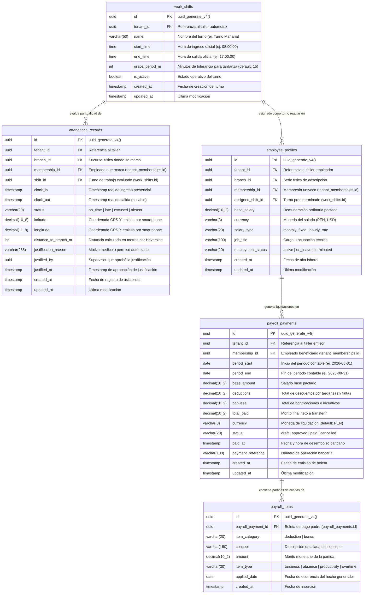

## 8. Fase 5: Bounded Context 5 — Human Resources Management (HR) Context (`com.andeva.atelier.platform.hr`)

### 8.1. Diccionario y Propósito del Contexto

#### 8.1.1. Propósito y Límites de Responsabilidad
El **Human Resources Management (HR) Context** administra los aspectos laborales, operativos y de compensación económica del talento humano del taller automotriz (mecánicos de patio, técnicos especialistas de foso, asesores de servicio y jefes de taller). Su delimitación responde a un principio arquitectónico esencial de desacoplamiento:
1. **Separación Persona/Usuario vs. Empleado Operativo:** El contexto de **IAM & Tenancy** gestiona a la persona como sujeto de autenticación y autorización (credenciales, contraseña hash, tokens JWT, membresía al taller y roles/permisos RBAC). En contraste, el contexto de **HR** modela a la persona como un trabajador operativo sujeto a jornadas laborales, turnos de trabajo, control de asistencia presencial, penalidades por tardanzas, horas trabajadas y liquidación periódica de nóminas/planillas salariales.
2. **Definición y Custodia de Turnos de Trabajo (`WorkShift`):** Centraliza la configuración de turnos operativos matutinos, vespertinos o jornadas completas por taller (`tenant_id`), especificando hora de entrada oficial (`start_time`), hora de salida oficial (`end_time`) y minutos de tolerancia (*grace period*) para la determinación de puntualidad.
3. **Control de Asistencia Georreferenciado (`AttendanceRecord`):** Permite a los mecánicos y empleados registrar su ingreso (*clock-in*) y salida (*clock-out*) directamente desde sus teléfonos inteligentes utilizando la aplicación móvil de Atelier (Kotlin/Flutter). Para garantizar la presencia física genuina en el patio de servicio y neutralizar marcaciones fraudulentas fuera del taller, el backend valida algorítmicamente las coordenadas satelitales del dispositivo contra la geocerca de la sucursal.
4. **Motor de Geocercas Haversine (*Haversine Geofencing Engine*):** Aísla la verificación trigonométrica y espacial de la marcación en microsegundos dentro de la memoria de la JVM. Utilizando la fórmula geodésica del semiverseno (*Haversine Formula*), el sistema compara la latitud y longitud reportadas por el hardware GPS móvil contra el centroide oficial de la sucursal física (`branches.latitude`, `branches.longitude`) y su radio de tolerancia (`branches.geofence_radius_m`, predeterminado en 50 metros). Si la distancia excede el radio permitido, el ingreso es rechazado de inmediato.
5. **Determinación Algorítmica de Estados de Asistencia:** Evalúa automáticamente si la marcación es puntual (`ON_TIME`), tardía (`LATE`) tras superar los minutos de tolerancia del turno, o inasistencia (`ABSENT`). Provee capacidades de justificación administrativa (`EXCUSED`) por parte del jefe de taller ante descansos médicos o permisos autorizados.
6. **Liquidación y Cálculo de Nóminas (`PayrollPayment`):** Modela el cálculo periódico de las remuneraciones del personal para un intervalo temporal dado (`period_start` a `period_end`). Consolida el salario base pactado, deduce automáticamente las penalizaciones económicas por tardanzas acumuladas o faltas injustificadas, suma bonificaciones por productividad o comisiones operativas, y genera la orden de pago en estado borrador (`DRAFT`) para su revisión, aprobación contable (`APPROVED`) y desembolso final (`PAID`).

#### 8.1.2. Decisiones de Diseño e Integraciones Críticas
* **Ejecución In-Memory de la Fórmula de Haversine:** En lugar de realizar invocaciones remotas a APIs externas de geolocalización (como Google Maps Distance Matrix API) en cada marcación —lo cual induciría latencias de red de 200 a 500 ms, generaría costos por consumo de cuota API y expondría al taller a fallos de conexión en horas punta matutinas—, Atelier resuelve el cálculo de distancia geodésica mediante un servicio de dominio puramente matemático (`HaversineGeofencingService`) en menos de un microsegundo.
* **Desacoplamiento con IAM & Tenancy mediante ACL:** HR no manipula las tablas `users` ni `tenant_memberships`. En su lugar, hace referencia al identificador unívoco de membresía (`membership_id`) y consulta la fachada de inbound `TenancyContextFacade` para obtener las coordenadas geográficas oficiales y el radio de geocerca de la sucursal (`BranchGeoCoordinatesDto`).
* **Desacoplamiento con MRO mediante Fachada Open Host Service (OHS):** El contexto de operaciones de taller (MRO) jamás debe consultar directamente la tabla `attendance_records` ni calcular tiempos laborales. Para verificar si un mecánico está físicamente disponible antes de asignarle una orden de trabajo o tarea urgente en foso, MRO consulta la interfaz `HumanResourcesContextFacade.isMechanicOnDuty(TenantMembershipId membershipId)`.

---

### 8.2. 2.6.5.1. Domain Layer

#### 8.2.1. Aggregates & Aggregate Roots

##### 1. `WorkShift` (Aggregate Root)
* **Paquete:** `com.andeva.atelier.platform.hr.domain.model.aggregates`
* **Herencia:** Extiende `AbstractDomainAggregateRoot<WorkShift>`
* **Propósito:** Representa un turno de trabajo laboral configurado para una empresa automotriz. Define los horarios oficiales de inicio y término, así como la tolerancia horaria para el ingreso del personal.
* **Atributos:**
  * `id: ShiftId` — Identificador universal del turno de trabajo (UUID).
  * `tenantId: TenantId` — Identificador del taller automotriz propietario del turno.
  * `name: String` — Denominación del turno (ej. "Turno Mañana Mecánicos", "Turno Integral Taller", "Guardia Nocturna").
  * `schedule: ShiftSchedule` — Objeto de valor que encapsula la hora de inicio (`startTime`) y la hora de fin (`endTime`), contemplando soporte para cruce de medianoche.
  * `gracePeriod: GracePeriod` — Objeto de valor que especifica los minutos de tolerancia permitidos antes de clasificar una marcación como tardanza (ej. 15 minutos).
  * `isActive: boolean` — Bandera de disponibilidad operativa del turno.
* **Invariantes y Reglas de Negocio:**
  * El nombre del turno no puede ser nulo ni estar en blanco, y su longitud máxima es de 50 caracteres.
  * La hora de inicio y la hora de fin no pueden ser idénticas.
  * El periodo de gracia no puede ser negativo y no debe exceder los 60 minutos.
* **Métodos:**
  * `+ static WorkShift create(TenantId tenantId, String name, LocalTime startTime, LocalTime endTime, int gracePeriodMinutes): WorkShift`: Factoría de dominio; valida invariantes, asigna estado activo y registra `WorkShiftCreatedEvent`.
  * `+ void updateSchedule(String name, LocalTime startTime, LocalTime endTime, int gracePeriodMinutes): void`: Modifica los parámetros horarios del turno y registra `WorkShiftUpdatedEvent`.
  * `+ void deactivate(): void`: Inhabilita el turno para futuras asignaciones a empleados.
  * `+ void activate(): void`: Restablece la vigencia del turno.
  * `+ boolean isLate(LocalTime clockInTime): boolean`: Evalúa si la hora de marcación supera el umbral límite permitido (`startTime + gracePeriod`).
  * `+ boolean isWithinWorkingHours(LocalTime time): boolean`: Evalúa si una hora específica cae dentro de la ventana de ejecución del turno.

##### 2. `AttendanceRecord` (Aggregate Root)
* **Paquete:** `com.andeva.atelier.platform.hr.domain.model.aggregates`
* **Herencia:** Extiende `AbstractDomainAggregateRoot<AttendanceRecord>`
* **Propósito:** Representa la evidencia de asistencia laboral de un empleado en una fecha y turno determinados. Custodia la marcación de ingreso, la marcación de egreso, la geolocalización satelital obtenida del smartphone y la distancia calculada contra la sucursal.
* **Atributos:**
  * `id: AttendanceId` — Identificador universal de la marcación (UUID).
  * `tenantId: TenantId` — Taller propietario de la operación.
  * `branchId: BranchId` — Sucursal física donde el empleado presta servicios.
  * `membershipId: TenantMembershipId` — Identificador del empleado/mecánico en el sistema.
  * `shiftId: ShiftId` — Turno de trabajo bajo el cual se evalúa la asistencia.
  * `clockIn: Instant` — Timestamp exacto de registro de ingreso presencial.
  * `clockOut: Instant` — Timestamp de registro de salida laboral (nullable hasta que el empleado finalice su jornada).
  * `status: AttendanceStatus` — Clasificación del estado de asistencia (`ON_TIME`, `LATE`, `EXCUSED`, `ABSENT`).
  * `checkInLocation: GeoCoordinates` — Coordenadas GPS satelitales (latitud, longitud) emitidas por el smartphone al momento del ingreso.
  * `distanceToBranch: HaversineDistance` — Distancia física en metros calculada matemáticamente entre el smartphone y la sucursal.
  * `justificationReason: String` — Descripción justificatoria aprobada por supervisión (nullable, requerida si el estado es `EXCUSED`).
  * `justifiedBy: TenantMembershipId` — Identificador del supervisor o administrador que aprobó la excepción (nullable).
  * `justifiedAt: Instant` — Momento cronológico de la justificación administrativa (nullable).
* **Invariantes y Reglas de Negocio:**
  * La hora de salida (`clockOut`) no puede ser cronológicamente anterior a la hora de entrada (`clockIn`).
  * Las coordenadas GPS deben encontrarse en rangos geográficos válidos (latitud entre -90 y 90, longitud entre -180 y 180).
  * La distancia calculada a la sucursal no puede exceder el radio geodésico autorizado de la sede física (`branchGeofenceRadiusMeters`); si se supera, la marcación es inválida y no se instancia el registro.
  * No puede existir más de un registro de asistencia abierto (sin `clockOut`) para el mismo empleado en el mismo día laboral.
* **Métodos:**
  * `+ static AttendanceRecord recordClockIn(TenantId tenantId, BranchId branchId, TenantMembershipId membershipId, ShiftId shiftId, WorkShift shift, GeoCoordinates employeeLocation, GeoCoordinates branchCentroid, double maxAllowedRadiusMeters, HaversineGeofencingService geofencingService): AttendanceRecord`:
    1. Invoca a `geofencingService.calculateDistance(employeeLocation, branchCentroid)` obteniendo `HaversineDistance`.
    2. Valida que `distance.meters() <= maxAllowedRadiusMeters`. Si se incumple, lanza `GeofenceViolationException`.
    3. Compara `clockIn` local contra `shift.startTime + shift.gracePeriod`. Si está dentro de la tolerancia, clasifica como `ON_TIME`; si la sobrepasa, clasifica como `LATE`.
    4. Registra `EmployeeClockedInEvent` y, si corresponde, `LateAttendanceRecordedEvent`.
  * `+ void recordClockOut(Instant clockOutTime): void`:
    1. Valida que `clockOut` no haya sido registrado previamente.
    2. Valida que `clockOutTime.isAfter(clockIn)`.
    3. Asigna el timestamp y registra `EmployeeClockedOutEvent`.
  * `+ void justify(String reason, TenantMembershipId supervisorMembershipId): void`:
    1. Valida que el estado actual sea `LATE` o `ABSENT`.
    2. Modifica el estado a `EXCUSED`, asigna la causal explicativa y el auditor responsable.
    3. Registra `AttendanceJustifiedEvent`.
  * `+ static AttendanceRecord recordAbsent(TenantId tenantId, BranchId branchId, TenantMembershipId membershipId, ShiftId shiftId, LocalDate date): AttendanceRecord`: Factoría administrativa para registrar formalmente una inasistencia no justificada.

##### 3. `PayrollPayment` (Aggregate Root)
* **Paquete:** `com.andeva.atelier.platform.hr.domain.model.aggregates`
* **Herencia:** Extiende `AbstractDomainAggregateRoot<PayrollPayment>`
* **Propósito:** Representa la liquidación salarial o boleta de pago emitida a un empleado para un intervalo temporal contable determinado. Orquesta las deducciones por incidencias y bonificaciones operativas.
* **Atributos:**
  * `id: PayrollPaymentId` — Identificador universal de la boleta de pago (UUID).
  * `tenantId: TenantId` — Taller emisor del pago.
  * `membershipId: TenantMembershipId` — Empleado beneficiario de la liquidación.
  * `period: PayPeriod` — Objeto de valor con fecha de inicio (`periodStart`) y fecha de fin (`periodEnd`).
  * `baseAmount: Money` — Salario base mensual o proporcional estipulado en el contrato laboral.
  * `deductions: Money` — Suma consolidada de descuentos monetarios aplicados (tardanzas, inasistencias, retenciones).
  * `bonuses: Money` — Suma consolidada de bonificaciones económicas asignadas (productividad de patio, horas extras).
  * `totalPaid: Money` — Importe neto a transferir al colaborador (`baseAmount - deductions + bonuses`).
  * `status: PayrollStatus` — Ciclo de vida de la boleta (`DRAFT`, `APPROVED`, `PAID`, `CANCELLED`).
  * `deductionItems: List<PayrollDeductionItem>` — Entidades hijas con el desglose pormenorizado de descuentos.
  * `bonusItems: List<PayrollBonusItem>` — Entidades hijas con el desglose pormenorizado de bonificaciones.
  * `paidAt: Instant` — Fecha y hora del desembolso financiero (nullable hasta concretar el pago).
  * `paymentReference: String` — Número de operación bancaria o comprobante de transferencia (nullable).
* **Invariantes y Reglas de Negocio:**
  * La fecha de inicio del periodo no puede ser posterior a la fecha de fin.
  * El importe neto (`totalPaid`) no puede ser negativo; si las deducciones superan el salario base más bonos, el total pagado se ajusta al límite mínimo reglamentario o genera deuda controlada.
  * No se pueden agregar deducciones ni bonificaciones una vez que la boleta se encuentra en estado `APPROVED` o `PAID`.
  * Únicamente las boletas en estado `APPROVED` pueden ser marcadas como pagadas (`PAID`).
* **Métodos:**
  * `+ static PayrollPayment calculate(TenantId tenantId, TenantMembershipId membershipId, PayPeriod period, Money baseAmount, List<PayrollDeductionItem> deductions, List<PayrollBonusItem> bonuses): PayrollPayment`: Factoría de dominio que crea la liquidación en estado `DRAFT`, calcula los totales netos y registra `PayrollCalculatedEvent`.
  * `+ void addDeduction(String concept, Money amount, DeductionType type, LocalDate date): void`: Agrega un ítem de descuento a la colección interna y recalcula `deductions` y `totalPaid`.
  * `+ void addBonus(String concept, Money amount, BonusType type, LocalDate date): void`: Agrega un ítem de bono a la colección interna y recalcula `bonuses` y `totalPaid`.
  * `+ void approve(): void`: Transiciona el estado a `APPROVED` tras auditoría del administrador; registra `PayrollApprovedEvent`.
  * `+ void markAsPaid(String paymentReference, Instant paymentTimestamp): void`: Transiciona el estado a `PAID`, registra el comprobante de pago bancario y emite `PayrollDisbursedEvent`.
  * `+ void cancel(String cancelReason): void`: Anula la liquidación devolviéndola al pool de periodos no liquidados.

##### 4. `EmployeeProfile` (Aggregate Root)
* **Paquete:** `com.andeva.atelier.platform.hr.domain.model.aggregates`
* **Herencia:** Extiende `AbstractDomainAggregateRoot<EmployeeProfile>`
* **Propósito:** Modela la ficha laboral y contractual del empleado dentro del contexto de Recursos Humanos, asociándolo a su sede de adscripción, turno asignado y esquema salarial.
* **Atributos:**
  * `id: EmployeeProfileId` — Identificador unívoco del perfil operativo (UUID).
  * `tenantId: TenantId` — Taller automotriz empleador.
  * `branchId: BranchId` — Sede física donde cumple sus funciones laborales.
  * `membershipId: TenantMembershipId` — Enlace unívoco con la identidad de membresía en IAM.
  * `assignedShiftId: ShiftId` — Turno regular predeterminado para el empleado.
  * `baseSalary: Money` — Remuneración ordinaria pactada.
  * `salaryType: SalaryType` — Tipo de esquema salarial (`MONTHLY_FIXED`, `HOURLY_RATE`).
  * `jobTitle: String` — Cargo u ocupación técnica (ej. "Mecánico Senior de Motor", "Electricista Automotriz", "Asesor de Servicio").
  * `employmentStatus: EmploymentStatus` — Situación contractual activa (`ACTIVE`, `ON_LEAVE`, `TERMINATED`).
* **Métodos:**
  * `+ static EmployeeProfile register(TenantId tenantId, BranchId branchId, TenantMembershipId membershipId, ShiftId shiftId, Money baseSalary, SalaryType salaryType, String jobTitle): EmployeeProfile`: Factoría que registra el perfil y emite `EmployeeProfileRegisteredEvent`.
  * `+ void assignShift(ShiftId newShiftId): void`: Actualiza el turno regular del colaborador.
  * `+ void updateSalary(Money newSalary, SalaryType salaryType): void`: Ajusta las condiciones de compensación económica.
  * `+ void changeBranch(BranchId newBranchId): void`: Transfiere al colaborador a otra sede del taller.
  * `+ void terminateEmployment(): void`: Da de baja operativa al empleado impidiendo futuras marcaciones.

---

#### 8.2.2. Entities (Child Entities)

##### 1. `PayrollDeductionItem` (Entity)
* **Paquete:** `com.andeva.atelier.platform.hr.domain.model.entities`
* **Propósito:** Representa una partida individual de descuento monetario aplicada dentro de una boleta de pago.
* **Atributos:**
  * `id: UUID` — Identificador del ítem de descuento.
  * `concept: String` — Descripción del motivo del descuento (ej. "Descuento por 3 tardanzas acumuladas (45 min)", "Inasistencia injustificada 14/08/2026").
  * `amount: Money` — Importe monetario deducido.
  * `deductionType: DeductionType` — Categoría (`TARDINESS`, `UNJUSTIFIED_ABSENCE`, `EQUIPMENT_DAMAGE`, `LOAN_REPAYMENT`, `OTHER`).
  * `appliedDate: LocalDate` — Fecha en que se originó la causal de la deducción.

##### 2. `PayrollBonusItem` (Entity)
* **Paquete:** `com.andeva.atelier.platform.hr.domain.model.entities`
* **Propósito:** Representa una partida individual de bonificación o incentivo económico sumado a una boleta de pago.
* **Atributos:**
  * `id: UUID` — Identificador del ítem de bonificación.
  * `concept: String` — Descripción del motivo de la bonificación (ej. "Bono de productividad: 25 órdenes cerradas", "Comisión por alineamiento y balanceo").
  * `amount: Money` — Importe monetario otorgado.
  * `bonusType: BonusType` — Categoría (`PRODUCTIVITY`, `OVERTIME_HOURS`, `SPECIAL_MERIT`, `HOLIDAY_ALLOWANCE`).
  * `awardedDate: LocalDate` — Fecha en que se concedió la bonificación.

---

#### 8.2.3. Value Objects

* **`ShiftId`:** Identificador universal inmutable de un turno (`record ShiftId(UUID value)`).
* **`AttendanceId`:** Identificador inmutable de un registro de marcación (`record AttendanceId(UUID value)`).
* **`PayrollPaymentId`:** Identificador inmutable de una boleta salarial (`record PayrollPaymentId(UUID value)`).
* **`EmployeeProfileId`:** Identificador del perfil laboral (`record EmployeeProfileId(UUID value)`).
* **`ShiftSchedule`:** Encapsula la ventana horaria del turno (`record ShiftSchedule(LocalTime startTime, LocalTime endTime, boolean spansOverMidnight)`). Contiene el método de dominio `boolean isWithinWindow(LocalTime checkTime)`.
* **`GracePeriod`:** Encapsula los minutos de tolerancia reglamentaria (`record GracePeriod(int minutes)`). Valida que `minutes >= 0 && minutes <= 60`.
* **`GeoCoordinates`:** Representa una coordenada geográfica satelital (`record GeoCoordinates(double latitude, double longitude)`). Valida que $-90.0 \le \text{latitude} \le 90.0$ y $-180.0 \le \text{longitude} \le 180.0$.
* **`HaversineDistance`:** Distancia métrica escalar calculada en el espacio geodésico terrestre (`record HaversineDistance(double meters)`). Provee métodos de conveniencia como `boolean isWithin(double thresholdMeters)` y `double toKilometers()`.
* **`PayPeriod`:** Intervalo temporal contable de nómina (`record PayPeriod(LocalDate startDate, LocalDate endDate)`). Valida que `!startDate.isAfter(endDate)` y calcula la cantidad de días laborales contenidos.
* **`AttendanceStatus`:** Enumeración del estado de asistencia (`ON_TIME`, `LATE`, `EXCUSED`, `ABSENT`).
* **`PayrollStatus`:** Enumeración del ciclo de vida de la nómina (`DRAFT`, `APPROVED`, `PAID`, `CANCELLED`).
* **`SalaryType`:** Esquema de remuneración del personal (`MONTHLY_FIXED`, `HOURLY_RATE`).
* **`EmploymentStatus`:** Situación contractual del trabajador (`ACTIVE`, `ON_LEAVE`, `TERMINATED`).
* **`DeductionType`:** Categoría analítica de descuentos (`TARDINESS`, `UNJUSTIFIED_ABSENCE`, `EQUIPMENT_DAMAGE`, `LOAN_REPAYMENT`, `OTHER`).
* **`BonusType`:** Categoría analítica de beneficios (`PRODUCTIVITY`, `OVERTIME_HOURS`, `SPECIAL_MERIT`, `HOLIDAY_ALLOWANCE`).

---

#### 8.2.4. Domain Commands

* **`CreateWorkShiftCommand`:** Parámetros para registrar un turno (`TenantId tenantId, String name, LocalTime startTime, LocalTime endTime, int gracePeriodMinutes`).
* **`UpdateWorkShiftCommand`:** Parámetros para modificar un turno (`ShiftId shiftId, String name, LocalTime startTime, LocalTime endTime, int gracePeriodMinutes`).
* **`RecordClockInCommand`:** Parámetros de marcación de ingreso móvil (`TenantId tenantId, BranchId branchId, TenantMembershipId membershipId, ShiftId shiftId, double latitude, double longitude`).
* **`RecordClockOutCommand`:** Parámetros de marcación de salida móvil (`AttendanceId attendanceId, TenantMembershipId membershipId, Instant clockOutTime`).
* **`JustifyAttendanceCommand`:** Parámetros para autorizar una excepción de asistencia (`AttendanceId attendanceId, String reason, TenantMembershipId supervisorMembershipId`).
* **`GeneratePayrollCommand`:** Parámetros para procesar la nómina de un periodo (`TenantId tenantId, TenantMembershipId membershipId, LocalDate periodStart, LocalDate periodEnd`).
* **`AddPayrollDeductionCommand`:** Incorpora un descuento a una planilla (`PayrollPaymentId payrollId, String concept, Money amount, DeductionType type, LocalDate date`).
* **`AddPayrollBonusCommand`:** Incorpora un bono a una planilla (`PayrollPaymentId payrollId, String concept, Money amount, BonusType type, LocalDate date`).
* **`ApprovePayrollCommand`:** Aprobación administrativa (`PayrollPaymentId payrollId, TenantMembershipId approverMembershipId`).
* **`DisbursePayrollPaymentCommand`:** Registro del desembolso bancario (`PayrollPaymentId payrollId, String paymentReference, Instant paidAt`).
* **`RegisterEmployeeProfileCommand`:** Ficha de contratación (`TenantId tenantId, BranchId branchId, TenantMembershipId membershipId, ShiftId shiftId, Money baseSalary, SalaryType salaryType, String jobTitle`).
* **`AssignShiftToEmployeeCommand`:** Reasignación de turno (`EmployeeProfileId profileId, ShiftId newShiftId`).

---

#### 8.2.5. Domain Queries

* **`GetWorkShiftByIdQuery`:** Consulta de un turno por su ID (`ShiftId shiftId`).
* **`ListWorkShiftsByTenantQuery`:** Catálogo de turnos vigentes del taller (`TenantId tenantId`).
* **`GetAttendanceRecordByIdQuery`:** Detalle de una marcación específica (`AttendanceId attendanceId`).
* **`ListAttendanceByBranchAndDateQuery`:** Cuadro de asistencias diario por sucursal (`BranchId branchId, LocalDate date`).
* **`GetEmployeeAttendanceHistoryQuery`:** Historial de marcaciones de un empleado en un rango temporal (`TenantMembershipId membershipId, LocalDate from, LocalDate to`).
* **`GetPayrollPaymentByIdQuery`:** Consulta de una boleta de pago (`PayrollPaymentId payrollPaymentId`).
* **`ListPayrollPaymentsByPeriodQuery`:** Reporte de nóminas del taller para un mes/periodo (`TenantId tenantId, LocalDate periodStart, LocalDate periodEnd`).
* **`GetEmployeeProfileByMembershipIdQuery`:** Consulta del perfil laboral de un usuario (`TenantMembershipId membershipId`).
* **`IsEmployeeOnDutyQuery`:** Verificación rápida de presencia física activa para asignación en MRO (`TenantMembershipId membershipId`).

---

#### 8.2.6. Domain Events

* **`WorkShiftCreatedEvent`:** Emitido al parametrizar un nuevo horario laboral (`ShiftId shiftId, TenantId tenantId, String name, LocalTime startTime, LocalTime endTime`).
* **`WorkShiftUpdatedEvent`:** Emitido al modificar horarios o minutos de gracia (`ShiftId shiftId, LocalTime startTime, LocalTime endTime, int gracePeriod`).
* **`EmployeeClockedInEvent`:** Emitido tras una marcación presencial válida en patio (`AttendanceId attendanceId, TenantMembershipId membershipId, BranchId branchId, AttendanceStatus status, double distanceMeters, Instant timestamp`).
* **`EmployeeClockedOutEvent`:** Emitido al concluir la jornada de trabajo (`AttendanceId attendanceId, TenantMembershipId membershipId, Instant clockOutTimestamp, long totalWorkedMinutes`).
* **`LateAttendanceRecordedEvent`:** Emitido cuando la marcación superó la tolerancia del turno (`AttendanceId attendanceId, TenantMembershipId membershipId, long minutesLate, Instant timestamp`).
* **`GeofenceViolationDetectedEvent`:** Emitido cuando se rechaza una marcación móvil que excede el radio de la sede física (`TenantMembershipId membershipId, BranchId branchId, double attemptedDistanceMeters, double maxAllowedMeters`).
* **`AttendanceJustifiedEvent`:** Emitido al regularizarse una tardanza o falta por orden médica o permiso (`AttendanceId attendanceId, TenantMembershipId justifiedBy, String reason`).
* **`PayrollCalculatedEvent`:** Emitido al generarse el cálculo proforma de la nómina (`PayrollPaymentId payrollId, TenantMembershipId membershipId, Money totalPaid, PayPeriod period`).
* **`PayrollApprovedEvent`:** Emitido al autorizarse el pago formal por gerencia (`PayrollPaymentId payrollId, TenantMembershipId approverMembershipId`).
* **`PayrollDisbursedEvent`:** Emitido al liquidarse la transferencia bancaria (`PayrollPaymentId payrollId, String paymentReference, Instant timestamp`).

---

#### 8.2.7. Domain Repositories (Interfaces)

```java
package com.andeva.atelier.platform.hr.domain.repositories;

public interface WorkShiftRepository {
    WorkShift save(WorkShift workShift);
    Optional<WorkShift> findById(ShiftId id);
    Optional<WorkShift> findByTenantIdAndName(TenantId tenantId, String name);
    List<WorkShift> findAllByTenantId(TenantId tenantId);
    boolean existsByTenantIdAndName(TenantId tenantId, String name);
}

public interface AttendanceRecordRepository {
    AttendanceRecord save(AttendanceRecord attendanceRecord);
    Optional<AttendanceRecord> findById(AttendanceId id);
    Optional<AttendanceRecord> findActiveByMembershipIdAndDate(TenantMembershipId membershipId, LocalDate date);
    List<AttendanceRecord> findAllByBranchIdAndDate(BranchId branchId, LocalDate date);
    List<AttendanceRecord> findAllByMembershipIdAndPeriod(TenantMembershipId membershipId, Instant start, Instant end);
    boolean hasActiveClockIn(TenantMembershipId membershipId, LocalDate date);
}

public interface PayrollPaymentRepository {
    PayrollPayment save(PayrollPayment payrollPayment);
    Optional<PayrollPayment> findById(PayrollPaymentId id);
    Optional<PayrollPayment> findByMembershipIdAndPeriod(TenantMembershipId membershipId, LocalDate startDate, LocalDate endDate);
    List<PayrollPayment> findAllByTenantIdAndPeriod(TenantId tenantId, LocalDate startDate, LocalDate endDate);
    List<PayrollPayment> findAllByMembershipId(TenantMembershipId membershipId);
}

public interface EmployeeProfileRepository {
    EmployeeProfile save(EmployeeProfile profile);
    Optional<EmployeeProfile> findById(EmployeeProfileId id);
    Optional<EmployeeProfile> findByMembershipId(TenantMembershipId membershipId);
    List<EmployeeProfile> findAllByBranchId(BranchId branchId);
    List<EmployeeProfile> findAllActiveByTenantId(TenantId tenantId);
}
```

---

#### 8.2.8. Domain Services

##### 1. `HaversineGeofencingService` (Servicio de Dominio Matemático)
* **Paquete:** `com.andeva.atelier.platform.hr.domain.services`
* **Propósito:** Calcula con rigor geodésico la distancia esférica en metros entre dos puntos geográficos (las coordenadas capturadas por el sensor GPS del teléfono y las coordenadas físicas de la sucursal del taller).
* **Fórmula Matemática:** Aplica la ley del semiverseno (*Haversine*), asumiendo un radio esférico medio de la Tierra $R = 6,371,000 \text{ metros}$:
  $$\Delta \phi = \text{radians}(\text{lat}_2 - \text{lat}_1), \quad \Delta \lambda = \text{radians}(\text{lon}_2 - \text{lon}_1)$$
  $$a = \sin^2\left(\frac{\Delta \phi}{2}\right) + \cos(\text{radians}(\text{lat}_1)) \cdot \cos(\text{radians}(\text{lat}_2)) \cdot \sin^2\left(\frac{\Delta \lambda}{2}\right)$$
  $$c = 2 \cdot \text{atan2}\left(\sqrt{a}, \sqrt{1 - a}\right)$$
  $$d = R \cdot c$$
* **Implementación de Dominio:**
```java
package com.andeva.atelier.platform.hr.domain.services;

import com.andeva.atelier.platform.hr.domain.model.valueobjects.GeoCoordinates;
import com.andeva.atelier.platform.hr.domain.model.valueobjects.HaversineDistance;
import org.springframework.stereotype.Service;

@Service
public class HaversineGeofencingService {
    private static final double EARTH_RADIUS_METERS = 6371000.0;

    public HaversineDistance calculateDistance(GeoCoordinates origin, GeoCoordinates destination) {
        double lat1Rad = Math.toRadians(origin.latitude());
        double lat2Rad = Math.toRadians(destination.latitude());
        double deltaLatRad = Math.toRadians(destination.latitude() - origin.latitude());
        double deltaLonRad = Math.toRadians(destination.longitude() - origin.longitude());

        double a = Math.sin(deltaLatRad / 2.0) * Math.sin(deltaLatRad / 2.0)
                + Math.cos(lat1Rad) * Math.cos(lat2Rad)
                * Math.sin(deltaLonRad / 2.0) * Math.sin(deltaLonRad / 2.0);

        double c = 2.0 * Math.atan2(Math.sqrt(a), Math.sqrt(1.0 - a));
        double distanceMeters = EARTH_RADIUS_METERS * c;

        return new HaversineDistance(Math.round(distanceMeters * 100.0) / 100.0);
    }

    public boolean isWithinGeofence(GeoCoordinates employeeLocation, GeoCoordinates branchCentroid, double allowedRadiusMeters) {
        HaversineDistance distance = calculateDistance(employeeLocation, branchCentroid);
        return distance.meters() <= allowedRadiusMeters;
    }
}
```

##### 2. `PayrollCalculationEngine` (Servicio de Dominio Financiero de Planillas)
* **Paquete:** `com.andeva.atelier.platform.hr.domain.services`
* **Propósito:** Consolida el historial de marcaciones del empleado durante el periodo contable, detecta faltas y tardanzas, calcula deducciones proporcionales de acuerdo con las políticas del taller automotriz y genera la estructura base para la boleta de pago.

---

### 8.3. 2.6.5.2. Interface Layer

#### 8.3.1. REST Controllers

##### 1. `WorkShiftsController`
* **Ruta Base:** `/api/v1/hr/shifts`
* **Responsabilidad:** Administrar la parametrización de turnos laborales por parte de administradores y jefes de recursos humanos.
* **Endpoints:**
  * `POST /`: Crea un nuevo turno de trabajo (`CreateWorkShiftCommand`). Responde `201 Created` con el recurso creado.
  * `PUT /{id}`: Modifica los horarios y tolerancia de un turno (`UpdateWorkShiftCommand`). Responde `200 OK`.
  * `GET /{id}`: Obtiene el detalle de un turno por su ID. Responde `200 OK`.
  * `GET /`: Lista todos los turnos disponibles para el taller autenticado (`tenant_id`). Responde `200 OK`.
  * `PATCH /{id}/deactivate`: Inhabilita un turno. Responde `204 No Content`.
  * `PATCH /{id}/activate`: Restaura la vigencia de un turno. Responde `204 No Content`.

##### 2. `AttendanceController`
* **Ruta Base:** `/api/v1/hr/attendance`
* **Responsabilidad:** Endpoint de alta concurrencia utilizado por los mecánicos desde la aplicación móvil para marcación presencial, así como por supervisores para justificaciones y auditoría diaria.
* **Endpoints:**
  * `POST /clock-in`: Registra el ingreso del colaborador validando coordenadas satelitales contra la geocerca de la sucursal. Responde `201 Created` con `AttendanceResource` o `422 Unprocessable Entity` si la geocerca es violada.
  * `POST /clock-out`: Registra el egreso y calcula el total de horas trabajadas. Responde `200 OK`.
  * `POST /{id}/justify`: Permite a un supervisor justificar administrativamente una tardanza o inasistencia. Responde `200 OK`.
  * `GET /branch/{branchId}/daily`: Lista el reporte de asistencias del día seleccionado para una sucursal física. Responde `200 OK`.
  * `GET /employee/{membershipId}/history`: Consulta el historial de asistencias de un empleado específico en un rango de fechas. Responde `200 OK`.
  * `GET /employee/{membershipId}/status-today`: Consulta el estado actual de marcación del día para un mecánico. Responde `200 OK`.

##### 3. `PayrollPaymentsController`
* **Ruta Base:** `/api/v1/hr/payrolls`
* **Responsabilidad:** Gestión de planillas salariales, adición de bonos, deducciones y autorización de desembolsos.
* **Endpoints:**
  * `POST /generate`: Genera la boleta de pago proforma para un colaborador en un periodo mensual/quincenal. Responde `201 Created`.
  * `POST /{id}/deductions`: Registra un descuento específico a la boleta proforma. Responde `200 OK`.
  * `POST /{id}/bonuses`: Registra un bono de productividad a la boleta proforma. Responde `200 OK`.
  * `POST /{id}/approve`: Aprueba la liquidación salarial. Responde `200 OK`.
  * `POST /{id}/disburse`: Marca la nómina como efectivamente pagada, asociando el comprobante bancario. Responde `200 OK`.
  * `GET /{id}`: Obtiene la boleta pormenorizada con su desglose de conceptos. Responde `200 OK`.
  * `GET /`: Lista las planillas emitidas en el taller filtradas por periodo contable. Responde `200 OK`.

##### 4. `StaffProfilesController`
* **Ruta Base:** `/api/v1/hr/employees`
* **Responsabilidad:** Alta y administración de las fichas laborales de mecánicos y personal del taller.
* **Endpoints:**
  * `POST /`: Registra el perfil operativo de un nuevo empleado asociado a su membresía en IAM. Responde `201 Created`.
  * `PUT /{id}/shift`: Reasigna el turno de trabajo de un empleado. Responde `200 OK`.
  * `PUT /{id}/salary`: Modifica el esquema salarial y monto base. Responde `200 OK`.
  * `GET /membership/{membershipId}`: Obtiene el perfil operativo a partir del identificador de usuario. Responde `200 OK`.
  * `GET /branch/{branchId}`: Lista los perfiles operativos adscritos a una sucursal. Responde `200 OK`.

---

#### 8.3.2. REST Resources & DTOs (Records)

```java
package com.andeva.atelier.platform.hr.interfaces.rest.resources;

public record WorkShiftResource(
    UUID id,
    String name,
    LocalTime startTime,
    LocalTime endTime,
    int gracePeriodMinutes,
    boolean isActive
) {}

public record CreateWorkShiftRequest(
    @NotBlank(message = "El nombre del turno es obligatorio") String name,
    @NotNull(message = "La hora de inicio es requerida") LocalTime startTime,
    @NotNull(message = "La hora de fin es requerida") LocalTime endTime,
    @Min(value = 0, message = "La tolerancia no puede ser negativa") int gracePeriodMinutes
) {}

public record ClockInRequest(
    @NotNull(message = "La sucursal es obligatoria") UUID branchId,
    @NotNull(message = "El turno es obligatorio") UUID shiftId,
    @NotNull(message = "La latitud es requerida") Double latitude,
    @NotNull(message = "La longitud es requerida") Double longitude
) {}

public record ClockOutRequest(
    @NotNull(message = "El ID de marcación es obligatorio") UUID attendanceId
) {}

public record JustifyAttendanceRequest(
    @NotBlank(message = "El motivo de justificación es requerido") String reason
) {}

public record AttendanceResource(
    UUID id,
    UUID branchId,
    UUID membershipId,
    UUID shiftId,
    Instant clockIn,
    Instant clockOut,
    String status,
    Double latitude,
    Double longitude,
    Double distanceToBranchMeters,
    String justificationReason,
    UUID justifiedBy,
    Instant justifiedAt
) {}

public record GeneratePayrollRequest(
    @NotNull(message = "El empleado es obligatorio") UUID membershipId,
    @NotNull(message = "La fecha inicial es requerida") LocalDate periodStart,
    @NotNull(message = "La fecha final es requerida") LocalDate periodEnd
) {}

public record AddPayrollDeductionRequest(
    @NotBlank String concept,
    @NotNull BigDecimal amount,
    @NotBlank String currency,
    @NotNull String deductionType,
    @NotNull LocalDate date
) {}

public record AddPayrollBonusRequest(
    @NotBlank String concept,
    @NotNull BigDecimal amount,
    @NotBlank String currency,
    @NotBlank String bonusType,
    @NotNull LocalDate date
) {}

public record DisbursePayrollRequest(
    @NotBlank(message = "La referencia bancaria es obligatoria") String paymentReference
) {}

public record PayrollPaymentResource(
    UUID id,
    UUID membershipId,
    LocalDate periodStart,
    LocalDate periodEnd,
    BigDecimal baseAmount,
    BigDecimal deductions,
    BigDecimal bonuses,
    BigDecimal totalPaid,
    String currency,
    String status,
    Instant paidAt,
    String paymentReference,
    List<PayrollItemResource> items
) {}

public record PayrollItemResource(
    UUID id,
    String category, // DEDUCTION o BONUS
    String concept,
    BigDecimal amount,
    String type,
    LocalDate date
) {}

public record RegisterEmployeeProfileRequest(
    @NotNull UUID branchId,
    @NotNull UUID membershipId,
    @NotNull UUID shiftId,
    @NotNull BigDecimal baseSalary,
    @NotBlank String currency,
    @NotBlank String salaryType,
    @NotBlank String jobTitle
) {}

public record EmployeeProfileResource(
    UUID id,
    UUID branchId,
    UUID membershipId,
    UUID assignedShiftId,
    BigDecimal baseSalary,
    String currency,
    String salaryType,
    String jobTitle,
    String employmentStatus
) {}
```

---

#### 8.3.3. REST Assemblers (Mappers)

* **`WorkShiftResourceAssembler`:** Transforma agregados `WorkShift` a DTOs `WorkShiftResource`.
* **`AttendanceResourceAssembler`:** Transforma agregados `AttendanceRecord` a `AttendanceResource`, mapeando distancias esféricas y estatus calculados.
* **`PayrollPaymentResourceAssembler`:** Transforma `PayrollPayment` y sus partidas hijas (`deductionItems`, `bonusItems`) a `PayrollPaymentResource`.
* **`EmployeeProfileResourceAssembler`:** Transforma la ficha `EmployeeProfile` a `EmployeeProfileResource`.

---

#### 8.3.4. Inbound ACL Facade (Open Host Service - OHS)

Para mantener desacoplado el contexto de Recursos Humanos del contexto de Operaciones de Taller (MRO) e IAM, HR publica una fachada OHS canónica:

```java
package com.andeva.atelier.platform.hr.interfaces.acl;

import java.time.LocalDate;
import java.util.Optional;
import java.util.UUID;

public interface HumanResourcesContextFacade {
    /**
     * Utilizado por Workshop Operations (MRO) antes de asignar una orden de trabajo urgente.
     * Verifica si el mecánico marcó ingreso presencial hoy y no ha registrado salida.
     */
    boolean isMechanicOnDuty(UUID membershipId);

    /**
     * Retorna la sucursal donde el mecánico se encuentra prestando servicios hoy en patio.
     */
    Optional<UUID> getMechanicActiveBranchId(UUID membershipId);

    /**
     * Obtiene el perfil operativo del mecánico incluyendo su cargo y turno asignado.
     */
    Optional<MechanicDutyProfileDto> getMechanicProfile(UUID membershipId);

    /**
     * Obtiene el resumen de asistencia diaria del empleado.
     */
    Optional<AttendanceSummaryDto> getDailyAttendanceSummary(UUID membershipId, LocalDate date);
}

public record MechanicDutyProfileDto(
    UUID membershipId,
    UUID branchId,
    String jobTitle,
    UUID shiftId,
    String shiftName,
    boolean isOnDuty
) {}

public record AttendanceSummaryDto(
    UUID attendanceId,
    String status,
    boolean isLate,
    long minutesLate
) {}
```

---

#### 8.3.5. Integration Events (Published / Consumed)

##### 1. Eventos Publicados por HR hacia otros Bounded Contexts
* **`MechanicCheckedInIntegrationEvent`:** Publicado cuando un mecánico marca ingreso válido en patio. Consumido por MRO para actualizar el tablero de disponibilidad en patio.
* **`MechanicClockedOutIntegrationEvent`:** Publicado cuando un mecánico culmina su jornada laboral. Consumido por MRO para alertar si existen tareas inconclusas en su foso asignado.
* **`PayrollDisbursedIntegrationEvent`:** Publicado cuando se ejecuta formalmente el pago de la nómina. Consumido por el contexto contable para asentar la salida de caja/banco.

##### 2. Eventos Consumidos por HR desde otros Bounded Contexts
* **`TenantMemberCreatedIntegrationEvent` (emitido por IAM & Tenancy Context):** Permite a HR aprovisionar de forma automática o disparar un recordatorio al administrador para completar la ficha laboral (`EmployeeProfile`) del nuevo integrante del equipo.

---

### 8.4. 2.6.5.3. Application Layer

#### 8.4.1. Command Services (Handlers)

##### 1. `WorkShiftCommandServiceImpl`
* **Responsabilidad:** Orquestar la creación y modificación de turnos de trabajo, validando unicidad de nombres dentro del mismo `tenant_id`.

##### 2. `AttendanceCommandServiceImpl`
* **Responsabilidad:** Orquestar la marcación presencial de asistencia aplicando la siguiente secuencia transaccional:
  1. Extrae el `membershipId` del contexto de seguridad JWT autenticado.
  2. Invoca al servicio outbound ACL `TenancyAclService` para recuperar las coordenadas físicas centroidales y el radio de geocerca de la sucursal indicada (`branchId`).
  3. Recupera el turno de trabajo correspondiente (`shiftId`).
  4. Verifica que el empleado no cuente con una marcación abierta para el día en curso.
  5. Invoca a la factoría de dominio `AttendanceRecord.recordClockIn(...)`, la cual delega en `HaversineGeofencingService` el cálculo trigonométrico. Si la distancia excede la tolerancia permitida, lanza `GeofenceViolationException` y rechaza la solicitud.
  6. Persiste el registro atómico de asistencia en la base de datos PostgreSQL.
  7. Publica el evento de dominio `EmployeeClockedInEvent` y, si la distancia fue sospechosamente cercana al borde, registra trazas de telemetría operativa.

##### 3. `PayrollPaymentCommandServiceImpl`
* **Responsabilidad:** Orquestar la liquidación salarial periódica:
  1. Recupera el perfil laboral del empleado (`EmployeeProfile`) para obtener su salario base pactado.
  2. Consulta a través de `AttendanceRecordRepository` todas las marcaciones comprendidas en el intervalo `[periodStart, periodEnd]`.
  3. Evalúa penalidades: por cada registro clasificado como `LATE` sin justificación, calcula la deducción monetaria correspondiente; por cada día laboral con inasistencia no justificada (`ABSENT`), deduce el importe equivalente diario ($baseSalary / 30$).
  4. Crea el agregado `PayrollPayment` en estado `DRAFT`.
  5. Provee métodos para agregar bonos/descuentos extraordinarios y transicionar a `APPROVED` y `PAID`.

##### 4. `EmployeeProfileCommandServiceImpl`
* **Responsabilidad:** Administrar la creación de fichas de contratación, reasignación de turnos y actualizaciones salariales.

---

#### 8.4.2. Query Services (Handlers)

* **`WorkShiftQueryServiceImpl`:** Resuelve consultas de catálogo de turnos con almacenamiento en caché local (`Caffeine Cache`) para mitigar consultas repetitivas de lectura.
* **`AttendanceQueryServiceImpl`:** Resuelve reportes diarios de puntualidad por sucursal e historial de asistencias de mecánicos.
* **`PayrollPaymentQueryServiceImpl`:** Resuelve reportes contables de planillas emitidas y boletas individuales de empleados.
* **`EmployeeProfileQueryServiceImpl`:** Consulta perfiles laborales y disponibilidad física activa para el consumo de fachadas internas.

---

#### 8.4.3. Domain Event Handlers

* **`AttendanceDomainEventHandler`:**
  * Al recibir `LateAttendanceRecordedEvent`: Registra la incidencia en el perfil del empleado y actualiza el contador acumulativo de tardanzas del mes para el cálculo automático de nómina.
  * Al recibir `GeofenceViolationDetectedEvent`: Registra un evento de seguridad de auditoría indicando intento de marcación fraudulenta fuera del radio de la sede.
* **`PayrollDomainEventHandler`:**
  * Al recibir `PayrollApprovedEvent`: Notifica por correo electrónico transaccional al colaborador a través de `ResendEmailAdapter` adjuntando la boleta en PDF proforma.
  * Al recibir `PayrollDisbursedEvent`: Emite `PayrollDisbursedIntegrationEvent` para la conciliación contable.

---

#### 8.4.4. Outbound ACL Services & Remote Adapters

##### `TenancyAclService`
* **Paquete:** `com.andeva.atelier.platform.hr.application.internal.outboundservices.acl`
* **Propósito:** Conectar de forma desacoplada con el contexto de IAM & Tenancy para obtener los metadatos geográficos y límites espaciales de la sucursal física.
```java
package com.andeva.atelier.platform.hr.application.internal.outboundservices.acl;

import com.andeva.atelier.platform.hr.domain.model.valueobjects.GeoCoordinates;
import com.andeva.atelier.platform.iam.interfaces.acl.TenancyContextFacade;
import com.andeva.atelier.platform.shared.domain.model.valueobjects.BranchId;
import org.springframework.stereotype.Service;

@Service
public class TenancyAclService {
    private final TenancyContextFacade tenancyContextFacade;

    public TenancyAclService(TenancyContextFacade tenancyContextFacade) {
        this.tenancyContextFacade = tenancyContextFacade;
    }

    public BranchGeofenceDto getBranchGeofenceData(BranchId branchId) {
        var branchDto = tenancyContextFacade.findBranchById(branchId.value())
                .orElseThrow(() -> new IllegalArgumentException("Sucursal no encontrada: " + branchId.value()));

        return new BranchGeofenceDto(
                new GeoCoordinates(branchDto.latitude(), branchDto.longitude()),
                branchDto.geofenceRadiusMeters() > 0 ? branchDto.geofenceRadiusMeters() : 50.0
        );
    }
}

public record BranchGeofenceDto(
    GeoCoordinates centroid,
    double radiusMeters
) {}
```

---

### 8.5. 2.6.5.4. Infrastructure Layer

#### 8.5.1. JPA Entities

##### 1. `WorkShiftJpaEntity`
* **Tabla Relacional:** `work_shifts`
* **Mapeo:**
```java
package com.andeva.atelier.platform.hr.infrastructure.persistence.jpa.entities;

import com.andeva.atelier.platform.shared.infrastructure.persistence.jpa.entities.AuditableAbstractPersistenceEntity;
import jakarta.persistence.*;
import java.time.LocalTime;
import java.util.UUID;

@Entity
@Table(name = "work_shifts", uniqueConstraints = {
    @UniqueConstraint(name = "uk_work_shifts_tenant_name", columnNames = {"tenant_id", "name"})
})
public class WorkShiftJpaEntity extends AuditableAbstractPersistenceEntity {
    @Id
    @Column(name = "id", nullable = false, updatable = false)
    private UUID id;

    @Column(name = "tenant_id", nullable = false, updatable = false)
    private UUID tenantId;

    @Column(name = "name", nullable = false, length = 50)
    private String name;

    @Column(name = "start_time", nullable = false)
    private LocalTime startTime;

    @Column(name = "end_time", nullable = false)
    private LocalTime endTime;

    @Column(name = "grace_period_m", nullable = false)
    private int gracePeriodMinutes;

    @Column(name = "is_active", nullable = false)
    private boolean isActive = true;

    // Getters y Setters JPA
}
```

##### 2. `AttendanceRecordJpaEntity`
* **Tabla Relacional:** `attendance_records`
* **Mapeo:**
```java
package com.andeva.atelier.platform.hr.infrastructure.persistence.jpa.entities;

import com.andeva.atelier.platform.shared.infrastructure.persistence.jpa.entities.AuditableAbstractPersistenceEntity;
import jakarta.persistence.*;
import java.math.BigDecimal;
import java.time.Instant;
import java.util.UUID;

@Entity
@Table(name = "attendance_records", indexes = {
    @Index(name = "idx_attendance_membership_date", columnList = "membership_id, clock_in"),
    @Index(name = "idx_attendance_branch_date", columnList = "branch_id, clock_in")
})
public class AttendanceRecordJpaEntity extends AuditableAbstractPersistenceEntity {
    @Id
    @Column(name = "id", nullable = false, updatable = false)
    private UUID id;

    @Column(name = "tenant_id", nullable = false, updatable = false)
    private UUID tenantId;

    @Column(name = "branch_id", nullable = false, updatable = false)
    private UUID branchId;

    @Column(name = "membership_id", nullable = false, updatable = false)
    private UUID membershipId;

    @Column(name = "shift_id", nullable = false)
    private UUID shiftId;

    @Column(name = "clock_in", nullable = false)
    private Instant clockIn;

    @Column(name = "clock_out")
    private Instant clockOut;

    @Column(name = "status", nullable = false, length = 20)
    private String status;

    @Column(name = "latitude", nullable = false, precision = 10, scale = 8)
    private BigDecimal latitude;

    @Column(name = "longitude", nullable = false, precision = 11, scale = 8)
    private BigDecimal longitude;

    @Column(name = "distance_to_branch_m", nullable = false)
    private int distanceToBranchMeters;

    @Column(name = "justification_reason", length = 255)
    private String justificationReason;

    @Column(name = "justified_by")
    private UUID justifiedBy;

    @Column(name = "justified_at")
    private Instant justifiedAt;

    // Getters y Setters JPA
}
```

##### 3. `PayrollPaymentJpaEntity`
* **Tabla Relacional:** `payroll_payments`
* **Mapeo:**
```java
package com.andeva.atelier.platform.hr.infrastructure.persistence.jpa.entities;

import com.andeva.atelier.platform.shared.infrastructure.persistence.jpa.entities.AuditableAbstractPersistenceEntity;
import jakarta.persistence.*;
import java.math.BigDecimal;
import java.time.Instant;
import java.time.LocalDate;
import java.util.ArrayList;
import java.util.List;
import java.util.UUID;

@Entity
@Table(name = "payroll_payments", indexes = {
    @Index(name = "idx_payroll_tenant_period", columnList = "tenant_id, period_start, period_end"),
    @Index(name = "idx_payroll_membership", columnList = "membership_id")
})
public class PayrollPaymentJpaEntity extends AuditableAbstractPersistenceEntity {
    @Id
    @Column(name = "id", nullable = false, updatable = false)
    private UUID id;

    @Column(name = "tenant_id", nullable = false, updatable = false)
    private UUID tenantId;

    @Column(name = "membership_id", nullable = false, updatable = false)
    private UUID membershipId;

    @Column(name = "period_start", nullable = false)
    private LocalDate periodStart;

    @Column(name = "period_end", nullable = false)
    private LocalDate periodEnd;

    @Column(name = "base_amount", nullable = false, precision = 10, scale = 2)
    private BigDecimal baseAmount;

    @Column(name = "deductions", nullable = false, precision = 10, scale = 2)
    private BigDecimal deductions;

    @Column(name = "bonuses", nullable = false, precision = 10, scale = 2)
    private BigDecimal bonuses;

    @Column(name = "total_paid", nullable = false, precision = 10, scale = 2)
    private BigDecimal totalPaid;

    @Column(name = "currency", nullable = false, length = 3)
    private String currency = "PEN";

    @Column(name = "status", nullable = false, length = 20)
    private String status;

    @Column(name = "paid_at")
    private Instant paidAt;

    @Column(name = "payment_reference", length = 100)
    private String paymentReference;

    @OneToMany(mappedBy = "payrollPayment", cascade = CascadeType.ALL, orphanRemoval = true, fetch = FetchType.LAZY)
    private List<PayrollItemJpaEntity> items = new ArrayList<>();

    // Getters y Setters JPA
}
```

##### 4. `EmployeeProfileJpaEntity`
* **Tabla Relacional:** `employee_profiles`
* **Mapeo:**
```java
package com.andeva.atelier.platform.hr.infrastructure.persistence.jpa.entities;

import com.andeva.atelier.platform.shared.infrastructure.persistence.jpa.entities.AuditableAbstractPersistenceEntity;
import jakarta.persistence.*;
import java.math.BigDecimal;
import java.util.UUID;

@Entity
@Table(name = "employee_profiles", uniqueConstraints = {
    @UniqueConstraint(name = "uk_employee_profiles_membership", columnNames = {"membership_id"})
})
public class EmployeeProfileJpaEntity extends AuditableAbstractPersistenceEntity {
    @Id
    @Column(name = "id", nullable = false, updatable = false)
    private UUID id;

    @Column(name = "tenant_id", nullable = false, updatable = false)
    private UUID tenantId;

    @Column(name = "branch_id", nullable = false)
    private UUID branchId;

    @Column(name = "membership_id", nullable = false, updatable = false)
    private UUID membershipId;

    @Column(name = "assigned_shift_id", nullable = false)
    private UUID assignedShiftId;

    @Column(name = "base_salary", nullable = false, precision = 10, scale = 2)
    private BigDecimal baseSalary;

    @Column(name = "currency", nullable = false, length = 3)
    private String currency = "PEN";

    @Column(name = "salary_type", nullable = false, length = 20)
    private String salaryType;

    @Column(name = "job_title", nullable = false, length = 100)
    private String jobTitle;

    @Column(name = "employment_status", nullable = false, length = 20)
    private String employmentStatus;

    // Getters y Setters JPA
}
```

---

#### 8.5.2. Spring Data JPA Repositories

```java
package com.andeva.atelier.platform.hr.infrastructure.persistence.jpa.repositories;

public interface SpringDataWorkShiftRepository extends JpaRepository<WorkShiftJpaEntity, UUID> {
    Optional<WorkShiftJpaEntity> findByTenantIdAndName(UUID tenantId, String name);
    List<WorkShiftJpaEntity> findAllByTenantId(UUID tenantId);
    boolean existsByTenantIdAndName(UUID tenantId, String name);
}

public interface SpringDataAttendanceRecordRepository extends JpaRepository<AttendanceRecordJpaEntity, UUID> {
    @Query("SELECT a FROM AttendanceRecordJpaEntity a WHERE a.membershipId = :membershipId AND a.clockIn >= :dayStart AND a.clockIn < :dayEnd AND a.clockOut IS NULL")
    Optional<AttendanceRecordJpaEntity> findActiveClockIn(@Param("membershipId") UUID membershipId, @Param("dayStart") Instant dayStart, @Param("dayEnd") Instant dayEnd);

    @Query("SELECT a FROM AttendanceRecordJpaEntity a WHERE a.branchId = :branchId AND a.clockIn >= :dayStart AND a.clockIn < :dayEnd ORDER BY a.clockIn DESC")
    List<AttendanceRecordJpaEntity> findAllByBranchAndDay(@Param("branchId") UUID branchId, @Param("dayStart") Instant dayStart, @Param("dayEnd") Instant dayEnd);

    @Query("SELECT a FROM AttendanceRecordJpaEntity a WHERE a.membershipId = :membershipId AND a.clockIn >= :start AND a.clockIn <= :end ORDER BY a.clockIn ASC")
    List<AttendanceRecordJpaEntity> findAllByMembershipAndPeriod(@Param("membershipId") UUID membershipId, @Param("start") Instant start, @Param("end") Instant end);
}

public interface SpringDataPayrollPaymentRepository extends JpaRepository<PayrollPaymentJpaEntity, UUID> {
    Optional<PayrollPaymentJpaEntity> findByMembershipIdAndPeriodStartAndPeriodEnd(UUID membershipId, LocalDate periodStart, LocalDate periodEnd);
    List<PayrollPaymentJpaEntity> findAllByTenantIdAndPeriodStartGreaterThanEqualAndPeriodEndLessThanEqual(UUID tenantId, LocalDate start, LocalDate end);
    List<PayrollPaymentJpaEntity> findAllByMembershipIdOrderByPeriodStartDesc(UUID membershipId);
}

public interface SpringDataEmployeeProfileRepository extends JpaRepository<EmployeeProfileJpaEntity, UUID> {
    Optional<EmployeeProfileJpaEntity> findByMembershipId(UUID membershipId);
    List<EmployeeProfileJpaEntity> findAllByBranchId(UUID branchId);
    List<EmployeeProfileJpaEntity> findAllByTenantIdAndEmploymentStatus(UUID tenantId, String status);
}
```

---

#### 8.5.3. Repository Implementations & Adapters

* **`WorkShiftRepositoryImpl`:** Adapta `SpringDataWorkShiftRepository` hacia `WorkShiftRepository`, utilizando `WorkShiftPersistenceAssembler`.
* **`AttendanceRecordRepositoryImpl`:** Adapta `SpringDataAttendanceRecordRepository` hacia `AttendanceRecordRepository`, encapsulando consultas por ventanas temporales de inicio/fin de día.
* **`PayrollPaymentRepositoryImpl`:** Adapta `SpringDataPayrollPaymentRepository` hacia `PayrollPaymentRepository`, mapeando partidas hijas en cascade bidireccional.
* **`EmployeeProfileRepositoryImpl`:** Adapta `SpringDataEmployeeProfileRepository` hacia `EmployeeProfileRepository`.

---

#### 8.5.4. Persistence Assemblers & Data Mappers

* **`WorkShiftPersistenceAssembler`:** Transforma bidireccionalmente entre `WorkShift` (dominio) y `WorkShiftJpaEntity` (persistencia).
* **`AttendanceRecordPersistenceAssembler`:** Convierte entre `AttendanceRecord` y `AttendanceRecordJpaEntity`, mapeando `GeoCoordinates`, `HaversineDistance` y enums de estado.
* **`PayrollPaymentPersistenceAssembler`:** Realiza el ensamblado de las colecciones de bonos y deducciones garantizando correspondencia referencial de claves foráneas.
* **`EmployeeProfilePersistenceAssembler`:** Transforma entre `EmployeeProfile` y `EmployeeProfileJpaEntity`.

---

#### 8.5.5. JPA Attribute Converters

* **`GeoCoordinatesConverter`:** Convierte entre `GeoCoordinates` y dos columnas numéricas de alta precisión (`BigDecimal latitude`, `BigDecimal longitude`).
* **`AttendanceStatusConverter`:** Convierte de forma transparente entre `AttendanceStatus` y `VARCHAR(20)`.
* **`PayrollStatusConverter`:** Convierte de forma transparente entre `PayrollStatus` y `VARCHAR(20)`.
* **`SalaryTypeConverter`:** Convierte de forma transparente entre `SalaryType` y `VARCHAR(20)`.

---

#### 8.5.6. External Gateways & Geocoding Adapters

##### `GooglePlacesGeoGatewayImpl`
* **Paquete:** `com.andeva.atelier.platform.hr.infrastructure.gateways`
* **Propósito:** Conecta con Google Places API / Google Geocoding API para resolver direcciones postales a coordenadas geográficas (latitud, longitud) durante el registro formal de nuevas sucursales o validación de sedes.
* **Resiliencia:** Aplica timeouts estrictos de conexión HTTP (3 segundos) mediante `WebClient` y política de *fallback* para no bloquear la operatividad administrativa si la API externa experimenta degradación.

---

### 8.6. 2.6.5.5. Bounded Context Component Level Diagram

El siguiente diagrama C4 Component Model detalla los controladores, servicios de aplicación, agregados de dominio, servicios matemáticos y adaptadores de infraestructura que componen el **Human Resources Management Context**:

```mermaid
C4Component
    title Component Diagram - Human Resources Management Context (com.andeva.atelier.platform.hr)

    Container_Boundary(hr_boundary, "HR Management Context")
        Component(shifts_ctrl, "WorkShiftsController", "Spring REST Controller", "Expone endpoints para gestión de turnos laborales y tolerancias")
        Component(attendance_ctrl, "AttendanceController", "Spring REST Controller", "Expone endpoints de marcación móvil GPS, justificaciones y reportes")
        Component(payroll_ctrl, "PayrollPaymentsController", "Spring REST Controller", "Expone endpoints para cálculo, deducciones y desembolso de nóminas")
        Component(profile_ctrl, "StaffProfilesController", "Spring REST Controller", "Expone endpoints para gestión de fichas laborales y salarios")

        Component(hr_facade, "HumanResourcesContextFacade", "Spring Service (OHS)", "Fachada inbound que expone consultas de disponibilidad física para MRO")

        Component(shifts_cmd, "WorkShiftCommandService", "Application Service", "Orquesta creación y modificación de turnos laborales")
        Component(attendance_cmd, "AttendanceCommandService", "Application Service", "Orquesta marcaciones GPS, validación geodésica y registro de asistencia")
        Component(payroll_cmd, "PayrollPaymentCommandService", "Application Service", "Orquesta cálculo periódico de planillas y liquidación salarial")
        Component(profile_cmd, "EmployeeProfileCommandService", "Application Service", "Orquesta fichas laborales de mecánicos y asignaciones de turnos")

        Component(haversine_svc, "HaversineGeofencingService", "Domain Service", "Calcula distancias geodésicas esféricas e implementa la fórmula de Haversine")
        Component(payroll_engine, "PayrollCalculationEngine", "Domain Service", "Calcula descuentos por tardanzas/faltas y consolida netos a pagar")

        Component(tenancy_acl, "TenancyAclService", "Application ACL Service", "Consume TenancyContextFacade para obtener coordenadas y radio de la sucursal")

        Component(shift_repo, "WorkShiftRepositoryImpl", "Spring Data JPA Adapter", "Persiste turnos en tabla work_shifts")
        Component(attendance_repo, "AttendanceRecordRepositoryImpl", "Spring Data JPA Adapter", "Persiste marcaciones en tabla attendance_records")
        Component(payroll_repo, "PayrollPaymentRepositoryImpl", "Spring Data JPA Adapter", "Persiste planillas en tablas payroll_payments y payroll_items")
        Component(profile_repo, "EmployeeProfileRepositoryImpl", "Spring Data JPA Adapter", "Persiste perfiles laborales en tabla employee_profiles")
    End_Container_Boundary

    Container_Boundary(iam_context, "IAM & Tenancy Context")
        Component(tenancy_facade, "TenancyContextFacade", "Interface Facade", "Provee datos geográficos y centroide oficial de la sucursal")
    End_Container_Boundary

    Container_Boundary(mro_context, "Workshop Operations Context")
        Component(mro_service, "WorkOrderAssignmentService", "Application Service", "Verifica presencia en patio antes de asignar órdenes de trabajo")
    End_Container_Boundary

    ContainerDb(postgres_db, "PostgreSQL 16 Relational DB", "Aiven Cloud", "Tablas work_shifts, attendance_records, payroll_payments, employee_profiles")

    Rel(shifts_ctrl, shifts_cmd, "Delega comandos de turnos", "Java Calls")
    Rel(attendance_ctrl, attendance_cmd, "Delega marcaciones móviles", "Java Calls")
    Rel(payroll_ctrl, payroll_cmd, "Delega liquidación de nóminas", "Java Calls")
    Rel(profile_ctrl, profile_cmd, "Delega gestión de fichas", "Java Calls")

    Rel(mro_service, hr_facade, "isMechanicOnDuty(membershipId)", "Java In-Process")
    Rel(hr_facade, attendance_repo, "Consulta marcación abierta hoy", "Domain Call")

    Rel(attendance_cmd, tenancy_acl, "Obtiene centroide y geocerca de sede", "Java Calls")
    Rel(tenancy_acl, tenancy_facade, "findBranchById()", "In-Process ACL")

    Rel(attendance_cmd, haversine_svc, "Verifica lat/lon vs centroide", "In-Memory Math")
    Rel(payroll_cmd, payroll_engine, "Calcula penalidades e importes netos", "In-Memory Math")

    Rel(shifts_cmd, shift_repo, "Guarda agregados WorkShift", "JPA")
    Rel(attendance_cmd, attendance_repo, "Guarda agregados AttendanceRecord", "JPA")
    Rel(payroll_cmd, payroll_repo, "Guarda agregados PayrollPayment", "JPA")
    Rel(profile_cmd, profile_repo, "Guarda agregados EmployeeProfile", "JPA")

    Rel(shift_repo, postgres_db, "Lee/Escribe en work_shifts", "JDBC")
    Rel(attendance_repo, postgres_db, "Lee/Escribe en attendance_records", "JDBC")
    Rel(payroll_repo, postgres_db, "Lee/Escribe en payroll_payments", "JDBC")
    Rel(profile_repo, postgres_db, "Lee/Escribe en employee_profiles", "JDBC")
```

---

### 8.7. 2.6.5.6. Code Level Diagrams

#### 8.7.1. 2.6.5.6.1. Domain Class Diagram (UML Class Model in Mermaid)

El siguiente diagrama de clases UML modela la estructura de agregados, entidades, objetos de valor, servicios de dominio y repositorios del **Human Resources Management Context**:

```mermaid
classDiagram
    direction TB

    class AbstractDomainAggregateRoot~T~ {
        <<Abstract>>
        #List~Object~ domainEvents
        +registerEvent(Object event) void
        +clearDomainEvents() void
        +getDomainEvents() List~Object~
    }

    class WorkShift {
        <<Aggregate Root>>
        -ShiftId id
        -TenantId tenantId
        -String name
        -ShiftSchedule schedule
        -GracePeriod gracePeriod
        -boolean isActive
        +create(tenantId, name, startTime, endTime, gracePeriodMinutes) WorkShift$
        +updateSchedule(name, startTime, endTime, gracePeriodMinutes) void
        +deactivate() void
        +activate() void
        +isLate(LocalTime clockInTime) boolean
        +isWithinWorkingHours(LocalTime time) boolean
    }

    class AttendanceRecord {
        <<Aggregate Root>>
        -AttendanceId id
        -TenantId tenantId
        -BranchId branchId
        -TenantMembershipId membershipId
        -ShiftId shiftId
        -Instant clockIn
        -Instant clockOut
        -AttendanceStatus status
        -GeoCoordinates checkInLocation
        -HaversineDistance distanceToBranch
        -String justificationReason
        -TenantMembershipId justifiedBy
        -Instant justifiedAt
        +recordClockIn(tenantId, branchId, membershipId, shiftId, shift, location, branchCentroid, maxRadius, geofencingService) AttendanceRecord$
        +recordClockOut(Instant clockOutTime) void
        +justify(String reason, TenantMembershipId supervisorId) void
        +recordAbsent(tenantId, branchId, membershipId, shiftId, LocalDate date) AttendanceRecord$
    }

    class PayrollPayment {
        <<Aggregate Root>>
        -PayrollPaymentId id
        -TenantId tenantId
        -TenantMembershipId membershipId
        -PayPeriod period
        -Money baseAmount
        -Money deductions
        -Money bonuses
        -Money totalPaid
        -PayrollStatus status
        -Instant paidAt
        -String paymentReference
        -List~PayrollDeductionItem~ deductionItems
        -List~PayrollBonusItem~ bonusItems
        +calculate(tenantId, membershipId, period, baseAmount, deductions, bonuses) PayrollPayment$
        +addDeduction(concept, amount, type, date) void
        +addBonus(concept, amount, type, date) void
        +approve() void
        +markAsPaid(paymentReference, timestamp) void
        +cancel(reason) void
    }

    class EmployeeProfile {
        <<Aggregate Root>>
        -EmployeeProfileId id
        -TenantId tenantId
        -BranchId branchId
        -TenantMembershipId membershipId
        -ShiftId assignedShiftId
        -Money baseSalary
        -SalaryType salaryType
        -String jobTitle
        -EmploymentStatus employmentStatus
        +register(tenantId, branchId, membershipId, shiftId, baseSalary, salaryType, jobTitle) EmployeeProfile$
        +assignShift(ShiftId newShiftId) void
        +updateSalary(Money newSalary, SalaryType salaryType) void
        +changeBranch(BranchId newBranchId) void
        +terminateEmployment() void
    }

    class PayrollDeductionItem {
        <<Entity>>
        -UUID id
        -String concept
        -Money amount
        -DeductionType deductionType
        -LocalDate appliedDate
    }

    class PayrollBonusItem {
        <<Entity>>
        -UUID id
        -String concept
        -Money amount
        -BonusType bonusType
        -LocalDate awardedDate
    }

    class ShiftSchedule {
        <<Value Object>>
        -LocalTime startTime
        -LocalTime endTime
        -boolean spansOverMidnight
        +isWithinWindow(LocalTime checkTime) boolean
    }

    class GracePeriod {
        <<Value Object>>
        -int minutes
    }

    class GeoCoordinates {
        <<Value Object>>
        -double latitude
        -double longitude
    }

    class HaversineDistance {
        <<Value Object>>
        -double meters
        +isWithin(double thresholdMeters) boolean
        +toKilometers() double
    }

    class PayPeriod {
        <<Value Object>>
        -LocalDate startDate
        -LocalDate endDate
        +daysCount() int
    }

    class HaversineGeofencingService {
        <<Domain Service>>
        -double EARTH_RADIUS_METERS
        +calculateDistance(GeoCoordinates origin, GeoCoordinates destination) HaversineDistance
        +isWithinGeofence(GeoCoordinates employeeLoc, GeoCoordinates branchCentroid, double allowedRadius) boolean
    }

    class PayrollCalculationEngine {
        <<Domain Service>>
        +calculateProforma(EmployeeProfile profile, List~AttendanceRecord~ attendances, PayPeriod period) PayrollPayment
    }

    class WorkShiftRepository {
        <<Interface>>
        +save(WorkShift workShift) WorkShift
        +findById(ShiftId id) Optional~WorkShift~
        +findAllByTenantId(TenantId tenantId) List~WorkShift~
    }

    class AttendanceRecordRepository {
        <<Interface>>
        +save(AttendanceRecord record) AttendanceRecord
        +findById(AttendanceId id) Optional~AttendanceRecord~
        +findActiveByMembershipIdAndDate(membershipId, date) Optional~AttendanceRecord~
        +findAllByBranchIdAndDate(branchId, date) List~AttendanceRecord~
    }

    class PayrollPaymentRepository {
        <<Interface>>
        +save(PayrollPayment payment) PayrollPayment
        +findById(PayrollPaymentId id) Optional~PayrollPayment~
        +findAllByTenantIdAndPeriod(tenantId, start, end) List~PayrollPayment~
    }

    class EmployeeProfileRepository {
        <<Interface>>
        +save(EmployeeProfile profile) EmployeeProfile
        +findByMembershipId(membershipId) Optional~EmployeeProfile~
        +findAllByBranchId(branchId) List~EmployeeProfile~
    }

    AbstractDomainAggregateRoot <|-- WorkShift
    AbstractDomainAggregateRoot <|-- AttendanceRecord
    AbstractDomainAggregateRoot <|-- PayrollPayment
    AbstractDomainAggregateRoot <|-- EmployeeProfile

    WorkShift *-- ShiftSchedule
    WorkShift *-- GracePeriod

    AttendanceRecord *-- GeoCoordinates
    AttendanceRecord *-- HaversineDistance

    PayrollPayment *-- PayPeriod
    PayrollPayment *-- "0..*" PayrollDeductionItem
    PayrollPayment *-- "0..*" PayrollBonusItem

    AttendanceRecord ..> HaversineGeofencingService : Invoca para cálculo de distancia
    PayrollPayment ..> PayrollCalculationEngine : Usa para proformas

    WorkShift ..> WorkShiftRepository : Persistido por
    AttendanceRecord ..> AttendanceRecordRepository : Persistido por
    PayrollPayment ..> PayrollPaymentRepository : Persistido por
    EmployeeProfile ..> EmployeeProfileRepository : Persistido por
```



---

#### 8.7.2. 2.6.5.6.2. Database Design ERD (Entity-Relationship Diagram in Mermaid)

El siguiente modelo entidad-relación describe el esquema relacional físico de las tablas pertenecientes al **Human Resources Management Context** en PostgreSQL 16:



---

