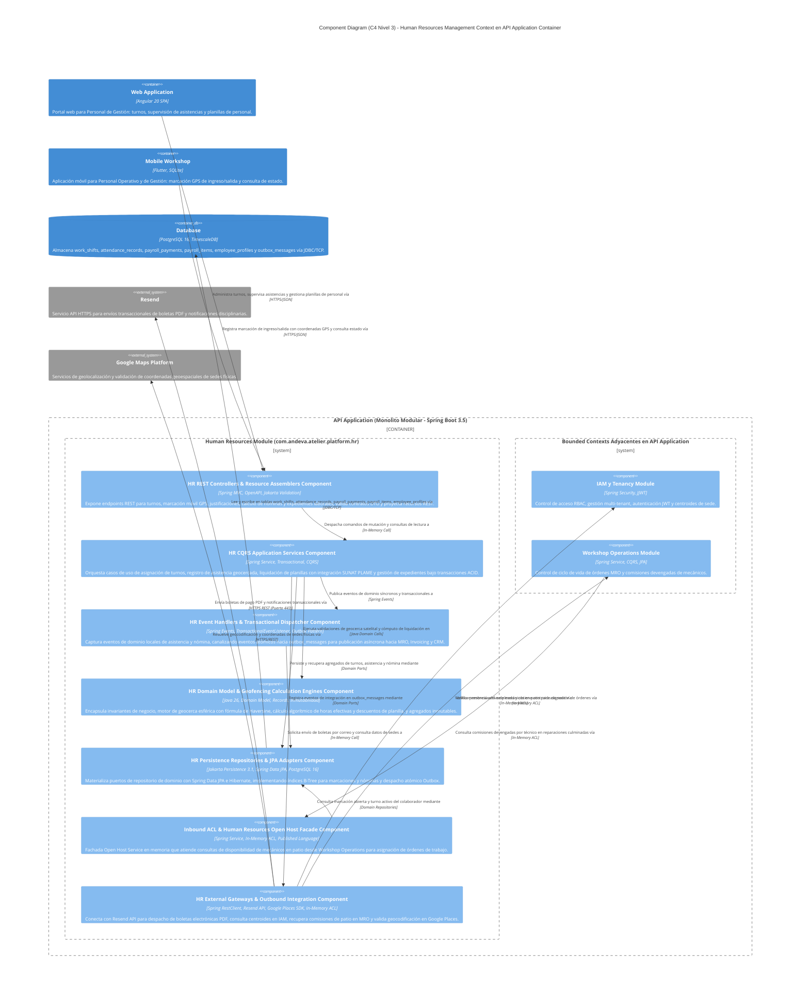
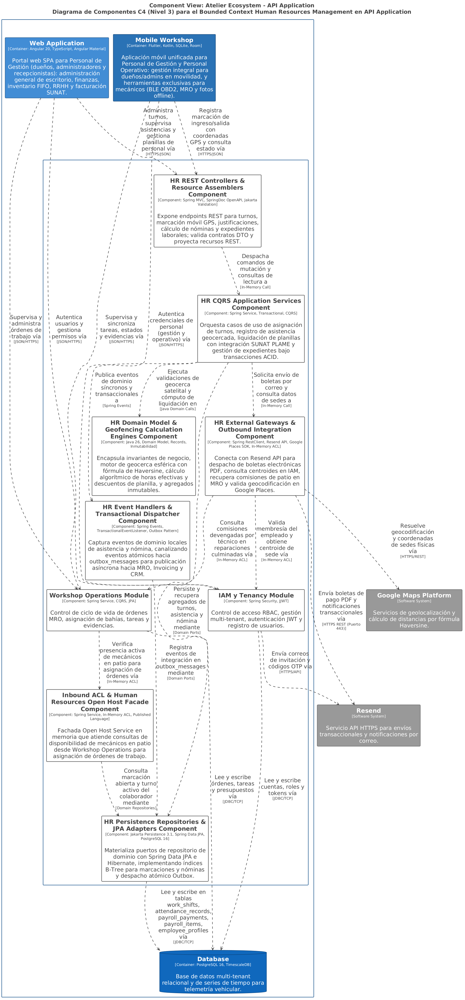
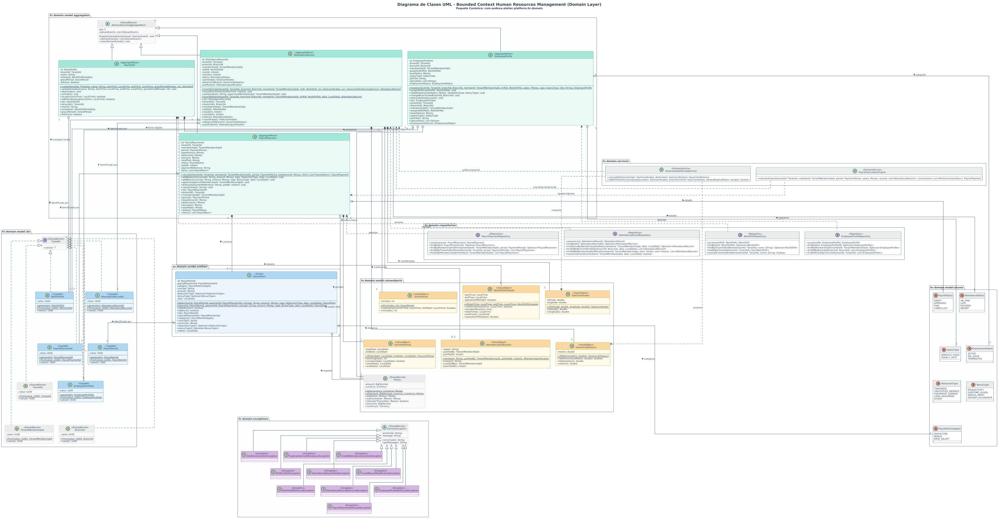
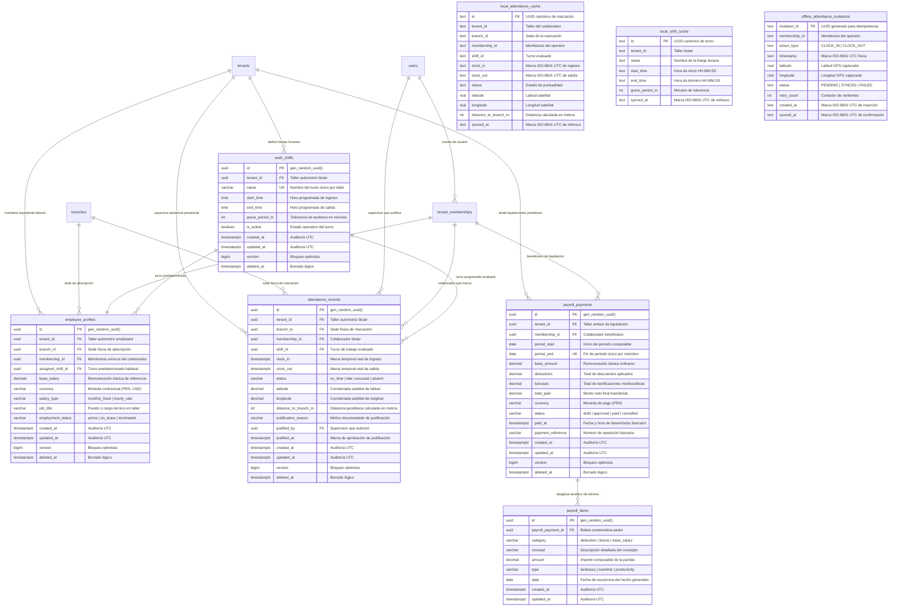

## 8. Fase 5: Bounded Context 5 — Human Resources Management (HR) Context (`com.andeva.atelier.platform.hr`)

### 8.1. Diccionario y Propósito del Contexto

#### 8.1.1. Propósito y Límites de Responsabilidad
El **Human Resources Management (HR) Context** administra los aspectos laborales, operativos y de compensación económica del talento humano del taller automotriz (mecánicos de patio, técnicos especialistas de foso, asesores de servicio y jefes de taller). Su delimitación responde a un principio arquitectónico esencial de desacoplamiento:
1. **Separación Persona/Usuario vs. Empleado Operativo:** El contexto de **IAM & Tenancy** gestiona a la persona como sujeto de autenticación y autorización (credenciales, contraseña hash, tokens JWT, membresía al taller y roles/permisos RBAC). En contraste, el contexto de **HR** modela a la persona como un trabajador operativo sujeto a jornadas laborales, turnos de trabajo, control de asistencia presencial, penalidades por tardanzas, horas trabajadas y liquidación periódica de nóminas/planillas salariales.
2. **Definición y Custodia de Turnos de Trabajo (`WorkShift`):** Centraliza la configuración de turnos operativos matutinos, vespertinos o jornadas completas por taller (`tenant_id`), especificando hora de entrada oficial (`start_time`), hora de salida oficial (`end_time`) y minutos de tolerancia (*grace period*) para la determinación de puntualidad.
3. **Control de Asistencia Georreferenciado (`AttendanceRecord`):** Permite a los mecánicos y empleados registrar su ingreso (*clock-in*) y salida (*clock-out*) directamente desde sus teléfonos inteligentes utilizando la aplicación móvil de Atelier (Kotlin/Flutter). Para garantizar la presencia física genuina en el patio de servicio y neutralizar marcaciones fraudulentas fuera del taller, el backend valida algorítmicamente las coordenadas satelitales del dispositivo contra la geocerca de la sucursal.
4. **Motor de Geocercas Haversine (*Haversine Geofencing Engine*):** Aísla la verificación trigonométrica y espacial de la marcación en microsegundos dentro de la memoria de la JVM. Utilizando la fórmula geodésica del semiverseno (*Haversine Formula*), el sistema compara la latitud y longitud reportadas por el hardware GPS móvil contra el centroide oficial de la sucursal física (`branches.latitude`, `branches.longitude`) y su radio de tolerancia (`branches.geofence_radius_m`, predeterminado en 50 metros). Si la distancia excede el radio permitido, el ingreso es rechazado de inmediato.
5. **Determinación Algorítmica de Estados de Asistencia:** Evalúa automáticamente si la marcación es puntual (`ON_TIME`), tardía (`LATE`) tras superar los minutos de tolerancia del turno, o inasistencia (`ABSENT`). Provee capacidades de justificación administrativa (`EXCUSED`) por parte del jefe de taller ante descansos médicos o permisos autorizados.
6. **Liquidación y Cálculo de Nóminas (`PayrollPayment`):** Modela el cálculo periódico de las remuneraciones del personal para un intervalo temporal dado (`period_start` a `period_end`). Consolida el salario base pactado, deduce automáticamente las penalizaciones económicas por tardanzas acumuladas o faltas injustificadas, suma bonificaciones por productividad o comisiones operativas, y genera la orden de pago en estado borrador (`DRAFT`) para su revisión, aprobación contable (`APPROVED`) y desembolso final (`PAID`).

#### 8.1.2. Decisiones de Diseño e Integraciones Críticas
* **Ejecución In-Memory de la Fórmula de Haversine:** En lugar de realizar invocaciones remotas a APIs externas de geolocalización (como Google Maps Distance Matrix API) en cada marcación —lo cual induciría latencias de red de 200 a 500 ms, generaría costos por consumo de cuota API y expondría al taller a fallos de conexión en horas punta matutinas—, Atelier resuelve el cálculo de distancia geodésica mediante un servicio de dominio puramente matemático (`HaversineGeofencingService`) en menos de un microsegundo.
* **Desacoplamiento con IAM & Tenancy mediante ACL:** HR no manipula las tablas `users` ni `tenant_memberships`. En su lugar, hace referencia al identificador unívoco de membresía (`membership_id`) y consulta la fachada de inbound `TenancyContextFacade` para obtener las coordenadas geográficas oficiales y el radio de geocerca de la sucursal (`BranchGeoCoordinatesDto`).
* **Desacoplamiento con MRO mediante Fachada Open Host Service (OHS):** El contexto de operaciones de taller (MRO) jamás debe consultar directamente la tabla `attendance_records` ni calcular tiempos laborales. Para verificar si un mecánico está físicamente disponible antes de asignarle una orden de trabajo o tarea urgente en foso, MRO consulta la interfaz `HumanResourcesContextFacade.isMechanicOnDuty(TenantMembershipId membershipId)`.

---

### 8.2. 2.6.5.1. Domain Layer

#### 8.2.1. Aggregates & Aggregate Roots

##### 1. `WorkShift` (Aggregate Root)
* **Paquete:** `com.andeva.atelier.platform.hr.domain.model.aggregates`
* **Herencia:** Extiende `AbstractDomainAggregateRoot<WorkShift>`
* **Propósito:** Representa un turno de trabajo laboral configurado para una empresa automotriz. Define los horarios oficiales de inicio y término, así como la tolerancia horaria para el ingreso del personal.
* **Atributos:**
  * `id: ShiftId` — Identificador universal del turno de trabajo (UUID).
  * `tenantId: TenantId` — Identificador del taller automotriz propietario del turno.
  * `name: String` — Denominación del turno (ej. "Turno Mañana Mecánicos", "Turno Integral Taller", "Guardia Nocturna").
  * `schedule: ShiftSchedule` — Objeto de valor que encapsula la hora de inicio (`startTime`) y la hora de fin (`endTime`), contemplando soporte para cruce de medianoche.
  * `gracePeriod: GracePeriod` — Objeto de valor que especifica los minutos de tolerancia permitidos antes de clasificar una marcación como tardanza (ej. 15 minutos).
  * `isActive: boolean` — Bandera de disponibilidad operativa del turno.
* **Invariantes y Reglas de Negocio:**
  * El nombre del turno no puede ser nulo ni estar en blanco, y su longitud máxima es de 50 caracteres.
  * La hora de inicio y la hora de fin no pueden ser idénticas.
  * El periodo de gracia no puede ser negativo y no debe exceder los 60 minutos.
* **Métodos:**
  * `+ static WorkShift create(TenantId tenantId, String name, LocalTime startTime, LocalTime endTime, int gracePeriodMinutes): WorkShift`: Factoría de dominio; valida invariantes, asigna estado activo y registra `WorkShiftCreatedEvent`.
  * `+ void updateSchedule(String name, LocalTime startTime, LocalTime endTime, int gracePeriodMinutes): void`: Modifica los parámetros horarios del turno y registra `WorkShiftUpdatedEvent`.
  * `+ void deactivate(): void`: Inhabilita el turno para futuras asignaciones a empleados.
  * `+ void activate(): void`: Restablece la vigencia del turno.
  * `+ boolean isLate(LocalTime clockInTime): boolean`: Evalúa si la hora de marcación supera el umbral límite permitido (`startTime + gracePeriod`).
  * `+ boolean isWithinWorkingHours(LocalTime time): boolean`: Evalúa si una hora específica cae dentro de la ventana de ejecución del turno.

##### 2. `AttendanceRecord` (Aggregate Root)
* **Paquete:** `com.andeva.atelier.platform.hr.domain.model.aggregates`
* **Herencia:** Extiende `AbstractDomainAggregateRoot<AttendanceRecord>`
* **Propósito:** Representa la evidencia de asistencia laboral de un empleado en una fecha y turno determinados. Custodia la marcación de ingreso, la marcación de egreso, la geolocalización satelital obtenida del smartphone y la distancia calculada contra la sucursal.
* **Atributos:**
  * `id: AttendanceId` — Identificador universal de la marcación (UUID).
  * `tenantId: TenantId` — Taller propietario de la operación.
  * `branchId: BranchId` — Sucursal física donde el empleado presta servicios.
  * `membershipId: TenantMembershipId` — Identificador del empleado/mecánico en el sistema.
  * `shiftId: ShiftId` — Turno de trabajo bajo el cual se evalúa la asistencia.
  * `clockIn: Instant` — Timestamp exacto de registro de ingreso presencial.
  * `clockOut: Instant` — Timestamp de registro de salida laboral (nullable hasta que el empleado finalice su jornada).
  * `status: AttendanceStatus` — Clasificación del estado de asistencia (`ON_TIME`, `LATE`, `EXCUSED`, `ABSENT`).
  * `checkInLocation: GeoCoordinates` — Coordenadas GPS satelitales (latitud, longitud) emitidas por el smartphone al momento del ingreso.
  * `distanceToBranch: HaversineDistance` — Distancia física en metros calculada matemáticamente entre el smartphone y la sucursal.
  * `justificationReason: String` — Descripción justificatoria aprobada por supervisión (nullable, requerida si el estado es `EXCUSED`).
  * `justifiedBy: TenantMembershipId` — Identificador del supervisor o administrador que aprobó la excepción (nullable).
  * `justifiedAt: Instant` — Momento cronológico de la justificación administrativa (nullable).
* **Invariantes y Reglas de Negocio:**
  * La hora de salida (`clockOut`) no puede ser cronológicamente anterior a la hora de entrada (`clockIn`).
  * Las coordenadas GPS deben encontrarse en rangos geográficos válidos (latitud entre -90 y 90, longitud entre -180 y 180).
  * La distancia calculada a la sucursal no puede exceder el radio geodésico autorizado de la sede física (`branchGeofenceRadiusMeters`); si se supera, la marcación es inválida y no se instancia el registro.
  * No puede existir más de un registro de asistencia abierto (sin `clockOut`) para el mismo empleado en el mismo día laboral.
* **Métodos:**
  * `+ static AttendanceRecord recordClockIn(TenantId tenantId, BranchId branchId, TenantMembershipId membershipId, ShiftId shiftId, WorkShift shift, GeoCoordinates employeeLocation, GeoCoordinates branchCentroid, double maxAllowedRadiusMeters, HaversineGeofencingService geofencingService): AttendanceRecord`:
    1. Invoca a `geofencingService.calculateDistance(employeeLocation, branchCentroid)` obteniendo `HaversineDistance`.
    2. Valida que `distance.meters() <= maxAllowedRadiusMeters`. Si se incumple, lanza `GeofenceViolationException`.
    3. Compara `clockIn` local contra `shift.startTime + shift.gracePeriod`. Si está dentro de la tolerancia, clasifica como `ON_TIME`; si la sobrepasa, clasifica como `LATE`.
    4. Registra `EmployeeClockedInEvent` y, si corresponde, `LateAttendanceRecordedEvent`.
  * `+ void recordClockOut(Instant clockOutTime): void`:
    1. Valida que `clockOut` no haya sido registrado previamente.
    2. Valida que `clockOutTime.isAfter(clockIn)`.
    3. Asigna el timestamp y registra `EmployeeClockedOutEvent`.
  * `+ void justify(String reason, TenantMembershipId supervisorMembershipId): void`:
    1. Valida que el estado actual sea `LATE` o `ABSENT`.
    2. Modifica el estado a `EXCUSED`, asigna la causal explicativa y el auditor responsable.
    3. Registra `AttendanceJustifiedEvent`.
  * `+ static AttendanceRecord recordAbsent(TenantId tenantId, BranchId branchId, TenantMembershipId membershipId, ShiftId shiftId, LocalDate date): AttendanceRecord`: Factoría administrativa para registrar formalmente una inasistencia no justificada.

##### 3. `PayrollPayment` (Aggregate Root)
* **Paquete:** `com.andeva.atelier.platform.hr.domain.model.aggregates`
* **Herencia:** Extiende `AbstractDomainAggregateRoot<PayrollPayment>`
* **Propósito:** Representa la liquidación salarial o boleta de pago emitida a un empleado para un intervalo temporal contable determinado. Orquesta las deducciones por incidencias y bonificaciones operativas.
* **Atributos:**
  * `id: PayrollPaymentId` — Identificador universal de la boleta de pago (UUID).
  * `tenantId: TenantId` — Taller emisor del pago.
  * `membershipId: TenantMembershipId` — Empleado beneficiario de la liquidación.
  * `period: PayPeriod` — Objeto de valor con fecha de inicio (`periodStart`) y fecha de fin (`periodEnd`).
  * `baseAmount: Money` — Salario base mensual o proporcional estipulado en el contrato laboral.
  * `deductions: Money` — Suma consolidada de descuentos monetarios aplicados (tardanzas, inasistencias, retenciones).
  * `bonuses: Money` — Suma consolidada de bonificaciones económicas asignadas (productividad de patio, horas extras).
  * `totalPaid: Money` — Importe neto a transferir al colaborador (`baseAmount - deductions + bonuses`).
  * `status: PayrollStatus` — Ciclo de vida de la boleta (`DRAFT`, `APPROVED`, `PAID`, `CANCELLED`).
  * `deductionItems: List<PayrollDeductionItem>` — Entidades hijas con el desglose pormenorizado de descuentos.
  * `bonusItems: List<PayrollBonusItem>` — Entidades hijas con el desglose pormenorizado de bonificaciones.
  * `paidAt: Instant` — Fecha y hora del desembolso financiero (nullable hasta concretar el pago).
  * `paymentReference: String` — Número de operación bancaria o comprobante de transferencia (nullable).
* **Invariantes y Reglas de Negocio:**
  * La fecha de inicio del periodo no puede ser posterior a la fecha de fin.
  * El importe neto (`totalPaid`) no puede ser negativo; si las deducciones superan el salario base más bonos, el total pagado se ajusta al límite mínimo reglamentario o genera deuda controlada.
  * No se pueden agregar deducciones ni bonificaciones una vez que la boleta se encuentra en estado `APPROVED` o `PAID`.
  * Únicamente las boletas en estado `APPROVED` pueden ser marcadas como pagadas (`PAID`).
* **Métodos:**
  * `+ static PayrollPayment calculate(TenantId tenantId, TenantMembershipId membershipId, PayPeriod period, Money baseAmount, List<PayrollDeductionItem> deductions, List<PayrollBonusItem> bonuses): PayrollPayment`: Factoría de dominio que crea la liquidación en estado `DRAFT`, calcula los totales netos y registra `PayrollCalculatedEvent`.
  * `+ void addDeduction(String concept, Money amount, DeductionType type, LocalDate date): void`: Agrega un ítem de descuento a la colección interna y recalcula `deductions` y `totalPaid`.
  * `+ void addBonus(String concept, Money amount, BonusType type, LocalDate date): void`: Agrega un ítem de bono a la colección interna y recalcula `bonuses` y `totalPaid`.
  * `+ void approve(): void`: Transiciona el estado a `APPROVED` tras auditoría del administrador; registra `PayrollApprovedEvent`.
  * `+ void markAsPaid(String paymentReference, Instant paymentTimestamp): void`: Transiciona el estado a `PAID`, registra el comprobante de pago bancario y emite `PayrollDisbursedEvent`.
  * `+ void cancel(String cancelReason): void`: Anula la liquidación devolviéndola al pool de periodos no liquidados.

##### 4. `EmployeeProfile` (Aggregate Root)
* **Paquete:** `com.andeva.atelier.platform.hr.domain.model.aggregates`
* **Herencia:** Extiende `AbstractDomainAggregateRoot<EmployeeProfile>`
* **Propósito:** Modela la ficha laboral y contractual del empleado dentro del contexto de Recursos Humanos, asociándolo a su sede de adscripción, turno asignado y esquema salarial.
* **Atributos:**
  * `id: EmployeeProfileId` — Identificador unívoco del perfil operativo (UUID).
  * `tenantId: TenantId` — Taller automotriz empleador.
  * `branchId: BranchId` — Sede física donde cumple sus funciones laborales.
  * `membershipId: TenantMembershipId` — Enlace unívoco con la identidad de membresía en IAM.
  * `assignedShiftId: ShiftId` — Turno regular predeterminado para el empleado.
  * `baseSalary: Money` — Remuneración ordinaria pactada.
  * `salaryType: SalaryType` — Tipo de esquema salarial (`MONTHLY_FIXED`, `HOURLY_RATE`).
  * `jobTitle: String` — Cargo u ocupación técnica (ej. "Mecánico Senior de Motor", "Electricista Automotriz", "Asesor de Servicio").
  * `employmentStatus: EmploymentStatus` — Situación contractual activa (`ACTIVE`, `ON_LEAVE`, `TERMINATED`).
* **Métodos:**
  * `+ static EmployeeProfile register(TenantId tenantId, BranchId branchId, TenantMembershipId membershipId, ShiftId shiftId, Money baseSalary, SalaryType salaryType, String jobTitle): EmployeeProfile`: Factoría que registra el perfil y emite `EmployeeProfileRegisteredEvent`.
  * `+ void assignShift(ShiftId newShiftId): void`: Actualiza el turno regular del colaborador.
  * `+ void updateSalary(Money newSalary, SalaryType salaryType): void`: Ajusta las condiciones de compensación económica.
  * `+ void changeBranch(BranchId newBranchId): void`: Transfiere al colaborador a otra sede del taller.
  * `+ void terminateEmployment(): void`: Da de baja operativa al empleado impidiendo futuras marcaciones.

---

#### 8.2.2. Entities (Child Entities)

##### 1. `PayrollDeductionItem` (Entity)
* **Paquete:** `com.andeva.atelier.platform.hr.domain.model.entities`
* **Propósito:** Representa una partida individual de descuento monetario aplicada dentro de una boleta de pago.
* **Atributos:**
  * `id: UUID` — Identificador del ítem de descuento.
  * `concept: String` — Descripción del motivo del descuento (ej. "Descuento por 3 tardanzas acumuladas (45 min)", "Inasistencia injustificada 14/08/2026").
  * `amount: Money` — Importe monetario deducido.
  * `deductionType: DeductionType` — Categoría (`TARDINESS`, `UNJUSTIFIED_ABSENCE`, `EQUIPMENT_DAMAGE`, `LOAN_REPAYMENT`, `OTHER`).
  * `appliedDate: LocalDate` — Fecha en que se originó la causal de la deducción.

##### 2. `PayrollBonusItem` (Entity)
* **Paquete:** `com.andeva.atelier.platform.hr.domain.model.entities`
* **Propósito:** Representa una partida individual de bonificación o incentivo económico sumado a una boleta de pago.
* **Atributos:**
  * `id: UUID` — Identificador del ítem de bonificación.
  * `concept: String` — Descripción del motivo de la bonificación (ej. "Bono de productividad: 25 órdenes cerradas", "Comisión por alineamiento y balanceo").
  * `amount: Money` — Importe monetario otorgado.
  * `bonusType: BonusType` — Categoría (`PRODUCTIVITY`, `OVERTIME_HOURS`, `SPECIAL_MERIT`, `HOLIDAY_ALLOWANCE`).
  * `awardedDate: LocalDate` — Fecha en que se concedió la bonificación.

---

#### 8.2.3. Value Objects

* **`ShiftId`:** Identificador universal inmutable de un turno (`record ShiftId(UUID value)`).
* **`AttendanceId`:** Identificador inmutable de un registro de marcación (`record AttendanceId(UUID value)`).
* **`PayrollPaymentId`:** Identificador inmutable de una boleta salarial (`record PayrollPaymentId(UUID value)`).
* **`EmployeeProfileId`:** Identificador del perfil laboral (`record EmployeeProfileId(UUID value)`).
* **`ShiftSchedule`:** Encapsula la ventana horaria del turno (`record ShiftSchedule(LocalTime startTime, LocalTime endTime, boolean spansOverMidnight)`). Contiene el método de dominio `boolean isWithinWindow(LocalTime checkTime)`.
* **`GracePeriod`:** Encapsula los minutos de tolerancia reglamentaria (`record GracePeriod(int minutes)`). Valida que `minutes >= 0 && minutes <= 60`.
* **`GeoCoordinates`:** Representa una coordenada geográfica satelital (`record GeoCoordinates(double latitude, double longitude)`). Valida que $-90.0 \le \text{latitude} \le 90.0$ y $-180.0 \le \text{longitude} \le 180.0$.
* **`HaversineDistance`:** Distancia métrica escalar calculada en el espacio geodésico terrestre (`record HaversineDistance(double meters)`). Provee métodos de conveniencia como `boolean isWithin(double thresholdMeters)` y `double toKilometers()`.
* **`PayPeriod`:** Intervalo temporal contable de nómina (`record PayPeriod(LocalDate startDate, LocalDate endDate)`). Valida que `!startDate.isAfter(endDate)` y calcula la cantidad de días laborales contenidos.
* **`AttendanceStatus`:** Enumeración del estado de asistencia (`ON_TIME`, `LATE`, `EXCUSED`, `ABSENT`).
* **`PayrollStatus`:** Enumeración del ciclo de vida de la nómina (`DRAFT`, `APPROVED`, `PAID`, `CANCELLED`).
* **`SalaryType`:** Esquema de remuneración del personal (`MONTHLY_FIXED`, `HOURLY_RATE`).
* **`EmploymentStatus`:** Situación contractual del trabajador (`ACTIVE`, `ON_LEAVE`, `TERMINATED`).
* **`DeductionType`:** Categoría analítica de descuentos (`TARDINESS`, `UNJUSTIFIED_ABSENCE`, `EQUIPMENT_DAMAGE`, `LOAN_REPAYMENT`, `OTHER`).
* **`BonusType`:** Categoría analítica de beneficios (`PRODUCTIVITY`, `OVERTIME_HOURS`, `SPECIAL_MERIT`, `HOLIDAY_ALLOWANCE`).

---

#### 8.2.4. Domain Commands

* **`CreateWorkShiftCommand`:** Parámetros para registrar un turno (`TenantId tenantId, String name, LocalTime startTime, LocalTime endTime, int gracePeriodMinutes`).
* **`UpdateWorkShiftCommand`:** Parámetros para modificar un turno (`ShiftId shiftId, String name, LocalTime startTime, LocalTime endTime, int gracePeriodMinutes`).
* **`RecordClockInCommand`:** Parámetros de marcación de ingreso móvil (`TenantId tenantId, BranchId branchId, TenantMembershipId membershipId, ShiftId shiftId, double latitude, double longitude`).
* **`RecordClockOutCommand`:** Parámetros de marcación de salida móvil (`AttendanceId attendanceId, TenantMembershipId membershipId, Instant clockOutTime`).
* **`JustifyAttendanceCommand`:** Parámetros para autorizar una excepción de asistencia (`AttendanceId attendanceId, String reason, TenantMembershipId supervisorMembershipId`).
* **`GeneratePayrollCommand`:** Parámetros para procesar la nómina de un periodo (`TenantId tenantId, TenantMembershipId membershipId, LocalDate periodStart, LocalDate periodEnd`).
* **`AddPayrollDeductionCommand`:** Incorpora un descuento a una planilla (`PayrollPaymentId payrollId, String concept, Money amount, DeductionType type, LocalDate date`).
* **`AddPayrollBonusCommand`:** Incorpora un bono a una planilla (`PayrollPaymentId payrollId, String concept, Money amount, BonusType type, LocalDate date`).
* **`ApprovePayrollCommand`:** Aprobación administrativa (`PayrollPaymentId payrollId, TenantMembershipId approverMembershipId`).
* **`DisbursePayrollPaymentCommand`:** Registro del desembolso bancario (`PayrollPaymentId payrollId, String paymentReference, Instant paidAt`).
* **`RegisterEmployeeProfileCommand`:** Ficha de contratación (`TenantId tenantId, BranchId branchId, TenantMembershipId membershipId, ShiftId shiftId, Money baseSalary, SalaryType salaryType, String jobTitle`).
* **`AssignShiftToEmployeeCommand`:** Reasignación de turno (`EmployeeProfileId profileId, ShiftId newShiftId`).

---

#### 8.2.5. Domain Queries

* **`GetWorkShiftByIdQuery`:** Consulta de un turno por su ID (`ShiftId shiftId`).
* **`ListWorkShiftsByTenantQuery`:** Catálogo de turnos vigentes del taller (`TenantId tenantId`).
* **`GetAttendanceRecordByIdQuery`:** Detalle de una marcación específica (`AttendanceId attendanceId`).
* **`ListAttendanceByBranchAndDateQuery`:** Cuadro de asistencias diario por sucursal (`BranchId branchId, LocalDate date`).
* **`GetEmployeeAttendanceHistoryQuery`:** Historial de marcaciones de un empleado en un rango temporal (`TenantMembershipId membershipId, LocalDate from, LocalDate to`).
* **`GetPayrollPaymentByIdQuery`:** Consulta de una boleta de pago (`PayrollPaymentId payrollPaymentId`).
* **`ListPayrollPaymentsByPeriodQuery`:** Reporte de nóminas del taller para un mes/periodo (`TenantId tenantId, LocalDate periodStart, LocalDate periodEnd`).
* **`GetEmployeeProfileByMembershipIdQuery`:** Consulta del perfil laboral de un usuario (`TenantMembershipId membershipId`).
* **`IsEmployeeOnDutyQuery`:** Verificación rápida de presencia física activa para asignación en MRO (`TenantMembershipId membershipId`).

---

#### 8.2.6. Domain Events

* **`WorkShiftCreatedEvent`:** Emitido al parametrizar un nuevo horario laboral (`ShiftId shiftId, TenantId tenantId, String name, LocalTime startTime, LocalTime endTime`).
* **`WorkShiftUpdatedEvent`:** Emitido al modificar horarios o minutos de gracia (`ShiftId shiftId, LocalTime startTime, LocalTime endTime, int gracePeriod`).
* **`EmployeeClockedInEvent`:** Emitido tras una marcación presencial válida en patio (`AttendanceId attendanceId, TenantMembershipId membershipId, BranchId branchId, AttendanceStatus status, double distanceMeters, Instant timestamp`).
* **`EmployeeClockedOutEvent`:** Emitido al concluir la jornada de trabajo (`AttendanceId attendanceId, TenantMembershipId membershipId, Instant clockOutTimestamp, long totalWorkedMinutes`).
* **`LateAttendanceRecordedEvent`:** Emitido cuando la marcación superó la tolerancia del turno (`AttendanceId attendanceId, TenantMembershipId membershipId, long minutesLate, Instant timestamp`).
* **`GeofenceViolationDetectedEvent`:** Emitido cuando se rechaza una marcación móvil que excede el radio de la sede física (`TenantMembershipId membershipId, BranchId branchId, double attemptedDistanceMeters, double maxAllowedMeters`).
* **`AttendanceJustifiedEvent`:** Emitido al regularizarse una tardanza o falta por orden médica o permiso (`AttendanceId attendanceId, TenantMembershipId justifiedBy, String reason`).
* **`PayrollCalculatedEvent`:** Emitido al generarse el cálculo proforma de la nómina (`PayrollPaymentId payrollId, TenantMembershipId membershipId, Money totalPaid, PayPeriod period`).
* **`PayrollApprovedEvent`:** Emitido al autorizarse el pago formal por gerencia (`PayrollPaymentId payrollId, TenantMembershipId approverMembershipId`).
* **`PayrollDisbursedEvent`:** Emitido al liquidarse la transferencia bancaria (`PayrollPaymentId payrollId, String paymentReference, Instant timestamp`).

---

#### 8.2.7. Domain Repositories (Interfaces)

```java
package com.andeva.atelier.platform.hr.domain.repositories;

public interface WorkShiftRepository {
    WorkShift save(WorkShift workShift);
    Optional<WorkShift> findById(ShiftId id);
    Optional<WorkShift> findByTenantIdAndName(TenantId tenantId, String name);
    List<WorkShift> findAllByTenantId(TenantId tenantId);
    boolean existsByTenantIdAndName(TenantId tenantId, String name);
}

public interface AttendanceRecordRepository {
    AttendanceRecord save(AttendanceRecord attendanceRecord);
    Optional<AttendanceRecord> findById(AttendanceId id);
    Optional<AttendanceRecord> findActiveByMembershipIdAndDate(TenantMembershipId membershipId, LocalDate date);
    List<AttendanceRecord> findAllByBranchIdAndDate(BranchId branchId, LocalDate date);
    List<AttendanceRecord> findAllByMembershipIdAndPeriod(TenantMembershipId membershipId, Instant start, Instant end);
    boolean hasActiveClockIn(TenantMembershipId membershipId, LocalDate date);
}

public interface PayrollPaymentRepository {
    PayrollPayment save(PayrollPayment payrollPayment);
    Optional<PayrollPayment> findById(PayrollPaymentId id);
    Optional<PayrollPayment> findByMembershipIdAndPeriod(TenantMembershipId membershipId, LocalDate startDate, LocalDate endDate);
    List<PayrollPayment> findAllByTenantIdAndPeriod(TenantId tenantId, LocalDate startDate, LocalDate endDate);
    List<PayrollPayment> findAllByMembershipId(TenantMembershipId membershipId);
}

public interface EmployeeProfileRepository {
    EmployeeProfile save(EmployeeProfile profile);
    Optional<EmployeeProfile> findById(EmployeeProfileId id);
    Optional<EmployeeProfile> findByMembershipId(TenantMembershipId membershipId);
    List<EmployeeProfile> findAllByBranchId(BranchId branchId);
    List<EmployeeProfile> findAllActiveByTenantId(TenantId tenantId);
}
```

---

#### 8.2.8. Domain Services

##### 1. `HaversineGeofencingService` (Servicio de Dominio Matemático)
* **Paquete:** `com.andeva.atelier.platform.hr.domain.services`
* **Propósito:** Calcula con rigor geodésico la distancia esférica en metros entre dos puntos geográficos (las coordenadas capturadas por el sensor GPS del teléfono y las coordenadas físicas de la sucursal del taller).
* **Fórmula Matemática:** Aplica la ley del semiverseno (*Haversine*), asumiendo un radio esférico medio de la Tierra $R = 6,371,000 \text{ metros}$:
  $$\Delta \phi = \text{radians}(\text{lat}_2 - \text{lat}_1), \quad \Delta \lambda = \text{radians}(\text{lon}_2 - \text{lon}_1)$$
  $$a = \sin^2\left(\frac{\Delta \phi}{2}\right) + \cos(\text{radians}(\text{lat}_1)) \cdot \cos(\text{radians}(\text{lat}_2)) \cdot \sin^2\left(\frac{\Delta \lambda}{2}\right)$$
  $$c = 2 \cdot \text{atan2}\left(\sqrt{a}, \sqrt{1 - a}\right)$$
  $$d = R \cdot c$$
* **Implementación de Dominio:**
```java
package com.andeva.atelier.platform.hr.domain.services;

import com.andeva.atelier.platform.hr.domain.model.valueobjects.GeoCoordinates;
import com.andeva.atelier.platform.hr.domain.model.valueobjects.HaversineDistance;
import org.springframework.stereotype.Service;

@Service
public class HaversineGeofencingService {
    private static final double EARTH_RADIUS_METERS = 6371000.0;

    public HaversineDistance calculateDistance(GeoCoordinates origin, GeoCoordinates destination) {
        double lat1Rad = Math.toRadians(origin.latitude());
        double lat2Rad = Math.toRadians(destination.latitude());
        double deltaLatRad = Math.toRadians(destination.latitude() - origin.latitude());
        double deltaLonRad = Math.toRadians(destination.longitude() - origin.longitude());

        double a = Math.sin(deltaLatRad / 2.0) * Math.sin(deltaLatRad / 2.0)
                + Math.cos(lat1Rad) * Math.cos(lat2Rad)
                * Math.sin(deltaLonRad / 2.0) * Math.sin(deltaLonRad / 2.0);

        double c = 2.0 * Math.atan2(Math.sqrt(a), Math.sqrt(1.0 - a));
        double distanceMeters = EARTH_RADIUS_METERS * c;

        return new HaversineDistance(Math.round(distanceMeters * 100.0) / 100.0);
    }

    public boolean isWithinGeofence(GeoCoordinates employeeLocation, GeoCoordinates branchCentroid, double allowedRadiusMeters) {
        HaversineDistance distance = calculateDistance(employeeLocation, branchCentroid);
        return distance.meters() <= allowedRadiusMeters;
    }
}
```

##### 2. `PayrollCalculationEngine` (Servicio de Dominio Financiero de Planillas)
* **Paquete:** `com.andeva.atelier.platform.hr.domain.services`
* **Propósito:** Consolida el historial de marcaciones del empleado durante el periodo contable, detecta faltas y tardanzas, calcula deducciones proporcionales de acuerdo con las políticas del taller automotriz y genera la estructura base para la boleta de pago.

---

### 8.3. 2.6.6.2. Interface Layer

#### 8.3.1. REST Controllers

##### 1. `WorkShiftsController`
* **Ruta Base:** `/api/v1/hr/work-shifts`
* **Responsabilidad:** Administrar la parametrización de turnos laborales por parte de administradores y jefes de recursos humanos.
* **Endpoints:**
  * `POST /api/v1/hr/work-shifts`: Crea un nuevo turno de trabajo (`CreateWorkShiftResource` / `CreateWorkShiftCommand`). Responde `201 Created` con el recurso creado y cabecera `Location`.
  * `GET /api/v1/hr/work-shifts`: Lista todos los turnos configurados para el taller autenticado (`tenant_id`). Responde `200 OK` con `List<WorkShiftResource>`.
  * `GET /api/v1/hr/work-shifts/{shiftId}`: Obtiene el detalle de un turno por su ID. Responde `200 OK` con `WorkShiftResource` o `404 Not Found`.
  * `PUT /api/v1/hr/work-shifts/{shiftId}`: Modifica los horarios y tolerancia de un turno (`UpdateWorkShiftResource` / `UpdateWorkShiftCommand`). Responde `200 OK` con `WorkShiftResource` o `404 Not Found`.
  * `PATCH /api/v1/hr/work-shifts/{shiftId}/deactivate`: Inhabilita un turno laboral para impedir nuevas asignaciones. Responde `204 No Content` o `404 Not Found`.
  * `PATCH /api/v1/hr/work-shifts/{shiftId}/activate`: Restaura la vigencia y operatividad de un turno. Responde `204 No Content` o `404 Not Found`.

##### 2. `AttendanceController`
* **Ruta Base:** `/api/v1/hr/attendances`
* **Responsabilidad:** Endpoint perimetral de alta concurrencia utilizado por los mecánicos desde la aplicación móvil para marcación presencial con validación geodésica, y por supervisores para auditoría diaria y regularización justificada.
* **Endpoints:**
  * `POST /api/v1/hr/attendances/clock-in`: Registra el ingreso del colaborador validando coordenadas satelitales WGS84 contra la geocerca de la sucursal (`ClockInRequest`). Responde `201 Created` con `AttendanceResource` o `422 Unprocessable Entity` si la geocerca es violada.
  * `POST /api/v1/hr/attendances/clock-out`: Registra el egreso laboral y computa el total de horas trabajadas (`ClockOutRequest`). Responde `200 OK` con `AttendanceResource` o `400 Bad Request`.
  * `POST /api/v1/hr/attendances/{attendanceId}/justify`: Permite a un supervisor justificar administrativamente una tardanza o inasistencia (`JustifyAttendanceRequest`). Responde `200 OK` con `AttendanceResource` o `400 Bad Request`.
  * `GET /api/v1/hr/attendances/branch/{branchId}/daily`: Lista el reporte de asistencias del día seleccionado para una sucursal física. Responde `200 OK` con `List<AttendanceResource>`.
  * `GET /api/v1/hr/attendances/employee/{membershipId}/history`: Consulta el historial de asistencias de un empleado específico en un rango de fechas. Responde `200 OK` con `List<AttendanceResource>`.
  * `GET /api/v1/hr/attendances/employee/{membershipId}/status-today`: Consulta el estado actual de marcación del día para un colaborador para validación de patio. Responde `200 OK` con `AttendanceResource` o `404 Not Found`.

##### 3. `PayrollPaymentsController`
* **Ruta Base:** `/api/v1/hr/payrolls`
* **Responsabilidad:** Gestión integral del ciclo de planillas salariales, adición de bonos, deducciones legales, aprobación contable formal, autorización de desembolsos bancarios y exportación de archivos tributarios.
* **Endpoints:**
  * `POST /api/v1/hr/payrolls/generate`: Genera la boleta de pago proforma para un colaborador en un periodo mensual/quincenal (`GeneratePayrollRequest`). Responde `201 Created` con `PayrollPaymentResource`.
  * `GET /api/v1/hr/payrolls`: Lista las planillas emitidas en el taller con filtrado por periodo contable y estado, con paginación estandarizada. Responde `200 OK` con `PagedModel<PayrollPaymentSummaryResource>`.
  * `GET /api/v1/hr/payrolls/{payrollId}`: Consulta pormenorizada de la boleta con su desglose completo de conceptos de ingresos y egresos. Responde `200 OK` con `PayrollPaymentResource` o `404 Not Found`.
  * `POST /api/v1/hr/payrolls/{payrollId}/deductions`: Registra un descuento específico a la boleta proforma (`AddPayrollDeductionRequest`). Responde `200 OK` con `PayrollPaymentResource` o `409 Conflict` si la nómina está cerrada.
  * `POST /api/v1/hr/payrolls/{payrollId}/bonuses`: Registra una bonificación por productividad o comisión a la boleta proforma (`AddPayrollBonusRequest`). Responde `200 OK` con `PayrollPaymentResource` o `409 Conflict`.
  * `POST /api/v1/hr/payrolls/{payrollId}/approve`: Aprueba formalmente la liquidación salarial fijando los montos definitivos. Responde `200 OK` con `PayrollPaymentResource`.
  * `POST /api/v1/hr/payrolls/{payrollId}/disburse`: Marca la nómina como efectivamente pagada, asociando el comprobante y referencia bancaria (`DisbursePayrollRequest`). Responde `200 OK` con `PayrollPaymentResource`.
  * `GET /api/v1/hr/payrolls/export/sunat-rem`: Exporta el archivo estructurado oficial para la Planilla Mensual de Pagos de SUNAT (PLAME) en formato de texto plano (`.rem`). Recibe el parámetro `period` (`YYYY-MM`), valida que la nómina del periodo esté aprobada y genera la trama formateada con delimitadores de barra vertical (`|`) para importación directa en el aplicativo de SUNAT. Responde `200 OK` con cabecera `Content-Disposition: attachment; filename="0601{YYYYMM}{RUC}.rem"` y tipo `text/plain`.

##### 4. `StaffProfilesController`
* **Ruta Base:** `/api/v1/hr/employees`
* **Responsabilidad:** Alta y administración de los expedientes y fichas laborales operativas de mecánicos y personal del taller vinculados a su membresía de seguridad en IAM.
* **Endpoints:**
  * `POST /api/v1/hr/employees`: Registra el perfil laboral operativo de un nuevo colaborador asociado a su membresía en IAM (`RegisterEmployeeProfileRequest`). Responde `201 Created` con `EmployeeProfileResource`.
  * `GET /api/v1/hr/employees/{profileId}`: Consulta individual del expediente laboral por su identificador. Responde `200 OK` con `EmployeeProfileResource` o `404 Not Found`.
  * `GET /api/v1/hr/employees/membership/{membershipId}`: Obtiene el expediente laboral a partir del identificador de membresía del usuario. Responde `200 OK` con `EmployeeProfileResource` o `404 Not Found`.
  * `GET /api/v1/hr/employees/branch/{branchId}`: Lista los colaboradores adscritos a una sucursal física. Responde `200 OK` con `List<EmployeeProfileResource>`.
  * `PUT /api/v1/hr/employees/{profileId}/shift`: Reasigna el turno de trabajo de un colaborador (`AssignShiftRequest`). Responde `200 OK` con `EmployeeProfileResource`.
  * `PUT /api/v1/hr/employees/{profileId}/salary`: Modifica el esquema salarial y la remuneración base (`UpdateSalaryRequest`). Responde `200 OK` con `EmployeeProfileResource`.
  * `PATCH /api/v1/hr/employees/{profileId}/status`: Actualiza la situación laboral del empleado (`ACTIVE`, `ON_LEAVE`, `TERMINATED`) (`UpdateEmploymentStatusRequest`). Responde `200 OK` con `EmployeeProfileResource`.

---

#### 8.3.2. REST Resources & DTOs (Records)

```java
package com.andeva.atelier.platform.hr.interfaces.rest.resources;

import jakarta.validation.constraints.DecimalMax;
import jakarta.validation.constraints.DecimalMin;
import jakarta.validation.constraints.Max;
import jakarta.validation.constraints.Min;
import jakarta.validation.constraints.NotBlank;
import jakarta.validation.constraints.NotNull;
import jakarta.validation.constraints.Pattern;
import jakarta.validation.constraints.Positive;
import jakarta.validation.constraints.Size;
import java.math.BigDecimal;
import java.time.Instant;
import java.time.LocalDate;
import java.time.LocalTime;
import java.util.List;
import java.util.UUID;

// === Recursos de Petición (Inbound DTOs) ===

public record CreateWorkShiftResource(
    @NotBlank(message = "El nombre del turno es obligatorio")
    @Size(max = 100, message = "El nombre no puede superar 100 caracteres")
    String name,

    @NotNull(message = "La hora de inicio es requerida")
    LocalTime startTime,

    @NotNull(message = "La hora de fin es requerida")
    LocalTime endTime,

    @Min(value = 0, message = "La tolerancia no puede ser negativa")
    @Max(value = 60, message = "La tolerancia máxima permitida es 60 minutos")
    int gracePeriodMinutes
) {}

public record UpdateWorkShiftResource(
    @NotBlank(message = "El nombre del turno es obligatorio")
    @Size(max = 100, message = "El nombre no puede superar 100 caracteres")
    String name,

    @NotNull(message = "La hora de inicio es requerida")
    LocalTime startTime,

    @NotNull(message = "La hora de fin es requerida")
    LocalTime endTime,

    @Min(value = 0, message = "La tolerancia no puede ser negativa")
    @Max(value = 60, message = "La tolerancia máxima permitida es 60 minutos")
    int gracePeriodMinutes
) {}

public record ClockInRequest(
    @NotNull(message = "La sucursal es obligatoria")
    UUID branchId,

    @NotNull(message = "El turno es obligatorio")
    UUID shiftId,

    @NotNull(message = "La latitud es requerida")
    @DecimalMin(value = "-90.0", message = "La latitud no puede ser menor a -90.0")
    @DecimalMax(value = "90.0", message = "La latitud no puede superar 90.0")
    Double latitude,

    @NotNull(message = "La longitud es requerida")
    @DecimalMin(value = "-180.0", message = "La longitud no puede ser menor a -180.0")
    @DecimalMax(value = "180.0", message = "La longitud no puede superar 180.0")
    Double longitude
) {}

public record ClockOutRequest(
    @NotNull(message = "El ID de marcación es obligatorio")
    UUID attendanceId,

    @NotNull(message = "La marca temporal de egreso es obligatoria")
    Instant clockOutTime
) {}

public record JustifyAttendanceRequest(
    @NotBlank(message = "El motivo de justificación es requerido")
    @Size(max = 500, message = "La justificación no puede superar 500 caracteres")
    String reason
) {}

public record GeneratePayrollRequest(
    @NotNull(message = "El colaborador es obligatorio")
    UUID membershipId,

    @NotNull(message = "La fecha inicial del periodo es requerida")
    LocalDate periodStart,

    @NotNull(message = "La fecha final del periodo es requerida")
    LocalDate periodEnd
) {}

public record AddPayrollDeductionRequest(
    @NotBlank(message = "El concepto de descuento es obligatorio")
    @Size(max = 150, message = "El concepto no puede superar 150 caracteres")
    String concept,

    @NotNull(message = "El importe es obligatorio")
    @Positive(message = "El importe del descuento debe ser estrictamente positivo")
    BigDecimal amount,

    @NotBlank(message = "La divisa es obligatoria")
    @Size(min = 3, max = 3, message = "El código ISO de moneda debe contener 3 caracteres")
    @Pattern(regexp = "PEN|USD", message = "Solo se admiten las divisas PEN o USD")
    String currency,

    @NotBlank(message = "El tipo de deducción es obligatorio")
    @Pattern(regexp = "AFP|ONP|ESSALUD_VIDA|TAX_RETENTION|ADVANCE|LOAN|UNEXCUSED_ABSENCE|PENALTY", message = "Tipo de deducción no admitido")
    String deductionType,

    @NotNull(message = "La fecha de aplicación es requerida")
    LocalDate date
) {}

public record AddPayrollBonusRequest(
    @NotBlank(message = "El concepto de bonificación es obligatorio")
    @Size(max = 150, message = "El concepto no puede superar 150 caracteres")
    String concept,

    @NotNull(message = "El importe es obligatorio")
    @Positive(message = "El importe del bono debe ser estrictamente positivo")
    BigDecimal amount,

    @NotBlank(message = "La divisa es obligatoria")
    @Size(min = 3, max = 3, message = "El código ISO de moneda debe contener 3 caracteres")
    @Pattern(regexp = "PEN|USD", message = "Solo se admiten las divisas PEN o USD")
    String currency,

    @NotBlank(message = "El tipo de bonificación es obligatorio")
    @Pattern(regexp = "PRODUCTIVITY|WORK_ORDER_COMMISSION|OVERTIME|PUNCTUALITY|SPECIAL_BONUS", message = "Tipo de bono no admitido")
    String bonusType,

    @NotNull(message = "La fecha de devengo es requerida")
    LocalDate date
) {}

public record DisbursePayrollRequest(
    @NotBlank(message = "La referencia bancaria es obligatoria")
    @Size(max = 100, message = "La referencia de pago no puede exceder 100 caracteres")
    String paymentReference,

    @NotNull(message = "La marca temporal del pago es requerida")
    Instant paidAt
) {}

public record RegisterEmployeeProfileRequest(
    @NotNull(message = "La sucursal es obligatoria")
    UUID branchId,

    @NotNull(message = "El identificador de membresía es obligatorio")
    UUID membershipId,

    @NotNull(message = "El turno de trabajo asignado es obligatorio")
    UUID shiftId,

    @NotNull(message = "La remuneración base es obligatoria")
    @Positive(message = "La remuneración base debe ser un valor positivo")
    BigDecimal baseSalary,

    @NotBlank(message = "La divisa es obligatoria")
    @Size(min = 3, max = 3, message = "El código de divisa debe tener 3 caracteres")
    @Pattern(regexp = "PEN|USD", message = "Solo se admiten las divisas PEN o USD")
    String currency,

    @NotBlank(message = "El esquema salarial es obligatorio")
    @Pattern(regexp = "FIXED_MONTHLY|DAILY_RATE|HOURLY_RATE|COMMISSION_BASED", message = "Esquema salarial no admitido")
    String salaryType,

    @NotBlank(message = "El cargo o puesto laboral es obligatorio")
    @Size(max = 100, message = "El cargo laboral no puede exceder 100 caracteres")
    String jobTitle
) {}

public record AssignShiftRequest(
    @NotNull(message = "El nuevo turno laboral es obligatorio")
    UUID shiftId
) {}

public record UpdateSalaryRequest(
    @NotNull(message = "La nueva remuneración base es obligatoria")
    @Positive(message = "La remuneración base debe ser estrictamente positiva")
    BigDecimal baseSalary,

    @NotBlank(message = "La divisa es obligatoria")
    @Size(min = 3, max = 3, message = "El código de moneda debe tener 3 caracteres")
    @Pattern(regexp = "PEN|USD", message = "Solo se admiten las divisas PEN o USD")
    String currency,

    @NotBlank(message = "El esquema salarial es obligatorio")
    @Pattern(regexp = "FIXED_MONTHLY|DAILY_RATE|HOURLY_RATE|COMMISSION_BASED", message = "Esquema salarial no admitido")
    String salaryType
) {}

public record UpdateEmploymentStatusRequest(
    @NotBlank(message = "El nuevo estado laboral es requerido")
    @Pattern(regexp = "ACTIVE|ON_LEAVE|TERMINATED", message = "Estado laboral no válido")
    String employmentStatus
) {}

// === Recursos de Respuesta (Outbound DTOs) ===

public record WorkShiftResource(
    UUID id,
    String name,
    LocalTime startTime,
    LocalTime endTime,
    int gracePeriodMinutes,
    boolean isActive
) {}

public record AttendanceResource(
    UUID id,
    UUID branchId,
    UUID membershipId,
    UUID shiftId,
    Instant clockIn,
    Instant clockOut,
    String status,
    Double latitude,
    Double longitude,
    Double distanceToBranchMeters,
    String justificationReason,
    UUID justifiedBy,
    Instant justifiedAt
) {}

public record PayrollPaymentResource(
    UUID id,
    UUID membershipId,
    LocalDate periodStart,
    LocalDate periodEnd,
    BigDecimal baseAmount,
    BigDecimal deductions,
    BigDecimal bonuses,
    BigDecimal totalPaid,
    String currency,
    String status,
    Instant paidAt,
    String paymentReference,
    List<PayrollItemResource> items
) {}

public record PayrollPaymentSummaryResource(
    UUID id,
    UUID membershipId,
    LocalDate periodStart,
    LocalDate periodEnd,
    BigDecimal baseAmount,
    BigDecimal totalPaid,
    String currency,
    String status
) {}

public record PayrollItemResource(
    UUID id,
    String category,
    String concept,
    BigDecimal amount,
    String type,
    LocalDate date
) {}

public record EmployeeProfileResource(
    UUID id,
    UUID branchId,
    UUID membershipId,
    UUID assignedShiftId,
    BigDecimal baseSalary,
    String currency,
    String salaryType,
    String jobTitle,
    String employmentStatus
) {}
```

---

#### 8.3.3. REST Assemblers (Mappers)

Los ensambladores de recursos operan bajo un modelo bidireccional estricto, aislando el protocolo HTTP de la lógica de aplicación y del modelo de dominio:

* **Inbound Assemblers (Transformadores de Petición a Comando):**
  * `WorkShiftResourceAssembler`:
    * `CreateWorkShiftCommand toCommand(CreateWorkShiftResource resource, TenantId tenantId)`
    * `UpdateWorkShiftCommand toCommand(UpdateWorkShiftResource resource, UUID shiftId, TenantId tenantId)`
  * `AttendanceResourceAssembler`:
    * `ClockInCommand toCommand(ClockInRequest resource, UUID membershipId, TenantId tenantId)`
    * `ClockOutCommand toCommand(ClockOutRequest resource, UUID membershipId, TenantId tenantId)`
    * `JustifyAttendanceCommand toCommand(JustifyAttendanceRequest resource, UUID attendanceId, UUID justifiedBy, TenantId tenantId)`
  * `PayrollPaymentResourceAssembler`:
    * `GeneratePayrollCommand toCommand(GeneratePayrollRequest resource, TenantId tenantId)`
    * `AddPayrollDeductionCommand toCommand(AddPayrollDeductionRequest resource, UUID payrollId, TenantId tenantId)`
    * `AddPayrollBonusCommand toCommand(AddPayrollBonusRequest resource, UUID payrollId, TenantId tenantId)`
    * `DisbursePayrollCommand toCommand(DisbursePayrollRequest resource, UUID payrollId, TenantId tenantId)`
  * `EmployeeProfileResourceAssembler`:
    * `RegisterEmployeeProfileCommand toCommand(RegisterEmployeeProfileRequest resource, TenantId tenantId)`
    * `AssignShiftCommand toCommand(AssignShiftRequest resource, UUID profileId, TenantId tenantId)`
    * `UpdateSalaryCommand toCommand(UpdateSalaryRequest resource, UUID profileId, TenantId tenantId)`
    * `UpdateEmploymentStatusCommand toCommand(UpdateEmploymentStatusRequest resource, UUID profileId, TenantId tenantId)`

* **Outbound Assemblers (Transformadores de Dominio a Recurso de Respuesta):**
  * `WorkShiftResourceAssembler`:
    * `WorkShiftResource toResource(WorkShift entity)`
    * `List<WorkShiftResource> toResourceList(List<WorkShift> entities)`
  * `AttendanceResourceAssembler`:
    * `AttendanceResource toResource(AttendanceRecord entity)`
    * `List<AttendanceResource> toResourceList(List<AttendanceRecord> entities)`
  * `PayrollPaymentResourceAssembler`:
    * `PayrollPaymentResource toResource(PayrollPayment entity)`
    * `PayrollPaymentSummaryResource toSummaryResource(PayrollPayment entity)`
    * `PayrollItemResource toItemResource(PayrollItem entity)`
  * `EmployeeProfileResourceAssembler`:
    * `EmployeeProfileResource toResource(EmployeeProfile entity)`
    * `List<EmployeeProfileResource> toResourceList(List<EmployeeProfile> entities)`

---

#### 8.3.4. Inbound ACL Facade (Open Host Service - OHS)

Para mantener desacoplado el contexto de Recursos Humanos del contexto de Operaciones de Taller (MRO) e IAM, HR publica una fachada canónica bajo el patrón Open Host Service (OHS):

```java
package com.andeva.atelier.platform.hr.interfaces.acl;

import java.math.BigDecimal;
import java.time.LocalDate;
import java.util.Optional;
import java.util.UUID;

public interface HumanResourcesContextFacade {
    /**
     * Utilizado por Workshop Operations (MRO) antes de asignar una orden de trabajo urgente.
     * Verifica si el mecánico marcó ingreso presencial hoy y no ha registrado salida.
     */
    boolean isMechanicOnDuty(UUID membershipId);

    /**
     * Retorna la sucursal donde el mecánico se encuentra prestando servicios hoy en patio.
     */
    Optional<UUID> getMechanicActiveBranchId(UUID membershipId);

    /**
     * Obtiene el perfil operativo del mecánico incluyendo su cargo y turno asignado.
     */
    Optional<MechanicDutyProfileDto> getMechanicProfile(UUID membershipId);

    /**
     * Obtiene el resumen de asistencia diaria del empleado.
     */
    Optional<AttendanceSummaryDto> getDailyAttendanceSummary(UUID membershipId, LocalDate date);

    /**
     * Computa el acumulado devengado por comisiones de órdenes de trabajo cerradas en el periodo.
     */
    BigDecimal calculateAccruedProductivityBonus(UUID membershipId, LocalDate periodStart, LocalDate periodEnd);
}

public record MechanicDutyProfileDto(
    UUID membershipId,
    UUID branchId,
    String jobTitle,
    UUID shiftId,
    String shiftName,
    boolean isOnDuty
) {}

public record AttendanceSummaryDto(
    UUID attendanceId,
    String status,
    boolean isLate,
    long minutesLate
) {}
```

---

#### 8.3.5. Integration Events (Published / Consumed)

##### 1. Eventos Publicados por HR hacia otros Bounded Contexts (Transactional Outbox)
* **`MechanicCheckedInIntegrationEvent`:** Publicado cuando un mecánico marca ingreso válido en patio tras superar la geocerca. Consumido por Workshop Operations (MRO) para actualizar el tablero de disponibilidad en patio.
* **`MechanicClockedOutIntegrationEvent`:** Publicado cuando un mecánico culmina su jornada laboral. Consumido por MRO para alertar si existen tareas inconclusas en su foso asignado.
* **`PayrollDisbursedIntegrationEvent`:** Publicado cuando se ejecuta formalmente el pago y desembolso de la nómina. Consumido por el contexto de Facturación y Contabilidad para asentar la salida de caja/banco.
* **`EmployeeProfileRegisteredIntegrationEvent`:** Publicado tras registrar el alta de un nuevo colaborador. Consumido por IAM y MRO para sincronizar catálogos y perfiles técnicos de patio.

##### 2. Eventos Consumidos por HR desde otros Bounded Contexts
* **`TenantMembershipCreatedIntegrationEvent` (emitido por IAM & Tenancy Context):** Notifica la creación de un nuevo miembro en el taller, permitiendo a HR aprovisionar su ficha laboral (`EmployeeProfile`).
* **`WorkOrderCompletedIntegrationEvent` (emitido por Workshop Operations - MRO):** Informa la culminación pericial de una orden de trabajo por parte de un mecánico, permitiendo a HR computar comisiones devengadas para la siguiente liquidación salarial.

### 8.4. 2.6.6.3. Application Layer

La Capa de Aplicación del Bounded Context **Human Resources Management (HR)** opera como el orquestador transaccional bajo el paquete canónico `com.andeva.atelier.platform.hr.application`. Su función primordial reside en coordinar los flujos de negocio laborales del taller automotriz implementando el patrón arquitectónico CQRS (*Command Query Responsibility Segregation*), garantizando el determinismo en la parametrización de jornadas y turnos de trabajo, la verificación geodésica satelital de asistencia presencial de mecánicos en bahías de servicio, la liquidación matemática de haberes periódicos con conciliación de comisiones operativas de MRO, y la exportación fiscal de estructuras remunerativas conforme al formato oficial SUNAT PLAME.

El diseño táctico de la Capa de Aplicación se articula sobre cuatro directrices arquitectónicas:
- **Orquestación transaccional determinista orientada al flujo de vías (Railway-Oriented Programming):** Todos los servicios de comandos canalizan el resultado de los casos de uso a través del contenedor funcional sellado `Result<T, ApplicationError>` del Shared Kernel, suprimiendo las excepciones no controladas en tiempo de ejecución para el gobierno del flujo operativo ante anomalías de negocio (tardanzas extremas, intentos de doble marcación diaria, violaciones de geocerca satelital o boletas ya desembolsadas).
- **Segregación estricta de responsabilidades de mutación y lectura (CQRS):** Los servicios de comando operan bajo transaccionalidad declarativa estricta (`@Transactional`) preservando la consistencia atómica y el control de concurrencia optimista, mientras que los servicios de consulta ejecutan transacciones de solo lectura (`@Transactional(readOnly = true)`) complementadas con almacenamiento en caché local (`Caffeine Cache`) para optimizar el rendimiento y mitigar la carga sobre PostgreSQL.
- **Automatización del cálculo retributivo e interoperabilidad tributaria SUNAT PLAME:** Integración algorítmica de penalidades automáticas por tardanzas e inasistencias injustificadas, consolidación de comisiones devengadas por órdenes de trabajo culminadas en patio y generación en memoria de la trama oficial delimitada por tuberías (`.rem`) para carga masiva directa en la Planilla Mensual de Pagos de la autoridad tributaria peruana.
- **Desacoplamiento perimetral mediante puertos de salida ACL y Transactional Outbox:** El acceso a subsistemas externos de control de sedes físicas (IAM & Tenancy), computación de productividad técnica en patio (Workshop Operations - MRO) y despacho de comprobantes laborales por correo electrónico se encapsula tras contratos de interfaces agnósticas (Gateways), propagando novedades laborales mediante el patrón Transactional Outbox en fase posterior a la confirmación de la base de datos (`AFTER_COMMIT`).

---

#### 8.4.1. Command Services & Implementations

##### 1. `WorkShiftCommandService` & `WorkShiftCommandServiceImpl`
* **Paquete:** `com.andeva.atelier.platform.hr.application.services`
* **Responsabilidad:** Orquestar el ciclo de vida de los turnos de trabajo del personal del taller mecánico, asegurando la consistencia temporal de los horarios y ventanas de tolerancia.
* **Operaciones:**
  * `Result<WorkShift, ApplicationError> handle(CreateWorkShiftCommand command)`:
    1. Valida la unicidad del nombre de turno dentro del taller automotriz (`WorkShiftRepository.existsByTenantIdAndName`). Si ya existe un turno con idéntica denominación, retorna `ApplicationError.conflict("ERR_DUPLICATE_SHIFT_NAME", "Ya existe un turno de trabajo registrado con este nombre en el taller")`.
    2. Instancia la raíz de agregado `WorkShift` mediante su método de fábrica de dominio, validando que la hora de inicio preceda a la hora de fin y que la tolerancia en minutos sea no negativa (`gracePeriodMinutes >= 0`).
    3. Persiste la entidad mediante `WorkShiftRepository.save` y registra el evento de dominio `WorkShiftCreatedEvent`.
    4. Retorna `Result.success(workShift)`.
  * `Result<WorkShift, ApplicationError> handle(UpdateWorkShiftCommand command)`:
    1. Recupera el turno por su identificador unívoco (`WorkShiftRepository.findByIdAndTenantId`). Si no existe, retorna `ApplicationError.notFound("ERR_SHIFT_NOT_FOUND", "Turno de trabajo no encontrado")`.
    2. Invoca el método mutacional de dominio `workShift.updateSchedule(startTime, endTime, gracePeriodMinutes)`, validando la coherencia cronológica de la franja horaria.
    3. Persiste los cambios en base de datos e incrementa la versión de concurrencia optimista.
    4. Retorna `Result.success(workShift)`.
  * `Result<Void, ApplicationError> handle(DeactivateWorkShiftCommand command)`:
    1. Recupera el turno de trabajo por ID.
    2. Invoca `workShift.deactivate()`, marcando el estado inactivo para impedir su asignación a nuevas contrataciones de personal.
    3. Persiste el cambio y retorna `Result.success(null)`.
  * `Result<Void, ApplicationError> handle(ActivateWorkShiftCommand command)`:
    1. Recupera el turno inactivo y restituye su operatividad mediante `workShift.activate()`.
    2. Persiste la entidad y retorna `Result.success(null)`.

##### 2. `AttendanceCommandService` & `AttendanceCommandServiceImpl`
* **Paquete:** `com.andeva.atelier.platform.hr.application.services`
* **Responsabilidad:** Orquestar el registro probatorio de presencia física en patio, control de puntualidad georreferenciada y regularización formal de incidencias.
* **Operaciones:**
  * `Result<AttendanceRecord, ApplicationError> handle(RecordClockInCommand command)`:
    1. Extrae el `membershipId` y `tenantId` del contexto de seguridad JWT autenticado.
    2. Consulta al puerto de salida `TenancyAclGateway` para obtener las coordenadas centroidales y el radio de geocerca en metros configurado para la sucursal física (`branchId`). Si la sucursal no existe o no tiene geocerca válida, retorna error de precondición.
    3. Recupera el perfil laboral del empleado (`EmployeeProfile`) para constatar su turno asignado (`shiftId`) y su estado laboral activo.
    4. Recupera el turno de trabajo (`WorkShift`) correspondiente para evaluar la franja horaria de ingreso y el margen de tolerancia.
    5. Comprueba mediante `AttendanceRecordRepository.existsOpenClockInForToday` que el trabajador no posea una marcación abierta para la jornada en curso. Si ya registró ingreso hoy, retorna `ApplicationError.conflict("ERR_DUPLICATE_CLOCK_IN", "El colaborador ya cuenta con una marcación de ingreso activa para el día de hoy")`.
    6. Invoca la factoría de dominio `AttendanceRecord.recordClockIn(...)`. El dominio evalúa la distancia geodésica entre las coordenadas satelitales reportadas por el dispositivo móvil y el centroide de la sucursal mediante el servicio de dominio `HaversineGeofencingService`.
    7. Si la distancia calculada excede el radio de geocerca, la entidad registra la infracción y el comando retorna `ApplicationError.securityViolation("ERR_GEOFENCE_VIOLATION", "Marcación rechazada: se encuentra a " + distanceMeters + " metros fuera de la geocerca perimétrica del taller")`.
    8. Determina automáticamente la clasificación de puntualidad (`ON_TIME` o `LATE`) y los minutos de tardanza comparando la hora local con la hora programada más la tolerancia.
    9. Persiste atómicamente el registro en PostgreSQL y publica el evento de dominio `EmployeeClockedInEvent` (y `LateAttendanceRecordedEvent` si incurrió en tardanza).
    10. Retorna `Result.success(record)`.
  * `Result<AttendanceRecord, ApplicationError> handle(RecordClockOutCommand command)`:
    1. Localiza el registro de marcación de asistencia abierto para el colaborador en la fecha en curso (`AttendanceRecordRepository.findOpenClockInByEmployeeAndDate`). Si no existe, retorna `ApplicationError.notFound("ERR_NO_OPEN_CLOCK_IN", "No se encontró una marcación de ingreso abierta para registrar el egreso")`.
    2. Invoca el método de dominio `record.recordClockOut(clockOutTimestamp)`, calculando la duración efectiva de la jornada laboral en minutos netos.
    3. Persiste el registro actualizado y publica `EmployeeClockedOutEvent`.
    4. Retorna `Result.success(record)`.
  * `Result<AttendanceRecord, ApplicationError> handle(JustifyAttendanceCommand command)`:
    1. Valida los permisos de supervisión o jefatura de taller del usuario autenticado.
    2. Localiza el registro de asistencia clasificado como `LATE` o `ABSENT`.
    3. Invoca `record.justify(justificationReason, supervisorMembershipId)`, conmutando el estatus formal de la incidencia y anulando la penalización retributiva asociada.
    4. Persiste los cambios y publica el evento de dominio `AttendanceJustifiedEvent`.
    5. Retorna `Result.success(record)`.

##### 3. `PayrollPaymentCommandService` & `PayrollPaymentCommandServiceImpl`
* **Paquete:** `com.andeva.atelier.platform.hr.application.services`
* **Responsabilidad:** Orquestar el cálculo retributivo periódico, aplicación de bonos de patio y retenciones, bloqueo contable de boletas y dispersión salarial formal.
* **Operaciones:**
  * `Result<PayrollPayment, ApplicationError> handle(GeneratePayrollCommand command)`:
    1. Recupera el expediente laboral del empleado (`EmployeeProfile`) para obtener su salario base pactado, tipo de contrato y régimen previsional.
    2. Consulta en `AttendanceRecordRepository` todas las marcaciones del colaborador dentro del rango temporal `[periodStart, periodEnd]`.
    3. Computa las penalizaciones laborales: por cada tardanza injustificada aplica la escala de descuento porcentual reglamentaria; por cada inasistencia injustificada deduce la cuota diaria ordinaria ($baseSalary / 30$).
    4. Consulta al puerto de salida perimetral `OperationsAclGateway` para obtener las comisiones monetarias devengadas por el mecánico en el período en virtud de órdenes de trabajo cerradas y facturadas en MRO.
    5. Instancia la raíz de agregado `PayrollPayment` en estado `DRAFT` integrando el salario base, las comisiones de patio, las penalizaciones de asistencia y las retenciones legales de ley (ONP/AFP).
    6. Persiste la proforma en base de datos y publica `PayrollCalculatedEvent`.
    7. Retorna `Result.success(payrollPayment)`.
  * `Result<PayrollPayment, ApplicationError> handle(AddPayrollDeductionCommand command)`:
    1. Recupera la nómina salarial por ID y valida que su estado operativo sea estrictamente `DRAFT`. Si ya fue aprobada o pagada, retorna `ApplicationError.preconditionFailed("ERR_PAYROLL_LOCKED", "No se pueden incorporar deducciones a una nómina aprobada o liquidada")`.
    2. Invoca `payroll.addDeduction(concept, amount, deductionType)`, agregando la entidad dependiente `PayrollDeductionItem` y recalculando atómicamente el salario neto.
    3. Persiste la boleta y retorna `Result.success(payroll)`.
  * `Result<PayrollPayment, ApplicationError> handle(AddPayrollBonusCommand command)`:
    1. Recupera la nómina en estado `DRAFT`.
    2. Invoca `payroll.addBonus(concept, amount, bonusType)`, agregando la entidad dependiente `PayrollBonusItem` y actualizando el neto a pagar.
    3. Persiste la boleta y retorna `Result.success(payroll)`.
  * `Result<PayrollPayment, ApplicationError> handle(ApprovePayrollCommand command)`:
    1. Recupera la boleta y valida que su estado sea `DRAFT`.
    2. Invoca `payroll.approve(approverMembershipId)`, transicionando el estado a `APPROVED` y bloqueando cualquier alteración en sus partidas.
    3. Genera la representación documental PDF preliminar de la boleta y la envía al colaborador mediante `TransactionalEmailGateway`.
    4. Emite el evento de dominio `PayrollApprovedEvent`.
    5. Retorna `Result.success(payroll)`.
  * `Result<PayrollPayment, ApplicationError> handle(DisbursePayrollPaymentCommand command)`:
    1. Recupera la nómina en estado `APPROVED`.
    2. Invoca `payroll.disburse(disbursementReference, paymentMethod, disbursedAt)`, conmutando el estado a `PAID`.
    3. Registra el evento de dominio `PayrollDisbursedEvent` y deposita el evento de integración `PayrollDisbursedIntegrationEvent` en el Transactional Outbox para asentar la salida financiera en Tesorería y Contabilidad.
    4. Retorna `Result.success(payroll)`.

##### 4. `EmployeeProfileCommandService` & `EmployeeProfileCommandServiceImpl`
* **Paquete:** `com.andeva.atelier.platform.hr.application.services`
* **Responsabilidad:** Administrar los expedientes de contratación laboral, asignación de turnos, categorización salarial y ciclo de vigencia de contratos.
* **Operaciones:**
  * `Result<EmployeeProfile, ApplicationError> handle(RegisterEmployeeProfileCommand command)`:
    1. Valida la existencia de la membresía y cuenta de usuario en IAM mediante `TenancyAclGateway.isValidMember(tenantId, membershipId)`. Si la cuenta no existe, retorna error de precondición.
    2. Valida que el turno asignado exista y pertenezca al mismo taller automotriz (`WorkShiftRepository.findByIdAndTenantId`).
    3. Verifica que no exista un expediente laboral previo para dicha membresía (`EmployeeProfileRepository.existsByMembershipId`).
    4. Instancia la raíz de agregado `EmployeeProfile` en estado `ACTIVE` con su especialidad técnica, cargo de taller y salario pactado.
    5. Persiste el expediente y publica `EmployeeProfileRegisteredEvent` (y su integración correspondiente para MRO).
    6. Retorna `Result.success(profile)`.
  * `Result<EmployeeProfile, ApplicationError> handle(AssignShiftToEmployeeCommand command)`:
    1. Recupera el expediente laboral del empleado por ID.
    2. Valida la existencia y estado activo del nuevo turno de trabajo.
    3. Invoca `profile.assignShift(newShiftId)`.
    4. Persiste los cambios y retorna `Result.success(profile)`.
  * `Result<EmployeeProfile, ApplicationError> handle(UpdateEmployeeSalaryCommand command)`:
    1. Recupera el expediente del colaborador.
    2. Invoca `profile.updateSalary(newSalaryAmount, reason)`, actualizando la remuneración base y registrando la justificación del incremento.
    3. Persiste los cambios y retorna `Result.success(profile)`.
  * `Result<EmployeeProfile, ApplicationError> handle(UpdateEmploymentStatusCommand command)`:
    1. Recupera el expediente y aplica la transición de estado laboral (`ACTIVE`, `ON_LEAVE`, `TERMINATED`).
    2. Si el estado es `TERMINATED`, revoca la programación de turnos e inhabilita las credenciales de marcación móvil.
    3. Persiste los cambios y retorna `Result.success(profile)`.

---

#### 8.4.2. Query Services & Implementations

Los servicios de consulta se ejecutan bajo aislamiento transaccional de solo lectura (`@Transactional(readOnly = true)`), suprimiendo la sobrecarga de dirty checking en Hibernate y optimizando las consultas SQL directas en PostgreSQL:

##### 1. `WorkShiftQueryService` & `WorkShiftQueryServiceImpl`
* **Paquete:** `com.andeva.atelier.platform.hr.application.services`
* **Operaciones:**
  * `Optional<WorkShift> handle(GetWorkShiftByIdQuery query)`: Recupera un turno por identificador UUID con anotación `@Cacheable(value = "work-shifts", key = "#query.shiftId().value()")` sobre Caffeine Cache para acelerar la resolución repetitiva en marcaciones concurrentes.
  * `List<WorkShift> handle(ListWorkShiftsByTenantQuery query)`: Retorna el catálogo completo de turnos vigentes adscritos al taller automotriz ordenados alfabéticamente.

##### 2. `AttendanceQueryService` & `AttendanceQueryServiceImpl`
* **Paquete:** `com.andeva.atelier.platform.hr.application.services`
* **Operaciones:**
  * `Optional<AttendanceRecord> handle(GetAttendanceRecordByIdQuery query)`: Recupera el detalle íntegro de una marcación individual por su identificador UUID.
  * `List<AttendanceResource> handle(ListAttendanceByBranchAndDateQuery query)`: Retorna el consolidado de asistencias de una sucursal específica para una fecha determinada, proyectando estatus de puntualidad (`ON_TIME`, `LATE`, `ABSENT`), minutos de tardanza y coordenadas satelitales reportadas.
  * `List<AttendanceResource> handle(GetEmployeeAttendanceHistoryQuery query)`: Recupera el historial cronológico de marcaciones de un colaborador en un rango de fechas con desglose de horas efectivas laboradas.
  * `Optional<AttendanceResource> handle(GetTodayAttendanceByMembershipQuery query)`: Proyecta la marcación del día en curso para la terminal móvil del mecánico, permitiendo al frontend renderizar el estado del botón de ingreso/salida.

##### 3. `PayrollPaymentQueryService` & `PayrollPaymentQueryServiceImpl`
* **Paquete:** `com.andeva.atelier.platform.hr.application.services`
* **Operaciones:**
  * `Optional<PayrollPayment> handle(GetPayrollPaymentByIdQuery query)`: Recupera la boleta de nómina individual con desglose de haberes básicos, comisiones de taller, bonificaciones extraordinarias y deducciones fiscales.
  * `PagedResult<PayrollPayment> handle(ListPayrollPaymentsByPeriodQuery query)`: Retorna la relación paginada de planillas del taller filtradas por período mensual y estado (`DRAFT`, `APPROVED`, `PAID`).
  * `String handle(ExportSunatPlameRemQuery query)`:
    * **Propósito:** Construir algorítmicamente la estructura del archivo de texto plano oficial `.rem` (Planilla Mensual de Pagos - Formato 0601 de SUNAT) para la declaración masiva de remuneraciones devengadas y pagadas.
    * **Algoritmo de Generación:**
      1. Valida la validez fiscal del RUC del taller (11 dígitos) y el período tributario solicitado (formato `AAAAMM`).
      2. Recupera todas las nóminas salariales del taller en estado `APPROVED` o `PAID` para dicho mes de devengo.
      3. Itera secuencialmente sobre cada trabajador generando una fila por cada concepto remunerativo conforme a la tabla de códigos de SUNAT:
         * **Tipo de Documento:** Código oficial (01: DNI, 04: Carné de Extranjería, 07: Pasaporte).
         * **Número de Documento:** Identificación fiscal del trabajador.
         * **Código de Concepto:** Identificador canónico de 4 dígitos de SUNAT:
           - `0121`: Remuneración o Haber Básico.
           - `0201`: Asignación Familiar (Ley 25129).
           - `0107`: Comisiones y Destajo por Producción Mecánica en Taller.
           - `0105`: Horas Extraordinarias (Sobretasa 25% y 35%).
           - `0701`: Inasistencias y Faltas Injustificadas (Deducción).
           - `0703`: Tardanzas Injustificadas Acumuladas (Deducción).
           - `0601`: Comisión AFP / Aporte Obligatorio Fondo Previsional.
           - `0608`: Retención Sistema Nacional de Pensiones (ONP Ley 19990 - 13%).
           - `0804`: Aporte Empleador EsSalud (Seguro Regular de Salud - 9%).
         * **Monto Devengado:** Importe bruto liquidado con precisión contable de dos decimales.
         * **Monto Pagado:** Importe efectivamente desembolsado en el período.
      4. Concatena los campos utilizando como delimitador el carácter de tubería (`|`) finalizando cada registro con salto de línea CRLF estándar:
         ```text
         01|45892301|0121|1500.00|1500.00|
         01|45892301|0107|380.00|380.00|
         01|45892301|0703|45.00|45.00|
         01|45892301|0608|238.55|238.55|
         01|45892301|0804|169.20|169.20|
         ```
      5. Retorna la trama de texto completa lista para descarga con nomenclatura oficial `0601<RUC><AAAAMM>.rem`.

##### 4. `EmployeeProfileQueryService` & `EmployeeProfileQueryServiceImpl`
* **Paquete:** `com.andeva.atelier.platform.hr.application.services`
* **Operaciones:**
  * `Optional<EmployeeProfile> handle(GetEmployeeProfileByIdQuery query)`: Recupera el expediente laboral por identificador UUID.
  * `Optional<EmployeeProfile> handle(GetEmployeeProfileByMembershipIdQuery query)`: Recupera la ficha de colaborador asociada a la membresía de IAM.
  * `List<EmployeeProfile> handle(ListEmployeeProfilesByBranchQuery query)`: Lista todos los colaboradores activos asignados a una sucursal física del taller.
  * `boolean handle(IsEmployeeOnDutyQuery query)`: Comprueba en tiempo real si un colaborador específico se encuentra actualmente en jornada laboral activa con marcación de ingreso confirmada y sin egreso registrado.

---

#### 8.4.3. Domain Event Handlers & Integration Listeners

##### 1. `AttendanceDomainEventsHandler`
* **Paquete:** `com.andeva.atelier.platform.hr.application.events`
* **Responsabilidad:** Reaccionar ante las incidencias de presencia física y sincronizar el estado laboral del taller.
* **Manejadores:**
  * `@TransactionalEventListener(phase = TransactionPhase.AFTER_COMMIT) void on(EmployeeClockedInEvent event)`:
    * Publica el evento de integración `MechanicCheckedInIntegrationEvent` en la tabla `outbox_messages` para que Workshop Operations actualice el tablero de disponibilidad de mecánicos en bahías de servicio.
  * `@TransactionalEventListener(phase = TransactionPhase.AFTER_COMMIT) void on(LateAttendanceRecordedEvent event)`:
    * Registra la penalización en el expediente del trabajador y genera una notificación preventiva en el panel de supervisión de taller.
  * `@TransactionalEventListener(phase = TransactionPhase.AFTER_COMMIT) void on(GeofenceViolationDetectedEvent event)`:
    * Registra un registro de auditoría de seguridad señalando el intento de marcación fraudulenta fuera del radio de la sede con coordenadas reportadas.
  * `@TransactionalEventListener(phase = TransactionPhase.AFTER_COMMIT) void on(EmployeeClockedOutEvent event)`:
    * Publica el evento de integración `MechanicClockedOutIntegrationEvent` hacia el Outbox para alertar a MRO si el técnico dejó órdenes de trabajo en progreso.
  * `@TransactionalEventListener(phase = TransactionPhase.AFTER_COMMIT) void on(AttendanceJustifiedEvent event)`:
    * Actualiza las estadísticas disciplinarias del expediente laboral revocando el descuento monetario proforma.

##### 2. `PayrollDomainEventsHandler`
* **Paquete:** `com.andeva.atelier.platform.hr.application.events`
* **Responsabilidad:** Gestionar los efectos colaterales de la aprobación y desembolso de nóminas.
* **Manejadores:**
  * `@TransactionalEventListener(phase = TransactionPhase.AFTER_COMMIT) void on(PayrollCalculatedEvent event)`:
    * Notifica al administrador de recursos humanos sobre la generación de la planilla proforma para su revisión.
  * `@TransactionalEventListener(phase = TransactionPhase.AFTER_COMMIT) void on(PayrollApprovedEvent event)`:
    * Genera la boleta de pago electrónica en PDF y la despacha al colaborador vía `TransactionalEmailGateway`.
  * `@TransactionalEventListener(phase = TransactionPhase.AFTER_COMMIT) void on(PayrollDisbursedEvent event)`:
    * Serializa y publica `PayrollDisbursedIntegrationEvent` en la tabla `outbox_messages` del Shared Kernel para que los contextos de Facturación y Contabilidad registren el egreso financiero formal en bancos.

##### 3. `HumanResourcesExternalEventsListener`
* **Paquete:** `com.andeva.atelier.platform.hr.application.events`
* **Responsabilidad:** Escuchar eventos de integración originados en otros Bounded Contexts y reaccionar dentro de la frontera de HR.
* **Manejadores:**
  * `@TransactionalEventListener(phase = TransactionPhase.AFTER_COMMIT) void on(TenantMembershipCreatedIntegrationEvent event)`:
    * Escucha el alta de nuevos colaboradores en IAM & Tenancy y aprovisiona automáticamente el expediente laboral en borrador (`EmployeeProfile`) a la espera de la asignación salarial y de turno.
  * `@TransactionalEventListener(phase = TransactionPhase.AFTER_COMMIT) void on(WorkOrderCompletedIntegrationEvent event)`:
    * Escucha la culminación exitosa de órdenes de trabajo en Workshop Operations (MRO) y acumula el saldo de comisión técnica devengada para su consideración en la siguiente liquidación salarial.

---

#### 8.4.4. Outbound ACL Gateways & Remote Ports

##### 1. `TenancyAclGateway`
* **Paquete:** `com.andeva.atelier.platform.hr.application.internal.outboundservices.acl`
* **Propósito:** Abstraer la interacción con el Bounded Context IAM & Tenancy para consultar parámetros de sucursales y validar identidades de colaboradores.
* **Firma de Contrato:**
  ```java
  package com.andeva.atelier.platform.hr.application.internal.outboundservices.acl;

  import com.andeva.atelier.platform.hr.domain.model.valueobjects.GeoCoordinates;
  import com.andeva.atelier.platform.shared.domain.model.valueobjects.BranchId;
  import com.andeva.atelier.platform.shared.domain.model.valueobjects.TenantId;
  import java.util.UUID;

  public interface TenancyAclGateway {
      BranchGeofenceDto getBranchGeofenceData(BranchId branchId);
      boolean isValidMember(TenantId tenantId, UUID membershipId);
  }

  public record BranchGeofenceDto(
      GeoCoordinates centroid,
      double radiusMeters
  ) {}
  ```
* **Implementación:** `TenancyAclGatewayImpl` delega en `TenancyContextFacade` de IAM aislando al módulo de HR de las entidades JPA internas de Tenancy.

##### 2. `OperationsAclGateway`
* **Paquete:** `com.andeva.atelier.platform.hr.application.internal.outboundservices.acl`
* **Propósito:** Recuperar de forma desacoplada la información de productividad técnica y comisiones devengadas desde Workshop Operations (MRO).
* **Firma de Contrato:**
  ```java
  package com.andeva.atelier.platform.hr.application.internal.outboundservices.acl;

  import java.math.BigDecimal;
  import java.time.LocalDate;
  import java.util.UUID;

  public interface OperationsAclGateway {
      BigDecimal getAccruedMechanicCommissions(UUID membershipId, LocalDate startDate, LocalDate endDate);
  }
  ```
* **Implementación:** `OperationsAclGatewayImpl` invoca `WorkshopOperationsFacade` bajo protocolo in-process tipado.

##### 3. `TransactionalEmailGateway`
* **Paquete:** `com.andeva.atelier.platform.hr.application.internal.outboundservices.notifications`
* **Propósito:** Enviar notificaciones transaccionales y boletas de pago digitales a los colaboradores mediante proveedores de correo en la nube (Resend / SendGrid).
* **Firma de Contrato:**
  ```java
  package com.andeva.atelier.platform.hr.application.internal.outboundservices.notifications;

  public interface TransactionalEmailGateway {
      void sendPayrollVoucher(String recipientEmail, byte[] pdfVoucher, String period);
  }
  ```
* **Implementación:** Adaptada en la capa de infraestructura mediante clientes HTTP asíncronos.

##### 4. `DomainEventPublisher`
* **Paquete:** `com.andeva.atelier.platform.hr.application.internal.outboundservices.events`
* **Propósito:** Despachar eventos de dominio e integración hacia la tabla `outbox_messages` del Shared Kernel para su posterior retransmisión hacia el broker de mensajería distribuida (RabbitMQ / Kafka).
* **Firma de Contrato:**
  ```java
  package com.andeva.atelier.platform.hr.application.internal.outboundservices.events;

  import com.andeva.atelier.platform.shared.domain.model.events.DomainEvent;
  import java.util.List;

  public interface DomainEventPublisher {
      void publish(DomainEvent event);
      void publishAll(List<DomainEvent> events);
  }
  ```
* **Implementación:** `DomainEventPublisherImpl` inserta los eventos en la tabla `outbox_messages` dentro de la transacción activa de base de datos.

---

### 8.5. 2.6.6.4. Infrastructure Layer

La Capa de Infraestructura de Human Resources Management implementa los adaptadores de salida y los mecanismos de persistencia técnica bajo el paquete canónico `com.andeva.atelier.platform.hr.infrastructure`. Materializa los puertos de repositorio de dominio sobre PostgreSQL 16 gestionado en Aiven Cloud a través de Spring Data JPA y Hibernate 6.5, administra el mapeo bidireccional aséptico mediante ensambladores y convertidores de tipos, gestiona las pasarelas anticorrupción in-process con IAM y Workshop Operations, despacha eventos atómicamente a la tabla `outbox_messages`, y orquesta el envío de boletas de pago vía Resend API.

#### 8.5.1. JPA Entities

Las entidades JPA residen en el paquete `com.andeva.atelier.platform.hr.infrastructure.persistence.jpa.entities` y heredan de `AuditableAbstractPersistenceEntity` para asegurar campos uniformes de auditoría (`id`, `tenant_id`, `created_at`, `updated_at`, `deleted_at`, `version`).

##### 1. `WorkShiftJpaEntity`
* **Tabla Relacional:** `work_shifts`
* **Mapeo:**
```java
package com.andeva.atelier.platform.hr.infrastructure.persistence.jpa.entities;

import com.andeva.atelier.platform.shared.infrastructure.persistence.jpa.entities.AuditableAbstractPersistenceEntity;
import jakarta.persistence.*;
import java.time.LocalTime;
import java.util.UUID;

@Entity
@Table(name = "work_shifts", uniqueConstraints = {
    @UniqueConstraint(name = "uk_work_shifts_tenant_name", columnNames = {"tenant_id", "name"})
}, indexes = {
    @Index(name = "idx_work_shifts_tenant_name", columnList = "tenant_id, name")
})
public class WorkShiftJpaEntity extends AuditableAbstractPersistenceEntity {
    @Id
    @Column(name = "id", nullable = false, updatable = false)
    private UUID id;

    @Column(name = "tenant_id", nullable = false, updatable = false)
    private UUID tenantId;

    @Column(name = "name", nullable = false, length = 50)
    private String name;

    @Column(name = "start_time", nullable = false)
    private LocalTime startTime;

    @Column(name = "end_time", nullable = false)
    private LocalTime endTime;

    @Column(name = "grace_period_m", nullable = false)
    private int gracePeriodMinutes;

    @Column(name = "is_active", nullable = false)
    private boolean isActive = true;

    // Constructores, Getters y Setters JPA
}
```

##### 2. `AttendanceRecordJpaEntity`
* **Tabla Relacional:** `attendance_records`
* **Mapeo:**
```java
package com.andeva.atelier.platform.hr.infrastructure.persistence.jpa.entities;

import com.andeva.atelier.platform.shared.infrastructure.persistence.jpa.entities.AuditableAbstractPersistenceEntity;
import jakarta.persistence.*;
import java.math.BigDecimal;
import java.time.Instant;
import java.util.UUID;

@Entity
@Table(name = "attendance_records", indexes = {
    @Index(name = "idx_attendance_membership_date", columnList = "membership_id, clock_in"),
    @Index(name = "idx_attendance_branch_date", columnList = "branch_id, clock_in")
})
public class AttendanceRecordJpaEntity extends AuditableAbstractPersistenceEntity {
    @Id
    @Column(name = "id", nullable = false, updatable = false)
    private UUID id;

    @Column(name = "tenant_id", nullable = false, updatable = false)
    private UUID tenantId;

    @Column(name = "branch_id", nullable = false, updatable = false)
    private UUID branchId;

    @Column(name = "membership_id", nullable = false, updatable = false)
    private UUID membershipId;

    @Column(name = "shift_id", nullable = false)
    private UUID shiftId;

    @Column(name = "clock_in", nullable = false)
    private Instant clockIn;

    @Column(name = "clock_out")
    private Instant clockOut;

    @Column(name = "status", nullable = false, length = 20)
    private String status;

    @Column(name = "latitude", nullable = false, precision = 10, scale = 8)
    private BigDecimal latitude;

    @Column(name = "longitude", nullable = false, precision = 11, scale = 8)
    private BigDecimal longitude;

    @Column(name = "distance_to_branch_m", nullable = false)
    private int distanceToBranchMeters;

    @Column(name = "justification_reason", length = 255)
    private String justificationReason;

    @Column(name = "justified_by")
    private UUID justifiedBy;

    @Column(name = "justified_at")
    private Instant justifiedAt;

    // Constructores, Getters y Setters JPA
}
```

##### 3. `PayrollPaymentJpaEntity`
* **Tabla Relacional:** `payroll_payments`
* **Mapeo:**
```java
package com.andeva.atelier.platform.hr.infrastructure.persistence.jpa.entities;

import com.andeva.atelier.platform.shared.infrastructure.persistence.jpa.entities.AuditableAbstractPersistenceEntity;
import jakarta.persistence.*;
import java.math.BigDecimal;
import java.time.Instant;
import java.time.LocalDate;
import java.util.ArrayList;
import java.util.List;
import java.util.UUID;

@Entity
@Table(name = "payroll_payments", uniqueConstraints = {
    @UniqueConstraint(name = "uk_payroll_membership_period", columnNames = {"membership_id", "period_start", "period_end"})
}, indexes = {
    @Index(name = "idx_payroll_tenant_period", columnList = "tenant_id, period_start, period_end"),
    @Index(name = "idx_payroll_membership", columnList = "membership_id")
})
public class PayrollPaymentJpaEntity extends AuditableAbstractPersistenceEntity {
    @Id
    @Column(name = "id", nullable = false, updatable = false)
    private UUID id;

    @Column(name = "tenant_id", nullable = false, updatable = false)
    private UUID tenantId;

    @Column(name = "membership_id", nullable = false, updatable = false)
    private UUID membershipId;

    @Column(name = "period_start", nullable = false)
    private LocalDate periodStart;

    @Column(name = "period_end", nullable = false)
    private LocalDate periodEnd;

    @Column(name = "base_amount", nullable = false, precision = 10, scale = 2)
    private BigDecimal baseAmount;

    @Column(name = "deductions", nullable = false, precision = 10, scale = 2)
    private BigDecimal deductions;

    @Column(name = "bonuses", nullable = false, precision = 10, scale = 2)
    private BigDecimal bonuses;

    @Column(name = "total_paid", nullable = false, precision = 10, scale = 2)
    private BigDecimal totalPaid;

    @Column(name = "currency", nullable = false, length = 3)
    private String currency = "PEN";

    @Column(name = "status", nullable = false, length = 20)
    private String status;

    @Column(name = "paid_at")
    private Instant paidAt;

    @Column(name = "payment_reference", length = 100)
    private String paymentReference;

    @OneToMany(mappedBy = "payrollPayment", cascade = CascadeType.ALL, orphanRemoval = true, fetch = FetchType.LAZY)
    private List<PayrollItemJpaEntity> items = new ArrayList<>();

    // Constructores, Getters y Setters JPA
}
```

##### 4. `PayrollItemJpaEntity`
* **Tabla Relacional:** `payroll_items`
* **Mapeo:**
```java
package com.andeva.atelier.platform.hr.infrastructure.persistence.jpa.entities;

import jakarta.persistence.*;
import java.math.BigDecimal;
import java.time.LocalDate;
import java.util.UUID;

@Entity
@Table(name = "payroll_items", indexes = {
    @Index(name = "idx_payroll_items_payment", columnList = "payroll_payment_id")
})
public class PayrollItemJpaEntity {
    @Id
    @Column(name = "id", nullable = false, updatable = false)
    private UUID id;

    @ManyToOne(fetch = FetchType.LAZY)
    @JoinColumn(name = "payroll_payment_id", nullable = false, updatable = false)
    private PayrollPaymentJpaEntity payrollPayment;

    @Column(name = "category", nullable = false, length = 20)
    private String category;

    @Column(name = "concept", nullable = false, length = 200)
    private String concept;

    @Column(name = "amount", nullable = false, precision = 10, scale = 2)
    private BigDecimal amount;

    @Column(name = "type", nullable = false, length = 50)
    private String type;

    @Column(name = "date", nullable = false)
    private LocalDate date;

    // Constructores, Getters y Setters JPA
}
```

##### 5. `EmployeeProfileJpaEntity`
* **Tabla Relacional:** `employee_profiles`
* **Mapeo:**
```java
package com.andeva.atelier.platform.hr.infrastructure.persistence.jpa.entities;

import com.andeva.atelier.platform.shared.infrastructure.persistence.jpa.entities.AuditableAbstractPersistenceEntity;
import jakarta.persistence.*;
import java.math.BigDecimal;
import java.util.UUID;

@Entity
@Table(name = "employee_profiles", uniqueConstraints = {
    @UniqueConstraint(name = "uk_employee_profiles_membership", columnNames = {"membership_id"})
}, indexes = {
    @Index(name = "idx_employee_profiles_branch", columnList = "branch_id"),
    @Index(name = "idx_employee_profiles_membership", columnList = "membership_id")
})
public class EmployeeProfileJpaEntity extends AuditableAbstractPersistenceEntity {
    @Id
    @Column(name = "id", nullable = false, updatable = false)
    private UUID id;

    @Column(name = "tenant_id", nullable = false, updatable = false)
    private UUID tenantId;

    @Column(name = "branch_id", nullable = false)
    private UUID branchId;

    @Column(name = "membership_id", nullable = false, updatable = false)
    private UUID membershipId;

    @Column(name = "assigned_shift_id", nullable = false)
    private UUID assignedShiftId;

    @Column(name = "base_salary", nullable = false, precision = 10, scale = 2)
    private BigDecimal baseSalary;

    @Column(name = "currency", nullable = false, length = 3)
    private String currency = "PEN";

    @Column(name = "salary_type", nullable = false, length = 20)
    private String salaryType;

    @Column(name = "job_title", nullable = false, length = 100)
    private String jobTitle;

    @Column(name = "employment_status", nullable = false, length = 20)
    private String employmentStatus;

    // Constructores, Getters y Setters JPA
}
```

---

#### 8.5.2. Spring Data JPA Repositories

Ubicados en el paquete `com.andeva.atelier.platform.hr.infrastructure.persistence.jpa.repositories`, proporcionan acceso optimizado y consultas derivadas mediante Spring Data JPA.

```java
package com.andeva.atelier.platform.hr.infrastructure.persistence.jpa.repositories;

import com.andeva.atelier.platform.hr.infrastructure.persistence.jpa.entities.*;
import org.springframework.data.jpa.repository.JpaRepository;
import org.springframework.data.jpa.repository.Query;
import org.springframework.data.repository.query.Param;
import java.time.Instant;
import java.time.LocalDate;
import java.util.List;
import java.util.Optional;
import java.util.UUID;

public interface SpringDataWorkShiftRepository extends JpaRepository<WorkShiftJpaEntity, UUID> {
    Optional<WorkShiftJpaEntity> findByTenantIdAndName(UUID tenantId, String name);
    List<WorkShiftJpaEntity> findAllByTenantId(UUID tenantId);
    boolean existsByTenantIdAndName(UUID tenantId, String name);
}

public interface SpringDataAttendanceRecordRepository extends JpaRepository<AttendanceRecordJpaEntity, UUID> {
    @Query("SELECT a FROM AttendanceRecordJpaEntity a WHERE a.membershipId = :membershipId AND a.clockIn >= :dayStart AND a.clockIn < :dayEnd AND a.clockOut IS NULL")
    Optional<AttendanceRecordJpaEntity> findActiveClockIn(@Param("membershipId") UUID membershipId, @Param("dayStart") Instant dayStart, @Param("dayEnd") Instant dayEnd);

    @Query("SELECT a FROM AttendanceRecordJpaEntity a WHERE a.branchId = :branchId AND a.clockIn >= :dayStart AND a.clockIn < :dayEnd ORDER BY a.clockIn DESC")
    List<AttendanceRecordJpaEntity> findAllByBranchAndDay(@Param("branchId") UUID branchId, @Param("dayStart") Instant dayStart, @Param("dayEnd") Instant dayEnd);

    @Query("SELECT a FROM AttendanceRecordJpaEntity a WHERE a.membershipId = :membershipId AND a.clockIn >= :start AND a.clockIn <= :end ORDER BY a.clockIn ASC")
    List<AttendanceRecordJpaEntity> findAllByMembershipAndPeriod(@Param("membershipId") UUID membershipId, @Param("start") Instant start, @Param("end") Instant end);
}

public interface SpringDataPayrollPaymentRepository extends JpaRepository<PayrollPaymentJpaEntity, UUID> {
    Optional<PayrollPaymentJpaEntity> findByMembershipIdAndPeriodStartAndPeriodEnd(UUID membershipId, LocalDate periodStart, LocalDate periodEnd);
    List<PayrollPaymentJpaEntity> findAllByTenantIdAndPeriodStartGreaterThanEqualAndPeriodEndLessThanEqual(UUID tenantId, LocalDate start, LocalDate end);
    List<PayrollPaymentJpaEntity> findAllByMembershipIdOrderByPeriodStartDesc(UUID membershipId);
}

public interface SpringDataEmployeeProfileRepository extends JpaRepository<EmployeeProfileJpaEntity, UUID> {
    Optional<EmployeeProfileJpaEntity> findByMembershipId(UUID membershipId);
    List<EmployeeProfileJpaEntity> findAllByBranchId(UUID branchId);
    List<EmployeeProfileJpaEntity> findAllByTenantIdAndEmploymentStatus(UUID tenantId, String status);
}
```

---

#### 8.5.3. Repository Implementations & Adapters

Ubicados en el paquete `com.andeva.atelier.platform.hr.infrastructure.persistence.jpa.adapters`, implementan los puertos de repositorio declarados en la Capa de Dominio, delegando en los repositorios Spring Data JPA y publicando eventos de dominio al `DomainEventPublisher`:

* **`WorkShiftRepositoryImpl`:** Implementa `WorkShiftRepository`. Mapea el agregado `WorkShift` a su entidad relacional mediante `WorkShiftPersistenceAssembler`. Persiste en PostgreSQL 16, extrae eventos de dominio acumulados mediante `pullDomainEvents()` y los despacha al publicador transaccional hacia `outbox_messages`. Implementa `findById`, `findByTenantIdAndName`, `findAllByTenantId` y `existsByTenantIdAndName`.
* **`AttendanceRecordRepositoryImpl`:** Implementa `AttendanceRecordRepository`. Encapsula consultas de marcación abierta activa (`findActiveClockIn`), reportes diarios de asistencia por sucursal y rango temporal. Extrae eventos `AttendanceMarkedEvent` y `AttendanceJustifiedEvent` canalizándolos al publicador transaccional.
* **`PayrollPaymentRepositoryImpl`:** Implementa `PayrollPaymentRepository`. Orquesta el guardado relacional en cascada (`CascadeType.ALL`, `orphanRemoval = true`) de partidas de nómina (`PayrollItemJpaEntity`). Extrae eventos de liquidación y desembolso (`PayrollCalculatedEvent`, `PayrollApprovedEvent`, `PayrollPaidEvent`) canalizándolos hacia `DomainEventPublisher`. Implementa búsquedas por periodo, colaborador y taller.
* **`EmployeeProfileRepositoryImpl`:** Implementa `EmployeeProfileRepository`. Persiste fichas laborales de colaboradores automotrices, coordinando la asignación de turnos, sueldos base y estatus contractual activo o inactivo.

---

#### 8.5.4. Persistence Assemblers & Data Mappers

Ubicados en el paquete `com.andeva.atelier.platform.hr.infrastructure.persistence.jpa.transform`, gestionan la transformación bidireccional aséptica entre agregados puros del dominio y entidades relacionales mutables:

* **`WorkShiftPersistenceAssembler`:** Transforma bidireccionalmente entre el agregado puro `WorkShift` y `WorkShiftJpaEntity`. Provee métodos `toJpaEntity(WorkShift domain)` y `toDomain(WorkShiftJpaEntity entity)`. Reconstituye el agregado en memoria mediante métodos estáticos de fábrica controlados sin disparar eventos de dominio espurios.
* **`AttendanceRecordPersistenceAssembler`:** Transforma bidireccionalmente entre `AttendanceRecord` y `AttendanceRecordJpaEntity`. Mapea objetos de valor `GeoCoordinates(BigDecimal latitude, BigDecimal longitude)` y `HaversineDistance(int meters)`. Reconstituye el estado de marcación (`AttendanceStatus`) y motivos justificados (`JustificationReason`, `JustifiedBy`, `JustifiedAt`).
* **`PayrollPaymentPersistenceAssembler`:** Transforma bidireccionalmente entre `PayrollPayment` y `PayrollPaymentJpaEntity`. Reconstituye el agregado raíz y su colección inmutable de partidas de remuneración, bonos y deducciones (`PayrollItemJpaEntity`), asegurando la correspondencia referencial de claves foráneas y la precisión contable de `Money`.
* **`EmployeeProfilePersistenceAssembler`:** Transforma bidireccionalmente entre `EmployeeProfile` y `EmployeeProfileJpaEntity`. Mapea `Salary(Money amount, SalaryType type)` y estados contractuales (`EmploymentStatus`).

---

#### 8.5.5. JPA Attribute Converters

Ubicados en el paquete `com.andeva.atelier.platform.hr.infrastructure.persistence.jpa.converters`, normalizan automáticamente enumeraciones y objetos de valor hacia tipos relacionales estándar en PostgreSQL 16:

* **`AttendanceStatusConverter`:** `@Converter(autoApply = true)` implementa `AttributeConverter<AttendanceStatus, String>`. Convierte entre la enumeración de dominio (`ON_TIME`, `LATE`, `ABSENT`, `JUSTIFIED`) y columna `VARCHAR(20)`.
* **`PayrollStatusConverter`:** `@Converter(autoApply = true)` implementa `AttributeConverter<PayrollStatus, String>`. Convierte entre `PayrollStatus` (`DRAFT`, `CALCULATED`, `APPROVED`, `PAID`, `CANCELLED`) y columna `VARCHAR(20)`.
* **`SalaryTypeConverter`:** `@Converter(autoApply = true)` implementa `AttributeConverter<SalaryType, String>`. Convierte entre `SalaryType` (`FIXED_MONTHLY`, `HOURLY`, `COMMISSION_BASED`) y columna `VARCHAR(20)`.
* **`DeductionTypeConverter`:** `@Converter(autoApply = true)` implementa `AttributeConverter<DeductionType, String>`. Convierte tipos de deducción (`TARDINESS`, `UNJUSTIFIED_ABSENCE`, `HEALTH_INSURANCE`, `PENSION_AFP_ONP`, `JUDICIAL_RETENTION`, `OTHER`) a columna `VARCHAR(50)`.
* **`BonusTypeConverter`:** `@Converter(autoApply = true)` implementa `AttributeConverter<BonusType, String>`. Convierte tipos de bonificación (`OVERTIME`, `WORKSHOP_COMMISSION`, `PERFORMANCE_TARGET`, `FAMILY_ALLOWANCE`, `HOLIDAY_GRATIFICATION`) a columna `VARCHAR(50)`.
* **`EmploymentStatusConverter`:** `@Converter(autoApply = true)` implementa `AttributeConverter<EmploymentStatus, String>`. Convierte entre `EmploymentStatus` (`ACTIVE`, `ON_LEAVE`, `SUSPENDED`, `TERMINATED`) y columna `VARCHAR(20)`.

---

#### 8.5.6. External Gateways & Outbound Adapters

Ubicados en el paquete `com.andeva.atelier.platform.hr.infrastructure.gateways`, comunican el contexto con servicios periféricos y módulos hermanos:

* **`TenancyAclAdapter`:** Implementa el puerto de aplicación `TenancyAclPort`. Conecta in-process con `TenancyContextFacade` (IAM & Tenancy) para resolver datos de sucursales físicas del taller (coordenadas geodésicas de latitud y longitud satelital WGS84 y radio de geocerca en metros) requeridos para la validación Haversine de marcaciones GPS.
* **`OperationsAclAdapter`:** Implementa el puerto de aplicación `OperationsAclPort`. Conecta in-process con `WorkshopOperationsFacade` (Workshop Operations) para consultar comisiones por reparaciones vehiculares y horas hombre facturables acumuladas por mecánicos y técnicos en órdenes de trabajo liquidadas, integrándolas al cálculo de nómina.
* **`TransactionalEmailGatewayImpl`:** Implementa el puerto de aplicación `TransactionalEmailGateway`. Cliente REST HTTPS sobre Spring `RestClient` que conecta con Resend API para el despacho asíncrono de boletas de pago en formato PDF firmado y notificaciones disciplinarias por tardanzas recurrentes.
* **`GooglePlacesGeoGatewayImpl`:** Implementa el puerto de aplicación `GooglePlacesGeoGateway`. Conecta con Google Places API / Google Geocoding API mediante HTTP seguro con timeout de conexión de 3 segundos y política de *fallback* para resolución de direcciones postales de nuevas sedes sin bloquear el hilo de ejecución.
* **`DomainEventPublisherImpl`:** Implementa el puerto de dominio `DomainEventPublisher`. Serializa eventos de dominio a JSON e inserta registros atómicamente en la tabla relacional `outbox_messages` dentro de la transacción activa de PostgreSQL 16, garantizando semántica de entrega al menos una vez hacia el bus de eventos mediante Debezium CDC.

---

### 8.6. 2.6.6.5. Bounded Context Software Architecture Component Level Diagram

En esta sección se formaliza la descomposición arquitectónica interna del contenedor central **API Application** (`com.andeva.atelier.platform`) en relación con el Bounded Context **Human Resources Management** (`com.andeva.atelier.platform.hr`), dando estricto cumplimiento al Nivel 3 (Component Diagram) del Modelo C4 y a las directrices establecidas en `report/assets/diagram-sources/c4-diagrams/c4-guidelines.md`.

Dentro de la arquitectura de monolito modular de Atelier Platform, el Bounded Context Human Resources Management opera como el subsistema de gobernanza del talento humano, control horario y liquidación de remuneraciones. Su responsabilidad arquitectónica abarca la programación de turnos laborales, el control de asistencia mediante geocercas satelitales asistidas por la fórmula trigonométrica de Haversine en dispositivos móviles, la gestión integral de expedientes laborales y la liquidación periódica de planillas salariales con consolidación de comisiones devengadas en reparaciones de patio (MRO), deducciones de ley e interoperabilidad con las estructuras de exportación SUNAT PLAME.

La descomposición en componentes dentro de `API Application` responde a los siguientes principios de arquitectura de software:
- **Segregación Estricta de Responsabilidades (SRP):** Desacoplamiento de los controladores REST y ensambladores de hipermedios frente a la orquestación de casos de uso CQRS, el motor matemático de geocercas y liquidación, la persistencia relacional JPA y las pasarelas externas.
- **Aislamiento del Motor de Dominio e Inmutabilidad Salarial:** Encapsulamiento del cálculo de geocercas Haversine y de las fórmulas de nómina en servicios de dominio puros y registros inmutables, garantizando repetibilidad determinista en auditorías laborales y fiscales.
- **Desacoplamiento Transaccional vía Outbox:** Canalización de eventos de dominio locales hacia la tabla `outbox_messages` dentro de la transacción atómica de PostgreSQL 16, garantizando despacho confiable hacia módulos adyacentes sin dependencias distribuidas.
- **Interoperabilidad Intercontextual en Memoria:** Exposición de una fachada Open Host Service (OHS) en memoria (`HumanResourcesContextFacade`) para que el motor de asignación de órdenes de Workshop Operations consulte la presencia activa de técnicos en patio sin acceder al modelo de persistencia interno.

---

#### 8.6.1. Catálogo de Componentes de Software Architecture (Bounded Context Human Resources Management)

A continuación, se detalla la especificación técnica de los siete componentes de software que conforman el módulo de Human Resources Management dentro del contenedor `API Application`:

| Componente | Tipo de Elemento | Tecnologías | Responsabilidad | Relaciones |
| :--- | :---: | :--- | :--- | :--- |
| **HR REST Controllers & Resource Assemblers Component** | Componente | Spring MVC, SpringDoc OpenAPI, Jakarta Validation | Expone endpoints REST para turnos, marcación móvil GPS, justificaciones, cálculo de nóminas y expedientes laborales; valida contratos DTO y proyecta recursos REST. | Invocado por WebApp y Mobile Workshop. Despacha comandos de mutación y consultas de lectura a servicios CQRS. Utiliza ensambladores de recursos REST. |
| **HR CQRS Application Services Component** | Componente | Spring Service, Transactional, CQRS | Orquesta casos de uso de asignación de turnos, registro de asistencia geocercada, liquidación de planillas con integración SUNAT PLAME y gestión de expedientes bajo transacciones ACID. | Implementa contratos de comando y consulta. Invoca reglas de negocio en el núcleo de dominio. Delega en adaptadores de persistencia JPA y pasarelas de nube. Emite eventos de dominio hacia oyentes transaccionales. |
| **HR Event Handlers & Transactional Dispatcher Component** | Componente | Spring Events, TransactionalEventListener, Outbox Pattern | Captura eventos de dominio locales de asistencia y nómina, canalizando eventos atómicos hacia outbox_messages para publicación asíncrona hacia MRO, Invoicing y CRM. | Escucha eventos de dominio de servicios de aplicación. Persiste mensajes transaccionales en PostgreSQL 16 mediante puertos de repositorio. Notifica a consumidores en módulos adyacentes. |
| **HR Domain Model & Geofencing Calculation Engines Component** | Componente | Java 26, Domain Model, Records, Inmutabilidad | Encapsula invariantes de negocio, motor de geocerca esférica con fórmula de Haversine, cálculo algorítmico de horas efectivas y descuentos de planilla, y agregados inmutables. | Contiene raíces WorkShift, AttendanceRecord, PayrollPayment, EmployeeProfile. Ejecuta cálculos en HaversineGeofencingService y PayrollCalculationEngine. |
| **HR Persistence Repositories & JPA Adapters Component** | Componente | Jakarta Persistence 3.1, Spring Data JPA, PostgreSQL 16 | Materializa puertos de repositorio de dominio con Spring Data JPA e Hibernate, implementando índices B-Tree para marcaciones y nóminas y despacho atómico Outbox. | Realiza interfaces de repositorio. Lee y escribe en tablas relacionales work_shifts, attendance_records, payroll_payments, payroll_items, employee_profiles y outbox_messages. |
| **Inbound ACL & Human Resources Open Host Facade Component** | Componente | Spring Service, In-Memory ACL, Published Language | Fachada Open Host Service en memoria que atiende consultas de disponibilidad de mecánicos en patio desde Workshop Operations para asignación de órdenes de trabajo. | Invocado por Workshop Operations Module para verificación de técnicos en patio. Delega lecturas optimizadas en adaptadores de persistencia JPA. |
| **HR External Gateways & Outbound Integration Component** | Componente | Spring RestClient, Resend API, Google Places SDK, In-Memory ACL | Conecta con Resend API para despacho de boletas electrónicas PDF, consulta centroides en IAM, recupera comisiones de patio en MRO y valida geocodificación en Google Places. | Invocado por servicios de aplicación. Conecta vía HTTPS con Resend API y Google Maps Platform. Consulta en memoria las fachadas de IAM & Tenancy y Workshop Operations. |

---

#### 8.6.2. Diagrama C4 a Nivel de Componentes (Mermaid C4Component)

El siguiente diagrama en notación **Mermaid C4Component** modela la arquitectura de componentes del Bounded Context **Human Resources Management** dentro del contenedor `API Application`, ilustrando sus interacciones internas, dependencias con módulos hermanos y pasarelas externas:



---

#### 8.6.3. Imagen Canónica del Diagrama C4 Nivel 3

La imagen canónica renderizada a través de la compilación de fuentes Structurizr DSL y PlantUML se encuentra archivada en el repositorio en la siguiente ubicación:



---

---

### 8.7. 2.6.6.6. Code Level Diagrams

#### 8.7.0. Justificación Arquitectónica del Nivel de Código en Human Resources Management

La especificación arquitectónica a nivel de código (**Software Architecture Code Level Diagrams**) constituye la representación estática de máxima fidelidad y granularidad técnica dentro del Bounded Context **Human Resources Management (HR)**. Mientras que las vistas contextuales (C4 Nivel 1), de contenedores (C4 Nivel 2) y de componentes (C4 Nivel 3) delimitan las fronteras del subsistema, los protocolos perimetrales de comunicación y la topología modular interna, el nivel de código formaliza las estructuras operativas que residen en memoria y gobiernan la ejecución transaccional de la jornada laboral, la verificación de presencia física y la compensación salarial de los colaboradores.

Esta dimensión arquitectónica a nivel de código se descompone en dos representaciones simbióticas y rigurosamente desacopladas:
1. **El Diagrama de Clases de la Capa de Dominio (Domain Layer Class Diagram):** Modela el núcleo de negocio puro bajo el paquete canónico `com.andeva.atelier.platform.hr.domain`, estructurado conforme a los patrones tácticos de Domain-Driven Design (DDD). Define las cuatro raíces de agregado (**WorkShift**, **AttendanceRecord**, **PayrollPayment**, **EmployeeProfile**), la entidad dependiente de partidas de nómina (**PayrollItem**), los identificadores fuertemente tipados inmutables, los objetos de valor espaciales y temporales, las enumeraciones taxonómicas, los servicios de dominio de geocercas y liquidación, y los contratos secundarios de persistencia (repositorios), abstrayéndose por completo de cualquier infraestructura relacional o framework perimetral.
2. **El Diagrama de Base de Datos (Database Design Diagram):** Formaliza el esquema físico relacional en PostgreSQL 16 (`work_shifts`, `attendance_records`, `payroll_payments`, `payroll_items`, `employee_profiles`), especificando tipos de datos físicos, claves primarias técnicas, claves foráneas de aislamiento multi-inquilino, restricciones de verificación e índices B-Tree optimizados para alta concurrencia y consultas cronológicas.

La articulación entre ambos modelos se materializa mediante el patrón Data Mapper en la Capa de Infraestructura, garantizando que las mutaciones operativas se ejecuten sobre modelos de objetos con invariantes estrictamente autocontenidas, mientras que la base de datos relacional asegura integridad referencial, consistencia ACID y soberanía multi-inquilino en almacenamiento persistente.

---

#### 8.7.1. 2.6.6.6.1. Domain Class Diagram

El Diagrama de Clases de la Capa de Dominio formaliza los contratos en memoria, agregados, entidades subordinadas, objetos de valor y puertos de persistencia del Bounded Context Human Resources Management. En la siguiente figura se exhibe el diagrama compilado a partir del código fuente PlantUML canónico:



##### 1. Principios de Diseño Táctico de la Capa de Dominio

El modelo estático de la Capa de Dominio de **Human Resources Management** ha sido estructurado bajo directrices rigurosas de Clean Architecture y DDD táctico:

1. **Aislamiento Tecnológico y Pureza de Dominio:**
   El paquete `com.andeva.atelier.platform.hr.domain` carece intencionalmente de cualquier anotación o dependencia de frameworks externos (tales como `@Entity`, `@Table` de Jakarta Persistence, o `@Component`, `@Autowired` de Spring Framework). Todas las entidades y agregados se implementan como clases Java estándar (POJOs), garantizando que las pruebas unitarias se ejecuten en microsegundos sin requerir contextos de Spring ni contenedores de base de datos.
2. **Erradicación de Primitive Obsession mediante TypedId:**
   Ningún identificador de entidad o concepto con reglas de validación intrínsecas se modela mediante tipos primitivos planos (`UUID`, `String`, `double`). Se emplean registros Java inmutables (`record`) para los identificadores (`WorkShiftId`, `AttendanceRecordId`, `PayrollPaymentId`, `PayrollItemId`, `EmployeeProfileId`, `TenantId`, `BranchId`, `TenantMembershipId`) y objetos de valor (`WorkShiftSchedule`, `GracePeriod`, `GeoCoordinates`, `HaversineDistance`, `PaymentPeriod`, `AttendanceJustification`, `Money`), los cuales validan sus invariantes en constructores compactos y previenen la instanciación de estados inválidos en tiempo de ejecución.
3. **Consistencia Transaccional en Raíces de Agregado:**
   Las cuatro raíces de agregado delimitan fronteras transaccionales atómicas:
   - **WorkShift:** Custodia la franja horaria reglamentaria y el periodo de tolerancia, garantizando que la hora de inicio y fin sean consistentes y que la tolerancia en minutos no exceda los límites normativos.
   - **AttendanceRecord:** Modela la evidencia probatoria del ingreso presencial, encapsulando las coordenadas GPS capturadas, la distancia geodésica y el dictamen de puntualidad o justificación de tardanza.
   - **PayrollPayment:** Custodia la liquidación periódica y su colección subordinada de partidas analíticas (**PayrollItem**), garantizando que los desembolsos reflejen el salario básico, descuentos por incidencias y bonificaciones devengadas de patio sin permitir mutaciones tras su aprobación.
   - **EmployeeProfile:** Centraliza el expediente del trabajador, su turno regular asignado, esquema salarial y condición contractual activa para habilitar su asignación a órdenes de trabajo.
4. **Validación Geodésica In-Memory con Haversine:**
   La verificación de presencia física se ejecuta en la máquina virtual mediante el servicio puro **HaversineGeofencingService**, evaluando la ley del semiverseno con un radio terrestre de 6,371,000 metros en microsegundos. Este enfoque elimina la latencia de red y dependencias de costos recurrentes hacia APIs externas de cartografía.
5. **Consistencia Eventual mediante Transactional Outbox:**
   Toda transición relevante de dominio (marcación de entrada, tardanza, regularización administrativa, cálculo o pago de nómina) genera eventos inmutables registrados mediante `registerDomainEvent()`. Estos eventos se serializan atómicamente en la tabla `outbox_messages` dentro de la misma transacción de base de datos, garantizando su despacho confiable sin pérdida de mensajes distribuidos.
6. **Cómputo Salarial Determinista y Transparencia Meritocrática:**
   A través de **PayrollCalculationEngine**, el cálculo salarial integra de forma objetiva los haberes contractuales con las comisiones devengadas por órdenes de trabajo culminadas en el taller (MRO) y las deducciones matemáticas por tardanzas e inasistencias, eliminando la opacidad y subjetividad en el pago al personal operativo.

---

##### 2. Diccionario Técnico y Especificación de Clases de Dominio

En la siguiente tabla se documenta el catálogo exhaustivo de clases, miembros, firmas, modificadores de visibilidad y reglas de negocio del modelo de dominio de Human Resources Management:

| Clase o Estructura | Elemento | Firma o Tipo | Ámbito | Descripción, Relaciones y Reglas de Negocio |
| :---: | :---: | :--- | :---: | :--- |
| **WorkShift** | Atributos | `WorkShiftId id`<br>`TenantId tenantId`<br>`String name`<br>`WorkShiftSchedule schedule`<br>`GracePeriod gracePeriod`<br>`boolean isActive` | Privado | Raíz de agregado de turnos laborales de taller. Extiende `AbstractDomainAggregateRoot<WorkShiftId>`. Custodia la delimitación de horarios y tolerancia oficial. |
| **WorkShift** | Factorías y Métodos | `WorkShift create(TenantId, String, LocalTime, LocalTime, int)`<br>`void updateSchedule(String, LocalTime, LocalTime, int)`<br>`void deactivate()`<br>`void activate()`<br>`boolean isLate(LocalTime)`<br>`boolean isWithinWorkingHours(LocalTime)`<br>`WorkShiftId id()`<br>`TenantId tenantId()`<br>`WorkShiftSchedule schedule()`<br>`GracePeriod gracePeriod()`<br>`boolean isActive()` | Público | `create()` inicializa el turno en estado activo y emite `WorkShiftCreatedEvent`. `updateSchedule()` modifica parámetros y registra `WorkShiftUpdatedEvent`. `isLate()` evalúa si la hora de ingreso excede el umbral de gracia. |
| **AttendanceRecord** | Atributos | `AttendanceRecordId id`<br>`TenantId tenantId`<br>`BranchId branchId`<br>`TenantMembershipId membershipId`<br>`WorkShiftId shiftId`<br>`Instant clockIn`<br>`Instant clockOut`<br>`AttendanceStatus status`<br>`GeoCoordinates coordinates`<br>`HaversineDistance distanceToBranch`<br>`AttendanceJustification justification` | Privado | Raíz de agregado de marcación presencial. Extiende `AbstractDomainAggregateRoot<AttendanceRecordId>`. Almacena evidencia GPS y distancia calculada frente a la sucursal. |
| **AttendanceRecord** | Factorías y Operaciones | `AttendanceRecord recordClockIn(TenantId, BranchId, TenantMembershipId, WorkShift, GeoCoordinates, HaversineGeofencingService)`<br>`void recordClockOut(Instant)`<br>`void justify(String, TenantMembershipId)`<br>`AttendanceRecord recordAbsent(TenantId, BranchId, TenantMembershipId, WorkShiftId, LocalDate)`<br>`AttendanceRecordId id()`<br>`AttendanceStatus status()`<br>`Instant clockIn()`<br>`Instant clockOut()`<br>`GeoCoordinates coordinates()`<br>`HaversineDistance distanceToBranch()` | Público | `recordClockIn()` valida la geocerca circular in-memory (radio $\le 150$ m), clasifica puntualidad y registra `EmployeeClockedInEvent` o `LateAttendanceRecordedEvent`. `recordClockOut()` asienta el fin de jornada. `justify()` regulariza incidencias conmutable a `EXCUSED`. |
| **PayrollPayment** | Atributos | `PayrollPaymentId id`<br>`TenantId tenantId`<br>`TenantMembershipId membershipId`<br>`PaymentPeriod period`<br>`Money baseAmount`<br>`Money deductions`<br>`Money bonuses`<br>`Money totalPaid`<br>`PayrollStatus status`<br>`Instant paidAt`<br>`String paymentReference`<br>`List<PayrollItem> items` | Privado | Raíz de agregado de liquidación salarial. Extiende `AbstractDomainAggregateRoot<PayrollPaymentId>`. Composición 1 a 1..* con `PayrollItem`. |
| **PayrollPayment** | Factorías y Ciclo de Vida | `PayrollPayment calculate(TenantId, TenantMembershipId, PaymentPeriod, Money, List<PayrollItem>)`<br>`void addDeduction(String, Money, DeductionType, LocalDate)`<br>`void addBonus(String, Money, BonusType, LocalDate)`<br>`void approve(TenantMembershipId)`<br>`void disburse(String, Instant)`<br>`void cancel(String)`<br>`PayrollPaymentId id()`<br>`Money totalPaid()`<br>`PayrollStatus status()`<br>`List<PayrollItem> items()` | Público | `calculate()` genera la liquidación proforma en estado `DRAFT` y emite `PayrollCalculatedEvent`. `approve()` formaliza la aprobación contable emitiendo `PayrollApprovedEvent`. `disburse()` asienta la transferencia bancaria conmutando a `PAID` y emite `PayrollDisbursedEvent`. Bloquea mutaciones tras su aprobación. |
| **EmployeeProfile** | Atributos | `EmployeeProfileId id`<br>`TenantId tenantId`<br>`BranchId branchId`<br>`TenantMembershipId membershipId`<br>`WorkShiftId assignedShiftId`<br>`Money baseSalary`<br>`SalaryType salaryType`<br>`String jobTitle`<br>`List<String> specialties`<br>`EmploymentStatus employmentStatus` | Privado | Raíz de agregado del expediente laboral y perfil técnico del operario. Extiende `AbstractDomainAggregateRoot<EmployeeProfileId>`. Enlaza con IAM mediante `TenantMembershipId`. |
| **EmployeeProfile** | Factorías y Operaciones | `EmployeeProfile register(TenantId, BranchId, TenantMembershipId, WorkShiftId, Money, SalaryType, String, List<String>)`<br>`void assignShift(WorkShiftId)`<br>`void updateSalary(Money, SalaryType)`<br>`void changeBranch(BranchId)`<br>`void terminateEmployment()`<br>`EmployeeProfileId id()`<br>`EmploymentStatus employmentStatus()`<br>`Money baseSalary()`<br>`WorkShiftId assignedShiftId()` | Público | `register()` asienta el alta de personal en estado `ACTIVE` registrando `EmployeeProfileRegisteredEvent`. `assignShift()` actualiza el turno emitiendo `EmployeeShiftAssignedEvent`. `terminateEmployment()` concluye la relación contractual inhabilitando asignaciones operativas en foso. |
| **PayrollItem** | Entidad Dependiente | `PayrollItemId id`<br>`PayrollPaymentId payrollPaymentId`<br>`PayrollItemCategory category`<br>`String concept`<br>`Money amount`<br>`Optional<DeductionType> deductionType`<br>`Optional<BonusType> bonusType`<br>`LocalDate date` | Privado / Público | Entidad dependiente subordinada a `PayrollPayment`. Modela partidas individuales de retención monetaria o bonificación económica por productividad de patio. Métodos factoría `deduction()` y `bonus()`. |
| **HaversineGeofencingService** | Servicio de Dominio | `HaversineDistance calculateDistance(GeoCoordinates, GeoCoordinates)`<br>`boolean isWithinGeofence(GeoCoordinates, GeoCoordinates, double)` | Público | Servicio sin estado. Calcula la distancia ortodrómica geodésica esférica en microsegundos y valida la presencia física del colaborador dentro del radio autorizado de la sucursal. |
| **PayrollCalculationEngine** | Servicio de Dominio | `PayrollPayment calculatePayroll(TenantId, TenantMembershipId, PaymentPeriod, Money, List<AttendanceRecord>, List<MroCommissionDto>)` | Público | Servicio sin estado. Consolida el historial de marcaciones, liquida descuentos por tardanzas e inasistencias, acumula bonificaciones por órdenes de mantenimiento mecánico cerradas y genera el agregado `PayrollPayment` en borrador. |
| **WorkShiftRepository** | Puerto de Repositorio | `WorkShift save(WorkShift)`<br>`Optional<WorkShift> findById(WorkShiftId)`<br>`Optional<WorkShift> findByTenantIdAndName(TenantId, String)`<br>`List<WorkShift> findAllByTenantId(TenantId)`<br>`boolean existsByTenantIdAndName(TenantId, String)` | Público | Contrato de persistencia agnóstica para el catálogo de turnos laborales y verificación de unicidad de denominación por taller automotriz. |
| **AttendanceRecordRepository** | Puerto de Repositorio | `AttendanceRecord save(AttendanceRecord)`<br>`Optional<AttendanceRecord> findById(AttendanceRecordId)`<br>`Optional<AttendanceRecord> findActiveByMembershipAndDate(TenantMembershipId, LocalDate)`<br>`List<AttendanceRecord> findAllByBranchIdAndDate(BranchId, LocalDate)`<br>`List<AttendanceRecord> findAllByMembershipAndPeriod(TenantMembershipId, Instant, Instant)`<br>`boolean hasActiveClockIn(TenantMembershipId, LocalDate)` | Público | Contrato de persistencia agnóstica para marcaciones históricas, detección de jornadas abiertas y reportes de presencia por sucursal física. |
| **PayrollPaymentRepository** | Puerto de Repositorio | `PayrollPayment save(PayrollPayment)`<br>`Optional<PayrollPayment> findById(PayrollPaymentId)`<br>`Optional<PayrollPayment> findByMembershipAndPeriod(TenantMembershipId, PaymentPeriod)`<br>`List<PayrollPayment> findAllByTenantIdAndPeriod(TenantId, PaymentPeriod)`<br>`List<PayrollPayment> findAllByMembershipId(TenantMembershipId)` | Público | Contrato de persistencia agnóstica para liquidaciones salariales periódicas y seguimiento contable de boletas de remuneración. |
| **EmployeeProfileRepository** | Puerto de Repositorio | `EmployeeProfile save(EmployeeProfile)`<br>`Optional<EmployeeProfile> findById(EmployeeProfileId)`<br>`Optional<EmployeeProfile> findByMembershipId(TenantMembershipId)`<br>`List<EmployeeProfile> findAllByBranchId(BranchId)`<br>`List<EmployeeProfile> findAllActiveByTenantId(TenantId)` | Público | Contrato de persistencia agnóstica para expedientes de personal operativo con filtrado por sucursal física y estado contractual activo. |
| **WorkShiftId** | Identificador Tipado | `UUID value` | Público | Registro inmutable (`record`) que realiza `TypedId<UUID>`. Identificador unívoco universal de turno laboral. |
| **AttendanceRecordId** | Identificador Tipado | `UUID value` | Público | Registro inmutable (`record`) que realiza `TypedId<UUID>`. Identificador unívoco universal de marcación presencial. |
| **PayrollPaymentId** | Identificador Tipado | `UUID value` | Público | Registro inmutable (`record`) que realiza `TypedId<UUID>`. Identificador unívoco universal de liquidación salarial. |
| **PayrollItemId** | Identificador Tipado | `UUID value` | Público | Registro inmutable (`record`) que realiza `TypedId<UUID>`. Identificador unívoco universal de partida analítica de nómina. |
| **EmployeeProfileId** | Identificador Tipado | `UUID value` | Público | Registro inmutable (`record`) que realiza `TypedId<UUID>`. Identificador unívoco universal de perfil técnico del colaborador. |
| **WorkShiftSchedule** | Objeto de Valor | `LocalTime startTime`<br>`LocalTime endTime`<br>`boolean spansOverMidnight` | Público | Registro inmutable (`record`). Delimitación horaria de la jornada laboral con soporte para turnos que cruzan la medianoche y método `isWithinWindow()`. |
| **GracePeriod** | Objeto de Valor | `int minutes` | Público | Registro inmutable (`record`). Tolerancia reglamentaria de ingreso acotada entre 0 y 60 minutos con método de consulta `hasExpired()`. |
| **GeoCoordinates** | Objeto de Valor | `double latitude`<br>`double longitude` | Público | Registro inmutable (`record`). Par ordenado de latitud y longitud en el elipsoide WGS84 con validación estricta de rangos geográficos. |
| **HaversineDistance** | Objeto de Valor | `double meters` | Público | Registro inmutable (`record`). Magnitud métrica escalar no negativa con métodos de conveniencia `isWithin()` y `toKilometers()`. |
| **PaymentPeriod** | Objeto de Valor | `LocalDate startDate`<br>`LocalDate endDate` | Público | Registro inmutable (`record`). Intervalo temporal contable de liquidación con validación de no inversión cronológica y método `workingDays()`. |
| **AttendanceJustification** | Objeto de Valor | `String reason`<br>`TenantMembershipId justifiedBy`<br>`Instant justifiedAt` | Público | Registro inmutable (`record`). Regularización formal de incidencias de asistencia autorizada por jefatura de taller. |
| **AttendanceStatus** | Enumeración | `ON_TIME, LATE, EXCUSED, ABSENT` | Público | Clasificación operativa de presencia física y puntualidad en patio. |
| **PayrollStatus** | Enumeración | `DRAFT, APPROVED, PAID, CANCELLED` | Público | Ciclo de vida determinista de la liquidación salarial del colaborador. |
| **SalaryType** | Enumeración | `MONTHLY_FIXED, HOURLY_RATE` | Público | Modalidad contractual de remuneración pactada en el expediente laboral. |
| **EmploymentStatus** | Enumeración | `ACTIVE, ON_LEAVE, TERMINATED` | Público | Situación laboral vigente del operario en el taller automotriz. |
| **DeductionType** | Enumeración | `TARDINESS, UNJUSTIFIED_ABSENCE, EQUIPMENT_DAMAGE, LOAN_REPAYMENT, OTHER` | Público | Clasificación analítica de descuentos y retenciones en boleta salarial. |
| **BonusType** | Enumeración | `PRODUCTIVITY, OVERTIME_HOURS, SPECIAL_MERIT, HOLIDAY_ALLOWANCE` | Público | Clasificación analítica de incentivos y bonificaciones por mérito técnico en foso. |
| **PayrollItemCategory** | Enumeración | `DEDUCTION, BONUS, BASE_SALARY` | Público | Clasificación macro de partidas integrantes del haber salarial neto. |
| **Excepciones de Dominio** | Jerarquía de Excepciones | `GeofenceViolationException`<br>`DuplicateActiveAttendanceException`<br>`InvalidAttendanceClockOutException`<br>`ShiftConflictException`<br>`AttendanceNotJustifiableException`<br>`InvalidPayrollModificationException`<br>`WorkShiftNotFoundException`<br>`AttendanceRecordNotFoundException`<br>`EmployeeProfileNotFoundException`<br>`PayrollPaymentNotFoundException` | Público | Clases no comprobadas derivadas de `DomainException`. Encapsulan códigos de error normalizados bajo RFC 7807 y asignan estatus HTTP 4xx pertinentes. |

---

##### 3. Especificación del Diagrama de Clases en PlantUML (Diagram-as-Code)

A continuación se documenta el enlace canónico al código fuente PlantUML DSL del Diagrama de Clases de la Capa de Dominio de Human Resources Management, mantenido en `report/assets/diagram-sources/class-diagrams/class-diagram-hr.puml` y compilado de manera determinista mediante `make class-diagrams` hacia `report/assets/class-diagrams/class-diagram-hr.png`:

- **Ruta de Código Fuente PlantUML:** `report/assets/diagram-sources/class-diagrams/class-diagram-hr.puml`
- **Artefacto PNG Generado:** `report/assets/class-diagrams/class-diagram-hr.png`
- **Dimensiones y Calidad Gráfica:** 3200 x 1667 píxeles, formato PNG sRGB de 8 bits con soporte anti-aliasing.

---

#### 8.7.2. 2.6.6.6.2. Bounded Context Database Diagram (ERD Relacional)

##### 1. Justificación Arquitectónica de Persistencia Multi-Producto

El Bounded Context **Human Resources Management (hr)** gobierna el expediente y perfil laboral de los colaboradores del taller, planifica y custodia las franjas horarias de trabajo (`work_shifts`), procesa y audita las marcaciones de asistencia física validadas mediante geocercas satelitales (`attendance_records`), y calcula las liquidaciones salariales periódicas (`payroll_payments`) integrando bonificaciones meritocráticas y deducciones objetivas por tardanzas o ausencias. En virtud de las particularidades operativas del taller automotriz, donde los operarios realizan su faena en bahías de inspección, fosas de lubricación o patios con blindaje electromagnético o conectividad intermitente, este contexto articula su persistencia relacional a través de dos motores complementarios:

1. **Producto Central (`API Application` - Backend Central sobre PostgreSQL 16):**
   * *Consistencia Transaccional ACID y Multi-Inquilino Estricto:* La gestión de remuneraciones, el historial inmutable de presencias físicas y el cómputo de compensaciones demandan consistencia transaccional estricta. PostgreSQL 16 opera como la fuente única de verdad (*Single Source of Truth*), garantizando el aislamiento multi-inquilino mediante el discriminador indexado `tenant_id` en las tablas maestras (`work_shifts`, `attendance_records`, `payroll_payments`, `employee_profiles`), y la integridad referencial declarativa hacia `tenants`, `branches`, `tenant_memberships` y `users` del contexto IAM.
   * *Arquetipo de Persistencia y Bloqueo Optimista:* Las tablas principales extienden la superclase JPA `@MappedSuperclass` `auditable_abstract_entity` (`id UUID PK`, `tenant_id UUID FK`, `created_at`, `updated_at`, `version BIGINT`, `deleted_at`). La columna `version` implementa control de concurrencia optimista para impedir que modificaciones administrativas simultáneas sobre turnos o perfiles sobreescriban datos de forma destructiva.
   * *Auditoría Geodésica e Índices Cronológicos Compuestos:* La tabla `attendance_records` preserva las coordenadas satelitales WGS84 (`latitude`, `longitude`) con precisión decimal de alta resolución, la distancia calculada en metros respecto al centroide de la sede física y la traza de autorizaciones manuales (`justified_by`, `justified_at`). Estructuras de indexación B-Tree compuestas (`membership_id`, `clock_in`) y (`branch_id`, `clock_in`) garantizan consultas cronológicas de alta velocidad para reportes de puntualidad y cierres de nómina.

2. **Producto Perimetral (`Mobile Workshop` - Cliente Técnico Offline sobre SQLite 3):**
   * *Autonomía Desconectada en Patio y Foso:* Los mecánicos y operarios requieren marcar su asistencia de inicio o término de jornada y verificar su turno vigente aún ante caídas del enlace Wi-Fi o cobertura celular deficiente en patio. El cliente móvil incorpora SQLite 3 como motor relacional embebido.
   * *Caché Local de Asistencias y Turnos:* Las tablas `local_attendance_cache` y `local_shift_cache` retienen réplicas ligeras de lectura sincronizadas al iniciar sesión o ante aperturas de jornada.
   * *Cola Transaccional de Marcaciones (Outbox Local):* La tabla `offline_attendance_mutations` opera como buffer transaccional local donde se registran las marcaciones presenciales con coordenadas GPS capturadas al momento exacto del hecho físico. Al recuperar conectividad, un servicio de segundo plano drena la cola hacia la API central de forma atómica e idempotente.

3. **Mecanismo de Sincronización Inter-Producto:**
   * *Sincronización Bidireccional REST:* Las mutaciones encoladas en el móvil se transmiten vía HTTPS hacia el endpoint central (`POST /api/v1/hr/attendance/clock-in`) con identificador único de mutación (`mutation_id`) para asegurar idempotencia estricta. Las consultas de turno y registro personal se refrescan mediante endpoints de lectura ligera (`GET /api/v1/hr/attendance/my-record`, `GET /api/v1/hr/work-shifts`).

---

##### 2. Diccionario Físico de Datos Exhaustivo

A continuación se detalla la especificación técnica pormenorizada de los esquemas relacionales físicos en ambos productos de software.

###### 2.1. Esquema Relacional en PostgreSQL 16 (API Application - Backend Central)

**(A) Arquetipo JPA: `auditable_abstract_entity` (`@MappedSuperclass`)**

| Columna | Tipo Físico | Nulidad | Default | Rol / Restricción | Descripción Técnica y Regla de Persistencia |
| :--- | :---: | :---: | :---: | :--- | :--- |
| `id` | `UUID` | NOT NULL | `gen_random_uuid()` | PK | Identificador único universal técnico autogenerado v4. |
| `tenant_id` | `UUID` | NOT NULL | - | FK (`tenants.id`) | Particionador multi-inquilino obligatorio en el esquema central. |
| `created_at` | `TIMESTAMPTZ` | NOT NULL | `CURRENT_TIMESTAMP` | Auditoría | Marca temporal UTC inmutable de inserción del registro. |
| `updated_at` | `TIMESTAMPTZ` | NOT NULL | `CURRENT_TIMESTAMP` | Auditoría | Marca temporal UTC actualizada automáticamente ante mutaciones. |
| `version` | `BIGINT` | NOT NULL | `0` | Bloqueo Optimista | Contador de versión JPA para control de concurrencia optimista. |
| `deleted_at` | `TIMESTAMPTZ` | NULL | NULL | Borrado Lógico | Marca temporal UTC de baja lógica. Si es NULL, el registro está activo. |

**(B) Tabla: `work_shifts` (Turnos de Trabajo y Franjas Horarias)**

| Columna | Tipo Físico | Nulidad | Default | Rol / Restricción | Descripción Técnica y Regla de Persistencia |
| :--- | :---: | :---: | :---: | :--- | :--- |
| `id` | `UUID` | NOT NULL | `gen_random_uuid()` | PK (`pk_work_shifts`) | Identificador único universal del turno laboral. |
| `tenant_id` | `UUID` | NOT NULL | - | FK (`fk_work_shifts_tenant_id`) | Taller automotriz titular del turno (`tenants.id`). |
| `name` | `VARCHAR(50)` | NOT NULL | - | UK (`uk_work_shifts_tenant_name`) | Denominación descriptiva del turno unívoca por taller (ej. Mañana). |
| `start_time` | `TIME` | NOT NULL | - | Atributo | Hora programada de inicio oficial de la jornada (ej. 08:00:00). |
| `end_time` | `TIME` | NOT NULL | - | Atributo | Hora programada de término oficial de la jornada (ej. 17:00:00). |
| `grace_period_m` | `INTEGER` | NOT NULL | `15` | CHECK (`chk_shift_grace_period`) | Tolerancia de ingreso en minutos (`grace_period_m >= 0 AND <= 60`). |
| `is_active` | `BOOLEAN` | NOT NULL | `TRUE` | Atributo | Indicador booleano de disponibilidad operativa del turno. |
| `created_at` | `TIMESTAMPTZ` | NOT NULL | `CURRENT_TIMESTAMP` | Auditoría | Auditoría temporal heredada del arquetipo JPA. |
| `updated_at` | `TIMESTAMPTZ` | NOT NULL | `CURRENT_TIMESTAMP` | Auditoría | Auditoría temporal heredada del arquetipo JPA. |
| `version` | `BIGINT` | NOT NULL | `0` | Concurrencia | Control de concurrencia optimista JPA. |
| `deleted_at` | `TIMESTAMPTZ` | NULL | NULL | Borrado Lógico | Marca temporal de deshabilitación lógica del turno. |

**(C) Tabla: `attendance_records` (Marcaciones de Asistencia y Geocercas Satelitales)**

| Columna | Tipo Físico | Nulidad | Default | Rol / Restricción | Descripción Técnica y Regla de Persistencia |
| :--- | :---: | :---: | :---: | :--- | :--- |
| `id` | `UUID` | NOT NULL | `gen_random_uuid()` | PK (`pk_attendance_records`) | Identificador único universal de la marcación. |
| `tenant_id` | `UUID` | NOT NULL | - | FK (`fk_attendance_tenant_id`) | Taller automotriz titular (`tenants.id`). |
| `branch_id` | `UUID` | NOT NULL | - | FK (`fk_attendance_branch_id`) | Sede física donde se efectúa la marcación (`branches.id`). |
| `membership_id` | `UUID` | NOT NULL | - | FK (`fk_attendance_membership_id`) | Colaborador titular (`tenant_memberships.id`). |
| `shift_id` | `UUID` | NOT NULL | - | FK (`fk_attendance_shift_id`) | Turno de trabajo evaluado (`work_shifts.id`). |
| `clock_in` | `TIMESTAMPTZ` | NOT NULL | `CURRENT_TIMESTAMP` | Atributo | Marca temporal UTC real de registro de ingreso presencial. |
| `clock_out` | `TIMESTAMPTZ` | NULL | NULL | Atributo | Marca temporal UTC real de registro de salida (nullable). |
| `status` | `VARCHAR(20)` | NOT NULL | `'on_time'` | CHECK (`chk_attendance_status`) | Estado: `on_time`, `late`, `excused`, `absent`. |
| `latitude` | `NUMERIC(10,8)` | NOT NULL | - | Atributo | Coordenada satelital de latitud provista por el dispositivo móvil. |
| `longitude` | `NUMERIC(11,8)` | NOT NULL | - | Atributo | Coordenada satelital de longitud provista por el dispositivo móvil. |
| `distance_to_branch_m` | `INTEGER` | NOT NULL | - | Atributo | Distancia geodésica esférica calculada en metros hacia la sucursal. |
| `justification_reason` | `VARCHAR(255)` | NULL | NULL | Atributo | Motivo documentado de permiso, tardanza o ausencia autorizada. |
| `justified_by` | `UUID` | NULL | NULL | FK (`fk_attendance_justified_by`) | Supervisor que autorizó formalmente la justificación (`users.id`). |
| `justified_at` | `TIMESTAMPTZ` | NULL | NULL | Atributo | Marca temporal UTC en la que se aprobó la justificación. |
| `created_at` | `TIMESTAMPTZ` | NOT NULL | `CURRENT_TIMESTAMP` | Auditoría | Auditoría temporal heredada del arquetipo JPA. |
| `updated_at` | `TIMESTAMPTZ` | NOT NULL | `CURRENT_TIMESTAMP` | Auditoría | Auditoría temporal heredada del arquetipo JPA. |
| `version` | `BIGINT` | NOT NULL | `0` | Concurrencia | Control de concurrencia optimista JPA. |
| `deleted_at` | `TIMESTAMPTZ` | NULL | NULL | Borrado Lógico | Marca temporal de anulación de marcación errónea. |

**(D) Tabla: `payroll_payments` (Liquidaciones Periódicas de Planilla y Nómina)**

| Columna | Tipo Físico | Nulidad | Default | Rol / Restricción | Descripción Técnica y Regla de Persistencia |
| :--- | :---: | :---: | :---: | :--- | :--- |
| `id` | `UUID` | NOT NULL | `gen_random_uuid()` | PK (`pk_payroll_payments`) | Identificador único universal de la liquidación de pago. |
| `tenant_id` | `UUID` | NOT NULL | - | FK (`fk_payroll_tenant_id`) | Taller emisor de la liquidación (`tenants.id`). |
| `membership_id` | `UUID` | NOT NULL | - | FK (`fk_payroll_membership_id`) | Colaborador beneficiario (`tenant_memberships.id`). |
| `period_start` | `DATE` | NOT NULL | - | Atributo | Fecha inicial del periodo de liquidación computable. |
| `period_end` | `DATE` | NOT NULL | - | UK (`uk_payroll_membership_period`) | Fecha final del periodo de liquidación unívoca por miembro. |
| `base_amount` | `NUMERIC(10,2)` | NOT NULL | - | CHECK (`base_amount >= 0.00`) | Remuneración básica ordinaria pactada en contrato. |
| `deductions` | `NUMERIC(10,2)` | NOT NULL | `0.00` | CHECK (`deductions >= 0.00`) | Descuentos acumulados por tardanzas, faltas o retenciones. |
| `bonuses` | `NUMERIC(10,2)` | NOT NULL | `0.00` | CHECK (`bonuses >= 0.00`) | Bonificaciones meritocráticas por productividad en taller. |
| `total_paid` | `NUMERIC(10,2)` | NOT NULL | - | CHECK (`chk_payroll_total`) | Monto neto final liquidado (`total_paid >= 0.00`). |
| `currency` | `VARCHAR(3)` | NOT NULL | `'PEN'` | Atributo | Código ISO-4217 de la divisa monetaria (ej. PEN, USD). |
| `status` | `VARCHAR(20)` | NOT NULL | `'draft'` | CHECK (`chk_payroll_status`) | Ciclo de vida: `draft`, `approved`, `paid`, `cancelled`. |
| `paid_at` | `TIMESTAMPTZ` | NULL | NULL | Atributo | Marca temporal UTC en que se ejecutó la transferencia bancaria. |
| `payment_reference` | `VARCHAR(100)` | NULL | NULL | Atributo | Código o número de operación emitido por la entidad bancaria. |
| `created_at` | `TIMESTAMPTZ` | NOT NULL | `CURRENT_TIMESTAMP` | Auditoría | Auditoría temporal heredada del arquetipo JPA. |
| `updated_at` | `TIMESTAMPTZ` | NOT NULL | `CURRENT_TIMESTAMP` | Auditoría | Auditoría temporal heredada del arquetipo JPA. |
| `version` | `BIGINT` | NOT NULL | `0` | Concurrencia | Control de concurrencia optimista JPA. |
| `deleted_at` | `TIMESTAMPTZ` | NULL | NULL | Borrado Lógico | Marca de anulación administrativa de la boleta. |

**(E) Tabla: `payroll_items` (Partidas Analíticas y Desglose de Liquidación)**

| Columna | Tipo Físico | Nulidad | Default | Rol / Restricción | Descripción Técnica y Regla de Persistencia |
| :--- | :---: | :---: | :---: | :--- | :--- |
| `id` | `UUID` | NOT NULL | `gen_random_uuid()` | PK (`pk_payroll_items`) | Identificador único universal de la partida de pago. |
| `payroll_payment_id` | `UUID` | NOT NULL | - | FK (`fk_payroll_items_payment_id`) | Boleta contenedora (`payroll_payments.id` ON DELETE CASCADE). |
| `category` | `VARCHAR(20)` | NOT NULL | - | CHECK (`chk_payroll_item_category`) | Categoría de la partida: `deduction`, `bonus`, `base_salary`. |
| `concept` | `VARCHAR(200)` | NOT NULL | - | Atributo | Descripción detallada de la imputación o incentivo. |
| `amount` | `NUMERIC(10,2)` | NOT NULL | - | CHECK (`chk_payroll_item_amount`) | Importe monetario de la línea computable (`amount >= 0.00`). |
| `type` | `VARCHAR(50)` | NOT NULL | - | Atributo | Subtipo de evento (ej. tardiness, overtime, productivity). |
| `date` | `DATE` | NOT NULL | - | Atributo | Fecha de ocurrencia del hecho generador computable. |
| `created_at` | `TIMESTAMPTZ` | NOT NULL | `CURRENT_TIMESTAMP` | Auditoría | Marca temporal UTC de inserción del registro. |
| `updated_at` | `TIMESTAMPTZ` | NOT NULL | `CURRENT_TIMESTAMP` | Auditoría | Marca temporal UTC de última modificación. |

**(F) Tabla: `employee_profiles` (Fichas Laborales y Expedientes de Personal)**

| Columna | Tipo Físico | Nulidad | Default | Rol / Restricción | Descripción Técnica y Regla de Persistencia |
| :--- | :---: | :---: | :---: | :--- | :--- |
| `id` | `UUID` | NOT NULL | `gen_random_uuid()` | PK (`pk_employee_profiles`) | Identificador único universal del expediente de personal. |
| `tenant_id` | `UUID` | NOT NULL | - | FK (`fk_employee_tenant_id`) | Taller automotriz empleador (`tenants.id`). |
| `branch_id` | `UUID` | NOT NULL | - | FK (`fk_employee_branch_id`) | Sede física principal de adscripción (`branches.id`). |
| `membership_id` | `UUID` | NOT NULL | - | FK, UK (`uk_employee_profiles_membership`) | Membresía unívoca del colaborador (`tenant_memberships.id`). |
| `assigned_shift_id` | `UUID` | NULL | NULL | FK (`fk_employee_shift_id`) | Turno de trabajo habitual programado (`work_shifts.id`). |
| `base_salary` | `NUMERIC(10,2)` | NOT NULL | `0.00` | CHECK (`base_salary >= 0.00`) | Asignación salarial de referencia pactada contractualmente. |
| `currency` | `VARCHAR(3)` | NOT NULL | `'PEN'` | Atributo | Moneda contractual formal (ej. PEN, USD). |
| `salary_type` | `VARCHAR(20)` | NOT NULL | `'monthly_fixed'` | CHECK (`chk_employee_salary_type`) | Modalidad de retribución: `monthly_fixed`, `hourly_rate`. |
| `job_title` | `VARCHAR(100)` | NOT NULL | - | Atributo | Denominación del puesto o cargo técnico en taller. |
| `employment_status` | `VARCHAR(20)` | NOT NULL | `'active'` | CHECK (`chk_employee_employment_status`) | Condición laboral: `active`, `on_leave`, `terminated`. |
| `created_at` | `TIMESTAMPTZ` | NOT NULL | `CURRENT_TIMESTAMP` | Auditoría | Auditoría temporal heredada del arquetipo JPA. |
| `updated_at` | `TIMESTAMPTZ` | NOT NULL | `CURRENT_TIMESTAMP` | Auditoría | Auditoría temporal heredada del arquetipo JPA. |
| `version` | `BIGINT` | NOT NULL | `0` | Concurrencia | Control de concurrencia optimista JPA. |
| `deleted_at` | `TIMESTAMPTZ` | NULL | NULL | Borrado Lógico | Marca de cese o terminación laboral del colaborador. |

---

###### 2.2. Esquema Relacional en SQLite 3 (Mobile Workshop - Cliente Técnico Offline)

**(A) Tabla: `local_attendance_cache` (Caché Local de Asistencias del Operario)**

| Columna | Tipo Físico | Nulidad | Default | Rol / Restricción | Descripción Técnica y Regla de Persistencia |
| :--- | :---: | :---: | :---: | :--- | :--- |
| `id` | `TEXT` | NOT NULL | - | PK (`pk_local_attendance`) | UUID canónico del registro de asistencia. |
| `tenant_id` | `TEXT` | NOT NULL | - | Atributo | UUID del taller al que pertenece el técnico autenticado. |
| `branch_id` | `TEXT` | NOT NULL | - | Atributo | UUID de la sede donde se efectuó la marcación. |
| `membership_id` | `TEXT` | NOT NULL | - | Atributo | UUID de membresía del técnico titular. |
| `shift_id` | `TEXT` | NOT NULL | - | Atributo | UUID del turno de trabajo evaluado. |
| `clock_in` | `TEXT` | NOT NULL | - | Atributo | Marca temporal ISO-8601 UTC de ingreso presencial. |
| `clock_out` | `TEXT` | NULL | NULL | Atributo | Marca temporal ISO-8601 UTC de salida presencial (nullable). |
| `status` | `TEXT` | NOT NULL | - | Atributo | Estado calculado de puntualidad (`on_time`, `late`, `excused`). |
| `latitude` | `REAL` | NOT NULL | - | Atributo | Coordenada satelital de latitud registrada por el dispositivo. |
| `longitude` | `REAL` | NOT NULL | - | Atributo | Coordenada satelital de longitud registrada por el dispositivo. |
| `distance_to_branch_m` | `INTEGER` | NOT NULL | - | Atributo | Distancia geodésica calculada en metros a la sucursal. |
| `synced_at` | `TEXT` | NOT NULL | - | Marca Temporal | Marca ISO-8601 UTC de última sincronización con la nube. |

**(B) Tabla: `local_shift_cache` (Caché Local de Turnos y Franjas Horarias)**

| Columna | Tipo Físico | Nulidad | Default | Rol / Restricción | Descripción Técnica y Regla de Persistencia |
| :--- | :---: | :---: | :---: | :--- | :--- |
| `id` | `TEXT` | NOT NULL | - | PK (`pk_local_shift`) | UUID canónico del turno de trabajo. |
| `tenant_id` | `TEXT` | NOT NULL | - | Atributo | UUID del taller titular de la programación. |
| `name` | `TEXT` | NOT NULL | - | Atributo | Denominación descriptiva de la franja horaria de trabajo. |
| `start_time` | `TEXT` | NOT NULL | - | Atributo | Hora programada de inicio de turno (formato HH:MM:SS). |
| `end_time` | `TEXT` | NOT NULL | - | Atributo | Hora programada de término de turno (formato HH:MM:SS). |
| `grace_period_m` | `INTEGER` | NOT NULL | - | Atributo | Minutos de tolerancia autorizados para ingreso puntual. |
| `synced_at` | `TEXT` | NOT NULL | - | Marca Temporal | Marca ISO-8601 UTC de sincronización con la nube. |

**(C) Tabla: `offline_attendance_mutations` (Cola Transaccional de Marcaciones en Patio)**

| Columna | Tipo Físico | Nulidad | Default | Rol / Restricción | Descripción Técnica y Regla de Persistencia |
| :--- | :---: | :---: | :---: | :--- | :--- |
| `mutation_id` | `TEXT` | NOT NULL | - | PK (`pk_offline_mutations`) | UUID autogenerado localmente para garantizar idempotencia. |
| `membership_id` | `TEXT` | NOT NULL | - | Atributo | UUID de membresía del operario que realiza la marcación. |
| `action_type` | `TEXT` | NOT NULL | - | Atributo | Tipo de acción laboral: `CLOCK_IN`, `CLOCK_OUT`. |
| `timestamp` | `TEXT` | NOT NULL | - | Atributo | Marca ISO-8601 UTC exacta del evento físico de marcación. |
| `latitude` | `REAL` | NOT NULL | - | Atributo | Coordenada satelital de latitud capturada por el sensor GPS. |
| `longitude` | `REAL` | NOT NULL | - | Atributo | Coordenada satelital de longitud capturada por el sensor GPS. |
| `status` | `TEXT` | NOT NULL | `'PENDING'` | CHECK (`chk_mutation_status`) | Estados de sincronización: `PENDING`, `SYNCED`, `FAILED`. |
| `retry_count` | `INTEGER` | NOT NULL | `0` | Atributo | Número de intentos de transmisión remota ejecutados. |
| `created_at` | `TEXT` | NOT NULL | - | Marca Temporal | Marca ISO-8601 UTC de registro en la base de datos local. |
| `synced_at` | `TEXT` | NULL | NULL | Marca Temporal | Marca ISO-8601 UTC de confirmación 200 OK del backend central. |

---

###### 2.3. Matriz de Índices Físicos B-Tree

| Tabla | Nombre del Índice | Columnas Indexadas | Tipo de Índice | Propósito y Optimización de Rendimiento |
| :--- | :--- | :--- | :---: | :--- |
| `work_shifts` | `idx_work_shifts_tenant_name` | `(tenant_id, name)` | B-Tree Único | Impide turnos con nombres idénticos dentro del mismo taller y acelera la asignación. |
| `work_shifts` | `idx_work_shifts_active` | `(tenant_id, is_active)` | B-Tree Compuesto | Optimiza el filtrado de turnos laborales vigentes en la configuración de personal. |
| `attendance_records` | `idx_attendance_membership_date` | `(membership_id, clock_in)` | B-Tree Compuesto | Acelera la consulta cronológica de asistencia para el cálculo de nómina y boletas individuales. |
| `attendance_records` | `idx_attendance_branch_date` | `(branch_id, clock_in)` | B-Tree Compuesto | Acelera la inspección de asistencia diaria por sede física en el panel de supervisión de taller. |
| `attendance_records` | `idx_attendance_status` | `(tenant_id, status)` | B-Tree Compuesto | Agiliza los reportes consolidados de puntualidad, ausentismo y justificaciones pendientes. |
| `payroll_payments` | `idx_payroll_tenant_period` | `(tenant_id, period_start, period_end)` | B-Tree Compuesto | Acelera la generación y auditoría de planillas masivas mensuales por taller. |
| `payroll_payments` | `idx_payroll_membership` | `(membership_id)` | B-Tree Simple | Resuelve el histórico completo de liquidaciones y pagos de un colaborador. |
| `payroll_payments` | `idx_payroll_status` | `(tenant_id, status)` | B-Tree Compuesto | Filtra rápidamente planillas en borrador pendientes de aprobación o dispersión bancaria. |
| `payroll_items` | `idx_payroll_items_payment` | `(payroll_payment_id)` | B-Tree Simple | Carga de alto rendimiento de todas las líneas analíticas de una boleta de pago. |
| `payroll_items` | `idx_payroll_items_category` | `(category)` | B-Tree Simple | Clasifica desgloses agregados de bonos y deducciones para reportes contables. |
| `employee_profiles` | `idx_employee_profiles_branch` | `(branch_id)` | B-Tree Simple | Resuelve la nómina de colaboradores adscritos a una sucursal específica. |
| `employee_profiles` | `idx_employee_profiles_membership` | `(membership_id)` | B-Tree Único | Garantiza un único expediente laboral por membresía de taller y acelera búsquedas. |
| `employee_profiles` | `idx_employee_profiles_tenant_status` | `(tenant_id, employment_status)` | B-Tree Compuesto | Optimiza la consulta de mecánicos y personal activo para la asignación de faenas. |
| `offline_attendance_mutations` | `idx_mutations_status` | `(status, created_at)` | SQLite B-Tree | Optimiza el drenaje ordenado cronológicamente de marcaciones pendientes hacia la API. |

---

##### 3. Código Fuente PlantUML DSL del Diagrama Canónico

A continuación se transcribe de forma canónica el código fuente en **PlantUML DSL** compilado para generar el artefacto gráfico oficial de base de datos (`report/assets/database-diagrams/database-diagram-hr.png`):

```plantuml
@startuml database-diagram-hr
title <size:16>Diagrama de Base de Datos (ERD) - Bounded Context Human Resources Management (hr)</size>\n<size:11>Persistencia Relacional Multi-Producto: PostgreSQL 16 (API Application) y SQLite 3 (Mobile Workshop)</size>

' Configuraciones visuales y de diseño profesional
hide circle
skinparam monochrome false
skinparam shadowing false
skinparam roundcorner 6
skinparam linetype ortho
skinparam nodesep 80
skinparam ranksep 50
skinparam defaultFontName "Helvetica", "Arial", sans-serif
skinparam defaultFontSize 11
skinparam defaultFontColor #2C3E50
skinparam arrowColor #34495E
skinparam arrowThickness 1.3
skinparam packageBorderColor #7F8C8D
skinparam packageFontSize 12
skinparam packageFontStyle bold

skinparam entity {
    BackgroundColor #FFFFFF
    BorderColor #34495E
    HeaderBackgroundColor #EAEDED
}

' ==============================================================================
' PRODUCTO 1: API APPLICATION (BACKEND CENTRAL - POSTGRESQL 16)
' ==============================================================================
package "PostgreSQL 16 (API Application - Backend Central)" as pg_backend #F8F9F9 {

    ' ==========================================================================
    ' COLUMNA 1: ARQUETIPO JPA, SEDES, TURNOS Y EXPEDIENTES LABORALES
    ' ==========================================================================
    entity "auditable_abstract_entity" as auditable_abstract_entity <<archetype, JPA>> #E8F8F5 {
        * id : UUID <<PK>>
        --
        * tenant_id : UUID <<FK>>
        * created_at : TIMESTAMPTZ
        * updated_at : TIMESTAMPTZ
        * version : BIGINT
        deleted_at : TIMESTAMPTZ
        --
        <b>Propiedades del Arquetipo JPA:</b>
        + Clave primaria técnica UUID v4
        + Aislamiento multi-tenant obligatorio (tenant_id)
        + Control de concurrencia optimista (version)
        + Borrado lógico auditable (deleted_at)
        + Heredado físicamente por entidades de negocio:
          work_shifts, attendance_records, payroll_payments
          y employee_profiles (@MappedSuperclass)
    }

    entity "tenants" as tenants <<table, PostgreSQL>> #FFFFFF {
        * id : UUID <<PK>>
        --
        * name : VARCHAR(100)
        * tax_id : VARCHAR(20) <<UK>>
        --
        <b>Contexto Externo (IAM & Tenancy):</b>
        + Delimita la frontera del taller automotriz
    }

    entity "branches" as branches <<table, PostgreSQL>> #FFFFFF {
        * id : UUID <<PK>>
        --
        * tenant_id : UUID <<FK>>
        * name : VARCHAR(100)
        * latitude : NUMERIC(10,8)
        * longitude : NUMERIC(11,8)
        * geofence_radius_m : INTEGER
        --
        <b>Contexto Externo (IAM & Tenancy):</b>
        + Sede física del taller y centroide geodésico
    }

    entity "work_shifts" as work_shifts <<table, PostgreSQL>> #FFFFFF {
        * id : UUID <<PK>>
        --
        * tenant_id : UUID <<FK>>
        * name : VARCHAR(50)
        * start_time : TIME
        * end_time : TIME
        * grace_period_m : INTEGER
        * is_active : BOOLEAN
        * created_at : TIMESTAMPTZ
        * updated_at : TIMESTAMPTZ
        * version : BIGINT
        deleted_at : TIMESTAMPTZ
        --
        <b>Restricciones (Constraints):</b>
        + pk_work_shifts : PRIMARY KEY (id)
        + fk_work_shifts_tenant_id : FOREIGN KEY (tenant_id) REFERENCES tenants(id)
        + uk_work_shifts_tenant_name : UNIQUE (tenant_id, name)
        + chk_shift_grace_period : CHECK (grace_period_m >= 0 AND grace_period_m <= 60)
        --
        <b>Índices Físicos (B-Tree):</b>
        + idx_work_shifts_tenant_name : (tenant_id, name)
        + idx_work_shifts_active : (tenant_id, is_active)
    }

    entity "employee_profiles" as employee_profiles <<table, PostgreSQL>> #FFFFFF {
        * id : UUID <<PK>>
        --
        * tenant_id : UUID <<FK>>
        * branch_id : UUID <<FK>>
        * membership_id : UUID <<FK, UK>>
        assigned_shift_id : UUID <<FK>>
        * base_salary : NUMERIC(10,2)
        * currency : VARCHAR(3)
        * salary_type : VARCHAR(20)
        * job_title : VARCHAR(100)
        * employment_status : VARCHAR(20)
        * created_at : TIMESTAMPTZ
        * updated_at : TIMESTAMPTZ
        * version : BIGINT
        deleted_at : TIMESTAMPTZ
        --
        <b>Restricciones (Constraints):</b>
        + pk_employee_profiles : PRIMARY KEY (id)
        + fk_employee_tenant_id : FOREIGN KEY (tenant_id) REFERENCES tenants(id)
        + fk_employee_branch_id : FOREIGN KEY (branch_id) REFERENCES branches(id)
        + fk_employee_membership_id : FOREIGN KEY (membership_id) REFERENCES tenant_memberships(id)
        + fk_employee_shift_id : FOREIGN KEY (assigned_shift_id) REFERENCES work_shifts(id)
        + uk_employee_profiles_membership : UNIQUE (membership_id)
        + chk_employee_salary_type : CHECK (salary_type IN ('monthly_fixed', 'hourly_rate'))
        + chk_employee_employment_status : CHECK (employment_status IN ('active', 'on_leave', 'terminated'))
        --
        <b>Índices Físicos (B-Tree):</b>
        + idx_employee_profiles_branch : (branch_id)
        + idx_employee_profiles_membership : (membership_id)
        + idx_employee_profiles_tenant_status : (tenant_id, employment_status)
    }

    ' ==========================================================================
    ' COLUMNA 2: USUARIOS, MEMBRESÍAS, ASISTENCIA Y NÓMINAS
    ' ==========================================================================
    entity "users" as users <<table, PostgreSQL>> #FFFFFF {
        * id : UUID <<PK>>
        --
        * email : VARCHAR(150) <<UK>>
        * first_name : VARCHAR(100)
        * last_name : VARCHAR(100)
        --
        <b>Contexto Externo (IAM & Tenancy):</b>
        + Supervisor de taller que aprueba justificaciones
    }

    entity "tenant_memberships" as tenant_memberships <<table, PostgreSQL>> #FFFFFF {
        * id : UUID <<PK>>
        --
        * tenant_id : UUID <<FK>>
        * user_id : UUID <<FK>>
        * status : VARCHAR(20)
        --
        <b>Contexto Externo (IAM & Tenancy):</b>
        + Relación contractual formal del colaborador
    }

    entity "attendance_records" as attendance_records <<table, PostgreSQL>> #FFFFFF {
        * id : UUID <<PK>>
        --
        * tenant_id : UUID <<FK>>
        * branch_id : UUID <<FK>>
        * membership_id : UUID <<FK>>
        * shift_id : UUID <<FK>>
        * clock_in : TIMESTAMPTZ
        clock_out : TIMESTAMPTZ
        * status : VARCHAR(20)
        * latitude : NUMERIC(10,8)
        * longitude : NUMERIC(11,8)
        * distance_to_branch_m : INTEGER
        justification_reason : VARCHAR(255)
        justified_by : UUID <<FK>>
        justified_at : TIMESTAMPTZ
        * created_at : TIMESTAMPTZ
        * updated_at : TIMESTAMPTZ
        * version : BIGINT
        deleted_at : TIMESTAMPTZ
        --
        <b>Restricciones (Constraints):</b>
        + pk_attendance_records : PRIMARY KEY (id)
        + fk_attendance_tenant_id : FOREIGN KEY (tenant_id) REFERENCES tenants(id)
        + fk_attendance_branch_id : FOREIGN KEY (branch_id) REFERENCES branches(id)
        + fk_attendance_membership_id : FOREIGN KEY (membership_id) REFERENCES tenant_memberships(id)
        + fk_attendance_shift_id : FOREIGN KEY (shift_id) REFERENCES work_shifts(id)
        + fk_attendance_justified_by : FOREIGN KEY (justified_by) REFERENCES users(id)
        + chk_attendance_status : CHECK (status IN ('on_time', 'late', 'excused', 'absent'))
        --
        <b>Índices Físicos (B-Tree):</b>
        + idx_attendance_membership_date : (membership_id, clock_in)
        + idx_attendance_branch_date : (branch_id, clock_in)
        + idx_attendance_status : (tenant_id, status)
    }

    entity "payroll_payments" as payroll_payments <<table, PostgreSQL>> #FFFFFF {
        * id : UUID <<PK>>
        --
        * tenant_id : UUID <<FK>>
        * membership_id : UUID <<FK>>
        * period_start : DATE
        * period_end : DATE
        * base_amount : NUMERIC(10,2)
        * deductions : NUMERIC(10,2)
        * bonuses : NUMERIC(10,2)
        * total_paid : NUMERIC(10,2)
        * currency : VARCHAR(3)
        * status : VARCHAR(20)
        paid_at : TIMESTAMPTZ
        payment_reference : VARCHAR(100)
        * created_at : TIMESTAMPTZ
        * updated_at : TIMESTAMPTZ
        * version : BIGINT
        deleted_at : TIMESTAMPTZ
        --
        <b>Restricciones (Constraints):</b>
        + pk_payroll_payments : PRIMARY KEY (id)
        + fk_payroll_tenant_id : FOREIGN KEY (tenant_id) REFERENCES tenants(id)
        + fk_payroll_membership_id : FOREIGN KEY (membership_id) REFERENCES tenant_memberships(id)
        + uk_payroll_membership_period : UNIQUE (membership_id, period_start, period_end)
        + chk_payroll_status : CHECK (status IN ('draft', 'approved', 'paid', 'cancelled'))
        + chk_payroll_total : CHECK (total_paid >= 0.00)
        --
        <b>Índices Físicos (B-Tree):</b>
        + idx_payroll_tenant_period : (tenant_id, period_start, period_end)
        + idx_payroll_membership : (membership_id)
        + idx_payroll_status : (tenant_id, status)
    }

    entity "payroll_items" as payroll_items <<table, PostgreSQL>> #FFFFFF {
        * id : UUID <<PK>>
        --
        * payroll_payment_id : UUID <<FK>>
        * category : VARCHAR(20)
        * concept : VARCHAR(200)
        * amount : NUMERIC(10,2)
        * type : VARCHAR(50)
        * date : DATE
        * created_at : TIMESTAMPTZ
        * updated_at : TIMESTAMPTZ
        --
        <b>Restricciones (Constraints):</b>
        + pk_payroll_items : PRIMARY KEY (id)
        + fk_payroll_items_payment_id : FOREIGN KEY (payroll_payment_id) REFERENCES payroll_payments(id) ON DELETE CASCADE
        + chk_payroll_item_category : CHECK (category IN ('deduction', 'bonus', 'base_salary'))
        + chk_payroll_item_amount : CHECK (amount >= 0.00)
        --
        <b>Índices Físicos (B-Tree):</b>
        + idx_payroll_items_payment : (payroll_payment_id)
        + idx_payroll_items_category : (category)
    }

    ' ==========================================================================
    ' DISPOSICIÓN ESPACIAL EN COLUMNAS (ALINEAMIENTO HORIZONTAL Y VERTICAL)
    ' ==========================================================================
    ' Columna 1 (Vertical)
    auditable_abstract_entity -[hidden]down-> tenants
    tenants -[hidden]down-> branches
    branches -[hidden]down-> work_shifts
    work_shifts -[hidden]down-> employee_profiles

    ' Columna 2 (Vertical)
    users -[hidden]down-> tenant_memberships
    tenant_memberships -[hidden]down-> attendance_records
    attendance_records -[hidden]down-> payroll_payments
    payroll_payments -[hidden]down-> payroll_items

    ' Alineamiento horizontal forzado entre columnas
    auditable_abstract_entity -[hidden]right-> users
    tenants -[hidden]right-> tenant_memberships
    branches -[hidden]right-> attendance_records
    work_shifts -[hidden]right-> payroll_payments
    employee_profiles -[hidden]right-> payroll_items

    ' ==========================================================================
    ' HERENCIA JPA Y RELACIONES CARDINALES
    ' ==========================================================================
    auditable_abstract_entity <|-- work_shifts : "herencia física JPA\n(@MappedSuperclass)"
    auditable_abstract_entity <|-- attendance_records
    auditable_abstract_entity <|-- payroll_payments
    auditable_abstract_entity <|-- employee_profiles

    tenants "1  " ||--o{ "0..* " work_shifts : "define franjas horarias"
    tenants "1  " ||--o{ "0..* " employee_profiles : "mantiene expediente laboral"
    tenants "1  " ||--o{ "0..* " attendance_records : "supervisa asistencia presencial"
    tenants "1  " ||--o{ "0..* " payroll_payments : "emite liquidaciones periódicas"

    branches "1  " ||--o{ "0..* " attendance_records : "sede física de marcación"
    branches "1  " ||--o{ "0..* " employee_profiles : "sede de adscripción"

    users "1  " ||--o{ "0..* " tenant_memberships : "cuenta de usuario"
    users "0..1" ||--o{ "0..* " attendance_records : "supervisor que justifica"

    tenant_memberships "1  " ||--o{ "0..* " attendance_records : "colaborador que marca"
    tenant_memberships "1  " ||--|| "0..1 " employee_profiles : "expediente laboral unívoco"
    tenant_memberships "1  " ||--o{ "0..* " payroll_payments : "beneficiario de liquidación"

    work_shifts "1  " ||--o{ "0..* " attendance_records : "turno programado evaluado"
    work_shifts "0..1" ||--o{ "0..* " employee_profiles : "turno predeterminado"

    payroll_payments "1  " ||--o{ "0..* " payroll_items : "desglose analítico de nómina"
}

' ==============================================================================
' PRODUCTO 2: MOBILE WORKSHOP (CLIENTE TÉCNICO OFFLINE - SQLITE 3)
' ==============================================================================
package "SQLite 3 (Mobile Workshop - Cliente Técnico Offline)" as sqlite_mobile #FEFDE8 {

    entity "local_attendance_cache" as local_attendance_cache <<table, SQLite>> #FEF9E7 {
        * id : TEXT <<PK>>
        --
        * tenant_id : TEXT
        * branch_id : TEXT
        * membership_id : TEXT
        * shift_id : TEXT
        * clock_in : TEXT
        clock_out : TEXT
        * status : TEXT
        * latitude : REAL
        * longitude : REAL
        * distance_to_branch_m : INTEGER
        * synced_at : TEXT (ISO8601)
        --
        <b>Restricciones (Constraints):</b>
        + pk_local_attendance : PRIMARY KEY (id)
        --
        <b>Propósito Operativo:</b>
        + Caché local de asistencias del operario
        + Consulta inmediata de historial de marcaciones
    }

    entity "local_shift_cache" as local_shift_cache <<table, SQLite>> #FEF9E7 {
        * id : TEXT <<PK>>
        --
        * tenant_id : TEXT
        * name : TEXT
        * start_time : TEXT
        * end_time : TEXT
        * grace_period_m : INTEGER
        * synced_at : TEXT (ISO8601)
        --
        <b>Restricciones (Constraints):</b>
        + pk_local_shift : PRIMARY KEY (id)
        --
        <b>Propósito Operativo:</b>
        + Caché de turnos y franjas horarias
        + Validación de jornada laboral en patio
    }

    entity "offline_attendance_mutations" as offline_attendance_mutations <<table, SQLite>> #FEF9E7 {
        * mutation_id : TEXT <<PK>>
        --
        * membership_id : TEXT
        * action_type : TEXT
        * timestamp : TEXT
        * latitude : REAL
        * longitude : REAL
        * status : TEXT
        * retry_count : INTEGER
        * created_at : TEXT (ISO8601)
        synced_at : TEXT (ISO8601)
        --
        <b>Restricciones (Constraints):</b>
        + pk_offline_attendance_mutations : PRIMARY KEY (mutation_id)
        + chk_mutation_status : CHECK (status IN ('PENDING', 'SYNCED', 'FAILED'))
        --
        <b>Índices Físicos (B-Tree):</b>
        + idx_mutations_status : (status, created_at)
        --
        <b>Propósito Operativo:</b>
        + Buffer transaccional de marcaciones GPS en patio
        + Replicación atómica e idempotente hacia la nube
    }

    ' Disposición vertical en columna SQLite
    local_attendance_cache -[hidden]down-> local_shift_cache
    local_shift_cache -[hidden]down-> offline_attendance_mutations
}

' Disposición horizontal entre paquetes
users -[hidden]right-> local_attendance_cache
pg_backend -[hidden]right-> sqlite_mobile

' ==============================================================================
' RELACIONES DE SINCRONIZACIÓN INTER-PRODUCTO
' ==============================================================================
offline_attendance_mutations .[#2980B9]left.> attendance_records : "<b>HTTPS REST Replicación de Marcaciones en Patio</b>\n(POST /api/v1/hr/attendance/clock-in)"
local_attendance_cache .[#27AE60]left.> attendance_records : "<b>Descarga y Refresco de Asistencias Diarias</b>\n(GET /api/v1/hr/attendance/my-record)"
local_shift_cache .[#8E44AD]left.> work_shifts : "<b>Caché de Turnos y Franjas Horarias</b>\n(GET /api/v1/hr/work-shifts)"

@enduml
```



---

##### 4. Diagrama Interactivo Mermaid ERD

El siguiente diagrama interactivo en formato **Mermaid ERD** reproduce la totalidad de las entidades, atributos tipados, restricciones y enlaces de persistencia relacional que componen el Bounded Context de Human Resources Management en sus dos productos de software:



---

##### 5. Análisis Arquitectónico de Aislamiento, Concurrencia y Resiliencia

1. **Aislamiento Lógico Multi-Inquilino y Claves Compuestas Unívocas:**
   La segregación de la información de capital humano en PostgreSQL 16 se sustenta en la presencia obligatoria de la columna `tenant_id` en las tablas maestras `work_shifts`, `attendance_records`, `payroll_payments` y `employee_profiles`. La restricción de unicidad compuesta `uk_work_shifts_tenant_name` sobre `(tenant_id, name)` asegura que cada taller defina libremente la denominación de sus franjas de trabajo sin interferir con otros talleres en la plataforma multi-inquilino. Por su parte, la restricción `uk_employee_profiles_membership` garantiza que cada membresía activa de colaborador posea una única ficha laboral vigente, impidiendo discrepancias contractuales. Finalmente, la restricción `uk_payroll_membership_period` sobre `(membership_id, period_start, period_end)` salvaguarda la integridad de las planillas al evitar liquidaciones duplicadas sobre un mismo intervalo de tiempo para un empleado.

2. **Control de Concurrencia Optimista y Consistencia Transaccional de Nómina:**
   La integridad en la emisión y pago de planillas salariales se resguarda mediante el control de concurrencia optimista provisto por la columna `version` heredada de `auditable_abstract_entity`. Cuando los administradores consolidan o autorizan una nómina en `payroll_payments`, cualquier mutación competitiva aborta la transacción para evitar pagos inconsistentes. Asimismo, la relación de composición hacia `payroll_items` se asegura mediante la restricción de clave foránea declarativa con acción en cascada (`ON DELETE CASCADE`), garantizando que la anulación de una boleta depure automáticamente sus partidas analíticas subordinadas. La regla de verificación `chk_payroll_total` asegura a nivel de motor físico que el total neto liquidado nunca sea negativo (`total_paid >= 0.00`), impidiendo liquidaciones anómalas ante exceso de deducciones.

3. **Auditoría Pericial de Asistencia e Integridad de Geocercas Satelitales:**
   La verificación presencial de operarios se fundamenta en la persistencia inalterable de coordenadas satelitales WGS84 (`latitude`, `longitude`) con precisión física de alta resolución en `attendance_records`. El backend ejecuta la fórmula geodésica de Haversine en memoria para contrastar la ubicación reportada por el dispositivo móvil contra el centroide y radio de la sede física (`branches`), persistiendo la distancia exacta calculada en metros en la columna `distance_to_branch_m`. Si un operario ingresa fuera de tiempo o requiere regularizar una inasistencia justificada, la base de datos exige la identificación del supervisor autorizante mediante la clave foránea `justified_by` referenciada hacia la tabla `users`, junto con la marca inmutable `justified_at` y el texto explicativo en `justification_reason`, proporcionando una pista de auditoría completa e inalterable ante controversias laborales.

4. **Resiliencia Operacional en Patio Desconectado y Reconciliación Determinista:**
   La complementariedad entre el servidor central PostgreSQL 16 y el motor embebido SQLite 3 garantiza la continuidad de las operaciones de presencia en bahías y patios con cobertura inalámbrica nula o intermitente. El operario efectúa su marcación en la aplicación móvil de taller, registrándose inmediatamente en la tabla local `offline_attendance_mutations` con su coordenada satelital capturada por hardware y un identificador único `mutation_id`. Al restablecerse la conectividad a Internet, el servicio en segundo plano transmite las mutaciones hacia el endpoint central `POST /api/v1/hr/attendance/clock-in` utilizando `mutation_id` como token de idempotencia. La API central valida que la marcación no haya sido procesada con anterioridad, calcula la proximidad geodésica contra la sucursal asignada y persiste el registro oficial en `attendance_records`, actualizando de forma idempotente el estado local a `SYNCED` sin riesgo de marcaciones duplicadas o pérdidas de trazas cronológicas.
```

---

