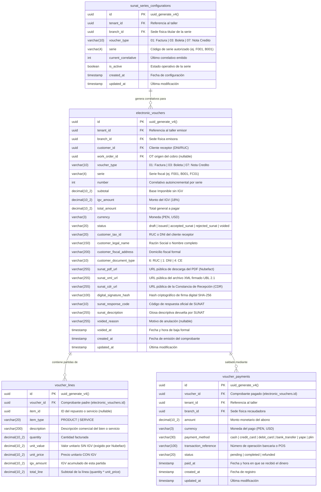

## 9. Fase 6: Bounded Context 6 — Invoicing & Compliance Context (`com.andeva.atelier.platform.invoicing`)

### 9.1. Diccionario y Propósito del Contexto

#### 9.1.1. Propósito y Límites de Responsabilidad
El **Invoicing & Compliance Context** encapsula la totalidad de las reglas contables, fiscales y tributarias exigidas por la legislación peruana bajo la supervisión de la **SUNAT (Superintendencia Nacional de Aduanas y de Administración Tributaria)**, operando bajo el estándar internacional **UBL 2.1 (Universal Business Language)**. Su delimitación responde a tres principios arquitectónicos cardinales:
1. **Aislamiento de la Complejidad Tributaria Nacional:** La normativa fiscal peruana (catálogos de afectación al IGV, detracciones, percepciones, validaciones estrictas de RUC/DNI y estructura de tramas XML firmadas digitalmente) es volátil y rígida. Si se mezclara con las órdenes de trabajo del taller (MRO) o con el catálogo de repuestos (Inventario), cualquier reforma tributaria obligaría a refactorizar todo el ERP. Este contexto encapsula dicha volatilidad, manteniendo a los demás contextos completamente limpios de conceptos fiscales.
2. **Diferenciación entre Facturación Local del Taller vs. Suscripción SaaS:** Mientras que el contexto de **SaaS Billing & Subscriptions** gestiona la recaudación recurrente que los talleres pagan a la startup *Andeva* mediante *Stripe*, el contexto de **Invoicing & Compliance** gestiona la facturación que el taller emite a sus propios clientes finales (propietarios de vehículos y flotas corporativas) por servicios mecánicos y repuestos provistos.
3. **Ciclo de Vida de Comprobantes de Pago Electrónicos (`ElectronicVoucher`):** Emite, valida y custodia comprobantes fiscales con validez legal:
   * **Factura Electrónica (Código SUNAT `01`):** Emitida exclusivamente a personas jurídicas o naturales con RUC de 11 dígitos válido que requieren sustentar costo o gasto y deducir crédito fiscal de IGV.
   * **Boleta de Venta Electrónica (Código SUNAT `03`):** Emitida a consumidores finales identificados con DNI de 8 dígitos, carné de extranjería o pasaporte (o sin documento de identidad si el monto total no supera los S/ 700.00 PEN).
   * **Nota de Crédito Electrónica (Código SUNAT `07`):** Emitida para anular operaciones comerciales previas, otorgar descuentos globales o corregir comprobantes emitidos con errores de emisión.
4. **Motor de Cálculo Tributario Peruano (`PeruvianTaxCalculationEngine`):** Centraliza la segregación matemática entre el Valor Venta / Base Imponible (`subtotal`), el Impuesto General a las Ventas (IGV 18%) y el Precio Total de Venta (`total_amount`), aplicando las fórmulas legales:
   $$\text{Base Imponible} = \frac{\text{Precio Total}}{1 + 0.18}, \quad \text{Monto IGV} = \text{Precio Total} - \text{Base Imponible}$$
   Garantiza redondeo bancario (*Half-Even*) a dos decimales por línea de detalle (`voucher_lines`) para evitar discrepancias de céntimos con los servidores de validación de SUNAT.
5. **Control de Series y Correlativos Atómicos (`SeriesConfiguration`):** Administra la numeración correlativa estricta por sucursal física (`branch_id`) y tipo de comprobante (ej. serie `F001` para facturas en la sede principal, `B001` para boletas, `FC01` para notas de crédito), impidiendo duplicidades o saltos de numeración correlativa mediante bloqueos pesimistas a nivel de base de datos relacional.
6. **Liquidación de Medios de Pago (`VoucherPayment`):** Registra los ingresos financieros asociados al comprobante electrónico (Efectivo, Tarjetas de Crédito/Débito, Transferencia Bancaria, Billeteras Digitales como Yape o Plin), controlando saldos pendientes y emitiendo el comprobante una vez acreditada la cancelación.

#### 9.1.2. Decisiones de Diseño e Integraciones Críticas
* **Capa Anticorrupción (ACL) hacia Nubefact:** En lugar de implementar un cliente UBL 2.1 monolítico con firma digital PKCS#12 y conexión directa por SOAP a los servidores de SUNAT —lo cual demandaría mantener certificados digitales tributarios por cada taller y lidiar con la frecuente intermitencia de los Web Services del Estado—, Atelier se integra con **Nubefact**, un Proveedor de Servicios Electrónicos (PSE) homologado. La ACL traduce el modelo de dominio puro de Atelier hacia el esquema JSON V1 de Nubefact, procesando de forma asíncrona las respuestas que contienen el hash digital de seguridad y los enlaces públicos a los archivos oficiales (`sunat_pdf_url`, `sunat_xml_url`, `sunat_cdr_url`).
* **Resiliencia mediante Transactional Outbox:** Si la API de Nubefact experimenta latencia o caída temporal, el comprobante se persiste localmente en la base de datos PostgreSQL en estado `ISSUED` (emitido localmente) y se encola un evento en la tabla `outbox_events`. Un worker en segundo plano reintenta el despacho con política de entrega *At-Least-Once*, garantizando que la entrega del vehículo al cliente nunca se detenga por fallos en la pasarela fiscal.
* **Desacoplamiento con MRO mediante Fachada Open Host Service (OHS):** Cuando una orden de trabajo finaliza en el contexto MRO, este emite el evento de integración `WorkOrderCompletedIntegrationEvent` o invoca `InvoicingContextFacade.generateVoucherFromWorkOrder(...)`. El contexto de facturación extrae el detalle de servicios y repuestos consumidos, aplica los cálculos fiscales y devuelve el resumen del comprobante generado sin que MRO conozca detalles del IGV o UBL 2.1.

---

### 9.2. 2.6.6.1. Domain Layer

#### 9.2.1. Aggregates & Aggregate Roots

##### 1. `ElectronicVoucher` (Aggregate Root)
* **Paquete:** `com.andeva.atelier.platform.invoicing.domain.model.aggregates`
* **Herencia:** Extiende `AbstractDomainAggregateRoot<ElectronicVoucher>`
* **Propósito:** Representa un comprobante de pago electrónico formal con validez fiscal y tributaria emitido por el taller a un cliente final.
* **Atributos:**
  * `id: VoucherId` — Identificador universal del comprobante (UUID).
  * `tenantId: TenantId` — Taller emisor del comprobante.
  * `branchId: BranchId` — Sede física emisora de la transacción.
  * `customerId: CustomerId` — Cliente receptor de la factura o boleta.
  * `workOrderId: Optional<WorkOrderId>` — Orden de trabajo de MRO que originó el cobro (nullable si es venta directa de mostrador).
  * `voucherType: VoucherType` — Tipo legal de comprobante (`FACTURA`, `BOLETA`, `NOTA_CREDITO`).
  * `serie: VoucherSerie` — Serie autorizada de 4 caracteres alfanuméricos (ej. `F001`, `B001`).
  * `number: VoucherNumber` — Correlativo numérico autoincremental único por serie.
  * `taxCalculation: TaxCalculation` — Objeto de valor que consolida la base imponible (`subtotal`), el monto total de IGV (`igvAmount`), la tasa aplicada (18%) y el total general (`totalAmount`).
  * `currency: Currency` — Moneda formal de la operación (`PEN` para Soles, `USD` para Dólares Americanos).
  * `status: VoucherStatus` — Estado del comprobante (`DRAFT`, `ISSUED`, `ACCEPTED_SUNAT`, `REJECTED_SUNAT`, `VOIDED`).
  * `customerFiscalInfo: CustomerFiscalInfo` — Datos fiscales del receptor (RUC/DNI, Razón Social/Nombre, Dirección fiscal).
  * `digitalReceiptUrls: DigitalReceiptUrls` — URLs públicas de los archivos generados por SUNAT/Nubefact (`pdfUrl`, `xmlUrl`, `cdrUrl`).
  * `sunatResponse: Optional<SunatResponse>` — Código de respuesta oficial de SUNAT, glosa descriptiva y hash SHA-256 de la firma digital.
  * `voidedInfo: Optional<VoidedInfo>` — Timestamp y motivo de anulación formal (requerido si el estado es `VOIDED`).
  * `lines: List<VoucherLine>` — Colección interna de partidas detalladas de servicios y repuestos.
  * `payments: List<VoucherPayment>` — Colección interna de pagos y transacciones registradas para saldar el comprobante.
* **Invariantes y Reglas de Negocio:**
  * Si el comprobante es `FACTURA` (`01`), el cliente debe poseer obligatoriamente un RUC de 11 dígitos válido que inicie en `10`, `15`, `17` o `20` con dígito verificador matemático correcto, y contar con Razón Social y Domicilio Fiscal.
  * Si el comprobante es `BOLETA` (`03`) y el monto total supera los S/ 700.00 PEN, el número de documento de identidad (DNI o similar) del cliente es estrictamente obligatorio según directiva de SUNAT.
  * El `totalAmount` debe ser exactamente igual a la suma de los importes de todas las líneas de detalle (`voucher_lines`).
  * La base imponible más el IGV debe cuadrar aritméticamente con el total (`subtotal + igvAmount == totalAmount`).
  * Un comprobante en estado `ACCEPTED_SUNAT` no puede ser modificado ni eliminado físicamente; solo puede ser neutralizado tributariamente emitiendo una `NOTA_CREDITO` vinculada.
* **Métodos:**
  * `+ static ElectronicVoucher issue(TenantId tenantId, BranchId branchId, CustomerId customerId, Optional<WorkOrderId> workOrderId, VoucherType type, VoucherSerie serie, VoucherNumber number, CustomerFiscalInfo customerInfo, Currency currency, List<VoucherLine> lines): ElectronicVoucher`: Factoría de dominio; calcula subtotales, valida reglas fiscales peruanas, asigna estado `ISSUED` y registra `ElectronicVoucherIssuedEvent`.
  * `+ void markAcceptedBySunat(String digitalSignatureHash, String sunatDescription, DigitalReceiptUrls urls): void`: Registra la conformidad formal devuelta por el PSE/SUNAT, actualiza el estado a `ACCEPTED_SUNAT` y registra `VoucherAcceptedBySunatEvent`.
  * `+ void markRejectedBySunat(String errorCode, String errorMessage): void`: Registra el rechazo tributario, actualiza el estado a `REJECTED_SUNAT` y registra `VoucherRejectedBySunatEvent`.
  * `+ void voidVoucher(String voidReason, Instant voidTimestamp): void`: Anula el comprobante localmente y registra `VoucherVoidedEvent`.
  * `+ VoucherPayment recordPayment(PaymentId paymentId, Money amount, PaymentMethod method, String transactionRef): VoucherPayment`: Incorpora un abono financiero al comprobante, valida que la suma de pagos no sobrepase el `totalAmount` y registra `VoucherPaymentRegisteredEvent`.
  * `+ boolean isFullyPaid(): boolean`: Evalúa si la suma aritmética de los pagos completados cubre el importe total facturado.
  * `+ Money getPendingBalance(): Money`: Retorna el saldo monetario pendiente por cobrar.

##### 2. `VoucherPayment` (Entity / Sub-Aggregate)
* **Paquete:** `com.andeva.atelier.platform.invoicing.domain.model.entities`
* **Propósito:** Representa un abono o liquidación financiera registrada contra un comprobante electrónico para saldar el consumo del taller.
* **Atributos:**
  * `id: PaymentId` — Identificador universal del pago (UUID).
  * `voucherId: VoucherId` — Comprobante electrónico asociado.
  * `tenantId: TenantId` — Taller recaudador.
  * `branchId: BranchId` — Sede física donde se recibió el dinero o transferencia.
  * `amount: Money` — Importe monetario recibido.
  * `paymentMethod: PaymentMethod` — Canal de pago (`CASH`, `CREDIT_CARD`, `DEBIT_CARD`, `BANK_TRANSFER`, `YAPE`, `PLIN`).
  * `transactionReference: String` — Número de operación bancaria, voucher POS o código de transacción (nullable para efectivo).
  * `status: PaymentStatus` — Estado del pago (`PENDING`, `COMPLETED`, `REFUNDED`).
  * `paidAt: Instant` — Timestamp exacto del ingreso financiero.
* **Invariantes y Reglas de Negocio:**
  * El monto del pago debe ser estrictamente superior a cero.
  * Si el método es transferencia bancaria o billetera digital (`YAPE`/`PLIN`), la referencia de transacción es obligatoria para conciliación de caja.

##### 3. `SeriesConfiguration` (Aggregate Root)
* **Paquete:** `com.andeva.atelier.platform.invoicing.domain.model.aggregates`
* **Herencia:** Extiende `AbstractDomainAggregateRoot<SeriesConfiguration>`
* **Propósito:** Custodia la configuración de series fiscales autorizadas y el avance correlativo estricto para una sucursal y tipo de comprobante.
* **Atributos:**
  * `id: SeriesConfigurationId` — Identificador de la configuración (UUID).
  * `tenantId: TenantId` — Taller propietario.
  * `branchId: BranchId` — Sucursal física asignada.
  * `voucherType: VoucherType` — Tipo de comprobante (`FACTURA`, `BOLETA`, `NOTA_CREDITO`).
  * `serie: VoucherSerie` — Serie autorizada (ej. `F001`, `B001`, `FC01`).
  * `currentCorrelative: int` — Último correlativo emitido.
  * `isActive: boolean` — Estado operativo de la serie.
* **Métodos:**
  * `+ static SeriesConfiguration create(TenantId tenantId, BranchId branchId, VoucherType type, VoucherSerie serie, int initialCorrelative): SeriesConfiguration`: Factoría que inicializa la serie fiscal.
  * `+ VoucherNumber nextCorrelative(): VoucherNumber`: Incrementa de forma atómica y segura el contador interno y retorna el nuevo número correlativo.

---

#### 9.2.2. Entities (Child Entities)

##### `VoucherLine` (Entity)
* **Paquete:** `com.andeva.atelier.platform.invoicing.domain.model.entities`
* **Propósito:** Partida individual que compone el comprobante de pago, representando un servicio mecánico ejecutado o un repuesto entregado.
* **Atributos:**
  * `id: UUID` — Identificador único de la línea.
  * `voucherId: VoucherId` — Identificador del comprobante padre.
  * `itemId: Optional<UUID>` — Identificador del repuesto (`InventoryItemId`) o servicio (`ServiceId`) facturado (nullable para ítems libres).
  * `itemType: VoucherItemType` — Clasificación del concepto (`PRODUCT`, `SERVICE`).
  * `description: String` — Descripción clara del bien o servicio prestado (ej. "Cambio de pastillas de freno delanteras Bosch", "Mano de obra: Afinamiento electrónico").
  * `quantity: Quantity` — Cantidad de unidades facturadas.
  * `unitValue: Money` — Valor unitario sin IGV (exigido formalmente por el estándar UBL 2.1 y la API de Nubefact).
  * `unitPrice: Money` — Precio unitario con IGV incluido.
  * `igvAmount: Money` — Monto total del IGV correspondiente a esta línea (`(unitPrice - unitValue) * quantity`).
  * `totalLine: Money` — Importe total de la línea (`quantity * unitPrice`).

---

#### 9.2.3. Value Objects

* **`VoucherId`:** Identificador universal inmutable de un comprobante (`record VoucherId(UUID value)`).
* **`PaymentId`:** Identificador inmutable de un abono (`record PaymentId(UUID value)`).
* **`SeriesConfigurationId`:** Identificador inmutable de la configuración de series (`record SeriesConfigurationId(UUID value)`).
* **`VoucherType`:** Enumeración con códigos tributarios oficiales de SUNAT (`FACTURA("01")`, `BOLETA("03")`, `NOTA_CREDITO("07")`).
* **`VoucherSerie`:** Objeto de valor que valida el formato de serie alfanumérica de 4 caracteres (`record VoucherSerie(String value)`). Valida que cumpla el patrón `^[F|B|T][A-Z0-9]{3}$`.
* **`VoucherNumber`:** Correlativo numérico positivo (`record VoucherNumber(int value)`). Valida que `value > 0`.
* **`VoucherStatus`:** Enumeración del ciclo de vida (`DRAFT`, `ISSUED`, `ACCEPTED_SUNAT`, `REJECTED_SUNAT`, `VOIDED`).
* **`TaxCalculation`:** Consolida los cálculos tributarios de la operación (`record TaxCalculation(Money subtotal, Money igvAmount, Money totalAmount, BigDecimal igvRate)`).
* **`CustomerFiscalInfo`:** Datos fiscales del receptor (`record CustomerFiscalInfo(TaxId taxId, String legalName, String fiscalAddress, DocumentType documentType)`).
* **`DigitalReceiptUrls`:** URLs públicas inmutables de los activos generados (`record DigitalReceiptUrls(String pdfUrl, String xmlUrl, String cdrUrl)`).
* **`SunatResponse`:** Metadatos de respuesta fiscal (`record SunatResponse(String responseCode, String description, String digitalSignatureHash)`).
* **`PaymentMethod`:** Medio formal de pago (`CASH`, `CREDIT_CARD`, `DEBIT_CARD`, `BANK_TRANSFER`, `DIGITAL_WALLET_YAPE`, `DIGITAL_WALLET_PLIN`).
* **`PaymentStatus`:** Situación del abono (`PENDING`, `COMPLETED`, `REFUNDED`).
* **`VoucherItemType`:** Clasificación del bien o servicio (`PRODUCT`, `SERVICE`).

---

#### 9.2.4. Domain Commands

* **`IssueElectronicVoucherCommand`:** Parámetros para emitir una factura o boleta (`TenantId tenantId, BranchId branchId, CustomerId customerId, Optional<WorkOrderId> workOrderId, VoucherType type, VoucherSerie serie, CustomerFiscalInfo customerInfo, Currency currency, List<VoucherLineItemDto> lines`).
* **`IssueCreditNoteCommand`:** Parámetros para emitir una nota de crédito vinculada (`TenantId tenantId, BranchId branchId, VoucherId referenceVoucherId, String reasonCode, String reasonDescription, List<VoucherLineItemDto> lines`).
* **`VoidElectronicVoucherCommand`:** Parámetros para anulación (`VoucherId voucherId, String reason`).
* **`RegisterVoucherPaymentCommand`:** Parámetros para asentar un pago (`VoucherId voucherId, Money amount, PaymentMethod method, String transactionReference`).
* **`ConfigureSeriesCommand`:** Parámetros para dar de alta una serie correlativa (`TenantId tenantId, BranchId branchId, VoucherType type, VoucherSerie serie, int initialCorrelative`).
* **`ProcessSunatResponseCommand`:** Parámetros para actualizar el estado tras la respuesta de Nubefact (`VoucherId voucherId, boolean accepted, String responseCode, String description, String hash, DigitalReceiptUrls urls`).

---

#### 9.2.5. Domain Queries

* **`GetVoucherByIdQuery`:** Consulta un comprobante por su identificador único (`VoucherId voucherId`).
* **`GetVoucherBySerieAndNumberQuery`:** Consulta un comprobante por su correlativo fiscal (`TenantId tenantId, VoucherSerie serie, VoucherNumber number`).
* **`ListVouchersByTenantQuery`:** Consulta el registro de ventas del taller filtrado por rango de fechas y tipo (`TenantId tenantId, Optional<VoucherType> type, LocalDate from, LocalDate to`).
* **`ListVouchersByWorkOrderQuery`:** Consulta los comprobantes emitidos para una orden de trabajo de MRO (`WorkOrderId workOrderId`).
* **`GetVoucherPaymentsQuery`:** Consulta los abonos registrados para un comprobante (`VoucherId voucherId`).
* **`GetActiveSeriesByBranchQuery`:** Consulta las series disponibles para emitir en una sede física (`BranchId branchId`).

---

#### 9.2.6. Domain Events

* **`ElectronicVoucherIssuedEvent`:** Emitido al generar el comprobante localmente y enviarlo a la cola de despacho a SUNAT (`VoucherId voucherId, TenantId tenantId, VoucherType type, VoucherSerie serie, VoucherNumber number, Money totalAmount, Instant issuedAt`).
* **`VoucherAcceptedBySunatEvent`:** Emitido al confirmarse la validez fiscal mediante el CDR de SUNAT (`VoucherId voucherId, String hash, DigitalReceiptUrls urls, Instant timestamp`).
* **`VoucherRejectedBySunatEvent`:** Emitido cuando SUNAT o el PSE detectan inconsistencias tributarias (`VoucherId voucherId, String errorCode, String errorMessage, Instant timestamp`).
* **`VoucherVoidedEvent`:** Emitido al anularse un comprobante fiscal (`VoucherId voucherId, String reason, Instant voidedAt`).
* **`VoucherPaymentRegisteredEvent`:** Emitido al registrarse un abono financiero (`PaymentId paymentId, VoucherId voucherId, Money amount, PaymentMethod method, boolean isFullyPaid`).

---

#### 9.2.7. Domain Repositories (Interfaces)

```java
package com.andeva.atelier.platform.invoicing.domain.repositories;

public interface ElectronicVoucherRepository {
    ElectronicVoucher save(ElectronicVoucher voucher);
    Optional<ElectronicVoucher> findById(VoucherId id);
    Optional<ElectronicVoucher> findByTenantIdAndSerieAndNumber(TenantId tenantId, VoucherSerie serie, VoucherNumber number);
    List<ElectronicVoucher> findAllByTenantIdAndDateRange(TenantId tenantId, LocalDate from, LocalDate to);
    List<ElectronicVoucher> findAllByWorkOrderId(WorkOrderId workOrderId);
    boolean existsByTenantIdAndSerieAndNumber(TenantId tenantId, VoucherSerie serie, VoucherNumber number);
}

public interface VoucherPaymentRepository {
    VoucherPayment save(VoucherPayment payment);
    Optional<VoucherPayment> findById(PaymentId id);
    List<VoucherPayment> findAllByVoucherId(VoucherId voucherId);
    List<VoucherPayment> findAllByBranchIdAndDate(BranchId branchId, LocalDate date);
}

public interface SeriesConfigurationRepository {
    SeriesConfiguration save(SeriesConfiguration seriesConfig);
    Optional<SeriesConfiguration> findById(SeriesConfigurationId id);
    Optional<SeriesConfiguration> findByBranchIdAndVoucherTypeAndActive(BranchId branchId, VoucherType type);
    List<SeriesConfiguration> findAllByBranchId(BranchId branchId);
}
```

---

#### 9.2.8. Domain Services

##### 1. `PeruvianTaxCalculationEngine` (Servicio de Dominio Matemático Tributario)
* **Paquete:** `com.andeva.atelier.platform.invoicing.domain.services`
* **Propósito:** Aplica las fórmulas de segregación de base imponible e IGV (18%) con redondeo legal bancario (*Half-Even* a 2 decimales) sobre cada línea y sobre el consolidado global de la factura o boleta:
```java
package com.andeva.atelier.platform.invoicing.domain.services;

import com.andeva.atelier.platform.invoicing.domain.model.valueobjects.TaxCalculation;
import com.andeva.atelier.platform.shared.domain.model.valueobjects.Money;
import org.springframework.stereotype.Service;

import java.math.BigDecimal;
import java.math.RoundingMode;

@Service
public class PeruvianTaxCalculationEngine {
    private static final BigDecimal IGV_RATE = new BigDecimal("0.18");
    private static final BigDecimal ONE_PLUS_IGV = new BigDecimal("1.18");

    public TaxCalculation calculateFromGrossTotal(Money grossTotal) {
        BigDecimal totalAmount = grossTotal.amount();
        BigDecimal subtotal = totalAmount.divide(ONE_PLUS_IGV, 2, RoundingMode.HALF_EVEN);
        BigDecimal igvAmount = totalAmount.subtract(subtotal);

        return new TaxCalculation(
                Money.of(subtotal, grossTotal.currency()),
                Money.of(igvAmount, grossTotal.currency()),
                grossTotal,
                IGV_RATE
        );
    }

    public Money extractUnitValue(Money unitPriceWithIgv) {
        BigDecimal unitValue = unitPriceWithIgv.amount().divide(ONE_PLUS_IGV, 4, RoundingMode.HALF_EVEN);
        return Money.of(unitValue.setScale(2, RoundingMode.HALF_EVEN), unitPriceWithIgv.currency());
    }
}
```

##### 2. `VoucherValidationService` (Servicio de Dominio de Validación Fiscal)
* **Paquete:** `com.andeva.atelier.platform.invoicing.domain.services`
* **Propósito:** Valida el algoritmo de comprobación del dígito verificador para RUCs peruanos (módulo 11 ponderado con pesos `[5, 4, 3, 2, 7, 6, 5, 4, 3, 2]`) y verifica que los montos de boleta que superen S/ 700.00 PEN contengan los datos formales del cliente.

---

### 9.3. 2.6.6.2. Interface Layer

#### 9.3.1. REST Controllers

##### 1. `ElectronicVouchersController`
* **Ruta Base:** `/api/v1/invoicing/vouchers`
* **Responsabilidad:** Administrar el ciclo de vida de los comprobantes electrónicos (emisión, consulta, anulación y descarga de XML/PDF/CDR).
* **Endpoints:**
  * `POST /`: Emite una nueva factura o boleta electrónica (`IssueElectronicVoucherCommand`). Despacha sincrónicamente a Nubefact o mediante Outbox resiliente. Responde `201 Created` con `ElectronicVoucherResource`.
  * `POST /credit-notes`: Emite una nota de crédito vinculada a un comprobante previo. Responde `201 Created`.
  * `GET /{id}`: Obtiene el detalle completo del comprobante con sus líneas de detalle, totales tributarios y enlaces a archivos SUNAT. Responde `200 OK`.
  * `GET /`: Lista los comprobantes del taller filtrados por rango de fechas y tipo de documento. Responde `200 OK`.
  * `GET /work-order/{workOrderId}`: Lista los comprobantes vinculados a una orden de trabajo de MRO. Responde `200 OK`.
  * `POST /{id}/void`: Anula formalmente el comprobante ante SUNAT comunicando el motivo de baja. Responde `200 OK`.

##### 2. `VoucherPaymentsController`
* **Ruta Base:** `/api/v1/invoicing/payments`
* **Responsabilidad:** Registro de abonos y conciliación de caja por comprobante.
* **Endpoints:**
  * `POST /`: Asienta un pago contra un comprobante electrónico (`RegisterVoucherPaymentCommand`). Responde `201 Created` con `VoucherPaymentResource`.
  * `GET /voucher/{voucherId}`: Lista los pagos registrados para una factura o boleta específica. Responde `200 OK`.
  * `GET /branch/{branchId}/daily`: Reporte de cobros diarios por sucursal física. Responde `200 OK`.

##### 3. `SeriesConfigurationController`
* **Ruta Base:** `/api/v1/invoicing/series`
* **Responsabilidad:** Configuración de correlativos autorizados por sede.
* **Endpoints:**
  * `POST /`: Configura una nueva serie fiscal para una sucursal (`ConfigureSeriesCommand`). Responde `201 Created`.
  * `GET /branch/{branchId}`: Lista las series activas configuradas para la sucursal. Responde `200 OK`.

##### 4. `FinancialReportsController`
* **Ruta Base:** `/api/v1/invoicing/reports`
* **Responsabilidad:** Generación de balances de caja y estados de movimientos consolidados del taller (*Cash Flow & Movements Statement*), agregando transaccionalmente los cobros a clientes y los egresos operativos por compras de repuestos y sueldos de colaboradores.
* **Endpoints:**
  * `GET /cash-flow`: Consulta el estado de movimientos financieros en formato estructurado JSON (`CashFlowReportResource`) para renderizado interactivo en el Frontend.
    - Parámetros de consulta: `startDate` (requerido, `LocalDate`), `endDate` (requerido, `LocalDate`), `branchId` (opcional, `UUID`).
    - Unifica cronológicamente: $(+)$ Pagos cobrados en taller (`voucher_payments`), $(-)$ Facturas de compra de repuestos a proveedores (`purchase_orders` recibidas), y $(-)$ Nóminas desembolsadas a colaboradores (`payroll_payments`).
    - Retorna el balance de ingresos, egresos y el flujo neto del periodo. Responde `200 OK`.
  * `GET /cash-flow/pdf`: Genera y descarga el informe oficial en PDF formateado como un estado de cuenta bancario corporativo. Compila la cabecera institucional del taller, el resumen financiero ejecutivo, la tabla cronológica detallada de movimientos (Fecha, Concepto, Categoría, Tipo, Monto, Saldo progresivo) y los totales consolidados. Responde `200 OK` con cabecera `Content-Disposition: attachment; filename="cash-flow-{startDate}-{endDate}.pdf"`.

---

#### 9.3.2. REST Resources & DTOs (Records)

```java
package com.andeva.atelier.platform.invoicing.interfaces.rest.resources;

public record IssueVoucherRequest(
    @NotNull UUID branchId,
    @NotNull UUID customerId,
    UUID workOrderId,
    @NotBlank String voucherType, // FACTURA, BOLETA
    @NotBlank String serie,       // F001, B001
    @NotNull CustomerFiscalInfoDto customerInfo,
    @NotBlank String currency,    // PEN, USD
    @NotEmpty List<VoucherLineRequest> lines
) {}

public record VoucherLineRequest(
    UUID itemId,
    @NotBlank String itemType, // PRODUCT, SERVICE
    @NotBlank String description,
    @NotNull BigDecimal quantity,
    @NotNull BigDecimal unitPriceWithIgv
) {}

public record CustomerFiscalInfoDto(
    @NotBlank String taxId,
    @NotBlank String legalName,
    @NotBlank String fiscalAddress,
    @NotBlank String documentType // DNI, RUC, CE
) {}

public record RegisterPaymentRequest(
    @NotNull UUID voucherId,
    @NotNull BigDecimal amount,
    @NotBlank String currency,
    @NotBlank String paymentMethod,
    String transactionReference
) {}

public record ElectronicVoucherResource(
    UUID id,
    UUID tenantId,
    UUID branchId,
    UUID customerId,
    UUID workOrderId,
    String voucherType,
    String serie,
    int number,
    BigDecimal subtotal,
    BigDecimal igvAmount,
    BigDecimal totalAmount,
    String currency,
    String status,
    CustomerFiscalInfoDto customerInfo,
    DigitalReceiptUrlsDto digitalReceipts,
    SunatResponseDto sunatResponse,
    List<VoucherLineResource> lines,
    List<VoucherPaymentResource> payments,
    Instant issuedAt
) {}

public record VoucherLineResource(
    UUID id,
    String itemType,
    String description,
    BigDecimal quantity,
    BigDecimal unitValue,
    BigDecimal unitPrice,
    BigDecimal igvAmount,
    BigDecimal totalLine
) {}

public record DigitalReceiptUrlsDto(
    String pdfUrl,
    String xmlUrl,
    String cdrUrl
) {}

public record SunatResponseDto(
    String responseCode,
    String description,
    String digitalSignatureHash
) {}

public record VoucherPaymentResource(
    UUID id,
    UUID voucherId,
    BigDecimal amount,
    String currency,
    String paymentMethod,
    String transactionReference,
    String status,
    Instant paidAt
) {}

public record CashFlowReportResource(
    UUID tenantId,
    UUID branchId,
    LocalDate startDate,
    LocalDate endDate,
    BigDecimal totalIncome,
    BigDecimal totalExpenses,
    BigDecimal netCashFlow,
    String currency,
    List<CashFlowMovementResource> movements
) {}

public record CashFlowMovementResource(
    UUID transactionId,
    Instant movementDate,
    String type, // INCOME o EXPENSE
    String category, // CLIENT_PAYMENT, SPARE_PARTS_PURCHASE, STAFF_PAYROLL
    String concept,
    String referenceNumber,
    BigDecimal amount,
    BigDecimal runningBalance
) {}
```

---

#### 9.3.3. REST Assemblers (Mappers)

* **`ElectronicVoucherResourceAssembler`:** Mapea el agregado `ElectronicVoucher`, sus líneas de detalle, pagos y metadatos de SUNAT hacia el DTO `ElectronicVoucherResource`.
* **`VoucherPaymentResourceAssembler`:** Transforma entidades `VoucherPayment` a `VoucherPaymentResource`.

---

#### 9.3.4. Inbound ACL Facade (Open Host Service - OHS)

Para permitir que el contexto de Operaciones de Taller (MRO) facture órdenes de trabajo sin acoplarse a detalles fiscales de SUNAT, Invoicing expone su fachada canónica:

```java
package com.andeva.atelier.platform.invoicing.interfaces.acl;

import java.math.BigDecimal;
import java.util.List;
import java.util.Optional;
import java.util.UUID;

public interface InvoicingContextFacade {
    /**
     * Utilizado por Workshop Operations (MRO) para liquidar una Orden de Trabajo.
     * Genera el comprobante electrónico formal a partir de las tareas y repuestos consumidos.
     */
    VoucherGenerationResultDto generateVoucherFromWorkOrder(GenerateVoucherFromWorkOrderCommandDto command);

    /**
     * Consulta el resumen de comprobantes emitidos para una orden de trabajo.
     */
    List<VoucherSummaryDto> getVouchersByWorkOrderId(UUID workOrderId);

    /**
     * Verifica si una orden de trabajo se encuentra 100% facturada y pagada.
     */
    boolean isWorkOrderFullySettled(UUID workOrderId);
}

public record GenerateVoucherFromWorkOrderCommandDto(
    UUID tenantId,
    UUID branchId,
    UUID workOrderId,
    UUID customerId,
    String voucherType, // FACTURA o BOLETA
    String customerTaxId,
    String customerLegalName,
    String customerFiscalAddress,
    String currency,
    List<WorkOrderItemBillingDto> items
) {}

public record WorkOrderItemBillingDto(
    UUID itemId,
    String itemType, // PRODUCT o SERVICE
    String description,
    BigDecimal quantity,
    BigDecimal unitPriceWithIgv
) {}

public record VoucherGenerationResultDto(
    UUID voucherId,
    String fullVoucherNumber, // Ej. "F001-000142"
    BigDecimal totalAmount,
    String status,
    String pdfUrl
) {}

public record VoucherSummaryDto(
    UUID voucherId,
    String fullVoucherNumber,
    String voucherType,
    BigDecimal totalAmount,
    String status,
    boolean isFullyPaid
) {}
```

---

#### 9.3.5. Integration Events (Published / Consumed)

##### 1. Eventos Publicados por Invoicing hacia otros Bounded Contexts
* **`ElectronicVoucherIssuedIntegrationEvent`:** Emitido al crearse una factura o boleta con valor fiscal. Consumido por MRO para actualizar el estado contable de la orden de trabajo.
* **`VoucherAcceptedBySunatIntegrationEvent`:** Emitido tras la recepción del CDR aprobatorio de SUNAT. Consumido por el módulo de notificaciones para despachar el correo con PDF y XML al cliente vía Resend.
* **`VoucherPaymentReceivedIntegrationEvent`:** Emitido al liquidarse un abono monetario. Consumido por MRO para validar la entrega definitiva del vehículo en patio.

##### 2. Eventos Consumidos por Invoicing desde otros Bounded Contexts
* **`WorkOrderDeliveredIntegrationEvent` (emitido por MRO):** Habilita la liquidación final y emite una alerta contable si la orden no ha sido facturada.

---

### 9.4. 2.6.6.3. Application Layer

#### 9.4.1. Command Services (Handlers)

##### 1. `ElectronicVoucherCommandServiceImpl`
* **Responsabilidad:** Orquestar la emisión y ciclo de vida de los comprobantes electrónicos:
  1. Valida la existencia del cliente y recupera sus datos fiscales a través de `CustomerAclService`.
  2. Recupera la serie fiscal activa de la sucursal (`branch_id`) y reserva el correlativo numérico atómico mediante `SeriesConfigurationRepository`.
  3. Ejecuta `PeruvianTaxCalculationEngine` para desglosar la base imponible y el IGV (18%) de cada partida.
  4. Valida invariantes de dominio (consistencia de RUC/DNI y sumatoria exacta de líneas).
  5. Crea el agregado `ElectronicVoucher` en estado `ISSUED`.
  6. Persiste el agregado en PostgreSQL dentro de la transacción ACID local.
  7. Invoca al servicio outbound ACL `NubefactAclService` para despachar la trama a SUNAT.
  8. Si la llamada a Nubefact responde de forma sincrónica, actualiza el agregado con el hash digital y URLs de PDF/XML/CDR llamando a `voucher.markAcceptedBySunat(...)`. Si la API externa experimenta indisponibilidad, el registro permanece encolado en el Transactional Outbox para despacho asíncrono.
  9. Publica los eventos de dominio resultantes.

##### 2. `VoucherPaymentCommandServiceImpl`
* **Responsabilidad:** Registrar abonos financieros contra el comprobante y verificar si se ha alcanzado la cancelación total (`isFullyPaid`), emitiendo el evento de integración correspondiente.

##### 3. `SeriesConfigurationCommandServiceImpl`
* **Responsabilidad:** Parametrizar series fiscales y administrar correlativos correlacionados con SUNAT.

---

#### 9.4.2. Query Services (Handlers)

* **`ElectronicVoucherQueryServiceImpl`:** Resuelve consultas de catálogo de comprobantes, búsquedas por correlativo (`serie-number`), auditoría de ventas mensuales y descargas de activos tributarios.
* **`VoucherPaymentQueryServiceImpl`:** Consulta los abonos de comprobantes y cuadres de caja diarios por sucursal física.
* **`CashFlowQueryServiceImpl`:** Orquesta la consolidación analítica del estado de cuenta y flujo de caja del taller (*Cash Flow & Movements Statement*):
  1. Recupera cronológicamente los ingresos por cobros de órdenes de trabajo asentados en `voucher_payments`.
  2. Consulta a través de `InventoryContextFacade` las facturas de adquisición de repuestos asentadas en `purchase_orders` en estado `RECEIVED`.
  3. Consulta a través de `HumanResourcesContextFacade` las nóminas liquidadas y pagadas en `payroll_payments` en estado `PAID`.
  4. Realiza un `UNION` temporal en memoria ordenando por fecha ascendente (`movementDate ASC`).
  5. Computa secuencialmente el saldo progresivo acumulado: $\text{Saldo}_i = \text{Saldo}_{i-1} + \text{Ingreso}_i - \text{Egreso}_i$.
  6. Calcula $\text{Total Ingresos}$, $\text{Total Egresos}$ y $\text{Flujo Neto del Periodo}$.
  7. Genera la representación documental en PDF con diseño bancario corporativo (cabecera con RUC y taller, resumen ejecutivo y tabla de movimientos), excluyendo costos fijos indirectos ajenos al flujo directo de taller (luz, agua, alquiler).

---

#### 9.4.3. Domain Event Handlers

* **`VoucherDomainEventHandler`:**
  * Al recibir `VoucherAcceptedBySunatEvent`: Invoca a `ResendEmailAdapter` para despachar automáticamente un correo electrónico transaccional al cliente adjuntando el PDF oficial y el XML UBL 2.1 firmado con validez tributaria.
  * Al recibir `VoucherPaymentRegisteredEvent`: Si el comprobante está asociado a una orden de trabajo (`workOrderId`) y `isFullyPaid == true`, notifica al contexto MRO que el vehículo está financieramente liberado para salida del taller.

---

#### 9.4.4. Outbound ACL Services & Remote Adapters

##### `NubefactAclService`
* **Paquete:** `com.andeva.atelier.platform.invoicing.application.internal.outboundservices.acl`
* **Propósito:** Capa Anticorrupción que traduce el agregado de dominio `ElectronicVoucher` hacia la estructura JSON V1 exigida por la API de Nubefact, y viceversa:
```java
package com.andeva.atelier.platform.invoicing.application.internal.outboundservices.acl;

import com.andeva.atelier.platform.invoicing.domain.model.aggregates.ElectronicVoucher;
import com.andeva.atelier.platform.invoicing.domain.model.valueobjects.DigitalReceiptUrls;
import com.andeva.atelier.platform.invoicing.infrastructure.gateways.NubefactFiscalGateway;
import org.springframework.stereotype.Service;

@Service
public class NubefactAclService {
    private final NubefactFiscalGateway nubefactFiscalGateway;

    public NubefactAclService(NubefactFiscalGateway nubefactFiscalGateway) {
        this.nubefactFiscalGateway = nubefactFiscalGateway;
    }

    public NubefactDispatchResult dispatchVoucher(ElectronicVoucher voucher) {
        var request = NubefactPayloadMapper.toNubefactRequest(voucher);
        var response = nubefactFiscalGateway.sendInvoice(request);

        if (response.aceptadaPorSunat()) {
            return new NubefactDispatchResult(
                    true,
                    response.codigoRespuesta(),
                    response.descripcionSunat(),
                    response.codigoHash(),
                    new DigitalReceiptUrls(response.enlacePdf(), response.enlaceXml(), response.enlaceCdr())
            );
        } else {
            return new NubefactDispatchResult(
                    false,
                    response.codigoRespuesta(),
                    response.descripcionSunat(),
                    null,
                    null
            );
        }
    }
}

public record NubefactDispatchResult(
    boolean isAccepted,
    String responseCode,
    String description,
    String digitalSignatureHash,
    DigitalReceiptUrls urls
) {}
```

---

### 9.5. 2.6.6.4. Infrastructure Layer

#### 9.5.1. JPA Entities

##### 1. `ElectronicVoucherJpaEntity`
* **Tabla Relacional:** `electronic_vouchers`
* **Mapeo:**
```java
package com.andeva.atelier.platform.invoicing.infrastructure.persistence.jpa.entities;

import com.andeva.atelier.platform.shared.infrastructure.persistence.jpa.entities.AuditableAbstractPersistenceEntity;
import jakarta.persistence.*;
import java.math.BigDecimal;
import java.time.Instant;
import java.util.ArrayList;
import java.util.List;
import java.util.UUID;

@Entity
@Table(name = "electronic_vouchers", uniqueConstraints = {
    @UniqueConstraint(name = "uk_vouchers_tenant_serie_number", columnNames = {"tenant_id", "serie", "number"})
}, indexes = {
    @Index(name = "idx_vouchers_tenant_created", columnList = "tenant_id, created_at"),
    @Index(name = "idx_vouchers_work_order", columnList = "work_order_id"),
    @Index(name = "idx_vouchers_customer", columnList = "customer_id")
})
public class ElectronicVoucherJpaEntity extends AuditableAbstractPersistenceEntity {
    @Id
    @Column(name = "id", nullable = false, updatable = false)
    private UUID id;

    @Column(name = "tenant_id", nullable = false, updatable = false)
    private UUID tenantId;

    @Column(name = "branch_id", nullable = false, updatable = false)
    private UUID branchId;

    @Column(name = "customer_id", nullable = false, updatable = false)
    private UUID customerId;

    @Column(name = "work_order_id")
    private UUID workOrderId;

    @Column(name = "voucher_type", nullable = false, length = 10)
    private String voucherType;

    @Column(name = "serie", nullable = false, length = 4)
    private String serie;

    @Column(name = "number", nullable = false)
    private int number;

    @Column(name = "subtotal", nullable = false, precision = 10, scale = 2)
    private BigDecimal subtotal;

    @Column(name = "igv_amount", nullable = false, precision = 10, scale = 2)
    private BigDecimal igvAmount;

    @Column(name = "total_amount", nullable = false, precision = 10, scale = 2)
    private BigDecimal totalAmount;

    @Column(name = "currency", nullable = false, length = 3)
    private String currency = "PEN";

    @Column(name = "status", nullable = false, length = 20)
    private String status;

    @Column(name = "customer_tax_id", nullable = false, length = 20)
    private String customerTaxId;

    @Column(name = "customer_legal_name", nullable = false, length = 150)
    private String customerLegalName;

    @Column(name = "customer_fiscal_address", nullable = false, length = 200)
    private String customerFiscalAddress;

    @Column(name = "customer_document_type", nullable = false, length = 10)
    private String customerDocumentType;

    @Column(name = "sunat_pdf_url", length = 255)
    private String sunatPdfUrl;

    @Column(name = "sunat_xml_url", length = 255)
    private String sunatXmlUrl;

    @Column(name = "sunat_cdr_url", length = 255)
    private String sunatCdrUrl;

    @Column(name = "digital_signature_hash", length = 100)
    private String digitalSignatureHash;

    @Column(name = "sunat_response_code", length = 10)
    private String sunatResponseCode;

    @Column(name = "sunat_description", length = 255)
    private String sunatDescription;

    @Column(name = "voided_reason", length = 255)
    private String voidedReason;

    @Column(name = "voided_at")
    private Instant voidedAt;

    @OneToMany(mappedBy = "voucher", cascade = CascadeType.ALL, orphanRemoval = true, fetch = FetchType.LAZY)
    private List<VoucherLineJpaEntity> lines = new ArrayList<>();

    @OneToMany(mappedBy = "voucher", cascade = CascadeType.ALL, orphanRemoval = true, fetch = FetchType.LAZY)
    private List<VoucherPaymentJpaEntity> payments = new ArrayList<>();

    // Getters y Setters JPA
}
```

##### 2. `VoucherLineJpaEntity`
* **Tabla Relacional:** `voucher_lines`
* **Mapeo:**
```java
package com.andeva.atelier.platform.invoicing.infrastructure.persistence.jpa.entities;

import jakarta.persistence.*;
import java.math.BigDecimal;
import java.util.UUID;

@Entity
@Table(name = "voucher_lines")
public class VoucherLineJpaEntity {
    @Id
    @Column(name = "id", nullable = false, updatable = false)
    private UUID id;

    @ManyToOne(fetch = FetchType.LAZY)
    @JoinColumn(name = "voucher_id", nullable = false)
    private ElectronicVoucherJpaEntity voucher;

    @Column(name = "item_id")
    private UUID itemId;

    @Column(name = "item_type", nullable = false, length = 20)
    private String itemType;

    @Column(name = "description", nullable = false, length = 200)
    private String description;

    @Column(name = "quantity", nullable = false, precision = 10, scale = 2)
    private BigDecimal quantity;

    @Column(name = "unit_value", nullable = false, precision = 10, scale = 2)
    private BigDecimal unitValue;

    @Column(name = "unit_price", nullable = false, precision = 10, scale = 2)
    private BigDecimal unitPrice;

    @Column(name = "igv_amount", nullable = false, precision = 10, scale = 2)
    private BigDecimal igvAmount;

    @Column(name = "total_line", nullable = false, precision = 10, scale = 2)
    private BigDecimal totalLine;

    // Getters y Setters JPA
}
```

##### 3. `VoucherPaymentJpaEntity`
* **Tabla Relacional:** `voucher_payments`
* **Mapeo:**
```java
package com.andeva.atelier.platform.invoicing.infrastructure.persistence.jpa.entities;

import com.andeva.atelier.platform.shared.infrastructure.persistence.jpa.entities.AuditableAbstractPersistenceEntity;
import jakarta.persistence.*;
import java.math.BigDecimal;
import java.time.Instant;
import java.util.UUID;

@Entity
@Table(name = "voucher_payments", indexes = {
    @Index(name = "idx_payments_voucher", columnList = "voucher_id"),
    @Index(name = "idx_payments_branch_date", columnList = "branch_id, paid_at")
})
public class VoucherPaymentJpaEntity extends AuditableAbstractPersistenceEntity {
    @Id
    @Column(name = "id", nullable = false, updatable = false)
    private UUID id;

    @ManyToOne(fetch = FetchType.LAZY)
    @JoinColumn(name = "voucher_id", nullable = false)
    private ElectronicVoucherJpaEntity voucher;

    @Column(name = "tenant_id", nullable = false, updatable = false)
    private UUID tenantId;

    @Column(name = "branch_id", nullable = false, updatable = false)
    private UUID branchId;

    @Column(name = "amount", nullable = false, precision = 10, scale = 2)
    private BigDecimal amount;

    @Column(name = "currency", nullable = false, length = 3)
    private String currency = "PEN";

    @Column(name = "payment_method", nullable = false, length = 30)
    private String paymentMethod;

    @Column(name = "transaction_reference", length = 100)
    private String transactionReference;

    @Column(name = "status", nullable = false, length = 20)
    private String status;

    @Column(name = "paid_at", nullable = false)
    private Instant paidAt;

    // Getters y Setters JPA
}
```

##### 4. `SeriesConfigurationJpaEntity`
* **Tabla Relacional:** `sunat_series_configurations`
* **Mapeo:**
```java
package com.andeva.atelier.platform.invoicing.infrastructure.persistence.jpa.entities;

import com.andeva.atelier.platform.shared.infrastructure.persistence.jpa.entities.AuditableAbstractPersistenceEntity;
import jakarta.persistence.*;
import java.util.UUID;

@Entity
@Table(name = "sunat_series_configurations", uniqueConstraints = {
    @UniqueConstraint(name = "uk_series_branch_type_serie", columnNames = {"branch_id", "voucher_type", "serie"})
})
public class SeriesConfigurationJpaEntity extends AuditableAbstractPersistenceEntity {
    @Id
    @Column(name = "id", nullable = false, updatable = false)
    private UUID id;

    @Column(name = "tenant_id", nullable = false, updatable = false)
    private UUID tenantId;

    @Column(name = "branch_id", nullable = false, updatable = false)
    private UUID branchId;

    @Column(name = "voucher_type", nullable = false, length = 10)
    private String voucherType;

    @Column(name = "serie", nullable = false, length = 4)
    private String serie;

    @Column(name = "current_correlative", nullable = false)
    private int currentCorrelative;

    @Column(name = "is_active", nullable = false)
    private boolean isActive = true;

    // Getters y Setters JPA
}
```

---

#### 9.5.2. Spring Data JPA Repositories

```java
package com.andeva.atelier.platform.invoicing.infrastructure.persistence.jpa.repositories;

public interface SpringDataElectronicVoucherRepository extends JpaRepository<ElectronicVoucherJpaEntity, UUID> {
    Optional<ElectronicVoucherJpaEntity> findByTenantIdAndSerieAndNumber(UUID tenantId, String serie, int number);
    List<ElectronicVoucherJpaEntity> findAllByWorkOrderId(UUID workOrderId);

    @Query("SELECT v FROM ElectronicVoucherJpaEntity v WHERE v.tenantId = :tenantId AND v.createdAt >= :from AND v.createdAt <= :to ORDER BY v.createdAt DESC")
    List<ElectronicVoucherJpaEntity> findAllByTenantAndDateRange(@Param("tenantId") UUID tenantId, @Param("from") Instant from, @Param("to") Instant to);
}

public interface SpringDataVoucherPaymentRepository extends JpaRepository<VoucherPaymentJpaEntity, UUID> {
    List<VoucherPaymentJpaEntity> findAllByVoucherId(UUID voucherId);

    @Query("SELECT p FROM VoucherPaymentJpaEntity p WHERE p.branchId = :branchId AND p.paidAt >= :dayStart AND p.paidAt <= :dayEnd ORDER BY p.paidAt DESC")
    List<VoucherPaymentJpaEntity> findAllByBranchAndDate(@Param("branchId") UUID branchId, @Param("dayStart") Instant dayStart, @Param("dayEnd") Instant dayEnd);
}

public interface SpringDataSeriesConfigurationRepository extends JpaRepository<SeriesConfigurationJpaEntity, UUID> {
    @Lock(LockModeType.PESSIMISTIC_WRITE)
    @Query("SELECT s FROM SeriesConfigurationJpaEntity s WHERE s.branchId = :branchId AND s.voucherType = :voucherType AND s.isActive = true")
    Optional<SeriesConfigurationJpaEntity> findActiveForUpdate(@Param("branchId") UUID branchId, @Param("voucherType") String voucherType);

    List<SeriesConfigurationJpaEntity> findAllByBranchId(UUID branchId);
}
```

---

#### 9.5.3. Repository Implementations & Adapters

* **`ElectronicVoucherRepositoryImpl`:** Adapta `SpringDataElectronicVoucherRepository` hacia `ElectronicVoucherRepository`, utilizando `ElectronicVoucherPersistenceAssembler` y sincronizando cascadas de líneas y pagos.
* **`VoucherPaymentRepositoryImpl`:** Adapta `SpringDataVoucherPaymentRepository` hacia `VoucherPaymentRepository`.
* **`SeriesConfigurationRepositoryImpl`:** Adapta `SpringDataSeriesConfigurationRepository` hacia `SeriesConfigurationRepository`, aplicando bloqueo pesimista en base de datos para garantizar correlatividad atómica estricta sin condiciones de carrera.

---

#### 9.5.4. Persistence Assemblers & Data Mappers

* **`ElectronicVoucherPersistenceAssembler`:** Mapea bidireccionalmente el agregado `ElectronicVoucher` hacia `ElectronicVoucherJpaEntity`, reconstruyendo objetos de valor (`VoucherSerie`, `TaxCalculation`, `CustomerFiscalInfo`, `DigitalReceiptUrls`).
* **`VoucherPaymentPersistenceAssembler`:** Convierte entre entidades de dominio y persistencia de pagos.
* **`SeriesConfigurationPersistenceAssembler`:** Transforma configuraciones de series numéricas.

---

#### 9.5.5. JPA Attribute Converters

* **`VoucherTypeConverter`:** Mapea el enum `VoucherType` hacia el código formal de SUNAT (`VARCHAR(10)`: `01`, `03`, `07`).
* **`VoucherStatusConverter`:** Mapea el enum `VoucherStatus` hacia `VARCHAR(20)`.
* **`PaymentMethodConverter`:** Mapea el enum `PaymentMethod` hacia `VARCHAR(30)`.

---

#### 9.5.6. External Gateways & Fiscal Adapters

##### `NubefactFiscalGatewayImpl`
* **Paquete:** `com.andeva.atelier.platform.invoicing.infrastructure.gateways`
* **Propósito:** Cliente HTTP implementado con Spring `WebClient` para comunicación segura contra la API RESTful JSON V1 de Nubefact.
* **Mecanismos de Resiliencia y Seguridad:**
  * Inyección del Token de Autorización Bearer de Nubefact mediante cabecera HTTP `Authorization: Bearer ${NUBEFACT_TOKEN}`.
  * Timeout de conexión de 5 segundos y timeout de lectura de 15 segundos.
  * Reintentos automáticos ante errores transitorios de red (`502 Bad Gateway`, `503 Service Unavailable`) con backoff exponencial.

---

### 9.6. 2.6.6.5. Bounded Context Component Level Diagram

El siguiente diagrama C4 Component Model detalla los controladores, servicios de aplicación, agregados de dominio, servicios matemáticos tributarios y adaptadores de infraestructura que componen el **Invoicing & Compliance Context**:

```mermaid
C4Component
    title Component Diagram - Invoicing & Compliance Context (com.andeva.atelier.platform.invoicing)

    Container_Boundary(inv_boundary, "Invoicing & Compliance Context")
        Component(vouchers_ctrl, "ElectronicVouchersController", "Spring REST Controller", "Expone endpoints para emisión, consulta y anulación de comprobantes")
        Component(payments_ctrl, "VoucherPaymentsController", "Spring REST Controller", "Expone endpoints para registro de abonos y cuadres de caja")
        Component(series_ctrl, "SeriesConfigurationController", "Spring REST Controller", "Expone endpoints para configuración de series fiscales")

        Component(inv_facade, "InvoicingContextFacade", "Spring Service (OHS)", "Fachada inbound para que MRO liquide órdenes de trabajo")

        Component(voucher_cmd, "ElectronicVoucherCommandService", "Application Service", "Orquesta emisión, desglose de IGV, persistencia y despacho a Nubefact")
        Component(payment_cmd, "VoucherPaymentCommandService", "Application Service", "Orquesta registro de abonos y liberación financiera")
        Component(series_cmd, "SeriesConfigurationCommandService", "Application Service", "Administra correlativos fiscales atómicos")

        Component(tax_engine, "PeruvianTaxCalculationEngine", "Domain Service", "Calcula base imponible, IGV (18%) y redondeo bancario Half-Even")
        Component(val_service, "VoucherValidationService", "Domain Service", "Valida RUC módulo 11, DNI y topes de boletas")

        Component(nubefact_acl, "NubefactAclService", "Application ACL Service", "Traduce agregados hacia la trama JSON V1 de Nubefact")
        Component(customer_acl, "CustomerAclService", "Application ACL Service", "Consume CRM para verificar datos fiscales de clientes")

        Component(voucher_repo, "ElectronicVoucherRepositoryImpl", "Spring Data JPA Adapter", "Persiste facturas y boletas en electronic_vouchers y voucher_lines")
        Component(payment_repo, "VoucherPaymentRepositoryImpl", "Spring Data JPA Adapter", "Persiste abonos en voucher_payments")
        Component(series_repo, "SeriesConfigurationRepositoryImpl", "Spring Data JPA Adapter", "Persiste series en sunat_series_configurations con lock pesimista")

        Component(nubefact_gw, "NubefactFiscalGatewayImpl", "Spring WebClient Gateway", "Despacha peticiones HTTPS firmadas a la API de Nubefact")
    End_Container_Boundary

    Container_Boundary(crm_context, "Customer & Fleet Context (CRM)")
        Component(crm_facade, "CustomerContextFacade", "Interface Facade", "Provee RUC, DNI, Razón Social y Domicilio Fiscal")
    End_Container_Boundary

    Container_Boundary(mro_context, "Workshop Operations Context")
        Component(mro_service, "WorkOrderDeliveryService", "Application Service", "Liquida órdenes de trabajo finalizadas")
    End_Container_Boundary

    System_Ext(nubefact_api, "Nubefact API RESTful JSON V1", "Proveedor de Servicios Electrónicos (PSE) homologado por SUNAT")
    ContainerDb(postgres_db, "PostgreSQL 16 Relational DB", "Aiven Cloud", "Tablas electronic_vouchers, voucher_lines, voucher_payments, sunat_series_configurations")

    Rel(vouchers_ctrl, voucher_cmd, "Delega comandos de facturación", "Java Calls")
    Rel(payments_ctrl, payment_cmd, "Delega abonos de pago", "Java Calls")
    Rel(series_ctrl, series_cmd, "Delega correlativos", "Java Calls")

    Rel(mro_service, inv_facade, "generateVoucherFromWorkOrder()", "Java In-Process")
    Rel(inv_facade, voucher_cmd, "Emite factura/boleta para OT", "Java Calls")

    Rel(voucher_cmd, customer_acl, "Valida datos fiscales", "In-Process ACL")
    Rel(customer_acl, crm_facade, "findCustomerFiscalInfo()", "Java Calls")

    Rel(voucher_cmd, tax_engine, "Calcula base imponible e IGV", "In-Memory Math")
    Rel(voucher_cmd, val_service, "Valida RUC/DNI", "Domain Rules")
    Rel(voucher_cmd, series_repo, "Reserva siguiente correlativo atómico", "Pessimistic Lock")

    Rel(voucher_cmd, nubefact_acl, "Despacha comprobante a PSE", "Java Calls")
    Rel(nubefact_acl, nubefact_gw, "Envía trama JSON estructurada", "Java Calls")
    Rel(nubefact_gw, nubefact_api, "POST /api/v1/invoice/generate (HTTPS 443)", "REST JSON")

    Rel(voucher_cmd, voucher_repo, "Guarda agregados ElectronicVoucher", "JPA")
    Rel(payment_cmd, payment_repo, "Guarda agregados VoucherPayment", "JPA")
    Rel(series_cmd, series_repo, "Guarda series fiscales", "JPA")

    Rel(voucher_repo, postgres_db, "Lee/Escribe en electronic_vouchers y lines", "JDBC")
    Rel(payment_repo, postgres_db, "Lee/Escribe en voucher_payments", "JDBC")
    Rel(series_repo, postgres_db, "Lee/Escribe en sunat_series_configurations", "JDBC")
```

---

### 9.7. 2.6.6.6. Code Level Diagrams

#### 9.7.1. 2.6.6.6.1. Domain Class Diagram (UML Class Model in Mermaid)

El siguiente diagrama de clases UML modela la estructura de agregados, entidades, objetos de valor, servicios de dominio y repositorios del **Invoicing & Compliance Context**:

```mermaid
classDiagram
    direction TB

    class AbstractDomainAggregateRoot~T~ {
        <<Abstract>>
        #List~Object~ domainEvents
        +registerEvent(Object event) void
        +clearDomainEvents() void
        +getDomainEvents() List~Object~
    }

    class ElectronicVoucher {
        <<Aggregate Root>>
        -VoucherId id
        -TenantId tenantId
        -BranchId branchId
        -CustomerId customerId
        -Optional~WorkOrderId~ workOrderId
        -VoucherType voucherType
        -VoucherSerie serie
        -VoucherNumber number
        -TaxCalculation taxCalculation
        -Currency currency
        -VoucherStatus status
        -CustomerFiscalInfo customerFiscalInfo
        -DigitalReceiptUrls digitalReceiptUrls
        -Optional~SunatResponse~ sunatResponse
        -Optional~VoidedInfo~ voidedInfo
        -List~VoucherLine~ lines
        -List~VoucherPayment~ payments
        +issue(tenantId, branchId, customerId, workOrderId, type, serie, number, customerInfo, currency, lines) ElectronicVoucher$
        +markAcceptedBySunat(hash, description, urls) void
        +markRejectedBySunat(errorCode, errorMessage) void
        +voidVoucher(reason, timestamp) void
        +recordPayment(paymentId, amount, method, ref) VoucherPayment
        +isFullyPaid() boolean
        +getPendingBalance() Money
    }

    class VoucherPayment {
        <<Aggregate Root / Entity>>
        -PaymentId id
        -VoucherId voucherId
        -TenantId tenantId
        -BranchId branchId
        -Money amount
        -PaymentMethod paymentMethod
        -String transactionReference
        -PaymentStatus status
        -Instant paidAt
    }

    class SeriesConfiguration {
        <<Aggregate Root>>
        -SeriesConfigurationId id
        -TenantId tenantId
        -BranchId branchId
        -VoucherType voucherType
        -VoucherSerie serie
        -int currentCorrelative
        -boolean isActive
        +create(tenantId, branchId, type, serie, initialCorrelative) SeriesConfiguration$
        +nextCorrelative() VoucherNumber
    }

    class VoucherLine {
        <<Entity>>
        -UUID id
        -VoucherId voucherId
        -Optional~UUID~ itemId
        -VoucherItemType itemType
        -String description
        -Quantity quantity
        -Money unitValue
        -Money unitPrice
        -Money igvAmount
        -Money totalLine
    }

    class TaxCalculation {
        <<Value Object>>
        -Money subtotal
        -Money igvAmount
        -Money totalAmount
        -BigDecimal igvRate
    }

    class CustomerFiscalInfo {
        <<Value Object>>
        -TaxId taxId
        -String legalName
        -String fiscalAddress
        -DocumentType documentType
    }

    class DigitalReceiptUrls {
        <<Value Object>>
        -String pdfUrl
        -String xmlUrl
        -String cdrUrl
    }

    class SunatResponse {
        <<Value Object>>
        -String responseCode
        -String description
        -String digitalSignatureHash
    }

    class PeruvianTaxCalculationEngine {
        <<Domain Service>>
        -BigDecimal IGV_RATE
        -BigDecimal ONE_PLUS_IGV
        +calculateFromGrossTotal(Money grossTotal) TaxCalculation
        +extractUnitValue(Money unitPriceWithIgv) Money
    }

    class VoucherValidationService {
        <<Domain Service>>
        +validateRuc(String ruc) boolean
        +validateBoletaLimit(Money total, DocumentType docType) void
    }

    class ElectronicVoucherRepository {
        <<Interface>>
        +save(ElectronicVoucher voucher) ElectronicVoucher
        +findById(VoucherId id) Optional~ElectronicVoucher~
        +findByTenantIdAndSerieAndNumber(tenantId, serie, number) Optional~ElectronicVoucher~
        +findAllByWorkOrderId(workOrderId) List~ElectronicVoucher~
    }

    class VoucherPaymentRepository {
        <<Interface>>
        +save(VoucherPayment payment) VoucherPayment
        +findAllByVoucherId(voucherId) List~VoucherPayment~
    }

    class SeriesConfigurationRepository {
        <<Interface>>
        +save(SeriesConfiguration config) SeriesConfiguration
        +findByBranchIdAndVoucherTypeAndActive(branchId, type) Optional~SeriesConfiguration~
    }

    AbstractDomainAggregateRoot <|-- ElectronicVoucher
    AbstractDomainAggregateRoot <|-- SeriesConfiguration
    AbstractDomainAggregateRoot <|-- VoucherPayment

    ElectronicVoucher *-- TaxCalculation
    ElectronicVoucher *-- CustomerFiscalInfo
    ElectronicVoucher *-- DigitalReceiptUrls
    ElectronicVoucher *-- "1..*" VoucherLine
    ElectronicVoucher *-- "0..*" VoucherPayment

    ElectronicVoucher ..> PeruvianTaxCalculationEngine : Calcula desglose de IGV
    ElectronicVoucher ..> VoucherValidationService : Valida normas SUNAT

    ElectronicVoucher ..> ElectronicVoucherRepository : Persistido por
    VoucherPayment ..> VoucherPaymentRepository : Persistido por
    SeriesConfiguration ..> SeriesConfigurationRepository : Persistido por
```



---

#### 9.7.2. 2.6.6.6.2. Database Design ERD (Entity-Relationship Diagram in Mermaid)

El siguiente modelo entidad-relación describe el esquema relacional físico de las tablas pertenecientes al **Invoicing & Compliance Context** en PostgreSQL 16:



---

