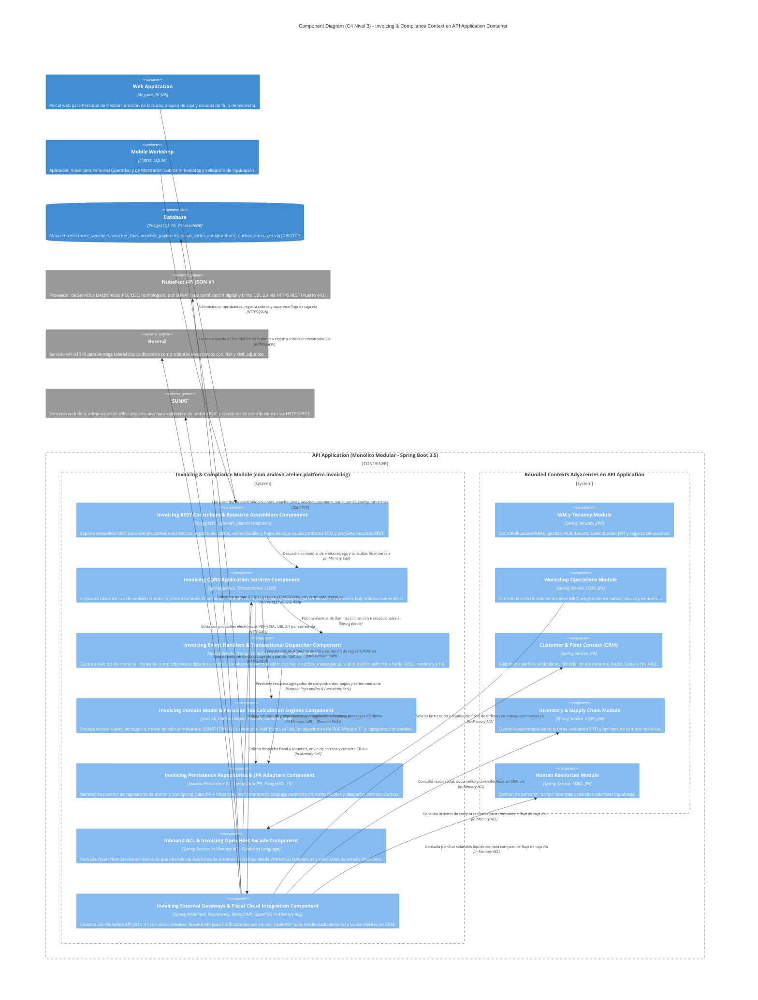
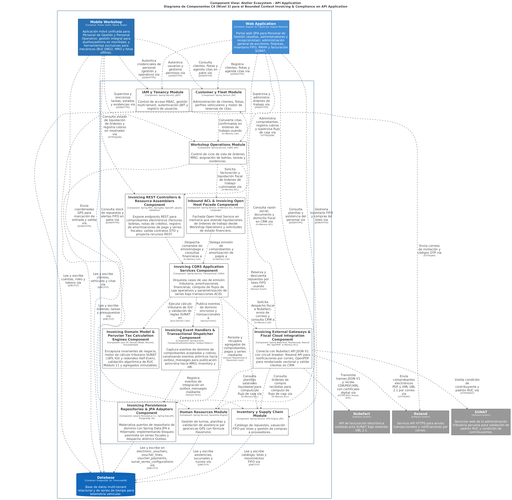
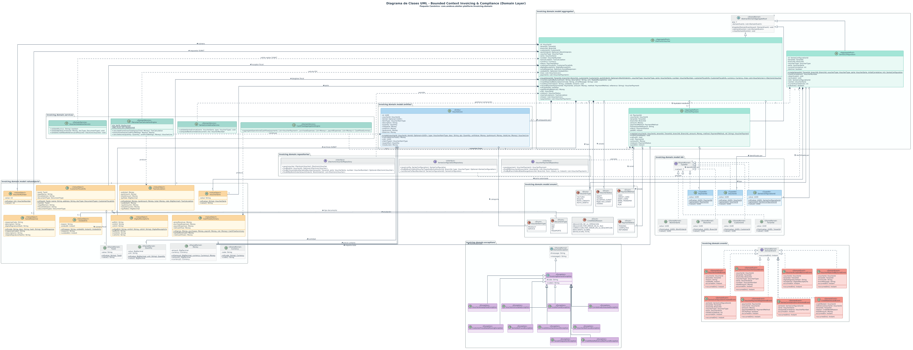
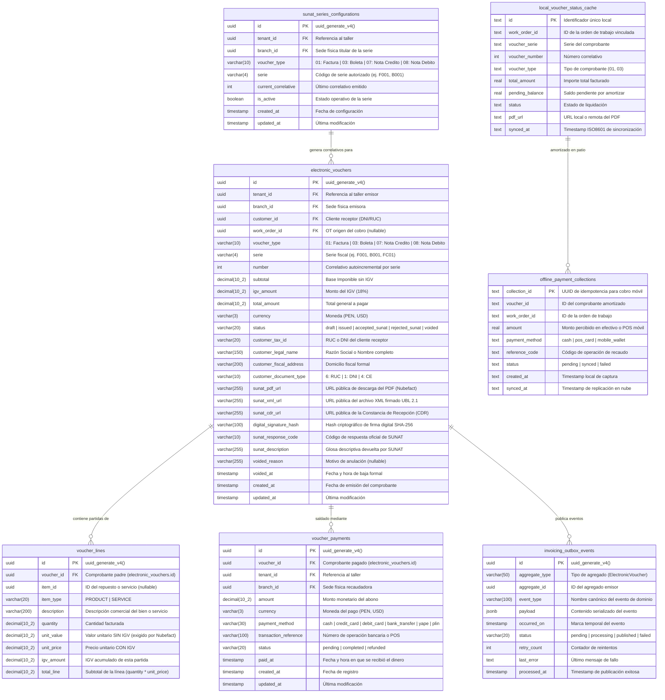
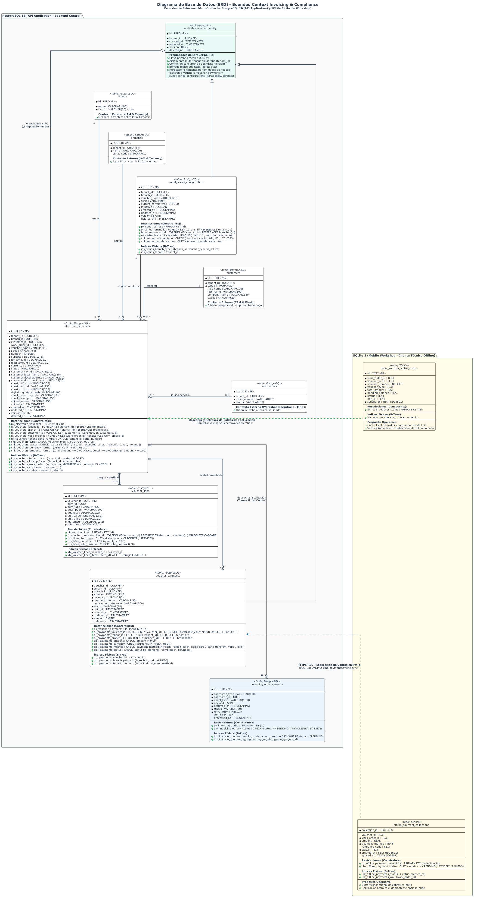

## 9. Fase 6: Bounded Context 6 — Invoicing & Compliance Context (`com.andeva.atelier.platform.invoicing`)

### 9.1. Diccionario y Propósito del Contexto

#### 9.1.1. Propósito y Límites de Responsabilidad
El **Invoicing & Compliance Context** encapsula la totalidad de las reglas contables, fiscales y tributarias exigidas por la legislación peruana bajo la supervisión de la **SUNAT (Superintendencia Nacional de Aduanas y de Administración Tributaria)**, operando bajo el estándar internacional **UBL 2.1 (Universal Business Language)**. Su delimitación responde a tres principios arquitectónicos cardinales:
1. **Aislamiento de la Complejidad Tributaria Nacional:** La normativa fiscal peruana (catálogos de afectación al IGV, detracciones, percepciones, validaciones estrictas de RUC/DNI y estructura de tramas XML firmadas digitalmente) es volátil y rígida. Si se mezclara con las órdenes de trabajo del taller (MRO) o con el catálogo de repuestos (Inventario), cualquier reforma tributaria obligaría a refactorizar todo el ERP. Este contexto encapsula dicha volatilidad, manteniendo a los demás contextos completamente limpios de conceptos fiscales.
2. **Diferenciación entre Facturación Local del Taller vs. Suscripción SaaS:** Mientras que el contexto de **SaaS Billing & Subscriptions** gestiona la recaudación recurrente que los talleres pagan a la startup *Andeva* mediante *Stripe*, el contexto de **Invoicing & Compliance** gestiona la facturación que el taller emite a sus propios clientes finales (propietarios de vehículos y flotas corporativas) por servicios mecánicos y repuestos provistos.
3. **Ciclo de Vida de Comprobantes de Pago Electrónicos (`ElectronicVoucher`):** Emite, valida y custodia comprobantes fiscales con validez legal:
   * **Factura Electrónica (Código SUNAT `01`):** Emitida exclusivamente a personas jurídicas o naturales con RUC de 11 dígitos válido que requieren sustentar costo o gasto y deducir crédito fiscal de IGV.
   * **Boleta de Venta Electrónica (Código SUNAT `03`):** Emitida a consumidores finales identificados con DNI de 8 dígitos, carné de extranjería o pasaporte (o sin documento de identidad si el monto total no supera los S/ 700.00 PEN).
   * **Nota de Crédito Electrónica (Código SUNAT `07`):** Emitida para anular operaciones comerciales previas, otorgar descuentos globales o corregir comprobantes emitidos con errores de emisión.
4. **Motor de Cálculo Tributario Peruano (`PeruvianTaxCalculationEngine`):** Centraliza la segregación matemática entre el Valor Venta / Base Imponible (`subtotal`), el Impuesto General a las Ventas (IGV 18%) y el Precio Total de Venta (`total_amount`), aplicando las fórmulas legales:
   $$\text{Base Imponible} = \frac{\text{Precio Total}}{1 + 0.18}, \quad \text{Monto IGV} = \text{Precio Total} - \text{Base Imponible}$$
   Garantiza redondeo bancario (*Half-Even*) a dos decimales por línea de detalle (`voucher_lines`) para evitar discrepancias de céntimos con los servidores de validación de SUNAT.
5. **Control de Series y Correlativos Atómicos (`SeriesConfiguration`):** Administra la numeración correlativa estricta por sucursal física (`branch_id`) y tipo de comprobante (ej. serie `F001` para facturas en la sede principal, `B001` para boletas, `FC01` para notas de crédito), impidiendo duplicidades o saltos de numeración correlativa mediante bloqueos pesimistas a nivel de base de datos relacional.
6. **Liquidación de Medios de Pago (`VoucherPayment`):** Registra los ingresos financieros asociados al comprobante electrónico (Efectivo, Tarjetas de Crédito/Débito, Transferencia Bancaria, Billeteras Digitales como Yape o Plin), controlando saldos pendientes y emitiendo el comprobante una vez acreditada la cancelación.

#### 9.1.2. Decisiones de Diseño e Integraciones Críticas
* **Capa Anticorrupción (ACL) hacia Nubefact:** En lugar de implementar un cliente UBL 2.1 monolítico con firma digital PKCS#12 y conexión directa por SOAP a los servidores de SUNAT —lo cual demandaría mantener certificados digitales tributarios por cada taller y lidiar con la frecuente intermitencia de los Web Services del Estado—, Atelier se integra con **Nubefact**, un Proveedor de Servicios Electrónicos (PSE) homologado. La ACL traduce el modelo de dominio puro de Atelier hacia el esquema JSON V1 de Nubefact, procesando de forma asíncrona las respuestas que contienen el hash digital de seguridad y los enlaces públicos a los archivos oficiales (`sunat_pdf_url`, `sunat_xml_url`, `sunat_cdr_url`).
* **Resiliencia mediante Transactional Outbox:** Si la API de Nubefact experimenta latencia o caída temporal, el comprobante se persiste localmente en la base de datos PostgreSQL en estado `ISSUED` (emitido localmente) y se encola un evento en la tabla `outbox_events`. Un worker en segundo plano reintenta el despacho con política de entrega *At-Least-Once*, garantizando que la entrega del vehículo al cliente nunca se detenga por fallos en la pasarela fiscal.
* **Desacoplamiento con MRO mediante Fachada Open Host Service (OHS):** Cuando una orden de trabajo finaliza en el contexto MRO, este emite el evento de integración `WorkOrderCompletedIntegrationEvent` o invoca `InvoicingContextFacade.generateVoucherFromWorkOrder(...)`. El contexto de facturación extrae el detalle de servicios y repuestos consumidos, aplica los cálculos fiscales y devuelve el resumen del comprobante generado sin que MRO conozca detalles del IGV o UBL 2.1.

---

### 9.2. 2.6.7.1. Domain Layer

#### 9.2.1. Aggregates & Aggregate Roots

##### 1. `ElectronicVoucher` (Aggregate Root)
* **Paquete:** `com.andeva.atelier.platform.invoicing.domain.model.aggregates`
* **Herencia:** Extiende `AbstractDomainAggregateRoot<ElectronicVoucher>`
* **Propósito:** Representa un comprobante de pago electrónico formal con validez fiscal y tributaria emitido por el taller automotriz a un cliente final bajo la normativa de SUNAT y el estándar UBL 2.1. Gobierna el ciclo de vida fiscal, la composición de líneas de detalle impositivas, la amortización financiera de pagos y la conciliación telemática con el Proveedor de Servicios Electrónicos (PSE).
* **Atributos:**
  * `id: VoucherId` — Identificador universal inmutable del comprobante electrónico (UUID).
  * `tenantId: TenantId` — Taller automotriz emisor del comprobante fiscal.
  * `branchId: BranchId` — Sede física operativa emisora de la transacción.
  * `customerId: CustomerId` — Cliente receptor de la factura, boleta o nota de crédito.
  * `workOrderId: Optional<WorkOrderId>` — Orden de trabajo de MRO que originó el cobro (opcional en venta directa de mostrador).
  * `voucherType: VoucherType` — Tipo legal de comprobante tributario (`FACTURA`, `BOLETA`, `NOTA_CREDITO`).
  * `serie: VoucherSerie` — Serie autorizada de 4 caracteres alfanuméricos (`^[F|B|T][A-Z0-9]{3}$`, ej. `F001`, `B001`, `FC01`).
  * `number: VoucherNumber` — Correlativo numérico autoincremental único por serie fiscal (`value > 0`).
  * `taxCalculation: TaxCalculation` — Objeto de valor que consolida la base imponible (`subtotal`), el impuesto general a las ventas (`igvAmount`), la tasa impositiva legal (18%) y el precio total (`totalAmount`).
  * `currency: Currency` — Moneda formal de la operación comercial (`PEN` para Soles, `USD` para Dólares Americanos).
  * `status: VoucherStatus` — Estado del ciclo de vida fiscal (`DRAFT`, `ISSUED`, `ACCEPTED_SUNAT`, `REJECTED_SUNAT`, `VOIDED`).
  * `customerFiscalInfo: CustomerFiscalInfo` — Datos fiscales del receptor (RUC/DNI, Razón Social/Nombre, Domicilio fiscal, Tipo de Documento).
  * `digitalReceiptUrls: DigitalReceiptUrls` — URLs públicas seguras (HTTPS) de los artefactos oficiales generados (`pdfUrl`, `xmlUrl`, `cdrUrl`).
  * `sunatResponse: Optional<SunatResponse>` — Metadatos devueltos por SUNAT/PSE (código de respuesta, glosa descriptiva y hash SHA-256 de la firma digital).
  * `voidedInfo: Optional<VoidedInfo>` — Timestamp y causal formal de anulación o comunicación de baja ante la autoridad tributaria.
  * `lines: List<VoucherLine>` — Colección interna de partidas detalladas de servicios de mantenimiento y piezas de repuesto facturadas.
  * `payments: List<VoucherPayment>` — Colección interna de transacciones y abonos financieros registrados para liquidar el importe del comprobante.
* **Invariantes y Reglas de Negocio:**
  * Si el comprobante es `FACTURA` (`01`), el cliente debe poseer obligatoriamente un RUC de 11 dígitos válido que inicie en `10`, `15`, `17` o `20` con dígito verificador matemático correcto según el algoritmo Módulo 11, contar con Razón Social formal y Domicilio Fiscal obligatorio.
  * Si el comprobante es `BOLETA` (`03`) y el monto total supera los S/ 700.00 PEN, el registro de los datos de identidad formal del cliente (DNI, Carné de Extranjería o Pasaporte) es estrictamente obligatorio según la normativa de SUNAT.
  * Si el comprobante es `NOTA_CREDITO` (`07`), debe referenciar de forma obligatoria un comprobante emisor preexistente válido, especificar un código de motivo legal según el catálogo SUNAT y asociar su fecha de emisión de origen.
  * Cuadre aritmético estricto: el importe total facturado debe ser exactamente igual a la suma aritmética de los importes de todas las líneas de detalle ($\text{totalAmount} = \sum \text{totalLine}$) y la base imponible más el IGV debe cuadrar con el total general ($\text{subtotal} + \text{igvAmount} = \text{totalAmount}$).
  * Inmutabilidad legal: un comprobante en estado `ACCEPTED_SUNAT` no puede ser modificado ni eliminado de la base de datos; su corrección o neutralización financiera debe realizarse exclusivamente mediante la emisión de una `NOTA_CREDITO` vinculada.
* **Métodos:**
  * `+ static ElectronicVoucher issue(TenantId tenantId, BranchId branchId, CustomerId customerId, Optional<WorkOrderId> workOrderId, VoucherType type, VoucherSerie serie, VoucherNumber number, CustomerFiscalInfo customerInfo, Currency currency, List<VoucherLine> lines): ElectronicVoucher`: Factoría de dominio principal; computa la liquidación impositiva mediante el motor tributario, valida las reglas fiscales peruanas, inicializa el comprobante en estado `ISSUED` y registra `ElectronicVoucherIssuedEvent`.
  * `+ static ElectronicVoucher issueCreditNote(TenantId tenantId, BranchId branchId, CustomerId customerId, VoucherId referenceVoucherId, VoucherSerie serie, VoucherNumber number, CreditNoteReason reason, String reasonDescription, List<VoucherLine> lines): ElectronicVoucher`: Factoría de dominio para notas de crédito vinculadas; valida la existencia y estado del comprobante emisor, calcula la compensación impositiva y emite `CreditNoteIssuedEvent`.
  * `+ void markAcceptedBySunat(String digitalSignatureHash, String sunatDescription, DigitalReceiptUrls urls): void`: Registra la conformidad formal devuelta por SUNAT/PSE (Constancia de Recepción - CDR), actualiza el estado a `ACCEPTED_SUNAT` y registra `VoucherAcceptedBySunatEvent`.
  * `+ void markRejectedBySunat(String errorCode, String errorMessage): void`: Registra el rechazo formal por inconsistencias tributarias o de firma, conmuta el estado a `REJECTED_SUNAT` y registra `VoucherRejectedBySunatEvent`.
  * `+ void voidVoucher(String voidReason, Instant voidTimestamp): void`: Formaliza la baja o anulación del comprobante ante la autoridad tributaria y registra `VoucherVoidedEvent`.
  * `+ VoucherPayment recordPayment(PaymentId paymentId, Money amount, PaymentMethod method, String transactionRef): VoucherPayment`: Incorpora un abono financiero contra el comprobante, verifica que el acumulado no sobrepase el `totalAmount`, actualiza el saldo pendiente y emite `VoucherPaymentRegisteredEvent`.
  * `+ boolean isFullyPaid(): boolean`: Evalúa si la suma consolidada de pagos completados cubre la totalidad del importe facturado.
  * `+ Money getPendingBalance(): Money`: Computa el saldo monetario pendiente de recaudación restando los abonos vigentes al monto total.

##### 2. `SeriesConfiguration` (Aggregate Root)
* **Paquete:** `com.andeva.atelier.platform.invoicing.domain.model.aggregates`
* **Herencia:** Extiende `AbstractDomainAggregateRoot<SeriesConfiguration>`
* **Propósito:** Custodia la configuración de series fiscales autorizadas y el avance correlativo estricto e inviolable por sucursal física (`branchId`) y tipo de comprobante tributario (`voucherType`), impidiendo duplicidades o saltos de numeración.
* **Atributos:**
  * `id: SeriesConfigurationId` — Identificador universal de la configuración de series (UUID).
  * `tenantId: TenantId` — Taller automotriz propietario de la serie fiscal.
  * `branchId: BranchId` — Sucursal física autorizada para la emisión de la serie.
  * `voucherType: VoucherType` — Tipo de comprobante tributario asociado (`FACTURA`, `BOLETA`, `NOTA_CREDITO`).
  * `serie: VoucherSerie` — Serie autorizada de 4 caracteres alfanuméricos (`^[F|B|T][A-Z0-9]{3}$`).
  * `currentCorrelative: int` — Último correlativo emitido de manera secuencial.
  * `isActive: boolean` — Indicador de habilitación operativa para emisión de comprobantes.
* **Invariantes y Reglas de Negocio:**
  * La serie fiscal debe respetar estrictamente el formato alfanumérico legal de SUNAT (`F` para facturas, `B` para boletas, `FC`/`BC` para notas de crédito).
  * El correlativo numérico debe ser un entero estrictamente positivo e incremental, prohibiendo reinicios o decrementos arbitrarios.
  * Unicidad compuesta: únicamente puede existir una serie activa simultáneamente por tupla `(tenantId, branchId, voucherType, serie)`.
* **Métodos:**
  * `+ static SeriesConfiguration create(TenantId tenantId, BranchId branchId, VoucherType type, VoucherSerie serie, int initialCorrelative): SeriesConfiguration`: Factoría que inicializa la configuración de serie en estado activo y registra `SeriesConfigurationCreatedEvent`.
  * `+ VoucherNumber nextCorrelative(): VoucherNumber`: Incrementa de forma atómica y segura el contador interno de la serie, asegurando concurrencia estricta mediante bloqueos de base de datos relacional y emitiendo `SeriesCorrelativeIncrementedEvent`.
  * `+ void deactivate(): void`: Suspende temporal o definitivamente la emisión de nuevos comprobantes bajo esta serie fiscal.
  * `+ void activate(): void`: Reactiva la serie fiscal para nuevas operaciones comerciales en la sucursal.

---

#### 9.2.2. Entities (Child Entities)

##### 1. `VoucherLine` (Entity)
* **Paquete:** `com.andeva.atelier.platform.invoicing.domain.model.entities`
* **Propósito:** Partida individual imponible que integra el comprobante de pago, representando un servicio de mantenimiento preventivo/correctivo ejecutado o una pieza de repuesto entregada.
* **Atributos:**
  * `id: UUID` — Identificador único universal de la línea de detalle.
  * `voucherId: VoucherId` — Identificador del comprobante electrónico padre.
  * `itemId: Optional<UUID>` — Identificador de la pieza del catálogo de inventario (`InventoryItemId`) o servicio (`ServiceId`) facturado (nullable en partidas libres de taller).
  * `itemType: VoucherItemType` — Clasificación técnica del concepto facturado (`PRODUCT`, `SERVICE`).
  * `description: String` — Glosa o descripción comercial detallada del bien o servicio prestado.
  * `quantity: Quantity` — Magnitud de unidades facturadas con precisión a dos decimales.
  * `unitValue: Money` — Valor unitario sin IGV (exigido por el estándar UBL 2.1 y la API fiscal de Nubefact).
  * `unitPrice: Money` — Precio unitario con IGV comercial incluido (18%).
  * `igvAmount: Money` — Monto total de IGV atribuible a esta partida individual ($\text{totalLine} - (\text{unitValue} \times \text{quantity})$).
  * `totalLine: Money` — Importe total monetario de la partida ($\text{quantity} \times \text{unitPrice}$).
* **Invariantes y Reglas de Negocio:**
  * El importe total de la línea debe cuadrar aritméticamente con la cantidad por el precio unitario: $\text{totalLine} = \text{quantity} \times \text{unitPrice}$.
  * El valor unitario sin impuesto debe derivarse rigurosamente del precio unitario: $\text{unitValue} = \text{unitPrice} / 1.18$.
* **Métodos:**
  * `+ static VoucherLine create(VoucherId voucherId, Optional<UUID> itemId, VoucherItemType itemType, String description, Quantity quantity, Money unitPrice): VoucherLine`: Factoría que computa el valor unitario y monto de IGV con redondeo bancario Half-Even.
  * `+ void calculateIgv(PeruvianTaxCalculationEngine taxEngine): void`: Recalcula la descomposición impositiva interna.

##### 2. `VoucherPayment` (Entity)
* **Paquete:** `com.andeva.atelier.platform.invoicing.domain.model.entities`
* **Propósito:** Representa un asiento de amortización financiera o liquidación de caja registrado contra un comprobante electrónico para extinguir la obligación de cobro.
* **Atributos:**
  * `id: PaymentId` — Identificador único universal de la transacción de pago (UUID).
  * `voucherId: VoucherId` — Identificador del comprobante electrónico asociado.
  * `tenantId: TenantId` — Taller automotriz recaudador de los fondos.
  * `branchId: BranchId` — Sucursal física donde se recibió el pago en efectivo o pasarela POS.
  * `amount: Money` — Importe monetario amortizado.
  * `paymentMethod: PaymentMethod` — Medio de pago empleado (`CASH`, `CREDIT_CARD`, `DEBIT_CARD`, `BANK_TRANSFER`, `DIGITAL_WALLET_YAPE`, `DIGITAL_WALLET_PLIN`).
  * `transactionReference: String` — Código de transacción bancaria, número de operación POS o voucher (nullable únicamente en abonos en efectivo).
  * `status: PaymentStatus` — Estado de la transacción financiera (`PENDING`, `COMPLETED`, `REFUNDED`).
  * `paidAt: Instant` — Timestamp cronológico del ingreso financiero en caja.
* **Invariantes y Reglas de Negocio:**
  * El importe amortizado debe ser estrictamente superior a cero ($> 0$).
  * En pagos efectuados por transferencia bancaria o billetera digital (`YAPE`, `PLIN`), la referencia de transacción es estrictamente obligatoria para soporte de conciliación bancaria.
* **Métodos:**
  * `+ static VoucherPayment record(PaymentId paymentId, VoucherId voucherId, TenantId tenantId, BranchId branchId, Money amount, PaymentMethod method, String transactionReference): VoucherPayment`: Factoría que inicializa el pago en estado `COMPLETED`.
  * `+ void complete(): void`: Transiciona el estado a `COMPLETED`.
  * `+ void refund(): void`: Transiciona el estado a `REFUNDED` tras anulación formal de la operación.

---

#### 9.2.3. Value Objects

* **`VoucherId`:** Identificador universal inmutable de comprobante electrónico (`record VoucherId(UUID value)`).
* **`SeriesConfigurationId`:** Identificador universal inmutable de configuración de series fiscales (`record SeriesConfigurationId(UUID value)`).
* **`PaymentId`:** Identificador universal inmutable de un abono o liquidación de cobro (`record PaymentId(UUID value)`).
* **`VoucherSerie`:** Objeto de valor que valida el formato alfanumérico legal de 4 caracteres (`record VoucherSerie(String value)`). Impone validación estricta contra la expresión regular `^[F|B|T][A-Z0-9]{3}$`.
* **`VoucherNumber`:** Correlativo numérico secuencial positivo (`record VoucherNumber(int value)`). Valida que `value > 0` y ofrece formateo legal a 8 dígitos (`%08d`).
* **`TaxCalculation`:** Registro inmutable que consolida la arquitectura impositiva del comprobante (`record TaxCalculation(Money subtotal, Money igvAmount, Money totalAmount, BigDecimal igvRate)`). Garantiza la invariante $\text{subtotal} + \text{igvAmount} = \text{totalAmount}$.
* **`CustomerFiscalInfo`:** Datos fiscales del receptor del comprobante (`record CustomerFiscalInfo(TaxId taxId, String legalName, String fiscalAddress, DocumentType documentType)`). Valida consistencia con catálogos SUNAT.
* **`DigitalReceiptUrls`:** Enlaces públicos seguros inmutables a los artefactos generados por el PSE (`record DigitalReceiptUrls(String pdfUrl, String xmlUrl, String cdrUrl)`).
* **`SunatResponse`:** Metadatos fiscales oficiales emitidos por el PSE/SUNAT (`record SunatResponse(String responseCode, String description, String digitalSignatureHash)`).
* **`VoidedInfo`:** Registro formal de comunicación de baja (`record VoidedInfo(String reason, Instant voidedAt)`).
* **`VoucherType` (Enum):** Clasificación tributaria oficial según tabla 10 de SUNAT: `FACTURA("01")`, `BOLETA("03")`, `NOTA_CREDITO("07")`.
* **`VoucherStatus` (Enum):** Ciclo de vida del comprobante: `DRAFT`, `ISSUED`, `ACCEPTED_SUNAT`, `REJECTED_SUNAT`, `VOIDED`.
* **`PaymentMethod` (Enum):** Canales de liquidación financiera autorizados: `CASH`, `CREDIT_CARD`, `DEBIT_CARD`, `BANK_TRANSFER`, `DIGITAL_WALLET_YAPE`, `DIGITAL_WALLET_PLIN`.
* **`PaymentStatus` (Enum):** Situación transaccional del abono: `PENDING`, `COMPLETED`, `REFUNDED`.
* **`VoucherItemType` (Enum):** Tipificación económica del renglón facturado: `PRODUCT` (repuesto/insumo físico), `SERVICE` (mano de obra/labor técnica).
* **`CreditNoteReason` (Enum):** Catálogo 09 de SUNAT para motivos de nota de crédito: `ANULACION_DE_LA_OPERACION("01")`, `ANULACION_POR_ERROR_EN_EL_RUC("02")`, `CORRECCION_POR_ERROR_EN_LA_DESCRIPCION("03")`, `DESCUENTO_GLOBAL("04")`, `DEVOLUCION_TOTAL("06")`.

---

#### 9.2.4. Domain Commands

* **`IssueElectronicVoucherCommand`:** Parámetros para la emisión de una factura o boleta electrónica (`TenantId tenantId, BranchId branchId, CustomerId customerId, Optional<WorkOrderId> workOrderId, VoucherType type, VoucherSerie serie, CustomerFiscalInfo customerInfo, Currency currency, List<VoucherLineItemDto> lines`).
* **`IssueCreditNoteCommand`:** Parámetros para emitir una nota de crédito vinculada a un comprobante emisor previo (`TenantId tenantId, BranchId branchId, VoucherId referenceVoucherId, VoucherSerie serie, CreditNoteReason reason, String reasonDescription, List<VoucherLineItemDto> lines`).
* **`VoidElectronicVoucherCommand`:** Parámetros para comunicar la baja o anulación formal del comprobante ante SUNAT (`VoucherId voucherId, String reason`).
* **`RegisterVoucherPaymentCommand`:** Parámetros para asentar una amortización financiera en caja (`VoucherId voucherId, Money amount, PaymentMethod method, String transactionReference`).
* **`ConfigureSeriesCommand`:** Parámetros para parametrizar y dar de alta una serie fiscal correlativa por sede (`TenantId tenantId, BranchId branchId, VoucherType type, VoucherSerie serie, int initialCorrelative`).
* **`ProcessSunatResponseCommand`:** Parámetros para asentar el resultado telemático de validación emitido por Nubefact (`VoucherId voucherId, boolean accepted, String responseCode, String description, String hash, DigitalReceiptUrls urls`).

---

#### 9.2.5. Domain Queries

* **`GetVoucherByIdQuery`:** Consulta la totalidad de los datos de un comprobante por su identificador único (`VoucherId voucherId`).
* **`GetVoucherBySerieAndNumberQuery`:** Consulta un comprobante específico mediante su combinación de serie y número correlativo fiscal (`TenantId tenantId, VoucherSerie serie, VoucherNumber number`).
* **`ListVouchersByTenantQuery`:** Consulta el padrón de ventas del taller filtrado por intervalo cronológico y tipo de documento (`TenantId tenantId, Optional<VoucherType> type, LocalDate from, LocalDate to`).
* **`ListVouchersByWorkOrderQuery`:** Consulta los comprobantes de pago asociados a una orden de trabajo de MRO (`WorkOrderId workOrderId`).
* **`GetVoucherPaymentsQuery`:** Consulta la relación de pagos y amortizaciones financieras vinculadas a un comprobante (`VoucherId voucherId`).
* **`GetActiveSeriesByBranchQuery`:** Consulta las series autorizadas y activas para una sede física determinada (`BranchId branchId`).

---

#### 9.2.6. Domain Events

* **`ElectronicVoucherIssuedEvent`:** Emitido al generarse el comprobante en la base de datos local y prepararse para su despacho a SUNAT (`VoucherId voucherId, TenantId tenantId, BranchId branchId, CustomerId customerId, VoucherType type, VoucherSerie serie, VoucherNumber number, Money totalAmount, Instant occurredOn`).
* **`VoucherAcceptedBySunatEvent`:** Emitido al confirmarse la validez tributaria mediante el CDR devuelto por SUNAT/PSE (`VoucherId voucherId, TenantId tenantId, String digitalSignatureHash, DigitalReceiptUrls urls, Instant occurredOn`).
* **`VoucherRejectedBySunatEvent`:** Emitido cuando la autoridad tributaria o el PSE rechazan el documento por inconsistencias normativas (`VoucherId voucherId, TenantId tenantId, String errorCode, String errorMessage, Instant occurredOn`).
* **`VoucherVoidedEvent`:** Emitido al consumarse la anulación o baja formal de un comprobante fiscal (`VoucherId voucherId, TenantId tenantId, String reason, Instant occurredOn`).
* **`VoucherPaymentRegisteredEvent`:** Emitido al asentarse una amortización económica en caja contra un comprobante (`PaymentId paymentId, VoucherId voucherId, TenantId tenantId, Money amount, PaymentMethod method, boolean isFullyPaid, Instant occurredOn`).
* **`SeriesConfigurationCreatedEvent`:** Emitido al registrar una nueva serie autorizada para una sucursal (`SeriesConfigurationId seriesId, TenantId tenantId, BranchId branchId, VoucherType type, VoucherSerie serie, int initialCorrelative, Instant occurredOn`).
* **`SeriesCorrelativeIncrementedEvent`:** Emitido tras la reserva y avance secuencial del contador de correlativos de una serie (`SeriesConfigurationId seriesId, TenantId tenantId, BranchId branchId, VoucherSerie serie, int newCorrelative, Instant occurredOn`).
* **`CreditNoteIssuedEvent`:** Emitido tras la generación de una nota de crédito vinculada a un comprobante de origen (`VoucherId creditNoteId, VoucherId referenceVoucherId, TenantId tenantId, BranchId branchId, VoucherSerie serie, VoucherNumber number, CreditNoteReason reason, Money totalAmount, Instant occurredOn`).

---

#### 9.2.7. Domain Repositories (Interfaces)

```java
package com.andeva.atelier.platform.invoicing.domain.repositories;

public interface ElectronicVoucherRepository {
    ElectronicVoucher save(ElectronicVoucher voucher);
    Optional<ElectronicVoucher> findById(VoucherId id);
    Optional<ElectronicVoucher> findByTenantIdAndSerieAndNumber(TenantId tenantId, VoucherSerie serie, VoucherNumber number);
    List<ElectronicVoucher> findAllByTenantIdAndDateRange(TenantId tenantId, LocalDate from, LocalDate to);
    List<ElectronicVoucher> findAllByWorkOrderId(WorkOrderId workOrderId);
    boolean existsByTenantIdAndSerieAndNumber(TenantId tenantId, VoucherSerie serie, VoucherNumber number);
}

public interface SeriesConfigurationRepository {
    SeriesConfiguration save(SeriesConfiguration seriesConfig);
    Optional<SeriesConfiguration> findById(SeriesConfigurationId id);
    Optional<SeriesConfiguration> findByBranchIdAndVoucherTypeAndActive(BranchId branchId, VoucherType type);
    Optional<SeriesConfiguration> findByTenantIdAndBranchIdAndSerie(TenantId tenantId, BranchId branchId, VoucherSerie serie);
    List<SeriesConfiguration> findAllByBranchId(BranchId branchId);
    boolean existsByTenantIdAndBranchIdAndSerie(TenantId tenantId, BranchId branchId, VoucherSerie serie);
}

public interface VoucherPaymentRepository {
    VoucherPayment save(VoucherPayment payment);
    Optional<VoucherPayment> findById(PaymentId id);
    List<VoucherPayment> findAllByVoucherId(VoucherId voucherId);
    List<VoucherPayment> findAllByBranchIdAndDate(BranchId branchId, LocalDate date);
}
```

---

#### 9.2.8. Domain Services

##### 1. `PeruvianTaxCalculationEngine` (Servicio de Dominio Matemático Tributario)
* **Paquete:** `com.andeva.atelier.platform.invoicing.domain.services`
* **Propósito:** Aplica las fórmulas de segregación impositiva entre la base imponible y el Impuesto General a las Ventas (IGV 18%) empleando redondeo bancario legal (*Half-Even* a 2 decimales para totales y 4 decimales para valores unitarios en UBL 2.1).
```java
package com.andeva.atelier.platform.invoicing.domain.services;

import com.andeva.atelier.platform.invoicing.domain.model.valueobjects.TaxCalculation;
import com.andeva.atelier.platform.shared.domain.model.valueobjects.Currency;
import com.andeva.atelier.platform.shared.domain.model.valueobjects.Money;
import org.springframework.stereotype.Service;

import java.math.BigDecimal;
import java.math.RoundingMode;

@Service
public class PeruvianTaxCalculationEngine {
    private static final BigDecimal IGV_RATE = new BigDecimal("0.18");
    private static final BigDecimal ONE_PLUS_IGV = new BigDecimal("1.18");

    public TaxCalculation calculateFromGrossTotal(Money grossTotal) {
        BigDecimal totalAmount = grossTotal.amount();
        BigDecimal subtotal = totalAmount.divide(ONE_PLUS_IGV, 2, RoundingMode.HALF_EVEN);
        BigDecimal igvAmount = totalAmount.subtract(subtotal);

        return new TaxCalculation(
                Money.of(subtotal, grossTotal.currency()),
                Money.of(igvAmount, grossTotal.currency()),
                grossTotal,
                IGV_RATE
        );
    }

    public Money extractUnitValue(Money unitPriceWithIgv) {
        BigDecimal unitValue = unitPriceWithIgv.amount().divide(ONE_PLUS_IGV, 4, RoundingMode.HALF_EVEN);
        return Money.of(unitValue.setScale(2, RoundingMode.HALF_EVEN), unitPriceWithIgv.currency());
    }

    public String convertAmountToWords(Money amount, Currency currency) {
        // Conversión a texto legal en castellano requerida por directiva de comprobantes SUNAT
        return NumberToWordsConverter.convert(amount.amount(), currency.code());
    }
}
```

##### 2. `VoucherValidationService` (Servicio de Dominio de Validación Fiscal)
* **Paquete:** `com.andeva.atelier.platform.invoicing.domain.services`
* **Propósito:** Valida algorítmicamente la legitimidad del dígito verificador para números de RUC peruanos mediante el cálculo ponderado de Módulo 11 (coeficientes `[5, 4, 3, 2, 7, 6, 5, 4, 3, 2]`), fiscaliza el tope legal de S/ 700.00 PEN para boletas emitidas sin documento de identidad y comprueba la consistencia de las notas de crédito vinculadas.
```java
package com.andeva.atelier.platform.invoicing.domain.services;

import com.andeva.atelier.platform.invoicing.domain.exceptions.CustomerFiscalDataMissingException;
import com.andeva.atelier.platform.invoicing.domain.exceptions.InvalidTaxIdException;
import com.andeva.atelier.platform.invoicing.domain.model.aggregates.ElectronicVoucher;
import com.andeva.atelier.platform.invoicing.domain.model.valueobjects.CreditNoteReason;
import com.andeva.atelier.platform.invoicing.domain.model.valueobjects.CustomerFiscalInfo;
import com.andeva.atelier.platform.invoicing.domain.model.valueobjects.VoucherType;
import com.andeva.atelier.platform.shared.domain.model.valueobjects.Money;
import org.springframework.stereotype.Service;

import java.math.BigDecimal;

@Service
public class VoucherValidationService {
    private static final BigDecimal BOLETA_ANONYMOUS_LIMIT = new BigDecimal("700.00");
    private static final int[] RUC_WEIGHTS = {5, 4, 3, 2, 7, 6, 5, 4, 3, 2};

    public void validateFiscalData(VoucherType type, CustomerFiscalInfo info, Money totalAmount) {
        if (type == VoucherType.FACTURA) {
            if (info == null || info.taxId() == null || !isValidRuc(info.taxId().value())) {
                throw new InvalidTaxIdException("Factura exige RUC de 11 dígitos válido");
            }
            if (info.legalName() == null || info.legalName().isBlank()) {
                throw new CustomerFiscalDataMissingException("Factura exige Razón Social formal");
            }
            if (info.fiscalAddress() == null || info.fiscalAddress().isBlank()) {
                throw new CustomerFiscalDataMissingException("Factura exige Domicilio Fiscal formal");
            }
        } else if (type == VoucherType.BOLETA) {
            if (totalAmount.amount().compareTo(BOLETA_ANONYMOUS_LIMIT) > 0) {
                if (info == null || info.taxId() == null || info.taxId().value().isBlank()) {
                    throw new CustomerFiscalDataMissingException("Boleta mayor a S/ 700.00 exige documento de identidad");
                }
            }
        }
    }

    public boolean isValidRuc(String ruc) {
        if (ruc == null || ruc.length() != 11 || !ruc.matches("\\d{11}")) return false;
        String prefix = ruc.substring(0, 2);
        if (!prefix.equals("10") && !prefix.equals("15") && !prefix.equals("17") && !prefix.equals("20")) return false;

        int sum = 0;
        for (int i = 0; i < 10; i++) {
            sum += Character.getNumericValue(ruc.charAt(i)) * RUC_WEIGHTS[i];
        }
        int checkDigit = 11 - (sum % 11);
        if (checkDigit == 10) checkDigit = 0;
        else if (checkDigit == 11) checkDigit = 1;

        return checkDigit == Character.getNumericValue(ruc.charAt(10));
    }

    public void validateCreditNoteReference(ElectronicVoucher originalVoucher, CreditNoteReason reason) {
        if (originalVoucher == null) {
            throw new IllegalArgumentException("Comprobante emisor no puede ser nulo");
        }
        if (originalVoucher.getStatus() == com.andeva.atelier.platform.invoicing.domain.model.valueobjects.VoucherStatus.VOIDED) {
            throw new IllegalStateException("No se puede emitir nota de crédito sobre un comprobante anulado");
        }
    }
}
```

##### 3. `SeriesCorrelativeService` (Servicio de Dominio de Correlación Secuencial)
* **Paquete:** `com.andeva.atelier.platform.invoicing.domain.services`
* **Propósito:** Orquesta la reserva y asignación atómica del siguiente número correlativo fiscal para una serie y sucursal, previniendo duplicidades y asegurando la correlatividad consecutiva exigida por SUNAT mediante el bloqueo pesimista en la base de datos relacional.
```java
package com.andeva.atelier.platform.invoicing.domain.services;

import com.andeva.atelier.platform.iam.domain.model.valueobjects.BranchId;
import com.andeva.atelier.platform.iam.domain.model.valueobjects.TenantId;
import com.andeva.atelier.platform.invoicing.domain.exceptions.CorrelativeExhaustedException;
import com.andeva.atelier.platform.invoicing.domain.exceptions.SeriesNotFoundException;
import com.andeva.atelier.platform.invoicing.domain.model.aggregates.SeriesConfiguration;
import com.andeva.atelier.platform.invoicing.domain.model.valueobjects.VoucherNumber;
import com.andeva.atelier.platform.invoicing.domain.model.valueobjects.VoucherSerie;
import com.andeva.atelier.platform.invoicing.domain.model.valueobjects.VoucherType;
import com.andeva.atelier.platform.invoicing.domain.repositories.SeriesConfigurationRepository;
import org.springframework.stereotype.Service;

@Service
public class SeriesCorrelativeService {
    private static final int MAX_CORRELATIVE = 99999999;
    private final SeriesConfigurationRepository seriesRepository;

    public SeriesCorrelativeService(SeriesConfigurationRepository seriesRepository) {
        this.seriesRepository = seriesRepository;
    }

    public VoucherNumber allocateNextCorrelative(TenantId tenantId, BranchId branchId, VoucherType type, VoucherSerie serie) {
        SeriesConfiguration config = seriesRepository.findByTenantIdAndBranchIdAndSerie(tenantId, branchId, serie)
                .filter(SeriesConfiguration::isActive)
                .orElseThrow(() -> new SeriesNotFoundException("Serie no configurada o inactiva: " + serie.value()));

        if (config.getCurrentCorrelative() >= MAX_CORRELATIVE) {
            throw new CorrelativeExhaustedException("Correlativo agotado para serie: " + serie.value());
        }

        VoucherNumber nextNumber = config.nextCorrelative();
        seriesRepository.save(config);
        return nextNumber;
    }
}
```

---

#### 9.2.9. Domain Exceptions (Jerarquía RFC 7807)

Las excepciones de la capa de dominio heredan de `DomainException` (provista en el Shared Kernel) y encapsulan códigos de error semánticos legibles para su serialización bajo la directiva RFC 7807:

* **`InvalidTaxIdException`:** Lanzada cuando el número de RUC no supera la validación algorítmica de Módulo 11 o no corresponde a una persona jurídica o natural autorizada. Código: `ERR_INVALID_TAX_ID` (HTTP 422 Unprocessable Entity).
* **`CorrelativeExhaustedException`:** Lanzada cuando el correlativo numérico de una serie fiscal alcanza el límite máximo admisible de 99,999,999. Código: `ERR_CORRELATIVE_EXHAUSTED` (HTTP 409 Conflict).
* **`VoucherAlreadyPaidException`:** Lanzada cuando se intenta registrar un abono financiero contra un comprobante electrónico cuyo saldo pendiente ya es cero o cuando el monto supera el total adeudado. Código: `ERR_VOUCHER_ALREADY_PAID` (HTTP 409 Conflict).
* **`VoucherImmutableException`:** Lanzada ante cualquier intento de alteración o eliminación física de un comprobante que ya ha sido aceptado por SUNAT o se encuentra en estado emitido. Código: `ERR_VOUCHER_IMMUTABLE` (HTTP 409 Conflict).
* **`InvalidVoucherAmountException`:** Lanzada cuando existe inconsistencia aritmética entre la sumatoria de las partidas de detalle y el total consignado en la cabecera, o cuando los montos son negativos o nulos. Código: `ERR_INVALID_VOUCHER_AMOUNT` (HTTP 422 Unprocessable Entity).
* **`CustomerFiscalDataMissingException`:** Lanzada al intentar emitir una factura sin RUC, razón social o domicilio fiscal, o una boleta mayor a S/ 700.00 PEN sin documento receptor. Código: `ERR_CUSTOMER_FISCAL_MISSING` (HTTP 422 Unprocessable Entity).
* **`SeriesNotFoundException`:** Lanzada cuando no existe una serie fiscal activa configurada para la combinación de taller, sucursal y tipo de comprobante solicitada. Código: `ERR_SERIES_NOT_FOUND` (HTTP 404 Not Found).
* **`VoucherNotFoundException`:** Lanzada cuando no se localiza el comprobante electrónico en el repositorio mediante su identificador o correlativo fiscal. Código: `ERR_VOUCHER_NOT_FOUND` (HTTP 404 Not Found).
* **`SunatIntegrationException`:** Lanzada cuando ocurre un error de comunicación de red o rechazo de trama con el Proveedor de Servicios Electrónicos (Nubefact) o con los servidores de SUNAT. Código: `ERR_SUNAT_INTEGRATION_FAILED` (HTTP 502 Bad Gateway).
* **`CreditNoteReferenceNotFoundException`:** Lanzada cuando la nota de crédito hace referencia a un comprobante emisor preexistente que no se encuentra en el repositorio del taller. Código: `ERR_CREDIT_NOTE_REF_NOT_FOUND` (HTTP 404 Not Found).

---

### 9.3. 2.6.7.2. Interface Layer

#### 9.3.1. REST Controllers

##### 1. `ElectronicVouchersController`
* **Ruta Base:** `/api/v1/invoicing/vouchers`
* **Responsabilidad:** Administrar el ciclo de vida de los comprobantes electrónicos (emisión, consulta, anulación y descarga de XML/PDF/CDR).
* **Endpoints:**
  * `POST /`: Emite una nueva factura o boleta electrónica (`IssueElectronicVoucherCommand`). Despacha sincrónicamente a Nubefact o mediante Outbox resiliente. Responde `201 Created` con `ElectronicVoucherResource`.
  * `POST /credit-notes`: Emite una nota de crédito vinculada a un comprobante previo. Responde `201 Created`.
  * `GET /{id}`: Obtiene el detalle completo del comprobante con sus líneas de detalle, totales tributarios y enlaces a archivos SUNAT. Responde `200 OK`.
  * `GET /`: Lista los comprobantes del taller filtrados por rango de fechas y tipo de documento. Responde `200 OK`.
  * `GET /work-order/{workOrderId}`: Lista los comprobantes vinculados a una orden de trabajo de MRO. Responde `200 OK`.
  * `POST /{id}/void`: Anula formalmente el comprobante ante SUNAT comunicando el motivo de baja. Responde `200 OK`.

##### 2. `VoucherPaymentsController`
* **Ruta Base:** `/api/v1/invoicing/payments`
* **Responsabilidad:** Registro de abonos y conciliación de caja por comprobante.
* **Endpoints:**
  * `POST /`: Asienta un pago contra un comprobante electrónico (`RegisterVoucherPaymentCommand`). Responde `201 Created` con `VoucherPaymentResource`.
  * `GET /voucher/{voucherId}`: Lista los pagos registrados para una factura o boleta específica. Responde `200 OK`.
  * `GET /branch/{branchId}/daily`: Reporte de cobros diarios por sucursal física. Responde `200 OK`.

##### 3. `SeriesConfigurationController`
* **Ruta Base:** `/api/v1/invoicing/series`
* **Responsabilidad:** Configuración de correlativos autorizados por sede.
* **Endpoints:**
  * `POST /`: Configura una nueva serie fiscal para una sucursal (`ConfigureSeriesCommand`). Responde `201 Created`.
  * `GET /branch/{branchId}`: Lista las series activas configuradas para la sucursal. Responde `200 OK`.

##### 4. `FinancialReportsController`
* **Ruta Base:** `/api/v1/invoicing/reports`
* **Responsabilidad:** Generación de balances de caja y estados de movimientos consolidados del taller (*Cash Flow & Movements Statement*), agregando transaccionalmente los cobros a clientes y los egresos operativos por compras de repuestos y sueldos de colaboradores.
* **Endpoints:**
  * `GET /cash-flow`: Consulta el estado de movimientos financieros en formato estructurado JSON (`CashFlowReportResource`) para renderizado interactivo en el Frontend.
    - Parámetros de consulta: `startDate` (requerido, `LocalDate`), `endDate` (requerido, `LocalDate`), `branchId` (opcional, `UUID`).
    - Unifica cronológicamente: $(+)$ Pagos cobrados en taller (`voucher_payments`), $(-)$ Facturas de compra de repuestos a proveedores (`purchase_orders` recibidas), y $(-)$ Nóminas desembolsadas a colaboradores (`payroll_payments`).
    - Retorna el balance de ingresos, egresos y el flujo neto del periodo. Responde `200 OK`.
  * `GET /cash-flow/pdf`: Genera y descarga el informe oficial en PDF formateado como un estado de cuenta bancario corporativo. Compila la cabecera institucional del taller, el resumen financiero ejecutivo, la tabla cronológica detallada de movimientos (Fecha, Concepto, Categoría, Tipo, Monto, Saldo progresivo) y los totales consolidados. Responde `200 OK` con cabecera `Content-Disposition: attachment; filename="cash-flow-{startDate}-{endDate}.pdf"`.

---

#### 9.3.2. REST Resources & DTOs (Records)

```java
package com.andeva.atelier.platform.invoicing.interfaces.rest.resources;

public record IssueVoucherRequest(
    @NotNull UUID branchId,
    @NotNull UUID customerId,
    UUID workOrderId,
    @NotBlank String voucherType, // FACTURA, BOLETA
    @NotBlank String serie,       // F001, B001
    @NotNull CustomerFiscalInfoDto customerInfo,
    @NotBlank String currency,    // PEN, USD
    @NotEmpty List<VoucherLineRequest> lines
) {}

public record VoucherLineRequest(
    UUID itemId,
    @NotBlank String itemType, // PRODUCT, SERVICE
    @NotBlank String description,
    @NotNull BigDecimal quantity,
    @NotNull BigDecimal unitPriceWithIgv
) {}

public record CustomerFiscalInfoDto(
    @NotBlank String taxId,
    @NotBlank String legalName,
    @NotBlank String fiscalAddress,
    @NotBlank String documentType // DNI, RUC, CE
) {}

public record RegisterPaymentRequest(
    @NotNull UUID voucherId,
    @NotNull BigDecimal amount,
    @NotBlank String currency,
    @NotBlank String paymentMethod,
    String transactionReference
) {}

public record ElectronicVoucherResource(
    UUID id,
    UUID tenantId,
    UUID branchId,
    UUID customerId,
    UUID workOrderId,
    String voucherType,
    String serie,
    int number,
    BigDecimal subtotal,
    BigDecimal igvAmount,
    BigDecimal totalAmount,
    String currency,
    String status,
    CustomerFiscalInfoDto customerInfo,
    DigitalReceiptUrlsDto digitalReceipts,
    SunatResponseDto sunatResponse,
    List<VoucherLineResource> lines,
    List<VoucherPaymentResource> payments,
    Instant issuedAt
) {}

public record VoucherLineResource(
    UUID id,
    String itemType,
    String description,
    BigDecimal quantity,
    BigDecimal unitValue,
    BigDecimal unitPrice,
    BigDecimal igvAmount,
    BigDecimal totalLine
) {}

public record DigitalReceiptUrlsDto(
    String pdfUrl,
    String xmlUrl,
    String cdrUrl
) {}

public record SunatResponseDto(
    String responseCode,
    String description,
    String digitalSignatureHash
) {}

public record VoucherPaymentResource(
    UUID id,
    UUID voucherId,
    BigDecimal amount,
    String currency,
    String paymentMethod,
    String transactionReference,
    String status,
    Instant paidAt
) {}

public record CashFlowReportResource(
    UUID tenantId,
    UUID branchId,
    LocalDate startDate,
    LocalDate endDate,
    BigDecimal totalIncome,
    BigDecimal totalExpenses,
    BigDecimal netCashFlow,
    String currency,
    List<CashFlowMovementResource> movements
) {}

public record CashFlowMovementResource(
    UUID transactionId,
    Instant movementDate,
    String type, // INCOME o EXPENSE
    String category, // CLIENT_PAYMENT, SPARE_PARTS_PURCHASE, STAFF_PAYROLL
    String concept,
    String referenceNumber,
    BigDecimal amount,
    BigDecimal runningBalance
) {}
```

---

#### 9.3.3. REST Assemblers (Mappers)

* **`ElectronicVoucherResourceAssembler`:** Mapea el agregado `ElectronicVoucher`, sus líneas de detalle, pagos y metadatos de SUNAT hacia el DTO `ElectronicVoucherResource`.
* **`VoucherPaymentResourceAssembler`:** Transforma entidades `VoucherPayment` a `VoucherPaymentResource`.

---

#### 9.3.4. Inbound ACL Facade (Open Host Service - OHS)

Para permitir que el contexto de Operaciones de Taller (MRO) facture órdenes de trabajo sin acoplarse a detalles fiscales de SUNAT, Invoicing expone su fachada canónica:

```java
package com.andeva.atelier.platform.invoicing.interfaces.acl;

import java.math.BigDecimal;
import java.util.List;
import java.util.Optional;
import java.util.UUID;

public interface InvoicingContextFacade {
    /**
     * Utilizado por Workshop Operations (MRO) para liquidar una Orden de Trabajo.
     * Genera el comprobante electrónico formal a partir de las tareas y repuestos consumidos.
     */
    VoucherGenerationResultDto generateVoucherFromWorkOrder(GenerateVoucherFromWorkOrderCommandDto command);

    /**
     * Consulta el resumen de comprobantes emitidos para una orden de trabajo.
     */
    List<VoucherSummaryDto> getVouchersByWorkOrderId(UUID workOrderId);

    /**
     * Verifica si una orden de trabajo se encuentra 100% facturada y pagada.
     */
    boolean isWorkOrderFullySettled(UUID workOrderId);
}

public record GenerateVoucherFromWorkOrderCommandDto(
    UUID tenantId,
    UUID branchId,
    UUID workOrderId,
    UUID customerId,
    String voucherType, // FACTURA o BOLETA
    String customerTaxId,
    String customerLegalName,
    String customerFiscalAddress,
    String currency,
    List<WorkOrderItemBillingDto> items
) {}

public record WorkOrderItemBillingDto(
    UUID itemId,
    String itemType, // PRODUCT o SERVICE
    String description,
    BigDecimal quantity,
    BigDecimal unitPriceWithIgv
) {}

public record VoucherGenerationResultDto(
    UUID voucherId,
    String fullVoucherNumber, // Ej. "F001-000142"
    BigDecimal totalAmount,
    String status,
    String pdfUrl
) {}

public record VoucherSummaryDto(
    UUID voucherId,
    String fullVoucherNumber,
    String voucherType,
    BigDecimal totalAmount,
    String status,
    boolean isFullyPaid
) {}
```

---

#### 9.3.5. Integration Events (Published / Consumed)

##### 1. Eventos Publicados por Invoicing hacia otros Bounded Contexts
* **`ElectronicVoucherIssuedIntegrationEvent`:** Emitido al crearse una factura o boleta con valor fiscal. Consumido por MRO para actualizar el estado contable de la orden de trabajo.
* **`VoucherAcceptedBySunatIntegrationEvent`:** Emitido tras la recepción del CDR aprobatorio de SUNAT. Consumido por el módulo de notificaciones para despachar el correo con PDF y XML al cliente vía Resend.
* **`VoucherPaymentReceivedIntegrationEvent`:** Emitido al liquidarse un abono monetario. Consumido por MRO para validar la entrega definitiva del vehículo en patio.

##### 2. Eventos Consumidos por Invoicing desde otros Bounded Contexts
* **`WorkOrderDeliveredIntegrationEvent` (emitido por MRO):** Habilita la liquidación final y emite una alerta contable si la orden no ha sido facturada.

---

### 9.4. 2.6.7.3. Application Layer

La Capa de Aplicación del Bounded Context **Invoicing & Compliance** actúa como el orquestador transaccional bajo el paquete canónico `com.andeva.atelier.platform.invoicing.application`. Su cometido esencial radica en coordinar los flujos de negocio tributarios, la facturación electrónica bajo el estándar UBL 2.1 ante la Superintendencia Nacional de Aduanas y de Administración Tributaria (SUNAT), la conciliación financiera de pagos de comprobantes en caja y la consolidación analítica del estado de flujo de caja del taller automotriz. Todo ello implementando estrictamente el patrón arquitectónico CQRS (*Command Query Responsibility Segregation*), que desacopla de forma limpia los servicios de mutación transaccional de las consultas y proyecciones de lectura.

El diseño táctico de la Capa de Aplicación se fundamenta en cuatro pilares de ingeniería de software:
- **Orquestación transaccional atómica y reserva secuencial de correlativos:** Delimita fronteras de consistencia ACID mediante `@Transactional(isolation = Isolation.READ_COMMITTED)`, asegurando la reserva atómica del correlativo en `SeriesConfigurationRepository`, el cálculo exacto de la base imponible y el IGV (18%) con `PeruvianTaxCalculationEngine` y la persistencia local inmutable antes del despacho fiscal al PSE/OSE Nubefact.
- **Control de flujo determinista mediante el tipo sellado `Result<T, InvoicingApplicationError>`:** Todos los servicios de comandos canalizan el éxito o fracaso de las operaciones a través del contenedor funcional sellado del Shared Kernel, erradicando el uso indiscriminado de excepciones no controladas para gobernar las reglas y precondiciones de negocio tributarias.
- **Coreografía reactiva de eventos y garantía de entrega At-Least-Once:** Los eventos de dominio se gestionan de forma síncrona o desacoplada mediante `@TransactionalEventListener(phase = TransactionPhase.AFTER_COMMIT)`, mientras que los eventos de integración se serializan en la tabla `outbox_messages` a través de `InvoicingTransactionalOutboxPublisher` para su posterior despacho asíncrono y tolerante a fallos hacia el bus de eventos de la plataforma.
- **Inversión de dependencias y aislamiento perimetral mediante puertos ACL:** La interacción con subsistemas externos de facturación fiscal electrónica (*Nubefact API REST*), servicios de correo transaccional (*Resend*), generadores documentales PDF bancarios y validación de padrones fiscales de clientes (*CRM / SUNAT*) se desacopla rigurosamente mediante interfaces de puertos secundarios y adaptadores anticorrupción.

---

#### 9.4.1. Command Services & Implementations

##### 1. `ElectronicVoucherCommandService` & `ElectronicVoucherCommandServiceImpl`

* **Paquete:** `com.andeva.atelier.platform.invoicing.application.services`
* **Transaccionalidad:** `@Transactional(isolation = Isolation.READ_COMMITTED, rollbackFor = Exception.class)`
* **Métodos Principales:**

* `Result<ElectronicVoucher, InvoicingApplicationError> handle(IssueElectronicVoucherCommand command)`:
  1. Valida la existencia del cliente y recupera sus datos fiscales (RUC/DNI, razón social y domicilio fiscal) mediante `CustomerAclService`.
  2. Recupera la serie fiscal activa configurada para la sucursal física (`branchId`) y el tipo de comprobante solicitado (`voucherType`), reservando el correlativo numérico atómico mediante `SeriesConfigurationRepository.findNextCorrelative`.
  3. Ejecuta `PeruvianTaxCalculationEngine` para calcular de forma segregada la base imponible y el IGV (18%) de cada partida, aplicando la regla de redondeo bancario Half-Even (`RoundingMode.HALF_EVEN`).
  4. Valida exhaustivamente las invariantes fiscales UBL 2.1: algoritmo de control de Módulo 11 para facturas con RUC, exigencia mandatoria de documento de identidad en boletas de venta con importe superior a S/ 700.00 y coherencia entre montos unitarios, descuentos y totales.
  5. Crea la raíz de agregado `ElectronicVoucher` en estado inicial `ISSUED` a través de su factoría de dominio correspondiente (`createInvoice` o `createReceipt`).
  6. Persiste el comprobante en la base de datos relacional dentro de la transacción local.
  7. Invoca al servicio outbound ACL `NubefactAclService` para despachar la trama estructurada a SUNAT:
     - Si la respuesta del PSE/OSE es sincrónica y aprobatoria (`isAccepted == true`), actualiza el comprobante a estado `ACCEPTED` mediante `voucher.markAcceptedBySunat(...)`, registrando el código hash digital y los hipervínculos hacia el PDF, XML UBL 2.1 y la Constancia de Recepción (CDR).
     - Si la respuesta indica rechazo formal por inconsistencia tributaria de SUNAT, actualiza el estado a `REJECTED` registrando la descripción de error provista por el ente fiscal.
     - Si la pasarela externa experimenta una caída de red o indisponibilidad temporal, el comprobante se mantiene en estado `ISSUED` y se delega el despacho asíncrono al mecanismo Transactional Outbox.
  8. Registra y publica los eventos de dominio resultantes (`ElectronicVoucherIssuedEvent` y opcionalmente `VoucherAcceptedBySunatEvent`).
  9. Retorna `Result.success(voucher)`.

* `Result<ElectronicVoucher, InvoicingApplicationError> handle(IssueCreditNoteCommand command)`:
  1. Localiza el comprobante electrónico original que se desea modificar mediante `ElectronicVoucherRepository.findById`.
  2. Verifica que el comprobante original se encuentre en estado `ACCEPTED` ante SUNAT y pertenezca al mismo taller y sucursal.
  3. Valida la coherencia fiscal del motivo de la nota de crédito (`CreditNoteReason`: anulación de la operación, anulación por error en el RUC, corrección por error en la descripción o descuento global).
  4. Reserva el correlativo atómico para notas de crédito (serie `FC01` para facturas o `BC01` para boletas) mediante `SeriesConfigurationRepository`.
  5. Instancia el comprobante con tipo `CREDIT_NOTE`, vinculando la serie, correlativo y fecha del documento afectado en `modified_document_reference`.
  6. Persiste el comprobante, despacha la trama UBL 2.1 ante SUNAT vía `NubefactAclService` y emite `CreditNoteIssuedEvent`.
  7. Retorna `Result.success(creditNote)`.

* `Result<Void, InvoicingApplicationError> handle(VoidElectronicVoucherCommand command)`:
  1. Localiza el comprobante electrónico por su identificador único.
  2. Verifica que el comprobante esté en estado `ACCEPTED` y dentro de la ventana de tiempo legal admitida por SUNAT (máximo 7 días calendario posteriores a su fecha de emisión para facturas electrónicas).
  3. Ejecuta el método de negocio de anulación `voucher.voidVoucher(reason)`.
  4. Despacha la comunicación de baja (baja de comprobante) ante SUNAT a través de `NubefactAclService`.
  5. Persiste el estado actualizado a `VOIDED`, registra la fecha y motivo de anulación, y emite `VoucherVoidedEvent`.
  6. Retorna `Result.success(null)`.

* `Result<ElectronicVoucher, InvoicingApplicationError> handle(ProcessSunatResponseCommand command)`:
  1. Recibe la notificación asíncrona proveniente del webhook del PSE/OSE Nubefact o del reintento de procesamiento del Transactional Outbox.
  2. Localiza el comprobante electrónico por su clave tributaria (`serie` y `number`) o su identificador de transacción externa.
  3. Si la respuesta contiene el CDR con código de aceptación `0`, ejecuta `voucher.markAcceptedBySunat(...)`. Si contiene código de error o rechazo, ejecuta `voucher.markRejectedBySunat(...)`.
  4. Persiste los cambios, emite el evento de dominio correspondiente y retorna `Result.success(voucher)`.

##### 2. `VoucherPaymentCommandService` & `VoucherPaymentCommandServiceImpl`

* **Paquete:** `com.andeva.atelier.platform.invoicing.application.services`
* **Transaccionalidad:** `@Transactional(isolation = Isolation.READ_COMMITTED, rollbackFor = Exception.class)`
* **Métodos Principales:**

* `Result<VoucherPayment, InvoicingApplicationError> handle(RegisterVoucherPaymentCommand command)`:
  1. Localiza el comprobante electrónico en `ElectronicVoucherRepository.findById`. Si no existe, retorna error de entidad no encontrada.
  2. Verifica que el comprobante no se encuentre en estado `VOIDED` ni `REJECTED`, e invalida pagos adicionales si el comprobante ya alcanzó el estado `PAID` (`VoucherAlreadyPaidException`).
  3. Calcula el saldo pendiente de liquidación (`pendingAmount = totalAmount - paidAmount`). Si el monto a abonar en el comando excede el saldo pendiente, retorna error por sobrepago no autorizado.
  4. Invoca el método mutador inmutable del agregado `voucher.registerPayment(amount, paymentMethod, transactionReference, receivedBy)`.
  5. Persiste la entidad dependiente `VoucherPayment` en la tabla `voucher_payments` y actualiza atómicamente el estado del comprobante: si el total de abonos iguala el importe total, conmuta su estado a `PAID`.
  6. Emite el evento de dominio local `VoucherPaymentRegisteredEvent`.
  7. Si el comprobante se encuentra plenamente liquidado (`isFullyPaid == true`) y está asociado a una orden de trabajo de taller (`workOrderId != null`), publica el evento de integración `WorkOrderSettledIntegrationEvent` hacia el contexto Workshop Operations (MRO) para autorizar la entrega física del vehículo en patio.
  8. Retorna `Result.success(newPayment)`.

##### 3. `SeriesConfigurationCommandService` & `SeriesConfigurationCommandServiceImpl`

* **Paquete:** `com.andeva.atelier.platform.invoicing.application.services`
* **Transaccionalidad:** `@Transactional(isolation = Isolation.READ_COMMITTED, rollbackFor = Exception.class)`
* **Métodos Principales:**

* `Result<SeriesConfiguration, InvoicingApplicationError> handle(ConfigureSeriesCommand command)`:
  1. Valida sintácticamente el formato de la serie fiscal mediante la expresión regular canónica `^[F|B|T][A-Z0-9]{3}$` (por ejemplo, `F001` para facturas, `B001` para boletas).
  2. Verifica la regla de unicidad de series por taller y sucursal (`SeriesConfigurationRepository.existsByTenantIdAndBranchIdAndVoucherTypeAndSerie`). Si ya existe, retorna conflicto de duplicidad.
  3. Instancia la raíz de agregado `SeriesConfiguration` fijando el correlativo inicial (por defecto en 1) y asignando estado `ACTIVE`.
  4. Persiste la configuración en base de datos y emite `SeriesConfigurationCreatedEvent`.
  5. Retorna `Result.success(series)`.

* `Result<Void, InvoicingApplicationError> handle(DeactivateSeriesCommand command)`:
  1. Localiza la serie fiscal por identificador único.
  2. Ejecuta `series.deactivate()`, inhabilitando la emisión de nuevos comprobantes bajo dicho prefijo.
  3. Persiste y retorna `Result.success(null)`.

* `Result<Void, InvoicingApplicationError> handle(ActivateSeriesCommand command)`:
  1. Localiza la serie fiscal inactiva.
  2. Ejecuta `series.activate()`, habilitando nuevamente la serie para su uso en caja.
  3. Persiste y retorna `Result.success(null)`.

---

#### 9.4.2. Query Services & Implementations

Los servicios de consulta se ejecutan bajo aislamiento transaccional de solo lectura (`@Transactional(readOnly = true)`), garantizando alta concurrencia sin bloqueos pesados en el motor relacional PostgreSQL:

##### 1. `ElectronicVoucherQueryService` & `ElectronicVoucherQueryServiceImpl`

* `Optional<ElectronicVoucher> handle(GetElectronicVoucherByIdQuery query)`: Recupera la representación de dominio completa del comprobante por su identificador UUID.
* `PagedModel<ElectronicVoucherSummaryProjection> handle(GetElectronicVouchersPagedQuery query)`: Retorna el catálogo paginado y filtrado de comprobantes por sucursal, tipo de documento (`INVOICE`, `RECEIPT`, `CREDIT_NOTE`), rango de fechas de emisión, estado tributario y cliente.
* `List<ElectronicVoucherSummaryProjection> handle(GetVouchersByWorkOrderIdQuery query)`: Recupera todos los comprobantes emitidos en el marco de una orden de trabajo automotriz específica para auditoría de taller.
* `byte[] handle(GetVoucherXmlContentQuery query)`: Descarga el archivo XML firmado con certificado digital bajo el estándar OASIS UBL 2.1 desde el repositorio perimetral o almacenamiento en la nube.
* `byte[] handle(GetVoucherPdfContentQuery query)`: Descarga la representación gráfica oficial en formato PDF del comprobante, incluyendo código de barras bidimensional QR y cadena hash tributaria.
* `byte[] handle(GetVoucherCdrContentQuery query)`: Descarga la Constancia de Recepción (CDR) oficial emitida por SUNAT o el OSE autorizado.

##### 2. `VoucherPaymentQueryService` & `VoucherPaymentQueryServiceImpl`

* `List<VoucherPaymentProjection> handle(GetVoucherPaymentsByVoucherIdQuery query)`: Recupera el desglose histórico de amortizaciones y abonos monetarios efectuados sobre un comprobante de pago específico.
* `DailyCashSummaryProjection handle(GetDailyCashSummaryQuery query)`: Ejecuta el cuadre de caja diario de la sucursal física especificada en una fecha dada, consolidando los importes percibidos desglosados por método de pago (`CASH`, `CREDIT_CARD`, `DEBIT_CARD`, `BANK_TRANSFER`, `YAPE_PLIN`).

##### 3. `CashFlowQueryService` & `CashFlowQueryServiceImpl`

Orquesta la consolidación analítica del estado de cuenta y flujo de caja operativo del taller (*Cash Flow & Movements Statement*), unificando ingresos directos por servicios con los egresos devengados por abastecimiento de piezas y liquidación de nóminas de mecánicos:

* `CashFlowStatementProjection handle(GetCashFlowStatementQuery query)`:
  Implementa un riguroso algoritmo de consolidación cronológica en memoria estructurado en siete pasos deterministas:
  1. **Recuperación de Ingresos Operativos:** Consulta en `voucher_payments` todos los abonos percibidos en la sucursal dentro del rango de fechas especificado (`movementType = INFLOW`).
  2. **Recuperación de Egresos por Insumos y Repuestos:** Consulta a través de `InventoryContextFacade` las compras de repuestos asentadas en `purchase_orders` cuyo estado físico sea `RECEIVED` (`movementType = OUTFLOW_PARTS`), extrayendo fecha de recepción, número de factura del proveedor comercial y costo total liquidado.
  3. **Recuperación de Egresos por Mano de Obra y Nómina:** Consulta a través de `HumanResourcesContextFacade` las liquidaciones salariales consolidadas en `payroll_payments` cuyo estado sea `PAID` (`movementType = OUTFLOW_PAYROLL`), recuperando la fecha de dispersión bancaria y el monto neto pagado al personal técnico.
  4. **Unificación Cronológica:** Realiza una operación de unión temporal en memoria estructurando todos los registros bajo la interfaz común `CashFlowMovementItem`, ordenándolos de manera estrictamente ascendente por fecha de efectivización (`movementDate ASC`).
  5. **Cómputo Progresivo de Saldo:** Itera de forma secuencial sobre la colección cronológica unificada, computando el saldo acumulado progresivo para cada transacción:
     $$\text{Saldo}_i = \text{Saldo}_{i-1} + \text{Ingreso}_i - \text{Egreso}_i$$
     donde $\text{Saldo}_0$ corresponde al saldo inicial de apertura de caja para el periodo analizado.
  6. **Cálculo de Agregados Globales:** Sumariza los valores consolidados del periodo: $\text{Total Ingresos}$, $\text{Total Egresos}$ y el $\text{Flujo Neto de Caja} = \text{Total Ingresos} - \text{Total Egresos}$.
  7. **Generación y Exclusión de Costos Indirectos:** Retorna la proyección analítica consolidada. Por definición y rigor contable del taller, se excluyen de este informe los costos fijos indirectos ajenos al flujo directo del taller mecánico (tales como alquiler de local, servicios de agua potable, energía eléctrica o telecomunicaciones corporativas), garantizando una visualización nítida de la rentabilidad operativa.

* `byte[] handle(ExportCashFlowPdfQuery query)`: Invoca al servicio `InvoicingPdfGeneratorPort` para renderizar el informe analítico del estado de cuenta en formato binario PDF, aplicando una maquetación gráfica bancaria corporativa que incorpora logotipo del taller, cabecera con RUC y razón social, resumen ejecutivo financiero y la tabla completa de movimientos detallados.

---

#### 9.4.3. Domain Event Handlers e Integration Listeners

##### 1. `VoucherDomainEventHandler`
* **Paquete:** `com.andeva.atelier.platform.invoicing.application.events`
* **Propósito:** Manejar el ciclo de vida de los eventos de dominio emitidos por los agregados del contexto:
  * `@TransactionalEventListener(phase = TransactionPhase.AFTER_COMMIT) void on(VoucherAcceptedBySunatEvent event)`: Tras confirmarse la aceptación tributaria de un comprobante ante SUNAT, invoca a `TransactionalEmailSenderPort` (adaptado por `ResendEmailAdapter`) para remitir automáticamente al correo del cliente el comprobante de pago en formato PDF y el archivo XML UBL 2.1 firmado legalmente.
  * `@TransactionalEventListener(phase = TransactionPhase.AFTER_COMMIT) void on(VoucherPaymentRegisteredEvent event)`: Cuando un comprobante alcanza su liquidación total (`isFullyPaid == true`) y está asociado a una orden de trabajo (`workOrderId`), publica el evento de integración `WorkOrderSettledIntegrationEvent` para que el Bounded Context Workshop Operations libere la orden y permita la entrega del vehículo en bahía.
  * `@TransactionalEventListener(phase = TransactionPhase.AFTER_COMMIT) void on(VoucherVoidedEvent event)`: Notifica la baja del comprobante a los módulos de contabilidad y auditoría para asentar la anulación tributaria correspondiente.

##### 2. Escuchadores de Integración (Incoming Integration Listeners)
* **`WorkOrderDeliveredEventListener`:** Escucha `WorkOrderDeliveredIntegrationEvent` emitido por MRO tras la salida de un vehículo del taller. Si la orden no cuenta con un comprobante electrónico en estado `ISSUED` o `ACCEPTED`, emite una alerta administrativa inmediata de regularización fiscal.
* **`PurchaseOrderReceivedEventListener`:** Escucha `PurchaseOrderReceivedIntegrationEvent` emitido por Inventory & Supply Chain al confirmarse el arribo de repuestos, habilitando la imputación inmediata del egreso comercial en el flujo de caja del taller.
* **`PayrollPaidEventListener`:** Escucha `PayrollPaidIntegrationEvent` emitido por Human Resources & Payroll al liquidarse los sueldos del personal de taller, incorporando el egreso monetario en el estado analítico de flujo de caja.

##### 3. `InvoicingTransactionalOutboxPublisher`
* **Propósito:** Captura los eventos de integración generados dentro del contexto Invoicing & Compliance y los serializa en formato JSON dentro de la tabla física `outbox_messages` del Shared Kernel durante la misma transacción de base de datos. Un hilo despachador en segundo plano lee periódicamente estos mensajes y los publica hacia el bus de mensajería (Kafka / RabbitMQ), garantizando entrega con semántica *At-Least-Once* sin riesgo de estados inconsistentes.

---

#### 9.4.4. Outbound ACL Services & Gateways

##### 1. `NubefactAclService` & `NubefactFiscalGatewayPort`
* **Paquete:** `com.andeva.atelier.platform.invoicing.application.internal.outboundservices.acl`
* **Propósito:** Capa Anticorrupción que aísla el modelo de dominio puro `ElectronicVoucher` de la estructura técnica JSON V1 requerida por el PSE/OSE Nubefact para la generación y firma de documentos UBL 2.1:

```java
package com.andeva.atelier.platform.invoicing.application.internal.outboundservices.acl;

import com.andeva.atelier.platform.invoicing.domain.model.aggregates.ElectronicVoucher;
import com.andeva.atelier.platform.invoicing.domain.model.valueobjects.DigitalReceiptUrls;
import com.andeva.atelier.platform.invoicing.infrastructure.gateways.NubefactFiscalGatewayPort;
import org.springframework.stereotype.Service;

@Service
public class NubefactAclService {
    private final NubefactFiscalGatewayPort nubefactFiscalGateway;

    public NubefactAclService(NubefactFiscalGatewayPort nubefactFiscalGateway) {
        this.nubefactFiscalGateway = nubefactFiscalGateway;
    }

    public NubefactDispatchResult dispatchVoucher(ElectronicVoucher voucher) {
        var request = NubefactPayloadMapper.toNubefactRequest(voucher);
        var response = nubefactFiscalGateway.sendInvoice(request);

        if (response.aceptadaPorSunat()) {
            return new NubefactDispatchResult(
                    true,
                    response.codigoRespuesta(),
                    response.descripcionSunat(),
                    response.codigoHash(),
                    new DigitalReceiptUrls(response.enlacePdf(), response.enlaceXml(), response.enlaceCdr())
            );
        } else {
            return new NubefactDispatchResult(
                    false,
                    response.codigoRespuesta(),
                    response.descripcionSunat(),
                    null,
                    null
            );
        }
    }
}

public record NubefactDispatchResult(
    boolean isAccepted,
    String responseCode,
    String description,
    String digitalSignatureHash,
    DigitalReceiptUrls urls
) {}
```

##### 2. `CustomerFiscalAclPort` & `CustomerAclService`
* **Paquete:** `com.andeva.atelier.platform.invoicing.application.acl`
* **Propósito:** Interfaz de puerto secundario para consultar y validar datos fiscales de clientes corporativos y particulares desde el Bounded Context CRM & Fleet Management o mediante consulta perimetral al padrón oficial de SUNAT.
* **Operaciones Principales:** `Optional<CustomerFiscalData> getCustomerFiscalInfo(UUID customerId)`, `boolean validateTaxIdActiveStatus(String taxId)`.

##### 3. `TransactionalEmailSenderPort` & `ResendEmailAdapter`
* **Paquete:** `com.andeva.atelier.platform.invoicing.application.ports.outbound`
* **Propósito:** Abstrae el servicio de mensajería transaccional para la notificación y distribución de comprobantes tributarios electrónicos a los clientes de taller automotriz a través del proveedor de infraestructura en la nube Resend.
* **Operaciones Principales:** `void sendVoucherEmail(String recipientEmail, String customerName, String voucherCode, byte[] pdfContent, byte[] xmlContent)`.

##### 4. `InvoicingPdfGeneratorPort`
* **Paquete:** `com.andeva.atelier.platform.invoicing.application.ports.outbound`
* **Propósito:** Abstracción para el renderizado programático de documentos bancarios y contables en formato PDF mediante OpenPDF / iText, materializando la maquetación del estado de cuenta de flujo de caja y la representación física de comprobantes.
* **Operaciones Principales:** `byte[] generateCashFlowStatementPdf(CashFlowStatementProjection statement)`, `byte[] generateVoucherPdf(ElectronicVoucher voucher)`.

##### 5. `InvoicingEventPublisherPort`
* **Paquete:** `com.andeva.atelier.platform.invoicing.application.ports.outbound`
* **Propósito:** Puerto de infraestructura para la emisión de eventos de integración hacia el broker de mensajería asíncrona de la plataforma y el despacho hacia la tabla de Transactional Outbox.
* **Operaciones Principales:** `void publish(InvoicingIntegrationEvent event)`.

---

### 9.5. 2.6.7.4. Infrastructure Layer

#### 9.5.1. JPA Entities

##### 1. `ElectronicVoucherJpaEntity`
* **Tabla Relacional:** `electronic_vouchers`
* **Mapeo:**
```java
package com.andeva.atelier.platform.invoicing.infrastructure.persistence.jpa.entities;

import com.andeva.atelier.platform.shared.infrastructure.persistence.jpa.entities.AuditableAbstractPersistenceEntity;
import jakarta.persistence.*;
import java.math.BigDecimal;
import java.time.Instant;
import java.util.ArrayList;
import java.util.List;
import java.util.UUID;

@Entity
@Table(name = "electronic_vouchers", uniqueConstraints = {
    @UniqueConstraint(name = "uk_vouchers_tenant_serie_number", columnNames = {"tenant_id", "serie", "number"})
}, indexes = {
    @Index(name = "idx_vouchers_tenant_created", columnList = "tenant_id, created_at"),
    @Index(name = "idx_vouchers_work_order", columnList = "work_order_id"),
    @Index(name = "idx_vouchers_customer", columnList = "customer_id")
})
public class ElectronicVoucherJpaEntity extends AuditableAbstractPersistenceEntity {
    @Id
    @Column(name = "id", nullable = false, updatable = false)
    private UUID id;

    @Column(name = "tenant_id", nullable = false, updatable = false)
    private UUID tenantId;

    @Column(name = "branch_id", nullable = false, updatable = false)
    private UUID branchId;

    @Column(name = "customer_id", nullable = false, updatable = false)
    private UUID customerId;

    @Column(name = "work_order_id")
    private UUID workOrderId;

    @Column(name = "voucher_type", nullable = false, length = 10)
    private String voucherType;

    @Column(name = "serie", nullable = false, length = 4)
    private String serie;

    @Column(name = "number", nullable = false)
    private int number;

    @Column(name = "subtotal", nullable = false, precision = 10, scale = 2)
    private BigDecimal subtotal;

    @Column(name = "igv_amount", nullable = false, precision = 10, scale = 2)
    private BigDecimal igvAmount;

    @Column(name = "total_amount", nullable = false, precision = 10, scale = 2)
    private BigDecimal totalAmount;

    @Column(name = "currency", nullable = false, length = 3)
    private String currency = "PEN";

    @Column(name = "status", nullable = false, length = 20)
    private String status;

    @Column(name = "customer_tax_id", nullable = false, length = 20)
    private String customerTaxId;

    @Column(name = "customer_legal_name", nullable = false, length = 150)
    private String customerLegalName;

    @Column(name = "customer_fiscal_address", nullable = false, length = 200)
    private String customerFiscalAddress;

    @Column(name = "customer_document_type", nullable = false, length = 10)
    private String customerDocumentType;

    @Column(name = "sunat_pdf_url", length = 255)
    private String sunatPdfUrl;

    @Column(name = "sunat_xml_url", length = 255)
    private String sunatXmlUrl;

    @Column(name = "sunat_cdr_url", length = 255)
    private String sunatCdrUrl;

    @Column(name = "digital_signature_hash", length = 100)
    private String digitalSignatureHash;

    @Column(name = "sunat_response_code", length = 10)
    private String sunatResponseCode;

    @Column(name = "sunat_description", length = 255)
    private String sunatDescription;

    @Column(name = "voided_reason", length = 255)
    private String voidedReason;

    @Column(name = "voided_at")
    private Instant voidedAt;

    @OneToMany(mappedBy = "voucher", cascade = CascadeType.ALL, orphanRemoval = true, fetch = FetchType.LAZY)
    private List<VoucherLineJpaEntity> lines = new ArrayList<>();

    @OneToMany(mappedBy = "voucher", cascade = CascadeType.ALL, orphanRemoval = true, fetch = FetchType.LAZY)
    private List<VoucherPaymentJpaEntity> payments = new ArrayList<>();

    // Getters y Setters JPA
}
```

##### 2. `VoucherLineJpaEntity`
* **Tabla Relacional:** `voucher_lines`
* **Mapeo:**
```java
package com.andeva.atelier.platform.invoicing.infrastructure.persistence.jpa.entities;

import jakarta.persistence.*;
import java.math.BigDecimal;
import java.util.UUID;

@Entity
@Table(name = "voucher_lines")
public class VoucherLineJpaEntity {
    @Id
    @Column(name = "id", nullable = false, updatable = false)
    private UUID id;

    @ManyToOne(fetch = FetchType.LAZY)
    @JoinColumn(name = "voucher_id", nullable = false)
    private ElectronicVoucherJpaEntity voucher;

    @Column(name = "item_id")
    private UUID itemId;

    @Column(name = "item_type", nullable = false, length = 20)
    private String itemType;

    @Column(name = "description", nullable = false, length = 200)
    private String description;

    @Column(name = "quantity", nullable = false, precision = 10, scale = 2)
    private BigDecimal quantity;

    @Column(name = "unit_value", nullable = false, precision = 10, scale = 2)
    private BigDecimal unitValue;

    @Column(name = "unit_price", nullable = false, precision = 10, scale = 2)
    private BigDecimal unitPrice;

    @Column(name = "igv_amount", nullable = false, precision = 10, scale = 2)
    private BigDecimal igvAmount;

    @Column(name = "total_line", nullable = false, precision = 10, scale = 2)
    private BigDecimal totalLine;

    // Getters y Setters JPA
}
```

##### 3. `VoucherPaymentJpaEntity`
* **Tabla Relacional:** `voucher_payments`
* **Mapeo:**
```java
package com.andeva.atelier.platform.invoicing.infrastructure.persistence.jpa.entities;

import com.andeva.atelier.platform.shared.infrastructure.persistence.jpa.entities.AuditableAbstractPersistenceEntity;
import jakarta.persistence.*;
import java.math.BigDecimal;
import java.time.Instant;
import java.util.UUID;

@Entity
@Table(name = "voucher_payments", indexes = {
    @Index(name = "idx_payments_voucher", columnList = "voucher_id"),
    @Index(name = "idx_payments_branch_date", columnList = "branch_id, paid_at")
})
public class VoucherPaymentJpaEntity extends AuditableAbstractPersistenceEntity {
    @Id
    @Column(name = "id", nullable = false, updatable = false)
    private UUID id;

    @ManyToOne(fetch = FetchType.LAZY)
    @JoinColumn(name = "voucher_id", nullable = false)
    private ElectronicVoucherJpaEntity voucher;

    @Column(name = "tenant_id", nullable = false, updatable = false)
    private UUID tenantId;

    @Column(name = "branch_id", nullable = false, updatable = false)
    private UUID branchId;

    @Column(name = "amount", nullable = false, precision = 10, scale = 2)
    private BigDecimal amount;

    @Column(name = "currency", nullable = false, length = 3)
    private String currency = "PEN";

    @Column(name = "payment_method", nullable = false, length = 30)
    private String paymentMethod;

    @Column(name = "transaction_reference", length = 100)
    private String transactionReference;

    @Column(name = "status", nullable = false, length = 20)
    private String status;

    @Column(name = "paid_at", nullable = false)
    private Instant paidAt;

    // Getters y Setters JPA
}
```

##### 4. `SeriesConfigurationJpaEntity`
* **Tabla Relacional:** `sunat_series_configurations`
* **Mapeo:**
```java
package com.andeva.atelier.platform.invoicing.infrastructure.persistence.jpa.entities;

import com.andeva.atelier.platform.shared.infrastructure.persistence.jpa.entities.AuditableAbstractPersistenceEntity;
import jakarta.persistence.*;
import java.util.UUID;

@Entity
@Table(name = "sunat_series_configurations", uniqueConstraints = {
    @UniqueConstraint(name = "uk_series_branch_type_serie", columnNames = {"branch_id", "voucher_type", "serie"})
})
public class SeriesConfigurationJpaEntity extends AuditableAbstractPersistenceEntity {
    @Id
    @Column(name = "id", nullable = false, updatable = false)
    private UUID id;

    @Column(name = "tenant_id", nullable = false, updatable = false)
    private UUID tenantId;

    @Column(name = "branch_id", nullable = false, updatable = false)
    private UUID branchId;

    @Column(name = "voucher_type", nullable = false, length = 10)
    private String voucherType;

    @Column(name = "serie", nullable = false, length = 4)
    private String serie;

    @Column(name = "current_correlative", nullable = false)
    private int currentCorrelative;

    @Column(name = "is_active", nullable = false)
    private boolean isActive = true;

    // Getters y Setters JPA
}
```

---

#### 9.5.2. Spring Data JPA Repositories

```java
package com.andeva.atelier.platform.invoicing.infrastructure.persistence.jpa.repositories;

public interface SpringDataElectronicVoucherRepository extends JpaRepository<ElectronicVoucherJpaEntity, UUID> {
    Optional<ElectronicVoucherJpaEntity> findByTenantIdAndSerieAndNumber(UUID tenantId, String serie, int number);
    List<ElectronicVoucherJpaEntity> findAllByWorkOrderId(UUID workOrderId);

    @Query("SELECT v FROM ElectronicVoucherJpaEntity v WHERE v.tenantId = :tenantId AND v.createdAt >= :from AND v.createdAt <= :to ORDER BY v.createdAt DESC")
    List<ElectronicVoucherJpaEntity> findAllByTenantAndDateRange(@Param("tenantId") UUID tenantId, @Param("from") Instant from, @Param("to") Instant to);
}

public interface SpringDataVoucherPaymentRepository extends JpaRepository<VoucherPaymentJpaEntity, UUID> {
    List<VoucherPaymentJpaEntity> findAllByVoucherId(UUID voucherId);

    @Query("SELECT p FROM VoucherPaymentJpaEntity p WHERE p.branchId = :branchId AND p.paidAt >= :dayStart AND p.paidAt <= :dayEnd ORDER BY p.paidAt DESC")
    List<VoucherPaymentJpaEntity> findAllByBranchAndDate(@Param("branchId") UUID branchId, @Param("dayStart") Instant dayStart, @Param("dayEnd") Instant dayEnd);
}

public interface SpringDataSeriesConfigurationRepository extends JpaRepository<SeriesConfigurationJpaEntity, UUID> {
    @Lock(LockModeType.PESSIMISTIC_WRITE)
    @Query("SELECT s FROM SeriesConfigurationJpaEntity s WHERE s.branchId = :branchId AND s.voucherType = :voucherType AND s.isActive = true")
    Optional<SeriesConfigurationJpaEntity> findActiveForUpdate(@Param("branchId") UUID branchId, @Param("voucherType") String voucherType);

    List<SeriesConfigurationJpaEntity> findAllByBranchId(UUID branchId);
}
```

---

#### 9.5.3. Repository Implementations & Adapters

* **`ElectronicVoucherRepositoryImpl`:**
  * **Paquete:** `com.andeva.atelier.platform.invoicing.infrastructure.persistence.jpa.adapters`
  * **Propósito:** Adapta `SpringDataElectronicVoucherRepository` al puerto de dominio `ElectronicVoucherRepository`. Gestiona la persistencia en cascada de `voucher_lines` y `voucher_payments`, extrae los eventos de dominio acumulados mediante `pullDomainEvents()` e inserta atómicamente los registros en la tabla `outbox_messages` del Shared Kernel para su despacho desacoplado.
  * **Métodos Implementados:** `save(ElectronicVoucher)`, `findById(VoucherId)`, `findByTenantIdAndSerieAndNumber(TenantId, VoucherSerie, VoucherNumber)`, `findAllByWorkOrderId(WorkOrderId)`, `findAllByTenantAndDateRange(TenantId, Instant, Instant, Pageable)`.

* **`VoucherPaymentRepositoryImpl`:**
  * **Paquete:** `com.andeva.atelier.platform.invoicing.infrastructure.persistence.jpa.adapters`
  * **Propósito:** Adapta `SpringDataVoucherPaymentRepository` al puerto de dominio `VoucherPaymentRepository`, permitiendo el registro atómico de abonos parciales o totales y la auditoría de caja.
  * **Métodos Implementados:** `save(VoucherPayment)`, `findById(PaymentId)`, `findAllByVoucherId(VoucherId)`, `findAllByBranchAndDate(BranchId, Instant, Instant)`.

* **`SeriesConfigurationRepositoryImpl`:**
  * **Paquete:** `com.andeva.atelier.platform.invoicing.infrastructure.persistence.jpa.adapters`
  * **Propósito:** Adapta `SpringDataSeriesConfigurationRepository` al puerto `SeriesConfigurationRepository`. Implementa bloqueo pesimista en base de datos (`@Lock(LockModeType.PESSIMISTIC_WRITE)`) mediante el método `findActiveForUpdate` para reservar correlativos fiscales de manera secuencial y libre de colisiones entre cajeros concurrentes de una misma sede.
  * **Métodos Implementados:** `save(SeriesConfiguration)`, `findById(SeriesConfigurationId)`, `findActiveForUpdate(BranchId, VoucherType)`, `findAllByBranchId(BranchId)`.

---

#### 9.5.4. Persistence Assemblers & Data Mappers

* **`ElectronicVoucherPersistenceAssembler`:**
  * **Paquete:** `com.andeva.atelier.platform.invoicing.infrastructure.persistence.jpa.transform`
  * **Propósito:** Mapea bidireccionalmente entre la raíz de agregado de dominio `ElectronicVoucher` y la entidad relacional `ElectronicVoucherJpaEntity`.
  * **Métodos:**
    * `toEntity(ElectronicVoucher domain)`: Mapea identificadores, base imponible, IGV, total, estado, datos fiscales de cliente, metadatos SUNAT y transforma las colecciones de líneas y pagos.
    * `toDomain(ElectronicVoucherJpaEntity entity)`: Reconstituye el agregado invocando su método estático de factoría `ElectronicVoucher.reconstitute(...)`, evitando la emisión espuria de eventos de dominio durante operaciones de lectura o consulta.

* **`VoucherPaymentPersistenceAssembler`:**
  * **Paquete:** `com.andeva.atelier.platform.invoicing.infrastructure.persistence.jpa.transform`
  * **Propósito:** Convierte entre la entidad dependiente `VoucherPayment` y su correspondiente `VoucherPaymentJpaEntity`, preservando el método de pago, referencia de transacción bancaria y marca temporal `paid_at`.

* **`SeriesConfigurationPersistenceAssembler`:**
  * **Paquete:** `com.andeva.atelier.platform.invoicing.infrastructure.persistence.jpa.transform`
  * **Propósito:** Transforma configuraciones de series fiscales entre `SeriesConfiguration` y `SeriesConfigurationJpaEntity`, reconstruyendo el estado activo y el contador correlativo atómico.

---

#### 9.5.5. JPA Attribute Converters

* **`VoucherTypeConverter`:** Mapea el enum de dominio `VoucherType` hacia el código formal de SUNAT (`VARCHAR(10)`: `01` para Factura, `03` para Boleta, `07` para Nota de Crédito).
* **`VoucherStatusConverter`:** Mapea el enum `VoucherStatus` (`DRAFT`, `ISSUED`, `ACCEPTED_SUNAT`, `REJECTED_SUNAT`, `VOIDED`) hacia `VARCHAR(20)`.
* **`PaymentMethodConverter`:** Mapea el enum `PaymentMethod` (`CASH`, `CREDIT_CARD`, `DEBIT_CARD`, `BANK_TRANSFER`, `DIGITAL_WALLET_YAPE`, `DIGITAL_WALLET_PLIN`) hacia `VARCHAR(30)`.
* **`PaymentStatusConverter`:** Mapea el enum `PaymentStatus` (`PENDING`, `COMPLETED`, `REFUNDED`) hacia `VARCHAR(20)`.
* **`MoneyConverter`:** Mapea el objeto de valor `Money` hacia `NUMERIC(10,2)` extrayendo el monto decimal en moneda estándar `PEN`/`USD`.
* **`TaxCalculationConverter`:** Serializa y deserializa el cálculo tributario de base imponible, tasa y monto de IGV hacia columnas relacionales segregadas.
* **`VoucherSerieConverter`:** Convierte el objeto de valor validado `VoucherSerie` hacia `VARCHAR(4)` aplicando la expresión regular de SUNAT.

---

#### 9.5.6. External Gateways & Fiscal Adapters

* **`NubefactFiscalGatewayImpl`:**
  * **Paquete:** `com.andeva.atelier.platform.invoicing.infrastructure.gateways`
  * **Propósito:** Cliente HTTP implementado con Spring `WebClient` para comunicación segura contra la API RESTful JSON V1 de Nubefact (PSE/OSE homologado por SUNAT).
  * **Mecanismos de Resiliencia y Seguridad:**
    * Inyección del Token de Autorización Bearer de Nubefact mediante cabecera HTTP `Authorization: Bearer ${NUBEFACT_TOKEN}`.
    * Timeout de conexión de 5 segundos y timeout de lectura de 15 segundos.
    * Reintentos automáticos ante errores transitorios de red (`502 Bad Gateway`, `503 Service Unavailable`) con backoff exponencial.

* **`ResendEmailSenderAdapter`:**
  * **Paquete:** `com.andeva.atelier.platform.invoicing.infrastructure.adapters`
  * **Propósito:** Implementa `TransactionalEmailSenderPort` utilizando la API REST HTTPS de Resend para despachar notificaciones a los clientes finales adjuntando el comprobante PDF renderizado y el archivo XML UBL 2.1 con su correspondiente firma digital.

* **`OpenPdfInvoicingGeneratorAdapter`:**
  * **Paquete:** `com.andeva.atelier.platform.invoicing.infrastructure.adapters`
  * **Propósito:** Implementa `InvoicingPdfGeneratorPort` mediante la biblioteca OpenPDF / iText, permitiendo generar comprobantes en formato corporativo bancario A4, tickets térmicos para punto de venta de 80 mm y la exportación analítica del estado de flujo de caja del taller.

* **`CustomerFiscalAclAdapter`:**
  * **Paquete:** `com.andeva.atelier.platform.invoicing.infrastructure.adapters`
  * **Propósito:** Implementa `CustomerFiscalAclPort` para consultar la identidad tributaria, razón social y domicilio fiscal de clientes desde el Bounded Context CRM o contra el padrón web de contribuyentes de SUNAT.

* **`InvoicingTransactionalOutboxPublisherImpl`:**
  * **Paquete:** `com.andeva.atelier.platform.invoicing.infrastructure.messaging`
  * **Propósito:** Implementa `InvoicingEventPublisherPort`, serializando eventos de integración en la tabla `outbox_messages` dentro de la transacción relacional local para garantizar semántica de entrega *At-Least-Once* hacia Apache Kafka o RabbitMQ sin requerir transacciones distribuidas 2PC.

---

### 9.6. 2.6.7.5. Bounded Context Component Level Diagram

En esta sección se formaliza la descomposición arquitectónica interna del contenedor central **API Application** (`com.andeva.atelier.platform`) en relación con el Bounded Context **Invoicing & Compliance** (`com.andeva.atelier.platform.invoicing`), dando estricto cumplimiento al Nivel 3 (Component Diagram) del Modelo C4 y a las directrices metodológicas establecidas en `report/assets/diagram-sources/c4-diagrams/c4-guidelines.md`.

Dentro de la arquitectura de monolito modular de Atelier Platform, el Bounded Context Invoicing & Compliance opera como el núcleo de soberanía tributaria, facturación electrónica y conciliación de flujos de caja operativos. Su misión arquitectónica consiste en gobernar el ciclo de vida fiscal de comprobantes de pago bajo la normativa técnica peruana SUNAT UBL 2.1 (facturas, boletas de venta, notas de crédito y débito), administrar la numeración correlativa atómica de series oficiales, orquestar la recaudación multimoneda de abonos y amortizaciones en foso y mostrador, y consolidar los flujos de tesorería cruzando ingresos operativos con los egresos por compras de inventario y planillas de personal. Este módulo aísla la complejidad tributaria y las contingencias telemáticas frente a los proveedores de servicios electrónicos homologados (PSE/OSE Nubefact), garantizando inmutabilidad contable, trazabilidad de estados tributarios y desacoplamiento asíncrono con los módulos operativos adyacentes.

La descomposición en componentes dentro de `API Application` responde a los siguientes imperativos de diseño de software:
- **Segregación Estricta de Responsabilidades (SRP):** Desacoplamiento de la capa perimetral REST y ensambladores de hipermedios frente a la orquestación transaccional CQRS, el motor de cálculo tributario puro (base imponible, 18% de IGV y redondeo Half-Even), la persistencia relacional JPA y las pasarelas externas telemáticas.
- **Aislamiento Algorítmico e Inmutabilidad Tributaria:** Encapsulamiento de las reglas de cálculo fiscal SUNAT, validación de RUC bajo Módulo 11 y determinación de invariantes de anulación en servicios y modelos de dominio puros libres de dependencias de infraestructura, asegurando reproducibilidad determinista en auditorías contables.
- **Integridad Transaccional y Concurrencia Estricta en Series:** Bloqueo pesimista de escritura (`PESSIMISTIC_WRITE`) sobre la tabla de configuraciones de series fiscales para impedir colisiones o huecos en la correlatividad numérica ante emisiones concurrentes en múltiples cajas y bahías de servicio.
- **Resiliencia Transaccional y Despacho Asíncrono vía Outbox:** Canalización de eventos de integración (`ElectronicVoucherIssuedEvent`, `VoucherPaymentAppliedEvent`) hacia la tabla `outbox_messages` dentro de la misma transacción atómica relacional en PostgreSQL 16, garantizando entrega confiable (*At-Least-Once*) sin recurrir a protocolos distribuidos de dos fases (2PC).
- **Protección Perimetral e Interoperabilidad Intermodular:** Exposición de una fachada Open Host Service (OHS) en memoria (`InvoicingContextFacade`) para que el módulo de Workshop Operations (MRO) liquide fiscalmente las órdenes culminadas sin exponer el modelo de datos relacional interno, e invocación de pasarelas perimetrales hacia CRM, Inventory y Human Resources para el cómputo del estado de flujo de caja consolidado.
- **Tolerancia a Fallos y Circuit Breaker en Servicios Externos:** Protección de las comunicaciones telemáticas hacia la API de Nubefact mediante políticas de reintento exponencial y cortacircuitos con Resilience4j, canalizando fallos de red hacia un estado contingente de reintento (`PENDING_RETRY`) gestionado por conciliadores programados en segundo plano.

---

#### 9.6.1. Catálogo de Componentes de Software Architecture (Bounded Context Invoicing & Compliance)

A continuación, se detalla la especificación técnica exhaustiva de los siete componentes de software que conforman el módulo de Invoicing & Compliance dentro del contenedor `API Application`:

| Componente | Tipo de Elemento | Tecnologías | Responsabilidad | Relaciones |
| :--- | :---: | :--- | :--- | :--- |
| **Invoicing REST Controllers & Resource Assemblers Component** | Componente | Spring MVC, SpringDoc OpenAPI, Jakarta Validation | Expone endpoints REST perimetrales para la emisión, consulta, anulación y amortización de comprobantes electrónicos (facturas, boletas, notas de crédito), registro de cobros en mostrador, arqueos de caja y parametrización de series fiscales oficiales; valida contratos DTO sintácticos y proyecta recursos enriquecidos con enlaces hipermedia HATEOAS. | Invocado por Web Application y Mobile Workshop. Despacha comandos de mutación y consultas de lectura hacia los servicios CQRS. Utiliza ensambladores de recursos REST (`ElectronicVoucherResourceAssembler`, etc.). |
| **Invoicing CQRS Application Services Component** | Componente | Spring Service, Transactional, CQRS, Interfaces Funcionales | Orquesta los casos de uso de emisión tributaria, amortizaciones financieras de pagos, cómputo de flujos de caja operativos y parametrización de series bajo transacciones ACID, canalizando resultados deterministas mediante `Result<T, ApplicationError>`. | Implementa contratos de comando y consulta. Invoca reglas de negocio en el núcleo de dominio. Delega en adaptadores de persistencia JPA y pasarelas fiscales y de correo. Emite eventos de dominio hacia oyentes transaccionales. |
| **Invoicing Event Handlers & Transactional Dispatcher Component** | Componente | Spring Events, TransactionalEventListener, Outbox Pattern | Captura eventos de dominio locales generados tras la emisión aceptada de comprobantes y la amortización total de pagos, canalizando eventos atómicos hacia la tabla `outbox_messages` para su publicación asíncrona hacia Workshop Operations, Inventory & Supply Chain y Human Resources. | Escucha eventos de dominio de servicios de aplicación. Persiste mensajes transaccionales en base de datos PostgreSQL 16 mediante puertos de repositorio. Notifica a consumidores en módulos adyacentes y bus de integración. |
| **Invoicing Domain Model & Peruvian Tax Calculation Engines Component** | Componente | Java 24 puro, Domain Model, Records, Inmutabilidad | Encapsula invariantes de negocio, el motor algorítmico de cálculo tributario SUNAT (base imponible, 18% IGV y redondeo bancario Half-Even con escala 2), validación algorítmica de RUC bajo Módulo 11 y DNI, topes de emisión anónima y raíces de agregado inmutables (`ElectronicVoucher`, `VoucherPayment`, `SunatSeriesConfiguration`). | Contiene raíces de agregado y entidades dependientes (`VoucherLine`). Define objetos de valor (`VoucherNumber`, `TaxId`, `Money`, `ExchangeRate`, `SunatCdrInfo`). Ejecuta algoritmos en `PeruvianTaxCalculationEngine`, `VoucherValidationService` y `CashFlowAggregationEngine`. |
| **Invoicing Persistence Repositories & JPA Adapters Component** | Componente | Jakarta Persistence 3.1, Spring Data JPA, Hibernate ORM, PostgreSQL 16 | Materializa los puertos de repositorio de dominio con Spring Data JPA e Hibernate, implementando bloqueo pesimista en series fiscales oficiales (`PESSIMISTIC_WRITE`) para evitar duplicidades correlativas, bloqueos de concurrencia optimista y despacho atómico en la tabla Outbox. | Realiza interfaces de repositorio (`ElectronicVoucherRepository`, `VoucherPaymentRepository`, `SunatSeriesConfigurationRepository`). Lee y escribe en tablas relacionales `electronic_vouchers`, `voucher_lines`, `voucher_payments`, `sunat_series_configurations` y `outbox_messages`. |
| **Inbound ACL & Invoicing Open Host Facade Component** | Componente | Spring Service, In-Memory ACL, Published Language | Publica una interfaz Open Host Service (OHS) en memoria que atiende demandas de facturación y liquidación fiscal de órdenes de trabajo culminadas desde Workshop Operations, permitiendo validar la condición de pago para el pase de salida vehicular sin exponer entidades internas. | Invocado por Workshop Operations Module (liquidación de órdenes de trabajo y consulta de solvencia de pago). Delega la orquestación en servicios de aplicación y persistencia interna. |
| **Invoicing External Gateways & Fiscal Cloud Integration Component** | Componente | Spring WebClient, Resilience4j, Resend API, OpenPDF, In-Memory ACL | Despacha tramas JSON V1 hacia el PSE/OSE Nubefact bajo políticas de reintento y cortacircuito (Resilience4j), transmite correos transaccionales con PDF y XML UBL 2.1 firmados mediante Resend API, renderiza comprobantes vectoriales con OpenPDF (formatos A4 y ticket 80mm) y consulta en memoria las fachadas de CRM, Inventory y HR. | Invocado por servicios de aplicación. Conecta vía HTTPS con Nubefact API RESTful JSON V1 y Resend API. Consulta en memoria las fachadas Open Host Service de CRM & Fleet, Inventory & Supply Chain y Human Resources. |

---

#### 9.6.2. Diagrama C4 a Nivel de Componentes (Mermaid C4Component)

El siguiente diagrama en notación **Mermaid C4Component** representa con fidelidad 1:1 la arquitectura de componentes del Bounded Context **Invoicing & Compliance** dentro del contenedor `API Application`, modelando sus interacciones internas, dependencias con módulos adyacentes y conexiones con infraestructura de almacenamiento y servicios tributarios externos:



---

#### 9.6.3. Especificación C4 Model-as-Code (Structurizr DSL)

Siguiendo el estándar corporativo de **Model-as-Code**, el diagrama C4 de componentes de Invoicing & Compliance se encuentra formalmente declarado en los fuentes Structurizr DSL bajo `report/assets/diagram-sources/c4-diagrams/`:

##### 1. Definición de Componentes (`model/components/invoicing-components.dsl`)
```dsl
// Definición de componentes del Bounded Context Invoicing & Compliance dentro del contenedor API Application
invoicing_controllers = component "Invoicing REST Controllers & Resource Assemblers Component" "Expone endpoints REST para comprobantes electrónicos (facturas, boletas, notas de crédito), registro de amortizaciones de pago y series fiscales; valida contratos DTO y proyecta recursos REST." "Spring MVC, SpringDoc OpenAPI, Jakarta Validation"
invoicing_app_services = component "Invoicing CQRS Application Services Component" "Orquesta casos de uso de emisión tributaria, amortizaciones financieras, cómputo de flujos de caja operativos y parametrización de series bajo transacciones ACID." "Spring Service, Transactional, CQRS"
invoicing_event_handlers = component "Invoicing Event Handlers & Transactional Dispatcher Component" "Captura eventos de dominio de comprobantes aceptados y cobros, canalizando eventos atómicos hacia outbox_messages para publicación asíncrona hacia MRO, Inventory y HR." "Spring Events, TransactionalEventListener, Outbox Pattern"
invoicing_domain = component "Invoicing Domain Model & Peruvian Tax Calculation Engines Component" "Encapsula invariantes de negocio, motor de cálculo tributario SUNAT (18% IGV y redondeo Half-Even), validación algorítmica de RUC Módulo 11 y agregados inmutables." "Java 24, Domain Model, Records, Inmutabilidad"
invoicing_persistence = component "Invoicing Persistence Repositories & JPA Adapters Component" "Materializa puertos de repositorio de dominio con Spring Data JPA e Hibernate, implementando bloqueo pesimista en series fiscales y despacho atómico Outbox." "Jakarta Persistence 3.1, Spring Data JPA, PostgreSQL 16"
invoicing_facade = component "Inbound ACL & Invoicing Open Host Facade Component" "Fachada Open Host Service en memoria que atiende liquidaciones de órdenes de trabajo desde Workshop Operations y solicitudes de estado financiero." "Spring Service, In-Memory ACL, Published Language"
invoicing_external_gateways = component "Invoicing External Gateways & Fiscal Cloud Integration Component" "Conecta con Nubefact API JSON V1 con circuit breaker, Resend API para notificaciones por correo, OpenPDF para renderizado vectorial y valida clientes en CRM." "Spring WebClient, Resilience4j, Resend API, OpenPDF, In-Memory ACL"
```

##### 2. Definición de Relaciones (`model/components/invoicing-relationships.dsl`)
```dsl
// Relaciones del Bounded Context Invoicing & Compliance

// Clientes externos hacia controladores REST de Invoicing
webapp -> invoicing_controllers "Administra comprobantes, registra cobros y supervisa flujo de caja vía" "HTTPS/JSON"
workshop_mobile -> invoicing_controllers "Consulta estado de liquidación de órdenes y registra cobros en mostrador vía" "HTTPS/JSON"

// Controladores hacia servicios de aplicación CQRS
invoicing_controllers -> invoicing_app_services "Despacha comandos de emisión/pago y consultas financieras a" "In-Memory Call"

// Servicios de aplicación hacia dominio, persistencia, pasarelas y eventos
invoicing_app_services -> invoicing_domain "Ejecuta cálculo tributario de IGV y validación de reglas SUNAT en" "Java Domain Calls"
invoicing_app_services -> invoicing_persistence "Persiste y recupera agregados de comprobantes, pagos y series mediante" "Domain Repositories & Pessimistic Lock"
invoicing_app_services -> invoicing_external_gateways "Solicita despacho fiscal a Nubefact, envío de correos y consulta CRM a" "In-Memory Call"
invoicing_app_services -> invoicing_event_handlers "Publica eventos de dominio síncronos y transaccionales a" "Spring Events"

// Manejadores de eventos hacia persistencia Outbox
invoicing_event_handlers -> invoicing_persistence "Registra eventos de integración en outbox_messages mediante" "Domain Ports"

// Adaptadores de persistencia hacia base de datos física
invoicing_persistence -> db "Lee y escribe en electronic_vouchers, voucher_lines, voucher_payments, sunat_series_configurations vía" "JDBC/TCP"

// Pasarelas externas hacia servicios tributarios, mensajería y módulos hermanos
invoicing_external_gateways -> nubefact "Transmite tramas JSON V1 y recibe CDR/PDF/XML con certificado digital vía" "HTTPS REST (Puerto 443)"
invoicing_external_gateways -> resend "Envía comprobantes electrónicos PDF y XML UBL 2.1 por correo vía" "HTTPS/API"
invoicing_external_gateways -> sunat "Valida condición de contribuyente y padrón RUC vía" "HTTPS/REST"
invoicing_external_gateways -> customer_fleet_comp "Consulta razón social, documento y domicilio fiscal en CRM vía" "In-Memory ACL"
invoicing_external_gateways -> inventory_comp "Consulta órdenes de compra recibidas para cómputo de flujo de caja vía" "In-Memory ACL"
invoicing_external_gateways -> hr_comp "Consulta planillas salariales liquidadas para cómputo de flujo de caja vía" "In-Memory ACL"

// Fachada ACL (Open Host Service) consumida por Workshop Operations
mro_comp -> invoicing_facade "Solicita facturación y liquidación fiscal de órdenes de trabajo culminadas vía" "In-Memory ACL"

// Fachada ACL hacia servicios de aplicación
invoicing_facade -> invoicing_app_services "Delega emisión de comprobantes y amortización de pagos a" "In-Memory Call"
```

##### 3. Definición de la Vista de Componentes (`views/component-views.dsl`)
```dsl
component api "component-level-diagram-invoicing" "Diagrama de Componentes C4 (Nivel 3) para el Bounded Context Invoicing & Compliance en API Application" {
    include invoicing_controllers invoicing_app_services invoicing_event_handlers invoicing_domain invoicing_persistence invoicing_facade invoicing_external_gateways
    include webapp workshop_mobile db nubefact resend sunat
    include mro_comp customer_fleet_comp inventory_comp hr_comp iam_comp
    autoLayout tb 250 200
}
```

---

#### 9.6.4. Imagen Canónica del Diagrama C4 Nivel 3

La imagen canónica renderizada mediante la compilación de fuentes Structurizr DSL y PlantUML se encuentra archivada en el repositorio en la siguiente ubicación:



---

#### 9.6.5. Dinámica de Interacción y Flujos Operativos

Para formalizar la interacción colaborativa entre los siete componentes del módulo de facturación, los subsistemas perimetrales y los Bounded Contexts adyacentes durante la operativa diaria, se analizan a continuación los tres flujos operacionales críticos:

##### 1. Ciclo de Emisión Fiscal Electrónica y Despacho Telemático hacia PSE/OSE (Nubefact)
El ciclo se desencadena cuando un usuario administrativo emite un comprobante tributario desde la aplicación web o cuando el módulo de **Workshop Operations (MRO)** solicita la facturación automática de una orden de trabajo culminada mediante la interfaz **Inbound ACL & Invoicing Open Host Facade Component**. La solicitud arriba al componente **Invoicing REST Controllers & Resource Assemblers** o a la fachada, la cual delega la orquestación en **Invoicing CQRS Application Services** mediante el comando `IssueElectronicVoucherCommand`.

El servicio de aplicación coordina en primer lugar la validación de la identidad fiscal del cliente invocando a **Invoicing External Gateways & Fiscal Cloud Integration**, la cual consulta en memoria al Bounded Context **Customer & Fleet (CRM)** para verificar Razón Social, RUC o DNI y domicilio fiscal habilitado. Acto seguido, transfiere el conjunto de líneas facturables (servicios de mano de obra y repuestos) a **Invoicing Domain Model & Peruvian Tax Calculation Engines Component**. El motor de dominio `PeruvianTaxCalculationEngine` calcula la base imponible neta desagregando el 18% del Impuesto General a las Ventas (IGV) y aplicando el redondeo bancario simétrico Half-Even (`RoundingMode.HALF_EVEN`), mientras que `VoucherValidationService` valida que las facturas contengan obligatoriamente un RUC de 11 dígitos con dígito verificador Módulo 11 válido y que las boletas sin identificación no superen el umbral regulatorio legal de S/ 700.00.

Cumplidas las invariantes, el servicio de aplicación adquiere el siguiente correlativo consecutivo mediante **Invoicing Persistence Repositories & JPA Adapters** ejecutando una reserva con bloqueo pesimista (`PESSIMISTIC_WRITE`) sobre la tabla `sunat_series_configurations`, impidiendo cualquier colisión ante emisiones concurrentes. La entidad `ElectronicVoucher` se persiste transaccionalmente en PostgreSQL 16 con estado `ISSUED`. A continuación, el componente de pasarelas externas (`NubefactFiscalGatewayImpl`) traduce el comprobante a la estructura JSON V1 requerida por el PSE homologado **Nubefact**, despachando la petición mediante Spring `WebClient` protegido por políticas de cortacircuito (*Circuit Breaker*) y reintento con Resilience4j. Si el PSE responde favorablemente con la Constancia de Recepción (CDR) y la firma digital UBL 2.1, el agregado transiciona a `ACCEPTED`, registrando el código digest (*hash*) y el enlace de descarga oficial. Si se presenta indisponibilidad de red telemática, la orden transiciona a `PENDING_RETRY` para ser sincronizada por un trabajador en segundo plano. Finalmente, **Invoicing Event Handlers & Transactional Dispatcher** persiste el evento `ElectronicVoucherIssuedEvent` en `outbox_messages` para sincronización asíncrona, y la pasarela despacha un correo transaccional con PDF y XML adjuntos vía **Resend**, remitiendo en paralelo el formato de ticket térmico (80mm) a la impresora del mostrador.

##### 2. Ciclo de Amortización, Conciliación de Pagos y Liberación Vehicular en Taller
El flujo inicia en el mostrador del taller o en la bahía de entrega de vehículos cuando el cliente efectúa la liquidación económica de los servicios prestados. El cajero o asesor de servicio introduce los datos del abono en la aplicación web o móvil (importe, medio de pago seleccionado entre efectivo, tarjeta de crédito, tarjeta de débito, transferencia bancaria, Yape o Plin, y código de transacción o voucher POS). La solicitud es recibida por **Invoicing REST Controllers & Resource Assemblers**, que valida los campos sintácticos mediante anotaciones Jakarta Validation y canaliza la operación hacia **Invoicing CQRS Application Services** bajo el comando `RegisterVoucherPaymentCommand`.

El servicio de aplicación apertura una transacción ACID y recupera la raíz de agregado `ElectronicVoucher` junto con su historial de abonos previos desde **Invoicing Persistence Repositories & JPA Adapters**. El servicio delega la aplicación del abono en el método de dominio `ElectronicVoucher.applyPayment(...)` dentro de **Invoicing Domain Model & Peruvian Tax Calculation Engines Component**. El agregado evalúa rigurosamente la invariante de solvencia: la suma acumulada de las amortizaciones históricas más el nuevo importe no puede exceder el importe total facturado del comprobante ($\sum \text{abonos} \le \text{totalVoucher}$). Si el importe colma el saldo pendiente remanente, el estado de pago del comprobante transiciona a `PAID`; si el importe es parcial, se mantiene en `PARTIALLY_PAID` reflejando el saldo deudor actualizado.

El adaptador de persistencia registra la nueva entidad `VoucherPayment` en la tabla `voucher_payments` y actualiza la cabecera en `electronic_vouchers`. Simultáneamente, **Invoicing Event Handlers & Transactional Dispatcher** captura el evento de dominio e inserta un registro `VoucherPaymentAppliedEvent` en la tabla `outbox_messages`. En caso de que el comprobante haya alcanzado el estado de cancelación total (`PAID`) y esté asociado a una orden de trabajo de mantenimiento automotriz, la interfaz **Inbound ACL & Invoicing Open Host Facade Component** notifica de inmediato en memoria al Bounded Context **Workshop Operations (MRO)** que la orden cuenta con conformidad financiera absoluta. Dicha señal desbloquea el pase de salida vehicular (*Gate Pass Release*), autorizando al guardia de seguridad y al jefe de patio la entrega física de la unidad al cliente propietario.

##### 3. Ciclo de Consolidación Multimodular del Estado de Flujo de Caja Operativo
Para garantizar el control financiero estratégico del taller mecánico, el gerente de operaciones o contralor solicita la emisión del reporte de flujo de caja operativo para un rango de fechas determinado desde el panel de control de la aplicación web (`/api/v1/invoicing/cash-flow?startDate=...&endDate=...`). La petición es interceptada por **Invoicing REST Controllers & Resource Assemblers** y despachada hacia **Invoicing CQRS Application Services** mediante la consulta `GetOperationalCashFlowQuery`.

El servicio de aplicación coordina un proceso de consolidación multidominio consumiendo datos financieros a través de **Invoicing External Gateways & Fiscal Cloud Integration**. Dicho componente orquesta tres lecturas federadas respetando los límites de contexto:
- En primer lugar, consulta internamente a **Invoicing Persistence Repositories & JPA Adapters** para recuperar la totalidad de recaudaciones efectivas (`voucher_payments`) asentadas en la base de datos dentro del intervalo cronológico, agrupándolas por método de cobro (efectivo, transferencias electrónicas y pasarelas móviles).
- En segundo lugar, invoca en memoria a la fachada Open Host Service de **Inventory & Supply Chain** para extraer los egresos por compras de repuestos, lubricantes y consumibles correspondientes a órdenes de compra cerradas y recibidas físicamente (`purchase_orders` en estado `RECEIVED`) durante dicho periodo.
- En tercer lugar, invoca en memoria a la fachada Open Host Service de **Human Resources** para recuperar las erogaciones por concepto de planillas salariales, comisiones de mecánicos por destajo y aportaciones laborales efectivamente liquidadas (`payroll_payments` en estado `PAID`).

El conjunto completo de flujos de entrada y salida monetaria es transferido a **Invoicing Domain Model & Peruvian Tax Calculation Engines Component**, donde el motor especializado `CashFlowAggregationEngine` computa los ingresos brutos operacionales, la estructura porcentual de egresos, el saldo neto de tesorería y la distribución de liquidez por canal de pago. El servicio de aplicación empaqueta el resultado en una estructura DTO inmutable enriquecida con metadatos de auditoría y proyecciones HATEOAS, retornando la respuesta al cliente web para su visualización gráfica interactiva y exportación en formato analítico.

---

### 9.7. 2.6.7.6. Code Level Diagrams

#### 9.7.1. 2.6.7.6.1. Domain Class Diagram

El Diagrama de Clases de la Capa de Dominio formaliza los contratos en memoria, agregados transaccionales, entidades subordinadas, identificadores fuertemente tipados, objetos de valor inmutables, servicios de dominio puros y puertos de persistencia del Bounded Context **Invoicing & Compliance** (`com.andeva.atelier.platform.invoicing.domain`). En la siguiente figura se exhibe el diagrama compilado a partir del código fuente canónico en PlantUML:



##### 1. Justificación Arquitectónica y Principios de Diseño Táctico

El diseño táctico de la Capa de Dominio de **Invoicing & Compliance** se fundamenta en principios rigurosos de Clean Architecture y Domain-Driven Design orientados a garantizar pureza algorítmica, cumplimiento tributario estricto y desacoplamiento tecnológico:

1. **Aislamiento Tecnológico y Pureza de Dominio (Clean Architecture):**
   El paquete `com.andeva.atelier.platform.invoicing.domain` carece deliberadamente de dependencias y anotaciones de frameworks de infraestructura (tales como `@Entity` o `@Table` de Jakarta Persistence, o `@Component`, `@Autowired` o `@Service` de Spring Framework). Los agregados, entidades subordinadas y objetos de valor se implementan como clases Java estándar (POJOs) y registros inmutables (`record`), permitiendo que el motor de cálculo tributario y las reglas de validación se evalúen en pruebas unitarias deterministas en microsegundos sin necesidad de levantar contenedores de base de datos ni contextos de aplicación.
2. **Erradicación del Antipatrón Primitive Obsession mediante TypedId y Records:**
   Ningún identificador de entidad o magnitud de negocio se modela mediante tipos primitivos planos (`UUID`, `String`, `int` o `BigDecimal`). Se utilizan tipos fuertemente tipados mediante la interfaz canónica `TypedId<UUID>` implementada por registros Java inmutables (`VoucherId`, `SeriesConfigurationId`, `PaymentId`, así como los identificadores foráneos de Shared Kernel `TenantId`, `BranchId`, `CustomerId`, `WorkOrderId`). Asimismo, los conceptos de negocio se encapsulan en objetos de valor (`VoucherSerie`, `VoucherNumber`, `TaxCalculation`, `CustomerFiscalInfo`, `DigitalReceiptUrls`, `SunatResponse`, `VoidedInfo`, `CashFlowSummary`, `TaxId`, `Money`, `Currency`, `Quantity`) que validan sus invariantes estructurales en constructores compactos, haciendo imposible instanciar estados inconsistentes en tiempo de ejecución.
3. **Inmutabilidad Contable y Cumplimiento Normativo SUNAT UBL 2.1:**
   De conformidad con la normativa tributaria peruana (Resolución de Superintendencia N.° 097-2012/SUNAT y catálogo UBL 2.1), los comprobantes de pago electrónicos que obtienen la aceptación de SUNAT (`ACCEPTED_SUNAT`) adquieren carácter de documento fiscal inmutable y probatorio. El modelo prohíbe cualquier mutación destructiva o borrado físico (`DELETE`) de un comprobante emitido. Toda corrección aritmética, anulación de operación o devolución de mercadería exige la emisión formal de una Nota de Crédito Electrónica vinculada (`CreditNoteIssuedEvent`), garantizando una pista de auditoría contable inalterable y legalmente vinculante.
4. **Determinismo Matemático en la Segregación Tributaria (IGV 18% con Half-Even):**
   A través del servicio de dominio puro `PeruvianTaxCalculationEngine`, el sistema realiza la segregación matemática entre el Valor Venta o Base Imponible (`subtotal`), el Impuesto General a las Ventas (`igvAmount`) y el Precio Total (`totalAmount`). La extracción del valor unitario sin impuesto y el cálculo del impuesto consolidado se ejecutan aplicando redondeo bancario legal (*RoundingMode.HALF_EVEN*) a dos decimales por línea de detalle (`VoucherLine`) y sobre el comprobante general. Este enfoque previene discrepancias de redondeo por céntimos con las validaciones de los servidores de SUNAT y la plataforma del Proveedor de Servicios Electrónicos (PSE).
5. **Control de Concurrencia Pesimista en Series Fiscales Correlativas:**
   La legislación tributaria exige que la correlatividad de los comprobantes electrónicos emitidos sea estrictamente ascendente, continua y libre de huecos numéricos por sucursal física y tipo de documento (`F001`, `B001`, `FC01`). La raíz de agregado `SeriesConfiguration` custodia el estado del último correlativo otorgado y, a través del método `lockSeriesForNextNumber()` del puerto de repositorio, se acopla a un mecanismo de bloqueo pesimista en la capa de persistencia (`SELECT ... FOR UPDATE`), garantizando atomicidad y monotonicidad estricta frente a emisiones concurrentes en múltiples cajas o terminales del taller.
6. **Desacoplamiento Operacional y Resiliencia mediante Transactional Outbox:**
   La emisión del comprobante no bloquea la continuidad operativa del taller automotriz ante latencias o caídas temporales de la pasarela fiscal externa. El comprobante se persiste localmente en estado `ISSUED` y registra atómicamente el evento `ElectronicVoucherIssuedEvent` dentro del Outbox transaccional. Un trabajador en segundo plano drena la cola con semántica de entrega *At-Least-Once*, asegurando que la entrega del vehículo al cliente nunca se detenga por contingencias de red con la autoridad tributaria.

##### 2. Catálogo Taxonómico de Clases, Interfaces, Records y Enumeraciones

El modelo de dominio de Invoicing & Compliance se desglosa en 8 paquetes canónicos cohesivos que delimitan responsabilidades estáticas específicas:

1. **`invoicing.domain.model.aggregates` (Raíces de Agregado):**
   * `AbstractDomainAggregateRoot<T>`: Superclase abstracta reutilizada del Shared Kernel que gestiona la identidad y el ciclo de vida de los eventos de dominio inmutables (`registerDomainEvent()`, `domainEvents()`, `clearDomainEvents()`).
   * `ElectronicVoucher`: Raíz de agregado principal del contexto. Modela el comprobante de pago electrónico (Factura, Boleta de Venta o Nota de Crédito), custodiando sus líneas de detalle, pagos abonados, estado tributario ante SUNAT y enlaces probatorios a los archivos XML/PDF/CDR.
   * `SeriesConfiguration`: Raíz de agregado que gobierna la configuración de series fiscales autorizadas y la asignación monótona de números correlativos continuos por sucursal física y tipo de documento.
   * `VoucherPayment`: Raíz de agregado que representa los abonos monetarios registrados contra un comprobante electrónico, controlando el medio de recaudación, el estado de cobro y la conciliación del saldo pendiente.
2. **`invoicing.domain.model.entities` (Entidades Subordinadas):**
   * `VoucherLine`: Entidad interna subordinada a `ElectronicVoucher` con ciclo de vida restringido a la frontera del agregado. Modela la partida individual correspondiente a un servicio técnico de taller o repuesto despachado, almacenando el desglose de valor unitario, precio de venta, IGV atribuible e importe total de la línea.
3. **`invoicing.domain.model.ids` (Identificadores Fuertemente Tipados):**
   * `TypedId<T>`: Interfaz genérica del Shared Kernel que impone un contrato uniforme para identificadores unívocos basados en valor.
   * `VoucherId`, `SeriesConfigurationId`, `PaymentId`: Registros inmutables (`record`) que realizan `TypedId<UUID>` para dotar de seguridad estática de tipos a las entidades y agregados del contexto.
   * `TenantId`, `BranchId`, `CustomerId`, `WorkOrderId`: Identificadores tipados de Shared Kernel vinculados para la delimitación multi-inquilino, física, de cliente y orden operativa.
4. **`invoicing.domain.model.valueobjects` (Objetos de Valor Fiscales y Financieros):**
   * `VoucherSerie`: Registro inmutable que valida el patrón reglamentario de serie alfanumérica de 4 caracteres (`^[FB][A-Z0-9]{3}$`).
   * `VoucherNumber`: Registro inmutable que valida la positividad estricta del correlativo (`value > 0`).
   * `TaxCalculation`: Registro inmutable que consolida la base imponible (`subtotal`), el impuesto generado (`igvAmount`), el importe total (`totalAmount`) y la alícuota legal aplicada (`igvRate`).
   * `CustomerFiscalInfo`: Registro inmutable que custodia los datos tributarios del receptor (identificador fiscal, razón social o nombres, domicilio legal y tipo de documento).
   * `DigitalReceiptUrls`: Registro inmutable con las URLs públicas inmutables a los artefactos probatorios oficiales generados (`pdfUrl`, `xmlUrl`, `cdrUrl`).
   * `SunatResponse`: Registro inmutable que almacena el código de respuesta oficial, la descripción de aceptación o glosa y el hash SHA-256 de la firma digital.
   * `VoidedInfo`: Registro inmutable que retiene el motivo formal y la marca temporal de la anulación del comprobante.
   * `CashFlowSummary`: Registro inmutable que condensa los resultados de agregación de ingresos operativos, compras de insumos y nómina laboral.
   * `TaxId`, `Money`, `Currency`, `Quantity`: Objetos de valor transversales de Shared Kernel para cuantías monetarias con divisa, unidades físicas de medida y códigos tributarios.
5. **`invoicing.domain.model.enums` (Enumeraciones de Dominio):**
   * `VoucherType`: Catálogo de tipos de comprobante legal (`FACTURA`, `BOLETA`, `NOTA_CREDITO`, `NOTA_DEBITO`).
   * `VoucherStatus`: Ciclo de vida del comprobante (`DRAFT`, `ISSUED`, `ACCEPTED_SUNAT`, `REJECTED_SUNAT`, `VOIDED`).
   * `PaymentMethod`: Canales de pago admitidos (`CASH`, `CREDIT_CARD`, `DEBIT_CARD`, `BANK_TRANSFER`, `YAPE`, `PLIN`).
   * `PaymentStatus`: Estados de transacción de pago (`PENDING`, `COMPLETED`, `REFUNDED`).
   * `VoucherItemType`: Naturaleza de la partida facturada (`PRODUCT`, `SERVICE`).
   * `CreditNoteReason`: Catálogo de motivos oficiales de emisión de notas de crédito según SUNAT.
   * `DocumentType`: Tipos de documento de identidad admitidos (`RUC`, `DNI`, `CE`, `PASAPORTE`).
6. **`invoicing.domain.services` (Servicios de Dominio Puro):**
   * `PeruvianTaxCalculationEngine`: Motor matemático para la segregación de IGV y cálculo de partidas con redondeo Half-Even.
   * `VoucherValidationService`: Validador de reglas fiscales como el dígito verificador de RUC y topes de boletas sin identificación.
   * `SeriesCorrelativeService`: Servicio para validar la coherencia entre serie y tipo de comprobante y calcular el avance correlativo.
   * `CashFlowAggregationEngine`: Motor analítico que consolida flujos de caja operativos a partir de los pagos liquidados.
7. **`invoicing.domain.repositories` (Puertos de Repositorio):**
   * `ElectronicVoucherRepository`, `SeriesConfigurationRepository`, `VoucherPaymentRepository`: Interfaces agnósticas de persistencia que definen los contratos para la búsqueda y almacenamiento de las tres raíces de agregado.
8. **`invoicing.domain.events` (Eventos de Dominio):**
   * `ElectronicVoucherIssuedEvent`, `VoucherAcceptedBySunatEvent`, `VoucherRejectedBySunatEvent`, `VoucherVoidedEvent`, `VoucherPaymentRegisteredEvent`, `SeriesConfigurationCreatedEvent`, `SeriesCorrelativeIncrementedEvent`, `CreditNoteIssuedEvent`: Estructuras inmutables que encapsulan los hechos relevantes acontecidos en el dominio fiscal.
9. **`invoicing.domain.exceptions` (Jerarquía de Excepciones Semánticas):**
   * `InvoicingDomainException` y subclases semánticas (`InvalidTaxIdException`, `CorrelativeExhaustedException`, `VoucherAlreadyPaidException`, `VoucherImmutableException`, `InvalidVoucherAmountException`, `CustomerFiscalDataMissingException`, `SeriesNotFoundException`, `VoucherNotFoundException`, `SunatIntegrationException`, `CreditNoteReferenceNotFoundException`) que formalizan los fallos de invariantes bajo RFC 7807.

##### 3. Diccionario Completo de Atributos, Métodos y Relaciones de Dominio

En la siguiente tabla técnica se detalla el catálogo pormenorizado de clases, estructuras, firmas, visibilidades, modificadores y reglas de negocio del modelo de dominio:

| Clase o Estructura | Elemento | Firma o Tipo | Ámbito | Descripción, Relaciones y Reglas de Negocio |
| :---: | :---: | :--- | :---: | :--- |
| **ElectronicVoucher** | Atributos | `VoucherId id`<br>`TenantId tenantId`<br>`BranchId branchId`<br>`CustomerId customerId`<br>`Optional<WorkOrderId> workOrderId`<br>`VoucherType voucherType`<br>`VoucherSerie serie`<br>`VoucherNumber number`<br>`TaxCalculation taxCalculation`<br>`Currency currency`<br>`VoucherStatus status`<br>`CustomerFiscalInfo customerFiscalInfo`<br>`DigitalReceiptUrls digitalReceiptUrls`<br>`Optional<SunatResponse> sunatResponse`<br>`Optional<VoidedInfo> voidedInfo`<br>`List<VoucherLine> lines`<br>`List<VoucherPayment> payments` | Privado | Raíz de agregado principal de facturación electrónica. Extiende `AbstractDomainAggregateRoot<VoucherId>`. Custodia la integridad legal del comprobante, composición 1 a 1..* con `VoucherLine` y agregación 1 a 0..* con `VoucherPayment`. |
| **ElectronicVoucher** | Factorías y Métodos | `static ElectronicVoucher issue(TenantId, BranchId, CustomerId, Optional<WorkOrderId>, VoucherType, VoucherSerie, VoucherNumber, CustomerFiscalInfo, Currency, List<VoucherLine>)`<br>`void markAcceptedBySunat(String, String, DigitalReceiptUrls)`<br>`void markRejectedBySunat(String, String)`<br>`void voidVoucher(String, Instant)`<br>`VoucherPayment recordPayment(PaymentId, Money, PaymentMethod, String)`<br>`boolean isFullyPaid()`<br>`Money getPendingBalance()`<br>`VoucherId id()`<br>`VoucherStatus status()`<br>`TaxCalculation taxCalculation()`<br>`List<VoucherLine> lines()`<br>`List<VoucherPayment> payments()` | Público | `issue()` inicializa el comprobante en estado `ISSUED`, valida coherencia tributaria y registra `ElectronicVoucherIssuedEvent`. `markAcceptedBySunat()` asienta el CDR y conmuta a `ACCEPTED_SUNAT`. `markRejectedBySunat()` registra el motivo de rechazo. `voidVoucher()` asienta anulación local si no fue aceptado previamente. `recordPayment()` incorpora un abono monetario validando no exceder el total. |
| **SeriesConfiguration** | Atributos | `SeriesConfigurationId id`<br>`TenantId tenantId`<br>`BranchId branchId`<br>`VoucherType voucherType`<br>`VoucherSerie serie`<br>`int currentCorrelative`<br>`boolean isActive` | Privado | Raíz de agregado de control de numeración fiscal. Extiende `AbstractDomainAggregateRoot<SeriesConfigurationId>`. Garantiza la correlatividad estricta sin vacíos por sucursal y tipo. |
| **SeriesConfiguration** | Factorías y Métodos | `static SeriesConfiguration create(TenantId, BranchId, VoucherType, VoucherSerie, int)`<br>`VoucherNumber nextCorrelative()`<br>`void deactivate()`<br>`void activate()`<br>`SeriesConfigurationId id()`<br>`VoucherSerie serie()`<br>`int currentCorrelative()`<br>`boolean isActive()` | Público | `create()` da de alta una serie fiscal activa emitiendo `SeriesConfigurationCreatedEvent`. `nextCorrelative()` incrementa de forma atómica el correlativo interno y emite `SeriesCorrelativeIncrementedEvent`. `deactivate()` deshabilita la emisión bajo esta serie. |
| **VoucherPayment** | Atributos | `PaymentId id`<br>`VoucherId voucherId`<br>`TenantId tenantId`<br>`BranchId branchId`<br>`Money amount`<br>`PaymentMethod paymentMethod`<br>`String transactionReference`<br>`PaymentStatus status`<br>`Instant paidAt` | Privado | Raíz de agregado de cobros y liquidaciones financieras. Extiende `AbstractDomainAggregateRoot<PaymentId>`. Registra las transacciones de pago vinculadas a un comprobante. |
| **VoucherPayment** | Factorías y Operaciones | `static VoucherPayment register(VoucherId, TenantId, BranchId, Money, PaymentMethod, String)`<br>`void markCompleted()`<br>`void refund()`<br>`PaymentId id()`<br>`Money amount()`<br>`PaymentStatus status()`<br>`Instant paidAt()` | Público | `register()` asienta un abono monetario en estado `PENDING` o `COMPLETED` emitiendo `VoucherPaymentRegisteredEvent`. `markCompleted()` liquida la acreditación bancaria. `refund()` gestiona el reembolso financiero. |
| **VoucherLine** | Entidad Dependiente | `UUID id`<br>`VoucherId voucherId`<br>`Optional<UUID> itemId`<br>`VoucherItemType itemType`<br>`String description`<br>`Quantity quantity`<br>`Money unitValue`<br>`Money unitPrice`<br>`Money igvAmount`<br>`Money totalLine` | Privado / Público | Entidad subordinada a `ElectronicVoucher`. Modela la partida individual de repuesto o servicio. `create()` factoriza la línea validando que `unitPrice` coincida con `unitValue + igvAmount`. `calculateLineTotal()` calcula `quantity * unitPrice`. |
| **PeruvianTaxCalculationEngine** | Servicio de Dominio | `TaxCalculation calculateFromGrossTotal(Money)`<br>`Money extractUnitValue(Money)`<br>`VoucherLine calculateLine(Quantity, Money)` | Público | Servicio de cálculo puro sin estado. Aplica las fórmulas tributarias de segregación de base imponible e IGV (18%) con redondeo legal bancario `HALF_EVEN` a 2 decimales. |
| **VoucherValidationService** | Servicio de Dominio | `boolean validateRuc(String)`<br>`void validateBoletaLimit(Money, DocumentType)`<br>`void validateCreditNoteReference(ElectronicVoucher)` | Público | Servicio de validación tributaria sin estado. Evalúa el algoritmo módulo 11 de RUCs, el límite reglamentario de S/ 700.00 para boletas anónimas y la existencia del comprobante de referencia. |
| **SeriesCorrelativeService** | Servicio de Dominio | `void validateSeriesFormat(VoucherSerie, VoucherType)`<br>`VoucherNumber computeNextCorrelative(int)` | Público | Servicio sin estado que valida el formato alfanumérico reglamentario (`F` para facturas, `B` para boletas) y computa el siguiente número entero. |
| **CashFlowAggregationEngine** | Servicio de Dominio | `CashFlowSummary aggregateOperationalCashFlow(List<VoucherPayment>, List<Money>, List<Money>)` | Público | Servicio analítico sin estado. Consolida los ingresos monetarios percibidos frente a los egresos operativos de compras y planillas de sucursal. |
| **ElectronicVoucherRepository** | Puerto de Repositorio | `ElectronicVoucher save(ElectronicVoucher)`<br>`Optional<ElectronicVoucher> findById(VoucherId)`<br>`Optional<ElectronicVoucher> findByTenantIdAndSerieAndNumber(TenantId, VoucherSerie, VoucherNumber)`<br>`List<ElectronicVoucher> findAllByWorkOrderId(WorkOrderId)` | Público | Contrato de persistencia agnóstica para comprobantes electrónicos, recuperación por clave única fiscal (serie y correlativo) y trazabilidad hacia MRO. |
| **SeriesConfigurationRepository** | Puerto de Repositorio | `SeriesConfiguration save(SeriesConfiguration)`<br>`Optional<SeriesConfiguration> findByBranchIdAndVoucherTypeAndActive(BranchId, VoucherType)`<br>`SeriesConfiguration lockSeriesForNextNumber(SeriesConfigurationId)` | Público | Contrato de persistencia para configuraciones de series fiscales con soporte para bloqueo pesimista en base de datos relacional. |
| **VoucherPaymentRepository** | Puerto de Repositorio | `VoucherPayment save(VoucherPayment)`<br>`List<VoucherPayment> findAllByVoucherId(VoucherId)`<br>`List<VoucherPayment> findByBranchIdAndDateRange(BranchId, Instant, Instant)` | Público | Contrato de persistencia para pagos y liquidaciones de caja con soporte para consultas cronológicas por sucursal física. |
| **VoucherId** | Identificador Tipado | `UUID value` | Público | Registro inmutable (`record`) que realiza `TypedId<UUID>`. Identificador universal del comprobante electrónico. Métodos `of()`, `generate()` y `value()`. |
| **SeriesConfigurationId** | Identificador Tipado | `UUID value` | Público | Registro inmutable (`record`) que realiza `TypedId<UUID>`. Identificador universal de la serie fiscal. Métodos `of()`, `generate()` y `value()`. |
| **PaymentId** | Identificador Tipado | `UUID value` | Público | Registro inmutable (`record`) que realiza `TypedId<UUID>`. Identificador universal de la transacción de pago. Métodos `of()`, `generate()` y `value()`. |
| **VoucherSerie** | Objeto de Valor | `String value` | Público | Registro inmutable (`record`). Serie fiscal de 4 caracteres alfanuméricos validada bajo expresión regular `^[FB][A-Z0-9]{3}$`. Método `of()`. |
| **VoucherNumber** | Objeto de Valor | `int value` | Público | Registro inmutable (`record`). Correlativo numérico entero positivo con validación de cota inferior `value > 0`. Método `of()`. |
| **TaxCalculation** | Objeto de Valor | `Money subtotal`<br>`Money igvAmount`<br>`Money totalAmount`<br>`BigDecimal igvRate` | Público | Registro inmutable (`record`). Desglose fiscal de la operación comercial con validación de balance contable `subtotal + igvAmount == totalAmount`. |
| **CustomerFiscalInfo** | Objeto de Valor | `TaxId taxId`<br>`String legalName`<br>`String fiscalAddress`<br>`DocumentType documentType` | Público | Registro inmutable (`record`). Información tributaria reglamentaria del receptor para emisión formal. |
| **DigitalReceiptUrls** | Objeto de Valor | `String pdfUrl`<br>`String xmlUrl`<br>`String cdrUrl` | Público | Registro inmutable (`record`). Enlaces públicos inmutables a los archivos digitales oficiales generados por SUNAT/PSE. |
| **SunatResponse** | Objeto de Valor | `String responseCode`<br>`String description`<br>`String digitalSignatureHash` | Público | Registro inmutable (`record`). Metadatos de conformidad y firma electrónica hash SHA-256 retornados por la pasarela tributaria. |
| **VoidedInfo** | Objeto de Valor | `String reason`<br>`Instant voidedAt` | Público | Registro inmutable (`record`). Evidencia documental del motivo y marca temporal de anulación de comprobante. |
| **CashFlowSummary** | Objeto de Valor | `Money grossRevenue`<br>`Money purchaseExpenses`<br>`Money payrollExpenses`<br>`Money netCashFlow` | Público | Registro inmutable (`record`). Consolidado analítico de flujo monetario para el cierre de caja de taller. |
| **VoucherType** | Enumeración | `FACTURA, BOLETA, NOTA_CREDITO, NOTA_DEBITO` | Público | Tipos oficiales de comprobantes de pago según catálogo legal de SUNAT. |
| **VoucherStatus** | Enumeración | `DRAFT, ISSUED, ACCEPTED_SUNAT, REJECTED_SUNAT, VOIDED` | Público | Estados del ciclo de vida fiscal y operativo del comprobante electrónico. |
| **PaymentMethod** | Enumeración | `CASH, CREDIT_CARD, DEBIT_CARD, BANK_TRANSFER, YAPE, PLIN` | Público | Modalidades de recaudación y cobro admitidas en el taller automotriz. |
| **PaymentStatus** | Enumeración | `PENDING, COMPLETED, REFUNDED` | Público | Situación transaccional del abono de pago. |
| **VoucherItemType** | Enumeración | `PRODUCT, SERVICE` | Público | Clasificación del ítem facturado (repuesto de almacén o mano de obra técnica). |
| **CreditNoteReason** | Enumeración | `ANULACION_DE_LA_OPERACION, ANULACION_POR_ERROR_EN_EL_RUC, CORRECCION_POR_ERROR_EN_LA_DESCRIPCION, DESCUENTO_GLOBAL, DEVOLUCION_TOTAL` | Público | Códigos tributarios de motivo de emisión de Notas de Crédito. |
| **DocumentType** | Enumeración | `RUC, DNI, CE, PASAPORTE` | Público | Tipos de documento de identidad del cliente receptor. |
| **Excepciones de Dominio** | Jerarquía de Excepciones | `InvoicingDomainException`<br>`InvalidTaxIdException`<br>`CorrelativeExhaustedException`<br>`VoucherAlreadyPaidException`<br>`VoucherImmutableException`<br>`InvalidVoucherAmountException`<br>`CustomerFiscalDataMissingException`<br>`SeriesNotFoundException`<br>`VoucherNotFoundException`<br>`SunatIntegrationException`<br>`CreditNoteReferenceNotFoundException` | Público | Excepciones semánticas no comprobadas derivadas de `DomainException`. Encapsulan códigos estandarizados bajo RFC 7807 para mapeo HTTP 4xx en la capa de interfaces. |

##### 4. Especificación del Diagrama de Clases en PlantUML (Diagram-as-Code)

A continuación se documenta la especificación formal del Diagrama de Clases de la Capa de Dominio en sintaxis canónica PlantUML DSL, alojada en `report/assets/diagram-sources/class-diagrams/class-diagram-invoicing.puml` y compilada mediante `make class-diagrams` hacia `report/assets/class-diagrams/class-diagram-invoicing.png`:

- **Ruta de Código Fuente PlantUML:** `report/assets/diagram-sources/class-diagrams/class-diagram-invoicing.puml`
- **Artefacto PNG Generado:** `report/assets/class-diagrams/class-diagram-invoicing.png`
- **Regla de Compilación:** `make class-diagrams`
- **Calidad Gráfica y Dimensiones:** Formato PNG sRGB con renderizado vectorial anti-aliased y enrutamiento ortogonal (*ortholine*).

```plantuml
@startuml class-diagram-invoicing
title <size:18>Diagrama de Clases UML - Bounded Context Invoicing & Compliance (Domain Layer)</size>\n<size:12>Paquete Canónico: com.andeva.atelier.platform.invoicing.domain</size>

scale max 3200 width

' Configuraciones visuales y de diseño profesional
skinparam classAttributeIconSize 0
skinparam monochrome false
skinparam shadowing false
skinparam roundcorner 6
skinparam linetype ortho
skinparam nodesep 26
skinparam ranksep 30
skinparam defaultFontName "Helvetica", "Arial", sans-serif
skinparam defaultFontSize 10
skinparam defaultFontColor #2C3E50
skinparam arrowColor #34495E
skinparam arrowThickness 1.1
skinparam packageBorderColor #7F8C8D
skinparam packageFontSize 11
skinparam packageFontStyle bold

' Estilos específicos por categoría táctica
skinparam class {
    BackgroundColor #FFFFFF
    BorderColor #2C3E50
    HeaderBackgroundColor #EAEDED
}
skinparam class<<AggregateRoot>> {
    BackgroundColor #E8F8F5
    BorderColor #16A085
    HeaderBackgroundColor #A3E4D7
}
skinparam class<<Entity>> {
    BackgroundColor #EBF5FB
    BorderColor #2980B9
    HeaderBackgroundColor #AED6F1
}
skinparam class<<ValueObject>> {
    BackgroundColor #FEF9E7
    BorderColor #D68910
    HeaderBackgroundColor #FAD7A0
}
skinparam class<<TypedId>> {
    BackgroundColor #EBF5FB
    BorderColor #2980B9
    HeaderBackgroundColor #AED6F1
}
skinparam class<<DomainService>> {
    BackgroundColor #E8F8F5
    BorderColor #117A65
    HeaderBackgroundColor #A2D9CE
}
skinparam class<<DomainEvent>> {
    BackgroundColor #FADBD8
    BorderColor #C0392B
    HeaderBackgroundColor #F1948A
}
skinparam class<<Exception>> {
    BackgroundColor #F4ECF7
    BorderColor #8E44AD
    HeaderBackgroundColor #D2B4DE
}
skinparam class<<SharedKernel>> {
    BackgroundColor #F8F9F9
    BorderColor #BDC3C7
    HeaderBackgroundColor #EAEDED
}
skinparam interface {
    BackgroundColor #E8F6F3
    BorderColor #117A65
    HeaderBackgroundColor #A2D9CE
}
skinparam enum {
    BackgroundColor #FCF3CF
    BorderColor #B7950B
    HeaderBackgroundColor #F9E79F
}

set separator none

' ==============================================================================
' 1. MODELO DE AGREGADOS (AGGREGATES)
' ==============================================================================
package "invoicing.domain.model.aggregates" as aggregates #FDFEFE {

    abstract class "AbstractDomainAggregateRoot<T>" as AbstractDomainAggregateRoot <<SharedKernel>> {
        # id: T
        - domainEvents: List<DomainEvent>
        --
        # registerDomainEvent(event: DomainEvent): void
        + domainEvents(): List<DomainEvent>
        + clearDomainEvents(): void
    }

    class ElectronicVoucher <<AggregateRoot>> {
        - id: VoucherId
        - tenantId: TenantId
        - branchId: BranchId
        - customerId: CustomerId
        - workOrderId: Optional<WorkOrderId>
        - voucherType: VoucherType
        - serie: VoucherSerie
        - number: VoucherNumber
        - taxCalculation: TaxCalculation
        - currency: Currency
        - status: VoucherStatus
        - customerFiscalInfo: CustomerFiscalInfo
        - digitalReceiptUrls: DigitalReceiptUrls
        - sunatResponse: Optional<SunatResponse>
        - voidedInfo: Optional<VoidedInfo>
        - lines: List<VoucherLine>
        - payments: List<VoucherPayment>
        --
        + {static} issue(tenantId: TenantId, branchId: BranchId, customerId: CustomerId, workOrderId: Optional<WorkOrderId>, voucherType: VoucherType, serie: VoucherSerie, number: VoucherNumber, customerFiscalInfo: CustomerFiscalInfo, currency: Currency, lines: List<VoucherLine>): ElectronicVoucher
        + markAcceptedBySunat(hash: String, description: String, urls: DigitalReceiptUrls): void
        + markRejectedBySunat(errorCode: String, errorMessage: String): void
        + voidVoucher(reason: String, voidedAt: Instant): void
        + recordPayment(paymentId: PaymentId, amount: Money, method: PaymentMethod, reference: String): VoucherPayment
        + isFullyPaid(): boolean
        + getPendingBalance(): Money
        + id(): VoucherId
        + status(): VoucherStatus
        + taxCalculation(): TaxCalculation
        + lines(): List<VoucherLine>
        + payments(): List<VoucherPayment>
    }

    class SeriesConfiguration <<AggregateRoot>> {
        - id: SeriesConfigurationId
        - tenantId: TenantId
        - branchId: BranchId
        - voucherType: VoucherType
        - serie: VoucherSerie
        - currentCorrelative: int
        - isActive: boolean
        --
        + {static} create(tenantId: TenantId, branchId: BranchId, voucherType: VoucherType, serie: VoucherSerie, initialCorrelative: int): SeriesConfiguration
        + nextCorrelative(): VoucherNumber
        + deactivate(): void
        + activate(): void
        + id(): SeriesConfigurationId
        + serie(): VoucherSerie
        + currentCorrelative(): int
        + isActive(): boolean
    }

    class VoucherPayment <<AggregateRoot>> {
        - id: PaymentId
        - voucherId: VoucherId
        - tenantId: TenantId
        - branchId: BranchId
        - amount: Money
        - paymentMethod: PaymentMethod
        - transactionReference: String
        - status: PaymentStatus
        - paidAt: Instant
        --
        + {static} register(voucherId: VoucherId, tenantId: TenantId, branchId: BranchId, amount: Money, method: PaymentMethod, ref: String): VoucherPayment
        + markCompleted(): void
        + refund(): void
        + id(): PaymentId
        + amount(): Money
        + status(): PaymentStatus
        + paidAt(): Instant
    }
}

' ==============================================================================
' 2. ENTIDADES INTERNAS (ENTITIES)
' ==============================================================================
package "invoicing.domain.model.entities" as entities #FDFEFE {

    class VoucherLine <<Entity>> {
        - id: UUID
        - voucherId: VoucherId
        - itemId: Optional<UUID>
        - itemType: VoucherItemType
        - description: String
        - quantity: Quantity
        - unitValue: Money
        - unitPrice: Money
        - igvAmount: Money
        - totalLine: Money
        --
        + {static} create(voucherId: VoucherId, itemId: Optional<UUID>, type: VoucherItemType, desc: String, qty: Quantity, unitValue: Money, igvAmount: Money, totalLine: Money): VoucherLine
        + calculateLineTotal(): Money
        + id(): UUID
        + itemType(): VoucherItemType
        + quantity(): Quantity
        + totalLine(): Money
    }
}

' ==============================================================================
' 3. IDENTIFICADORES FUERTEMENTE TIPADOS (TYPED IDS & SHARED KERNEL IDS)
' ==============================================================================
package "invoicing.domain.model.ids" as ids #FDFEFE {

    interface "TypedId<T>" as TypedId <<SharedKernel>> {
        + value(): T
    }

    class VoucherId <<TypedId>> {
        - value: UUID
        --
        + {static} of(value: UUID): VoucherId
        + {static} generate(): VoucherId
        + value(): UUID
    }

    class SeriesConfigurationId <<TypedId>> {
        - value: UUID
        --
        + {static} of(value: UUID): SeriesConfigurationId
        + {static} generate(): SeriesConfigurationId
        + value(): UUID
    }

    class PaymentId <<TypedId>> {
        - value: UUID
        --
        + {static} of(value: UUID): PaymentId
        + {static} generate(): PaymentId
        + value(): UUID
    }

    class TenantId <<SharedKernel>> {
        - value: UUID
        --
        + {static} from(value: UUID): TenantId
        + value(): UUID
    }

    class BranchId <<SharedKernel>> {
        - value: UUID
        --
        + {static} from(value: UUID): BranchId
        + value(): UUID
    }

    class CustomerId <<SharedKernel>> {
        - value: UUID
        --
        + {static} from(value: UUID): CustomerId
        + value(): UUID
    }

    class WorkOrderId <<SharedKernel>> {
        - value: UUID
        --
        + {static} from(value: UUID): WorkOrderId
        + value(): UUID
    }
}

' ==============================================================================
' 4. OBJETOS DE VALOR (VALUE OBJECTS & SHARED KERNEL)
' ==============================================================================
package "invoicing.domain.model.valueobjects" as valueobjects #FDFEFE {

    class VoucherSerie <<ValueObject>> {
        - value: String
        --
        + {static} of(value: String): VoucherSerie
        + value(): String
    }

    class VoucherNumber <<ValueObject>> {
        - value: int
        --
        + {static} of(value: int): VoucherNumber
        + value(): int
    }

    class TaxCalculation <<ValueObject>> {
        - subtotal: Money
        - igvAmount: Money
        - totalAmount: Money
        - igvRate: BigDecimal
        --
        + {static} of(subtotal: Money, igvAmount: Money, total: Money, rate: BigDecimal): TaxCalculation
        + subtotal(): Money
        + igvAmount(): Money
        + totalAmount(): Money
        + igvRate(): BigDecimal
    }

    class CustomerFiscalInfo <<ValueObject>> {
        - taxId: TaxId
        - legalName: String
        - fiscalAddress: String
        - documentType: DocumentType
        --
        + {static} of(taxId: TaxId, name: String, address: String, docType: DocumentType): CustomerFiscalInfo
        + taxId(): TaxId
        + legalName(): String
        + fiscalAddress(): String
        + documentType(): DocumentType
    }

    class DigitalReceiptUrls <<ValueObject>> {
        - pdfUrl: String
        - xmlUrl: String
        - cdrUrl: String
        --
        + {static} of(pdfUrl: String, xmlUrl: String, cdrUrl: String): DigitalReceiptUrls
        + pdfUrl(): String
        + xmlUrl(): String
        + cdrUrl(): String
    }

    class SunatResponse <<ValueObject>> {
        - responseCode: String
        - description: String
        - digitalSignatureHash: String
        --
        + {static} of(code: String, desc: String, hash: String): SunatResponse
        + responseCode(): String
        + description(): String
        + digitalSignatureHash(): String
    }

    class VoidedInfo <<ValueObject>> {
        - reason: String
        - voidedAt: Instant
        --
        + {static} of(reason: String, voidedAt: Instant): VoidedInfo
        + reason(): String
        + voidedAt(): Instant
    }

    class CashFlowSummary <<ValueObject>> {
        - grossRevenue: Money
        - purchaseExpenses: Money
        - payrollExpenses: Money
        - netCashFlow: Money
        --
        + {static} of(gross: Money, purchases: Money, payroll: Money, net: Money): CashFlowSummary
        + grossRevenue(): Money
        + netCashFlow(): Money
    }

    class TaxId <<SharedKernel>> {
        - value: String
        --
        + {static} of(value: String): TaxId
        + value(): String
    }

    class Money <<SharedKernel>> {
        - amount: BigDecimal
        - currency: Currency
        --
        + {static} of(amount: BigDecimal, currency: Currency): Money
        + amount(): BigDecimal
        + currency(): Currency
    }

    class Currency <<SharedKernel>> {
        - code: String
        --
        + {static} of(code: String): Currency
        + code(): String
    }

    class Quantity <<SharedKernel>> {
        - value: BigDecimal
        - unit: String
        --
        + {static} of(value: BigDecimal, unit: String): Quantity
        + value(): BigDecimal
    }
}

' ==============================================================================
' 5. ENUMERACIONES DE DOMINIO (ENUMS)
' ==============================================================================
package "invoicing.domain.model.enums" as enums #FDFEFE {

    enum VoucherType <<Enum>> {
        FACTURA
        BOLETA
        NOTA_CREDITO
        NOTA_DEBITO
    }

    enum VoucherStatus <<Enum>> {
        DRAFT
        ISSUED
        ACCEPTED_SUNAT
        REJECTED_SUNAT
        VOIDED
    }

    enum PaymentMethod <<Enum>> {
        CASH
        CREDIT_CARD
        DEBIT_CARD
        BANK_TRANSFER
        YAPE
        PLIN
    }

    enum PaymentStatus <<Enum>> {
        PENDING
        COMPLETED
        REFUNDED
    }

    enum VoucherItemType <<Enum>> {
        PRODUCT
        SERVICE
    }

    enum CreditNoteReason <<Enum>> {
        ANULACION_DE_LA_OPERACION
        ANULACION_POR_ERROR_EN_EL_RUC
        CORRECCION_POR_ERROR_EN_LA_DESCRIPCION
        DESCUENTO_GLOBAL
        DEVOLUCION_TOTAL
    }

    enum DocumentType <<Enum>> {
        RUC
        DNI
        CE
        PASAPORTE
    }
}

' ==============================================================================
' 6. SERVICIOS DE DOMINIO (DOMAIN SERVICES)
' ==============================================================================
package "invoicing.domain.services" as services #FDFEFE {

    class PeruvianTaxCalculationEngine <<DomainService>> {
        - {static} IGV_RATE: BigDecimal
        - {static} ONE_PLUS_IGV: BigDecimal
        --
        + calculateFromGrossTotal(grossTotal: Money): TaxCalculation
        + extractUnitValue(unitPriceWithIgv: Money): Money
        + calculateLine(quantity: Quantity, unitPriceWithIgv: Money): VoucherLine
    }

    class VoucherValidationService <<DomainService>> {
        --
        + validateRuc(ruc: String): boolean
        + validateBoletaLimit(total: Money, docType: DocumentType): void
        + validateCreditNoteReference(refVoucher: ElectronicVoucher): void
    }

    class SeriesCorrelativeService <<DomainService>> {
        --
        + validateSeriesFormat(serie: VoucherSerie, type: VoucherType): void
        + computeNextCorrelative(current: int): VoucherNumber
    }

    class CashFlowAggregationEngine <<DomainService>> {
        --
        + aggregateOperationalCashFlow(payments: List<VoucherPayment>, purchaseExpenses: List<Money>, payrollExpenses: List<Money>): CashFlowSummary
    }
}

' ==============================================================================
' 7. PUERTOS DE REPOSITORIO (REPOSITORY PORTS)
' ==============================================================================
package "invoicing.domain.repositories" as repositories #FDFEFE {

    interface ElectronicVoucherRepository <<Interface>> {
        + save(voucher: ElectronicVoucher): ElectronicVoucher
        + findById(id: VoucherId): Optional<ElectronicVoucher>
        + findByTenantIdAndSerieAndNumber(tenantId: TenantId, serie: VoucherSerie, number: VoucherNumber): Optional<ElectronicVoucher>
        + findAllByWorkOrderId(workOrderId: WorkOrderId): List<ElectronicVoucher>
    }

    interface SeriesConfigurationRepository <<Interface>> {
        + save(config: SeriesConfiguration): SeriesConfiguration
        + findByBranchIdAndVoucherTypeAndActive(branchId: BranchId, type: VoucherType): Optional<SeriesConfiguration>
        + lockSeriesForNextNumber(id: SeriesConfigurationId): SeriesConfiguration
    }

    interface VoucherPaymentRepository <<Interface>> {
        + save(payment: VoucherPayment): VoucherPayment
        + findAllByVoucherId(voucherId: VoucherId): List<VoucherPayment>
        + findByBranchIdAndDateRange(branchId: BranchId, from: Instant, to: Instant): List<VoucherPayment>
    }
}

' ==============================================================================
' 8. EVENTOS DE DOMINIO (DOMAIN EVENTS)
' ==============================================================================
package "invoicing.domain.events" as events #FDFEFE {

    interface "DomainEvent" as DomainEvent <<SharedKernel>> {
        + occurredOn(): Instant
    }

    class ElectronicVoucherIssuedEvent <<DomainEvent>> {
        - voucherId: VoucherId
        - tenantId: TenantId
        - branchId: BranchId
        - voucherType: VoucherType
        - serie: VoucherSerie
        - number: VoucherNumber
        - totalAmount: Money
        - occurredOn: Instant
        --
        + occurredOn(): Instant
    }

    class VoucherAcceptedBySunatEvent <<DomainEvent>> {
        - voucherId: VoucherId
        - tenantId: TenantId
        - digitalSignatureHash: String
        - receiptUrls: DigitalReceiptUrls
        - occurredOn: Instant
        --
        + occurredOn(): Instant
    }

    class VoucherRejectedBySunatEvent <<DomainEvent>> {
        - voucherId: VoucherId
        - tenantId: TenantId
        - errorCode: String
        - errorMessage: String
        - occurredOn: Instant
        --
        + occurredOn(): Instant
    }

    class VoucherVoidedEvent <<DomainEvent>> {
        - voucherId: VoucherId
        - tenantId: TenantId
        - reason: String
        - voidedAt: Instant
        - occurredOn: Instant
        --
        + occurredOn(): Instant
    }

    class VoucherPaymentRegisteredEvent <<DomainEvent>> {
        - paymentId: PaymentId
        - voucherId: VoucherId
        - amount: Money
        - paymentMethod: PaymentMethod
        - isFullyPaid: boolean
        - occurredOn: Instant
        --
        + occurredOn(): Instant
    }

    class SeriesConfigurationCreatedEvent <<DomainEvent>> {
        - seriesId: SeriesConfigurationId
        - tenantId: TenantId
        - branchId: BranchId
        - voucherType: VoucherType
        - serie: VoucherSerie
        - initialCorrelative: int
        - occurredOn: Instant
        --
        + occurredOn(): Instant
    }

    class SeriesCorrelativeIncrementedEvent <<DomainEvent>> {
        - seriesId: SeriesConfigurationId
        - serie: VoucherSerie
        - assignedCorrelative: VoucherNumber
        - occurredOn: Instant
        --
        + occurredOn(): Instant
    }

    class CreditNoteIssuedEvent <<DomainEvent>> {
        - creditNoteId: VoucherId
        - referenceVoucherId: VoucherId
        - tenantId: TenantId
        - reason: CreditNoteReason
        - totalAmount: Money
        - occurredOn: Instant
        --
        + occurredOn(): Instant
    }
}

' ==============================================================================
' 9. JERARQUÍA DE EXCEPCIONES SEMÁNTICAS (DOMAIN EXCEPTIONS)
' ==============================================================================
package "invoicing.domain.exceptions" as exceptions #FDFEFE {

    abstract class "DomainException" as DomainException <<SharedKernel>> {
        # message: String
        --
        + message(): String
    }

    abstract class "InvoicingDomainException" as InvoicingDomainException <<Exception>> {
        # code: String
        --
        + code(): String
    }

    class InvalidTaxIdException <<Exception>>
    class CorrelativeExhaustedException <<Exception>>
    class VoucherAlreadyPaidException <<Exception>>
    class VoucherImmutableException <<Exception>>
    class InvalidVoucherAmountException <<Exception>>
    class CustomerFiscalDataMissingException <<Exception>>
    class SeriesNotFoundException <<Exception>>
    class VoucherNotFoundException <<Exception>>
    class SunatIntegrationException <<Exception>>
    class CreditNoteReferenceNotFoundException <<Exception>>
}

' ==============================================================================
' RELACIONES ESTRUCTURALES Y CARDINALIDADES
' ==============================================================================

' Herencia de Agregados
AbstractDomainAggregateRoot <|-- ElectronicVoucher
AbstractDomainAggregateRoot <|-- SeriesConfiguration
AbstractDomainAggregateRoot <|-- VoucherPayment

' Composición y Relaciones de ElectronicVoucher
ElectronicVoucher "1" *-- "1..*" VoucherLine : "compuesto por >"
ElectronicVoucher "1" o-- "0..*" VoucherPayment : "liquidado mediante >"
ElectronicVoucher "1" o-- "1" VoucherId : "identificado por >"
ElectronicVoucher "1" o-- "1" VoucherType : "tipo >"
ElectronicVoucher "1" *-- "1" VoucherSerie : "serie >"
ElectronicVoucher "1" *-- "1" VoucherNumber : "número >"
ElectronicVoucher "1" *-- "1" TaxCalculation : "desglose fiscal >"
ElectronicVoucher "1" o-- "1" VoucherStatus : "estado >"
ElectronicVoucher "1" *-- "1" CustomerFiscalInfo : "receptor fiscal >"
ElectronicVoucher "1" *-- "1" DigitalReceiptUrls : "archivos SUNAT >"
ElectronicVoucher "1" *-- "0..1" SunatResponse : "respuesta SUNAT >"
ElectronicVoucher "1" *-- "0..1" VoidedInfo : "anulación >"

' Relaciones de SeriesConfiguration
SeriesConfiguration "1" o-- "1" SeriesConfigurationId : "identificado por >"
SeriesConfiguration "1" o-- "1" VoucherType : "tipo >"
SeriesConfiguration "1" *-- "1" VoucherSerie : "serie autorizada >"

' Relaciones de VoucherPayment
VoucherPayment "1" o-- "1" PaymentId : "identificado por >"
VoucherPayment "1" o-- "1" PaymentMethod : "canal >"
VoucherPayment "1" o-- "1" PaymentStatus : "estado >"
VoucherPayment "1" o-- "1" Money : "monto abonado >"

' Relaciones de VoucherLine
VoucherLine "1" o-- "1" VoucherItemType : "categoría >"
VoucherLine "1" o-- "1" Quantity : "cantidad >"
VoucherLine "1" o-- "1" Money : "precio unitario >"
VoucherLine "1" o-- "1" Money : "importe total >"

' Relaciones de CustomerFiscalInfo
CustomerFiscalInfo "1" o-- "1" DocumentType : "tipo documento >"
CustomerFiscalInfo "1" o-- "1" TaxId : "número fiscal >"

' Realizaciones de TypedId
TypedId <|.. VoucherId
TypedId <|.. SeriesConfigurationId
TypedId <|.. PaymentId
TypedId <|.. TenantId
TypedId <|.. BranchId
TypedId <|.. CustomerId
TypedId <|.. WorkOrderId

' Realizaciones de DomainEvent
DomainEvent <|.. ElectronicVoucherIssuedEvent
DomainEvent <|.. VoucherAcceptedBySunatEvent
DomainEvent <|.. VoucherRejectedBySunatEvent
DomainEvent <|.. VoucherVoidedEvent
DomainEvent <|.. VoucherPaymentRegisteredEvent
DomainEvent <|.. SeriesConfigurationCreatedEvent
DomainEvent <|.. SeriesCorrelativeIncrementedEvent
DomainEvent <|.. CreditNoteIssuedEvent

' Generalizaciones de Excepciones
DomainException <|-- InvoicingDomainException
InvoicingDomainException <|-- InvalidTaxIdException
InvoicingDomainException <|-- CorrelativeExhaustedException
InvoicingDomainException <|-- VoucherAlreadyPaidException
InvoicingDomainException <|-- VoucherImmutableException
InvoicingDomainException <|-- InvalidVoucherAmountException
InvoicingDomainException <|-- CustomerFiscalDataMissingException
InvoicingDomainException <|-- SeriesNotFoundException
InvoicingDomainException <|-- VoucherNotFoundException
InvoicingDomainException <|-- SunatIntegrationException
InvoicingDomainException <|-- CreditNoteReferenceNotFoundException

' Enlaces de uso con Repositorios
ElectronicVoucherRepository ..up> ElectronicVoucher : "persiste"
SeriesConfigurationRepository ..up> SeriesConfiguration : "persiste"
VoucherPaymentRepository ..up> VoucherPayment : "persiste"

' Enlaces de Servicios de Dominio
PeruvianTaxCalculationEngine ..up> ElectronicVoucher : "calcula IGV"
PeruvianTaxCalculationEngine ..> TaxCalculation : "produce"
PeruvianTaxCalculationEngine ..> VoucherLine : "construye"
VoucherValidationService ..up> ElectronicVoucher : "valida reglas SUNAT"
SeriesCorrelativeService ..up> SeriesConfiguration : "gestiona numeración"
CashFlowAggregationEngine ..up> VoucherPayment : "consolida flujos"
CashFlowAggregationEngine ..> CashFlowSummary : "produce"

' ==============================================================================
' CONTROL DE DISPOSICIÓN ESPACIAL (ENLACES OCULTOS ENTRE CLASES)
' ==============================================================================

' Fila 1: Superclase y Agregados en 3 columnas
AbstractDomainAggregateRoot -[hidden]down-> ElectronicVoucher
ElectronicVoucher -[hidden]right-> SeriesConfiguration
SeriesConfiguration -[hidden]right-> VoucherPayment

' Fila 2: Entidad subordinada y Servicios de Dominio
ElectronicVoucher -[hidden]down-> VoucherLine
VoucherLine -[hidden]right-> PeruvianTaxCalculationEngine
PeruvianTaxCalculationEngine -[hidden]right-> VoucherValidationService
VoucherValidationService -[hidden]right-> SeriesCorrelativeService
SeriesCorrelativeService -[hidden]right-> CashFlowAggregationEngine
SeriesConfiguration -[hidden]down-> SeriesCorrelativeService
VoucherPayment -[hidden]down-> CashFlowAggregationEngine

' Fila 3: Puertos de Repositorio (3 columnas alineadas)
VoucherLine -[hidden]down-> ElectronicVoucherRepository
ElectronicVoucherRepository -[hidden]right-> SeriesConfigurationRepository
SeriesConfigurationRepository -[hidden]right-> VoucherPaymentRepository
SeriesCorrelativeService -[hidden]down-> SeriesConfigurationRepository
CashFlowAggregationEngine -[hidden]down-> VoucherPaymentRepository

' Fila 4: IDs (Col. 1), Value Objects (Col. 2), Enums (Col. 3)
ElectronicVoucherRepository -[hidden]down-> TypedId
TypedId -[hidden]down-> VoucherId
VoucherId -[hidden]right-> SeriesConfigurationId
SeriesConfigurationId -[hidden]right-> PaymentId
VoucherId -[hidden]down-> TenantId
TenantId -[hidden]right-> BranchId
BranchId -[hidden]right-> CustomerId
CustomerId -[hidden]right-> WorkOrderId

SeriesConfigurationRepository -[hidden]down-> VoucherSerie
VoucherSerie -[hidden]right-> VoucherNumber
VoucherNumber -[hidden]right-> TaxCalculation
TaxCalculation -[hidden]right-> CustomerFiscalInfo
VoucherSerie -[hidden]down-> DigitalReceiptUrls
DigitalReceiptUrls -[hidden]right-> SunatResponse
SunatResponse -[hidden]right-> VoidedInfo
VoidedInfo -[hidden]right-> CashFlowSummary
DigitalReceiptUrls -[hidden]down-> TaxId
TaxId -[hidden]right-> Money
Money -[hidden]right-> Currency
Currency -[hidden]right-> Quantity

VoucherPaymentRepository -[hidden]down-> VoucherType
VoucherType -[hidden]right-> VoucherStatus
VoucherStatus -[hidden]right-> PaymentMethod
VoucherType -[hidden]down-> PaymentStatus
PaymentStatus -[hidden]right-> VoucherItemType
VoucherItemType -[hidden]right-> CreditNoteReason
VoucherType -[hidden]down-> DocumentType

PaymentId -[hidden]right-> VoucherSerie
CustomerFiscalInfo -[hidden]right-> VoucherType

' Fila 5: Eventos de Dominio (centrados bajo IDs y Value Objects)
TenantId -[hidden]down-> DomainEvent
DomainEvent -[hidden]down-> ElectronicVoucherIssuedEvent
ElectronicVoucherIssuedEvent -[hidden]right-> VoucherAcceptedBySunatEvent
VoucherAcceptedBySunatEvent -[hidden]right-> VoucherRejectedBySunatEvent
VoucherRejectedBySunatEvent -[hidden]right-> VoucherVoidedEvent

ElectronicVoucherIssuedEvent -[hidden]down-> VoucherPaymentRegisteredEvent
VoucherPaymentRegisteredEvent -[hidden]right-> SeriesConfigurationCreatedEvent
SeriesConfigurationCreatedEvent -[hidden]right-> SeriesCorrelativeIncrementedEvent
SeriesCorrelativeIncrementedEvent -[hidden]right-> CreditNoteIssuedEvent

' Fila 6: Excepciones Semánticas (bajo Enums y alineadas a la derecha)
DocumentType -[hidden]down-> DomainException
DomainException -[hidden]down-> InvoicingDomainException
InvoicingDomainException -[hidden]down-> InvalidTaxIdException
InvalidTaxIdException -[hidden]right-> CorrelativeExhaustedException
CorrelativeExhaustedException -[hidden]right-> VoucherAlreadyPaidException
VoucherAlreadyPaidException -[hidden]right-> VoucherImmutableException

InvalidTaxIdException -[hidden]down-> InvalidVoucherAmountException
InvalidVoucherAmountException -[hidden]right-> CustomerFiscalDataMissingException
CustomerFiscalDataMissingException -[hidden]right-> SeriesNotFoundException
SeriesNotFoundException -[hidden]right-> VoucherNotFoundException

InvalidVoucherAmountException -[hidden]down-> SunatIntegrationException
SunatIntegrationException -[hidden]right-> CreditNoteReferenceNotFoundException

@enduml
```

---

#### 9.7.2. 2.6.7.6.2. Database Design ERD (Entity-Relationship Diagram)

El diseño de persistencia física del Bounded Context Invoicing & Compliance modela el almacenamiento relacional necesario para garantizar la inmutabilidad contable, la exactitud en el cómputo impositivo del Impuesto General a las Ventas (IGV 18%) y el estricto cumplimiento normativo ante la SUNAT bajo el estándar internacional UBL 2.1. La arquitectura se distribuye en dos componentes complementarios: la base de datos relacional central PostgreSQL 16 para la plataforma web y API de backend (**API Application**), y el motor relacional embebido SQLite 3 para la aplicación técnica móvil de taller (**Mobile Workshop**).

##### 1. Justificación Técnica de Persistencia Multi-Producto

1. **Producto Central (`API Application` - Backend Central sobre PostgreSQL 16):**
   - *Consistencia Transaccional ACID y Multi-Inquilino Estricto:* La emisión fiscal con valor legal, la custodia de libros tributarios electrónicos y el avance correlativo estricto demandan consistencia transaccional inmediata. PostgreSQL 16 actúa como la fuente única de verdad (*Single Source of Truth*), garantizando el aislamiento multi-inquilino mediante el discriminador indexado `tenant_id` en las tablas maestras (`sunat_series_configurations`, `electronic_vouchers`, `voucher_payments`), y asegurando la integridad referencial declarativa hacia los contextos externos IAM & Tenancy (`tenants`, `branches`), CRM & Fleet (`customers`) y Workshop Operations MRO (`work_orders`).
   - *Arquetipo de Persistencia y Bloqueo Optimista:* Las tablas centrales extienden la superclase JPA `@MappedSuperclass` `auditable_abstract_entity` (`id UUID PK`, `tenant_id UUID FK`, `created_at`, `updated_at`, `version BIGINT`, `deleted_at`). La columna `version` provee control de concurrencia optimista para neutralizar mutaciones competitivas sobre comprobantes y configuraciones de serie sin generar bloqueos destructivos de lectura.
   - *Inmutabilidad y Auditoría Fiscal Criptográfica:* La tabla `electronic_vouchers` salvaguarda los hashes de firma digital SHA-256 generados por el Proveedor de Servicios Electrónicos (PSE - Nubefact), las URLs públicas de los artefactos oficiales (XML firmado UBL 2.1, CDR y representación impresa en PDF) y los códigos de respuesta oficial de SUNAT. Se aplican restricciones CHECK rigurosas sobre tipos de comprobante, estados de ciclo de vida y cuadre aritmético de importes.
   - *Despacho Transaccional Asíncrono (Transactional Outbox):* La tabla `invoicing_outbox_events` captura de manera atómica dentro de la misma transacción relacional de emisión los eventos de dominio que deben comunicarse hacia otros Bounded Contexts y hacia el broker de mensajería, desacoplando la latencia de servicios externos mediante una política de entrega garantizada (*At-Least-Once*).

2. **Producto Perimetral (`Mobile Workshop` - Cliente Técnico Offline sobre SQLite 3):**
   - *Autonomía Operativa Desconectada en Patio:* En fosos de inspección, rampas de alineación o patios de maniobras donde la cobertura inalámbrica Wi-Fi o celular es nula o inestable, los mecánicos y jefes de patio requieren verificar el estado de saldo y facturación de la orden de trabajo para autorizar la salida del vehículo del cliente. El cliente móvil incorpora SQLite 3 como motor relacional transaccional local.
   - *Caché Local de Saldos y Comprobantes:* La tabla `local_voucher_status_cache` almacena réplicas indexadas de lectura que permiten consultar el importe facturado, saldo pendiente de pago y estado de cancelación en tiempo real sin latencia de red.
   - *Buffer Transaccional de Cobros en Patio (Outbox Local):* La tabla `offline_payment_collections` actúa como búfer transaccional donde se registran los cobros percibidos en efectivo o POS móvil en patio, dotados de un identificador de idempotencia (`collection_id`). Al restablecerse el enlace de red, un Background Worker reactivo transmite estos pagos hacia la API central de forma atómica e idempotente.

3. **Mecanismo de Sincronización Inter-Producto:**
   - *Replicación de Cobros vía HTTPS REST:* Los pagos capturados offline en `offline_payment_collections` se replican hacia la nube mediante peticiones `POST /api/v1/invoicing/payments/offline-sync`, garantizando idempotencia a través de `collection_id` para evitar cobros duplicados.
   - *Descarga y Refresco de Saldos de Facturación:* Las órdenes de trabajo sincronizadas descargan el estado fiscal y saldo pendiente desde `GET /api/v1/invoicing/vouchers/work-order/{id}`, poblando `local_voucher_status_cache` para autorizar entregas vehiculares inmediatas.

---

##### 2. Diccionario Físico de Datos Exhaustivo

A continuación se detalla la especificación técnica pormenorizada de los esquemas relacionales físicos en ambos productos de software.

###### 2.1. Esquema Relacional en PostgreSQL 16 (API Application - Backend Central)

**(A) Arquetipo JPA: `auditable_abstract_entity` (`@MappedSuperclass`)**

| Columna | Tipo Físico | Nulidad | Default | Rol / Restricción | Descripción Técnica y Regla de Persistencia |
| :--- | :---: | :---: | :---: | :--- | :--- |
| `id` | `UUID` | NOT NULL | `gen_random_uuid()` | PK | Identificador único universal técnico autogenerado v4. |
| `tenant_id` | `UUID` | NOT NULL | - | FK (`tenants.id`) | Particionador multi-inquilino obligatorio en el esquema central. |
| `created_at` | `TIMESTAMPTZ` | NOT NULL | `CURRENT_TIMESTAMP` | Auditoría | Marca temporal UTC inmutable de inserción del registro. |
| `updated_at` | `TIMESTAMPTZ` | NOT NULL | `CURRENT_TIMESTAMP` | Auditoría | Marca temporal UTC actualizada automáticamente ante mutaciones. |
| `version` | `BIGINT` | NOT NULL | `0` | Bloqueo Optimista | Contador de versión JPA para control de concurrencia optimista. |
| `deleted_at` | `TIMESTAMPTZ` | NULL | NULL | Borrado Lógico | Marca temporal UTC de baja lógica. Si es NULL, el registro está activo. |

**(B) Tabla: `sunat_series_configurations` (Control de Series y Correlativos Fiscales)**

| Columna | Tipo Físico | Nulidad | Default | Rol / Restricción | Descripción Técnica y Regla de Persistencia |
| :--- | :---: | :---: | :---: | :--- | :--- |
| `id` | `UUID` | NOT NULL | `gen_random_uuid()` | PK (`pk_sunat_series`) | Identificador único universal de la configuración de serie fiscal. |
| `tenant_id` | `UUID` | NOT NULL | - | FK (`fk_series_tenant_id`) | Taller automotriz titular (`tenants.id`). |
| `branch_id` | `UUID` | NOT NULL | - | FK (`fk_series_branch_id`) | Sede física titular autorizada para la serie (`branches.id`). |
| `voucher_type` | `VARCHAR(10)` | NOT NULL | - | CHECK (`chk_series_voucher_type`) | Tipo de comprobante SUNAT: `01` (Factura), `03` (Boleta), `07` (NC), `08` (ND). |
| `serie` | `VARCHAR(4)` | NOT NULL | - | UK (`uk_series_branch_type_serie`) | Código alfanumérico formal de serie de 4 caracteres (ej. F001, B001, FC01). |
| `current_correlative` | `INTEGER` | NOT NULL | `0` | CHECK (`chk_series_correlative_pos`) | Último correlativo numérico emitido (`current_correlative >= 0`). |
| `is_active` | `BOOLEAN` | NOT NULL | `TRUE` | Atributo | Estado operativo de disponibilidad de la serie fiscal. |
| `created_at` | `TIMESTAMPTZ` | NOT NULL | `CURRENT_TIMESTAMP` | Auditoría | Auditoría temporal heredada del arquetipo JPA. |
| `updated_at` | `TIMESTAMPTZ` | NOT NULL | `CURRENT_TIMESTAMP` | Auditoría | Auditoría temporal heredada del arquetipo JPA. |
| `version` | `BIGINT` | NOT NULL | `0` | Concurrencia | Control de concurrencia optimista JPA. |
| `deleted_at` | `TIMESTAMPTZ` | NULL | NULL | Borrado Lógico | Marca temporal de deshabilitación lógica de la serie. |

**(C) Tabla: `electronic_vouchers` (Comprobantes de Pago Electrónicos UBL 2.1)**

| Columna | Tipo Físico | Nulidad | Default | Rol / Restricción | Descripción Técnica y Regla de Persistencia |
| :--- | :---: | :---: | :---: | :--- | :--- |
| `id` | `UUID` | NOT NULL | `gen_random_uuid()` | PK (`pk_electronic_vouchers`) | Identificador único universal del comprobante fiscal. |
| `tenant_id` | `UUID` | NOT NULL | - | FK (`fk_vouchers_tenant_id`) | Taller automotriz emisor (`tenants.id`). |
| `branch_id` | `UUID` | NOT NULL | - | FK (`fk_vouchers_branch_id`) | Sede física y domicilio fiscal emisor (`branches.id`). |
| `customer_id` | `UUID` | NOT NULL | - | FK (`fk_vouchers_customer_id`) | Cliente receptor del comprobante (`customers.id`). |
| `work_order_id` | `UUID` | NULL | NULL | FK (`fk_vouchers_work_order_id`) | Orden de trabajo origen de la liquidación (`work_orders.id`). Nullable para venta directa. |
| `voucher_type` | `VARCHAR(10)` | NOT NULL | - | CHECK (`chk_vouchers_type`) | Tipo fiscal: `01` (Factura), `03` (Boleta), `07` (Nota Crédito), `08` (Nota Débito). |
| `serie` | `VARCHAR(4)` | NOT NULL | - | UK (`uk_vouchers_tenant_serie_number`) | Serie fiscal autorizada de 4 caracteres alfanuméricos. |
| `number` | `INTEGER` | NOT NULL | - | UK (`uk_vouchers_tenant_serie_number`) | Número correlativo secuencial estricto autoincremental por serie. |
| `subtotal` | `DECIMAL(12,2)` | NOT NULL | - | CHECK (`subtotal >= 0.00`) | Base imponible o valor venta gravado sin incluir IGV. |
| `igv_amount` | `DECIMAL(12,2)` | NOT NULL | - | CHECK (`igv_amount >= 0.00`) | Importe liquidado del Impuesto General a las Ventas (18%). |
| `total_amount` | `DECIMAL(12,2)` | NOT NULL | - | CHECK (`total_amount >= 0.00`) | Monto total general a pagar (`subtotal + igv_amount`). |
| `currency` | `VARCHAR(3)` | NOT NULL | `'PEN'` | CHECK (`chk_vouchers_currency`) | Código ISO 4217 de moneda formal: `PEN`, `USD`. |
| `status` | `VARCHAR(20)` | NOT NULL | `'draft'` | CHECK (`chk_vouchers_status`) | Estado: `draft`, `issued`, `accepted_sunat`, `rejected_sunat`, `voided`. |
| `customer_tax_id` | `VARCHAR(20)` | NOT NULL | - | Atributo | Número de documento de identidad fiscal del receptor (RUC o DNI). |
| `customer_legal_name` | `VARCHAR(150)` | NOT NULL | - | Atributo | Razón social o nombres y apellidos del cliente receptor. |
| `customer_fiscal_address` | `VARCHAR(200)` | NULL | NULL | Atributo | Dirección fiscal formal declarada ante SUNAT. |
| `customer_document_type` | `VARCHAR(10)` | NOT NULL | - | Atributo | Tipo de documento SUNAT: `6` (RUC), `1` (DNI), `4` (CE), `7` (Pasaporte). |
| `sunat_pdf_url` | `VARCHAR(255)` | NULL | NULL | Atributo | Enlace público seguro de descarga de la representación impresa en PDF. |
| `sunat_xml_url` | `VARCHAR(255)` | NULL | NULL | Atributo | Enlace público seguro del archivo XML firmado digitalmente bajo UBL 2.1. |
| `sunat_cdr_url` | `VARCHAR(255)` | NULL | NULL | Atributo | Enlace público de la Constancia de Recepción formal devuelta por SUNAT. |
| `digital_signature_hash` | `VARCHAR(100)` | NULL | NULL | Atributo | Valor del resumen hash criptográfico SHA-256 de la firma digital. |
| `sunat_response_code` | `VARCHAR(10)` | NULL | NULL | Atributo | Código numérico de respuesta devuelto por la autoridad tributaria (`0` = Aceptado). |
| `sunat_description` | `VARCHAR(255)` | NULL | NULL | Atributo | Glosa descriptiva oficial de aceptación o rechazo emitida por SUNAT. |
| `voided_reason` | `VARCHAR(255)` | NULL | NULL | Atributo | Motivo documentado de la anulación o comunicación de baja fiscal. |
| `voided_at` | `TIMESTAMPTZ` | NULL | NULL | Atributo | Marca temporal UTC en la que se formalizó la baja tributaria. |
| `created_at` | `TIMESTAMPTZ` | NOT NULL | `CURRENT_TIMESTAMP` | Auditoría | Auditoría temporal heredada del arquetipo JPA. |
| `updated_at` | `TIMESTAMPTZ` | NOT NULL | `CURRENT_TIMESTAMP` | Auditoría | Auditoría temporal heredada del arquetipo JPA. |
| `version` | `BIGINT` | NOT NULL | `0` | Concurrencia | Control de concurrencia optimista JPA. |
| `deleted_at` | `TIMESTAMPTZ` | NULL | NULL | Borrado Lógico | Marca temporal de eliminación lógica. |

**(D) Tabla: `voucher_lines` (Partidas Detalladas de Bienes y Servicios)**

| Columna | Tipo Físico | Nulidad | Default | Rol / Restricción | Descripción Técnica y Regla de Persistencia |
| :--- | :---: | :---: | :---: | :--- | :--- |
| `id` | `UUID` | NOT NULL | `gen_random_uuid()` | PK (`pk_voucher_lines`) | Identificador único universal de la partida de detalle. |
| `voucher_id` | `UUID` | NOT NULL | - | FK (`fk_voucher_lines_voucher_id`) | Comprobante de pago contenedor (`electronic_vouchers.id`) con cascada. |
| `item_id` | `UUID` | NULL | NULL | Atributo | Identificador del repuesto o servicio liquidado (nullable para conceptos libres). |
| `item_type` | `VARCHAR(20)` | NOT NULL | - | CHECK (`chk_lines_item_type`) | Clasificación del concepto facturado: `PRODUCT`, `SERVICE`. |
| `description` | `VARCHAR(200)` | NOT NULL | - | Atributo | Glosa descriptiva detallada del repuesto instalado o labor técnica ejecutada. |
| `quantity` | `DECIMAL(10,2)` | NOT NULL | - | CHECK (`chk_lines_quantity`) | Cantidad facturada de unidades o servicios (`quantity > 0.00`). |
| `unit_value` | `DECIMAL(12,2)` | NOT NULL | - | Atributo | Valor unitario neto sin IGV exigido por la normativa UBL 2.1 y la API fiscal. |
| `unit_price` | `DECIMAL(12,2)` | NOT NULL | - | Atributo | Precio unitario bruto con IGV incluido facturado al cliente. |
| `igv_amount` | `DECIMAL(12,2)` | NOT NULL | - | Atributo | Importe del IGV atribuible a esta partida (`(unit_price - unit_value) * quantity`). |
| `total_line` | `DECIMAL(12,2)` | NOT NULL | - | CHECK (`chk_lines_total_positive`) | Importe total liquidado de la partida (`quantity * unit_price >= 0.00`). |

**(E) Tabla: `voucher_payments` (Liquidaciones de Pagos y Cobranzas de Taller)**

| Columna | Tipo Físico | Nulidad | Default | Rol / Restricción | Descripción Técnica y Regla de Persistencia |
| :--- | :---: | :---: | :---: | :--- | :--- |
| `id` | `UUID` | NOT NULL | `gen_random_uuid()` | PK (`pk_voucher_payments`) | Identificador único universal de la transacción de pago. |
| `voucher_id` | `UUID` | NOT NULL | - | FK (`fk_payments_voucher_id`) | Comprobante electrónico amortizado (`electronic_vouchers.id`) con cascada. |
| `tenant_id` | `UUID` | NOT NULL | - | FK (`fk_payments_tenant_id`) | Taller automotriz recaudador (`tenants.id`). |
| `branch_id` | `UUID` | NOT NULL | - | FK (`fk_payments_branch_id`) | Sede física donde se percibe el ingreso dinerario (`branches.id`). |
| `amount` | `DECIMAL(12,2)` | NOT NULL | - | CHECK (`chk_payments_amount`) | Monto monetario del abono recibido (`amount > 0.00`). |
| `currency` | `VARCHAR(3)` | NOT NULL | `'PEN'` | CHECK (`chk_payments_currency`) | Divisa de cobro: `PEN`, `USD`. |
| `payment_method` | `VARCHAR(30)` | NOT NULL | - | CHECK (`chk_payments_method`) | Medio de pago: `cash`, `credit_card`, `debit_card`, `bank_transfer`, `yape`, `plin`. |
| `transaction_reference` | `VARCHAR(100)` | NULL | NULL | Atributo | Código de operación de pasarela POS, número de depósito bancario o voucher. |
| `status` | `VARCHAR(20)` | NOT NULL | `'completed'` | CHECK (`chk_payments_status`) | Estado del abono: `pending`, `completed`, `refunded`. |
| `paid_at` | `TIMESTAMPTZ` | NOT NULL | `CURRENT_TIMESTAMP` | Atributo | Marca temporal UTC en la que se percibió efectivamente el fondo dinerario. |
| `created_at` | `TIMESTAMPTZ` | NOT NULL | `CURRENT_TIMESTAMP` | Auditoría | Auditoría temporal heredada del arquetipo JPA. |
| `updated_at` | `TIMESTAMPTZ` | NOT NULL | `CURRENT_TIMESTAMP` | Auditoría | Auditoría temporal heredada del arquetipo JPA. |
| `version` | `BIGINT` | NOT NULL | `0` | Concurrencia | Control de concurrencia optimista JPA. |
| `deleted_at` | `TIMESTAMPTZ` | NULL | NULL | Borrado Lógico | Marca temporal de anulación de abono erróneo. |

**(F) Tabla: `invoicing_outbox_events` (Cola Transaccional de Despacho Fiscal Asíncrono)**

| Columna | Tipo Físico | Nulidad | Default | Rol / Restricción | Descripción Técnica y Regla de Persistencia |
| :--- | :---: | :---: | :---: | :--- | :--- |
| `id` | `UUID` | NOT NULL | `gen_random_uuid()` | PK (`pk_invoicing_outbox`) | Identificador único universal del evento de dominio encolado. |
| `aggregate_type` | `VARCHAR(100)` | NOT NULL | - | Atributo | Tipo de agregado emisor (ej. `ElectronicVoucher`, `SeriesConfiguration`). |
| `aggregate_id` | `UUID` | NOT NULL | - | Atributo | Identificador unívoco de la entidad raíz emisora del evento. |
| `event_type` | `VARCHAR(150)` | NOT NULL | - | Atributo | Nombre canónico de la clase del evento de integración publicado. |
| `payload` | `JSONB` | NOT NULL | - | Atributo | Carga útil completa serializada en JSON con los datos del comprobante. |
| `occurred_on` | `TIMESTAMPTZ` | NOT NULL | `CURRENT_TIMESTAMP` | Atributo | Marca temporal UTC de generación del evento en la capa de dominio. |
| `status` | `VARCHAR(30)` | NOT NULL | `'PENDING'` | CHECK (`chk_invoicing_outbox_status`) | Estado del mensaje: `PENDING`, `PROCESSED`, `FAILED`. |
| `retry_count` | `INTEGER` | NOT NULL | `0` | Atributo | Contador de reintentos ejecutados por el Relay Worker. |
| `last_error` | `TEXT` | NULL | NULL | Atributo | Traza completa del último error técnico o rechazo de comunicación. |
| `processed_at` | `TIMESTAMPTZ` | NULL | NULL | Atributo | Marca temporal UTC de despacho exitoso hacia el broker de mensajería. |

###### 2.2. Esquema Relacional en SQLite 3 (Mobile Workshop - Cliente Técnico Offline)

**(A) Tabla: `local_voucher_status_cache` (Caché Local de Saldos y Comprobantes por Orden de Trabajo)**

| Columna | Tipo Físico | Nulidad | Default | Rol / Restricción | Descripción Técnica y Regla de Persistencia |
| :--- | :---: | :---: | :---: | :--- | :--- |
| `id` | `TEXT` | NOT NULL | - | PK (`pk_local_voucher_status`) | Identificador único canónico del comprobante fiscal (UUID texto). |
| `work_order_id` | `TEXT` | NOT NULL | - | Atributo | Identificador de la orden de trabajo vinculada para resolución local en patio. |
| `voucher_serie` | `TEXT` | NOT NULL | - | Atributo | Serie del comprobante (ej. F001, B001). |
| `voucher_number` | `INTEGER` | NOT NULL | - | Atributo | Número correlativo formal del comprobante emitido. |
| `voucher_type` | `TEXT` | NOT NULL | - | Atributo | Código fiscal del comprobante (`01`, `03`, `07`, `08`). |
| `total_amount` | `REAL` | NOT NULL | - | Atributo | Importe total liquidado facturado al cliente. |
| `pending_balance` | `REAL` | NOT NULL | - | Atributo | Saldo pendiente por amortizar para autorizar salida vehicular (`0.0` = Pagado). |
| `status` | `TEXT` | NOT NULL | - | Atributo | Estado de liquidación: `draft`, `issued`, `accepted_sunat`, `voided`. |
| `pdf_url` | `TEXT` | NULL | NULL | Atributo | Enlace público local o remoto a la representación impresa en PDF. |
| `synced_at` | `TEXT` | NOT NULL | - | Marca Temporal | Marca ISO-8601 UTC de sincronización con el servidor central. |

**(B) Tabla: `offline_payment_collections` (Buffer Transaccional de Cobros en Patio)**

| Columna | Tipo Físico | Nulidad | Default | Rol / Restricción | Descripción Técnica y Regla de Persistencia |
| :--- | :---: | :---: | :---: | :--- | :--- |
| `collection_id` | `TEXT` | NOT NULL | - | PK (`pk_offline_payment_collections`) | UUID autogenerado localmente para garantizar idempotencia en la replicación. |
| `voucher_id` | `TEXT` | NULL | NULL | Atributo | Identificador del comprobante amortizado (si ya fue emitido). |
| `work_order_id` | `TEXT` | NOT NULL | - | Atributo | Identificador de la orden de trabajo cobrada en patio. |
| `amount` | `REAL` | NOT NULL | - | Atributo | Monto dinerario percibido en efectivo o terminal POS móvil. |
| `payment_method` | `TEXT` | NOT NULL | - | Atributo | Medio de cobro utilizado: `cash`, `pos_card`, `mobile_wallet`. |
| `reference_code` | `TEXT` | NULL | NULL | Atributo | Código de operación o número de comprobante emitido por terminal de pago. |
| `status` | `TEXT` | NOT NULL | `'PENDING'` | CHECK (`chk_offline_payment_status`) | Estados de sincronización: `PENDING`, `SYNCED`, `FAILED`. |
| `created_at` | `TEXT` | NOT NULL | - | Marca Temporal | Marca ISO-8601 UTC de captura del cobro en el dispositivo móvil. |
| `synced_at` | `TEXT` | NULL | NULL | Marca Temporal | Marca ISO-8601 UTC de confirmación 200 OK del backend central. |

---

###### 2.3. Matriz de Restricciones e Índices Físicos B-Tree

| Tabla | Nombre del Objeto | Tipo de Restricción / Índice | Columnas Involucradas | Propósito y Optimización de Rendimiento |
| :--- | :--- | :---: | :--- | :--- |
| `sunat_series_configurations` | `pk_sunat_series` | Clave Primaria | `(id)` | Identificador técnico inmutable UUID v4. |
| `sunat_series_configurations` | `fk_series_tenant_id` | Clave Foránea | `(tenant_id) -> tenants(id)` | Garantiza pertenencia a un taller registrado en IAM. |
| `sunat_series_configurations` | `fk_series_branch_id` | Clave Foránea | `(branch_id) -> branches(id)` | Asocia la serie a una sede física autorizada. |
| `sunat_series_configurations` | `uk_series_branch_type_serie` | Clave Única | `(branch_id, voucher_type, serie)` | Impide duplicar series del mismo tipo en una misma sede física. |
| `sunat_series_configurations` | `chk_series_voucher_type` | Verificación (CHECK) | `voucher_type IN ('01', '03', '07', '08')` | Valida códigos oficiales de comprobante exigidos por SUNAT. |
| `sunat_series_configurations` | `chk_series_correlative_pos` | Verificación (CHECK) | `current_correlative >= 0` | Asegura avance positivo no negativo del correlativo. |
| `sunat_series_configurations` | `idx_series_branch_type` | B-Tree Compuesto | `(branch_id, voucher_type, is_active)` | Acelera la obtención de la serie activa durante la facturación. |
| `sunat_series_configurations` | `idx_series_tenant` | B-Tree Simple | `(tenant_id)` | Optimiza consultas de configuración por taller automotriz. |
| `electronic_vouchers` | `pk_electronic_vouchers` | Clave Primaria | `(id)` | Identificador único universal del comprobante emitido. |
| `electronic_vouchers` | `fk_vouchers_tenant_id` | Clave Foránea | `(tenant_id) -> tenants(id)` | Aislamiento multi-inquilino estricto en el esquema central. |
| `electronic_vouchers` | `fk_vouchers_branch_id` | Clave Foránea | `(branch_id) -> branches(id)` | Delimita la sede física y domicilio fiscal emisor. |
| `electronic_vouchers` | `fk_vouchers_customer_id` | Clave Foránea | `(customer_id) -> customers(id)` | Asocia el receptor registrado en el contexto de CRM. |
| `electronic_vouchers` | `fk_vouchers_work_order_id` | Clave Foránea | `(work_order_id) -> work_orders(id)` | Vincula la orden de trabajo de MRO liquidada. |
| `electronic_vouchers` | `uk_vouchers_tenant_serie_number` | Clave Única | `(tenant_id, serie, number)` | Garantiza correlatividad unívoca estricta e inmutabilidad legal por serie. |
| `electronic_vouchers` | `chk_vouchers_type` | Verificación (CHECK) | `voucher_type IN ('01', '03', '07', '08')` | Restringe tipos de comprobante a la normativa tributaria. |
| `electronic_vouchers` | `chk_vouchers_status` | Verificación (CHECK) | `status IN ('draft', 'issued', 'accepted_sunat', 'rejected_sunat', 'voided')` | Gobierna las transiciones válidas del ciclo de vida fiscal. |
| `electronic_vouchers` | `chk_vouchers_currency` | Verificación (CHECK) | `currency IN ('PEN', 'USD')` | Restringe monedas transaccionales a Soles o Dólares. |
| `electronic_vouchers` | `chk_vouchers_amounts` | Verificación (CHECK) | `total_amount >= 0.00 AND subtotal >= 0.00 AND igv_amount >= 0.00` | Salvaguarda importes monetarios estrictamente positivos. |
| `electronic_vouchers` | `idx_vouchers_tenant_date` | B-Tree Compuesto | `(tenant_id, created_at DESC)` | Acelera la generación de libros de ventas y reportes contables mensuales. |
| `electronic_vouchers` | `idx_vouchers_lookup_fiscal` | B-Tree Compuesto | `(tenant_id, serie, number)` | Optimiza la búsqueda puntual de comprobantes por serie y número. |
| `electronic_vouchers` | `idx_vouchers_work_order` | B-Tree Parcial | `(work_order_id) WHERE work_order_id IS NOT NULL` | Agiliza la conciliación directa desde órdenes de trabajo de taller. |
| `electronic_vouchers` | `idx_vouchers_customer` | B-Tree Simple | `(customer_id)` | Optimiza la consulta del historial de compras y comprobantes por cliente. |
| `electronic_vouchers` | `idx_vouchers_status` | B-Tree Compuesto | `(tenant_id, status)` | Filtra comprobantes pendientes de envío o rechazados por SUNAT. |
| `voucher_lines` | `pk_voucher_lines` | Clave Primaria | `(id)` | Identificador técnico de la partida de desglose. |
| `voucher_lines` | `fk_voucher_lines_voucher_id` | Clave Foránea | `(voucher_id) -> electronic_vouchers(id) ON DELETE CASCADE` | Integridad composicional con depuración en cascada. |
| `voucher_lines` | `chk_lines_item_type` | Verificación (CHECK) | `item_type IN ('PRODUCT', 'SERVICE')` | Clasifica la naturaleza del ítem para afectación tributaria. |
| `voucher_lines` | `chk_lines_quantity` | Verificación (CHECK) | `quantity > 0.00` | Impide partidas de comprobante con cantidad nula o negativa. |
| `voucher_lines` | `chk_lines_total_positive` | Verificación (CHECK) | `total_line >= 0.00` | Asegura totales de línea positivos o nulos en promociones. |
| `voucher_lines` | `idx_voucher_lines_voucher_id` | B-Tree Simple | `(voucher_id)` | Carga de alto rendimiento de todas las líneas de un comprobante. |
| `voucher_lines` | `idx_voucher_lines_item` | B-Tree Parcial | `(item_id) WHERE item_id IS NOT NULL` | Traza ventas históricas asociadas a repuestos específicos. |
| `voucher_payments` | `pk_voucher_payments` | Clave Primaria | `(id)` | Identificador universal de la amortización financiera. |
| `voucher_payments` | `fk_payments_voucher_id` | Clave Foránea | `(voucher_id) -> electronic_vouchers(id) ON DELETE CASCADE` | Vincula el comprobante amortizado con depuración en cascada. |
| `voucher_payments` | `fk_payments_tenant_id` | Clave Foránea | `(tenant_id) -> tenants(id)` | Aislamiento multi-inquilino de ingresos dinerarios. |
| `voucher_payments` | `fk_payments_branch_id` | Clave Foránea | `(branch_id) -> branches(id)` | Imputa la recaudación a la caja de la sede física correspondiente. |
| `voucher_payments` | `chk_payments_amount` | Verificación (CHECK) | `amount > 0.00` | Exige abonos con valor económico estrictamente positivo. |
| `voucher_payments` | `chk_payments_currency` | Verificación (CHECK) | `currency IN ('PEN', 'USD')` | Restringe moneda de pago a divisas autorizadas. |
| `voucher_payments` | `chk_payments_method` | Verificación (CHECK) | `payment_method IN ('cash', 'credit_card', 'debit_card', 'bank_transfer', 'yape', 'plin')` | Valida pasarelas de pago y medios financieros formales. |
| `voucher_payments` | `chk_payments_status` | Verificación (CHECK) | `status IN ('pending', 'completed', 'refunded')` | Controla los estados transaccionales de cobro de caja. |
| `voucher_payments` | `idx_payments_voucher_id` | B-Tree Simple | `(voucher_id)` | Acelera el cómputo de saldos amortizados por comprobante. |
| `voucher_payments` | `idx_payments_branch_paid_at` | B-Tree Compuesto | `(branch_id, paid_at DESC)` | Agiliza los arqueos y cierres diarios de caja por sucursal. |
| `voucher_payments` | `idx_payments_tenant_method` | B-Tree Compuesto | `(tenant_id, payment_method)` | Optimiza la conciliación contable segregada por medio de pago. |
| `invoicing_outbox_events` | `pk_invoicing_outbox` | Clave Primaria | `(id)` | Identificador técnico del mensaje encolado para publicación. |
| `invoicing_outbox_events` | `chk_invoicing_outbox_status` | Verificación (CHECK) | `status IN ('PENDING', 'PROCESSED', 'FAILED')` | Gobierna el ciclo de vida de entrega del mensaje outbox. |
| `invoicing_outbox_events` | `idx_invoicing_outbox_pending` | B-Tree Parcial | `(status, occurred_on ASC) WHERE status = 'PENDING'` | Optimiza el drenaje FIFO del worker de despacho de eventos. |
| `invoicing_outbox_events` | `idx_invoicing_outbox_aggregate` | B-Tree Compuesto | `(aggregate_type, aggregate_id)` | Acelera la trazabilidad de eventos publicados por comprobante. |
| `local_voucher_status_cache` | `pk_local_voucher_status` | Clave Primaria SQLite | `(id)` | Identificador unívoco del comprobante en la base local móvil. |
| `local_voucher_status_cache` | `idx_local_vouchers_wo` | SQLite B-Tree Simple | `(work_order_id)` | Resuelve el saldo y comprobante de la orden de trabajo en patio. |
| `offline_payment_collections` | `pk_offline_payment_collections` | Clave Primaria SQLite | `(collection_id)` | Clave de idempotencia para replicación segura a la nube. |
| `offline_payment_collections` | `chk_offline_payment_status` | Verificación (CHECK) | `status IN ('PENDING', 'SYNCED', 'FAILED')` | Controla los estados del búfer de recaudación móvil. |
| `offline_payment_collections` | `idx_offline_payments_status` | SQLite B-Tree Compuesto | `(status, created_at)` | Drenaje cronológico ordenado de cobros pendientes en patio. |
| `offline_payment_collections` | `idx_offline_payments_wo` | SQLite B-Tree Simple | `(work_order_id)` | Agrupa cobros móviles registrados para una orden de trabajo. |

---

##### 3. Código Fuente PlantUML DSL del Diagrama Canónico

A continuación se transcribe de forma canónica el código fuente en **PlantUML DSL** compilado para generar el artefacto gráfico oficial de base de datos (`report/assets/database-diagrams/database-diagram-invoicing.png`):

```plantuml
@startuml database-diagram-invoicing
title <size:16>Diagrama de Base de Datos (ERD) - Bounded Context Invoicing & Compliance</size>\n<size:11>Persistencia Relacional Multi-Producto: PostgreSQL 16 (API Application) y SQLite 3 (Mobile Workshop)</size>

' Configuraciones visuales y de diseño profesional
hide circle
skinparam monochrome false
skinparam shadowing false
skinparam roundcorner 6
skinparam linetype ortho
skinparam nodesep 120
skinparam ranksep 55
skinparam defaultFontName "Helvetica", "Arial", sans-serif
skinparam defaultFontSize 11
skinparam defaultFontColor #2C3E50
skinparam arrowColor #34495E
skinparam arrowThickness 1.3
skinparam packageBorderColor #7F8C8D
skinparam packageFontSize 12
skinparam packageFontStyle bold

skinparam entity {
    BackgroundColor #FFFFFF
    BorderColor #34495E
    HeaderBackgroundColor #EAEDED
}

' ==============================================================================
' PRODUCTO 1: API APPLICATION (BACKEND CENTRAL - POSTGRESQL 16)
' ==============================================================================
package "PostgreSQL 16 (API Application - Backend Central)" as pg_backend #F8F9F9 {

    ' ==========================================================================
    ' COLUMNA 1: ARQUETIPO JPA, CONTEXTOS EXTERNOS Y CONTROL DE SERIES FISCALES
    ' ==========================================================================
    entity "auditable_abstract_entity" as auditable_abstract_entity <<archetype, JPA>> #E8F8F5 {
        * id : UUID <<PK>>
        --
        * tenant_id : UUID <<FK>>
        * created_at : TIMESTAMPTZ
        * updated_at : TIMESTAMPTZ
        * version : BIGINT
        deleted_at : TIMESTAMPTZ
        --
        <b>Propiedades del Arquetipo JPA:</b>
        + Clave primaria técnica UUID v4
        + Aislamiento multi-tenant obligatorio (tenant_id)
        + Control de concurrencia optimista (version)
        + Borrado lógico auditable (deleted_at)
        + Heredado físicamente por entidades de negocio:
          electronic_vouchers, voucher_payments y
          sunat_series_configurations (@MappedSuperclass)
    }

    entity "tenants" as tenants <<table, PostgreSQL>> #FFFFFF {
        * id : UUID <<PK>>
        --
        * name : VARCHAR(100)
        * tax_id : VARCHAR(20) <<UK>>
        --
        <b>Contexto Externo (IAM & Tenancy):</b>
        + Delimita la frontera del taller automotriz
    }

    entity "branches" as branches <<table, PostgreSQL>> #FFFFFF {
        * id : UUID <<PK>>
        --
        * tenant_id : UUID <<FK>>
        * name : VARCHAR(100)
        sunat_code : VARCHAR(10)
        --
        <b>Contexto Externo (IAM & Tenancy):</b>
        + Sede física y domicilio fiscal emisor
    }

    entity "customers" as customers <<table, PostgreSQL>> #FFFFFF {
        * id : UUID <<PK>>
        --
        * tenant_id : UUID <<FK>>
        * type : VARCHAR(20)
        first_name : VARCHAR(100)
        last_name : VARCHAR(100)
        company_name : VARCHAR(150)
        tax_id : VARCHAR(20)
        --
        <b>Contexto Externo (CRM & Fleet):</b>
        + Cliente receptor del comprobante de pago
    }

    entity "work_orders" as work_orders <<table, PostgreSQL>> #FFFFFF {
        * id : UUID <<PK>>
        --
        * tenant_id : UUID <<FK>>
        * order_number : VARCHAR(50)
        * status : VARCHAR(30)
        --
        <b>Contexto Externo (Workshop Operations - MRO):</b>
        + Orden de trabajo técnica liquidada
    }

    entity "sunat_series_configurations" as sunat_series_configurations <<table, PostgreSQL>> #FFFFFF {
        * id : UUID <<PK>>
        --
        * tenant_id : UUID <<FK>>
        * branch_id : UUID <<FK>>
        * voucher_type : VARCHAR(10)
        * serie : VARCHAR(4)
        * current_correlative : INTEGER
        * is_active : BOOLEAN
        * created_at : TIMESTAMPTZ
        * updated_at : TIMESTAMPTZ
        * version : BIGINT
        deleted_at : TIMESTAMPTZ
        --
        <b>Restricciones (Constraints):</b>
        + pk_sunat_series : PRIMARY KEY (id)
        + fk_series_tenant_id : FOREIGN KEY (tenant_id) REFERENCES tenants(id)
        + fk_series_branch_id : FOREIGN KEY (branch_id) REFERENCES branches(id)
        + uk_series_branch_type_serie : UNIQUE (branch_id, voucher_type, serie)
        + chk_series_voucher_type : CHECK (voucher_type IN ('01', '03', '07', '08'))
        + chk_series_correlative_pos : CHECK (current_correlative >= 0)
        --
        <b>Índices Físicos (B-Tree):</b>
        + idx_series_branch_type : (branch_id, voucher_type, is_active)
        + idx_series_tenant : (tenant_id)
    }

    ' ==========================================================================
    ' COLUMNA 2: COMPROBANTES ELECTRÓNICOS, PARTIDAS, COBROS Y EVENTOS OUTBOX
    ' ==========================================================================
    entity "electronic_vouchers" as electronic_vouchers <<table, PostgreSQL>> #FFFFFF {
        * id : UUID <<PK>>
        --
        * tenant_id : UUID <<FK>>
        * branch_id : UUID <<FK>>
        * customer_id : UUID <<FK>>
        work_order_id : UUID <<FK>>
        * voucher_type : VARCHAR(10)
        * serie : VARCHAR(4)
        * number : INTEGER
        * subtotal : DECIMAL(12,2)
        * igv_amount : DECIMAL(12,2)
        * total_amount : DECIMAL(12,2)
        * currency : VARCHAR(3)
        * status : VARCHAR(20)
        * customer_tax_id : VARCHAR(20)
        * customer_legal_name : VARCHAR(150)
        customer_fiscal_address : VARCHAR(200)
        * customer_document_type : VARCHAR(10)
        sunat_pdf_url : VARCHAR(255)
        sunat_xml_url : VARCHAR(255)
        sunat_cdr_url : VARCHAR(255)
        digital_signature_hash : VARCHAR(100)
        sunat_response_code : VARCHAR(10)
        sunat_description : VARCHAR(255)
        voided_reason : VARCHAR(255)
        voided_at : TIMESTAMPTZ
        * created_at : TIMESTAMPTZ
        * updated_at : TIMESTAMPTZ
        * version : BIGINT
        deleted_at : TIMESTAMPTZ
        --
        <b>Restricciones (Constraints):</b>
        + pk_electronic_vouchers : PRIMARY KEY (id)
        + fk_vouchers_tenant_id : FOREIGN KEY (tenant_id) REFERENCES tenants(id)
        + fk_vouchers_branch_id : FOREIGN KEY (branch_id) REFERENCES branches(id)
        + fk_vouchers_customer_id : FOREIGN KEY (customer_id) REFERENCES customers(id)
        + fk_vouchers_work_order_id : FOREIGN KEY (work_order_id) REFERENCES work_orders(id)
        + uk_vouchers_tenant_serie_number : UNIQUE (tenant_id, serie, number)
        + chk_vouchers_type : CHECK (voucher_type IN ('01', '03', '07', '08'))
        + chk_vouchers_status : CHECK (status IN ('draft', 'issued', 'accepted_sunat', 'rejected_sunat', 'voided'))
        + chk_vouchers_currency : CHECK (currency IN ('PEN', 'USD'))
        + chk_vouchers_amounts : CHECK (total_amount >= 0.00 AND subtotal >= 0.00 AND igv_amount >= 0.00)
        --
        <b>Índices Físicos (B-Tree):</b>
        + idx_vouchers_tenant_date : (tenant_id, created_at DESC)
        + idx_vouchers_lookup_fiscal : (tenant_id, serie, number)
        + idx_vouchers_work_order : (work_order_id) WHERE work_order_id IS NOT NULL
        + idx_vouchers_customer : (customer_id)
        + idx_vouchers_status : (tenant_id, status)
    }

    entity "voucher_lines" as voucher_lines <<table, PostgreSQL>> #FFFFFF {
        * id : UUID <<PK>>
        --
        * voucher_id : UUID <<FK>>
        item_id : UUID
        * item_type : VARCHAR(20)
        * description : VARCHAR(200)
        * quantity : DECIMAL(10,2)
        * unit_value : DECIMAL(12,2)
        * unit_price : DECIMAL(12,2)
        * igv_amount : DECIMAL(12,2)
        * total_line : DECIMAL(12,2)
        --
        <b>Restricciones (Constraints):</b>
        + pk_voucher_lines : PRIMARY KEY (id)
        + fk_voucher_lines_voucher_id : FOREIGN KEY (voucher_id) REFERENCES electronic_vouchers(id) ON DELETE CASCADE
        + chk_lines_item_type : CHECK (item_type IN ('PRODUCT', 'SERVICE'))
        + chk_lines_quantity : CHECK (quantity > 0.00)
        + chk_lines_total_positive : CHECK (total_line >= 0.00)
        --
        <b>Índices Físicos (B-Tree):</b>
        + idx_voucher_lines_voucher_id : (voucher_id)
        + idx_voucher_lines_item : (item_id) WHERE item_id IS NOT NULL
    }

    entity "voucher_payments" as voucher_payments <<table, PostgreSQL>> #FFFFFF {
        * id : UUID <<PK>>
        --
        * voucher_id : UUID <<FK>>
        * tenant_id : UUID <<FK>>
        * branch_id : UUID <<FK>>
        * amount : DECIMAL(12,2)
        * currency : VARCHAR(3)
        * payment_method : VARCHAR(30)
        transaction_reference : VARCHAR(100)
        * status : VARCHAR(20)
        * paid_at : TIMESTAMPTZ
        * created_at : TIMESTAMPTZ
        * updated_at : TIMESTAMPTZ
        * version : BIGINT
        deleted_at : TIMESTAMPTZ
        --
        <b>Restricciones (Constraints):</b>
        + pk_voucher_payments : PRIMARY KEY (id)
        + fk_payments_voucher_id : FOREIGN KEY (voucher_id) REFERENCES electronic_vouchers(id) ON DELETE CASCADE
        + fk_payments_tenant_id : FOREIGN KEY (tenant_id) REFERENCES tenants(id)
        + fk_payments_branch_id : FOREIGN KEY (branch_id) REFERENCES branches(id)
        + chk_payments_amount : CHECK (amount > 0.00)
        + chk_payments_currency : CHECK (currency IN ('PEN', 'USD'))
        + chk_payments_method : CHECK (payment_method IN ('cash', 'credit_card', 'debit_card', 'bank_transfer', 'yape', 'plin'))
        + chk_payments_status : CHECK (status IN ('pending', 'completed', 'refunded'))
        --
        <b>Índices Físicos (B-Tree):</b>
        + idx_payments_voucher_id : (voucher_id)
        + idx_payments_branch_paid_at : (branch_id, paid_at DESC)
        + idx_payments_tenant_method : (tenant_id, payment_method)
    }

    entity "invoicing_outbox_events" as invoicing_outbox_events <<table, PostgreSQL>> #EBF5FB {
        * id : UUID <<PK>>
        --
        * aggregate_type : VARCHAR(100)
        * aggregate_id : UUID
        * event_type : VARCHAR(150)
        * payload : JSONB
        * occurred_on : TIMESTAMPTZ
        * status : VARCHAR(30)
        * retry_count : INTEGER
        last_error : TEXT
        processed_at : TIMESTAMPTZ
        --
        <b>Restricciones (Constraints):</b>
        + pk_invoicing_outbox : PRIMARY KEY (id)
        + chk_invoicing_outbox_status : CHECK (status IN ('PENDING', 'PROCESSED', 'FAILED'))
        --
        <b>Índices Físicos (B-Tree):</b>
        + idx_invoicing_outbox_pending : (status, occurred_on ASC) WHERE status = 'PENDING'
        + idx_invoicing_outbox_aggregate : (aggregate_type, aggregate_id)
    }

    ' ==========================================================================
    ' DISPOSICIÓN ESPACIAL EN COLUMNAS (ALINEAMIENTO HORIZONTAL Y VERTICAL)
    ' ==========================================================================
    ' Columna 1 (Vertical)
    auditable_abstract_entity -[hidden]down-> tenants
    tenants -[hidden]down-> branches
    branches -[hidden]down-> sunat_series_configurations
    sunat_series_configurations -[hidden]down-> customers
    customers -[hidden]down-> work_orders

    ' Columna 2 (Vertical)
    electronic_vouchers -[hidden]down-> voucher_lines
    voucher_lines -[hidden]down-> voucher_payments
    voucher_payments -[hidden]down-> invoicing_outbox_events

    ' Alineamiento horizontal forzado entre columnas de Backend
    tenants -[hidden]right-> electronic_vouchers
    sunat_series_configurations -[hidden]right-> voucher_lines
    customers -[hidden]right-> voucher_payments
    work_orders -[hidden]right-> invoicing_outbox_events

    ' Relaciones de Herencia JPA
    auditable_abstract_entity <|-- electronic_vouchers : "herencia física JPA\n(@MappedSuperclass)"
    auditable_abstract_entity <|-- voucher_payments
    auditable_abstract_entity <|-- sunat_series_configurations

    ' Relaciones Cardinales de Integridad Referencial
    tenants "1  " -right-o{ "0..* " electronic_vouchers : "emite"
    branches "1  " -right-o{ "0..* " electronic_vouchers : "expide"
    sunat_series_configurations "1  " -right-o{ "0..* " electronic_vouchers : "asigna correlativo"
    customers "1  " -right-o{ "0..* " electronic_vouchers : "receptor"
    work_orders "0..1" -right-o{ "0..* " electronic_vouchers : "liquida servicio"

    electronic_vouchers "1  " ||--|{ "1..* " voucher_lines : "desglosa partidas"
    electronic_vouchers "1  " ||--o{ "0..* " voucher_payments : "saldado mediante"
    electronic_vouchers "1  " ||--o{ "0..* " invoicing_outbox_events : "despacha fiscalización\n(Transactional Outbox)"
}

' ==============================================================================
' PRODUCTO 2: MOBILE WORKSHOP (CLIENTE TÉCNICO OFFLINE - SQLITE 3)
' ==============================================================================
package "SQLite 3 (Mobile Workshop - Cliente Técnico Offline)" as sqlite_mobile #FEFDE8 {

    entity "local_voucher_status_cache" as local_voucher_status_cache <<table, SQLite>> #FEF9E7 {
        * id : TEXT <<PK>>
        --
        * work_order_id : TEXT
        * voucher_serie : TEXT
        * voucher_number : INTEGER
        * voucher_type : TEXT
        * total_amount : REAL
        * pending_balance : REAL
        * status : TEXT
        pdf_url : TEXT
        * synced_at : TEXT (ISO8601)
        --
        <b>Restricciones (Constraints):</b>
        + pk_local_voucher_status : PRIMARY KEY (id)
        --
        <b>Índices Físicos (B-Tree):</b>
        + idx_local_vouchers_wo : (work_order_id)
        --
        <b>Propósito Operativo:</b>
        + Caché local de saldos y comprobantes de la OT
        + Verificación offline de habilitación de salida en patio
    }

    entity "offline_payment_collections" as offline_payment_collections <<table, SQLite>> #FEF9E7 {
        * collection_id : TEXT <<PK>>
        --
        voucher_id : TEXT
        * work_order_id : TEXT
        * amount : REAL
        * payment_method : TEXT
        reference_code : TEXT
        * status : TEXT
        * created_at : TEXT (ISO8601)
        synced_at : TEXT (ISO8601)
        --
        <b>Restricciones (Constraints):</b>
        + pk_offline_payment_collections : PRIMARY KEY (collection_id)
        + chk_offline_payment_status : CHECK (status IN ('PENDING', 'SYNCED', 'FAILED'))
        --
        <b>Índices Físicos (B-Tree):</b>
        + idx_offline_payments_status : (status, created_at)
        + idx_offline_payments_wo : (work_order_id)
        --
        <b>Propósito Operativo:</b>
        + Buffer transaccional de cobros en patio
        + Replicación atómica e idempotente hacia la nube
    }

    ' Disposición vertical en columna SQLite con espaciado amplio
    local_voucher_status_cache -[hidden]down---------> offline_payment_collections
}

' Disposición horizontal entre paquetes y entidades correspondientes
pg_backend -[hidden]right-> sqlite_mobile
electronic_vouchers -[hidden]right-> local_voucher_status_cache

' ==============================================================================
' RELACIONES DE SINCRONIZACIÓN INTER-PRODUCTO
' ==============================================================================
offline_payment_collections .[#2980B9]left.> voucher_payments : "<b>HTTPS REST Replicación de Cobros en Patio</b>\n(POST /api/v1/invoicing/payments/offline-sync)"
local_voucher_status_cache .[#27AE60]left.> electronic_vouchers : "<b>Descarga y Refresco de Saldos de Facturación</b>\n(GET /api/v1/invoicing/vouchers/work-order/{id})"

@enduml
```



---

##### 4. Diagrama Interactivo Mermaid ERD

El siguiente diagrama interactivo en formato **Mermaid ERD** reproduce la totalidad de las entidades, atributos tipados, restricciones y enlaces de persistencia relacional que componen el Bounded Context Invoicing & Compliance en sus dos productos de software:



---

##### 5. Artefacto Compilado y Referencia Gráfica

A continuación se presenta el renderizado gráfico de alta resolución compilado a partir del código fuente PlantUML oficial:



---

##### 6. Análisis Arquitectónico de Aislamiento, Concurrencia y Resiliencia

1. **Aislamiento Lógico Multi-Inquilino y Claves Compuestas Unívocas de Correlación Fiscal:**
   La segregación de la información contable y tributaria en PostgreSQL 16 se sustenta en la presencia obligatoria de la columna `tenant_id` en las tablas maestras `sunat_series_configurations`, `electronic_vouchers` y `voucher_payments`. La restricción de unicidad compuesta `uk_vouchers_tenant_serie_number` sobre `(tenant_id, serie, number)` salvaguarda la correlatividad estricta exigida por la normativa tributaria peruana, impidiendo duplicidades o saltos de correlación entre talleres en la plataforma multi-inquilino. Por su parte, la restricción `uk_series_branch_type_serie` sobre `(branch_id, voucher_type, serie)` garantiza que cada sede física opere series fiscales autónomas y debidamente autorizadas ante el ente regulador.

2. **Inmutabilidad Contable, Integridad Referencial y Bloqueo Optimista en Libros Tributarios:**
   La integridad en la custodia de comprobantes tributarios se resguarda mediante el principio de inmutabilidad: un comprobante aceptado por la autoridad fiscal no puede modificarse ni eliminarse de forma física. La integridad referencial hacia `voucher_lines` y `voucher_payments` se asegura mediante claves foráneas con acción en cascada (`ON DELETE CASCADE`), garantizando que la depuración analítica de borradores no genere registros huérfanos. Asimismo, el control de concurrencia optimista provisto por la columna `version` heredada de `auditable_abstract_entity` neutraliza escrituras concurrentes conflictivas, mientras que las restricciones CHECK (`total_amount >= 0.00`, `subtotal >= 0.00`, `igv_amount >= 0.00`) garantizan consistencia matemática estricta a nivel de motor relacional.

3. **Resiliencia de Despacho Fiscal Asíncrono mediante Transactional Outbox Pattern:**
   Para mitigar la latencia e intermitencia inherentes a los servicios web de facturación electrónica y pasarelas de pago, el sistema adopta el patrón Transactional Outbox mediante la tabla `invoicing_outbox_events`. Cuando se emite un comprobante, la persistencia de la cabecera fiscal y el encolado del evento de integración ocurren dentro del mismo límite transaccional ACID de PostgreSQL. Un worker en segundo plano procesa los eventos pendientes mediante una política de entrega garantizada (*At-Least-Once*) apoyada en el índice parcial `idx_invoicing_outbox_pending`, desacoplando la operatividad del taller de la disponibilidad de los proveedores tributarios externos.

4. **Autonomía de Recaudación en Patio Desconectado y Conciliación Idempotente hacia la Nube:**
   La interacción entre el servidor central PostgreSQL 16 y el motor embebido SQLite 3 garantiza la continuidad de las operaciones de caja y entrega vehicular en áreas de foso o patio sin cobertura inalámbrica. El técnico o cajero móvil consulta el saldo pendiente de la orden de trabajo en `local_voucher_status_cache` para autorizar la liberación del vehículo, y captura cobros fuera de línea en `offline_payment_collections` utilizando un identificador universal `collection_id`. Al restablecerse el enlace telemático, el servicio móvil transmite las mutaciones hacia el endpoint central `POST /api/v1/invoicing/payments/offline-sync` empleando `collection_id` como token de idempotencia, consolidando el ingreso de fondos sin riesgo de duplicación transaccional.
