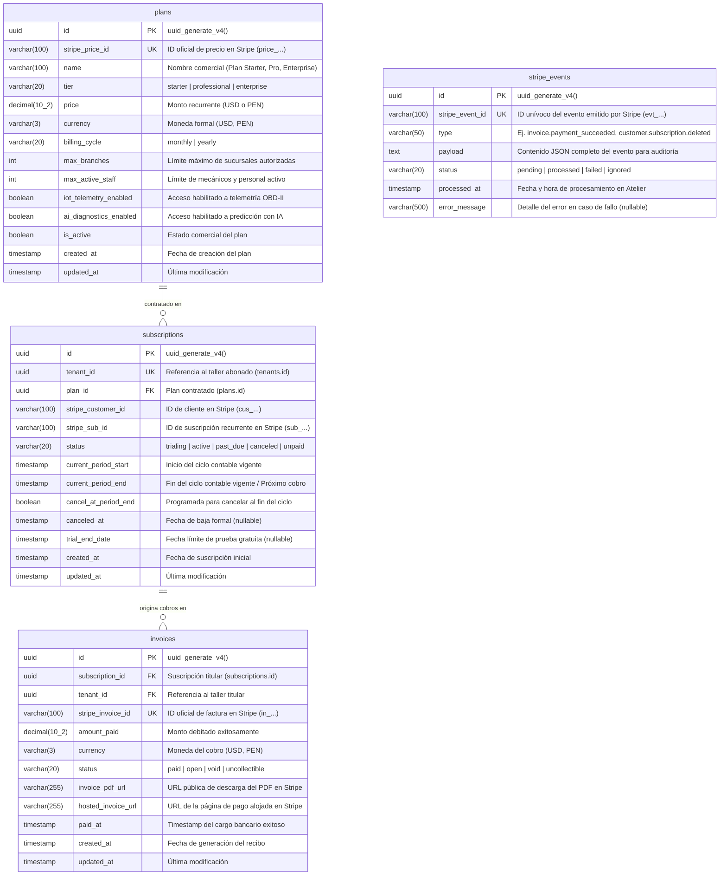

## 10. Fase 7: Bounded Context 7 — SaaS Billing & Subscriptions Context (`com.andeva.atelier.platform.billing`)

### 10.1. Diccionario y Propósito del Contexto

#### 10.1.1. Propósito y Límites de Responsabilidad
El **SaaS Billing & Subscriptions Context** administra el modelo de ingresos comerciales B2B y el aprovisionamiento de membresías de la plataforma Atelier hacia los talleres mecánicos abonados. Su delimitación responde a tres principios fundamentales de gobernanza de software:
1. **Desacoplamiento Estricto entre Facturación B2B (Andeva -> Taller) vs. Facturación Local (Taller -> Conductor):** En la versión previa (v1), los conceptos de facturación se encontraban severamente acoplados con cotizaciones y comprobantes fiscales locales. En la arquitectura v2, este contexto administra exclusivamente los planes comerciales contratados por el taller automotriz con la empresa *Andeva*, mientras que el contexto de **Invoicing & Compliance** gestiona la emisión de comprobantes fiscales tributarios (Facturas y Boletas UBL 2.1 ante SUNAT) del taller a sus clientes particulares.
2. **Ciclo de Vida de Planes y Membresías Recurrentes (`SubscriptionPlan` y `TenantSubscription`):** Administra el catálogo de planes comerciales (`STARTER`, `PROFESSIONAL`, `ENTERPRISE`), sus ciclos de cobro (mensual o anual) y los estados del ciclo de vida de la suscripción (`TRIALING`, `ACTIVE`, `PAST_DUE`, `CANCELED`, `UNPAID`).
3. **Gobernanza de Cuotas y Límites de Plataforma (*Tenant Quota Limits*):** Determina qué capacidades operativas tiene habilitadas cada taller en función de su plan activo:
   * Cantidad máxima de sucursales físicas permitidas (`maxBranches`).
   * Límite máximo de mecánicos y personal de taller activos simultáneamente (`maxActiveStaff`).
   * Habilitación de funcionalidades avanzadas como la ingesta y alertas predictivas de telemetría IoT OBD-II (`iotTelemetryEnabled`) o reportes ejecutivos de rentabilidad financiera.
4. **Cumplimiento Estricto de Seguridad PCI-DSS:** Para certificar el cumplimiento de los estándares internacionales de la industria de tarjetas de pago (**PCI-DSS Nivel 1**), el backend de Atelier **jamás procesa, transmite ni almacena números de tarjeta de crédito (PAN), códigos de seguridad CVV ni fechas de caducidad**. Todo el intercambio sensible de datos bancarios se delega al frontend mediante componentes seguros de **Stripe Elements** y el **SDK Móvil de Stripe**, intercambiando únicamente identificadores de clientes y métodos de pago tokenizados (`stripe_customer_id`, `stripe_sub_id`, `stripe_price_id`).
5. **Idempotencia Garantizada en Webhooks (*Webhook Idempotency*):** Cuando la pasarela de pagos ejecuta una operación asíncrona de cobro recurrente o renovación, notifica a los servidores de Atelier mediante solicitudes HTTP Webhook. Ante fluctuaciones de conectividad, Stripe reintenta el despacho del mismo evento hasta por 72 horas. Para evitar cobros duplicados, renovaciones espurias o inconsistencias de saldo, la tabla `stripe_events` registra unívocamente cada identificador de evento (`stripe_event_id` con restricción `UNIQUE`), descartando de forma inmediata cualquier procesamiento repetido.
6. **Aceleración de Lectura mediante Caché en Memoria (`Caffeine Cache`):** Dado que cada invocación a endpoints protegidos del ERP en cualquier Bounded Context requiere verificar si la suscripción del taller sigue activa y si no ha sobrepasado sus límites de uso, consultar PostgreSQL en cada petición crearía un cuello de botella de latencia inaceptable. Se implementa una capa de caché de ultra alta velocidad en memoria local JVM con **Caffeine Cache** (TTL de 5 minutos e invalidación reactiva inmediata ante webhooks de Stripe).

#### 10.1.2. Decisiones de Diseño e Integraciones Críticas
* **Integración Oficial con `stripe-java` SDK:** En lugar de implementar clientes HTTP ad-hoc propensos a errores de compatibilidad, Atelier integra la biblioteca oficial de Stripe para Java, gestionando sesiones de checkout seguras (*Stripe Checkout Sessions*) y portales de autogestión de cliente (*Stripe Customer Billing Portal*).
* **Verificación Criptográfica de Firmas Webhook:** Todos los mensajes entrantes en el endpoint público de webhooks son validados matemáticamente verificando la firma HMAC-SHA256 (`Stripe-Signature`) contra el secreto simétrico del webhook (`STRIPE_WEBHOOK_SECRET`), impidiendo ataques de suplantación de identidad (*Spoofing*).
* **Fachada Open Host Service (OHS) con Respaldo en Caché:** Los contextos de IAM, CRM, MRO e IoT consultan la interfaz `SubscriptionContextFacade.isTenantSubscriptionActive(TenantId tenantId)` y `isFeatureAllowed(TenantId tenantId, String featureKey)`, resolviendo la autorización de cuotas en menos de 0.05 milisegundos gracias a Caffeine Cache.

---

### 10.2. 2.6.7.1. Domain Layer

#### 10.2.1. Aggregates & Aggregate Roots

##### 1. `SubscriptionPlan` (Aggregate Root)
* **Paquete:** `com.andeva.atelier.platform.billing.domain.model.aggregates`
* **Herencia:** Extiende `AbstractDomainAggregateRoot<SubscriptionPlan>`
* **Propósito:** Representa un paquete comercial de software ofrecido por Andeva a los talleres mecánicos, definiendo precio, periodicidad y límites de recursos autorizados.
* **Atributos:**
  * `id: PlanId` — Identificador universal del plan (UUID).
  * `stripePriceId: StripePriceId` — Identificador del precio recurrente en Stripe (ej. `price_1N2M3...`).
  * `name: String` — Denominación del plan (ej. "Plan Profesional - Hasta 3 Sucursales", "Plan Taller Inicial").
  * `tier: PlanTier` — Nivel del plan (`STARTER`, `PROFESSIONAL`, `ENTERPRISE`).
  * `pricing: PlanPricing` — Objeto de valor que agrupa el precio monetario (`Money price`) y el ciclo de facturación (`BillingCycle billingCycle` [`MONTHLY`, `YEARLY`]).
  * `quotaLimits: TenantQuotaLimits` — Objeto de valor con las cuotas máximas autorizadas (`maxBranches`, `maxActiveStaff`, `iotTelemetryEnabled`, `aiDiagnosticsEnabled`).
  * `isActive: boolean` — Bandera que determina si el plan está disponible para nuevas contrataciones comerciales.
* **Invariantes y Reglas de Negocio:**
  * El identificador de precio en Stripe (`stripePriceId`) debe comenzar con el prefijo `price_` y no puede ser nulo ni estar vacío.
  * El precio monetario no puede ser negativo.
  * El límite de sucursales debe ser al menos 1 y el de personal al menos 1.
* **Métodos:**
  * `+ static SubscriptionPlan create(StripePriceId stripePriceId, String name, PlanTier tier, PlanPricing pricing, TenantQuotaLimits quotas): SubscriptionPlan`: Factoría de dominio; valida invariantes, establece vigencia activa y registra `SubscriptionPlanCreatedEvent`.
  * `+ void updateDetails(String name, PlanPricing pricing, TenantQuotaLimits quotas): void`: Modifica los parámetros comerciales y cuotas del plan.
  * `+ void deactivate(): void`: Retira el plan del catálogo para nuevas compras, preservando las suscripciones existentes.
  * `+ void activate(): void`: Restituye la disponibilidad comercial.

##### 2. `TenantSubscription` (Aggregate Root)
* **Paquete:** `com.andeva.atelier.platform.billing.domain.model.aggregates`
* **Herencia:** Extiende `AbstractDomainAggregateRoot<TenantSubscription>`
* **Propósito:** Representa el contrato de suscripción SaaS activo o histórico de un taller automotriz con la plataforma Atelier.
* **Atributos:**
  * `id: SubscriptionId` — Identificador universal de la suscripción (UUID).
  * `tenantId: TenantId` — Taller mecánico titular del contrato.
  * `planId: PlanId` — Plan comercial contratado.
  * `stripeCustomerId: StripeCustomerId` — Identificador de cliente en Stripe (ej. `cus_...`).
  * `stripeSubscriptionId: StripeSubscriptionId` — Identificador unívoco de suscripción en Stripe (ej. `sub_...`).
  * `status: SubscriptionStatus` — Estado del ciclo de vida (`TRIALING`, `ACTIVE`, `PAST_DUE`, `CANCELED`, `UNPAID`, `INCOMPLETE`).
  * `currentPeriod: SubscriptionPeriod` — Periodo actual de cobertura (`startDate: Instant`, `endDate: Instant`).
  * `cancelAtPeriodEnd: boolean` — Bandera que indica si la suscripción se cancelará automáticamente al concluir el periodo vigente.
  * `canceledAt: Optional<Instant>` — Fecha y hora formal de cancelación (nullable).
  * `trialEndDate: Optional<Instant>` — Fecha límite de prueba gratuita (nullable).
* **Invariantes y Reglas de Negocio:**
  * No puede existir más de una suscripción activa o en periodo de prueba (`ACTIVE`, `TRIALING`, `PAST_DUE`) simultáneamente para el mismo `tenant_id`.
  * La fecha de inicio del periodo no puede ser posterior a la fecha de fin del periodo.
  * Una suscripción en estado `CANCELED` no puede reactivarse directamente; requiere la contratación de una nueva suscripción.
* **Métodos:**
  * `+ static TenantSubscription startTrial(TenantId tenantId, PlanId planId, StripeCustomerId customerId, int trialDays): TenantSubscription`: Factoría para periodos de prueba gratuitos; registra `TenantSubscriptionActivatedEvent`.
  * `+ static TenantSubscription activate(TenantId tenantId, PlanId planId, StripeCustomerId customerId, StripeSubscriptionId subscriptionId, SubscriptionPeriod period): TenantSubscription`: Factoría tras confirmación de pago inicial de Stripe; registra `TenantSubscriptionActivatedEvent`.
  * `+ void renewPeriod(SubscriptionPeriod newPeriod): void`: Extiende la vigencia del servicio tras un cobro recurrente exitoso; registra `TenantSubscriptionRenewedEvent`.
  * `+ void markPastDue(): void`: Marca la suscripción en mora cuando un cobro recurrente es rechazado por el banco emisor; registra `TenantSubscriptionPastDueEvent`.
  * `+ void cancelAtPeriodEnd(): void`: Programa la cancelación al finalizar el ciclo de facturación pagado.
  * `+ void cancelImmediately(Instant cancellationTimestamp): void`: Cancela de forma inmediata la suscripción revocando el acceso a la plataforma; registra `TenantSubscriptionCanceledEvent`.
  * `+ void changePlan(PlanId newPlanId, StripePriceId newPriceId): void`: Actualiza el plan contratado (*upgrade* o *downgrade*) y registra `TenantPlanChangedEvent`.
  * `+ boolean isAccessGranted(): boolean`: Evalúa si el taller está autorizado a operar en la plataforma (estados `ACTIVE` o `TRIALING`, o periodo de gracia en `PAST_DUE`).

##### 3. `SaasInvoice` (Aggregate Root)
* **Paquete:** `com.andeva.atelier.platform.billing.domain.model.aggregates`
* **Herencia:** Extiende `AbstractDomainAggregateRoot<SaasInvoice>`
* **Propósito:** Representa el recibo o factura formal emitida por Andeva hacia el taller por el uso de la suscripción mensual o anual.
* **Atributos:**
  * `id: SaasInvoiceId` — Identificador universal interno de la factura SaaS (UUID).
  * `subscriptionId: SubscriptionId` — Suscripción vinculada.
  * `tenantId: TenantId` — Taller pagador.
  * `stripeInvoiceId: StripeInvoiceId` — Identificador de factura en Stripe (ej. `in_...`).
  * `amountPaid: Money` — Monto efectivamente debitado a la tarjeta de crédito o cuenta bancaria.
  * `status: InvoiceStatus` — Estado de la factura (`PAID`, `OPEN`, `VOID`, `UNCOLLECTIBLE`).
  * `invoicePdfUrl: String` — Enlace seguro provisto por Stripe para la descarga del comprobante en PDF.
  * `hostedInvoiceUrl: String` — Enlace a la página web interactiva de pago de Stripe.
  * `paidAt: Optional<Instant>` — Momento cronológico del débito bancario exitoso.
* **Métodos:**
  * `+ static SaasInvoice recordPaid(SubscriptionId subscriptionId, TenantId tenantId, StripeInvoiceId stripeInvoiceId, Money amountPaid, String pdfUrl, String hostedUrl, Instant paidAt): SaasInvoice`: Registra el pago exitoso y emite `SaasInvoicePaymentSucceededEvent`.
  * `+ void markPaymentFailed(String reason): void`: Registra el fallo de cobro bancario y emite `SaasInvoicePaymentFailedEvent`.

##### 4. `StripeWebhookEvent` (Aggregate Root de Idempotencia)
* **Paquete:** `com.andeva.atelier.platform.billing.domain.model.aggregates`
* **Propósito:** Garantiza el procesamiento exactamente una vez (*Exactly-Once Processing*) de las notificaciones asíncronas de Stripe, actuando como escudo contra duplicidades de red.
* **Atributos:**
  * `id: UUID` — Identificador de base de datos interno.
  * `stripeEventId: StripeEventId` — Identificador unívoco del evento emitido por Stripe (`evt_...`). **Restricción UNIQUE a nivel de BD**.
  * `eventType: String` — Tipo de evento (ej. `invoice.payment_succeeded`, `customer.subscription.deleted`).
  * `eventPayload: String` — Contenido serializado en formato JSON de la notificación para auditoría forense.
  * `status: WebhookProcessingStatus` — Estado del procesamiento (`PENDING`, `PROCESSED`, `FAILED`, `IGNORED`).
  * `processedAt: Instant` — Timestamp de resolución en el backend.
  * `errorMessage: Optional<String>` — Detalle del error en caso de fallo durante el procesamiento.
* **Métodos:**
  * `+ static StripeWebhookEvent receive(StripeEventId eventId, String type, String payload): StripeWebhookEvent`: Registra la recepción inicial en estado `PENDING`.
  * `+ void markProcessed(): void`: Marca el evento como resuelto con éxito.
  * `+ void markFailed(String error): void`: Registra la causa de fallo para inspección.

---

#### 10.2.2. Entities (Child Entities)

##### `PlanFeature` (Entity)
* **Paquete:** `com.andeva.atelier.platform.billing.domain.model.entities`
* **Propósito:** Representa una característica funcional o módulo individual paquetizado dentro de un plan comercial de suscripción.
* **Atributos:**
  * `id: UUID` — Identificador de la característica.
  * `featureKey: String` — Clave alfanumérica única (ej. `FEATURE_OBD2_TELEMETRY`, `FEATURE_AI_PREDICTIONS`, `FEATURE_MULTI_BRANCH`).
  * `description: String` — Descripción para el catálogo comercial.
  * `isEnabled: boolean` — Disponibilidad en el plan actual.

---

#### 10.2.3. Value Objects

* **`PlanId`:** Identificador universal inmutable de un plan (`record PlanId(UUID value)`).
* **`SubscriptionId`:** Identificador inmutable de una suscripción (`record SubscriptionId(UUID value)`).
* **`SaasInvoiceId`:** Identificador inmutable de una factura SaaS (`record SaasInvoiceId(UUID value)`).
* **`StripeEventId`:** Objeto de valor para identificadores de eventos de Stripe (`record StripeEventId(String value)`). Valida que cumpla el patrón `^evt_[a-zA-Z0-9]+$`.
* **`StripeCustomerId`:** Identificador de cliente en Stripe (`record StripeCustomerId(String value)`). Valida prefijo `cus_`.
* **`StripeSubscriptionId`:** Identificador de suscripción en Stripe (`record StripeSubscriptionId(String value)`). Valida prefijo `sub_`.
* **`StripePriceId`:** Identificador de precio en Stripe (`record StripePriceId(String value)`). Valida prefijo `price_`.
* **`BillingCycle`:** Enumeración del ciclo de cobro recurrente (`MONTHLY`, `YEARLY`).
* **`SubscriptionStatus`:** Enumeración de estados de suscripción (`TRIALING`, `ACTIVE`, `PAST_DUE`, `CANCELED`, `UNPAID`, `INCOMPLETE`).
* **`InvoiceStatus`:** Enumeración del estado de factura SaaS (`PAID`, `OPEN`, `VOID`, `UNCOLLECTIBLE`).
* **`PlanTier`:** Nivel del paquete de software (`STARTER`, `PROFESSIONAL`, `ENTERPRISE`).
* **`PlanPricing`:** Objeto de valor que asocia el precio y su ciclo (`record PlanPricing(Money price, BillingCycle billingCycle)`).
* **`TenantQuotaLimits`:** Cuotas máximas autorizadas por el plan (`record TenantQuotaLimits(int maxBranches, int maxActiveStaff, boolean iotTelemetryEnabled, boolean aiDiagnosticsEnabled, int maxMonthlyWorkOrders)`).
* **`SubscriptionPeriod`:** Intervalo temporal de cobertura pagada (`record SubscriptionPeriod(Instant startDate, Instant endDate)`).
* **`WebhookProcessingStatus`:** Estado del despacho de webhooks (`PENDING`, `PROCESSED`, `FAILED`, `IGNORED`).

---

#### 10.2.4. Domain Commands

* **`CreateSubscriptionPlanCommand`:** Parámetros para registrar un nuevo plan comercial (`StripePriceId stripePriceId, String name, PlanTier tier, Money price, BillingCycle cycle, TenantQuotaLimits quotas`).
* **`UpdateSubscriptionPlanCommand`:** Modificación de cuotas o precio de un plan existente (`PlanId planId, String name, Money price, BillingCycle cycle, TenantQuotaLimits quotas`).
* **`InitiateCheckoutSessionCommand`:** Parámetros para iniciar la compra segura en Stripe (`TenantId tenantId, PlanId planId, String successUrl, String cancelUrl`).
* **`ProcessStripeWebhookCommand`:** Parámetros del webhook entrante (`String payload, String signatureHeader`).
* **`ChangeSubscriptionPlanCommand`:** Parámetros de upgrade/downgrade de plan (`SubscriptionId subscriptionId, PlanId newPlanId`).
* **`CancelSubscriptionCommand`:** Parámetros para solicitar baja voluntaria del servicio (`SubscriptionId subscriptionId, boolean cancelImmediately`).
* **`RecordSaasInvoicePaymentCommand`:** Parámetros para registrar el recibo de Stripe (`SubscriptionId subscriptionId, TenantId tenantId, StripeInvoiceId stripeInvoiceId, Money amount, String pdfUrl, String hostedUrl, Instant paidAt`).

---

#### 10.2.5. Domain Queries

* **`GetSubscriptionPlanByIdQuery`:** Consulta de un plan por su ID (`PlanId planId`).
* **`ListActivePlansQuery`:** Catálogo de planes vigentes para el portal de suscripción.
* **`GetTenantSubscriptionQuery`:** Consulta del estado contractual actual de un taller (`TenantId tenantId`).
* **`CheckTenantQuotaQuery`:** Consulta de límites y cuotas operativas vigentes (`TenantId tenantId`).
* **`ListTenantInvoicesQuery`:** Historial de facturas y recibos de un taller (`TenantId tenantId`).
* **`IsTenantSubscriptionActiveQuery`:** Validación de alta velocidad sobre si un taller puede utilizar el sistema (`TenantId tenantId`).

---

#### 10.2.6. Domain Events

* **`SubscriptionPlanCreatedEvent`:** Emitido al publicar un nuevo plan en el catálogo comercial (`PlanId planId, String name, PlanTier tier, Money price`).
* **`TenantSubscriptionActivatedEvent`:** Emitido al confirmarse el alta formal de un taller en un plan (`SubscriptionId subscriptionId, TenantId tenantId, PlanId planId, Instant expiresAt`).
* **`TenantSubscriptionRenewedEvent`:** Emitido al procesarse el cobro recurrente mensual o anual (`SubscriptionId subscriptionId, TenantId tenantId, Instant newPeriodEnd`).
* **`TenantSubscriptionPastDueEvent`:** Emitido al rebotar un intento de cobro en la tarjeta del taller (`SubscriptionId subscriptionId, TenantId tenantId, Instant gracePeriodEnd`).
* **`TenantSubscriptionCanceledEvent`:** Emitido al revocarse el servicio SaaS (`SubscriptionId subscriptionId, TenantId tenantId, Instant canceledAt`).
* **`TenantPlanChangedEvent`:** Emitido tras un upgrade o downgrade comercial (`SubscriptionId subscriptionId, TenantId tenantId, PlanId oldPlanId, PlanId newPlanId`).
* **`SaasInvoicePaymentSucceededEvent`:** Emitido al registrarse el recibo de Stripe (`SaasInvoiceId invoiceId, TenantId tenantId, Money amount`).
* **`SaasInvoicePaymentFailedEvent`:** Emitido cuando un cargo a tarjeta no prospera (`TenantId tenantId, String failureReason`).

---

#### 10.2.7. Domain Repositories (Interfaces)

```java
package com.andeva.atelier.platform.billing.domain.repositories;

public interface SubscriptionPlanRepository {
    SubscriptionPlan save(SubscriptionPlan plan);
    Optional<SubscriptionPlan> findById(PlanId id);
    Optional<SubscriptionPlan> findByStripePriceId(StripePriceId stripePriceId);
    List<SubscriptionPlan> findAllActive();
}

public interface TenantSubscriptionRepository {
    TenantSubscription save(TenantSubscription subscription);
    Optional<TenantSubscription> findById(SubscriptionId id);
    Optional<TenantSubscription> findByTenantId(TenantId tenantId);
    Optional<TenantSubscription> findByStripeSubscriptionId(StripeSubscriptionId stripeSubId);
    boolean existsActiveByTenantId(TenantId tenantId);
}

public interface SaasInvoiceRepository {
    SaasInvoice save(SaasInvoice invoice);
    Optional<SaasInvoice> findById(SaasInvoiceId id);
    Optional<SaasInvoice> findByStripeInvoiceId(StripeInvoiceId stripeInvoiceId);
    List<SaasInvoice> findAllByTenantId(TenantId tenantId);
}

public interface StripeWebhookEventRepository {
    StripeWebhookEvent save(StripeWebhookEvent event);
    Optional<StripeWebhookEvent> findByStripeEventId(StripeEventId stripeEventId);
    boolean existsByStripeEventId(StripeEventId stripeEventId);
}
```

---

#### 10.2.8. Domain Services

##### 1. `SubscriptionQuotaEnforcementService` (Servicio de Dominio de Gobernanza de Cuotas)
* **Paquete:** `com.andeva.atelier.platform.billing.domain.services`
* **Propósito:** Valida de forma estricta si un taller mecánico se encuentra dentro de los límites operativos estipulados por su plan contratado antes de permitir altas de recursos en otros Bounded Contexts:
```java
package com.andeva.atelier.platform.billing.domain.services;

import com.andeva.atelier.platform.billing.domain.model.aggregates.SubscriptionPlan;
import com.andeva.atelier.platform.billing.domain.model.aggregates.TenantSubscription;
import com.andeva.atelier.platform.billing.domain.model.exceptions.QuotaExceededException;
import com.andeva.atelier.platform.billing.domain.model.valueobjects.TenantQuotaLimits;
import org.springframework.stereotype.Service;

@Service
public class SubscriptionQuotaEnforcementService {

    public void validateBranchCreationAllowed(TenantSubscription subscription, SubscriptionPlan plan, int currentBranchCount) {
        if (!subscription.isAccessGranted()) {
            throw new QuotaExceededException("La suscripción del taller se encuentra inactiva o suspendida.");
        }
        TenantQuotaLimits limits = plan.getQuotaLimits();
        if (currentBranchCount >= limits.maxBranches()) {
            throw new QuotaExceededException(String.format(
                "Límite de sucursales alcanzado (%d/%d). Actualice su plan a Professional o Enterprise para abrir nuevas sedes.",
                currentBranchCount, limits.maxBranches()
            ));
        }
    }

    public void validateStaffAdditionAllowed(TenantSubscription subscription, SubscriptionPlan plan, int currentStaffCount) {
        if (!subscription.isAccessGranted()) {
            throw new QuotaExceededException("La suscripción del taller se encuentra inactiva o suspendida.");
        }
        TenantQuotaLimits limits = plan.getQuotaLimits();
        if (currentStaffCount >= limits.maxActiveStaff()) {
            throw new QuotaExceededException(String.format(
                "Límite de personal alcanzado (%d/%d). Actualice su plan para registrar más mecánicos y asesores.",
                currentStaffCount, limits.maxActiveStaff()
            ));
        }
    }

    public boolean isFeatureEnabled(TenantSubscription subscription, SubscriptionPlan plan, String featureKey) {
        if (!subscription.isAccessGranted()) return false;
        return switch (featureKey) {
            case "FEATURE_OBD2_TELEMETRY" -> plan.getQuotaLimits().iotTelemetryEnabled();
            case "FEATURE_AI_PREDICTIONS" -> plan.getQuotaLimits().aiDiagnosticsEnabled();
            default -> false;
        };
    }
}
```

##### 2. `StripeWebhookSignatureVerificationService` (Servicio Criptográfico de Firmas)
* **Paquete:** `com.andeva.atelier.platform.billing.domain.services`
* **Propósito:** Valida la autenticidad del payload de cada webhook verificando la firma HMAC-SHA256 contra el secreto del webhook de Stripe, mitigando ataques de intermediarios (*Man-in-the-Middle*).

---

### 10.3. 2.6.7.2. Interface Layer

#### 10.3.1. REST Controllers

##### 1. `SubscriptionPlansController`
* **Ruta Base:** `/api/v1/billing/plans`
* **Responsabilidad:** Catálogo comercial de planes SaaS.
* **Endpoints:**
  * `GET /`: Lista los planes comerciales activos disponibles para compra. Responde `200 OK`.
  * `GET /{id}`: Detalle de un plan específico con sus cuotas y precio. Responde `200 OK`.
  * `POST /`: Creación administrativa de nuevos planes vinculados a Stripe. Responde `201 Created`.
  * `PUT /{id}`: Actualización de cuotas y metadatos de un plan. Responde `200 OK`.

##### 2. `TenantSubscriptionsController`
* **Ruta Base:** `/api/v1/billing/subscriptions`
* **Responsabilidad:** Gestión de membresías por parte de administradores de talleres mecánicos.
* **Endpoints:**
  * `GET /me`: Consulta la suscripción activa del taller autenticado, su estado, periodo de vigencia y cuotas consumidas. Responde `200 OK`.
  * `POST /checkout-session`: Genera una URL de sesión de **Stripe Checkout** para suscribirse o realizar un upgrade de plan. Responde `200 OK` con la URL segura de pago de Stripe.
  * `POST /customer-portal`: Genera una sesión de **Stripe Customer Portal** para que el dueño del taller actualice su tarjeta de crédito o consulte recibos directamente en la interfaz oficial de Stripe. Responde `200 OK` con la URL de redirección.
  * `POST /cancel`: Solicita la cancelación de la suscripción al finalizar el periodo pagado. Responde `200 OK`.

##### 3. `SaasInvoicesController`
* **Ruta Base:** `/api/v1/billing/invoices`
* **Responsabilidad:** Consulta y descarga de comprobantes de pago de la plataforma Atelier emitidos al taller.
* **Endpoints:**
  * `GET /`: Lista las facturas históricas de suscripción del taller autenticado. Responde `200 OK`.
  * `GET /{id}/pdf`: Redirige a la descarga directa del PDF oficial alojado en Stripe. Responde `302 Found`.

##### 4. `StripeWebhooksController`
* **Ruta Base:** `/api/v1/billing/webhooks/stripe`
* **Responsabilidad:** Endpoint de alta disponibilidad receptor de eventos de Stripe.
* **Endpoints:**
  * `POST /`: Recibe la carga útil cruda (*raw payload*) y la cabecera `Stripe-Signature`. Valida la firma HMAC-SHA256, verifica idempotencia con `stripe_events` y encola la actualización de estado. Responde de inmediato `200 OK` para confirmar recepción a Stripe.

---

#### 10.3.2. REST Resources & DTOs (Records)

```java
package com.andeva.atelier.platform.billing.interfaces.rest.resources;

public record SubscriptionPlanResource(
    UUID id,
    String stripePriceId,
    String name,
    String tier,
    BigDecimal price,
    String currency,
    String billingCycle,
    TenantQuotaLimitsDto quotaLimits,
    boolean isActive
) {}

public record TenantQuotaLimitsDto(
    int maxBranches,
    int maxActiveStaff,
    boolean iotTelemetryEnabled,
    boolean aiDiagnosticsEnabled,
    int maxMonthlyWorkOrders
) {}

public record CreateCheckoutSessionRequest(
    @NotNull UUID planId,
    @NotBlank String successUrl,
    @NotBlank String cancelUrl
) {}

public record CheckoutSessionResponse(
    String checkoutUrl,
    String sessionId
) {}

public record CustomerPortalResponse(
    String portalUrl
) {}

public record TenantSubscriptionResource(
    UUID id,
    UUID tenantId,
    UUID planId,
    String planName,
    String status,
    Instant currentPeriodStart,
    Instant currentPeriodEnd,
    boolean cancelAtPeriodEnd,
    TenantQuotaLimitsDto quotas
) {}

public record SaasInvoiceResource(
    UUID id,
    String stripeInvoiceId,
    BigDecimal amountPaid,
    String currency,
    String status,
    String invoicePdfUrl,
    String hostedInvoiceUrl,
    Instant paidAt
) {}
```

---

#### 10.3.3. REST Assemblers (Mappers)

* **`SubscriptionPlanResourceAssembler`:** Transforma agregados `SubscriptionPlan` a DTOs `SubscriptionPlanResource`.
* **`TenantSubscriptionResourceAssembler`:** Mapea agregados `TenantSubscription` y cuotas del plan a `TenantSubscriptionResource`.
* **`SaasInvoiceResourceAssembler`:** Transforma `SaasInvoice` a `SaasInvoiceResource`.

---

#### 10.3.4. Inbound ACL Facade (Open Host Service - OHS)

La fachada pública de suscripciones permite a todos los Bounded Contexts verificar estados y cuotas con latencia casi nula mediante **Caffeine Cache**:

```java
package com.andeva.atelier.platform.billing.interfaces.acl;

import java.util.UUID;

public interface SubscriptionContextFacade {
    /**
     * Resuelto en RAM (< 0.05 ms) mediante Caffeine In-Memory Cache.
     * Verifica si el taller tiene una suscripción vigente (ACTIVE, TRIALING o PAST_DUE en gracia).
     */
    boolean isTenantSubscriptionActive(UUID tenantId);

    /**
     * Retorna las cuotas operativas vigentes contratadas por el taller.
     */
    TenantQuotaLimitsDto getTenantQuotaLimits(UUID tenantId);

    /**
     * Valida si el taller puede aperturar una nueva sucursal física en IAM.
     */
    boolean canAddBranch(UUID tenantId, int currentBranchCount);

    /**
     * Valida si el taller puede contratar un nuevo mecánico o asesor en HR.
     */
    boolean canAddStaffMember(UUID tenantId, int currentStaffCount);

    /**
     * Valida si una funcionalidad avanzada (ej. Telemetría OBD-II IoT) está habilitada por el plan.
     */
    boolean isFeatureAllowed(UUID tenantId, String featureKey);
}
```

---

#### 10.3.5. Integration Events (Published / Consumed)

##### 1. Eventos Publicados por Billing hacia otros Bounded Contexts
* **`TenantSubscriptionStatusChangedIntegrationEvent`:** Emitido cuando la suscripción transiciona a `ACTIVE`, `PAST_DUE` o `CANCELED`. Invalida la caché de Caffeine en todas las instancias y ajusta permisos en IAM.
* **`TenantPlanUpgradedIntegrationEvent`:** Emitido al realizarse un upgrade de plan. Habilita de inmediato cuotas expandidas en MRO, HR e IoT.
* **`TenantSubscriptionSuspendedIntegrationEvent`:** Emitido al cancelarse definitivamente la suscripción. Bloquea el acceso a endpoints operativos del ERP.

##### 2. Eventos Consumidos por Billing desde otros Bounded Contexts
* **`TenantRegisteredIntegrationEvent` (emitido por IAM & Tenancy Context):** Inicia automáticamente el aprovisionamiento de un cliente en Stripe (`StripeCustomerId`) y vincula una suscripción de prueba gratuita (*Free Trial* de 14 días).

---

### 10.4. 2.6.7.3. Application Layer

#### 10.4.1. Command Services (Handlers)

##### 1. `TenantSubscriptionCommandServiceImpl`
* **Responsabilidad:** Orquestar el flujo de contratación y gestión de suscripciones:
  1. Para nuevas suscripciones: Invoca a `StripeClientGateway` para inicializar una sesión de checkout y retorna la URL segura al frontend.
  2. Al procesar webhooks de Stripe: Actualiza de forma atómica el estado de la suscripción, extiende periodos contables y actualiza la tabla de auditoría `subscriptions`.
  3. Despacha eventos de integración inter-contexto y purga la caché local de Caffeine para el taller afectado.

##### 2. `StripeWebhookCommandServiceImpl`
* **Responsabilidad:** Procesamiento seguro e idempotente de webhooks:
  1. Verifica la firma HMAC-SHA256 con `StripeWebhookSignatureVerificationService`.
  2. Comprueba si el `stripe_event_id` ya existe en la tabla `stripe_events`. Si existe, retorna éxito inmediato (`200 OK`) sin volver a ejecutar la lógica de negocio.
  3. Inserta el registro en `stripe_events` con estado `PENDING`.
  4. En función del tipo de evento:
     * `checkout.session.completed`: Asocia el `stripe_subscription_id` con el `tenant_id` y activa el plan.
     * `invoice.payment_succeeded`: Registra la factura en `saas_invoices` y renueva el periodo en `subscriptions`.
     * `invoice.payment_failed`: Marca la suscripción como `PAST_DUE` y alerta por correo vía Resend.
     * `customer.subscription.deleted`: Transiciona la suscripción a `CANCELED`.
  5. Marca el evento como `PROCESSED`.

##### 3. `SubscriptionPlanCommandServiceImpl`
* **Responsabilidad:** Crear y actualizar planes sincronizados con productos y precios de Stripe.

##### 4. `SaasInvoiceCommandServiceImpl`
* **Responsabilidad:** Registrar comprobantes y emitir notificaciones de pago exitoso.

---

#### 10.4.2. Query Services (Handlers)

##### `TenantSubscriptionQueryServiceImpl`
* **Responsabilidad:** Resuelve consultas de suscripción implementando **Caffeine Cache**:
```java
package com.andeva.atelier.platform.billing.application.internal.queryservices;

import com.andeva.atelier.platform.billing.domain.model.aggregates.TenantSubscription;
import com.andeva.atelier.platform.billing.domain.model.valueobjects.SubscriptionStatus;
import com.andeva.atelier.platform.billing.domain.repositories.TenantSubscriptionRepository;
import com.andeva.atelier.platform.shared.domain.model.valueobjects.TenantId;
import org.springframework.cache.annotation.CacheEvict;
import org.springframework.cache.annotation.Cacheable;
import org.springframework.stereotype.Service;
import org.springframework.transaction.annotation.Transactional;

@Service
@Transactional(readOnly = true)
public class TenantSubscriptionQueryServiceImpl {
    private final TenantSubscriptionRepository subscriptionRepository;

    public TenantSubscriptionQueryServiceImpl(TenantSubscriptionRepository subscriptionRepository) {
        this.subscriptionRepository = subscriptionRepository;
    }

    @Cacheable(value = "tenantSubscriptionStatus", key = "#tenantId.value().toString()")
    public boolean isSubscriptionActive(TenantId tenantId) {
        return subscriptionRepository.findByTenantId(tenantId)
                .map(sub -> sub.getStatus() == SubscriptionStatus.ACTIVE 
                         || sub.getStatus() == SubscriptionStatus.TRIALING)
                .orElse(false);
    }

    @CacheEvict(value = "tenantSubscriptionStatus", key = "#tenantId.value().toString()")
    public void evictSubscriptionCache(TenantId tenantId) {
        // Purga reactiva de caché tras recepción de Webhook de Stripe
    }
}
```

---

#### 10.4.3. Domain Event Handlers

* **`SubscriptionDomainEventHandler`:**
  * Al recibir `TenantSubscriptionActivatedEvent` o `TenantSubscriptionRenewedEvent`: Purga la caché de Caffeine del taller y envía un correo de confirmación de facturación a través de `ResendEmailAdapter`.
  * Al recibir `TenantSubscriptionPastDueEvent`: Despacha un correo urgente al administrador del taller informando el fallo de cobro a la tarjeta y proveyendo un enlace al Stripe Customer Portal para regularizar su medio de pago antes de la suspensión de la cuenta.

---

#### 10.4.4. Outbound ACL Services & Remote Adapters

##### `StripeAclService`
* **Paquete:** `com.andeva.atelier.platform.billing.application.internal.outboundservices.acl`
* **Propósito:** Encapsula las clases nativas del SDK `com.stripe.*` y transforma excepciones externas (`StripeException`, `CardException`) en excepciones de dominio semánticas de Atelier.

---

### 10.5. 2.6.7.4. Infrastructure Layer

#### 10.5.1. JPA Entities

##### 1. `SubscriptionPlanJpaEntity`
* **Tabla Relacional:** `plans`
* **Mapeo:**
```java
package com.andeva.atelier.platform.billing.infrastructure.persistence.jpa.entities;

import com.andeva.atelier.platform.shared.infrastructure.persistence.jpa.entities.AuditableAbstractPersistenceEntity;
import jakarta.persistence.*;
import java.math.BigDecimal;
import java.util.UUID;

@Entity
@Table(name = "plans")
public class SubscriptionPlanJpaEntity extends AuditableAbstractPersistenceEntity {
    @Id
    @Column(name = "id", nullable = false, updatable = false)
    private UUID id;

    @Column(name = "stripe_price_id", nullable = false, length = 100, unique = true)
    private String stripePriceId;

    @Column(name = "name", nullable = false, length = 100)
    private String name;

    @Column(name = "tier", nullable = false, length = 20)
    private String tier;

    @Column(name = "price", nullable = false, precision = 10, scale = 2)
    private BigDecimal price;

    @Column(name = "currency", nullable = false, length = 3)
    private String currency = "USD";

    @Column(name = "billing_cycle", nullable = false, length = 20)
    private String billingCycle;

    @Column(name = "max_branches", nullable = false)
    private int maxBranches;

    @Column(name = "max_active_staff", nullable = false)
    private int maxActiveStaff;

    @Column(name = "iot_telemetry_enabled", nullable = false)
    private boolean iotTelemetryEnabled;

    @Column(name = "ai_diagnostics_enabled", nullable = false)
    private boolean aiDiagnosticsEnabled;

    @Column(name = "is_active", nullable = false)
    private boolean isActive = true;

    // Getters y Setters JPA
}
```

##### 2. `TenantSubscriptionJpaEntity`
* **Tabla Relacional:** `subscriptions`
* **Mapeo:**
```java
package com.andeva.atelier.platform.billing.infrastructure.persistence.jpa.entities;

import com.andeva.atelier.platform.shared.infrastructure.persistence.jpa.entities.AuditableAbstractPersistenceEntity;
import jakarta.persistence.*;
import java.time.Instant;
import java.util.UUID;

@Entity
@Table(name = "subscriptions", uniqueConstraints = {
    @UniqueConstraint(name = "uk_subscriptions_tenant", columnNames = {"tenant_id"})
}, indexes = {
    @Index(name = "idx_subscriptions_stripe_sub", columnList = "stripe_sub_id"),
    @Index(name = "idx_subscriptions_status", columnList = "status")
})
public class TenantSubscriptionJpaEntity extends AuditableAbstractPersistenceEntity {
    @Id
    @Column(name = "id", nullable = false, updatable = false)
    private UUID id;

    @Column(name = "tenant_id", nullable = false, updatable = false)
    private UUID tenantId;

    @Column(name = "plan_id", nullable = false)
    private UUID planId;

    @Column(name = "stripe_customer_id", nullable = false, length = 100)
    private String stripeCustomerId;

    @Column(name = "stripe_sub_id", nullable = false, length = 100)
    private String stripeSubscriptionId;

    @Column(name = "status", nullable = false, length = 20)
    private String status;

    @Column(name = "current_period_start", nullable = false)
    private Instant currentPeriodStart;

    @Column(name = "current_period_end", nullable = false)
    private Instant currentPeriodEnd;

    @Column(name = "cancel_at_period_end", nullable = false)
    private boolean cancelAtPeriodEnd = false;

    @Column(name = "canceled_at")
    private Instant canceledAt;

    @Column(name = "trial_end_date")
    private Instant trialEndDate;

    // Getters y Setters JPA
}
```

##### 3. `SaasInvoiceJpaEntity`
* **Tabla Relacional:** `invoices`
* **Mapeo:**
```java
package com.andeva.atelier.platform.billing.infrastructure.persistence.jpa.entities;

import com.andeva.atelier.platform.shared.infrastructure.persistence.jpa.entities.AuditableAbstractPersistenceEntity;
import jakarta.persistence.*;
import java.math.BigDecimal;
import java.time.Instant;
import java.util.UUID;

@Entity
@Table(name = "invoices", indexes = {
    @Index(name = "idx_invoices_tenant", columnList = "tenant_id"),
    @Index(name = "idx_invoices_stripe_inv", columnList = "stripe_invoice_id")
})
public class SaasInvoiceJpaEntity extends AuditableAbstractPersistenceEntity {
    @Id
    @Column(name = "id", nullable = false, updatable = false)
    private UUID id;

    @Column(name = "subscription_id", nullable = false, updatable = false)
    private UUID subscriptionId;

    @Column(name = "tenant_id", nullable = false, updatable = false)
    private UUID tenantId;

    @Column(name = "stripe_invoice_id", nullable = false, length = 100, unique = true)
    private String stripeInvoiceId;

    @Column(name = "amount_paid", nullable = false, precision = 10, scale = 2)
    private BigDecimal amountPaid;

    @Column(name = "currency", nullable = false, length = 3)
    private String currency = "USD";

    @Column(name = "status", nullable = false, length = 20)
    private String status;

    @Column(name = "invoice_pdf_url", length = 255)
    private String invoicePdfUrl;

    @Column(name = "hosted_invoice_url", length = 255)
    private String hostedInvoiceUrl;

    @Column(name = "paid_at")
    private Instant paidAt;

    // Getters y Setters JPA
}
```

##### 4. `StripeWebhookEventJpaEntity`
* **Tabla Relacional:** `stripe_events`
* **Mapeo:**
```java
package com.andeva.atelier.platform.billing.infrastructure.persistence.jpa.entities;

import jakarta.persistence.*;
import java.time.Instant;
import java.util.UUID;

@Entity
@Table(name = "stripe_events", uniqueConstraints = {
    @UniqueConstraint(name = "uk_stripe_events_event_id", columnNames = {"stripe_event_id"})
})
public class StripeWebhookEventJpaEntity {
    @Id
    @Column(name = "id", nullable = false, updatable = false)
    private UUID id;

    @Column(name = "stripe_event_id", nullable = false, length = 100)
    private String stripeEventId;

    @Column(name = "type", nullable = false, length = 50)
    private String type;

    @Column(name = "payload", columnDefinition = "TEXT", nullable = false)
    private String payload;

    @Column(name = "status", nullable = false, length = 20)
    private String status;

    @Column(name = "processed_at", nullable = false)
    private Instant processedAt;

    @Column(name = "error_message", length = 500)
    private String errorMessage;

    // Getters y Setters JPA
}
```

---

#### 10.5.2. Spring Data JPA Repositories

```java
package com.andeva.atelier.platform.billing.infrastructure.persistence.jpa.repositories;

public interface SpringDataSubscriptionPlanRepository extends JpaRepository<SubscriptionPlanJpaEntity, UUID> {
    Optional<SubscriptionPlanJpaEntity> findByStripePriceId(String stripePriceId);
    List<SubscriptionPlanJpaEntity> findAllByIsActiveTrue();
}

public interface SpringDataTenantSubscriptionRepository extends JpaRepository<TenantSubscriptionJpaEntity, UUID> {
    Optional<TenantSubscriptionJpaEntity> findByTenantId(UUID tenantId);
    Optional<TenantSubscriptionJpaEntity> findByStripeSubscriptionId(String stripeSubscriptionId);
    boolean existsByTenantIdAndStatusIn(UUID tenantId, List<String> activeStatuses);
}

public interface SpringDataSaasInvoiceRepository extends JpaRepository<SaasInvoiceJpaEntity, UUID> {
    Optional<SaasInvoiceJpaEntity> findByStripeInvoiceId(String stripeInvoiceId);
    List<SaasInvoiceJpaEntity> findAllByTenantIdOrderByCreatedAtDesc(UUID tenantId);
}

public interface SpringDataStripeWebhookEventRepository extends JpaRepository<StripeWebhookEventJpaEntity, UUID> {
    Optional<StripeWebhookEventJpaEntity> findByStripeEventId(String stripeEventId);
    boolean existsByStripeEventId(String stripeEventId);
}
```

---

#### 10.5.3. Repository Implementations & Adapters

* **`SubscriptionPlanRepositoryImpl`:** Implementa `SubscriptionPlanRepository` adaptando entidades JPA y Value Objects.
* **`TenantSubscriptionRepositoryImpl`:** Adapta `SpringDataTenantSubscriptionRepository` hacia `TenantSubscriptionRepository`.
* **`SaasInvoiceRepositoryImpl`:** Adapta `SpringDataSaasInvoiceRepository`.
* **`StripeWebhookEventRepositoryImpl`:** Adapta la tabla de idempotencia `stripe_events`.

---

#### 10.5.4. Persistence Assemblers & Data Mappers

* **`SubscriptionPlanPersistenceAssembler`:** Transforma agregados de dominio `SubscriptionPlan` hacia `SubscriptionPlanJpaEntity` y viceversa.
* **`TenantSubscriptionPersistenceAssembler`:** Reconstruye agregados `TenantSubscription` a partir de `TenantSubscriptionJpaEntity`.
* **`SaasInvoicePersistenceAssembler`:** Transforma facturas SaaS entre capas.

---

#### 10.5.5. JPA Attribute Converters

* **`BillingCycleConverter`:** Mapea el enum `BillingCycle` hacia `VARCHAR(20)`.
* **`SubscriptionStatusConverter`:** Mapea `SubscriptionStatus` hacia `VARCHAR(20)`.
* **`InvoiceStatusConverter`:** Mapea `InvoiceStatus` hacia `VARCHAR(20)`.

---

#### 10.5.6. External Gateways & Stripe Adapters

##### `StripeClientGatewayImpl`
* **Paquete:** `com.andeva.atelier.platform.billing.infrastructure.gateways`
* **Propósito:** Encapsula la comunicación directa con los servicios de Stripe utilizando el SDK oficial `com.stripe`:
```java
package com.andeva.atelier.platform.billing.infrastructure.gateways;

import com.stripe.Stripe;
import com.stripe.model.checkout.Session;
import com.stripe.param.checkout.SessionCreateParams;
import org.springframework.beans.factory.annotation.Value;
import org.springframework.stereotype.Service;
import jakarta.annotation.PostConstruct;

@Service
public class StripeClientGatewayImpl implements StripeClientGateway {

    @Value("${stripe.secret-key}")
    private String stripeApiKey;

    @PostConstruct
    public void init() {
        Stripe.apiKey = this.stripeApiKey;
    }

    @Override
    public String createCheckoutSession(String customerId, String priceId, String successUrl, String cancelUrl) throws Exception {
        SessionCreateParams params = SessionCreateParams.builder()
                .setCustomer(customerId)
                .setMode(SessionCreateParams.Mode.SUBSCRIPTION)
                .setSuccessUrl(successUrl + "?session_id={CHECKOUT_SESSION_ID}")
                .setCancelUrl(cancelUrl)
                .addLineItem(SessionCreateParams.LineItem.builder()
                        .setPrice(priceId)
                        .setQuantity(1L)
                        .build())
                .build();

        Session session = Session.create(params);
        return session.getUrl();
    }
}
```

##### Configuración de `Caffeine Cache Manager`
```java
package com.andeva.atelier.platform.billing.infrastructure.cache;

import com.github.benmanes.caffeine.cache.Caffeine;
import org.springframework.cache.CacheManager;
import org.springframework.cache.caffeine.CaffeineCacheManager;
import org.springframework.context.annotation.Bean;
import org.springframework.context.annotation.Configuration;
import java.util.concurrent.TimeUnit;

@Configuration
public class BillingCacheConfig {

    @Bean
    public CacheManager billingCacheManager() {
        CaffeineCacheManager cacheManager = new CaffeineCacheManager("tenantSubscriptionStatus");
        cacheManager.setCaffeine(Caffeine.newBuilder()
                .initialCapacity(100)
                .maximumSize(10_000)
                .expireAfterWrite(5, TimeUnit.MINUTES)
                .recordStats());
        return cacheManager;
    }
}
```

---

### 10.6. 2.6.7.5. Bounded Context Component Level Diagram

El siguiente diagrama C4 Component Model detalla los controladores, servicios de aplicación, agregados de dominio, servicios de gobernanza de cuotas y adaptadores de infraestructura que componen el **SaaS Billing & Subscriptions Context**:

```mermaid
C4Component
    title Component Diagram - SaaS Billing & Subscriptions Context (com.andeva.atelier.platform.billing)

    Container_Boundary(billing_boundary, "SaaS Billing Context")
        Component(plans_ctrl, "SubscriptionPlansController", "Spring REST Controller", "Expone catálogo comercial de planes SaaS")
        Component(sub_ctrl, "TenantSubscriptionsController", "Spring REST Controller", "Expone endpoints para checkout, portal de cliente y membresías")
        Component(inv_ctrl, "SaasInvoicesController", "Spring REST Controller", "Expone historial de facturas y descarga de recibos")
        Component(webhook_ctrl, "StripeWebhooksController", "Spring REST Controller", "Recibe webhooks asíncronos de Stripe y verifica firma HMAC")

        Component(sub_facade, "SubscriptionContextFacade", "Spring Service (OHS)", "Fachada inbound con respaldo en Caffeine Cache para IAM y MRO")

        Component(sub_cmd, "TenantSubscriptionCommandService", "Application Service", "Orquesta checkout sessions y transiciones de suscripción")
        Component(webhook_cmd, "StripeWebhookCommandService", "Application Service", "Procesa eventos de Stripe garantizando idempotencia")
        Component(plan_cmd, "SubscriptionPlanCommandService", "Application Service", "Administra planes y sincronización con Stripe Prices")

        Component(quota_svc, "SubscriptionQuotaEnforcementService", "Domain Service", "Valida límites de sucursales, personal y módulos avanzados")
        Component(sig_svc, "StripeWebhookSignatureVerificationService", "Domain Service", "Verifica firma HMAC-SHA256 de Stripe-Signature")

        Component(caffeine_cache, "Caffeine In-Memory Cache", "JVM Memory Store", "Almacena en RAM validez de suscripción con TTL de 5 minutos")

        Component(stripe_acl, "StripeAclService", "Application ACL Service", "Traduce excepciones y modelos del SDK oficial de Stripe")
        Component(stripe_gw, "StripeClientGatewayImpl", "Stripe Java SDK Adapter", "Llamadas a Stripe API (Checkout, Customer, Subscriptions)")

        Component(plan_repo, "SubscriptionPlanRepositoryImpl", "Spring Data JPA Adapter", "Persiste planes en tabla plans")
        Component(sub_repo, "TenantSubscriptionRepositoryImpl", "Spring Data JPA Adapter", "Persiste suscripciones en tabla subscriptions")
        Component(inv_repo, "SaasInvoiceRepositoryImpl", "Spring Data JPA Adapter", "Persiste recibos en tabla invoices")
        Component(event_repo, "StripeWebhookEventRepositoryImpl", "Spring Data JPA Adapter", "Persiste webhooks en tabla stripe_events con lock único")
    End_Container_Boundary

    Container_Boundary(iam_context, "IAM & Tenancy Context")
        Component(branch_mgr, "BranchManagementService", "Application Service", "Consulta canAddBranch() antes de crear sucursales")
        Component(staff_mgr, "TenantMemberService", "Application Service", "Consulta canAddStaffMember() antes de invitar personal")
    End_Container_Boundary

    System_Ext(stripe_api, "Stripe Platform (PCI-DSS Level 1)", "Pasarela de pagos internacional (Checkout, Billing, Webhooks)")
    ContainerDb(postgres_db, "PostgreSQL 16 Relational DB", "Aiven Cloud", "Tablas plans, subscriptions, invoices, stripe_events")

    Rel(plans_ctrl, plan_cmd, "Delega administración de planes", "Java Calls")
    Rel(sub_ctrl, sub_cmd, "Delega checkout y membresías", "Java Calls")
    Rel(webhook_ctrl, webhook_cmd, "Delega eventos webhooks", "Java Calls")

    Rel(branch_mgr, sub_facade, "canAddBranch(tenantId)", "In-Process Call")
    Rel(staff_mgr, sub_facade, "canAddStaffMember(tenantId)", "In-Process Call")
    Rel(sub_facade, caffeine_cache, "Consulta estado en RAM (< 0.05 ms)", "In-Memory")
    Rel(sub_facade, quota_svc, "Verifica límites de plan", "Domain Calls")

    Rel(webhook_ctrl, sig_svc, "Valida HMAC-SHA256", "Crypto Math")
    Rel(webhook_cmd, event_repo, "Valida idempotencia en stripe_events", "JPA")

    Rel(sub_cmd, stripe_acl, "Invoca operaciones de suscripción", "Java Calls")
    Rel(stripe_acl, stripe_gw, "Delega al SDK stripe-java", "Java Calls")
    Rel(stripe_gw, stripe_api, "HTTPS API (Checkout Sessions / Portals)", "REST HTTPS")

    Rel(webhook_cmd, caffeine_cache, "Invalida caché reactivamente", "Cache Evict")

    Rel(plan_cmd, plan_repo, "Guarda agregados SubscriptionPlan", "JPA")
    Rel(sub_cmd, sub_repo, "Guarda agregados TenantSubscription", "JPA")
    Rel(webhook_cmd, inv_repo, "Guarda agregados SaasInvoice", "JPA")

    Rel(plan_repo, postgres_db, "Lee/Escribe en plans", "JDBC")
    Rel(sub_repo, postgres_db, "Lee/Escribe en subscriptions", "JDBC")
    Rel(inv_repo, postgres_db, "Lee/Escribe en invoices", "JDBC")
    Rel(event_repo, postgres_db, "Lee/Escribe en stripe_events (UNIQUE)", "JDBC")
```

---

### 10.7. 2.6.7.6. Code Level Diagrams

#### 10.7.1. 2.6.7.6.1. Domain Class Diagram (UML Class Model in Mermaid)

El siguiente diagrama de clases UML modela la estructura de agregados, entidades, objetos de valor, servicios de dominio y repositorios del **SaaS Billing & Subscriptions Context**:


---

#### 10.7.2. 2.6.7.6.2. Database Design ERD (Entity-Relationship Diagram in Mermaid)

El siguiente modelo entidad-relación describe el esquema relacional físico de las tablas pertenecientes al **SaaS Billing & Subscriptions Context** en PostgreSQL 16:



---

