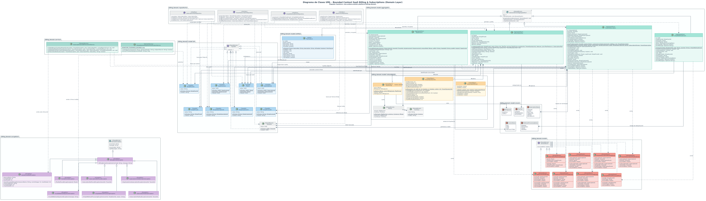
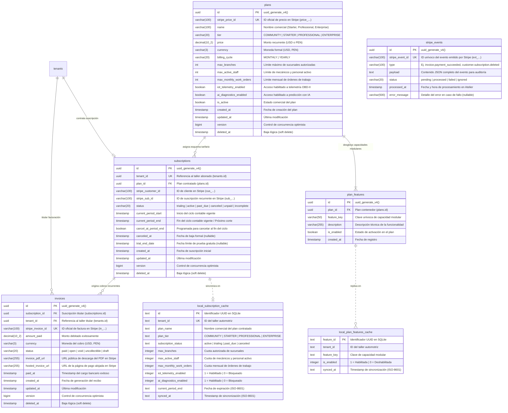
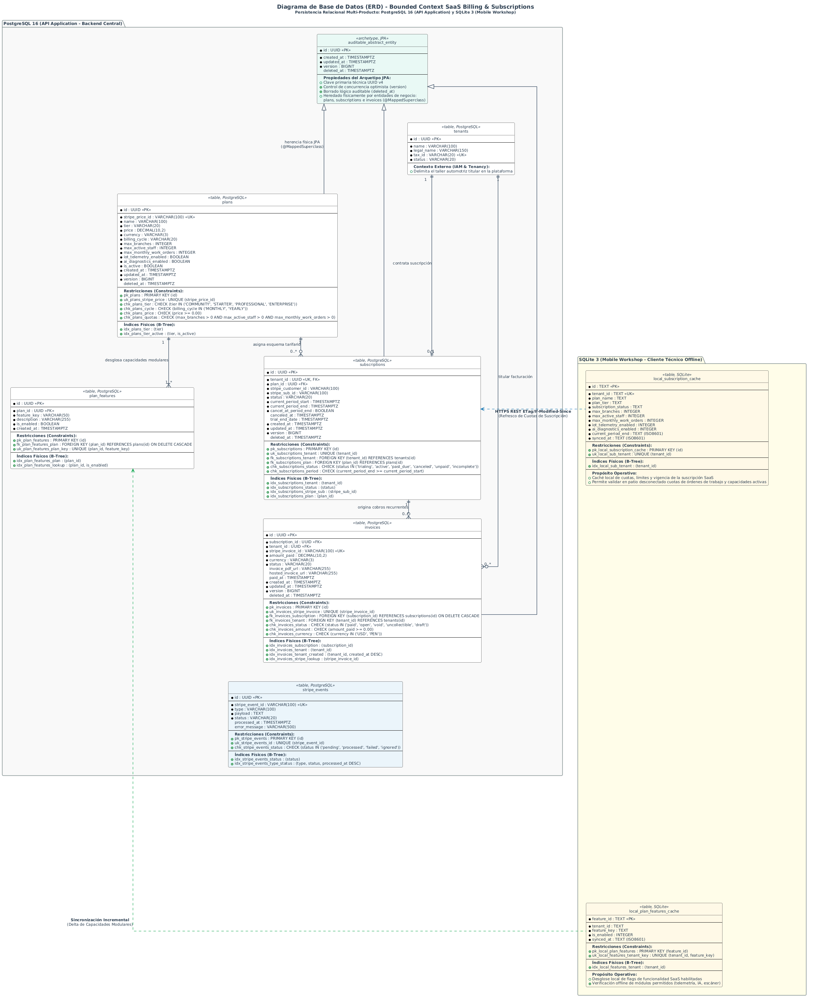

## 10. Fase 7: Bounded Context 7 — SaaS Billing & Subscriptions Context (`com.andeva.atelier.platform.billing`)

### 10.1. Diccionario y Propósito del Contexto

#### 10.1.1. Propósito y Límites de Responsabilidad
El **SaaS Billing & Subscriptions Context** administra el modelo de ingresos comerciales B2B y el aprovisionamiento de membresías de la plataforma Atelier hacia los talleres mecánicos abonados. Su delimitación responde a tres principios fundamentales de gobernanza de software:
1. **Desacoplamiento Estricto entre Facturación B2B (Andeva -> Taller) vs. Facturación Local (Taller -> Conductor):** En la versión previa (v1), los conceptos de facturación se encontraban severamente acoplados con cotizaciones y comprobantes fiscales locales. En la arquitectura v2, este contexto administra exclusivamente los planes comerciales contratados por el taller automotriz con la empresa *Andeva*, mientras que el contexto de **Invoicing & Compliance** gestiona la emisión de comprobantes fiscales tributarios (Facturas y Boletas UBL 2.1 ante SUNAT) del taller a sus clientes particulares.
2. **Ciclo de Vida de Planes y Membresías Recurrentes (`SubscriptionPlan` y `TenantSubscription`):** Administra el catálogo de planes comerciales (`STARTER`, `PROFESSIONAL`, `ENTERPRISE`), sus ciclos de cobro (mensual o anual) y los estados del ciclo de vida de la suscripción (`TRIALING`, `ACTIVE`, `PAST_DUE`, `CANCELED`, `UNPAID`).
3. **Gobernanza de Cuotas y Límites de Plataforma (*Tenant Quota Limits*):** Determina qué capacidades operativas tiene habilitadas cada taller en función de su plan activo:
   * Cantidad máxima de sucursales físicas permitidas (`maxBranches`).
   * Límite máximo de mecánicos y personal de taller activos simultáneamente (`maxActiveStaff`).
   * Habilitación de funcionalidades avanzadas como la ingesta y alertas predictivas de telemetría IoT OBD-II (`iotTelemetryEnabled`) o reportes ejecutivos de rentabilidad financiera.
4. **Cumplimiento Estricto de Seguridad PCI-DSS:** Para certificar el cumplimiento de los estándares internacionales de la industria de tarjetas de pago (**PCI-DSS Nivel 1**), el backend de Atelier **jamás procesa, transmite ni almacena números de tarjeta de crédito (PAN), códigos de seguridad CVV ni fechas de caducidad**. Todo el intercambio sensible de datos bancarios se delega al frontend mediante componentes seguros de **Stripe Elements** y el **SDK Móvil de Stripe**, intercambiando únicamente identificadores de clientes y métodos de pago tokenizados (`stripe_customer_id`, `stripe_sub_id`, `stripe_price_id`).
5. **Idempotencia Garantizada en Webhooks (*Webhook Idempotency*):** Cuando la pasarela de pagos ejecuta una operación asíncrona de cobro recurrente o renovación, notifica a los servidores de Atelier mediante solicitudes HTTP Webhook. Ante fluctuaciones de conectividad, Stripe reintenta el despacho del mismo evento hasta por 72 horas. Para evitar cobros duplicados, renovaciones espurias o inconsistencias de saldo, la tabla `stripe_events` registra unívocamente cada identificador de evento (`stripe_event_id` con restricción `UNIQUE`), descartando de forma inmediata cualquier procesamiento repetido.
6. **Aceleración de Lectura mediante Caché en Memoria (`Caffeine Cache`):** Dado que cada invocación a endpoints protegidos del ERP en cualquier Bounded Context requiere verificar si la suscripción del taller sigue activa y si no ha sobrepasado sus límites de uso, consultar PostgreSQL en cada petición crearía un cuello de botella de latencia inaceptable. Se implementa una capa de caché de ultra alta velocidad en memoria local JVM con **Caffeine Cache** (TTL de 5 minutos e invalidación reactiva inmediata ante webhooks de Stripe).

#### 10.1.2. Decisiones de Diseño e Integraciones Críticas
* **Integración Oficial con `stripe-java` SDK:** En lugar de implementar clientes HTTP ad-hoc propensos a errores de compatibilidad, Atelier integra la biblioteca oficial de Stripe para Java, gestionando sesiones de checkout seguras (*Stripe Checkout Sessions*) y portales de autogestión de cliente (*Stripe Customer Billing Portal*).
* **Verificación Criptográfica de Firmas Webhook:** Todos los mensajes entrantes en el endpoint público de webhooks son validados matemáticamente verificando la firma HMAC-SHA256 (`Stripe-Signature`) contra el secreto simétrico del webhook (`STRIPE_WEBHOOK_SECRET`), impidiendo ataques de suplantación de identidad (*Spoofing*).
* **Fachada Open Host Service (OHS) con Respaldo en Caché:** Los contextos de IAM, CRM, MRO e IoT consultan la interfaz `SubscriptionContextFacade.isTenantSubscriptionActive(TenantId tenantId)` y `isFeatureAllowed(TenantId tenantId, String featureKey)`, resolviendo la autorización de cuotas en menos de 0.05 milisegundos gracias a Caffeine Cache.

---

### 10.2. 2.6.8.1. Domain Layer

#### 10.2.1. Aggregates & Aggregate Roots

##### 1. `SubscriptionPlan` (Aggregate Root)
* **Paquete:** `com.andeva.atelier.platform.billing.domain.model.aggregates`
* **Herencia:** Extiende `AbstractDomainAggregateRoot<SubscriptionPlan>`
* **Propósito:** Representa un paquete comercial de software ofrecido por Andeva a los talleres mecánicos, definiendo precio, periodicidad y límites de recursos autorizados.
* **Atributos:**
  * `id: PlanId` — Identificador universal del plan (UUID).
  * `stripePriceId: StripePriceId` — Identificador del precio recurrente en Stripe (ej. `price_1N2M3...`).
  * `name: String` — Denominación del plan (ej. "Plan Profesional - Hasta 3 Sucursales", "Plan Taller Inicial").
  * `tier: PlanTier` — Nivel del plan (`STARTER`, `PROFESSIONAL`, `ENTERPRISE`).
  * `pricing: PlanPricing` — Objeto de valor que agrupa el precio monetario (`Money price`) y el ciclo de facturación (`BillingCycle billingCycle` [`MONTHLY`, `YEARLY`]).
  * `quotaLimits: TenantQuotaLimits` — Objeto de valor con las cuotas máximas autorizadas (`maxBranches`, `maxActiveStaff`, `iotTelemetryEnabled`, `aiDiagnosticsEnabled`).
  * `isActive: boolean` — Bandera que determina si el plan está disponible para nuevas contrataciones comerciales.
* **Invariantes y Reglas de Negocio:**
  * El identificador de precio en Stripe (`stripePriceId`) debe comenzar con el prefijo `price_` y no puede ser nulo ni estar vacío.
  * El precio monetario no puede ser negativo.
  * El límite de sucursales debe ser al menos 1 y el de personal al menos 1.
* **Métodos:**
  * `+ static SubscriptionPlan create(StripePriceId stripePriceId, String name, PlanTier tier, PlanPricing pricing, TenantQuotaLimits quotas): SubscriptionPlan`: Factoría de dominio; valida invariantes, establece vigencia activa y registra `SubscriptionPlanCreatedEvent`.
  * `+ void updateDetails(String name, PlanPricing pricing, TenantQuotaLimits quotas): void`: Modifica los parámetros comerciales y cuotas del plan.
  * `+ void deactivate(): void`: Retira el plan del catálogo para nuevas compras, preservando las suscripciones existentes.
  * `+ void activate(): void`: Restituye la disponibilidad comercial.

##### 2. `TenantSubscription` (Aggregate Root)
* **Paquete:** `com.andeva.atelier.platform.billing.domain.model.aggregates`
* **Herencia:** Extiende `AbstractDomainAggregateRoot<TenantSubscription>`
* **Propósito:** Representa el contrato de suscripción SaaS activo o histórico de un taller automotriz con la plataforma Atelier.
* **Atributos:**
  * `id: SubscriptionId` — Identificador universal de la suscripción (UUID).
  * `tenantId: TenantId` — Taller mecánico titular del contrato.
  * `planId: PlanId` — Plan comercial contratado.
  * `stripeCustomerId: StripeCustomerId` — Identificador de cliente en Stripe (ej. `cus_...`).
  * `stripeSubscriptionId: StripeSubscriptionId` — Identificador unívoco de suscripción en Stripe (ej. `sub_...`).
  * `status: SubscriptionStatus` — Estado del ciclo de vida (`TRIALING`, `ACTIVE`, `PAST_DUE`, `CANCELED`, `UNPAID`, `INCOMPLETE`).
  * `currentPeriod: SubscriptionPeriod` — Periodo actual de cobertura (`startDate: Instant`, `endDate: Instant`).
  * `cancelAtPeriodEnd: boolean` — Bandera que indica si la suscripción se cancelará automáticamente al concluir el periodo vigente.
  * `canceledAt: Optional<Instant>` — Fecha y hora formal de cancelación (nullable).
  * `trialEndDate: Optional<Instant>` — Fecha límite de prueba gratuita (nullable).
* **Invariantes y Reglas de Negocio:**
  * No puede existir más de una suscripción activa o en periodo de prueba (`ACTIVE`, `TRIALING`, `PAST_DUE`) simultáneamente para el mismo `tenant_id`.
  * La fecha de inicio del periodo no puede ser posterior a la fecha de fin del periodo.
  * Una suscripción en estado `CANCELED` no puede reactivarse directamente; requiere la contratación de una nueva suscripción.
* **Métodos:**
  * `+ static TenantSubscription startTrial(TenantId tenantId, PlanId planId, StripeCustomerId customerId, int trialDays): TenantSubscription`: Factoría para periodos de prueba gratuitos; registra `TenantSubscriptionActivatedEvent`.
  * `+ static TenantSubscription activate(TenantId tenantId, PlanId planId, StripeCustomerId customerId, StripeSubscriptionId subscriptionId, SubscriptionPeriod period): TenantSubscription`: Factoría tras confirmación de pago inicial de Stripe; registra `TenantSubscriptionActivatedEvent`.
  * `+ void renewPeriod(SubscriptionPeriod newPeriod): void`: Extiende la vigencia del servicio tras un cobro recurrente exitoso; registra `TenantSubscriptionRenewedEvent`.
  * `+ void markPastDue(): void`: Marca la suscripción en mora cuando un cobro recurrente es rechazado por el banco emisor; registra `TenantSubscriptionPastDueEvent`.
  * `+ void cancelAtPeriodEnd(): void`: Programa la cancelación al finalizar el ciclo de facturación pagado.
  * `+ void cancelImmediately(Instant cancellationTimestamp): void`: Cancela de forma inmediata la suscripción revocando el acceso a la plataforma; registra `TenantSubscriptionCanceledEvent`.
  * `+ void changePlan(PlanId newPlanId, StripePriceId newPriceId): void`: Actualiza el plan contratado (*upgrade* o *downgrade*) y registra `TenantPlanChangedEvent`.
  * `+ boolean isAccessGranted(): boolean`: Evalúa si el taller está autorizado a operar en la plataforma (estados `ACTIVE` o `TRIALING`, o periodo de gracia en `PAST_DUE`).

##### 3. `SaasInvoice` (Aggregate Root)
* **Paquete:** `com.andeva.atelier.platform.billing.domain.model.aggregates`
* **Herencia:** Extiende `AbstractDomainAggregateRoot<SaasInvoice>`
* **Propósito:** Representa el recibo o factura formal emitida por Andeva hacia el taller por el uso de la suscripción mensual o anual.
* **Atributos:**
  * `id: SaasInvoiceId` — Identificador universal interno de la factura SaaS (UUID).
  * `subscriptionId: SubscriptionId` — Suscripción vinculada.
  * `tenantId: TenantId` — Taller pagador.
  * `stripeInvoiceId: StripeInvoiceId` — Identificador de factura en Stripe (ej. `in_...`).
  * `amountPaid: Money` — Monto efectivamente debitado a la tarjeta de crédito o cuenta bancaria.
  * `status: InvoiceStatus` — Estado de la factura (`PAID`, `OPEN`, `VOID`, `UNCOLLECTIBLE`).
  * `invoicePdfUrl: String` — Enlace seguro provisto por Stripe para la descarga del comprobante en PDF.
  * `hostedInvoiceUrl: String` — Enlace a la página web interactiva de pago de Stripe.
  * `paidAt: Optional<Instant>` — Momento cronológico del débito bancario exitoso.
* **Métodos:**
  * `+ static SaasInvoice recordPaid(SubscriptionId subscriptionId, TenantId tenantId, StripeInvoiceId stripeInvoiceId, Money amountPaid, String pdfUrl, String hostedUrl, Instant paidAt): SaasInvoice`: Registra el pago exitoso y emite `SaasInvoicePaymentSucceededEvent`.
  * `+ void markPaymentFailed(String reason): void`: Registra el fallo de cobro bancario y emite `SaasInvoicePaymentFailedEvent`.

##### 4. `StripeWebhookEvent` (Aggregate Root de Idempotencia)
* **Paquete:** `com.andeva.atelier.platform.billing.domain.model.aggregates`
* **Propósito:** Garantiza el procesamiento exactamente una vez (*Exactly-Once Processing*) de las notificaciones asíncronas de Stripe, actuando como escudo contra duplicidades de red.
* **Atributos:**
  * `id: UUID` — Identificador de base de datos interno.
  * `stripeEventId: StripeEventId` — Identificador unívoco del evento emitido por Stripe (`evt_...`). **Restricción UNIQUE a nivel de BD**.
  * `eventType: String` — Tipo de evento (ej. `invoice.payment_succeeded`, `customer.subscription.deleted`).
  * `eventPayload: String` — Contenido serializado en formato JSON de la notificación para auditoría forense.
  * `status: WebhookProcessingStatus` — Estado del procesamiento (`PENDING`, `PROCESSED`, `FAILED`, `IGNORED`).
  * `processedAt: Instant` — Timestamp de resolución en el backend.
  * `errorMessage: Optional<String>` — Detalle del error en caso de fallo durante el procesamiento.
* **Métodos:**
  * `+ static StripeWebhookEvent receive(StripeEventId eventId, String type, String payload): StripeWebhookEvent`: Registra la recepción inicial en estado `PENDING`.
  * `+ void markProcessed(): void`: Marca el evento como resuelto con éxito.
  * `+ void markFailed(String error): void`: Registra la causa de fallo para inspección.

---

#### 10.2.2. Entities (Child Entities)

##### `PlanFeature` (Entity)
* **Paquete:** `com.andeva.atelier.platform.billing.domain.model.entities`
* **Propósito:** Representa una característica funcional o módulo individual paquetizado dentro de un plan comercial de suscripción.
* **Atributos:**
  * `id: UUID` — Identificador de la característica.
  * `featureKey: String` — Clave alfanumérica única (ej. `FEATURE_OBD2_TELEMETRY`, `FEATURE_AI_PREDICTIONS`, `FEATURE_MULTI_BRANCH`).
  * `description: String` — Descripción para el catálogo comercial.
  * `isEnabled: boolean` — Disponibilidad en el plan actual.

---

#### 10.2.3. Value Objects

* **`PlanId`:** Identificador universal inmutable de un plan (`record PlanId(UUID value)`).
* **`SubscriptionId`:** Identificador inmutable de una suscripción (`record SubscriptionId(UUID value)`).
* **`SaasInvoiceId`:** Identificador inmutable de una factura SaaS (`record SaasInvoiceId(UUID value)`).
* **`StripeEventId`:** Objeto de valor para identificadores de eventos de Stripe (`record StripeEventId(String value)`). Valida que cumpla el patrón `^evt_[a-zA-Z0-9]+$`.
* **`StripeCustomerId`:** Identificador de cliente en Stripe (`record StripeCustomerId(String value)`). Valida prefijo `cus_`.
* **`StripeSubscriptionId`:** Identificador de suscripción en Stripe (`record StripeSubscriptionId(String value)`). Valida prefijo `sub_`.
* **`StripePriceId`:** Identificador de precio en Stripe (`record StripePriceId(String value)`). Valida prefijo `price_`.
* **`BillingCycle`:** Enumeración del ciclo de cobro recurrente (`MONTHLY`, `YEARLY`).
* **`SubscriptionStatus`:** Enumeración de estados de suscripción (`TRIALING`, `ACTIVE`, `PAST_DUE`, `CANCELED`, `UNPAID`, `INCOMPLETE`).
* **`InvoiceStatus`:** Enumeración del estado de factura SaaS (`PAID`, `OPEN`, `VOID`, `UNCOLLECTIBLE`).
* **`PlanTier`:** Nivel del paquete de software (`STARTER`, `PROFESSIONAL`, `ENTERPRISE`).
* **`PlanPricing`:** Objeto de valor que asocia el precio y su ciclo (`record PlanPricing(Money price, BillingCycle billingCycle)`).
* **`TenantQuotaLimits`:** Cuotas máximas autorizadas por el plan (`record TenantQuotaLimits(int maxBranches, int maxActiveStaff, boolean iotTelemetryEnabled, boolean aiDiagnosticsEnabled, int maxMonthlyWorkOrders)`).
* **`SubscriptionPeriod`:** Intervalo temporal de cobertura pagada (`record SubscriptionPeriod(Instant startDate, Instant endDate)`).
* **`WebhookProcessingStatus`:** Estado del despacho de webhooks (`PENDING`, `PROCESSED`, `FAILED`, `IGNORED`).

---

#### 10.2.4. Domain Commands

* **`CreateSubscriptionPlanCommand`:** Parámetros para registrar un nuevo plan comercial (`StripePriceId stripePriceId, String name, PlanTier tier, Money price, BillingCycle cycle, TenantQuotaLimits quotas`).
* **`UpdateSubscriptionPlanCommand`:** Modificación de cuotas o precio de un plan existente (`PlanId planId, String name, Money price, BillingCycle cycle, TenantQuotaLimits quotas`).
* **`InitiateCheckoutSessionCommand`:** Parámetros para iniciar la compra segura en Stripe (`TenantId tenantId, PlanId planId, String successUrl, String cancelUrl`).
* **`ProcessStripeWebhookCommand`:** Parámetros del webhook entrante (`String payload, String signatureHeader`).
* **`ChangeSubscriptionPlanCommand`:** Parámetros de upgrade/downgrade de plan (`SubscriptionId subscriptionId, PlanId newPlanId`).
* **`CancelSubscriptionCommand`:** Parámetros para solicitar baja voluntaria del servicio (`SubscriptionId subscriptionId, boolean cancelImmediately`).
* **`RecordSaasInvoicePaymentCommand`:** Parámetros para registrar el recibo de Stripe (`SubscriptionId subscriptionId, TenantId tenantId, StripeInvoiceId stripeInvoiceId, Money amount, String pdfUrl, String hostedUrl, Instant paidAt`).

---

#### 10.2.5. Domain Queries

* **`GetSubscriptionPlanByIdQuery`:** Consulta de un plan por su ID (`PlanId planId`).
* **`ListActivePlansQuery`:** Catálogo de planes vigentes para el portal de suscripción.
* **`GetTenantSubscriptionQuery`:** Consulta del estado contractual actual de un taller (`TenantId tenantId`).
* **`CheckTenantQuotaQuery`:** Consulta de límites y cuotas operativas vigentes (`TenantId tenantId`).
* **`ListTenantInvoicesQuery`:** Historial de facturas y recibos de un taller (`TenantId tenantId`).
* **`IsTenantSubscriptionActiveQuery`:** Validación de alta velocidad sobre si un taller puede utilizar el sistema (`TenantId tenantId`).

---

#### 10.2.6. Domain Events

* **`SubscriptionPlanCreatedEvent`:** Emitido al publicar un nuevo plan en el catálogo comercial (`PlanId planId, String name, PlanTier tier, Money price`).
* **`TenantSubscriptionActivatedEvent`:** Emitido al confirmarse el alta formal de un taller en un plan (`SubscriptionId subscriptionId, TenantId tenantId, PlanId planId, Instant expiresAt`).
* **`TenantSubscriptionRenewedEvent`:** Emitido al procesarse el cobro recurrente mensual o anual (`SubscriptionId subscriptionId, TenantId tenantId, Instant newPeriodEnd`).
* **`TenantSubscriptionPastDueEvent`:** Emitido al rebotar un intento de cobro en la tarjeta del taller (`SubscriptionId subscriptionId, TenantId tenantId, Instant gracePeriodEnd`).
* **`TenantSubscriptionCanceledEvent`:** Emitido al revocarse el servicio SaaS (`SubscriptionId subscriptionId, TenantId tenantId, Instant canceledAt`).
* **`TenantPlanChangedEvent`:** Emitido tras un upgrade o downgrade comercial (`SubscriptionId subscriptionId, TenantId tenantId, PlanId oldPlanId, PlanId newPlanId`).
* **`SaasInvoicePaymentSucceededEvent`:** Emitido al registrarse el recibo de Stripe (`SaasInvoiceId invoiceId, TenantId tenantId, Money amount`).
* **`SaasInvoicePaymentFailedEvent`:** Emitido cuando un cargo a tarjeta no prospera (`TenantId tenantId, String failureReason`).

---

#### 10.2.7. Domain Repositories (Interfaces)

```java
package com.andeva.atelier.platform.billing.domain.repositories;

public interface SubscriptionPlanRepository {
    SubscriptionPlan save(SubscriptionPlan plan);
    Optional<SubscriptionPlan> findById(PlanId id);
    Optional<SubscriptionPlan> findByStripePriceId(StripePriceId stripePriceId);
    List<SubscriptionPlan> findAllActive();
}

public interface TenantSubscriptionRepository {
    TenantSubscription save(TenantSubscription subscription);
    Optional<TenantSubscription> findById(SubscriptionId id);
    Optional<TenantSubscription> findByTenantId(TenantId tenantId);
    Optional<TenantSubscription> findByStripeSubscriptionId(StripeSubscriptionId stripeSubId);
    boolean existsActiveByTenantId(TenantId tenantId);
}

public interface SaasInvoiceRepository {
    SaasInvoice save(SaasInvoice invoice);
    Optional<SaasInvoice> findById(SaasInvoiceId id);
    Optional<SaasInvoice> findByStripeInvoiceId(StripeInvoiceId stripeInvoiceId);
    List<SaasInvoice> findAllByTenantId(TenantId tenantId);
}

public interface StripeWebhookEventRepository {
    StripeWebhookEvent save(StripeWebhookEvent event);
    Optional<StripeWebhookEvent> findByStripeEventId(StripeEventId stripeEventId);
    boolean existsByStripeEventId(StripeEventId stripeEventId);
}
```

---

#### 10.2.8. Domain Services

##### 1. `SubscriptionQuotaEnforcementService` (Servicio de Dominio de Gobernanza de Cuotas)
* **Paquete:** `com.andeva.atelier.platform.billing.domain.services`
* **Propósito:** Valida de forma estricta si un taller mecánico se encuentra dentro de los límites operativos estipulados por su plan contratado antes de permitir altas de recursos en otros Bounded Contexts:
```java
package com.andeva.atelier.platform.billing.domain.services;

import com.andeva.atelier.platform.billing.domain.model.aggregates.SubscriptionPlan;
import com.andeva.atelier.platform.billing.domain.model.aggregates.TenantSubscription;
import com.andeva.atelier.platform.billing.domain.model.exceptions.QuotaExceededException;
import com.andeva.atelier.platform.billing.domain.model.valueobjects.TenantQuotaLimits;
import org.springframework.stereotype.Service;

@Service
public class SubscriptionQuotaEnforcementService {

    public void validateBranchCreationAllowed(TenantSubscription subscription, SubscriptionPlan plan, int currentBranchCount) {
        if (!subscription.isAccessGranted()) {
            throw new QuotaExceededException("La suscripción del taller se encuentra inactiva o suspendida.");
        }
        TenantQuotaLimits limits = plan.getQuotaLimits();
        if (currentBranchCount >= limits.maxBranches()) {
            throw new QuotaExceededException(String.format(
                "Límite de sucursales alcanzado (%d/%d). Actualice su plan a Professional o Enterprise para abrir nuevas sedes.",
                currentBranchCount, limits.maxBranches()
            ));
        }
    }

    public void validateStaffAdditionAllowed(TenantSubscription subscription, SubscriptionPlan plan, int currentStaffCount) {
        if (!subscription.isAccessGranted()) {
            throw new QuotaExceededException("La suscripción del taller se encuentra inactiva o suspendida.");
        }
        TenantQuotaLimits limits = plan.getQuotaLimits();
        if (currentStaffCount >= limits.maxActiveStaff()) {
            throw new QuotaExceededException(String.format(
                "Límite de personal alcanzado (%d/%d). Actualice su plan para registrar más mecánicos y asesores.",
                currentStaffCount, limits.maxActiveStaff()
            ));
        }
    }

    public boolean isFeatureEnabled(TenantSubscription subscription, SubscriptionPlan plan, String featureKey) {
        if (!subscription.isAccessGranted()) return false;
        return switch (featureKey) {
            case "FEATURE_OBD2_TELEMETRY" -> plan.getQuotaLimits().iotTelemetryEnabled();
            case "FEATURE_AI_PREDICTIONS" -> plan.getQuotaLimits().aiDiagnosticsEnabled();
            default -> false;
        };
    }
}
```

##### 2. `StripeWebhookSignatureVerificationService` (Servicio Criptográfico de Firmas)
* **Paquete:** `com.andeva.atelier.platform.billing.domain.services`
* **Propósito:** Valida la autenticidad matemática del payload de cada webhook entrante verificando la firma HMAC-SHA256 (`Stripe-Signature`) contra el secreto simétrico del webhook de Stripe con tolerancia temporal de 300 segundos, mitigando ataques de intermediarios (*Man-in-the-Middle*) y ataques de repetición (*Replay Attacks*):
```java
package com.andeva.atelier.platform.billing.domain.services;

import com.andeva.atelier.platform.billing.domain.model.exceptions.InvalidWebhookSignatureException;
import org.springframework.stereotype.Service;

import javax.crypto.Mac;
import javax.crypto.spec.SecretKeySpec;
import java.nio.charset.StandardCharsets;
import java.security.MessageDigest;
import java.time.Instant;

@Service
public class StripeWebhookSignatureVerificationService {
    private static final String HMAC_SHA256 = "HmacSHA256";
    private static final long TOLERANCE_SECONDS = 300L; // 5 minutos de ventana de tolerancia

    public boolean verifySignature(String payload, String signatureHeader, String secret) {
        if (payload == null || signatureHeader == null || secret == null) {
            throw new InvalidWebhookSignatureException("Encabezado de firma o secreto nulo.");
        }

        String[] elements = signatureHeader.split(",");
        String timestampStr = null;
        String signature = null;

        for (String element : elements) {
            String[] pair = element.trim().split("=", 2);
            if (pair.length == 2) {
                if ("t".equals(pair[0])) {
                    timestampStr = pair[1];
                } else if ("v1".equals(pair[0])) {
                    signature = pair[1];
                }
            }
        }

        if (timestampStr == null || signature == null) {
            throw new InvalidWebhookSignatureException("Encabezado Stripe-Signature malformado.");
        }

        try {
            long timestamp = Long.parseLong(timestampStr);
            long now = Instant.now().getEpochSecond();
            if (Math.abs(now - timestamp) > TOLERANCE_SECONDS) {
                throw new InvalidWebhookSignatureException("Firma del webhook fuera de la ventana de tolerancia temporal.");
            }

            String signedPayload = timestampStr + "." + payload;
            Mac mac = Mac.getInstance(HMAC_SHA256);
            mac.init(new SecretKeySpec(secret.getBytes(StandardCharsets.UTF_8), HMAC_SHA256));
            byte[] hash = mac.doFinal(signedPayload.getBytes(StandardCharsets.UTF_8));
            String expectedSignature = bytesToHex(hash);

            if (!MessageDigest.isEqual(expectedSignature.getBytes(StandardCharsets.UTF_8), signature.getBytes(StandardCharsets.UTF_8))) {
                throw new InvalidWebhookSignatureException("La firma criptográfica HMAC-SHA256 no coincide con el payload recibido.");
            }

            return true;
        } catch (InvalidWebhookSignatureException e) {
            throw e;
        } catch (Exception e) {
            throw new InvalidWebhookSignatureException("Error en la verificación criptográfica: " + e.getMessage());
        }
    }

    private String bytesToHex(byte[] bytes) {
        StringBuilder sb = new StringBuilder();
        for (byte b : bytes) {
            sb.append(String.format("%02x", b));
        }
        return sb.toString();
    }
}
```

---

#### 10.2.9. Domain Exceptions (Jerarquía RFC 7807)

Las excepciones de la capa de dominio heredan de `DomainException` (provista en el Shared Kernel) y encapsulan códigos de error semánticos legibles para su serialización bajo la directiva RFC 7807:

```java
package com.andeva.atelier.platform.billing.domain.model.exceptions;

import com.andeva.atelier.platform.shared.domain.exceptions.DomainException;

public abstract class BillingDomainException extends DomainException {
    protected BillingDomainException(String errorCode, String message) {
        super(errorCode, message);
    }
}
```

* **`PlanNotFoundException`:** Lanzada cuando el plan comercial de suscripción solicitado no existe en el catálogo o no coincide el código tarifario foráneo. Código: `ERR_PLAN_NOT_FOUND` (HTTP 404 Not Found).
* **`SubscriptionNotFoundException`:** Lanzada cuando no se localiza un contrato de membresía asociado al identificador unívoco o al taller automotriz consultado. Código: `ERR_SUBSCRIPTION_NOT_FOUND` (HTTP 404 Not Found).
* **`QuotaExceededException`:** Lanzada cuando una operación intenta sobrepasar los techos operativos permitidos por el plan contratado (sucursales físicas o personal de taller activo) o acceder a módulos restringidos. Código: `ERR_QUOTA_EXCEEDED` (HTTP 403 Forbidden o 409 Conflict).
* **`DuplicateActiveSubscriptionException`:** Lanzada cuando se intenta registrar o activar una nueva suscripción para un taller que ya dispone de una membresía activa o en periodo de prueba. Código: `ERR_DUPLICATE_ACTIVE_SUBSCRIPTION` (HTTP 409 Conflict).
* **`InvalidWebhookSignatureException`:** Lanzada cuando la firma criptográfica HMAC-SHA256 del webhook de Stripe es nula, malformada o no coincide matemáticamente con el secreto configurado. Código: `ERR_INVALID_WEBHOOK_SIGNATURE` (HTTP 401 Unauthorized).
* **`SaasInvoiceNotFoundException`:** Lanzada cuando no se localiza el comprobante contable de recaudación en el repositorio financiero. Código: `ERR_SAAS_INVOICE_NOT_FOUND` (HTTP 404 Not Found).
* **`StripeWebhookProcessingException`:** Lanzada ante fallos en la deserialización o análisis estructural del cuerpo JSON del evento asíncrono recibido de Stripe. Código: `ERR_STRIPE_WEBHOOK_PROCESSING` (HTTP 422 Unprocessable Entity o 500 Internal Server Error).

---

### 10.3. 2.6.8.2. Interface Layer

#### 10.3.1. REST Controllers

##### 1. `SubscriptionPlansController`
* **Ruta Base:** `/api/v1/billing/plans`
* **Seguridad y Autorización:** Cabecera HTTP `Authorization: Bearer <JWT>`. La consulta de planes comerciales (`GET`) está autorizada para `ROLE_SUPER_ADMIN`, `ROLE_TENANT_ADMIN`, `ROLE_WORKSHOP_OWNER` o como catálogo público perimetral. Las operaciones de mutación (`POST`, `PUT`) requieren de manera estricta y excluyente el rol `ROLE_SUPER_ADMIN`.
* **Responsabilidad:** Catálogo comercial de planes SaaS de Atelier Platform, control de cuotas y vinculación tarifaria con Stripe.
* **Endpoints:**
  * `GET /`: Lista todos los planes comerciales activos disponibles para suscripción.
    * **Respuesta Exitosa:** `200 OK` con `List<SubscriptionPlanResource>`.
    * **Respuestas de Error:** `500 Internal Server Error` (falla no controlada de infraestructura).
  * `GET /{id}`: Obtiene el detalle técnico y comercial de un plan de suscripción específico.
    * **Parámetros:** Path Variable `id` (`UUID`).
    * **Respuesta Exitosa:** `200 OK` con `SubscriptionPlanResource`.
    * **Respuestas de Error:** `400 Bad Request` (identificador UUID malformado), `404 Not Found` (`PlanNotFoundException`), `500 Internal Server Error`.
  * `POST /`: Registra administrativamente un nuevo plan comercial vinculado a un identificador de precio en Stripe.
    * **Cabeceras:** `Authorization: Bearer <JWT>` (Rol: `ROLE_SUPER_ADMIN`), `Content-Type: application/json`.
    * **Cuerpo:** `@Valid @RequestBody CreateSubscriptionPlanRequest`.
    * **Respuesta Exitosa:** `201 Created` con `SubscriptionPlanResource` y cabecera `Location: /api/v1/billing/plans/{id}`.
    * **Respuestas de Error:** `400 Bad Request` (violación de sintaxis o Bean Validation), `401 Unauthorized` (token JWT ausente o inválido), `403 Forbidden` (permisos insuficientes sin `ROLE_SUPER_ADMIN`), `409 Conflict` (precio Stripe o denominación de plan duplicada en el sistema), `422 Unprocessable Entity` (inconsistencia en cuotas operativas mínimas), `500 Internal Server Error`.
  * `PUT /{id}`: Actualiza cuotas operativas, denominación comercial, estado de vigencia o características funcionales de un plan existente.
    * **Cabeceras:** `Authorization: Bearer <JWT>` (Rol: `ROLE_SUPER_ADMIN`), `Content-Type: application/json`.
    * **Parámetros:** Path Variable `id` (`UUID`).
    * **Cuerpo:** `@Valid @RequestBody UpdateSubscriptionPlanRequest`.
    * **Respuesta Exitosa:** `200 OK` con `SubscriptionPlanResource`.
    * **Respuestas de Error:** `400 Bad Request` (campos inválidos en el cuerpo), `401 Unauthorized`, `403 Forbidden`, `404 Not Found` (`PlanNotFoundException`), `422 Unprocessable Entity` (invariantes de dominio infringidas), `500 Internal Server Error`.

##### 2. `TenantSubscriptionsController`
* **Ruta Base:** `/api/v1/billing/subscriptions`
* **Seguridad y Autorización:** Cabecera HTTP `Authorization: Bearer <JWT>`. La autenticación extrae y valida el claim de tenencia `tenant_id` y exige roles de administración de taller: `ROLE_TENANT_ADMIN` o `ROLE_WORKSHOP_OWNER`. Los intentos de acceso a suscripciones ajenas al taller autenticado son bloqueados inmediatamente a nivel perimetral.
* **Responsabilidad:** Gestión del ciclo de vida contractual de membresías, checkout interactivo de Stripe y acceso autónomo al portal de facturación.
* **Endpoints:**
  * `GET /me`: Consulta la suscripción activa del taller automotriz autenticado, su estado contable (`ACTIVE`, `TRIALING`, `PAST_DUE`), periodo de vigencia y techos de cuota operativa.
    * **Cabeceras:** `Authorization: Bearer <JWT>` (Roles: `ROLE_TENANT_ADMIN`, `ROLE_WORKSHOP_OWNER`).
    * **Respuesta Exitosa:** `200 OK` con `TenantSubscriptionResource`.
    * **Respuestas de Error:** `401 Unauthorized` (credenciales inválidas), `403 Forbidden` (acceso inter-tenant prohibido), `404 Not Found` (`SubscriptionNotFoundException` si el taller aún no cuenta con suscripción inicial o de prueba), `500 Internal Server Error`.
  * `POST /checkout-session`: Genera una sesión de pago alojada en **Stripe Checkout** para contratar un plan nuevo o formalizar un upgrade tarifario.
    * **Cabeceras:** `Authorization: Bearer <JWT>` (Roles: `ROLE_TENANT_ADMIN`, `ROLE_WORKSHOP_OWNER`), `Content-Type: application/json`.
    * **Cuerpo:** `@Valid @RequestBody CreateCheckoutSessionRequest`.
    * **Respuesta Exitosa:** `200 OK` con `CheckoutSessionResponse` (retorna `checkoutUrl` y `sessionId`).
    * **Respuestas de Error:** `400 Bad Request` (URLs de retorno malformadas), `401 Unauthorized`, `403 Forbidden`, `404 Not Found` (`PlanNotFoundException`), `409 Conflict` (`DuplicateActiveSubscriptionException` si el taller ya tiene una suscripción activa equivalente), `422 Unprocessable Entity` (violación de reglas de transición de plan), `500 Internal Server Error` (falla de comunicación hacia Stripe API).
  * `POST /customer-portal`: Genera una sesión interactiva del **Stripe Customer Portal** para la administración autónoma de métodos de pago, actualización de tarjeta bancaria y descarga de facturas contables.
    * **Cabeceras:** `Authorization: Bearer <JWT>` (Roles: `ROLE_TENANT_ADMIN`, `ROLE_WORKSHOP_OWNER`), `Content-Type: application/json`.
    * **Cuerpo:** `@Valid @RequestBody CustomerPortalRequest`.
    * **Respuesta Exitosa:** `200 OK` con `CustomerPortalResponse` (retorna `portalUrl` de redirección segura a Stripe).
    * **Respuestas de Error:** `400 Bad Request` (`returnUrl` no válida o no registrada en dominios seguros), `401 Unauthorized`, `403 Forbidden`, `404 Not Found` (`SubscriptionNotFoundException` o ausencia de `StripeCustomerId`), `500 Internal Server Error`.
  * `POST /cancel`: Solicita la cancelación de la suscripción al finalizar el periodo de facturación actual o de manera inmediata.
    * **Cabeceras:** `Authorization: Bearer <JWT>` (Roles: `ROLE_TENANT_ADMIN`, `ROLE_WORKSHOP_OWNER`), `Content-Type: application/json`.
    * **Cuerpo:** `@Valid @RequestBody CancelSubscriptionRequest`.
    * **Respuesta Exitosa:** `200 OK` con `TenantSubscriptionResource` (reflejando `cancelAtPeriodEnd = true`) o `204 No Content` si se rescinde de inmediato.
    * **Respuestas de Error:** `400 Bad Request`, `401 Unauthorized`, `403 Forbidden`, `404 Not Found` (`SubscriptionNotFoundException`), `409 Conflict` (la membresía ya se encuentra en estado `CANCELED`), `500 Internal Server Error`.

##### 3. `SaasInvoicesController`
* **Ruta Base:** `/api/v1/billing/invoices`
* **Seguridad y Autorización:** Cabecera HTTP `Authorization: Bearer <JWT>` asociada al contexto del taller (`tenant_id`). Roles autorizados: `ROLE_TENANT_ADMIN`, `ROLE_WORKSHOP_OWNER`, `ROLE_ACCOUNTANT`.
* **Responsabilidad:** Consulta de comprobantes contables y acceso a descargas oficiales de facturas emitidas por la plataforma Atelier.
* **Endpoints:**
  * `GET /`: Lista cronológica de todas las facturas y comprobantes emitidos hacia el taller autenticado.
    * **Cabeceras:** `Authorization: Bearer <JWT>`.
    * **Respuesta Exitosa:** `200 OK` con `List<SaasInvoiceSummaryResource>`.
    * **Respuestas de Error:** `401 Unauthorized`, `403 Forbidden`, `500 Internal Server Error`.
  * `GET /{id}`: Obtiene el detalle financiero exhaustivo de un comprobante de facturación SaaS.
    * **Cabeceras:** `Authorization: Bearer <JWT>`.
    * **Parámetros:** Path Variable `id` (`UUID`).
    * **Respuesta Exitosa:** `200 OK` con `SaasInvoiceResource`.
    * **Respuestas de Error:** `400 Bad Request` (UUID inválido), `401 Unauthorized`, `403 Forbidden` (intento de lectura de comprobante perteneciente a otro taller), `404 Not Found` (`SaasInvoiceNotFoundException`), `500 Internal Server Error`.
  * `GET /{id}/pdf`: Redirige de forma transparente al enlace oficial de descarga del PDF emitido por Stripe.
    * **Cabeceras:** `Authorization: Bearer <JWT>`.
    * **Parámetros:** Path Variable `id` (`UUID`).
    * **Respuesta Exitosa:** `302 Found` con cabecera `Location` apuntando a la URL segura y firmada temporalmente por Stripe.
    * **Respuestas de Error:** `401 Unauthorized`, `403 Forbidden`, `404 Not Found` (`SaasInvoiceNotFoundException` o factura no disponible para descarga), `500 Internal Server Error`.

##### 4. `StripeWebhooksController`
* **Ruta Base:** `/api/v1/billing/webhooks/stripe`
* **Seguridad y Autorización:** Validación estricta de firma criptográfica HMAC-SHA256 mediante la cabecera HTTP `Stripe-Signature` cotejada contra el secreto de webhook (`STRIPE_WEBHOOK_SECRET`). No se utiliza autenticación JWT por tratarse de un endpoint público asíncrono expuesto a la infraestructura distribuida de Stripe Inc.
* **Responsabilidad:** Recepción segura, validación criptográfica, garantía de idempotencia (*Exactly-Once*) y encolamiento de eventos de facturación y cobro recurrente.
* **Endpoints:**
  * `POST /`: Procesa el cuerpo sin procesar (*raw JSON payload*) y la cabecera `Stripe-Signature`. Valida la autenticidad matemática del mensaje, persiste el registro en `stripe_events` para mitigar eventos duplicados y dispara la actualización asíncrona del estado del suscriptor.
    * **Cabeceras:** `Stripe-Signature: t=1614552225,v1=5257a869e7eee...`, `Content-Type: application/json`.
    * **Cuerpo:** `String rawPayload` (cadena JSON cruda para evitar mutaciones de serialización que invaliden la firma).
    * **Respuesta Exitosa:** `200 OK` con `StripeWebhookAcknowledgmentResponse` (`{"received": true, "eventId": "evt_...", "timestamp": "..."}`).
    * **Respuestas de Error:** `400 Bad Request` (cuerpo de solicitud nulo o vacío), `401 Unauthorized` (`InvalidWebhookSignatureException` cuando la cabecera `Stripe-Signature` es inválida, expirada o ausente), `422 Unprocessable Entity` (`StripeWebhookProcessingException` ante cargas con esquema o metadatos de evento irreconocibles), `500 Internal Server Error` (falla de persistencia en tabla de idempotencia o broker de eventos).

---

#### 10.3.2. REST Resources & DTOs (Records)

Todos los contratos de transferencia y petición de la Capa de Interfaz están implementados mediante **Java 21 Records**, garantizando inmutabilidad estricta por diseño y validaciones declarativas mediante **Jakarta Bean Validation** (`jakarta.validation.constraints.*`):

```java
package com.andeva.atelier.platform.billing.interfaces.rest.resources;

import com.fasterxml.jackson.annotation.JsonInclude;
import jakarta.validation.Valid;
import jakarta.validation.constraints.DecimalMin;
import jakarta.validation.constraints.Digits;
import jakarta.validation.constraints.Min;
import jakarta.validation.constraints.NotBlank;
import jakarta.validation.constraints.NotNull;
import jakarta.validation.constraints.Pattern;
import jakarta.validation.constraints.Size;

import java.math.BigDecimal;
import java.time.Instant;
import java.util.List;
import java.util.UUID;

/**
 * 1. Solicitud de creación administrativa de un nuevo plan comercial.
 */
public record CreateSubscriptionPlanRequest(
    @NotBlank(message = "El identificador de precio en Stripe es obligatorio")
    @Pattern(regexp = "^price_[a-zA-Z0-9]+$", message = "El stripePriceId debe comenzar con 'price_' seguido de caracteres alfanuméricos")
    String stripePriceId,

    @NotBlank(message = "El nombre del plan es obligatorio")
    @Size(min = 3, max = 100, message = "El nombre del plan debe contener entre 3 y 100 caracteres")
    String name,

    @NotBlank(message = "El nivel del plan (tier) es obligatorio")
    @Pattern(regexp = "^(STARTER|PROFESSIONAL|ENTERPRISE)$", message = "El tier debe ser STARTER, PROFESSIONAL o ENTERPRISE")
    String tier,

    @NotNull(message = "El precio es obligatorio")
    @DecimalMin(value = "0.0", inclusive = true, message = "El precio no puede ser negativo")
    @Digits(integer = 10, fraction = 2, message = "El precio debe tener como máximo 10 dígitos enteros y 2 decimales")
    BigDecimal price,

    @NotBlank(message = "La moneda es obligatoria")
    @Size(min = 3, max = 3, message = "El código de moneda ISO debe contener exactamente 3 caracteres (ej. USD, PEN)")
    String currency,

    @NotBlank(message = "El ciclo de facturación es obligatorio")
    @Pattern(regexp = "^(MONTHLY|YEARLY)$", message = "El ciclo de facturación debe ser MONTHLY o YEARLY")
    String billingCycle,

    @NotNull(message = "Las cuotas operativas son obligatorias")
    @Valid
    TenantQuotaLimitsDto quotaLimits,

    @Valid
    List<PlanFeatureRequest> features
) {}

/**
 * 2. Solicitud de actualización de metadatos y cuotas de un plan comercial.
 */
public record UpdateSubscriptionPlanRequest(
    @NotBlank(message = "El nombre del plan es obligatorio")
    @Size(min = 3, max = 100, message = "El nombre del plan debe contener entre 3 y 100 caracteres")
    String name,

    @NotNull(message = "El precio es obligatorio")
    @DecimalMin(value = "0.0", inclusive = true, message = "El precio no puede ser negativo")
    @Digits(integer = 10, fraction = 2, message = "El precio debe tener como máximo 10 dígitos enteros y 2 decimales")
    BigDecimal price,

    @NotNull(message = "Las cuotas operativas son obligatorias")
    @Valid
    TenantQuotaLimitsDto quotaLimits,

    boolean isActive,

    @Valid
    List<PlanFeatureRequest> features
) {}

/**
 * 3. Solicitud para inicializar una sesión de Stripe Checkout.
 */
public record CreateCheckoutSessionRequest(
    @NotNull(message = "El identificador del plan comercial es obligatorio")
    UUID planId,

    @NotBlank(message = "La URL de éxito es obligatoria")
    @Pattern(regexp = "^https?://.*", message = "La URL de éxito debe ser una dirección HTTP/HTTPS válida")
    String successUrl,

    @NotBlank(message = "La URL de cancelación es obligatoria")
    @Pattern(regexp = "^https?://.*", message = "La URL de cancelación debe ser una dirección HTTP/HTTPS válida")
    String cancelUrl
) {}

/**
 * 4. Solicitud para generar enlace al Stripe Customer Portal.
 */
public record CustomerPortalRequest(
    @NotBlank(message = "La URL de retorno tras salir del portal es obligatoria")
    @Pattern(regexp = "^https?://.*", message = "La URL de retorno debe ser una dirección HTTP/HTTPS válida")
    String returnUrl
) {}

/**
 * 5. Solicitud de cancelación de suscripción.
 */
public record CancelSubscriptionRequest(
    boolean immediately,

    @Size(max = 500, message = "El motivo de cancelación no puede exceder los 500 caracteres")
    String cancellationReason
) {}

/**
 * 6. Solicitud de característica funcional individual asociada a un plan.
 */
public record PlanFeatureRequest(
    @NotBlank(message = "La clave de la funcionalidad es obligatoria")
    @Size(min = 3, max = 80, message = "La clave debe contener entre 3 y 80 caracteres")
    String featureKey,

    @NotBlank(message = "La descripción de la funcionalidad es obligatoria")
    @Size(min = 3, max = 255, message = "La descripción no puede exceder los 255 caracteres")
    String description,

    boolean isEnabled
) {}

/**
 * 7. Recurso de salida que expone un plan comercial de suscripción.
 */
@JsonInclude(JsonInclude.Include.NON_NULL)
public record SubscriptionPlanResource(
    UUID id,
    String stripePriceId,
    String name,
    String tier,
    BigDecimal price,
    String currency,
    String billingCycle,
    TenantQuotaLimitsDto quotaLimits,
    List<PlanFeatureResource> features,
    boolean isActive
) {}

/**
 * 8. Recurso de salida para características individuales de planes.
 */
public record PlanFeatureResource(
    UUID id,
    String featureKey,
    String description,
    boolean isEnabled
) {}

/**
 * 9. Respuesta con la sesión de Stripe Checkout generada.
 */
public record CheckoutSessionResponse(
    String checkoutUrl,
    String sessionId
) {}

/**
 * 10. Respuesta con la URL del Stripe Customer Portal.
 */
public record CustomerPortalResponse(
    String portalUrl
) {}

/**
 * 11. Recurso de salida que expone la suscripción activa del taller.
 */
@JsonInclude(JsonInclude.Include.NON_NULL)
public record TenantSubscriptionResource(
    UUID id,
    UUID tenantId,
    UUID planId,
    String planName,
    String status,
    Instant currentPeriodStart,
    Instant currentPeriodEnd,
    boolean cancelAtPeriodEnd,
    Instant canceledAt,
    Instant trialEndDate,
    TenantQuotaLimitsDto quotas
) {}

/**
 * 12. Recurso detallado de factura comercial SaaS de la plataforma.
 */
@JsonInclude(JsonInclude.Include.NON_NULL)
public record SaasInvoiceResource(
    UUID id,
    UUID subscriptionId,
    UUID tenantId,
    String stripeInvoiceId,
    BigDecimal amountPaid,
    String currency,
    String status,
    String invoicePdfUrl,
    String hostedInvoiceUrl,
    Instant paidAt
) {}

/**
 * 13. Recurso resumido de factura para listados contables masivos.
 */
public record SaasInvoiceSummaryResource(
    UUID id,
    String stripeInvoiceId,
    BigDecimal amountPaid,
    String currency,
    String status,
    Instant paidAt,
    String invoicePdfUrl
) {}

/**
 * 14. Confirmación de recepción asíncrona de webhooks de Stripe.
 */
public record StripeWebhookAcknowledgmentResponse(
    boolean received,
    String eventId,
    Instant timestamp
) {}

/**
 * 15. Objeto de transferencia para las cuotas operativas del taller.
 */
public record TenantQuotaLimitsDto(
    @Min(value = 1, message = "El taller debe permitir al menos 1 sucursal física")
    int maxBranches,

    @Min(value = 1, message = "El taller debe permitir al menos 1 miembro del personal activo")
    int maxActiveStaff,

    boolean iotTelemetryEnabled,

    boolean aiDiagnosticsEnabled,

    @Min(value = 1, message = "El límite de órdenes de trabajo mensuales debe ser al menos 1")
    int maxMonthlyWorkOrders
) {}
```

---

#### 10.3.3. REST Assemblers (Mappers)

Los ensambladores de recursos (*Resource Assemblers*) traducen agregados y entidades puras del dominio hacia DTOs inmutables de presentación, encapsulando las conversiones de objetos de valor monetarios, identificadores UUID y colecciones hijas:

##### 1. `SubscriptionPlanResourceAssembler`
* **Paquete:** `com.andeva.atelier.platform.billing.interfaces.rest.transform`
* **Responsabilidad:** Mapeo de agregados de dominio `SubscriptionPlan` hacia `SubscriptionPlanResource`.
* **Métodos y Contratos:**
  * `+ SubscriptionPlanResource toResource(SubscriptionPlan plan)`:
    * *Entrada:* Agregado `SubscriptionPlan` no nulo.
    * *Salida:* DTO `SubscriptionPlanResource` inmutable.
    * *Contrato e Invariantes:* Desempaqueta `PlanId` a `UUID`, `StripePriceId` a `String`, `PlanTier` a su literal de enum, extrae `price` y `currency` desde el Value Object `PlanPricing.price()` (`Money`), delega la conversión de cuotas a `toQuotaDto(plan.getQuotaLimits())` y procesa la colección de entidades hijas `PlanFeature` invocando a `PlanFeatureResourceAssembler.toResourceList()`. Si `plan` es nulo, arroja `IllegalArgumentException`.
  * `+ List<SubscriptionPlanResource> toResourceList(List<SubscriptionPlan> plans)`:
    * *Entrada:* Lista inmutable o iterable de planes de suscripción.
    * *Salida:* `List<SubscriptionPlanResource>` serializable para el endpoint de catálogo.

##### 2. `TenantSubscriptionResourceAssembler`
* **Paquete:** `com.andeva.atelier.platform.billing.interfaces.rest.transform`
* **Responsabilidad:** Mapeo del agregado `TenantSubscription` integrando datos del catálogo comercial para conformar `TenantSubscriptionResource`.
* **Métodos y Contratos:**
  * `+ TenantSubscriptionResource toResource(TenantSubscription subscription, SubscriptionPlan plan)`:
    * *Entrada:* Agregado `TenantSubscription` no nulo y `SubscriptionPlan` asociado.
    * *Salida:* DTO `TenantSubscriptionResource`.
    * *Contrato e Invariantes:* Transforma identificadores fuertemente tipados (`SubscriptionId`, `TenantId`, `PlanId`) en primitivas `UUID`, extrae la denominación del plan (`plan.getName()`), serializa el estado contractual (`SubscriptionStatus.name()`), proyecta las marcas de tiempo del periodo vigente (`SubscriptionPeriod.startDate()` y `SubscriptionPeriod.endDate()`), y denormaliza las cuotas operativas vigentes en un `TenantQuotaLimitsDto`.
  * `+ TenantSubscriptionResource toResource(TenantSubscription subscription, String planName, TenantQuotaLimits quotas)`:
    * *Sobrecarga de Contrato:* Permite componer el recurso a partir de proyecciones cacheadas o vistas de lectura desnormalizadas sin requerir la carga completa del agregado `SubscriptionPlan`.

##### 3. `SaasInvoiceResourceAssembler`
* **Paquete:** `com.andeva.atelier.platform.billing.interfaces.rest.transform`
* **Responsabilidad:** Transformación del agregado `SaasInvoice` a representaciones detalladas y resumidas para consumo administrativo y contable.
* **Métodos y Contratos:**
  * `+ SaasInvoiceResource toResource(SaasInvoice invoice)`:
    * *Entrada:* Agregado `SaasInvoice` no nulo.
    * *Salida:* DTO completo `SaasInvoiceResource`.
    * *Contrato e Invariantes:* Mapea el identificador interno (`SaasInvoiceId`), foráneo (`StripeInvoiceId`), monto pagado (`Money.amount()`, `Money.currency()`), estado (`InvoiceStatus.name()`), enlaces de Stripe (`invoicePdfUrl`, `hostedInvoiceUrl`) y marca de tiempo UTC de conciliación (`paidAt`).
  * `+ SaasInvoiceSummaryResource toSummaryResource(SaasInvoice invoice)`:
    * *Entrada:* Agregado `SaasInvoice`.
    * *Salida:* DTO liviano `SaasInvoiceSummaryResource` optimizado para grillas y listados históricos.
  * `+ List<SaasInvoiceSummaryResource> toSummaryResourceList(List<SaasInvoice> invoices)`:
    * *Entrada:* Colección de facturas del taller.
    * *Salida:* Lista inmutable de resúmenes de facturación.

##### 4. `PlanFeatureResourceAssembler`
* **Paquete:** `com.andeva.atelier.platform.billing.interfaces.rest.transform`
* **Responsabilidad:** Mapeo de la entidad hija `PlanFeature` a representaciones REST inmutables.
* **Métodos y Contratos:**
  * `+ PlanFeatureResource toResource(PlanFeature feature)`:
    * *Entrada:* Entidad `PlanFeature` no nula.
    * *Salida:* DTO `PlanFeatureResource`.
    * *Contrato e Invariantes:* Proyecta el `id`, `featureKey`, `description` y la bandera booleana `isEnabled`.
  * `+ List<PlanFeatureResource> toResourceList(List<PlanFeature> features)`:
    * *Entrada:* Colección de entidades `PlanFeature`.
    * *Salida:* Lista inmutable `List<PlanFeatureResource>`. Si la colección de entrada es nula o vacía, retorna de manera segura `List.of()`.

---

#### 10.3.4. Inbound ACL Facade (Open Host Service - OHS)

La fachada pública de suscripciones (`SubscriptionContextFacade`) actúa como un **Open Host Service (OHS)** perimetral dentro de la arquitectura modular. Permite a todos los Bounded Contexts clientes (IAM, Workshop Operations / MRO, HR, IoT) verificar de forma instantánea la validez contractual y los techos operativos de cada taller mecánico.

Para eliminar por completo la contención sobre PostgreSQL y evitar cuellos de botella en operaciones de alta frecuencia, la implementación desacopla las lecturas mediante **Caffeine Cache**, garantizando **latencia en memoria sub-milisegundo (< 0.05 ms)**:

```java
package com.andeva.atelier.platform.billing.interfaces.acl;

import com.andeva.atelier.platform.billing.interfaces.rest.resources.TenantQuotaLimitsDto;

import java.util.UUID;

/**
 * Fachada Inbound ACL que expone las políticas comerciales y cuotas de uso
 * de Billing hacia los demás Bounded Contexts de Atelier Platform.
 */
public interface SubscriptionContextFacade {

    /**
     * Resuelto en RAM (< 0.05 ms) mediante Caffeine In-Memory Cache.
     * Verifica si el taller tiene una suscripción vigente (ACTIVE, TRIALING o PAST_DUE en periodo de gracia).
     */
    boolean isTenantSubscriptionActive(UUID tenantId);

    /**
     * Retorna las cuotas operativas vigentes contratadas por el taller automotriz.
     */
    TenantQuotaLimitsDto getTenantQuotaLimits(UUID tenantId);

    /**
     * Valida si el taller puede aperturar una nueva sucursal física en IAM & Tenancy.
     */
    boolean canAddBranch(UUID tenantId, int currentBranchCount);

    /**
     * Valida si el taller puede contratar un nuevo mecánico o asesor en Human Resources.
     */
    boolean canAddStaffMember(UUID tenantId, int currentStaffCount);

    /**
     * Valida si el taller puede aperturar una nueva orden de trabajo en Workshop Operations (MRO)
     * contrastando el conteo mensual contra el techo autorizado por el plan contratado.
     */
    boolean canCreateWorkOrder(UUID tenantId, int currentMonthlyWorkOrders);

    /**
     * Valida si una funcionalidad avanzada (ej. Telemetría OBD-II IoT, Diagnóstico IA) está habilitada por el plan.
     */
    boolean isFeatureAllowed(UUID tenantId, String featureKey);
}
```

##### Snippet de Implementación con Caffeine Cache (< 0.05 ms)

La implementación de la fachada emplea una estructura in-memory de alta concurrencia basada en `Caffeine`, la cual almacena una política inmutable pre-calculada (`CachedTenantSubscriptionPolicy`). La invalidación se coordina de manera reactiva ante eventos de dominio o integración:

```java
package com.andeva.atelier.platform.billing.infrastructure.acl;

import com.andeva.atelier.platform.billing.domain.model.aggregates.SubscriptionPlan;
import com.andeva.atelier.platform.billing.domain.model.aggregates.TenantSubscription;
import com.andeva.atelier.platform.billing.domain.model.valueobjects.TenantId;
import com.andeva.atelier.platform.billing.domain.repositories.SubscriptionPlanRepository;
import com.andeva.atelier.platform.billing.domain.repositories.TenantSubscriptionRepository;
import com.andeva.atelier.platform.billing.interfaces.acl.SubscriptionContextFacade;
import com.andeva.atelier.platform.billing.interfaces.rest.resources.TenantQuotaLimitsDto;
import com.github.benmanes.caffeine.cache.Cache;
import com.github.benmanes.caffeine.cache.Caffeine;
import org.slf4j.Logger;
import org.slf4j.LoggerFactory;
import org.springframework.stereotype.Service;

import java.time.Duration;
import java.util.Collections;
import java.util.Set;
import java.util.UUID;
import java.util.stream.Collectors;

@Service
public class SubscriptionContextFacadeImpl implements SubscriptionContextFacade {

    private static final Logger log = LoggerFactory.getLogger(SubscriptionContextFacadeImpl.class);

    private final TenantSubscriptionRepository subscriptionRepository;
    private final SubscriptionPlanRepository planRepository;

    // Estructura lock-free en RAM que permite resolver consultas de cuotas en < 0.05 ms
    private final Cache<UUID, CachedTenantSubscriptionPolicy> policyCache;

    public SubscriptionContextFacadeImpl(
            TenantSubscriptionRepository subscriptionRepository,
            SubscriptionPlanRepository planRepository) {
        this.subscriptionRepository = subscriptionRepository;
        this.planRepository = planRepository;
        this.policyCache = Caffeine.newBuilder()
                .maximumSize(10_000)
                .expireAfterWrite(Duration.ofMinutes(30))
                .recordStats()
                .build();
    }

    @Override
    public boolean isTenantSubscriptionActive(UUID tenantId) {
        return getOrLoadPolicy(tenantId).isActive();
    }

    @Override
    public TenantQuotaLimitsDto getTenantQuotaLimits(UUID tenantId) {
        return getOrLoadPolicy(tenantId).quotas();
    }

    @Override
    public boolean canAddBranch(UUID tenantId, int currentBranchCount) {
        CachedTenantSubscriptionPolicy policy = getOrLoadPolicy(tenantId);
        return policy.isActive() && currentBranchCount < policy.quotas().maxBranches();
    }

    @Override
    public boolean canAddStaffMember(UUID tenantId, int currentStaffCount) {
        CachedTenantSubscriptionPolicy policy = getOrLoadPolicy(tenantId);
        return policy.isActive() && currentStaffCount < policy.quotas().maxActiveStaff();
    }

    @Override
    public boolean canCreateWorkOrder(UUID tenantId, int currentMonthlyWorkOrders) {
        CachedTenantSubscriptionPolicy policy = getOrLoadPolicy(tenantId);
        return policy.isActive() && currentMonthlyWorkOrders < policy.quotas().maxMonthlyWorkOrders();
    }

    @Override
    public boolean isFeatureAllowed(UUID tenantId, String featureKey) {
        CachedTenantSubscriptionPolicy policy = getOrLoadPolicy(tenantId);
        return policy.isActive() && policy.allowedFeatures().contains(featureKey);
    }

    /**
     * Invalida de forma reactiva la caché in-memory al recibirse eventos de cambio de estado o upgrade.
     */
    public void evictCache(UUID tenantId) {
        policyCache.invalidate(tenantId);
        log.debug("Caché de suscripción invalidada en RAM para el taller: {}", tenantId);
    }

    private CachedTenantSubscriptionPolicy getOrLoadPolicy(UUID tenantId) {
        return policyCache.get(tenantId, id -> {
            log.debug("Cache miss para el taller {}. Cargando estado desde PostgreSQL...", id);
            return subscriptionRepository.findByTenantId(new TenantId(id))
                    .map(sub -> {
                        SubscriptionPlan plan = planRepository.findById(sub.getPlanId())
                                .orElseThrow(() -> new IllegalStateException("Plan no hallado para suscripción activa"));
                        
                        TenantQuotaLimitsDto quotaDto = new TenantQuotaLimitsDto(
                                plan.getQuotaLimits().maxBranches(),
                                plan.getQuotaLimits().maxActiveStaff(),
                                plan.getQuotaLimits().iotTelemetryEnabled(),
                                plan.getQuotaLimits().aiDiagnosticsEnabled(),
                                plan.getQuotaLimits().maxMonthlyWorkOrders()
                        );

                        Set<String> features = plan.getFeatures().stream()
                                .filter(f -> f.isEnabled())
                                .map(f -> f.getFeatureKey())
                                .collect(Collectors.toUnmodifiableSet());

                        return new CachedTenantSubscriptionPolicy(
                                sub.isAccessGranted(),
                                quotaDto,
                                features
                        );
                    })
                    .orElseGet(() -> CachedTenantSubscriptionPolicy.inactiveDefault());
        });
    }

    private record CachedTenantSubscriptionPolicy(
            boolean isActive,
            TenantQuotaLimitsDto quotas,
            Set<String> allowedFeatures
    ) {
        public static CachedTenantSubscriptionPolicy inactiveDefault() {
            return new CachedTenantSubscriptionPolicy(
                    false,
                    new TenantQuotaLimitsDto(0, 0, false, false, 0),
                    Collections.emptySet()
            );
        }
    }
}
```

---

#### 10.3.5. Integration Events (Published / Consumed)

##### 1. Eventos Publicados por Billing hacia otros Bounded Contexts
* **`TenantSubscriptionStatusChangedIntegrationEvent`:** Emitido cuando la suscripción transiciona a `ACTIVE`, `PAST_DUE` o `CANCELED`. Invalida la caché de Caffeine en todas las instancias y ajusta permisos en IAM.
* **`TenantPlanUpgradedIntegrationEvent`:** Emitido al realizarse un upgrade de plan. Habilita de inmediato cuotas expandidas en MRO, HR e IoT.
* **`TenantSubscriptionSuspendedIntegrationEvent`:** Emitido al cancelarse definitivamente la suscripción. Bloquea el acceso a endpoints operativos del ERP.

##### 2. Eventos Consumidos por Billing desde otros Bounded Contexts
* **`TenantRegisteredIntegrationEvent` (emitido por IAM & Tenancy Context):** Inicia automáticamente el aprovisionamiento de un cliente en Stripe (`StripeCustomerId`) y vincula una suscripción de prueba gratuita (*Free Trial* de 14 días).

---

#### 10.3.6. Global Exception Handling (RFC 7807 Problem Details)

La Capa de Interfaz del Bounded Context Billing implementa un interceptor unificado de anomalías web mediante la clase `BillingExceptionHandler`, anotada con `@RestControllerAdvice`. Su objetivo es capturar las excepciones del dominio financiero y transformarlas de manera homogénea en documentos de especificación estándar **RFC 7807** (`application/problem+json`) mediante la clase `ProblemDetail` nativa de Spring Boot 3 / Spring Framework 6.

##### Matriz de Mapeo Semántico de Excepciones

| Excepción de Dominio | Código de Estado HTTP | Tipo URI (`type`) | Título RFC 7807 (`title`) | Código de Negocio (`errorCode`) | Detalle Semántico |
| :--- | :--- | :--- | :--- | :--- | :--- |
| `PlanNotFoundException` | `404 Not Found` | `https://api.atelier.andeva.com/errors/plan-not-found` | Plan Not Found | `ERR_PLAN_NOT_FOUND` | El plan tarifario o precio de Stripe consultado no existe en el catálogo activo. |
| `SubscriptionNotFoundException` | `404 Not Found` | `https://api.atelier.andeva.com/errors/subscription-not-found` | Subscription Not Found | `ERR_SUBSCRIPTION_NOT_FOUND` | El taller consultado no dispone de un contrato de suscripción SaaS registrado. |
| `QuotaExceededException` | `403 Forbidden` | `https://api.atelier.andeva.com/errors/quota-exceeded` | Quota Exceeded | `ERR_QUOTA_EXCEEDED` | La operación supera el número máximo de sucursales, personal activo u órdenes de trabajo permitidas. |
| `DuplicateActiveSubscriptionException` | `409 Conflict` | `https://api.atelier.andeva.com/errors/duplicate-subscription` | Duplicate Subscription | `ERR_DUPLICATE_ACTIVE_SUBSCRIPTION` | El taller automotriz ya posee una membresía en estado `ACTIVE` o `TRIALING`. |
| `InvalidWebhookSignatureException` | `401 Unauthorized` | `https://api.atelier.andeva.com/errors/invalid-webhook-signature` | Invalid Webhook Signature | `ERR_INVALID_WEBHOOK_SIGNATURE` | La firma HMAC-SHA256 en la cabecera `Stripe-Signature` es inválida o no coincide con el secreto configurado. |
| `StripeWebhookProcessingException` | `422 Unprocessable Entity` | `https://api.atelier.andeva.com/errors/webhook-processing-failed` | Webhook Processing Failed | `ERR_STRIPE_WEBHOOK_PROCESSING` | Error al deserializar la carga útil JSON de Stripe o inconsistencia en metadatos del evento. |
| `BillingDomainException` | `400 Bad Request` | `https://api.atelier.andeva.com/errors/billing-domain-violation` | Billing Domain Violation | `ERR_BILLING_DOMAIN_VIOLATION` | Falla genérica de invariantes del modelo comercial (ej. importes negativos o periodos inconsistentes). |

##### Implementación del Interceptor `@RestControllerAdvice`

```java
package com.andeva.atelier.platform.billing.interfaces.rest.advice;

import com.andeva.atelier.platform.billing.domain.model.exceptions.BillingDomainException;
import com.andeva.atelier.platform.billing.domain.model.exceptions.DuplicateActiveSubscriptionException;
import com.andeva.atelier.platform.billing.domain.model.exceptions.InvalidWebhookSignatureException;
import com.andeva.atelier.platform.billing.domain.model.exceptions.PlanNotFoundException;
import com.andeva.atelier.platform.billing.domain.model.exceptions.QuotaExceededException;
import com.andeva.atelier.platform.billing.domain.model.exceptions.StripeWebhookProcessingException;
import com.andeva.atelier.platform.billing.domain.model.exceptions.SubscriptionNotFoundException;
import jakarta.servlet.http.HttpServletRequest;
import org.slf4j.Logger;
import org.slf4j.LoggerFactory;
import org.slf4j.MDC;
import org.springframework.http.HttpStatus;
import org.springframework.http.ProblemDetail;
import org.springframework.http.ResponseEntity;
import org.springframework.web.bind.annotation.ExceptionHandler;
import org.springframework.web.bind.annotation.RestControllerAdvice;

import java.net.URI;
import java.time.Instant;

/**
 * Interceptor perimetral que transforma excepciones de dominio de facturación
 * en respuestas conformes a RFC 7807 (application/problem+json).
 */
@RestControllerAdvice(basePackages = "com.andeva.atelier.platform.billing.interfaces.rest")
public class BillingExceptionHandler {

    private static final Logger log = LoggerFactory.getLogger(BillingExceptionHandler.class);
    private static final String BASE_TYPE_URL = "https://api.atelier.andeva.com/errors/";

    @ExceptionHandler(PlanNotFoundException.class)
    public ResponseEntity<ProblemDetail> handlePlanNotFound(PlanNotFoundException ex, HttpServletRequest request) {
        log.warn("Plan comercial no localizado: {}", ex.getMessage());
        ProblemDetail problem = buildProblemDetail(
                HttpStatus.NOT_FOUND,
                "plan-not-found",
                "Plan Not Found",
                ex.getMessage(),
                ex.getErrorCode(),
                request
        );
        return ResponseEntity.status(HttpStatus.NOT_FOUND).body(problem);
    }

    @ExceptionHandler(SubscriptionNotFoundException.class)
    public ResponseEntity<ProblemDetail> handleSubscriptionNotFound(SubscriptionNotFoundException ex, HttpServletRequest request) {
        log.warn("Suscripción de taller no localizada: {}", ex.getMessage());
        ProblemDetail problem = buildProblemDetail(
                HttpStatus.NOT_FOUND,
                "subscription-not-found",
                "Subscription Not Found",
                ex.getMessage(),
                ex.getErrorCode(),
                request
        );
        return ResponseEntity.status(HttpStatus.NOT_FOUND).body(problem);
    }

    @ExceptionHandler(QuotaExceededException.class)
    public ResponseEntity<ProblemDetail> handleQuotaExceeded(QuotaExceededException ex, HttpServletRequest request) {
        log.warn("Violación de cuota operativa de suscripción: {}", ex.getMessage());
        ProblemDetail problem = buildProblemDetail(
                HttpStatus.FORBIDDEN,
                "quota-exceeded",
                "Quota Exceeded",
                ex.getMessage(),
                ex.getErrorCode(),
                request
        );
        return ResponseEntity.status(HttpStatus.FORBIDDEN).body(problem);
    }

    @ExceptionHandler(DuplicateActiveSubscriptionException.class)
    public ResponseEntity<ProblemDetail> handleDuplicateSubscription(DuplicateActiveSubscriptionException ex, HttpServletRequest request) {
        log.warn("Conflicto por membresía activa previa: {}", ex.getMessage());
        ProblemDetail problem = buildProblemDetail(
                HttpStatus.CONFLICT,
                "duplicate-subscription",
                "Duplicate Subscription",
                ex.getMessage(),
                ex.getErrorCode(),
                request
        );
        return ResponseEntity.status(HttpStatus.CONFLICT).body(problem);
    }

    @ExceptionHandler(InvalidWebhookSignatureException.class)
    public ResponseEntity<ProblemDetail> handleInvalidSignature(InvalidWebhookSignatureException ex, HttpServletRequest request) {
        log.error("Intento de consumo de webhook de Stripe con firma criptográfica inválida: {}", ex.getMessage());
        ProblemDetail problem = buildProblemDetail(
                HttpStatus.UNAUTHORIZED,
                "invalid-webhook-signature",
                "Invalid Webhook Signature",
                ex.getMessage(),
                ex.getErrorCode(),
                request
        );
        return ResponseEntity.status(HttpStatus.UNAUTHORIZED).body(problem);
    }

    @ExceptionHandler(StripeWebhookProcessingException.class)
    public ResponseEntity<ProblemDetail> handleWebhookProcessing(StripeWebhookProcessingException ex, HttpServletRequest request) {
        log.error("Error durante el procesamiento del evento asíncrono de Stripe: {}", ex.getMessage(), ex);
        ProblemDetail problem = buildProblemDetail(
                HttpStatus.UNPROCESSABLE_ENTITY,
                "webhook-processing-failed",
                "Webhook Processing Failed",
                ex.getMessage(),
                ex.getErrorCode(),
                request
        );
        return ResponseEntity.status(HttpStatus.UNPROCESSABLE_ENTITY).body(problem);
    }

    @ExceptionHandler(BillingDomainException.class)
    public ResponseEntity<ProblemDetail> handleGenericBillingDomain(BillingDomainException ex, HttpServletRequest request) {
        log.warn("Violación de regla de dominio en facturación: {}", ex.getMessage());
        ProblemDetail problem = buildProblemDetail(
                HttpStatus.BAD_REQUEST,
                "billing-domain-violation",
                "Billing Domain Violation",
                ex.getMessage(),
                ex.getErrorCode(),
                request
        );
        return ResponseEntity.status(HttpStatus.BAD_REQUEST).body(problem);
    }

    private ProblemDetail buildProblemDetail(
            HttpStatus status,
            String typeSuffix,
            String title,
            String detail,
            String errorCode,
            HttpServletRequest request
    ) {
        ProblemDetail problem = ProblemDetail.forStatusAndDetail(status, detail);
        problem.setType(URI.create(BASE_TYPE_URL + typeSuffix));
        problem.setTitle(title);
        problem.setInstance(URI.create(request.getRequestURI()));
        problem.setProperty("errorCode", errorCode);
        problem.setProperty("timestamp", Instant.now());
        
        String correlationId = MDC.get("correlationId");
        if (correlationId != null) {
            problem.setProperty("correlationId", correlationId);
        }
        return problem;
    }
}
```

---

### 10.4. 2.6.8.3. Application Layer

#### 10.4.1. Command Services (Handlers)

##### 1. `TenantSubscriptionCommandServiceImpl`
* **Responsabilidad:** Orquestar el flujo de contratación y gestión de suscripciones:
  1. Para nuevas suscripciones: Invoca a `StripeClientGateway` para inicializar una sesión de checkout y retorna la URL segura al frontend.
  2. Al procesar webhooks de Stripe: Actualiza de forma atómica el estado de la suscripción, extiende periodos contables y actualiza la tabla de auditoría `subscriptions`.
  3. Despacha eventos de integración inter-contexto y purga la caché local de Caffeine para el taller afectado.

##### 2. `StripeWebhookCommandServiceImpl`
* **Responsabilidad:** Procesamiento seguro e idempotente de webhooks:
  1. Verifica la firma HMAC-SHA256 con `StripeWebhookSignatureVerificationService`.
  2. Comprueba si el `stripe_event_id` ya existe en la tabla `stripe_events`. Si existe, retorna éxito inmediato (`200 OK`) sin volver a ejecutar la lógica de negocio.
  3. Inserta el registro en `stripe_events` con estado `PENDING`.
  4. En función del tipo de evento:
     * `checkout.session.completed`: Asocia el `stripe_subscription_id` con el `tenant_id` y activa el plan.
     * `invoice.payment_succeeded`: Registra la factura en `saas_invoices` y renueva el periodo en `subscriptions`.
     * `invoice.payment_failed`: Marca la suscripción como `PAST_DUE` y alerta por correo vía Resend.
     * `customer.subscription.deleted`: Transiciona la suscripción a `CANCELED`.
  5. Marca el evento como `PROCESSED`.

##### 3. `SubscriptionPlanCommandServiceImpl`
* **Responsabilidad:** Crear y actualizar planes sincronizados con productos y precios de Stripe.

##### 4. `SaasInvoiceCommandServiceImpl`
* **Responsabilidad:** Registrar comprobantes y emitir notificaciones de pago exitoso.

---

#### 10.4.2. Query Services (Handlers)

##### `TenantSubscriptionQueryServiceImpl`
* **Responsabilidad:** Resuelve consultas de suscripción implementando **Caffeine Cache**:
```java
package com.andeva.atelier.platform.billing.application.internal.queryservices;

import com.andeva.atelier.platform.billing.domain.model.aggregates.TenantSubscription;
import com.andeva.atelier.platform.billing.domain.model.valueobjects.SubscriptionStatus;
import com.andeva.atelier.platform.billing.domain.repositories.TenantSubscriptionRepository;
import com.andeva.atelier.platform.shared.domain.model.valueobjects.TenantId;
import org.springframework.cache.annotation.CacheEvict;
import org.springframework.cache.annotation.Cacheable;
import org.springframework.stereotype.Service;
import org.springframework.transaction.annotation.Transactional;

@Service
@Transactional(readOnly = true)
public class TenantSubscriptionQueryServiceImpl {
    private final TenantSubscriptionRepository subscriptionRepository;

    public TenantSubscriptionQueryServiceImpl(TenantSubscriptionRepository subscriptionRepository) {
        this.subscriptionRepository = subscriptionRepository;
    }

    @Cacheable(value = "tenantSubscriptionStatus", key = "#tenantId.value().toString()")
    public boolean isSubscriptionActive(TenantId tenantId) {
        return subscriptionRepository.findByTenantId(tenantId)
                .map(sub -> sub.getStatus() == SubscriptionStatus.ACTIVE 
                         || sub.getStatus() == SubscriptionStatus.TRIALING)
                .orElse(false);
    }

    @CacheEvict(value = "tenantSubscriptionStatus", key = "#tenantId.value().toString()")
    public void evictSubscriptionCache(TenantId tenantId) {
        // Purga reactiva de caché tras recepción de Webhook de Stripe
    }
}
```

---

#### 10.4.3. Domain Event Handlers

* **`SubscriptionDomainEventHandler`:**
  * Al recibir `TenantSubscriptionActivatedEvent` o `TenantSubscriptionRenewedEvent`: Purga la caché de Caffeine del taller y envía un correo de confirmación de facturación a través de `ResendEmailAdapter`.
  * Al recibir `TenantSubscriptionPastDueEvent`: Despacha un correo urgente al administrador del taller informando el fallo de cobro a la tarjeta y proveyendo un enlace al Stripe Customer Portal para regularizar su medio de pago antes de la suspensión de la cuenta.

---

#### 10.4.4. Outbound ACL Services & Remote Adapters

##### `StripeAclService`
* **Paquete:** `com.andeva.atelier.platform.billing.application.internal.outboundservices.acl`
* **Propósito:** Encapsula las clases nativas del SDK `com.stripe.*` y transforma excepciones externas (`StripeException`, `CardException`) en excepciones de dominio semánticas de Atelier.

---

### 10.5. 2.6.8.4. Infrastructure Layer

#### 10.5.1. JPA Entities

##### 1. `SubscriptionPlanJpaEntity`
* **Tabla Relacional:** `plans`
* **Mapeo:**
```java
package com.andeva.atelier.platform.billing.infrastructure.persistence.jpa.entities;

import com.andeva.atelier.platform.shared.infrastructure.persistence.jpa.entities.AuditableAbstractPersistenceEntity;
import jakarta.persistence.*;
import java.math.BigDecimal;
import java.util.ArrayList;
import java.util.List;
import java.util.UUID;

@Entity
@Table(name = "plans")
public class SubscriptionPlanJpaEntity extends AuditableAbstractPersistenceEntity {
    @Id
    @Column(name = "id", nullable = false, updatable = false)
    private UUID id;

    @Column(name = "stripe_price_id", nullable = false, length = 100, unique = true)
    private String stripePriceId;

    @Column(name = "name", nullable = false, length = 100)
    private String name;

    @Column(name = "tier", nullable = false, length = 20)
    private String tier;

    @Column(name = "price", nullable = false, precision = 10, scale = 2)
    private BigDecimal price;

    @Column(name = "currency", nullable = false, length = 3)
    private String currency = "USD";

    @Column(name = "billing_cycle", nullable = false, length = 20)
    private String billingCycle;

    @Column(name = "max_branches", nullable = false)
    private int maxBranches;

    @Column(name = "max_active_staff", nullable = false)
    private int maxActiveStaff;

    @Column(name = "iot_telemetry_enabled", nullable = false)
    private boolean iotTelemetryEnabled;

    @Column(name = "ai_diagnostics_enabled", nullable = false)
    private boolean aiDiagnosticsEnabled;

    @Column(name = "is_active", nullable = false)
    private boolean isActive = true;

    @OneToMany(mappedBy = "plan", cascade = CascadeType.ALL, orphanRemoval = true, fetch = FetchType.EAGER)
    private List<PlanFeatureJpaEntity> features = new ArrayList<>();

    // Constructores, Getters y Setters JPA
}
```

##### 2. `PlanFeatureJpaEntity`
* **Tabla Relacional:** `plan_features`
* **Mapeo:**
```java
package com.andeva.atelier.platform.billing.infrastructure.persistence.jpa.entities;

import jakarta.persistence.*;
import java.util.UUID;

@Entity
@Table(name = "plan_features", uniqueConstraints = {
    @UniqueConstraint(name = "uk_plan_features_plan_key", columnNames = {"plan_id", "feature_key"})
})
public class PlanFeatureJpaEntity {
    @Id
    @Column(name = "id", nullable = false, updatable = false)
    private UUID id;

    @ManyToOne(fetch = FetchType.LAZY)
    @JoinColumn(name = "plan_id", nullable = false)
    private SubscriptionPlanJpaEntity plan;

    @Column(name = "feature_key", nullable = false, length = 50)
    private String featureKey;

    @Column(name = "name", nullable = false, length = 100)
    private String name;

    @Column(name = "description", length = 255)
    private String description;

    @Column(name = "is_enabled", nullable = false)
    private boolean isEnabled = true;

    // Constructores, Getters y Setters JPA
}
```

##### 3. `TenantSubscriptionJpaEntity`
* **Tabla Relacional:** `subscriptions`
* **Mapeo:**
```java
package com.andeva.atelier.platform.billing.infrastructure.persistence.jpa.entities;

import com.andeva.atelier.platform.shared.infrastructure.persistence.jpa.entities.AuditableAbstractPersistenceEntity;
import jakarta.persistence.*;
import java.time.Instant;
import java.util.UUID;

@Entity
@Table(name = "subscriptions", uniqueConstraints = {
    @UniqueConstraint(name = "uk_subscriptions_tenant", columnNames = {"tenant_id"})
}, indexes = {
    @Index(name = "idx_subscriptions_stripe_sub", columnList = "stripe_sub_id"),
    @Index(name = "idx_subscriptions_status", columnList = "status")
})
public class TenantSubscriptionJpaEntity extends AuditableAbstractPersistenceEntity {
    @Id
    @Column(name = "id", nullable = false, updatable = false)
    private UUID id;

    @Column(name = "tenant_id", nullable = false, updatable = false)
    private UUID tenantId;

    @Column(name = "plan_id", nullable = false)
    private UUID planId;

    @Column(name = "stripe_customer_id", nullable = false, length = 100)
    private String stripeCustomerId;

    @Column(name = "stripe_sub_id", nullable = false, length = 100)
    private String stripeSubscriptionId;

    @Column(name = "status", nullable = false, length = 20)
    private String status;

    @Column(name = "current_period_start", nullable = false)
    private Instant currentPeriodStart;

    @Column(name = "current_period_end", nullable = false)
    private Instant currentPeriodEnd;

    @Column(name = "cancel_at_period_end", nullable = false)
    private boolean cancelAtPeriodEnd = false;

    @Column(name = "canceled_at")
    private Instant canceledAt;

    @Column(name = "trial_end_date")
    private Instant trialEndDate;

    // Constructores, Getters y Setters JPA
}
```

##### 4. `SaasInvoiceJpaEntity`
* **Tabla Relacional:** `invoices`
* **Mapeo:**
```java
package com.andeva.atelier.platform.billing.infrastructure.persistence.jpa.entities;

import com.andeva.atelier.platform.shared.infrastructure.persistence.jpa.entities.AuditableAbstractPersistenceEntity;
import jakarta.persistence.*;
import java.math.BigDecimal;
import java.time.Instant;
import java.util.UUID;

@Entity
@Table(name = "invoices", indexes = {
    @Index(name = "idx_invoices_tenant", columnList = "tenant_id"),
    @Index(name = "idx_invoices_stripe_inv", columnList = "stripe_invoice_id")
})
public class SaasInvoiceJpaEntity extends AuditableAbstractPersistenceEntity {
    @Id
    @Column(name = "id", nullable = false, updatable = false)
    private UUID id;

    @Column(name = "subscription_id", nullable = false, updatable = false)
    private UUID subscriptionId;

    @Column(name = "tenant_id", nullable = false, updatable = false)
    private UUID tenantId;

    @Column(name = "stripe_invoice_id", nullable = false, length = 100, unique = true)
    private String stripeInvoiceId;

    @Column(name = "amount_paid", nullable = false, precision = 10, scale = 2)
    private BigDecimal amountPaid;

    @Column(name = "currency", nullable = false, length = 3)
    private String currency = "USD";

    @Column(name = "status", nullable = false, length = 20)
    private String status;

    @Column(name = "invoice_pdf_url", length = 255)
    private String invoicePdfUrl;

    @Column(name = "hosted_invoice_url", length = 255)
    private String hostedInvoiceUrl;

    @Column(name = "paid_at")
    private Instant paidAt;

    // Constructores, Getters y Setters JPA
}
```

##### 5. `StripeWebhookEventJpaEntity`
* **Tabla Relacional:** `stripe_events`
* **Mapeo:**
```java
package com.andeva.atelier.platform.billing.infrastructure.persistence.jpa.entities;

import jakarta.persistence.*;
import java.time.Instant;
import java.util.UUID;

@Entity
@Table(name = "stripe_events", uniqueConstraints = {
    @UniqueConstraint(name = "uk_stripe_events_event_id", columnNames = {"stripe_event_id"})
})
public class StripeWebhookEventJpaEntity {
    @Id
    @Column(name = "id", nullable = false, updatable = false)
    private UUID id;

    @Column(name = "stripe_event_id", nullable = false, length = 100)
    private String stripeEventId;

    @Column(name = "type", nullable = false, length = 50)
    private String type;

    @Column(name = "payload", columnDefinition = "TEXT", nullable = false)
    private String payload;

    @Column(name = "status", nullable = false, length = 20)
    private String status;

    @Column(name = "processed_at", nullable = false)
    private Instant processedAt;

    @Column(name = "error_message", length = 500)
    private String errorMessage;

    // Constructores, Getters y Setters JPA
}
```

---

#### 10.5.2. Spring Data JPA Repositories

```java
package com.andeva.atelier.platform.billing.infrastructure.persistence.jpa.repositories;

import com.andeva.atelier.platform.billing.infrastructure.persistence.jpa.entities.*;
import org.springframework.data.domain.Pageable;
import org.springframework.data.jpa.repository.JpaRepository;
import java.util.Collection;
import java.util.List;
import java.util.Optional;
import java.util.UUID;

public interface SpringDataSubscriptionPlanRepository extends JpaRepository<SubscriptionPlanJpaEntity, UUID> {
    Optional<SubscriptionPlanJpaEntity> findByStripePriceId(String stripePriceId);
    List<SubscriptionPlanJpaEntity> findAllByIsActiveTrue();
}

public interface SpringDataTenantSubscriptionRepository extends JpaRepository<TenantSubscriptionJpaEntity, UUID> {
    Optional<TenantSubscriptionJpaEntity> findByTenantId(UUID tenantId);
    Optional<TenantSubscriptionJpaEntity> findByStripeSubscriptionId(String stripeSubscriptionId);
    boolean existsByTenantIdAndStatusIn(UUID tenantId, Collection<String> statuses);
}

public interface SpringDataSaasInvoiceRepository extends JpaRepository<SaasInvoiceJpaEntity, UUID> {
    Optional<SaasInvoiceJpaEntity> findByStripeInvoiceId(String stripeInvoiceId);
    List<SaasInvoiceJpaEntity> findAllByTenantIdOrderByCreatedAtDesc(UUID tenantId, Pageable pageable);
}

public interface SpringDataStripeWebhookEventRepository extends JpaRepository<StripeWebhookEventJpaEntity, UUID> {
    Optional<StripeWebhookEventJpaEntity> findByStripeEventId(String stripeEventId);
    boolean existsByStripeEventId(String stripeEventId);
}
```

---

#### 10.5.3. Repository Implementations & Adapters

```java
package com.andeva.atelier.platform.billing.infrastructure.persistence.jpa.repositories;

import com.andeva.atelier.platform.billing.domain.model.aggregates.*;
import com.andeva.atelier.platform.billing.domain.repositories.*;
import com.andeva.atelier.platform.billing.infrastructure.persistence.jpa.transform.*;
import org.springframework.stereotype.Repository;
import org.springframework.transaction.annotation.Transactional;
import java.util.*;

@Repository
@Transactional(readOnly = true)
public class SubscriptionPlanRepositoryImpl implements SubscriptionPlanRepository {
    private final SpringDataSubscriptionPlanRepository springRepo;
    private final SubscriptionPlanPersistenceAssembler assembler;

    public SubscriptionPlanRepositoryImpl(SpringDataSubscriptionPlanRepository springRepo, SubscriptionPlanPersistenceAssembler assembler) {
        this.springRepo = springRepo;
        this.assembler = assembler;
    }

    @Override
    @Transactional
    public SubscriptionPlan save(SubscriptionPlan plan) {
        return assembler.toDomain(springRepo.save(assembler.toEntity(plan)));
    }

    @Override
    public Optional<SubscriptionPlan> findById(UUID id) {
        return springRepo.findById(id).map(assembler::toDomain);
    }

    @Override
    public Optional<SubscriptionPlan> findByStripePriceId(String stripePriceId) {
        return springRepo.findByStripePriceId(stripePriceId).map(assembler::toDomain);
    }

    @Override
    public List<SubscriptionPlan> findAllActive() {
        return springRepo.findAllByIsActiveTrue().stream().map(assembler::toDomain).toList();
    }
}
```

* **`TenantSubscriptionRepositoryImpl`:** Implementa `TenantSubscriptionRepository` delegando en `SpringDataTenantSubscriptionRepository` y transformando mediante `TenantSubscriptionPersistenceAssembler`.
* **`SaasInvoiceRepositoryImpl`:** Implementa `SaasInvoiceRepository` delegando en `SpringDataSaasInvoiceRepository` y `SaasInvoicePersistenceAssembler`.
* **`StripeWebhookEventRepositoryImpl`:** Implementa `StripeWebhookEventRepository` persistiendo eventos en la tabla `stripe_events` para asegurar control de idempotencia sin colisiones transaccionales.

---

#### 10.5.4. Persistence Assemblers & Data Mappers

* **`SubscriptionPlanPersistenceAssembler`:** Transforma agregados `SubscriptionPlan` hacia `SubscriptionPlanJpaEntity` (desplegando sus cuotas en columnas escalares y sus características en entidades hijas `PlanFeatureJpaEntity`) y viceversa.
* **`TenantSubscriptionPersistenceAssembler`:** Reconstruye la raíz de agregado `TenantSubscription` a partir de `TenantSubscriptionJpaEntity` mapeando cadenas de estado hacia el enum de dominio `SubscriptionStatus`.
* **`SaasInvoicePersistenceAssembler`:** Mapea el agregado `SaasInvoice` hacia `SaasInvoiceJpaEntity` y traduce el estado de facturación `InvoiceStatus`.
* **`StripeWebhookEventPersistenceAssembler`:** Transforma la raíz de agregado `StripeWebhookEvent` hacia `StripeWebhookEventJpaEntity`.

---

#### 10.5.5. JPA Attribute Converters

* **`PlanTierConverter`:** Implementa `AttributeConverter<PlanTier, String>` persistiendo los valores `COMMUNITY`, `STARTER`, `PROFESSIONAL`, `ENTERPRISE`.
* **`SubscriptionStatusConverter`:** Implementa `AttributeConverter<SubscriptionStatus, String>` mapeando `INCOMPLETE`, `TRIALING`, `ACTIVE`, `PAST_DUE`, `CANCELED`, `UNPAID`.
* **`InvoiceStatusConverter`:** Implementa `AttributeConverter<InvoiceStatus, String>` mapeando `DRAFT`, `OPEN`, `PAID`, `VOID`, `UNCOLLECTIBLE`.
* **`BillingCycleConverter`:** Implementa `AttributeConverter<BillingCycle, String>` mapeando `MONTHLY` y `ANNUAL`.

---

#### 10.5.6. External Gateways & Cloud Adapters

##### 1. `StripeGatewayAdapter`
* **Paquete:** `com.andeva.atelier.platform.billing.infrastructure.gateways`
* **Propósito:** Implementa el puerto saliente `StripeGateway` de la capa de aplicación, encapsulando la interacción remota con la API de Stripe mediante el SDK oficial `stripe-java`:
```java
package com.andeva.atelier.platform.billing.infrastructure.gateways;

import com.andeva.atelier.platform.billing.application.ports.outbound.StripeGateway;
import com.andeva.atelier.platform.billing.domain.exceptions.BillingDomainException;
import com.stripe.StripeClient;
import com.stripe.exception.StripeException;
import com.stripe.param.checkout.SessionCreateParams;
import org.springframework.beans.factory.annotation.Value;
import org.springframework.stereotype.Component;

@Component
public class StripeGatewayAdapter implements StripeGateway {
    private final StripeClient stripeClient;

    public StripeGatewayAdapter(@Value("${stripe.secret-key}") String secretKey) {
        this.stripeClient = new StripeClient(secretKey);
    }

    @Override
    public String createCheckoutSession(String customerId, String priceId, String successUrl, String cancelUrl) {
        try {
            SessionCreateParams params = SessionCreateParams.builder()
                .setCustomer(customerId)
                .setMode(SessionCreateParams.Mode.SUBSCRIPTION)
                .setSuccessUrl(successUrl + "?session_id={CHECKOUT_SESSION_ID}")
                .setCancelUrl(cancelUrl)
                .addLineItem(SessionCreateParams.LineItem.builder()
                    .setPrice(priceId)
                    .setQuantity(1L)
                    .build())
                .build();
            return stripeClient.checkout().sessions().create(params).getUrl();
        } catch (StripeException ex) {
            throw new BillingDomainException("Error comunicando con pasarela Stripe: " + ex.getMessage(), ex);
        }
    }
}
```

##### 2. `ResendEmailAdapter`
* **Paquete:** `com.andeva.atelier.platform.billing.infrastructure.gateways`
* **Propósito:** Implementa el puerto saliente `EmailGateway` de la capa de aplicación. Envía notificaciones de bienvenida, recibos de suscripción y alertas de mora bancaria utilizando el servicio REST transaccional de Resend.

##### 3. `IamClientAdapter`
* **Paquete:** `com.andeva.atelier.platform.billing.infrastructure.gateways`
* **Propósito:** Implementa el puerto saliente `IamClientPort` de la capa de aplicación consumiendo la fachada en memoria `TenancyContextFacade` del contexto IAM & Tenancy para verificar existencia y datos fiscales del taller sin generar dependencias de base de datos intermodulares.

##### 4. `CaffeineCacheConfig`
* **Paquete:** `com.andeva.atelier.platform.billing.infrastructure.cache`
* **Propósito:** Configura los cachés locales de alto rendimiento para `tenantSubscriptionStatus` y `activePlans` con tiempo de expiración tras escritura (5 minutos) y capacidad máxima de 10,000 entradas para ofrecer validaciones de cuota en latencia sub-milisegundo (< 0.05 ms).
```java
package com.andeva.atelier.platform.billing.infrastructure.cache;

import com.github.benmanes.caffeine.cache.Caffeine;
import org.springframework.cache.CacheManager;
import org.springframework.cache.caffeine.CaffeineCacheManager;
import org.springframework.context.annotation.Bean;
import org.springframework.context.annotation.Configuration;
import java.util.concurrent.TimeUnit;

@Configuration
public class CaffeineCacheConfig {
    @Bean
    public CacheManager billingCacheManager() {
        CaffeineCacheManager cacheManager = new CaffeineCacheManager("tenantSubscriptionStatus", "activePlans");
        cacheManager.setCaffeine(Caffeine.newBuilder()
            .initialCapacity(100)
            .maximumSize(10_000)
            .expireAfterWrite(5, TimeUnit.MINUTES)
            .recordStats());
        return cacheManager;
    }
}
```

---

### 10.6. 2.6.8.5. Bounded Context Software Architecture Component Level Diagrams

#### 10.6.1. Justificación Arquitectónica y Descomposición en API Application

Dentro del contenedor central **API Application** (`api`), el Bounded Context **SaaS Billing & Subscriptions** (`com.andeva.atelier.platform.billing`) opera como el núcleo de monetización, gobierno de cuotas operativas y licenciamiento multi-inquilino de la plataforma Atelier. Su descomposición en siete componentes de software altamente cohesivos asegura el desacoplamiento estricto entre la lógica de dominio puro, la orquestación transaccional CQRS, el resguardo criptográfico e idempotente de webhooks asíncronos y la mediación con pasarelas de nube certificadas bajo PCI-DSS Nivel 1.

Los siete componentes C4 que integran este Bounded Context son:
1. **Billing REST Controllers & Resource Assemblers Component (`billing_controllers`):** Expone la API RESTful perimetral, valida contratos DTO con Bean Validation y proyecta representaciones hipermedia.
2. **Billing CQRS Application Services Component (`billing_app_services`):** Orquesta los casos de uso transaccionales de planes, checkout, membresías y facturación bajo transacciones ACID.
3. **Billing Event Handlers & Webhook Processing Component (`billing_event_handlers`):** Garantiza el procesamiento transaccional idempotente de eventos de Stripe e invalida la memoria en caché.
4. **Billing Domain Model & Quota Governance Engines Component (`billing_domain`):** Custodia las entidades de dominio, reglas de solvencia, límites de cuota y verificación criptográfica HMAC-SHA256.
5. **Billing Persistence Repositories & JPA Adapters Component (`billing_persistence`):** Implementa el acceso a datos físico-relacional mediante Spring Data JPA sobre PostgreSQL 16.
6. **Billing Open Host Facade & Quota Evaluation ACL Component (`billing_facade`):** Provee la interfaz pública Open Host Service en memoria (`SubscriptionContextFacade`) respaldada en Caffeine Cache para consultas sub-milisegundo.
7. **Billing External Gateways & Cloud Integration Component (`billing_external_gateways`):** Encapsula la comunicación remota con Stripe API, Resend y la resolución en memoria de talleres mediante IAM.

---

#### 10.6.2. Especificación Formal de Componentes (Diagram-as-Code Structurizr DSL)

A continuación se transcribe la definición formal de los componentes y sus interacciones en Structurizr DSL, correspondiente a los archivos `report/assets/diagram-sources/c4-diagrams/model/components/billing-components.dsl` y `billing-relationships.dsl`:

```dsl
// Definición de componentes del Bounded Context SaaS Billing & Subscriptions dentro de API Application
billing_controllers = component "Billing REST Controllers & Resource Assemblers Component" "Expone endpoints REST perimetrales para catálogo comercial de planes, checkout sessions, acceso al portal de cliente Stripe, historial de recibos y webhooks asíncronos; valida contratos DTO y proyecta recursos con hipermedios." "Spring MVC, SpringDoc OpenAPI, Jakarta Validation, Spring HATEOAS"
billing_app_services = component "Billing CQRS Application Services Component" "Orquesta casos de uso de membresía, transiciones de estado, cancelaciones y registro de comprobantes bajo transacciones ACID, canalizando respuestas mediante tipos Result." "Spring Service, Transactional, CQRS"
billing_event_handlers = component "Billing Event Handlers & Webhook Processing Component" "Procesa notificaciones asíncronas de Stripe con validación de idempotencia sobre la tabla stripe_events y despacha eventos de dominio de activación y morosidad." "Spring Events, TransactionalEventListener, Webhook Processor"
billing_domain = component "Billing Domain Model & Quota Governance Engines Component" "Encapsula invariantes de cuotas, raíces de agregado SubscriptionPlan, TenantSubscription, SaasInvoice y StripeWebhookEvent, y verificación de firma criptográfica HMAC-SHA256." "Java 24, Domain Model, Records, Inmutabilidad"
billing_persistence = component "Billing Persistence Repositories & JPA Adapters Component" "Materializa puertos de repositorio con Spring Data JPA sobre las tablas plans, plan_features, subscriptions, invoices y stripe_events asegurando aislamiento transaccional." "Jakarta Persistence 3.1, Spring Data JPA, PostgreSQL 16"
billing_facade = component "Billing Open Host Facade & Quota Evaluation ACL Component" "Fachada Open Host Service en memoria que permite a IAM & Tenancy y MRO verificar cuotas de sucursales, mecánicos y órdenes de trabajo en latencia sub-milisegundo (< 0.05 ms)." "Spring Service, Open Host Service, In-Memory ACL, Caffeine Cache"
billing_external_gateways = component "Billing External Gateways & Cloud Integration Component" "Conecta con la API de Stripe mediante el SDK oficial stripe-java para Checkout y Portals, despacha correos vía Resend y resuelve datos corporativos en IAM." "Stripe Java SDK, Spring WebClient, Resend API, Caffeine Cache"

// Relaciones del Bounded Context SaaS Billing & Subscriptions
webapp -> billing_controllers "Administra planes, inicia checkout y consulta facturas vía" "HTTPS/JSON"
workshop_mobile -> billing_controllers "Consulta estado de membresía y cuotas operativas vigentes vía" "HTTPS/JSON"
stripe -> billing_controllers "Envía notificaciones asíncronas de cobro y cambios de estado vía" "HTTPS Webhooks"

billing_controllers -> billing_app_services "Despacha comandos de contratación/cancelación y consultas a" "In-Memory Call"

billing_app_services -> billing_domain "Ejecuta validación de cuotas, invariantes y reglas de negocio en" "Java Domain Calls"
billing_app_services -> billing_persistence "Persiste y recupera agregados de suscripción y facturas mediante" "Domain Repositories"
billing_app_services -> billing_external_gateways "Solicita sesiones de Checkout y portales en Stripe, y correos a Resend a" "In-Memory Call"
billing_app_services -> billing_event_handlers "Publica eventos de dominio y notificaciones de webhook a" "Spring Events"

billing_event_handlers -> billing_persistence "Registra eventos de webhook para control estricto de idempotencia en" "Domain Ports"
billing_event_handlers -> billing_facade "Invalida reactivamente la memoria en caché ante cambios de suscripción en" "Cache Evict"

billing_persistence -> db "Lee y escribe en plans, plan_features, subscriptions, invoices, stripe_events vía" "JDBC/TCP"

billing_external_gateways -> stripe "Genera Checkout Sessions, Customer Portals y consulta facturas vía" "HTTPS REST (Puerto 443)"
billing_external_gateways -> resend "Despacha correos con recibos y alertas de regularización de cobros vía" "HTTPS/API"
billing_external_gateways -> iam_comp "Consulta datos fiscales del taller para inicializar sesiones de cobro vía" "In-Memory ACL"

iam_comp -> billing_facade "Consulta límites de sucursales y personal antes de registrar recursos vía" "In-Memory ACL"
mro_comp -> billing_facade "Verifica membresía activa y permisos de módulos avanzados vía" "In-Memory ACL"
billing_facade -> billing_persistence "Consulta cuotas y vigencia de suscripción en" "Domain Repositories"
```

---

#### 10.6.3. Diagrama C4Component en Mermaid

El siguiente diagrama C4Component ilustra la topología de los componentes internos y sus relaciones con clientes y sistemas perimetrales:

```mermaid
C4Component
    title Component Diagram - SaaS Billing & Subscriptions Context (com.andeva.atelier.platform.billing)

    Container_Boundary(billing_boundary, "SaaS Billing Context")
        Component(billing_controllers, "Billing REST Controllers & Resource Assemblers", "Spring MVC, SpringDoc, Jakarta Validation", "Expone catálogo de planes, checkout, customer portal, recibos y webhooks")
        Component(billing_app_services, "Billing CQRS Application Services", "Spring Service, Transactional, CQRS", "Orquesta casos de uso de suscripción, transiciones de estado y recibos bajo ACID")
        Component(billing_event_handlers, "Billing Event Handlers & Webhook Processing", "Spring Events, TransactionalEventListener", "Procesa webhooks con idempotencia en stripe_events e invalida caché")
        Component(billing_domain, "Billing Domain Model & Quota Governance", "Java 24, Records, HMAC-SHA256", "Invariantes de cuota, agregados y validación criptográfica de firma")
        Component(billing_persistence, "Billing Persistence Repositories & JPA Adapters", "Spring Data JPA, PostgreSQL 16", "Persiste en plans, plan_features, subscriptions, invoices, stripe_events")
        Component(billing_facade, "Billing Open Host Facade & Quota Evaluation ACL", "Spring Service, Caffeine Cache", "Fachada OHS para consultas de cuota en latencia < 0.05 ms")
        Component(billing_external_gateways, "Billing External Gateways & Cloud Integration", "Stripe Java SDK v24+, Resend API", "Encapsula llamadas a Stripe Checkout/Portal y notificaciones Resend")
    End_Container_Boundary

    Container_Boundary(iam_context, "IAM & Tenancy Context")
        Component(iam_comp, "IAM & Tenancy Context Facade", "In-Memory Facade", "Fachada OHS que provee datos corporativos del taller y solicita validación de cuotas")
    End_Container_Boundary

    Container_Boundary(mro_context, "Workshop Operations Context")
        Component(mro_comp, "Workshop Operations Context Facade", "In-Memory Facade", "Verifica estado de membresía antes de aperturar órdenes de trabajo")
    End_Container_Boundary

    System_Ext(stripe, "Stripe Platform (PCI-DSS Level 1)", "Pasarela de pagos internacional (Checkout, Billing, Customer Portal, Webhooks)")
    System_Ext(resend, "Resend Email Platform", "Servicio cloud para despacho de recibos y notificaciones transaccionales")
    ContainerDb(db, "PostgreSQL 16 Relational DB", "Aiven Cloud", "Tablas plans, plan_features, subscriptions, invoices, stripe_events")

    Rel(billing_controllers, billing_app_services, "Delega comandos y consultas", "Java Calls")
    Rel(billing_app_services, billing_domain, "Ejecuta reglas y cuotas", "Domain Calls")
    Rel(billing_app_services, billing_persistence, "Persiste y recupera entidades", "JPA Calls")
    Rel(billing_app_services, billing_external_gateways, "Invoca sesiones y portales", "Java Calls")
    Rel(billing_app_services, billing_event_handlers, "Publica eventos de dominio", "Spring Events")

    Rel(billing_event_handlers, billing_persistence, "Registra eventos para idempotencia", "JPA Calls")
    Rel(billing_event_handlers, billing_facade, "Invalida caché reactivamente", "Cache Evict")

    Rel(billing_facade, billing_persistence, "Consulta suscripción y cuotas", "JPA Calls")
    Rel(iam_comp, billing_facade, "canAddBranch(), canAddStaffMember()", "In-Memory ACL")
    Rel(mro_comp, billing_facade, "isTenantSubscriptionActive(), canCreateWorkOrder()", "In-Memory ACL")

    Rel(billing_external_gateways, stripe, "Checkout Sessions, Customer Portals", "HTTPS REST (Puerto 443)")
    Rel(billing_external_gateways, resend, "Envía recibos y alertas", "HTTPS/API")
    Rel(billing_external_gateways, iam_comp, "Consulta datos de taller", "In-Memory ACL")

    Rel(billing_persistence, db, "Lee y escribe datos relacionales", "JDBC/TCP")
```

---

#### 10.6.4. Dinámica de Interacción y Flujos Operacionales Clave

Para comprender la colaboración entre los componentes del Bounded Context SaaS Billing & Subscriptions y los servicios externos de nube durante el ciclo de vida de los talleres, se detallan a continuación los tres flujos operacionales más representativos:

##### 1. Ciclo de Inicialización de Checkout y Activación de Suscripción con Pasarela Externa (Stripe)
El proceso se inicia cuando el administrador de un taller automotriz decide contratar o cambiar su plan tarifario desde el portal web. La solicitud arriba al componente **Billing REST Controllers & Resource Assemblers Component**, el cual valida los parámetros de entrada y despacha el comando **CreateCheckoutSessionCommand** hacia **Billing CQRS Application Services Component**.

El servicio de aplicación invoca a **Billing External Gateways & Cloud Integration Component**, el cual contacta con la fachada de IAM para obtener la razón social y el correo corporativo del titular. Con esta información, la pasarela solicita a la API de Stripe la creación de una sesión de checkout hospedada mediante el SDK oficial `stripe-java`, configurando URLs de retorno de éxito y cancelación. El controlador retorna la URL generada al navegador del usuario para redirigirlo a la pantalla de pago segura de Stripe, garantizando que los datos de tarjeta nunca toquen los servidores de Atelier (cumplimiento PCI-DSS Nivel 1).

Tras completarse el abono exitosamente en la interfaz de Stripe, su plataforma emite el webhook `checkout.session.completed` hacia el endpoint perimetral de Atelier. El controlador delega la carga en **Billing Event Handlers & Webhook Processing Component**, el cual verifica la firma HMAC-SHA256 con el servicio criptográfico de dominio, asienta el identificador de evento en la tabla `stripe_events` asegurando idempotencia estricta, reconstituye la suscripción mediante **Billing Persistence Repositories & JPA Adapters Component** en estado activo, invalida el caché local en **Billing Open Host Facade & Quota Evaluation ACL Component** y notifica al cliente adjuntando su confirmación vía **Resend**.

##### 2. Ciclo de Notificación Asíncrona, Conciliación de Pagos e Idempotencia vía Webhooks
Este flujo protege la consistencia financiera del sistema frente a la naturaleza asíncrona de los cobros periódicos recurrentes gestionados por Stripe. Al cumplirse la fecha de renovación mensual o anual, Stripe intenta debitar la cuota comercial de la tarjeta registrada. Si el cobro resulta exitoso o falla por fondos insuficientes, Stripe despacha eventos asíncronos `invoice.payment_succeeded` o `invoice.payment_failed` hacia `/api/v1/webhooks/stripe`.

El componente **Billing REST Controllers & Resource Assemblers Component** intercepta la petición HTTP y traslada el cuerpo crudo y la cabecera `Stripe-Signature` hacia **Billing CQRS Application Services Component**. El servicio de aplicación delega la validación de autenticidad en **Billing Domain Model & Quota Governance Engines Component**, donde **StripeWebhookSignatureVerificationService** computa la firma HMAC-SHA256 con la clave secreta de webhook y compara los hashes para repeler ataques de falsificación o repetición.

Seguidamente, el procesador verifica la existencia previa del `stripe_event_id` en **Billing Persistence Repositories & JPA Adapters Component**. Si el evento ya fue registrado, se descarta inmediatamente retornando HTTP 200 para evitar procesamientos duplicados por reintentos de red de Stripe. Si es inédito, se persiste en `stripe_events`, se actualiza el estado de la suscripción (`ACTIVE` o `PAST_DUE`), se almacena el recibo correspondiente en la tabla `invoices`, se emite el evento de dominio **TenantSubscriptionPastDueEvent** en caso de mora y se invalida reactivamente la entrada de caché del taller.

##### 3. Ciclo de Verificación y Aplicación de Cuotas Operativas con Memoria en Caché (Caffeine)
Este ciclo se ejecuta de forma continua y concurrente cada vez que un usuario interactúa con los módulos operativos de la plataforma. Cuando un administrador intenta registrar una nueva sucursal física o invitar a un técnico mecánico en **IAM & Tenancy Context**, o cuando un asesor intenta aperturar una nueva orden de trabajo en **Workshop Operations Context**, el servicio solicitante invoca en memoria los métodos *canAddBranch()*, *canAddStaffMember()* o *canCreateWorkOrder()* expuestos por **Billing Open Host Facade & Quota Evaluation ACL Component**.

Para evitar sobrecargar la base de datos relacional con miles de consultas de lectura por minuto, la fachada evalúa en primer término la caché local gestionada por **Caffeine Cache Manager**. Si los datos del plan y los consumos mensuales se encuentran en memoria RAM, la consulta se resuelve inmediatamente con una latencia sub-milisegundo (< 0.05 ms).

En caso de fallo de caché (*Cache Miss*), la fachada delega en **Billing Persistence Repositories & JPA Adapters Component** la recuperación de la suscripción activa del taller y su correspondiente agregado **SubscriptionPlan**. Con estos agregados, la fachada invoca a **SubscriptionQuotaEnforcementService** en **Billing Domain Model & Quota Governance Engines Component**, el cual comprueba si la cantidad actual de sucursales o personal excede los límites contractuales estipulados (`max_branches`, `max_active_staff`). El resultado de la evaluación se almacena en la caché de Caffeine con una política de expiración de 5 minutos y se retorna al módulo solicitante, bloqueando la creación del recurso y emitiendo una excepción semántica **QuotaExceededException** si el taller ha copado su capacidad contratada.

---

### 10.7. 2.6.8.6. Code Level Diagrams

#### 10.7.1. 2.6.8.6.1. Domain Class Diagram

El Diagrama de Clases de la Capa de Dominio formaliza los contratos en memoria, agregados transaccionales, entidades subordinadas, identificadores fuertemente tipados, objetos de valor inmutables, servicios de dominio puros y puertos de persistencia del Bounded Context **SaaS Billing & Subscriptions** (`com.andeva.atelier.platform.billing.domain`). En la siguiente figura se exhibe el diagrama compilado a partir del código fuente canónico en PlantUML:



##### 1. Justificación Arquitectónica y Principios de Diseño Táctico

El diseño táctico de la Capa de Dominio de **SaaS Billing & Subscriptions** se fundamenta en principios rigurosos de Clean Architecture y Domain-Driven Design orientados a garantizar pureza algorítmica, soberanía financiera y mitigación integral de riesgos de seguridad:

1. **Aislamiento Tecnológico y Pureza de Dominio (Clean Architecture):**
   El paquete `com.andeva.atelier.platform.billing.domain` carece deliberadamente de dependencias de frameworks de persistencia (Jakarta Persistence, Spring Data) o de pasarelas de pago externas (Stripe SDK). Las raíces de agregado, entidades subordinadas y objetos de valor se modelan como clases estándar de Java y registros inmutables (`record`), permitiendo que las invariantes de licenciamiento y las reglas de cuotas operativas se verifiquen en pruebas unitarias deterministas en microsegundos sin requerir bases de datos ni servicios de red.
2. **Erradicación del Antipatrón Primitive Obsession mediante TypedId y Records:**
   Ningún identificador de entidad o magnitud de negocio se modela mediante tipos primitivos planos (`UUID`, `String` o `int`). Se emplean identificadores fuertemente tipados mediante la interfaz canónica `TypedId<UUID>` implementada por registros inmutables (`PlanId`, `SubscriptionId`, `SaasInvoiceId`), así como envoltorios de validación sintáctica para recursos de pasarela (`StripeEventId`, `StripeCustomerId`, `StripeSubscriptionId`, `StripePriceId`, `StripeInvoiceId`). Asimismo, los límites de consumo se agrupan en objetos de valor especializados (`TenantQuotaLimits`, `PlanPricing`, `SubscriptionPeriod`) con validación de invariantes en sus constructores compactos.
3. **Mitigación Integral de Seguridad PCI-DSS Nivel 1:**
   El modelo de dominio establece una frontera infranqueable respecto a datos confidenciales de tarjetas de crédito o códigos de verificación bancaria. La plataforma Atelier delega completamente la captura y transmisión de credenciales hacia interfaces seguras de Stripe (Stripe Checkout y Stripe Customer Portal), custodiando en el dominio únicamente tokens opacos e inmutables de cliente y suscripción (`StripeCustomerId`, `StripeSubscriptionId`).
4. **Idempotencia Estricta y Procesamiento Exactamente Una Vez:**
   Frente a la concurrencia y reintentos asíncronos de la pasarela de pagos, la raíz de agregado `StripeWebhookEvent` implementa un cerrojo lógico respaldado por restricciones relacionales de unicidad sobre `stripe_event_id`. Este mecanismo garantiza que cada notificación telemática se procese exactamente una vez, neutralizando cobros redundantes o dobles activaciones de membresía ante fallos transitorios de conectividad.
5. **Autenticación Criptográfica de Firmas Digitales HMAC-SHA256:**
   El servicio de dominio `StripeWebhookSignatureVerificationService` valida criptográficamente cada carga útil recibida calculando el hash simétrico HMAC-SHA256 con la clave secreta institucional, comprobando marcas de tiempo (*timestamps*) dentro de una ventana de tolerancia temporal para repeler ataques maliciosos de suplantación o repetición (*replay attacks*).
6. **Gobernanza Algorítmica de Cuotas con Latencia Submilisegundo:**
   La verificación de cuotas operativas contratadas (sucursales físicas, personal mecánico, órdenes mensuales de trabajo y módulos avanzados de telemetría IoT o diagnósticos por IA) se encapsula en el servicio de dominio puro `SubscriptionQuotaEnforcementService`. Este motor opera en memoria y se articula con una fachada Open Host Service acelerada con Caffeine Cache, resolviendo verificaciones de consumo con tiempos de respuesta sub-milisegundo (< 0.05 ms).

##### 2. Catálogo Taxonómico de Clases, Interfaces, Records y Enumeraciones

El modelo de dominio de SaaS Billing & Subscriptions se estructura en 9 paquetes canónicos cohesivos que delimitan responsabilidades tácticas precisas:

1. **`billing.domain.model.aggregates` (Raíces de Agregado):**
   * `AbstractDomainAggregateRoot<T>`: Superclase abstracta del Shared Kernel que gestiona la identidad y el ciclo de vida de los eventos de dominio inmutables (`registerDomainEvent()`, `domainEvents()`, `clearDomainEvents()`).
   * `SubscriptionPlan`: Raíz de agregado que custodia el catálogo comercial de planes, tarifas periódicas, cuotas operativas paquetizadas y lista de funcionalidades modulares.
   * `TenantSubscription`: Raíz de agregado que gobierna el ciclo de vida contractual de la membresía del taller automotriz, transiciones de estado (`ACTIVE`, `PAST_DUE`, `CANCELED`) y periodos de vigencia.
   * `SaasInvoice`: Raíz de agregado que representa los comprobantes contables emitidos por Stripe por la liquidación del servicio SaaS B2B hacia el taller abonado.
   * `StripeWebhookEvent`: Raíz de agregado que asegura el procesamiento idempotente de notificaciones asíncronas mediante deduplicación estricta y auditoría de eventos.
2. **`billing.domain.model.entities` (Entidades Dependientes):**
   * `PlanFeature`: Entidad subordinada a `SubscriptionPlan` que modela la habilitación o deshabilitación granular de capacidades tecnológicas (ej. telemetría OBD-II, predicción de fallas).
3. **`billing.domain.model.ids` (Identificadores Fuertemente Tipados):**
   * `TypedId<T>`: Interfaz genérica del Shared Kernel para tipificación segura de identidades.
   * `PlanId`, `SubscriptionId`, `SaasInvoiceId`: Registros inmutables (`record`) basados en `UUID` para agregados internos.
   * `StripeEventId`, `StripeCustomerId`, `StripeSubscriptionId`, `StripePriceId`, `StripeInvoiceId`: Registros inmutables (`record`) que encapsulan identificadores alfanuméricos de Stripe con validación de prefijos oficiales.
   * `TenantId`: Identificador foráneo de Shared Kernel que vincula la suscripción con la organización del taller.
4. **`billing.domain.model.valueobjects` (Objetos de Valor):**
   * `PlanPricing`: Registro inmutable que asocia la tarifa monetaria (`Money`) con su periodicidad de facturación (`BillingCycle`).
   * `TenantQuotaLimits`: Registro inmutable que cuantifica las capacidades máximas autorizadas de sedes físicas, mecánicos en plantilla, cupo mensual de órdenes y accesos tecnológicos.
   * `SubscriptionPeriod`: Registro inmutable que delimita el intervalo cronológico de vigencia pagada (`startDate`, `endDate`).
   * `Money`, `Currency`: Tipos monetarios universales de Shared Kernel para cuantías económicas y divisas oficiales.
5. **`billing.domain.model.enums` (Enumeraciones de Dominio):**
   * `PlanTier`: Niveles comerciales del catálogo (`STARTER`, `PROFESSIONAL`, `ENTERPRISE`).
   * `BillingCycle`: Periodicidades de cobro recurrente (`MONTHLY`, `YEARLY`).
   * `SubscriptionStatus`: Estados operativos de la membresía (`TRIALING`, `ACTIVE`, `PAST_DUE`, `CANCELED`, `UNPAID`, `INCOMPLETE`).
   * `InvoiceStatus`: Estados de liquidación contable (`PAID`, `OPEN`, `VOID`, `UNCOLLECTIBLE`).
   * `WebhookProcessingStatus`: Estados del flujo de deduplicación de eventos (`PENDING`, `PROCESSED`, `FAILED`, `IGNORED`).
6. **`billing.domain.services` (Servicios de Dominio Puros):**
   * `SubscriptionQuotaEnforcementService`: Motor algorítmico que fiscaliza el consumo operativo frente a las cuotas del plan contratado.
   * `StripeWebhookSignatureVerificationService`: Servicio criptográfico que autentica firmas digitales HMAC-SHA256 de webhooks entrantes.
7. **`billing.domain.repositories` (Puertos de Repositorio):**
   * `SubscriptionPlanRepository`, `TenantSubscriptionRepository`, `SaasInvoiceRepository`, `StripeWebhookEventRepository`: Interfaces puras de persistencia agnóstica de infraestructura.
8. **`billing.domain.events` (Eventos de Dominio):**
   * Eventos inmutables emitidos por los agregados ante mutaciones transaccionales (`SubscriptionPlanCreatedEvent`, `TenantSubscriptionActivatedEvent`, `TenantSubscriptionRenewedEvent`, `TenantSubscriptionPastDueEvent`, `TenantSubscriptionCanceledEvent`, `SaasInvoicePaidEvent`, `SaasInvoicePaymentFailedEvent`, `StripeWebhookProcessedEvent`).
9. **`billing.domain.exceptions` (Jerarquía de Excepciones Semánticas):**
   * `BillingDomainException` y subclases semánticas (`PlanNotFoundException`, `SubscriptionNotFoundException`, `QuotaExceededException`, `DuplicateActiveSubscriptionException`, `InvalidWebhookSignatureException`, `StripeWebhookProcessingException`, `SubscriptionPastDueException`) que derivan de `DomainException`.

##### 3. Diccionario Completo de Atributos, Métodos y Relaciones de Dominio

En la siguiente tabla técnica se detalla el catálogo pormenorizado de clases, estructuras, firmas, visibilidades, modificadores y reglas de negocio del modelo de dominio:

| Clase o Estructura | Elemento | Firma o Tipo | Ámbito | Descripción, Relaciones y Reglas de Negocio |
| :---: | :---: | :--- | :---: | :--- |
| **SubscriptionPlan** | Atributos | `PlanId id`<br>`StripePriceId stripePriceId`<br>`String name`<br>`PlanTier tier`<br>`PlanPricing pricing`<br>`TenantQuotaLimits quotaLimits`<br>`List<PlanFeature> features`<br>`boolean isActive` | Privado | Raíz de agregado del catálogo de planes. Extiende `AbstractDomainAggregateRoot<PlanId>`. Composición 1 a 1 con `PlanPricing` y `TenantQuotaLimits`, y 1 a 0..* con `PlanFeature`. |
| **SubscriptionPlan** | Factorías y Métodos | `static SubscriptionPlan create(StripePriceId, String, PlanTier, PlanPricing, TenantQuotaLimits, List<PlanFeature>)`<br>`void updateDetails(String, PlanPricing, TenantQuotaLimits)`<br>`void addFeature(PlanFeature)`<br>`void removeFeature(String)`<br>`boolean hasFeature(String)`<br>`void activate()`<br>`void deactivate()`<br>`PlanId id()`<br>`StripePriceId stripePriceId()`<br>`PlanTier tier()`<br>`PlanPricing pricing()`<br>`TenantQuotaLimits quotaLimits()`<br>`List<PlanFeature> features()`<br>`boolean isActive()` | Público | `create()` inicializa el plan en estado activo y registra `SubscriptionPlanCreatedEvent`. `updateDetails()` actualiza nombre, precios y cuotas. `addFeature()` y `removeFeature()` gestionan el inventario modular de características. `deactivate()` retira el plan del catálogo público. |
| **TenantSubscription** | Atributos | `SubscriptionId id`<br>`TenantId tenantId`<br>`PlanId planId`<br>`StripeCustomerId stripeCustomerId`<br>`StripeSubscriptionId stripeSubscriptionId`<br>`SubscriptionStatus status`<br>`SubscriptionPeriod currentPeriod`<br>`boolean cancelAtPeriodEnd`<br>`Optional<Instant> canceledAt`<br>`Optional<Instant> trialEndDate` | Privado | Raíz de agregado contractual del taller automotriz. Extiende `AbstractDomainAggregateRoot<SubscriptionId>`. Composición 1 a 1 con `SubscriptionPeriod`. Referencia por identidad foránea a `TenantId` y `PlanId`. |
| **TenantSubscription** | Factorías y Métodos | `static TenantSubscription startTrial(TenantId, PlanId, StripeCustomerId, int)`<br>`static TenantSubscription activate(TenantId, PlanId, StripeCustomerId, StripeSubscriptionId, SubscriptionPeriod)`<br>`void renewPeriod(SubscriptionPeriod)`<br>`void markPastDue()`<br>`void markUnpaid()`<br>`void cancelAtPeriodEnd()`<br>`void cancelImmediately(Instant)`<br>`void reactivate()`<br>`void changePlan(PlanId, StripePriceId)`<br>`boolean isAccessGranted()`<br>`SubscriptionId id()`<br>`TenantId tenantId()`<br>`PlanId planId()`<br>`StripeCustomerId stripeCustomerId()`<br>`StripeSubscriptionId stripeSubscriptionId()`<br>`SubscriptionStatus status()`<br>`SubscriptionPeriod currentPeriod()`<br>`boolean isCancelAtPeriodEnd()`<br>`Optional<Instant> canceledAt()`<br>`Optional<Instant> trialEndDate()` | Público | `activate()` transiciona la suscripción a estado `ACTIVE` y emite `TenantSubscriptionActivatedEvent`. `renewPeriod()` prolonga la vigencia y emite `TenantSubscriptionRenewedEvent`. `markPastDue()` conmuta a mora y emite `TenantSubscriptionPastDueEvent`. `cancelAtPeriodEnd()` programa la baja al fin del ciclo. `isAccessGranted()` verifica acceso si está en `TRIALING` o `ACTIVE`. |
| **SaasInvoice** | Atributos | `SaasInvoiceId id`<br>`SubscriptionId subscriptionId`<br>`TenantId tenantId`<br>`StripeInvoiceId stripeInvoiceId`<br>`Money amountPaid`<br>`Currency currency`<br>`InvoiceStatus status`<br>`String invoicePdfUrl`<br>`String hostedInvoiceUrl`<br>`Optional<Instant> paidAt` | Privado | Raíz de agregado contable de recaudación SaaS. Extiende `AbstractDomainAggregateRoot<SaasInvoiceId>`. Custodia el comprobante fiscal emitido por Stripe hacia el taller abonado. |
| **SaasInvoice** | Factorías y Métodos | `static SaasInvoice recordPaid(SubscriptionId, TenantId, StripeInvoiceId, Money, String, String, Instant)`<br>`void markPaymentFailed(String)`<br>`void markVoid()`<br>`SaasInvoiceId id()`<br>`SubscriptionId subscriptionId()`<br>`TenantId tenantId()`<br>`StripeInvoiceId stripeInvoiceId()`<br>`Money amountPaid()`<br>`Currency currency()`<br>`InvoiceStatus status()`<br>`String invoicePdfUrl()`<br>`String hostedInvoiceUrl()`<br>`Optional<Instant> paidAt()` | Público | `recordPaid()` registra un recibo saldado exitosamente en estado `PAID` y emite `SaasInvoicePaidEvent`. `markPaymentFailed()` asienta el motivo del fallo y emite `SaasInvoicePaymentFailedEvent`. `markVoid()` anula el recibo contable. |
| **StripeWebhookEvent** | Atributos | `UUID id`<br>`StripeEventId stripeEventId`<br>`String eventType`<br>`String eventPayload`<br>`WebhookProcessingStatus status`<br>`Optional<Instant> processedAt`<br>`Optional<String> errorMessage` | Privado | Raíz de agregado de auditoría e idempotencia. Extiende `AbstractDomainAggregateRoot<UUID>`. Garantiza que las notificaciones telemáticas asíncronas se procesen exactamente una vez. |
| **StripeWebhookEvent** | Factorías y Métodos | `static StripeWebhookEvent receive(StripeEventId, String, String)`<br>`void markProcessed(Instant)`<br>`void markFailed(String)`<br>`void markIgnored()`<br>`UUID id()`<br>`StripeEventId stripeEventId()`<br>`String eventType()`<br>`String eventPayload()`<br>`WebhookProcessingStatus status()`<br>`Optional<Instant> processedAt()`<br>`Optional<String> errorMessage()` | Público | `receive()` instancia el evento en estado `PENDING`. `markProcessed()` asienta la ejecución conforme y emite `StripeWebhookProcessedEvent`. `markFailed()` retiene la excepción para diagnóstico forense. `markIgnored()` clasifica eventos irrelevantes para la plataforma. |
| **PlanFeature** | Entidad Dependiente | `UUID id`<br>`PlanId planId`<br>`String featureKey`<br>`String description`<br>`boolean isEnabled` | Privado / Público | Entidad subordinada a `SubscriptionPlan`. Modela un módulo funcional (telemetría OBD-II, predicción IA). Métodos `of()`, `enable()`, `disable()` y selectores de lectura. |
| **SubscriptionQuotaEnforcementService** | Servicio de Dominio | `void validateBranchCreationAllowed(TenantSubscription, SubscriptionPlan, int)`<br>`void validateStaffAdditionAllowed(TenantSubscription, SubscriptionPlan, int)`<br>`void validateWorkOrderCreationAllowed(TenantSubscription, SubscriptionPlan, int)`<br>`boolean isFeatureEnabled(TenantSubscription, SubscriptionPlan, String)` | Público | Servicio de dominio puro sin estado. Fiscaliza límites de sucursales, personal y órdenes de trabajo frente a los consumos acumulados, emitiendo `QuotaExceededException` si se sobrepasa la capacidad contratada. |
| **StripeWebhookSignatureVerificationService** | Servicio de Dominio | `boolean verifySignature(String, String, String)`<br>`long extractTimestamp(String)` | Público | Servicio criptográfico sin estado. Computa el hash HMAC-SHA256 sobre el cuerpo del webhook con el secreto de endpoint y valida la firma recibida en la cabecera `Stripe-Signature`. |
| **SubscriptionPlanRepository** | Puerto de Repositorio | `SubscriptionPlan save(SubscriptionPlan)`<br>`Optional<SubscriptionPlan> findById(PlanId)`<br>`Optional<SubscriptionPlan> findByStripePriceId(StripePriceId)`<br>`List<SubscriptionPlan> findAllActive()` | Público | Contrato de persistencia agnóstica para el catálogo comercial de planes con recuperación por precio de pasarela o estado activo. |
| **TenantSubscriptionRepository** | Puerto de Repositorio | `TenantSubscription save(TenantSubscription)`<br>`Optional<TenantSubscription> findById(SubscriptionId)`<br>`Optional<TenantSubscription> findByTenantId(TenantId)`<br>`Optional<TenantSubscription> findByStripeSubscriptionId(StripeSubscriptionId)`<br>`List<TenantSubscription> findAllByStatus(SubscriptionStatus)` | Público | Contrato de persistencia para membresías activas, búsqueda única por taller abonado (`TenantId`) y consultas de regularización por estado. |
| **SaasInvoiceRepository** | Puerto de Repositorio | `SaasInvoice save(SaasInvoice)`<br>`Optional<SaasInvoice> findById(SaasInvoiceId)`<br>`Optional<SaasInvoice> findByStripeInvoiceId(StripeInvoiceId)`<br>`List<SaasInvoice> findAllByTenantId(TenantId)` | Público | Contrato de persistencia para comprobantes de recaudación con soporte para historial de recibos por taller. |
| **StripeWebhookEventRepository** | Puerto de Repositorio | `StripeWebhookEvent save(StripeWebhookEvent)`<br>`Optional<StripeWebhookEvent> findByStripeEventId(StripeEventId)`<br>`boolean existsByStripeEventId(StripeEventId)` | Público | Contrato de persistencia para auditoría e idempotencia con comprobación atómica de existencia previa de identificadores de webhook. |
| **PlanId** | Identificador Tipado | `UUID value` | Público | Registro inmutable (`record`) que implementa `TypedId<UUID>`. Identificador universal del plan comercial. Métodos `of()`, `generate()` y `value()`. |
| **SubscriptionId** | Identificador Tipado | `UUID value` | Público | Registro inmutable (`record`) que implementa `TypedId<UUID>`. Identificador universal de la membresía del taller. Métodos `of()`, `generate()` y `value()`. |
| **SaasInvoiceId** | Identificador Tipado | `UUID value` | Público | Registro inmutable (`record`) que implementa `TypedId<UUID>`. Identificador universal del recibo de cobro SaaS. Métodos `of()`, `generate()` y `value()`. |
| **StripeEventId** | Identificador Tipado | `String value` | Público | Registro inmutable (`record`) que implementa `TypedId<String>`. Valida patrón reglamentario `^evt_[a-zA-Z0-9]+$`. |
| **StripeCustomerId** | Identificador Tipado | `String value` | Público | Registro inmutable (`record`) que implementa `TypedId<String>`. Valida prefijo `cus_`. |
| **StripeSubscriptionId** | Identificador Tipado | `String value` | Público | Registro inmutable (`record`) que implementa `TypedId<String>`. Valida prefijo `sub_`. |
| **StripePriceId** | Identificador Tipado | `String value` | Público | Registro inmutable (`record`) que implementa `TypedId<String>`. Valida prefijo `price_`. |
| **StripeInvoiceId** | Identificador Tipado | `String value` | Público | Registro inmutable (`record`) que implementa `TypedId<String>`. Valida prefijo `in_`. |
| **PlanPricing** | Objeto de Valor | `Money price`<br>`BillingCycle billingCycle` | Público | Registro inmutable (`record`). Modela la cuantía monetaria y el intervalo temporal recurrente de cobro. |
| **TenantQuotaLimits** | Objeto de Valor | `int maxBranches`<br>`int maxActiveStaff`<br>`boolean iotTelemetryEnabled`<br>`boolean aiDiagnosticsEnabled`<br>`int maxMonthlyWorkOrders` | Público | Registro inmutable (`record`). Define los techos contractuales de consumo y accesos a módulos de la plataforma. Métodos `canAddBranch()`, `canAddStaff()` y `canCreateWorkOrder()`. |
| **SubscriptionPeriod** | Objeto de Valor | `Instant startDate`<br>`Instant endDate` | Público | Registro inmutable (`record`). Intervalo temporal de cobertura pagada con métodos de verificación `isActiveAt()` y `daysRemaining()`. |
| **PlanTier** | Enumeración | `STARTER, PROFESSIONAL, ENTERPRISE` | Público | Clasificación de niveles de paquetes comerciales ofertados. |
| **BillingCycle** | Enumeración | `MONTHLY, YEARLY` | Público | Periodicidades de liquidación recurrente. |
| **SubscriptionStatus** | Enumeración | `TRIALING, ACTIVE, PAST_DUE, CANCELED, UNPAID, INCOMPLETE` | Público | Estados del ciclo de vida operativo de la membresía del taller. |
| **InvoiceStatus** | Enumeración | `PAID, OPEN, VOID, UNCOLLECTIBLE` | Público | Estados de liquidación contable del comprobante SaaS. |
| **WebhookProcessingStatus** | Enumeración | `PENDING, PROCESSED, FAILED, IGNORED` | Público | Estados del flujo de procesamiento y deduplicación de webhooks. |
| **Excepciones de Dominio** | Jerarquía de Excepciones | `BillingDomainException`<br>`PlanNotFoundException`<br>`SubscriptionNotFoundException`<br>`QuotaExceededException`<br>`DuplicateActiveSubscriptionException`<br>`InvalidWebhookSignatureException`<br>`StripeWebhookProcessingException`<br>`SubscriptionPastDueException` | Público | Excepciones semánticas no comprobadas derivadas de `DomainException`. Portan códigos normalizados RFC 7807 para mapeo HTTP 4xx en la capa de interfaces. |

##### 4. Especificación del Diagrama de Clases en PlantUML (Diagram-as-Code)

A continuación se documenta la especificación formal del Diagrama de Clases de la Capa de Dominio en sintaxis canónica PlantUML DSL, alojada en `report/assets/diagram-sources/class-diagrams/class-diagram-billing.puml` y compilada mediante `make class-diagrams` hacia `report/assets/class-diagrams/class-diagram-billing.png`:

- **Ruta de Código Fuente PlantUML:** `report/assets/diagram-sources/class-diagrams/class-diagram-billing.puml`
- **Artefacto PNG Generado:** `report/assets/class-diagrams/class-diagram-billing.png`
- **Regla de Compilación:** `make class-diagrams`
- **Calidad Gráfica y Dimensiones:** Formato PNG sRGB con renderizado vectorial anti-aliased y enrutamiento ortogonal (*ortholine*).

```plantuml
@startuml class-diagram-billing
title <size:18>Diagrama de Clases UML - Bounded Context SaaS Billing & Subscriptions (Domain Layer)</size>\n<size:12>Paquete Canónico: com.andeva.atelier.platform.billing.domain</size>

scale max 3200 width

' Configuraciones visuales y de diseño profesional
skinparam classAttributeIconSize 0
skinparam monochrome false
skinparam shadowing false
skinparam roundcorner 6
skinparam linetype ortho
skinparam nodesep 26
skinparam ranksep 30
skinparam defaultFontName "Helvetica", "Arial", sans-serif
skinparam defaultFontSize 10
skinparam defaultFontColor #2C3E50
skinparam arrowColor #34495E
skinparam arrowThickness 1.1
skinparam packageBorderColor #7F8C8D
skinparam packageFontSize 11
skinparam packageFontStyle bold

' Estilos específicos por categoría táctica
skinparam class {
    BackgroundColor #FFFFFF
    BorderColor #2C3E50
    HeaderBackgroundColor #EAEDED
}
skinparam class<<AggregateRoot>> {
    BackgroundColor #E8F8F5
    BorderColor #16A085
    HeaderBackgroundColor #A3E4D7
}
skinparam class<<Entity>> {
    BackgroundColor #EBF5FB
    BorderColor #2980B9
    HeaderBackgroundColor #AED6F1
}
skinparam class<<ValueObject>> {
    BackgroundColor #FEF9E7
    BorderColor #D68910
    HeaderBackgroundColor #FAD7A0
}
skinparam class<<TypedId>> {
    BackgroundColor #EBF5FB
    BorderColor #2980B9
    HeaderBackgroundColor #AED6F1
}
skinparam class<<DomainService>> {
    BackgroundColor #E8F8F5
    BorderColor #117A65
    HeaderBackgroundColor #A2D9CE
}
skinparam class<<DomainEvent>> {
    BackgroundColor #FADBD8
    BorderColor #C0392B
    HeaderBackgroundColor #F1948A
}
skinparam class<<Exception>> {
    BackgroundColor #F4ECF7
    BorderColor #8E44AD
    HeaderBackgroundColor #D2B4DE
}
skinparam class<<SharedKernel>> {
    BackgroundColor #F8F9F9
    BorderColor #BDC3C7
    HeaderBackgroundColor #EAEDED
}
skinparam interface {
    BackgroundColor #E8F6F3
    BorderColor #117A65
    HeaderBackgroundColor #A2D9CE
}
skinparam enum {
    BackgroundColor #FCF3CF
    BorderColor #B7950B
    HeaderBackgroundColor #F9E79F
}

set separator none

' ==============================================================================
' 1. MODELO DE AGREGADOS (AGGREGATES)
' ==============================================================================
package "billing.domain.model.aggregates" as aggregates #FDFEFE {

    abstract class "AbstractDomainAggregateRoot<T>" as AbstractDomainAggregateRoot <<SharedKernel>> {
        # id: T
        - domainEvents: List<DomainEvent>
        --
        # registerDomainEvent(event: DomainEvent): void
        + domainEvents(): List<DomainEvent>
        + clearDomainEvents(): void
    }

    class SubscriptionPlan <<AggregateRoot>> {
        - id: PlanId
        - stripePriceId: StripePriceId
        - name: String
        - tier: PlanTier
        - pricing: PlanPricing
        - quotaLimits: TenantQuotaLimits
        - features: List<PlanFeature>
        - isActive: boolean
        --
        + {static} create(stripePriceId: StripePriceId, name: String, tier: PlanTier, pricing: PlanPricing, quotaLimits: TenantQuotaLimits, features: List<PlanFeature>): SubscriptionPlan
        + updateDetails(name: String, pricing: PlanPricing, quotaLimits: TenantQuotaLimits): void
        + addFeature(feature: PlanFeature): void
        + removeFeature(featureKey: String): void
        + hasFeature(featureKey: String): boolean
        + activate(): void
        + deactivate(): void
        + id(): PlanId
        + stripePriceId(): StripePriceId
        + tier(): PlanTier
        + pricing(): PlanPricing
        + quotaLimits(): TenantQuotaLimits
        + features(): List<PlanFeature>
        + isActive(): boolean
    }

    class TenantSubscription <<AggregateRoot>> {
        - id: SubscriptionId
        - tenantId: TenantId
        - planId: PlanId
        - stripeCustomerId: StripeCustomerId
        - stripeSubscriptionId: StripeSubscriptionId
        - status: SubscriptionStatus
        - currentPeriod: SubscriptionPeriod
        - cancelAtPeriodEnd: boolean
        - canceledAt: Optional<Instant>
        - trialEndDate: Optional<Instant>
        --
        + {static} startTrial(tenantId: TenantId, planId: PlanId, customerId: StripeCustomerId, trialDays: int): TenantSubscription
        + {static} activate(tenantId: TenantId, planId: PlanId, customerId: StripeCustomerId, subId: StripeSubscriptionId, period: SubscriptionPeriod): TenantSubscription
        + renewPeriod(newPeriod: SubscriptionPeriod): void
        + markPastDue(): void
        + markUnpaid(): void
        + cancelAtPeriodEnd(): void
        + cancelImmediately(timestamp: Instant): void
        + reactivate(): void
        + changePlan(newPlanId: PlanId, newPriceId: StripePriceId): void
        + isAccessGranted(): boolean
        + id(): SubscriptionId
        + tenantId(): TenantId
        + planId(): PlanId
        + stripeCustomerId(): StripeCustomerId
        + stripeSubscriptionId(): StripeSubscriptionId
        + status(): SubscriptionStatus
        + currentPeriod(): SubscriptionPeriod
        + isCancelAtPeriodEnd(): boolean
        + canceledAt(): Optional<Instant>
        + trialEndDate(): Optional<Instant>
    }

    class SaasInvoice <<AggregateRoot>> {
        - id: SaasInvoiceId
        - subscriptionId: SubscriptionId
        - tenantId: TenantId
        - stripeInvoiceId: StripeInvoiceId
        - amountPaid: Money
        - currency: Currency
        - status: InvoiceStatus
        - invoicePdfUrl: String
        - hostedInvoiceUrl: String
        - paidAt: Optional<Instant>
        --
        + {static} recordPaid(subscriptionId: SubscriptionId, tenantId: TenantId, stripeInvoiceId: StripeInvoiceId, amountPaid: Money, pdfUrl: String, hostedUrl: String, paidAt: Instant): SaasInvoice
        + markPaymentFailed(reason: String): void
        + markVoid(): void
        + id(): SaasInvoiceId
        + subscriptionId(): SubscriptionId
        + tenantId(): TenantId
        + stripeInvoiceId(): StripeInvoiceId
        + amountPaid(): Money
        + currency(): Currency
        + status(): InvoiceStatus
        + invoicePdfUrl(): String
        + hostedInvoiceUrl(): String
        + paidAt(): Optional<Instant>
    }

    class StripeWebhookEvent <<AggregateRoot>> {
        - id: UUID
        - stripeEventId: StripeEventId
        - eventType: String
        - eventPayload: String
        - status: WebhookProcessingStatus
        - processedAt: Optional<Instant>
        - errorMessage: Optional<String>
        --
        + {static} receive(eventId: StripeEventId, type: String, payload: String): StripeWebhookEvent
        + markProcessed(timestamp: Instant): void
        + markFailed(error: String): void
        + markIgnored(): void
        + id(): UUID
        + stripeEventId(): StripeEventId
        + eventType(): String
        + eventPayload(): String
        + status(): WebhookProcessingStatus
        + processedAt(): Optional<Instant>
        + errorMessage(): Optional<String>
    }
}

' ==============================================================================
' 2. ENTIDADES INTERNAS (ENTITIES)
' ==============================================================================
package "billing.domain.model.entities" as entities #FDFEFE {

    class PlanFeature <<Entity>> {
        - id: UUID
        - planId: PlanId
        - featureKey: String
        - description: String
        - isEnabled: boolean
        --
        + {static} of(planId: PlanId, featureKey: String, description: String, isEnabled: boolean): PlanFeature
        + enable(): void
        + disable(): void
        + id(): UUID
        + planId(): PlanId
        + featureKey(): String
        + description(): String
        + isEnabled(): boolean
    }
}

' ==============================================================================
' 3. SERVICIOS DE DOMINIO (DOMAIN SERVICES)
' ==============================================================================
package "billing.domain.services" as services #FDFEFE {

    class SubscriptionQuotaEnforcementService <<DomainService>> {
        --
        + validateBranchCreationAllowed(subscription: TenantSubscription, plan: SubscriptionPlan, currentBranchCount: int): void
        + validateStaffAdditionAllowed(subscription: TenantSubscription, plan: SubscriptionPlan, currentStaffCount: int): void
        + validateWorkOrderCreationAllowed(subscription: TenantSubscription, plan: SubscriptionPlan, currentMonthlyOrders: int): void
        + isFeatureEnabled(subscription: TenantSubscription, plan: SubscriptionPlan, featureKey: String): boolean
    }

    class StripeWebhookSignatureVerificationService <<DomainService>> {
        - {static} SIGNATURE_TOLERANCE_SECONDS: long
        --
        + verifySignature(payload: String, signatureHeader: String, endpointSecret: String): boolean
        + extractTimestamp(signatureHeader: String): long
    }
}

' ==============================================================================
' 4. PUERTOS DE REPOSITORIO (REPOSITORY PORTS)
' ==============================================================================
package "billing.domain.repositories" as repositories #FDFEFE {

    interface SubscriptionPlanRepository <<Interface>> {
        + save(plan: SubscriptionPlan): SubscriptionPlan
        + findById(id: PlanId): Optional<SubscriptionPlan>
        + findByStripePriceId(stripePriceId: StripePriceId): Optional<SubscriptionPlan>
        + findAllActive(): List<SubscriptionPlan>
    }

    interface TenantSubscriptionRepository <<Interface>> {
        + save(subscription: TenantSubscription): TenantSubscription
        + findById(id: SubscriptionId): Optional<TenantSubscription>
        + findByTenantId(tenantId: TenantId): Optional<TenantSubscription>
        + findByStripeSubscriptionId(subId: StripeSubscriptionId): Optional<TenantSubscription>
        + findAllByStatus(status: SubscriptionStatus): List<TenantSubscription>
    }

    interface SaasInvoiceRepository <<Interface>> {
        + save(invoice: SaasInvoice): SaasInvoice
        + findById(id: SaasInvoiceId): Optional<SaasInvoice>
        + findByStripeInvoiceId(invoiceId: StripeInvoiceId): Optional<SaasInvoice>
        + findAllByTenantId(tenantId: TenantId): List<SaasInvoice>
    }

    interface StripeWebhookEventRepository <<Interface>> {
        + save(event: StripeWebhookEvent): StripeWebhookEvent
        + findByStripeEventId(eventId: StripeEventId): Optional<StripeWebhookEvent>
        + existsByStripeEventId(eventId: StripeEventId): boolean
    }
}

' ==============================================================================
' 5. IDENTIFICADORES TIPADOS (TYPED IDS)
' ==============================================================================
package "billing.domain.model.ids" as ids #FDFEFE {

    interface "TypedId<T>" as TypedId <<SharedKernel>> {
        + value(): T
    }

    class PlanId <<TypedId>> {
        - value: UUID
        --
        + {static} of(value: UUID): PlanId
        + {static} generate(): PlanId
        + value(): UUID
    }

    class SubscriptionId <<TypedId>> {
        - value: UUID
        --
        + {static} of(value: UUID): SubscriptionId
        + {static} generate(): SubscriptionId
        + value(): UUID
    }

    class SaasInvoiceId <<TypedId>> {
        - value: UUID
        --
        + {static} of(value: UUID): SaasInvoiceId
        + {static} generate(): SaasInvoiceId
        + value(): UUID
    }

    class StripeEventId <<TypedId>> {
        - value: String
        --
        + {static} of(value: String): StripeEventId
        + value(): String
    }

    class StripeCustomerId <<TypedId>> {
        - value: String
        --
        + {static} of(value: String): StripeCustomerId
        + value(): String
    }

    class StripeSubscriptionId <<TypedId>> {
        - value: String
        --
        + {static} of(value: String): StripeSubscriptionId
        + value(): String
    }

    class StripePriceId <<TypedId>> {
        - value: String
        --
        + {static} of(value: String): StripePriceId
        + value(): String
    }

    class StripeInvoiceId <<TypedId>> {
        - value: String
        --
        + {static} of(value: String): StripeInvoiceId
        + value(): String
    }

    class TenantId <<SharedKernel>> {
        - value: UUID
        --
        + {static} of(value: UUID): TenantId
        + value(): UUID
    }
}

' ==============================================================================
' 6. OBJETOS DE VALOR (VALUE OBJECTS)
' ==============================================================================
package "billing.domain.model.valueobjects" as valueobjects #FDFEFE {

    class PlanPricing <<ValueObject>> {
        - price: Money
        - billingCycle: BillingCycle
        --
        + {static} of(price: Money, cycle: BillingCycle): PlanPricing
        + price(): Money
        + billingCycle(): BillingCycle
    }

    class TenantQuotaLimits <<ValueObject>> {
        - maxBranches: int
        - maxActiveStaff: int
        - iotTelemetryEnabled: boolean
        - aiDiagnosticsEnabled: boolean
        - maxMonthlyWorkOrders: int
        --
        + {static} of(branches: int, staff: int, iot: boolean, ai: boolean, orders: int): TenantQuotaLimits
        + canAddBranch(currentCount: int): boolean
        + canAddStaff(currentCount: int): boolean
        + canCreateWorkOrder(currentMonthlyCount: int): boolean
        + maxBranches(): int
        + maxActiveStaff(): int
        + iotTelemetryEnabled(): boolean
        + aiDiagnosticsEnabled(): boolean
        + maxMonthlyWorkOrders(): int
    }

    class SubscriptionPeriod <<ValueObject>> {
        - startDate: Instant
        - endDate: Instant
        --
        + {static} of(start: Instant, end: Instant): SubscriptionPeriod
        + isActiveAt(timestamp: Instant): boolean
        + daysRemaining(timestamp: Instant): long
        + startDate(): Instant
        + endDate(): Instant
    }

    class Money <<SharedKernel>> {
        - amount: BigDecimal
        - currency: Currency
        --
        + {static} of(amount: BigDecimal, currency: Currency): Money
        + amount(): BigDecimal
        + currency(): Currency
    }

    class Currency <<SharedKernel>> {
        - code: String
        --
        + {static} of(code: String): Currency
        + code(): String
    }
}

' ==============================================================================
' 7. ENUMERACIONES DE DOMINIO (ENUMS)
' ==============================================================================
package "billing.domain.model.enums" as enums #FDFEFE {

    enum PlanTier {
        STARTER
        PROFESSIONAL
        ENTERPRISE
    }

    enum BillingCycle {
        MONTHLY
        YEARLY
    }

    enum SubscriptionStatus {
        TRIALING
        ACTIVE
        PAST_DUE
        CANCELED
        UNPAID
        INCOMPLETE
    }

    enum InvoiceStatus {
        PAID
        OPEN
        VOID
        UNCOLLECTIBLE
    }

    enum WebhookProcessingStatus {
        PENDING
        PROCESSED
        FAILED
        IGNORED
    }
}

' ==============================================================================
' 8. EVENTOS DE DOMINIO (DOMAIN EVENTS)
' ==============================================================================
package "billing.domain.events" as events #FDFEFE {

    interface DomainEvent <<SharedKernel>> {
        + occurredOn(): Instant
    }

    class SubscriptionPlanCreatedEvent <<DomainEvent>> {
        - planId: PlanId
        - stripePriceId: StripePriceId
        - occurredOn: Instant
        --
        + planId(): PlanId
        + stripePriceId(): StripePriceId
        + occurredOn(): Instant
    }

    class TenantSubscriptionActivatedEvent <<DomainEvent>> {
        - subscriptionId: SubscriptionId
        - tenantId: TenantId
        - planId: PlanId
        - occurredOn: Instant
        --
        + subscriptionId(): SubscriptionId
        + tenantId(): TenantId
        + planId(): PlanId
        + occurredOn(): Instant
    }

    class TenantSubscriptionRenewedEvent <<DomainEvent>> {
        - subscriptionId: SubscriptionId
        - tenantId: TenantId
        - newPeriod: SubscriptionPeriod
        - occurredOn: Instant
        --
        + subscriptionId(): SubscriptionId
        + tenantId(): TenantId
        + newPeriod(): SubscriptionPeriod
        + occurredOn(): Instant
    }

    class TenantSubscriptionPastDueEvent <<DomainEvent>> {
        - subscriptionId: SubscriptionId
        - tenantId: TenantId
        - occurredOn: Instant
        --
        + subscriptionId(): SubscriptionId
        + tenantId(): TenantId
        + occurredOn(): Instant
    }

    class TenantSubscriptionCanceledEvent <<DomainEvent>> {
        - subscriptionId: SubscriptionId
        - tenantId: TenantId
        - canceledAt: Instant
        - occurredOn: Instant
        --
        + subscriptionId(): SubscriptionId
        + tenantId(): TenantId
        + canceledAt(): Instant
        + occurredOn(): Instant
    }

    class SaasInvoicePaidEvent <<DomainEvent>> {
        - invoiceId: SaasInvoiceId
        - tenantId: TenantId
        - amountPaid: Money
        - occurredOn: Instant
        --
        + invoiceId(): SaasInvoiceId
        + tenantId(): TenantId
        + amountPaid(): Money
        + occurredOn(): Instant
    }

    class SaasInvoicePaymentFailedEvent <<DomainEvent>> {
        - invoiceId: SaasInvoiceId
        - tenantId: TenantId
        - failureReason: String
        - occurredOn: Instant
        --
        + invoiceId(): SaasInvoiceId
        + tenantId(): TenantId
        + failureReason(): String
        + occurredOn(): Instant
    }

    class StripeWebhookProcessedEvent <<DomainEvent>> {
        - eventId: StripeEventId
        - eventType: String
        - occurredOn: Instant
        --
        + eventId(): StripeEventId
        + eventType(): String
        + occurredOn(): Instant
    }
}

' ==============================================================================
' 9. JERARQUÍA DE EXCEPCIONES (EXCEPTIONS)
' ==============================================================================
package "billing.domain.exceptions" as exceptions #FDFEFE {

    abstract class DomainException <<SharedKernel>> {
        - errorCode: String
        - message: String
        --
        + errorCode(): String
        + getMessage(): String
    }

    class BillingDomainException <<Exception>> {
        --
        + BillingDomainException(errorCode: String, message: String)
    }

    class PlanNotFoundException <<Exception>> {
        --
        + PlanNotFoundException(planId: PlanId)
    }

    class SubscriptionNotFoundException <<Exception>> {
        --
        + SubscriptionNotFoundException(tenantId: TenantId)
    }

    class QuotaExceededException <<Exception>> {
        - resourceName: String
        - currentUsage: int
        - maxAllowed: int
        --
        + QuotaExceededException(resourceName: String, currentUsage: int, maxAllowed: int)
        + resourceName(): String
        + currentUsage(): int
        + maxAllowed(): int
    }

    class DuplicateActiveSubscriptionException <<Exception>> {
        --
        + DuplicateActiveSubscriptionException(tenantId: TenantId)
    }

    class InvalidWebhookSignatureException <<Exception>> {
        --
        + InvalidWebhookSignatureException(message: String)
    }

    class StripeWebhookProcessingException <<Exception>> {
        --
        + StripeWebhookProcessingException(eventId: StripeEventId, reason: String)
    }

    class SubscriptionPastDueException <<Exception>> {
        --
        + SubscriptionPastDueException(tenantId: TenantId)
    }
}

' ==============================================================================
' RELACIONES ESTRUCTURALES Y DEPENDENCIAS
' ==============================================================================

' Herencia de Raíces de Agregado
AbstractDomainAggregateRoot <|-- SubscriptionPlan
AbstractDomainAggregateRoot <|-- TenantSubscription
AbstractDomainAggregateRoot <|-- SaasInvoice
AbstractDomainAggregateRoot <|-- StripeWebhookEvent

' Composición y Asociación de Agregados
SubscriptionPlan "1" *-- "0..*" PlanFeature : "contiene >"
SubscriptionPlan "1" *-- "1" PlanPricing : "posee >"
SubscriptionPlan "1" *-- "1" TenantQuotaLimits : "define >"
SubscriptionPlan --> PlanId : "identificado por"
SubscriptionPlan --> StripePriceId : "asociado a precio Stripe"
SubscriptionPlan --> PlanTier : "categorizado en"

TenantSubscription "1" *-- "1" SubscriptionPeriod : "vigencia >"
TenantSubscription --> SubscriptionId : "identificado por"
TenantSubscription --> TenantId : "pertenece a taller"
TenantSubscription --> PlanId : "contrata"
TenantSubscription --> StripeCustomerId : "cliente en Stripe"
TenantSubscription --> StripeSubscriptionId : "suscripción en Stripe"
TenantSubscription --> SubscriptionStatus : "estado de membresía"

SaasInvoice --> SaasInvoiceId : "identificado por"
SaasInvoice --> SubscriptionId : "origen"
SaasInvoice --> TenantId : "taller facturado"
SaasInvoice --> StripeInvoiceId : "referencia en Stripe"
SaasInvoice --> Money : "monto cobrado"
SaasInvoice --> InvoiceStatus : "estado de liquidación"

StripeWebhookEvent --> StripeEventId : "identificador único Stripe"
StripeWebhookEvent --> WebhookProcessingStatus : "estado de deduplicación"

PlanFeature --> PlanId : "pertenece a"

' Identificadores
TypedId <|.. PlanId
TypedId <|.. SubscriptionId
TypedId <|.. SaasInvoiceId
TypedId <|.. StripeEventId
TypedId <|.. StripeCustomerId
TypedId <|.. StripeSubscriptionId
TypedId <|.. StripePriceId
TypedId <|.. StripeInvoiceId
TypedId <|.. TenantId

' Objetos de Valor
PlanPricing --> Money : "tarifa"
PlanPricing --> BillingCycle : "ciclo"
Money --> Currency : "divisa"

' Realización de Puertos de Repositorio
SubscriptionPlanRepository ..> SubscriptionPlan : "persiste y recupera"
SubscriptionPlanRepository ..> PlanId : "busca por"
SubscriptionPlanRepository ..> StripePriceId : "busca por precio"

TenantSubscriptionRepository ..> TenantSubscription : "persiste y recupera"
TenantSubscriptionRepository ..> SubscriptionId : "busca por"
TenantSubscriptionRepository ..> TenantId : "busca por taller"
TenantSubscriptionRepository ..> StripeSubscriptionId : "busca por Stripe ID"

SaasInvoiceRepository ..> SaasInvoice : "persiste y recupera"
SaasInvoiceRepository ..> SaasInvoiceId : "busca por"
SaasInvoiceRepository ..> StripeInvoiceId : "busca por factura Stripe"
SaasInvoiceRepository ..> TenantId : "lista por taller"

StripeWebhookEventRepository ..> StripeWebhookEvent : "persiste y audita"
StripeWebhookEventRepository ..> StripeEventId : "comprueba unicidad"

' Servicios de Dominio
SubscriptionQuotaEnforcementService ..> TenantSubscription : "evalúa vigencia"
SubscriptionQuotaEnforcementService ..> SubscriptionPlan : "inspecciona cuotas"
SubscriptionQuotaEnforcementService ..> QuotaExceededException : "emite ante infracción"

StripeWebhookSignatureVerificationService ..> StripeEventId : "autentica"
StripeWebhookSignatureVerificationService ..> InvalidWebhookSignatureException : "emite si firma inválida"

' Eventos de Dominio
DomainEvent <|.. SubscriptionPlanCreatedEvent
DomainEvent <|.. TenantSubscriptionActivatedEvent
DomainEvent <|.. TenantSubscriptionRenewedEvent
DomainEvent <|.. TenantSubscriptionPastDueEvent
DomainEvent <|.. TenantSubscriptionCanceledEvent
DomainEvent <|.. SaasInvoicePaidEvent
DomainEvent <|.. SaasInvoicePaymentFailedEvent
DomainEvent <|.. StripeWebhookProcessedEvent

SubscriptionPlan ..> SubscriptionPlanCreatedEvent : "emite"
TenantSubscription ..> TenantSubscriptionActivatedEvent : "emite"
TenantSubscription ..> TenantSubscriptionRenewedEvent : "emite"
TenantSubscription ..> TenantSubscriptionPastDueEvent : "emite"
TenantSubscription ..> TenantSubscriptionCanceledEvent : "emite"
SaasInvoice ..> SaasInvoicePaidEvent : "emite"
SaasInvoice ..> SaasInvoicePaymentFailedEvent : "emite"
StripeWebhookEvent ..> StripeWebhookProcessedEvent : "emite"

' Jerarquía de Excepciones
DomainException <|-- BillingDomainException
BillingDomainException <|-- PlanNotFoundException
BillingDomainException <|-- SubscriptionNotFoundException
BillingDomainException <|-- QuotaExceededException
BillingDomainException <|-- DuplicateActiveSubscriptionException
BillingDomainException <|-- InvalidWebhookSignatureException
BillingDomainException <|-- StripeWebhookProcessingException
BillingDomainException <|-- SubscriptionPastDueException

' ==============================================================================
' CONTROL DE DISPOSICIÓN ESPACIAL (ENLACES OCULTOS ENTRE CLASES)
' ==============================================================================

' Fila 1: Superclase y Agregados en columnas ordenadas
AbstractDomainAggregateRoot -[hidden]down-> SubscriptionPlan
SubscriptionPlan -[hidden]right-> TenantSubscription
TenantSubscription -[hidden]right-> SaasInvoice
SaasInvoice -[hidden]right-> StripeWebhookEvent

' Fila 2: Entidad dependiente y Servicios de Dominio
SubscriptionPlan -[hidden]down-> PlanFeature
PlanFeature -[hidden]right-> SubscriptionQuotaEnforcementService
SubscriptionQuotaEnforcementService -[hidden]right-> StripeWebhookSignatureVerificationService
TenantSubscription -[hidden]down-> SubscriptionQuotaEnforcementService
StripeWebhookEvent -[hidden]down-> StripeWebhookSignatureVerificationService

' Fila 3: Puertos de Repositorio alineados
PlanFeature -[hidden]down-> SubscriptionPlanRepository
SubscriptionPlanRepository -[hidden]right-> TenantSubscriptionRepository
TenantSubscriptionRepository -[hidden]right-> SaasInvoiceRepository
SaasInvoiceRepository -[hidden]right-> StripeWebhookEventRepository

' Fila 4: IDs (Col. 1), Value Objects (Col. 2), Enums (Col. 3)
SubscriptionPlanRepository -[hidden]down-> TypedId
TypedId -[hidden]down-> PlanId
PlanId -[hidden]right-> SubscriptionId
SubscriptionId -[hidden]right-> SaasInvoiceId
SaasInvoiceId -[hidden]right-> StripeEventId
PlanId -[hidden]down-> StripeCustomerId
StripeCustomerId -[hidden]right-> StripeSubscriptionId
StripeSubscriptionId -[hidden]right-> StripePriceId
StripePriceId -[hidden]right-> StripeInvoiceId
StripeCustomerId -[hidden]down-> TenantId

TenantSubscriptionRepository -[hidden]down-> PlanPricing
PlanPricing -[hidden]right-> TenantQuotaLimits
TenantQuotaLimits -[hidden]right-> SubscriptionPeriod
PlanPricing -[hidden]down-> Money
Money -[hidden]right-> Currency

SaasInvoiceRepository -[hidden]down-> PlanTier
PlanTier -[hidden]right-> BillingCycle
BillingCycle -[hidden]right-> SubscriptionStatus
PlanTier -[hidden]down-> InvoiceStatus
InvoiceStatus -[hidden]right-> WebhookProcessingStatus

StripeEventId -[hidden]right-> PlanPricing
SubscriptionPeriod -[hidden]right-> PlanTier

' Fila 5: Eventos de Dominio alineados
TenantId -[hidden]down-> DomainEvent
DomainEvent -[hidden]down-> SubscriptionPlanCreatedEvent
SubscriptionPlanCreatedEvent -[hidden]right-> TenantSubscriptionActivatedEvent
TenantSubscriptionActivatedEvent -[hidden]right-> TenantSubscriptionRenewedEvent
TenantSubscriptionRenewedEvent -[hidden]right-> TenantSubscriptionPastDueEvent

SubscriptionPlanCreatedEvent -[hidden]down-> TenantSubscriptionCanceledEvent
TenantSubscriptionCanceledEvent -[hidden]right-> SaasInvoicePaidEvent
SaasInvoicePaidEvent -[hidden]right-> SaasInvoicePaymentFailedEvent
SaasInvoicePaymentFailedEvent -[hidden]right-> StripeWebhookProcessedEvent

' Fila 6: Excepciones Semánticas alineadas a la derecha
InvoiceStatus -[hidden]down-> DomainException
DomainException -[hidden]down-> BillingDomainException
BillingDomainException -[hidden]down-> PlanNotFoundException
PlanNotFoundException -[hidden]right-> SubscriptionNotFoundException
SubscriptionNotFoundException -[hidden]right-> QuotaExceededException
QuotaExceededException -[hidden]right-> DuplicateActiveSubscriptionException

PlanNotFoundException -[hidden]down-> InvalidWebhookSignatureException
InvalidWebhookSignatureException -[hidden]right-> StripeWebhookProcessingException
StripeWebhookProcessingException -[hidden]right-> SubscriptionPastDueException

@enduml
```

##### 5. Diagrama de Clases en Notación Mermaid (Vista Rápida Web)

El siguiente modelo en Mermaid se preserva como referencia complementaria para renderizado ligero en entornos de navegación web y documentación interactiva de repositorios:

```mermaid
classDiagram
    direction TB

    class AbstractDomainAggregateRoot~T~ {
        <<Abstract>>
        #List~Object~ domainEvents
        +registerEvent(Object event) void
        +clearDomainEvents() void
        +getDomainEvents() List~Object~
    }

    class SubscriptionPlan {
        <<Aggregate Root>>
        -PlanId id
        -StripePriceId stripePriceId
        -String name
        -PlanTier tier
        -PlanPricing pricing
        -TenantQuotaLimits quotaLimits
        -boolean isActive
        +create(stripePriceId, name, tier, pricing, quotas) SubscriptionPlan$
        +updateDetails(name, pricing, quotas) void
        +deactivate() void
        +activate() void
    }

    class TenantSubscription {
        <<Aggregate Root>>
        -SubscriptionId id
        -TenantId tenantId
        -PlanId planId
        -StripeCustomerId stripeCustomerId
        -StripeSubscriptionId stripeSubscriptionId
        -SubscriptionStatus status
        -SubscriptionPeriod currentPeriod
        -boolean cancelAtPeriodEnd
        -Optional~Instant~ canceledAt
        -Optional~Instant~ trialEndDate
        +startTrial(tenantId, planId, customerId, trialDays) TenantSubscription$
        +activate(tenantId, planId, customerId, subId, period) TenantSubscription$
        +renewPeriod(SubscriptionPeriod newPeriod) void
        +markPastDue() void
        +cancelAtPeriodEnd() void
        +cancelImmediately(Instant timestamp) void
        +changePlan(PlanId newPlanId, StripePriceId newPriceId) void
        +isAccessGranted() boolean
    }

    class SaasInvoice {
        <<Aggregate Root>>
        -SaasInvoiceId id
        -SubscriptionId subscriptionId
        -TenantId tenantId
        -StripeInvoiceId stripeInvoiceId
        -Money amountPaid
        -InvoiceStatus status
        -String invoicePdfUrl
        -String hostedInvoiceUrl
        -Optional~Instant~ paidAt
        +recordPaid(subscriptionId, tenantId, stripeInvoiceId, amountPaid, pdfUrl, hostedUrl, paidAt) SaasInvoice$
        +markPaymentFailed(String reason) void
    }

    class StripeWebhookEvent {
        <<Aggregate Root>>
        -UUID id
        -StripeEventId stripeEventId
        -String eventType
        -String eventPayload
        -WebhookProcessingStatus status
        -Instant processedAt
        -Optional~String~ errorMessage
        +receive(eventId, type, payload) StripeWebhookEvent$
        +markProcessed() void
        +markFailed(String error) void
    }

    class PlanFeature {
        <<Entity>>
        -UUID id
        -String featureKey
        -String description
        -boolean isEnabled
    }

    class PlanPricing {
        <<Value Object>>
        -Money price
        -BillingCycle billingCycle
    }

    class TenantQuotaLimits {
        <<Value Object>>
        -int maxBranches
        -int maxActiveStaff
        -boolean iotTelemetryEnabled
        -boolean aiDiagnosticsEnabled
        -int maxMonthlyWorkOrders
    }

    class SubscriptionPeriod {
        <<Value Object>>
        -Instant startDate
        -Instant endDate
    }

    class SubscriptionQuotaEnforcementService {
        <<Domain Service>>
        +validateBranchCreationAllowed(TenantSubscription sub, SubscriptionPlan plan, int currentBranchCount) void
        +validateStaffAdditionAllowed(TenantSubscription sub, SubscriptionPlan plan, int currentStaffCount) void
        +isFeatureEnabled(TenantSubscription sub, SubscriptionPlan plan, String featureKey) boolean
    }

    class StripeWebhookSignatureVerificationService {
        <<Domain Service>>
        +verifySignature(String payload, String signatureHeader, String secret) boolean
    }

    class SubscriptionPlanRepository {
        <<Interface>>
        +save(SubscriptionPlan plan) SubscriptionPlan
        +findById(PlanId id) Optional~SubscriptionPlan~
        +findByStripePriceId(StripePriceId id) Optional~SubscriptionPlan~
        +findAllActive() List~SubscriptionPlan~
    }

    class TenantSubscriptionRepository {
        <<Interface>>
        +save(TenantSubscription subscription) TenantSubscription
        +findByTenantId(TenantId tenantId) Optional~TenantSubscription~
        +findByStripeSubscriptionId(StripeSubscriptionId subId) Optional~TenantSubscription~
    }

    class SaasInvoiceRepository {
        <<Interface>>
        +save(SaasInvoice invoice) SaasInvoice
        +findByStripeInvoiceId(StripeInvoiceId id) Optional~SaasInvoice~
        +findAllByTenantId(TenantId tenantId) List~SaasInvoice~
    }

    class StripeWebhookEventRepository {
        <<Interface>>
        +save(StripeWebhookEvent event) StripeWebhookEvent
        +findByStripeEventId(StripeEventId id) Optional~StripeWebhookEvent~
        +existsByStripeEventId(StripeEventId id) boolean
    }

    AbstractDomainAggregateRoot <|-- SubscriptionPlan
    AbstractDomainAggregateRoot <|-- TenantSubscription
    AbstractDomainAggregateRoot <|-- SaasInvoice

    SubscriptionPlan *-- PlanPricing
    SubscriptionPlan *-- TenantQuotaLimits
    SubscriptionPlan *-- "0..*" PlanFeature

    TenantSubscription *-- SubscriptionPeriod

    SubscriptionQuotaEnforcementService ..> TenantSubscription : Evalúa estado
    SubscriptionQuotaEnforcementService ..> SubscriptionPlan : Evalúa cuotas

    SubscriptionPlan ..> SubscriptionPlanRepository : Persistido por
    TenantSubscription ..> TenantSubscriptionRepository : Persistido por
    SaasInvoice ..> SaasInvoiceRepository : Persistido por
    StripeWebhookEvent ..> StripeWebhookEventRepository : Persistido por
```



---

#### 10.7.2. 2.6.8.6.2. Database Design ERD

El diseño de persistencia física del Bounded Context SaaS Billing & Subscriptions modela el almacenamiento relacional requerido para asegurar el gobierno estricto de cuotas operativas, la gestión del ciclo contractual de membresías B2B y la conciliación asíncrona de cobros internacionales mediante Stripe bajo los estándares de cumplimiento PCI-DSS Nivel 1. La arquitectura se despliega de manera armónica en dos componentes complementarios: el motor relacional central PostgreSQL 16 para la plataforma web y API de backend (**API Application**), y el motor relacional embebido SQLite 3 para la aplicación técnica móvil de taller (**Mobile Workshop**).

##### 1. Justificación Técnica de Persistencia Multi-Producto

1. **Producto Central (`API Application` - Backend Central sobre PostgreSQL 16):**
   - *Consistencia Transaccional ACID y Aislamiento Multi-Inquilino Estricto:* La gestión de los planes comerciales, las fechas de corte contable y la activación o suspensión del servicio exigen consistencia transaccional inmediata. PostgreSQL 16 actúa como la fuente única de verdad (*Single Source of Truth*), garantizando el aislamiento de los datos corporativos de los talleres mediante el discriminador indexado **tenant_id** en la tabla **subscriptions**, enlazado por integridad referencial declarativa hacia el contexto IAM & Tenancy (**tenants**).
   - *Arquetipo de Persistencia y Bloqueo Optimista:* Las entidades maestras de negocio extienden la superclase JPA `@MappedSuperclass` **auditable_abstract_entity** (**id UUID PK**, **created_at**, **updated_at**, **version BIGINT**, **deleted_at**). La columna **version** implementa control de concurrencia optimista para neutralizar mutaciones competitivas sobre estados de suscripción y facturas sin inducir bloqueos destructivos de lectura. Cabe destacar que, a diferencia de otros contextos operativos, el catálogo de planes comerciales (**plans**) y sus características (**plan_features**) son entidades globales de plataforma que carecen de aislamiento por inquilino.
   - *Aislamiento Normativo PCI-DSS e Inmutabilidad Financiera:* La base de datos de Atelier nunca almacena números de tarjeta de crédito, fechas de caducidad ni códigos de verificación bancarios. La persistencia retiene únicamente identificadores opacos de pasarela (**stripe_customer_id**, **stripe_sub_id**, **stripe_price_id**, **stripe_invoice_id**), delegando la custodia de instrumentos de cobro en Stripe Checkout y Customer Portal. Los recibos devengados se custodian de forma inmutable en la tabla **invoices** con enlaces a los comprobantes oficiales hospedados.
   - *Deduplicación Telemática e Idempotencia de Webhooks:* La tabla **stripe_events** implementa una restricción de unicidad estricta sobre **stripe_event_id**, actuando como cerrojo relacional de idempotencia. Cualquier evento repetido generado por reintentos de red de Stripe es interceptado y descartado sin alterar el estado contractual ni generar cobros duplicados.

2. **Producto Perimetral (`Mobile Workshop` - Cliente Técnico Offline sobre SQLite 3):**
   - *Autonomía Operativa Desconectada en Patio:* En fosos de mantenimiento, rampas mecánicas o patios de maniobras donde la cobertura inalámbrica Wi-Fi o celular es deficiente o nula, los mecánicos y asesores requieren validar si el taller dispone de cuota habilitada para aperturar órdenes de trabajo, registrar nuevos técnicos o acceder a funciones especializadas (telemetría OBD-II o diagnósticos asistidos por IA).
   - *Caché Local de Cuotas y Límites:* La tabla **local_subscription_cache** almacena una réplica compacta de los límites autorizados del plan (**max_branches**, **max_active_staff**, **max_monthly_work_orders**) y la fecha de expiración de cobertura, permitiendo verificaciones instantáneas sin latencia de red.
   - *Caché Local de Capacidades Modulares:* La tabla **local_plan_features_cache** mantiene el desglose de flags booleanos correspondientes a módulos tecnológicos avanzados autorizados para el taller, gobernando la habilitación de componentes en la interfaz móvil de forma determinista.

3. **Mecanismo de Sincronización Inter-Producto:**
   - *Refresco Eficiente vía HTTPS REST ETag / If-Modified-Since:* El dispositivo móvil consulta el endpoint central `GET /api/v1/billing/subscriptions/tenant-quota` enviando el encabezado HTTP *If-None-Match* con el hash ETag almacenado. Si la suscripción no ha variado, el backend responde HTTP 304 Not Modified con cuerpo nulo, minimizando el consumo de red móvil.
   - *Sincronización Incremental Delta:* Ante mejoras de plan o renovaciones confirmadas, el cliente descarga el delta de capacidades modulares poblando atómicamente **local_plan_features_cache** y **local_subscription_cache**.

---

##### 2. Diccionario Físico de Datos Exhaustivo

A continuación se detalla la especificación técnica pormenorizada de los esquemas relacionales físicos en ambos productos de software.

###### 2.1. Esquema Relacional en PostgreSQL 16 (API Application - Backend Central)

**(A) Arquetipo JPA: `auditable_abstract_entity` (`@MappedSuperclass`)**

| Columna | Tipo Físico | Nulidad | Default | Rol / Restricción | Descripción Técnica y Regla de Persistencia |
| :--- | :---: | :---: | :---: | :--- | :--- |
| id | UUID | NOT NULL | `gen_random_uuid()` | PK | Identificador técnico inmutable autogenerado v4. |
| created_at | TIMESTAMPTZ | NOT NULL | `CURRENT_TIMESTAMP` | Auditoría | Marca temporal UTC inmutable de creación del registro. |
| updated_at | TIMESTAMPTZ | NOT NULL | `CURRENT_TIMESTAMP` | Auditoría | Marca temporal UTC actualizada ante cualquier mutación. |
| version | BIGINT | NOT NULL | 0 | Concurrencia | Contador para control de concurrencia optimista JPA. |
| deleted_at | TIMESTAMPTZ | NULL | NULL | Borrado Lógico | Marca temporal UTC de baja lógica. NULL indica registro activo. |

**(B) Tabla: `plans` (Catálogo Comercial de Planes Tarifarios y Cuotas)**

| Columna | Tipo Físico | Nulidad | Default | Rol / Restricción | Descripción Técnica y Regla de Persistencia |
| :--- | :---: | :---: | :---: | :--- | :--- |
| id | UUID | NOT NULL | `gen_random_uuid()` | PK (`pk_plans`) | Identificador único universal del plan comercial. |
| stripe_price_id | VARCHAR(100) | NOT NULL | - | UK (`uk_plans_stripe_price`) | Identificador oficial del precio en Stripe (ej. price_...). |
| name | VARCHAR(100) | NOT NULL | - | Atributo | Nombre comercial formal (ej. Starter, Professional, Enterprise). |
| tier | VARCHAR(20) | NOT NULL | - | CHECK (`chk_plans_tier`) | Nivel: COMMUNITY, STARTER, PROFESSIONAL, ENTERPRISE. |
| price | DECIMAL(10,2) | NOT NULL | - | CHECK (`chk_plans_price`) | Tarifa monetaria recurrente (`price >= 0.00`). |
| currency | VARCHAR(3) | NOT NULL | 'USD' | CHECK (`chk_plans_currency`) | Divisa normalizada ISO 4217: USD, PEN. |
| billing_cycle | VARCHAR(20) | NOT NULL | - | CHECK (`chk_plans_cycle`) | Frecuencia de cobro: MONTHLY, YEARLY. |
| max_branches | INTEGER | NOT NULL | - | CHECK (`chk_plans_quotas`) | Techo máximo de sucursales autorizadas por taller (> 0). |
| max_active_staff | INTEGER | NOT NULL | - | CHECK (`chk_plans_quotas`) | Límite máximo de mecánicos y personal activo (> 0). |
| max_monthly_work_orders | INTEGER | NOT NULL | - | CHECK (`chk_plans_quotas`) | Techo mensual de órdenes de trabajo permitidas (> 0). |
| iot_telemetry_enabled | BOOLEAN | NOT NULL | FALSE | Atributo | Autorización de acceso a telemetría OBD-II en tiempo real. |
| ai_diagnostics_enabled | BOOLEAN | NOT NULL | FALSE | Atributo | Autorización de acceso a predicción de averías con IA. |
| is_active | BOOLEAN | NOT NULL | TRUE | Atributo | Estado comercial del plan para nuevas contrataciones. |
| created_at | TIMESTAMPTZ | NOT NULL | `CURRENT_TIMESTAMP` | Auditoría | Auditoría temporal heredada del arquetipo JPA. |
| updated_at | TIMESTAMPTZ | NOT NULL | `CURRENT_TIMESTAMP` | Auditoría | Auditoría temporal heredada del arquetipo JPA. |
| version | BIGINT | NOT NULL | 0 | Concurrencia | Control de concurrencia optimista JPA. |
| deleted_at | TIMESTAMPTZ | NULL | NULL | Borrado Lógico | Marca temporal de inhabilitación lógica del plan. |

**(C) Tabla: `plan_features` (Desglose de Capacidades Modulares Paquetizadas)**

| Columna | Tipo Físico | Nulidad | Default | Rol / Restricción | Descripción Técnica y Regla de Persistencia |
| :--- | :---: | :---: | :---: | :--- | :--- |
| id | UUID | NOT NULL | `gen_random_uuid()` | PK (`pk_plan_features`) | Identificador único universal de la característica funcional. |
| plan_id | UUID | NOT NULL | - | FK (`fk_plan_features_plan`) | Plan contenedor (`plans.id`) con eliminación en cascada. |
| feature_key | VARCHAR(50) | NOT NULL | - | UK (`uk_plan_features_plan_key`) | Clave canónica unívoca por plan (ej. OBD2_TELEMETRY, AI_DIAGNOSTICS). |
| description | VARCHAR(255) | NOT NULL | - | Atributo | Glosa descriptiva detallada de la capacidad modular. |
| is_enabled | BOOLEAN | NOT NULL | TRUE | Atributo | Indicador de disponibilidad operativa en el plan. |
| created_at | TIMESTAMPTZ | NOT NULL | `CURRENT_TIMESTAMP` | Auditoría | Marca temporal UTC inmutable de vinculación de la feature. |

**(D) Tabla: `subscriptions` (Ciclo Contractual de Membresías por Taller)**

| Columna | Tipo Físico | Nulidad | Default | Rol / Restricción | Descripción Técnica y Regla de Persistencia |
| :--- | :---: | :---: | :---: | :--- | :--- |
| id | UUID | NOT NULL | `gen_random_uuid()` | PK (`pk_subscriptions`) | Identificador único universal del contrato de suscripción. |
| tenant_id | UUID | NOT NULL | - | UK / FK (`fk_subscriptions_tenant`) | Taller automotriz abonado (`tenants.id`). Unicidad estricta. |
| plan_id | UUID | NOT NULL | - | FK (`fk_subscriptions_plan`) | Plan comercial contratado (`plans.id`). |
| stripe_customer_id | VARCHAR(100) | NOT NULL | - | Atributo | Identificador de cliente en Stripe (ej. cus_...). |
| stripe_sub_id | VARCHAR(100) | NOT NULL | - | Atributo | Identificador de suscripción recurrente en Stripe (ej. sub_...). |
| status | VARCHAR(20) | NOT NULL | 'trialing' | CHECK (`chk_subscriptions_status`) | trialing, active, past_due, canceled, unpaid, incomplete. |
| current_period_start | TIMESTAMPTZ | NOT NULL | - | Atributo | Marca temporal UTC de inicio de la cobertura pagada. |
| current_period_end | TIMESTAMPTZ | NOT NULL | - | CHECK (`chk_subscriptions_period`) | Marca temporal UTC de fin de cobertura (`end >= start`). |
| cancel_at_period_end | BOOLEAN | NOT NULL | FALSE | Atributo | Indicador de cancelación programada al finalizar el ciclo. |
| canceled_at | TIMESTAMPTZ | NULL | NULL | Atributo | Marca temporal UTC de rescisión anticipada efectiva. |
| trial_end_date | TIMESTAMPTZ | NULL | NULL | Atributo | Marca temporal UTC de conclusión de la prueba gratuita. |
| created_at | TIMESTAMPTZ | NOT NULL | `CURRENT_TIMESTAMP` | Auditoría | Auditoría temporal heredada del arquetipo JPA. |
| updated_at | TIMESTAMPTZ | NOT NULL | `CURRENT_TIMESTAMP` | Auditoría | Auditoría temporal heredada del arquetipo JPA. |
| version | BIGINT | NOT NULL | 0 | Concurrencia | Control de concurrencia optimista JPA. |
| deleted_at | TIMESTAMPTZ | NULL | NULL | Borrado Lógico | Marca temporal de desafiliación total del taller. |

**(E) Tabla: `invoices` (Liquidaciones y Comprobantes Contables de Suscripción)**

| Columna | Tipo Físico | Nulidad | Default | Rol / Restricción | Descripción Técnica y Regla de Persistencia |
| :--- | :---: | :---: | :---: | :--- | :--- |
| id | UUID | NOT NULL | `gen_random_uuid()` | PK (`pk_invoices`) | Identificador único universal del recibo contable de cobro. |
| subscription_id | UUID | NOT NULL | - | FK (`fk_invoices_subscription`) | Suscripción titular (`subscriptions.id`) con cascada. |
| tenant_id | UUID | NOT NULL | - | FK (`fk_invoices_tenant`) | Taller automotriz receptor del comprobante (`tenants.id`). |
| stripe_invoice_id | VARCHAR(100) | NOT NULL | - | UK (`uk_invoices_stripe_invoice`) | Identificador unívoco del recibo en Stripe (ej. in_...). |
| amount_paid | DECIMAL(10,2) | NOT NULL | - | CHECK (`chk_invoices_amount`) | Monto total liquidado (`amount_paid >= 0.00`). |
| currency | VARCHAR(3) | NOT NULL | 'USD' | CHECK (`chk_invoices_currency`) | Divisa ISO 4217 formal del cobro: USD, PEN. |
| status | VARCHAR(20) | NOT NULL | - | CHECK (`chk_invoices_status`) | paid, open, void, uncollectible, draft. |
| invoice_pdf_url | VARCHAR(255) | NULL | NULL | Atributo | Enlace oficial de descarga del recibo fiscal en PDF de Stripe. |
| hosted_invoice_url | VARCHAR(255) | NULL | NULL | Atributo | URL del portal alojado de pago y comprobante en Stripe. |
| paid_at | TIMESTAMPTZ | NULL | NULL | Atributo | Marca temporal UTC en que se debitó el fondo bancario. |
| created_at | TIMESTAMPTZ | NOT NULL | `CURRENT_TIMESTAMP` | Auditoría | Auditoría temporal heredada del arquetipo JPA. |
| updated_at | TIMESTAMPTZ | NOT NULL | `CURRENT_TIMESTAMP` | Auditoría | Auditoría temporal heredada del arquetipo JPA. |
| version | BIGINT | NOT NULL | 0 | Concurrencia | Control de concurrencia optimista JPA. |
| deleted_at | TIMESTAMPTZ | NULL | NULL | Borrado Lógico | Marca temporal de anulación del registro contable. |

**(F) Tabla: `stripe_events` (Auditoría Telemática y Deduplicación Idempotente de Webhooks)**

| Columna | Tipo Físico | Nulidad | Default | Rol / Restricción | Descripción Técnica y Regla de Persistencia |
| :--- | :---: | :---: | :---: | :--- | :--- |
| id | UUID | NOT NULL | `gen_random_uuid()` | PK (`pk_stripe_events`) | Identificador técnico del registro de auditoría telemática. |
| stripe_event_id | VARCHAR(100) | NOT NULL | - | UK (`uk_stripe_events_id`) | Identificador de evento de Stripe (ej. evt_...). Cerrojo de idempotencia. |
| type | VARCHAR(100) | NOT NULL | - | Atributo | Nombre del evento (ej. invoice.payment_succeeded, customer.subscription.deleted). |
| payload | TEXT | NOT NULL | - | Atributo | Carga útil completa serializada en JSON para auditoría forense. |
| status | VARCHAR(20) | NOT NULL | 'pending' | CHECK (`chk_stripe_events_status`) | pending, processed, failed, ignored. |
| processed_at | TIMESTAMPTZ | NULL | NULL | Atributo | Marca temporal UTC de culminación del procesamiento local. |
| error_message | VARCHAR(500) | NULL | NULL | Atributo | Traza explicativa en caso de inconsistencia o fallo transaccional. |

**(G) Contexto Externo: `tenants` (IAM & Tenancy)**

| Columna | Tipo Físico | Nulidad | Default | Rol / Restricción | Descripción Técnica y Regla de Persistencia |
| :--- | :---: | :---: | :---: | :--- | :--- |
| id | UUID | NOT NULL | `gen_random_uuid()` | PK (`pk_tenants`) | Identificador único del taller automotriz en IAM. |
| name | VARCHAR(100) | NOT NULL | - | Atributo | Nombre comercial del taller mecánico. |
| legal_name | VARCHAR(150) | NOT NULL | - | Atributo | Razón social jurídica inscrita en el registro mercantil. |
| tax_id | VARCHAR(20) | NOT NULL | - | UK (`uk_tenants_tax_id`) | Documento de identificación tributaria (RUC, CIF o NIF). |
| status | VARCHAR(20) | NOT NULL | 'active' | Atributo | Estado corporativo del taller en la plataforma. |

---

###### 2.2. Esquema Relacional en SQLite 3 (Mobile Workshop - Cliente Técnico Offline)

**(A) Tabla: `local_subscription_cache` (Caché Local de Cuotas y Vigencia de Suscripción por Taller)**

| Columna | Tipo Físico | Nulidad | Default | Rol / Restricción | Descripción Técnica y Regla de Persistencia |
| :--- | :---: | :---: | :---: | :--- | :--- |
| id | TEXT | NOT NULL | - | PK (`pk_local_subscription_cache`) | Identificador canónico UUID de la suscripción en formato texto. |
| tenant_id | TEXT | NOT NULL | - | UK (`uk_local_sub_tenant`) | Identificador del taller abonado para resolución unívoca. |
| plan_name | TEXT | NOT NULL | - | Atributo | Nombre comercial del plan contratado (ej. Professional). |
| plan_tier | TEXT | NOT NULL | - | Atributo | Nivel comercial (COMMUNITY, STARTER, PROFESSIONAL, ENTERPRISE). |
| subscription_status | TEXT | NOT NULL | - | Atributo | Estado contractual vigente (active, trialing, past_due, canceled). |
| max_branches | INTEGER | NOT NULL | - | Atributo | Cuota local máxima autorizada de sedes físicas. |
| max_active_staff | INTEGER | NOT NULL | - | Atributo | Límite local de mecánicos y personal activo simultáneo. |
| max_monthly_work_orders | INTEGER | NOT NULL | - | Atributo | Techo mensual de órdenes de trabajo permitidas. |
| iot_telemetry_enabled | INTEGER | NOT NULL | 0 | Atributo | Flag numérico SQLite (1 = Habilitado, 0 = Bloqueado) para telemetría. |
| ai_diagnostics_enabled | INTEGER | NOT NULL | 0 | Atributo | Flag numérico SQLite (1 = Habilitado, 0 = Bloqueado) para IA diagnóstica. |
| current_period_end | TEXT | NOT NULL | - | Atributo | Marca temporal UTC en formato ISO-8601 de expiración de cobertura. |
| synced_at | TEXT | NOT NULL | - | Marca Temporal | Marca ISO-8601 UTC del último refresco ETag con el servidor central. |

**(B) Tabla: `local_plan_features_cache` (Caché Local de Capacidades Modulares Habilitadas)**

| Columna | Tipo Físico | Nulidad | Default | Rol / Restricción | Descripción Técnica y Regla de Persistencia |
| :--- | :---: | :---: | :---: | :--- | :--- |
| feature_id | TEXT | NOT NULL | - | PK (`pk_local_plan_features`) | Identificador canónico de la característica modular en texto. |
| tenant_id | TEXT | NOT NULL | - | Atributo | Taller titular al cual se asocia la funcionalidad. |
| feature_key | TEXT | NOT NULL | - | UK (`uk_local_features_tenant_key`) | Clave alfanumérica de la funcionalidad (compuesta con tenant_id). |
| is_enabled | INTEGER | NOT NULL | 1 | Atributo | Flag numérico SQLite (1 = Activa, 0 = Inactiva). |
| synced_at | TEXT | NOT NULL | - | Marca Temporal | Marca ISO-8601 UTC de sincronización con el backend central. |

---

###### 2.3. Matriz de Restricciones e Índices Físicos B-Tree

| Tabla | Nombre del Objeto | Tipo de Restricción / Índice | Columnas Involucradas | Propósito y Optimización de Rendimiento |
| :--- | :--- | :---: | :--- | :--- |
| plans | pk_plans | Clave Primaria | `(id)` | Identificador técnico inmutable UUID v4. |
| plans | uk_plans_stripe_price | Clave Única | `(stripe_price_id)` | Impide asociar múltiples planes al mismo precio en Stripe. |
| plans | chk_plans_tier | Verificación (CHECK) | `tier IN ('COMMUNITY', 'STARTER', 'PROFESSIONAL', 'ENTERPRISE')` | Valida niveles comerciales formales de la plataforma. |
| plans | chk_plans_cycle | Verificación (CHECK) | `billing_cycle IN ('MONTHLY', 'YEARLY')` | Normaliza periodicidades de cobro recurrente. |
| plans | chk_plans_price | Verificación (CHECK) | `price >= 0.00` | Asegura tarifas no negativas en planes gratuitos o de pago. |
| plans | chk_plans_quotas | Verificación (CHECK) | `max_branches > 0 AND max_active_staff > 0 AND max_monthly_work_orders > 0` | Salvaguarda cuotas operativas estrictamente positivas. |
| plans | idx_plans_tier | B-Tree Simple | `(tier)` | Optimiza búsquedas comerciales y filtros por nivel tarifario. |
| plans | idx_plans_tier_active | B-Tree Compuesto | `(tier, is_active)` | Acelera la consulta pública de planes disponibles para suscripción. |
| plan_features | pk_plan_features | Clave Primaria | `(id)` | Identificador técnico de la capacidad modular. |
| plan_features | fk_plan_features_plan | Clave Foránea | `(plan_id) -> plans(id) ON DELETE CASCADE` | Integridad referencial con eliminación en cascada si se depura un plan. |
| plan_features | uk_plan_features_plan_key | Clave Única | `(plan_id, feature_key)` | Impide duplicar una funcionalidad dentro del mismo plan tarifario. |
| plan_features | idx_plan_features_plan | B-Tree Simple | `(plan_id)` | Acelera la carga de todas las características de un plan comercial. |
| plan_features | idx_plan_features_lookup | B-Tree Compuesto | `(plan_id, is_enabled)` | Optimiza la resolución rápida de características activas por plan. |
| subscriptions | pk_subscriptions | Clave Primaria | `(id)` | Identificador universal del contrato de suscripción SaaS. |
| subscriptions | uk_subscriptions_tenant | Clave Única | `(tenant_id)` | Garantiza la regla de negocio de una única suscripción por taller. |
| subscriptions | fk_subscriptions_tenant | Clave Foránea | `(tenant_id) -> tenants(id)` | Enlaza la membresía con el taller registrado en IAM. |
| subscriptions | fk_subscriptions_plan | Clave Foránea | `(plan_id) -> plans(id)` | Asocia el esquema tarifario contratado. |
| subscriptions | chk_subscriptions_status | Verificación (CHECK) | `status IN ('trialing', 'active', 'past_due', 'canceled', 'unpaid', 'incomplete')` | Gobierna las transiciones formales del ciclo de membresía. |
| subscriptions | chk_subscriptions_period | Verificación (CHECK) | `current_period_end >= current_period_start` | Asegura consistencia cronológica en el intervalo de cobertura. |
| subscriptions | idx_subscriptions_tenant | B-Tree Simple | `(tenant_id)` | Optimiza la comprobación de membresía por taller automotriz. |
| subscriptions | idx_subscriptions_status | B-Tree Simple | `(status)` | Agiliza consultas batch de auditoría y facturación periódica. |
| subscriptions | idx_subscriptions_stripe_sub | B-Tree Simple | `(stripe_sub_id)` | Acelera la conciliación de webhooks asíncronos emitidos por Stripe. |
| subscriptions | idx_subscriptions_plan | B-Tree Simple | `(plan_id)` | Optimiza reportes analíticos de talleres agrupados por plan. |
| invoices | pk_invoices | Clave Primaria | `(id)` | Identificador universal del recibo de servicio. |
| invoices | uk_invoices_stripe_invoice | Clave Única | `(stripe_invoice_id)` | Impide asentar recibos duplicados para una misma factura de Stripe. |
| invoices | fk_invoices_subscription | Clave Foránea | `(subscription_id) -> subscriptions(id) ON DELETE CASCADE` | Asocia el recibo a la suscripción titular con depuración en cascada. |
| invoices | fk_invoices_tenant | Clave Foránea | `(tenant_id) -> tenants(id)` | Delimita el taller automotriz titular para libros contables. |
| invoices | chk_invoices_status | Verificación (CHECK) | `status IN ('paid', 'open', 'void', 'uncollectible', 'draft')` | Gobierna el ciclo contable del recibo devengado. |
| invoices | chk_invoices_amount | Verificación (CHECK) | `amount_paid >= 0.00` | Asegura importes monetarios no negativos. |
| invoices | chk_invoices_currency | Verificación (CHECK) | `currency IN ('USD', 'PEN')` | Restringe cobros a divisas oficialmente aceptadas. |
| invoices | idx_invoices_subscription | B-Tree Simple | `(subscription_id)` | Acelera la consulta del historial de facturación por suscripción. |
| invoices | idx_invoices_tenant | B-Tree Simple | `(tenant_id)` | Optimiza la extracción de comprobantes en el portal del taller. |
| invoices | idx_invoices_tenant_created | B-Tree Compuesto | `(tenant_id, created_at DESC)` | Acelera la paginación cronológica de recibos contables por taller. |
| invoices | idx_invoices_stripe_lookup | B-Tree Simple | `(stripe_invoice_id)` | Concilia eventos de cobro recurrente instantáneamente por ID de factura. |
| stripe_events | pk_stripe_events | Clave Primaria | `(id)` | Identificador técnico del mensaje telemático. |
| stripe_events | uk_stripe_events_id | Clave Única | `(stripe_event_id)` | Cerrojo relacional de idempotencia contra webhooks duplicados. |
| stripe_events | chk_stripe_events_status | Verificación (CHECK) | `status IN ('pending', 'processed', 'failed', 'ignored')` | Controla el estado del flujo de absorción del webhook. |
| stripe_events | idx_stripe_events_status | B-Tree Simple | `(status)` | Optimiza el drenaje y reintento de eventos telemáticos pendientes. |
| stripe_events | idx_stripe_events_type_status | B-Tree Compuesto | `(type, status, processed_at DESC)` | Acelera auditorías operativas y análisis forense de fallos telemáticos. |
| local_subscription_cache | pk_local_subscription_cache | Clave Primaria SQLite | `(id)` | Identificador unívoco local de la suscripción cacheada. |
| local_subscription_cache | uk_local_sub_tenant | Clave Única SQLite | `(tenant_id)` | Asegura una única entrada de cuotas activas por taller en el cliente móvil. |
| local_subscription_cache | idx_local_sub_tenant | SQLite B-Tree Simple | `(tenant_id)` | Resuelve al instante las cuotas operativas del taller en patio. |
| local_plan_features_cache | pk_local_plan_features | Clave Primaria SQLite | `(feature_id)` | Identificador unívoco de la característica local. |
| local_plan_features_cache | uk_local_features_tenant_key | Clave Única SQLite | `(tenant_id, feature_key)` | Impide registrar features repetidas para un mismo taller. |
| local_plan_features_cache | idx_local_features_tenant | SQLite B-Tree Simple | `(tenant_id)` | Acelera la verificación offline de flags de funcionalidad en la app móvil. |

---

##### 3. Código Fuente PlantUML DSL del Diagrama Canónico

A continuación se transcribe de forma canónica el código fuente en **PlantUML DSL** compilado para generar el artefacto gráfico oficial de base de datos (`report/assets/database-diagrams/database-diagram-billing.png`):

```plantuml
@startuml database-diagram-billing
title <size:16>Diagrama de Base de Datos (ERD) - Bounded Context SaaS Billing & Subscriptions</size>\n<size:11>Persistencia Relacional Multi-Producto: PostgreSQL 16 (API Application) y SQLite 3 (Mobile Workshop)</size>

' Configuraciones visuales y de diseño profesional
hide circle
skinparam monochrome false
skinparam shadowing false
skinparam roundcorner 6
skinparam linetype ortho
skinparam nodesep 100
skinparam ranksep 55
skinparam defaultFontName "Helvetica", "Arial", sans-serif
skinparam defaultFontSize 11
skinparam defaultFontColor #2C3E50
skinparam arrowColor #34495E
skinparam arrowThickness 1.3
skinparam packageBorderColor #7F8C8D
skinparam packageFontSize 12
skinparam packageFontStyle bold

skinparam entity {
    BackgroundColor #FFFFFF
    BorderColor #34495E
    HeaderBackgroundColor #EAEDED
}

' ==============================================================================
' PRODUCTO 1: API APPLICATION (BACKEND CENTRAL - POSTGRESQL 16)
' ==============================================================================
package "PostgreSQL 16 (API Application - Backend Central)" as pg_backend #F8F9F9 {

    ' ==========================================================================
    ' COLUMNA 1: ARQUETIPO JPA, CONTEXTO EXTERNO, PLANES Y CAPACIDADES MODULARES
    ' ==========================================================================
    entity "auditable_abstract_entity" as auditable_abstract_entity <<archetype, JPA>> #E8F8F5 {
        * id : UUID <<PK>>
        --
        * created_at : TIMESTAMPTZ
        * updated_at : TIMESTAMPTZ
        * version : BIGINT
        deleted_at : TIMESTAMPTZ
        --
        <b>Propiedades del Arquetipo JPA:</b>
        + Clave primaria técnica UUID v4
        + Control de concurrencia optimista (version)
        + Borrado lógico auditable (deleted_at)
        + Heredado físicamente por entidades de negocio:
          plans, subscriptions e invoices (@MappedSuperclass)
    }

    entity "tenants" as tenants <<table, PostgreSQL>> #FFFFFF {
        * id : UUID <<PK>>
        --
        * name : VARCHAR(100)
        * legal_name : VARCHAR(150)
        * tax_id : VARCHAR(20) <<UK>>
        * status : VARCHAR(20)
        --
        <b>Contexto Externo (IAM & Tenancy):</b>
        + Delimita el taller automotriz titular en la plataforma
    }

    entity "plans" as plans <<table, PostgreSQL>> #FFFFFF {
        * id : UUID <<PK>>
        --
        * stripe_price_id : VARCHAR(100) <<UK>>
        * name : VARCHAR(100)
        * tier : VARCHAR(20)
        * price : DECIMAL(10,2)
        * currency : VARCHAR(3)
        * billing_cycle : VARCHAR(20)
        * max_branches : INTEGER
        * max_active_staff : INTEGER
        * max_monthly_work_orders : INTEGER
        * iot_telemetry_enabled : BOOLEAN
        * ai_diagnostics_enabled : BOOLEAN
        * is_active : BOOLEAN
        * created_at : TIMESTAMPTZ
        * updated_at : TIMESTAMPTZ
        * version : BIGINT
        deleted_at : TIMESTAMPTZ
        --
        <b>Restricciones (Constraints):</b>
        + pk_plans : PRIMARY KEY (id)
        + uk_plans_stripe_price : UNIQUE (stripe_price_id)
        + chk_plans_tier : CHECK (tier IN ('COMMUNITY', 'STARTER', 'PROFESSIONAL', 'ENTERPRISE'))
        + chk_plans_cycle : CHECK (billing_cycle IN ('MONTHLY', 'YEARLY'))
        + chk_plans_price : CHECK (price >= 0.00)
        + chk_plans_quotas : CHECK (max_branches > 0 AND max_active_staff > 0 AND max_monthly_work_orders > 0)
        --
        <b>Índices Físicos (B-Tree):</b>
        + idx_plans_tier : (tier)
        + idx_plans_tier_active : (tier, is_active)
    }

    entity "plan_features" as plan_features <<table, PostgreSQL>> #FFFFFF {
        * id : UUID <<PK>>
        --
        * plan_id : UUID <<FK>>
        * feature_key : VARCHAR(50)
        * description : VARCHAR(255)
        * is_enabled : BOOLEAN
        * created_at : TIMESTAMPTZ
        --
        <b>Restricciones (Constraints):</b>
        + pk_plan_features : PRIMARY KEY (id)
        + fk_plan_features_plan : FOREIGN KEY (plan_id) REFERENCES plans(id) ON DELETE CASCADE
        + uk_plan_features_plan_key : UNIQUE (plan_id, feature_key)
        --
        <b>Índices Físicos (B-Tree):</b>
        + idx_plan_features_plan : (plan_id)
        + idx_plan_features_lookup : (plan_id, is_enabled)
    }

    ' ==========================================================================
    ' COLUMNA 2: CONTRATO DE SUSCRIPCIÓN, FACTURACIÓN Y EVENTOS TELEMÁTICOS
    ' ==========================================================================
    entity "subscriptions" as subscriptions <<table, PostgreSQL>> #FFFFFF {
        * id : UUID <<PK>>
        --
        * tenant_id : UUID <<UK, FK>>
        * plan_id : UUID <<FK>>
        * stripe_customer_id : VARCHAR(100)
        * stripe_sub_id : VARCHAR(100)
        * status : VARCHAR(20)
        * current_period_start : TIMESTAMPTZ
        * current_period_end : TIMESTAMPTZ
        * cancel_at_period_end : BOOLEAN
        canceled_at : TIMESTAMPTZ
        trial_end_date : TIMESTAMPTZ
        * created_at : TIMESTAMPTZ
        * updated_at : TIMESTAMPTZ
        * version : BIGINT
        deleted_at : TIMESTAMPTZ
        --
        <b>Restricciones (Constraints):</b>
        + pk_subscriptions : PRIMARY KEY (id)
        + uk_subscriptions_tenant : UNIQUE (tenant_id)
        + fk_subscriptions_tenant : FOREIGN KEY (tenant_id) REFERENCES tenants(id)
        + fk_subscriptions_plan : FOREIGN KEY (plan_id) REFERENCES plans(id)
        + chk_subscriptions_status : CHECK (status IN ('trialing', 'active', 'past_due', 'canceled', 'unpaid', 'incomplete'))
        + chk_subscriptions_period : CHECK (current_period_end >= current_period_start)
        --
        <b>Índices Físicos (B-Tree):</b>
        + idx_subscriptions_tenant : (tenant_id)
        + idx_subscriptions_status : (status)
        + idx_subscriptions_stripe_sub : (stripe_sub_id)
        + idx_subscriptions_plan : (plan_id)
    }

    entity "invoices" as invoices <<table, PostgreSQL>> #FFFFFF {
        * id : UUID <<PK>>
        --
        * subscription_id : UUID <<FK>>
        * tenant_id : UUID <<FK>>
        * stripe_invoice_id : VARCHAR(100) <<UK>>
        * amount_paid : DECIMAL(10,2)
        * currency : VARCHAR(3)
        * status : VARCHAR(20)
        invoice_pdf_url : VARCHAR(255)
        hosted_invoice_url : VARCHAR(255)
        paid_at : TIMESTAMPTZ
        * created_at : TIMESTAMPTZ
        * updated_at : TIMESTAMPTZ
        * version : BIGINT
        deleted_at : TIMESTAMPTZ
        --
        <b>Restricciones (Constraints):</b>
        + pk_invoices : PRIMARY KEY (id)
        + uk_invoices_stripe_invoice : UNIQUE (stripe_invoice_id)
        + fk_invoices_subscription : FOREIGN KEY (subscription_id) REFERENCES subscriptions(id) ON DELETE CASCADE
        + fk_invoices_tenant : FOREIGN KEY (tenant_id) REFERENCES tenants(id)
        + chk_invoices_status : CHECK (status IN ('paid', 'open', 'void', 'uncollectible', 'draft'))
        + chk_invoices_amount : CHECK (amount_paid >= 0.00)
        + chk_invoices_currency : CHECK (currency IN ('USD', 'PEN'))
        --
        <b>Índices Físicos (B-Tree):</b>
        + idx_invoices_subscription : (subscription_id)
        + idx_invoices_tenant : (tenant_id)
        + idx_invoices_tenant_created : (tenant_id, created_at DESC)
        + idx_invoices_stripe_lookup : (stripe_invoice_id)
    }

    entity "stripe_events" as stripe_events <<table, PostgreSQL>> #EBF5FB {
        * id : UUID <<PK>>
        --
        * stripe_event_id : VARCHAR(100) <<UK>>
        * type : VARCHAR(100)
        * payload : TEXT
        * status : VARCHAR(20)
        processed_at : TIMESTAMPTZ
        error_message : VARCHAR(500)
        --
        <b>Restricciones (Constraints):</b>
        + pk_stripe_events : PRIMARY KEY (id)
        + uk_stripe_events_id : UNIQUE (stripe_event_id)
        + chk_stripe_events_status : CHECK (status IN ('pending', 'processed', 'failed', 'ignored'))
        --
        <b>Índices Físicos (B-Tree):</b>
        + idx_stripe_events_status : (status)
        + idx_stripe_events_type_status : (type, status, processed_at DESC)
    }

    ' Disposición vertical en columnas internas
    auditable_abstract_entity -[hidden]down-> tenants
    tenants -[hidden]down-> plans
    plans -[hidden]down-> plan_features

    subscriptions -[hidden]down-> invoices
    invoices -[hidden]down-> stripe_events

    auditable_abstract_entity -[hidden]right-> subscriptions
    tenants -[hidden]right-> subscriptions
    plans -[hidden]right-> invoices
    plan_features -[hidden]right-> stripe_events

    ' Relaciones de Herencia JPA
    auditable_abstract_entity <|-- plans : "herencia física JPA\n(@MappedSuperclass)"
    auditable_abstract_entity <|-- subscriptions
    auditable_abstract_entity <|-- invoices

    ' Relaciones Cardinales de Integridad Referencial
    tenants "1  " ||--o| "0..1" subscriptions : "contrata suscripción"
    tenants "1  " ||--o{ "0..* " invoices : "titular facturación"
    plans "1  " ||--o{ "0..* " subscriptions : "asigna esquema tarifario"
    plans "1  " ||--|{ "1..* " plan_features : "desglosa capacidades modulares"
    subscriptions "1  " ||--o{ "0..* " invoices : "origina cobros recurrentes"
}

' ==============================================================================
' PRODUCTO 2: MOBILE WORKSHOP (CLIENTE TÉCNICO OFFLINE - SQLITE 3)
' ==============================================================================
package "SQLite 3 (Mobile Workshop - Cliente Técnico Offline)" as sqlite_mobile #FEFDE8 {

    entity "local_subscription_cache" as local_subscription_cache <<table, SQLite>> #FEF9E7 {
        * id : TEXT <<PK>>
        --
        * tenant_id : TEXT <<UK>>
        * plan_name : TEXT
        * plan_tier : TEXT
        * subscription_status : TEXT
        * max_branches : INTEGER
        * max_active_staff : INTEGER
        * max_monthly_work_orders : INTEGER
        * iot_telemetry_enabled : INTEGER
        * ai_diagnostics_enabled : INTEGER
        * current_period_end : TEXT (ISO8601)
        * synced_at : TEXT (ISO8601)
        --
        <b>Restricciones (Constraints):</b>
        + pk_local_subscription_cache : PRIMARY KEY (id)
        + uk_local_sub_tenant : UNIQUE (tenant_id)
        --
        <b>Índices Físicos (B-Tree):</b>
        + idx_local_sub_tenant : (tenant_id)
        --
        <b>Propósito Operativo:</b>
        + Caché local de cuotas, límites y vigencia de la suscripción SaaS
        + Permite validar en patio desconectado cuotas de órdenes de trabajo y capacidades activas
    }

    entity "local_plan_features_cache" as local_plan_features_cache <<table, SQLite>> #FEF9E7 {
        * feature_id : TEXT <<PK>>
        --
        * tenant_id : TEXT
        * feature_key : TEXT
        * is_enabled : INTEGER
        * synced_at : TEXT (ISO8601)
        --
        <b>Restricciones (Constraints):</b>
        + pk_local_plan_features : PRIMARY KEY (feature_id)
        + uk_local_features_tenant_key : UNIQUE (tenant_id, feature_key)
        --
        <b>Índices Físicos (B-Tree):</b>
        + idx_local_features_tenant : (tenant_id)
        --
        <b>Propósito Operativo:</b>
        + Desglose local de flags de funcionalidad SaaS habilitadas
        + Verificación offline de módulos permitidos (telemetría, IA, escáner)
    }

    ' Disposición vertical en columna SQLite
    local_subscription_cache -[hidden]down---------> local_plan_features_cache
}

' Disposición horizontal entre paquetes y entidades correspondientes
pg_backend -[hidden]right-> sqlite_mobile
subscriptions -[hidden]right-> local_subscription_cache
plan_features -[hidden]right-> local_plan_features_cache

' ==============================================================================
' RELACIONES DE SINCRONIZACIÓN INTER-PRODUCTO
' ==============================================================================
local_subscription_cache .[#2980B9]left.> subscriptions : "<b>HTTPS REST ETag/If-Modified-Since</b>\n(Refresco de Cuotas de Suscripción)"
local_plan_features_cache .[#27AE60]left.> plan_features : "<b>Sincronización Incremental</b>\n(Delta de Capacidades Modulares)"

@enduml

```



---

##### 4. Diagrama Entidad-Relación Interactivo (Mermaid)



---

##### 5. Artefacto Gráfico de Base de Datos Compilado

El artefacto gráfico canónico generado a partir de la especificación PlantUML DSL se encuentra disponible en:



*Figura 10.7.2: Persistencia Física Relacional Multi-Producto del Bounded Context SaaS Billing & Subscriptions.*
