## 11. Fase 8: Bounded Context 8 — IoT Telemetry & Predictive Maintenance Context (`com.andeva.atelier.platform.iot`)

### 11.1. Diccionario y Propósito del Contexto

#### 11.1.1. Propósito y Límites de Responsabilidad
El **IoT Telemetry & Predictive Maintenance Context** constituye el núcleo de innovación y el principal factor diferenciador de la plataforma Atelier en el mercado automotriz. Transforma al taller mecánico tradicional en un centro de servicio inteligente, conectado y predictivo. Su delimitación arquitectónica responde a cuatro objetivos fundamentales:
1. **Ingesta y Almacenamiento Masivo de Series Temporales (*Time-Series*):** Los escáneres OBD-II conectados a los vehículos transmiten periódicamente parámetros del motor (RPM, velocidad, temperatura del refrigerante, nivel de combustible y voltaje de batería) con frecuencias de 1 a 5 segundos. En una flota activa de cientos de vehículos, esto genera millones de registros diarios. Si estos datos se insertaran en las tablas transaccionales del ERP relacional (PostgreSQL), provocarían bloqueos de tablas, saturación del buffer pool y degradación de tiempos de respuesta en MRO y Facturación. Este contexto aísla dicha carga utilizando **TimescaleDB** (extensión relacional optimizada para series temporales desplegada en Aiven Cloud).
2. **Gestión del Hardware OBD-II y Ciclo de Instalación (`Obd2Device` y `DeviceInstallation`):** Administra el inventario de escáneres OBD-II adquiridos por el taller bajo el esquema *BYOD (Bring Your Own Device)* o provistos por Andeva, registrando sus identificadores físicos unívocos (dirección MAC para Bluetooth BLE o número IMEI para dispositivos celulares con tarjeta SIM) y controlando su vinculación física temporal con los vehículos de los clientes.
3. **Detección y Trazabilidad de Códigos de Falla (`VehicleFault`):** Cuando la computadora del vehículo (ECU / PCM) detecta un desperfecto electrónico, mecánico o de emisiones, genera un código de diagnóstico estandarizado (**DTC - *Diagnostic Trouble Code***, tales como `P0300` por falla de encendido o `P0420` por degradación del convertidor catalítico). El contexto captura estos códigos, evalúa su nivel de severidad (`LOW`, `MEDIUM`, `CRITICAL`) y los asienta en el historial clínico del vehículo.
4. **Motor de Detección de Anomalías y Mantenimiento Predictivo (`PredictiveAnomalyDetectionEngine`):** Evalúa algorítmicamente en tiempo real los flujos de telemetría ingestados, identificando patrones anómalos previos a la rotura catastrófica de componentes (ej. sobrecalentamiento del refrigerante $> 105^\circ\text{C}$ sostenido en tráfico lento, fluctuaciones erráticas de RPM en ralentí, o caída de tensión de batería $< 11.8\text{V}$ con motor apagado). Calcula un índice de confianza matemática (`confidence_score`) y genera una alerta predictiva formal (`PredictiveAlert`).
5. **Venta Cruzada Preventiva y Despacho Push Instantáneo (`Firebase Cloud Messaging - FCM`):** Toda alerta predictiva calculada se vincula automáticamente con un servicio preventivo del catálogo de MRO (`recommended_service_id`, por ejemplo "Limpieza de Inyectores", "Cambio de Termostato" o "Sustitución de Batería"). El sistema despacha notificaciones push de alta prioridad de forma simultánea a dos destinatarios mediante el **Firebase Admin SDK**:
   * **Al Conductor (`Atelier Driver`):** Alerta en lenguaje claro sobre el riesgo que corre su automóvil y le ofrece agendar una cita inmediata con un solo toque.
   * **Al Taller (`Atelier Workshop`):** Proyecta la anomalía en el panel de telemetría del asesor de servicio, permitiéndole contactar proactivamente al cliente con una cotización lista para aprobación.

#### 11.1.2. Decisiones de Diseño e Integraciones Críticas
* **Hipertablas Append-Only en TimescaleDB:** La tabla `telemetry_logs` opera como una **Hipertabla (Hypertable)** particionada automáticamente por intervalos de tiempo (chunks de 7 días). Para alcanzar tasas de ingesta sostenidas de miles de lecturas por segundo, carece deliberadamente de triggers de auditoría, eliminaciones lógicas (*soft deletes*) y claves foráneas rígidas en tiempo de ejecución. Adicionalmente, cuenta con una política de compresión columnar (*Timescale Compression Policy*) activada a partir de los 30 días de antigüedad, reduciendo la huella de almacenamiento en disco en más de un 90%.
* **Soporte Híbrido de Puertas de Enlace (*Gateways*):**
  * *Dispositivos con tarjeta SIM:* Despachan tramas estructuradas directamente a la API de ingesta por HTTP REST sobre canales TLS.
  * *Dispositivos Bluetooth (BLE) / WiFi:* La aplicación móvil del conductor (`Atelier Driver`) o la del mecánico en patio (`Atelier Workshop`) se enlaza mediante Bluetooth Low Energy al escáner, actúa como *Gateway* en segundo plano, acumula lecturas y las remite en ráfagas por lotes (*batches*) al backend.
* **Fachada Open Host Service (OHS) hacia CRM y MRO:** Los módulos de CRM y MRO no consultan TimescaleDB directamente. Invocan `IoTTelemetryContextFacade.getVehicleLatestTelemetry(vehicleId)` para desplegar el tacómetro digital y odómetro en la ficha del vehículo, y `getActiveFaultsForVehicle(vehicleId)` para precargar diagnósticos en la orden de trabajo.

---

### 11.2. 2.6.8.1. Domain Layer

#### 11.2.1. Aggregates & Aggregate Roots

##### 1. `Obd2Device` (Aggregate Root)
* **Paquete:** `com.andeva.atelier.platform.iot.domain.model.aggregates`
* **Herencia:** Extiende `AbstractDomainAggregateRoot<Obd2Device>`
* **Propósito:** Representa el equipo físico de hardware de diagnóstico a bordo (OBD-II) perteneciente al taller.
* **Atributos:**
  * `id: DeviceId` — Identificador universal interno del dispositivo (UUID).
  * `tenantId: TenantId` — Taller automotriz propietario del hardware.
  * `deviceIdentifier: DeviceIdentifier` — Identificador unívoco del hardware: Dirección MAC Bluetooth (ej. `00:1A:7D:DA:71:13`) o código IMEI de 15 dígitos para módems celulares. **Restricción UNIQUE a nivel de base de datos**.
  * `connectionType: ConnectionType` — Canal de enlace (`BLUETOOTH_BLE`, `SIM_CELLULAR`, `WIFI`).
  * `status: DeviceStatus` — Situación operativa (`ACTIVE`, `INACTIVE`, `LOST`, `BROKEN`).
  * `hardwareModel: String` — Denominación del modelo (ej. "ELM327 v2.1 BLE", "Teltonika FMB920 OBD").
  * `firmwareVersion: String` — Versión del software embebido.
* **Invariantes y Reglas de Negocio:**
  * El identificador del dispositivo debe respetar el formato estricto de MAC Address (6 pares hexadecimales) o IMEI (15 dígitos numéricos).
  * No puede registrarse dos veces el mismo `deviceIdentifier` en toda la plataforma.
* **Métodos:**
  * `+ static Obd2Device register(TenantId tenantId, DeviceIdentifier identifier, ConnectionType type, String model, String firmware): Obd2Device`: Factoría de dominio; valida sintaxis del identificador, asigna estado `ACTIVE` y registra `Obd2DeviceRegisteredEvent`.
  * `+ void markLost(): void`: Marca el hardware como extraviado, inhabilitando su aceptación en la ingesta.
  * `+ void markBroken(): void`: Marca el hardware como averiado.
  * `+ void updateFirmware(String newVersion): void`: Actualiza metadatos de firmware.

##### 2. `DeviceInstallation` (Aggregate Root)
* **Paquete:** `com.andeva.atelier.platform.iot.domain.model.aggregates`
* **Herencia:** Extiende `AbstractDomainAggregateRoot<DeviceInstallation>`
* **Propósito:** Representa la vinculación operativa y física de un escáner OBD-II en el puerto de diagnóstico de un vehículo automotriz.
* **Atributos:**
  * `id: InstallationId` — Identificador universal de la instalación (UUID).
  * `deviceId: DeviceId` — Escáner OBD-II utilizado.
  * `vehicleId: VehicleId` — Vehículo intervenido.
  * `tenantId: TenantId` — Taller prestador del servicio de telemetría.
  * `installedAt: Instant` — Timestamp de inicio de la instalación y monitoreo.
  * `uninstalledAt: Optional<Instant>` — Timestamp de desconexión física (nullable hasta que culmine el servicio).
  * `initialOdometerKm: int` — Kilometraje registrado al momento de la conexión.
  * `finalOdometerKm: Optional<Integer>` — Kilometraje al desinstalar.
* **Invariantes y Reglas de Negocio:**
  * Un dispositivo no puede tener más de una instalación activa simultáneamente (`uninstalledAt == null`).
  * Un vehículo no puede tener más de un escáner instalado al mismo tiempo.
  * La fecha de desinstalación no puede ser cronológicamente anterior a la fecha de instalación.
* **Métodos:**
  * `+ static DeviceInstallation install(DeviceId deviceId, VehicleId vehicleId, TenantId tenantId, int currentOdometerKm): DeviceInstallation`: Factoría que asienta la vinculación activa y emite `DeviceInstalledOnVehicleEvent`.
  * `+ void uninstall(int finalOdometerKm, Instant uninstalledTimestamp): void`: Finaliza la sesión de monitoreo y emite `DeviceUninstalledFromVehicleEvent`.
  * `+ boolean isActive(): boolean`: Retorna `true` si la instalación continúa en curso.

##### 3. `TelemetryRecord` (Time-Series Aggregate / Value Object Inmutable)
* **Paquete:** `com.andeva.atelier.platform.iot.domain.model.aggregates`
* **Propósito:** Modela una lectura instantánea de telemetría vehicular capturada por el escáner y persistida en la Hipertabla de TimescaleDB.
* **Atributos:**
  * `timestamp: Instant` — Momento cronológico de captura satelital/vehicular (Clave de particionamiento temporal en TimescaleDB).
  * `vehicleId: VehicleId` — Vehículo emisor (Clave primaria compuesta junto con timestamp).
  * `tenantId: TenantId` — Taller desnormalizado para consultas analíticas de alto rendimiento.
  * `location: Optional<GeoCoordinates>` — Coordenadas GPS satelitales (latitud, longitud) provistas por el smartphone o módem.
  * `speed: VehicleSpeed` — Velocidad instantánea en km/h reportada por la ECU.
  * `engineTemperature: EngineTemperature` — Temperatura del refrigerante del motor en grados Celsius ($^\circ\text{C}$).
  * `engineRpm: EngineRpm` — Revoluciones por minuto del cigüeñal.
  * `fuelLevel: Optional<FuelLevel>` — Porcentaje de combustible remanente (0% a 100%).
  * `batteryVoltage: Optional<BatteryVoltage>` — Tensión eléctrica en voltios del alternador/batería.
* **Invariantes y Reglas de Negocio:**
  * Las lecturas son de naturaleza inmutable y de solo inserción (*Append-Only*).
  * La velocidad no puede ser negativa ni exceder 350 km/h.
  * La temperatura del motor debe encontrarse en rangos físicamente plausibles (-40°C a 200°C).

##### 4. `VehicleFault` (Aggregate Root)
* **Paquete:** `com.andeva.atelier.platform.iot.domain.model.aggregates`
* **Herencia:** Extiende `AbstractDomainAggregateRoot<VehicleFault>`
* **Propósito:** Representa un código de error de diagnóstico (**DTC**) emitido por la computadora a bordo del automóvil.
* **Atributos:**
  * `id: FaultId` — Identificador universal del fallo (UUID).
  * `vehicleId: VehicleId` — Vehículo afectado.
  * `tenantId: TenantId` — Taller que supervisa la unidad.
  * `dtcCode: DtcCode` — Código alfanumérico normalizado SAE J2019 / ISO 15031 (ej. `P0300`, `P0420`, `B0001`).
  * `severity: FaultSeverity` — Gravedad del problema (`LOW`, `MEDIUM`, `CRITICAL`).
  * `description: String` — Glosa técnica explicativa del subsistema comprometido.
  * `detectedAt: Instant` — Momento exacto de emisión por el escáner.
  * `isResolved: boolean` — Bandera que indica si el código fue subsanado o limpiado (*cleared*).
  * `resolvedAt: Optional<Instant>` — Momento de resolución mecánica en taller (nullable).
* **Métodos:**
  * `+ static VehicleFault detect(VehicleId vehicleId, TenantId tenantId, DtcCode dtcCode, FaultSeverity severity, String description): VehicleFault`: Factoría de dominio; registra `VehicleFaultDetectedEvent`.
  * `+ void resolve(): void`: Marca el código como reparado tras intervención en foso de servicio.

##### 5. `PredictiveAlert` (Aggregate Root)
* **Paquete:** `com.andeva.atelier.platform.iot.domain.model.aggregates`
* **Herencia:** Extiende `AbstractDomainAggregateRoot<PredictiveAlert>`
* **Propósito:** Representa una advertencia proactiva generada por el motor de inteligencia de telemetría anticipando una avería mecánica grave.
* **Atributos:**
  * `id: AlertId` — Identificador universal de la alerta (UUID).
  * `vehicleId: VehicleId` — Vehículo en riesgo.
  * `tenantId: TenantId` — Taller automotriz responsable.
  * `recommendedServiceId: Optional<ServiceId>` — Servicio mecánico preventivo sugerido del catálogo de MRO.
  * `alertType: AlertType` — Tipo de riesgo (`ENGINE_OVERHEATING_RISK`, `BATTERY_FAILURE_RISK`, `CATALYTIC_SYSTEM_DEGRADATION`, `CYLINDER_MISFIRE_HAZARD`).
  * `confidenceScore: ConfidenceScore` — Probabilidad porcentual estimada del fallo inminente (ej. 89.50%).
  * `message: String` — Mensaje preventivo comprensible para el conductor.
  * `status: AlertStatus` — Estado de la alerta (`DISPATCHED`, `ACKNOWLEDGED`, `RESOLVED`, `DISMISSED`).
  * `fcmMessageId: Optional<String>` — Identificador de mensaje retornado por Firebase Cloud Messaging.
  * `createdAt: Instant` — Momento de formulación matemática de la alerta.
* **Métodos:**
  * `+ static PredictiveAlert generate(VehicleId vehicleId, TenantId tenantId, Optional<ServiceId> serviceId, AlertType type, ConfidenceScore score, String message): PredictiveAlert`: Factoría que inicializa la alerta en estado `DISPATCHED` y registra `PredictiveAlertDispatchedEvent`.
  * `+ void markDispatched(String fcmMessageId): void`: Registra el ID de entrega del push de Firebase.
  * `+ void acknowledge(): void`: Registra que el cliente o el taller abrió la notificación.
  * `+ void resolve(): void`: Registra que el vehículo ingresó al taller y fue reparado preventivamente.
  * `+ void dismiss(): void`: Descarta la alerta por falsa alarma o decisión del usuario.

---

#### 10.2.2. Entities (Child Entities)

##### `DtcCatalogEntry` (Entity)
* **Paquete:** `com.andeva.atelier.platform.iot.domain.model.entities`
* **Propósito:** Catálogo maestro estandarizado de códigos DTC de automoción (SAE/ISO) para enriquecimiento semántico de descripciones técnicas y gravedades predeterminadas.
* **Atributos:**
  * `code: DtcCode` — Código alfanumérico (ej. `P0171`).
  * `category: DtcCategory` — Subsistema (`POWERTRAIN_P`, `CHASSIS_C`, `BODY_B`, `NETWORK_U`).
  * `standardDescription: String` — Glosa oficial (ej. "Sistema de combustible demasiado pobre (Banco 1)").
  * `defaultSeverity: FaultSeverity` — Gravedad estimada estándar.

---

#### 10.2.3. Value Objects

* **`DeviceId`:** Identificador universal inmutable de un hardware (`record DeviceId(UUID value)`).
* **`InstallationId`:** Identificador inmutable de una instalación (`record InstallationId(UUID value)`).
* **`FaultId`:** Identificador inmutable de un código DTC (`record FaultId(UUID value)`).
* **`AlertId`:** Identificador inmutable de una alerta predictiva (`record AlertId(UUID value)`).
* **`DeviceIdentifier`:** Objeto de valor que valida el formato de identificador MAC o IMEI (`record DeviceIdentifier(String value)`). Valida que cumpla el patrón `^([0-9A-Fa-f]{2}[:-]){5}([0-9A-Fa-f]{2})$` o `^[0-9]{15}$`.
* **`ConnectionType`:** Enumeración del canal físico (`BLUETOOTH_BLE`, `SIM_CELLULAR`, `WIFI`).
* **`DeviceStatus`:** Situación del hardware (`ACTIVE`, `INACTIVE`, `LOST`, `BROKEN`).
* **`DtcCode`:** Objeto de valor para códigos de fallo (`record DtcCode(String value)`). Valida el patrón `^[P|C|B|U][0-9]{4}$`.
* **`FaultSeverity`:** Severidad de la falla detectada (`LOW`, `MEDIUM`, `CRITICAL`).
* **`ConfidenceScore`:** Probabilidad matemática de fallo (`record ConfidenceScore(BigDecimal value)`). Valida que $0.00 \le \text{value} \le 100.00$.
* **`EngineTemperature`:** Temperatura del motor (`record EngineTemperature(double celsius)`). Contiene método de dominio `boolean isCriticalOverheating()` ($\text{celsius} > 105.0$).
* **`EngineRpm`:** Revoluciones del motor (`record EngineRpm(int rpm)`). Contiene método `boolean isExcessiveRpm()` ($\text{rpm} > 6000$).
* **`VehicleSpeed`:** Velocidad del auto (`record VehicleSpeed(int kmh)`).
* **`BatteryVoltage`:** Tensión eléctrica (`record BatteryVoltage(double volts)`). Contiene método `boolean isLowBattery()` ($\text{volts} < 11.8$).
* **`FuelLevel`:** Nivel de tanque (`record FuelLevel(double percentage)`).
* **`AlertType`:** Tipos analíticos de alerta (`ENGINE_OVERHEATING_RISK`, `BATTERY_FAILURE_RISK`, `CATALYTIC_SYSTEM_DEGRADATION`, `CYLINDER_MISFIRE_HAZARD`).
* **`AlertStatus`:** Estados de atención (`DISPATCHED`, `ACKNOWLEDGED`, `RESOLVED`, `DISMISSED`).

---

#### 10.2.4. Domain Commands

* **`RegisterObd2DeviceCommand`:** Alta de hardware (`TenantId tenantId, DeviceIdentifier identifier, ConnectionType type, String model, String firmware`).
* **`InstallDeviceOnVehicleCommand`:** Conexión de escáner a auto (`DeviceId deviceId, VehicleId vehicleId, TenantId tenantId, int currentOdometerKm`).
* **`UninstallDeviceFromVehicleCommand`:** Retiro del escáner (`InstallationId installationId, int finalOdometerKm`).
* **`IngestTelemetryBatchCommand`:** Ráfaga masiva de lecturas (`VehicleId vehicleId, TenantId tenantId, List<TelemetryReadingDto> readings`).
* **`RegisterVehicleFaultCommand`:** Asentamiento de código DTC (`VehicleId vehicleId, TenantId tenantId, DtcCode code`).
* **`GeneratePredictiveAlertCommand`:** Formulación de alerta preventiva (`VehicleId vehicleId, TenantId tenantId, Optional<ServiceId> serviceId, AlertType type, ConfidenceScore score, String message`).
* **`AcknowledgeAlertCommand`:** Notificación leída por usuario (`AlertId alertId`).

---

#### 10.2.5. Domain Queries

* **`GetDeviceByIdQuery`:** Consulta de hardware por ID (`DeviceId deviceId`).
* **`GetDeviceByVehicleIdQuery`:** Consulta el escáner instalado actualmente en un vehículo (`VehicleId vehicleId`).
* **`GetVehicleLatestTelemetryQuery`:** Tacómetro y última lectura en tiempo real (`VehicleId vehicleId`).
* **`GetTelemetryHistoryQuery`:** Consulta histórica agregada con TimescaleDB (`VehicleId vehicleId, Instant from, Instant to, String bucketInterval`).
* **`ListActiveFaultsByVehicleQuery`:** Fallas DTC activas (`VehicleId vehicleId`).
* **`ListPredictiveAlertsByTenantQuery`:** Tablero de alertas predictivas del taller (`TenantId tenantId, Optional<AlertStatus> status`).

---

#### 10.2.6. Domain Events

* **`Obd2DeviceRegisteredEvent`:** Emitido al dar de alta un equipo en el inventario (`DeviceId deviceId, TenantId tenantId, DeviceIdentifier identifier`).
* **`DeviceInstalledOnVehicleEvent`:** Emitido al conectar un escáner al puerto OBD-II del vehículo (`InstallationId installationId, DeviceId deviceId, VehicleId vehicleId, Instant timestamp`).
* **`DeviceUninstalledFromVehicleEvent`:** Emitido al desvincular el escáner (`InstallationId installationId, VehicleId vehicleId, Instant timestamp`).
* **`TelemetryBatchIngestedEvent`:** Emitido tras persistir con éxito un lote masivo en TimescaleDB (`VehicleId vehicleId, int recordsCount, Instant latestTimestamp`).
* **`CriticalEngineAnomalyDetectedEvent`:** Emitido por el motor de inferencia cuando los PIDs superan umbrales peligrosos (`VehicleId vehicleId, TenantId tenantId, AlertType type, ConfidenceScore score, String message`).
* **`VehicleFaultDetectedEvent`:** Emitido al reportarse un código de avería DTC activo (`FaultId faultId, VehicleId vehicleId, DtcCode dtcCode, FaultSeverity severity`).
* **`PredictiveAlertDispatchedEvent`:** Emitido al despacharse la notificación push por FCM (`AlertId alertId, VehicleId vehicleId, TenantId tenantId, String fcmMessageId`).

---

#### 10.2.7. Domain Repositories (Interfaces)

```java
package com.andeva.atelier.platform.iot.domain.repositories;

public interface Obd2DeviceRepository {
    Obd2Device save(Obd2Device device);
    Optional<Obd2Device> findById(DeviceId id);
    Optional<Obd2Device> findByIdentifier(DeviceIdentifier identifier);
    List<Obd2Device> findAllByTenantId(TenantId tenantId);
    boolean existsByIdentifier(DeviceIdentifier identifier);
}

public interface DeviceInstallationRepository {
    DeviceInstallation save(DeviceInstallation installation);
    Optional<DeviceInstallation> findById(InstallationId id);
    Optional<DeviceInstallation> findActiveByVehicleId(VehicleId vehicleId);
    Optional<DeviceInstallation> findActiveByDeviceId(DeviceId deviceId);
    List<DeviceInstallation> findAllHistoryByVehicleId(VehicleId vehicleId);
}

public interface TelemetryLogRepository {
    /**
     * Inserción masiva ultra rápida en la Hipertabla de TimescaleDB mediante JDBC Batch
     */
    void saveAllBatch(List<TelemetryRecord> records);
    Optional<TelemetryRecord> findLatestByVehicleId(VehicleId vehicleId);
    List<TelemetryRecord> findHistoryAggregated(VehicleId vehicleId, Instant from, Instant to, String timeBucket);
}

public interface VehicleFaultRepository {
    VehicleFault save(VehicleFault fault);
    Optional<VehicleFault> findById(FaultId id);
    List<VehicleFault> findActiveByVehicleId(VehicleId vehicleId);
    List<VehicleFault> findAllByVehicleId(VehicleId vehicleId);
}

public interface PredictiveAlertRepository {
    PredictiveAlert save(PredictiveAlert alert);
    Optional<PredictiveAlert> findById(AlertId id);
    List<PredictiveAlert> findAllByVehicleId(VehicleId vehicleId);
    List<PredictiveAlert> findAllByTenantIdAndStatus(TenantId tenantId, AlertStatus status);
}
```

---

#### 10.2.8. Domain Services

##### 1. `PredictiveAnomalyDetectionEngine` (Motor Analítico de Anomalías Predictivas)
* **Paquete:** `com.andeva.atelier.platform.iot.domain.services`
* **Propósito:** Evalúa en tiempo real las lecturas de telemetría vehicular recién arribadas para formular diagnósticos preventivos antes de que ocurra una avería catastrófica:
```java
package com.andeva.atelier.platform.iot.domain.services;

import com.andeva.atelier.platform.iot.domain.model.aggregates.TelemetryRecord;
import com.andeva.atelier.platform.iot.domain.model.valueobjects.AlertType;
import com.andeva.atelier.platform.iot.domain.model.valueobjects.ConfidenceScore;
import org.springframework.stereotype.Service;

import java.math.BigDecimal;
import java.util.Optional;

@Service
public class PredictiveAnomalyDetectionEngine {

    public Optional<AnomalyEvaluationResult> evaluateTelemetryRecord(TelemetryRecord record) {
        // 1. Detección de Sobrecalentamiento Crítico de Motor
        if (record.engineTemperature().isCriticalOverheating()) {
            double temp = record.engineTemperature().celsius();
            BigDecimal confidence = temp >= 115.0 ? new BigDecimal("98.50") : new BigDecimal("88.00");
            return Optional.of(new AnomalyEvaluationResult(
                    AlertType.ENGINE_OVERHEATING_RISK,
                    new ConfidenceScore(confidence),
                    String.format("Temperatura de refrigerante crítica alcanzada (%.1f°C). Riesgo inminente de daño en empaque de culata.", temp)
            ));
        }

        // 2. Detección de Degradación Severa de Batería / Alternador
        if (record.batteryVoltage().isPresent() && record.batteryVoltage().get().isLowBattery() && record.speed().kmh() == 0) {
            double voltage = record.batteryVoltage().get().volts();
            return Optional.of(new AnomalyEvaluationResult(
                    AlertType.BATTERY_FAILURE_RISK,
                    new ConfidenceScore(new BigDecimal("91.20")),
                    String.format("Voltaje de batería peligroso en reposo (%.2fV). Requiere recarga o cambio preventivo antes de arranque fallido.", voltage)
            ));
        }

        return Optional.empty();
    }
}

public record AnomalyEvaluationResult(
    AlertType alertType,
    ConfidenceScore confidenceScore,
    String diagnosticMessage
) {}
```

##### 2. `DtcCodeEvaluationService` (Servicio de Evaluación de Códigos de Falla)
* **Paquete:** `com.andeva.atelier.platform.iot.domain.services`
* **Propósito:** Mapea códigos DTC capturados por el escáner OBD-II contra la severidad reglamentaria:
  * Códigos de encendido de cilindros (`P0300` - `P0304`): Clasificados como `CRITICAL` (riesgo de daño irreversible al catalizador por combustible crudo).
  * Códigos de emisiones y sensores de oxígeno (`P0420`, `P0130`): Clasificados como `MEDIUM`.
  * Códigos de accesorios menores: Clasificados como `LOW`.

---

### 11.3. 2.6.8.2. Interface Layer

#### 11.3.1. REST Controllers & Ingestion Endpoints

##### 1. `Obd2DevicesController`
* **Ruta Base:** `/api/v1/iot/devices`
* **Responsabilidad:** Inventario de escáneres OBD-II pertenecientes a los talleres.
* **Endpoints:**
  * `POST /`: Registra un nuevo escáner en el taller (`RegisterObd2DeviceCommand`). Responde `201 Created` con `Obd2DeviceResource`.
  * `GET /{id}`: Obtiene detalles de un hardware específico. Responde `200 OK`.
  * `GET /`: Lista todos los dispositivos del taller autenticado. Responde `200 OK`.
  * `PATCH /{id}/status`: Actualiza la situación del hardware (`LOST`, `BROKEN`, `ACTIVE`). Responde `200 OK`.

##### 2. `DeviceInstallationsController`
* **Ruta Base:** `/api/v1/iot/installations`
* **Responsabilidad:** Conexión y retiro físico de escáneres en vehículos.
* **Endpoints:**
  * `POST /install`: Vincula un escáner a un automóvil de cliente (`InstallDeviceOnVehicleCommand`). Responde `201 Created`.
  * `POST /{id}/uninstall`: Registra la desconexión física y kilometraje final. Responde `200 OK`.
  * `GET /vehicle/{vehicleId}/active`: Consulta el escáner actualmente activo en el vehículo. Responde `200 OK`.

##### 3. `TelemetryIngestionController`
* **Ruta Base:** `/api/v1/iot/telemetry`
* **Responsabilidad:** Endpoint de ingestión por ráfagas de altísimo rendimiento consumido por las aplicaciones móviles (`Gateway BLE`) y módems SIM celulares.
* **Endpoints:**
  * `POST /batch`: Ingesta un lote de 1 a 100 lecturas temporales de telemetría de un vehículo (`IngestTelemetryBatchCommand`). Ejecuta persistencia JDBC en TimescaleDB y dispara el motor analítico de anomalías. Responde `202 Accepted` con `TelemetryIngestionAckResource`.
  * `GET /vehicle/{vehicleId}/latest`: Retorna el tacómetro en tiempo real con la última lectura válida. Responde `200 OK`.
  * `GET /vehicle/{vehicleId}/history`: Consulta métricas históricas agrupadas por intervalos temporales (`time_bucket`). Responde `200 OK`.

##### 4. `VehicleFaultsController`
* **Ruta Base:** `/api/v1/iot/faults`
* **Responsabilidad:** Diagnóstico electrónico vehicular.
* **Endpoints:**
  * `POST /`: Asienta un código DTC reportado por el escáner. Responde `201 Created`.
  * `GET /vehicle/{vehicleId}/active`: Lista las averías electrónicas activas del vehículo. Responde `200 OK`.
  * `POST /{id}/resolve`: Marca la falla como subsanada tras reparación en foso. Responde `200 OK`.

##### 5. `PredictiveAlertsController`
* **Ruta Base:** `/api/v1/iot/alerts`
* **Responsabilidad:** Gestión de alertas predictivas y oportunidades de servicio preventivo.
* **Endpoints:**
  * `GET /tenant`: Tablero de control de alertas predictivas activas del taller. Responde `200 OK`.
  * `GET /vehicle/{vehicleId}`: Historial de alertas emitidas para un vehículo. Responde `200 OK`.
  * `PATCH /{id}/acknowledge`: Marca la alerta como leída. Responde `200 OK`.
  * `POST /{id}/convert-to-appointment`: Redirige al módulo de CRM/MRO para agendar cita preventiva a partir de la alerta. Responde `200 OK`.

---

#### 11.3.2. REST Resources & DTOs (Records)

```java
package com.andeva.atelier.platform.iot.interfaces.rest.resources;

public record RegisterDeviceRequest(
    @NotBlank String deviceIdentifier, // MAC o IMEI
    @NotBlank String connectionType,   // BLUETOOTH_BLE, SIM_CELLULAR, WIFI
    String hardwareModel,
    String firmwareVersion
) {}

public record InstallDeviceRequest(
    @NotNull UUID deviceId,
    @NotNull UUID vehicleId,
    @Min(0) int currentOdometerKm
) {}

public record TelemetryBatchRequest(
    @NotNull UUID vehicleId,
    @NotEmpty List<TelemetryReadingItemDto> readings
) {}

public record TelemetryReadingItemDto(
    @NotNull Instant timestamp,
    Double latitude,
    Double longitude,
    @Min(0) int speedKmh,
    @NotNull Double engineTempCelsius,
    @Min(0) int engineRpm,
    Double fuelPercentage,
    Double batteryVoltage
) {}

public record TelemetryIngestionAckResource(
    UUID vehicleId,
    int ingestedCount,
    boolean anomalyDetected,
    String alertMessage
) {}

public record VehicleLatestTelemetryResource(
    UUID vehicleId,
    Instant timestamp,
    Double latitude,
    Double longitude,
    int speedKmh,
    double engineTempCelsius,
    int engineRpm,
    Double batteryVoltage,
    Double fuelPercentage
) {}

public record VehicleFaultResource(
    UUID id,
    UUID vehicleId,
    String dtcCode,
    String severity,
    String description,
    Instant detectedAt,
    boolean isResolved
) {}

public record PredictiveAlertResource(
    UUID id,
    UUID vehicleId,
    UUID recommendedServiceId,
    String alertType,
    BigDecimal confidenceScore,
    String message,
    String status,
    Instant createdAt
) {}
```

---

#### 11.3.3. REST Assemblers (Mappers)

* **`Obd2DeviceResourceAssembler`:** Transforma agregados `Obd2Device` a `Obd2DeviceResource`.
* **`TelemetryResourceAssembler`:** Mapea lecturas de la Hipertabla de TimescaleDB a DTOs `VehicleLatestTelemetryResource`.
* **`VehicleFaultResourceAssembler`:** Mapea `VehicleFault` a `VehicleFaultResource`.
* **`PredictiveAlertResourceAssembler`:** Transforma agregados `PredictiveAlert` a `PredictiveAlertResource`.

---

#### 11.3.4. Inbound ACL Facade (Open Host Service - OHS)

Para que los módulos de CRM y Operaciones de Taller (MRO) consuman diagnósticos telemáticos sin acoplarse a las tramas OBD-II ni a TimescaleDB, IoT expone su fachada canónica:

```java
package com.andeva.atelier.platform.iot.interfaces.acl;

import java.time.Instant;
import java.util.List;
import java.util.Optional;
import java.util.UUID;

public interface IoTTelemetryContextFacade {
    /**
     * Utilizado por CRM y MRO para desplegar el odómetro digital y última lectura en patio.
     */
    Optional<VehicleTelemetrySnapshotDto> getVehicleLatestTelemetry(UUID vehicleId);

    /**
     * Utilizado por MRO al abrir una Orden de Trabajo para precargar fallas electrónicas detectadas.
     */
    List<VehicleDtcFaultDto> getActiveFaultsForVehicle(UUID vehicleId);

    /**
     * Retorna si el vehículo cuenta con un escáner OBD-II conectado activamente.
     */
    boolean hasActiveDeviceInstallation(UUID vehicleId);

    /**
     * Calcula el índice de salud mecánica (0 a 100) basado en fallas activas y anomalías telemáticas.
     */
    int calculateVehicleHealthScore(UUID vehicleId);
}

public record VehicleTelemetrySnapshotDto(
    UUID vehicleId,
    Instant timestamp,
    int speedKmh,
    double engineTempCelsius,
    int engineRpm,
    Double batteryVoltage
) {}

public record VehicleDtcFaultDto(
    String dtcCode,
    String severity,
    String description,
    Instant detectedAt
) {}
```

---

#### 11.3.5. Integration Events (Published / Consumed)

##### 1. Eventos Publicados por IoT hacia otros Bounded Contexts
* **`VehicleAnomalyDetectedIntegrationEvent`:** Emitido al confirmarse una anomalía predictiva de alta gravedad. Consumido por CRM para sugerir al asesor de servicio el contacto con el cliente.
* **`PredictiveAlertGeneratedIntegrationEvent`:** Emitido al crearse la alerta con servicio sugerido de MRO.
* **`VehicleFaultLoggedIntegrationEvent`:** Emitido al detectar un nuevo código DTC en la ECU.

##### 2. Eventos Consumidos por IoT desde otros Bounded Contexts
* **`VehicleDecommissionedIntegrationEvent` (emitido por CRM):** Desactiva automáticamente cualquier instalación activa de escáner en el vehículo dado de baja.

---

### 11.4. 2.6.8.3. Application Layer

#### 11.4.1. Command Services (Handlers)

##### 1. `TelemetryIngestionCommandServiceImpl`
* **Responsabilidad:** Orquestar la ingesta en ráfagas de alta velocidad de series temporales:
  1. Valida que el vehículo cuente con una instalación activa a través de `DeviceInstallationRepository`.
  2. Transforma los DTOs de lectura en agregados inmutables `TelemetryRecord`.
  3. Ejecuta la inserción masiva en bloque (*JDBC Batch Update*) sobre la Hipertabla `telemetry_logs` de TimescaleDB mediante `TelemetryLogRepository`.
  4. Toma la lectura más reciente del lote y la somete al análisis en tiempo real de `PredictiveAnomalyDetectionEngine`.
  5. Si el motor infiere una anomalía de alta confianza:
     * Formula el comando `GeneratePredictiveAlertCommand`.
     * Identifica el servicio de mantenimiento recomendado a través de `OperationsAclService`.
     * Persiste el agregado `PredictiveAlert`.
     * Despacha la notificación push a través de `FcmNotificationAclService` al conductor y al taller.
     * Publica el evento de dominio `CriticalEngineAnomalyDetectedEvent`.

##### 2. `DeviceInstallationCommandServiceImpl`
* **Responsabilidad:** Conexión y desconexión física de hardware en vehículos, validando que no existan instalaciones duplicadas activas.

##### 3. `PredictiveAlertCommandServiceImpl`
* **Responsabilidad:** Administrar el ciclo de atención de alertas, reconocimientos y conversiones a servicios preventivos de taller.

##### 4. `Obd2DeviceCommandServiceImpl`
* **Responsabilidad:** Registrar hardware en el taller y supervisar estados de inventario.

---

#### 11.4.2. Query Services (Handlers)

* **`TelemetryLogQueryServiceImpl`:** Resuelve consultas analíticas de series temporales aprovechando la función SQL `time_bucket()` de TimescaleDB para promediar velocidades, temperaturas y RPMs en intervalos de 1 hora, 1 día o 1 semana.
* **`VehicleFaultQueryServiceImpl`:** Resuelve la lista de fallas activas para el tablero de diagnóstico.
* **`PredictiveAlertQueryServiceImpl`:** Resuelve el tablero de alertas comerciales predictivas del taller.

---

#### 11.4.3. Domain Event Handlers

* **`TelemetryDomainEventHandler`:**
  * Al recibir `CriticalEngineAnomalyDetectedEvent`: Invoca a `FcmNotificationAclService` para despachar simultáneamente los mensajes push a los dispositivos móviles del conductor (`Atelier Driver`) y a la consola administrativa del taller (`Atelier Workshop`).

---

#### 11.4.4. Outbound ACL Services & Remote Adapters

##### `FcmNotificationAclService`
* **Paquete:** `com.andeva.atelier.platform.iot.application.internal.outboundservices.acl`
* **Propósito:** Capa Anticorrupción que aísla el SDK oficial de Firebase Admin (`com.google.firebase.messaging`), estructurando las notificaciones push de alta prioridad:
```java
package com.andeva.atelier.platform.iot.application.internal.outboundservices.acl;

import com.andeva.atelier.platform.iot.infrastructure.gateways.FirebaseCloudMessagingGateway;
import org.springframework.stereotype.Service;

import java.util.Map;
import java.util.UUID;

@Service
public class FcmNotificationAclService {
    private final FirebaseCloudMessagingGateway fcmGateway;

    public FcmNotificationAclService(FirebaseCloudMessagingGateway fcmGateway) {
        this.fcmGateway = fcmGateway;
    }

    public String sendPredictiveAlertPush(String driverDeviceToken, String title, String body, UUID alertId, UUID vehicleId) {
        Map<String, String> data = Map.of(
                "alertId", alertId.toString(),
                "vehicleId", vehicleId.toString(),
                "type", "PREDICTIVE_MAINTENANCE_ALERT"
        );
        return fcmGateway.sendHighPriorityNotification(driverDeviceToken, title, body, data);
    }
}
```

---

### 11.5. 2.6.8.4. Infrastructure Layer

#### 11.5.1. JPA Entities & TimescaleDB Hypertables

##### 1. `Obd2DeviceJpaEntity`
* **Tabla Relacional:** `obd2_devices`
* **Mapeo:**
```java
package com.andeva.atelier.platform.iot.infrastructure.persistence.jpa.entities;

import com.andeva.atelier.platform.shared.infrastructure.persistence.jpa.entities.AuditableAbstractPersistenceEntity;
import jakarta.persistence.*;
import java.util.UUID;

@Entity
@Table(name = "obd2_devices", uniqueConstraints = {
    @UniqueConstraint(name = "uk_obd2_devices_identifier", columnNames = {"device_identifier"})
})
public class Obd2DeviceJpaEntity extends AuditableAbstractPersistenceEntity {
    @Id
    @Column(name = "id", nullable = false, updatable = false)
    private UUID id;

    @Column(name = "tenant_id", nullable = false, updatable = false)
    private UUID tenantId;

    @Column(name = "device_identifier", nullable = false, length = 100)
    private String deviceIdentifier;

    @Column(name = "connection_type", nullable = false, length = 20)
    private String connectionType;

    @Column(name = "status", nullable = false, length = 20)
    private String status;

    @Column(name = "hardware_model", length = 100)
    private String hardwareModel;

    @Column(name = "firmware_version", length = 50)
    private String firmwareVersion;

    // Getters y Setters JPA
}
```

##### 2. `DeviceInstallationJpaEntity`
* **Tabla Relacional:** `device_installations`
* **Mapeo:**
```java
package com.andeva.atelier.platform.iot.infrastructure.persistence.jpa.entities;

import com.andeva.atelier.platform.shared.infrastructure.persistence.jpa.entities.AuditableAbstractPersistenceEntity;
import jakarta.persistence.*;
import java.time.Instant;
import java.util.UUID;

@Entity
@Table(name = "device_installations", indexes = {
    @Index(name = "idx_installations_vehicle", columnList = "vehicle_id"),
    @Index(name = "idx_installations_device", columnList = "device_id")
})
public class DeviceInstallationJpaEntity extends AuditableAbstractPersistenceEntity {
    @Id
    @Column(name = "id", nullable = false, updatable = false)
    private UUID id;

    @Column(name = "tenant_id", nullable = false, updatable = false)
    private UUID tenantId;

    @Column(name = "device_id", nullable = false)
    private UUID deviceId;

    @Column(name = "vehicle_id", nullable = false)
    private UUID vehicleId;

    @Column(name = "installed_at", nullable = false)
    private Instant installedAt;

    @Column(name = "uninstalled_at")
    private Instant uninstalledAt;

    @Column(name = "initial_odometer_km", nullable = false)
    private int initialOdometerKm;

    @Column(name = "final_odometer_km")
    private Integer finalOdometerKm;

    // Getters y Setters JPA
}
```

##### 3. `TelemetryLogJpaEntity` (Mapeo de Hipertabla TimescaleDB)
* **Tabla Relacional:** `telemetry_logs` (Convertida a Hypertable mediante DDL en TimescaleDB)
* **Mapeo con Clave Primaria Compuesta:**
```java
package com.andeva.atelier.platform.iot.infrastructure.persistence.jpa.entities;

import jakarta.persistence.*;
import java.io.Serializable;
import java.math.BigDecimal;
import java.time.Instant;
import java.util.Objects;
import java.util.UUID;

@Entity
@Table(name = "telemetry_logs", indexes = {
    @Index(name = "idx_telemetry_tenant_time", columnList = "tenant_id, timestamp DESC")
})
@IdClass(TelemetryLogId.class)
public class TelemetryLogJpaEntity {
    @Id
    @Column(name = "timestamp", nullable = false)
    private Instant timestamp;

    @Id
    @Column(name = "vehicle_id", nullable = false)
    private UUID vehicleId;

    @Column(name = "tenant_id", nullable = false)
    private UUID tenantId;

    @Column(name = "latitude", precision = 10, scale = 8)
    private BigDecimal latitude;

    @Column(name = "longitude", precision = 11, scale = 8)
    private BigDecimal longitude;

    @Column(name = "speed", nullable = false)
    private int speed;

    @Column(name = "engine_temp_c", nullable = false, precision = 5, scale = 2)
    private BigDecimal engineTemperatureCelsius;

    @Column(name = "rpm", nullable = false)
    private int rpm;

    @Column(name = "fuel_level", precision = 5, scale = 2)
    private BigDecimal fuelLevel;

    @Column(name = "battery_voltage", precision = 4, scale = 2)
    private BigDecimal batteryVoltage;

    // Getters y Setters
}

public class TelemetryLogId implements Serializable {
    private Instant timestamp;
    private UUID vehicleId;

    public TelemetryLogId() {}

    public TelemetryLogId(Instant timestamp, UUID vehicleId) {
        this.timestamp = timestamp;
        this.vehicleId = vehicleId;
    }

    @Override
    public boolean equals(Object o) {
        if (this == o) return true;
        if (o == null || getClass() != o.getClass()) return false;
        TelemetryLogId that = (TelemetryLogId) o;
        return Objects.equals(timestamp, that.timestamp) && Objects.equals(vehicleId, that.vehicleId);
    }

    @Override
    public int hashCode() {
        return Objects.hash(timestamp, vehicleId);
    }
}
```

##### 4. `VehicleFaultJpaEntity`
* **Tabla Relacional:** `vehicle_faults`
* **Mapeo:**
```java
package com.andeva.atelier.platform.iot.infrastructure.persistence.jpa.entities;

import com.andeva.atelier.platform.shared.infrastructure.persistence.jpa.entities.AuditableAbstractPersistenceEntity;
import jakarta.persistence.*;
import java.time.Instant;
import java.util.UUID;

@Entity
@Table(name = "vehicle_faults", indexes = {
    @Index(name = "idx_faults_vehicle", columnList = "vehicle_id, is_resolved")
})
public class VehicleFaultJpaEntity extends AuditableAbstractPersistenceEntity {
    @Id
    @Column(name = "id", nullable = false, updatable = false)
    private UUID id;

    @Column(name = "tenant_id", nullable = false, updatable = false)
    private UUID tenantId;

    @Column(name = "vehicle_id", nullable = false)
    private UUID vehicleId;

    @Column(name = "dtc_code", nullable = false, length = 10)
    private String dtcCode;

    @Column(name = "severity", nullable = false, length = 20)
    private String severity;

    @Column(name = "description", nullable = false, length = 255)
    private String description;

    @Column(name = "detected_at", nullable = false)
    private Instant detectedAt;

    @Column(name = "is_resolved", nullable = false)
    private boolean isResolved = false;

    @Column(name = "resolved_at")
    private Instant resolvedAt;

    // Getters y Setters JPA
}
```

##### 5. `PredictiveAlertJpaEntity`
* **Tabla Relacional:** `predictive_alerts`
* **Mapeo:**
```java
package com.andeva.atelier.platform.iot.infrastructure.persistence.jpa.entities;

import com.andeva.atelier.platform.shared.infrastructure.persistence.jpa.entities.AuditableAbstractPersistenceEntity;
import jakarta.persistence.*;
import java.math.BigDecimal;
import java.util.UUID;

@Entity
@Table(name = "predictive_alerts", indexes = {
    @Index(name = "idx_alerts_vehicle", columnList = "vehicle_id"),
    @Index(name = "idx_alerts_tenant_status", columnList = "tenant_id, status")
})
public class PredictiveAlertJpaEntity extends AuditableAbstractPersistenceEntity {
    @Id
    @Column(name = "id", nullable = false, updatable = false)
    private UUID id;

    @Column(name = "tenant_id", nullable = false, updatable = false)
    private UUID tenantId;

    @Column(name = "vehicle_id", nullable = false)
    private UUID vehicleId;

    @Column(name = "recommended_service_id")
    private UUID recommendedServiceId;

    @Column(name = "alert_type", nullable = false, length = 50)
    private String alertType;

    @Column(name = "confidence_score", nullable = false, precision = 5, scale = 2)
    private BigDecimal confidenceScore;

    @Column(name = "message", nullable = false, length = 255)
    private String message;

    @Column(name = "status", nullable = false, length = 20)
    private String status;

    @Column(name = "fcm_message_id", length = 100)
    private String fcmMessageId;

    // Getters y Setters JPA
}
```

---

#### 11.5.2. Spring Data JPA & TimescaleDB Repositories

```java
package com.andeva.atelier.platform.iot.infrastructure.persistence.jpa.repositories;

public interface SpringDataObd2DeviceRepository extends JpaRepository<Obd2DeviceJpaEntity, UUID> {
    Optional<Obd2DeviceJpaEntity> findByDeviceIdentifier(String deviceIdentifier);
    List<Obd2DeviceJpaEntity> findAllByTenantId(UUID tenantId);
    boolean existsByDeviceIdentifier(String deviceIdentifier);
}

public interface SpringDataDeviceInstallationRepository extends JpaRepository<DeviceInstallationJpaEntity, UUID> {
    Optional<DeviceInstallationJpaEntity> findByVehicleIdAndUninstalledAtIsNull(UUID vehicleId);
    Optional<DeviceInstallationJpaEntity> findByDeviceIdAndUninstalledAtIsNull(UUID deviceId);
    List<DeviceInstallationJpaEntity> findAllByVehicleIdOrderByInstalledAtDesc(UUID vehicleId);
}

public interface SpringDataVehicleFaultRepository extends JpaRepository<VehicleFaultJpaEntity, UUID> {
    List<VehicleFaultJpaEntity> findAllByVehicleIdAndIsResolvedFalse(UUID vehicleId);
    List<VehicleFaultJpaEntity> findAllByVehicleIdOrderByDetectedAtDesc(UUID vehicleId);
}

public interface SpringDataPredictiveAlertRepository extends JpaRepository<PredictiveAlertJpaEntity, UUID> {
    List<PredictiveAlertJpaEntity> findAllByVehicleIdOrderByCreatedAtDesc(UUID vehicleId);
    List<PredictiveAlertJpaEntity> findAllByTenantIdAndStatus(UUID tenantId, String status);
}
```

##### Repositorio de Ingesta Masiva y Time-Series con TimescaleDB (`TimescaleTelemetryJdbcRepositoryImpl`)
```java
package com.andeva.atelier.platform.iot.infrastructure.persistence.timescale;

import com.andeva.atelier.platform.iot.domain.model.aggregates.TelemetryRecord;
import com.andeva.atelier.platform.iot.domain.repositories.TelemetryLogRepository;
import org.springframework.jdbc.core.JdbcTemplate;
import org.springframework.stereotype.Repository;

import java.sql.Timestamp;
import java.util.List;

@Repository
public class TimescaleTelemetryJdbcRepositoryImpl implements TelemetryLogRepository {
    private final JdbcTemplate jdbcTemplate;

    public TimescaleTelemetryJdbcRepositoryImpl(JdbcTemplate jdbcTemplate) {
        this.jdbcTemplate = jdbcTemplate;
    }

    @Override
    public void saveAllBatch(List<TelemetryRecord> records) {
        String sql = """
            INSERT INTO telemetry_logs (timestamp, vehicle_id, tenant_id, latitude, longitude, speed, engine_temp_c, rpm, fuel_level, battery_voltage)
            VALUES (?, ?, ?, ?, ?, ?, ?, ?, ?, ?)
        """;

        jdbcTemplate.batchUpdate(sql, records, records.size(), (ps, record) -> {
            ps.setTimestamp(1, Timestamp.from(record.timestamp()));
            ps.setObject(2, record.vehicleId().value());
            ps.setObject(3, record.tenantId().value());
            ps.setObject(4, record.location().map(loc -> loc.latitude()).orElse(null));
            ps.setObject(5, record.location().map(loc -> loc.longitude()).orElse(null));
            ps.setInt(6, record.speed().kmh());
            ps.setDouble(7, record.engineTemperature().celsius());
            ps.setInt(8, record.engineRpm().rpm());
            ps.setObject(9, record.fuelLevel().map(f -> f.percentage()).orElse(null));
            ps.setObject(10, record.batteryVoltage().map(v -> v.volts()).orElse(null));
        });
    }

    // Consultas optimizadas con time_bucket()
}
```

---

#### 11.5.3. External Gateways & Cloud Adapters

##### 1. `FirebaseCloudMessagingGatewayImpl`
* **Paquete:** `com.andeva.atelier.platform.iot.infrastructure.gateways`
* **Propósito:** Despacho de notificaciones push de alta prioridad utilizando el SDK de Firebase Admin:
```java
package com.andeva.atelier.platform.iot.infrastructure.gateways;

import com.google.firebase.messaging.FirebaseMessaging;
import com.google.firebase.messaging.Message;
import com.google.firebase.messaging.Notification;
import org.springframework.stereotype.Service;

import java.util.Map;

@Service
public class FirebaseCloudMessagingGatewayImpl implements FirebaseCloudMessagingGateway {

    @Override
    public String sendHighPriorityNotification(String targetToken, String title, String body, Map<String, String> data) {
        try {
            Message message = Message.builder()
                    .setToken(targetToken)
                    .setNotification(Notification.builder()
                            .setTitle(title)
                            .setBody(body)
                            .build())
                    .putAllData(data)
                    .build();

            return FirebaseMessaging.getInstance().send(message);
        } catch (Exception e) {
            throw new RuntimeException("Error al despachar notificación push vía Firebase FCM: " + e.getMessage(), e);
        }
    }
}
```

##### 2. Script de Inicialización de Hipertabla en TimescaleDB
```sql
-- Ejecutado durante el despliegue inicial en el clúster de Aiven PostgreSQL
CREATE EXTENSION IF NOT EXISTS timescaledb CASCADE;

-- Conversión de telemetry_logs a Hypertable con chunks de 7 días
SELECT create_hypertable('telemetry_logs', 'timestamp', chunk_time_interval => INTERVAL '7 days', if_not_exists => TRUE);

-- Política de compresión columnar activa para chunks mayores a 30 días
ALTER TABLE telemetry_logs SET (
    timescaledb.compress,
    timescaledb.compress_segmentby = 'vehicle_id, tenant_id',
    timescaledb.compress_orderby = 'timestamp DESC'
);

SELECT add_compression_policy('telemetry_logs', INTERVAL '30 days', if_not_exists => TRUE);
```

---

### 11.6. 2.6.8.5. Bounded Context Component Level Diagram

El siguiente diagrama C4 Component Model detalla los controladores, servicios de aplicación, agregados de dominio, motor de anomalías predictivas y adaptadores de infraestructura que componen el **IoT Telemetry & Predictive Maintenance Context**:

```mermaid
C4Component
    title Component Diagram - IoT Telemetry & Predictive Maintenance Context (com.andeva.atelier.platform.iot)

    Container_Boundary(iot_boundary, "IoT Telemetry & Maintenance Context")
        Component(ingest_ctrl, "TelemetryIngestionController", "Spring REST Controller", "Expone endpoint batch para ráfagas telemáticas de gateways móviles y SIM")
        Component(device_ctrl, "Obd2DevicesController", "Spring REST Controller", "Expone catálogo de hardware OBD-II del taller")
        Component(install_ctrl, "DeviceInstallationsController", "Spring REST Controller", "Expone emparejamiento físico de escáneres con vehículos")
        Component(fault_ctrl, "VehicleFaultsController", "Spring REST Controller", "Expone diagnóstico de códigos de avería DTC")
        Component(alert_ctrl, "PredictiveAlertsController", "Spring REST Controller", "Expone tablero de alertas predictivas del taller")

        Component(iot_facade, "IoTTelemetryContextFacade", "Spring Service (OHS)", "Fachada inbound para tacómetro digital y diagnóstico en MRO/CRM")

        Component(ingest_cmd, "TelemetryIngestionCommandService", "Application Service", "Orquesta persistencia masiva y evalúa anomalías en tiempo real")
        Component(install_cmd, "DeviceInstallationCommandService", "Application Service", "Administra conexiones y retiros de escáneres")
        Component(alert_cmd, "PredictiveAlertCommandService", "Application Service", "Orquesta generación y despacho push de alertas")

        Component(anomaly_engine, "PredictiveAnomalyDetectionEngine", "Domain Service", "Infiere sobrecalentamiento y fallas eléctricas en milisegundos")
        Component(dtc_service, "DtcCodeEvaluationService", "Domain Service", "Evalúa severidad de códigos SAE/ISO")

        Component(fcm_acl, "FcmNotificationAclService", "Application ACL Service", "Estructura mensajes push para conductores y talleres")
        Component(crm_acl, "CrmAclService", "Application ACL Service", "Recupera tokens móviles FCM de los propietarios")
        Component(mro_acl, "OperationsAclService", "Application ACL Service", "Enlaza servicios preventivos de taller")

        Component(device_repo, "Obd2DeviceRepositoryImpl", "Spring Data JPA Adapter", "Persiste hardware en obd2_devices")
        Component(install_repo, "DeviceInstallationRepositoryImpl", "Spring Data JPA Adapter", "Persiste asignaciones en device_installations")
        Component(fault_repo, "VehicleFaultRepositoryImpl", "Spring Data JPA Adapter", "Persiste códigos de error en vehicle_faults")
        Component(alert_repo, "PredictiveAlertRepositoryImpl", "Spring Data JPA Adapter", "Persiste alertas en predictive_alerts")
        Component(timescale_repo, "TimescaleTelemetryJdbcRepositoryImpl", "Spring JDBC Batch Adapter", "Escritura masiva en hipertabla telemetry_logs")

        Component(fcm_gw, "FirebaseCloudMessagingGatewayImpl", "Firebase Admin SDK Adapter", "Despacha push a la app Atelier Driver")
    End_Container_Boundary

    Container_Boundary(crm_context, "Customer & Fleet Context (CRM)")
        Component(crm_facade, "CustomerContextFacade", "Interface Facade", "Provee FCM device tokens del conductor")
    End_Container_Boundary

    Container_Boundary(mro_context, "Workshop Operations Context")
        Component(mro_facade, "WorkshopOperationsContextFacade", "Interface Facade", "Provee catálogo de servicios preventivos sugeridos")
    End_Container_Boundary

    System_Ext(fcm_service, "Firebase Cloud Messaging (FCM)", "Servicio Push de Google Cloud para Android e iOS")
    ContainerDb(timescale_db, "TimescaleDB Hypertable (telemetry_logs)", "Aiven Cloud", "Particionado temporal de chunks y compresión columnar")
    ContainerDb(postgres_db, "PostgreSQL 16 Relational DB", "Aiven Cloud", "Tablas obd2_devices, device_installations, vehicle_faults, predictive_alerts")

    Rel(ingest_ctrl, ingest_cmd, "Delega lote de telemetría", "Java Calls")
    Rel(device_ctrl, install_cmd, "Delega hardware", "Java Calls")
    Rel(alert_ctrl, alert_cmd, "Delega atención de alertas", "Java Calls")

    Rel(ingest_cmd, timescale_repo, "JDBC Batch Insert (50-100 recs)", "SQL Batch")
    Rel(timescale_repo, timescale_db, "Inserta en chunks de 7 días", "JDBC")

    Rel(ingest_cmd, anomaly_engine, "Evalúa lectura más reciente", "In-Memory Math")
    Rel(anomaly_engine, alert_cmd, "Dispara alerta predictiva", "Java Calls")

    Rel(alert_cmd, mro_acl, "Enlaza servicio preventivo", "Java Calls")
    Rel(mro_acl, mro_facade, "getServiceDetails()", "In-Process Call")

    Rel(alert_cmd, crm_acl, "Obtiene device tokens de conductor", "Java Calls")
    Rel(crm_acl, crm_facade, "getCustomerFcmTokens()", "In-Process Call")

    Rel(alert_cmd, fcm_acl, "Despacha push de alta prioridad", "Java Calls")
    Rel(fcm_acl, fcm_gw, "Envía Message por Firebase Admin", "Java Calls")
    Rel(fcm_gw, fcm_service, "Push HTTP/2 a smartphones", "TLS HTTPS")

    Rel(install_cmd, install_repo, "Guarda agregados DeviceInstallation", "JPA")
    Rel(alert_cmd, alert_repo, "Guarda agregados PredictiveAlert", "JPA")

    Rel(device_repo, postgres_db, "Lee/Escribe en obd2_devices", "JDBC")
    Rel(install_repo, postgres_db, "Lee/Escribe en device_installations", "JDBC")
    Rel(fault_repo, postgres_db, "Lee/Escribe en vehicle_faults", "JDBC")
    Rel(alert_repo, postgres_db, "Lee/Escribe en predictive_alerts", "JDBC")
```

---

### 11.7. 2.6.8.6. Code Level Diagrams

#### 11.7.1. 2.6.8.6.1. Domain Class Diagram (UML Class Model in Mermaid)

El siguiente diagrama de clases UML modela la estructura de agregados, entidades, objetos de valor, servicios de dominio y repositorios del **IoT Telemetry & Predictive Maintenance Context**:

```mermaid
classDiagram
    direction TB

    class AbstractDomainAggregateRoot~T~ {
        <<Abstract>>
        #List~Object~ domainEvents
        +registerEvent(Object event) void
        +clearDomainEvents() void
        +getDomainEvents() List~Object~
    }

    class Obd2Device {
        <<Aggregate Root>>
        -DeviceId id
        -TenantId tenantId
        -DeviceIdentifier deviceIdentifier
        -ConnectionType connectionType
        -DeviceStatus status
        -String hardwareModel
        -String firmwareVersion
        +register(tenantId, identifier, type, model, firmware) Obd2Device$
        +markLost() void
        +markBroken() void
        +updateFirmware(String newVersion) void
    }

    class DeviceInstallation {
        <<Aggregate Root>>
        -InstallationId id
        -DeviceId deviceId
        -VehicleId vehicleId
        -TenantId tenantId
        -Instant installedAt
        -Optional~Instant~ uninstalledAt
        -int initialOdometerKm
        -Optional~Integer~ finalOdometerKm
        +install(deviceId, vehicleId, tenantId, odometerKm) DeviceInstallation$
        +uninstall(finalOdometerKm, timestamp) void
        +isActive() boolean
    }

    class TelemetryRecord {
        <<Value Object / Time-Series Aggregate>>
        -Instant timestamp
        -VehicleId vehicleId
        -TenantId tenantId
        -Optional~GeoCoordinates~ location
        -VehicleSpeed speed
        -EngineTemperature engineTemperature
        -EngineRpm engineRpm
        -Optional~FuelLevel~ fuelLevel
        -Optional~BatteryVoltage~ batteryVoltage
    }

    class VehicleFault {
        <<Aggregate Root>>
        -FaultId id
        -VehicleId vehicleId
        -TenantId tenantId
        -DtcCode dtcCode
        -FaultSeverity severity
        -String description
        -Instant detectedAt
        -boolean isResolved
        -Optional~Instant~ resolvedAt
        +detect(vehicleId, tenantId, code, severity, description) VehicleFault$
        +resolve() void
    }

    class PredictiveAlert {
        <<Aggregate Root>>
        -AlertId id
        -VehicleId vehicleId
        -TenantId tenantId
        -Optional~ServiceId~ recommendedServiceId
        -AlertType alertType
        -ConfidenceScore confidenceScore
        -String message
        -AlertStatus status
        -Optional~String~ fcmMessageId
        -Instant createdAt
        +generate(vehicleId, tenantId, serviceId, type, score, message) PredictiveAlert$
        +markDispatched(String fcmMessageId) void
        +acknowledge() void
        +resolve() void
        +dismiss() void
    }

    class DeviceIdentifier {
        <<Value Object>>
        -String value
    }

    class DtcCode {
        <<Value Object>>
        -String value
    }

    class EngineTemperature {
        <<Value Object>>
        -double celsius
        +isCriticalOverheating() boolean
    }

    class EngineRpm {
        <<Value Object>>
        -int rpm
        +isExcessiveRpm() boolean
    }

    class BatteryVoltage {
        <<Value Object>>
        -double volts
        +isLowBattery() boolean
    }

    class ConfidenceScore {
        <<Value Object>>
        -BigDecimal value
    }

    class PredictiveAnomalyDetectionEngine {
        <<Domain Service>>
        +evaluateTelemetryRecord(TelemetryRecord record) Optional~AnomalyEvaluationResult~
    }

    class DtcCodeEvaluationService {
        <<Domain Service>>
        +evaluateSeverity(DtcCode code) FaultSeverity
    }

    class Obd2DeviceRepository {
        <<Interface>>
        +save(Obd2Device device) Obd2Device
        +findById(DeviceId id) Optional~Obd2Device~
        +findByIdentifier(DeviceIdentifier id) Optional~Obd2Device~
    }

    class DeviceInstallationRepository {
        <<Interface>>
        +save(DeviceInstallation inst) DeviceInstallation
        +findActiveByVehicleId(VehicleId id) Optional~DeviceInstallation~
    }

    class TelemetryLogRepository {
        <<Interface>>
        +saveAllBatch(List~TelemetryRecord~ records) void
        +findLatestByVehicleId(VehicleId id) Optional~TelemetryRecord~
    }

    class VehicleFaultRepository {
        <<Interface>>
        +save(VehicleFault fault) VehicleFault
        +findActiveByVehicleId(VehicleId id) List~VehicleFault~
    }

    class PredictiveAlertRepository {
        <<Interface>>
        +save(PredictiveAlert alert) PredictiveAlert
        +findAllByVehicleId(VehicleId id) List~PredictiveAlert~
    }

    AbstractDomainAggregateRoot <|-- Obd2Device
    AbstractDomainAggregateRoot <|-- DeviceInstallation
    AbstractDomainAggregateRoot <|-- VehicleFault
    AbstractDomainAggregateRoot <|-- PredictiveAlert

    Obd2Device *-- DeviceIdentifier
    VehicleFault *-- DtcCode
    PredictiveAlert *-- ConfidenceScore

    TelemetryRecord *-- EngineTemperature
    TelemetryRecord *-- EngineRpm
    TelemetryRecord *-- BatteryVoltage

    PredictiveAnomalyDetectionEngine ..> TelemetryRecord : Evalúa en tiempo real
    PredictiveAnomalyDetectionEngine ..> PredictiveAlert : Produce alertas

    Obd2Device ..> Obd2DeviceRepository : Persistido por
    DeviceInstallation ..> DeviceInstallationRepository : Persistido por
    TelemetryRecord ..> TelemetryLogRepository : Persistido por (TimescaleDB)
    VehicleFault ..> VehicleFaultRepository : Persistido por
    PredictiveAlert ..> PredictiveAlertRepository : Persistido por
```



---

#### 11.7.2. 2.6.8.6.2. Database Design ERD (Entity-Relationship Diagram in Mermaid)

El siguiente modelo entidad-relación describe el esquema físico híbrido relacional y de series temporales del **IoT Telemetry & Predictive Maintenance Context** en PostgreSQL 16 y TimescaleDB:

```mermaid
erDiagram
    obd2_devices ||--o{ device_installations : "instalado fisicamente en"
    device_installations ||--o{ telemetry_logs : "emite lecturas temporales hacia"
    device_installations ||--o{ vehicle_faults : "detecta codigos DTC en"
    device_installations ||--o{ predictive_alerts : "origina alertas predictivas en"

    obd2_devices {
        uuid id PK "uuid_generate_v4()"
        uuid tenant_id FK "Taller propietario del equipo"
        varchar(100) device_identifier UK "MAC BLE o IMEI SIM (Unique)"
        varchar(20) connection_type "bluetooth_ble | sim_cellular | wifi"
        varchar(20) status "active | inactive | lost | broken"
        varchar(100) hardware_model "Modelo comercial del escaner"
        varchar(50) firmware_version "Version del firmware instalado"
        timestamp created_at "Fecha de registro"
        timestamp updated_at "Ultima modificacion"
    }

    device_installations {
        uuid id PK "uuid_generate_v4()"
        uuid tenant_id FK "Referencia al taller"
        uuid device_id FK "Escaner asignado (obd2_devices.id)"
        uuid vehicle_id FK "Vehiculo monitoreado (vehicles.id)"
        timestamp installed_at "Momento de conexion fisica"
        timestamp uninstalled_at "Momento de retiro fisico (nullable)"
        int initial_odometer_km "Kilometraje al conectar"
        int final_odometer_km "Kilometraje al desconectar (nullable)"
        timestamp created_at "Fecha de instalacion"
        timestamp updated_at "Ultima modificacion"
    }

    telemetry_logs {
        timestamp timestamp PK "Time Chunk Key (TimescaleDB Partition)"
        uuid vehicle_id PK_FK "Vehiculo emisor (Composite PK)"
        uuid tenant_id FK "Taller desnormalizado para analitica"
        decimal(10_8) latitude "GPS Y emitido por gateway movil / SIM"
        decimal(11_8) longitude "GPS X emitido por gateway movil / SIM"
        int speed "Velocidad en km/h reportada por ECU"
        decimal(5_2) engine_temp_c "Temperatura del refrigerante en Celsius"
        int rpm "Revoluciones del motor por minuto"
        decimal(5_2) fuel_level "Porcentaje de combustible (nullable)"
        decimal(4_2) battery_voltage "Tension electrica en voltios (nullable)"
    }

    vehicle_faults {
        uuid id PK "uuid_generate_v4()"
        uuid tenant_id FK "Referencia al taller"
        uuid vehicle_id FK "Vehiculo afectado"
        varchar(10) dtc_code "Codigo de averia estandar (ej. P0300, P0420)"
        varchar(20) severity "low | medium | critical"
        varchar(255) description "Descripcion tecnica del fallo SAE/ISO"
        timestamp detected_at "Momento exacto de captura por OBD2"
        boolean is_resolved "Estado de subsanacion en taller"
        timestamp resolved_at "Timestamp de reparacion (nullable)"
        timestamp created_at "Fecha de registro"
        timestamp updated_at "Ultima modificacion"
    }

    predictive_alerts {
        uuid id PK "uuid_generate_v4()"
        uuid tenant_id FK "Referencia al taller"
        uuid vehicle_id FK "Vehiculo evaluado"
        uuid recommended_service_id FK "Servicio preventivo de MRO sugerido"
        varchar(50) alert_type "overheating_risk | battery_drain | misfire"
        decimal(5_2) confidence_score "Probabilidad porcentual de averia (0-100)"
        varchar(255) message "Glosa preventiva para el conductor"
        varchar(20) status "dispatched | acknowledged | resolved | dismissed"
        varchar(100) fcm_message_id "ID de mensaje de Firebase Cloud Messaging"
        timestamp created_at "Timestamp de inferencia de la alerta"
        timestamp updated_at "Ultima modificacion"
    }
```
