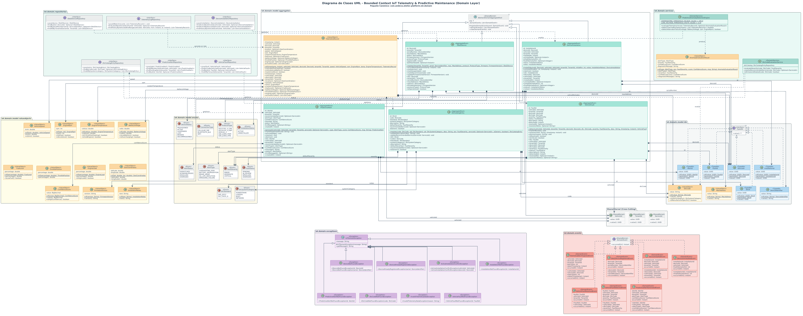

## 11. Fase 8: Bounded Context 8 — IoT Telemetry & Predictive Maintenance Context (`com.andeva.atelier.platform.iot`)

### 11.1. Diccionario y Propósito del Contexto

#### 11.1.1. Propósito y Límites de Responsabilidad
El **IoT Telemetry & Predictive Maintenance Context** constituye el núcleo de innovación y el principal factor diferenciador de la plataforma Atelier en el mercado automotriz. Transforma al taller mecánico tradicional en un centro de servicio inteligente, conectado y predictivo. Su delimitación arquitectónica responde a cuatro objetivos fundamentales:
1. **Ingesta y Almacenamiento Masivo de Series Temporales (*Time-Series*):** Los escáneres OBD-II conectados a los vehículos transmiten periódicamente parámetros del motor (RPM, velocidad, temperatura del refrigerante, nivel de combustible y voltaje de batería) con frecuencias de 1 a 5 segundos. En una flota activa de cientos de vehículos, esto genera millones de registros diarios. Si estos datos se insertaran en las tablas transaccionales del ERP relacional (PostgreSQL), provocarían bloqueos de tablas, saturación del buffer pool y degradación de tiempos de respuesta en MRO y Facturación. Este contexto aísla dicha carga utilizando **TimescaleDB** (extensión relacional optimizada para series temporales desplegada en Aiven Cloud).
2. **Gestión del Hardware OBD-II y Ciclo de Instalación (`Obd2Device` y `DeviceInstallation`):** Administra el inventario de escáneres OBD-II adquiridos por el taller bajo el esquema *BYOD (Bring Your Own Device)* o provistos por Andeva, registrando sus identificadores físicos unívocos (dirección MAC para Bluetooth BLE o número IMEI para dispositivos celulares con tarjeta SIM) y controlando su vinculación física temporal con los vehículos de los clientes.
3. **Detección y Trazabilidad de Códigos de Falla (`VehicleFault`):** Cuando la computadora del vehículo (ECU / PCM) detecta un desperfecto electrónico, mecánico o de emisiones, genera un código de diagnóstico estandarizado (**DTC - *Diagnostic Trouble Code***, tales como `P0300` por falla de encendido o `P0420` por degradación del convertidor catalítico). El contexto captura estos códigos, evalúa su nivel de severidad (`LOW`, `MEDIUM`, `CRITICAL`) y los asienta en el historial clínico del vehículo.
4. **Motor de Detección de Anomalías y Mantenimiento Predictivo (`PredictiveAnomalyDetectionEngine`):** Evalúa algorítmicamente en tiempo real los flujos de telemetría ingestados, identificando patrones anómalos previos a la rotura catastrófica de componentes (ej. sobrecalentamiento del refrigerante $> 105^\circ\text{C}$ sostenido en tráfico lento, fluctuaciones erráticas de RPM en ralentí, o caída de tensión de batería $< 11.8\text{V}$ con motor apagado). Calcula un índice de confianza matemática (`confidence_score`) y genera una alerta predictiva formal (`PredictiveAlert`).
5. **Venta Cruzada Preventiva y Despacho Push Instantáneo (`Firebase Cloud Messaging - FCM`):** Toda alerta predictiva calculada se vincula automáticamente con un servicio preventivo del catálogo de MRO (`recommended_service_id`, por ejemplo "Limpieza de Inyectores", "Cambio de Termostato" o "Sustitución de Batería"). El sistema despacha notificaciones push de alta prioridad de forma simultánea a dos destinatarios mediante el **Firebase Admin SDK**:
   * **Al Conductor (`Atelier Driver`):** Alerta en lenguaje claro sobre el riesgo que corre su automóvil y le ofrece agendar una cita inmediata con un solo toque.
   * **Al Taller (`Atelier Workshop`):** Proyecta la anomalía en el panel de telemetría del asesor de servicio, permitiéndole contactar proactivamente al cliente con una cotización lista para aprobación.

#### 11.1.2. Decisiones de Diseño e Integraciones Críticas
* **Hipertablas Append-Only en TimescaleDB:** La tabla `telemetry_logs` opera como una **Hipertabla (Hypertable)** particionada automáticamente por intervalos de tiempo (chunks de 7 días). Para alcanzar tasas de ingesta sostenidas de miles de lecturas por segundo, carece deliberadamente de triggers de auditoría, eliminaciones lógicas (*soft deletes*) y claves foráneas rígidas en tiempo de ejecución. Adicionalmente, cuenta con una política de compresión columnar (*Timescale Compression Policy*) activada a partir de los 30 días de antigüedad, reduciendo la huella de almacenamiento en disco en más de un 90%.
* **Soporte Híbrido de Puertas de Enlace (*Gateways*):**
  * *Dispositivos con tarjeta SIM:* Despachan tramas estructuradas directamente a la API de ingesta por HTTP REST sobre canales TLS.
  * *Dispositivos Bluetooth (BLE) / WiFi:* La aplicación móvil del conductor (`Atelier Driver`) o la del mecánico en patio (`Atelier Workshop`) se enlaza mediante Bluetooth Low Energy al escáner, actúa como *Gateway* en segundo plano, acumula lecturas y las remite en ráfagas por lotes (*batches*) al backend.
* **Fachada Open Host Service (OHS) hacia CRM y MRO:** Los módulos de CRM y MRO no consultan TimescaleDB directamente. Invocan `IoTTelemetryContextFacade.getVehicleLatestTelemetry(vehicleId)` para desplegar el tacómetro digital y odómetro en la ficha del vehículo, y `getActiveFaultsForVehicle(vehicleId)` para precargar diagnósticos en la orden de trabajo.

---

### 11.2. 2.6.9.1. Domain Layer

#### 11.2.1. Aggregates & Aggregate Roots

##### 1. `Obd2Device` (Aggregate Root)
* **Paquete:** `com.andeva.atelier.platform.iot.domain.model.aggregates`
* **Herencia:** Extiende `AbstractDomainAggregateRoot<Obd2Device>`
* **Propósito:** Representa el equipo físico de hardware de diagnóstico a bordo (OBD-II) perteneciente al taller.
* **Atributos:**
  * `id: DeviceId` — Identificador universal interno del dispositivo (UUID).
  * `tenantId: TenantId` — Taller automotriz propietario del hardware.
  * `deviceIdentifier: DeviceIdentifier` — Identificador unívoco del hardware: Dirección MAC Bluetooth (ej. `00:1A:7D:DA:71:13`) o código IMEI de 15 dígitos para módems celulares. **Restricción UNIQUE a nivel de base de datos**.
  * `connectionType: ConnectionType` — Canal de enlace (`BLUETOOTH_BLE`, `SIM_CELLULAR`, `WIFI`).
  * `status: DeviceStatus` — Situación operativa (`ACTIVE`, `INACTIVE`, `LOST`, `BROKEN`).
  * `hardwareModel: String` — Denominación del modelo (ej. "ELM327 v2.1 BLE", "Teltonika FMB920 OBD").
  * `firmwareVersion: String` — Versión del software embebido.
* **Invariantes y Reglas de Negocio:**
  * El identificador del dispositivo debe respetar el formato estricto de MAC Address (6 pares hexadecimales) o IMEI (15 dígitos numéricos).
  * No puede registrarse dos veces el mismo `deviceIdentifier` en toda la plataforma.
* **Métodos:**
  * `+ static Obd2Device register(TenantId tenantId, DeviceIdentifier identifier, ConnectionType type, String model, String firmware): Obd2Device`: Factoría de dominio; valida sintaxis del identificador, asigna estado `ACTIVE` y registra `Obd2DeviceRegisteredEvent`.
  * `+ void markLost(): void`: Marca el hardware como extraviado, inhabilitando su aceptación en la ingesta.
  * `+ void markBroken(): void`: Marca el hardware como averiado.
  * `+ void updateFirmware(String newVersion): void`: Actualiza metadatos de firmware.

##### 2. `DeviceInstallation` (Aggregate Root)
* **Paquete:** `com.andeva.atelier.platform.iot.domain.model.aggregates`
* **Herencia:** Extiende `AbstractDomainAggregateRoot<DeviceInstallation>`
* **Propósito:** Representa la vinculación operativa y física de un escáner OBD-II en el puerto de diagnóstico de un vehículo automotriz.
* **Atributos:**
  * `id: InstallationId` — Identificador universal de la instalación (UUID).
  * `deviceId: DeviceId` — Escáner OBD-II utilizado.
  * `vehicleId: VehicleId` — Vehículo intervenido.
  * `tenantId: TenantId` — Taller prestador del servicio de telemetría.
  * `installedAt: Instant` — Timestamp de inicio de la instalación y monitoreo.
  * `uninstalledAt: Optional<Instant>` — Timestamp de desconexión física (nullable hasta que culmine el servicio).
  * `initialOdometerKm: int` — Kilometraje registrado al momento de la conexión.
  * `finalOdometerKm: Optional<Integer>` — Kilometraje al desinstalar.
* **Invariantes y Reglas de Negocio:**
  * Un dispositivo no puede tener más de una instalación activa simultáneamente (`uninstalledAt == null`).
  * Un vehículo no puede tener más de un escáner instalado al mismo tiempo.
  * La fecha de desinstalación no puede ser cronológicamente anterior a la fecha de instalación.
* **Métodos:**
  * `+ static DeviceInstallation install(DeviceId deviceId, VehicleId vehicleId, TenantId tenantId, int currentOdometerKm): DeviceInstallation`: Factoría que asienta la vinculación activa y emite `DeviceInstalledOnVehicleEvent`.
  * `+ void uninstall(int finalOdometerKm, Instant uninstalledTimestamp): void`: Finaliza la sesión de monitoreo y emite `DeviceUninstalledFromVehicleEvent`.
  * `+ boolean isActive(): boolean`: Retorna `true` si la instalación continúa en curso.

##### 3. `TelemetryRecord` (Time-Series Aggregate / Value Object Inmutable)
* **Paquete:** `com.andeva.atelier.platform.iot.domain.model.aggregates`
* **Propósito:** Modela una lectura instantánea de telemetría vehicular capturada por el escáner y persistida en la Hipertabla de TimescaleDB.
* **Atributos:**
  * `timestamp: Instant` — Momento cronológico de captura satelital/vehicular (Clave de particionamiento temporal en TimescaleDB).
  * `vehicleId: VehicleId` — Vehículo emisor (Clave primaria compuesta junto con timestamp).
  * `tenantId: TenantId` — Taller desnormalizado para consultas analíticas de alto rendimiento.
  * `location: Optional<GeoCoordinates>` — Coordenadas GPS satelitales (latitud, longitud) provistas por el smartphone o módem.
  * `speed: VehicleSpeed` — Velocidad instantánea en km/h reportada por la ECU.
  * `engineTemperature: EngineTemperature` — Temperatura del refrigerante del motor en grados Celsius ($^\circ\text{C}$).
  * `engineRpm: EngineRpm` — Revoluciones por minuto del cigüeñal.
  * `fuelLevel: Optional<FuelLevel>` — Porcentaje de combustible remanente (0% a 100%).
  * `batteryVoltage: Optional<BatteryVoltage>` — Tensión eléctrica en voltios del alternador/batería.
* **Invariantes y Reglas de Negocio:**
  * Las lecturas son de naturaleza inmutable y de solo inserción (*Append-Only*).
  * La velocidad no puede ser negativa ni exceder 350 km/h.
  * La temperatura del motor debe encontrarse en rangos físicamente plausibles (-40°C a 200°C).

##### 4. `VehicleFault` (Aggregate Root)
* **Paquete:** `com.andeva.atelier.platform.iot.domain.model.aggregates`
* **Herencia:** Extiende `AbstractDomainAggregateRoot<VehicleFault>`
* **Propósito:** Representa un código de error de diagnóstico (**DTC**) emitido por la computadora a bordo del automóvil.
* **Atributos:**
  * `id: FaultId` — Identificador universal del fallo (UUID).
  * `vehicleId: VehicleId` — Vehículo afectado.
  * `tenantId: TenantId` — Taller que supervisa la unidad.
  * `dtcCode: DtcCode` — Código alfanumérico normalizado SAE J2019 / ISO 15031 (ej. `P0300`, `P0420`, `B0001`).
  * `severity: FaultSeverity` — Gravedad del problema (`LOW`, `MEDIUM`, `CRITICAL`).
  * `description: String` — Glosa técnica explicativa del subsistema comprometido.
  * `detectedAt: Instant` — Momento exacto de emisión por el escáner.
  * `isResolved: boolean` — Bandera que indica si el código fue subsanado o limpiado (*cleared*).
  * `resolvedAt: Optional<Instant>` — Momento de resolución mecánica en taller (nullable).
* **Métodos:**
  * `+ static VehicleFault detect(VehicleId vehicleId, TenantId tenantId, DtcCode dtcCode, FaultSeverity severity, String description): VehicleFault`: Factoría de dominio; registra `VehicleFaultDetectedEvent`.
  * `+ void resolve(): void`: Marca el código como reparado tras intervención en foso de servicio.

##### 5. `PredictiveAlert` (Aggregate Root)
* **Paquete:** `com.andeva.atelier.platform.iot.domain.model.aggregates`
* **Herencia:** Extiende `AbstractDomainAggregateRoot<PredictiveAlert>`
* **Propósito:** Representa una advertencia proactiva generada por el motor de inteligencia de telemetría anticipando una avería mecánica grave.
* **Atributos:**
  * `id: AlertId` — Identificador universal de la alerta (UUID).
  * `vehicleId: VehicleId` — Vehículo en riesgo.
  * `tenantId: TenantId` — Taller automotriz responsable.
  * `recommendedServiceId: Optional<ServiceId>` — Servicio mecánico preventivo sugerido del catálogo de MRO.
  * `alertType: AlertType` — Tipo de riesgo (`ENGINE_OVERHEATING_RISK`, `BATTERY_FAILURE_RISK`, `CATALYTIC_SYSTEM_DEGRADATION`, `CYLINDER_MISFIRE_HAZARD`).
  * `confidenceScore: ConfidenceScore` — Probabilidad porcentual estimada del fallo inminente (ej. 89.50%).
  * `message: String` — Mensaje preventivo comprensible para el conductor.
  * `status: AlertStatus` — Estado de la alerta (`DISPATCHED`, `ACKNOWLEDGED`, `RESOLVED`, `DISMISSED`).
  * `fcmMessageId: Optional<String>` — Identificador de mensaje retornado por Firebase Cloud Messaging.
  * `createdAt: Instant` — Momento de formulación matemática de la alerta.
* **Métodos:**
  * `+ static PredictiveAlert generate(VehicleId vehicleId, TenantId tenantId, Optional<ServiceId> serviceId, AlertType type, ConfidenceScore score, String message): PredictiveAlert`: Factoría que inicializa la alerta en estado `DISPATCHED` y registra `PredictiveAlertDispatchedEvent`.
  * `+ void markDispatched(String fcmMessageId): void`: Registra el ID de entrega del push de Firebase.
  * `+ void acknowledge(): void`: Registra que el cliente o el taller abrió la notificación.
  * `+ void resolve(): void`: Registra que el vehículo ingresó al taller y fue reparado preventivamente.
  * `+ void dismiss(): void`: Descarta la alerta por falsa alarma o decisión del usuario.

---

#### 11.2.2. Entities (Child Entities)

##### `DtcCatalogEntry` (Entity)
* **Paquete:** `com.andeva.atelier.platform.iot.domain.model.entities`
* **Propósito:** Catálogo maestro estandarizado de códigos DTC de automoción (SAE/ISO) para enriquecimiento semántico de descripciones técnicas y gravedades predeterminadas.
* **Atributos:**
  * `code: DtcCode` — Código alfanumérico (ej. `P0171`).
  * `category: DtcCategory` — Subsistema (`POWERTRAIN_P`, `CHASSIS_C`, `BODY_B`, `NETWORK_U`).
  * `standardDescription: String` — Glosa oficial (ej. "Sistema de combustible demasiado pobre (Banco 1)").
  * `defaultSeverity: FaultSeverity` — Gravedad estimada estándar.

---

#### 11.2.3. Value Objects

* **`DeviceId`:** Identificador universal inmutable de un hardware (`record DeviceId(UUID value)`).
* **`InstallationId`:** Identificador inmutable de una instalación (`record InstallationId(UUID value)`).
* **`FaultId`:** Identificador inmutable de un código DTC (`record FaultId(UUID value)`).
* **`AlertId`:** Identificador inmutable de una alerta predictiva (`record AlertId(UUID value)`).
* **`DeviceIdentifier`:** Objeto de valor que valida el formato de identificador MAC o IMEI (`record DeviceIdentifier(String value)`). Valida que cumpla el patrón `^([0-9A-Fa-f]{2}[:-]){5}([0-9A-Fa-f]{2})$` o `^[0-9]{15}$`.
* **`ConnectionType`:** Enumeración del canal físico (`BLUETOOTH_BLE`, `SIM_CELLULAR`, `WIFI`).
* **`DeviceStatus`:** Situación del hardware (`ACTIVE`, `INACTIVE`, `LOST`, `BROKEN`).
* **`DtcCode`:** Objeto de valor para códigos de fallo (`record DtcCode(String value)`). Valida el patrón `^[P|C|B|U][0-9]{4}$`.
* **`FaultSeverity`:** Severidad de la falla detectada (`LOW`, `MEDIUM`, `CRITICAL`).
* **`ConfidenceScore`:** Probabilidad matemática de fallo (`record ConfidenceScore(BigDecimal value)`). Valida que $0.00 \le \text{value} \le 100.00$.
* **`EngineTemperature`:** Temperatura del motor (`record EngineTemperature(double celsius)`). Contiene método de dominio `boolean isCriticalOverheating()` ($\text{celsius} > 105.0$).
* **`EngineRpm`:** Revoluciones del motor (`record EngineRpm(int rpm)`). Contiene método `boolean isExcessiveRpm()` ($\text{rpm} > 6000$).
* **`VehicleSpeed`:** Velocidad del auto (`record VehicleSpeed(int kmh)`).
* **`BatteryVoltage`:** Tensión eléctrica (`record BatteryVoltage(double volts)`). Contiene método `boolean isLowBattery()` ($\text{volts} < 11.8$).
* **`FuelLevel`:** Nivel de tanque (`record FuelLevel(double percentage)`).
* **`AlertType`:** Tipos analíticos de alerta (`ENGINE_OVERHEATING_RISK`, `BATTERY_FAILURE_RISK`, `CATALYTIC_SYSTEM_DEGRADATION`, `CYLINDER_MISFIRE_HAZARD`).
* **`AlertStatus`:** Estados de atención (`DISPATCHED`, `ACKNOWLEDGED`, `RESOLVED`, `DISMISSED`).

---

#### 11.2.4. Domain Commands

* **`RegisterObd2DeviceCommand`:** Alta de hardware (`TenantId tenantId, DeviceIdentifier identifier, ConnectionType type, String model, String firmware`).
* **`InstallDeviceOnVehicleCommand`:** Conexión de escáner a auto (`DeviceId deviceId, VehicleId vehicleId, TenantId tenantId, int currentOdometerKm`).
* **`UninstallDeviceFromVehicleCommand`:** Retiro del escáner (`InstallationId installationId, int finalOdometerKm`).
* **`IngestTelemetryBatchCommand`:** Ráfaga masiva de lecturas (`VehicleId vehicleId, TenantId tenantId, List<TelemetryReadingDto> readings`).
* **`RegisterVehicleFaultCommand`:** Asentamiento de código DTC (`VehicleId vehicleId, TenantId tenantId, DtcCode code`).
* **`GeneratePredictiveAlertCommand`:** Formulación de alerta preventiva (`VehicleId vehicleId, TenantId tenantId, Optional<ServiceId> serviceId, AlertType type, ConfidenceScore score, String message`).
* **`AcknowledgeAlertCommand`:** Notificación leída por usuario (`AlertId alertId`).

---

#### 11.2.5. Domain Queries

* **`GetDeviceByIdQuery`:** Consulta de hardware por ID (`DeviceId deviceId`).
* **`GetDeviceByVehicleIdQuery`:** Consulta el escáner instalado actualmente en un vehículo (`VehicleId vehicleId`).
* **`GetVehicleLatestTelemetryQuery`:** Tacómetro y última lectura en tiempo real (`VehicleId vehicleId`).
* **`GetTelemetryHistoryQuery`:** Consulta histórica agregada con TimescaleDB (`VehicleId vehicleId, Instant from, Instant to, String bucketInterval`).
* **`ListActiveFaultsByVehicleQuery`:** Fallas DTC activas (`VehicleId vehicleId`).
* **`ListPredictiveAlertsByTenantQuery`:** Tablero de alertas predictivas del taller (`TenantId tenantId, Optional<AlertStatus> status`).

---

#### 11.2.6. Domain Events

* **`Obd2DeviceRegisteredEvent`:** Emitido al dar de alta un equipo en el inventario (`DeviceId deviceId, TenantId tenantId, DeviceIdentifier identifier`).
* **`DeviceInstalledOnVehicleEvent`:** Emitido al conectar un escáner al puerto OBD-II del vehículo (`InstallationId installationId, DeviceId deviceId, VehicleId vehicleId, Instant timestamp`).
* **`DeviceUninstalledFromVehicleEvent`:** Emitido al desvincular el escáner (`InstallationId installationId, VehicleId vehicleId, Instant timestamp`).
* **`TelemetryBatchIngestedEvent`:** Emitido tras persistir con éxito un lote masivo en TimescaleDB (`VehicleId vehicleId, int recordsCount, Instant latestTimestamp`).
* **`CriticalEngineAnomalyDetectedEvent`:** Emitido por el motor de inferencia cuando los PIDs superan umbrales peligrosos (`VehicleId vehicleId, TenantId tenantId, AlertType type, ConfidenceScore score, String message`).
* **`VehicleFaultDetectedEvent`:** Emitido al reportarse un código de avería DTC activo (`FaultId faultId, VehicleId vehicleId, DtcCode dtcCode, FaultSeverity severity`).
* **`PredictiveAlertDispatchedEvent`:** Emitido al despacharse la notificación push por FCM (`AlertId alertId, VehicleId vehicleId, TenantId tenantId, String fcmMessageId`).

---

#### 11.2.7. Domain Repositories (Interfaces)

```java
package com.andeva.atelier.platform.iot.domain.repositories;

public interface Obd2DeviceRepository {
    Obd2Device save(Obd2Device device);
    Optional<Obd2Device> findById(DeviceId id);
    Optional<Obd2Device> findByIdentifier(DeviceIdentifier identifier);
    List<Obd2Device> findAllByTenantId(TenantId tenantId);
    boolean existsByIdentifier(DeviceIdentifier identifier);
}

public interface DeviceInstallationRepository {
    DeviceInstallation save(DeviceInstallation installation);
    Optional<DeviceInstallation> findById(InstallationId id);
    Optional<DeviceInstallation> findActiveByVehicleId(VehicleId vehicleId);
    Optional<DeviceInstallation> findActiveByDeviceId(DeviceId deviceId);
    List<DeviceInstallation> findAllHistoryByVehicleId(VehicleId vehicleId);
}

public interface TelemetryLogRepository {
    /**
     * Inserción masiva ultra rápida en la Hipertabla de TimescaleDB mediante JDBC Batch
     */
    void saveAllBatch(List<TelemetryRecord> records);
    Optional<TelemetryRecord> findLatestByVehicleId(VehicleId vehicleId);
    List<TelemetryRecord> findHistoryAggregated(VehicleId vehicleId, Instant from, Instant to, String timeBucket);
}

public interface VehicleFaultRepository {
    VehicleFault save(VehicleFault fault);
    Optional<VehicleFault> findById(FaultId id);
    List<VehicleFault> findActiveByVehicleId(VehicleId vehicleId);
    List<VehicleFault> findAllByVehicleId(VehicleId vehicleId);
}

public interface PredictiveAlertRepository {
    PredictiveAlert save(PredictiveAlert alert);
    Optional<PredictiveAlert> findById(AlertId id);
    List<PredictiveAlert> findAllByVehicleId(VehicleId vehicleId);
    List<PredictiveAlert> findAllByTenantIdAndStatus(TenantId tenantId, AlertStatus status);
}
```

---

#### 11.2.8. Domain Services

##### 1. `PredictiveAnomalyDetectionEngine` (Motor Analítico de Anomalías Predictivas)
* **Paquete:** `com.andeva.atelier.platform.iot.domain.services`
* **Propósito:** Evalúa en tiempo real las lecturas de telemetría vehicular recién arribadas para formular diagnósticos preventivos antes de que ocurra una avería catastrófica:
```java
package com.andeva.atelier.platform.iot.domain.services;

import com.andeva.atelier.platform.iot.domain.model.aggregates.TelemetryRecord;
import com.andeva.atelier.platform.iot.domain.model.valueobjects.AlertType;
import com.andeva.atelier.platform.iot.domain.model.valueobjects.ConfidenceScore;
import org.springframework.stereotype.Service;

import java.math.BigDecimal;
import java.util.Optional;

@Service
public class PredictiveAnomalyDetectionEngine {

    public Optional<AnomalyEvaluationResult> evaluateTelemetryRecord(TelemetryRecord record) {
        // 1. Detección de Sobrecalentamiento Crítico de Motor
        if (record.engineTemperature().isCriticalOverheating()) {
            double temp = record.engineTemperature().celsius();
            BigDecimal confidence = temp >= 115.0 ? new BigDecimal("98.50") : new BigDecimal("88.00");
            return Optional.of(new AnomalyEvaluationResult(
                    AlertType.ENGINE_OVERHEATING_RISK,
                    new ConfidenceScore(confidence),
                    String.format("Temperatura de refrigerante crítica alcanzada (%.1f°C). Riesgo inminente de daño en empaque de culata.", temp)
            ));
        }

        // 2. Detección de Degradación Severa de Batería / Alternador
        if (record.batteryVoltage().isPresent() && record.batteryVoltage().get().isLowBattery() && record.speed().kmh() == 0) {
            double voltage = record.batteryVoltage().get().volts();
            return Optional.of(new AnomalyEvaluationResult(
                    AlertType.BATTERY_FAILURE_RISK,
                    new ConfidenceScore(new BigDecimal("91.20")),
                    String.format("Voltaje de batería peligroso en reposo (%.2fV). Requiere recarga o cambio preventivo antes de arranque fallido.", voltage)
            ));
        }

        return Optional.empty();
    }
}

public record AnomalyEvaluationResult(
    AlertType alertType,
    ConfidenceScore confidenceScore,
    String diagnosticMessage
) {}
```

##### 2. `DtcCodeEvaluationService` (Servicio de Evaluación de Códigos de Falla)
* **Paquete:** `com.andeva.atelier.platform.iot.domain.services`
* **Propósito:** Mapea códigos DTC capturados por el escáner OBD-II contra la severidad reglamentaria:
  * Códigos de encendido de cilindros (`P0300` - `P0304`): Clasificados como `CRITICAL` (riesgo de daño irreversible al catalizador por combustible crudo).
  * Códigos de emisiones y sensores de oxígeno (`P0420`, `P0130`): Clasificados como `MEDIUM`.
  * Códigos de accesorios menores: Clasificados como `LOW`.

---

#### 11.2.9. Domain Exceptions (RFC 7807 Problem Details)

La capa de dominio define una jerarquía de excepciones semánticas no comprobadas derivadas de `IoTDomainException`. Cada excepción encapsula un código legible estandarizado bajo la norma RFC 7807 y su estatus HTTP representativo proyectado en el perímetro REST:

```java
package com.andeva.atelier.platform.iot.domain.exceptions;

public abstract class IoTDomainException extends RuntimeException {
    private final String errorCode;
    
    protected IoTDomainException(String errorCode, String message) {
        super(message);
        this.errorCode = errorCode;
    }
    
    public String getErrorCode() {
        return errorCode;
    }
}
```

* **`DeviceAlreadyAssignedException`:** Código `ERR_DEVICE_ALREADY_ASSIGNED` (HTTP 409 Conflict). Lanzada cuando se intenta vincular un escáner OBD-II a un vehículo mientras ya mantiene una sesión de instalación activa en otra unidad sin concluir previamente.
* **`ActiveInstallationConflictException`:** Código `ERR_ACTIVE_INSTALLATION_CONFLICT` (HTTP 409 Conflict). Lanzada si se intenta acoplar un escáner a un automóvil que ya cuenta con otro dispositivo físico transmitiendo en paralelo.
* **`DeviceNotFoundException`:** Código `ERR_DEVICE_NOT_FOUND` (HTTP 404 Not Found). Lanzada al buscar un escáner por su identificador UUID o hardware MAC/IMEI y no encontrar coincidencia en la base de datos del taller.
* **`InstallationNotFoundException`:** Código `ERR_INSTALLATION_NOT_FOUND` (HTTP 404 Not Found). Lanzada cuando se intenta desinstalar o consultar una sesión de montaje telemático inexistente.
* **`InvalidDeviceIdentifierException`:** Código `ERR_INVALID_DEVICE_IDENTIFIER` (HTTP 422 Unprocessable Entity). Lanzada si la dirección física no cumple el formato estricto de MAC Address (6 pares hexadecimales) ni de IMEI celular (15 dígitos numéricos).
* **`InvalidDtcCodeException`:** Código `ERR_INVALID_DTC_CODE` (HTTP 422 Unprocessable Entity). Lanzada cuando la trama del código de avería transgrede el estándar SAE J2012 (prefijos válidos P, C, B, U seguidos de cuatro dígitos numéricos).
* **`TelemetryIngestionException`:** Código `ERR_TELEMETRY_INGESTION_FAILED` (HTTP 422 Unprocessable Entity). Lanzada cuando las lecturas cinemáticas o térmicas contienen valores fuera del dominio físico plausible (ej. velocidad negativa, revoluciones superiores a 12000 RPM o temperatura de refrigerante anómala).
* **`AlertNotFoundException`:** Código `ERR_ALERT_NOT_FOUND` (HTTP 404 Not Found). Lanzada al intentar confirmar lectura o resolver una advertencia de mantenimiento predictivo inexistente.
* **`UnsupportedPidException`:** Código `ERR_UNSUPPORTED_PID` (HTTP 400 Bad Request). Lanzada si la trama OBD-II reporta identificadores de parámetros no admitidos por el decodificador de telemetría de Atelier.

---

### 11.3. 2.6.9.2. Interface Layer

#### 11.3.1. REST Controllers & Ingestion Endpoints

##### 1. `Obd2DevicesController`
* **Ruta Base:** `/api/v1/iot/devices`
* **Responsabilidad:** Inventario de escáneres OBD-II pertenecientes a los talleres.
* **Endpoints:**
  * `POST /`: Registra un nuevo escáner en el taller (`RegisterObd2DeviceCommand`). Responde `201 Created` con `Obd2DeviceResource`.
  * `GET /{id}`: Obtiene detalles de un hardware específico. Responde `200 OK`.
  * `GET /`: Lista todos los dispositivos del taller autenticado. Responde `200 OK`.
  * `PATCH /{id}/status`: Actualiza la situación del hardware (`LOST`, `BROKEN`, `ACTIVE`). Responde `200 OK`.

##### 2. `DeviceInstallationsController`
* **Ruta Base:** `/api/v1/iot/installations`
* **Responsabilidad:** Conexión y retiro físico de escáneres en vehículos.
* **Endpoints:**
  * `POST /install`: Vincula un escáner a un automóvil de cliente (`InstallDeviceOnVehicleCommand`). Responde `201 Created`.
  * `POST /{id}/uninstall`: Registra la desconexión física y kilometraje final. Responde `200 OK`.
  * `GET /vehicle/{vehicleId}/active`: Consulta el escáner actualmente activo en el vehículo. Responde `200 OK`.

##### 3. `TelemetryIngestionController`
* **Ruta Base:** `/api/v1/iot/telemetry`
* **Responsabilidad:** Endpoint de ingestión por ráfagas de altísimo rendimiento consumido por las aplicaciones móviles (`Gateway BLE`) y módems SIM celulares.
* **Endpoints:**
  * `POST /batch`: Ingesta un lote de 1 a 100 lecturas temporales de telemetría de un vehículo (`IngestTelemetryBatchCommand`). Ejecuta persistencia JDBC en TimescaleDB y dispara el motor analítico de anomalías. Responde `202 Accepted` con `TelemetryIngestionAckResource`.
  * `GET /vehicle/{vehicleId}/latest`: Retorna el tacómetro en tiempo real con la última lectura válida. Responde `200 OK`.
  * `GET /vehicle/{vehicleId}/history`: Consulta métricas históricas agrupadas por intervalos temporales (`time_bucket`). Responde `200 OK`.

##### 4. `VehicleFaultsController`
* **Ruta Base:** `/api/v1/iot/faults`
* **Responsabilidad:** Diagnóstico electrónico vehicular.
* **Endpoints:**
  * `POST /`: Asienta un código DTC reportado por el escáner. Responde `201 Created`.
  * `GET /vehicle/{vehicleId}/active`: Lista las averías electrónicas activas del vehículo. Responde `200 OK`.
  * `POST /{id}/resolve`: Marca la falla como subsanada tras reparación en foso. Responde `200 OK`.

##### 5. `PredictiveAlertsController`
* **Ruta Base:** `/api/v1/iot/alerts`
* **Responsabilidad:** Gestión de alertas predictivas y oportunidades de servicio preventivo.
* **Endpoints:**
  * `GET /tenant`: Tablero de control de alertas predictivas activas del taller. Responde `200 OK`.
  * `GET /vehicle/{vehicleId}`: Historial de alertas emitidas para un vehículo. Responde `200 OK`.
  * `PATCH /{id}/acknowledge`: Marca la alerta como leída. Responde `200 OK`.
  * `POST /{id}/convert-to-appointment`: Redirige al módulo de CRM/MRO para agendar cita preventiva a partir de la alerta. Responde `200 OK`.

##### 6. `VehicleHealthReportsController`
* **Ruta Base:** `/api/v1/iot/vehicles/{vehicleId}/health-reports`
* **Responsabilidad:** Orquestación perimetral del motor de diagnóstico predictivo vehicular con Inteligencia Artificial (Spring AI), consolidación de reportes de salud mecánica y exportación documental en PDF.
* **Endpoints:**
  * `POST /generate`: Dispara la evaluación analítica sobre las series temporales de TimescaleDB y averías activas (`GenerateVehicleHealthReportCommand`), persiste alertas predictivas >= 70% y responde `201 Created` con cabecera `Location` y recurso `HealthReportSummaryResource`.
  * `POST /generate-async`: Encola la generación del informe para flotas masivas o procesamiento en segundo plano (`EnqueueVehicleHealthReportAnalysisCommand`). Responde `202 Accepted`.
  * `GET /latest`: Consulta en memoria/caché el último informe de salud mecánica calculado (`GetLatestVehicleHealthReportQuery`). Responde `200 OK` con `VehicleHealthReportResource`.
  * `GET /{reportId}/pdf`: Renderiza y descarga el informe pericial en formato binario PDF mediante el adaptador de maquetación (`ExportVehicleHealthReportPdfQuery`). Responde `200 OK` con `Content-Type: application/pdf` y cabecera `Content-Disposition`.

---

#### 11.3.2. REST Resources & DTOs (Records)

```java
package com.andeva.atelier.platform.iot.interfaces.rest.resources;

public record RegisterDeviceRequest(
    @NotBlank String deviceIdentifier, // MAC o IMEI
    @NotBlank String connectionType,   // BLUETOOTH_BLE, SIM_CELLULAR, WIFI
    String hardwareModel,
    String firmwareVersion
) {}

public record InstallDeviceRequest(
    @NotNull UUID deviceId,
    @NotNull UUID vehicleId,
    @Min(0) int currentOdometerKm
) {}

public record TelemetryBatchRequest(
    @NotNull UUID vehicleId,
    @NotEmpty List<TelemetryReadingItemDto> readings
) {}

public record TelemetryReadingItemDto(
    @NotNull Instant timestamp,
    Double latitude,
    Double longitude,
    @Min(0) int speedKmh,
    @NotNull Double engineTempCelsius,
    @Min(0) int engineRpm,
    Double fuelPercentage,
    Double batteryVoltage
) {}

public record TelemetryIngestionAckResource(
    UUID vehicleId,
    int ingestedCount,
    boolean anomalyDetected,
    String alertMessage
) {}

public record VehicleLatestTelemetryResource(
    UUID vehicleId,
    Instant timestamp,
    Double latitude,
    Double longitude,
    int speedKmh,
    double engineTempCelsius,
    int engineRpm,
    Double batteryVoltage,
    Double fuelPercentage
) {}

public record VehicleFaultResource(
    UUID id,
    UUID vehicleId,
    String dtcCode,
    String severity,
    String description,
    Instant detectedAt,
    boolean isResolved
) {}

public record PredictiveAlertResource(
    UUID id,
    UUID vehicleId,
    UUID recommendedServiceId,
    String alertType,
    BigDecimal confidenceScore,
    String message,
    String status,
    Instant createdAt
) {}

public record GenerateHealthReportRequest(
    @Min(value = 7, message = "El período mínimo de análisis es de 7 días")
    @Max(value = 90, message = "El período máximo de análisis es de 90 días")
    Integer daysToAnalyze,
    Boolean includeResolvedDtcHistory,
    String triggerReason
) {
    public GenerateHealthReportRequest {
        if (daysToAnalyze == null) daysToAnalyze = 30;
        if (includeResolvedDtcHistory == null) includeResolvedDtcHistory = false;
        if (triggerReason == null) triggerReason = "MANUAL_REQUEST";
    }
}

public record HealthReportCreatedResponse(
    UUID reportId,
    UUID vehicleId,
    int overallHealthScore,
    String executiveSummary,
    int totalRisksDetected,
    Instant generatedAt,
    String jsonResourceUrl,
    String pdfDownloadUrl
) {}

public record VehicleHealthReportResource(
    UUID reportId,
    UUID vehicleId,
    int overallHealthScore,
    String executiveSummary,
    List<SubsystemEvaluationDto> subsystemEvaluations,
    List<PredictiveRiskDto> predictiveRisks,
    List<RecommendedServiceActionDto> recommendedActions,
    List<DtcTelemetryCorrelationDto> dtcCorrelations,
    Instant generatedAt
) {}
```

---

#### 11.3.3. REST Assemblers (Mappers)

* **`Obd2DeviceResourceAssembler`:** Transforma agregados `Obd2Device` a `Obd2DeviceResource`.
* **`TelemetryResourceAssembler`:** Mapea lecturas de la Hipertabla de TimescaleDB a DTOs `VehicleLatestTelemetryResource`.
* **`VehicleFaultResourceAssembler`:** Mapea `VehicleFault` a `VehicleFaultResource`.
* **`PredictiveAlertResourceAssembler`:** Transforma agregados `PredictiveAlert` a `PredictiveAlertResource`.
* **`VehicleHealthReportResourceAssembler`:** Transforma el DTO analítico `VehicleHealthReportAiDto` generado por Spring AI hacia `VehicleHealthReportResource` y `HealthReportCreatedResponse` con enlaces HATEOAS REST.

---

#### 11.3.4. Inbound ACL Facade (Open Host Service - OHS)

Para que los módulos de CRM y Operaciones de Taller (MRO) consuman diagnósticos telemáticos sin acoplarse a las tramas OBD-II ni a TimescaleDB, IoT expone su fachada canónica:

```java
package com.andeva.atelier.platform.iot.interfaces.acl;

import java.time.Instant;
import java.util.List;
import java.util.Optional;
import java.util.UUID;

public interface IoTTelemetryContextFacade {
    /**
     * Utilizado por CRM y MRO para desplegar el odómetro digital y última lectura en patio.
     */
    Optional<VehicleTelemetrySnapshotDto> getVehicleLatestTelemetry(UUID vehicleId);

    /**
     * Utilizado por MRO al abrir una Orden de Trabajo para precargar fallas electrónicas detectadas.
     */
    List<VehicleDtcFaultDto> getActiveFaultsForVehicle(UUID vehicleId);

    /**
     * Retorna si el vehículo cuenta con un escáner OBD-II conectado activamente.
     */
    boolean hasActiveDeviceInstallation(UUID vehicleId);

    /**
     * Calcula el índice de salud mecánica (0 a 100) basado en fallas activas y anomalías telemáticas.
     */
    int calculateVehicleHealthScore(UUID vehicleId);
}

public record VehicleTelemetrySnapshotDto(
    UUID vehicleId,
    Instant timestamp,
    int speedKmh,
    double engineTempCelsius,
    int engineRpm,
    Double batteryVoltage
) {}

public record VehicleDtcFaultDto(
    String dtcCode,
    String severity,
    String description,
    Instant detectedAt
) {}
```

---

#### 11.3.5. Integration Events (Published / Consumed)

##### 1. Eventos Publicados por IoT hacia otros Bounded Contexts
* **`VehicleAnomalyDetectedIntegrationEvent`:** Emitido al confirmarse una anomalía cinemática o térmica severa en el motor. Consumido por CRM & Customer Experience para contactar de inmediato al conductor y coordinar una inspección preventiva prioritaria.
* **`PredictiveAlertGeneratedIntegrationEvent`:** Emitido al generarse una alerta con servicio sugerido de mantenimiento. Consumido por Workshop Operations (MRO) para preconfigurar presupuestos y cotizaciones de servicios correctivos antes de que el cliente ingrese al taller.
* **`VehicleFaultLoggedIntegrationEvent`:** Emitido al detectar un nuevo código DTC persistente en la ECU vehicular. Consumido por Workshop Operations (MRO) para precargar los diagnósticos mecánicos preliminares al aperturar la orden de trabajo.

##### 2. Eventos Consumidos por IoT desde otros Bounded Contexts
* **`VehicleDecommissionedIntegrationEvent` (emitido por CRM):** Desactiva automáticamente cualquier instalación activa de escáner en el vehículo dado de baja definitiva en la flota o sistema.
* **`VehicleOwnershipTransferredIntegrationEvent` (emitido por CRM):** Desvincula el escáner OBD-II actual y resetea las líneas base de telemetría predictiva ante la transferencia de titularidad vehicular.
* **`WorkOrderCompletedIntegrationEvent` (emitido por MRO):** Sincroniza la resolución de fallas DTC asociadas tras la culminación de reparaciones mecánicas en foso.

---

#### 11.3.6. Global Exception Handling (RFC 7807 Problem Details)

La Capa de Interfaz implementa un controlador global de excepciones perimetrales mediante la clase `IoTExceptionHandler` anotada con `@RestControllerAdvice`. Este componente intercepta las excepciones de dominio emitidas por los agregados, entidades y servicios de dominio de IoT Telemetry & Predictive Maintenance, transformándolas en respuestas estandarizadas bajo la especificación **RFC 7807 Problem Details** (`application/problem+json`).

```java
package com.andeva.atelier.platform.iot.interfaces.rest.exceptions;

import org.springframework.http.HttpStatus;
import org.springframework.http.ProblemDetail;
import org.springframework.web.bind.MethodArgumentNotValidException;
import org.springframework.web.bind.annotation.ExceptionHandler;
import org.springframework.web.bind.annotation.RestControllerAdvice;

import java.net.URI;
import java.time.Instant;
import java.util.stream.Collectors;

@RestControllerAdvice(basePackages = "com.andeva.atelier.platform.iot.interfaces.rest")
public class IoTExceptionHandler {

    private static final String PROBLEM_BASE_URL = "https://api.atelier.andeva.com/errors/iot/";

    @ExceptionHandler(DeviceNotFoundException.class)
    public ProblemDetail handleDeviceNotFound(DeviceNotFoundException ex) {
        ProblemDetail problem = ProblemDetail.forStatusAndDetail(HttpStatus.NOT_FOUND, ex.getMessage());
        problem.setType(URI.create(PROBLEM_BASE_URL + "device-not-found"));
        problem.setTitle("Dispositivo OBD-II No Encontrado");
        problem.setProperty("errorCode", "ERR_DEVICE_NOT_FOUND");
        problem.setProperty("timestamp", Instant.now());
        return problem;
    }

    @ExceptionHandler(InstallationNotFoundException.class)
    public ProblemDetail handleInstallationNotFound(InstallationNotFoundException ex) {
        ProblemDetail problem = ProblemDetail.forStatusAndDetail(HttpStatus.NOT_FOUND, ex.getMessage());
        problem.setType(URI.create(PROBLEM_BASE_URL + "installation-not-found"));
        problem.setTitle("Instalación Telemática No Encontrada");
        problem.setProperty("errorCode", "ERR_INSTALLATION_NOT_FOUND");
        problem.setProperty("timestamp", Instant.now());
        return problem;
    }

    @ExceptionHandler(AlertNotFoundException.class)
    public ProblemDetail handleAlertNotFound(AlertNotFoundException ex) {
        ProblemDetail problem = ProblemDetail.forStatusAndDetail(HttpStatus.NOT_FOUND, ex.getMessage());
        problem.setType(URI.create(PROBLEM_BASE_URL + "alert-not-found"));
        problem.setTitle("Alerta Predictiva No Encontrada");
        problem.setProperty("errorCode", "ERR_ALERT_NOT_FOUND");
        problem.setProperty("timestamp", Instant.now());
        return problem;
    }

    @ExceptionHandler(DeviceAlreadyAssignedException.class)
    public ProblemDetail handleDeviceAlreadyAssigned(DeviceAlreadyAssignedException ex) {
        ProblemDetail problem = ProblemDetail.forStatusAndDetail(HttpStatus.CONFLICT, ex.getMessage());
        problem.setType(URI.create(PROBLEM_BASE_URL + "device-already-assigned"));
        problem.setTitle("Conflicto de Asignación de Dispositivo");
        problem.setProperty("errorCode", "ERR_DEVICE_ALREADY_ASSIGNED");
        problem.setProperty("timestamp", Instant.now());
        return problem;
    }

    @ExceptionHandler(ActiveInstallationConflictException.class)
    public ProblemDetail handleActiveInstallationConflict(ActiveInstallationConflictException ex) {
        ProblemDetail problem = ProblemDetail.forStatusAndDetail(HttpStatus.CONFLICT, ex.getMessage());
        problem.setType(URI.create(PROBLEM_BASE_URL + "active-installation-conflict"));
        problem.setTitle("Vehículo con Instalación Activa Existente");
        problem.setProperty("errorCode", "ERR_ACTIVE_INSTALLATION_CONFLICT");
        problem.setProperty("timestamp", Instant.now());
        return problem;
    }

    @ExceptionHandler(InvalidDeviceIdentifierException.class)
    public ProblemDetail handleInvalidDeviceIdentifier(InvalidDeviceIdentifierException ex) {
        ProblemDetail problem = ProblemDetail.forStatusAndDetail(HttpStatus.UNPROCESSABLE_ENTITY, ex.getMessage());
        problem.setType(URI.create(PROBLEM_BASE_URL + "invalid-device-identifier"));
        problem.setTitle("Identificador de Dispositivo Inválido");
        problem.setProperty("errorCode", "ERR_INVALID_DEVICE_IDENTIFIER");
        problem.setProperty("timestamp", Instant.now());
        return problem;
    }

    @ExceptionHandler(InvalidDtcCodeException.class)
    public ProblemDetail handleInvalidDtcCode(InvalidDtcCodeException ex) {
        ProblemDetail problem = ProblemDetail.forStatusAndDetail(HttpStatus.UNPROCESSABLE_ENTITY, ex.getMessage());
        problem.setType(URI.create(PROBLEM_BASE_URL + "invalid-dtc-code"));
        problem.setTitle("Código de Falla DTC Inválido");
        problem.setProperty("errorCode", "ERR_INVALID_DTC_CODE");
        problem.setProperty("timestamp", Instant.now());
        return problem;
    }

    @ExceptionHandler(TelemetryIngestionException.class)
    public ProblemDetail handleTelemetryIngestion(TelemetryIngestionException ex) {
        ProblemDetail problem = ProblemDetail.forStatusAndDetail(HttpStatus.UNPROCESSABLE_ENTITY, ex.getMessage());
        problem.setType(URI.create(PROBLEM_BASE_URL + "telemetry-ingestion-failed"));
        problem.setTitle("Error de Ingesta Telemática");
        problem.setProperty("errorCode", "ERR_TELEMETRY_INGESTION_FAILED");
        problem.setProperty("timestamp", Instant.now());
        return problem;
    }

    @ExceptionHandler(UnsupportedPidException.class)
    public ProblemDetail handleUnsupportedPid(UnsupportedPidException ex) {
        ProblemDetail problem = ProblemDetail.forStatusAndDetail(HttpStatus.BAD_REQUEST, ex.getMessage());
        problem.setType(URI.create(PROBLEM_BASE_URL + "unsupported-pid"));
        problem.setTitle("Parámetro OBD-II PID No Soportado");
        problem.setProperty("errorCode", "ERR_UNSUPPORTED_PID");
        problem.setProperty("timestamp", Instant.now());
        return problem;
    }

    @ExceptionHandler(MethodArgumentNotValidException.class)
    public ProblemDetail handleValidationException(MethodArgumentNotValidException ex) {
        ProblemDetail problem = ProblemDetail.forStatusAndDetail(HttpStatus.BAD_REQUEST, "Parámetros de entrada inválidos");
        problem.setType(URI.create(PROBLEM_BASE_URL + "validation-error"));
        problem.setTitle("Violación de Reglas de Validación de Interfaz");
        problem.setProperty("errorCode", "ERR_VALIDATION_FAILED");
        problem.setProperty("timestamp", Instant.now());
        problem.setProperty("fieldErrors", ex.getBindingResult().getFieldErrors().stream()
            .map(f -> f.getField() + ": " + f.getDefaultMessage())
            .collect(Collectors.toList()));
        return problem;
    }
}
```

---

### 11.4. 2.6.9.3. Application Layer

La Capa de Aplicación del Bounded Context **IoT Telemetry & Predictive Maintenance** (`com.andeva.atelier.platform.iot.application`) implementa el patrón **CQRS** (*Command Query Responsibility Segregation*), desacoplando estrictamente las mutaciones transaccionales del estado del dominio de las consultas optimizadas de alto rendimiento sobre hipertablas de series temporales en TimescaleDB. Asimismo, orquesta la integración con sistemas externos (Firebase Cloud Messaging, Workshop Operations MRO y Customer & Fleet Management CRM) mediante Capas Anticorrupción (*Anticorruption Layers - ACL*).

```
com.andeva.atelier.platform.iot.application
├── internal
│   ├── commandservices
│   │   ├── TelemetryIngestionCommandServiceImpl.java
│   │   ├── DeviceInstallationCommandServiceImpl.java
│   │   ├── PredictiveAlertCommandServiceImpl.java
│   │   ├── Obd2DeviceCommandServiceImpl.java
│   │   └── VehicleFaultCommandServiceImpl.java
│   ├── queryservices
│   │   ├── TelemetryLogQueryServiceImpl.java
│   │   ├── VehicleFaultQueryServiceImpl.java
│   │   ├── PredictiveAlertQueryServiceImpl.java
│   │   ├── Obd2DeviceQueryServiceImpl.java
│   │   └── DeviceInstallationQueryServiceImpl.java
│   ├── eventhandlers
│   │   ├── TelemetryDomainEventHandler.java
│   │   ├── PredictiveAlertDomainEventHandler.java
│   │   ├── VehicleFaultDomainEventHandler.java
│   │   └── VehicleLifecycleIntegrationEventHandler.java
│   └── outboundservices
│       └── acl
│           ├── FcmNotificationAclService.java
│           ├── OperationsAclService.java
│           ├── CrmFleetAclService.java
│           └── TimescaleBatchJdbcClientPort.java
```

---

#### 11.4.1. Command Services (CQRS Write Side)

##### 1. `TelemetryIngestionCommandServiceImpl`
* **Paquete:** `com.andeva.atelier.platform.iot.application.internal.commandservices`
* **Anotaciones:** `@Service`, `@Transactional`
* **Dependencias:** `DeviceInstallationRepository`, `TelemetryLogRepository`, `PredictiveAnomalyDetectionEngine`, `OperationsAclService`, `FcmNotificationAclService`, `PredictiveAlertRepository`, `DomainEventPublisher`.
* **Responsabilidad y Flujo Transaccional:**
  1. **Validación de Instalación:** Verifica que el vehículo especificado en el comando mantenga una sesión de instalación activa (`hasActiveDeviceInstallation`) mediante `DeviceInstallationRepository`. Si no existe sesión activa, rechaza el lote lanzando `InstallationNotFoundException`.
  2. **Transformación de Registros:** Transforma la lista de lecturas de transferencia en agregados inmutables `TelemetryRecord`, validando rangos cinemáticos y térmicos plausibles.
  3. **Persistencia Masiva en Bloque (*JDBC Batch Update*):** Delega en `TelemetryLogRepository` la inserción masiva en bloque sobre la Hipertabla `telemetry_logs` de TimescaleDB, garantizando latencias de persistencia inferiores a 25 milisegundos para lotes de hasta 100 lecturas.
  4. **Inferencia Analítica en Tiempo Real:** Extrae la lectura temporal más reciente del lote y la somete al análisis del motor matemático `PredictiveAnomalyDetectionEngine`.
  5. **Disparo Predictivo:** Si el motor infiere una anomalía de alta confianza:
     - Consulta el catálogo de servicios de taller recomendados a través de `OperationsAclService`.
     - Construye y persiste el agregado `PredictiveAlert`.
     - Despacha inmediatamente la notificación push crítica mediante `FcmNotificationAclService` hacia los teléfonos de los conductores y la consola del taller.
     - Publica el evento de dominio `CriticalEngineAnomalyDetectedEvent`.

```java
package com.andeva.atelier.platform.iot.application.internal.commandservices;

import com.andeva.atelier.platform.iot.domain.model.aggregates.PredictiveAlert;
import com.andeva.atelier.platform.iot.domain.model.commands.IngestTelemetryBatchCommand;
import com.andeva.atelier.platform.iot.domain.model.entities.TelemetryRecord;
import com.andeva.atelier.platform.iot.domain.model.events.CriticalEngineAnomalyDetectedEvent;
import com.andeva.atelier.platform.iot.domain.model.exceptions.InstallationNotFoundException;
import com.andeva.atelier.platform.iot.domain.repositories.DeviceInstallationRepository;
import com.andeva.atelier.platform.iot.domain.repositories.PredictiveAlertRepository;
import com.andeva.atelier.platform.iot.domain.repositories.TelemetryLogRepository;
import com.andeva.atelier.platform.iot.domain.services.PredictiveAnomalyDetectionEngine;
import com.andeva.atelier.platform.iot.application.internal.outboundservices.acl.FcmNotificationAclService;
import com.andeva.atelier.platform.iot.application.internal.outboundservices.acl.OperationsAclService;
import com.andeva.atelier.platform.shared.domain.events.DomainEventPublisher;
import org.springframework.stereotype.Service;
import org.springframework.transaction.annotation.Transactional;

import java.util.List;

@Service
@Transactional
public class TelemetryIngestionCommandServiceImpl {

    private final DeviceInstallationRepository installationRepository;
    private final TelemetryLogRepository telemetryLogRepository;
    private final PredictiveAnomalyDetectionEngine anomalyDetectionEngine;
    private final OperationsAclService operationsAclService;
    private final FcmNotificationAclService fcmNotificationAclService;
    private final PredictiveAlertRepository alertRepository;
    private final DomainEventPublisher eventPublisher;

    public TelemetryIngestionCommandServiceImpl(
            DeviceInstallationRepository installationRepository,
            TelemetryLogRepository telemetryLogRepository,
            PredictiveAnomalyDetectionEngine anomalyDetectionEngine,
            OperationsAclService operationsAclService,
            FcmNotificationAclService fcmNotificationAclService,
            PredictiveAlertRepository alertRepository,
            DomainEventPublisher eventPublisher) {
        this.installationRepository = installationRepository;
        this.telemetryLogRepository = telemetryLogRepository;
        this.anomalyDetectionEngine = anomalyDetectionEngine;
        this.operationsAclService = operationsAclService;
        this.fcmNotificationAclService = fcmNotificationAclService;
        this.alertRepository = alertRepository;
        this.eventPublisher = eventPublisher;
    }

    public int handle(IngestTelemetryBatchCommand command) {
        if (!installationRepository.hasActiveInstallationForVehicle(command.vehicleId())) {
            throw new InstallationNotFoundException("No existe sesión de instalación activa para el vehículo: " + command.vehicleId());
        }

        List<TelemetryRecord> records = command.readings().stream()
                .map(r -> TelemetryRecord.create(
                        command.vehicleId(),
                        r.timestamp(),
                        r.speedKmh(),
                        r.engineTempCelsius(),
                        r.engineRpm(),
                        r.fuelPercentage(),
                        r.batteryVoltage(),
                        r.latitude(),
                        r.longitude()))
                .toList();

        telemetryLogRepository.saveAllBatch(records);

        TelemetryRecord latest = records.get(records.size() - 1);
        anomalyDetectionEngine.analyze(latest).ifPresent(anomaly -> {
            var serviceRecommendation = operationsAclService.recommendServiceForAnomaly(anomaly.type());
            PredictiveAlert alert = PredictiveAlert.create(
                    command.vehicleId(),
                    serviceRecommendation.serviceId(),
                    anomaly.type().name(),
                    anomaly.confidenceScore(),
                    anomaly.diagnosticMessage());
            alertRepository.save(alert);

            fcmNotificationAclService.sendPredictiveAlertPush(
                    command.vehicleId(),
                    "Alerta Mecánica Preventiva",
                    anomaly.diagnosticMessage(),
                    alert.getId());

            eventPublisher.publish(new CriticalEngineAnomalyDetectedEvent(
                    command.vehicleId(),
                    alert.getId(),
                    anomaly.type().name(),
                    anomaly.confidenceScore()));
        });

        return records.size();
    }
}
```

##### 2. `DeviceInstallationCommandServiceImpl`
* **Paquete:** `com.andeva.atelier.platform.iot.application.internal.commandservices`
* **Anotaciones:** `@Service`, `@Transactional`
* **Dependencias:** `DeviceInstallationRepository`, `Obd2DeviceRepository`, `DomainEventPublisher`.
* **Operaciones:**
  - `handle(InstallDeviceOnVehicleCommand command)`: Verifica que el escáner se encuentre en estado `AVAILABLE` y que el vehículo no tenga otra instalación activa. Instancia el agregado `DeviceInstallation`, actualiza el estado del escáner a `INSTALLED` y persiste la sesión.
  - `handle(UninstallDeviceCommand command)`: Obtiene la instalación activa, valida que el kilometraje final sea consistente con el inicial, concluye la sesión con marca temporal y devuelve el escáner al inventario en estado `AVAILABLE`.

##### 3. `PredictiveAlertCommandServiceImpl`
* **Paquete:** `com.andeva.atelier.platform.iot.application.internal.commandservices`
* **Anotaciones:** `@Service`, `@Transactional`
* **Dependencias:** `PredictiveAlertRepository`, `OperationsAclService`, `DomainEventPublisher`.
* **Operaciones:**
  - `handle(AcknowledgePredictiveAlertCommand command)`: Transiciona el estado de la alerta a `ACKNOWLEDGED` registrando el técnico revisor.
  - `handle(DismissPredictiveAlertCommand command)`: Exige motivo justificado de descarte y transiciona el estado a `DISMISSED`.
  - `handle(ConvertAlertToAppointmentCommand command)`: Invoca a `OperationsAclService` para generar una pre-orden de trabajo y agendar una cita preventiva en MRO.

##### 4. `Obd2DeviceCommandServiceImpl`
* **Paquete:** `com.andeva.atelier.platform.iot.application.internal.commandservices`
* **Anotaciones:** `@Service`, `@Transactional`
* **Dependencias:** `Obd2DeviceRepository`.
* **Operaciones:**
  - `handle(RegisterObd2DeviceCommand command)`: Da de alta un nuevo dispositivo telemático verificando la unicidad del identificador físico (MAC Address o IMEI).
  - `handle(UpdateDeviceStatusCommand command)`: Actualiza la condición operativa del hardware (ej. `MAINTENANCE`, `LOST`).

##### 5. `VehicleFaultCommandServiceImpl`
* **Paquete:** `com.andeva.atelier.platform.iot.application.internal.commandservices`
* **Anotaciones:** `@Service`, `@Transactional`
* **Dependencias:** `VehicleFaultRepository`, `DomainEventPublisher`.
* **Operaciones:**
  - `handle(RegisterVehicleFaultCommand command)`: Valida el código DTC según SAE J2012 y persiste la avería electrónica no resuelta.
  - `handle(ResolveVehicleFaultCommand command)`: Asienta la resolución de la avería vinculando notas mecánicas y la orden de trabajo ejecutada.

##### 6. `VehicleHealthReportCommandServiceImpl`
* **Paquete:** `com.andeva.atelier.platform.iot.application.internal.commandservices`
* **Anotaciones:** `@Service`, `@Transactional`
* **Dependencias:** `VehicleHealthAiDiagnosticService`, `PredictiveAlertRepository`, `DomainEventPublisher`.
* **Operaciones:**
  - `handle(GenerateVehicleHealthReportCommand command)`: Coordina la extracción de características de telemetría e historial DTC, ejecuta la inferencia estructurada de salud mecánica mediante el servicio de IA, persiste las alertas predictivas de confianza >= 70% y publica el evento de integración `VehicleHealthReportGeneratedIntegrationEvent`.
  - `handle(EnqueueVehicleHealthReportAnalysisCommand command)`: Encola una orden asíncrona de procesamiento analítico para flotas vehiculares o ejecuciones por lotes sin bloquear la interfaz.

---

#### 11.4.2. Query Services (CQRS Read Side)

##### 1. `TelemetryLogQueryServiceImpl`
* **Paquete:** `com.andeva.atelier.platform.iot.application.internal.queryservices`
* **Anotaciones:** `@Service`, `@Transactional(readOnly = true)`
* **Responsabilidad:** Consultas optimizadas de telemetría:
  - `getLatestTelemetry(UUID vehicleId)`: Consulta la última lectura en TimescaleDB para alimentar cuadros de tacómetro digital en tiempo real.
  - `getAggregatedTelemetry(UUID vehicleId, Instant from, Instant to, Duration bucketInterval)`: Ejecuta la función nativa SQL `time_bucket()` de TimescaleDB retornando promedios y cotas máximas de velocidad, RPM y temperatura.

##### 2. `VehicleFaultQueryServiceImpl`
* **Paquete:** `com.andeva.atelier.platform.iot.application.internal.queryservices`
* **Anotaciones:** `@Service`, `@Transactional(readOnly = true)`
* **Responsabilidad:** Provee consultas de averías electrónicas vehiculares:
  - `getActiveFaultsByVehicle(UUID vehicleId)`: Lista de códigos DTC activos no subsanados.
  - `getFaultHistoryByVehicle(UUID vehicleId)`: Historial cronológico de fallas detectadas en la ECU.

##### 3. `PredictiveAlertQueryServiceImpl`
* **Paquete:** `com.andeva.atelier.platform.iot.application.internal.queryservices`
* **Anotaciones:** `@Service`, `@Transactional(readOnly = true)`
* **Responsabilidad:** Consultas para tableros de control preventivo:
  - `getActiveAlertsByTenant(UUID tenantId, AlertSeverity severity, AlertStatus status)`: Tablero de oportunidades de servicio del taller.
  - `getAlertsByVehicle(UUID vehicleId)`: Historial de advertencias del automóvil.

##### 4. `Obd2DeviceQueryServiceImpl`
* **Paquete:** `com.andeva.atelier.platform.iot.application.internal.queryservices`
* **Anotaciones:** `@Service`, `@Transactional(readOnly = true)`
* **Responsabilidad:** Inventario de dispositivos con soporte de paginación (`Pageable`) y filtrado por taller.

##### 5. `DeviceInstallationQueryServiceImpl`
* **Paquete:** `com.andeva.atelier.platform.iot.application.internal.queryservices`
* **Anotaciones:** `@Service`, `@Transactional(readOnly = true)`
* **Responsabilidad:** Consultas de vinculación física activa e histórico de montajes.

##### 6. `VehicleHealthReportQueryServiceImpl`
* **Paquete:** `com.andeva.atelier.platform.iot.application.internal.queryservices`
* **Anotaciones:** `@Service`, `@Transactional(readOnly = true)`
* **Responsabilidad:** Consultas especializadas de diagnóstico pericial y exportación documental:
  - `handle(GetLatestVehicleHealthReportQuery query)`: Retorna el modelo de lectura consolidado del último diagnóstico de salud mecánica para visualización en aplicaciones cliente.
  - `handle(ExportVehicleHealthReportPdfQuery query)`: Invoca al puerto `VehicleHealthReportPdfGeneratorPort` para renderizar el informe analítico completo en binario PDF aplicando maquetación institucional con membrete, semáforos de salud y presupuesto preventivo sugerido.

---

#### 11.4.3. Event Handlers (Domain & Integration)

##### 1. `TelemetryDomainEventHandler`
* **Paquete:** `com.andeva.atelier.platform.iot.application.internal.eventhandlers`
* **Anotaciones:** `@Component`
* **Responsabilidad:** Escucha `CriticalEngineAnomalyDetectedEvent` tras confirmación transaccional (`@TransactionalEventListener(phase = TransactionPhase.AFTER_COMMIT)`). Invoca asíncronamente a `FcmNotificationAclService` para despachar notificaciones push a los dispositivos móviles del conductor (`Atelier Driver`) y al tablero de recepción de taller (`Atelier Workshop`).

##### 2. `PredictiveAlertDomainEventHandler`
* **Paquete:** `com.andeva.atelier.platform.iot.application.internal.eventhandlers`
* **Responsabilidad:** Escucha `PredictiveAlertGeneratedEvent` y emite el evento de integración `PredictiveAlertGeneratedIntegrationEvent` hacia CRM & Customer Experience y Workshop Operations (MRO).

##### 3. `VehicleFaultDomainEventHandler`
* **Paquete:** `com.andeva.atelier.platform.iot.application.internal.eventhandlers`
* **Responsabilidad:** Escucha `VehicleFaultLoggedEvent` y publica `VehicleFaultLoggedIntegrationEvent` para enriquecer la ficha técnica automotriz en los demás Bounded Contexts.

##### 4. `VehicleLifecycleIntegrationEventHandler`
* **Paquete:** `com.andeva.atelier.platform.iot.application.internal.eventhandlers`
* **Responsabilidad:** Suscriptor de eventos de integración emitidos por CRM y MRO:
  - `on(VehicleDecommissionedIntegrationEvent event)`: Desconecta automáticamente instalaciones activas en unidades dadas de baja definitiva.
  - `on(VehicleOwnershipTransferredIntegrationEvent event)`: Desvincula el hardware y restablece las líneas base analíticas por cambio de propietario.
  - `on(WorkOrderCompletedIntegrationEvent event)`: Marca automáticamente como corregidas las fallas DTC asociadas a órdenes de trabajo culminadas en foso.

---

#### 11.4.4. Outbound ACL Services & Remote Adapters

##### 1. `FcmNotificationAclService`
* **Paquete:** `com.andeva.atelier.platform.iot.application.internal.outboundservices.acl`
* **Propósito:** Capa Anticorrupción que aísla el SDK oficial de Firebase Admin (`com.google.firebase.messaging`), estructurando las notificaciones push de alta prioridad:

```java
package com.andeva.atelier.platform.iot.application.internal.outboundservices.acl;

import com.andeva.atelier.platform.iot.infrastructure.gateways.FirebaseCloudMessagingGateway;
import org.springframework.stereotype.Service;

import java.util.Map;
import java.util.UUID;

@Service
public class FcmNotificationAclService {
    private final FirebaseCloudMessagingGateway fcmGateway;

    public FcmNotificationAclService(FirebaseCloudMessagingGateway fcmGateway) {
        this.fcmGateway = fcmGateway;
    }

    public String sendPredictiveAlertPush(UUID vehicleId, String title, String body, UUID alertId) {
        Map<String, String> data = Map.of(
                "alertId", alertId.toString(),
                "vehicleId", vehicleId.toString(),
                "type", "PREDICTIVE_MAINTENANCE_ALERT"
        );
        return fcmGateway.sendHighPriorityNotification(vehicleId, title, body, data);
    }
}
```

##### 2. `OperationsAclService`
* **Paquete:** `com.andeva.atelier.platform.iot.application.internal.outboundservices.acl`
* **Propósito:** Capa Anticorrupción hacia *Workshop Operations (MRO)* para mapear anomalías detectadas hacia servicios de taller preconcebidos y consultar disponibilidad de citas de servicio.

##### 3. `CrmFleetAclService`
* **Paquete:** `com.andeva.atelier.platform.iot.application.internal.outboundservices.acl`
* **Propósito:** Capa Anticorrupción hacia *Customer and Fleet Management (CRM)* para consultar titulares, conductores autorizados y teléfonos para el despacho de alertas y validaciones de flota.

##### 4. `TimescaleBatchJdbcClientPort`
* **Paquete:** `com.andeva.atelier.platform.iot.application.internal.outboundservices.acl`
* **Propósito:** Puerto de persistencia masiva para inserción de series temporales por ráfagas de alta frecuencia en TimescaleDB.

##### 5. `VehicleHealthReportPdfGeneratorPort`
* **Paquete:** `com.andeva.atelier.platform.iot.application.internal.outboundservices.acl`
* **Propósito:** Puerto de salida de infraestructura para la renderización tipográfica del informe pericial de diagnóstico y salud mecánica vehicular en formato binario PDF.

---

### 11.5. 2.6.9.4. Infrastructure Layer

#### 11.5.1. JPA Entities & TimescaleDB Hypertables

##### 1. `Obd2DeviceJpaEntity`
* **Tabla Relacional:** `obd2_devices`
* **Mapeo:**
```java
package com.andeva.atelier.platform.iot.infrastructure.persistence.jpa.entities;

import com.andeva.atelier.platform.shared.infrastructure.persistence.jpa.entities.AuditableAbstractPersistenceEntity;
import jakarta.persistence.*;
import java.util.UUID;

@Entity
@Table(name = "obd2_devices", uniqueConstraints = {
    @UniqueConstraint(name = "uk_obd2_devices_identifier", columnNames = {"device_identifier"})
})
public class Obd2DeviceJpaEntity extends AuditableAbstractPersistenceEntity {
    @Id
    @Column(name = "id", nullable = false, updatable = false)
    private UUID id;

    @Column(name = "tenant_id", nullable = false, updatable = false)
    private UUID tenantId;

    @Column(name = "device_identifier", nullable = false, length = 100)
    private String deviceIdentifier;

    @Column(name = "connection_type", nullable = false, length = 20)
    private String connectionType;

    @Column(name = "status", nullable = false, length = 20)
    private String status;

    @Column(name = "hardware_model", length = 100)
    private String hardwareModel;

    @Column(name = "firmware_version", length = 50)
    private String firmwareVersion;

    // Getters y Setters JPA
}
```

##### 2. `DeviceInstallationJpaEntity`
* **Tabla Relacional:** `device_installations`
* **Mapeo:**
```java
package com.andeva.atelier.platform.iot.infrastructure.persistence.jpa.entities;

import com.andeva.atelier.platform.shared.infrastructure.persistence.jpa.entities.AuditableAbstractPersistenceEntity;
import jakarta.persistence.*;
import java.time.Instant;
import java.util.UUID;

@Entity
@Table(name = "device_installations", indexes = {
    @Index(name = "idx_installations_vehicle", columnList = "vehicle_id"),
    @Index(name = "idx_installations_device", columnList = "device_id")
})
public class DeviceInstallationJpaEntity extends AuditableAbstractPersistenceEntity {
    @Id
    @Column(name = "id", nullable = false, updatable = false)
    private UUID id;

    @Column(name = "tenant_id", nullable = false, updatable = false)
    private UUID tenantId;

    @Column(name = "device_id", nullable = false)
    private UUID deviceId;

    @Column(name = "vehicle_id", nullable = false)
    private UUID vehicleId;

    @Column(name = "installed_at", nullable = false)
    private Instant installedAt;

    @Column(name = "uninstalled_at")
    private Instant uninstalledAt;

    @Column(name = "initial_odometer_km", nullable = false)
    private int initialOdometerKm;

    @Column(name = "final_odometer_km")
    private Integer finalOdometerKm;

    // Getters y Setters JPA
}
```

##### 3. `TelemetryLogJpaEntity` (Mapeo de Hipertabla TimescaleDB)
* **Tabla Relacional:** `telemetry_logs` (Convertida a Hypertable mediante DDL en TimescaleDB)
* **Mapeo con Clave Primaria Compuesta:**
```java
package com.andeva.atelier.platform.iot.infrastructure.persistence.jpa.entities;

import jakarta.persistence.*;
import java.io.Serializable;
import java.math.BigDecimal;
import java.time.Instant;
import java.util.Objects;
import java.util.UUID;

@Entity
@Table(name = "telemetry_logs", indexes = {
    @Index(name = "idx_telemetry_tenant_time", columnList = "tenant_id, timestamp DESC")
})
@IdClass(TelemetryLogId.class)
public class TelemetryLogJpaEntity {
    @Id
    @Column(name = "timestamp", nullable = false)
    private Instant timestamp;

    @Id
    @Column(name = "vehicle_id", nullable = false)
    private UUID vehicleId;

    @Column(name = "tenant_id", nullable = false)
    private UUID tenantId;

    @Column(name = "latitude", precision = 10, scale = 8)
    private BigDecimal latitude;

    @Column(name = "longitude", precision = 11, scale = 8)
    private BigDecimal longitude;

    @Column(name = "speed", nullable = false)
    private int speed;

    @Column(name = "engine_temp_c", nullable = false, precision = 5, scale = 2)
    private BigDecimal engineTemperatureCelsius;

    @Column(name = "rpm", nullable = false)
    private int rpm;

    @Column(name = "fuel_level", precision = 5, scale = 2)
    private BigDecimal fuelLevel;

    @Column(name = "battery_voltage", precision = 4, scale = 2)
    private BigDecimal batteryVoltage;

    // Getters y Setters
}

public class TelemetryLogId implements Serializable {
    private Instant timestamp;
    private UUID vehicleId;

    public TelemetryLogId() {}

    public TelemetryLogId(Instant timestamp, UUID vehicleId) {
        this.timestamp = timestamp;
        this.vehicleId = vehicleId;
    }

    @Override
    public boolean equals(Object o) {
        if (this == o) return true;
        if (o == null || getClass() != o.getClass()) return false;
        TelemetryLogId that = (TelemetryLogId) o;
        return Objects.equals(timestamp, that.timestamp) && Objects.equals(vehicleId, that.vehicleId);
    }

    @Override
    public int hashCode() {
        return Objects.hash(timestamp, vehicleId);
    }
}
```

##### 4. `VehicleFaultJpaEntity`
* **Tabla Relacional:** `vehicle_faults`
* **Mapeo:**
```java
package com.andeva.atelier.platform.iot.infrastructure.persistence.jpa.entities;

import com.andeva.atelier.platform.shared.infrastructure.persistence.jpa.entities.AuditableAbstractPersistenceEntity;
import jakarta.persistence.*;
import java.time.Instant;
import java.util.UUID;

@Entity
@Table(name = "vehicle_faults", indexes = {
    @Index(name = "idx_faults_vehicle", columnList = "vehicle_id, is_resolved")
})
public class VehicleFaultJpaEntity extends AuditableAbstractPersistenceEntity {
    @Id
    @Column(name = "id", nullable = false, updatable = false)
    private UUID id;

    @Column(name = "tenant_id", nullable = false, updatable = false)
    private UUID tenantId;

    @Column(name = "vehicle_id", nullable = false)
    private UUID vehicleId;

    @Column(name = "dtc_code", nullable = false, length = 10)
    private String dtcCode;

    @Column(name = "severity", nullable = false, length = 20)
    private String severity;

    @Column(name = "description", nullable = false, length = 255)
    private String description;

    @Column(name = "detected_at", nullable = false)
    private Instant detectedAt;

    @Column(name = "is_resolved", nullable = false)
    private boolean isResolved = false;

    @Column(name = "resolved_at")
    private Instant resolvedAt;

    // Getters y Setters JPA
}
```

##### 5. `PredictiveAlertJpaEntity`
* **Tabla Relacional:** `predictive_alerts`
* **Mapeo:**
```java
package com.andeva.atelier.platform.iot.infrastructure.persistence.jpa.entities;

import com.andeva.atelier.platform.shared.infrastructure.persistence.jpa.entities.AuditableAbstractPersistenceEntity;
import jakarta.persistence.*;
import java.math.BigDecimal;
import java.util.UUID;

@Entity
@Table(name = "predictive_alerts", indexes = {
    @Index(name = "idx_alerts_vehicle", columnList = "vehicle_id"),
    @Index(name = "idx_alerts_tenant_status", columnList = "tenant_id, status")
})
public class PredictiveAlertJpaEntity extends AuditableAbstractPersistenceEntity {
    @Id
    @Column(name = "id", nullable = false, updatable = false)
    private UUID id;

    @Column(name = "tenant_id", nullable = false, updatable = false)
    private UUID tenantId;

    @Column(name = "vehicle_id", nullable = false)
    private UUID vehicleId;

    @Column(name = "recommended_service_id")
    private UUID recommendedServiceId;

    @Column(name = "alert_type", nullable = false, length = 50)
    private String alertType;

    @Column(name = "confidence_score", nullable = false, precision = 5, scale = 2)
    private BigDecimal confidenceScore;

    @Column(name = "message", nullable = false, length = 255)
    private String message;

    @Column(name = "status", nullable = false, length = 20)
    private String status;

    @Column(name = "fcm_message_id", length = 100)
    private String fcmMessageId;

    // Getters y Setters JPA
}
```

##### 6. `DtcCatalogEntryJpaEntity`
* **Tabla Relacional:** `dtc_catalog`
* **Mapeo:**
```java
package com.andeva.atelier.platform.iot.infrastructure.persistence.jpa.entities;

import com.andeva.atelier.platform.shared.infrastructure.persistence.jpa.entities.AuditableAbstractPersistenceEntity;
import jakarta.persistence.*;
import java.util.UUID;

@Entity
@Table(name = "dtc_catalog", uniqueConstraints = {
    @UniqueConstraint(name = "uk_dtc_catalog_code", columnNames = {"dtc_code"})
})
public class DtcCatalogEntryJpaEntity extends AuditableAbstractPersistenceEntity {
    @Id
    @Column(name = "id", nullable = false, updatable = false)
    private UUID id;

    @Column(name = "dtc_code", nullable = false, length = 10)
    private String dtcCode;

    @Column(name = "system_category", nullable = false, length = 50)
    private String systemCategory;

    @Column(name = "description_es", nullable = false, length = 255)
    private String descriptionEs;

    @Column(name = "description_en", length = 255)
    private String descriptionEn;

    @Column(name = "default_severity", nullable = false, length = 20)
    private String defaultSeverity;

    @Column(name = "is_critical", nullable = false)
    private boolean isCritical = false;

    // Getters y Setters JPA
}
```

---

#### 11.5.2. Spring Data JPA Repositories

```java
package com.andeva.atelier.platform.iot.infrastructure.persistence.jpa.repositories;

import com.andeva.atelier.platform.iot.infrastructure.persistence.jpa.entities.*;
import org.springframework.data.jpa.repository.JpaRepository;
import java.util.List;
import java.util.Optional;
import java.util.UUID;

public interface SpringDataObd2DeviceRepository extends JpaRepository<Obd2DeviceJpaEntity, UUID> {
    Optional<Obd2DeviceJpaEntity> findByDeviceIdentifier(String deviceIdentifier);
    List<Obd2DeviceJpaEntity> findAllByTenantId(UUID tenantId);
    boolean existsByDeviceIdentifier(String deviceIdentifier);
}

public interface SpringDataDeviceInstallationRepository extends JpaRepository<DeviceInstallationJpaEntity, UUID> {
    Optional<DeviceInstallationJpaEntity> findByVehicleIdAndUninstalledAtIsNull(UUID vehicleId);
    Optional<DeviceInstallationJpaEntity> findByDeviceIdAndUninstalledAtIsNull(UUID deviceId);
    List<DeviceInstallationJpaEntity> findAllByVehicleIdOrderByInstalledAtDesc(UUID vehicleId);
}

public interface SpringDataVehicleFaultRepository extends JpaRepository<VehicleFaultJpaEntity, UUID> {
    List<VehicleFaultJpaEntity> findAllByVehicleIdAndIsResolvedFalse(UUID vehicleId);
    List<VehicleFaultJpaEntity> findAllByVehicleIdOrderByDetectedAtDesc(UUID vehicleId);
}

public interface SpringDataPredictiveAlertRepository extends JpaRepository<PredictiveAlertJpaEntity, UUID> {
    List<PredictiveAlertJpaEntity> findAllByVehicleIdOrderByCreatedAtDesc(UUID vehicleId);
    List<PredictiveAlertJpaEntity> findAllByTenantIdAndStatus(UUID tenantId, String status);
}

public interface SpringDataDtcCatalogRepository extends JpaRepository<DtcCatalogEntryJpaEntity, UUID> {
    Optional<DtcCatalogEntryJpaEntity> findByDtcCode(String dtcCode);
    List<DtcCatalogEntryJpaEntity> findAllBySystemCategory(String systemCategory);
    boolean existsByDtcCode(String dtcCode);
}
```

---

#### 11.5.3. Repository Adapters (Domain Port Implementations)

```java
package com.andeva.atelier.platform.iot.infrastructure.persistence.jpa.adapters;

import com.andeva.atelier.platform.iot.domain.model.aggregates.*;
import com.andeva.atelier.platform.iot.domain.model.valueobjects.*;
import com.andeva.atelier.platform.iot.domain.repositories.*;
import com.andeva.atelier.platform.iot.infrastructure.persistence.jpa.assemblers.*;
import com.andeva.atelier.platform.iot.infrastructure.persistence.jpa.repositories.*;
import org.springframework.stereotype.Repository;

import java.util.List;
import java.util.Optional;
import java.util.stream.Collectors;

@Repository
public class Obd2DeviceRepositoryAdapter implements Obd2DeviceRepository {
    private final SpringDataObd2DeviceRepository springDataRepository;
    private final Obd2DevicePersistenceAssembler assembler;

    public Obd2DeviceRepositoryAdapter(SpringDataObd2DeviceRepository springDataRepository, Obd2DevicePersistenceAssembler assembler) {
        this.springDataRepository = springDataRepository;
        this.assembler = assembler;
    }

    @Override
    public Obd2Device save(Obd2Device device) {
        var entity = assembler.toEntity(device);
        var saved = springDataRepository.save(entity);
        return assembler.toDomain(saved);
    }

    @Override
    public Optional<Obd2Device> findById(DeviceId id) {
        return springDataRepository.findById(id.value()).map(assembler::toDomain);
    }

    @Override
    public Optional<Obd2Device> findByDeviceIdentifier(DeviceIdentifier identifier) {
        return springDataRepository.findByDeviceIdentifier(identifier.value()).map(assembler::toDomain);
    }

    @Override
    public List<Obd2Device> findAllByTenantId(TenantId tenantId) {
        return springDataRepository.findAllByTenantId(tenantId.value()).stream()
                .map(assembler::toDomain)
                .collect(Collectors.toList());
    }

    @Override
    public boolean existsByDeviceIdentifier(DeviceIdentifier identifier) {
        return springDataRepository.existsByDeviceIdentifier(identifier.value());
    }
}

@Repository
public class DeviceInstallationRepositoryAdapter implements DeviceInstallationRepository {
    private final SpringDataDeviceInstallationRepository springDataRepository;
    private final DeviceInstallationPersistenceAssembler assembler;

    public DeviceInstallationRepositoryAdapter(SpringDataDeviceInstallationRepository springDataRepository,
                                                DeviceInstallationPersistenceAssembler assembler) {
        this.springDataRepository = springDataRepository;
        this.assembler = assembler;
    }

    @Override
    public DeviceInstallation save(DeviceInstallation installation) {
        var entity = assembler.toEntity(installation);
        var saved = springDataRepository.save(entity);
        return assembler.toDomain(saved);
    }

    @Override
    public Optional<DeviceInstallation> findById(InstallationId id) {
        return springDataRepository.findById(id.value()).map(assembler::toDomain);
    }

    @Override
    public Optional<DeviceInstallation> findActiveByVehicleId(VehicleId vehicleId) {
        return springDataRepository.findByVehicleIdAndUninstalledAtIsNull(vehicleId.value()).map(assembler::toDomain);
    }

    @Override
    public Optional<DeviceInstallation> findActiveByDeviceId(DeviceId deviceId) {
        return springDataRepository.findByDeviceIdAndUninstalledAtIsNull(deviceId.value()).map(assembler::toDomain);
    }

    @Override
    public List<DeviceInstallation> findAllByVehicleId(VehicleId vehicleId) {
        return springDataRepository.findAllByVehicleIdOrderByInstalledAtDesc(vehicleId.value()).stream()
                .map(assembler::toDomain)
                .collect(Collectors.toList());
    }
}

@Repository
public class VehicleFaultRepositoryAdapter implements VehicleFaultRepository {
    private final SpringDataVehicleFaultRepository springDataRepository;
    private final VehicleFaultPersistenceAssembler assembler;

    public VehicleFaultRepositoryAdapter(SpringDataVehicleFaultRepository springDataRepository,
                                         VehicleFaultPersistenceAssembler assembler) {
        this.springDataRepository = springDataRepository;
        this.assembler = assembler;
    }

    @Override
    public VehicleFault save(VehicleFault fault) {
        var entity = assembler.toEntity(fault);
        var saved = springDataRepository.save(entity);
        return assembler.toDomain(saved);
    }

    @Override
    public Optional<VehicleFault> findById(FaultId id) {
        return springDataRepository.findById(id.value()).map(assembler::toDomain);
    }

    @Override
    public List<VehicleFault> findAllActiveByVehicleId(VehicleId vehicleId) {
        return springDataRepository.findAllByVehicleIdAndIsResolvedFalse(vehicleId.value()).stream()
                .map(assembler::toDomain)
                .collect(Collectors.toList());
    }

    @Override
    public List<VehicleFault> findAllByVehicleId(VehicleId vehicleId) {
        return springDataRepository.findAllByVehicleIdOrderByDetectedAtDesc(vehicleId.value()).stream()
                .map(assembler::toDomain)
                .collect(Collectors.toList());
    }
}

@Repository
public class PredictiveAlertRepositoryAdapter implements PredictiveAlertRepository {
    private final SpringDataPredictiveAlertRepository springDataRepository;
    private final PredictiveAlertPersistenceAssembler assembler;

    public PredictiveAlertRepositoryAdapter(SpringDataPredictiveAlertRepository springDataRepository,
                                            PredictiveAlertPersistenceAssembler assembler) {
        this.springDataRepository = springDataRepository;
        this.assembler = assembler;
    }

    @Override
    public PredictiveAlert save(PredictiveAlert alert) {
        var entity = assembler.toEntity(alert);
        var saved = springDataRepository.save(entity);
        return assembler.toDomain(saved);
    }

    @Override
    public Optional<PredictiveAlert> findById(AlertId id) {
        return springDataRepository.findById(id.value()).map(assembler::toDomain);
    }

    @Override
    public List<PredictiveAlert> findAllByVehicleId(VehicleId vehicleId) {
        return springDataRepository.findAllByVehicleIdOrderByCreatedAtDesc(vehicleId.value()).stream()
                .map(assembler::toDomain)
                .collect(Collectors.toList());
    }

    @Override
    public List<PredictiveAlert> findAllByTenantIdAndStatus(TenantId tenantId, AlertStatus status) {
        return springDataRepository.findAllByTenantIdAndStatus(tenantId.value(), status.name()).stream()
                .map(assembler::toDomain)
                .collect(Collectors.toList());
    }
}

@Repository
public class DtcCatalogRepositoryAdapter implements DtcCatalogRepository {
    private final SpringDataDtcCatalogRepository springDataRepository;
    private final DtcCatalogPersistenceAssembler assembler;

    public DtcCatalogRepositoryAdapter(SpringDataDtcCatalogRepository springDataRepository,
                                       DtcCatalogPersistenceAssembler assembler) {
        this.springDataRepository = springDataRepository;
        this.assembler = assembler;
    }

    @Override
    public Optional<DtcCatalogEntry> findByDtcCode(DtcCode dtcCode) {
        return springDataRepository.findByDtcCode(dtcCode.value()).map(assembler::toDomain);
    }

    @Override
    public List<DtcCatalogEntry> findAllBySystemCategory(String systemCategory) {
        return springDataRepository.findAllBySystemCategory(systemCategory).stream()
                .map(assembler::toDomain)
                .collect(Collectors.toList());
    }

    @Override
    public boolean existsByDtcCode(DtcCode dtcCode) {
        return springDataRepository.existsByDtcCode(dtcCode.value());
    }
}
```

##### Adaptador de Persistencia Temporal con TimescaleDB (`TimescaleTelemetryJdbcRepositoryImpl`)
```java
package com.andeva.atelier.platform.iot.infrastructure.persistence.timescale;

import com.andeva.atelier.platform.iot.domain.model.aggregates.TelemetryRecord;
import com.andeva.atelier.platform.iot.domain.model.valueobjects.*;
import com.andeva.atelier.platform.iot.domain.repositories.TelemetryLogRepository;
import org.springframework.jdbc.core.JdbcTemplate;
import org.springframework.stereotype.Repository;

import java.sql.Timestamp;
import java.time.Instant;
import java.util.List;
import java.util.Optional;
import java.util.UUID;

@Repository
public class TimescaleTelemetryJdbcRepositoryImpl implements TelemetryLogRepository {
    private final JdbcTemplate jdbcTemplate;

    public TimescaleTelemetryJdbcRepositoryImpl(JdbcTemplate jdbcTemplate) {
        this.jdbcTemplate = jdbcTemplate;
    }

    @Override
    public void saveAllBatch(List<TelemetryRecord> records) {
        String sql = """
            INSERT INTO telemetry_logs (timestamp, vehicle_id, tenant_id, latitude, longitude, speed, engine_temp_c, rpm, fuel_level, battery_voltage)
            VALUES (?, ?, ?, ?, ?, ?, ?, ?, ?, ?)
        """;

        jdbcTemplate.batchUpdate(sql, records, records.size(), (ps, record) -> {
            ps.setTimestamp(1, Timestamp.from(record.timestamp()));
            ps.setObject(2, record.vehicleId().value());
            ps.setObject(3, record.tenantId().value());
            ps.setObject(4, record.location().map(loc -> loc.latitude()).orElse(null));
            ps.setObject(5, record.location().map(loc -> loc.longitude()).orElse(null));
            ps.setInt(6, record.speed().kmh());
            ps.setDouble(7, record.engineTemperature().celsius());
            ps.setInt(8, record.engineRpm().rpm());
            ps.setObject(9, record.fuelLevel().map(f -> f.percentage()).orElse(null));
            ps.setObject(10, record.batteryVoltage().map(v -> v.volts()).orElse(null));
        });
    }

    @Override
    public Optional<TelemetryRecord> findLatestByVehicleId(VehicleId vehicleId) {
        String sql = """
            SELECT timestamp, vehicle_id, tenant_id, latitude, longitude, speed, engine_temp_c, rpm, fuel_level, battery_voltage
            FROM telemetry_logs
            WHERE vehicle_id = ?
            ORDER BY timestamp DESC
            LIMIT 1
        """;
        List<TelemetryRecord> results = jdbcTemplate.query(sql, (rs, rowNum) -> {
            Instant ts = rs.getTimestamp("timestamp").toInstant();
            UUID vId = (UUID) rs.getObject("vehicle_id");
            UUID tId = (UUID) rs.getObject("tenant_id");
            Double lat = (Double) rs.getObject("latitude");
            Double lon = (Double) rs.getObject("longitude");
            int speed = rs.getInt("speed");
            double temp = rs.getDouble("engine_temp_c");
            int rpm = rs.getInt("rpm");
            Double fuel = (Double) rs.getObject("fuel_level");
            Double battery = (Double) rs.getObject("battery_voltage");

            return new TelemetryRecord(
                ts,
                new VehicleId(vId),
                new TenantId(tId),
                (lat != null && lon != null) ? Optional.of(new GeoLocation(lat, lon)) : Optional.empty(),
                new SpeedKmh(speed),
                new EngineTemperature(temp),
                new EngineRpm(rpm),
                fuel != null ? Optional.of(new FuelLevel(fuel)) : Optional.empty(),
                battery != null ? Optional.of(new BatteryVoltage(battery)) : Optional.empty()
            );
        }, vehicleId.value());

        return results.isEmpty() ? Optional.empty() : Optional.of(results.get(0));
    }
}
```

---

#### 11.5.4. Persistence Assemblers & Type Converters

```java
package com.andeva.atelier.platform.iot.infrastructure.persistence.jpa.assemblers;

import com.andeva.atelier.platform.iot.domain.model.aggregates.*;
import com.andeva.atelier.platform.iot.domain.model.valueobjects.*;
import com.andeva.atelier.platform.iot.infrastructure.persistence.jpa.entities.*;
import org.springframework.stereotype.Component;

@Component
public class Obd2DevicePersistenceAssembler {
    public Obd2DeviceJpaEntity toEntity(Obd2Device domain) {
        var entity = new Obd2DeviceJpaEntity();
        entity.setId(domain.getId().value());
        entity.setTenantId(domain.getTenantId().value());
        entity.setDeviceIdentifier(domain.getDeviceIdentifier().value());
        entity.setConnectionType(domain.getConnectionType().name());
        entity.setStatus(domain.getStatus().name());
        entity.setHardwareModel(domain.getHardwareModel());
        entity.setFirmwareVersion(domain.getFirmwareVersion());
        return entity;
    }

    public Obd2Device toDomain(Obd2DeviceJpaEntity entity) {
        return new Obd2Device(
            new DeviceId(entity.getId()),
            new TenantId(entity.getTenantId()),
            new DeviceIdentifier(entity.getDeviceIdentifier()),
            ConnectionType.valueOf(entity.getConnectionType()),
            DeviceStatus.valueOf(entity.getStatus()),
            entity.getHardwareModel(),
            entity.getFirmwareVersion()
        );
    }
}

@Component
public class DeviceInstallationPersistenceAssembler {
    public DeviceInstallationJpaEntity toEntity(DeviceInstallation domain) {
        var entity = new DeviceInstallationJpaEntity();
        entity.setId(domain.getId().value());
        entity.setTenantId(domain.getTenantId().value());
        entity.setDeviceId(domain.getDeviceId().value());
        entity.setVehicleId(domain.getVehicleId().value());
        entity.setInstalledAt(domain.getInstalledAt());
        entity.setUninstalledAt(domain.getUninstalledAt());
        entity.setInitialOdometerKm(domain.getInitialOdometer().kilometers());
        entity.setFinalOdometerKm(domain.getFinalOdometer() != null ? domain.getFinalOdometer().kilometers() : null);
        return entity;
    }

    public DeviceInstallation toDomain(DeviceInstallationJpaEntity entity) {
        return new DeviceInstallation(
            new InstallationId(entity.getId()),
            new TenantId(entity.getTenantId()),
            new DeviceId(entity.getDeviceId()),
            new VehicleId(entity.getVehicleId()),
            entity.getInstalledAt(),
            entity.getUninstalledAt(),
            new Odometer(entity.getInitialOdometerKm()),
            entity.getFinalOdometerKm() != null ? new Odometer(entity.getFinalOdometerKm()) : null
        );
    }
}

@Component
public class VehicleFaultPersistenceAssembler {
    public VehicleFaultJpaEntity toEntity(VehicleFault domain) {
        var entity = new VehicleFaultJpaEntity();
        entity.setId(domain.getId().value());
        entity.setTenantId(domain.getTenantId().value());
        entity.setVehicleId(domain.getVehicleId().value());
        entity.setDtcCode(domain.getDtcCode().value());
        entity.setSeverity(domain.getSeverity().name());
        entity.setDescription(domain.getDescription());
        entity.setDetectedAt(domain.getDetectedAt());
        entity.setResolved(domain.isResolved());
        entity.setResolvedAt(domain.getResolvedAt());
        return entity;
    }

    public VehicleFault toDomain(VehicleFaultJpaEntity entity) {
        return new VehicleFault(
            new FaultId(entity.getId()),
            new TenantId(entity.getTenantId()),
            new VehicleId(entity.getVehicleId()),
            new DtcCode(entity.getDtcCode()),
            FaultSeverity.valueOf(entity.getSeverity()),
            entity.getDescription(),
            entity.getDetectedAt(),
            entity.isResolved(),
            entity.getResolvedAt()
        );
    }
}

@Component
public class PredictiveAlertPersistenceAssembler {
    public PredictiveAlertJpaEntity toEntity(PredictiveAlert domain) {
        var entity = new PredictiveAlertJpaEntity();
        entity.setId(domain.getId().value());
        entity.setTenantId(domain.getTenantId().value());
        entity.setVehicleId(domain.getVehicleId().value());
        entity.setRecommendedServiceId(domain.getRecommendedServiceId());
        entity.setAlertType(domain.getAlertType().name());
        entity.setConfidenceScore(domain.getConfidenceScore().score());
        entity.setMessage(domain.getMessage());
        entity.setStatus(domain.getStatus().name());
        entity.setFcmMessageId(domain.getFcmMessageId());
        return entity;
    }

    public PredictiveAlert toDomain(PredictiveAlertJpaEntity entity) {
        return new PredictiveAlert(
            new AlertId(entity.getId()),
            new TenantId(entity.getTenantId()),
            new VehicleId(entity.getVehicleId()),
            entity.getRecommendedServiceId(),
            AlertType.valueOf(entity.getAlertType()),
            new ConfidenceScore(entity.getConfidenceScore()),
            entity.getMessage(),
            AlertStatus.valueOf(entity.getStatus()),
            entity.getFcmMessageId()
        );
    }
}

@Component
public class DtcCatalogPersistenceAssembler {
    public DtcCatalogEntryJpaEntity toEntity(DtcCatalogEntry domain) {
        var entity = new DtcCatalogEntryJpaEntity();
        entity.setId(domain.getId().value());
        entity.setDtcCode(domain.getDtcCode().value());
        entity.setSystemCategory(domain.getSystemCategory());
        entity.setDescriptionEs(domain.getDescriptionEs());
        entity.setDescriptionEn(domain.getDescriptionEn());
        entity.setDefaultSeverity(domain.getDefaultSeverity().name());
        entity.setCritical(domain.isCritical());
        return entity;
    }

    public DtcCatalogEntry toDomain(DtcCatalogEntryJpaEntity entity) {
        return new DtcCatalogEntry(
            new CatalogEntryId(entity.getId()),
            new DtcCode(entity.getDtcCode()),
            entity.getSystemCategory(),
            entity.getDescriptionEs(),
            entity.getDescriptionEn(),
            FaultSeverity.valueOf(entity.getDefaultSeverity()),
            entity.isCritical()
        );
    }
}
```

---

#### 11.5.5. External Gateways, Cloud Adapters & TimescaleDB Configuration

##### 1. `FirebaseCloudMessagingGatewayImpl`
* **Paquete:** `com.andeva.atelier.platform.iot.infrastructure.gateways`
* **Propósito:** Despacho de notificaciones push de alta prioridad utilizando el SDK de Firebase Admin:
```java
package com.andeva.atelier.platform.iot.infrastructure.gateways;

import com.andeva.atelier.platform.iot.application.internal.outboundservices.acl.FirebaseCloudMessagingGateway;
import com.google.firebase.messaging.FirebaseMessaging;
import com.google.firebase.messaging.Message;
import com.google.firebase.messaging.Notification;
import org.springframework.stereotype.Service;

import java.util.Map;

@Service
public class FirebaseCloudMessagingGatewayImpl implements FirebaseCloudMessagingGateway {

    @Override
    public String sendHighPriorityNotification(String targetToken, String title, String body, Map<String, String> data) {
        try {
            Message message = Message.builder()
                    .setToken(targetToken)
                    .setNotification(Notification.builder()
                            .setTitle(title)
                            .setBody(body)
                            .build())
                    .putAllData(data)
                    .build();

            return FirebaseMessaging.getInstance().send(message);
        } catch (Exception e) {
            throw new RuntimeException("Error al despachar notificación push vía Firebase FCM: " + e.getMessage(), e);
        }
    }
}
```

##### 2. `WorkshopOperationsAclAdapter`
* **Paquete:** `com.andeva.atelier.platform.iot.infrastructure.acl`
* **Propósito:** Cliente de integración remota que consume la fachada OHS de *Workshop Operations (MRO)* para precarga de servicios de mantenimiento automotriz:
```java
package com.andeva.atelier.platform.iot.infrastructure.acl;

import com.andeva.atelier.platform.iot.application.internal.outboundservices.acl.OperationsAclService;
import com.andeva.atelier.platform.mro.interfaces.acl.WorkshopOperationsContextFacade;
import org.springframework.stereotype.Component;

import java.util.Optional;
import java.util.UUID;

@Component
public class WorkshopOperationsAclAdapter implements OperationsAclService {
    private final Optional<WorkshopOperationsContextFacade> mroFacade;

    public WorkshopOperationsAclAdapter(Optional<WorkshopOperationsContextFacade> mroFacade) {
        this.mroFacade = mroFacade;
    }

    @Override
    public Optional<UUID> findRecommendedServiceIdByDtcCode(String dtcCode) {
        return mroFacade.flatMap(facade -> facade.findServiceIdByDiagnosticCode(dtcCode));
    }
}
```

##### 3. `CrmFleetAclAdapter`
* **Paquete:** `com.andeva.atelier.platform.iot.infrastructure.acl`
* **Propósito:** Cliente de integración remota que consume la fachada OHS de *Customer and Fleet Management (CRM)* para consultar tokens móviles de notificación de conductores y propietarios:
```java
package com.andeva.atelier.platform.iot.infrastructure.acl;

import com.andeva.atelier.platform.crm.interfaces.acl.CustomerContextFacade;
import com.andeva.atelier.platform.iot.application.internal.outboundservices.acl.CrmFleetAclService;
import org.springframework.stereotype.Component;

import java.util.Optional;
import java.util.UUID;

@Component
public class CrmFleetAclAdapter implements CrmFleetAclService {
    private final Optional<CustomerContextFacade> customerFacade;

    public CrmFleetAclAdapter(Optional<CustomerContextFacade> customerFacade) {
        this.customerFacade = customerFacade;
    }

    @Override
    public Optional<String> findFcmDeviceTokenByVehicleId(UUID vehicleId) {
        return customerFacade.flatMap(facade -> facade.getPrimaryDriverFcmToken(vehicleId));
    }
}
```

##### 4. Script de Inicialización de Hipertabla en TimescaleDB
```sql
-- Extensión TimescaleDB en PostgreSQL 16
CREATE EXTENSION IF NOT EXISTS timescaledb CASCADE;

-- Conversión de telemetry_logs a Hypertable con chunks temporales de 7 días
SELECT create_hypertable('telemetry_logs', 'timestamp', chunk_time_interval => INTERVAL '7 days', if_not_exists => TRUE);

-- Política de compresión columnar activa para chunks mayores a 30 días
ALTER TABLE telemetry_logs SET (
    timescaledb.compress,
    timescaledb.compress_segmentby = 'vehicle_id, tenant_id',
    timescaledb.compress_orderby = 'timestamp DESC'
);

SELECT add_compression_policy('telemetry_logs', INTERVAL '30 days', if_not_exists => TRUE);
```

##### 5. `VehicleHealthReportPdfGeneratorAdapter`
* **Paquete:** `com.andeva.atelier.platform.iot.infrastructure.reporting`
* **Propósito:** Adaptador de renderizado tipográfico que implementa `VehicleHealthReportPdfGeneratorPort`. Inyecta el modelo analítico estructurado `VehicleHealthReportAiDto` en una plantilla XHTML procesada por Thymeleaf y la compila a binario PDF mediante el motor OpenPDF, formateando el membrete de taller, el semáforo de salud mecánica y los paquetes de servicio preventivo recomendados.

##### 6. `VehicleHealthAiDiagnosticService`
* **Paquete:** `com.andeva.atelier.platform.iot.infrastructure.ai`
* **Propósito:** Adaptador perimetral de inteligencia artificial estructurada sustentado en Spring AI (`ChatClient`). Extrae vectores estadísticos de telemetría mediante agregaciones continuas `time_bucket()` en TimescaleDB y el historial de averías de `vehicle_faults`, invocando el modelo fundacional con `BeanOutputConverter` para emitir diagnósticos estructurados y tipados en Java 21 Records (`VehicleHealthReportAiDto`).
* **Estrategia Multiprovisionador y Neutralidad Tecnológica:**
  El adaptador implementa neutralidad de proveedor (*Vendor Neutrality*) mediante el contrato desacoplado `ChatClient` y la especificación universal de API REST compatible con OpenAI (`/v1/chat/completions`), admitiendo conmutación por perfiles de Spring Boot sin alterar código Java:
  1. **Groq Cloud LPU (Proveedor Primario en Producción):**
     * **Arquitectura:** Unidad de Procesamiento de Lenguaje (LPU™) que alcanza velocidades de ~500 tokens/segundo con latencias totales inferiores a 0.8 segundos.
     * **Modelo Primario (Diagnóstico Profundo):** `llama-3.3-70b-versatile` (Meta AI, 70B). Máxima capacidad de razonamiento causal automotriz para correlacionar desvíos sensoriales con códigos DTC.
     * **Modelo Secundario (Flotas Masivas):** `llama-3.1-8b-instant` para encolado asíncrono en batch (`POST /health-reports/generate-async`).
     * **Esquema de Uso:** Plan permanente de desarrollador gratuito sin caducidad de créditos (14,400 solicitudes/día).
  2. **NVIDIA NIM API Catalog (Alternativa Cloud):**
     * **Endpoint:** `https://integrate.api.nvidia.com/v1`
     * **Modelo:** `meta/llama-3.1-70b-instruct` sobre infraestructura NVIDIA H100 Tensor Core. Respaldo secundario en caso de contingencia.
  3. **Ollama (Despliegue Soberano On-Premise):**
     * **Endpoint:** `http://localhost:11434` (Docker o Bare-Metal)
     * **Modelo:** `llama3.1:8b`
     * **Propósito:** Talleres mecánicos o concesionarias que operen en modalidad autónoma sin enlace continuo a internet o bajo normativas de estricta soberanía de datos locales.

```yaml
# Configuración en application.yml para Spring AI con Groq Cloud
spring:
  ai:
    openai:
      api-key: ${GROQ_API_KEY}
      base-url: https://api.groq.com/openai
      chat:
        options:
          model: llama-3.3-70b-versatile
          temperature: 0.1
          max-tokens: 2500
```

---

### 11.6. 2.6.9.5. Bounded Context Component Level Diagram

El siguiente diagrama C4 Component Model (Nivel 3) descompone el contenedor central **API Application** para el Bounded Context **IoT Telemetry & Predictive Maintenance** (paquete canónico `com.andeva.atelier.platform.iot`). Modela la articulación entre controladores perimetrales, orquestadores CQRS, manejadores de eventos y Transactional Outbox, motores analíticos de inferencia predictiva, persistencia híbrida en PostgreSQL 16 y TimescaleDB, fachada Open Host Service (OHS) y pasarelas perimetrales hacia Google Firebase Cloud Messaging v1 y contextos satélite.

#### 11.6.1. Modelo Structurizr DSL (Diagram-as-Code)

##### Definición de Componentes (`iot-components.dsl`)
```dsl
// Definición de componentes del Bounded Context IoT Telemetry & Predictive Maintenance dentro del contenedor API Application
iot_controllers = component "IoT REST Controllers & Resource Assemblers Component" "Expone endpoints REST perimetrales para ingesta por lotes de telemetría, catálogo de escáneres OBD-II, emparejamiento físico, averías DTC, alertas predictivas y generación/descarga de informes periciales de salud vehicular; valida contratos DTO con Jakarta Validation y proyecta recursos con hipermedios." "Spring MVC, SpringDoc OpenAPI, Jakarta Validation, Spring HATEOAS"
iot_app_services = component "IoT CQRS Application Services Component" "Orquesta casos de uso de ingesta telemática, montaje de escáneres, resolución de averías DTC, emisión de alertas preventivas y orquestación de diagnósticos periciales asistidos por IA bajo transacciones ACID, canalizando respuestas mediante tipos Result." "Spring Service, Transactional, CQRS"
iot_event_handlers = component "IoT Event Handlers & Outbox Worker Component" "Procesa eventos de dominio e integración de anomalías detectadas y ráfagas telemáticas procesadas, despachando notificaciones push a conductores y coordinando con el patrón Transactional Outbox." "Spring Events, TransactionalEventListener, Domain Events"
iot_domain = component "IoT Domain Model & Predictive Analytics Engines Component" "Encapsula invariantes automotrices, agregados Obd2Device, DeviceInstallation, VehicleFault, PredictiveAlert y DtcCatalogEntry, y motores de inferencia térmica y análisis de códigos SAE J2012." "Java 21, Domain Model, Records, Inmutabilidad"
iot_persistence = component "IoT Persistence Repositories, JPA & TimescaleDB Adapters Component" "Materializa persistencia híbrida con Spring Data JPA sobre PostgreSQL 16 y adaptador masivo JDBC por lotes sobre la hipertabla particionada telemetry_logs en TimescaleDB." "Jakarta Persistence 3.1, Spring Data JPA, TimescaleDB 2.14, JdbcClient"
iot_facade = component "IoT Open Host Facade & Tacometer Evaluation Component" "Fachada Open Host Service en memoria que provee a Workshop Operations (MRO) y Customer & Fleet Management (CRM) lecturas de tacómetro, kilometraje acumulado e historial clínico vehicular sin acoplamiento de base de datos." "Spring Service, Open Host Service, In-Memory ACL"
iot_external_gateways = component "IoT External Gateways & Cloud Adapters Component" "Conecta con Google Firebase Cloud Messaging v1 para despacho de alertas push críticas, motor de inferencia Groq Cloud LPU mediante Spring AI (Llama 3.3 70B), motor de renderizado PDF OpenPDF/Thymeleaf y consume fachadas de MRO y CRM." "Firebase Admin SDK, Spring AI, OpenPDF, In-Memory ACL"
```

##### Relaciones de Componentes (`iot-relationships.dsl`)
```dsl
// Relaciones del Bounded Context IoT Telemetry & Predictive Maintenance

// Clientes externos hacia controladores REST de IoT
webapp -> iot_controllers "Supervisa flotas, configura dispositivos OBD-II, consulta catálogo DTC y genera informes periciales PDF vía" "HTTPS/JSON"
workshop_mobile -> iot_controllers "Registra hardware OBD-II, empareja vehículos y consulta códigos de avería vía" "HTTPS/JSON"
driver_mobile -> iot_controllers "Consulta estado telemático, odómetro, alertas predictivas y reporte de salud vía" "HTTPS/JSON"
obd2_sim -> iot_controllers "Transmite lotes de telemetría por red celular vía" "HTTP POST / TCP"

// Controladores hacia servicios de aplicación CQRS
iot_controllers -> iot_app_services "Delega comandos de ingesta, emparejamiento, fallas, consultas e informes clínicos a" "In-Memory Call"

// Servicios de aplicación hacia dominio, persistencia, pasarelas y eventos
iot_app_services -> iot_domain "Evalúa sobrecalentamiento, fallas eléctricas y reglas SAE J2012 en" "Java Domain Calls"
iot_app_services -> iot_persistence "Persiste lecturas telemáticas y entidades de diagnóstico mediante" "Domain Repositories"
iot_app_services -> iot_external_gateways "Solicita despacho push a FCM, inferencia a Groq AI, renderizado PDF y consulta MRO a" "In-Memory Call"
iot_app_services -> iot_event_handlers "Publica eventos de anomalía detectada e ingesta telemática a" "Spring Events"

// Manejadores de eventos hacia pasarela push
iot_event_handlers -> iot_external_gateways "Dispara notificaciones push inmediatas a conductores vía" "Gateway Calls"

// Adaptadores de persistencia hacia base de datos física (PostgreSQL 16 y TimescaleDB)
iot_persistence -> db "Lee y escribe en obd2_devices, device_installations, vehicle_faults, predictive_alerts, dtc_catalog, telemetry_logs vía" "JDBC/TCP"

// Pasarelas externas hacia FCM, Groq Cloud LPU y capas anticorrupción
iot_external_gateways -> fcm "Despacha notificaciones push de alta prioridad vía" "HTTPS/API"
iot_external_gateways -> groq "Infiere diagnósticos estructurados y correlaciones causales con Llama 3.3 70B vía" "Spring AI / HTTPS"
iot_external_gateways -> mro_comp "Consulta catálogo de servicios preventivos sugeridos en" "In-Memory ACL"
iot_external_gateways -> customer_fleet_comp "Consulta tokens FCM de conductores y dueños en" "In-Memory ACL"

// Fachada OHS consumida por contextos hermanos
mro_comp -> iot_facade "Consulta kilometraje y códigos DTC para órdenes de trabajo vía" "In-Memory ACL"
customer_fleet_comp -> iot_facade "Consulta tacómetro y estado de salud vehicular para flotas vía" "In-Memory ACL"
iot_facade -> iot_persistence "Recupera última métrica e historial telemático en" "Domain Repositories"
```

#### 11.6.2. Vista Gráfica del Modelo C4 en el Reporte
El diagrama generado mediante Structurizr DSL y renderizado en PlantUML se encuentra disponible en:
`../../report/assets/c4-diagrams/component-level-diagram-iot.png`

#### 11.6.3. Diagrama de Componentes C4 en Mermaid

```mermaid
C4Component
    title Component Diagram - IoT Telemetry & Predictive Maintenance Context (com.andeva.atelier.platform.iot)

    Container_Boundary(iot_boundary, "IoT Telemetry & Maintenance Context")
        Component(iot_ctrl, "IoT REST Controllers & Resource Assemblers", "Spring MVC, SpringDoc OpenAPI, HATEOAS", "Expone endpoints REST para ingesta telemática batch, escáneres OBD-II, emparejamientos, averías DTC, alertas predictivas e informes de salud vehicular.")
        Component(iot_app, "IoT CQRS Application Services", "Spring Service, @Transactional, CQRS", "Orquesta casos de uso de ingesta telemática, montaje de escáneres, resolución de averías DTC, alertas preventivas y reportes clínicos con IA.")
        Component(iot_evt, "IoT Event Handlers & Outbox Worker", "Spring Events, Transactional Outbox", "Procesa eventos de telemetría procesada y anomalía detectada, coordinando despacho push y outbox transaccional.")
        Component(iot_dom, "IoT Domain Model & Predictive Engines", "Java 21, Records, Inmutable", "Encapsula agregados automotrices y motores analíticos de inferencia térmica y evaluación de códigos DTC SAE J2012.")
        Component(iot_repo, "IoT Persistence Repositories & Adapters", "Spring Data JPA, Hibernate, Timescale JdbcClient", "Materializa persistencia híbrida en PostgreSQL 16 y escritura masiva en hipertabla telemetry_logs en TimescaleDB.")
        Component(iot_fcd, "IoT Open Host Facade & Tacometer Evaluation", "Spring Service, Open Host Service", "Fachada OHS en memoria para tacómetro digital, kilometraje acumulado y salud vehicular en MRO y CRM.")
        Component(iot_gw, "IoT External Gateways & Cloud Adapters", "Firebase SDK, Spring AI, OpenPDF, In-Memory ACL", "Despacha push FCM v1, infiere diagnósticos con Groq Cloud LPU, compila reportes en PDF y enlaza MRO/CRM.")
    End_Container_Boundary

    Container_Boundary(crm_context, "Customer & Fleet Context (CRM)")
        Component(crm_comp, "Customer & Fleet Module", "Spring Service, JPA", "Provee FCM device tokens del conductor.")
    End_Container_Boundary

    Container_Boundary(mro_context, "Workshop Operations Context")
        Component(mro_comp, "Workshop Operations Module", "Spring Service, CQRS, JPA", "Provee catálogo de servicios preventivos sugeridos y recibe telemetría.")
    End_Container_Boundary

    System_Ext(fcm_service, "Firebase Cloud Messaging (FCM)", "Servicio Push de Google Cloud para Android e iOS.")
    System_Ext(groq_service, "Groq Cloud LPU (Llama 3.3 70B)", "Motor de inferencia LLM ultra-rápido para diagnósticos vehiculares.")
    ContainerDb(postgres_timescale_db, "PostgreSQL 16 + TimescaleDB", "Aiven Cloud", "Tablas relacionales obd2_devices, device_installations, vehicle_faults, predictive_alerts, dtc_catalog e hipertabla telemetry_logs.")

    Rel(iot_ctrl, iot_app, "Delega comandos y consultas", "Java Calls")
    Rel(iot_app, iot_dom, "Invoca invariantes y motores analíticos", "Java Calls")
    Rel(iot_app, iot_repo, "Persiste entidades e hipertabla", "Domain Repositories")
    Rel(iot_app, iot_gw, "Solicita despacho push, inferencia IA y compilación PDF", "Java Calls")
    Rel(iot_app, iot_evt, "Publica eventos de dominio", "Spring Events")
    Rel(iot_evt, iot_gw, "Dispara alertas push inmediatas", "Java Calls")
    Rel(iot_repo, postgres_timescale_db, "Lee y escribe relacional y batch time-series", "JDBC/TCP")
    Rel(iot_gw, fcm_service, "Despacha notificaciones push HTTP v1", "HTTPS TLS")
    Rel(iot_gw, groq_service, "Inferencia diagnóstica estructurada", "Spring AI / HTTPS")
    Rel(iot_gw, mro_comp, "Consulta servicios preventivos", "In-Memory ACL")
    Rel(iot_gw, crm_comp, "Consulta tokens FCM de conductores", "In-Memory ACL")
    Rel(mro_comp, iot_fcd, "Consulta odómetro y fallas para OT", "In-Memory ACL")
    Rel(crm_comp, iot_fcd, "Consulta salud vehicular para flota", "In-Memory ACL")
    Rel(iot_fcd, iot_repo, "Recupera última métrica e historial", "Domain Repositories")
```

---

### 11.7. 2.6.9.6. Code Level Diagrams

En esta sección se expone la especificación técnica de menor nivel de abstracción para la arquitectura de software del Bounded Context **IoT Telemetry & Predictive Maintenance**, formalizando las estructuras de datos en memoria, las reglas de consistencia de dominio automotriz y el esquema físico híbrido de persistencia relacional y series temporales.

#### 11.7.1. 2.6.9.6.1. Domain Class Diagram (UML Class Model in PlantUML & Mermaid)

El modelado estático de la Capa de Dominio del Bounded Context IoT Telemetry & Predictive Maintenance establece las estructuras operativas que gobiernan la telemetría vehicular continua, el aprovisionamiento físico de adaptadores OBD-II, la detección analítica de averías electrónicas bajo normas internacionales (SAE J2012 / ISO 15031-6) y la emisión reactiva de advertencias mecánicas predictivas.

##### 1. Principios de Diseño Arquitectónico y Pureza Táctica

1. **Aislamiento Tecnológico y Pureza de Dominio:** Los agregados y entidades de la capa de dominio (`Obd2Device`, `DeviceInstallation`, `VehicleFault`, `PredictiveAlert`, `DtcCatalogEntry`, `TelemetryRecord`) no poseen dependencias directas con frameworks de persistencia (JPA/Hibernate), pasarelas en la nube (Firebase Cloud Messaging) o librerías externas de mensajería.
2. **Inmutabilidad de Series Temporales:** Las lecturas telemáticas sensoriales (`TelemetryRecord`) se modelan como registros inmutables de alta densidad que representan el estado instantáneo de las computadoras vehiculares (ECU) en una marca de tiempo determinista, encapsulando magnitudes físicas tipadas (`VehicleSpeed`, `EngineRpm`, `EngineTemperature`, `BatteryVoltage`, `FuelLevel`, `ThrottlePosition`, `EngineLoad`).
3. **Erradicación de Obsesión por Tipos Primitivos:** Toda identidad y concepto de negocio se encapsula en tipos fuertemente tipados (`DeviceId`, `InstallationId`, `FaultId`, `AlertId`, `DtcId`, `DeviceIdentifier`, `MacAddress`, `DtcCode`), garantizando que identificadores mal formados o valores sensoriales fuera de rango físico sean rechazados en el instante de su instanciación.
4. **Evaluación Analítica Desacoplada:** Los motores algorítmicos `PredictiveAnomalyDetectionEngine` y `DtcCodeEvaluationService` operan como servicios de dominio puros en memoria, ejecutando reglas deterministas de detección de fallas térmicas y eléctricas en microsegundos sin bloquear el esquema transaccional.

##### 2. Catálogo Taxonómico de Componentes de la Capa de Dominio

| Componente de Dominio | Categoría Táctica | Atributos / Miembros Principales | Ámbito | Propósito Arquitectónico y Reglas de Consistencia |
| :--- | :--- | :--- | :--- | :--- |
| **Obd2Device** | Raíz de Agregado | `DeviceId id`<br>`TenantId tenantId`<br>`DeviceIdentifier serialNumber`<br>`MacAddress macAddress`<br>`DeviceStatus status`<br>`FirmwareVersion firmwareVersion`<br>`ProtocolType protocolType`<br>`Instant registeredAt`<br>`Optional<Instant> lastHeartbeatAt` | Público | Raíz de agregado que gobierna el inventario físico y ciclo de vida de los escáneres telemáticos. Controla estados operativos (`PROVISIONED`, `ACTIVE`, `SUSPENDED`, `LOST`, `BROKEN`, `DECOMMISSIONED`), compatibilidad de protocolos OBD-II y actualizaciones de firmware. Emite `Obd2DeviceRegisteredEvent`. |
| **DeviceInstallation** | Raíz de Agregado | `InstallationId id`<br>`DeviceId deviceId`<br>`VehicleId vehicleId`<br>`TenantId tenantId`<br>`Instant installedAt`<br>`Optional<Instant> uninstalledAt`<br>`int initialOdometerKm`<br>`Optional<Integer> finalOdometerKm`<br>`InstallationStatus status`<br>`InstallationNotes notes` | Público | Raíz de agregado que delimita las sesiones de montaje físico de un escáner en un automotor específico. Invariante: un vehículo solo puede mantener un dispositivo activo concurrentemente. Emite `DeviceInstalledEvent` y `DeviceUninstalledEvent`. |
| **VehicleFault** | Raíz de Agregado | `FaultId id`<br>`VehicleId vehicleId`<br>`TenantId tenantId`<br>`DeviceId deviceId`<br>`DtcCode dtcCode`<br>`FaultSeverity severity`<br>`FaultStatus status`<br>`String description`<br>`Instant detectedAt`<br>`Optional<Instant> resolvedAt`<br>`Optional<String> resolutionNotes` | Público | Raíz de agregado que formaliza la detección y ciclo de resolución de averías electrónicas automotrices identificadas por códigos DTC estándar. Controla estados `PENDING`, `IN_REVIEW`, `RESOLVED`, `DISMISSED`. Emite `VehicleFaultDetectedEvent` y `VehicleFaultResolvedEvent`. |
| **PredictiveAlert** | Raíz de Agregado | `AlertId id`<br>`VehicleId vehicleId`<br>`TenantId tenantId`<br>`Optional<ServiceId> recommendedServiceId`<br>`AlertType alertType`<br>`ConfidenceScore confidenceScore`<br>`String message`<br>`AlertStatus status`<br>`Optional<String> fcmMessageId`<br>`Instant createdAt` | Público | Raíz de agregado que custodia las alertas mecánicas preventivas generadas por los motores de inferencia analítica. Asocia servicios de mantenimiento recomendados y gestiona el ciclo de despacho telemático vía Firebase Cloud Messaging. Emite `PredictiveAlertGeneratedEvent`. |
| **DtcCatalogEntry** | Raíz de Agregado | `DtcId id`<br>`DtcCode code`<br>`DtcStandard standard`<br>`DtcSystemCategory systemCategory`<br>`String description`<br>`FaultSeverity defaultSeverity`<br>`Optional<ServiceId> recommendedServiceId`<br>`boolean isGeneric` | Público | Raíz de agregado del catálogo maestro de diagnóstico automotriz internacional (SAE J2012 / ISO 15031-6). Clasifica códigos por subsistemas (`POWERTRAIN`, `CHASSIS`, `BODY`, `NETWORK`) y mapea servicios correctivos por defecto. |
| **TelemetryRecord** | Objeto de Valor / Registro Temporal | `Instant timestamp`<br>`VehicleId vehicleId`<br>`DeviceId deviceId`<br>`TenantId tenantId`<br>`Optional<GeoCoordinates> location`<br>`VehicleSpeed speed`<br>`EngineRpm rpm`<br>`EngineTemperature coolantTemperature`<br>`Optional<FuelLevel> fuelLevel`<br>`Optional<BatteryVoltage> batteryVoltage`<br>`Optional<ThrottlePosition> throttlePosition`<br>`Optional<EngineLoad> engineLoad`<br>`List<DtcCode> activeDtcCodes` | Público | Registro inmutable de telemetría emitido en ruta. Representa una lectura puntual multidimensional optimizada para persistencia en bloque sobre hipertablas TimescaleDB. Métodos de evaluación rápida `indicatesOverheating()`, `indicatesLowBattery()` y `hasActiveDtcs()`. |
| **DeviceId** | Identificador Tipado | `UUID value` | Público | Registro inmutable (`record`) que implementa `TypedId<UUID>`. Identificador universal del adaptador OBD-II. |
| **InstallationId** | Identificador Tipado | `UUID value` | Público | Registro inmutable (`record`) que implementa `TypedId<UUID>`. Identificador de la sesión de instalación física. |
| **FaultId** | Identificador Tipado | `UUID value` | Público | Registro inmutable (`record`) que implementa `TypedId<UUID>`. Identificador de la avería vehicular registrada. |
| **AlertId** | Identificador Tipado | `UUID value` | Público | Registro inmutable (`record`) que implementa `TypedId<UUID>`. Identificador universal de la advertencia predictiva. |
| **DtcId** | Identificador Tipado | `UUID value` | Público | Registro inmutable (`record`) que implementa `TypedId<UUID>`. Identificador de entrada de catálogo DTC. |
| **DeviceIdentifier** | Identificador Tipado | `String value` | Público | Registro inmutable (`record`). Serial único de hardware (código alfanumérico de fábrica o IMEI de módem). |
| **MacAddress** | Objeto de Valor | `String value` | Público | Registro inmutable (`record`). Dirección MAC física del chip Bluetooth Low Energy o módem WiFi. Valida formato reglamentario `^([0-9A-Fa-f]{2}[:-]){5}([0-9A-Fa-f]{2})$`. |
| **DtcCode** | Objeto de Valor | `String value` | Público | Registro inmutable (`record`). Código alfanumérico de diagnóstico normalizado bajo SAE J2012. Valida patrón regex `^[PCBU][0-3][0-9A-F]{3}$` (ej. P0300, P0117, B0001). |
| **VehicleSpeed** | Objeto de Valor | `double kmh` | Público | Registro inmutable (`record`). Velocidad instantánea en km/h (rango 0.0 a 350.0). |
| **EngineRpm** | Objeto de Valor | `int rpm` | Público | Registro inmutable (`record`). Revoluciones por minuto del cigüeñal (rango 0 a 12000). Métodos `isIdling()` y `isExcessive()`. |
| **EngineTemperature** | Objeto de Valor | `double celsius` | Público | Registro inmutable (`record`). Temperatura de refrigerante de motor en °C (rango -40.0 a 150.0). Método `isCriticalOverheating()` ($\ge 105.0$ °C). |
| **BatteryVoltage** | Objeto de Valor | `double volts` | Público | Registro inmutable (`record`). Tensión eléctrica del alternador/batería en voltios (rango 0.0 a 30.0). Método `isLowBattery()` ($< 11.8$ V con motor encendido). |
| **ConfidenceScore** | Objeto de Valor | `BigDecimal value` | Público | Registro inmutable (`record`). Nivel de confianza estadística del motor de inferencia analítica (0.00 a 1.00). |
| **PredictiveAnomalyDetectionEngine** | Servicio de Dominio | `evaluateTelemetry()`<br>`detectThermalRunaway()`<br>`detectAlternatorFailure()` | Público | Motor algorítmico puro para inferencia de anomalías térmicas y fallos del sistema eléctrico en tiempo real. |
| **DtcCodeEvaluationService** | Servicio de Dominio | `evaluateSeverity()`<br>`resolveRecommendedService()` | Público | Servicio de dominio que clasifica la criticidad de códigos DTC y resuelve los paquetes de mantenimiento preventivo aplicables. |
| **Excepciones de Dominio** | Jerarquía de Excepciones | `IoTDomainException`<br>`DeviceNotFoundException`<br>`DeviceAlreadyRegisteredException`<br>`ActiveInstallationConflictException`<br>`InstallationNotFoundException`<br>`VehicleFaultNotFoundException`<br>`PredictiveAlertNotFoundException`<br>`DtcCodeNotFoundException`<br>`InvalidTelemetryDataException` | Público | Excepciones semánticas no comprobadas derivadas de `IoTDomainException`. Portan metadatos para mapeo HTTP RFC 7807 (Problem Details) en la capa de interfaces. |

##### 3. Representación Gráfica del Modelo de Clases de Dominio en PlantUML (Diagram-as-Code)

A continuación se expone la especificación formal del Diagrama de Clases de la Capa de Dominio en sintaxis canónica PlantUML DSL, almacenada en `report/assets/diagram-sources/class-diagrams/class-diagram-iot.puml` y compilada mediante la regla de automatización `make class-diagrams` hacia `report/assets/class-diagrams/class-diagram-iot.png`:

- **Ruta de Código Fuente PlantUML:** `report/assets/diagram-sources/class-diagrams/class-diagram-iot.puml`
- **Artefacto PNG Generado:** `report/assets/class-diagrams/class-diagram-iot.png`
- **Regla de Compilación:** `make class-diagrams`
- **Calidad Gráfica y Dimensiones:** Formato PNG sRGB con renderizado vectorial anti-aliased, escala de 3200 píxeles de ancho y enrutamiento ortogonal (*ortholine*).



```plantuml
@startuml class-diagram-iot
title <size:18>Diagrama de Clases UML - Bounded Context IoT Telemetry & Predictive Maintenance (Domain Layer)</size>\n<size:12>Paquete Canónico: com.andeva.atelier.platform.iot.domain</size>

scale max 3200 width

' Configuraciones visuales y de diseño profesional
skinparam classAttributeIconSize 0
skinparam monochrome false
skinparam shadowing false
skinparam roundcorner 6
skinparam linetype ortho
skinparam nodesep 26
skinparam ranksep 30
skinparam defaultFontName "Helvetica", "Arial", sans-serif
skinparam defaultFontSize 10
skinparam defaultFontColor #2C3E50
skinparam arrowColor #34495E
skinparam arrowThickness 1.1
skinparam packageBorderColor #7F8C8D
skinparam packageFontSize 11
skinparam packageFontStyle bold

' Estilos específicos por categoría táctica
skinparam class {
    BackgroundColor #FFFFFF
    BorderColor #2C3E50
    HeaderBackgroundColor #EAEDED
}
skinparam class<<AggregateRoot>> {
    BackgroundColor #E8F8F5
    BorderColor #16A085
    HeaderBackgroundColor #A3E4D7
}
skinparam class<<Entity>> {
    BackgroundColor #EBF5FB
    BorderColor #2980B9
    HeaderBackgroundColor #AED6F1
}
skinparam class<<ValueObject>> {
    BackgroundColor #FEF9E7
    BorderColor #D68910
    HeaderBackgroundColor #FAD7A0
}
skinparam class<<TypedId>> {
    BackgroundColor #EBF5FB
    BorderColor #2980B9
    HeaderBackgroundColor #AED6F1
}
skinparam class<<DomainService>> {
    BackgroundColor #E8F8F5
    BorderColor #117A65
    HeaderBackgroundColor #A2D9CE
}
skinparam class<<DomainEvent>> {
    BackgroundColor #FADBD8
    BorderColor #C0392B
    HeaderBackgroundColor #F1948A
}
skinparam class<<Exception>> {
    BackgroundColor #F4ECF7
    BorderColor #8E44AD
    HeaderBackgroundColor #D2B4DE
}
skinparam class<<SharedKernel>> {
    BackgroundColor #F8F9F9
    BorderColor #BDC3C7
    HeaderBackgroundColor #EAEDED
}
skinparam interface {
    BackgroundColor #E8F6F3
    BorderColor #117A65
    HeaderBackgroundColor #A2D9CE
}
skinparam enum {
    BackgroundColor #FCF3CF
    BorderColor #B7950B
    HeaderBackgroundColor #F9E79F
}

set separator none

' ==============================================================================
' 1. MODELO DE AGREGADOS (AGGREGATES)
' ==============================================================================
package "iot.domain.model.aggregates" as aggregates #FDFEFE {

    abstract class "AbstractDomainAggregateRoot<T>" as AbstractDomainAggregateRoot <<SharedKernel>> {
        # id: T
        - domainEvents: List<DomainEvent>
        --
        # registerDomainEvent(event: DomainEvent): void
        + domainEvents(): List<DomainEvent>
        + clearDomainEvents(): void
    }

    class Obd2Device <<AggregateRoot>> {
        - id: DeviceId
        - tenantId: TenantId
        - serialNumber: DeviceIdentifier
        - macAddress: MacAddress
        - status: DeviceStatus
        - firmwareVersion: FirmwareVersion
        - protocolType: ProtocolType
        - registeredAt: Instant
        - lastHeartbeatAt: Optional<Instant>
        --
        + {static} register(tenantId: TenantId, serial: DeviceIdentifier, mac: MacAddress, protocol: ProtocolType, firmware: FirmwareVersion): Obd2Device
        + recordHeartbeat(timestamp: Instant): void
        + markActive(): void
        + markSuspended(): void
        + markDecommissioned(): void
        + updateFirmware(newVersion: FirmwareVersion): void
        + id(): DeviceId
        + tenantId(): TenantId
        + serialNumber(): DeviceIdentifier
        + macAddress(): MacAddress
        + status(): DeviceStatus
        + firmwareVersion(): FirmwareVersion
        + protocolType(): ProtocolType
        + isOperational(): boolean
    }

    class DeviceInstallation <<AggregateRoot>> {
        - id: InstallationId
        - deviceId: DeviceId
        - vehicleId: VehicleId
        - tenantId: TenantId
        - installedAt: Instant
        - uninstalledAt: Optional<Instant>
        - initialOdometerKm: int
        - finalOdometerKm: Optional<Integer>
        - status: InstallationStatus
        - notes: InstallationNotes
        --
        + {static} install(deviceId: DeviceId, vehicleId: VehicleId, tenantId: TenantId, initialKm: int, notes: InstallationNotes): DeviceInstallation
        + uninstall(finalKm: int, timestamp: Instant): void
        + isActive(): boolean
        + id(): InstallationId
        + deviceId(): DeviceId
        + vehicleId(): VehicleId
        + tenantId(): TenantId
        + installedAt(): Instant
        + uninstalledAt(): Optional<Instant>
        + initialOdometerKm(): int
        + finalOdometerKm(): Optional<Integer>
        + status(): InstallationStatus
        + notes(): InstallationNotes
    }

    class TelemetryRecord <<ValueObject>> {
        - timestamp: Instant
        - vehicleId: VehicleId
        - deviceId: DeviceId
        - tenantId: TenantId
        - location: Optional<GeoCoordinates>
        - speed: VehicleSpeed
        - rpm: EngineRpm
        - coolantTemperature: EngineTemperature
        - fuelLevel: Optional<FuelLevel>
        - batteryVoltage: Optional<BatteryVoltage>
        - throttlePosition: Optional<ThrottlePosition>
        - engineLoad: Optional<EngineLoad>
        - activeDtcCodes: List<DtcCode>
        --
        + {static} of(timestamp: Instant, vehicleId: VehicleId, deviceId: DeviceId, tenantId: TenantId, speed: VehicleSpeed, rpm: EngineRpm, temp: EngineTemperature): TelemetryRecord
        + indicatesOverheating(): boolean
        + indicatesLowBattery(): boolean
        + hasActiveDtcs(): boolean
        + timestamp(): Instant
        + vehicleId(): VehicleId
        + deviceId(): DeviceId
        + tenantId(): TenantId
        + location(): Optional<GeoCoordinates>
        + speed(): VehicleSpeed
        + rpm(): EngineRpm
        + coolantTemperature(): EngineTemperature
        + fuelLevel(): Optional<FuelLevel>
        + batteryVoltage(): Optional<BatteryVoltage>
        + throttlePosition(): Optional<ThrottlePosition>
        + engineLoad(): Optional<EngineLoad>
        + activeDtcCodes(): List<DtcCode>
    }

    class VehicleFault <<AggregateRoot>> {
        - id: FaultId
        - vehicleId: VehicleId
        - tenantId: TenantId
        - deviceId: DeviceId
        - dtcCode: DtcCode
        - severity: FaultSeverity
        - status: FaultStatus
        - description: String
        - detectedAt: Instant
        - resolvedAt: Optional<Instant>
        - resolutionNotes: Optional<String>
        --
        + {static} detect(vehicleId: VehicleId, tenantId: TenantId, deviceId: DeviceId, dtc: DtcCode, severity: FaultSeverity, desc: String, timestamp: Instant): VehicleFault
        + markInReview(): void
        + resolve(notes: String, timestamp: Instant): void
        + dismiss(reason: String): void
        + isResolved(): boolean
        + isCritical(): boolean
        + id(): FaultId
        + vehicleId(): VehicleId
        + tenantId(): TenantId
        + deviceId(): DeviceId
        + dtcCode(): DtcCode
        + severity(): FaultSeverity
        + status(): FaultStatus
        + description(): String
        + detectedAt(): Instant
        + resolvedAt(): Optional<Instant>
        + resolutionNotes(): Optional<String>
    }

    class PredictiveAlert <<AggregateRoot>> {
        - id: AlertId
        - vehicleId: VehicleId
        - tenantId: TenantId
        - recommendedServiceId: Optional<ServiceId>
        - alertType: AlertType
        - confidenceScore: ConfidenceScore
        - message: String
        - status: AlertStatus
        - fcmMessageId: Optional<String>
        - createdAt: Instant
        --
        + {static} generate(vehicleId: VehicleId, tenantId: TenantId, serviceId: Optional<ServiceId>, type: AlertType, score: ConfidenceScore, msg: String): PredictiveAlert
        + markDispatched(fcmId: String): void
        + acknowledge(): void
        + resolve(): void
        + dismiss(): void
        + id(): AlertId
        + vehicleId(): VehicleId
        + tenantId(): TenantId
        + recommendedServiceId(): Optional<ServiceId>
        + alertType(): AlertType
        + confidenceScore(): ConfidenceScore
        + message(): String
        + status(): AlertStatus
        + fcmMessageId(): Optional<String>
        + createdAt(): Instant
    }

    class DtcCatalogEntry <<AggregateRoot>> {
        - id: DtcId
        - code: DtcCode
        - standard: DtcStandard
        - systemCategory: DtcSystemCategory
        - description: String
        - defaultSeverity: FaultSeverity
        - recommendedServiceId: Optional<ServiceId>
        - isGeneric: boolean
        --
        + {static} register(code: DtcCode, std: DtcStandard, cat: DtcSystemCategory, desc: String, sev: FaultSeverity, serviceId: Optional<ServiceId>, isGeneric: boolean): DtcCatalogEntry
        + updateDescription(desc: String): void
        + updateRecommendedService(serviceId: ServiceId): void
        + id(): DtcId
        + code(): DtcCode
        + standard(): DtcStandard
        + systemCategory(): DtcSystemCategory
        + description(): String
        + defaultSeverity(): FaultSeverity
        + recommendedServiceId(): Optional<ServiceId>
        + isGeneric(): boolean
    }
}

' ==============================================================================
' 2. SERVICIOS DE DOMINIO (DOMAIN SERVICES)
' ==============================================================================
package "iot.domain.services" as services #E8F8F5 {

    class PredictiveAnomalyDetectionEngine <<DomainService>> {
        - {static} OVERHEATING_THRESHOLD_CELSIUS: double = 105.0
        - {static} LOW_VOLTAGE_THRESHOLD_VOLTS: double = 11.8
        --
        + evaluateTelemetry(record: TelemetryRecord): Optional<AnomalyEvaluationResult>
        + detectThermalRunaway(history: List<TelemetryRecord>): boolean
        + detectAlternatorFailure(voltage: BatteryVoltage, rpm: EngineRpm): boolean
    }

    class DtcCodeEvaluationService <<DomainService>> {
        - dtcCatalog: DtcCatalogEntryRepository
        --
        + evaluateSeverity(code: DtcCode): FaultSeverity
        + resolveRecommendedService(code: DtcCode): Optional<ServiceId>
        + isEmissionsRelated(code: DtcCode): boolean
    }

    class AnomalyEvaluationResult <<ValueObject>> {
        - alertType: AlertType
        - severity: FaultSeverity
        - confidenceScore: ConfidenceScore
        - diagnosticMessage: String
        --
        + {static} of(type: AlertType, sev: FaultSeverity, score: ConfidenceScore, msg: String): AnomalyEvaluationResult
        + alertType(): AlertType
        + severity(): FaultSeverity
        + confidenceScore(): ConfidenceScore
        + diagnosticMessage(): String
    }
}

' ==============================================================================
' 3. PUERTOS DE REPOSITORIO (REPOSITORY INTERFACES)
' ==============================================================================
package "iot.domain.repositories" as repositories #E8F6F3 {

    interface Obd2DeviceRepository <<Interface>> {
        + save(device: Obd2Device): Obd2Device
        + findById(id: DeviceId): Optional<Obd2Device>
        + findBySerialNumber(serial: DeviceIdentifier): Optional<Obd2Device>
        + findAllByTenantId(tenantId: TenantId): List<Obd2Device>
    }

    interface DeviceInstallationRepository <<Interface>> {
        + save(installation: DeviceInstallation): DeviceInstallation
        + findActiveByVehicleId(vehicleId: VehicleId): Optional<DeviceInstallation>
        + findActiveByDeviceId(deviceId: DeviceId): Optional<DeviceInstallation>
        + findHistoryByVehicleId(vehicleId: VehicleId): List<DeviceInstallation>
    }

    interface TelemetryLogRepository <<Interface>> {
        + saveAllBatch(records: List<TelemetryRecord>): void
        + findLatestByVehicleId(vehicleId: VehicleId): Optional<TelemetryRecord>
        + findHistoryByVehicleIdAndRange(vehicleId: VehicleId, from: Instant, to: Instant): List<TelemetryRecord>
    }

    interface VehicleFaultRepository <<Interface>> {
        + save(fault: VehicleFault): VehicleFault
        + findActiveByVehicleId(vehicleId: VehicleId): List<VehicleFault>
        + findById(id: FaultId): Optional<VehicleFault>
        + findAllByTenantId(tenantId: TenantId): List<VehicleFault>
    }

    interface PredictiveAlertRepository <<Interface>> {
        + save(alert: PredictiveAlert): PredictiveAlert
        + findAllByVehicleId(vehicleId: VehicleId): List<PredictiveAlert>
        + findPendingAlerts(tenantId: TenantId): List<PredictiveAlert>
        + findById(id: AlertId): Optional<PredictiveAlert>
    }

    interface DtcCatalogEntryRepository <<Interface>> {
        + save(entry: DtcCatalogEntry): DtcCatalogEntry
        + findByCode(code: DtcCode): Optional<DtcCatalogEntry>
        + findAllBySystem(category: DtcSystemCategory): List<DtcCatalogEntry>
    }
}

' ==============================================================================
' 4. IDENTIFICADORES TIPADOS (TYPED IDS)
' ==============================================================================
package "iot.domain.model.ids" as ids #F4F6F6 {

    interface "TypedId<T>" as TypedId <<interface>> {
        + value(): T
    }

    class DeviceId <<TypedId>> {
        - value: UUID
        --
        + {static} of(value: UUID): DeviceId
        + {static} generate(): DeviceId
        + value(): UUID
    }

    class InstallationId <<TypedId>> {
        - value: UUID
        --
        + {static} of(value: UUID): InstallationId
        + {static} generate(): InstallationId
        + value(): UUID
    }

    class FaultId <<TypedId>> {
        - value: UUID
        --
        + {static} of(value: UUID): FaultId
        + {static} generate(): FaultId
        + value(): UUID
    }

    class AlertId <<TypedId>> {
        - value: UUID
        --
        + {static} of(value: UUID): AlertId
        + {static} generate(): AlertId
        + value(): UUID
    }

    class DtcId <<TypedId>> {
        - value: UUID
        --
        + {static} of(value: UUID): DtcId
        + {static} generate(): DtcId
        + value(): UUID
    }

    class DeviceIdentifier <<TypedId>> {
        - value: String
        --
        + {static} of(value: String): DeviceIdentifier
        + value(): String
    }

    class MacAddress <<ValueObject>> {
        - value: String
        --
        + {static} of(value: String): MacAddress
        + value(): String
    }

    class DtcCode <<ValueObject>> {
        - value: String
        --
        + {static} of(value: String): DtcCode
        + value(): String
        + systemCategory(): DtcSystemCategory
        + isManufacturerSpecific(): boolean
    }
}

' ==============================================================================
' 5. OBJETOS DE VALOR (VALUE OBJECTS)
' ==============================================================================
package "iot.domain.model.valueobjects" as valueobjects #FEFDE8 {

    class VehicleSpeed <<ValueObject>> {
        - kmh: double
        --
        + {static} of(kmh: double): VehicleSpeed
        + kmh(): double
        + isZero(): boolean
    }

    class EngineRpm <<ValueObject>> {
        - rpm: int
        --
        + {static} of(rpm: int): EngineRpm
        + rpm(): int
        + isIdling(): boolean
        + isExcessive(): boolean
    }

    class EngineTemperature <<ValueObject>> {
        - celsius: double
        --
        + {static} of(celsius: double): EngineTemperature
        + celsius(): double
        + isCriticalOverheating(): boolean
        + isColdEngine(): boolean
    }

    class BatteryVoltage <<ValueObject>> {
        - volts: double
        --
        + {static} of(volts: double): BatteryVoltage
        + volts(): double
        + isLowBattery(): boolean
        + isOvercharging(): boolean
    }

    class FuelLevel <<ValueObject>> {
        - percentage: double
        --
        + {static} of(percentage: double): FuelLevel
        + percentage(): double
        + isLowFuel(): boolean
    }

    class ThrottlePosition <<ValueObject>> {
        - percentage: double
        --
        + {static} of(percentage: double): ThrottlePosition
        + percentage(): double
    }

    class EngineLoad <<ValueObject>> {
        - percentage: double
        --
        + {static} of(percentage: double): EngineLoad
        + percentage(): double
        + isHighLoad(): boolean
    }

    class GeoCoordinates <<ValueObject>> {
        - latitude: double
        - longitude: double
        --
        + {static} of(lat: double, lon: double): GeoCoordinates
        + latitude(): double
        + longitude(): double
    }

    class ConfidenceScore <<ValueObject>> {
        - value: BigDecimal
        --
        + {static} of(score: BigDecimal): ConfidenceScore
        + value(): BigDecimal
        + isHighConfidence(): boolean
    }

    class FirmwareVersion <<ValueObject>> {
        - version: String
        --
        + {static} of(version: String): FirmwareVersion
        + version(): String
    }

    class InstallationNotes <<ValueObject>> {
        - text: String
        --
        + {static} of(text: String): InstallationNotes
        + text(): String
    }
}

' ==============================================================================
' 6. ENUMERACIONES DE DOMINIO (ENUMS)
' ==============================================================================
package "iot.domain.model.enums" as enums #FCF9E8 {

    enum DeviceStatus <<Enum>> {
        PROVISIONED
        ACTIVE
        SUSPENDED
        LOST
        BROKEN
        DECOMMISSIONED
    }

    enum ConnectionType <<Enum>> {
        CELLULAR_SIM
        BLUETOOTH_BLE
        WIFI
    }

    enum ProtocolType <<Enum>> {
        ISO15765_4_CAN
        ISO14230_4_KWP
        ISO9141_2
        SAE_J1850_PWM
        SAE_J1850_VPW
    }

    enum InstallationStatus <<Enum>> {
        ACTIVE
        UNINSTALLED
    }

    enum FaultSeverity <<Enum>> {
        MINOR
        MODERATE
        CRITICAL
    }

    enum FaultStatus <<Enum>> {
        PENDING
        IN_REVIEW
        RESOLVED
        DISMISSED
    }

    enum AlertType <<Enum>> {
        OVERHEATING_RISK
        BATTERY_DEGRADATION
        BRAKE_WEAR
        OIL_LIFE_DEPLETION
        EMISSIONS_FAILURE
    }

    enum AlertStatus <<Enum>> {
        DISPATCHED
        ACKNOWLEDGED
        RESOLVED
        DISMISSED
    }

    enum DtcStandard <<Enum>> {
        SAE_J2012
        ISO_15031_6
    }

    enum DtcSystemCategory <<Enum>> {
        POWERTRAIN
        CHASSIS
        BODY
        NETWORK
    }
}

' ==============================================================================
' 7. EVENTOS DE DOMINIO (DOMAIN EVENTS)
' ==============================================================================
package "iot.domain.events" as events #FADBD8 {

    interface "DomainEvent" as DomainEvent <<SharedKernel>> {
        + occurredOn(): Instant
    }

    class Obd2DeviceRegisteredEvent <<DomainEvent>> {
        - deviceId: DeviceId
        - tenantId: TenantId
        - serialNumber: DeviceIdentifier
        - occurredOn: Instant
        --
        + deviceId(): DeviceId
        + tenantId(): TenantId
        + serialNumber(): DeviceIdentifier
        + occurredOn(): Instant
    }

    class DeviceInstalledEvent <<DomainEvent>> {
        - installationId: InstallationId
        - deviceId: DeviceId
        - vehicleId: VehicleId
        - tenantId: TenantId
        - occurredOn: Instant
        --
        + installationId(): InstallationId
        + deviceId(): DeviceId
        + vehicleId(): VehicleId
        + tenantId(): TenantId
        + occurredOn(): Instant
    }

    class DeviceUninstalledEvent <<DomainEvent>> {
        - installationId: InstallationId
        - deviceId: DeviceId
        - vehicleId: VehicleId
        - finalOdometerKm: int
        - occurredOn: Instant
        --
        + installationId(): InstallationId
        + finalOdometerKm(): int
        + occurredOn(): Instant
    }

    class TelemetryBatchIngestedEvent <<DomainEvent>> {
        - vehicleId: VehicleId
        - deviceId: DeviceId
        - tenantId: TenantId
        - batchSize: int
        - latestTimestamp: Instant
        - occurredOn: Instant
        --
        + vehicleId(): VehicleId
        + deviceId(): DeviceId
        + batchSize(): int
        + latestTimestamp(): Instant
        + occurredOn(): Instant
    }

    class VehicleFaultDetectedEvent <<DomainEvent>> {
        - faultId: FaultId
        - vehicleId: VehicleId
        - tenantId: TenantId
        - dtcCode: DtcCode
        - severity: FaultSeverity
        - occurredOn: Instant
        --
        + faultId(): FaultId
        + vehicleId(): VehicleId
        + dtcCode(): DtcCode
        + severity(): FaultSeverity
        + occurredOn(): Instant
    }

    class VehicleFaultResolvedEvent <<DomainEvent>> {
        - faultId: FaultId
        - vehicleId: VehicleId
        - tenantId: TenantId
        - occurredOn: Instant
        --
        + faultId(): FaultId
        + vehicleId(): VehicleId
        + occurredOn(): Instant
    }

    class PredictiveAlertGeneratedEvent <<DomainEvent>> {
        - alertId: AlertId
        - vehicleId: VehicleId
        - tenantId: TenantId
        - alertType: AlertType
        - confidenceScore: ConfidenceScore
        - occurredOn: Instant
        --
        + alertId(): AlertId
        + vehicleId(): VehicleId
        + alertType(): AlertType
        + confidenceScore(): ConfidenceScore
        + occurredOn(): Instant
    }
}

' ==============================================================================
' 8. EXCEPCIONES DE DOMINIO (DOMAIN EXCEPTIONS)
' ==============================================================================
package "iot.domain.exceptions" as exceptions #F4ECF7 {

    abstract class IoTDomainException <<Exception>> {
        - message: String
        --
        # IoTDomainException(message: String)
        + getMessage(): String
    }

    class DeviceNotFoundException <<Exception>> {
        + DeviceNotFoundException(id: DeviceId)
        + DeviceNotFoundException(serial: DeviceIdentifier)
    }

    class DeviceAlreadyRegisteredException <<Exception>> {
        + DeviceAlreadyRegisteredException(serial: DeviceIdentifier)
    }

    class ActiveInstallationConflictException <<Exception>> {
        + ActiveInstallationConflictException(vehicleId: VehicleId)
        + ActiveInstallationConflictException(deviceId: DeviceId)
    }

    class InstallationNotFoundException <<Exception>> {
        + InstallationNotFoundException(id: InstallationId)
    }

    class VehicleFaultNotFoundException <<Exception>> {
        + VehicleFaultNotFoundException(id: FaultId)
    }

    class PredictiveAlertNotFoundException <<Exception>> {
        + PredictiveAlertNotFoundException(id: AlertId)
    }

    class DtcCodeNotFoundException <<Exception>> {
        + DtcCodeNotFoundException(code: DtcCode)
    }

    class InvalidTelemetryDataException <<Exception>> {
        + InvalidTelemetryDataException(reason: String)
    }
}

' ==============================================================================
' 9. SHARED KERNEL EXTERNO (CROSS-CUTTING TYPES)
' ==============================================================================
package "Shared Kernel (Cross-Cutting)" as shared_kernel #F8F9F9 {
    class TenantId <<SharedKernel>> {
        - value: UUID
        + value(): UUID
    }
    class VehicleId <<SharedKernel>> {
        - value: UUID
        + value(): UUID
    }
    class ServiceId <<SharedKernel>> {
        - value: UUID
        + value(): UUID
    }
}

' ==============================================================================
' RELACIONES Y ASOCIACIONES TÁCTICAS
' ==============================================================================

' Herencia de Agregados
AbstractDomainAggregateRoot <|-- Obd2Device
AbstractDomainAggregateRoot <|-- DeviceInstallation
AbstractDomainAggregateRoot <|-- VehicleFault
AbstractDomainAggregateRoot <|-- PredictiveAlert
AbstractDomainAggregateRoot <|-- DtcCatalogEntry

' Identificadores Fuertemente Tipados
TypedId <|.. DeviceId
TypedId <|.. InstallationId
TypedId <|.. FaultId
TypedId <|.. AlertId
TypedId <|.. DtcId
TypedId <|.. DeviceIdentifier

' Herencia de Excepciones
IoTDomainException <|-- DeviceNotFoundException
IoTDomainException <|-- DeviceAlreadyRegisteredException
IoTDomainException <|-- ActiveInstallationConflictException
IoTDomainException <|-- InstallationNotFoundException
IoTDomainException <|-- VehicleFaultNotFoundException
IoTDomainException <|-- PredictiveAlertNotFoundException
IoTDomainException <|-- DtcCodeNotFoundException
IoTDomainException <|-- InvalidTelemetryDataException

' Herencia de Eventos
DomainEvent <|.. Obd2DeviceRegisteredEvent
DomainEvent <|.. DeviceInstalledEvent
DomainEvent <|.. DeviceUninstalledEvent
DomainEvent <|.. TelemetryBatchIngestedEvent
DomainEvent <|.. VehicleFaultDetectedEvent
DomainEvent <|.. VehicleFaultResolvedEvent
DomainEvent <|.. PredictiveAlertGeneratedEvent

' Relaciones de Agregados con Enums y Objetos de Valor
Obd2Device *--> DeviceId : id
Obd2Device *--> DeviceIdentifier : serialNumber
Obd2Device *--> MacAddress : macAddress
Obd2Device *--> DeviceStatus : status
Obd2Device *--> FirmwareVersion : firmwareVersion
Obd2Device *--> ProtocolType : protocolType

DeviceInstallation *--> InstallationId : id
DeviceInstallation *--> DeviceId : deviceId
DeviceInstallation *--> VehicleId : vehicleId
DeviceInstallation *--> InstallationStatus : status
DeviceInstallation *--> InstallationNotes : notes

VehicleFault *--> FaultId : id
VehicleFault *--> VehicleId : vehicleId
VehicleFault *--> DeviceId : deviceId
VehicleFault *--> DtcCode : dtcCode
VehicleFault *--> FaultSeverity : severity
VehicleFault *--> FaultStatus : status

PredictiveAlert *--> AlertId : id
PredictiveAlert *--> VehicleId : vehicleId
PredictiveAlert *--> AlertType : alertType
PredictiveAlert *--> ConfidenceScore : confidenceScore
PredictiveAlert *--> AlertStatus : status

DtcCatalogEntry *--> DtcId : id
DtcCatalogEntry *--> DtcCode : code
DtcCatalogEntry *--> DtcStandard : standard
DtcCatalogEntry *--> DtcSystemCategory : systemCategory
DtcCatalogEntry *--> FaultSeverity : defaultSeverity

TelemetryRecord *--> VehicleId : vehicleId
TelemetryRecord *--> DeviceId : deviceId
TelemetryRecord *--> VehicleSpeed : speed
TelemetryRecord *--> EngineRpm : rpm
TelemetryRecord *--> EngineTemperature : coolantTemperature
TelemetryRecord *--> BatteryVoltage : batteryVoltage
TelemetryRecord *--> DtcCode : activeDtcCodes

' Relaciones de Servicios y Repositorios
PredictiveAnomalyDetectionEngine ..> TelemetryRecord : evalúa
PredictiveAnomalyDetectionEngine ..> AnomalyEvaluationResult : produce
DtcCodeEvaluationService ..> DtcCode : evalúa
DtcCodeEvaluationService ..> DtcCatalogEntryRepository : consulta

Obd2DeviceRepository ..> Obd2Device : gestiona
DeviceInstallationRepository ..> DeviceInstallation : gestiona
TelemetryLogRepository ..> TelemetryRecord : persiste en lote
VehicleFaultRepository ..> VehicleFault : gestiona
PredictiveAlertRepository ..> PredictiveAlert : gestiona
DtcCatalogEntryRepository ..> DtcCatalogEntry : gestiona

' ==============================================================================
' REGLAS DE POSICIONAMIENTO Y ALINEACIÓN (LAYOUT HINTS)
' ==============================================================================

' Fila 1: Agregados en rejilla balanceada
AbstractDomainAggregateRoot -[hidden]down-> Obd2Device
Obd2Device -[hidden]right-> DeviceInstallation
DeviceInstallation -[hidden]right-> TelemetryRecord
Obd2Device -[hidden]down-> VehicleFault
VehicleFault -[hidden]right-> PredictiveAlert
PredictiveAlert -[hidden]right-> DtcCatalogEntry

' Fila 2: Servicios y Repositorios bajo los Agregados
VehicleFault -[hidden]down-> PredictiveAnomalyDetectionEngine
PredictiveAnomalyDetectionEngine -[hidden]right-> DtcCodeEvaluationService
DtcCodeEvaluationService -[hidden]right-> AnomalyEvaluationResult

DtcCatalogEntry -[hidden]down-> Obd2DeviceRepository
Obd2DeviceRepository -[hidden]right-> DeviceInstallationRepository
DeviceInstallationRepository -[hidden]right-> TelemetryLogRepository
Obd2DeviceRepository -[hidden]down-> VehicleFaultRepository
VehicleFaultRepository -[hidden]right-> PredictiveAlertRepository
PredictiveAlertRepository -[hidden]right-> DtcCatalogEntryRepository

' Fila 3: IDs (Col. 1), Value Objects (Col. 2), Enums (Col. 3)
AnomalyEvaluationResult -[hidden]down-> TypedId
TypedId -[hidden]down-> DeviceId
DeviceId -[hidden]right-> InstallationId
InstallationId -[hidden]right-> FaultId
FaultId -[hidden]right-> AlertId
DeviceId -[hidden]down-> DtcId
DtcId -[hidden]right-> DeviceIdentifier
DeviceIdentifier -[hidden]right-> MacAddress
MacAddress -[hidden]right-> DtcCode
DtcId -[hidden]down-> TenantId
TenantId -[hidden]right-> VehicleId
VehicleId -[hidden]right-> ServiceId

VehicleFaultRepository -[hidden]down-> VehicleSpeed
VehicleSpeed -[hidden]right-> EngineRpm
EngineRpm -[hidden]right-> EngineTemperature
EngineTemperature -[hidden]right-> BatteryVoltage
VehicleSpeed -[hidden]down-> FuelLevel
FuelLevel -[hidden]right-> ThrottlePosition
ThrottlePosition -[hidden]right-> EngineLoad
EngineLoad -[hidden]right-> GeoCoordinates
FuelLevel -[hidden]down-> ConfidenceScore
ConfidenceScore -[hidden]right-> FirmwareVersion
FirmwareVersion -[hidden]right-> InstallationNotes

DtcCatalogEntryRepository -[hidden]down-> DeviceStatus
DeviceStatus -[hidden]right-> ConnectionType
ConnectionType -[hidden]right-> ProtocolType
ProtocolType -[hidden]right-> InstallationStatus
DeviceStatus -[hidden]down-> FaultSeverity
FaultSeverity -[hidden]right-> FaultStatus
FaultStatus -[hidden]right-> AlertType
AlertType -[hidden]right-> AlertStatus
FaultSeverity -[hidden]down-> DtcStandard
DtcStandard -[hidden]right-> DtcSystemCategory

' Fila 4: Eventos de Dominio (Izquierda) y Excepciones Semánticas (Derecha)
ServiceId -[hidden]down-> DomainEvent
DomainEvent -[hidden]down-> Obd2DeviceRegisteredEvent
Obd2DeviceRegisteredEvent -[hidden]right-> DeviceInstalledEvent
DeviceInstalledEvent -[hidden]right-> DeviceUninstalledEvent
DeviceUninstalledEvent -[hidden]right-> TelemetryBatchIngestedEvent
Obd2DeviceRegisteredEvent -[hidden]down-> VehicleFaultDetectedEvent
VehicleFaultDetectedEvent -[hidden]right-> VehicleFaultResolvedEvent
VehicleFaultResolvedEvent -[hidden]right-> PredictiveAlertGeneratedEvent

DtcSystemCategory -[hidden]down-> IoTDomainException
IoTDomainException -[hidden]down-> DeviceNotFoundException
DeviceNotFoundException -[hidden]right-> DeviceAlreadyRegisteredException
DeviceAlreadyRegisteredException -[hidden]right-> ActiveInstallationConflictException
ActiveInstallationConflictException -[hidden]right-> InstallationNotFoundException
DeviceNotFoundException -[hidden]down-> VehicleFaultNotFoundException
VehicleFaultNotFoundException -[hidden]right-> PredictiveAlertNotFoundException
PredictiveAlertNotFoundException -[hidden]right-> DtcCodeNotFoundException
DtcCodeNotFoundException -[hidden]right-> InvalidTelemetryDataException

TelemetryBatchIngestedEvent -[hidden]right-> DeviceNotFoundException

@enduml

```

##### 4. Representación Interactiva del Modelo de Dominio en Mermaid

```mermaid
classDiagram
    direction TB

    class AbstractDomainAggregateRoot~T~ {
        <<Abstract>>
        #List~DomainEvent~ domainEvents
        +registerDomainEvent(DomainEvent event) void
        +clearDomainEvents() void
        +domainEvents() List~DomainEvent~
    }

    class Obd2Device {
        <<Aggregate Root>>
        -DeviceId id
        -TenantId tenantId
        -DeviceIdentifier serialNumber
        -MacAddress macAddress
        -DeviceStatus status
        -FirmwareVersion firmwareVersion
        -ProtocolType protocolType
        -Instant registeredAt
        -Optional~Instant~ lastHeartbeatAt
        +register(tenantId, serial, mac, protocol, firmware)$ Obd2Device
        +recordHeartbeat(timestamp) void
        +markActive() void
        +markSuspended() void
        +markDecommissioned() void
        +updateFirmware(newVersion) void
        +isOperational() boolean
    }

    class DeviceInstallation {
        <<Aggregate Root>>
        -InstallationId id
        -DeviceId deviceId
        -VehicleId vehicleId
        -TenantId tenantId
        -Instant installedAt
        -Optional~Instant~ uninstalledAt
        -int initialOdometerKm
        -Optional~Integer~ finalOdometerKm
        -InstallationStatus status
        -InstallationNotes notes
        +install(deviceId, vehicleId, tenantId, initialKm, notes)$ DeviceInstallation
        +uninstall(finalKm, timestamp) void
        +isActive() boolean
    }

    class TelemetryRecord {
        <<Value Object>>
        -Instant timestamp
        -VehicleId vehicleId
        -DeviceId deviceId
        -TenantId tenantId
        -Optional~GeoCoordinates~ location
        -VehicleSpeed speed
        -EngineRpm rpm
        -EngineTemperature coolantTemperature
        -Optional~FuelLevel~ fuelLevel
        -Optional~BatteryVoltage~ batteryVoltage
        -Optional~ThrottlePosition~ throttlePosition
        -Optional~EngineLoad~ engineLoad
        -List~DtcCode~ activeDtcCodes
        +of(...)$ TelemetryRecord
        +indicatesOverheating() boolean
        +indicatesLowBattery() boolean
        +hasActiveDtcs() boolean
    }

    class VehicleFault {
        <<Aggregate Root>>
        -FaultId id
        -VehicleId vehicleId
        -TenantId tenantId
        -DeviceId deviceId
        -DtcCode dtcCode
        -FaultSeverity severity
        -FaultStatus status
        -String description
        -Instant detectedAt
        -Optional~Instant~ resolvedAt
        -Optional~String~ resolutionNotes
        +detect(vehicleId, tenantId, deviceId, dtc, severity, desc, timestamp)$ VehicleFault
        +markInReview() void
        +resolve(notes, timestamp) void
        +dismiss(reason) void
        +isResolved() boolean
        +isCritical() boolean
    }

    class PredictiveAlert {
        <<Aggregate Root>>
        -AlertId id
        -VehicleId vehicleId
        -TenantId tenantId
        -Optional~ServiceId~ recommendedServiceId
        -AlertType alertType
        -ConfidenceScore confidenceScore
        -String message
        -AlertStatus status
        -Optional~String~ fcmMessageId
        -Instant createdAt
        +generate(vehicleId, tenantId, serviceId, type, score, msg)$ PredictiveAlert
        +markDispatched(fcmId) void
        +acknowledge() void
        +resolve() void
        +dismiss() void
    }

    class DtcCatalogEntry {
        <<Aggregate Root>>
        -DtcId id
        -DtcCode code
        -DtcStandard standard
        -DtcSystemCategory systemCategory
        -String description
        -FaultSeverity defaultSeverity
        -Optional~ServiceId~ recommendedServiceId
        -boolean isGeneric
        +register(code, std, cat, desc, sev, serviceId, isGeneric)$ DtcCatalogEntry
        +updateDescription(desc) void
        +updateRecommendedService(serviceId) void
    }

    class PredictiveAnomalyDetectionEngine {
        <<Domain Service>>
        +evaluateTelemetry(record) Optional~AnomalyEvaluationResult~
        +detectThermalRunaway(history) boolean
        +detectAlternatorFailure(voltage, rpm) boolean
    }

    class DtcCodeEvaluationService {
        <<Domain Service>>
        +evaluateSeverity(code) FaultSeverity
        +resolveRecommendedService(code) Optional~ServiceId~
    }

    class Obd2DeviceRepository {
        <<Interface>>
        +save(device) Obd2Device
        +findById(id) Optional~Obd2Device~
        +findBySerialNumber(serial) Optional~Obd2Device~
    }

    class DeviceInstallationRepository {
        <<Interface>>
        +save(installation) DeviceInstallation
        +findActiveByVehicleId(id) Optional~DeviceInstallation~
        +findActiveByDeviceId(id) Optional~DeviceInstallation~
    }

    class TelemetryLogRepository {
        <<Interface>>
        +saveAllBatch(records) void
        +findLatestByVehicleId(id) Optional~TelemetryRecord~
    }

    class VehicleFaultRepository {
        <<Interface>>
        +save(fault) VehicleFault
        +findActiveByVehicleId(id) List~VehicleFault~
    }

    class PredictiveAlertRepository {
        <<Interface>>
        +save(alert) PredictiveAlert
        +findAllByVehicleId(id) List~PredictiveAlert~
    }

    class DtcCatalogEntryRepository {
        <<Interface>>
        +save(entry) DtcCatalogEntry
        +findByCode(code) Optional~DtcCatalogEntry~
    }

    AbstractDomainAggregateRoot <|-- Obd2Device
    AbstractDomainAggregateRoot <|-- DeviceInstallation
    AbstractDomainAggregateRoot <|-- VehicleFault
    AbstractDomainAggregateRoot <|-- PredictiveAlert
    AbstractDomainAggregateRoot <|-- DtcCatalogEntry

    Obd2Device *-- DeviceIdentifier
    Obd2Device *-- MacAddress
    VehicleFault *-- DtcCode
    PredictiveAlert *-- ConfidenceScore
    DtcCatalogEntry *-- DtcCode

    TelemetryRecord *-- EngineTemperature
    TelemetryRecord *-- EngineRpm
    TelemetryRecord *-- BatteryVoltage

    PredictiveAnomalyDetectionEngine ..> TelemetryRecord : Evalúa en tiempo real
    PredictiveAnomalyDetectionEngine ..> PredictiveAlert : Produce alertas
    DtcCodeEvaluationService ..> DtcCode : Evalúa severidad

    Obd2Device ..> Obd2DeviceRepository : Persistido por
    DeviceInstallation ..> DeviceInstallationRepository : Persistido por
    TelemetryRecord ..> TelemetryLogRepository : Persistido en hipertabla (TimescaleDB)
    VehicleFault ..> VehicleFaultRepository : Persistido por
    PredictiveAlert ..> PredictiveAlertRepository : Persistido por
    DtcCatalogEntry ..> DtcCatalogEntryRepository : Persistido por
```



---

#### 11.7.2. 2.6.9.6.2. Database Design ERD (Physical Schema & Multi-Product Persistence)

El diseño de persistencia del **IoT Telemetry & Predictive Maintenance Context** materializa las fronteras tácticas del dominio en una arquitectura híbrida relacional y de series temporales de alto rendimiento, estructurada para satisfacer tres requerimientos operacionales divergentes:
1. **Consistencia Transaccional ACID en PostgreSQL 16 (API Application Central):** Gobierna el ciclo de vida del hardware telemático (**obd2_devices**), las sesiones físicas de emparejamiento con automotores (**device_installations**), el registro formal de códigos de avería automotriz (**vehicle_faults**), las alertas predictivas emitidas por inferencia analítica (**predictive_alerts**) y el catálogo universal estandarizado de códigos SAE J2012 / ISO 15031-6 (**dtc_catalog**). Todas las entidades transaccionales extienden de la superclase abstracta `@MappedSuperclass` **auditable_abstract_entity**.
2. **Hipertabla de Series Temporales en TimescaleDB (Aiven Cloud):** Aísla la carga masiva de identificación de parámetros (PIDs) sensoriales en **telemetry_logs**. Esta tabla opera bajo una semántica de solo inserción (*Append-Only*), prescindiendo de borrados lógicos y restricciones foráneas pesadas en tiempo de ejecución, particionada automáticamente en bloques temporales (*time chunks*) de 7 días y con políticas de compresión columnar automática para registros mayores a 30 días, reduciendo el consumo de almacenamiento en más de un 90%.
3. **Persistencia Desconectada Resiliente en SQLite 3 (Atelier Workshop & Atelier Driver):** Las aplicaciones cliente en movilidad implementan Room (Android) y Drift (Flutter) sobre SQLite 3 para custodiar temporalmente las tramas sensoriales durante pérdidas de cobertura en carretera o sótano (**local_telemetry_buffer**), proveer consulta inmediata en frío de averías activas (**local_vehicle_faults_cache**) y resguardar el historial local de advertencias preventivas (**local_predictive_alerts_cache**).

---

##### 11.7.2.1. Diccionario Físico de Base de Datos

###### 1. `auditable_abstract_entity` (Superclase MappedSuperclass JPA)
* **Motor:** PostgreSQL 16 (API Application).
* **Propósito:** Arquetipo base que suministra identificación técnica universal (UUID v4), marcas de tiempo inmutables de auditoría, control de concurrencia optimista y soporte de borrado lógico a todas las tablas del contexto salvo la hipertabla de telemetría.
* **Columnas:**
  * `id` (`UUID`, PK, Not Null): Clave primaria generada mediante algoritmo aleatorio UUID v4.
  * `created_at` (`TIMESTAMPTZ`, Not Null): Marca temporal UTC de persistencia inicial.
  * `updated_at` (`TIMESTAMPTZ`, Not Null): Marca temporal UTC de la última mutación de estado.
  * `version` (`BIGINT`, Not Null): Contador secuencial administrado por JPA `@Version` para bloqueo optimista.
  * `deleted_at` (`TIMESTAMPTZ`, Nullable): Marca temporal UTC para exclusión lógica en consultas (*Soft Delete*).

###### 2. `obd2_devices` (Inventario de Escáneres Telemáticos)
* **Motor:** PostgreSQL 16 (API Application).
* **Propósito:** Registro maestro de adaptadores telemáticos homologados propiedad del taller automotriz.
* **Columnas:**
  * `id` (`UUID`, PK, Not Null): Identificador técnico del escáner.
  * `tenant_id` (`UUID`, FK, Not Null): Taller automotriz titular (`tenants.id`).
  * `device_identifier` (`VARCHAR(100)`, UK, Not Null): Dirección física MAC (dongles Bluetooth BLE) o IMEI (módems celulares 4G LTE).
  * `connection_type` (`VARCHAR(20)`, Not Null): Protocolo de transporte físico (`bluetooth`, `sim_cellular`, `wifi`).
  * `protocol_type` (`VARCHAR(20)`, Not Null): Familia de comunicación de bajo nivel (`elm327`, `custom_telematics`).
  * `status` (`VARCHAR(20)`, Not Null): Estado operacional del hardware (`active`, `inactive`, `lost`, `broken`).
  * `hardware_model` (`VARCHAR(100)`, Nullable): Modelo comercial del chipset y encapsulado.
  * `firmware_version` (`VARCHAR(50)`, Nullable): Versión del firmware del microcontrolador embebido.
  * `created_at`, `updated_at`, `version`, `deleted_at`: Auditoría heredada de `auditable_abstract_entity`.

###### 3. `device_installations` (Sesiones Físicas de Montaje en Vehículos)
* **Motor:** PostgreSQL 16 (API Application).
* **Propósito:** Vincula temporalmente un escáner OBD-II con un automotor de cliente, delimitando el odómetro inicial y final de la sesión de monitoreo.
* **Columnas:**
  * `id` (`UUID`, PK, Not Null): Identificador técnico de la instalación.
  * `tenant_id` (`UUID`, FK, Not Null): Taller que supervisa el montaje (`tenants.id`).
  * `device_id` (`UUID`, FK, Not Null): Escáner asignado (`obd2_devices.id`).
  * `vehicle_id` (`UUID`, FK, Not Null): Vehículo receptor (`vehicles.id`).
  * `installed_at` (`TIMESTAMPTZ`, Not Null): Fecha y hora del conexionado físico en el puerto de diagnóstico.
  * `uninstalled_at` (`TIMESTAMPTZ`, Nullable): Fecha y hora de retiro físico del escáner (nulo si permanece activo).
  * `initial_odometer_km` (`INTEGER`, Not Null): Kilometraje del vehículo al momento del acople.
  * `final_odometer_km` (`INTEGER`, Nullable): Kilometraje del vehículo al desacoplar (nulo si permanece activo).
  * `status` (`VARCHAR(20)`, Not Null): Estado ontológico de la instalación (`active`, `completed`).
  * `installation_notes` (`VARCHAR(500)`, Nullable): Observaciones técnicas del técnico de patio sobre el zócalo o foso.
  * `created_at`, `updated_at`, `version`, `deleted_at`: Auditoría heredada.

###### 4. `telemetry_logs` (Hipertabla de Series Temporales de Señales Sensoriales)
* **Motor:** TimescaleDB Extension sobre PostgreSQL 16 (Aiven Cloud).
* **Propósito:** Repositorio masivo de series temporales optimizado para escritura en ráfaga e inferencia analítica en tiempo real de magnitudes del motor (PIDs).
* **Columnas:**
  * `timestamp` (`TIMESTAMPTZ`, PK, Time Dimension, Not Null): Marca temporal UTC exacta de emisión por la ECU.
  * `vehicle_id` (`UUID`, PK, FK, Space Partition, Not Null): Automotor que genera la lectura (`vehicles.id`).
  * `tenant_id` (`UUID`, FK, Not Null): Taller desnormalizado para consultas de filtrado rápido sin JOINs.
  * `device_id` (`UUID`, FK, Not Null): Escáner que capturó la trama (`obd2_devices.id`).
  * `speed` (`INTEGER`, Nullable): Velocidad instantánea en km/h.
  * `rpm` (`INTEGER`, Nullable): Revoluciones por minuto del cigüeñal.
  * `engine_temp_c` (`DECIMAL(5,2)`, Nullable): Temperatura del líquido refrigerante en grados Celsius.
  * `battery_voltage` (`DECIMAL(4,2)`, Nullable): Tensión eléctrica en terminales de batería en voltios.
  * `fuel_level` (`DECIMAL(5,2)`, Nullable): Nivel de tanque de combustible en porcentaje (0-100%).
  * `throttle_position` (`DECIMAL(5,2)`, Nullable): Posición angular de la mariposa de aceleración (0-100%).
  * `engine_load` (`DECIMAL(5,2)`, Nullable): Carga computada del motor en porcentaje (0-100%).
  * `latitude` (`DECIMAL(10,8)`, Nullable): Coordenada geográfica de latitud WGS84 provista por el gateway o GPS celular.
  * `longitude` (`DECIMAL(11,8)`, Nullable): Coordenada geográfica de longitud WGS84 provista por el gateway o GPS celular.

###### 5. `vehicle_faults` (Registro de Averías DTC Detectadas)
* **Motor:** PostgreSQL 16 (API Application).
* **Propósito:** Almacena los códigos de falla de diagnóstico estandarizados leídos desde la memoria de la ECU vehicular.
* **Columnas:**
  * `id` (`UUID`, PK, Not Null): Identificador técnico del fallo.
  * `tenant_id` (`UUID`, FK, Not Null): Taller responsable del seguimiento (`tenants.id`).
  * `vehicle_id` (`UUID`, FK, Not Null): Automotor diagnosticado (`vehicles.id`).
  * `dtc_code` (`VARCHAR(10)`, Not Null): Código alfanumérico SAE J2012 (ej. P0300, P0420, C0035, U0100).
  * `severity` (`VARCHAR(20)`, Not Null): Nivel de criticidad operativa (`low`, `medium`, `critical`).
  * `status` (`VARCHAR(20)`, Not Null): Ciclo de resolución en taller (`active`, `pending_review`, `resolved`, `cleared`).
  * `description` (`VARCHAR(255)`, Not Null): Glosa explicativa de la avería.
  * `detected_at` (`TIMESTAMPTZ`, Not Null): Marca temporal de detección por el escáner.
  * `resolved_at` (`TIMESTAMPTZ`, Nullable): Marca temporal de reparación o borrado de memoria en taller.
  * `resolution_notes` (`VARCHAR(500)`, Nullable): Detalle del procedimiento técnico ejecutado en orden de trabajo.
  * `created_at`, `updated_at`, `version`, `deleted_at`: Auditoría heredada.

###### 6. `predictive_alerts` (Advertencias de Diagnóstico Preventivo Analítico)
* **Motor:** PostgreSQL 16 (API Application).
* **Propósito:** Advertencias de riesgo mecánico anticipado generadas por el motor analítico `PredictiveAnomalyDetectionEngine`.
* **Columnas:**
  * `id` (`UUID`, PK, Not Null): Identificador de la alerta predictiva.
  * `tenant_id` (`UUID`, FK, Not Null): Taller que gestiona la prevención (`tenants.id`).
  * `vehicle_id` (`UUID`, FK, Not Null): Vehículo evaluado por el modelo (`vehicles.id`).
  * `recommended_service_id` (`UUID`, FK, Nullable): Servicio preventivo sugerido del catálogo de MRO (`services.id`).
  * `alert_type` (`VARCHAR(50)`, Not Null): Patrón de degradación inferido (`overheating_risk`, `battery_drain`, `alternator_failure`, `misfire`, `emissions_degradation`).
  * `confidence_score` (`DECIMAL(5,2)`, Not Null): Certeza estadística calculada en porcentaje (75.00% a 100.00%).
  * `message` (`VARCHAR(255)`, Not Null): Glosa preventiva comprensible orientada al cliente.
  * `status` (`VARCHAR(20)`, Not Null): Estado del flujo preventivo (`dispatched`, `acknowledged`, `resolved`, `dismissed`).
  * `fcm_message_id` (`VARCHAR(100)`, Nullable): Identificador de entrega devuelto por Firebase Cloud Messaging.
  * `created_at`, `updated_at`, `version`, `deleted_at`: Auditoría heredada.

###### 7. `dtc_catalog` (Catálogo Maestro de Códigos SAE J2012 / ISO 15031-6)
* **Motor:** PostgreSQL 16 (API Application).
* **Propósito:** Diccionario estandarizado universal de códigos de falla automotriz para enriquecimiento semántico automático de lecturas OBD-II.
* **Columnas:**
  * `id` (`UUID`, PK, Not Null): Identificador del registro de catálogo.
  * `code` (`VARCHAR(10)`, UK, Not Null): Código canónico (ej. P0128, B0001, U0401).
  * `standard` (`VARCHAR(20)`, Not Null): Norma técnica rectora (`sae_j2012`, `iso_15031`).
  * `system_category` (`VARCHAR(30)`, Not Null): Subsistema del vehículo (`powertrain`, `chassis`, `body`, `network`).
  * `description_es` (`VARCHAR(500)`, Not Null): Definición técnica en español para el asesor y mecánico.
  * `severity` (`VARCHAR(20)`, Not Null): Severidad por defecto recomendada por la norma (`low`, `medium`, `critical`).
  * `recommended_action` (`VARCHAR(500)`, Nullable): Guía de intervención recomendada en taller.
  * `is_emissions_related` (`BOOLEAN`, Not Null): Indicador de impacto en la norma de emisiones de gases contaminantes.
  * `created_at`, `updated_at`: Auditoría básica.

###### 8. `local_telemetry_buffer` (Buffer Desconectado de Tramas en SQLite 3)
* **Motor:** SQLite 3 (Atelier Workshop & Atelier Driver).
* **Propósito:** Amortiguador transaccional local en terminales móviles para ingesta fuera de línea de tramas ELM327 BLE sin pérdida de datos.
* **Columnas:** `id` (TEXT PK), `vehicle_id` (TEXT), `timestamp` (TEXT ISO8601), `speed` (INTEGER), `rpm` (INTEGER), `engine_temp_c` (REAL), `battery_voltage` (REAL), `fuel_level` (REAL), `latitude` (REAL), `longitude` (REAL), `sync_status` (TEXT), `created_at` (TEXT ISO8601).

###### 9. `local_vehicle_faults_cache` (Caché Móvil de Averías DTC en SQLite 3)
* **Motor:** SQLite 3 (Atelier Workshop & Atelier Driver).
* **Propósito:** Réplica local de averías activas para consulta instantánea por el mecánico en foso o conductor en ruta sin depender de conectividad.
* **Columnas:** `fault_id` (TEXT PK), `vehicle_id` (TEXT), `dtc_code` (TEXT), `severity` (TEXT), `description` (TEXT), `detected_at` (TEXT ISO8601), `synced_at` (TEXT ISO8601).

###### 10. `local_predictive_alerts_cache` (Historial Móvil de Alertas Preventivas en SQLite 3)
* **Motor:** SQLite 3 (Atelier Workshop & Atelier Driver).
* **Propósito:** Registro local de advertencias preventivas recibidas para presentación reactiva en la interfaz de usuario móvil.
* **Columnas:** `alert_id` (TEXT PK), `vehicle_id` (TEXT), `alert_type` (TEXT), `confidence_score` (REAL), `message` (TEXT), `status` (TEXT), `created_at` (TEXT ISO8601), `synced_at` (TEXT ISO8601).

---

##### 11.7.2.2. Restricciones e Índices Físicos de Base de Datos

| Tabla | Restricción / Índice | Tipo | Columnas Involucradas | Justificación Técnica |
| :--- | :--- | :--- | :--- | :--- |
| `obd2_devices` | `pk_obd2_devices` | PRIMARY KEY | `(id)` | Identificador universal UUID v4 |
| `obd2_devices` | `uk_obd2_identifier` | UNIQUE | `(device_identifier)` | Impide registrar escáneres con MAC o IMEI duplicados |
| `obd2_devices` | `fk_obd2_tenant` | FOREIGN KEY | `(tenant_id)` -> `tenants(id)` | Aislamiento multi-inquilino de equipamiento |
| `obd2_devices` | `chk_obd2_conn` | CHECK | `connection_type IN (...)` | Restringe tecnologías físicas permitidas |
| `obd2_devices` | `idx_obd2_tenant` | INDEX (B-Tree) | `(tenant_id)` | Acelera filtrado de inventario por taller |
| `device_installations` | `pk_device_installations` | PRIMARY KEY | `(id)` | Identificador universal de sesión |
| `device_installations` | `fk_inst_device` | FOREIGN KEY | `(device_id)` -> `obd2_devices(id)` | Integridad referencial con escáner físico |
| `device_installations` | `fk_inst_vehicle` | FOREIGN KEY | `(vehicle_id)` -> `vehicles(id)` | Integridad referencial con automotor monitoreado |
| `device_installations` | `chk_inst_odometer` | CHECK | `final_odometer >= initial_odometer` | Garantiza monotonicidad física de kilometraje |
| `device_installations` | `idx_inst_active` | INDEX (B-Tree) | `(vehicle_id, status)` | Comprueba en sub-milisegundo instalaciones activas |
| `telemetry_logs` | `pk_telemetry_logs` | PRIMARY KEY | `(timestamp, vehicle_id)` | Clave compuesta requerida por TimescaleDB |
| `telemetry_logs` | *Hypertable Time Chunk* | PARTITION | `timestamp` (Intervalo 7 días) | Particionamiento transparente para inserción masiva |
| `telemetry_logs` | *Columnar Compression* | COMPRESSION | `segmentby vehicle_id, orderby timestamp DESC` | Reduce en más de 90% la huella física tras 30 días |
| `telemetry_logs` | `idx_telemetry_veh_time` | INDEX (B-Tree) | `(vehicle_id, timestamp DESC)` | Acelera consultas de histórico reciente de telemetría |
| `vehicle_faults` | `pk_vehicle_faults` | PRIMARY KEY | `(id)` | Identificador universal de avería |
| `vehicle_faults` | `fk_faults_vehicle` | FOREIGN KEY | `(vehicle_id)` -> `vehicles(id)` | Asocia el fallo con la ficha del automóvil |
| `vehicle_faults` | `chk_faults_severity` | CHECK | `severity IN ('low', 'medium', 'critical')` | Normaliza niveles de criticidad operativa |
| `vehicle_faults` | `idx_faults_vehicle` | INDEX (B-Tree) | `(vehicle_id, status)` | Acelera recuperación de fallas pendientes de taller |
| `predictive_alerts` | `pk_predictive_alerts` | PRIMARY KEY | `(id)` | Identificador universal de alerta |
| `predictive_alerts` | `fk_alerts_vehicle` | FOREIGN KEY | `(vehicle_id)` -> `vehicles(id)` | Vincula la recomendación con el automotor |
| `predictive_alerts` | `fk_alerts_service` | FOREIGN KEY | `(recommended_service_id)` -> `services(id)` | Integración MRO para agendamiento preventivo |
| `predictive_alerts` | `chk_alerts_confidence` | CHECK | `confidence_score BETWEEN 0.0 AND 100.0` | Invariante matemática de certeza estadística |
| `predictive_alerts` | `idx_alerts_status` | INDEX (B-Tree) | `(status, created_at DESC)` | Bandeja de alertas no resueltas para asesores |
| `dtc_catalog` | `pk_dtc_catalog` | PRIMARY KEY | `(id)` | Identificador universal de catálogo |
| `dtc_catalog` | `uk_dtc_code` | UNIQUE | `(code)` | Unicidad del código normativo SAE J2012 |
| `dtc_catalog` | `idx_dtc_category` | INDEX (B-Tree) | `(system_category)` | Búsqueda rápida por subsistema vehicular |
| `local_telemetry_buffer` | `pk_local_telem` | PRIMARY KEY | `(id)` | Identificador local en SQLite 3 |
| `local_telemetry_buffer` | `chk_local_telem_sync` | CHECK | `sync_status IN ('PENDING', 'SYNCED', 'FAILED')` | Gobernanza del Transactional Outbox móvil |
| `local_telemetry_buffer` | `idx_local_telem_status` | INDEX (B-Tree) | `(sync_status, timestamp)` | Optimiza drenaje secuencial FIFO del buffer móvil |

---

##### 11.7.2.3. Diagrama Entidad-Relación en Mermaid (Interactivo)

```mermaid
erDiagram
    tenants ||--o{ obd2_devices : "posee"
    tenants ||--o{ device_installations : "supervisa"
    vehicles ||--o{ device_installations : "recibe"
    obd2_devices ||--o{ device_installations : "se monta en"
    vehicles ||--o{ telemetry_logs : "transmite"
    obd2_devices ||--o{ telemetry_logs : "captura senales"
    vehicles ||--o{ vehicle_faults : "presenta"
    vehicles ||--o{ predictive_alerts : "recibe"
    services ||--o{ predictive_alerts : "resuelve"

    obd2_devices {
        uuid id PK
        uuid tenant_id FK
        varchar device_identifier UK
        varchar connection_type
        varchar protocol_type
        varchar status
        varchar hardware_model
        varchar firmware_version
        timestamptz created_at
        timestamptz updated_at
    }

    device_installations {
        uuid id PK
        uuid tenant_id FK
        uuid device_id FK
        uuid vehicle_id FK
        timestamptz installed_at
        timestamptz uninstalled_at
        int initial_odometer_km
        int final_odometer_km
        varchar status
        varchar installation_notes
        timestamptz created_at
    }

    telemetry_logs {
        timestamptz timestamp PK
        uuid vehicle_id PK_FK
        uuid tenant_id FK
        uuid device_id FK
        int speed
        int rpm
        decimal engine_temp_c
        decimal battery_voltage
        decimal fuel_level
        decimal throttle_position
        decimal engine_load
        decimal latitude
        decimal longitude
    }

    vehicle_faults {
        uuid id PK
        uuid tenant_id FK
        uuid vehicle_id FK
        varchar dtc_code
        varchar severity
        varchar status
        varchar description
        timestamptz detected_at
        timestamptz resolved_at
    }

    predictive_alerts {
        uuid id PK
        uuid tenant_id FK
        uuid vehicle_id FK
        uuid recommended_service_id FK
        varchar alert_type
        decimal confidence_score
        varchar message
        varchar status
        varchar fcm_message_id
        timestamptz created_at
    }

    dtc_catalog {
        uuid id PK
        varchar code UK
        varchar standard
        varchar system_category
        varchar description_es
        varchar severity
        varchar recommended_action
        boolean is_emissions_related
    }

    local_telemetry_buffer {
        text id PK
        text vehicle_id
        text timestamp
        int speed
        int rpm
        real engine_temp_c
        real battery_voltage
        real fuel_level
        real latitude
        real longitude
        text sync_status
        text created_at
    }

    local_vehicle_faults_cache {
        text fault_id PK
        text vehicle_id
        text dtc_code
        text severity
        text description
        text detected_at
        text synced_at
    }

    local_predictive_alerts_cache {
        text alert_id PK
        text vehicle_id
        text alert_type
        real confidence_score
        text message
        text status
        text created_at
        text synced_at
    }
```

---

##### 11.7.2.4. Código Fuente PlantUML DSL del Diagrama de Base de Datos

El archivo fuente del modelo físico reside en `report/assets/diagram-sources/database-diagrams/database-diagram-iot.puml` y se compila automáticamente mediante el comando `make db-diagrams`:

```plantuml
@startuml database-diagram-iot
title <size:16>Diagrama de Base de Datos (ERD) - Bounded Context IoT Telemetry & Predictive Maintenance</size>\n<size:11>Persistencia Híbrida Multi-Producto: PostgreSQL 16 & TimescaleDB (API Application) y SQLite 3 (Atelier Workshop & Atelier Driver)</size>

' Configuraciones visuales y de diseño profesional
hide circle
skinparam monochrome false
skinparam shadowing false
skinparam roundcorner 6
skinparam linetype ortho
skinparam nodesep 80
skinparam ranksep 48
skinparam defaultFontName "Helvetica", "Arial", sans-serif
skinparam defaultFontSize 11
skinparam defaultFontColor #2C3E50
skinparam arrowColor #34495E
skinparam arrowThickness 1.3
skinparam packageBorderColor #7F8C8D
skinparam packageFontSize 12
skinparam packageFontStyle bold

skinparam entity {
    BackgroundColor #FFFFFF
    BorderColor #34495E
    HeaderBackgroundColor #EAEDED
}

' ==============================================================================
' PRODUCTO 1: API APPLICATION (BACKEND CENTRAL - POSTGRESQL 16 & TIMESCALEDB)
' ==============================================================================
package "PostgreSQL 16 & TimescaleDB (API Application - Backend Central)" as pg_backend #F8F9F9 {

    ' ==========================================================================
    ' COLUMNA 1: ARQUETIPO JPA, CONTEXTOS EXTERNOS Y DISPOSITIVOS TELEMÁTICOS
    ' ==========================================================================
    entity "auditable_abstract_entity" as auditable_abstract_entity <<archetype, JPA>> #E8F8F5 {
        * id : UUID <<PK>>
        --
        * created_at : TIMESTAMPTZ
        * updated_at : TIMESTAMPTZ
        * version : BIGINT
        deleted_at : TIMESTAMPTZ
        --
        <b>Propiedades del Arquetipo JPA:</b>
        + Clave primaria técnica UUID v4
        + Control de concurrencia optimista (version)
        + Borrado lógico auditable (deleted_at)
        + Heredado físicamente por entidades de negocio:
          obd2_devices, device_installations,
          vehicle_faults y predictive_alerts (@MappedSuperclass)
    }

    entity "tenants" as tenants <<table, IAM>> #FFFFFF {
        * id : UUID <<PK>>
        --
        * name : VARCHAR(100)
        * status : VARCHAR(20)
        --
        <b>Contexto Externo (IAM & Tenancy):</b>
        + Taller automotriz titular del equipamiento
    }

    entity "vehicles" as vehicles <<table, CRM Fleet>> #FFFFFF {
        * id : UUID <<PK>>
        --
        * tenant_id : UUID <<FK>>
        * license_plate : VARCHAR(10) <<UK>>
        * vin : VARCHAR(17) <<UK>>
        * make : VARCHAR(50)
        * model : VARCHAR(50)
        --
        <b>Contexto Externo (Customer & Fleet CRM):</b>
        + Automotor cliente intervenido y monitoreado
    }

    entity "services" as services <<table, Inventory MRO>> #FFFFFF {
        * id : UUID <<PK>>
        --
        * tenant_id : UUID <<FK>>
        * name : VARCHAR(100)
        * category : VARCHAR(50)
        --
        <b>Contexto Externo (Inventory & Work Orders):</b>
        + Paquete de servicio de mantenimiento recomendado
    }

    entity "obd2_devices" as obd2_devices <<table, PostgreSQL>> #FFFFFF {
        * id : UUID <<PK>>
        --
        * tenant_id : UUID <<FK>>
        * device_identifier : VARCHAR(100) <<UK>>
        * connection_type : VARCHAR(20)
        * protocol_type : VARCHAR(20)
        * status : VARCHAR(20)
        hardware_model : VARCHAR(100)
        firmware_version : VARCHAR(50)
        * created_at : TIMESTAMPTZ
        * updated_at : TIMESTAMPTZ
        * version : BIGINT
        deleted_at : TIMESTAMPTZ
        --
        <b>Restricciones (Constraints):</b>
        + pk_obd2_devices : PRIMARY KEY (id)
        + uk_obd2_identifier : UNIQUE (device_identifier)
        + fk_obd2_tenant : FOREIGN KEY (tenant_id) REFERENCES tenants(id)
        + chk_obd2_conn : CHECK (connection_type IN ('bluetooth', 'sim_cellular', 'wifi'))
        + chk_obd2_protocol : CHECK (protocol_type IN ('elm327', 'custom_telematics'))
        + chk_obd2_status : CHECK (status IN ('active', 'inactive', 'lost', 'broken'))
        --
        <b>Índices Físicos (B-Tree):</b>
        + idx_obd2_tenant : (tenant_id)
        + idx_obd2_status : (status)
        + idx_obd2_identifier : (device_identifier)
    }

    entity "dtc_catalog" as dtc_catalog <<table, PostgreSQL>> #FFFFFF {
        * id : UUID <<PK>>
        --
        * code : VARCHAR(10) <<UK>>
        * standard : VARCHAR(20)
        * system_category : VARCHAR(30)
        * description_es : VARCHAR(500)
        * severity : VARCHAR(20)
        * recommended_action : VARCHAR(500)
        * is_emissions_related : BOOLEAN
        * created_at : TIMESTAMPTZ
        * updated_at : TIMESTAMPTZ
        --
        <b>Restricciones (Constraints):</b>
        + pk_dtc_catalog : PRIMARY KEY (id)
        + uk_dtc_code : UNIQUE (code)
        + chk_dtc_standard : CHECK (standard IN ('sae_j2012', 'iso_15031'))
        + chk_dtc_category : CHECK (system_category IN ('powertrain', 'chassis', 'body', 'network'))
        + chk_dtc_severity : CHECK (severity IN ('low', 'medium', 'critical'))
        --
        <b>Índices Físicos (B-Tree):</b>
        + idx_dtc_code : (code)
        + idx_dtc_category : (system_category)
    }

    ' ==========================================================================
    ' COLUMNA 2: INSTALACIONES, AVERÍAS, ALERTAS Y SERIES TEMPORALES
    ' ==========================================================================
    entity "device_installations" as device_installations <<table, PostgreSQL>> #FFFFFF {
        * id : UUID <<PK>>
        --
        * tenant_id : UUID <<FK>>
        * device_id : UUID <<FK>>
        * vehicle_id : UUID <<FK>>
        * installed_at : TIMESTAMPTZ
        uninstalled_at : TIMESTAMPTZ
        * initial_odometer_km : INTEGER
        final_odometer_km : INTEGER
        * status : VARCHAR(20)
        installation_notes : VARCHAR(500)
        * created_at : TIMESTAMPTZ
        * updated_at : TIMESTAMPTZ
        * version : BIGINT
        deleted_at : TIMESTAMPTZ
        --
        <b>Restricciones (Constraints):</b>
        + pk_device_installations : PRIMARY KEY (id)
        + fk_installations_device : FOREIGN KEY (device_id) REFERENCES obd2_devices(id)
        + fk_installations_vehicle : FOREIGN KEY (vehicle_id) REFERENCES vehicles(id)
        + fk_installations_tenant : FOREIGN KEY (tenant_id) REFERENCES tenants(id)
        + chk_installations_status : CHECK (status IN ('active', 'completed'))
        + chk_installations_odometer : CHECK (final_odometer_km IS NULL OR final_odometer_km >= initial_odometer_km)
        --
        <b>Índices Físicos (B-Tree):</b>
        + idx_installations_device : (device_id)
        + idx_installations_vehicle : (vehicle_id)
        + idx_installations_active : (vehicle_id, status)
    }

    entity "vehicle_faults" as vehicle_faults <<table, PostgreSQL>> #FFFFFF {
        * id : UUID <<PK>>
        --
        * tenant_id : UUID <<FK>>
        * vehicle_id : UUID <<FK>>
        * dtc_code : VARCHAR(10)
        * severity : VARCHAR(20)
        * status : VARCHAR(20)
        * description : VARCHAR(255)
        * detected_at : TIMESTAMPTZ
        resolved_at : TIMESTAMPTZ
        resolution_notes : VARCHAR(500)
        * created_at : TIMESTAMPTZ
        * updated_at : TIMESTAMPTZ
        * version : BIGINT
        deleted_at : TIMESTAMPTZ
        --
        <b>Restricciones (Constraints):</b>
        + pk_vehicle_faults : PRIMARY KEY (id)
        + fk_faults_vehicle : FOREIGN KEY (vehicle_id) REFERENCES vehicles(id)
        + fk_faults_tenant : FOREIGN KEY (tenant_id) REFERENCES tenants(id)
        + chk_faults_severity : CHECK (severity IN ('low', 'medium', 'critical'))
        + chk_faults_status : CHECK (status IN ('active', 'pending_review', 'resolved', 'cleared'))
        --
        <b>Índices Físicos (B-Tree):</b>
        + idx_faults_vehicle : (vehicle_id)
        + idx_faults_dtc : (dtc_code)
        + idx_faults_status : (status)
    }

    entity "predictive_alerts" as predictive_alerts <<table, PostgreSQL>> #FFFFFF {
        * id : UUID <<PK>>
        --
        * tenant_id : UUID <<FK>>
        * vehicle_id : UUID <<FK>>
        recommended_service_id : UUID <<FK>>
        * alert_type : VARCHAR(50)
        * confidence_score : DECIMAL(5,2)
        * message : VARCHAR(255)
        * status : VARCHAR(20)
        fcm_message_id : VARCHAR(100)
        * created_at : TIMESTAMPTZ
        * updated_at : TIMESTAMPTZ
        * version : BIGINT
        deleted_at : TIMESTAMPTZ
        --
        <b>Restricciones (Constraints):</b>
        + pk_predictive_alerts : PRIMARY KEY (id)
        + fk_alerts_vehicle : FOREIGN KEY (vehicle_id) REFERENCES vehicles(id)
        + fk_alerts_tenant : FOREIGN KEY (tenant_id) REFERENCES tenants(id)
        + fk_alerts_service : FOREIGN KEY (recommended_service_id) REFERENCES services(id)
        + chk_alerts_confidence : CHECK (confidence_score >= 0.00 AND confidence_score <= 100.00)
        + chk_alerts_status : CHECK (status IN ('dispatched', 'acknowledged', 'resolved', 'dismissed'))
        --
        <b>Índices Físicos (B-Tree):</b>
        + idx_alerts_vehicle : (vehicle_id)
        + idx_alerts_status : (status)
        + idx_alerts_type : (alert_type)
    }

    entity "telemetry_logs" as telemetry_logs <<hypertable, TimescaleDB>> #EBF5FB {
        * timestamp : TIMESTAMPTZ <<PK, Time Dimension>>
        * vehicle_id : UUID <<PK, FK, Space Partition>>
        --
        * tenant_id : UUID <<FK>>
        * device_id : UUID <<FK>>
        speed : INTEGER
        rpm : INTEGER
        engine_temp_c : DECIMAL(5,2)
        battery_voltage : DECIMAL(4,2)
        fuel_level : DECIMAL(5,2)
        throttle_position : DECIMAL(5,2)
        engine_load : DECIMAL(5,2)
        latitude : DECIMAL(10,8)
        longitude : DECIMAL(11,8)
        --
        <b>Restricciones y Particionamiento (TimescaleDB):</b>
        + pk_telemetry_logs : PRIMARY KEY (timestamp, vehicle_id)
        + Particionamiento temporal automático: time chunks de 7 días
        + Compresión columnar automática: chunks > 30 días
        + Segmentación de compresión: segmentby vehicle_id, orderby timestamp DESC
        --
        <b>Índices Físicos (TimescaleDB B-Tree):</b>
        + idx_telemetry_vehicle_time : (vehicle_id, timestamp DESC)
        + idx_telemetry_tenant_time : (tenant_id, timestamp DESC)
    }

    ' Disposición vertical en columnas internas
    auditable_abstract_entity -[hidden]down-> tenants
    tenants -[hidden]down-> vehicles
    vehicles -[hidden]down-> services
    services -[hidden]down-> obd2_devices
    obd2_devices -[hidden]down-> dtc_catalog

    device_installations -[hidden]down-> vehicle_faults
    vehicle_faults -[hidden]down-> predictive_alerts
    predictive_alerts -[hidden]down-> telemetry_logs

    auditable_abstract_entity -[hidden]right-> device_installations
    tenants -[hidden]right-> device_installations
    vehicles -[hidden]right-> vehicle_faults
    obd2_devices -[hidden]right-> telemetry_logs

    ' Relaciones de Herencia JPA
    auditable_abstract_entity <|-- obd2_devices : "herencia física JPA\n(@MappedSuperclass)"
    auditable_abstract_entity <|-- device_installations
    auditable_abstract_entity <|-- vehicle_faults
    auditable_abstract_entity <|-- predictive_alerts

    ' Relaciones Cardinales de Integridad Referencial
    tenants "1  " ||--o{ "0..* " obd2_devices : "posee escáneres"
    tenants "1  " ||--o{ "0..* " device_installations : "supervisa montajes"
    vehicles "1  " ||--o{ "0..* " device_installations : "recibe escáner"
    obd2_devices "1  " ||--o{ "0..* " device_installations : "se instala en"
    vehicles "1  " ||--o{ "0..* " vehicle_faults : "registra averías"
    vehicles "1  " ||--o{ "0..* " predictive_alerts : "recibe alertas"
    services "0..1" ||--o{ "0..* " predictive_alerts : "resuelve alerta"
    vehicles "1  " ||--o{ "0..* " telemetry_logs : "transmite telemetría"
    obd2_devices "1  " ||--o{ "0..* " telemetry_logs : "captura señales"
}

' ==============================================================================
' PRODUCTO 2: MOBILE CLIENTS (ATELIER WORKSHOP & ATELIER DRIVER - SQLITE 3)
' ==============================================================================
package "SQLite 3 (Mobile Clients: Atelier Workshop & Atelier Driver)" as sqlite_mobile #FEFDE8 {

    entity "local_telemetry_buffer" as local_telemetry_buffer <<table, SQLite>> #FEF9E7 {
        * id : TEXT <<PK>>
        --
        * vehicle_id : TEXT
        * timestamp : TEXT (ISO8601)
        speed : INTEGER
        rpm : INTEGER
        engine_temp_c : REAL
        battery_voltage : REAL
        fuel_level : REAL
        latitude : REAL
        longitude : REAL
        * sync_status : TEXT
        * created_at : TEXT (ISO8601)
        --
        <b>Restricciones (Constraints):</b>
        + pk_local_telemetry : PRIMARY KEY (id)
        + chk_telem_sync : CHECK (sync_status IN ('PENDING', 'SYNCED', 'FAILED'))
        --
        <b>Índices Físicos (B-Tree):</b>
        + idx_local_telem_status : (sync_status, timestamp)
        --
        <b>Propósito Operativo:</b>
        + Buffer local de tramas OBD2 (ELM327 BLE) sin conectividad
        + Garantiza cero pérdida de datos en carretera o sótano
    }

    entity "local_vehicle_faults_cache" as local_vehicle_faults_cache <<table, SQLite>> #FEF9E7 {
        * fault_id : TEXT <<PK>>
        --
        * vehicle_id : TEXT
        * dtc_code : TEXT
        * severity : TEXT
        * description : TEXT
        * detected_at : TEXT (ISO8601)
        * synced_at : TEXT (ISO8601)
        --
        <b>Restricciones (Constraints):</b>
        + pk_local_faults : PRIMARY KEY (fault_id)
        --
        <b>Índices Físicos (B-Tree):</b>
        + idx_local_faults_vehicle : (vehicle_id)
        --
        <b>Propósito Operativo:</b>
        + Réplica local de averías y códigos de diagnóstico activos
        + Consulta instantánea en foso o en cabina sin latencia
    }

    entity "local_predictive_alerts_cache" as local_predictive_alerts_cache <<table, SQLite>> #FEF9E7 {
        * alert_id : TEXT <<PK>>
        --
        * vehicle_id : TEXT
        * alert_type : TEXT
        * confidence_score : REAL
        * message : TEXT
        * status : TEXT
        * created_at : TEXT (ISO8601)
        * synced_at : TEXT (ISO8601)
        --
        <b>Restricciones (Constraints):</b>
        + pk_local_alerts : PRIMARY KEY (alert_id)
        --
        <b>Índices Físicos (B-Tree):</b>
        + idx_local_alerts_vehicle : (vehicle_id)
        --
        <b>Propósito Operativo:</b>
        + Historial local de alertas predictivas recibidas vía push
        + Visualización inmediata de advertencias preventivas
    }

    ' Disposición vertical en columna SQLite
    local_telemetry_buffer -[hidden]down-> local_vehicle_faults_cache
    local_vehicle_faults_cache -[hidden]down-> local_predictive_alerts_cache
}

' Disposición horizontal entre paquetes y entidades correspondientes
pg_backend -[hidden]right-> sqlite_mobile
telemetry_logs -[hidden]right-> local_telemetry_buffer
vehicle_faults -[hidden]right-> local_vehicle_faults_cache
predictive_alerts -[hidden]right-> local_predictive_alerts_cache

' ==============================================================================
' RELACIONES DE SINCRONIZACIÓN INTER-PRODUCTO
' ==============================================================================
local_telemetry_buffer .[#2980B9]left.> telemetry_logs : "<b>HTTPS REST Ingestión en Lote</b>\n(Vaciado de Buffer Offline)"
local_vehicle_faults_cache .[#27AE60]left.> vehicle_faults : "<b>Sincronización Incremental</b>\n(Delta de Averías DTC)"
local_predictive_alerts_cache .[#E67E22]left.> predictive_alerts : "<b>Firebase Cloud Messaging + REST</b>\n(Alertas Push y Confirmación)"

@enduml
```



El diagrama compilado en alta resolución puede consultarse en [database-diagram-iot.png](../../report/assets/database-diagrams/database-diagram-iot.png).
