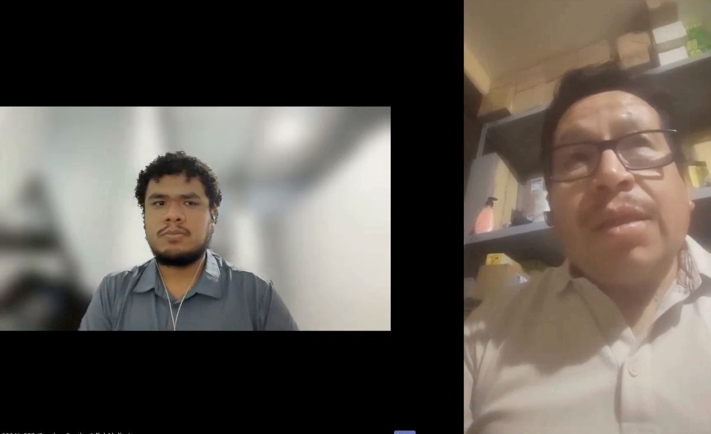
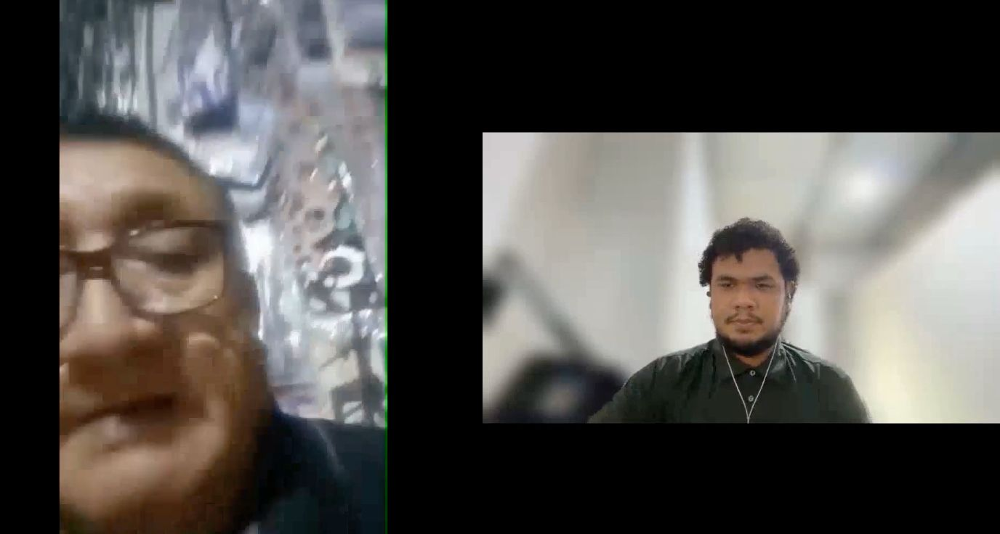
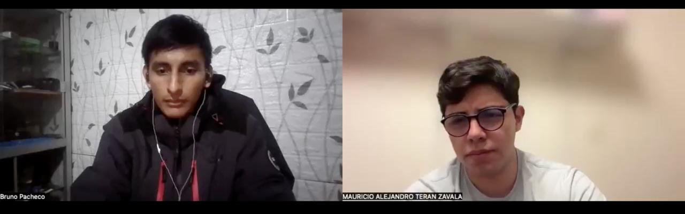
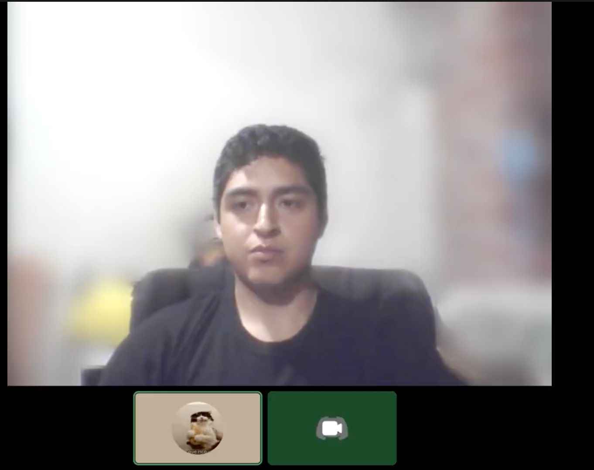

## 2.2. Entrevistas

Para que Atelier pase de ser un concepto tecnológico a una plataforma útil en el entorno automotriz, es indispensable validar nuestras hipótesis en el campo con los actores de la operativa diaria. La recolección de información mediante entrevistas directas nos permite comprender las dinámicas reales en la gestión de talleres e identificar las fricciones en los procesos de diagnóstico tradicional. En esta sección, buscamos escuchar directamente la voz de los administradores y técnicos mecánicos, asegurando que el modelo SaaS bajo el enfoque BYOD responda a sus capacidades operativas y genere un valor tangible en la fidelización de sus clientes.

### 2.2.1. *Diseño de entrevistas*

Con el propósito de obtener hallazgos comparables y estructurados, se desarrollaron guías de entrevista ajustadas al perfil de cada segmento objetivo. Más allá de recabar variables demográficas y de perfil digital para la elaboración de los arquetipos de usuario, estas herramientas buscan profundizar en los puntos de dolor operativos, los hábitos de diagnóstico mediante puerto OBD2 y la disposición a adoptar alertas preventivas en la nube. A continuación, se presentan los cuestionarios diseñados para el personal de propietarios y para el personal operativo del taller:

**Segmento 1: Personal de Gestión y Propietarios del Taller**

1.⁠ ⁠Perfil y Demografía

  - ¿Cuál es su edad, estado civil y en qué distrito reside?
  - ¿Cuál es su cargo exacto y cuánto tiempo lleva en el rubro automotriz?
  - En una palabra, ¿cómo describiría su personalidad al dirigir el negocio?
  - ¿Cuál considera que es su mayor habilidad administrativa?

2.⁠ ⁠Rutina y Entorno

  - Describa brevemente: ¿cómo es el paso a paso desde que abre el taller hasta que cierra la caja?
  - ¿Qué quejas o comentarios escucha con más frecuencia de sus clientes y de sus mecánicos?

3.⁠ ⁠Objetivos y Frustraciones

  - ¿Cuál es su mayor dolor de cabeza al momento de gestionar el inventario, los repuestos o los pagos?
  - ¿Qué meta económica o de crecimiento busca lograr con su taller este año?

4.⁠ ⁠Hábitos Digitales e Influencias

  - ¿Qué dispositivo (celular, laptop, PC) y qué navegador web usa más durante su jornada?
  - ¿Por qué canal digital prefiere comunicarse: WhatsApp, llamadas, correo o redes sociales?
  - ¿Qué marcas de repuestos o herramientas influyen más en las compras de su taller?

5.⁠ ⁠Validación de Solución

  - ¿Qué software o herramienta digital utiliza actualmente para gestionar su taller y qué es lo más complejo o frustrante de usar en ella?
  - Al comenzar su jornada laboral, ¿cuáles son los 3 datos o reportes clave del negocio que necesita revisar sí o sí para saber si el taller va bien?
  - ¿Actualmente atiende o ha intentado atender flotas corporativas? ¿Cuáles han sido las exigencias técnicas o de reporte que le han impedido cerrar esos contratos?
  - ¿Ha pagado anteriormente por algún software de gestión o diagnóstico? Si es así, ¿cuánto invirtió y por qué razones decidió mantenerlo o cancelarlo?

**Segmento 2: Personal Operativo del Taller**

1.⁠ ⁠Perfil y Demografía

  - ¿Cuál es su edad, estado civil y distrito de residencia?
  - ¿Qué nivel de estudios tiene y cuál es su cargo técnico oficial aquí?
  - ¿Cómo describiría su personalidad cuando hay mucha carga de trabajo?
  - ¿En qué especialidad técnica o herramienta se considera un experto?

2.⁠ ⁠Rutina y Entorno

  - Describa brevemente: ¿cuál es el proceso exacto desde que le asignan un auto hasta que lo entrega reparado?
  - En su entorno de trabajo, ¿qué problemas o quejas escucha frecuentemente de sus compañeros?

3.⁠ ⁠Objetivos y Frustraciones

  - ¿Cuál es la tarea que más le frustra o le quita tiempo en el día?
  - ¿Qué meta profesional, de aprendizaje o salarial le gustaría alcanzar pronto?

4.⁠ ⁠Hábitos Digitales e Influencias

  - ¿Qué marca de celular usa y cuáles son las 2 aplicaciones que más abre en el día?
  - ¿Qué canal digital usa más para comunicarse con su supervisor o colegas del taller?
  - ¿Qué marcas automotrices, de herramientas o canales sigue y respeta más?

5.⁠ ⁠Validación de Solución

  - ¿Cómo miden o registran actualmente el tiempo que toma cada reparación en el taller para evaluar su rendimiento o asignar bonificaciones?
  - ¿En qué zonas del taller suele perder la señal de internet o datos móviles mientras realiza sus diagnósticos diarios?
  - ¿De qué manera le demuestra actualmente a su supervisor el volumen de trabajo que completó al final del día o de la semana?

### 2.2.2. *Registro de entrevistas*
En esta sección presentamos los registros de las entrevistas que hicimos para cada segmento objetivo de nuestra aplicación.

**Segmento 1:**

<table>
<colgroup>
</colgroup>
<thead>
  <tr>
    <th colspan="2">Entrevista #1 </th>
  </tr>
</thead>
<tbody>
  <tr>
    <td>Nombre</td>
    <td>Jorge Antonio</td>
  </tr>
  <tr>
    <td>Apellidos</td>
    <td>Aguilar Perez</td>
  </tr>
  <tr>
    <td>Edad</td>
    <td>53 años</td>
  </tr>
  <tr>
    <td>Distrito</td>
    <td>Chorrillos</td>
  </tr>
  <tr>
    <td>Evidencia</td>
    <td>

</td>
  </tr>
  <tr>
    <td>Link</td>
    <td>
<a target="_blank"  href="https://upcedupe-my.sharepoint.com/:v:/g/personal/u20241e287_upc_edu_pe/IQBzBV6lfIhFR6y-FD7FV72HAbKSap9KCkiX4idSlbt6zHE?nav=eyJyZWZlcnJhbEluZm8iOnsicmVmZXJyYWxBcHAiOiJPbmVEcml2ZUZvckJ1c2luZXNzIiwicmVmZXJyYWxBcHBQbGF0Zm9ybSI6IldlYiIsInJlZmVycmFsTW9kZSI6InZpZXciLCJyZWZlcnJhbFZpZXciOiJNeUZpbGVzTGlua0NvcHkifX0&e=rbGLmS" title="Title">Microsoft Stream
</td>
  </tr>
  <tr>
    <td>Duracion </td>
    <td>0:20 min - 13:39 min</td>
  </tr>
  <tr>
    <td>Resumen</td>
    <td>
      La entrevista se realizó a Jorge Aguilar, un técnico mecánico de 53 años con aproximadamente 35 años de experiencia en el rubro automotriz. Jorge ejerce como dueño y administrador de su propia empresa, gestionando de manera independiente tanto la parte operativa como la administrativa del negocio. Destaca como su principal habilidad administrativa la captación y fidelización de clientes mediante el buen trato, ofreciendo recomendaciones técnicas honestas sobre mantenimiento preventivo y selección de materiales para evitar inconvenientes futuros en sus unidades. A diferencia de un taller tradicional con sede fija, su rutina actual se centra en el trabajo de campo de manera itinerante (tipo delivery), desplazándose directamente hacia la ubicación de los equipos y maquinaria estacionaria (línea amarilla) para realizar los servicios mecánicos.
    </td>
  </tr>
</tbody>
</table>

<table>
<colgroup>
</colgroup>
<thead>
  <tr>
    <th colspan="2">Entrevista #2 </th>
  </tr>
</thead>
<tbody>
  <tr>
    <td>Nombre</td>
    <td>Marcelo Alejandro</td>
  </tr>
  <tr>
    <td>Apellidos</td>
    <td>Silva Ramos</td>
  </tr>
  <tr>
    <td>Edad</td>
    <td>63 años</td>
  </tr>
  <tr>
    <td>Distrito</td>
    <td>Chorrillos</td>
  </tr>
  <tr>
    <td>Evidencia</td>
    <td>

</td>
  </tr>
  <tr>
    <td>Link</td>
    <td>
<a target="_blank"  href="https://upcedupe-my.sharepoint.com/personal/u20241e287_upc_edu_pe/_layouts/15/stream.aspx?id=%2Fpersonal%2Fu20241e287%5Fupc%5Fedu%5Fpe%2FDocuments%2FVideos%2Fupc%2Dpre%2D202602%2D1acc0238%2D4951%2Dandeva%2Dneedfinding%2Dav1%2Emp4&referrer=StreamWebApp%2EWeb&referrerScenario=AddressBarCopied%2Eview%2Ecb19ca18%2Db619%2D4850%2D984a%2De8207a0cf93b" title="Title">Microsoft Stream
</td>
  </tr>
  <tr>
    <td>Duracion </td>
    <td>0:10 min - 10:13 min</td>
  </tr>
  <tr>
    <td>Resumen</td>
    <td>
      La entrevista se realizó a Marcelo Ramos, un comerciante y propietario de taller de 63 años, divorciado, quien cuenta con más de 30 años de trayectoria en el rubro automotriz. Describe su estilo de gestión comercial bajo los principios de orden, responsabilidad y puntualidad, destacando este último valor como su principal fortaleza administrativa. Su modelo de operación combina la venta directa al público con la atención de taller, trabajando predominantemente con una cartera de clientes frecuentes y pedidos programados. Su rutina se enfoca en mantener estándares de calidad y precisión técnica para minimizar quejas de los usuarios. Respecto a sus fricciones operativas, señala que su mayor causa de estrés ocurre ante fallas en las máquinas o herramientas del taller (como el daño en matrices), lo cual genera retrasos de hasta una semana en la atención y cuellos de botella cuando se acumulan los pedidos. Finalmente, en cuanto a sus proyecciones de crecimiento, menciona su interés en expandir sus operaciones mediante el rubro de importaciones, negocio en el cual también suma años de experiencia.
    </td>
  </tr>
</tbody>
</table>

**Segmento 2:**

<table>
<colgroup>
</colgroup>
<thead>
  <tr>
    <th colspan="2">Entrevista #1 </th>
  </tr>
</thead>
<tbody>
  <tr>
    <td>Nombre</td>
    <td>César Nikolay</td>
  </tr>
  <tr>
    <td>Apellidos</td>
    <td>Montero Vega</td>
  </tr>
  <tr>
    <td>Edad</td>
    <td>23 años</td>
  </tr>
  <tr>
    <td>Distrito</td>
    <td>Chorrillos</td>
  </tr>
  <tr>
    <td>Evidencia</td>
    <td>

</td>
  </tr>
  <tr>
    <td>Link</td>
    <td>
<a target="_blank"  href="https://upcedupe-my.sharepoint.com/:v:/g/personal/u202411243_upc_edu_pe/IQDDZApqCDKDTrWGYH8oHZyrARNQnI4CuM2GNhY4k2TQz9s?nav=eyJyZWZlcnJhbEluZm8iOnsicmVmZXJyYWxBcHAiOiJPbmVEcml2ZUZvckJ1c2luZXNzIiwicmVmZXJyYWxBcHBQbGF0Zm9ybSI6IldlYiIsInJlZmVycmFsTW9kZSI6InZpZXciLCJyZWZlcnJhbFZpZXciOiJNeUZpbGVzTGlua0NvcHkifX0&e=yP3vPg" title="Title">Microsoft Stream
</td>
  </tr>
  <tr>
    <td>Duracion </td>
    <td>0:40 min - 9:57 min</td>
  </tr>
  <tr>
    <td>Resumen</td>
    <td>
		   La entrevista se realizó a Bruno Pacheco, un técnico egresado en mecánica automotriz de 25 años, soltero y residente en el distrito de Chorrillos. Bruno ocupa el cargo oficial de Técnico Mecánico Especialista en Diagnóstico y Mantenimiento; ante situaciones de alta presión laboral procura mantener la calma y actuar de forma metódica para prevenir errores. Destaca como su principal fortaleza el diagnóstico electrónico, la lectura de datos de inyección y el manejo fluido de escáneres multimarca para la interpretación de códigos de falla (DTC). Su proceso operativo inicia con la recepción de la orden de trabajo física, inspección visual, lectura con escáner, solicitud de repuestos al almacén, ejecución de la reparación, prueba de ruta, borrado de códigos y la firma final de la orden. En cuanto a las fricciones del entorno, reporta desorganización en la gestión de repuestos y pérdida de mensajes en grupos informales de WhatsApp, señalando que su mayor frustración son los "tiempos muertos" con vehículos desarmados en el elevador a la espera de aprobaciones de presupuestos o repuestos faltantes, lo cual perjudica directamente su rendimiento diario. En el ámbito profesional, busca llevar cursos de mecatrónica y diagnóstico de vehículos híbridos o eléctricos a corto plazo, con la meta a largo plazo de dirigir un taller o administrar un centro de servicio propio. Finalmente, en el aspecto digital, utiliza un smartphone Android (Samsung), siendo WhatsApp, Google y YouTube sus aplicaciones más consultadas para coordinaciones laborales y búsqueda de diagramas técnicos.
    </td>
  </tr>
</tbody>
</table>

<table>
<colgroup>
</colgroup>
<thead>
  <tr>
    <th colspan="2">Entrevista #2 </th>
  </tr>
</thead>
<tbody>
  <tr>
    <td>Nombre</td>
    <td>Bruno Marcelo</td>
  </tr>
  <tr>
    <td>Apellidos</td>
    <td>Pacheco Díaz</td>
  </tr>
  <tr>
    <td>Edad</td>
    <td>25 años</td>
  </tr>
  <tr>
    <td>Distrito</td>
    <td>Chorrillos</td>
  </tr>
  <tr>
    <td>Evidencia</td>
    <td>

</td>
  </tr>
  <tr>
    <td>Link</td>
    <td>
<a target="_blank"  href="https://upcedupe-my.sharepoint.com/:v:/g/personal/u202417423_upc_edu_pe/IQBIV6T1U2oZTaq2yZbx-_zkAfIJbJkGq94jHYQDCwA84tc?nav=eyJyZWZlcnJhbEluZm8iOnsicmVmZXJyYWxBcHAiOiJPbmVEcml2ZUZvckJ1c2luZXNzIiwicmVmZXJyYWxBcHBQbGF0Zm9ybSI6IldlYiIsInJlZmVycmFsTW9kZSI6InZpZXciLCJyZWZlcnJhbFZpZXciOiJNeUZpbGVzTGlua0NvcHkifX0&e=fTgJpb" title="Title">Microsoft Stream
</td>
  </tr>
  <tr>
    <td>Duracion </td>
    <td>0:14 min - 6:22 min</td>
  </tr>
  <tr>
    <td>Resumen</td>
    <td>
      La entrevista se realizó a Bruno Pacheco, un técnico egresado en mecánica automotriz de 25 años, soltero y residente en el distrito de Chorrillos. Bruno ocupa el cargo oficial de Técnico Mecánico Especialista en Diagnóstico y Mantenimiento; ante situaciones de alta presión laboral procura mantener la calma y actuar de forma metódica para prevenir errores. Destaca como su principal fortaleza el diagnóstico electrónico, la lectura de datos de inyección y el manejo fluido de escáneres multimarca para la interpretación de códigos de falla (DTC). Su proceso operativo inicia con la recepción de la orden de trabajo física, inspección visual, lectura con escáner, solicitud de repuestos al almacén, ejecución de la reparación, prueba de ruta, borrado de códigos y la firma final de la orden. En cuanto a las fricciones del entorno, reporta desorganización en la gestión de repuestos y pérdida de mensajes en grupos informales de WhatsApp, señalando que su mayor frustración son los "tiempos muertos" con vehículos desarmados en el elevador a la espera de aprobaciones de presupuestos o repuestos faltantes, lo cual perjudica directamente su rendimiento diario. En el ámbito profesional, busca llevar cursos de mecatrónica y diagnóstico de vehículos híbridos o eléctricos a corto plazo, con la meta a largo plazo de dirigir un taller o administrar un centro de servicio propio. Finalmente, en el aspecto digital, utiliza un smartphone Android (Samsung), siendo WhatsApp, Google y YouTube sus aplicaciones más consultadas para coordinaciones laborales y búsqueda de diagramas técnicos.
    </td>
  </tr>
</tbody>
</table>

<table>
<colgroup>
</colgroup>
<thead>
  <tr>
    <th colspan="2">Entrevista #3 </th>
  </tr>
</thead>
<tbody>
  <tr>
    <td>Nombre</td>
    <td>Angie Karol</td>
  </tr>
  <tr>
    <td>Apellidos</td>
    <td>Choque Pura</td>
  </tr>
  <tr>
    <td>Edad</td>
    <td>25 años</td>
  </tr>
  <tr>
    <td>Distrito</td>
    <td>Santiago de Surco</td>
  </tr>
  <tr>
    <td>Evidencia</td>
    <td>

</td>
  </tr>
  <tr>
    <td>Link</td>
    <td>
<a target="_blank"  href="https://upcedupe-my.sharepoint.com/:v:/g/personal/u202417423_upc_edu_pe/IQAQzuYv24YaQ4rr3KBVy_h9ATiqMfjgKCKbJEliJxw2-3A?nav=eyJyZWZlcnJhbEluZm8iOnsicmVmZXJyYWxBcHAiOiJPbmVEcml2ZUZvckJ1c2luZXNzIiwicmVmZXJyYWxBcHBQbGF0Zm9ybSI6IldlYiIsInJlZmVycmFsTW9kZSI6InZpZXciLCJyZWZlcnJhbFZpZXciOiJNeUZpbGVzTGlua0NvcHkifX0&e=mQzfFd" title="Title">Microsoft Stream
</td>
  </tr>
  <tr>
    <td>Duracion </td>
    <td>0:30 min - 14:56 min</td>
  </tr>
  <tr>
    <td>Resumen</td>
    <td>
		   La entrevista se realizó a Angie, una ingeniera mecatrónica de 25 años, soltera y residente en el distrito de Santiago de Surco. Cuenta con 2 años de experiencia laboral desempeñándose en el cargo técnico de Diagnóstico y Mantenimiento Automotriz; ante momentos de alta carga de trabajo destaca por ser una persona tranquila, enfocada en resolver las fallas paso a paso para evitar errores operativos como la rotura de sensores o un mal ensamblaje de componentes. Cuenta con especialización en mecánica automotriz y vehículos autónomos, orientando sus conocimientos hacia el diagnóstico electrónico, la lectura e interpretación de códigos de falla (DTC), inyección electrónica y el manejo de escáneres multimarca. Su flujo de trabajo inicia cuando el jefe de taller le entrega la orden de trabajo física con las observaciones del cliente, tras lo cual traslada el vehículo a la zona de mantenimiento, conecta el escáner para evaluar las computadoras del auto y efectúa la inspección visual correspondiente.
    </td>
  </tr>
</tbody>
</table>

### 2.2.3. *Análisis de entrevistas*

En esta sección se sintetizan y consolidan los hallazgos de las entrevistas en profundidad aplicadas a los segmentos objetivo de Atelier. Mediante un análisis porcentual y paramétrico de las respuestas, se identifican las características objetivas (demografía, herramientas, hábitos digitales) y subjetivas (dolores, motivaciones, dinámicas de trabajo) predominantes. Estos datos sirven como sustento estadístico directo para la validación de hipótesis y la construcción rigurosa de los arquetipos de usuario (*User Personas*).

**Análisis del Segmento 1: Personal de Gestión y Propietarios del Taller**

El análisis de este segmento consolida la información recopilada en la entrevista a **Jorge Aguilar** (Dueño y Administrador), representando la categoría de talleres independientes y servicios mecánicos itinerantes.

**Consolidado Estadístico y Tendencias del Segmento 1**

| Variable / Categoría | Indicador / Característica Dominante | Porcentaje ($N=1$) | Sustento Cualitativo en Entrevistas |
| :--- | :--- | :---: | :--- |
| **Rango de Edad** | 50+ años (53 años) | **100%** | Jorge Aguilar registra 53 años de edad. |
| **Experiencia en el Rubro** | Mayor a 30 años | **100%** | Acumula 35 años de trayectoria operativa y administrativa. |
| **Modelo Operativo** | Servicio itinerante / Campo (*delivery*) | **100%** | Opera directamente en campo donde se ubican las unidades o máquinas. |
| **Rol Dual** | Administrador y Técnico a la vez | **100%** | Gestiona los movimientos administrativos y ejecuta la labor operativa. |
| **Fortaleza Comercial** | Trato directo y recomendación preventiva | **100%** | Asesora de manera honesta para evitar inconvenientes futuros en las unidades. |
| **Canales Digitales** | Comunicación directa (Llamadas / WhatsApp) | **100%** | Mantiene contacto personalizado con los dueños de las unidades. |

*   **Características Objetivas:** El perfil dominante corresponde a profesionales de madurez avanzada ($100\%$ mayores de 50 años) con amplia trayectoria práctica ($100\%$ con $+30$ años de experiencia). Presentan una estructura organizativa unipersonal o altamente centralizada donde el dueño asume tanto las cobranzas como las reparaciones.
*   **Características Subjetivas:** Existe un alto sentido de responsabilidad técnica enfocado en la fidelización mediante el diagnóstico transparente. La principal fricción subjetiva es la sobrecarga por la gestión dual y la resistencia de los clientes a aplicar mantenimientos preventivos antes de que ocurra una falla catastrófica.

**Análisis del Segmento 2: Personal Operativo del Taller**

Este análisis consolida los datos de la muestra de técnicos y especialistas entrevistados: **Nicolai** (23 años), **Bruno Pacheco** (25 años) y **Angie** (25 años).

**Consolidado Estadístico y Tendencias del Segmento 2**

| Variable / Categoría | Indicador / Característica Dominante | Porcentaje ($N=3$) | Sustento Cualitativo en Entrevistas |
| :--- | :--- | :---: | :--- |
| **Rango de Edad** | 23 a 25 años | **100%** | Muestra joven: Nicolay (23), Bruno (25), Angie (25). |
| **Estado Civil** | Solteros | **100%** | El 100% de los entrevistados declara estado civil soltero. |
| **Formación Técnica** | Egresados de Carrera Técnica / Mecatrónica | **100%** | Titulados/egresados en Mecánica Automotriz y Mecatrónica. |
| **Especialidad Principal** | Diagnóstico Electrónico y Escáner OBD2 | **100%** | Todos señalan la lectura de datos OBD2 e inyección como su fuerte. |
| **Flujo de Trabajo** | Basado en Orden de Trabajo Física | **100%** | Reciben hoja de papel en recepción antes de evaluar el auto en bahía. |
| **Frustración Principal** | "Tiempos muertos" y desorganización | **100%** | Inactividad por falta de repuestos o retrasos en aprobación de presupuestos. |
| **Canal de Coordinación** | WhatsApp informal (Grupos) | **100%** | Uso de chats grupales donde la información técnica suele traspapelarse. |
| **Respaldos de Trabajo** | Evidencia fotográfica en celular personal | **66.7%** | Nicolay y Bruno toman fotos/videos en su celular como prueba de cumplimiento. |
| **Infraestructura / Señal** | Pérdida de datos en fosos / zonas cerradas | **66.7%** | Reportan desconexión en fosos de inspección y bahías con estructuras gruesas. |
| **Sistemas Operativos** | Preferencia/Uso de Android | **100%** | Todos operan con smartphones Android (Xiaomi, Samsung). |

*   **Características Objetivas:** Segmento joven ($100\%$ entre 23 y 25 años) con formación técnica superior o universitaria en mecatrónica. Tienen un dominio fluido de smartphones ($100\%$ Android) y herramientas de diagnóstico computarizado. Su rutina depende obligatoriamente del papel para iniciar una orden y de escáneres multimarca para la lectura de códigos de falla (DTC).

*   **Características Subjetivas:**
    *   *Actitud ante el estrés ($100\%$):* Buscan mantener la serenidad y actuar de forma metódica/paso a paso para evitar romper componentes o sensores.
    *   *Puntos de Dolor ($100\%$):* Rechazo absoluto a los "tiempos muertos" (espera de repuestos o aprobación de clientes) porque perjudican directamente la medición de su rendimiento diario.
    *   *Metas Profesionales ($100\%$):* Deseo de especialización continua (mecatrónica, híbridos/eléctricos) y proyección a futuro hacia la jefatura de taller o administración de un centro de servicio propio.

\newpage