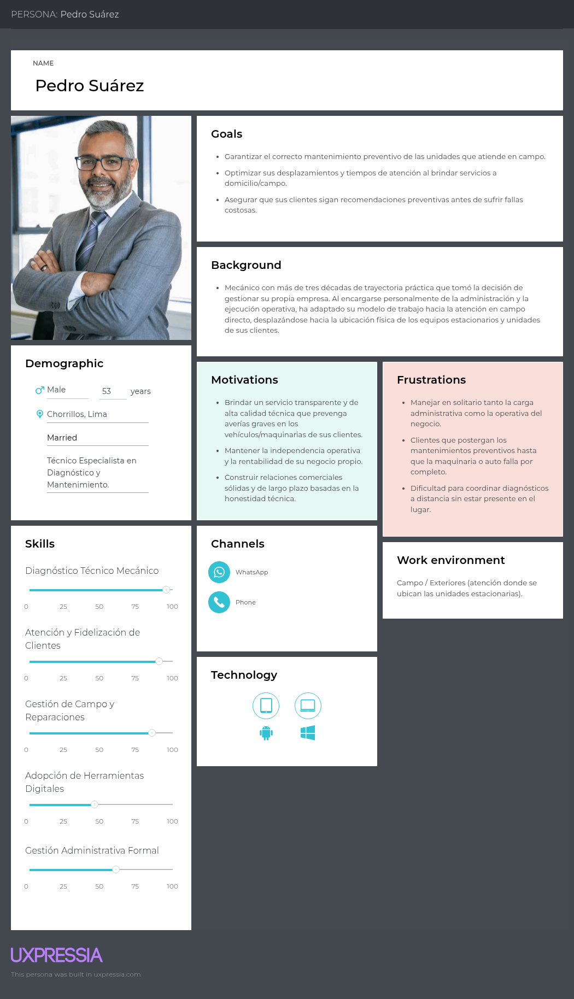
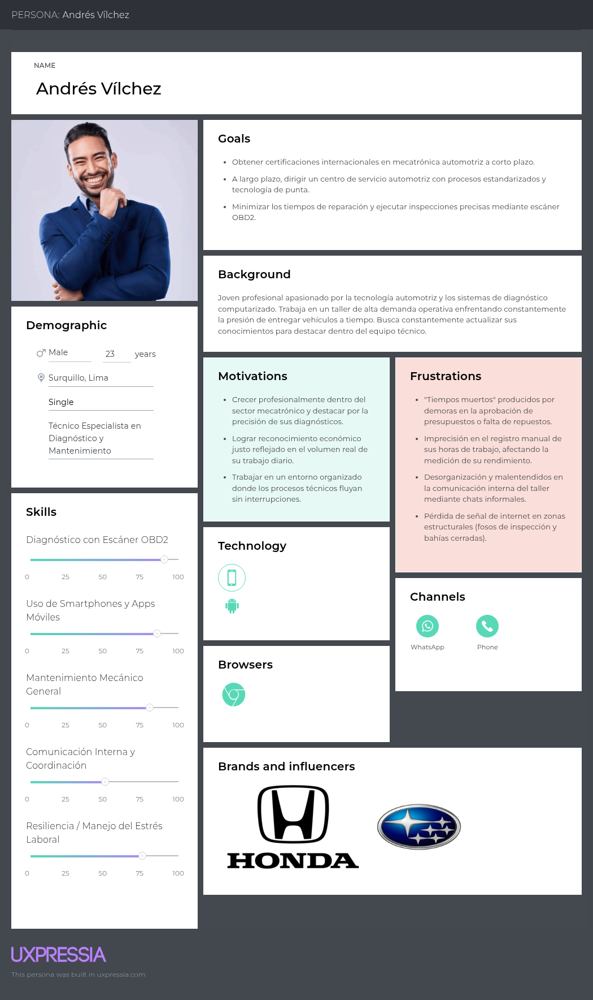

## 2.3. *Needfinding*

### 2.3.1. *User Personas*

En esta sección se describen dos User Personas que representan los segmentos clave a los que está dirigida la plataforma Atelier: los Propietarios y Administradores de Talleres, así como el Personal Operativo integrado por Técnicos y Mecánicos. A través de estos perfiles se profundiza en sus necesidades, motivaciones, frustraciones y hábitos digitales, con la finalidad de diseñar una solución bajo el modelo Software as a Service (SaaS) y principio Bring Your Own Device (BYOD) que optimice la gestión del negocio, reduzca los tiempos muertos y facilite el monitoreo preventivo mediante la lectura de datos OBD2.

**Segmento 1**

El User Persona de Jorge Aguilar revela la brecha estructural entre una extensa experiencia técnica y la exigencia de coordinar de forma integral las operaciones de un negocio independiente. A pesar de contar con más de 35 años de trayectoria y una alta capacidad para fidelizar clientes mediante el diagnóstico honesto en servicios de campo, su eficiencia operativa se ve limitada por la carga de gestionar la administración en solitario. Para un perfil que valora la transparencia y el mantenimiento preventivo por encima de la reparación reactiva, la falta de herramientas que automaticen el seguimiento a distancia representa un obstáculo directo a su rentabilidad. En última instancia, la sostenibilidad del negocio de Jorge depende de adoptar una plataforma ligera que centralice la comunicación con sus clientes y le brinde visibilidad constante sobre el estado de las unidades sin sobrecargarlo de tareas administrativas.

**Segmento 2**

Por otro lado, el User Persona de Nicolay evidencia la fricción constante entre el dominio del diagnóstico computarizado moderno y la presencia de flujos de trabajo tradicionales en la tallería. Aunque posee una sólida formación en sistemas de inyección electrónica y un dominio fluido del entorno digital Android, su productividad diaria se trunca por "tiempos muertos" derivados de la desorganización logística, canales de comunicación informales y registros de tiempos de reparación imprecisos. Para un técnico que busca destacar en mecatrónica automotriz y validar con precisión el volumen de su trabajo diario, depender de órdenes en papel e improvisar respaldos fotográficos en su celular personal genera un desgaste innecesario. Su éxito y crecimiento profesional dependen de integrarse a un entorno digitalizado que funcione sin interrupciones —incluso en fosos sin señal— y que transforme los datos de los escáneres OBD2 en indicadores de rendimiento claros y automatizados.

### 2.3.2. *User Task Matrix*

En esta sección se desarrolla el User Task Matrix, en el cual identifica las principales actividades que realizan los User Personas: los Propietarios y Administradores de Talleres y el Personal Operativo integrado por Técnicos y Mecánicos.

Estas tareas corresponden a acciones habituales dentro de su dinámica laboral, necesarias para alcanzar sus objetivos, sin depender necesariamente de una solución digital. Este análisis nos permite comprender cómo trabajan actualmente, así como detectar ineficiencias y oportunidades donde la plataforma puede generar valor.

**Segmento 1**

|                                             Task   | Frequency | Importance |
|----------------------------------------------------|-----------|------------|
| Atención, recepción de clientes y diagnóstico      | Daily     | Critical   |
| Elaboración de presupuestos MRO y cotización       | Daily     | High       |
| Asignación de vehículos a bahías y tareas          | Daily     | High       |
| Control de inventario y solicitud de repuestos     | Weekly    | Critical   |
| Supervisión del estado y avance de reparaciones    | Constant  | High       |
| Facturación, cobranza y cuadre de caja final       | Daily     | Critical   |
| Seguimiento a clientes para alertas preventivas    | Occasionally| Medium   |

**Análisis**

- Foco en la Operatividad Centralizada: La alta frecuencia e importancia crítica de tareas como la facturación, los presupuestos y la supervisión del avance confirman que el administrador asume casi la totalidad de la carga administrativa, convirtiéndolo en el principal cuello de botella.

- Conflicto de Eficiencia: Existe una contradicción entre su mayor habilidad (fidelizar al cliente y brindar diagnóstico experto) y la tarea manual de gestionar inventarios o cuadrar caja; estas últimas consumen recursos desproporcionados que lo alejan de la bahía de servicio.

- Prioridad Estratégica: La matriz revela que automatizar el control de repuestos (FIFO) y el cumplimiento tributario (SUNAT) es vital. Delegar esto a un sistema SaaS le liberará horas para enfocarse en el diagnóstico preventivo y la expansión comercial.

**Segmento 2**

|                                             Task   | Frequency | Importance |
|----------------------------------------------------|-----------|------------|
| Inspección física y lectura de códigos (OBD-II)    | Daily     | Critical   |
| Ejecución de reparaciones y tareas mecánicas       | Daily     | Critical   |
| Solicitud y recojo de repuestos en el almacén      | Constant  | High       |
| Espera por aprobación de presupuestos de clientes  | Constant  | High       |
| Registro de evidencia fotográfica de las piezas    | Daily     | Medium     |
| Apunte manual de horas trabajadas y cierre de OT   | Daily     | High       |
| Búsqueda de diagramas o manuales en internet       | Occasionally| Medium   |

**Análisis**

- El problema de los "Tiempos Muertos": Las tareas con frecuencia Constante e importancia Alta vinculadas a la logística (solicitar repuestos y esperar aprobaciones) son las que mantienen al técnico inactivo. Automatizar estas aprobaciones y el inventario impactará directamente en su rendimiento diario.

- Desconexión en el Registro Probatorio: El hecho de que la toma de fotos y el registro de horas sean tareas "Altas/Medias" pero se hagan manualmente o con el celular personal revela un vacío tecnológico. Esta es una funcionalidad clave que justificará el uso de la aplicación móvil en la bahía.

- Necesidad de Integración en la Bahía: Las tareas críticas ocurren lejos de un escritorio, muchas veces en zonas de baja cobertura. Esto reafirma la urgencia de proveer una aplicación móvil de uso rudo con arquitectura Offline-First que no interrumpa el flujo del técnico.

**Coincidencias y Diferencias entre Segmentos**

- Al contrastar ambos perfiles, la principal **coincidencia** radica en la gestión de repuestos y tiempos: mientras el Segmento 1 los controla para asegurar la rentabilidad (Weekly/Critical), el Segmento 2 depende de ellos para ejecutar su labor diaria (Constant/High). Por otro lado, la principal **diferencia** es la división operativa: el administrador absorbe el 100% del contacto comercial y facturación, mientras que el mecánico está aislado en la ejecución técnica y el diagnóstico de campo.

### 2.3.3. *User Journey Mapping*

### 2.3.4. *Empathy Mapping*

### 2.3.5. *Big Picture EventStorming*

Como parte fundamental de la fase de exploración y comprensión de necesidades (*Needfinding*), el equipo llevó a cabo un taller colaborativo de **Big Picture EventStorming**. Esta dinámica, concebida por Alberto Brandolini, tuvo como propósito construir un modelo mental compartido y sinérgico entre todos los integrantes sobre la totalidad del ciclo de vida operativo del ecosistema **Atelier**, identificando las interacciones entre los diferentes actores, los puntos de fricción (*hotspots*), los cuellos de botella en la gestión de talleres y las oportunidades para la automatización mediante telemetría IoT.

A diferencia del modelado de diseño técnico futuro, el taller de *Big Picture EventStorming* captura la realidad operativa actual (*As-Is*) del negocio y del servicio automotriz: los hábitos reactivos de los conductores que postergan revisiones preventivas, las fallas mecánicas imprevistas que inmovilizan vehículos, la gestión manual de citas y órdenes físicas en papel, las fricciones al solicitar presupuestos por canales informales y los cuellos de botella en la liquidación y entrega. Este levantamiento transparente del escenario actual permite identificar los puntos críticos de dolor donde el software debe generar valor inmediato.

El resultado de esta exploración integral en la herramienta colaborativa Miro se presenta en dos dimensiones complementarias: la recolección exhaustiva del flujo de eventos (@fig:big-picture-flujo-eventos) y la estructuración por carriles de actores, etapas del proceso y puntos críticos del servicio (@fig:big-picture-actores-puntos-criticos).

{#fig:big-picture-flujo-eventos}

*Nota.* Vista de la recolección y secuencia de eventos de dominio durante el taller de Big Picture EventStorming en Miro.

{#fig:big-picture-actores-puntos-criticos}

*Nota.* Vista estructurada por carriles de actores (Conductor, Asesor de Servicio, Mecánico / Jefe de Taller, Administrador), etapas operativas y puntos críticos de decisión en Miro. Se puede acceder al tablero colaborativo interactivo mediante el siguiente enlace: [Tablero de Miro: Big Picture EventStorming](https://miro.com/app/board/uXjVHq7YYWw=/?share_link_id=20364641152).

El recorrido del dominio modelado en el Big Picture abarca los siguientes momentos clave de la operativa automotriz actual:

1. **Aprovisionamiento y Configuración:** Registro inicial del taller mecánico, definición de sucursales, alta de bahías de servicio y configuración de planes de suscripción.
2. **Monitoreo Telemático Continuo:** Ingesta en tiempo real de flujos de datos vehiculares provenientes de escáneres OBD-II y evaluación analítica de umbrales críticos de temperatura, presión y códigos DTC.
3. **Recepción e Inspección Diagnóstica:** Generación de citas, ingreso del vehículo a patio, inspección visual con evidencia fotográfica y formulación del presupuesto de mantenimiento (MRO).
4. **Aprobación Digital y Asignación Operativa:** Validación del presupuesto por parte del cliente desde la app móvil y distribución de tareas específicas a los técnicos mecánicos según especialidad.
5. **Ejecución Mecánica y Abastecimiento FIFO:** Registro del avance de reparación en patio móvil y descarga contable de repuestos y fluidos bajo el método de Primeras Entradas, Primeras Salidas (FIFO).
6. **Liquidación y Cumplimiento Tributario:** Consolidación de costos de mano de obra e insumos, emisión electrónica de Boletas o Facturas UBL 2.1 validadas ante SUNAT.
7. **Entrega y Seguimiento Predictivo:** Devolución del vehículo reparado al cliente, solicitud de retroalimentación de servicio y reactivación del monitoreo telemático predictivo.

### 2.3.6. *Ubiquitous Language*

Uno de los aportes más trascendentales de *Domain-Driven Design* es la consolidación de un **Lenguaje Ubicuo** (*Ubiquitous Language*). Este lenguaje consiste en un vocabulario compartido, riguroso y sin ambigüedades, adoptado de manera unánime tanto por los expertos del dominio automotriz (mecánicos, administradores de taller) como por los ingenieros de software, analistas y diseñadores de UX.

El empleo de un lenguaje ubicuo erradica las fallas de comunicación y la sobrecarga de traducción en el código fuente, garantizando que los nombres de las clases, métodos, eventos, comandos y tablas de base de datos reflejen exactamente la terminología del negocio. La @tbl:ubiquitous-language recopila los términos esenciales del ecosistema Atelier, su definición formal y el ámbito de aplicación correspondiente:

| Término en el Dominio | Definición Formal y Regla de Negocio Asociada | Ámbito / Contexto |
| :--- | :--- | :---: |
| Atelier Workshop | Plataforma digital orientada a la gestión B2B de talleres automotrices, disponible en WebApp (escritorio para gestión) y Mobile (patio para mecánicos). | Transversal B2B |
| Atelier Driver | Aplicación móvil orientada a clientes particulares y administradores de flotas para seguimiento telemático, aprobación de presupuestos y citas. | Transversal B2C |
| Orden de Trabajo (OT) | Documento y raíz de agregado que centraliza la ejecución técnica, evidencias fotográficas, tareas y consumo de insumos de una intervención. | Workshop Operation |
| Tarea MRO | Unidad atómica de trabajo mecánico asignada a un técnico específico dentro de una Orden de Trabajo, con seguimiento de estados y horas hombre. | Workshop Operation |
| Presupuesto MRO | Propuesta económica preliminar estructurada tras el diagnóstico que detalla costos de mano de obra y repuestos para aprobación del cliente. | Workshop Operation |
| Telemetría OBD-II | Flujo continuo de parámetros vehiculares normalizados (velocidad, RPM, temperatura) capturados desde el puerto de diagnóstico a bordo del motor. | IoT Telemetry |
| DTC (Diagnostic Trouble Code) | Código estandarizado alfanumérico generado por la ECU del vehículo para señalar una falla específica en alguno de sus subsistemas mecánicos. | IoT Telemetry |
| Lote de Inventario (Batch) | Conjunto homogéneo de repuestos o insumos adquiridos en una misma fecha y costo de compra, con stock físico y número de factura asociado. | Inventory |
| Método FIFO | Regla contable estricta de Primeras Entradas, Primeras Salidas donde los repuestos se descargan siempre del lote más antiguo disponible. | Inventory |
| Marcación por Geocerca (Geofence Clock-in) | Registro y validación satelital que certifica la presencia física del técnico dentro de las instalaciones del taller automotriz al momento de registrar su asistencia laboral. | Human Resources |
| Comprobante Electrónico (CPE) | Documento tributario formal (Boleta o Factura) emitido bajo el estándar UBL 2.1 ante SUNAT mediante la integración con Nubefact. | Invoicing |
| Tenant (Inquilino) | Instancia lógica aislada correspondiente a una empresa o taller automotriz que garantiza privacidad y confidencialidad multi-tenant absoluta. | IAM & Tenancy |
| Transactional Outbox | Patrón arquitectónico de persistencia transaccional que asegura la entrega garantizada y asíncrona de eventos de dominio intermodulares. | Shared / Plataforma |
: Glosario de Lenguaje Ubicuo del Ecosistema Atelier {#tbl:ubiquitous-language}

*Nota.* Tabla de terminología canónica elaborada por el equipo para alinear la comunicación técnica y de negocio.

\newpage